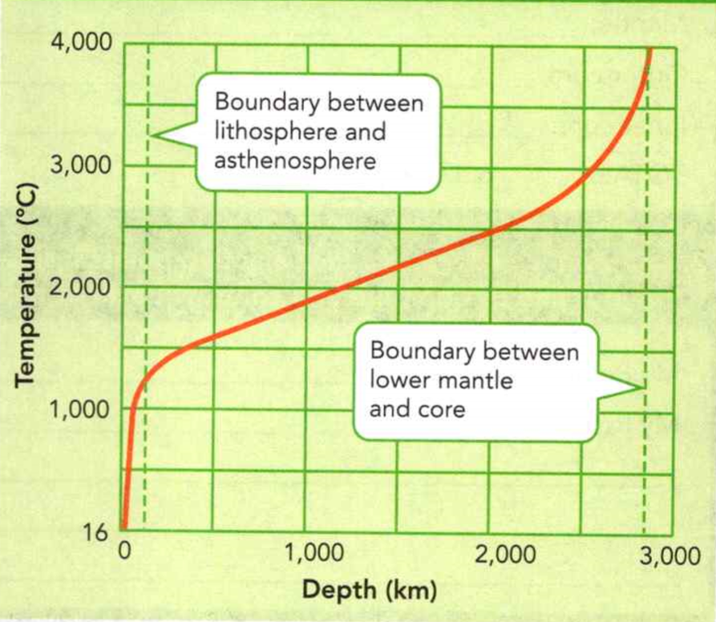

### Earth Science

## Geology
https://en.wikibooks.org/wiki/High_School_Earth_Science

## Introducing Earth


A **force** is a natural power that acts on an object.

**Gravity** is the force that makes objects fall toward Earth's center.

A **particle** is a very small fragment of a much larger object.


**Complete the tasks below.**

1. On a field trip, Paula sees that beach cliffs near the sea have worn away.
"Where do the cliffs go?" she asks. Her teacher says, "The cliffs are exposed to
natural forces all year. The harsh weather breaks the cliffs into pieces.
Gravity causes the pieces to fall to the sea. Waves then shape the pieces into
small particles, which wash away."" What forces change the beach cliffs each
year?

2. The (destruction/destructive) winds of a hurricane can be very dangerous.


### Chapter Preview

- system
- energy
- atmosphere
- geosphere 
- hydrosphere 
- biosphere 
- constructive force 
- destructive force
- seismic wave
- pressure
- crust
- basalt
- granite
- mantle
- lithosphere
- asthenosphere
- outer core
- inner core
- radiation 
- convection 
- conduction 
- density 
- convection current
- topography
- elevation
- relief 
- landform
- plain
- mountain
- mountain range
- plateau
- landform region
- globe
- map
- map projection
- symbol
- key
- scale
- degree
- equator
- hemisphere
- prime meridian
- latitude
- longitude
- topographic map
- contour line
- contour interval
- index contour

### The Earth System
- What Are the Main Parts of the Earth System?
- How Do Constructive and Destructive Forces Change Earth?

**Complete the tasks below.**

1. When I visited the Genesee River in New York, I only saw 20 miles, but the
river is over 150 miles long! I saw the end of the river where it empties into
Lake Ontario. The most beautiful thing I saw was a waterfall tumbling into the
river. Parts of the river were formed by the last ice age. Chunks of ice helped
carve out the river's path along with years of erosion. This made the canyon
wide and deep, but not too deep. I wanted to see more, but was told that the
river is too shallow for boats.
a) How has the Genesee River changed the landscape along its banks?
b) What else would you like to learn about the Genesee River?

### What Are the Main Parts of the Earth System?

The Grand Canyon is made up of different parts. Rock forms the canyon walls.
Water flows through the canyon in the form of a river, which carves away the
rock. Animals such as deer drink the river's water. And air fills the canyon,
allowing the animals to breathe. All these parts work together. So the
environment of the Grand Canyon can be thought of as a system. A **system** is a
group of parts that work together as a whole. Figure 1 shows how air, water,
rock, and life work together in another part of Earth.

  <figure>
    
    <figcaption>Figure 1. The many parts of the Earth system all work together.</figcaption>
  </figure>

**Complete the tasks below.**

1. The many parts of the Earth system all work together. Look at the photograph
in Figure 1. Choose one part of the Earth system-rock, water, air, or life-and
describe how the other parts might be affected if the first part were removed.


### Earth as a System 

The Earth system involves a constant flow of matter through
different parts. For example, you may know that in the water cycle, water
evaporates from the ocean, rises into the atmosphere, and then falls from the
sky as rain. The rainwater then flows into and over Earth, and then back into
the ocean.

You might be surprised to learn that rock, too, cycles through the Earth system.
For example, new rock can form from molten material inside Earth called magma.
This material can rise to the surface and harden on land to form new rock. The
new rock can then erode into small pieces. The pieces can be washed into the
ocean, where they may sink to the bottom as small particles, or sediment. If
enough of the small particles collect, the weight of the sediment can crush all
the particles together. The particles can then be cemented together to form new
rock. The flow of rock through the Earth system is called the rock cycle.

The constant flow, or cycling, of matter through the Earth system is driven by
energy. **Energy** is the ability to do work. The energy that drives the Earth
system has two main sources: heat from the sun and heat flowing out of Earth as
it cools.

### Parts of the Earth System 

Earth contains air, water, land, and life. Each of these parts forms its own
part, or "sphere." **The Earth system has four main spheres: the atmosphere, the
hydrosphere, the geosphere, and the biosphere. As a major source of energy for
Earth processes, the sun can be considered part of the Earth system as well.**
Each part of the Earth system can be studied separately. But the four parts are
interconnected, as shown in Figure 2.

One of the most important parts of the Earth system is-you! Humans greatly
affect the air, water, land, and life of Earth. For instance, the amount of
paved land, including roads and parking lots, in the United States is now larger
than the state of Georgia.

### Atmosphere

Earth's outermost layer is a mixture of gases-mostly nitrogen and oxygen. It
also contains dust particles, cloud droplets, and the rain and snow that form
from water vapor. It contains Earth's weather, and is the foundation for the
different climates around the world. Earth's **atmosphere** is the relatively thin
envelope of gases that forms Earth's outermost layer.

### Geosphere

Nearly all of Earth's mass is found in Earth's solid rocks and metals, in
addition to other materials. Earth's **geosphere** has three main parts: a metal
core, a solid middle layer, and a rocky outer layer.

### Hydrosphere

About three quarters of Earth is covered by a relatively thin layer of water.
Earth's water can take the form of oceans, glaciers, rivers, lakes, groundwater,
and water vapor. Of the surface water, most is the salt water of the ocean. Only
a tiny part of the hydrosphere is fresh water that is drinkable by humans. The
**hydrosphere** contains all of Earth's water.

### Biosphere

Life exists at the tops of mountains, deep underground, at the bottom of the
ocean, and high up in the atmosphere. In fact, life exists in all kinds of
conditions. But life as we know it cannot exist without water. The parts of
Earth that contain living organisms make up the **biosphere**.

**Complete the tasks below.**

  <figure>
    
    <figcaption>Figure 2. Atmosphere, Geosphere, Hydrosphere & Biosphere.</figcaption>
  </figure>

1. Earth's four spheres can affect one another. Identify the
spheres that are interacting with each other in the photographs.
a) A
b) B
c) C
d) D

### Feedback Within a System 

For years, the ice in glaciers at Glacier National Park in Montana has been
melting. The melting is caused by rising temperatures. As the volume of ice in
the glaciers has decreased, the land around the glaciers has become warmer. The
warmer land melts the glaciers even faster.

Melting of the glaciers in Glacier National Park is an example of a process
called feedback. When feedback occurs, a system returns-or feeds back-to itself
data about a change in the system. In Glacier National Park, the ground around
the melting glaciers feeds back warmer temperatures to the glaciers. Feedback
can increase the effects of a change, as in the case of warming glaciers, or
slow the effects down. Feedback demonstrates how changes in one part of the
Earth system might affect the other parts. For example, the feedback of melting
glaciers affects the geosphere (the ground), hydrosphere (glaciers), and
atmosphere (climate).

**Complete the tasks below.**

1. The Earth system consists of the sun and four main ____ .

2. The sphere that contains humans is the ____ .

3. Give one example of how humans affect the hydrosphere. Then explain how this change impacts society.

4. The main parts of the Earth system are ___ .

### How Do Constructive and Destructive Forces Change Earth?

Suppose you left a movie camera running in one spot for the next 100 million
years and then you watched the movie in fast motion. You would see lands forming
and mountains rising up-but you would also see them eroding back down again.
**Lands are constantly being created and destroyed by competing forces.**


### Constructive Forces 

The Himalayas are Earth's highest mountains. But rock in the Himalayas contains
fossils, or remains, of ocean animals such as ammonites. How could creatures
that once lived at the bottom of the sea be found at the top of the world?

The Himalayas are the result of the collision of two sections of Earth's
lithosphere, or Earth's top layer of stiff, solid rock. This layer is broken
into huge pieces, or plates, that move slowly over Earth. The slow movement of
Earth's plates is called plate tectonics.

The Himalayas are the result of the collision of the plate that carries India
with the plate that carries China. Over millions of years, as these plates
collided, their edges were squeezed slowly upward. This process lifted up the
ocean floor and formed the Himalayas, shown in Figure 3.

Forces that construct, or build up, mountains are called constructive forces.
**Constructive forces shape the land's surface by building up mountains and
other landmasses.** Volcanoes build up Earth's surface by spewing lava that
hardens into rock. Earthquakes build landmasses by lifting up mountains and
rock.

  <figure>
    
    <figcaption>Figure 3. From Sea to Mountain. Constructive forces raised the Himalaya Mountains.</figcaption>
  </figure>


**Complete the tasks below.**

1. From Sea to Mountain. Constructive forces raised the Himalaya Mountains.
a) Why are ammonite fossils found in the Himalayas?
b) Many peaks in the Himalayas are 7,300 meters or more above sea level. About
how high above India's capital, New Delhi, are these peaks?

### Destructive Forces 

While the Himalayas are being built up, they are also being torn down. Ice,
rain, wind, and changing temperatures tear the rock apart. This process is
called weathering. After the rock is torn apart, gravity pulls it downward.
Eventually, rivers and streams carry away most of the eroded material.

Because forces such as ice, rain, wind, and changing temperatures wear down, or
destroy, landmasses, they are called destructive forces. **Destructive forces
destroy and wear away landmasses through processes like erosion and weathering.**
Erosion is the wearing down and carrying away of land by natural forces such as
water, ice, or wind.

**Complete the tasks below.**

1. Write a definition of weathering.

  <figure>
    
    <figcaption>Figure 4. xxx.</figcaption>
  </figure>

2. Since 1983, lava from Kilauea has covered more than 100 square kilometers of
land in Hawaii, see Figure 4. Here, lava flows into the Pacific Ocean. When it
reaches the water, it cools quickly. The cooled lava hardens to form new rock.
Other than the weather, what force wears down the new rock formed by the magma
from Kilauea?

3. The forces that cause lava to erupt are (constructive/destructive).

4. Forces that erode mountains are called (constructive/destructive) forces.

5. List the destructive forces that act on mountains to erode them.

6. How do destructive forces change Earth?

7. Constructive and destructive forces change Earth by ___ .

### Earth's Interior
- How Do Geologists Learn About Earth's Interior?
- What Are the Features of Earth's Crust, Mantle, and Core?

**Complete the tasks below.**

1. Deep inside Earth, our planet is constantly changing. Dr. Samuel B. Mukasa, a
geochemist at the University of Michigan, studies some of these changes. He
examines rocks in Antarctica that have been brought up to Earth's surface by
magma. When he examines these rocks, he looks for elements that occur only in
very small amounts. These elements can offer telltale signs of processes
occurring near the boundary between Earth's crust and its mantle-or even at
deeper levels. By studying rocks at Earth's surface, Dr. Mukasa is helping us
understand Earth's interior. How is Dr. Mukasa able to study Earth's interior
without actually seeing it?


### How Do Geologists Learn About Earth's Interior?

Processes that affect Earth's surface are often a result of what's going on
inside Earth. But what's inside Earth? This question is very difficult to
answer, because geologists are unable to see deep inside Earth. But geologists
have found other methods to study the interior of Earth. **Geologists have used
two main types of evidence to learn about Earth's interior: direct evidence from
rock samples and indirect evidence from seismic waves.**


### Evidence From Rock Samples 

Geologists have drilled holes as deep as 12.3 kilometers into Earth. The drills
bring up samples of rock. These rocks give geologists clues about Earth's
structure and conditions deep inside Earth, where the rocks formed. In addition,
volcanoes sometimes blast rock to the surface from depths of more than 100
kilometers. These rocks provide more information about Earth's interior. Also,
in laboratories, geologists have re-created conditions inside Earth to see how
rock behaves. For instance, they focus laser beams on pieces of rock while
squeezing the rock with great force.

### Evidence From Seismic Waves 

To study Earth's interior, geologists use an indirect method. When earthquakes
occur, they produce seismic waves. Geologists record the seismic waves
and study how they travel through Earth. The speed of seismic waves and the
paths they take give geologists clues about the structure of the planet. That
is, the paths of seismic waves reveal areas inside Earth where the makeup or
form of material changes. To better understand how seismic waves can reveal
Earth's interior, look at how the paths of ocean waves "reveal" the island shown
in Figure 5.

  <figure>
    
    <figcaption>Figure 5. Waves.</figcaption>
  </figure>

**Complete the tasks below.**

1. Paths of ocean waves change when the waves reach an island, see Figure 5.
Geologists have found that the paths of seismic waves change when the waves
reach specific depths inside Earth. What can you infer about Earth's structure
from this observation?

2. To learn about Earth's interior, geologists use two main types of evidence
___ and ___ .

### What Are the Features of Earth's Crust, Mantle, and Core?

Today, scientists know that Earth's interior is made up of three main layers.
Each of Earth's layers covers the layers beneath it, much like the layers of an
onion. **The three main layers of Earth are the crust, the mantle, and the
core. These layers vary greatly in size, composition, temperature, and pressure.**

Although each layer of Earth has its own characteristics, some properties apply
throughout all of Earth. For example, the deeper inside Earth, the greater the
mass of the rock that is pressing down from above. **Pressure** results from a force
pressing on an area. Because of the weight of the rock above, pressure inside
Earth increases with depth. **The deeper down inside Earth, the greater the
pressure. Look at Figure 6. Pressure inside Earth increases much like pressure
in the swimming pool increases.

  <figure>
    
    <figcaption>Figure 6. Pressure and Depth.</figcaption>
  </figure>

The mass of rock that presses down from above affects the temperature inside
Earth. **The temperature inside Earth increases as depth increases.** Just
beneath Earth's surface, the surrounding rock is cool. But at about 20 meters
down, the rock starts to get warmer. For every 40 meters of depth from that
point, the temperature typically rises 1 Celsius degree. The rapid rise in
temperature continues for several tens of kilometers. Eventually, the
temperature increases more slowly, but steadily. The high temperatures inside
Earth are the result of the great pressures squeezing rock and the release of
energy from radioactive substances. Some heat is also left over from the
formation of Earth 4.6 billion years ago.


**Complete the tasks below.**

1. Pressure and Depth, see Figure 6. The deeper that this swimmer goes, the
greater the pressure from the surrounding water. How is the water in the
swimming pool similar to Earth's interior? How is it different? (Hint: Consider
both temperature and pressure in your answer.)

### The Crust 

In the summer, you might climb a mountain or hike down into a shaded valley.
During each of these activities, you are interacting with Earth's crust, the
layer of rock that forms Earth's outer skin. The crust is a layer of solid rock
that includes both dry land and the ocean floor. The main elements in the crust
are oxygen and silicon, as shown in Figure 7.

  <figure>
    
    <figcaption>Figure 7. Earth's Crust.</figcaption>
  </figure>

The crust is much thinner than the layer that lies beneath it. In most places,
the crust is between 5 and 40 kilometers thick. It is thickest under high
mountains-where it can be as thick as 80 kilometers-and thinnest beneath the
ocean.

The crust that lies beneath the ocean is called oceanic crust. The composition
of oceanic crust is nearly constant. Its overall composition is much like
basalt, with small amounts of ocean sediment on top. **Basalt** is a
dark, fine-grained rock.

Continental crust, the crust that forms the continents, contains many types of
rocks. So, unlike oceanic crust, its composition varies greatly. But overall the
composition of continental crust is much like granite. **Granite** is a rock that
usually is a light color and has coarse grains. Both granite and basalt have
more oxygen and silicon than they have any other element.

**Complete the tasks below.**

1. The crust is Earth's outer layer of solid rock, see Figure 7. The circle graph above shows the composition of Earth's crust. Use the graph to complete the activities below.
a) In total, how much of Earth's crust is made up of oxygen and silicon?
b) Fill in the missing information in the two charts at the right.

  <figure>
    
    <figcaption>Figure 8. Earth.</figcaption>
  </figure>

2. In Figure 8, identify a) the Layer b) Thickness

### The Mantle 

About 40 kilometers beneath dry land, the rock in Earth's interior changes. Rock
here contains more magnesium and iron than rock above it. The rock below the
boundary is the solid material of the **mantle**, a layer of hot rock. **The
mantle is made of rock that is very hot, but solid. Scientists divide the mantle
into layers based on the physical characteristics of those layers. Overall, the
mantle is nearly 3,000 kilometers thick.**


### The Lithosphere 

The uppermost part of the mantle is brittle rock, like the rock of the crust.
Both the crust and the uppermost part of the mantle are strong, hard, and rigid.
So geologists often group the crust and uppermost mantle into a single layer
called the lithosphere. As shown in Figure 9, Earth's lithosphere averages about
100 kilometers thick.

  <figure>
    
    <figcaption>Figure 9. The Lithosphere.</figcaption>
  </figure>


**Complete the tasks below.**

1. Earth's mantle is nearly 3,000 kilometers thick. The rigid lithosphere rests
on the softer material of the asthenosphere, see Figure 9.
a) Identify the layer of mantle and strength.
b) Identify the layer of mantle and strength.


### The Asthenosphere 

Below the lithosphere, the material is hotter and under increasing pressure. As
a result, the part of the mantle just beneath the lithosphere is less rigid than
the rock above. Over thousands of years this part of the mantle can bend like a
metal spoon. But it's still solid. If you kicked it, you would stub your toe.
This soft layer is called the **asthenosphere**.


### The Mesosphere 

Beneath the asthenosphere, the mantle is hot but more rigid. The stiffness of
the mesosphere is the result of increasingly high pressure. This layer includes
a region called the transition zone, which lies just beneath the asthenosphere.
It also includes the lower mantle, which extends down to Earth's core.


### The Core 

Below the mantle lies Earth's core. **The core is made mostly of the metals iron
and nickel. It consists of two parts - a liquid outer core and a solid inner
core.** The outer core is 2,258 kilometers thick. The inner core is a solid
ball. Its radius is 1,222 kilometers. The total radius of the core is 3,480
kilometers. Earth's core occupies the center of the planet.

### Outer Core and Inner Core 

The **outer core** is a layer of molten metal surrounding the inner core. Despite
enormous pressure, the outer core is liquid. The inner core is a dense ball of
solid metal. In the **inner core**, extreme pressure squeezes the atoms of iron and
nickel so much that they cannot spread out to become liquid.

Currently, most evidence suggests that both parts of the core are made of iron
and nickel. But scientists have found data suggesting that the core also
contains oxygen, sulfur, and silicon.

  <figure>
    
    <figcaption>Figure 10. Below the mantle.</figcaption>
  </figure>


**Complete the tasks below.**

1. In Figure 10 identify 
a) the layer
b) the radius

  <figure>
    
    <figcaption>Figure 11. The core of it.</figcaption>
  </figure>

2. Earth's core consists of two separate layers.
Put each term below in its proper place in the Venn diagram of Figure 11.
solid metal, molten metal, iron, nickel, dense ball liquid layer.
a) Valid term(s) for outer core.
b) Valid term(s) for .
c) Valid term(s) for inner core.

  <figure>
    
    <figcaption>Figure 12. Temperature and depth.</figcaption>
  </figure>

3. Temperature Inside Earth. The graph in Figure 12 shows how temperatures
change between Earth's surface and the core.
a) Between what depths does Earth's temperature increase the slowest?
b) Why does the graph show a temperature of 16°C at 0 meters of depth?
c) How does temperature change with depth in Earth's interior?

4. How can iron filings provide evidence that a bar magnet has a magnetic field?

5. Earth's magnetic field has a north and south pole, like the magnetic field at
each end of a magnet see Figure 13. Which pole will a compass needle in North America point to? 


5. What is the structure of Earth? Earth is divided into distinct layers. Each
layer has its own characteristics. Draw each of Earth's layers. Include both the
outer core and the inner core. Label each layer. 

6. Earth is divided into distinct layers. Complete the chart in Figure 14.
a) Crust thickness/radius
b) Crust composition
c) Crust solid/liquid
d) Mantle thickness/radius
e) Mantle composition
f) Mantle solid/liquid
g) Outer core thickness/radius
h) Outer core composition
i) Outer core solid/liquid
j) Inner core thickness/radius
k) Inner core composition
l) Inner core solid/liquid


  <figure>
    
    <figcaption>Figure 14. Earth's layers.</figcaption>
  </figure>

7. Pick any two points inside Earth and label them A and B. Compare and contrast
Earth at those two points.

### The Core and Earth's Magnetic 

Field Scientists think that movements in the liquid outer core create Earth's
magnetic field. Because Earth has a magnetic field, the planet acts like a giant
bar magnet. Earth's magnetic field affects the whole planet.

  <figure>
    
    <figcaption>Figure 13. Earth's Magnetic Field.</figcaption>
  </figure>

To understand how a magnetic field affects an object, look at the bar magnet
shown in Figure 13. If you place the magnet on a piece of paper and sprinkle
iron filings on the paper, the iron filings line up with the bar's magnetic
field. If you could surround Earth with iron filings, they would form a similar
pattern.

When you use a compass, the compass needle aligns with the lines of force in
Earth's magnetic field. These lines meet at Earth's magnetic poles. So the
needle points to Earth's magnetic north pole, which is not the same location as
Earth's geographic North Pole.

**Complete the tasks below.**

1. Earth's thin outer layer of solid rock is called. 
A) the crust
B) the mantle
C) the core

2. What is the structure of Earth?

### Convection and the Mantle
- How Is Heat Transferred?
- How Does Convection Occur in Earth's Mantle?

**Complete the tasks below.**

 <figure>
    
    <figcaption>Figure 15. Lava lamp.</figcaption>
  </figure>

1. Lighting Up the Subject. Misconception: Rock cannot flow. Did you know that
the solid rock in Earth's mantle can flow like a fluid? To learn how, look at
this image of a lava lamp in Figure 15. Heat from a bulb causes solid globs of
wax at the bottom of the lamp to expand. As they expand, the globs become less
dense. The globs then rise through the more dense fluid that surrounds them. In
Earth's mantle, great heat and pressure create regions of rock that are less
dense than the rock around them. Over millions of years, the less dense rock
slowly rises - like the solid globs in the lava lamp! Think about your own
observations of liquids that flow. How is flowing rock different from flowing
water?


### How Is Heat Transferred?

Heat is constantly being transferred inside Earth and all around Earth's
surface. For example, the warm sun heats the cooler ground. In fact, heat always
moves from a warmer object to a cooler object. When an object is heated, the
particles that make up the object move faster. The faster-moving particles have
more energy.

The movement of energy from a warmer object to a cooler object is called heat
transfer. **There are three types of heat transfer: radiation, convection, and
conduction.** 


### Radiation
The sun constantly transfers light and heat through the air, warming your skin.
The transfer of energy that is carried in rays like light is called radiation.

### Conduction
Have you ever walked barefoot over hot sand? Your feet can feel as if they are
burning! That is because the sand transfers its heat to your skin. Heat transfer
between materials that are touching is called conduction.

### Convection
Seagulls often soar on warm air currents. The currents are created as warm air
rises from the ground. The warm air heats cooler air above it. Heat transfer by
the movement of a fluid is called convection.

**Complete the tasks below.**

1. In each type of heat transfer, heat moves from a warmer object to a colder
object. Think of other examples of conduction, convection, and radiation. (Hint:
Think of different ways to cook food.) 
a) Radioation
b) Conduction
c) Convection

2. What three processes or forces combine to set convection currents in motion?

### How Does Convection Occur in Earth's Mantle?
Recall that Earth's mantle and core are extremely hot. How is heat transferred
within Earth?

### Convection Currents 

When you heat soup on a stove, convection occurs in the soup. That is, the soup
at the bottom of the pot gets hot and expands. As the soup expands, its density
decreases. **Density** is a measure of how much mass there is in a given volume of a
substance. For example, most rock is more dense than water because a given
volume of rock has more mass than the same volume of water.

The warm, less dense soup above the heat source moves upward and floats over the
cooler, denser soup, as shown in Figure 16. Near the surface, the warm soup
cools, becoming denser. Gravity then pulls the colder soup back down to the
bottom of the pot. Here, it is reheated and rises again.

  <figure>
    
    <figcaption>Figure 16. Convection Currents.</figcaption>
  </figure>

A constant flow begins. Cooler, denser soup sinks to the bottom of the pot. At
the same time, warmer, less dense soup rises. The flow that transfers heat
within a fluid is called a **convection current**. **Heating and cooling of a
fluid, changes in the fluid's density, and the force of gravity combine to set
convection currents in motion.** Without heat, convection currents eventually
stop.

In a pot of soup, convection currents flow as the hotter, less dense soup rises
and the cooler, more dense soup sinks, see Figure 16.

**Complete the tasks below.**

1. Hot springs are common in Yellowstone National Park. Here, melted snow and
rainwater seep to a depth of 3,000 meters, where a shallow magma chamber heats
the rock of Earth's crust. The rock heats the water to over 200°C and keeps it
under very high pressure. The heated water is (more/less) dense than the melted
snow and rainwater.

2. What might cause convection currents in a hot spring?

### Convection Currents in Earth 

Inside Earth, heat from the core and the mantle act like the stove that heats
the pot of soup. That is, large amounts of heat are transferred by convection
currents within the core and mantle. **Heat from the core and the mantle itself
causes convection currents in the mantle.** To see how these currents work in
the core and mantle, look at Figure 17.

  <figure>
    
    <figcaption>Figure 17. Mantle convection.</figcaption>
  </figure>

How is it possible for mantle rock to flow? Over millions of years, the great
heat and pressure in the mantle have caused solid mantle rock to warm and flow
very slowly. Many geologists think plumes of mantle rock rise slowly from the
bottom of the mantle toward the top. The hot rock eventually cools and sinks
back through the mantle. Over and over, the cycle of rising and sinking takes
place. Convection currents like these have been moving inside Earth for more
than four billion years!

There are also convection currents in the outer core. These convection currents
cause Earth's magnetic field.

Convection currents may form on planets other than Earth. For example,
scientists believe that the Great Red Spot on Jupiter may be the result of
storms that have convection currents.

**Complete the tasks below.**
1. Mantle Convection, see Figure 17. Place the following labels in the boxes for
Points A and B: hotter, colder, less dense, more dense, sinks, rises.
a) A Temperature
b) A Density
c) A The rock
d) B Temperature
e) B Density
f) B The rock

2. A convection current transfers (heat /air) within a fluid.

3. In which part of Earth's core do convection currents occur?

4. What would happen to the convection currents in the mantle if Earth's
interior eventually cooled down? Why?

### Exploring Earth's Surface

- What Does the Topography of an Area Include? 
- What Are the Main Types of Landforms?


**Complete the tasks below.**

1. Lewis and Clark. In 1804, an expedition set ou rom near St. Louis to explore
the land between the Mississippi River and the Pacific Ocean. The United States
had just purchased a part of this vast territory from France. Few had traveled
far to the west. Led by Meriwether Lewis and William Clark, the expedition first
traveled up the Missouri River. Then the group crossed the Rocky Mountains and
followed the Columbia River to Pacific Ocean. If you were going on an expedition
to explore unknown territory, what supplies would you bring with you?

### What Does the Topography of an Area Include?

On the journey to the Pacific, the Lewis and Clark expedition traveled more than
5,000 kilometers. As they traveled, Lewis and Clark observed many changes in
topography. **Topography** is the shape of the land. An area's topography may be
flat, sloping, hilly, or mountainous. **The topography of an area includes the
area's elevation, relief, and landforms.**

### Elevation 

The height above sea level of a point on Earth's surface is its elevation. When
Lewis and Clark started their expedition, they were about 140 meters above sea
level. By the time they reached Lemhi Pass in the Rocky Mountains, they were
more than 2,200 meters above sea level. Look at Figure 1 to see the changes in
elevation along Lewis and Clark's route.

  <figure>
    
    <figcaption>Figure 18. Lewis & Clark's Journey.</figcaption>
  </figure>


**Complete the tasks below.**

1. The route of the Lewis and Clark expedition crossed regions that differed greatly in elevation and relief, see Figure 18. 
a) Circle the highest and lowest points on their route. 
b) What is the relief between these two points?

### Relief 

The difference in elevation between the highest and lowest parts of an area is
its relief. Early in their journey, Lewis and Clark encountered flat or rolling
land that had low relief, or small differences in elevation. In the Rocky
Mountains, they crossed huge mountains separated by deep valleys. These areas
had high relief, or great differences in elevation.


### Landforms 
If you followed the route of the Lewis and Clark expedition, you would see many
different landforms. A landform is a feature of topography, such as a hill or
valley, formed by the processes that shape Earth's surface. Different landforms
have different combinations of elevation and relief.

### What Are the Main Types of Landforms?

Landforms vary greatly in size and shape. They include level plains extending as
far as the eye can see, rounded hills that you could climb on foot, and jagged
mountains difficult to hike through. **Three major types of landforms are
plains, mountains, and plateaus.**

### Plains 

A **plain** is a landform made up of nearly flat or gently rolling land with low
relief. A plain that lies along a seacoast is called a coastal plain. In North
America, a coastal plain extends around the continent's eastern and southeastern
shores. Coastal plains have both low elevation and low relief.

A plain that lies away from the coast is called an interior plain. Interior
plains are often low and have low relief, but their elevations can vary. The
broad interior plains of North America are called the Great Plains.

The Great Plains extend north from Texas into Canada. The Great Plains also
extend west to the Rocky Mountains from the states of North and South Dakota,
Nebraska, Kansas, Oklahoma, and Texas. At the time of the Lewis and Clark
expedition, the Great Plains were a vast grassland.

  <figure>
    
    <figcaption>Figure 19. Landforms.</figcaption>
  </figure>

**Complete the tasks below.**

1. Plains, mountains, and plateaus are three of the many land-forms that make up
the topography of Earth's surface. In Figure 19, identify the landform and its
typical elevation and relief.
a) 
b)
c)


### Mountains 

A **mountain** is a landform with high elevation and high relief. A mountain's
base can cover an area of several square kilometers or more. Mountains usually
exist as part of a mountain range. A **mountain range** is a group of mountains
that are closely related in shape, structure, area, and age. After crossing the
Great Plains, the Lewis and Clark expedition crossed a rugged mountain range in
Idaho called the Bitterroot Mountains.

The different mountain ranges in a region make up a mountain system. The
Bitterroot Mountains are one mountain range in the mountain system known as the
Rocky Mountains.

Mountain ranges and mountain systems in a long, connected chain form a larger
unit called a mountain belt. The Rocky Mountains are part of a great mountain
belt that stretches down the western sides of North America and South America.

### Plateaus 

A landform that has high elevation and a more or less level surface is called a
**plateau**. A plateau is rarely perfectly smooth on top. Streams and rivers may
cut into the plateau's surface. The Columbia Plateau in Washington State is an
example. The Columbia River, which the Lewis and Clark expedition followed,
slices through this plateau. The many layers of rock that make up the Columbia
Plateau rise as high as 1,500 meters.

The highest elevation in the United States is Mt. McKinley, Alaska, at 6,194
meters. The lowest is Death Valley, California, at 86 meters below sea level.

**Complete the tasks below.**

1. Place these features in order from smallest to largest: mountain system,
mountain range, mountain belt, mountain.

### Landform Regions 

A large area of land where the topography is made up mainly of one type of
landform is called a **landform region**. The Great Plains and the Rocky
Mountains are examples of major landform regions, as are the Great Basin, the
Colorado Plateau, the Sierra Nevada Coastal Range, and the Atlantic Coastal
Plain. All of the land in one major landform region tends to have much in
common. For example, the land of the Atlantic Coastal Plain is generally of low
elevation and relief. The plain forms an apron of rocky material that slopes
gently down from the Appalachian Mountains to the ocean. The Great Basin is
mostly desert land at high elevation. Much of the Great Basin is made up of
broad valleys separated by mountain ranges.

Other terms can be used to describe landform regions. For example, an upland is
a region of hilly topography. The Superior Uplands, located near Lake Superior,
include hilly terrain. A lowland is a region of plains with low elevation. The
Central Lowlands are an area of plains bordered by areas of higher elevation.

  <figure>
    
    <figcaption>Figure 20. Landform Regions of the United States.</figcaption>
  </figure>

**Complete the tasks below.**

1. The United States has many different landform regions, see Figure 20. Identify one state on
the map and classify it by landform region(s).

  <figure>
    
    <figcaption>Figure 21. Topography.</figcaption>
  </figure>

2. Use words to describe the topography shown in Figure 21 and classify the
picture by the type of landform region.

3. What are the three main types of landforms?

4. How are plateaus and mountains alike? How are they different?

5. Which landform would be hardest to hike through? Why?

### Models of Earth

- How Do Maps and Globes Represent Earth? 
- How Is Distance Measured in Degrees? 
- What Are Latitude and Longitude?

**Complete the tasks below.**

  <figure>
    
    <figcaption>Figure 22. Measuring Earth.</figcaption>
  </figure>

1. Measuring Earth, see Figure 22. Around 240 B.C., near the day of the summer
solstice, the Greek scientist Eratosthenes (276-194 a.c.) calculated Earth's
size. On that day, the sun was directly overhead at noon when viewed from the
city of Syene, and its image was reflected in a well. At the same moment in
Alexandria, to the north, the sun was not directly overhead. Instead, it
appeared about 1/50 of a circle south of the point directly overhead.
Eratosthenes reasoned that the distance between the cities would be about 1/50
of the distance around Earth. He multiplied the distance between the cities by
50 and found that Earth's circumference was 39,400 kilometers. This figure is
very close to the modern measurement of 40,075 kilometer. What science skills
did Eratosthenes use when he estimated Earth's circumference?

2. On the summer solstice, would a stick cast a shadow where you live? Why or
why not?

### How Do Maps and Globes Represent Earth?

Maps and globes show the shape, size, and position of features on Earth's
surface. A **globe** is a sphere that represents Earth's entire surface. A
**map** is a flat model of all or part of Earth's surface as seen from above.
**Maps and globes are drawn to scale and use symbols to represent features on
Earth's surface. To show Earth's curved surface on a flat map, mapmakers use map
projections.**

### Map Projection 

A **map projection** is a framework of lines that helps to transfer points on
Earth's three-dimensional surface onto a flat map. Continents, oceans, islands,
rivers, and lakes might appear to have somewhat different sizes and shapes due
to the map projection used. A Mercator projection is just one of many
projections that allow mapmakers to show a curved Earth on a flat surface. On a
Mercator projection, the size and shape of landmasses become more and more
distorted toward the north and south poles.

  <figure>
    
    <figcaption>Figure 23. Mercator Projection.</figcaption>
  </figure>


**Complete the tasks below.**	

1. A Mercator projection is based on a cylinder with grid lines that has been
flattened, see figure 23. Look at the landmasses on both the globe and the map.
How are the images alike and how are they different on the two maps?

  <figure>
    
    <figcaption>Figure 24. Map.</figcaption>
  </figure>


### Maps

A map is drawn to scale, uses symbols explained in a key, and usually has a
compass rose to show direction.

### Symbols and Key
Mapmakers use shapes and pictures called **symbols** to stand for features on
Earth's surface. A symbol can represent a physical feature, such as a river,
lake, mountain, or plain. A symbol can also stand for a human-made feature, such
as a highway, city, or airport. A map's **key**, or legend, is a list of all the
symbols used on the map, with an explanation of their meanings. Maps also
include a compass rose or north arrow. The compass rose helps relate directions
on the map to directions on Earth's surface. North usually is located at the top
of the map.

### Scale
A map's scale relates distance on a map to distance on Earth's surface. Scale is
often given as a ratio. For example, one unit on a map could equal 2,500 units
on the ground. So 1 centimeter on the map would represent 2,500 centimeters, or
25 meters. This scale, "one to two thousand five hundred," would be written as
the ratio "1 : 2,500." Figure 24 shows three ways of giving a map's scale.

**Complete the tasks below.**

1. How do map makers relate distance on a map to distances on Earth's surface?

2. Answer the following questions using Figure 24.
a) What is the scale of this map in equivalent units?
b) Circle all the locations on the map where you can buy food.
c) Create a symbol for a gas station and draw it at the southwest corner of
Fourth St. and Main St. 
d) The distance on the map between the school and the gas station is about 6 cm.
According to the scale, how far is that distance on Earth's surface?

### Scale and Ratios
A ratio compares two numbers by division. For example, the scale of a particular
map is given as a ratio of 1 : 250,000. At this scale, the distance between two
points on the map measures 23.5 cm. How would you find the actual distance?

1) Write the scale as a fraction.
```
1/250000
```
2) Write a proportion. Let d represent the distance between the two points.
```
1/250000 = 23.5 cm /d 
```
3) Write the cross products. (Hint: To convert cm to km, divide d by 100,000.)
```
1 x d = 250000 x 23.5 cm

d =  5875000 cm = 58.75 km
```

**Complete the tasks below.**

1. A map's scale is 1 : 25,000. If two points are 4.7 cm apart on the map, how
far apart are they on the ground? 

2. A (symbol/key) is a picture that stands for a feature on Earth's surface.

3. What are some physical features that can be shown on a map?

### How Is Distance Measured in Degrees?

When you play checkers, the grid of squares helps you to keep track of where
each piece should be. To find a point on Earth's surface, you need a reference
system like the grid of squares on a checkerboard. Of course, Earth itself does
not have grid lines, but most maps and globes show a grid. Because Earth is a
sphere, the grid curves to cover the entire planet. Two of the lines that make
up the grid, the equator and prime meridian, are the base lines for measuring
distances on Earth's surface. Distances on Earth are measured in degrees from
the equator and the prime meridian.

  <figure>
    
    <figcaption>Figure 25. Degrees Around.</figcaption>
  </figure>

### Measuring in Degrees 

You probably know that degrees are used to measure the distance around a circle.
As you can see in Figure 25, a degree (°) is 1/360 of the distance around a circle.
Degrees can also be used to measure distances on the surface of a sphere. On
Earth's surface, degrees are a measure of an angle formed by lines drawn from
the center of Earth to points on the surface. To locate points precisely,
degrees are further divided into smaller units called minutes and seconds. There
are 60 minutes in a degree and 60 seconds in a minute.

**Complete the tasks below.**

1. Distances around a circle are measured in degrees. How many degrees are there
in one quarter of the distance around a circle?

  <figure>
    
    <figcaption>Figure 26. Tangerine.</figcaption>
  </figure>

2. The tangerine in Figure 26 is made up of ten equal wedges. The circle shows
how the wedges have been grouped into four pieces for serving. Using a
protractor, measure the number of degrees in the pieces of the tangerine.
a) One single wedge has a measure of __ .
b) Two of the pieces are equal in measure. How many degrees does each one
measure?
c) The tangerine's biggest piece has a measure of __ .

### The Equator 

Halfway between the North and South poles, the **equator** forms an imaginary line
that circles Earth. The equator divides Earth into the Northern and Southern
hemispheres.

A **hemisphere** is one half of the sphere that makes up Earth's surface. If you
started at the equator and traveled to one of the poles, you would travel 90°,
one quarter of the distance in a full circle.


### The Prime Meridian 

Another imaginary line, called the **prime meridian**, makes a half circle from the
North Pole to the South Pole. The prime meridian passes through Greenwich,
England. Places east of the prime meridian are in the Eastern Hemisphere. Places
west of the prime meridian are in the Western Hemisphere.

If you started at the prime meridian and traveled west along the equator, you
would travel 360° before returning to your starting point. At 180° east or west
of the prime meridian, another imaginary half circle lies directly opposite the
prime meridian.

  <figure>
    
    <figcaption>Figure 27. Equator and Prime Meridian.</figcaption>
  </figure>

**Complete the tasks below.**

1. The equator and prime meridian divide Earth's surface into hemispheres, see
Figure 27. What is the angle between the equator and prime meridian?

2. The equator and the prime meridian are two base lines used to locate points
on Earth's surface, see Figure 27.
a) How are these base lines used?
b) How are these base lines similar? How are these base lines different?

  <figure>
    
    <figcaption>Figure 28. Latitude and Longitude.</figcaption>
  </figure>


### What Are Latitude and Longitude?
Using the equator and prime meridian, mapmakers have constructed a grid made up of lines of latitude and longitude. **The lines of latitude and longitude form a grid that can be used to find locations anywhere on Earth.**

### Latitude 

The equator is the starting line for measuring latitude, or distance in degrees
north or south of the equator. The latitude at the equator is 0°. Between the
equator and each pole are 90 evenly spaced, parallel lines called lines of
latitude. Each degree of latitude is equal to about 111 kilometers. In
navigation, latitude can be determined by observing the position of the sun and
measuring the angle it forms with the horizon.

A line of latitude is defined by the angle it makes with the equator and the
center of Earth. Figure 28 shows how lines drawn from the center of Earth to the
equator and from the center of Earth to 30° North form an angle of 30°.


### Longitude 

The distance in degrees east or west of the prime meridian is called longitude.
There are 360 lines of longitude that run from north to south, meeting at the
poles. Each line represents one degree of longitude. A degree of longitude
equals about 111 kilometers at the equator. But at the poles, where the lines of
longitude come together, the distance decreases to zero.

The prime meridian, which is the starting line for measuring longitude, is at
0°. The longitude lines in each hemisphere are numbered from 0° to 180°. Half of
the lines of longitude are in the Eastern Hemisphere and half are in the Western
Hemisphere.

Each line of longitude is defined by the angle it makes with the prime meridian
and Earth's center. As shown in Figure 28, lines from the center of Earth to the
prime meridian and from the center of Earth to 45° West form an angle of 45° at
the equator. A com- pass, which always points north, indicates that west is to
the left of a starting point and east is to the right.


### Using Latitude and Longitude 

The location of any point on Earth's surface can be expressed in terms of the
latitude and longitude lines that cross at that point. For example, you can see
on the map that New Orleans is located where the line for 30° North latitude
crosses the line for 90° West longitude. Notice that each longitude line crosses
the latitude lines, including the equator, at a right angle.

  <figure>
    
    <figcaption>Figure 29. Map.</figcaption>
  </figure>

**Complete the tasks below.**

1. Every point on Earth's surface has a particular latitude and longitude. Use
the map in Figure 29 to answer the following questions.
a) What is Mexico City's latitude?
b) What city is located near latitude 30° S and longitude 30° E?
c) Which three cities are all located at or near 30° N latitude?

2. Points on Earth's surface can be located using the grid of latitude and
longitude lines, see Figure 28. What are the latitude and longitude of Cairo,
Egypt?

3. You can express the location of any point on Earth by using latitude
and longitude.
a) How are these lines used to locate a point on Earth's surface?
b) Would it be a good idea if every country measured longitude from its own
prime meridian? Why or why not?

### Topographic Maps
- How Do Maps Show Topography?

**Complete the tasks below.**

1. Geocaching In May of 2000, people began to play a new version of the game
hide-and-seek. Improvements to satellites meant that people could use a GPS
(Global Positioning System) device to precisely locate any place-or thing.
People started hiding objects in the woods or on mountains, and then used GPS
data to post these locations on the internet. They challenged other people to
find the objects, and the sport of geocaching (geo means "earth"; cache means
"storage place") was born! With GPS technology, nothing is hidden long, but
searchers still might need to use maps in their quest. A cache can be found
anywhere, so people searching for the cache need to rely on topographic maps.
What technological advance made the sport of geocaching possible?

### How Do Maps Show Topography?
A **topographic map** is a map showing the surface features of an area. Topographic
maps portray the land as if you were looking down on it from above. They provide
accurate information on the elevation, relief, and slope of the ground.

### Reading Contour Lines	

**Mapmakers use contour lines to show elevation, relief, and slope on
topographic maps.** On a topographic map, a **contour line** connects points of
equal elevation. In the United States, most topographic maps give contour
intervals in feet rather than meters.

The change in elevation from one contour line to the next is called the
**contour interval**. The contour interval for a given map is always the same.
For example, the map in Figure 30 has a contour interval of 160 feet. If you
start at one contour line and count up 10 contour lines, you have reached an
elevation 1,600 feet higher. Every fifth contour line is known as an **index
contour**. These lines are darker and heavier than the others.


  <figure>
    
    <figcaption>Figure 30. Contour Lines.</figcaption>
  </figure>

### Reading a Topographic Map 

Looking at a topographic map with so many squiggles, you may feel as if you are
gazing into a bowl of spaghetti. But with practice, you can learn to read a
topographic map. First, you must become familiar with the map's scale and
interpret the map's contour lines.

In the United States, many topographic maps are drawn at a scale of 1 : 24,000,
or 1 centimeter equals 0.24 kilometers. At this scale, maps can show features
such as rivers and coastlines. Large buildings, airports, and major highways
appear as outlines. Symbols are used to show houses and other small features.

To find the elevation of a feature, begin at the labeled index contour, which is
a heavier line than regular contour lines. Then, count the number of contour
lines up or down to the feature.

Reading contour lines is the first step toward "seeing" an area's topography.
Look at the topographic map on the previous page. The closely spaced contour
lines indicate steep slopes. The widely spaced contour lines indicate gentle
slopes or relatively flat areas.

A contour line that forms a closed loop with no other contour lines inside it
indicates a hilltop. A closed loop with dashes inside indicates a depression, or
hollow in the ground.

The shape of contour lines also helps to show ridges and valleys. V-shaped
contour lines pointing downhill indicate a ridge line. V-shaped contour lines
pointing uphill indicate a valley. A stream in the valley flows toward the open
end of the V.

**Complete the tasks below.**

1. The contour lines on a topographic map represent elevation and relief, see
Figure 30. Explain the difference between an index contour and a regular contour
line.

2. The contour lines on a topographic map represent elevation and relief, see
Figure 30. What information does the map provide that the photograph does not?

  <figure>
    
    <figcaption>Figure 31. Interpreting Maps.</figcaption>
  </figure>

3. Study the topographic map in Figure 31 and then answer the questions.
a) What is the highest elevation on the map?	
b) Draw a topographic profile, or side view, of the elevations between Points A
and B. Use the index contour lines on the map to plot the points on the graph
below, and create your own profile of the mountain.

4. Why would you want to use a topographic map when climbing a mountain?

  <figure>
    
    <figcaption>Figure 32. Topographic map.</figcaption>
  </figure>

5. Look at the topographic map in Figure 32, and answer the following questions.
a) What sort of feature is shown by the map? How do you know?
b) How deep is the depression?

6. How does a topographic map serve as a good model of a mountain? What is it
missing?

7. How is a map a model of Earth?


### Study Guide

- The Earth system has four main spheres: the atmosphere, the hydrosphere, the
geosphere, and the biosphere. The sun can be considered part of the Earth
system.
- Lands are constantly being created and destroyed by constructive forces and
destructive forces.
- Geologists have used direct evidence from rock samples and indirect evidence
from seismic waves to learn about Earth's interior.
- The temperature and pressure inside Earth increase as depth increases.
- The three main layers of Earth are the crust, the mantle, and the core.
- There are three types of heat transfer: radiation, convection, and conduction.
- Heating and cooling of a fluid, changes in the fluid's density, and the force
of gravity combine to set convection currents in motion.
- Heat from the core and the mantle itself causes convection currents in the mantle.
- The topography of an area includes the area's elevation, relief, and landforms.
- Three major types of landforms are plains, mountains, and plateaus.
- Maps and globes are drawn to scale and use symbols to represent features on Earth's surface.
- Distances on Earth are measured in degrees from the equator and the prime meridian.
- The lines of latitude and longitude form a grid that can be used to find
locations anywhere on Earth.
- Mapmakers use contour lines to show elevation, relief, and slope on
topographic maps.


**Complete the tasks below.**

1. Which is part of Earth's hydrosphere?
A) liquid outer core
B) solid inner core
C) granite
D) ocean water


2. Earth's system has two sources of energy, which are __ .

3. Are the forces that cause lava to erupt from a volcano and flow over Earth's
surface constructive or destructive forces? Explain.


4. To learn about Earth's structure, geologists use seismic waves, which are ___ .

5. Name each layer of Earth, starting from Earth's center. Include both layers
of the core and all layers of the mantle.

6. Compare and contrast oceanic crust with continental crust. In your answer, be
sure to consider the composition and thickness of both types of crust.

7. What is the transfer of heat by direct contact of particles of matter called?
A) conduction
B) radiation
C) convection
D) pressure

8. Compared to air and water, most rock has a high density, which means it has
___ .

9. What conditions allow rock in the mantle to flow?


10. Which is a landform that has a low elevation and a mostly flat surface?
A) valley
B) coastal plain
C) mountain
D) plateau


11. A landform's height above sea level is its elevation, while its relief is
the ___ .

12. Landform regions feature mainly one type of landform. How would you expect
humans to use land in a region of plains?

13. The equator divides Earth into two equal halves. What are these halves called?
A) projections
B) degrees
C) hemispheres
D) pixels

  <figure>
    
    <figcaption>Figure 33. Interpret Maps.</figcaption>
  </figure>


14.  See Figuer 33. What are the latitude and longitude of point A?

15. On a topographic map, how is relief shown?
A) contour lines
B) projections
C) pixels
D) lines of latitude

16. Applying Concepts To show a shallow, 1.5-meter-deep depression in the
ground, would you use a 1-meter contour interval or a 5-meter contour interval?

17. Charlene is planning a 5K run to benefit local recycling efforts. She wants
the run to be open to all ages and fitness levels. How can she use a topographic
map to plan a good route for different groups such as families with children or
regular runners?

  <figure>
    
    <figcaption>Figure 34. Earth.</figcaption>
  </figure>

18. Suppose you could travel to the center of Earth, see Figure 34. You must
design a special vehicle for your journey. What equipment should your vehicle
include so that it could travel through each layer of Earth shown below? Also,
what conditions should your vehicle be able to withstand? Consider temperature,
pressure, and the hardness of each layer of Earth.

  <figure>
    
    <figcaption>Figure 35. Contour map.</figcaption>
  </figure>

19. The contour map in Figure 35 shows land topography. What is the elevation of
the point marked X, the top of the mountain, on the map?
A) 1,400 meters 
B) 1,485 meters
C) 1,500 meters 
D) 1,540 meters 

20. Which part of Earth's system forms a nearly continuous shell around Earth?
A) lithosphere
B) hydrosphere
C) atmosphere
D) geosphere


21. Which part of Earth's interior is made mostly of nickel and iron and has
liquid and solid parts?
A) lithosphere
B) crust
C) asthenosphere 
D) core 

22. What is one result of convection currents in Earth's outer core?
A) erosion
B) Earth's magnetic field 
C) melted glaciers
D) Earth's force of gravity

23. How is longitude measured?
A) in degrees north or south of the equator
B) in degrees north or south of the prime meridian
C) in degrees east or west of the prime meridian
D) in degrees east or west of the equator

  <figure>
    
    <figcaption>Figure 36. Scene.</figcaption>
  </figure>

24. Describe how Earth's spheres are interacting in the scene pictured in Figure
36. Also describe any notable constructive and destructive forces.

25. Earth consists of three main layers. The ___ is the outermost layer. The ___
is made up of rock that is hot but solid. The ___ occupies Earth's center.


