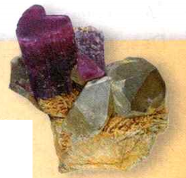
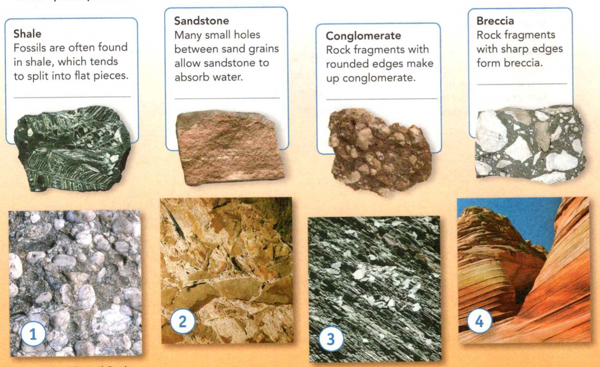
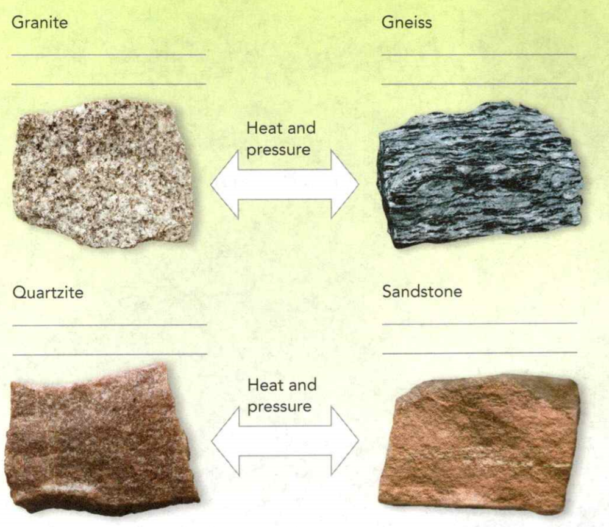
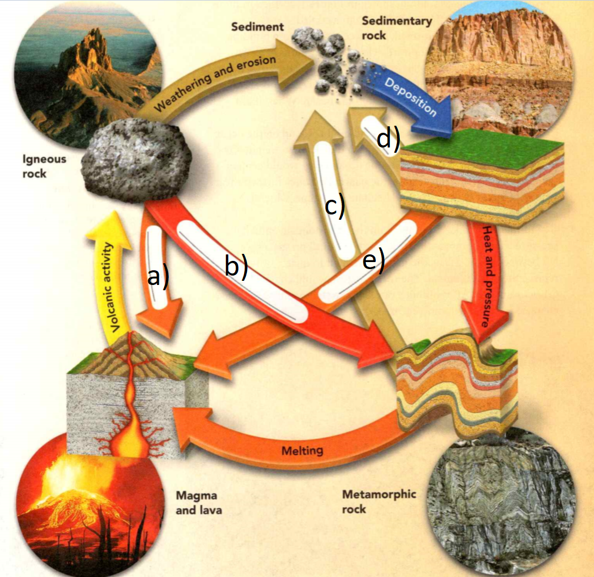
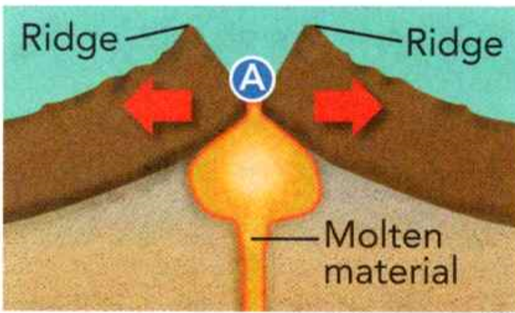
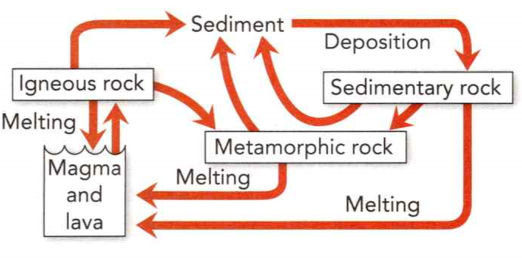

### Earth Science

## Geology

A **liquid** is a substance that flows and whose shape, but not volume, can be changed.

A **solid** is a substance that resists changing shape.

**Volume** is the amount of space that matter occupies.


**Complete the tasks below.**

1. Judy filled a glass jar with water. She put a lid on the jar and put the jar
in the freezer. Overnight, the water, which was a liquid, froze into ice, which
is a solid. But Judy had forgotten that ice occupies a larger volume than the
same mass of water. So when the water froze, it expanded and cracked the jar.
What variable changed to turn the liquid water into solid ice?


### Chapter Preview

- mineral	
- inorganic	
- crystal
- streak	
- luster
- Mohs hardness scale	
- cleavage
- fracture	
- geode	
- crystallization
- solution	
- vein
- rock-forming mineral	
- granite
- basalt	
- grain 
- texture
- igneous rock 
- sedimentary rock
- metamorphic rock
- extrusive rock
- intrusive rock
- sediment	
- weathering	
- erosion
- deposition	
- compaction
- cementation	
- clastic rock
- organic rock	
- chemical rock
- foliated
- rock cycle

### Properties of Minerals
- What Is a Mineral?
- How Are Minerals Identified? 
- How Do Minerals Form?

**Complete the tasks below.**

1. I used to go to summer camp. We went on a good field trip to an underground
cavern. When we got inside, I thought I was in a dragon's mouth. Later, I found
out that those teeth were stalactites and stalagmites. Stalactites hang from the
ceiling and stalagmites grow from the ground. Stalactites and stalagmites are
usually made up of the mineral calcite. This mineral dissolves easily in acidic
water. How do you think calcite hardened to form the features in the cave?

  <figure>
    
    <figcaption>Figure 1. 4 Substances.</figcaption>
  </figure>

### What Is a Mineral?
Look at the two substances in Figure 1. On the left is a hard chunk of coal. On
the right are beautiful quartz crystals. Both are solid materials that form
beneath Earth's surface. But which is a mineral?

### Defining Minerals 

How are minerals defined? **A mineral is a naturally occurring solid that can
form by inorganic processes and that has a crystal structure and a definite
chemical composition.** For a substance to be a **mineral**, it must have all
five of these characteristics. So, is either quartz or coal a mineral?

#### Solid
A mineral is always a solid, with a definite volume and shape. The particles
that make up a solid are packed together very tightly, so they cannot move like
the particles that make up a liquid. Coal and quartz are solids.

#### Naturally Occurring
All minerals are substances that are formed by natural processes. Quartz forms
naturally as molten material called magma cools and hardens beneath Earth's
surface. Coal forms naturally from the remains of plants that are squeezed
tightly together.

#### Crystal Structure
The particles of a mineral line up in a pattern that repeats over and over
again. The repeating pattern of a mineral's particles forms a solid called a
crystal. A crystal has flat sides, called faces, that meet at sharp edges and
corners. The quartz in Figure 1 has a crystal structure. In contrast, most coal
lacks a crystal structure.

#### Forms by Inorganic Processes
All minerals must be able to form by inorganic processes. That is, every mineral
must be able to form from materials that were not a part of living things.
Quartz can form naturally as magma cools. Coal comes only from living things—the
remains of plants that lived millions of years ago. But some minerals that can
form from inorganic processes may also be produced by living things.

#### Definite Chemical Composition
A mineral has a definite chemical composition. This means that a mineral always
contains certain elements in definite proportions. An element is a substance
composed of a single kind of atom. Quartz always contains one atom of silicon
for every two atoms of oxygen. The elements in coal can vary over a wide range.

**Complete the tasks below.**

1. To be classified as a mineral, a substance must satisfy five requirements.
Are quartz and coal minerals or only naturally occurring substances?

2. Quartz and the garnet minerals contain the elements silicon and oxygen. At
room temperature, pure silicon is a hard, dark gray solid. Oxygen is a colorless
gas. Choose either quartz or garnet. Then, choose silicon or oxygen. When your
element is part of a mineral, how is it different from its pure form?

### Minerals, Compounds, and Elements 

Almost all minerals are compounds. In a compound, two or more elements are
combined so that the elements no longer have distinct properties. For example,
the mineral cinnabar is composed of the elements sulfur and mercury. Sulfur is
bright yellow. Mercury is a silvery liquid at room temperature. But cinnabar has
solid, shiny, red crystals.

Different minerals have a different combination of elements. For example, a
crystal of quartz has one atom of silicon for every two atoms of oxygen. This
ratio is constant for all varieties of quartz. Each mineral in the garnet group
of minerals has three atoms of silicon for every twelve atoms of oxygen. But
garnets also contain other elements, in set ratios. Figure 1 shows one variety
of garnet.

Some elements occur in nature in a pure form, and not as part of a compound.
Elements such as copper, silver, and gold are also minerals. Almost all pure,
solid elements are metals.

**Complete the tasks below.**

1. All minerals must be able to form from (organic/inorganic) processes.

2. What, specifically, makes a process inorganic?

3. Amber is a material used in jewelry. It forms only by the process of pine
tree resin hardening into stone. Is amber a mineral? Explain.

### How Are Minerals Identified?

Geologists have identified more than 4,000 minerals. But telling these minerals
apart can often be a challenge. **Each mineral has characteristic properties that
can be used to identify it.**

  <figure>
    
    <figcaption>Figure 2. Substances.</figcaption>
  </figure>

### Color

Both minerals shown in Figure 2 are the color gold. But only one is the mineral
gold. In fact, only a few minerals have their own characteristic color.
	
  <figure>
    
    <figcaption>Figure 3. Scratching the Surface: Streak.</figcaption>
  </figure>

### Streak

The streak of a mineral is the color of its powder. Although the color of a
mineral can vary, its streak does not. However, the streak color and the mineral
color are often different. For example, pyrite has a gold color but its streak
is greenish black.

  <figure>
    
    <figcaption>Figure 4. Luster.</figcaption>
  </figure>

### Luster

Luster is the term used to describe how light is reflected from a mineral's
surface. For example, minerals such as galena that contain metals often have a
metallic luster. Quartz has a glassy luster. Other terms used to describe luster
include earthy, silky, waxy, and pearly.

  <figure>
    
    <figcaption>Figure 5. Hardness.</figcaption>
  </figure>

### Hardness 

When you want to identify a mineral, one of the most useful clues to use is the
mineral's hardness. In 1812, Austrian Friedrich Mohs, a mineral expert, invented
a scale to help identify minerals by how hard they are.

The **Mohs hardness scale** is used to rank the hardness of minerals. The scale
assigns a mineral's hardness a ranking from 1 to 10, as shown in Figure 5.

Hardness can be determined by a scratch test. A mineral can scratch any mineral
softer than itself, but can be scratched by any mineral that is harder. For
example, suppose you found a deposit of azurite. Azurite is not on the Mohs
scale, but you would like to determine its hardness. So you take a small sample
and try to scratch it with talc, gypsum, and calcite. But none of these minerals
scratch your sample. Apatite, rated 5 on the scale, does scratch it. Therefore,
the hardness of azurite is probably about 4.

Apatite is a mineral included in the Mohs hardness scale. Enamel on mature teeth
consists mainly of apatite crystals.

### Density 

Each mineral has a characteristic density. Recall that density is the mass in a
given space, or mass per unit volume. No matter how large or small the mineral
sample is, the density of that mineral always remains the same. For example, the
density of quartz is 2.6 g/cm<sup>3</sup>. The density of diamond is 3.5
g/cm<sup></3sup>.

To measure density, geologists use a balance to first determine the precise mass
of a mineral sample. Then they place the mineral in water to determine how much
water the sample displaces. The volume of the displaced water equals the volume
of the sample. The mineral's density can then be calculated using the formula
below.
```
Density = Mass/Volume
```
You can compare the density of two mineral samples of about
the same size. Just pick them up and heft them, or feel their weight,
in your hands. The sample that feels heavier is probably also denser.

**Complete the tasks below.**

1. Both minerals shown in Figure 2 are gold in color. Identify the mineral that
you think is gold.

2. The color of any particular mineral's streak does not vary, see Figure 3.
Which is more useful when identifying a mineral: the mineral's color or the
mineral's streak?

3. Mohs Hardness Scale, see Figure 5. Geologists determine a mineral's hardness
by comparing it to the hardness of the minerals on the Mohs scale. Read the
description of each mineral. Place each mineral's name in its proper location in
the scale.
a) Topaz - It can scratch quartz but not corundum. 
b) Gypsum - A fingernail can easily scratch it. 
c) Apatite - A steel knife can scratch it.
d) Diamond - Extremely hard, it can scratch all known common minerals.
e) Quartz - It can scratch feldspar but not topaz.

4. For many minerals, different samples of a mineral all have the same density.
So geologists can use density to help identify mineral samples. To do so, they
use the following formula. ```Density = Mass/Volume``` You find a sample of the
mineral magnetite. The sample has a mass of 151.0 g and a volume of 29.0
cm<sup>3</sup>. What is the density of magnetite?

  <figure>
    
    <figcaption>Figure 6. Crystal Structure.</figcaption>
  </figure>

### Crystal Structure 

The atoms that make up a mineral line up in a regular pattern. This pattern
repeats over and over. The repeating pattern of a mineral's atoms forms a
mineral's crystal structure. All the crystals of a mineral have the same crystal
structure. Scientists can use crystal structure to identify very small mineral
samples. For example, scientists can bounce a powerful beam of particles off
very small crystals. Because the atoms that make up minerals line up in regular
patterns, these beams produce distinct patterns of light.

As shown in Figure 6, different minerals have crystals that are shaped
differently. Halite crystals are cubic. That is, they are shaped like a cube.
You can break a large piece of halite into smaller pieces. But the smaller
pieces still contain crystals that are perfect cubes. Geologists classify
crystals by the number of faces, or sides, on the crystal. They also measure the
angles at which the faces meet.


**Complete the tasks below.**
1. Each mineral has its own crystal structure, see Figure 6.
a) What two features do geologists use to classify crystals?
b) Does a quartz crystal have more or fewer faces than a halite crystal?

  <figure>
    
    <figcaption>Figure 7. Stibnite.</figcaption>
  </figure>

2. The photograph in Figure 7 shows crystals of the mineral stibnite. 
a) Identify which of stibnite's characteristic properties you can infer from the
photograph.
b) Which properties would you need to test before being able to identify the
mineral?

### Cleavage and Fracture 

You maybe familiar with how the mineral mica can split apart to form flat
sheets. A mineral that splits easily along flat surfaces has the property called
**cleavage**.

Whether a mineral has cleavage depends on how the atoms in its crystals are
arranged. The way atoms are arranged in mica allows it to split easily in one
direction. Figure 8 shows cleavage in mica.

  <figure>
    
    <figcaption>Figure 8. Fracture and Cleavage.</figcaption>
  </figure>

Most minerals do not split apart evenly. Instead, they have a characteristic
type of fracture. Fracture describes how a mineral looks when it breaks apart in
an irregular way. For example, when quartz breaks, it produces curved,
shell-like surfaces.

### Special Properties 

Some minerals can be identified by special physical properties. Calcite bends
light to produce double images, as shown in Figure 9. Other minerals conduct
electricity, glow when placed under ultraviolet light, or are magnetic.

  <figure>
    
    <figcaption>Figure 9. Special Properties.</figcaption>
  </figure>


**Complete the tasks below.**

1. Fracture and Cleavage, see Figure 8. How a mineral breaks apart can help to
identify it. Observe the examples of cleavage and fracture above. Based on your
observations, write a definition of cleavage in your own words.

2. Geologists identify minerals by examining their ___ .

3. Lodestone is magnetic. How might you identify whether a mineral sample might
be lodestone?

  <figure>
    
    <figcaption>Figure 10. Geode.</figcaption>
  </figure>

### How Do Minerals Form?
On a rock-collecting field trip, you find an egg-shaped rock about the size of a
football. Later, at a geologic laboratory, you split the rock open. The rock is
hollow! Its inside surface sparkles with large amethyst crystals. Amethyst is a
type of quartz.

You have found a geode, as shown in Figure 10. A **geode** is a rounded, hollow rock
that is often lined with mineral crystals. Geologists believe that crystals
probably form inside a geode when water containing dissolved minerals seeps into
a crack or hollow in a rock. Slowly, crystallization occurs, lining the inside
with large crystals that are often perfectly formed. **Crystallization** is the
process by which atoms are arranged to form a material that has a crystal
structure. **In general, minerals can form in three ways. Some minerals form from
organic processes. Other minerals can crystallize from materials dissolved in
solutions. Finally, many minerals crystallize as magma and lava cool.**

### Organic Minerals 

All minerals can form by inorganic processes. **However, some
minerals can also form by organic processes.** For instance, ocean animals such as
clams and corals produce shells and skeletons made out of the mineral calcite.

**Complete the tasks below.**

1. Water seeping into a crack in a rock can result in the formation of a geode, see Figure 10. Complete the graphic organizer to show how a geode forms
in four steps.
a) Second step.
b) Third setp.


### Minerals From Solutions 

Sometimes the elements and compounds that form minerals can be dissolved in
water to form solutions. A **solution** is a mixture in which one substance is
dissolved in another. **When elements and compounds that are dissolved in water
leave a solution, crystallization occurs.** Minerals can form in this way in
bodies of water on Earth's surface. But the huge selenite crystals shown in
Figure 11 formed from a solution of hot water that cooled underground.

  <figure>
    
    <figcaption>Figure 11. Gipsum and Vein</figcaption>
  </figure>

### Minerals Formed by Evaporation

Some minerals form when solutions evaporate. For example, when the water in salt
water evaporates, it leaves behind salt crystals.

In a similar way, deposits of the mineral halite formed over millions of years
when ancient seas slowly evaporated. Such halite deposits are found in the
American Southwest and along the Gulf Coast. Gypsum and calcite can also; form
by evaporation. Sometimes, gypsum fors the shape of a rose, see Figure 11 left.

### Minerals From Hot Water Solutions

Deep underground, magma can heat water to a high temperature. The hot water can
dissolve the elements and compounds that form minerals. When the hot water
solution begins to cool, the elements and compounds leave the solution and
crystallize as minerals. For example, quartz can crystallize from out of a hot
water solution. Pure silver is also often deposited from a hot water solution.
Gold, too, can be deposited in this way. 

Pure metals that crystallize from hot
water solutions underground often form veins. A **vein** is a narrow channel or
slab of a mineral that is different from the surrounding rock, see Figure 11 right.

### Minerals From Magma and Lava 

Many minerals form from magma and lava. **Minerals form as hot magma cools inside
the crust, or as lava hardens on the surface. When these liquids cool to a solid
state, they form crystals.** The size of the crystals depends on several factors.
The rate at which the magma cools, the amount of gas the magma contains, and the
chemical composition of the magma all affect crystal size.

Magma and lava are often rich in oxygen and silicon. Minerals that contain these
elements are called silicates. Together, silicates make up a majority of Earth's
crust.


### Minerals From Magma

Magma that remains deep below the surface cools slowly over thousands of years.
Slow cooling leads to the formation of large crystals. Quartz, feldspar,
tourmaline, and mica are common silicate minerals that form from magma.

  <figure>
    
    <figcaption>Figure 12. Tourmaline.</figcaption>
  </figure>

### Minerals From Lava

If magma erupts to the surface and becomes lava, the lava will cool quickly.
There will be no time for large crystals to form. Instead, small crystals form.
Leucite and olivine are silicate minerals that can form in lava.

  <figure>
    
    <figcaption>Figure 13. Olivine.</figcaption>
  </figure>


  <figure>
    
    <figcaption>Figure 14. Where minerals form.</figcaption>
  </figure>

**Complete the tasks below.**

1. Minerals can form by crystallization of magma and lava or by crystallization
of materials dissolved in water, see Figure 14. Place minerals in their correct place.
a) Minerals formed by evaporation
b) Minerals formed in hot water solutions
c) Minerals formed as lava cools
d) Minerals formed as magma cools

### Where Mineral Resources Are Found 

Earth's crust is made up mostly of the common rock-forming minerals combined in
various types of rock. Less common minerals are not found evenly throughout the
crust. Instead, several processes can concentrate these minerals, or bring them
together, in deposits. An ore is a deposit of valuable minerals contained in
rocks. Iron ores may contain the iron-bearing minerals pyrite, magnetite, and
hematite. Lead ores may contain galena. These ores are mined and the iron or
lead is separated from the rock. Graphite and sulfur are sometimes also mined.
Figure 15 shows some major mining areas.

  <figure>
    
    <figcaption>Figure 15. Ores.</figcaption>
  </figure>

**Complete the tasks below.**

1. Use Figure 15 to answer this question. Copper, aluminum, zinc, iron, and
nickel can be used in making refrigerators. Which of these metals might the
United States need to import for its refrigerators?

2. Magma below Earth's surface cools (slowly/quickly).

3. Slow cooling of magma leads to what size mineral crystals?

4. A certain rock has large crystals of feldspar, mica, and quartz. Explain how
and where the rock might have formed.


### Classifying Rocks
- How Do Geologists Classify Rocks?


**Complete the tasks below.**

1. The Lonely Giant. In the midst of Wyoming stands a lonely giant: Mount Moran.
Its peak stands more , than 3,800 meters above sea level. If you climb Mount
Moran, you'll crawl across slabs of rock. These slabs formed deep beneath
Earth's surface. Here, great temperatures 1 and pressures changed one type of
rock into the rock of the slabs. As you continue to climb, a thick, vertical
strip of darker stone suddenly appears. This rock is volcanic rock. Finally,
when you reach the top, you find a 15-meter cap of sandstone. This rock , formed
when many tiny particles were squeezed tightly together over millions of years.
So Mount Moran contains rocks that formed in three different ways.
a) In your own words, describe one way in which rocks formed on Mount Moran.
b) If you were climbing Mount Moran, how might you be able to tell one rock from
another?

### How Do Geologists Classify Rocks?
If you were a geologist, how would you examine a rock for the first time? You
might look at the outside surfaces. But you would also probably use a hammer to
break open a small sample of the rock and look at the inside. **To study a rock
sample, geologists observe the rock's mineral composition, color, and texture.**

### Mineral Composition and Color 

Rocks are made of mixtures of minerals and other materials. Some rocks contain
only a single mineral. Other rocks contain several minerals. The granite in
Figure 1, for example, is made up of quartz, feldspar, mica, and hornblende.
About 20 minerals make up most of the rocks of Earth's crust. These minerals are
known as **rock-forming minerals**. The minerals that make up granite are
rock-forming minerals.

  <figure>
    
    <figcaption>Figure 16. Granite.</figcaption>
  </figure>

A rock's color provides clues to the rock's mineral composition. For example,
granite is generally a light-colored rock that has high silica content. That is,
it is rich in the elements silicon and oxygen. Basalt is a dark-colored rock
that has a lower silica content than granite has. But unlike granite, basalt has
mineral crystals that are too small to be seen with the naked eye. As with
minerals, color alone does not provide enough information to identify a rock.

**Complete the tasks below.**

1. Granite is generally made up of only a few common minerals. How would you
describe the overall color of the rock in Figure 16? What minerals cause the
color (or colors) you chose?


### Texture 

Most rocks are made up of particles of minerals or other rocks, which geologists
call grains. Grains give the rock its texture. Texture is the look and feel of a
rock's surface. To describe the texture of a rock, geologists use terms that are
based on the size, shape, and pattern of the grains.

### Grain Size

Rocks with grains that are large and easy to see are said to be coarse grained.
Fine-grained rocks have grains that are so small they can be seen only with a
microscope.

  <figure>
    
    <figcaption>Figure 17. Grain Size.</figcaption>
  </figure>

### Grain Shape
In some rocks, grain shape results from the shape of the mineral crystals that
form the rock. Other rocks have a grain shape that results from rounded or
jagged bits of several rocks.

  <figure>
    
    <figcaption>Figure 18. Grain Shape.</figcaption>
  </figure>


### Grain Pattern
In banded rocks, grains can lie in a pattern of flat layers or can form swirls
or colored bands. Nonbanded rocks have grains that do not lie in any visible
pattern.

  <figure>
    
    <figcaption>Figure 19. Grain Pattern.</figcaption>
  </figure>

  <figure>
    
    <figcaption>Figure 20. Coarse-grained Rock.</figcaption>
  </figure>

### Origin 

Using the characteristics of color, texture, and mineral composition, geologists
can classify a rock according to its origin. A rock's origin is the way that the
rock formed. **Geologists have classified rocks into three major groups: igneous
rock, sedimentary rock, and metamorphic rock.**

Each of these groups of rocks forms in a different way, as show, in Figure 21.
**Igneous rock** forms from the cooling of magma or lava. The magma
hardens underground to form rock. The lava erupts, cools, and hardens to form
rock on Earth's surface. 

Most **sedimentary rock** forms when
small particles of rocks or the remains of plants and animals are pressed and
cemented together. Sedimentary rock forms in layers that are buried below the
surface. **Metamorphic rock** forms when a rock is changed by heat
or pressure, or by chemical reactions. Most metamorphic rock forms deep
underground.


  <figure>
    
    <figcaption>Figure 21. Rock origins.</figcaption>
  </figure>

**Complete the tasks below.**

1. Th photograph in Figure 20 shows part of a coarse-grained rock. 
a) Is this rock banded or nonbanded?
b) Based on this rock's appearance, what type of rock might it be? 	
c) Gneiss forms when very high pressure and temperature are applied to existing
rock. How might these conditions explain the wavy pattern in this rock?


2. Rocks are classified by the way they formed. Label each diagram with the rock
origin it represents.
a) Rock a)
b) Rock b)
c) Rock c)

3. Geologists classify rocks according to their __ .

4. How do igneous rocks form? 

5. Pumice is a type of rock that forms from molten material that erupts
violently from a volcano. To what group of rock does pumice belong?

### Igneous Rocks

- How Do Geologists Classify Igneous Rocks? 
- How Are Igneous Rocks Used?

**Complete the tasks below.**

1. Arctic Diamonds. If you were looking for diamonds, where would you start?
Maybe in a helicopter flying over the Arctic Circle? In the 1980s, a pair of
geologists used a helicopter to search for diamonds in Canada. The pair knew
that diamonds form more than 100 kilometers under Earth's surface. They also
knew that after diamonds form, powerful eruptions of magma can thrust the
diamonds to the surface through volcanic pipes. As the magma cools and hardens,
the diamonds are trapped inside volcanic rock. The geologists found a source for
diamonds after searching for several years. Now, diamond mines in Canada produce
one of the world's most valuable crops of diamonds! If you wanted to try to find
diamonds, what type of rock might you look for? Why?

### How Do Geologists Classify Igneous Rocks?

Look at Figure 22. All the rocks shown in the figure are igneous rocks. But do
all these rocks look the same? No, because even though all igneous rocks form
from magma or lava, igneous rocks can look vastly different from each other.
**Igneous rocks are classified by their origin, texture, and mineral composition.**

  <figure>
    
    <figcaption>Figure 22. Igneous Rock Origins and Textures.</figcaption>
  </figure>


### Origin 

Igneous rock may form on or beneath Earth's surface. **Extrusive rock** is igneous
rock formed from lava that erupted onto Earth's surface. Basalt is the most
common extrusive rock. 

Igneous rock that formed when magma hardened beneath the surface of Earth is
called **intrusive rock**. The most abundant type of intrusive rock in
continental crust is granite. Granite forms tens of kilometers below Earth's
surface and over hundreds of thousands of years or longer. 

### Texture

Different igneous rocks may have similar mineral compositions and yet have very
different textures. The texture of an igneous rock depends on the size and shape
of its mineral crystals. The only exceptions to this rule are the different
types of volcanic glass - igneous rock that lacks a crystal structure. 

Rapidly
cooling lava forms fine-grained igneous rocks with small crystals or no crystals
at all. Slowly cooling magma forms coarse-grained rocks, such as granite, with
large crystals. So, intrusive and extrusive rocks usually have different
textures. For example, intrusive rocks have larger grains than extrusive rocks.
Extrusive rocks have a fine-grained or glassy texture. Figure 22 shows the
textures of different igneous rocks.

  <figure>
    
    <figcaption>Figure 23. Mineral composition of Diorite.</figcaption>
  </figure>

### Mineral Composition 

Recall that the silica content of magma and lava can vary. Lava that is low in
silica usually forms dark-colored rocks such as basalt. Basalt contains feldspar
as well as certain dark-colored minerals, but does not contain quartz. 

Magma that is high in silica usually forms light-colored rocks, such as granite.
Granite's mineral composition determines its color, which can be light gray,
red, or pink. Granite that is rich in reddish feldspar is a speckled pink. But
granite rich in hornblende and dark mica is light gray with dark specks. Quartz
crystals in granite add light gray or smoky specks.


### How Are Igneous Rocks Used?

Many igneous rocks are hard, dense, and durable. **People throughout history
have used igneous rock for tools and building materials.**

Granite has a long history of use as a building material. More than 3,500 years
ago, the ancient Egyptians used granite to build statues. About 600 years ago,
the Incas of Peru built fortresses out of great blocks of granite and other
igneous rock. You can see part of one of their fortresses in Figure 24. In the
United States during the 1800s and early 1900s, granite was widely used to build
bridges and public buildings. Today, thin, polished sheets of granite are used
in curbstones and floors. Another igneous rock, basalt, can be used for
cobblestones. It can also be crushed and used as a material in landscaping and
in roads.

  <figure>
    
    <figcaption>Figure 24. Building Blocks.</figcaption>
  </figure>

Igneous rocks such as pumice and obsidian also have important uses. The rough
surface of pumice forms when gas bubbles are trapped in fast-cooling lava,
leaving spaces in the rock. The rough surface makes pumice a good abrasive for
cleaning and polishing. Ancient Native Americans used obsidian to make sharp
tools for cutting and scraping. Obsidian cools very quickly, without forming
crystals. So it has a smooth, shiny texture like glass. Perlite, formed by the
rapid cooling of magma or lava, is often mixed with soil and used for starting
vegetable seeds.


**Complete the tasks below.**

1. Ignis means "fire" in Latin. What is "fiery" about igneous rocks?

2. The texture of igneous rock varies according to its origin, see Figure 22.
The **porphyry** shown here has large crystals surrounded by small crystals.
Where did the large crystals form? **Pegmatite**: A very coarse-grained,
intrusive igneous rock. **Rhyolite** is a fine-grained, extrusive igneous rock
with a composition that is similar to granite. Did the rocks in the photographs
form at A or B? 
a) Porphyry
b) Pegmatite
c) Rhyolite

3. Diorite is a coarse-grained intrusive igneous rock, see Figure 23. It is a
mixture of feldspar and dark-colored minerals such as hornblende and mica. The
proportion of feldspar and dark minerals in diorite can vary. 
a) What mineral is
most abundant in the sample of diorite illustrated by the graph? 
b) How would the color of the diorite change if it contained less hornblende and
more feldspar? Explain.

4. Rhyolite is an (intrusive/extrusive) igneous rock.

5. How does rhyolite form? 

6. Rhyolite has a similar composition to granite. Why is the texture of rhyolite
different from the texture of granite?


7. Igneous rock has long been used as a building material, such as for the Incan
fortress in Peru in Figure 24. A fortress must be strong enough to withstand
violent attacks. Why might the Incas have chosen igneous rock to build their
fortress near Ollantaytambo in Peru?
 


### Sedimentary Rocks

- How Do Sedimentary Rocks Form?
- What Are the Three Major Types of Sedimentary Rocks?
- How Are Sedimentary Rocks Used?


**Complete the tasks below.**

1. The Cutting Edge. If you had to carve tools out of stone, would you know
which rocks to use? Dr. Beverly Chiarulli, an archaeologist at Indiana
University of Pennsylvania, studies stone tools that were used by people in
Pennsylvania 10,000 year ago. Dr. Chiarulli has found that these people crafted
spearheads out of the sedimentary rocks called chert and jasper. Chert is hard
and has a very fine texture. It is brittle, but does not fracture along thin,
even planes. So, chert can be shaped somewhat easily by flaking off chips,
producing the sharp edges needed for spearheads. What properties of chert allow
it to be carved into sharp spearheads?

### How Do Sedimentary Rocks Form?
The banks of a cool stream may be made up of tiny sand grains, mud, and pebbles.
Shells, leaves, and even bones may also be mixed in. All of these particles are
examples of sediment. Sediment is small, solid pieces of material that come from
rocks or living things. Sedimentary rocks form when sediment is deposited by
water and wind, as shown in Figure 1. **Most sedimentary rocks are formed through
a sequence of processes: weathering, erosion, deposition, compaction, and
cementation.**

### Deposition
Water can carry sediment to a lake or ocean. Here, the material is deposited in
layers as it sinks to the bottom. **Deposition** is the process by which sediment
settles out of the water or wind carrying it.

### Weathering and Erosion

Rock on Earth's surface is constantly broken up by **weathering** - the effect: of
freezing and thawing, plant roots, acid, and other forces on rock. After the
rock is broken up, the fragments are carried away as a result of **erosion** - the
process by which running water, wind, or ice carry away bits of broken-up rock.


### Compaction

Thick layers of sediment build up gradually over millions of years. The weight
of new layers can squeeze older sediments tightly together. The process that
presses sediments together is **compaction**.

### Cementation

While compaction is taking place, some minerals in the rock slowly dissolve in
the water. **Cementation** is the process in which dissolved minerals crystallize
and glue particles of sediment together.


  <figure>
    
    <figcaption>Figure 25. How Sedimentary Rock Forms.</figcaption>
  </figure>


### What Are the Three Major Types of Sedimentary Rocks?

Geologists classify sedimentary rocks according to the type of sediments that
make up the rock. **The three major groups of sedimentary rocks are clastic
rocks, organic rocks, and chemical rocks. Different processes form each of these
types of rocks.**

### Clastic Rocks 

Most sedimentary rocks are made up of broken pieces of other rocks. A **clastic
rock** is a sedimentary rock formed when rock fragments are squeezed together. The
fragments can range in size from clay particles that are too small to be seen
without a microscope to large, heavy boulders. Clastic rocks are grouped by the
size of the rock fragments, or particles, of which they are made. Some common
clastic rocks, shown in Figure 26, are shale, sandstone, conglomerate, and
breccia.


Shale forms from tiny particles of clay. Water deposits the clay particles in
thin, flat layers. Sandstone forms from the sand on beaches, the ocean floor,
riverbeds, and sand dunes. Most sand particles consist of quartz.

Some clastic sedimentary rocks contain rock fragments that are of different
sizes. If the fragments have rounded edges, they form conglomerate. Fragments
with sharp edges form breccia.

  <figure>
    
    <figcaption>Figure 26. Clastic Rocks.</figcaption>
  </figure>

### Organic Rocks 

You may be familiar with the rocks called coal and limestone, shown in Figure 27.
Both are sedimentary rocks But instead of forming from particles of other rocks,
they form from the remains of material that was once living. Organic rock forms
where the remains of plants and animals are deposited in layers. The term
"organic" refers to substances that once were part of living things or were made
by living things.

Coal forms from the remains of swamp plants buried in water. As layer upon layer
of plant remains build up, the weight of the layers squeezes the decaying plants
together. Over millions of years they slowly change into coal.

Limestone forms in the ocean, where many living things, such as coral, clams,
and oysters, have hard shells or skeletons made of calcite. When these ocean
animals die, their shells pile up on the ocean floor. Over millions of years,
compaction and cementation can change the thick sediment into limestone.


  <figure>
    
    <figcaption>Figure 27. Organic Rocks.</figcaption>
  </figure>

  <figure>
    
    <figcaption>Figure 28. Mono Lake.</figcaption>
  </figure>

### Chemical Rocks 

Limestone can also form when calcite that is dissolved in lakes, seas, or
underground water comes out of a solution and forms crystals. This kind of
limestone is considered a chemical rock. **Chemical rock** forms when minerals
dissolved in a water solution crystallize. Chemical rocks can also form from
mineral deposits that are left when seas or lakes evaporate. For example, rock
salt is made of the mineral halite, which forms by evaporation.


### How Are Sedimentary Rocks Used?

**People have used sedimentary rocks throughout history for many different
purposes, including for tools and building materials.** Chert was used to make
spearheads by people who lived in Pennsylvania more than 10,000 years ago. Other
people also made arrowheads out of flint for thousands of years. Flint is a hard
rock, yet it can be shaped to a point. It forms when small particles of silica
settle out of water.

Sedimentary rocks such as sandstone and limestone have been used as building
materials for thousands of years. Both types of stone are soft enough to be cut
easily into blocks or slabs. The White House in Washington, D.C., is built of
sandstone. Today, builders use sandstone and limestone on the outside walls of
buildings, such as the building shown in Figure 29. Limestone also has industrial
uses. For example, it is used in making cement and steel.


  <figure>
    
    <figcaption>Figure 29. Building with Limestone.</figcaption>
  </figure>

**Complete the tasks below.**

1. Sedimentary rocks form through a series of processes over millions of years,
see Figure 25. Put the terms listed in the word bank in the proper sequence to
show how mountains can change into sedimentary rock.
Compaction, Cementation, Weahtering and erosion, Deposition.

2. Clastic rocks are sedimentary rocks that form from particles of other rocks,
see Figure 26. **Shale**: Fossils are often found in shale, which tends to split
into flat pieces. **Sandstone**: Many small holes between sand grains allow
sandstone to absorb water. **Conglomerate**: Rock fragments with rounded edges
make up conglomerate. **Breccia**: Rock fragments with sharp edges form breccia.
Match the clastic rocks to the four photographs below them. 
a) Shale
b) Sandstone
c) Conglomerate
d) Breccia

3. Organic rocks such as limestone and coal are sedimentary rocks that form from
the remains of living things, see Figure 27.
Complete the graphic organizers to show how coal and limestone form.
a) Coal
b) Limestone

4. The rock "towers" in Mono Lake, see Figure 28, California, are made of tufa, a form of limestone. Tufa forms from water solutions that contain dissolved materials. The towers formed under water. They became exposed when the water level in the lake dropped as a result of water needs for the city of
Los Angeles. 
a) Tufa is a (clastic/organic/chemical) sedimentary rock.
b) What mineral was dissolved in the waters of Mono Lake and later crystallized
to form the rock towers?
c) When acid comes into contact with calcite, the acid bubbles. How can
geologists use acid to confirm that the rock towers are made of limestone?


5. Shale forms from tiny particles of (clay/sand/mica).

6. How is clay deposited to form shale?

7. You come across a thick deposit of shale that forms a layer in the ground.
What can you infer about the area's past environment?

8. Building With Limestone, see Figure 29. Limestone is a popular building
material. However, acid rain reacts with the calcite in limestone, damaging
buildings made from it. Do the benefits of constructing limestone buildings
outweigh the damage acid rain causes to these buildings? Explain.


### Metamorphic Rocks
- What Are Metamorphic Rocks?

**Complete the tasks below.**

1. Rock Dough, Misconception: Rocks do not change form Did you know that heat
can change a rock's form without melting it? To understand how, think of what
happens when you bake cookies. You might mix flour, eggs, sugar, and baking
powder in a bowl. When you bake the raw dough in a hot oven, the dough changes
into cookies. Heat can change rock, too. If hot magma or lava come near rock,
the heat can "bake" the rock. Th ingredients in the rock- minerals—might not
melt. But the heat can still change the rock into a new form! Does rock have to
melt in order to change form? Explain.

### What Are Metamorphic Rocks?

You may be surprised to learn that heat can change rock like a hot oven changes
raw cookie dough. But deep inside Earth, both heat and pressure are much greater
than at Earth's surface. When great heat and pressure are applied to rock, the
rock can change both its shape and its composition. **Any rock that forms from
another rock as a result of changes in heat or pressure (or both heat and
pressure) is a metamorphic rock.**

### How Metamorphic Rocks Form 

Metamorphic rock can form out of igneous, sedimentary, or other metamorphic
rock. Many metamorphic rocks are found in mountains or near large masses of
igneous rock. Why are metamorphic rocks commonly found in these locations? The
answer lies inside Earth.

The heat that can change a rock into metamorphic rock can come from pockets of
magma. For instance, pockets of magma can rise through the crust. The high
temperatures of these pockets can change rock into metamorphic rock. Collisions
between Earth's plates can also push rock down toward the heat of the mantle.


Very high pressure can also change rock into metamorphic rock. For instance,
plate collisions cause great pressure to be applied to rocks while mountains are
being formed. The pressure can deform, or change the physical shape of, the
rock, as shown in Figure 30. Also, the deeper that a rock is buried in the crust,
the greater the pressure on that rock, Under very high temperature or pressure
(or both), the minerals in a rock can be changed into other minerals. At the
same time, the appearance, texture, and crystal structure of the minerals in the
rock change. The rock eventually becomes a metamorphic rock.

  <figure>
    
    <figcaption>Figure 30. Metamorphic Rock.</figcaption>
  </figure>


### How Metamorphic Rocks Are Classified 

While metamorphic rocks are forming, intense heat changes the size and shape of
the grains, or mineral crystals, in the rock. Extreme pressure squeezes rock so
that the mineral grains may line up in flat, parallel layers. **Geologists
classify metamorphic rocks according to the arrangement of the grains making up
the rocks.**

### Foliated Rocks 

Metamorphic rocks that have their grains arranged in either parallel layers or
bands are said to be foliated. **Foliated** describes the thin, flat layering found
in most metamorphic rocks. For instance, the crystals in granite can be
flattened to create the foliated texture of gneiss. Slate is also a common
foliated rock. Heat and pressure change the sedimentary rock shale into slate.
Slate is basically a denser, more compact version of shale. But as shale changes
into slate, the mineral composition of the shale can change.

### Nonfoliated Rocks 

Some metamorphic rocks are nonfoliated. The mineral grains in these rocks are
arranged randomly. Marble and quartzite are metamorphic rocks that have a
nonfoliated texture. Quartzite forms out of quartz sandstone. The weakly
cemented quartz particles in the sandstone recrystallize to form quartzite,
which is extremely hard. Quartzite looks smoother than sandstone, as shown in
Figure 31. Finally, marble usually forms when limestone is subjected to heat and
pressure deep beneath the surface.


  <figure>
    
    <figcaption>Figure 31. Presto!.</figcaption>
  </figure>

### How Metamorphic Rocks Are Used 

Marble and slate are two of the most useful metamorphic rocks. Marble has an
even grain, so it can be cut into thin slabs or carved into many shapes. And
marble is easy to polish. So architects and sculptors use marble for many
statues and buildings, such as the Tower of Pisa. Like marble, slate comes in
many colors, including gray, red, and purple. Because it is foliated, slate
splits easily into flat pieces. These pieces can be used for roofing, outdoor
walkways, and as trim for stone buildings. **The metamorphic rocks marble and
slate are important materials for building and sculpture.**


  <figure>
    
    <figcaption>Figure 32. Tower of Pisa.</figcaption>
  </figure>

**Complete the tasks below.**

1. The rock in the photograph in Figure 30 was once sedimentary rock. Now, it is
metamorphic rock. What changed the rock? Make sure your answer explains the
rock's current appearance.

2. Great heat and pressure can change one type of rock into another, see Figure
31. Label each rock sedimentary, igneous, or metamorphic. Indicate whether the
metamorphic rocks are foliated. 
a) Granite
b) Gneiss
c) Quartzite
d) Sandstone
e) Shade the correct arrowhead to show which rock can form from the other rock.


3. Although marble, quartzite, and slate are all metamorphic rocks, they are
used in different ways. Look around your neighborhood. What examples of
metamorphic rock can you find? How is each metamorphic rock used?\\

4. Why are chess pieces sometimes made of marble?

5. What is a metamorphic rock?

6. Suppose great heat completely melts a certain deposit of rock, which then
hardens into new rock. You might think that the new rock is metamorphic. But it
isn't. Why not?
 

### The Rock Cycle

- What Is the Rock Cycle?

**Complete the tasks below.**

1. Rolling Along. The Himalaya Mountains are eroding a a rate of about 2.5
millimeters per year. That's about one tenth as fast as your fingernails grow!
But the Himalayas were formed millions of years ago. So imagine the total mass
of rock that has fallen down the mountain and that has then been swept out to
sea. Over millions of years, the piled weight of eroded particles will squeeze
the bits together on the sea floor. New rock will form. Then, ancient bits of
the Himalayas will be rec cled inside new rock. How could small pieces of the
Himalayas form new rock? 

### What Is the Rock Cycle?

Natural forces act on the Himalayas. In fact, rock in Earth's crust is always
changing. **Forces deep inside Earth and at the surface produce a slow cycle
that builds, destroys, and changes the rocks in the crust.** The **rock cycle** is a
series of processes that occur on Earth's surface and in the crust and mantle
that slowly change rocks from one kind to another. For example, weathering can
break down granite into sediment that later forms sandstone.

### One Pathway Through the Rock Cycle 

There are many pathways by which rocks move through the rock cycle. For example,
Stone Mountain, near Atlanta, Georgia, is made of granite. The granite in Stone
Mountain, shown in Figure 33, formed millions of years ago below Earth's surface
as magma cooled.

After the granite had formed, the forces of mountain building slowly pushed the
granite upward. Then, over millions of years, weathering and erosion began to
wear away the granite. Today, particles of granite constantly break off the
mountain and become sand. Streams carry the sand to the ocean. What might happen
next?

Over millions of years, layers of sand might pile up on the ocean floor. Slowly,
the sand would be compacted by its own weight. Or perhaps calcite that is
dissolved in the ocean water would cement the particles together. Over time, the
quartz that once formed the granite of Stone Mountain could become sandstone,
which is a sedimentary rock.

Sediment could keep piling up on the sandstone. Eventually, pressure would
compact the rock's particles until no spaces were left between them. Silica, the
main ingredient in quartz, would replace the calcite cement. The rock's texture
would change from gritty to smooth. After millions of years, the standstone
would have changed into the metamorphic rock quartzite.


  <figure>
    
    <figcaption>Figure 33. Stone Mountain.</figcaption>
  </figure>

  <figure>
    
    <figcaption>Figure 34. The Rock Cycle.</figcaption>
  </figure>


### The Rock Cycle and Plate Tectonics 

The changes of the rock cycle are closely related to plate tectonics. Recall
that Earth's lithosphere is made up of huge plates. These plates move slowly
over Earth's surface as the result of convection currents in Earth's mantle. As
the plates move, they carry the continents and ocean floors with them. Plate
movements help drive the rock cycle by helping to form magma, the source of
igneous rocks.

Where oceanic plates move apart, magma formed from melted mantle rock moves
upward and fills the gap with new igneous rock. Where an oceanic plate is
subducted beneath a continental plate, magma forms and rises. The result is a
volcano made of igneous rock. A collision of continental plates may push rocks
so deep that they melt to form magma, leading to the formation of igneous rock.

Sedimentary rock can also result from plate movement. For example, the collision
of continental plates can be strong enough to push up a mountain range. Then,
weathering and erosion begin. The mountains are worn away. This process leads to
the formation of sedimentary rock.

Finally, a collision between continental plates can push rocks down deep beneath
the surface. Here, heat and pressure could change the rocks to metamorphic rock.

### Conservation of Material in the Rock Cycle

Constructive and destructive forces build up and destroy Earth's landmasses. But
as the rock in Earth's crust moves through the rock cycle, material is not lost
or gained. For example, a mountain can erode to form sediment, all of which can
eventually form new rock.


  <figure>
    
    <figcaption>Figure 35. Mid-atlantic Ridge.</figcaption>
  </figure>

**Complete the tasks below.**

1. Stone Mountain, see Figure 33. The granite in Stone Mountain is moving
through the rock cycle.
a) As shown in the photograph, trees can grow on the mountain. Their roots might
break up the granite. What step of the rock cycle do the trees play a role in?
b) Does the rock cycle stop after the quartzite has formed? Explain.

2. Through melting, weathering and erosion, and heat and pressure, the rock
cycle constantly changes rocks from one type into another type. Study the
diagram in Figure 34. Then fill in each blank arrow with the correct term:
melting, weathering and erosion, or heat and pressure. 
a)
b)
c)
d)
e)

3. New rock forms at the ocean floor at the mid-Atlantic ridge. Here, two plates
move apart, see Figure 35.
a) (Igneous/Sedimentary) rock forms at point A.
b) How can rock that forms at the mid atlantic ridge form into sedimentary rock?

4. The rock cycle builds, destroys, and changes the rock in Earth's
(crust/core).

5. How do rocks form?

6. In the rock cycle, rocks form through three main processes. What are they?

### Study Guide

- A mineral is a natural solid that can form by inorganic processes and that has
a crystal structure and a definite chemical composition.
- Each mineral has characteristic properties.
- Minerals form from cooling of magma and lava, from solutions, or from organic
processes.
- To study a rock sample, geologists observe the rock's mineral
composition, color, and texture.
- Geologists have classified rocks into three major groups: igneous rock,
sedimentary rock, and metamorphic rock.
- Igneous rocks are classified by their origin, texture, and mineral
composition.
- People throughout history have used igneous rock for tools and building
materials.
- Most sedimentary rocks form by weathering, erosion, deposition, compaction,
cementation.
- Three major types of sedimentary rocks are clastic rocks, organic rocks, and
chemical rocks.
- People use sedimentary rocks for tools and building materials.
- Any rock that forms from another rock as a result of changes in heat or
pressure (or both) is a metamorphic rock.
- Geologists classify metamorphic rocks according to the arrangement of the
grains making up the rocks.
- The metamorphic rocks marble and slate are important materials for building
and sculpture.
- Forces deep inside Earth and at the surface produce a slow cycle that builds,
destroys, and changes the rocks in the crust.

**Complete the tasks below.**

1. Streak is the color of a mineral's
A) luster.
B) cleavage.
C) powder.
D) fracture.

2. During crystallization, ___ are arranged to form a material with a crystal
structure.

3. Compare the characteristics of a mineral and a material that is not a mineral.
a) Hematite: Natural
A) True
B) False
b) Hematite: Can form by inorganic processes.
A) True
B) False
c) Hematite: Solid
A) True
B) False
d) Hematite: Crystal structure
A) True
B) False
e) Hematite: Definite chemical composition
A) True
B) False
f) Brick: Natural
A) True
B) False
g) Brick: Can form by inorganic processes.
A) True
B) False
h) Brick: Solid
A) True
B) False
i) Brick: Crystal structure
A) True
B) False
j) Brick: Definite chemical composition
A) True
B) False

4. A rock that forms from many small fragments of other rocks is a(n)
A) igneous rock.
B) sedimentary rock.
C) metamorphic rock. 
D) extrusive rock.

5. The 20 or so minerals that make up most of the rocks of Earth's crust are
known as

6. Describe the texture of the rock in Figure 36.

  <figure>
    
    <figcaption>Figure 36. Rock.</figcaption>
  </figure>

7. What kind of igneous rock usually contains large crystals?
A) organic
B) clastic
C) intrusive
D) extrusive

8. An igneous rock's color is primarily determined by its	

9. What conditions lead to the formation of large crystals in an igneous rock?

10. Describe the texture of granite. Also describe granite's mineral composition
and explain granite's origin.

11. You find a deposit of organic limestone. In what type of setting did it probably form?
A) the ocean
B) a volcano
C) a swamp
D) sand dunes

12. Shale is a clastic rock, meaning that it forms when	___ are
squeezed or cemented together (or both).

13.A certain rock contains large, jagged pieces of other rocks, cemented
by fine particles. What type of rock is this? Explain.

14. You find a rock with fossils in it. Is this rock more likely to be a
sedimentary rock than an igneous rock? Explain.

15. A metamorphic rock in which the grains line up in layers is called a
A) chemical rock.
B) clastic rock.
C) nonorganic rock.
D) foliated rock.

16. Two types of foliated rock are ___ .

17. Why do you think slate might be denser than shale?

18. Why do the crystals in gneiss line up in bands?

19. The process by which metamorphic rock changes to igneous rock begins with
A) melting.
B) erosion.
C) deposition.
D) crystallization.

20.	____ can turn igneous rock into sediment.

  <figure>
    
    <figcaption>Figure 37. Rock changes.</figcaption>
  </figure>

21. Use the diagram in Figure 37 to describe two ways metamorphic rock can change into sedimentary rock.

  <figure>
    
    <figcaption>Figure 38. Rocks.</figcaption>
  </figure>

22. While hiking through a mountain range, you use a chisel and hammer to remove
the three rock samples shown in Figure 38. Classify the rocks you found as
either igneous, sedimentary, or metamorphic. Then, describe the textures of each
rock. Also describe the processes that formed each rock.
a) Classify sample A
A) igneous
B) sedimentary
C) metamorphic
b) Classify sample B
A) igneous
B) sedimentary
C) metamorphic
c) Classify sample C
A) igneous
B) sedimentary
C) metamorphic
d) Describe the texture of rock A
e) Describe the texture of rock B
f) Describe the texture of rock C
g) Describe the processes that formed rock A. 
h) Describe the processes that formed rock B. 
i) Describe the processes that formed rock C. 


  <figure>
    
    <figcaption>Figure 39. Mineral samples.</figcaption>
  </figure>

23. The diagrams in Figure 39 show four different mineral samples. Which mineral
property is best shown by the samples?
A) crystal structure
B) cleavage
C) hardness
D) color


24. You find a rock in which the grains are arranged in wavy, parallel bands of white and black crystals. What kind of rock have you probably found?
A) igneous
B) sedimentary
C) metamorphic 
D) extrusive

25. Which statement best describes how an extrusive igneous rock forms?
A) Magma cools quickly on Earth's surface.
B) Magma cools slowly to form granite.
C) Magma cools quickly below Earth's surface.
D) Magma cools slowly beneath Earth's surface.

26. Which rock cycle process causes many sedimentary rocks to have visible layers?
A) eruption
B) intrusion
C) crystallization 
D) deposition

27. If heat and pressure inside Earth cause the texture and crystal structure of a rock to change, what new material is formed?
A) metamorphic rock
B) sedimentary rock 
C) igneous rock
D) chemical rock


  <figure>
    
    <figcaption>Figure 40. Rock layers.</figcaption>
  </figure>
 

28. Use Figure 40 for this question. Describe the environment that probably
existed millions of years ago where these rocks formed. Explain your reasoning.

