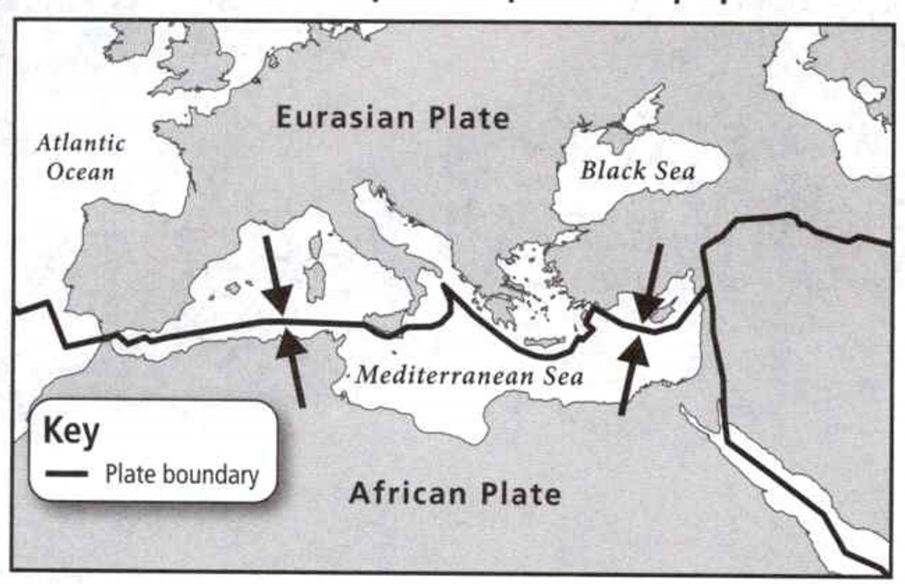

### Earth Science

## Geology

## Plate Tectonics

- A **continent** is a large landmass.
- A **boundary** is the point or line where one region ends and another begins.
- The **crust** is the outer layer of Earth.


**Complete the tasks below.**

1. Maria took a train from Oregon to Georgia. The train rode across the entire
continent of North America. It rode up and down the Rocky Mountains, which form
a boundary between America's east and west. The conductor said, "These mountains
are part of Earth's crusty'. What is the crust

### Chapter Preview

- continental drift 
- Pangaea
- fossil
- mid-ocean ridge
- sea-floor spreading
- deep-ocean trench
- subduction
- plate
- divergent boundary
- convergent boundary
- transform boundary
- plate tectonics
- fault
- rift valley

### Drifting Continents

- What Was Wegener's Hypothesis About the Continents?


**Complete the tasks below.**

1. A Puzzled Look. Scientists have long noticed that Earth's continents look as
though they could fit together like pieces of a jigsaw puzzle. This was an idea
that Alfred Wegener suggested in 1910. "Doesn't the east coast of South America
fit exactly against the west coast of Africa, as if they had once been joined?"
he asked. "This is an idea I'll have to pursue."
a) Why did Wegener think that the continents might once have been joined?
b) If you were Wegener, what other evidence would you look for to show that the
continents had once been joined?

### What Was Wegener's Hypothesis About the Continents?

Have you ever looked at a world map and noticed how the coastlines of Africa and
South America seem to match up? For many years, scientists made this same
observation! In 1910, a German scientist named Alfred Wegener
became curious about why some continents look as though they could fit together.

According to Wegener, the continents of Earth had moved. **Wegener's hypothesis
was that all the continents were once joined together in a single landmass and
have since drifted apart.** Wegener's idea that the continents slowly moved over
Earth's surface became known as **continental drift**. 

According to Wegener, the continents were joined together in a supercontinent,
or single landmass, about 300 million years ago. Wegener called the
supercontinent **Pangaea**.

Over tens of millions of years, Pangaea began to break apart. The pieces of
Pangaea slowly moved to their present locations, shown in Figure 1. These pieces
became the continents as formed today. In 1915, Wegener published his evidence
for continental drift in a book called The Origin of Continents and Oceans.

  <figure>
    
    <figcaption>Figure 1. Piecing it all together.</figcaption>
  </figure>

### Evidence From Land Features 

Land features on the continents provided Wegener
with evidence for his hypothesis. On the next page, Figure 2 shows some of this
evidence. For example, Wegener pieced together maps of Africa and South America.
He noticed that mountain ranges on the continents line up. He noticed that coal
fields in Europe and North America also match up.

  <figure>
    
    <figcaption>Figure 2. Pangaea and Continental Drift.</figcaption>
  </figure>

**Complete the tasks below.**

1.  Piecing It AU Together.
The coastlines of some continents seem to fit together like a jigsaw puzzle.
Use the map in Figure 1 to answer the questions.
Match the numbered coast with the lettered, coast that seems to fit with it.
a) 1
b) 2
c) 3
d) 4

2. How would a continent's climate change if it drifted closer to the equator?

3. Many types of evidence suggest that Earth's landmasses were once joined
together, see Figure 2. 
a) Label the continent a)
b) Label the continent b)
c) Label the continent c)
d) Label the continent d)
e) On the top map of Pangaea, draw where each piece of
evidence on the bottom map would have been found. Use a different symbol or
color for each piece of evidence, and provide a key. 

4. Pangaea means "all lands" in Greek. Why is this a suitable name for a
supercontinent?

### Evidence From Fossils 

Wegener also used fossils to support his hypothesis for continental drift. A
fossil is any trace of an ancient organism that has been preserved in rock. For
example, Glossopteris was a fernlike plant that lived 250
million years ago. Glossopteris fossils have been found in Africa, South
America, Australia, India, and Antarctica, as shown in Figure 2. The occurrence
of Glossopteris on landmasses that are now separated by oceans indicates that
Pangaea once existed.

Other examples include fossils of the freshwater reptiles Mesosaurus and
Lystrosaurus. These fossils have also been found in places now separated by
oceans. Neither reptile could have swum great distances across salt water.
Wegener inferred that these reptiles lived on a single landmass that had since
split apart.


### Evidence From Climate 

Wegener used evidence of climate change to support his hypothesis. As a
continent moves toward the equator, its climate gets warmer. As a continent
moves toward the poles, its climate gets colder. In either case, the continent
carries along with it the fossils and rocks that formed at all of its previous
locations.

For example, fossils of tropical plants are found on Spitsbergen, an island in
the Arctic Ocean. When these plants lived about 300 million years ago, the
island must have had a warm, mild climate. Wegener said the climate changed
because the island moved.

### Wegener's Hypothesis Rejected 

Wegener attempted to explain how continental drift took place. He suggested that
the continents plowed across the ocean floors. But Wegener could not provide a
satisfactory explanation for the force that pushes or pulls the continents.
Because Wegener could not identify the cause of continental drift, most
geologists of his time rejected his idea.

**Complete the tasks below.**

1. Deep scratches have been found in rocks in South Africa. Such scratches are
caused only by glaciers that move across continents.
But the climate of South Africa is too mild today for glaciers to form.
a) South Africa was once (colder/warmer) than it is today.
b) What can you infer about South Africa's former location?

2. Based on evidence from land features, fossils, and climate, Wegener concluded
that continents (sink/rise/move).

3. Wegener said that because continents move, they can collide with each
other. How could colliding continents explain the formation of mountains?

### Sea-Floor Spreading

- What Are Mid-Ocean Ridges?
- What Is Sea-Floor Spreading? 
- What Happens at Deep-Ocean Trenches?


**Complete the tasks below.**

1. Marie Tharp Have you ever tried to draw something you can't see? By 1952,
 geologists Marie Tharp and Bruce Heezen had set to work mapping the ocean
 floor. Tharp drew details of the ocean floor based on data taken from ships.
 The data showed how the height of the ocean floor varied. Tharp's maps, which
 were first published in 1957, helped to confirm the hypothesis of continental
 drift. Think about what structures might lie beneath Earth's oceans. Do you
 think the ocean has valleys and mountains? Explain.


### What Are Mid-Ocean Ridges?

When scientists such as Marie Tharp drew maps showing features of the ocean
floor, they made a surprising discovery. In certain places, the floor of the
ocean appeared to be stitched together like the seams of a baseball! The seams
curved along the ocean floors for great distances, as shown in Figure 3.

  <figure>
    
    <figcaption>Figure 3. Ocean Floors.</figcaption>
  </figure>

Scientists found that the seams formed mountain ranges that ran along the middle
of some ocean floors. Scientists called these mountain ranges mid-ocean ridges.
**Mid-ocean ridges form long chains of mountains that rise up from the ocean
floor.**

In the mid-1900s, scientists mapped mid-ocean ridges using sonar. Sonar is a
device that uses sound waves to measure the distance to an object. Scientists
found that mid-ocean ridges extend into all of Earth's oceans. Most mid-ocean
ridges lie under thousands of meters of water. Scientists also discovered that a
steep-sided valley splits the tops of some mid-ocean ridges. The ridges form
the longest mountain ranges on Earth. They are longer than the Rockies in North
America and longer than the Andes in South America.

### What Is Sea-Floor Spreading?

By the 1960s, geologists had learned more about mid-ocean ridges. They found
that mid-ocean ridges continually add new material to the ocean floor. They
called this process **sea-floor spreading**.

Sea-floor spreading begins at a mid-ocean ridge, which forms along a crack in
the oceanic crust. Along the ridge, new molten material from inside Earth rises,
erupts, cools, and hardens to form a solid strip of rock. **Sea-floor
spreading adds more crust to the ocean floor. At the same time, older strips of
rock move outward from either side of the ridge.**

Figure 4 shows evidence that geologists have found for sea-floor spreading.


  <figure>
    
    <figcaption>Figure 4. Sea-Floor Spreading.</figcaption>
  </figure>


### Evidence From Ocean-Floor Material

In the central valley of mid-ocean ridges, scientists have found rocks shaped
like pillows. Such rocks form only when molten material hardens quickly after
erupting under water.

### Evidence From Magnetic Stripes
Rock on the ocean floor forms from molten material. As the material erupts,
cools, and hardens, magnetic minerals inside the rock line up in the direction
of Earth's magnetic poles. 

These minerals form unseen magnetic "stripes" on the ocean floor. But the
magnetic poles occasionally reverse themselves. So each stripe defines a period
when molten material erupted and hardened while Earth's magnetic poles did not
change.

Scientists found that the pattern of magnetic stripes on one side of a mid-ocean
ridge is usually a mirror image of the pattern on the other side of the ridge.
The matching patterns show that the crust on the two sides of the ridge spread
from the ridge at the same time and at the same rate.

### Evidence From Drilling Samples

Scientists drilled into the ocean floor to obtain rock samples. They found that
the farther away from a ridge a rock sample was taken, the older the rock was.
The youngest rocks were always found at the center of the ridges. Recall that at
the ridge center, molten material erupts and cools to form new crust. The rocks'
age showed that sea-floor spreading had taken place.

Scientists used the small submarine Alvin (see Figure 5) to explore the ocean
floor. Did you know that Alvin was built to withstand the great pressure 4
kilometers down in the ocean?

  <figure>
    
    <figcaption>Figure 5. Alvin.</figcaption>
  </figure>

### What Happens at Deep-Ocean Trenches?

Does the ocean floor keep getting wider without stopping? No, eventually the
ocean floor plunges into deep underwater canyons. These canyons are called
**deep-ocean trenches**. At a deep-ocean trench, the oceanic crust bends downward.
**In a process taking tens of millions of years, part of the ocean floor
sinks back into the mantle at deep-ocean trenches.**

### The Process of Subduction 

When a washcloth is placed in water, the water soaks into it. So, the density of
the washcloth increases. The higher density causes the washcloth to sink.

Changes in density affect the ocean floor in a similar way. Recall that new
oceanic crust is hot. But as it moves away from the mid-ocean ridge, it cools.
As it cools, it becomes more dense. Eventually, as it moves, the cool, dense
crust might collide with the edge of a continent. Gravity then pulls the older,
denser oceanic crust down beneath the trench and back into the mantle, as shown
in Figure 6.

The process by which the ocean floor sinks beneath a deep-ocean trench and back
into the mantle again is called **subduction**. As subduction occurs,
crust closer to a mid-ocean ridge moves away from the ridge and toward a
deep-ocean trench. Sea-floor spreading and subduction often work together. They
move the ocean floor as if it were on a giant conveyor belt.

  <figure>
    
    <figcaption>Figure 6. Subduction.</figcaption>
  </figure>

### Subduction and Earth's Oceans

The processes of subduction and sea-floor spreading can change the size and
shape of the oceans. Because of these processes, the ocean floor is renewed
about every 200 million years. That is the time it takes for new rock to form at
the mid-ocean ridge, move across the ocean, and sink into a trench.

The sizes of Earth's oceans are determined by how fast new crust is being
created at mid-ocean ridges and how fast old crust is being swallowed up at
deep-ocean trenches. An ocean surrounded by many trenches may shrink. An ocean
with few trenches will probably grow larger.

For example, the Atlantic Ocean is expanding. This ocean has only a few short
trenches. As a result, the spreading ocean floor has almost nowhere to go. Along
the continental margins, the oceanic crust of the Atlantic Ocean floor is
attached to the continental crust of the continents around the ocean. So as the
Atlantic's ocean floor spreads, the continents along its edges also move. Over
time, the whole ocean gets wider.


**Complete the tasks below.**

1. Ocean Floors, see Figure 3. Mid-ocean ridges rise from the sea floor like
stitches on the seams of a baseball. Look at the diagram. Then use the
scale to answer each question. Be sure to measure from the front of the diagram.
a) How far below sea level is the peak of the ridge?
b) How high does the ridge rise from the sea floor?
c) How deep below the peak is the valley marking the center of the ridge?

2. Sea-Floor Spreading, see Figure 4. Some mid-ocean ridges have a valley that
runs along their center. Evidence shows that molten material erupts through this
valley. The material then hardens to form the rock of the ocean floor.
Color the right half of the diagram to show magnetic striping. How does your
drawing show evidence of sea-floor spreading?

3. In sea-floor spreading, new crust is added at a (mid-ocean ridge/magnetic
stripe

4. Suppose Earth's magnetic polarity changed many times over a short period.
What pattern of striping at a mid-ocean ridge would you expect to find?

5. Oceanic crust created along a mid-ocean ridge is destroyed at a deep-ocean
trench, see Figure 6. During the process of subduction, oceanic crust sinks down beneath the
trench into the mantle. Label the mantle, the mid-ocean ridge, and the deep-ocean trench. For
locations A and B, circle the correct choice for each statement.

  <figure>
    
    <figcaption>Figure 7. Pacific Ocean.</figcaption>
  </figure>

6. The deepest part of the ocean is along the Mariana Trench. This trench is one
of several trenches (shown in yellow) in the Pacific Ocean, see Figure 7. 
a) At the Pacific Ocean's deep-ocean trenches, oceanic crust is (spread/subducted).
b) The Pacific Ocean is shrinking. Explain this fact in terms of subduction at deep-ocean trenches and spreading at mid-ocean ridges.

7. Subduction takes place at (mid-ocean ridges/deep-ocean trenches).

8. Why does subduction occur?


### The Theory of Plate Tectonics
- What Is the Theory of Plate Tectonics?

**Complete the tasks below.**

1. Slip-Sliding Away In 30 million years, this airplane might take one hour
longer to fly from New York to London than it takes today. That's because these
two cities are moving slowly apart. as they ride on pieces of. Earth's crust.
Will your state capital be farther from London in 30 million years? Explain.


### What Is the Theory of Plate Tectonics?

Have you ever dropped a hard-boiled egg? The eggshell cracks into uneven pieces.
Earth's lithosphere, its solid outer shell, is like that eggshell. It is broken
into pieces separated by cracks. These pieces are called **plates**. Earth's major
tectonic plates are shown in Figure 1.

Earth's plates meet at boundaries. Along each boundary, plates move in one of
three ways. Plates move apart, or diverge, from each other at a **divergent
boundary**. Plates come together, or converge, at a **convergent
boundary**. Plates slip past each other along a **transform boundary**.

In the mid-1960s, geologists combined what they knew about sea-floor spreading,
Earth's plates, and plate motions into a single theory called **plate tectonics**.
 **The theory of plate tectonics states that Earth's plates are in slow,
constant motion, driven by convection currents in the mantle.** Plate tectonics
explains the formation, movement, and subduction of Earth's plates.

### Mantle Convection and Plate Motions
 
What force is great enough to move the continents? Earth's plates move because
they are the top part of the large convection currents in Earth's mantle. During
subduction, gravity pulls denser plate edges downward, into the mantle. The rest
of the plate also moves. The motion of the plates is like the motion of liquid
in a pot of soup heating on a stove.

  <figure>
    
    <figcaption>Figure 8. Earths Plates.</figcaption>
  </figure>


### Plate Motions Over Time 

Scientists use satellites to measure plate motion precisely. The plates move
very slowly—from about 1 to 12 centimeters per year. The North American and
Eurasian plates move apart at a rate of 2.5 centimeters per year. That's about
as fast as your fingernails grow. Because the plates have been moving for tens
to hundreds of millions of years, they have moved great distances.

Over time, the movement of Earth's plates has greatly changed the location of
the continents and the size and shape of the oceans. As plates move, they change
Earth's surface, producing earthquakes, volcanoes, mountain ranges, and
deep-ocean trenches. Geologists have evidence that, before Pangaea existed,
other supercontinents formed and split apart over the last billion years.
Pangaea itself formed when Earth's landmasses moved together about 350 to 250
million years ago. Then, about 200 million years ago, Pangaea began to break
apart, as shown in Figure 9.


  <figure>
    
    <figcaption>Figure 9. Plate Motion.</figcaption>
  </figure>

### Plate Boundaries 

Recall that the edges of Earth's plates meet at plate boundaries. **Faults** -
breaks in Earth's crust where rocks have slipped past each other - form along
these boundaries. Convection currents in Earth's mantle cause the plates to
move. As the plates move, they collide, pull apart, or grind past each other.
These movements produce great changes in Earth's surface and on the ocean floor.
These changes include the formation of volcanoes, mountain ranges, and
deep-ocean trenches.

### Divergent Boundaries 

Can a crack in Earth's crust be so wide that people can walk through it? In
Iceland it can! There, two plate; move slowly away from each other. Figure 10
shows part of the crac that has formed as these two plates have moved apart over
time.

Recall that plates move away from each other at a divergent boundary. Most
divergent boundaries occur along the mid-ocean ridges, where new crust is added
during sea-floor spreading. But in a few places, the mid-ocean ridge rises above
sea level. Volcanic activity of the mid-Atlantic ridge is also seen in Iceland.

Where pieces of Earth's crust diverge on land, a deep valley called a **rift
valley** forms. Several rift valleys make up the East African rift system. There,
the crust is slowly pulling apart over a wide area.

  <figure>
    
    <figcaption>Figure 10. Breaking up is hard to do.</figcaption>
  </figure>

### Convergent Boundaries 

The Andes Mountains run for 8,900 kilometers along the west coast of South
America. Here, two plates collide. Recall that a boundary where two plates come
together, or collide, is called a convergent boundary.

What happens when two plates collide? The density of the plates determines which
one comes out on top. Oceanic crust becomes cooler and denser as it spreads away
from the mid-ocean ridge. Where two plates carrying oceanic crust meet at a
trench, the plate that is more dense sinks under the less dense plate.

A plate carrying oceanic crust can also collide with a plate carrying
continental crust. Oceanic crust is more dense than continental crust. The more
dense oceanic crust can push up the less dense continental crust. This process
has formed the Andes, as shown in Figure 11. Meanwhile, the more dense oceanic
crust also sinks as subduction occurs. Water eventually leaves the sinking crust
and rises into the wedge of the mantle above it. This water lowers the melting
point of the mantle in the wedge. As a result, the mantle partially melts and
rises up as magma to form volcanoes.

Two plates carrying continental crust can also collide. Then, neither piece of
crust is dense enough to sink far into the mantle. Instead, the collision
squeezes the crust into high mountain ranges.

  <figure>
    
    <figcaption>Figure 11. The Andes.</figcaption>
  </figure>

### Transform Boundaries 

Recall that a transform boundary is a place where two plates slip past each
other, moving in opposite directions. Beneath the surface of a transform
boundary, the sides of the plates are rocky and jagged. So, the two plates can
grab hold of each other and "lock" in place. Forces inside the crust can later
cause the two plates to unlock. Earthquakes often occur when the plates suddenly
slip along the boundary that they form. However, crust is neither created nor
destroyed at transform boundaries. The San Andreas fault, shown in Figure 13, is
one example of a transform boundary.


**Complete the tasks below.**

1. Earth's Plates, see Figure 8. Plate boundaries divide the lithosphere into
large plates. Draw arrows at all the boundaries of the Pacific plate, showing
the directions in which plates move. (Hint: First, study the map key.)

2. Since the breakup of Pangaea, the continents have taken about 200 million
years to move to their present location. Use the maps in Figure 9 to answer the
questions.
a) List three examples of continents that have drifted apart from each other.
b) Which two landmasses that were not connected to each other in Pangaea have
collided on Earth today?

3. Breaking Up Is Hard to Do, see Figure 10 Two plates separate to form a great
crack in Iceland, marking a divergent boundary.
a) Draw arrows on the diagram to show how plates move at a divergent boundary. 
b) Describe how the plates move.


4. Select the correct meaning of each prefix given here.
a) Di- = (away/together/along)
b) Con- = (away/together/along) 
c) Trans- = (away/together/along)

5. Plates move at very slow rates. These rates are from about 1 to 12 cm per
year. To calculate rates of motion, geologists use the following formula.
```
Rate = Distance/Time
```
The Pacific plate is gliding past the North American plate. In 10 million years,
the Slate will move 500 km. What is the Pacific plate's rate of motion? Express
your answer in centimeters per year.

	
6. The Andes, see Figure 11. The Andes Mountains formed at a convergent
boundary.
a) Draw arrows on the diagram to show how plates move when they converge. 
b) Describe how the plates move.


  <figure>
    
    <figcaption>Figure 12. Earth's changing crust.</figcaption>
  </figure>

7. How do moving plates change Earth's crust, see Figure 12? As plates move,
they produce mountains, volcanoes, and valleys as well as mid-ocean ridges and
deep-ocean trenches. Fill in the blanks with the correct terms from the list 
(Hint: Some points use more than one term.)
a) a)
b) b)
c) c)
d) d)
e) e)
f) f)
g) g)
h) h)
i) i)
j) j)
k) k)
l) l)

  <figure>
    
    <figcaption>Figure 13. Fault Line.</figcaption>
  </figure>

8. Fault Line The San Andreas fault in California marks a transform boundary, see Figure 13.
a) Draw arrows on the diagram to show how plates move at a transform boundary. 
b) Describe how the plates move.


9. Moving plates form convergent, divergent, or _____ boundaries.

10. How do moving plates change Earth's crust?


### Study Guide

- Wegener's hypothesis was that all the continents were once joined together in
a single landmass and have since drifted apart.

- Mid-ocean ridges form long chains of mountains that rise up from the ocean
floor.

- Sea-floor spreading adds more crust to the ocean floor. At the same time,
older strips of rock move outward from either side of the ridge.

- In a process taking tens of millions of years, part of the ocean floor sinks
back into the mantle at deep-ocean trenches.

- The theory of plate tectonics states that Earth's plates are in slow, constant
motion, driven by convection currents in the mantle.

**Complete the tasks below.**

1. What did Wegener think happens during continental drift?
A) Continents move. 
B) Continents freeze.
C) The mantle warms. 
D) Convection stops.

2. Wegener thought that all the continents were once joined together in a
supercontinent that he called 	

3. The drawing in Figure 14 shows North America and Africa. Circle the parts of
the coastlines of the two continents that were joined in Pangaea.

  <figure>
    
    <figcaption>Figure 14. North America and Africa.</figcaption>
  </figure>

4. Make Judgments Wegener proposed that mountains form when continents collide,
crumpling up their edges. Was Wegener's idea about how mountains form consistent
with his hypothesis of continental drift? Explain.

5. Michelle is a scientist working in Antarctica. She learns that fossils of
Glossopteris have been found on Antarctica. Her colleague Joe, working in India,
has also found Glossopteris fossils. Write a letter from Michelle to her
colleague explaining how these fossils could be found in both places. Define
continental drift in your answer and discuss how it explains the fossil
findings.

6. In which areas does subduction of the ocean floor take place?
A) rift valleys
B) the lower mantle
C) mid-ocean ridges 
D) deep-ocean trenches

7. A mid-ocean ridge is a ___ that rises up from the ocean floor.

8. Look at the diagram in Figure 15. Label the area where new crust forms.

  <figure>
    
    <figcaption>Figure 15. Area where new crust forms.</figcaption>
  </figure>

9. Why are the oldest parts of the ocean floor no older than about 200 million years?

10. Place the following steps of sea-floor spreading in their correct sequence.
A) The molten material cools and hardens, forming a strip of rock along the ocean floor.
B) The strip of rock moves away from the ridge.
C) Molten material from inside Earth rises to the ocean floor at a mid-ocean ridge.

12. At which boundary do two plates pull apart?
A) convergent
B) transform
C) divergent
D) mantle-crust

13. When a divergent boundary occurs on land, it forms a

  <figure>
    
    <figcaption>Figure 16. Oceanic/Continental crust.</figcaption>
  </figure>

14. See Figure 16. What type of plate boundary is shown in the diagram?

15. See Figure 16. What type of landforms will result from the plate movement
shown in the diagram?

16. How does the density of oceanic crust differ from that of continental crust? Why is this difference important?

17. It takes 100,000 years for a plate to move about 2 kilometers. What is the rate of motion in centimeters per year?

18. Suppose Earth's landmasses someday all move together again. Describe the
changes that would occur in Earth's oceans and Earth's landmasses. Use the map
in Figure 17 and the theory of plate tectonics to explain your ideas.

  <figure>
    
    <figcaption>Figure 17. Map.</figcaption>
  </figure>


  <figure>
    
    <figcaption>Figure 18. A process in Earth's crust.</figcaption>
  </figure>

19. The diagram in Figure 18 shows a process in Earth's crust. Which statement
best describes the process in the diagram?
A) Converging plates form mountains.
B) Converging plates form volcanoes.
C) Diverging plates form mountains.
D) Diverging plates form a rift valley.

20. What is one piece of evidence that caused Wegener to think that continents
moved?
A) He found an old map of the world that showed movement.
B) He found similar fossils on different continents that are separated by oceans.
C) He proved his hypothesis with an
experiment that measured movement.
D) He observed the continents moving with his own eyes.

21. Which of the following is evidence for sea-floor spreading?
A) matching patterns of magnetic stripes found in the crust of the ocean floor
B) new rock found farther from mid-ocean ridges than older rock
C) pieces of different crust found on different continents
D) changes in climate on the continent of Africa 
 
22. What happens to new oceanic crust at a mid-ocean ridge?
A) It forms new mountains under the water.
B) It climbs up the mantle to form a trench. 
C) It gets hotter and sinks into a trench.
D) It is so dense that gravity pulls it into a deep-ocean trench.

23. What force causes the movement of Earth's plates?
A) convection currents
B) pressure
C) sound waves
D) cooling

  <figure>
    
    <figcaption>Figure 19. Map.</figcaption>
  </figure>

24. The African plate is moving toward the Eurasian plate at a rate of a few
centimeters per year, see Figure 19. How will this area change in 100 million years? In your
answer, consider how the continents will change and how the Mediterranean Sea
will change.


