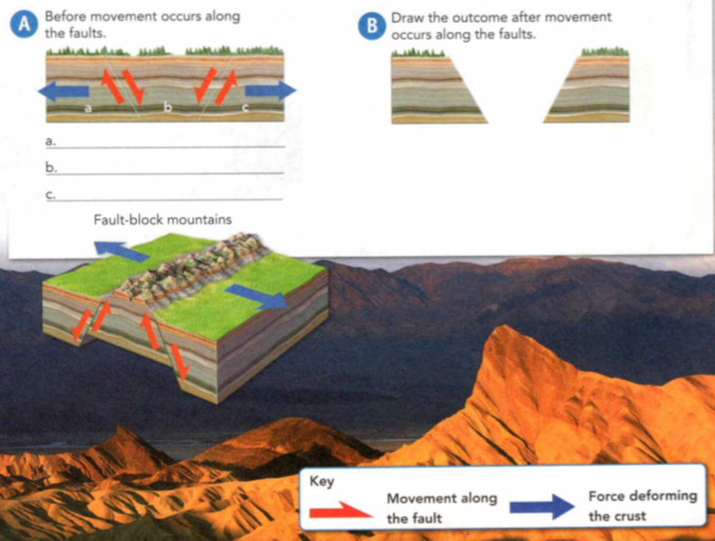
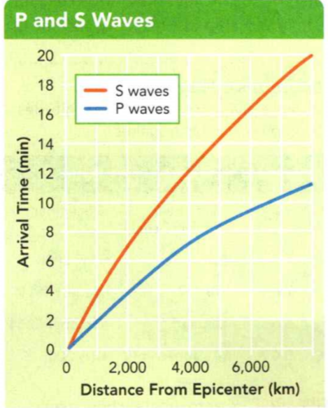

### Earth Science

## Geology

https://en.wikibooks.org/wiki/High_School_Earth_Science

## Earthquakes

- A force is a push or pull exerted on an object.
- Mass is a measure of the amount of matter an object contains and its
resistance to movement.
- Volume is the amount of space that matter occupies.

**Complete the tasks below.**

1. Ann's parents couldn't move the huge boulder from their yard. The force of
their pushing didn't budge the rock. "Let's crush it," said Ann's morn. She went
on, "Smaller pieces will each have smaller mass and volume. Then we can move the
rock one piece at a time." What features of the boulder make it hard to move?

2. Identify the sentence below that uses the scientific meaning of the word fault.
A) Errors in the test were the test writer's fault.
B) The San Andreas fault runs along the coast of California.

### Chapter Preview

- stress
- tension
- compression
- shearing
- normal fault
- reverse fault
- strike-slip fault
- plateau
- earthquake
- focus
- epicenter
- P wave
- S wave
- surface wave
- seismograph
- Modified Mercalli scale
- magnitude
- Richter scale
- moment magnitude scale
- seismogram

### Forces in Earth's Crust

- How Does Stress Change Earth's Crust?
- How Do Faults Form?
- How Does Plate Movement Create New Landforms?

**Complete the tasks below.**

Still Growing! Mount Everest in the Himalayas is the highest mountain on Earth.
Climbers who reach the peak stand 8,850 meters above sea level. You might think
that mountains never change. But forces inside Earth push Mount Everest at least
several millimeters higher each year. Over time, Earth' forces slowly but
constantly lift stretch, bend, and break Earth's crust in dramatic ways! How
long do you think it took Mount Everest to form? Hundreds of years? Thousands?
Millions? Explain.

### How Does Stress Change Earth's Crust?

Rocks are hard and stiff. But the movement of Earth's plates can create strong
forces that slowly bend or fold many rocks like a caramel candy bar. Like the
candy bar, some rocks may only bend and stretch when a strong force is first
applied to them. But beyond a certain limit, all rocks in Earth's brittle upper
crust will break.

Forces created by plate movement are examples of stress. **Stress** is a force that
acts on rock to change its shape or volume. Geologists often express stress as
force per unit area. Because stress increases as force increases, stress adds
energy to the rock. The energy is stored in the rock until the rock changes
shape or breaks.

Three kinds of stress can occur in the crust—tension, compression, and shearing.
**Tension, compression, and shearing work over millions of years to change the
shape and volume of rock.** Most changes in the crust occur only very slowly, so
that you cannot directly observe the crust bending, stretching, or breaking.
Figure 1 shows the three types of stress.

  <figure>
    
    <figcaption>Figure 1. Stress in Earth's Crust.</figcaption>
  </figure>

### Tension 

Rock in the crust can be stretched so that it becomes thinner in the middle.
This process can make rock seem to act like a piece of warm bubble gum. The
stress force that pulls on the crust and thins rock in the middle is called
**tension**. Tension occurs where two plates pull apart.

### Compression 

One plate pushing against another plate can squeeze rock like a giant trash
compactor. The stress force that squeezes rock until it folds or breaks is
called **compression**. Compression occurs where two plates come together.

### Shearing 

Stress that pushes a mass of rock in two opposite directions is called **shearing**.
Shearing can cause rock to break and slip apart or to change its shape. Shearing
occurs where two plates slip past each other.

**Complete the tasks below.**

1. Stress can push, pull, or squeeze rock in Earth's crust. Look at the pair of
arrows in the second diagram in Figure 1. These arrows show how tension affects
rock. Draw a pair of arrows on the third diagram to show how compression affects
rock. Then, draw a pair of arrows on the bottom diagram to show how shearing
acts on rock.

### How Do Faults Form?

Recall that a fault is a break in the rock of the crust where rock surfaces slip
past each other. Most faults occur along plate boundaries, where the forces of
plate motion push or pull the crust so much that the crust breaks. **When
enough stress builds up in rock, the rock breaks, creating a fault.** There are
three main types of faults: normal faults, reverse faults, and strike-slip
faults.

### Normal Faults 

The Rio Grande River flows through a wide valley in New Mexico. Here, tension
has pulled apart two pieces of Earth's crust, forming the valley. Where rock is
pulled apart by tension in Earth's crust, normal faults form. In a **normal fault**,
the fault cuts through rock at an angle, so one block of rock sits over the
fault, while the other block lies under the fault. The block of rock that sits
over the fault is called the hanging wall. The rock that lies under the fault is
called the footwall. The diagram of the normal fault in Figure 2 shows how the
hanging wall sits over the footwall. When movement occurs along a normal fault,
the hanging wall slips downward. Normal faults occur where two plates diverge,
or pull apart.

 <figure>
    
    <figcaption>Figure 2. Faults.</figcaption>
  </figure>

### Reverse Faults 

The northern Rocky Mountains rise high above the western United States and
Canada. These mountains were gradually lifted up over time by movement along
reverse faults. A **reverse fault** has the same structure as a normal fault, but
the blocks move in the reverse direction. That is, the hanging wall moves up and
the footwall moves down. Figure 2 shows a reverse fault. Reverse faults form
where compression pushes the rock of the crust together.

### Strike-Slip Faults 

The hilly plains in southern California are split by the San Andreas fault,
shown in Figure 2. Here, shearing has produced a strike-slip fault. In a
**strike-slip fault**, the rocks on either side of the fault slip past each other
sideways, with little up or down motion. A strike-slip fault that forms the
boundary between two plates is called a transform boundary. The San Andreas
fault is an example of a transform boundary.

  <figure>
    
    <figcaption>Figure 3. Thrust Fault.</figcaption>
  </figure>

### How Does Plate Movement Create New Landforms?
Most changes in the crust occur so slowly that they cannot be observed directly. But what if you could speed up time so that a billion years passed by in minutes? Then, you could watch the movement of Earth's plates fold, stretch, and uplift the crust over wide areas.	Over millions of years, the forces of plate movement
can change a flat plain into features such as anticlines and synclines, folded mountains, fault-block mountains, and plateaus.

### Folding Earth's Crust 

Have you ever skidded on a rug that wrinkled up as your feet pushed it across
the floor? Sometimes plate movements can cause Earth's crust to fold much like
the rug. Then, rocks stressed by compression may bend without breaking.

### How Folds Form 

Folds are bends in rock that form when compression shortens and thickens Earth's
crust. A fold can be a few centimeters across or hundreds of kilometers wide.
Figure 4 shows folds in rock that were exposed when a road was cut through a
hillside in California.

  <figure>
    
    <figcaption>Figure 4. Folded Rock.</figcaption>
  </figure>

### How Anticlines and Synclines Form 

Geologists use the terms anticline and syncline to describe upward and downward
folds in rock. A fold in rock that bends upward into an arch is an anticline, as
shown in Figure 5. A fold in rock that bends downward to form a Vshape is a
syncline. Anticlines and synclines are found in many places where compression
forces have folded the crust. The central Appalachian Mountains in Pennsylvania
are folded mountains made up of anticlines and synclines.

  <figure>
    
    <figcaption>Figure 5. Anticlines and Synclines.</figcaption>
  </figure>

### How Folded Mountains Form 

The collision of two plates can cause compression and folding of the crust over
a wide area. Folding produced some of the world's largest mountain ranges. The
Himalayas in Asia and the Alps in Europe formed when pieces of the crust folded
during the collision of two plates. These mountains formed over millions of
years.

### Stretching Earth's Crust 

If you traveled by car from Salt Lake City to Los Angeles, you would cross the
Great Basin. This region contains many mountains separated by broad valleys, or
basins. The mountains form from tension in Earth's crust that causes faulting.
Such mountains are called fault-block mountains.

How do fault-block mountains form? Where two plates move away from each other,
tension forces create many normal faults. Suppose two normal faults cause
valleys to drop down on either side of a block of rock. This process is shown in
the diagram that accompanies the photograph in Figure 6. As the hanging wall of
each normal fault slips downward, the block in between now stands above the
surrounding valleys, forming a fault-block mountain.

  <figure>
    
    <figcaption>Figure 6. Tension and Normal Faults.</figcaption>
  </figure>

### Uplifting Earth's Crust 

The forces that raise mountains can also uplift, or raise, plateaus. A **plateau**
is a large area of flat land elevated high above sea level. Some plateaus form
when forces in Earth's crust push up a large, flat block of rock. Like a fancy
sandwich, a plateau consists of many different flat layers, and is wider than it
is tall. Forces deforming the crust uplifted the Colorado Plateau in the "Four
Corners" region of Arizona, Utah, Colorado, and New Mexico. Figure 7 shows one
part of that plateau in northern Arizona.

  <figure>
    
    <figcaption>Figure 7. The Kaibab Plateau.</figcaption>
  </figure>

**Complete the tasks below.**

1. Faults, see Figure 2. The three main types of faults are defined by the
direction in which rock moves along the fault.
a) Label the hanging wall and footwall.
b) Label the hanging wall and footwall.
c) Label the hanging wall and footwall.
d) Label the hanging wall and footwall.

2. Fill in the blanks to indicate how rock moves. 
a) Normal fault: In a normal fault, the language wall ___ relative to the footwall.
b) Reverse fault: In a reverse fault, the hanging wall moves ____ relative to the footwall.

3. The low angle of a thrust fault allows rock in the hanging wall to be pushed
great distances. For example, over millions of years, rock along the Lewis
thrust fault in Glacier National Park has moved 80 kilometers.
a) Based on the arrows showing fault movements in the diagram, a thrust fault is
a type of (normal fault/reverse fault).
b) Why might the type of rock in the hanging wall of the Lewis thrust fault be
different from the type of rock in the footwall?

4. When enough stress builds up in brittle rock, the rock breaks, causing a ____
to form.

5. A geologist sees a fault along which blocks of rock in the footwall have
moved higher relative to blocks of rock in the hanging wall. What type of fault
is this?

6. Identify the sentence that uses the scientific meaning of fold.
A) The rock cooked as crushed a my shirts if I don't fold them.
B) Rock that bends without breaking may form a fold.

7. Anticlines and Synclines, see Figure 5. Compression can cause folds in the
crust. Two types of folding are anticlines, which arch up, and synclines,
which dip down. 
a) Draw arrows to show the direction in which forces act to compress the crust.
b) Draw arrows to show the direction in which forces act to compress the crust.
c) Label the anticline and the syncline.
d) Label the anticline and the syncline.

8. When two normal faults cause valleys to drop down on either side of a block
of rock, what type of landform results?

9. Tension and Normal Faults, see Figure 6. As tension forces pull the crust
apart, two normal faults can form a fault-block mountain range, as you can see
in the diagram below. The mountain range in the photograph is in the Great
Basin. Valleys can also form as a result of two normal faults.
a) Label the hanging wall and the two footwalls in diagram A. 
b) Label the hanging wall and the two footwalls in diagram A. 
c) Label the hanging wall and the two footwalls in diagram A. 
d) In diagram B, draw the new position of the hanging wall after movement
occurs. Describe what happens.

10. The Kaibab Plateau forms the North Rim of the Grand Canyon. The plateau is
the flat-topped landform in the right half of the photograph. Look at the
sequence of drawings in Figure 7. In your own words, describe what happens in
the last two diagrams.
a) Diagram a)
b) Diagram b)

11. Normal faults often occur when two plates (come together/pull apart).

12. Look at the diagram that accompanies the photograph in Figure 6. Does the
block of rock in the middle move up as a result of movement along the normal
faults? Explain.

### Earthquakes and Seismic Waves

- I What Are Seismic Waves?
- I How Are Earthquakes Measured? 
- How Is an Epicenter Located?

**Complete the tasks below.**

1. Witness to Disaster. On May 12, 2008, a major earthquake struck China.
American reporter Melissa Block was conducting a live radio interview in that
country at the moment the earthquake struck. "What's going on?" Block asked. She
remained on the air and continued: "The whole building is shaking. The whole
building is SHAKING." Block watched as the ground moved like waves beneath her
feet. The top of the church across the street started to fall down. For minutes,
the ground continued to vibrate under Block's feet. The earthquake that day
killed about 87,000 people.
a) What does Melissa Block's experience tell you about the way the ground can
move during an earthquake?
b) How do you think you would react during an earthquake or other disaster?

### What Are Seismic Waves?

Earth is never still. Every day, worldwide, several thousand earthquakes are
detected. An **earthquake** is the shaking and trembling that results from movement
of rock beneath Earth's surface. Most earthquakes are too small to notice. But a
large earthquake can crack open the ground, shift mountains, and cause great
damage.

### Cause of Earthquakes 

The forces of plate movement cause earthquakes. Plate movements produce stress
in Earth's crust, adding energy to rock and forming faults. Stress increases
along a fault until the rock slips or breaks, causing an earthquake. In seconds,
the earthquake releases an enormous amount of stored energy. Some of the energy
released during an earthquake travels in the form of seismic waves. **Seismic
waves are vibrations that are similar to sound waves. They travel through Earth
carrying energy released by an earthquake.** The speed and path of the waves in
part depend on the material through which the waves travel.

 <figure>
    
    <figcaption>Figure 8. Earthquake.</figcaption>
  </figure>

### Types of Seismic Waves 

Like a pebble thrown into a pond, the seismic waves of an earthquake race out in
every direction from the earthquake's focus. The **focus** is the area
beneath Earth's surface where rock that was under stress begins to break or
move. This action triggers the earthquake. The point on the surface directly
above the focus is called the **epicenter**.

Most earthquakes start in the lithosphere, within about 100 kilometers beneath
Earth's surface. Seismic waves carry energy from the earthquake's focus. This
energy travels through Earth's interior and across Earth's surface. That
happened in 2002, when a powerful earthquake ruptured the Denali fault in
Alaska, shown in Figure 9.

  <figure>
    
    <figcaption>Figure 9. Seismic Waves.</figcaption>
  </figure>

There are three main categories of seismic waves. These waves are P waves, S
waves, and surface waves. But an earthquake sends out only P and S waves from
its focus. Surface waves can develop wherever P and S waves reach the surface.

  <figure>
    
    <figcaption>Figure 10. P, S and Surface Waves.</figcaption>
  </figure>

### P Waves 

The first waves to arrive are primary waves, or **P waves**. P waves are seismic
waves that compress and expand the ground like an accordion. Like the other
types of seismic waves, P waves can damage buildings. Look at Figure 10 A to see
how P waves move.

### S Waves 

After P waves come secondary waves, or **S waves**. S waves are seismic waves that
can vibrate from side to side (as shown in Figure 10 B) or up and down. Their
vibrations are at an angle of 90° to the direction that they travel. When S
waves reach the surface, they shake structures violently. While P waves travel
through both solids and liquids, S waves cannot move through liquids.

### Surface Waves 

When P waves and S waves reach the surface, some of them become surface waves.
Surface waves move more slowly than P and S waves, but they can produce severe
ground movements. These waves produce movement that is similar to waves in
water, where the water's particles move in a pattern that is almost circular.
Surface waves can make the ground roll like ocean waves (Figure 10 C) or shake
buildings from side to side.

### How Are Earthquakes Measured?

Geologists monitor earthquakes by measuring the seismic waves they produce. This
is done in two ways. **The amount of earthquake damage or shaking that is felt is
rated using the Modified Mercalli scale. The magnitude, or size, of an
earthquake is measured on a seismograph using the Richter scale or moment
magnitude scale.** A **seismograph** is an instrument that records and measures an
earthquake's seismic waves.

### The Modified Mercalli Scale
The **Modified Mercalli** scale rates the amount of shaking from an earthquake. The
shaking is rated by people's observations, without the use of any instruments.
This scale is useful in regions where there aren't many instruments to measure
an earthquake's strength. The table in Figure 11 describes the 12 steps of the
Mercalli scale. To rank examples of damage, look at the photographs in Figure 11.

### The Richter Scale 

An earthquake's magnitude is a single number that geologists assign to an
earthquake based on the earthquake's size. There are many magnitude scales.
These scales are based on the earliest magnitude scale, called the Richter
scale. Magnitude scales like the Richter scale rate the magnitude of small
earthquakes based on the size of the earthquake's waves as recorded by
seismographs. The magnitudes take into account that seismic waves get smaller
the farther a seismograph is from an earthquake.

  <figure>
    
    <figcaption>Figure 11. Modified Mercali Scale.</figcaption>
  </figure>

### The Moment Magnitude Scale
Geologists use the **moment magnitude scale** to rate the total energy an
earthquake releases. News reports may mention the Richter scale, but the number
quoted is almost always an earthquake's moment magnitude. To assign a magnitude
to an earthquake, geologists use data from seismographs and other sources. The
data allow geologists to estimate how much energy the earthquake releases.
Figure 12 gives the magnitudes of some recent, strong earthquakes.

  <figure>
    
    <figcaption>Figure 12. Earthquake Magnitude.</figcaption>
  </figure>

### Comparing Magnitudes 

An earthquake's moment magnitude tells geologists how much energy was released
by an earthquake. Each one-point increase in magnitude represents the release of
roughly 32 times more energy. For example, a magnitude 6 earthquake releases 32
times as much energy as a magnitude 5 earthquake.

An earthquake's effects increase with magnitude. Earthquakes with a magnitude
below 5 are small and cause little damage. Those with a magnitude above 6 can
cause great damage. The most powerful earthquakes, with a magnitude of 8 or
above, are rare. In the 1900's, only three earthquakes had a magnitude of 9 or
above. More recently, the 2004 Sumatra earthquake had a magnitude of 9.2.

### How Is an Epicenter Located?

When an earthquake occurs, geologists try to pinpoint the earthquake's
epicenter. Why? Locating the epicenter helps geologists identify areas where
earthquakes may occur in the future.

**Geologists use seismic waves to locate an earthquake's epicenter.** To do this,
they use data from thousands of seismograph stations set up all over the world.
However, you can use a simpler method to find an earthquake's epicenter.

Recall that seismic waves travel at different speeds. P waves arrive at a
seismograph first. Then S waves follow close behind. Look at the graph, P and S
Waves, below. Suppose you know when P waves arrived at a seismograph after an
earthquake, and when S waves arrived. You can read the graph to find the
distance from the seismograph to the epicenter. Notice that the farther away an
earthquake is from a given point, the greater the time between the arrival of
the P waves and the S waves.

Suppose you know the distance of three seismograph stations from an epicenter.
You can then draw three circles to locate the epicenter. Look at Figure 14. The
center of each circle is a particular seismograph's location. The radius of each
circle is the distance from that seismograph to the epicenter. The point where
the three circles intersect is the location of the epicenter.

  <figure>
    
    <figcaption>Figure 14. Determining an Earthquake's Epicenter.</figcaption>
  </figure>

**Complete the tasks below.**

1. Earthquakes start below the surface of Earth. But an earthquake's seismic
waves do not carry energy only upward, toward Earth's surface. They also carry
energy downward, through Earth's interior. Look at the drawing showing Earth's
interior in Figure 8. At which point(s) can seismic waves be detected?
A) A only
B) A and B
C) A, B, and C 

2. Earthquakes start below the surface of Earth. But an earthquake's seismic
waves do not carry energy only upward, toward Earth's surface. They also carry
energy downward, through Earth's interior. Look at the drawing showing Earth's
interior in Figure 8. 
a) At which point do you think the seismic waves will have the most energy? 
b) Explain why.

3. Number the order in which seismic waves would be felt:
I) At an earthquake's epicenter
II) At a distance of 500 km from the earthquake's focus
III) At the earthquake's focus

4. Seismic Waves, see Figure 9. The diagram shows how seismic waves traveled
during an earthquak: along the Denali fault. Match the two points in the diagram
a) Focus: Point __
b) Epicenter: Point __

5. Seismic Waves, see Figure 9. The diagram shows how seismic waves traveled
during an earthquak: along the Denali fault. Write a short, science-based news
article that describes how, why, and where the earthquake took place. Include a
headline.

6. P, S, and Surface Waves, see Figure 10. Earthquakes release stored energy as
seismic waves. Draw a line from each type of seismic wave to the movement it
causes. 

7. The energy released by an earthquake moves out from the earthquake's ____ in
the form of seismic waves. 

8. Small earthquakes occur along a certain fault several times a year. Why might
geologists worry if no earthquakes occur for 25 years?

9. Modified Mercalli Scale, see Figure 11 The Modified Mercalli scale uses Roman
numerals to rate the damage and shaking at any given location, usually close to
the earthquake. Assign a Modified Mercalli rating to each photograph.

10. Earthquake Magnitude. The table in Figure 12 gives the moment magnitudes of
some recent earthquakes. Approximately how many times stronger was the
earthquake in Turkey than the earthquake in Japan?

11. The ___ scale rates earthquakes based on the amount of energy that is
released.

12. Suppose the moment magnitude of an earthquake is first thought to be 6, but
is later found to be 8. Would you expect the earthquake damage to be more or
less serious? Why?

  <figure>
    
    <figcaption>Figure 13. P and S Waves.</figcaption>
  </figure>

13. Seismic Wave Speeds, see Figure 13. Seismographs at five observation
stations recorded the arrival times of the P and S waves produced by an earth-
quake. These data were used to draw the graph.
a) What variable is shown on the x-axis of the graph? 
b) What variable is shown on the y-axis?
c) How long did it take the S waves to travel 2,000 km?
d) How long did it take the P waves to travel 2,000 km?
e) What is the difference in the arrival times of the P waves and the S waves at
2,000 km? 
f) At 4,000 km?

14. Determining an Earthquake's Epicenter, see Figure 14. The map shows how to
find the epicenter of an earthquake using data from three seismographic
stations. Suppose a fourth seismographic station is located in San Diego. What
was the approximate difference in arrival times of P and S waves here? Hint: Use
the map scale to determine how far San Diego is from the epicenter. Then, use
the graph in Figure 13 to find your answer.

15. Geologists use ___ to locate an earthquake's epicenter.

16. What can geologists measure to tell how far an earthquake's epicenter is
from a particular seismograph?

17. Suppose an earthquake occurs somewhere in California. Could a seismograph on
Hawaii be used to help locate the epicenter of the earthquake? Why or why not?

### Monitoring Earthquakes
- How Do Seismographs Work?
- What Patterns Do Seismographic Data Reveal?

**Complete the tasks below.**

1. Whole Lot of Shaking Going On. Is the ground moving under your school? A
project that will monitor shaking underneath the entire nation might help you
find out! In 2004, scientists in the USArray project placed 400 seismographs
across the western United States. Every month, 18 seismographs are picked up and
moved east, "leapfrogging" the other seismographs. The map in Figure 15 shows one
arrangement of the array. The seismic data that are obtained will help
scientists learn more about our active Earth! When the array arrives in your
state, what information might it provide?

  <figure>
    
    <figcaption>Figure 15. Seismographs.</figcaption>
  </figure>

### How Do Seismographs Work?

Today, seismographs are complex electronic devices. Some laptop computers and
car air bags contain similar devices that detect shaking. But a simple
seismograph, like the one in Figure 11, can consist of a heavy weight attached to
a frame by a spring or wire. A pen connected to the weight rests its point on a
drum that can rotate.

As the drum rotates, the pen in effect draws a straight line on paper wrapped
tightly around the drum. **Seismic waves cause a simple seismograph's drum to
vibrate, which in turn causes the pen to record the drum's vibrations.** The
suspended weight with the pen attached moves very little. This allows the pen to
stay in place and record the drum's vibrations.

### Measuring Seismic Waves 

When you write a sentence, the paper stays in one place while your hand moves
the pen. But in a seismograph, it's the pen that remains stationary while the
paper moves. Why is this? All seismographs make use of a basic principle of
physics: Whether it is moving or at rest, every object resists any change to its
motion. A seismograph's heavy weight resists motion during an earthquake. But
the rest of the seismograph is anchored to the ground and vibrates when seismic
waves arrive.

  <figure>
    
    <figcaption>Figure 16. Recording Seismic Waves.</figcaption>
  </figure>

  <figure>
    
    <figcaption>Figure 17. Seismograms.</figcaption>
  </figure>

### Reading a Seismogram 

You have probably seen the zigzagging lines used to represent an earthquake. The
pattern of lines, called a **seismogram**, is the record of an earthquake's seismic
waves produced by a seismograph. Study the seismogram in Figure 17. Notice when
the P waves, S waves, and surface waves arrive. The height of the lines drawn by
the seismograph is greater for a more severe earthquake or an earthquake closer
to the seismograph.

### What Patterns Do Seismographic Data Reveal?

Geologists use seismographs to monitor earthquakes. Other devices that
geologists use detect slight motions along faults. Yet even with data from many
different devices, geologists cannot yet predict when and where an earthquake
might strike. **But from past seismographic data, geologists have created maps
of where earthquakes occur around the world. The maps show that earthquakes
often occur along plate boundaries.** Recall that where plates meet, plate
movement stores energy in rock that makes up the crust. This energy is
eventually released in an earthquake.

### Earthquake Risk in North America 

Earthquake risk largely depends on how close a given location is to a plate
boundary. In the United States, two plates meet along the Pacific coast in
California, Washington state, and Alaska, causing many faults. Frequent
earthquakes occur in California, where the Pacific plate and the North American
plate meet along the San Andreas fault. In Washington, earthquakes result from
the subduction of the Juan de Fuca plate beneath the North American plate.
Recall that during subduction, one plate is forced down under another plate.

  <figure>
    
    <figcaption>Figure 18. Map.</figcaption>
  </figure>

### Earthquake Risk Around the World 

Many of the world's earthquakes occur in a vast area of geologic activity called
the Ring of Fire. In this area, plate boundaries form a ring around the Pacific
Ocean. Volcanoes as well as earthquakes are common along these boundaries.The
Ring of Fire includes the west coast of Central America and the west coast of
South America. Strong earthquakes have occurred in countries along these coasts,
where plates converge. Across the Pacific Ocean, the Pacific Plate collides with
several other plates. Here, Japan, Indonesia, New Zealand, and New Guinea are
seismically very active. One of the most powerful earthquakes ever recorded
occurred off the coast of Japan on March 11, 2011.

India, China, and Pakistan also have been struck by large earthquakes. In this
area of the world, the Indo-Australian Plate collides with the Eurasian Plate.
Earthquakes are also common where the Eurasian Plate meets the Arabian and
African plates.

  <figure>
    
    <figcaption>Figure 19. Earthquakes Around the World.</figcaption>
  </figure>

**Complete the tasks below.**

1. Seismograms, see Figure 17. When an earthquake's seismic waves reach a simple
seismograph, the seismograph's drum vibrates. The vibrations are recorded by the
seismograph's pen, producing a seismogram, as shown on the diagram.
An aftershock is a smaller earthquake that occurs after a larger earthquake.
Draw the seismogram that might be produced by a seismograph during an earthquake
and its aftershock. Label the earthquake and the aftershock.

2. The height of the lines on a seismogram is (greater/less) for a stronger
earthquake.

3. What do the relatively straight, flat portions of the seismogram in Figure 17
represent?

4. The map in Figure 18 shows areas where serious earthquakes are likely to
occur, based on the location of past earthquakes across the United States.
a) The map indicates that serious earthquakes are most likely to occur (on the east
coast/in the midsection/on the west coast) of the United States.
b) Based on the evidence shown in the map, predict where you think plate
boundaries lie. Explain your reasoning.

5. Earthquakes Around the World, see Figure 19.
Earthquakes are closely linked to plate tectonics. The map shows where past
earthquakes have occurred in relation to plate boundaries.
a) Draw an outline tracing the plate boundaries that make up the Ring of Fire. 
b) Look at North America. Draw a star where buildings should be built to withstand
earthquakes. 
c) Put an X where there is less need to design buildings to withstand strong
shaking. Do the same for another continent (not Antarctica). Explain your
answers.

6. Earthquakes in Alaska, see Figure 19. Look at the map of Alaska. Earthquakes
here are the result of subduction. 
a) Draw the plate boundary. 
b) Then draw arrows on either side of the boundary to show the direction in
which the plates move relative to each other.

7. The ____ stored in rocks as a result of plate movement can be released in an
earthquake.

8. Why do earthquakes occur more often in some places than in others?

9. Earthquakes often occur along ____ , where ____ stores energy in rock that
makes up the crust.

### Study Guide

- Tension, compression, and shearing work over millions of years to change the
shape and volume of rock.

- When enough stress builds up in rock, the rock breaks, creating a fault.

- Plate movement can change a flat plain into features such as folds, folded
mountains, fault-block mountains, and plateaus.

- Seismic waves carry energy produced by an earthquake.

- The amount of earthquake damage or shaking that is felt is rated using the
Modified Mercalli scale. An earthquake's magnitude, or size, is measured using
the Richter scale or moment magnitude scale.

- Geologists use seismic waves to locate an earthquake's epicenter.

- Seismic waves cause a simple seismograph's drum to vibrate, which in turn
causes the pen to record the drum's vibrations.

- From past seismographic data, geologists have created maps of where
earthquakes occur around the world. The maps show that earthquakes often occur
along plate boundaries.

**Complete the tasks below.**

1. Which force squeezes Earth's crust to make the crust shorter and thicker?
A) tension
B) normal
C) shearing
D) compression

2. Rocks on either side of a ___ fault slip past each other with little up and down motion.

3. Give two examples of mountain ranges in the world that have been caused by folding.

4. What type of stress is shown in the diagram in Figure 20?

  <figure>
    
    <figcaption>Figure 20. Stress.</figcaption>
  </figure>

5. Plateaus are large, flat, elevated areas of land. What is one way plateaus can form?

6. Compression causes folds called anticlines and synclines. 
a) How do these features resemble each other? 
b) How do they differ from one another?

7. Which of these scales rates earthquake damage at a particular location?
A) focus
B) Modified Mercalli
C) Richter
D) moment magnitude

8. The point on Earth's surface directly above an earthquake's focus is called ___ .

9. Label the diagram in Figure 21 to show the directions an S wave travels and vibrates.

  <figure>
    
    <figcaption>Figure 21. S Wave.</figcaption>
  </figure>

10. How is the energy released by an earthquake related to its moment magnitude?

11. Can geologists use data from only two seismographic stations to locate an
earthquake's epicenter? Explain.

12. Seismograph A records P waves at 6:05 P.M. and S waves at 6:10 P.M.
Seismograph B) records P waves at 6:10 P.M. and S waves at 6:25 P.M. 
a) What is the difference in the arrival times at each device? 
b) Which device is closer to the earthquake's epicenter?

13. In which type of location is earthquake risk the greatest?
A) at plate centers
B) on big plates
C) at plate boundaries 
D) on small plates

14. Very high, jagged lines on a seismogram indicate that an earthquake is either ___ .

  <figure>
    
    <figcaption>Figure 22. Arrival Times of P and S Waves.</figcaption>
  </figure>

15. Use the graph in Figure 22 to answer this question. Which type of seismic
waves produced the largest ground movement?

16. Use the graph in Figure 22 to answer this question. What was the difference
in arrival times for the P waves and the S waves?

17. There is a high risk of earthquakes along the San Andreas fault in
California. What is happening in Earth's crust along the fault to cause this
high earthquake risk? Use the theory of plate tectonics in your answer.

  <figure>
    
    <figcaption>Figure 23. Indo Austalian Plate.</figcaption>
  </figure>

18. An architect is hired to design a skyscraper in the Indonesian city of
Jakarta see Figure 23, which is near the Ring of Fire. The architect must follow
special building codes that the city has written. What might those codes be for
and why are they important in Jakarta?

  <figure>
    
    <figcaption>Figure 24. Rock affected by stress.</figcaption>
  </figure>

19. The diagram in Figure 24 shows a mass of rock affected by stress. What type
of stress process is shown in this diagram?
A) pulling apart
B) tension
C) compression
D) shearing 

20. An earthquake occurs along a fault when
A) energy in the rock along the fault does not change for a long period of time.
B) stress in the rock along the fault causes the rock to melt.
C) enough energy builds up in the rock along the fault to cause the rock to
break or slip.
D) energy in the rock along the fault is changed to heat.

21. Which scale would a geologist use to estimate the total energy released by an
earthquake?
A) Modified Mercalli scale
B) Richter scale
C) epicenter scale
D) moment magnitude scale 

 
22. When an earthquake occurs, seismic waves travel
A) only through the hanging wall.
B) only through the footwall. 
C) outward from the focus.
D) inward to the epicenter.

23. Where are the areas that are at greatest risk from earthquakes?
A) in the center of plates
B) where plates meet
C) in the middle of the ocean
D) where land meets water

  <figure>
    
    <figcaption>Figure 25. Fault.</figcaption>
  </figure>

22. Explain the process that forms a normal fault and leads to an earthquake
along the fault, see Figure 25. Describe the fault, the type of stress that
produces it, and events that occur before and during the earthquake.

