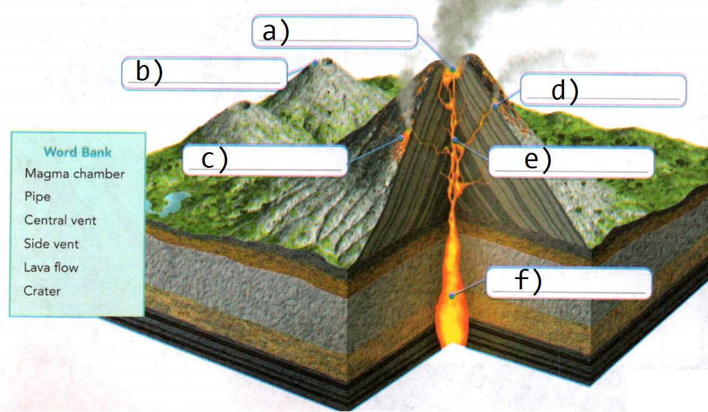
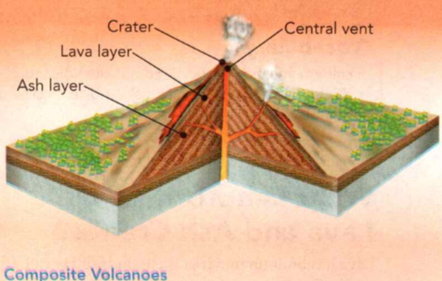
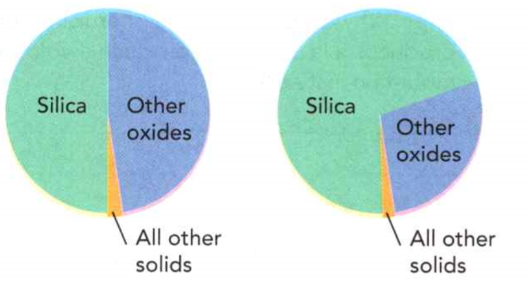

### Earth Science

## Geology

## Volcanoes

The **crust** is Earth's rocky, outer layer.

A **plate** is one of the large pieces that Earth's crust is broken into.

**Boundaries** are lines along which something ends.

**Complete the tasks below.**

1. Mr. Carenni said, "For today's activity, let's make a model of Earth's crust.
We can think of the crust as a thin film of ice resting on top of a much thicker
layer of hard, packed snow. Now let's suppose that the ice breaks into pieces.
On Earth, these pieces are called plates. The edges of the plates are called
boundaries." Suppose two pieces of ice are pushed slowly together. What might
happen to the edges of the pieces?

2. **surface**: the exterior or outermost layer of an object The surface of Earth
is very rocky. **stage**: a point in a process, Middle age is one stage of life.
**hazard**: a possible danger, Forest fires can be a hazard for people living
near the woods. When a volcano erupts, the lava can be a ____ for cities and
towns nearby.

### Chapter Preview

- volcano
- magma
- lava
- Ring of Fire 
- island arc
- hot spot
- magma chamber
- pipe 
- vent 
- lava flow
- crater
- silica
- pyroclastic flow
- dormant
- extinct
- caldera
- cinder cone
- composite volcano 
- shield volcano
- volcanic neck
- dike
- sill
- batholith

### Volcanoes and Plate Tectonics
- Where Are Volcanoes Found on Earth's Surface?

**Complete the tasks below.**

1. Mountain of Fire, Mountain of Ice Climbers who struggle up the snow-packed
slopes of Mount Erebus on Antarctica may be in for an unpleasant surprise. Balls
of scorching molten rock three meters across might come hurtling out of the air
and land just steps from climbers' feet! Why? Because Mount Erebus is one of
Earth's southernmost volcanoes. Scientists believe that Mount Erebus lies over
an area where material from Earth's mantle rises and then melts. The melted
material reaches the surface at Mount Erebus. How did Mount Erebus form?

### Where Are Volcanoes Found on Earth's Surface?

The eruption of a volcano can be awe-inspiring. Molten material can be spewed
high into the atmosphere. Villages can be buried in volcanic ash. A **volcano** is a
mountain that forms in Earth's crust when molten material, or magma, reaches the
surface. **Magma** is molten mixture of rock-forming substances, gases, and water
from the mantle. When magma reaches the surface, it is called **lava**. After magma
and lava cool, they form solid rock.

### Volcanoes and Plate Boundaries 
Are volcanoes found randomly across Earth? No, in
general, volcanoes form a regular pattern on Earth. To understand why, look at
the map in Figure 1. Notice how volcanoes occur in many great, long belts. EiM
**Volcanic belts form along the boundaries of Earth's plates.**

Volcanoes can occur where two plates pull apart, or diverge. Here, plate
movements cause the crust to fracture. The fractures in the crust allow magma to
reach the surface. Volcanoes can also occur where two plates push together, or
converge. As the plates push together, one plate can sink beneath the other
plate. Water that is brought down with the sinking plate eventually helps to
form magma, which rises to the surface.

The **Ring of Fire**, shown in Figure 1, is one major belt of volcanoes. It includes
the many volcanoes that rim the Pacific Ocean. The Ring of Fire includes the
volcanoes along the coasts of North and South America and those in Japan and the
Philippines.

  <figure>
    
    <figcaption>Figure 1. Ring of Fire.</figcaption>
  </figure>

### Diverging Boundaries 

Volcanoes form along the mid-ocean ridges, where two plates move apart.
Mid-ocean ridges form long, underwater mountain ranges that sometimes have a
rift valley down their center. Along the rift valley, lava pours out of cracks
in the ocean floor. This process gradually builds new mountains. Volcanoes also
form along diverging plate boundaries on land. For example, large volcanoes are
found along the Great Rift Valley in East Africa.

### Converging Boundaries 
Many volcanoes form near converging plate boundaries, where two oceanic plates
collide. Through subduction, the older, denser plate sinks into the mantle and
creates a deep-ocean trench. Water in the sinking plate eventually leaves the
crust and rises into the wedge of the mantle above it. As a result, the melting
point of the mantle in the wedge is lowered. So, the mantle partially melts. The
magma that forms as a result rises up. This magma can break through the ocean
floor, creating volcanoes.

The resulting volcanoes sometime create a string of islands called an **island
arc**. Look at Figure 2. The curve of an island arc echoes the curve of its
deep-ocean trench. Major island arcs include Japan, New Zealand, the Aleutians,
and the Caribbean islands.

  <figure>
    
    <figcaption>Figure 2. Volcanoes and Converging Boundaries.</figcaption>
  </figure>

Volcanoes also occur where an oceanic plate is subducted beneath a continental
plate. Collisions of this type produced the volcanoes of the Andes Mountains in
South America. In the United States, plate collisions also produced the
volcanoes of the Pacific Northwest, including Mount St. Helens and Mount
Rainier.

### Hot Spots 

Not all volcanoes form along plate boundaries. Some volcanoes are the result of
"hot spots" in Earth's mantle. A **hot spot** is an area where material from deep
within Earth's mantle rises through the crust and melts to form magma.

**A volcano forms above a hot spot when magma erupts through the crust and reaches
the surface.** Hot spots stay in one place for many millions of years while the
plate moves over them. Some hot spot volcanoes lie close to plate boundaries.
Others lie in the middle of plates. Yellowstone National Park in Wyoming marks a
huge hot spot under the North American plate.

**Complete the tasks below.**

1. The Ring of Fire, see Figure 1. The Ring of Fire is a belt of volcanoes that
circles the Pacific Ocean. As with most of Earth's volcanoes, these volcanoes
form along boundaries of tectonic plates. Circle a volcano on the map that does
not fall along a plate boundary. Why did this volcano form here? 

2. Volcanoes often form belts along plate boundaries. How does Figure 1
illustrate that this statement holds true for North America?

3. Volcanoes and Converging Boundaries, see Figure 2. Volcanoes often form where
two plates collide. Identify the arrows to show the direction of plate movement. 
a) A) <== B) ==>
b) A) <== B) ==>
c) A) <== B) ==>
d) A) <== B) ==>
e) A) <== B) ==>
f) A) <== B) ==>

3. Volcanoes and Converging Boundaries, see Figure 2. Compare and contrast the
ways volcanoes form at A and B.

  <figure>
    
    <figcaption>Figure 3. Hawaiian Islands.</figcaption>
  </figure>

4. The Hawaiian Islands have formed one by one as the Pacific plate drifts
slowly over a hot spot, see Figure 3. This process has taken millions of years.
a) The hot spot is currently forming volcanic mountains on the island of
(Oahu/Maui/Hawaii). 
b) Do you think Maui will erupt again? Why or why not? 
c) Which island is older—Kauai or Maui? Why?

5. A volcano is a mountain that forms in Earth's crust when ___ reaches the surface.

6. Can volcanoes form under water? Why or why not?

### Volcanic Eruptions
- What Happens When a Volcano Erupts? 
- What Are the Stages of Volcanic Activity?

**Complete the tasks below.**

1. Can lava look like hair from the top of your head? It often does in Hawaii!
Here, hikers may come across thin strands of hardened material that shimmer like
gold in the sunlight. These thin strands are Pele's hair. Pele is the Hawaiian
goddess of volcanoes and fire. Her "hair" is actually volcanic glass! It forms
when tiny drops of molten lava fly into the air. The wind stretches these drops
into threads that are as thin as hair. The glass strands then settle in crevices
in the ground, forming clumps. How does Pele's hair form?

### What Happens When a Volcano Erupts?

Lava begins as magma. Magma usually forms in the somewhat soft layer of hot,
solid rock that lies in the upper mantle, just below a layer of harder rock. The
magma is less dense than the material that is around it. So it rises into any
cracks in the rock above. If this magma reaches the surface, a volcano can form.

### Inside a Volcano 

  <figure>
    
    <figcaption>Figure 4. Inside a Volcano.</figcaption>
  </figure>

A volcano is more than a large, cone-shaped mountain. Inside a volcano is a
system of passageways through which magma moves, as shown in Figure 4.
- **Magma chamber** All volcanoes have a pocket of magma beneath the surface.
Beneath a volcano, magma collects in a magma chamber. During an eruption, the
magma forces its way through one or more cracks in Earth's crust.
- **Pipe** Magma moves upward through a pipe, a long tube that extends from Earth's
crust up through the top of the volcano, connecting the magma chamber to Earth's
surface.
- **Vent** Molten rock and gas leave the volcano through an opening called a
vent. Some volcanoes have a single central vent at the top. But volcanoes often
have vents on the sides also.
- **Lava** flow A lava flow is the spread of lava as it pours out of a vent.
- **Crater** A crater is a bowl-shaped area that may form at the top of a volcano
around the central vent.

### A Volcanic Eruption 

Perhaps you know that dissolved carbon dioxide gas is trapped in every can of
soda. But did you know that dissolved gases are trapped in magma? These
dissolved gases are under great pressure. During an eruption, as magma rises
toward the surface, the pressure of the surrounding rock on the magma decreases.
The dissolved gases begin to expand, forming bubbles. These bubbles are much
like the bubbles in the soda can. As pressure falls within the magma, the size
of the gas bubbles increases greatly. These expanding gases exert great force. 
**When a volcano erupts, the force of the expanding gases pushes magma from the
magma chamber through the pipe until it flows or explodes out of the vent.** Once
magma escapes from the volcano and becomes lava, the remaining gases bubble out.

### Two Types of Volcanic Eruptions 

Some volcanic eruptions occur gradually, over days, months, or even years.
Others are great explosions. **Geologists classify volcanic eruptions as quiet
or explosive.** Whether an eruption is quiet or explosive depends in part on the
magma's silica content and whether the magma is thin and runny or thick and
sticky. **Silica** is a material found in magma that forms from the elements oxygen
and silicon. Temperature also helps determine how fluid, or runny, magma is.

  <figure>
    
    <figcaption>Figure 5. Types of Magma.</figcaption>
  </figure>

### Quiet Eruptions 

A volcano erupts quietly if its magma is hot or low in silica. Hot, low-silica
magma is thin and runny and flows easily. The gases in the magma bubble out
gently. Low-silica lava oozes quietly from the vent and can flow for many
kilometers.

Quiet eruptions can produce different types of lava, as shown in Figure 6. The
different types of lava harden into different types of rock. Pahoehoe forms from
fast-moving, hot lava that is thin and runny. The surface of pahoehoe looks like
a solid mass of ropelike coils. Aa forms from lava that is cooler and thicker.
The lava that aa forms from is also slower-moving. Aa has a rough surface
consisting of jagged lava chunks.

  <figure>
    
    <figcaption>Figure 6. Lava From Quiet Eruptions.</figcaption>
  </figure>

Mostly quiet eruptions formed the Hawaiian Islands. On the island of Hawaii,
lava pours from the crater near the top of Kilauea. Lava also flows out of long
cracks on the volcano's sides. In general, the temperature of magma and lava can
range from about 750°C to I175°C—hot enough to melt copper! Quiet eruptions have
built up the island of Hawaii over hundreds of thousands of years.

### Explosive Eruptions 

A volcano erupts explosively if its magma is high in silica. High-silica magma
is thick and sticky. This type of magma can build up in the volcano's pipe,
plugging it like a cork in a bottle. Dissolved gases, including water vapor,
cannot escape from the thick magma. The trapped gases build up pressure until
they explode. The erupting gases and steam push the magma out of the volcano
with incredible force. That's what happened during the eruption of Mount St.
Helens in Washington State. This eruption is shown in Figure 7.

  <figure>
    
    <figcaption>Figure 7. Mount St. Helens.</figcaption>
  </figure>

An explosive eruption throws lava powerfully into the air where it breaks into
fragments that quickly cool and harden into pieces of different sizes. The
smallest pieces are volcanic ash. Volcanic ash is made up of fine, rocky
particles as small as a speck of dust. Pebble-sized particles are called
cinders. Larger pieces, called bombs, may range from the size of a golf ball to
the size of a car.

### Volcano Hazards 
Both quiet eruptions and explosive eruptions can cause damage far from a
crater's rim. For example, during a quiet eruption, lava flows from vents,
setting fire to, and often burying, everything in its path. A quiet eruption can
cover large areas with a thick layer of lava.

During an explosive eruption, a volcano can belch out a mixture of dangerous
materials such as hot rock and ash. This mixture of materials can form a
fast-moving cloud that rushes down the sides of the volcano. A **pyroclastic
flow** is the mixture of hot gases, ash, cinders, and bombs that flow down the
sides of a volcano when it erupts explosively. Landslides of mud, melted snow,
and rock can also form from an explosive eruption. Figure 8 shows one result of
an explosive eruption.

  <figure>
    
    <figcaption>Figure 8. Mount Pinatubo Eruption 1991</figcaption>
  </figure>

### What Are the Stages of Volcanic Activity?

The activity of a volcano may last from less than a decade to more than 10
million years. But most long-lived volcanoes do not erupt continuously. You can
see the pattern of activity by looking at the eruptions of volcanoes in the
Cascade Range, shown in Figure 9. Mount Jefferson has not erupted in at least
15,000 years. Will it ever erupt again? **Geologists often use the terms
active, dormant, or extinct to describe a volcano's stage of activity.**

An active, or live, volcano is one that is erupting or has shown signs that it
may erupt in the near future. A **dormant**, or sleeping, volcano is a volcano that
scientists expect to awaken in the future and become active. An **extinct**, or
dead, volcano is a volcano that is unlikely to ever erupt again. For example,
hot-spot volcanoes may become extinct after they drift away from the hot spot.

Changes in activity in and around a volcano may give warning shortly before a
volcano erupts. Geologists use special instruments to detect these changes. For
example, tiltmeters can detect slight surface changes in elevation and tilt
caused by magma moving underground. Geologists can also monitor gases escaping
from the volcano. They monitor the many small earthquakes that occur around a
volcano before an eruption. The upward movement of magma triggers these
earthquakes. Also, rising temperatures in underground water may signal that
magma is nearing the surface.

  <figure>
    
    <figcaption>Figure 9. Cascade Volcanos.</figcaption>
  </figure>

**Complete the tasks below.**

1. A volcano is made up of many different parts, see Figure 4. Place each word
in its proper place in the diagram. (Magma chamber, Pipe, Central vent, Side
vent, Lava flow, Crater)
a)
b)
c)
d)
e)
f)

2. A system is a group of parts that function as a whole. Describe why a volcano
might be considered a system.

3. Stromboli volcano lies on an island off the coast of Italy. The volcano has
been erupting almost constantly for at least 2,400 years! Expanding gases
dissolved in magma cause the eruption to be nearly constant.

4. Magma Composition, see Figure 5. Magma varies in composition. It is
classified according to the amount of silica it contains. The less silica that
the magma contains, the more easily it flows.
a) What materials make up both types of magma?
b) Which type of magma has more silica? How much silica does this magma contain?
c) Which of these magmas do you think might erupt in a dramatic explosion? Why?

5. Lava From Quiet Eruptions, see Figure 6. Quiet eruptions can produce two
different types of lava. 
a) Which lava is hardening to form aa? 
b) Which is hardening to form pahoehoe? 
c) Describe the texture of aa.
d) Describe the texture of pahoehoe.

6. Types of Volcanic Eruptions
a) Quiet eruption Kilauea,  _____	.
b) Explosive eruption ____, high-silica magma.

7. The explosive eruption of Mount St. Helens in 1980 blew off the top of the
mountain, see Figure 7. Explain how dissolved gases caused Mount St. Helens to
erupt explosively.

8. Volcano Hazards, see Figure 8. In 1991, Mount Pinatubo in the Philippines
erupted explosively. Consider the effects of lava, ash, and gases. What hazards
did Mount Pinatubo present to towns near the volcano? 

9. Two types of volcanic eruptions are ___ .

10. Some volcanoes have great glaciers on their slopes. Why might these glaciers
be a hazard if a volcano erupts?

11. Cascade Volcanoes, see Figure 9. The Cascade volcanoes have formed as the
Juan de Fuca plate sinks beneath the North American plate.
a) Identify the three volcanoes that appear to be the most active.
b) Why might geologists still consider Mount Jefferson to be an active volcano?

  <figure>
    
    <figcaption>Figure 10. Mount Rainier.</figcaption>
  </figure>

12. How does a volcano erupt? Mount Rainier is part of the Cascade vulcanoes,
see Figures 9 & 10. All past eruptions of Mount Rainier have included ash and
lava. 
a) How might Mount Rainier erupt in the future? Include the role of plate
tectonics in your answer. 
b) Discuss Mount Rainier's history and its current stage of activity.

13. A volcano that is currently erupting is called an ___ volcano.
A) active
B) dormant
C) extinct

14. How does a volcano erupt?

### Volcanic Landforms

- What Landforms Do Lava and Ash Create? 
- What Landforms Does Magma Create?

**Complete the tasks below.**

1. Jackson: I was subjected to the sight of an active, dangerous volcano. We
were on Hawaii, in a small aircraft over the Big Island. The volcano was quite
large—maybe a few miles in diameter. Out of the top of this volcano, there was
an immense pillar of smoke, being blown out to sea by the Hawaiian winds.
Judging by the patterns of the hardened lava on the slopes of the volcano, it
was a shield volcano. The whole area was literally oozing with volcanic
activity. Quite a few large depressions had formed where presumably there had
been a magma pocket that collapsed in on itself.
a) What landforms were created by the volcano that Jackson saw?
b) If you had a chance to visit Hawaii, would you prefer to see a volcano from
an airplane or from the ground? Explain.

### What Landforms Do Lava and Ash Create?

Lava has built up much of the islands of Hawaii. In fact, for much of Earth's
history, volcanic activity on and beneath Earth's surface has built up Earth's
land areas and formed much of the ocean crust. **Volcanic eruptions create
landforms made of lava, ash, and other materials. These landforms include shield
volcanoes, cinder cone volcanoes, composite volcanoes, and lava plateaus. Other
landforms include calderas, which are the huge holes left by the collapse of
volcanoes.** A caldera is shown in Figure 11.

### Calderas

Large eruptions can empty the main vent and magma chamber beneath a volcano.
With nothing to support it, the mountain top may collapse inward. A **caldera** is
the hole left when a volcano collapses. A lake can form, filling the hole. If
the volcano erupts again, a steep-walled cone may form in the middle.

  <figure>
    
    <figcaption>Figure 11. Calderas.</figcaption>
  </figure>

### Cinder Cone Volcanoes
If a volcano's magma has high silica content, it will be thick and sticky. So
the volcano can erupt explosively, producing ash, cinders, and bombs. These
materials can build up around the vent in a steep, cone-shaped hill or small
mountain that is called a **cinder cone**. For example, Paricutin in Mexico erupted
in 1943 in a farmer's cornfield. The volcano built up a cinder cone that was
about 400 meters high.

  <figure>
    
    <figcaption>Figure 12. Cinder Cone Volcanoes.</figcaption>
  </figure>

### Composite Volcanoe
Sometimes, the silica content of magma can vary. So eruptions of lava -flows
alternate with explosive eruptions of ash, cinder, and bombs. The result is a
composite volcano. **Composite volcanoes** are tall, cone-shaped mountains in which
layers of lava alternate with layers of ash. Mount Fuji in Japan and Mount St.
Helens in Washington State are composite volcanoes. Composite volcanoes can be
more than 4,800 meters tall.

  <figure>
    
    <figcaption>Figure 13. Composite Volcanoes.</figcaption>
  </figure>

### Shield Volcanoes

At some spots on Earth's surface, thin layers of lava pour out of a vent and
harden on top of previous layers. Such lava flows slowly build a wide, gently
sloping mountain called a shield volcano. Hot spot volcanoes that form on the
ocean floor are usually shield volcanoes. For example, in Hawaii, Mauna Loa
rises 9,000 meters from the ocean floor.

  <figure>
    
    <figcaption>Figure 14. Shield Volcanoes.</figcaption>
  </figure>

### Lava Plateaus

Lava can flow out of several long cracks in an area. The thin, runny lava floods
the area and travels far before cooling and solidifying. After millions of
years, repeated floods of lava can form high, level plateaus. These plateaus are
called lava plateaus. The Columbia Plateau is a lava plateau that covers parts
of Washington State, Oregon, and Idaho.

  <figure>
    
    <figcaption>Figure 15. Lava Plateaus.</figcaption>
  </figure>

### What Landforms Does Magma Create?

Sometimes magma cools and hardens into rock before reaching the surface. Over
time, forces such as flowing water, ice, or wind may strip away the layers above
the hardened magma and expose it. **Features formed by magma include volcanic
necks, dikes, and sills, as well as dome mountains and batholiths.**

### Volcanic Necks 

Look at Figure 17. The landform that looks like a giant tooth stuck in the
ground is Shiprock in New Mexico. Shiprock formed when magma hardened in an
ancient volcano's pipe. Later, the softer rock around the pipe wore away,
exposing the harder rock inside. A **volcanic neck** forms when magma hardens in a
volcano's pipe and the surrounding rock later wears away.

  <figure>
    
    <figcaption>Figure 17. Vocanic Necks, Dikes, and Sills.</figcaption>
  </figure>

### Dikes and Sills 

Magma that forces itself across rock layers hardens into a **dike**. Magma that
squeezes between horizontal rock layers hardens to form a **sill**.

### Dome Mountains 

Bodies of hardened magma can create dome mountains. A dome mountain forms when
uplift pushes a large body of hardened magma toward the surface. The hardenec
magma forces the layers of rock to bend upward into a dome shape. Eventually,
the rock above the dome mountain wears away, leaving it exposed. This process
formed the Black Hills in South Dakota.

### Batholiths 

How large can landforms created by magma be? Look at the map in Figure 18. A
**batholith** is a mass of rock formed when a large body of magma cools inside
the crust. Batholiths form the core of many mountain ranges. Over millions of
years, the overlying rock wears away, allowing the batholith to move upward.
Flowing water and grinding ice slowly carve the batholith into mountains.

  <figure>
    
    <figcaption>Figure 18. Batholiths.</figcaption>
  </figure>

**Complete the tasks below.**

  <figure>
    
    <figcaption>Figure 16. Volcanic Mountains.</figcaption>
  </figure>

1. Volcanic Mountains, see Figure 16. Lava from volcanoes cools and hardens to
form lava plateaus and three types of mountains.
a) Identify the type of volcanic landform shown in each of the two photographs
at the right.
b) Use the graphic organizer to compare and contrast two types of volcanoes.

2. How a Catdera Forms, see Figure 11. Crater Lake in Oregon fills an almost
circular caldera. In your own words, describe what is happening in the sequence
of diagrams below.

3. The Hawaiian Islands are very fertile, or able to support plant growth. In
fact, many areas near volcanoes have rich, fertile soil. The rich soil forms
after hard lava and ash break down. The ash releases substances that plants need
to grow.
a) What type of industry might you expect to find on land near volcanoes?
b) Lava flows could force people to flee their homes on the island of Hawaii.
But in 2006, sales from crops on the island totaled over $153 million. Are the
risks worth the rewards? Explain.

4. Volcanic landforms can be built up by (lava only/ash only/both lava and ash).

5. Suppose lava from a certain volcano has built up a steep, cone-shaped hill
around a central vent. What can you conclude about the kind of lava that formed
the volcano?

6. What type of landform can be created when magma hardens in a volcano's pipe?
A) Sil
B) Dike
C) Volcanic neck

7. A dike extends outward from Shiprock, a volcanic neck in New Mexico, see Figure 17.
a) Label the formation. 
b) Label the formation. 
c) Label the formation. 
d) How can you tell which is which?

8. Bathotithg, see Figure 18. Batholiths are common in the western United
States. The mountains shown here are part of the Sierra Nevada batholith. About
how long is the Sierra Nevada batholith? (Hint: Use the map and map key.)

9. Dikes and sills are two examples of landforms created when (magma/lava)
forces its way through cracks in the upper crust.

10. What feature forms when magma cuts across rock layers?

11. Infer Which is older-a dike or the rock layers the dike cuts across?
Explain.

12. A volcano erupts when the force of expanding gases pushes ___ from the magma
chamber through the ____ until it flows or explodes out of the ___ .

### Study Guide

- Volcanic belts form along the boundaries of Earth's plates.

- A volcano forms above a hot spot when magma erupts through the crust and
reaches the surface.

- When a volcano erupts, the force of the expanding gases pushes magma from the
magma chamber through the pipe until it flows or explodes out of the vent.

-	Geologists classify volcanic eruptions as quiet or explosive.

- Geologists often use the terms active, dormant, or extinct to describe a
volcano's stage of activity.

- Volcanic eruptions create landforms made of lava, ash, and other materials.
These landforms include shield volcanoes, cinder cone volcanoes, composite
volcanoes, and lava plateaus. Other landforms include calderas, or the huge
holes left by the collapse of volcanoes

- Features formed by magma include volcanic necks, dikes, and sills, as well as
dome mountains and batholiths.

**Complete the tasks below.**

1. At what point does magma become lava?
A) below a vent
B) inside a pipe
C) at Earth's surface
D) in Earth's mantle

2. Magma reaches the surface by erupting through a volcano, which is a ___ .

3. Does magma consist only of rock-forming materials? Explain.

4.  What causes volcanoes to form along a mid-ocean ridge?

5. Look at the diagram in Figure 19. Draw an arrow to indicate the direction of
plate movement.

 <figure>
    
    <figcaption>Figure 19. Oceanic plate and hot spot.</figcaption>
  </figure>

6. What role do converging plates play in the formation of volcanoes?

7. What type of rock forms from thin and runny, fast-moving lava?
A) pyroclastic
B) silica
C) as
D) pahoehoe

8. As magma rises to the surface during an eruption, pressure on the magma
decreases, allowing gas bubbles to ____ .

9. What is an extinct volcano?

10. Predict How might a volcano be hazardous for plants and animals that live nearby?

11. A certain volcano has erupted only explosively in the past. Another volcano
has erupted only quietly. The magma composition for both volcanoes is shown in
Figure 20. Identify the chart showing the magma composition for the volcano that
erupted quietly. Explain.

  <figure>
    
    <figcaption>Figure 20. Magma compositions.</figcaption>
  </figure>

12. What type of volcanic mountain is composed of layers of lava that alternate
with layers of ash?
A) cinder cone
B) composite volcano
C) shield volcano
D) caldera

13. Sometimes magma creates batholiths, which are ___ .

14. What type of volcano forms when thin layers of lava pour out of a vent and
harden on top of previous layers?

15. Use the illustration in Figure 21 to answer the question. Why doesn't the
type of eruption that produces a lava plateau produce a volcanic mountain
instead?

  <figure>
    
    <figcaption>Figure 21. Lava plateau.</figcaption>
  </figure>

16. Compare and contrast dikes and sills.

17. You are a blogger who interviews geologists. A certain geologist has just
returned from studying a nearby volcano. The geologist tells you that the
volcano may soon erupt. Write three questions you would ask the geologist about
her evidence, her prediction about the type of eruption that will occur, and
about the role of plate tectonics in the eruption. Write an answer for each of
your questions.

  <figure>
    
    <figcaption>Figure 22. Volcano.</figcaption>
  </figure>

18. What volcanic feature is forming in the diagram in Figure 22?
A) island arc	
B) mid-ocean ridge
C) caldera	
D) diverging bounda

19. Which of the following landforms is formed by magma?
A) caldera
B) dome mountain
C) cinder cone volcano
D) composite volcano

20. What type of feature can form when magma hardens between horizontal layers
of rock?
A) volcanic neck 
B) dike
C) cinder cone
D) sill 

21. Which is the first step in the formation of a hot-spot volcano?
A) Material in the mantle rises and melts.
B) Lava erupts and forms an island. 
C) Two plates move apart.
D) Magma flows through a pipe.

22. Which is potentially the most far-reaching hazard of a volcanic eruption?
A) ash, dust, and gases
B) landslide
C) pyroclastic flow
D) explosion and fire

  <figure>
    
    <figcaption>Figure 23. Volcano.</figcaption>
  </figure>

23. A geologist observes the area and a large volcano, see Figure 23. She decides that this
volcano must once have had an explosive erotion. What evidence might have led
her to this conclussion? Discuss the type of magma produces an explosive
eruption and the rocks that would result from an explosive eruption.

