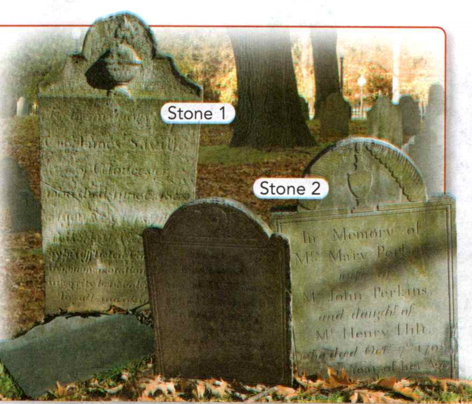

### Earth Science

## Geology

## Weathering and Soil

**Minerals** are naturally occurring, inorganic solids that have specific crystal
structures and specific chemical compositions.

A **physical change** is any change that does not alter the chemical composition of
a substance.

A **chemical change** produces one or more new substances.

**Complete the tasks below.**

1. The **minerals** that make up a rock determine some of the rock's properties. The
properties of a rock can change in two ways: **physical changes** and **chemical
changes**. Physical changes change the shape or size of a rock, but not its
composition. Chemical changes can change minerals into other substances,
changing the composition of the rock. How can you tell if a physical change has
occurred in a rock?

2. People who (conserve/conservation) energy are contributing to energy
(conserve/conservation).

### Chapter Preview

- uniformitarianism
- erosion
- weathering
- mechanical weathering
- chemical weathering
- abrasion
- frost wedging
- oxidation
- permeable
- soil
- bedrock
- humus
- fertility
- loam
- pH scale
- soil horizon
- topsoil
- subsoil
- decomposer
- natural resource
- soil conservation
- crop rotation
- contour plowing
- conservation plowing

### Rocks and Weathering

- What Breaks Down Rocks?
- What Causes Weathering?
- How Fast Does Weathering Occur?

**Complete the tasks below.**

1. Wearing Away Mars Does this scene look like a desert? It is - but not on
Earth! These rocks are found on Mars. Blowing sand wears away some rocks on the
surface. Fog conteining,acid dissolves and breaks down other rocks. Over time,
the rocks break down into small particles, covering the planet with reddish
sand.
a) What are two processes that break down rocks on Mars?
b) Give an example of rocks you have seen that were changed by natural
processes.

### What Breaks Down Rocks?

Even the hardest rocks wear down over time—on Earth or on Mars. Natural
processes break down rocks and carry the pieces away.

How do scientists know what processes shaped Earth in the past? Geologists make
inferences based on the principle of **uniformitarianism**. This principle
states that the geologic processes that operate today also operated in the past.
Scientists can infer that ancient landforms and features formed through the same
processes they observe today.

### Erosion 

**Erosion** is the process of wearing down and carrying away rocks. Erosion includes
the breaking of rocks into smaller pieces. It also involves the removal of rock
particles by wind, water, ice, or gravity.

### Weathering 

**Weathering** is the process that breaks down rock and other substances. Heat,
cold, water, ice, and gases all contribute to weathering. The forces that wear
down mountains like those in Figure 1 also cause bicycles to rust, paint to
peel, and sidewalks to crack. **Erosion works continuously to weather and carry
away rocks at Earth's surface.**

  <figure>
    
    <figcaption>Figure 1. Effects of Weathering.</figcaption>
  </figure>

### What Causes Weathering?

If you hit a rock with a hammer, the rock may break into pieces. Some forces of
weathering break rock into pieces, as a hammer does. The type of weathering in
which rock is physically broken into smaller pieces is called **mechanical
weathering**. A second type of weathering, called chemical weathering, also breaks
down rock. **Chemical weathering** is the process that breaks down rock through
chemical changes.

### Mechanical Weathering 

If you have seen rocks that are cracked or split in layers, then you have seen
rocks that have undergone mechanical weathering. Mechanical weathering usually
works slowly. But over very long periods of time, it does more than wear down
rocks. Mechanical weathering, as part of erosion, eventually wears away whole
mountains.

  <figure>
    
    <figcaption>Figure 2. Forces of mechanical Weathering.</figcaption>
  </figure>

### Animal Actions

Animals that burrow in the ground-including moles, gophers, prairie dogs, and
some insects—loosen and break apart rocks in the soil.

### Freezing and Thawing

When water freezes in a crack in a rock, it expands and makes the crack bigger.
The process of frost wedging also widens cracks in sidewalks and causes potholes
in streets.

### Plant Growth

Plant roots enter cracks in rocks. As roots grow, they force the cracks apart.
Over time, the roots of even small plants can pry apart cracked rocks.

### Release of Pressure

As erosion removes material from the surface of a mass of rock, pressure on the
rock is reduced. This release of pressure causes the outside of the rock to
crack and flake off like the layers of an onion.

### Abrasion
Sand and other rock particles that are carried by wind, water, or ice can wear
away exposed rock surfaces like sandpaper on wood.

### Agents of Mechanical Weathering 

**The natural agents of mechanical weathering include freezing and thawing,
release of pressure, plant growth, actions of animals, and abrasion.**
**Abrasion** refers to the wearing away of rock by rock particles carried by
water, ice, wind, or gravity. Human activities, such as mining and farming, can
also cause weathering. 

In cool climates, the most important agent of mechanical weathering is the
freezing and thawing of water. Water seeps into cracks in rocks and freezes
there, expanding as it freezes. The ice then forces the rock apart. Wedges of
ice in rocks widen and deepen cracks. This process is called **frost wedging**.
When the ice melts, water seeps deeper into the cracks. With repeated freezing
and thawing, the cracks slowly expand until pieces of rock break off.

  <figure>
    
    <figcaption>Figure 3. The old Man of the Mountain.</figcaption>
  </figure

The Old Man of the Mountain was a rock formation in New Hampshire that looked
like a face. But it collapsed suddenly on May 3, 2003. Mechanical and chemical
weathering wore away rock behind the "chin" of the face, causing the whole
face to fall.

### Chemical Weathering 

Chemical weathering can produce new minerals as it breaks down rock. For
example, granite is made up of several minerals, including feldspars. As a
result of chemical weathering, the feldspar minerals eventually change to clay.

Chemical and mechanical weathering often work together. Chemical weathering
creates holes or soft spots in rock, so the rock breaks apart more easily. As
rocks break into pieces, more surface area is exposed to chemical weathering, as
shown in Figure 4.

  <figure>
    
    <figcaption>Figure 4. Weathering and surface area.</figcaption>
  </figure>

### Agents of Chemical Weathering 

**The agents of chemical weathering include water, oxygen, carbon dioxide,
living organisms, and acid rain.**

**Water** Water weathers some rock by dissolving it. Water also carries other
substances that dissolve or break down rock, including oxygen, carbon dioxide,
and other chemicals.

**Oxygen** The oxygen gas in air is an important cause of chemical weathering.
Iron combines with oxygen in the presence of water in a process called
oxidation. The product of iron oxidation is rust. Rust makes rock soft and
crumbly and gives it a red or brown color.

**Carbon Dioxide** Another gas found in air, carbon dioxide, also causes
chemical weathering when it dissolves in water. The result is a weak acid called
carbonic acid. Carbonic acid easily weathers some kinds of rocks, such as marble
and limestone.

**Living Organisms** As a plant's roots grow, they produce weak acids that
slowly dissolve rock around the roots. Lichens—plantlike organisms that grow on
rocks—also produce weak acids.

**Acid Rain** Rainwater is naturally slightly acidic. Burning coal, oil, and gas
for energy can pollute the air with sulfur, carbon, and nitrogen compounds.
These compounds react with water vapor in clouds, making acids that are stronger
than normal rainwater. These acids mix with raindrops and fall as acid rain.
Acid rain causes very rapid chemical weathering of rock.

  <figure>
    
    <figcaption>Figure 5. Chemical Weathering.</figcaption>
  </figure>

### How Fast Does Weathering Occur?

Visitors to New England's historic cemeteries may notice a surprising fact.
Slate tombstones carved in the 1700s are less weathered and easier to read than
marble gravestones from the 1800s. Why is this so? Some kinds of rocks weather
more rapidly than others. **The most important factors that determine the rate at
which weathering occurs are the type of rock and the climate.**

### Type of Rock 

The minerals that make up the rock determine how fast it weathers. Rocks that
are made of minerals that do not dissolve easily will weather slowly. Rocks
weather faster if they are made of minerals that do dissolve easily.

Some rocks weather more easily because they are permeable. **Permeable** means
that a material is full of tiny, connected air spaces that allow water to seep
through it. The spaces increase the surface area of the rock. As water seeps
through the spaces in the rock, it carries chemicals that dissolve the rock. The
water also removes material broken down by weathering.

### Climate 

Climate refers to the average weather conditions in an area. Both chemical and
mechanical weathering occur faster in wet climates. Rainfall provides the water
needed for chemical changes as well as for freezing and thawing.

Chemical reactions occur faster at higher temperatures. That is why chemical
weathering occurs more quickly where the climate is both hot and wet. Human
activities, such as those that produce acid rain, also increase the rate of
weathering.

**Complete the tasks below.**

1. Effects of Weathering, see Figure 1. The Sierra Nevada (below) are much
younger than the Appalachians (right). How might the Sierras change in
the future? Explain your answer.

2. Forces of Mechanical Weathering, see Figure 2. 
a) Match description to an example shown in the photo on the right.
b) Match description to an example shown in the photo on the right.
c) Match description to an example shown in the photo on the right.
d) Match description to an example shown in the photo on the right.
e) Match description to an example shown in the photo on the right.
f) How might more than one agent of mechanical weathering operate in the same
place?

3. Weathering and Surface Area, see Figure 4. Weathering breaks rock into smaller
pieces. While the pieces are usually irregularly shaped, you can model the
process with cubes.The diagram shows what would happen if a rock cube broke into
smaller cubes.
a) By how much does the surface area increase? 
b) How would the rate of weathering change?

4. Chemical Weathering, see Figure 5. Acid rain chemically weathered the statue
of the lion. Which agent of chemical weathering most likely formed this
limestone cavern?

5. (Mechanical/chemical) weathering physically breaks rock into smaller pieces.

6 Use these examples of weathering: Freezing and thawing, oxidation, water
dissolving chemicals, abrasion, acid rain 
a) Identify the examples of chemical weathering. 
b) Identify the examples of mechanical weathering.

7. Many ancient monuments are made of marble. Some are located in highly
polluted cities. How might the pollution affect the monuments?

  <figure>
    
    <figcaption>Figure 6. Weathering rates of limestone.</figcaption>
  </figure>

8. Which Weathered Faster, see Figure 6?
The data table shows how much stone was lost due to weathering for two identical
pieces of limestone from different locations.
a) Use the data to make a double-line graph. Be sure to label the axes and
provide a key and a title.
b) (Stone A/Stone B) weathered at a faster rate.
c) What can you infer caused the difference in the rates of weathering?

9. Identify the reason that chemical weathering occurs faster in hot climates.

  <figure>
    
    <figcaption>Figure 7. Tombstones.</figcaption>
  </figure>

10. Tombstones 1 and 2 are both around 200 years old and are in the same
cemetery, see Figure 7.
a) (Stone 1/Stone 2) has weathered more.
b) What might explain the difference?
c) How do you know that the type of rock is the only difference between the
tombstones?

11. Why does permeable rock weather more quickly than less permeable rock?

12. Why are tombstones in a cemetery useful for comparing rates of weathering?

### How Soil Forms
- What Is Soil?
- How Do Living Things Affect Soil?

**Complete the tasks below.**

1. Life Beneath Your Feet The soil beneath your feet may not look very
interesting, but it's packed with life! Many microscopic organisms live in soil
and affect the lives of other organisms. Some bacteria, like the Pseudomonas
shown above, can protect plants from disease Hundreds of thousands of sail mites
can live in a single square meter of soil. And tiny worms called nematodes eat
plants, bacteria, fungi, and even other nematodes! Use what you have read and
your experiences to answer the questions below.
a) What are some examples of organisms that live in soil?
b) Describe soil you have seen or touched. What did it feel like? How did it
smell? What creatures did you see in it?

### What Is Soil?

Have you ever seen a plant growing in a crack in a rock? It may look like the
plant is growing on solid rock, but it isn't. Plants can only grow when soil
begins to form in the cracks. Soil is the loose, weathered material on Earth's
surface in which plants can grow.

### Soil Composition 
**Soil is a mixture of rock particles, minerals, decayed organic material,
water, and air.** One of the main ingredients of soil comes from bedrock. Bedrock
is the solid layer of rock beneath the soil. Once bedrock is exposed to air,
water, and living things, it gradually weathers into smaller and smaller
particles that are the most common components of soil.

The particles of rock in soil are classified by size as gravel, sand, silt, and
clay. Figure 8 shows the relative sizes of these particles. Together, gravel,
sand, silt, and clay make up the portion of soil that comes from weathered rock.

The decayed organic material in soil is called humus. Humus is a
dark-colored substance that forms as plant and animal remains decay. Humus helps
create spaces in soil for air and water. Humus also contains nutrients that
plants need.

  <figure>
    
    <figcaption>Figure 8. Soil Particle Size.</figcaption>
  </figure>

### Soil Fertility 

Fertile soil is rich in the nutrients that plants need to grow. The **fertility** of
soil is a measure of how well the soil supports plant growth. Soil that is rich
in humus generally has high fertility. Sandy soil containing little humus has
low fertility.

### Soil Texture 

Sandy soil feels coarse and grainy, but soil with lots of clay feels smooth and
silky. These differences are differences in texture. Soil texture depends on the
size of the soil particles.

Soil texture is important for plant growth. Soil that is mostly clay may hold
too much water and not enough air. In contrast, sandy soil loses water quickly.
Plants may die for lack of air or water. Soil that is made up of about equal
parts of clay, sand, and silt is called **loam**. Loam is the best soil for growing
most plants.

### Soil pH 

Soil can be acidic or basic. Acidic substances react with some metals and turn
blue litmus paper red. Basic substances feel slippery and turn red litmus paper
blue. The **pH scale** measures acidity. A substance with a pH less than 4 is
strongly acidic. A substance with a pH of 7 is neither acidic nor basic. (Pure
water has a pH of 7.) A substance with a pH greater than 10 is strongly basic.
Most garden plants grow best in soil with a pH between 6 and 7.5. Some soils can
have a pH as low as 4, which is quite acidic.

### The Process of Soil Formation 
**Soil forms as rock is broken down by weathering and mixes with other materials
on the surface.** Soil forms constantly wherever bedrock weathers. Soil formation
continues over a long period of time. 

Gradually, soil develops layers called horizons. A **soil horizon** is a layer of
soil that differs in color, texture, and composition from the layers above or
below it. Figure 10 shows how scientists classify soil into three horizons.

### C Horizon 

The C horizon forms as bedrock begins to weather. The rock breaks up into small
particles.

### A Horizon 

The A horizon is made up of **topsoil**, a crumbly, dark brown soil that is a
mixture of humus, clay, and other minerals. Topsoil forms as plants add organic
material to the soil, and plant roots weather pieces of rock.

### B Horizon 

The B horizon, often called **subsoil**, usually consists of clay and other
particles of rock, but little humus. It forms as rainwater washes these
materials down from the A horizon.

  <figure>
    
    <figcaption>Figure 10. Soil Layers.</figcaption>
  </figure>

### How Do Living Things Affect Soil?

Many organisms live in soil. **Some soil organisms make humus, the material that
makes soil fertile. Other soil organisms mix the soil and make spaces in it for
air and water.**

### Forming Humus 

Dead leaves, roots, and other plant materials contribute most of the organic
remains that form humus. Humus forms in a process called decomposition.
**Decomposers** are the organisms that break the remains of dead organisms into
smaller pieces and digest them with chemicals. This material then mixes with the
soil as humus. Soil decomposers include fungi (such as mushrooms), bacteria,
worms, and other organisms.

### Mixing the Soil 

Earthworms and burrowing mammals mix humus with air and other materials in soil.
As earthworms eat their way through the soil, they carry humus down to the
subsoil and subsoil up to the surface. Mammals such as mice, moles, and prairie
dogs break up hard, compacted soil and mix humus with it. Animal wastes
contribute nutrients to the soil as well.

  <figure>
    
    <figcaption>Figure 11. Life in Soil.</figcaption>
  </figure>

**Complete the tasks below.**

1. Soil Particle Size, see Figure 8. The particles shown here have been
enlarged. 
a) Mark where a 1.5-mm particle would fall on the graph. 
b) What type of particle is it?

2. How does adding the suffix -ity change the form of the word fertile?

  <figure>
    
    <figcaption>Figure 9. Soil texture triangle.</figcaption>
  </figure>

3. The diagram in Figure 9 is called the soil texture triangle. To use the
triangle, first find the percentages of silt, sand, and clay in a soil sample.
Then locate each percentage on its side of the triangle. The point where the
lines meet tells you the type of soil. (This example shows clay loam soil that
is 40% silt, 30% clay, and 30% sand.)
a) What percentage of silty clay loam is silt? (Hint: Look at the corners of the
silty clay loam area.)
b) A soil sample has 20% silt, 10% clay, and 70% sand. What kind of soil is it?
(Hint: Draw lines to find out.)
c) How would you define silty clay soil?

4. Soil Layers, see Figure 10. Use the diagram to answer the questions.
a) Which layer contains the most organic material?
b) In what climates would you expect soil to form fastest? Why?

5. List What are three characteristics used to describe soil?

6. Gradually, soil develops layers called horizons. How are the A, B, and C
horizons different?

7. Life in Soil, see Figure 11. Label the three soil horizons. Then label each
organism decomposer, burrower, or humus source. Some organisms may get more than
one label.
a) __ horizon.
b) __ horizon.
c) __ horizon.
d) Mushrooms
e) Mouse 
f) Dead leaves 
g) Earthworm 
h) Bacteria

  <figure>
    
    <figcaption>Figure 12. Steps that could change the rock into the soil.</figcaption>
  </figure>

8. From Rock to Soil, see Figure 12. Whatprocesses break down rock? The
illustrations show a rock and rich, fertile soil. In the remaining boxes, draw
the steps that could change the rock into the soil. Label the processes in each
drawing. Include at least two types of weathering.
a) Rock
b) __
c) __
d) __
e) Soil

9. Organisms contribute to soil formation by ___ and ___ .

10. List two types of decomposers.

11. What processes break down rock? Include the processes of soil formation in
your answer.

### Soil Conservation

- How Can Soil Lose Its Value?
- How Can Soil Be Conserved?

**Complete the tasks below.**

1. The Dust Bowl. In the 1800s, farmers began to settle the Great Plains of the
central United States. Some were used to thin, rocky soil. They were excited to
find prairies full of thick, rich soil covered with grasses. Farmers quickly
plowed up most of the available land. By 1930, almost all of the Great Plains
had been turned into farms or ranches. But as they plowed, farmers dug up plants
that held the soil together. Then a long drought in the 1930s caused the soil to
dry out. The soil in parts of the Great Plains, including Texas, Oklahoma,
Kansas, and Colorado, turned to dust. Without plants to hold the soil in place,
it blew away. Wind caused huge dust storms and clouds of black dirt. Farms
throughout the central United States were destroyed. The area most affected by
this became known as the Dust Bowl.
a) What happened during the Dust Bowl?
b) Why do you think the Dust Bowl is considered a disaster?

### How Can Soil Lose Its Value?

Today, much of the area affected by the Dust Bowl is once again covered with
farms. But the Dust Bowl was a reminder of how important soil is for humans.

### The Value of Soil 

A **natural resource** is anything in the environment that humans use. Soil is one
of Earth's most valuable natural resources because everything that lives on
land, including humans, depends directly or indirectly on soil. Plants depend
directly on the soil to live and grow. Humans and animals depend on plants—or on
other animals that depend on plants—for food.

Fertile soil is valuable because there is a limited supply of it. Less than one
eighth of the land on Earth has soils that are well suited for farming. Soil is
also in limited supply because it takes a long time to form. It can take
hundreds of years for just a few centimeters of soil to form.

  <figure>
    
    <figcaption>Figure 13. Praire Grasses.</figcaption>
  </figure>

### Soil Damage and Loss 

Human actions and changes in the environment can affect soil. **The value of
soil is reduced when soil loses its fertility or when topsoil is lost due to
erosion.**

### Loss of Fertility 

Soil can be damaged when it loses its fertility. This can happen through loss of
moisture and nutrients. This type of soil damage occurred in large parts of the
southern United States in the late 1800s, where cotton was the only crop. Cotton
used up many nutrients in the soil, and those nutrients were not replaced.

### Loss of Topsoil 

Whenever soil is exposed, water and wind can quickly erode it. Plant cover can
protect soil from erosion in several ways. Plants break the force of falling
rain, and plant roots hold the soil together. 

Wind erosion is most likely to occur in areas where farming methods are not
suited to dry renditions. For example, wind erosion contributed to the Dust Bowl
on the Great Plains. Farmers plowed up the prairie grasses that held the soil
together. Without roots to hold it, the soil blew away more easily.

### How Can Soil Be Conserved?

Today, many farmers use methods of soil conservation. Soil conservation is the
management of soil to limit its destruction. **Soil can be conserved through
practices such as contour plowing, conservation plowing, and crop rotation.**

### Changes in Crops 

Some crops, such as corn and cotton, take up large amounts of nutrients from the
soil. Others, such as peanuts, alfalfa, and beans, help restore soil fertility.
These plants, called legumes, have small lumps on their roots that contain
nitrogen-fixing bacteria. These bacteria make the important nutrient nitrogen
available in a form that plants can use.

In **crop rotation**, a farmer plants different crops in a field each year. One
year, the farmer plants a crop such as corn or cotton. The next year, the farmer
plant: crops that use fewer soil nutrients, such as oats, barley, or rye. The
year after that the farmer sows legumes to restore the nutrient supply.

### Changes in Plowing 

In **contour plowing**, farmers plow their fields along the curves of a slope
instead of in straight rows. This method helps slow the runoff of excess
rainfall and prevents it from washing the soil away. In **conservation plowing**,
dead weeds and stalks of the previous year's crop are plowed into the ground to
help return soil nutrients, retain moisture, and hold soil in place.

  <figure>
    
    <figcaption>Figure 15. Peanuts (left) Contour plowing (right).</figcaption>
  </figure>

**Complete the tasks below.**

1. Prairie Grasses, see Figure 13. Prairie soils like those found on the Great
Plains are still among the most fertile in the world. Based on the illustration
in Figure 13, how do you think prairie grasses protect soil?

2. Write two sentences to summarize the value of soil.

  <figure>
    
    <figcaption>Figure 14. Different soils.</figcaption>
  </figure>

3. The two photos in Figure 14 show samples of different soils.
a) List two visible differences between the two soil samples.
b) Which sample would you predict is more fertile? (Sample A/Sample B)

4. Why is soil valuable? Explain.

5. How does wind erosion affect the value of soil?

6. Farming Methods, see Figure 15. Peanuts (left) are useful for crop rotation.
The bacteria on their roots make nitrogen available. Contour plowing (right) is
one way to conserve soil. Which method would you recommend to a farmer who
wanted to maintain soil fertility?

7. Processes of __ and __ break down rocks and carry them away. The broken rocks
combine with __ to make soil.

### Study Guide

- Erosion works continuously to weather and carry away rocks at Earth's surface.

- The natural agents of mechanical weathering include freezing and thawing,
release of pressure, plant growth, actions of animals, and abrasion. The agents
of chemical weathering include water, oxygen, carbon dioxide, living organisms,
and acid rain.

- The most important factors that determine the rate at which weathering occurs
are the type of rock and the climate.

- Soil is a mixture of rock particles, minerals, decayed organic material,
water, and air. Sod forms as rock is broken down by weathering and mixes with
other materials on the surface.

- Some soil organisms make humus, the material that makes soil fertile. Other
soil organisms mix the soil and make spaces in it for air and water.

- The value of soil is reduced when soil loses its fertility and when topsoil is
lost due to erosion.

- Soil can be conserved through practices such as contour plowing, conservation
plowing, and crop rotation.

 

**Complete the tasks below.**

1. The process that splits rock through freezing and thawing is called
A) abrasion.
B) dissolving.
C) erosion.
D) frost wedging.

2. Which of the following is caused by acid rain?
A) abrasion
B) dissolving of rock
C) release of pressure
D) oxidation

3. Classify each of the following as mechanical or chemical weathering.
a) Cracks in a sidewalk next to a tree
b) Limestone with holes like Swiss cheese
c) A rock that slowly turns reddish brown

4. If mechanical weathering breaks a rock into pieces, how would this affect the
rate at which the rock weathers chemically?

5. A community group wants to build a monument in a city park. They want the
monument to last for a long time. They ask you for advice on choosing
long-lasting stone for the monument. Write a proposal explaining what factors
would affect how long the monument would last.

6. Soil that is made up of roughly equal parts of clay, sand, and silt is called
A) loam.
B) sod.
C) subsoil.
D) topsoil.

7. The decayed organic material in soil is called
A) bedrock.
B) humus.
C) silt.
D) subsoil.

8. What are two roles living things play in soil formation?

 <figure>
    
    <figcaption>Figure 16. Clay Soil.</figcaption>
  </figure>

9. Use the graph in Figure 16 to answer Question. The graph shows a farmer's
soil sample. What questions would the farmer need to answer before choosing
whether to plant soybeans in this soil?

10. Which technique returns nutrients to soil?
A) chemical weathering
B) contour plowing
C) crop rotation
D) wind erosion

11. What role do grasses play in conserving the soil of the prairies?
A) holding the soil in place
B) increasing wind erosion
C) decreasing the amount of fertile soil
D) making nitrogen available to plants

12. Why is soil important to people and to other living things?

13. How did human activities contribute to the Dust Bowl?

14. Write information for a pamphlet explaining to farmers why they should use
conservation plowing and contour plowing. Explain how these methods would help
conserve soil.

  <figure>
    
    <figcaption>Figure 17. Break down rock.</figcaption>
  </figure>

15. What processes break down rock? Examine the soil sample shown in Figure 17.
Find the A, B, and C) horizons. Describe the processes that formed each layer of
the soil. Remember to include examples of weathering in your description.

  <figure>
    
    <figcaption>Figure 18. Rock.</figcaption>
  </figure>

16. Use the picture in Figure 18 to answer the question. What **most likely** caused
the weathering shown in the picture?
A) abrasion
B) ice wedging
C) plant growth
D) animal actions

17. What is the **most** important role that burrowing animals play in the formation of soil?
A) breaking down organic materials
B) decomposing dead animals
C) holding soil in place
D) mixing air and water into the soil

18. Fertile soil is an important natural resource because
A) no new soil can be produced.
B) everything that lives on land depends on soil.
C) there is an unlimited supply of fertile soil.
D) plants cannot grow in fertile soil. 

19. In which type of climate would a limestone monument weather most quickly?
A) a cold, dry climate
B) a hot, dry climate 
C) a cold, wet climate
D) a hot, wet climate

20. A farmer wants to reduce the amount of runoff in his fields. Which of the
following is he **most likely** trying to avoid?
A) topsoil erosion
B) conservation plowing 
C) crop rotation
D) chemical weathering

  <figure>
    
    <figcaption>Figure 19. Soil samples.</figcaption>
  </figure>

21. Examine the soil samples in Figure 19. Describe the soil in each pot.
Predict whether each soil would be good for growing most kinds of plants and
explain your reasoning.

