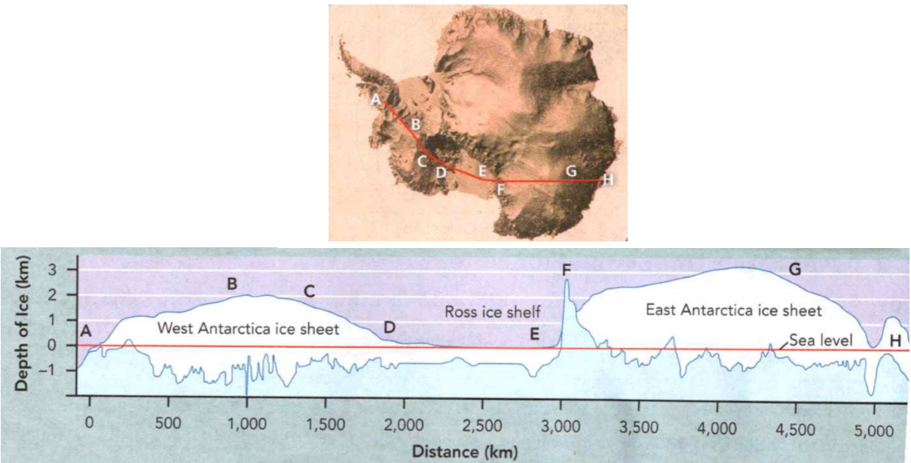

### Earth Science

## Geology

## Erosion and Deposition

**Mass** is an amount of matter that has an indefinite size and shape.

**Force** is the push or pull exerted on an object.

A **cycle** is a sequence of events that repeats over and over.

**Complete the tasks below.**

1. A giant mass of mud blocked the road after a storm. "How did it get there?"
asked Gail. "During the storm, the nearby river rose really fast, so the force
of the water pushed it there," said her dad. "Spring flooding is part of the
natural cycle of the seasons:" Why does it take the force of fast-moving water
to move a large mass of mud?

2. Latin Word sedere sit, settle sediment, n. pieces of rock or soil moved by
the process of erosion. How does the Latin word sedere relate to the word
sediment?

### Chapter Preview

- erosion 
- sediment 
- deposition
- gravity 
- mass movement
- runoff 
- rill 
- gully 
- stream
- tributary 
- flood plain 
- meander
- oxbow lake 
- delta 
- alluvial fan
- groundwater 
- stalactite
- stalagmite 
- karst topography
- glacier 
- continental glacier
- ice age 
- valley glacier
- plucking 
- till 
- moraine 
- kettle
- headland 
- beach
- longshore drift 
- spit
- deflation 
- sand dune 
- loess

### Mass Movement

- What Processes Wear Down and Build Up Earth's Surface?
- What Are the Different Types of Mass Movement?

**Complete the tasks below.**

1. Mudflow Hits Tow In December 2007, severe storms hit the northwestern United
States. These storms started landslides in the hills above Woodson, Oregon. When
landslide debris dammed a creek in the hills, a deep lake formed. If the debris
gave way, a mudflow could run downhill and damage the town. Fortunately, a
landowner called the Oregon Department of Forestry (ODF). People were quickly
evacuated and a nearby highway was dosed. It wasn't long before the pile of
debris collapsed, allowing the water to escape. A large mudflow swept away
homes, cars, and trees! But thanks to the ODF, no one was harmed. What caused
the mudflow?

### What Processes Wear Down and Build Up Earth's Surface?

On a rainy day, you may have seen water carrying soil and gravel down a
driveway. That's an example of **erosion** - the process by which natural forces move
weathered rock and soil from one place to another. Gravity, moving water,
glaciers, waves, and wind are all agents, or causes, of erosion.

  <figure>
    
    <figcaption>Figure 1. Cycle of erosion and deposition.</figcaption>
  </figure>

The process of erosion moves material called **sediment**. Sediment may consist of
pieces of rock or soil, or the remains of plants and animals. Deposition occurs
where the agents of erosion deposit, or lay down, sediment. 

**Deposition** changes the shape of the land. You may have watched a playing child
who picked up several toys, carried them across a room, and then put them down.
This child was acting something like an agent of erosion and deposition.

**Weathering, erosion, and deposition act together in a cycle that wears down and
builds up Earth's surface.** Erosion and deposition are at work everywhere on
Earth. As a mountain wears down in one place, new landforms build up in other
places. The cycle of erosion and deposition is never-ending.

### What Are the Different Types of Mass Movement?

You're sitting on a bicycle at the top of a hill. With a slight push, you can
coast down the hill. **Gravity** is the force that pulls you and your bike downward.
It also moves rock and other materials downhill.

Gravity causes **mass movement**, any one of several processes that move sediment
downhill. Mass movement can be rapid or slow. Erosion and deposition both take
place during a mass movement event. **The different types of mass movement
include landslides, mudflows, slumps, and creep.**

  <figure>
    
    <figcaption>Figure 2. Mass Movement.</figcaption>
  </figure>

### Mudflows

A mudflow is the rapid downhill movement of a mixture of water, rock, and soil.
The amount of water in a mudflow can be as high as 60 percent. Mudflows often
occur after heavy rains in a normally dry area. In clay soils with a high water
content, mudflows may occur even on very gentle slopes. Under certain
conditions, clay soils suddenly behave as a liquid and begin to flow.

### Landslides 

A landslide occurs when rock and soil slide quickly down a steep slope. Some
landslides contain huge masses of rock. But many landslides contain only a small
amount of rock and soil. Some landslides occur where road builders have cut
highways through hills or mountains, leaving behind unstable slopes.

### Slumps

If you slump your shoulders, the entire upper part of your body drops down. In
the type of mass movement known as slumps, a mass of rock and soil suddenly
slips down a slope. Unlike a landslide, the material in a slump moves down in
one large mass. It looks as if someone pulled the bottom out from under part of
the slope. A slump often occurs when water soaks the bottom of soil that is rich
in clay.

### Creep

Creep is the very slow downhill movement of rock and soil. It can even occur on
gentle slopes. Creep often results from the freezing and thawing of water in
cracked layers of rock beneath the soil. Like the movement of an hour hand on a
clock, creep is so slow you can barely notice it. But you can see the effects of
creep in vertical objects such as telephone poles and tree trunks. Creep may
tilt these objects at unusual angles.

**Complete the tasks below.**

1. Erosion occurs all the time, even while mountains are forming, see Figure 1.
When new mountains or plateaus form, the cycle of erosion begins all over again.
Narrate the steps in the diagram above.
a) Step 2
b) Step 3

2. Mass Movement, see Figure 2. Match each description with its corresponding
diagram.
a) Mudflows
b) Landslides
c) Slumps
d) Creep

3. A fence runs across a steep hillside. The fence is tilted downhill and forms
a curve rather than a straight line. What do you think happened?

3. What is mass movement?

4. What force causes all types of mass movement? Explain.

### Water Erosion

- How Does Moving Water Cause Erosion?
- What Land Features Are Formed by Water Erosion and Deposition?

**Complete the tasks below.**

1. The Great Blue Hole The boat leaves at 5:30 A.M. But you don't mind the early
hour because it's the trip of a lifetime: a visit to the Great Blue Hole of
Belize. The Great Blue Hole is actually the remains of a cave formed by erosion.
Several factors, including rising sea levels, caused the roof of the cave to
collapse. This resulted in a natural depression called a sinkhole. The Great
Blue Hole is more than 300 meters with and 125 meters deep. It's possibly the
deep- est and most massive sinkhole in the world. If you want to explore it, you
have to scuba dive through the roof. It's an impressive example of what nature
can accomplish over time! How was the Great Blue Hole formed?

### How Does Moving Water Cause Erosion?

Erosion by water begins with a splash of rain. Some rainfall sinks into the
ground. Some evaporates or is taken up by plants. The rest of the water runs off
over the land surface. **Moving water is the major agent of the erosion that has
shaped Earth's land surface.**

### Runoff 

As water moves over the land, it carries particles with it. This moving water is
called **runoff**. When runoff flows in a thin layer over the land, it may cause a
type of erosion called sheet erosion. The amount of runoff in an area depends on
five main factors. The first factor is the amount of rain an area gets. A second
factor is vegetation. Grasses, shrubs, and trees reduce runoff by absorbing
water and holding soil in place. A third factor is the type of soil. Some types
of soils absorb more water than others. A fourth factor is the shape of the
land. Steeply sloped land has more runoff than flatter land. Finally, a fifth
factor is how people use land. For example, a paved parking lot absorbs no
water. All the rain that falls on it becomes runoff. Runoff also increases when
farmers cut down crops, since this removes vegetation from the land.

Generally, more runoff means more erosion. In contrast, factors that reduce
runoff will reduce erosion. Even though deserts have little rainfall they often
have high runoff and erosion because they have few plants and thin soil. In wet
areas, runoff and erosion may be low because there are more plants to help
protect the soil.

### Stream Formation 

Because of gravity, runoff and the material it contains flow downhill. As this
water moves across the land, it runs together to form rills, gullies, and
streams.

### Rills and Gullies 

As runoff travels, it forms tiny grooves in the soil called **rills**. When many
rills flow into one another, they grow larger, forming a gully. A **gully** is a
large groove, or channel, in the soil that carries runoff after a rainstorm. As
water flows through gullies, it moves soil and rocks with it, thus enlarging the
gullies through erosion. Gullies only contain water during a rainstorm and for a
short time after it rains.

### Streams and Rivers 

Gullies join together to form a larger channel called a stream. A **stream** is
a channel along which water is continually flowing down a slope. Unlike gullies,
streams rarely dry up. Small streams are also called creeks or brooks. As
streams flow together, they form larger and larger bodies of flowing water. A
large stream is often called a river. 

### Tributaries 

A stream grows into a larger stream or river by receiving water from
tributaries. A **tributary** is a stream 1 or river that flows into a larger river.
For example, the Missouri and Ohio rivers are tributaries of the Mississippi
River. A drainage basin, or watershed, is the area from which a river and its
tributaries collect their water.

  <figure>
    
    <figcaption>Figure 3. Stream Formation.</figcaption>
  </figure>

### What Land Features Are Formed by Water Erosion and Deposition?

Walking in the woods in summer, you can hear the racing water of a river before
you see the river itself. When you reach the river's banks, you see water
rushing by. Sand and pebbles tumble along the river bottom. As it swirls
downstream, the water also carries twigs, leaves, and bits of soil. In sheltered
pools, insects skim the water's calm surface. Beneath the surface, a rainbow
trout swims in the clear water. As the seasons change, so does the river. In
winter, the surface of the river may freeze. But during spring, it may flood.
Throughout the year, the river continues to erode Earth's surface.

  <figure>
    
    <figcaption>Figure 4. River Erosion.</figcaption>
  </figure>

### Water Erosion 

Many rivers begin on steep mountain slopes. Near their source, these rivers can
be fast-flowing and generally follow a straight, narrow course. The steep slopes
along the river erode rapidly, resulting in a deep, V-shaped valley. As a river
flows from the mountains to the sea, it forms many features. **Through erosion, a
river creates valleys, waterfalls, flood plains, meanders, and oxbow lakes.**

### Waterfalls 

Waterfalls may occur where a river meets an area of rock that is very hard and
erodes slowly. The river flows over this rock and then flows over softer rock
downstream. Softer rock wears away faster than harder rock. Eventually a
waterfall develops where the softer rock was removed. Areas of rough water
called rapids also occur where a river tumbles over hard rock.

  <figure>
    
    <figcaption>Figure 5. Waterfalls.</figcaption>
  </figure>

### Flood Plain 

Lower down on its course, a river usually flows over more gently sloping land.
The river spreads out and erodes the land, forming a wide river valley. The
flat, wide area of land along a river is a **flood plain**. On a wide flood plain,
the valley walls may be kilometers away from the river itself. A river often
covers its flood plain when it overflows its banks during a flood. When the
flood water finally retreats, it deposits sediment as new soil. This makes a
river valley fertile.

### Meanders 

A river often develops meanders where it flows through easily eroded rock or
sediment. A **meander** is a looplike bend in the course of a river. As the river
winds from side to side, it tends to erode the outer bank and deposit sediment
on the inner bank of a bend. Over time, a meander becomes more curved.

Because of the sediment a river carries, it can erode a very wide flood plain.
Along this part of a river's course, its channel may be deep and wide. The
southern stretch of the Mississippi River meanders on a wide, gently sloping
flood plain.

### Oxbow Lakes 

Sometimes a meandering river forms a feature called an oxbow lake. As the photo
below shows, an oxbow lake is a meander that has been cut off from the river. An
**oxbow lake** may form when a river floods. During the flood, high water finds a
straighter route downstream. As the flood waters fall, sediments dam up the ends
of a meander, forming an oxbow lake.

  <figure>
    
    <figcaption>Figure 6. Flood plain, Meanders, Oxbow Lakes.</figcaption>
  </figure>

  <figure>
    
    <figcaption>Figure 7. Oxbow Lakes.</figcaption>
  </figure>

### Water Deposition 

As water moves, it carries sediment with it. Any time moving water slows down,
it drops, or deposits, some of the sediment. In this way, soil can be added to a
river's flood plain. As the water slows down, large stones quit rolling and
sliding. Fine particles fall to the river's bed as the river flows even more
slowly. **Deposition creates landforms such as alluvial fans and deltas.**

  <figure>
    
    <figcaption>Figure 8. Deposits by Rivers.</figcaption>
  </figure>

### Deltas

A river ends its journey when it flows into a still body of water, such as an
ocean or a lake. Because the river water is no longer flowing downhill, the
water slows down. At this point, the sediment in the water drops to the bottom.
Sediment deposited where a river flows into an ocean or lake builds up a
landform called a **delta**. Deltas can be a variety of shapes. Some are arc-shaped,
others are triangle-shaped. The delta of the Mississippi River, shown here, is
an example of a type of delta called a "bird's foot" delta.

### Alluvial Fans 

Where a stream flows out of a steep, narrow mountain valley, the stream suddenly
becomes wider and shallower. The water slows down. Here sediments are deposited
in an alluvial fan. An **alluvial fan** is a wide, sloping deposit of sediment
formed where a stream leaves a mountain range. As its name suggests, this
deposit is shaped like a fan.

The Schellenberg ice cave in Germany is a limestone cave with ice formations.
Cold air is trapped in the lower areas of the cave so the temperature stays near
freezing. This keeps the ice formations from melting.

  <figure>
    
    <figcaption>Figure 10. Groundwater Erosion and Deposition.</figcaption>
  </figure>

### Groundwater Erosion 

When rain falls and snow melts, not all of the water evaporates or becomes
runoff. Some water soaks into the ground. There it fills the openings in the
soil and trickles into cracks and spaces in layers of rock. **Groundwater** is the
term geologists use for this underground water. Like running water on the
surface, groundwater affects the shape of the land.

**Groundwater can cause erosion through a process of chemical weathering.**
Rainwater is naturally acidic. In the atmosphere, water combines with carbon
dioxide to form a weak acid called carbonic acid. Carbonic acid can break down
limestone. Groundwater containing carbonic acid flows into any cracks in the
limestone. Then some of the limestone dissolves and is carried away in a
solution of water. This process gradually hollows out pockets in the rock. Over
time, these pockets develop into large holes underground, called caves or
caverns.

### Cave Formations 

The action of carbonic acid on limestone can also result in deposition. Inside
limestone caves, deposits called stalactites and stalagmites often form. Water
containing carbonic acid and calcium from limestone drips from a cave's roof.
Carbon dioxide escapes from the solution, leaving behind a deposit of calcite. A
deposit that hangs like an icicle from the roof of a cave is known as a
stalactite. Slow dripping builds up a cone-shaped stalagmite from the cave floor.

  <figure>
    
    <figcaption>Figure 11. Sinkhole. This sinkhole is in Russia's Perm region.</figcaption>
  </figure>

### Karst Topography 

In rainy regions where there is a layer of limestone near the surface,
groundwater erosion can significantly change the shape of the land Streams are
rare, because water easily sinks down into the weathered limestone. Deep valleys
and caverns are common. If the roof of a cave collapses because of the erosion
of the underlying limestone, the result is a depression called a sinkhole. This
type of landscape is called **karst topography** after a region in Eastern Europe.
  
  <figure>
    
    <figcaption>Figure 12. Areas of karst topography.</figcaption>
  </figure>

**Complete the tasks below.**

1. Identify each of the factors that affect runoff.
a) Record the five main factors affecting runoff.
b) Using a specific location, such as a park, identify an example for each factor.

2. Stream Formation, see Figure 3. Identify the arrows that indicate the
direction of sheet erosion.

3. How does runoff affect the rate of erosion?

4. Put these in order of size from smallest to biggest: creek, rill, gully,
river.

5. River Erosion, see Figure 4. How does a river's ability to erode change with
the seasons? (Hint: Look at how the amount of water changes during each season.)

6. Waterfalls, see Figure 5. Where do you think the layers of hard and soft rock
are located? Label the areas on the diagram to show your answer.

7. Oxbow Lakes, see Figures 6 & 7. A meander may gradually form an oxbow lake. 1
- A small obstacle creates a slight bend in the river. 2 - As water erodes the
outer edge, the bend becomes bigger, forming a meander. Deposition occurs along
the inner edge. 3 - Gradually, the meander becomes more curved. The river breaks
through and takes a new course.
a) Draw steps 2 and 4 to show how an oxbow lake forms.
b) Describe the last step.

8. Deposits by Rivers, see Figure 8. Use the pictures to describe the
difference between an alluvial fan and a delta.

  <figure>
    
    <figcaption>Figure 9. Processes that shape the surface of the land.</figcaption>
  </figure>

9. What processes shape the surface of the land? You're a tour guide in the area
pictured in Figure 9, and your tour group wants to learn more about some of the
features they are seeing. **Waterfalls and Rapids** Waterfalls and rapids are
common where the river passes over harder rock. **V-Shaped Valley** Near its
source, the river flows through a deep, V-shaped valley. As the river flows, it
cuts the valley deeper. **Tributary** The river receives water and sediment from
a tributary-a smaller river or stream that flows into it. **Oxbow Lake** An
oxbow lake is a meander cut off from the river by deposition of sediment.
**Flood Plain** A flood plain forms where the river's power of erosion widens
its valley rather than deepening it. **Valley Widening** As the river approaches
sea level, it meanders more and develops a wider valley and broader flood plain.
a) Identify the two missing features on the image. 
b) Summarize what you would say about them to your tour group.

10. Groundwater Erosion and Deposition, see Figure 10. How do erosion and
deposition shape caves?
a) Process of Erosion
b) Process of Deposition

11. Study the map in Figure 12.
a) Name three states in which you can find karst topography.
b) Why do you think karst topography occurs in these areas?

12. Name two features of water erosion.

13. What is carbonic acid and how does it affect rock?

14. What processes shape the surface of the land?

### Glacial Erosion

- How Do Glaciers Form and Move?
- How Do Glaciers Cause Erosion and Deposition?

**Complete the tasks below.**

1. Why Are Glaciers Blue? If snow is white, why do glaciers look blue? When
sunlight hits snow, it bounces right back. Snow is made up of microscopic
crystals. It is light and not very dense. As more snow falls, its weight turns
some of the crystals underneath into water and vapor. The water and vapor
refreeze. This process creates larger, denser ice crystals. Over time, the
weight of the snow and the ice on the surface makes these crystals even denser.
These are the kind of ice crystals that make up glaciers. When sunlig hits
glaciers, these dense ice crystals absorb the red and yellow light. Only the
blue light escapes!
a) What makes glaciers look blue?
b) In addition to color, what might be some other differences between snow and
glacial ice?

### How Do Glaciers Form and Move?

On a boat trip off the coast of Alaska you sail by evergreen forests and
snowcapped mountains. As you round a point of land, you see an amazing sight. A
great mass of ice winds like a river between rows of mountains. This river of
ice is a glacier. Geologists define a **glacier** as any large mass of ice that
moves slowly over land. **Glaciers can form only in an area where more snow
falls than melts.** There are two kinds of glaciers - continental glaciers and
valley glaciers.

### Continental Glaciers 

A **continental glacier** is a glacier that covers much of a continent or large
island. It can spread out over millions of square kilometers. Today, continental
glaciers cover about 10 percent of Earth's land. They cover Antarctica and most
of Greenland.

**Continental glaciers can flow in all directions as they move.** They spread
out much as pancake batter spreads out in a frying pan. Many times in the past,
continental glaciers Ihave covered larger parts of Earth's surface. These times
are known as ice ages. About 1 million years ago, continental glaciers covered
nearly one third of Earth's land. The glaciers advanced and retreated, or melted
back, several times. They most recently retreated about 10,000 years ago.

  <figure>
    
    <figcaption>Figure 13. Continental Glaciers.</figcaption>
  </figure>

### Valley Glaciers 

A **valley glacier** is a long, narrow glacier that forms when snow and ice build up
high in a mountain valley. The sides of mountains keep these glaciers from
spreading out in all directions. Instead, they usually move down valleys that
have already been cut by rivers. Valley glaciers are found on many high
mountains. Although they are much smaller than continental glaciers, valley
glaciers can be tens of kilometers long.

High in mountain valleys, temperatures rarely rise above freezing. Snow builds
up year after year. The weight of more and more snow compacts the snow at the
bottom into ice. **Gravity constantly pulls a glacier downhill.** Once the layer
of snow and ice is more than about 30 to 40 meters deep, the glacier begins to
move.

Valley glaciers flow at a rate of a few centimeters to a few meters per day. But
a valley glacier that surges, or slides quickly, can move as much as 6
kilometers in a year.

  <figure>
    
    <figcaption>Figure 14. Glaciers recede.</figcaption>
  </figure>

### How Do Glaciers Cause Erosion and Deposition?

The movement of a glacier changes the land beneath it. Although glaciers work
slowly, they are a major force of erosion. **The two processes by which
glaciers erode the land are plucking and abrasion.**

### Glacial Erosion 

As a glacier flows over the land, it picks up rocks in a process
called **plucking**. Beneath a glacier, the weight of the ice can break rocks apart.
These rock fragments freeze to the bottom of the glacier. When the glacier
moves, it carries the rocks with it, as shown in Figure 15. Plucking can move
huge boulders.

Many rocks remain on the bottom of the glacier, and the glacier drags them
across the land. This process, called abrasion, gouges and scratches the
bedrock.

  <figure>
    
    <figcaption>Figure 15. Glacial Erosion.</figcaption>
  </figure>

### Glacial Deposition 

A glacier gathers a huge amount of rock and soil as it erodes the land in its
path. **When a glacier melts, it deposits the sediment it eroded from the land,
creating various landforms.** These landforms remain for thousands of years after
the glacier has melted. The mixture of sediments that a glacier deposits
directly on the surface is called **till**. Till is made up of particles of many
different sizes. Clay, silt, sand, gravel, and boulders can all be found in
till.

The till deposited at the edges of a glacier forms a ridge called a **moraine**. A
terminal moraine is the ridge of till at the farthest point reached by a
glacier. Part of Long Island in New York is a terminal moraine from the
continental glaciers of the last ice age.

Retreating glaciers also create features called kettles. A **kettle** is a small
depression that forms when a chunk of ice is left in glacial till. When the ice
melts, the kettle remains. The continental glacier of the last ice age left
behind many kettles. Kettles often fill with water, forming small ponds or lakes
called kettle lakes. Such lakes are common in areas such as Wisconsin, that were
once covered with ice.

  <figure>
    
    <figcaption>Figure 16. Glacial Landforms.</figcaption>
  </figure>

**Horn** When glaciers carve away the sides of a mountain, the result is a horn,
a sharpened peak.

**Cirque** A cirque is a bowl-shaped hollow eroded by a glacier.

**Fiord** A fiord forms when the level of the sea rises, filling a valley once
cut by a glacier.

**Arete** An arete is a sharp ridge separating two cirques.

**Glacial Lake** Glaciers may leave behind large lakes in long basins. 

**U-Shaped Valley** A flowing glacier scoops out a U-shaped valley.

**Moraine** A moraine forms where a glacier deposits a mound or a ridge.

**Drumlin** A drumlin is a long mound of till that is smoothed in the direction
of the glacier's flow.

**Kettle Lake** A kettle lake forms when a depression left in till by melting
ice fills with water.

**Complete the tasks below.**

1. Continental Glaciers, see Figure 13. You're traveling across Antarctica from
Point A to Point H on the route in Figure 13. The cross section shows changes in
the ice sheet along your journey. What changes in elevation and ice depth will
you encounter?

2. When glaciers recede, they leave behind evidence of their existence, see
Figure 14, before glaciers form	and after glaciers have melted.
a) What was the landscape like before glaciers formed?
b) What did the glaciers do to the area?

3. Glacial Erosion, see Figure 15. Identify the direction the ice is moving. 
A) --->
B) <---

4. Glacial Erosion, see Figure 15. Describe the glacial erosion taking place in
the diagram.

5. Glacial Landforms, see Figure 16. Identify the features of erosion and
deposition in the scene below. Record your answers in the boxes provided on the
next page.

  <figure>
    
    <figcaption>Figure 17. Glaciers have shaped the land in Denali National Park, Alaska.</figcaption>
  </figure>

6. Identify the feature in Figure 17. Describe how it formed.
a) Features of Erosion
b) Features of Deposition
c) Photo Feature

7. How does a moraine form?

### Wave Erosion
- How Do Waves Cause Erosion and Deposition?

### How Do Waves Cause Erosion and Deposition?
The energy in waves comes from the wind. When the wind makes contact with the
water some of its energy transfers to the water, forming waves. As a wave
approaches land the water becomes shallower. The friction between the wave and
the bottom causes the wave to slow down, and the water moves forward as the wave
reaks. This forward-moving water provides the force that shapes the land along
the shoreline.

### Erosion by Waves	
**Waves shape the coast through erosion by breaking down rock and moving sand
and other sediment.** One way waves erode the land is by impact. Large waves can
hit rocks along the shore with great force. This energy in waves can break apart
rocks. Over time, waves can make small cracks larger. Eventually, the waves
cause pieces of rock to break off. Waves also erode by abrasion. As a wave
approaches shallow water, it picks up sediment, including sand and gravel. This
sediment is carried forward by the wave. When the wave hits land, the sediment
wears away rock like sandpaper wearing away wood.

Waves coming to shore gradually change direction. The change in direction occurs
as different parts of a wave begin to drag on the bottom. The waves in Figure 1
change direction as they approach the shore. The energy of these waves is
concentrated on headlands. A **headland** is a part of the shore that sticks out
into the ocean. It is made of harder rock that resists erosion by the waves.
But, over time, waves erode the headlands and even out the shoreline.

  <figure>
    
    <figcaption>Figure 18. Wave Erosion.</figcaption>
  </figure>

### Landforms Created by Wave Erosion 

Think of an ax striking the trunk of a tree. The cut gets bigger and deeper with
each strike of the blade. Finally the tree falls. In a similar way, ocean waves
that hit a steep, rocky coast erode the base of the land there. Where the rock
is softer, the waves erode the land faster. Over time the waves may erode a
hollow area in the rock called a sea cave. Eventually, waves may erode the base
of a cliff so much that the rock above collapses. The result is a wave-cut
cliff. A sea arch is another feature of wave erosion that forms when waves erode
a layer of softer rock that underlies a layer of harder rock. If an arch
collapses, a pillar of rock called a sea stack may result.

### Deposits by Waves 

Deposition occurs when waves slow down, causing the water to drop its sediment.
**Waves shape a coast when they deposit sediment, forming coastal features such as
beaches, sandbars, barrier beaches, and spits.**

  <figure>
    
    <figcaption>Figure 19. The Changing Coast.</figcaption>
  </figure>

### Beaches 
A beach is an area of wave-washed sediment along a coast. The sediment deposited
on beaches is usually sand. Most sand comes from rivers that carry eroded
particles of rock to the ocean. Some beaches are made of small fragments of
coral or seashells piled up by wave action. Florida has many such beaches.

Waves usually hit the beach at an angle, creating a current that runs parallel
to the coastline. As waves repeatedly hit the beach, some of the beach sediment
moves down the beach with the current, in a process called **longshore drift**.

### Sandbars and Barrier Beaches 

Incoming waves carrying sand may build up sandbars, long ridges of sand parallel
to the shore. A barrier beach is similar to a sandbar. A barrier beach forms
when storm waves pile up large amounts of sand above sea level, forming a long,
narrow island parallel to the coast. Barrier beaches are found in many places
along the Atlantic coast of the United States, such as the Outer Banks of North
Carolina. People have built homes on many of these barrier beaches. But the
storm waves that build up the beaches can also wash them away. Barrier beach
communities must be prepared for the damage that hurricanes and other storms can
bring.

### Spits 

One result of longshore drift is the formation of a **spit**. A spit is a beach that
projects like a finger out into the water. Spits form as a result of deposition
by longshore drift. Spits occur where a headland or other obstacle interrupts
longshore drift, or where the coast turns abruptly.

**Complete the tasks below.**

1. Wave Erosion, see Figure 18. Identify the arrows that indicate where the
greatest energy of the waves is concentrated.

2. The Changing Coast, see Figure 19. Identify the landforms and indicate
whether the landform was shaped by erosion (E) or deposition (D).
a) Landform ____, (E/D)
b) Landform ____, (E/D)
c) Landform ____, (E/D)
d) Landform ____, (E/D)
e) Landform ____, (E/D)
f) Landform ____, (E/D)
g) Landform ____, (E/D)
h) Landform ____, (E/D)

3. How could a sea cave become a sea arch? 

4. List two ways waves erode rock.

5. What are two features formed by wave depostion?

### Wind Erosion
- How Does Wind Cause Erosion and Deposition?

**Complete the tasks below.**

1. Saving the Navajo Rangelands. How does wind erosion affect humans? You don't
have to go far to find out. In the Southwest, sand dunes cover one third of
Navajo Nation lands where sheep and cattle graze. Increasing drought is harming
the plants that hold the dunes in place. As a result, the wind is moving the
dunes on the Navajo rangelands. This makes it harder for living things to
survive. Geologist Margaret Hiza Redsteer studies wind erosion. She left the
Navajo Nation land to attend college, but she's come back to help. Recently, Dr.
Redsteer met with Chinese scientists to learn how they stabilize dunes. Now,
she'll use these methods to help slow erosion on the Navajo rangelands.
a) Why are the dunes eroding on the Navajo land?
b) Do you think it's important for scientists to problem solve together? Explain.

### How Does Wind Cause Erosion and Deposition?

Wind can be a powerful force in shaping the land in areas where'll there are few
plants to hold the soil in place. In the east African nation of Eritrea,
sandstorms like the one in the photo are common. Strong winds blowing over loose
soil can reduce visibility.

### Deflation 

Wind causes erosion mainly by deflation. Geologists define **deflation** as the
process by which wind removes surface materials. You can see the process of
deflation in Figure 1. When wind blows over the land, it picks up the smallest
particles of sediment, such as clay and silt. The stronger the wind, the larger
the particles it can pick up. Slightly heavier particles, such as sand, might
skip or bounce for a short distance. But sand soon falls back to the ground.
Strong winds can roll heavier sediment particles over the ground. In deserts,
deflation can sometimes create an area of rock fragments called **desert pavement**.
There, wind has blown away the smaller sediment, leaving behind rocky materials.

### Abrasion 

Abrasion by wind-carried sand can polish rock, but it causes relatively little
erosion. Geologists think that most desert landforms are the result of
weathering and water erosion.

  <figure>
    
    <figcaption>Figure 20. Wind Erosion.</figcaption>
  </figure>

### Deposits by Wind 

All the sediment picked up by wind eventually falls to the ground. This happens
when the wind slows down or an obstacle, such as a boulder or a clump of grass,
traps the windblown sand sediment. **Wind erosion and deposition may form sand
dunes and loess deposits.** When the wind meets an obstacle, the result is usually
a deposit of windblown sand called a **sand dune**. The shape of sand dunes is
determined by the direction of the wind, the amount of sand, and the presence of
plants.

### Sand Dunes 

You can see sand dunes on beaches and in deserts where wind-blown sediment has
built up. Sand dunes come in many shapes and sizes. Some are long, with parallel
ridges, while others are U-shaped. They can also be very small or very large.
Some sand dunes in China are 500 meters high. Sand dunes move over time. Little
by little, the sand shifts with the wind from one side of the dune to the other.
Sometimes plants begin growing on a dune. Plant roots can help to anchor the
dune in one place.

### Loess Deposits 

Sediment that is smaller than sand, such as particles of clay and silt, is
dropped far from its source in large deposits. This fine, wind-deposited
sediment is **loess**. There are large loess deposits in central China and
in states such as Nebraska, South Dakota, Iowa, Missouri, and Illinois. Loess
helps to form fertile soil. Many areas with thick loess deposits are valuable
farmlands.

  <figure>
    
    <figcaption>Figure 21. Dune Formation.</figcaption>
  </figure>  

  <figure>
    
    <figcaption>Figure 22. Dunes.</figcaption>
  </figure>

**Complete the tasks below.**

1. Wind Erosion, see Figure 20. The image shows three ways that wind moves
particles. Complete each sentence with on of the following words: fine, medium,
large.
a) ____ particles are carried through the air.
b) ____ particles skip or bounce.
c) ____ particles slide or roll.

2. The Latin word flare means "to blow." How does flare relate to the word
deflation?

3. Dune Formation, see Figure 21. Why do these dunes have different shapes?

4. See Figure 22. 
a) Which dune do you think is likely to erode faster? Why?
b) Why do you think plants grew on Dune B?
c) How could sand dunes be held in place to prevent them from drifting onto a
parking lot?

5. What is deflation?

6. What causes wind to deposit sand or other sediment?

7. In a desert, a soil mixture of sand and small rocks is exposed to wind
erosion. How would the land surface change over time?

8. The surface of the land is shaped by the processes of erosion and deposition
caused by gravity, ___, ___, glaciers, and ___ .

### Study Guide

- Weathering, erosion, and deposition act together in a cycle that wears down
and builds up Earth's surface.

- The different types of mass movement include landslides, mudflows, slumps, and
creep.

- Moving water is the major agent of erosion that has shaped Earth's land
surface. Groundwater erodes through chemical weathering.

- Through erosion, a river forms valleys, waterfalls, flood plains, meanders,
and oxbow lakes. Deposition forms alluvial fans and deltas.

- Glaciers can form only in an area where more snow falls than melts. 
 
- Continental glaciers can flow in all directions as they move.

- Gravity constantly pulls a glacier downhill.

- Glaciers erode the land through plucking and abrasion. When a glacier melts,
it deposits the sediment it eroded from the land.

- Waves shape the coast through erosion by breaking down rock and moving sand
and other sediment.

- Waves shape a coast when they deposit sediment, forming coastal features such
as beaches, sandbars, barrier beaches, and spits.

- Wind erosion and deposition may form sand dunes and loess deposits.

**Complete the tasks below.**

1. What is the process by which weathered rock, sediment, and soil are moved
from place to place?
A) runoff
B) delta formation
C) erosion
D) longshore drift

2. Freezing and thawing of water can cause creep, which is ___ .

3. How are landslides and mudflows similar? How are they different?

4. Identify the steps in the erosion cycle. Explain why it has no beginning or
end.

5. What type of mass movement is shown in Figure 23? Explain.
  <figure>
    
    <figcaption>Figure 23. Mass movement.</figcaption>
  </figure>

6. Which feature typically contains water only during a rainstorm and right after it rains?
A) a river
B) a rill
C) a gully
D) a stream

7. Sediments are deposited in an alluvial fan because ___ .

  <figure>
    
    <figcaption>Figure 24. Stream Formation.</figcaption>
  </figure>

8. Stream Formation, see Figure 24. Raindrops strike ground. Runoff forms.
Complete the flowchart about stream formation.
a) a.
b) b.
c) c.
d) d.

9. Your family looks at a new house right on a riverbank. Why might they
hesitate to buy this house?

10. Explain to visitors to your valley how the lake called Oxbow Lake formed.
Use words and a drawing.

11. What do you call a mass of rock and soil deposited directly by a glacier?
A) kettle
B) till
C) slump
D) loess

12. When glaciers drag attached rocks across the land, they ____ .

13. You're in the mountains studying a valley glacier. What methods would you use to tell if it is advancing or retreating?

14. What is a rocky part of the shore that sticks out in the ocean?
A) spit
B) barrier beach
C) rill
D) headland

15. Waves change direction as they near shore because ____ .

16. Under what conditions would you expect abrasion to cause the most erosion on
a beach?

17. You're walking on a beach and see a spit. Explain how a spit could have
formed from a rocky headland. 2
 
18. What do you call the erosion of sediment by wind?
A) drifting
B) deposition
C) plucking
D) deflation

19. How is wind deflation different from wind abrasion?

20. How does a loess deposit form?

21. Suppose you are a geologist traveling in a region that has limestone bedrock
and plenty of rainfall. What features would you expect to find in this
landscape? How do they form?

  <figure>
    
    <figcaption>Figure 25. Meander.</figcaption>
  </figure>

22. The diagram in Figure 25 shows a meander. Where would sediment likely be
eroded to help form an oxbow?
A) at A
B) at B
C) at C
D) at D

23. What is the slow, downhill mass movement of rock and soil caused by gravity?
A) creep
B) a glacier
C) a landslide
D) runoff

24. What is an alluvial fan?
A) a landform created by wind deposition
B) a landform created by water erosion
C) a landform created by glacial erosion
D) a landform created by water deposition 

25. What is the name for a small depression created by the melting of a chunk of ice in glacial sediment?
A) till
B) kettle
C) moraine
D) spit

26. What "drifts" in longshore drift?
A) a chunk of glacier 
B) a river's course 
C) beach sediment
D) groundwater

  <figure>
    
    <figcaption>Figure 26. Glacier.</figcaption>
  </figure>

27. Use Figure 26. Describe how gravity affects the erosion of Earth's surface in
mass movement, running water, and glaciers.

