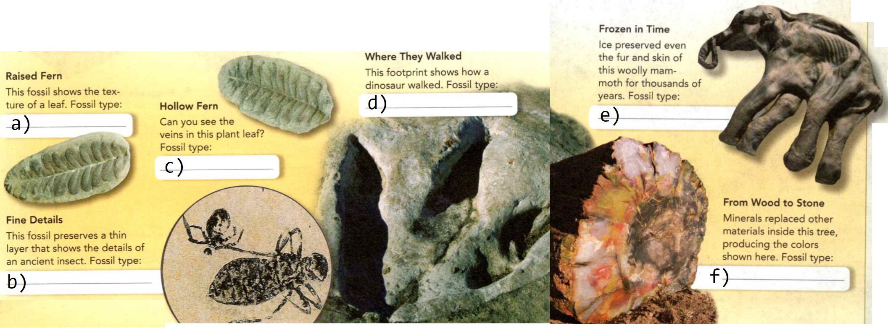
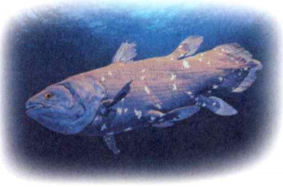

### Earth Science

## Geology

## A Trip Through Geologic Time	

- The theory of **plate tectonics** states that pieces of Earth's upper layers
move slowly, carried by convection currents inside Earth.

- An **igneous rock** forms when melted material hardens inside Earth or on the
surface.

- **Sediment** is made up of small pieces of rock and other material.

**Complete the tasks below.**

1. Forces inside Earth move large pieces, or plates, of Earth's crust very
slowly over long periods of time. These forces are explained by **plate
tectonics**. Where these plates meet, volcanic eruptions can produce **igneous
rocks**. Over time, rivers, wind, and ice can break down the rocks and carry
**sediment** to new places. How do volcanic eruptions produce rocks?

2. Prefix, Meaning Example, in- inside, inward intrusion, ex- outside, outward
extrusion, super- over, above superposition. Check The root -trusion means
"pushing." What might extrusion mean?

### Chapter Preview

- fossil 
- mold 
- cast
- petrified fossil 
- carbon film
- trace fossil 
- paleontologist
- evolution 
- extinct
- relative age 
- absolute age
- law of superposition 
- extrusion
- intrusion 
- fault 
- index fossil
- unconformity
- radioactive decay 
- half-life
- geologic time scale 
- era 
- period
- comet
- invertebrate 
- vertebrate
- amphibian 
- reptile
- mass extinction 
- mammal

### Fossils
- What Are Fossils?
- What Are the Kinds of Fossils? 
- What Do Fossils Show?

**Complete the tasks below.**

1. A Dinosaur Named Sue On a hot day in August 1990, Sue Hendrickson was hunting
for fossils near the town of Faith, South Dakota. She found some little pieces
of bone below a cliff. When she looked up at the cliff, she saw more bones.
These bones weren't little. They were enormous! She and other scientists
determined that they were the bones of a Tyrannosaurus rex. In fact, she'd found
the largest and most complete skeleton of a Tyrannosaurus ever discovered.
Today, the skeleton, nicknamed "Sue," is on display at the Field Museum in
Chicago.
a) What science skills did Sue Hendrickson use when she discovered Sue?
b) What do you think scientists can learn by studying dinosaur skeletons?

### What Are Fossils?
Sue is one of the most nearly complete dinosaur fossils ever found. Fossils are
the preserved remains or traces of living things. **Most fossils form when
living things die and are buried by sediment. The sediment slowly hardens into
rock and preserves the shapes of the organisms.** Sediment is made up of rock
partici( or the remains of living things. Most fossils form from animals or
plants that once lived in or near quiet water such as swamps, lakes, or shallow
seas where sediment builds up. In Figure 1, you can see how a fossil might form.

When an organism dies, its soft parts often decay quickly or are eaten by
animals. That is why only hard parts of an organism generally leave fossils.
These hard parts include bones, shells, teeth, seeds, and woody stems. It is
rare for the soft parts of an organism to become a fossil.

  <figure>
    
    <figcaption>Figure 1. How a Fossil Forms.</figcaption>
  </figure>

### What Are the Kinds of Fossils?

**Fossils found in rock include molds and casts, petrified fossils, carbon
films, and trace fossils. Other fossils form when the remains of organisms are
preserved in substances such as tar, amber, or ice.** Look at examples of the
kinds of fossils in Figure 2.

  <figure>
    
    <figcaption>Figure 2. Types of fossils.</figcaption>
  </figure>

### Molds and Casts 

The most common fossils are molds and casts. A **mold** is a hollow area in sediment
in the shape of an organism or part of an organism. A mold forms when the
organism is buried in sediment. Later, water may deposit minerals and sediment
into a mold, forming a cast. A **cast** is a solid copy of the shape of an organism.
Molds and casts can preserve fine details.

### Petrified Fossils 

A fossil may form when the remains of an organism become petrified. The term
petrified means "turned into stone:" **Petrified fossils** are fossils in which
minerals replace all of an organism, or a part, such as a dinosaur bone. This
can also happen to wood, such as tree trunks. Water carrying minerals seeps into
spaces in the plant's cells. Over time, the water evaporates, leaving the
minerals behind.

### Carbon Films 

Another type of fossil is a **carbon film**, an extremely thin coating of carbon on
rock. When sediment buries an organism, some gases escape from the sediment,
leaving carbon behind. Eventually, only a thin film of carbon remains. This
process can preserve the delicate parts of plant leaves and insects.

### Trace Fossils 

**Trace fossils** provide evidence of the activities of ancient organisms. A
fossilized footprint is one example. In such a fossil, a print is buried by
sediment, which slowly becomes solid rock. Trails and burrows can also become
trace fossils.

### Preserved Remains 

Some processes can preserve entire organisms. For example, some organisms become
trapped in sticky tar or tree resin. When the resin hardens, it becomes a
substance called amber. Freezing can also preserve remains.

### What Do Fossils Show?

Would you like to hunt for fossils all over the world? And what could you learn
from them? Scientists who study fossils are called paleontologists. Together,
all the information that paleontologists have gathered about past life is called
the fossil record. **The fossil record provides evidence about the history of
life and past environments on Earth. The fossil record also shows how different
groups of organisms have changed over time.**

### Fossils and Past Environments 

Paleontologists use fossils to build up a picture of Earth's past environments.
The fossils found in an area tell whether the area was a shallow bay, an ocean
bottom, or a freshwater swamp.

Fossils also provide evidence about the past climate of a region. For example,
coal has been found in Antarctica. But coal forms only from the remains of
plants that grow in warm, swampy regions. The presence of coal shows that the
climate of Antarctica was once much warmer than it is today. Figure 4 shows
another example of how fossils show change in an environment.

  <figure>
    
    <figcaption>Figure 4. Wyoming, 50 Million Years Ago.</figcaption>
  </figure>

### Change and the Fossil Record 

The fossil record also reveals changes in organisms. Older rocks contain fossils
of simpler organisms. Younger rocks contain fossils of both simple and more
complex organisms. In other words, the fossil record shows that life on Earth
has evolved, or changed over time. **Evolution** is the change in living things over
time.

The fossil record shows that millions of types of organisms have evolved as
climate and other factors changed over time. Some, such as the dinosaurs, have
become extinct. A type of organism is **extinct** if it no longer exists and will
never again live on Earth.

Scientists use fossils to reconstruct extinct organisms and determine how they
may be related to living organisms. For example, the animals called
Hyracotherium in Figure 4 are related to modern horses.

**Complete the tasks below.**

1. How a Fossil Forms, see Figure 1. A fossil may form when sediment quickly
covers an organism's body. An organism dies and sinks to the bottom of a lake.
The organism is covered by sediment. What happens next?

2. Types of Fossils, see Figure 2. In addition to petrified fossils, fossils may
be molds and casts, carbon films, trace fossils, or preserved remains. Identify
each fossil shown here by its type.
a) fossil a)
b) fossil b)
c) fossil c)
d) fossil d)
e) fossil e)
f) fossil f)

  <figure>
    
    <figcaption>Figure 3. Archaeopteryx fossil.</figcaption>
  </figure>

3. This fossil in Figure 3 is of an ancient organism called Archaeopteryx. 
a) What type of fossil is this?
b) List two questions about the organism that studying this fossil could help
you answer.

4. A (mold/trace fossil) can form when sediment buries the hard part of an
organism.

5. A petrified fossil forms when ___ replace parts of a(n) ____ .

6. What might you learn from a carbon film that you could not learn from a cast?

7. Wyoming, 50 Million Years Ago, see Figure 4. Today, Wyoming has areas of dry
plateaus. But 50 million years ago, the area was very different. Identify the
organism or kind of organism shown by fossils a, b, and c.
a) fossil a
b) fossil b
c) fossil c
d) What features of Hyracotherium show that it is related to horses?

8. What does the fossil record show about how life has changed over time?

9. Give an example of a question you could ask about a fossil of an extinct
organism.

### The Relative Age of Rocks
- How Old Are Rock Layers?
- How Can Rock Layers Change?

**Complete the tasks below.**

1. A couple of summers ago, my dad took me rock climb- ing for the first time. I
went to a place called Frenchman Coulee in central Washington. It was really
cool because the rock was basalt, which forms in giant pillars. It starts as
lava, and then cools and you can see the different lava flows in the rock.
Another cool thing is that Frenchman Coulee, which is a canyon, was gouged out
by huge Ice Age floods. How do you think scientists figure out the age of the
basalt layers at Frenchman Coulee?

### How Old Are Rock Layers?

If you found a fossil in a rock, you might start by asking, "What is it?" Your
next question would probably be, "How old is it?" The first step is to find the
age of the rock.

### Relative and Absolute Age 

Geologists have two ways to express the age of a rock. The **relative age** of a
rock is its age compared to the ages of other rocks. You have probably used the
idea of relative age when comparing your age with someone else's. For example,
if you say that you are older than your brother but younger than your sister,
you are describing your relative age.

The relative age of a rock does not provide its absolute age. The **absolute
age** of a rock is the number of years that have passed since the rock formed.
It may be impossible to know a rock's absolute age exactly, so geologists often
use both absolute and relative ages.

### Rock Layers 

Fossils are most often found in layers of sedimentary rock. Geologists use the
**law of superposition** to determine the relative ages of sedimentary rock layers.
**According to the law of superposition, in undisturbed horizontal sedimentary
rock layers the oldest layer is at the bottom. Each higher layer is younger than
the layers below it.** The deeper you go, the older the rocks are. 

Figure 5 shows rock layers in the Grand Canyon. Rock layers like then form a
record of Earth's history. Scientists can study this record to understand how
Earth and life on Earth have changed.

  <figure>
    
    <figcaption>Figure 5. Rock Layers in the Grand Canyon.</figcaption>
  </figure>

### Clues From Igneous Rock 

There are other clues to the relative ages of rocks besides the position of rock
layers. To determine relative age, geologists also study extrusions and
intrusions of igneous rock, faults, and index fossils.

Molten material beneath Earth's surface is called magma. Magma that reaches the
surface is called lava. Lava that hardens on the surface and forms igneous rock
is called an **extrusion**. An extrusion is always younger than the rocks below it.

Magma may push into bodies of rock below the surface. There, the magma cools and
hardens into a mass of igneous rock called an **intrusion**. An intrusion is always
younger than the rock layers around and beneath it. Figure 7 shows an intrusion.

  <figure>
    
    <figcaption>Figure 7. Intrusion. An intrusion cuts through rock layers.</figcaption>
  </figure>

### Clues From Faults 

More clues come from the study of faults. A **fault** is a break in Earth's crust.
Forces inside Earth cause movement of the rock on opposite sides of a fault.

A fault is always younger than the rock it cuts through. To determine the
relative age of a fault, geologists find the relative age of the youngest layer
cut by the fault. Figure 8 shows a fault.

  <figure>
    
    <figcaption>Figure 8. Fault. Rock layers break and shift along a fault.</figcaption>
  </figure>

### How Do Fossils Show Age? 

To date rock layers, geologists first find the relative age of a layer of rock
at one location. Then they can match layers in other locations to that layer.

Certain fossils, called index fossils, help geologists match rock layers. To be
useful as an **index fossil**, a fossil must be widely distributed and represent an
organism that existed for a geologically short period of time. **Index fossils are
useful because they tell the relative ages of the rock layers in which they
occur.** Scientists infer that layers with matching index fossils are the same
age.

You can use index fossils to match rock layers. Look at Figure 9, which shows
rock layers from four different locations. Notice that two of the fossils are
found in only one of these rock layers. These are the index fossils.

  <figure>
    
    <figcaption>Figure 9. Index Fossils.</figcaption>
  </figure>

### How Can Rock Layers Change?

The geologic record of sedimentary rock layers is not complete. In fact, most of
Earth's geologic record has been lost to erosion. **Gaps in the geologic record
and folding can change the position in which rock layers appear.** Motion along
faults can also change how rock layers line up. These changes make it harder for
scientists to reconstruct Earth's history. Figure 10 shows how the order of rock
layers may change.

### Gaps in the Geologic Record 

When rock layers erode away, an older rock surface may be exposed. Then
deposition begins again, building new rock layers. The surface where new rock
layers meet a much older rock surface beneath them is called an unconformity. An
**unconformity** is a gap in the geologic record. It shows where rock layers have
been lost due to erosion.

  <figure>
    
    <figcaption>Figure 10. Unconformities and Folding.</figcaption>
  </figure>
  
### Folding 

Sometimes, forces inside Earth fold rock layers so much that the layers are
turned over completely. In this case, the youngest rock layers may be on the
bottom!

No one place holds a complete geologic record. Geologists compare rock layers in
many places to piece together as complete a sequence as possible.

**Complete the tasks below.**

1. Rock Layers in the Grand Canyon, see Figure 5. More than a dozen rock layers
make up the walls of the Grand Canyon. You can see six layers here. In the white
area, draw an arrow pointing from the youngest to the oldest rocks.
A) Arrow points upward
B) Arrow points downward

2. How does knowing the prefixes in- and ex- help you remember the
difference between an intrusion and an extrusion?

3. The diagram in Figure 6 shows rock layers found at a site.
a) Identify the area on the diagram that shows an intrusion.
b) Identify the oldest layer on the diagram.
c) What can you infer about the relative ages of areas B and E?

  <figure>
    
    <figcaption>Figure 6. Rock layers.</figcaption>
  </figure>  

4. Index Fossils, see Figure 9. Scientists use index fossils to match rock layers.
a) Identify the layers to match the first area shown. 
b) Identify the fossil or fossils that you can use as index fossils. 
c) What can you infer about the history of Location 4?

5. In an area with several different rock layers, which is oldest? Explain.

6. How could a geologist match the rock layers in one area to rock layers found
in another area?

7. Unconformities and Folding, see Figure 10. 
a) Shade the oldest and youngest layers in the last two diagrams. 
b) Label the unconformity. 
c) Circle the part of the fold that is overturned.

  <figure>
    
    <figcaption>Figure 11. Rock area.</figcaption>
  </figure>

8. Study Figure 11.
a) What does the photo show? (an unconformity/ folding)
b) What evidence do you see for your answer to Question a)?
c) What can you infer about the history of this area

9. Name two ways rock layers can change.

10. How does folding change rock layers? 

11. Two locations include a layer of rock with a particular index fossil. In one
location, the layer occurs in a higher position than in the other. What can you
conclude about the history of the two areas?

### Radioactive Dating

- What Is Radioactive Decay? 
- What Is Radioactive Dating?

**Complete the tasks below.**

1. Marie Curie. In 1896, French scientists named Marie and Pierre Curie heard
about experiments that had been done by another scientist, Henri Becquerel.
Marie Curie later described what happened: "Becquerel had shown that by placing
some uranium sold on a photographic blade covered with black paper the plate
would be affected as if light had fallen on it. The effect is produced by
special rays which are emitted by the uranium salt ... My determinations showed
that the emission of the rays is an atomic property of the uranium." The
property that Becquerel and the Curies discovered was called radioactivity.
Today, radioactivity is used for many purposes including finding the age of
rocks!
a) What did Marie and Pierre Curie discover about radioactivity?
b) What does the discovery of radioactivity tell you about how scientists work
together?

### What Is Radioactive Decay?

Most elements usually do not change. But some elements can break down, or decay,
over time. These elements release particles and energy in a process called
**radioactive decay**. These elements are said to be radioactive. **During
radioactive decay, the atoms of one element break down to form atoms of another
element.**

### Half-Life 

The rate of decay of each radioactive element never changes. The **half-life** of a
radioactive element is the time it takes for half of the radioactive atoms to
decay. You can see in Figure 12 how a radioactive element decays over time.

  <figure>
    
    <figcaption>Figure 12. Decay of Radioactive Element.</figcaption>
  </figure>

### What Is Radioactive Dating?

Radioactive elements occur naturally in igneous rocks. Scientists use the rate
at which these elements decay to calculate the rock's age. As a radioactive
element within the igneous rock decays, it changes into another element. So the
composition of the rock changes slowly over time. The amount of the radioactive
element decreases. But the amount of the new element increases.

### Determining Absolute Ages 

Geologists use radioactive dating to determine the absolute ages of rocks. **In
radioactive dating, scientists first determine the amount of a radioactive
element in a rock. Then they compare that amount with the amount of the stable
element into which the radioactive element decays.** They use this information and
the half-life of the element to calculate the age of the rock.

### Potassium-Argon Dating 

Scientists often date rocks using potassium-40. This form of potassium decays to
stable argon-40 and has a half-life of 1.3 billion years. Potassium-40 is useful
in dating the most ancient rocks because of its long half-life.

  <figure>
    
    <figcaption>Figure 13. Elements Used in Radioactive Dating.</figcaption>
  </figure>

### Carbon-14 Dating 

Carbon-14 is a radioactive form of carbon. All plants and animals contain
carbon, including some carbon-14. After an organism dies, the carbon-14 in the
organism's body decays. It changes to stable nitrogen-14. To determine the age
of a sample, scientists measure the amount of carbon-14 that is left in the
organism's remains. Carbon-14 has been used to date fossils such as frozen
mammoths and the skeletons of prehistoric humans.

Carbon-14 has a half-life of only 5,730 years. For this reason, it generally
can't be used to date fossils or rocks older than about 50,000 years. The amount
of carbon-14 left would be too small to measure accurately. Also, most rocks do
not contain much carbon.

**Complete the tasks below.**

1. Half-Life, see Figure 12. The half-life of a radioactive element is the
amount of time it takes for half of the radioactive atoms to decay.
a) What pattern do you see in the graph? 
b) Use the pattern to complete the last bar.

2. Radioactive Dating, see Figure 13. A rock contains 25% of the
potassium-40 it started with. How old is the rock?
**Step 1:** Determine how many half-lives have passed. After one half-life, 50% of
the potassium would remain. After two half-lives, 25% of the potassium would
remain. So two half-lives have passed.
**Step 2:** Find the half-life of potassium-40. The half-life of potassium-40 is 1.3
billion years.
**Step 3:** Multiply the half-life by the number of half-lives that have passed. 1.3
billion years/half-life x 2 half-lives = 2.6 billion years, so the rock is about
2.6 billion years old.
a) A rock from the moon contains 12.5% of the potassium-40 it began with. How
old is the rock? (Hint: 12.5% = 1/8)
b) A fossil contains 1/16 of the carbon-14 it began with. How old is the fossil?

  <figure>
    
    <figcaption>Figure 14. Using Carbon-14 Dating.</figcaption>
  </figure>

3. Using Carbon-14 Dating. Scientists have dated these skeletons in Figure 14 to
5,000-6,000 years ago. But they do not use radioactive dating to find the age of
stone artifacts made by people. Why not?

4. Scientists use the method of (radioactive dating/relative dating) to find the
absolute age of a rock.

5. The half-life of thorium-232 is 14 billion years. A rock with 25% of its
thorium-232 remaining is ___ years old. 

6. A scientist finds stone tools in the ruins of an ancient house. The house
also has ashes in a fireplace. How could the scientist estimate the age of the
stone tools?

### The Geologic Time Scale
- What Is the Geologic Time Scale?

**Complete the tasks below.**

1. Suppose you could squeeze all of Earth's 4.6-billion-year history into one
24-hour day. The table in Figure 15 shows the times at which some major events
would take place.
a) Write the letter for each event on the clock diagrall
b) Did anything surprise you about the data? If so, what?

  
  <figure>
    
    <figcaption>Figure 15. Earth's History in a Day.</figcaption>
  </figure>

### What Is the Geologic Time Scale?

When you speak of the past, what names do you use for different spans of time?
You probably use names such as century, decade, year, month, week, and day. But
these units aren't very helpful for thinking about much longer periods of time.
Scientists needed to develop a way to talk about Earth's history.

**Because the time span of Earth's past is so great, geologists use the geologic
time scale to show Earth's history.** The **geologic time scale** is a record of the
geologic events and the evolution of life forms as shown in the fossil record.

Scientists first developed the geologic time scale by studying rock layers and
index fossils worldwide. With this information, scientists placed Earth's rocks
in order by relative age. Later, radioactive dating helped determine the
absolute age of the divisions in the geologic time scale. Figure 16 shows some of
the earliest known rocks.

The Isua rocks in Greenland in Figure 16 are among the oldest rocks on Earth.
They formed after heat and pressure changed sedimentary rocks that formed under
early oceans.

  <figure>
    
    <figcaption>Figure 16. Ancient Rocks.</figcaption>
  </figure>

### Dividing Geologic Time 

As geologists studied the fossil record, they found major changes in life forms
at certain times. They used these changes to mark where one unit of geologic
time ends and the next begins. Therefore, the divisions of the geologic time
scale depend on events in the history of life on Earth. Figure 2 shows the major
divisions of the geologic time scale.

### Precambrian Time 

Geologic time begins with a long span of time called Precambrian Time.

**Precambrian Time**, which covers about 88 percent of Earth's history, ended 542
million years ago. Few fossils survive from this time period.

**Eras** Geologists divide the time between Precambrian Time and the present into three long units of time called eras. They are the Paleozoic Era, the Mesozoic Era, and the Cenozoic Era.

**Periods** Eras are subdivided into units of geologic time called periods. You
can see in Figure 17 that the Mesozoic Era includes three periods: the Triassic
Period, the Jurassic Period, and the Cretaceous Period.

  <figure>
    
    <figcaption>Figure 17. The Geologic Time Scale.</figcaption>
  </figure>

The names of many of the geologic periods come from places around the world
where geologists first described the rocks and fossils of that period. For
example, the name Cambrian refers to Cambria, a Latin name for Wales. The rocks
shown below are in Wales. The dark bottom layer dates from the Cambrian period.

**Complete the tasks below.**

1. The Geologic Time Scale, see Figure 17. The divisions of the geologic time
scale are used to date events in Earth's history. Calculate and fill in the
duration of each period. Then use the time scale to identify the period in which
each organism lived.
a) Quaternary duration __
b) Neogene duration __
c) Paleogene duration __
d) Cretaceous duration __
e) Jurassic duration __
f) Triassic duration __
g) Permian duration __
h) Carboniferous duration __
i) Devonian duration __
j) Silurian duration __
k) Ordovician duration __
l) Cambrian duration __
m) Precambrian Time duration __
n) Wiwaxia Period __
o) Velociraptor Period __
p) Smolodon Period __

2. Refer to the geologic time scale shown in Figure 17 to answer the questions below.
Suppose you want to make a model of the geologic time scale. You decide to use a scale
of 1 cm = 1 million years.
a) Not counting Precambrian time, which era would take up the most space?
b) How long would the Mesozoic Era be in your model?
c) Suppose you used a different scale: 1 m = 1 million years. What would be one
advantage and one disadvantage of this scale?

3. The geologic time scale is a record of ___ and ___ .

4. Write the following periods in order from earliest to latest. Neogene
Jurassic Quaternary Triassic Cretaceous 

5. During which period did modern humans arise?

### Early Earth

- How Did Earth Form?

**Complete the tasks below.**

1. Exploring Life Under Water. Dr. Anna-Louise Reysenbach always loved water
sports. She was also inter- ested in organisms that live in strange, extreme
environments. Now, as a biology professor at Portland State University in
Oregon, she gets to combine her two loves-and learn about early life on Earth!
Dr. Reysenbach uses submersibles, or submarines, to study bacteria that live
deep under the ocean. No sunlight reaches these depths. There, hot water
carrying dissolved minerals from inside Earth flows out through vents. Some
kinds of bacteria use chemical energy from this material to make food, much as
plants use the energy from sunlight. Scientists think that these bacteria are
very similar to some of the earliest forms of life on Earth.
a) How are the bacteria near ocean vents different from many other organisms on Earth?
b) Would you like to work under water in a submersible? Why, or why not?

### How Did Earth Form?

Using radioactive dating, scientists have determined that the oldest rocks ever
found on Earth are about 4 billion years old. But scientists think Earth formed
even earlier than that.

### The Age of Earth 

According to these scientists' hypothesis, the moon formed from material knocked
loose when a very young Earth collided with another object. This means Earth and
the moon are about the same age. Scientists have used radioactive dating to find
the age of moon rocks that astronauts brought back to Earth. The oldest moon
rocks are about 4.6 billion years old. Scientists infer that Earth is also
roughly 4.6 billion years old-only a little older than those moon rocks.

### Earth Takes Shape 

**Scientists think that Earth began as a ball of dust, rock, and ice in space.
Gravity pulled this mass together.** As Earth grew larger, its gravity
increased, pulling in more dust, rock, and ice nearby. 

The energy from collisions with these materials raised Earth's temperature until
the planet was very hot. Scientists think that Earth may have become so hot that
it melted. Denser materials sank toward the center, forming Earth's dense, iron
core. Less dense, molten material hardened over time to form Earth's outer
layers-the solid crust and mantle.

  <figure>
    
    <figcaption>Figure 18. Early Earth.</figcaption>
  </figure>

### The Atmosphere 

Early Earth may have included light gases such as hydrogen and helium. Then the
sun released strong bursts of particles called the solar wind. Earth's gravity
could not hold the light gases, and the solar wind blew away Earth's first
atmosphere.

After Earth lost its first atmosphere, a second atmosphere formed. Volcanic
eruptions and collisions with comets added carbon dioxide, water vapor,
nitrogen, and other gases to the atmosphere. A comet is a ball of dust, gas, and
ice that orbits the sun. Figure 19 shows the first and second atmospheres.

  <figure>
    
    <figcaption>Figure 19. Development of the Atmosphere.</figcaption>
  </figure>

### The Oceans 

At first, Earth's surface was too hot for water to remain a liquid. All water
remained as water vapor. As Earth's surface cooled, the water vapor began to
condense to form rain. The rainwater gradually accumulated and formed oceans.
The oceans absorbed much of the carbon dioxide from the atmosphere.

### The Continents 

During early Precambrian Time, much of Earth's rock cooled and hardened. Less
than 500 million years after Earth formed, the rock at the surface formed
continents.

Scientists have found that the continents move very slowly over Earth's surface
because of forces inside Earth. Over billions of years, Earth's landmasses have
repeatedly formed, broken apart, and then crashed together again.

### Early Organisms 

Scientists cannot pinpoint when or where life began on Earth. But scientists
have found fossils of single-celled organisms in rocks that formed about 3.5
billion years ago. Scientists think that all other forms of life on Earth arose
from these simple organisms. Figure 20 shows remains of organisms similar to
these early life forms. The bacteria Dr. Reysenbach studies are probably similar
to these early organisms.

About 2.5 billion years ago, many organisms began using energy from the sun to
make food. This process is called photosynthesis. One waste product of
photosynthesis is oxygen. As organisms released oxygen, the amount of oxygen in
the atmosphere slowly grew. Some oxygen changed into a form called ozone. The
atmosphere developed an ozone layer that blocked the ultraviolet rays of the
sun. Shielded from these rays, organisms could live on land.

  <figure>
    
    <figcaption>Figure 20. Stromatolites.</figcaption>
  </figure>

Stromatolites, see Figure 20. These stromatolite fossils from Australia are
the remains of reefs built by early organisms. Some similar fossils are more
than three billion

**Complete the tasks below.**

1. Early Earth, see Figure 18. This artist's illustration shows Earth shortly
after the moon formed. Earth was hot and volcanic, and contained no liquid
water. The moon was much closer to Earth than it is today. Over time, Earth's
surface began to cool, forming solid land. Could life have existed on Earth at
the time shown in the illustration? Why, or why not?

2. Development of the Atmosphere, see Figure 19. The illustration shows the
difference between Earth's first and second atmospheres. Fill in the missing
information for each atmosphere.
a) First atmosphere, Gases included __
b) First atmosphere, Blown away by __
c) Second atmosphere, Gases from volcanoes and comets ___
d) Second atmosphere, Gases from organisms ___

3. Draw a diagram showing Earth's structure after oceans began to form.

4. Describe how Earth changed over time.

5. Earth formed ___ years ago.

6. Write the numbers 1, 2, and 3 to show the correct order of the events below.
a) __ Ozone layer forms.
b) __ Earth loses its first atmosphere.
c) __ Volcanoes and collisions with comets add water vapor to the atmosphere.

7. How would Earth's atmosphere be different if organisms capable of
photosynthesis had not evolved?

### Eras of Earth's History

- What Happened in the Paleozoic Era? 
- What Happened in the Mesozoic Era? 
- What Happened in the Cenozoic Era?

**Complete the tasks below.**

1. Mystery Metal. The rock layers in the photo hold evidence in one of the great
mysteries of science: What killed the dinosaurs? Find the thin, pale layer of
rock marked by the ruler. This layer formed at the end of the Cretaceous period.
It contains unusually high amounts of the metal iridium. At first, scientists
could not explain the amount of iridium in this layer. Iridium is more common in
asteroids than on Earth. Many scientists now infer that an asteroid struck
Earth. The impact threw dust into the air, blocking sunlight for years. About
half the plant and animal species on Earth-including the dinosaurs-died out.
Think about what you know about fossils and Earth's history as you answer these
questions.
a) What have many scientists inferred from the iridium found at the Cretaceous
boundary?
b) What are some questions you have about the history of life on Earth?

### What Happened in the Paleozoic Era?

The extinction of the dinosaurs is one of the most famous events in Earth's
history, but it is just one example of the changes that have taken place.
Through most of Earth's history, the only living things were single-celled
organisms.

Near the end of Precambrian time, more complex living things evolved. Feathery,
plantlike organisms anchored themselves to the seafloor. Jellyfish-like
organisms floated in the oceans. Scientists have found fossils of such organisms
in Australia, Russia, China, and southern Africa. But a much greater variety of
living things evolved during the next phase of geologic time-the Paleozoic Era.

### The Cambrian Explosion 

During the Cambrian Period, life took a big leap forward. **At the beginning of
the Paleozoic Era, a great number of different kinds of organisms evolved. For
the first time, many organisms had hard parts, including shells and outer
skeletons.** Paleontologists call this event the Cambrian Explosion because so
many new life forms appeared within a relatively short time.

  <figure>
    
    <figcaption>Figure 21. Cambrian Life.</figcaption>
  </figure>

In 1938, a fisherman in South Africa caught a fish he'd never seen before: a
coelacanth, see Figure 22. Coelacanths evolved during the Devonian Period, but
scientists thought they had been extinct for at least 65 million years. Since
1938, more of these "living fossils" have been found living deep in the Indian
Ocean.

  <figure>
    
    <figcaption>Figure 22. Coelacanth.</figcaption>
  </figure>

### Invertebrates Develop 

At this time, all animals lived in the sea. Many were animals without backbones,
or **invertebrates**. Invertebrates such as jellyfish, worms, and sponges made their
home in the Cambrian ocean.

Brachiopods and trilobites were also common in the Cambrian seas. Brachiopods
resembled modern clams, but are only distantly related to them. Trilobites were
a huge and varied group of arthropods, animals with jointed legs
and many body segments.

### New Organisms Arise 

Invertebrates soon shared the seas with a new type of organism. During the
Ordovician Period, the first vertebrates evolved. A **vertebrate** is an animal
with a backbone. jawless fishes with suckerlike mouths were the first
vertebrates.

### The First Land Plants 

Until the Silurian Period, only one-celled organisms lived on
the land. But during the Silurian Period, plants became abundant. These first,
simple plants grew low to the ground in damp areas. By the Devonian Period (dih
VOH nee un), plants that could grow in drier areas had evolved. Among these
plants were the earliest ferns.

### Early Fishes 

Both invertebrates and vertebrates lived in the Devonian seas. Even though the
invertebrates were more numerous, the Devonian Period is often called the Age of
Fishes. Every main group of fishes was present in the oceans at this time. Most
fishes now had jaws, bony skeletons, and scales on their bodies. Sharks appeared
in the late Devonian Period.

  <figure>
    
    <figcaption>Figure 23. Changing Landscapes.</figcaption>
  </figure>

### Animals Reach Land 

The Devonian Period was also when animals began to spread widely on land. The
first insects evolved during the Silurian Period, but vertebrates reached land
during the Devonian. The first land vertebrates were lungfish with strong,
muscular fins. The first amphibians evolved from these lungfish. An **amphibian** is
an animal that lives part of its life on land and part of its life in water.

### The Carboniferous Period 

Throughout the rest of the Paleozoic, other vertebrates evolved from amphibians.
For example, small reptiles developed during the Carboniferous Period. **Reptiles**
have scaly skin and lay eggs that have tough, leathery shells.

During the Carboniferous Period, winged insects evolved into many forms,
including huge dragonflies and cockroaches. Giant ferns and cone-bearing plants
formed vast swampy forests called coal forests. The remains of the coal-forest
plants formed thick deposits of sediment that changed into coal over hundreds of
millions of years.

### Pangaea 

During the Permian Period, between 299 and 250 million years ago, Earth's
continents moved together to form a great landmass, or supercontinent, called
Pangaea. The formation of Pangaea caused deserts to expand in the
tropics. At the same time, sheets of ice covered land closer to the South Pole.

### Mass Extinction 

**At the end of the Permian Period, most species of life on Earth died out.**
This was a **mass extinction**, in which many types of living things became extinct
at the same time. Scientists estimate that about 90 percent of all ocean species
died out. So did about 70 percent of species on land. Even widespread organisms
like trilobites became extinct.

Scientists aren't sure what caused this extinction. Some think an asteroid
struck Earth, creating huge dust clouds. Massive volcanic eruptions spewed
carbon dioxide and sulfur dioxide into the atmosphere. Temperatures all over
Earth rose during this time, too. The amount of carbon dioxide in the oceans
increased and the amount of oxygen declined, though scientists aren't sure why.
All these factors may have contributed to the mass extinction.

## Permian Trilobite

Throughout the Paleozoic, trilobites such as the Permian were one of the most
successful groups of organisms. But no species of trilobites survived the
Permian mass extinction.

### What Happened in the Mesozoic Era?
When you think of prehistoric life, do you think of dinosaurs? If so, you're
thinking of the Mesozoic Era.

### The Triassic Period 
Some living things managed to survive the Permian mass extinction. Plants and
animals that survived included fish, insects, reptiles, and cone-bearing plants
called conifers. **Reptiles were so successful during the Mesozoic Era that
this time is often called the Age of Reptiles.** The first dinosaurs appeared
about 225 million years ago, during the Triassic Period.

Mammals also first appeared during the Triassic Period. A **mammal** is a vertebrate
that can control its body temperature and feeds milk to its young. Mammals in
the Triassic Period were very small, about the size of a mouse.

### The Jurassic Period 

During the Jurassic Period, dinosaurs became common on land. Other kinds of
reptiles evolved to live in the ocean and in the air. Scientists have identified
several hundred different kinds of dinosaurs.

One of the first birds, called **Archaeopteryx**, appeared during the Jurassic
Period. The name Archaeopteryx means "ancient winged one." Many paleontologists
now think that birds evolved from dinosaurs.

  <figure>
    
    <figcaption>Figure 24. Dimorphodon.</figcaption>
  </figure>

### The Cretaceous Period 

Reptiles, including dinosaurs, were still widespread throughout the Cretaceous
Period. Birds began to replace flying reptiles during this period. Their hollow
bones made them better adapted to their environment than the flying reptiles,
which became extinct.

Flowering plants first evolved during the Cretaceous. Unlike conifers, flowering
plants produce seeds that are inside a fruit. The fruit helps the seeds spread.

### Another Mass Extinction 

**At the close of the Cretaceous Period, about 65 million years ago, another mass
extinction occurred. Scientists hypothesize that this mass extinction occurred
when an asteroid from space struck Earth.** This mass extinction wiped out more
than half of all plant and animal groups, including the dinosaurs.

When the asteroid hit Earth, the impact threw huge amounts of dust and water
vapor into the atmosphere. Dust and heavy clouds blocked sunlight around the
world for years. Without sunlight, plants died, and plant-eating animals
starved. The dust later formed the iridium-rich rock layer you read about at the
beginning of the lesson. Some scientists think that climate changes caused by
increased volcanic activity also helped cause the mass extinction.

### What Happened in the Cenozoic Era?

During the Mesozoic Era, mammals had to compete with dinosaurs for food and
places to live. **The extinction of dinosaurs created an opportunity for
mammals. During the Cenozoic Era, mammals evolved to live in many different
environments-on land, in water, and even in the air.**

### The Paleogene and Neogene Periods 

During the Paleogene and Neogene periods, Earth's climates were generally warm
and mild, though they generally cooled over time. In the oceans, mammals such as
whales and dolphins evolved. On land, flowering plants, insects, and mammals
flourished. Grasses first began to spread widely. Some mammals became very
large, as did some birds.

### The Quaternary Period 

Earth's climate cooled and warmed in cycles during the Quaternary Period,
causing a series of ice ages. Thick glaciers covered parts of Europe and North
America. The latest warm period began between 10,000 and l 20,000 years ago.
Over thousands of years, most of the glaciers melted.

In the oceans, algae, coral, mollusks, fish, and mammals thrived. Insects and
birds shared the skies. Flowering plants and mammals such as bats, cats, dogs,
cattle, and humans became common. The fossil record suggests that modern
humans may have evolved as early as 190,000 years ago. By about 12,000 to 15,000
years ago, humans had migrated to every continent except Antarctica.

  <figure>
    
    <figcaption>Figure 26. Giant Mammals.</figcaption>
  </figure>

  <figure>
    
    <figcaption>Figure 27. Geologic History 1.</figcaption>
  </figure>
  <figure>
    
    <figcaption>Figure 28. Geologic History 2.</figcaption>
  </figure>
  <figure>
    
    <figcaption>Figure 29. Geologic History 3.</figcaption>
  </figure>
  <figure>
    
    <figcaption>Figure 30. Geologic History 4.</figcaption>
  </figure>

**Complete the tasks below.**

1. Cambrian Life, see Figure 21. The photo shows a fossil of a Cambrian organism
called Anomalocaris. The illustration shows one artist's idea of what
Anomalocaris (the large organism) and other organisms looked like. What does the
fossil tell you about what Anomalocaris looked like?

2. Changing Landscapes, see Figure 23. Based on the text and illustrations,
describe the organisms in each period and how they differed from those in the
previous period. 
a) Silurian
b) Devonian
c) Carboniferous

3. Justify the statement, "The Devonian Period was also when animals began to
spread widely on land."

4. What are the periods of the Paleozoic Era?

5. Write the following organisms in order from earliest to latest appearance.
amphibians jawless fishes trilobites bony fishes.

6. Name two possible causes of the mass extinction at the end of the Paleozoic.

7. The illustrations inf Figure 24 show a flying reptile called Dimorphodon and
one of the earliest birds, Archaeopteryx.
a) Identify two features the two animals have in common.
b) Identify one major difference between the two animals.
c) Which animal is Archaeopteryx? How do you know it is related to birds?

  <figure>
    
    <figcaption>Figure 25. The End of the Dinosaurs.</figcaption>
  </figure>

8. The End of the Dinosaurs, see Figure 25. Many scientists hypothesize that an
asteroid hit Earth near the present-day Yucatan Peninsula, in southeastern
Mexico. Write a short story summarizing the events shown in the illustration.

9. Giant Mammals, see Figure 26. Many giant mammals evolved in the Cenozoic Era.
This Megatherium is related to the modern sloth shown to the right, but was up
to six meters tall. About how many times taller was Megatherium than a modern
sloth?

10. How do scientists study Earth's past? See Figures 27-30. This timeline shows
key events in Earth's history. Use what you have learned to fill in the missing
information. Note: To make the timeline easier to read, periods are shown at
about the same size, though some were longer than others. They are not drawn to
scale. Development of Life:
a) Trilobite
b) Sea pen
c) Early plant, Sea scorpion
d) Ammonite, Jawless fish
e) Bony fish, Early amphibian
f) Club moss
g) Dimetrodon
h) Coelophysis, Plateosaurus
i) Early mammal
j) Gigantosaurus
k) Bat, Hyrocotherium
l) Titanis (giant bird)
m) Woolly mammoth

11. (Grasses/Flowering plants) first spread widely in the Cenozoic Era.

12. What factors allowed new organisms to spread during the Cenozoic Era?

13. How do scientists study Earth's past? Use an example from this chapter in
your answer.

14. Scientists study ___ in order to draw inferences about how ____ have changed
over time.

### Study Guide

- Most fossils form when sediment hardens into rock, preserving the shapes of
organisms.

- Fossils include molds, casts, petrified fossils, carbon films, trace fossils,
and preserved remains.

- Fossils provide evidence about Earth's history.

- In horizontal sedimentary rock layers, the oldest layer is generally at the
bottom. Each layer is younger than the layers below it.

- Gaps in the geologic record and folding can change the position in which rock
layers appear.

- During radioactive decay, the atoms of one element break down to form atoms of
another element.

- In radioactive dating, scientists compare the amount of a radioactive element
in a rock with the amount of the stable element into which the radioactive
element decays.

- Because the time span of Earth's past is so great, geologists use the geologic
time scale to show Earth's history.

- Scientists think that Earth began as a ball of dust, rock, and ice in space.
Gravity pulled this mass together.

- During the Paleozoic Era, a great number of different organisms evolved.

- Reptiles spread widely during the Mesozoic Era.

- During the Cenozoic Era, mammals evolved to live in many different
environments.

**Complete the tasks below.**

1. A hollow area in sediment in the shape of all or part of an organism is
called a
A) mold.
B) cast.
C) trace fossil.
D) carbon film.

2. A series of dinosaur footprints in rock are an example of a(n) ___ fossil.

3. Which organism has a better chance of leaving a fossil: a jellyfish or a bony
fish? Explain.

  <figure>
    
    <figcaption>Figure 31. Fossil.</figcaption>
  </figure>

4. Use Figure 31 to answer Question. What type of fossil is shown?

5. Use Figure 31 to answer Question. This fossil was found in a dry, mountainous
area. What can you infer about how the area has changed over time?

6. Suppose you are developing a museum exhibit about fossils. Write a guide for
visitors to your exhibit explaining how fossils form and what scientists can
learn from them.

7. A gap in the geologic record that occurs when sedimentary rocks cover an
eroded surface is called a(n)
A) intrusion.
B) unconformity.
C) fault.
D) extrusion.

8. A geologist finds an area of undisturbed sedimentary rock. The ___ layer is
most likely the oldest.

9. A geologist finds identical index fossils in a rock layer in the Grand Canyon
in Arizona and in a rock layer in northern Utah, more than 675 kilometers away.
What can she infer about the ages of the two rock layers?

10. The time it takes for half of a radioactive element's atoms to decay is its
A) era.
B) half-life.
C) relative age.
D) absolute age.

11. The half-life of carbon-14 is 5,730 years. A basket has 25% of its carbon-14
remaining. About how old is the basket?

12. Uranium-235 has a half-life of 713 million years. Would uranium-235 or
carbon-14 be more useful for dating a fossil from Precambrian time? Explain.

13. The geologic time scale is subdivided into
A) relative ages.
B) absolute ages.
C) unconformities.
D) eras and periods.

14. Scientists developed the geologic time scale by studying ___ .

15. Scientists developed the geologic time scale.
a) Which major division of geologic time came first?
b) Which period of geologic time occurred most recently?

16. Which of the following was found in Earth's first atmosphere?
A) carbon dioxide
B) hydrogen
C) oxygen
D) ozone

17. Over time, Earth's rock hardened and formed land called ____ 

18. Explain How do scientists think that Earth's oceans formed?

19. Do you agree or disagree with the following statement? "Without
photosynthesis, land animals and plants could not have evolved." Use evidence to
justify your answer.

20. The earliest multicelled organisms were
A) invertebrates.
B) land plants.
C) vertebrates.
D) bacteria.

21. How did Earth's environments change from the Neogene to the
Quaternary Period?

22. If you see a movie in which early humans fight dinosaurs, how would you
judge the scientific accuracy of that movie? Give reasons for your judgment.

  <figure>
    
    <figcaption>Figure 32. Fossil.</figcaption>
  </figure>

23. Look at the fossil in Figure 32. What can you infer about the organism and
its environment? Be sure to give evidence for your inferences.

24. Use the table to answer the question.
Geologic Time Scale
Time Period -	Duration (Millions of Years)
Cenozoic Era -	66
Mesozoic Era -	185
Paleozoic Era -	291
Precambrian Time -	about 4,058
A class is designing an outdoor model to show the geologic time scale from
Precambrian Time through the present. If they use a scale of 1 m = 100 million
years, how long will their model be?
A) 46,000 m	
B) 460 m
C) 46m	
D) 4.6m

25. A leaf falls into a shallow lake and is rapidly buried in the sediment. The
sediment changes to rock over millions of years. Which type of fossil would **most
likely** be formed?
A) carbon film
B) cast
C) preserved remains
D) trace fossil

26. What change in Earth's atmosphere allowed organisms to live on land?
A) a collision with a comet
B) the development of the ozone layer
C) a strong burst of particles from the sun
D) the absorption of carbon dioxide by oceans

27. Which of the following organisms lived during the Paleozoic Era?
A) dinosaurs
B) flowering plants 
C) grasses
D) trilobites

28. Scientists can determine the absolute age of rocks using
A) fault lines.
B)	index fossils.
C) radioactive dating.
D)	the law of superposition.

  <figure>
    
    <figcaption>Figure 33. xxx.</figcaption>
  </figure>

29. Use the diagram in Figure 31. Write the order in which the rock areas shown
formed. Justify your answer using evidence from the diagram.
