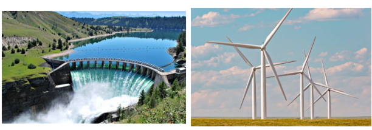

### Earth Science

## Geology

## Energy resources

A **natural resource** is any material that occurs naturally in the environment
and is used by people.

A **renewable resource** is either always available or is naturally replaced in
a short time.

A **nonrenewable resource** is a resource that is not replaced within a useful
time frame.

**Complete the tasks below.**

1. Aisha loves visiting her grandmother at work. Her grandmother says that the
building she works in was designed to help conserve natural resources. Most of
the building's electricity comes from renewable resources, such as sunlight and
wind, instead of from nonrenewable resources, such as oil or coal. What is one
example of a natural resource?

2. Word - Definition- Example: **scarce** - rare; in limited supply -Tickets for the
concert are becoming scarce because of the demand. **emit** - to give off When the
oven is on, it emits heat, making the whole apartment warmer.
Choose the word from above that best completes each sentence.
a) Motor vehicles __ chemicals that contribute to air pollution.
b) As people continue to use oil faster than it can be replaced, it will become
___ .

### Chapter Preview

- fuel
- fossil fuel
- hydrocarbon
- petroleum
- refinery
- petrochemical
- solar energy
- hydroelectric power
- biomass fuel
- gasohol
- geothermal energy
- nuclear fission
- reactor vessel
- fuel rod
- control rod
- efficiency
- insulation
- energy conservation

### Fossil Fuels

- What Are the Three Major Fossil Fuels?
- Why Are Fossil Fuels Nonrenewable Resources?

**Complete the tasks below.**

1. Hurricane Energy Crisis. On August 29, 2005, Hurricane Katrina struck the
Gulf Coast. The storm flooded cities and towns. In New Orleans, tens of
thousands of people were stranded on rooftops. Hundreds of thousands of evacuees
fled to other parts of the country. Katrina also created another kind of crisis.
The Gulf Coast has many factories that produce oil and gas for the entire
country. These factories were shut down because of winds, power outages, and
flooding. Gas stations ran out of gas. Prices soared. Many people couldn't
afford to heat their homes. Some people burned wood instead. Others just got
cold. The hurricane had created an energy crisis.
a) Due to global climate changes, more
hurricanes are expected to hit the
Gulf Coast. What might happen to gas and oil production?
b) How might alternative fuels provide a solution?

### What Are the Three Major Fossil Fuels?

Whether you travel in a car or a bus, walk, or ride your bike, you use some form
of energy. The source of that energy is fuel. A **fuel** is a substance that
provides energy, such as heat, light, motion, or electricity. This energy is the
result of a chemical change.

Most of the energy used today comes from organisms that lived hundreds of
millions of years ago. As these plants, animals, and other organisms died, their
remains piled up. Layers of sand, rock, and mud buried the remains. Over time,
heat and the pressure of the layers changed the remains into other substances.
**Fossil fuels** are the energy-rich substances formed from the remains. **The
three major fossil fuels are coal, oil, and natural gas.**

Fossil fuels are made of hydrocarbons. **Hydrocarbons** are chemical compounds
that contain carbon and hydrogen atoms. When the fossil fuels are burned, the
atoms react. They combine with oxygen to form new molecules. These reactions
release energy in the forms of heat and light.

Burning fossil fuels provides more energy per kilogram than burning other fuels.
One kilogram of coal, for example, can provide twice as much energy as one
kilogram of wood. Oil and natural gas can provide three times as much energy as
an equal mass of wood.

  <figure>
    
    <figcaption>Figure 1. Fossil Fuels in Everyday Life.</figcaption>
  </figure>

### Coal 

People have burned coal to produce heat for thousands of years. For much of that
time, wood was more convenient and cheaper than coal for most people. But during
the 1800s, the huge energy needs of growing industries made it worthwhile to
find, mine, and transport coal. Today, coal makes up about 22 percent of the
fuel used in the United States. Most of that coal fuels electrical power plants.

Before coal can be used to produce energy, it has to be removed from the ground.
Miners use machines to chop the coal into chunks and lift it to the surface.
Coal mining can be a dangerous job. Thousands of miners have been killed or
injured in mining accidents. Many more suffer from lung diseases. Fortunately,
modern safety procedures and better equipment have made coal mining safer,
although it is still very dangerous.

Coal is the most plentiful fossil fuel in the United States. It is fairly easy
to transport and provides a lot of energy when burned. But coal also has some
disadvantages. Coal mining can increase erosion. Runoff from coal mines can
cause water pollution. Burning most types of coal results in more air pollution
than using other fossil fuels. See Figure 2.

  <figure>
    
    <figcaption>Figure 2. Pros and Cons of Coal Use.</figcaption>
  </figure>

Figure 3 shows how plant remains build up over time and form coal.

  <figure>
    
    <figcaption>Figure 3. Coal Formation.</figcaption>
  </figure>

### Oil 

Oil is a thick, black, liquid fossil fuel. It formed from the remains of small
animals, algae, and other organisms that lived in oceans and shallow inland seas
hundreds of millions of years ago. **Petroleum** is another name for oil. Petroleum
comes from the Latin words Petra (rock) and oleum (oil). Petroleum accounts for
more than one third of the energy produced in the world. Fuel for most cars,
airplanes, trains, and ships comes from petroleum. Many homes are heated by oil
as well.

Most oil deposits are located underground in tiny holes in sandstone or
limestone. Figure 4 shows how oil is formed. The oil fills the holes somewhat
like the way water fills the holes of a sponge. Because oil deposits are usually
located deep below the surface, finding oil is difficult. Scientists can use
sound waves to test an area for oil. Even using this technique, scientists may
not always locate wells that will produce a usable amount of oil.

  <figure>
    
    <figcaption>Figure 4. Oil Formation.</figcaption>
  </figure>

When oil is first pumped out of the ground, it is called crude oil. To be made
into useful products, crude oil must undergo a process called refining. A
factory in which crude oil is heated and separated into fuels and other products
is called a **refinery**. Many of the products that you use every day are made from
crude oil. **Petrochemicals** are compounds that are made from oil. Petrochemicals
are used to make plastics, paints, medicines, and cosmetics.

  <figure>
    
    <figcaption>Figure 5. Oil Pipeline.</figcaption>
  </figure>

### Natural Gas 

Natural gas is a mixture of methane and other gases. Natural gas forms from some
of the same organisms as oil. Because it is less dense than oil, natural gas
often rises above an oil deposit, forming a pocket of gas in the rock.

Pipelines transport natural gas from its source to the places where it is used.
If all the gas pipelines in the United States were connected, they would reach
to the moon and back-three times! Natural gas can also be compressed into a
liquid and stored in tanks as fuel for trucks and buses.

Natural gas has several benefits. It produces large amounts of energy, but has
lower levels of many air pollutants compared to coal or oil. It is also easy to
transport once pipelines are built. One cost of natural gas is that it is highly
flammable. A gas leak can cause explosions and fires. If you use natural gas in
your home, you probably are familiar with the "gas" smell alerting you when
there is unburned gas in the air. You may be surprised to learn that natural gas
actually has no odor. What causes the strong smell? Gas companies add a chemical
with a distinct smell to the gas so that people can detect a gas leak.

  <figure>
    
    <figcaption>Figure 7. Natural Gas.</figcaption>
  </figure>

### Why Are Fossil Fuels Nonrenewable Resources?
The many advantages of using fossil fuels as an energy source have made them
essential to modern life. **Since fossil fuels take hundreds of millions of years
to form, they are considered nonrenewable resources.** Earth's known oil reserves,
or the amount of oil that can currently be used, took 500 million years to form.
Fossil fuels will run out if they are used faster than they are formed.

Many nations that consume large amounts of fossil fuels have very small reserves
or supplies. They have to buy oil, natural gas, and coal from nations with large
supplies to make up the difference. The United States, for example, uses about
one quarter of all the oil produced in the world. But only two percent of the
world's oil supply is located in this country. The uneven distribution of fossil
fuel reserves has often been a cause of political problems in the world.

**Complete the tasks below.**

1. Fossil Fuels in Everyday Life, see Figure 1.
Fossil fuels have many common uses.
Fossil Fuel Common Uses:	
**Coal**
- Used to generate half of all U.S. electricity
- Used to make products like fertilizer and medicine
- When heated, used to make steel
**Oil**
- As gasoline and diesel fuels, used to power vehicles
- Used to heat homes
- Used to make plastics and other petroleum products
**Natural gas**
- Used to generate electricity
- Used to cook food
- Used to heat homes
Uses in Your Life: 
Fill in the chart with ways that you or other people use the three fossil fuels in daily life.
a) Coal
b) Oil
c) Natural gas

2.  Pros and Cons of Coal Use, see Figure 2.
Coal mining is a dangerous job.
Compare and Contrast the use of coal
a) Pros
b) Cons

3. Coal Formation, see Figure 3. Coal formation takes millions of years. 1)
Decomposing Plant Matter: When swamp plants die, their decomposing remains build
up. 2) Peat Over time, plant remains pile up and form peat. Peat can be burned
as fuel. 3) Coal Under increasing pressure from sediments, peat is compacted.
Eventually, peat becomes coal. Coal is a more efficient fuel than peat.
Eplain the process in your own words.

4. Oil Formation, see Figure 4. Oil is formed in a process similar to coal. Fill
in the steps of oil formation in the diagrams
a) 300-400 million years ago
b) 50-100 million years ago
c) Today

  <figure>
    
    <figcaption>Figure 6. Lake Baikal in Russia.</figcaption>
  </figure>

5. Over 2,500 species of plants and animals live in Lake Baikal, in Russia, see
Figure 6. Eighty percent of these species live nowhere else on Earth. One of
those species is the Baikal seal-one of only three freshwater seal species on
Earth. The seal and other species were threatened when oil companies planned to
build the world's longest oil pipeline within 800 meters of the lake's shore.
The pipeline would bring oil from Russia's interior to China and ports along the
Pacific Ocean. Citizens were concerned that oil leaks and spills would damage
the lake. They worked together to convince the oil companies to move the
pipeline 40 kilometers to the north. The design of the new pipeline protects the
lake and also delivers oil to places that need it. 
An oil pipeline is proposed in your area near a body of water you think is
important. Using Lake Baikal as an example, write a letter to the editor of your
local paper explaining what you think should be done about the pipeline and why.
Give your letter a headline.

6. Natural Gas, see Figure 7.
A gas-top burner uses natural gas to cook food.
a) What are costs of natural gas.
a) What are benefits of natural gas.

7. What are petrochemicals?

8. Should the federal government decide where to build oil or natural gas
pipelines? Explain.

  <figure>
    
    <figcaption>Figure 8. Recent Electricity Production in the United States by Energy Source.</figcaption>
  </figure>

9. Recent Electricity Production in the United States by Energy Sourc. Use the
graph in Figure 8 to answer the questions.
a) Which energy source generates the most electricity in the United States?	
b) What percentage of the fuels in the graph are fossil fuels? 	
c) How might this graph look in 50 years? Give reasons to support your answer. 

### Renewable Sources of Energy

- What Are Some Renewable Sources of Energy?

- How Does a Nuclear Power Plant Produce Electricity?

**Complete the tasks below.**

1. An Unlikely Decision T. Boone Pickens's family taught him the value of d work
during the Great Depression of the 1930s. At 11, he delivered newspapers. By 26,
he founded his own oil and gas company and became rich. In 2007, T. Boone
Pickens surprised everyone by announcing plans to build the world's largest wind
farm. He insisted the country must replace oil with wind and solar power. Even
though he still promotes oil, he was one of the first oil businessmen to admit a
change was needed. "I've been an oil man all my life," Pickens said, "but this
is one emergency we can't drill our way out of."
a) Why do you think Pickens's decision was so surprising?
b) Do you think more focus should be put on finding sources of energy other than
oil? Why or why not?

### What Are Some Renewable Sources of Energy?

Coal, oil, and natural gas are not the only energy options available on Earth.
**Renewable sources of energy include sunlight, water, wind, biomass fuels, and
geothermal energy.** Other energy options include nuclear power and hydrogen.
Scientists are trying to put these energy resources to work.
	

### Solar Energy 

The warmth you feel on a sunny day is **solar energy**, or energy from the sun. The
sun constantly gives off energy in the forms of light and heat. Solar energy is
the source, directly or indirectly, of most other renewable energy resources. In
one hour, Earth receives enough solar energy to meet the energy needs of the
world for an entire year. Solar energy does not cause pollution. It will not run
out for billions of years.

So why hasn't solar energy replaced energy from fossil fuels? One reason is that
solar energy is only available when the sun is shining. Another problem is that
the energy Earth receives from the sun is very spread out. To obtain a useful
amount of power, it is necessary to collect solar energy from a large area.

### Solar Power Plants 

One way to capture the sun's energy involves using giant mirrors. In a solar
power plant, rows of mirrors focus the sun's rays to heat a tank of water. The
water boils. This creates steam. The steam can then be used to generate
electricity.

### Solar Cells 

Solar energy can be converted directly into electricity in a solar cell. When
light hits the cell, an electric current is produced. Solar cells power some
calculators, lights, and other small devices.

  <figure>
    
    <figcaption>Figure 9. Everyday Solar Power.</figcaption>
  </figure>

Photovoltaic cells, or solar cells, are named for the Greek word for light,
photo, and electricity pioneer Alessandro Volta.

**Solar Cells:** Active solar cells on the roof generate an electric current. A
battery stores energy for night use.

**Sunlight Absorption:** Sunlight that passes through the windows is absorbed by
the walls and floors and is converted to heat. At night, shades covering the
windows prevent the heat from flowing back outside.

**Window Design:** As they let sunlight in, large windows act as solar
collectors.

**Solar Water Heater:** Water is pumped from a storage tank to an active solar
collector on the roof. Sunlight heats the water, which is then returned to the
tank. The water then heats pipes that heat the air throughout the house.

**Backup Heat Source:** The house has a wood stove to provide backup heat on
cloudy days.
  
  <figure>
    
    <figcaption>Figure 10. Solar-Powered House.</figcaption>
  </figure>

### Passive Solar Heating 

Solar energy can be used to heat buildings with passive solar systems. A passive
solar system converts sunlight into heat, or thermal energy. The heat is then
distributed without using pumps or fans. Passive solar heating is what occurs in
a parked car on a sunny day. Solar energy passes through the car's windows and
heats the seats and other car parts. These parts transfer heat to the air,
warming the inside of the car. The same principle can be used to heat a home.

### Active Solar Heating 

An active solar system captures the sun's energy, and then uses pumps and fans
to distribute the heat. First, light strikes the dark metal surface of a solar
collector. There, it is converted to thermal energy. Water is pumped through
pipes in the solar collector to absorb the thermal energy. The heated water then
flows to a storage tank. Finally, pumps and fans distribute the heat throughout
the building. Refer to Figure 10.

### Hydroelectric Power 

Solar energy is the indirect source of water power. In the water cycle, energy
from the sun heats water on Earth's surface. The heat turns the water into water
vapor. The vapor condenses and falls back to Earth as rain, sleet, hail, or
snow. As the water flows over land, it provides another source of energy

**Hydroelectric power** is electricity produced by flowing water. A dam across a
river blocks the flow of water, creating a body of water called a reservoir.
When a dam's gates are opened, water flows through tunnels at the bottom of the
dam. As the water moves through the tunnels, it turns turbines (like a fan's
blades). The turbines are connected to a generator. Once a dam is built,
generating electricity is inexpensive. But dams can prevent some fish species
from breeding. They can also damage aquatic habitats.

### Capturing the Wind 

Like water power, wind energy is also an indirect form of solar energy. The sun
heats Earth's surface unevenly. As a result, different areas of the atmosphere
have different temperatures and air pressures. The differences in pressure cause
winds to form as air moves from one area to another,

Wind can be used to turn a turbine and generate electricity. Wind farms consist
of many wind turbines. Together, the wind turbines generate large amounts of
power. Wind is the fastest-growing energy source in the world. Wind energy does
not cause pollution. In places where fuels are difficult to transport, wind
energy is the major source of power if it is available.

### Nuclear Power 

Like water and wind power, nuclear power does not produce air pollution since no
fuel is burned. Instead, the energy released from the splitting of atoms is used
to create steam that turns turbines. This process can be dangerous and even
cause explosions if too much energy is released. Wastes generated by nuclear
plants can be dangerous if disposed of improperly.

  <figure>
    
    <figcaption>Figure 11. Hydroelectric and Wind Power.</figcaption>
  </figure>

### Biomass Fuels 

Wood was probably the first fuel ever used for heat and light. Wood belongs to a
group of fuels called **biomass fuels**. Biomass fuels are made from living things.
Other biomass fuels include leaves, food wastes, and even manure. As fossil fuel
supplies shrink, people are taking a closer look at biomass fuels. For example,
when oil prices rose in the early 1970s, Hawaiian farmers began burning sugar
cane wastes to generate electricity.

In addition to being burned as fuel, biomass materials can be converted into
other fuels. For example, corn, sugar cane, and other crops can be used to make
alcohol. Adding alcohol to gasoline forms **gasohol**. Gasohol can be used as fuel
for cars. Bacteria can produce methane gas by decomposing biomass materials in
landfills. That methane can be used to heat buildings. And some crops, such as
soybeans, can produce oil. The oil can be used as fuel, which is called
biodiesel fuel.

Biomass fuels are renewable resources. But it takes time for new trees to
replace those that have been cut down. And it is expensive to produce alcohol
and methane in large quantities. As a result, biomass fuels are not widely used
today in the United States. But as fossil fuels become scarcer, biomass fuels
may provide another source for meeting energy needs.

  <figure>
    
    <figcaption>Figure 12. Corn Power.</figcaption>
  </figure>

Corn Power, see Figure 12. Biomass fuels come from living things, such as
corn. It takes about 11.84 kilograms of corn to make one gallon of fuel!

### Tapping Earth's Energy 

Below Earth's surface are pockets of very hot liquid rock called magma. In some
places, magma is very close to the surface. The intense heat from Earth's
interior that warms the magma is called **geothermal energy**.

In certain regions, such as Iceland and New Zealand, magma heats underground
water to the boiling point. In these places, the hot water and steam can be
valuable sources of energy. For example, in Reykjavik, Iceland, 90 percent of
the homes are heated by water warmed underground in this way. Geothermal energy
can also be used to generate electricity, as shown in Figure 14.

Geothermal energy does have disadvantages. There are only a few places where
Earth's crust is thin enough for magma to come close to the surface. Elsewhere,
very deep wells would be needed to tap this energy. Drilling deep wells is very
expensive. Even so, geothermal energy is likely to become a good method for
meeting energy needs for some locations in the future.

  <figure>
    
    <figcaption>Figure 14. Geothermal Power in Iceland.</figcaption>
  </figure>

  <figure>
    
    <figcaption>Figure 15. What are some of Earth's energy sources?.</figcaption>
  </figure>

### Electric Cars and Hydrogen Fuel Cells 

You may have heard about or even seen battery-powered electric cars. But what
about cars that use hydrogen fuel cells? Both technologies, battery-powered
electric cars and hydrogen fuel cells, have been developed to use renewable
energy. See Figure 15.

Electric cars run entirely on batteries, and you plug them into an outlet to
recharge them. The electricity used can be generated by power plants that use
hydroelectric or solar energy. Some electric cars have adaptors that let you
recharge them in minutes.

Some cars can run on hydrogen. They have tanks called hydrogen fuel cells that
hold hydrogen instead of gasoline. Many power plants can use excess energy to
break water molecules apart to make hydrogen. This hydrogen can then be pumped
into cars. Cars that run on hydrogen fuel cells emit water vapor, not exhaust.

### How Does a Nuclear Power Plant Produce Electricity?

Nuclear power plants generate much of the world's electricity. They generate
about 20 percent of the electricity in the United States and more than 70
percent in France. Controlled nuclear fission reactions take place inside
nuclear power plants. **Nuclear fission** is the splitting of an atom's nucleus into
two nuclei. The splitting releases a lot of energy. **In a nuclear power plant,
the heat released from fission reactions is used to turn water into steam. The
steam then turns the blades of a turbine to generate electricity.** Look at the
diagram of a nuclear power plant in Figure 16. In addition to the generator, it
has two main parts: the reactor vessel and the heat exchanger.

### Reactor Vessel 

The **reactor vessel** is the part of the nuclear reactor in which nuclear fission
occurs. The reactor contains rods of radioactive uranium called **fuel rods**. When
several fuel rods are placed close together, a series of fission reactions
occurs.

If the reactor vessel gets too hot, control rods are used to slow down the chain
reactions. **Control rods**, made of the elements cadmium, boron or hafnium, are
inserted near the fuel rods. The elements absorb particles released during
fission and slow the speed of the chain reactions. The control rods can then be
removed to speed up the chain reactions again.

  <figure>
    
    <figcaption>Figure 16. Nuclear Power Plants.</figcaption>
  </figure>

### Heat Exchanger 

Heat is removed from the reactor vessel by water or another fluid that is pumped
through the reactor. This fluid passes through a heat exchanger. There, the
fluid boils water to produce steam. The steam runs the electrical generator. The
steam is condensed again and pumped back to the heat exchanger.

### The Risks of Nuclear Power 

At first, people thought that nuclear fission would provide an almost unlimited
source of clean, safe energy. But accidents at nuclear power plants have led to
safety concerns. In 1986, the reactor vessel in a nuclear power plant in
Chernobyl, Ukraine, overheated. The fuel rods generated so much heat that they
started to melt. This condition is called a meltdown. The excess heat caused a
series of explosions, which injured or killed dozens of people immediately. In
addition, radioactive materials escaped into the environment and killed many
more people.

Plant operators can avoid accidents at nuclear facilities through careful
planning and by improving safety features. A more difficult problem is the
disposal of radioactive wastes. Radioactive wastes remain dangerous for many
thousands of years. Scientists must find ways to store these wastes safely for
very long periods of time.

**Complete the tasks below.**

1. Everyday Solar Power, see Figure 9. Many objects, including calculators,
street lights, and even backpacks that charge electronic devices, can be powered
by the sun.
a) What object in your everyday life would you like to run on solar power?
b) Would you want the sun to be its only power source? Why?

2. Solar-Powered House, see Figure 10. This house takes advantage of active and
passive solar heating. Identify which are passive and which are active sources
of solar energy.
a) Sunlight Absorption: active/passive
b) Solar Cells: active/passive
c) Window Design: active/passive
d) Solar Wather Heater: active/passive
e) Backup Heat Source: active/passive

3. Hydroelectric and wind power do not rely on fossil fuels, see Figure 11. List
similarities and differences between hydroelectric (water) and wind power.
a) List similarities between water and wind power. 
b) List differences between water and wind power.

  <figure>
    
    <figcaption>Figure 13. Supply and Demand for Food.</figcaption>
  </figure>

4. Supply and Demand for Food and Fuel Crops, see Figure 13. What can happen
when a food crop is used for fuel? The relationship is plotted with two curves
on the graph.
a) According to the graph, as demand for corn increases, what happens to the
supply?
b) How would the price of corn change as demand for fuel increases? Why?

5. Geothermal Power in Iceland, see Figure 14. Geothermal power plants like the
one shown here use heat from Earth's interior to generate electricity. On the
diagram, draw Earth's crust and show where magma might be located in relation to
Iceland's surface.

6. What are some of Earth's energy sources, see Figure 15? People use many energy
sources in their daily lives. Each source has its pros and cons. In the boxes,
write one pro and one con about each energy source pictured.	
a) Biomass Fuel
b) Hydroelectric Power
c) Wind Power
d) Fossil Fuels
e) Geothermal Energy
f) Solar Power
g) Nuclear Power
h) Hydrogen Power

7. High-Use Academic Words The word emit means "to give off." What do vehicles
that run on hydrogen fuel cells emit?

8. What forms of energy are provided by the sun?

9. Are biomass fuels renewable? Why?

10. What are some of Earth's energy sources?

11. Nuclear power plants are designed to turn the energy from nuclear fission
reactions into electricity, see Figure 16. Where does nuclear fission occur in
the plant?

12. Nuclear France. France uses nuclear power to generate much of its
electricity, including the power for the lights on the Eiffel Tower. However,
there are several risks to using nuclear power. Identify some of these risks.

13. Nuclear power plants produce energy by ___
	
### Energy Use and Conservation
- How Has Energy Use Changed Over Time?
- How Can We Ensure There Will Be Enough Energy for the Future?

**Complete the tasks below.**

1. House of Straw. What was that first little pig thinking? Was he just
lazy-building a house of straw as quickly as he could without much thought? Or
was he helping the environment? It turns out that straw is one of the best
materials for keeping warm air inside in cold weather and keeping hot air
outside in hot weather. Builders place stacks of straw along the exterior walls
of a building and then seal the straw with mud. Bales of straw are natural and
cheap, since straw is left over after grain is harvested. It's no wonder that
more and more people are using stia to insulate their homes!
a) How does using straw for insulation save energy?
b) Why is using straw for insulation good for the environment?

### How Has Energy Use Changed Over Time?

Energy, beyond using your own muscle power, is essential to the way most people
live. The methods people use to obtain energy have changed, especially in the
last 200 years. **For most of human history, people burned wood for energy. Only
recently have fossil fuels become the main energy source.**

Eventually, people harnessed the power of other renewable resources. Ships used
tall sails to capture wind energy. Flowing water turned wheels connected to
stones that ground grain into flour.

Wood, wind, and water were also the main sources of energy in the United States
until the nineteenth century. Coal gained in popularity as a fuel during the
westward expansion of the railroads. Coal remained the dominant fuel until 1951,
when it was replaced by oil and natural gas.

Today, scientists are continually looking for new and better fuels to meet the
world's energy needs. As fossil fuel supplies continue to decrease, the interest
in renewable energy sources has increased. With more focus on protecting the
environment, scientists are working to meet our energy needs while reducing and
eliminating many sources of pollution.

  <figure>
    
    <figcaption>Figure 17. Timeline.</figcaption>
  </figure>

### How Can We Ensure There Will Be Enough Energy for the Future?

What would happen if the world ran out of fossil fuels today? The heating and
cooling systems in most buildings would stop functioning. Forests would
disappear as people began to burn wood for heating and cooking. Cars, buses, and
trains would be stranded wherever they ran out of fuel. About 70 percent of the
world's electric power would disappear. Since televisions, computers, and
telephones depend on electricity, communication would be greatly reduced. Lights
and most home appliances would no longer work.

Although fossil fuels won't run out immediately, they also won't last forever.
Most people think that it makes sense to use fuels more wisely now to avoid fuel
shortages in the future. CM One way to preserve our current energy resources is
to increase the efficiency of our energy use. Another way is to conserve energy
whenever possible. Refer to Figure 18.

  <figure>
    
    <figcaption>Figure 18. Wasting Energy.</figcaption>
  </figure>

  <figure>
    
    <figcaption>Figure 19. Wasting Energy.</figcaption>
  </figure>

### Energy Efficiency 

One way to make energy resources last longer is to use fuels more efficiently.
**Efficiency** is the percentage of energy that is actually used to perform work.
The rest of the energy is "lost" to the surroundings, usually as heat. People
have developed many ways to increase energy efficiency.

### Heating and Cooling 

One method of increasing the efficiency of heating and cooling systems is
insulation. **Insulation** is a layer of material that traps air. This helps block
the transfer of heat between the air inside and outside a building. You have
probably seen insulation made of fiberglass. It looks like pink cotton candy. A
layer of fiberglass 15 centimeters thick insulates a room as well as a brick
wall 2 meters thick!

Trapped air can act as insulation in windows too. Many windows consist of two
panes of glass with space in between them. The air between the panes of glass
acts as insulation.

### Lighting 

Much of the electricity used for home lighting is wasted. For example, less than
10 percent of the electricity that an incandescent light bulb uses is converted
into light. The rest is given off as heat. In contrast, compact fluorescent
bulbs use about one fourth as much energy to provide the same amount of light.

### Transportation 

Engineers have improved the energy efficiency of cars by designing better
engines and batteries. For instance, many new cars use high-efficiency hybrid
engines that go twice as far on a tank of fuel than other cars. Buses in some
cities are now entirely electric, running on high-power rechargeable batteries.
New kinds of batteries allow some electric cars to drive hundreds of kilometers
before recharging.

Another way to save energy is to reduce the number of cars on the road. In many
communities, public transit systems provide an alternative to driving. Other
cities encourage carpooling and bicycling. Many cities now set aside lanes for
cars containing two or more people.

### Energy Conservation 

Another approach to making energy resources last longer is conservation.
**Energy conservation** means reducing energy use.

You can reduce your personal energy use by changing your behavior in some simple
ways. For example, if you walk to the store instead of getting a ride, you are
conserving the gasoline it would take to drive to the store.

While these suggestions seem like small things, multiplied by millions of people
they add up to a lot of energy saved for the future.

**Complete the tasks below.**

1. Energy use has changed over time. On the timeline in Figure 17, label and shade the
periods in which coal and oil were the dominant fuel sources in the United
States.
a) 1870 - 1950
b) 1950 - Present

2. Wasting Energy, see Figure 18 & 19. Many things, such as lights and appliances,
use energy. If people do not use these things properly, energy can be wasted.
a) Identify everything in this scene that is wasting energy.
b) Solutions to Wasting Energ. There are many ways to save energy in a home.
Pick at least three of the things you identified in the scene and explain what
people could do to stop wasting energy. 

3. You have been put in charge of designing an ad campaign for your area to get
more people to use public transportation. 
a) Design a poster that will get people's attention and inform them about their
choices. On your poster, list at least three reasons why people should use
public transportation. Give your poster a title.
b) Where would you want to display your poster? Why?
c) How else could you increase awareness about public transportation?

4. Energy Conservation in Your Everyday Life. Even students like you can
conserve energy. Think of ways you can conserve energy in your daily life.

5. What does it mean to say that something is "energy efficient"?

6. What are some strategies a city could use to increase energy conservation?

7. Ensuring that the future has enough energy requires ___ .

8. Earth has many energy sources, including _____ such as coal; the sun, which
can be used for ___ and flowing water, which can be used for hydroelectric
power.

### Study Guide

- The three major fossil fuels are coal, oil, and natural gas.

- Since fossil fuels take hundreds of millions of years to form, they are
considered nonrenewable resources.

- Renewable sources of energy include sunlight, water, wind, biomass fuels, and
geothermal energy.

- In a nuclear power plant, the heat released from fission reactions is used to
change water into steam. The steam then turns the blades of a turbine to
generate electricity.

- For most of human history, the main fuel source was wood. Only recently have
fossil fuels become the main energy source.

- One way to preserve our current energy resources is to increase the efficiency
of our energy use. Another way is to conserve energy whenever possible.

**Complete the tasks below.**

1. What is one similarity among oil, coal, and natural gas?
A) They are all petrochemicals.
B) They all must be processed in a refinery.
C) They are all gases at room temperature.
D) They are all formed from the remains of dead organisms.

2. Fossil fuels take hundreds of millions of years to form, and therefore are
considered ___ energy sources.

3. Describe one main use for each fuel: coal, oil, and natural gas.

4. How does coal form?

5. Imagine a day without fossil fuels. Describe your day, from when you wake up
until when you eat lunch. Identify each time you would have used energy from
fossil fuels.

6. Which of the following is not a biomass fuel?
A) gasohol
B) methane from landfills
C) hydrogen
D) sugar cane wastes

7. Running water can be used as an energy source to produce ___ power.

8. Identify two benefits and two costs of hydrogen power.
a) Benefits:
b) Costs:

9. Explain how a nuclear power plant produces energy.

10. What is efficiency?
A) the percentage of energy that is lost to the environment as heat
B) the percentage of energy that is used to perform work
C) the percentage of energy that is conserved when work is done
D) the percentage of energy that is wasted when electronics are left on

11. ____ involves using less energy, helping energy resources last longer.

12. How is energy use today different from energy use 200 years ago?

13. Describe three actions a person can take to conserve energy.

14. Earth's energy sources include both renewable and nonrenewable resources.
Name at least three sources of energy that could be used in a classroom like the
one below. Then describe the ideal energy source for generating most of your
school's electricity and explain why you chose this source.

  <figure>
    
    <figcaption>Figure 20. Global Oil Production and Use.</figcaption>
  </figure>
  

15. Which statement is best supported by the table below?
2007 Global Oil Production and Use
A) Brazil produces more oil than China.
B) Russia produces the most oil.
C) China consumes the most oil.
D) The United States consumes and produces the most oil in the world.

2. Which of the following is not a fossil fuel?
A) oil
B) coal
C) natural gas
D) wood

3. The interior of a car heats up on a sunny day because of
A) solar cells.
B) active solar heating. 
C) passive solar heating.
D) direct solar heating. 
 

4. Which explains why systems that transform energy are not completely efficient?
A) Increasing energy resources increases efficiency.
B) Doing less work gives off more heat.
C) Some energy is converted to heat that flows to surrounding material.
D) An increase in the amount of energy is needed to generate electricity.

5. How does a nuclear power plant produce energy?
A) with solar panels
B) through nuclear fission reactions 
C) with geothermal heat
D) through nuclear meltdown reactions

  <figure>
    
    <figcaption>Figure 21. Energy Production.</figcaption>
  </figure>

6. Describe how energy is produced in the diagram in Figure 21. Then, describe
one advantage and one disadvantage of this source. 
