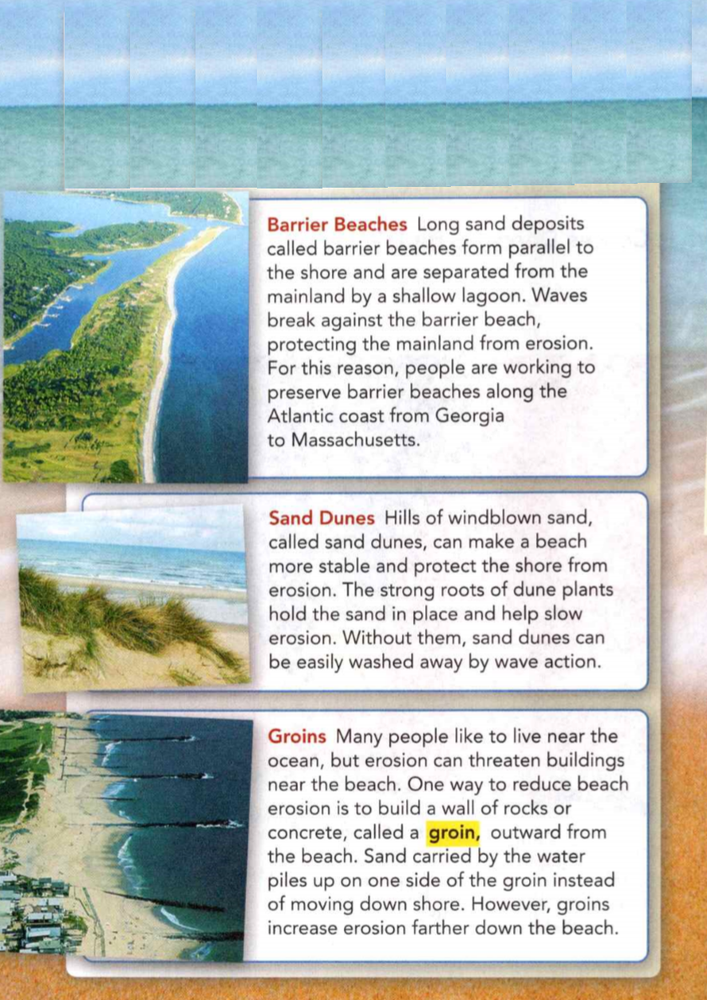
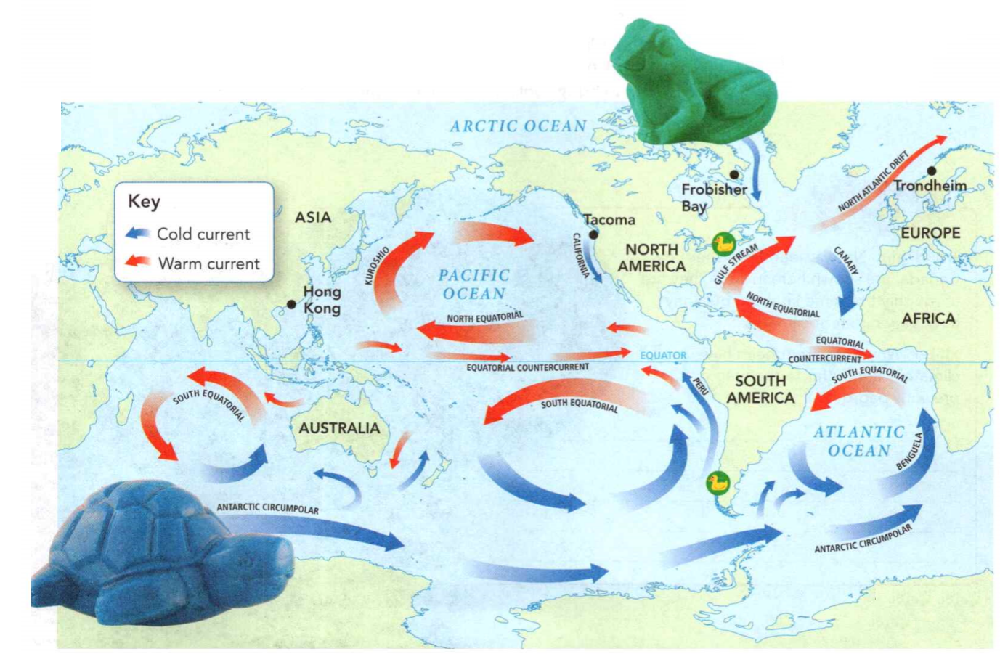
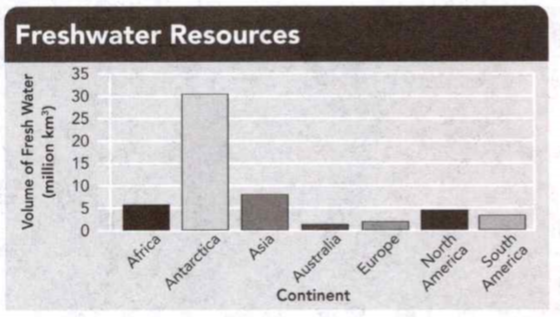

### Earth Science

## Geology

## Water

**Condensation** occurs when a substance changes from a gas to a liquid.

**Water vapor** is water in the gaseous state.

**Gravity** is a force that attracts all objects toward each other.


**Complete the tasks below.**

1. Have you ever sat at a window on a misty day? You might see **condensation** as
drops of water form on the glass. These drops form when **water vapor** in the air
cools and turns into a liquid. **Gravity** pulls the drops down the windowpane
toward Earth's surface. How do water drops form on the window?


### Chapter Preview


- habitat 
- groundwater
- water cycle	
- evaporation
- transpiration	
- precipitation
- tributary 
- watershed
- divide
- reservoir
- eutrophication
- permeable	
- impermeable
- unsaturated zone
- saturated zone	
- water table
- aquifer	
- artesian well
- salinity 
- sonar	
- seamount
- trench 
- continental slope
- continental shelf	
- abyssal plain
- mid-ocean ridge
- wave 
- wavelength	
- frequency
- wave height	
- tsunami
- longshore drift	
- rip current
- groin
- current	
- Coriolis effect
- climate	
- El Nino	
- La Nina

### Water on Earth

- Why Is Water Important? 
- Where Is Water Found? 
- What Is the Water Cycle?

**Complete the tasks below.**

  <figure>
    
    <figcaption>Figure 1. Water Use per Person per Day.</figcaption>
  </figure>


1. Water Use per Person per Day, see Figure 1. How Much Water Do You Use? You
take a shower. You brush your teeth. You take a big drink after soccer practice.
All day long, you need water! How much water do you use in a day? How much do
you think your whole state uses? The graph shows the water used per person in
the ten states of the United States with the largest populations. The data
include the water used for all purposes, including farming, industry, and
electric power.
a) In which state is the water use per person greatest? 
b) In which state is it least?
c) What do you think might explain the difference in water use between states?


### Why Is Water Important?
What do you and an apple have in common? You both consist mostly of water! Water
makes up nearly two thirds of your body's mass. That water is necessary to keep
your body functioning.
**All living things need water in order to carry out their body processes. In
addition, many living things live in water.**

### Body Processes 

Without water, neither you nor an apple could survive. Water allows organisms to
break down food, grow, reproduce, and get and use materials they need from their
environments. Animals obtain water by drinking it or by eating foods that
contain water. Most animals cannot survive more than a few days without water.

Plants and other organisms that make their own food also need water. Algae and
plants use water, along with carbon dioxide and energy from the sun, to make
their own food in a process called photosynthesis (fob toh SIN thuh sis). Other
organisms get food by eating the plants, or by eating organisms that eat the
plants.

### Habitats 

Water provides habitats for man living things. An organism's **habitat** is the plat
where it lives and obtains all the things it need to survive. Some organisms
cannot live out of water. You are probably familiar with large water-dwelling
organisms such as sharks. But most such organisms are microscopic. In fact,
aquatic, or water, habitats contain more types of organisms than land habitats
do.


### Where Is Water Found?

When you turn on the tap, it might seem that an endless supply of fresh water
comes out! But Earth's freshwater supply is very limited. **Most of Earth's
surface water-roughly 97 percent-is salt water found in oceans. Only 3 percent
is fresh water.**

Of that 3 percent, about two thirds is frozen in huge masses of ice near the
North and South poles. About a third of the fresh water is underground. A tiny
fraction of fresh water occurs in lakes and rivers. An even tinier fraction is
found in the atmosphere, most of it in the form of invisible water vapor, the
gaseous form of water.

### Oceans 

Find the oceans on the map in Figure 3. Pacific, Atlantic, Indian, and Arctic
are the names used for the different parts of the ocean. (Some scientists call
the area around Antarctica the Southern Ocean.) But the waters are really all
interconnected, making up one big ocean. The Pacific Ocean is the largest,
covering an area greater than all the land on Earth. The Atlantic Ocean is next
largest, though the Indian Ocean is deeper. The Arctic Ocean surrounds the North
Pole. Smaller saltwater bodies are called seas.

  <figure>
    
    <figcaption>Figure 3. Earth's Major Waterways.</figcaption>
  </figure>

### Ice 

Much of Earth's fresh water is frozen into sheets of ice. Massive ice sheets
cover most of Greenland and Antarctica. Icebergs are floating chunks of ice made
of fresh water that break off from ice sheets. You could also find icebergs in
the Arctic Ocean and in the North Atlantic.

### Rivers and Lakes 

Look at Figure 3. All the rivers and lakes marked on the map contain fresh
water, as do many other smaller rivers and lakes. North America's five Great
Lakes contain about 20 percent of all the water in the world's freshwater lakes.

### Groundwater 

To find some of the fresh water on Earth, you have to look underground. When it
rains or snows, most water that doesn't evaporate soaks into the ground. This
water trickles through spaces between particles of soil and rock. Water that
fills the cracks and spaces in underground soil and rock layers is called
**groundwater**. Far more fresh water is located underground than in all of Earth's
rivers and lakes.

### What Is the Water Cycle?
Earth has its own built-in water recycling system: the water cycle. The **water
cycle** is the continuous process by which water moves from Earth's surface to the
atmosphere and back, driven by energy from the sun and gravity. **In the water
cycle, water moves between land, living things, bodies of water on Earth's
surface, and the atmosphere.**

### Water Evaporates 

Where does the water in a puddle go when it disappears? It evaporates, becoming
water vapor. **Evaporation** is the process by which molecules at the surface of a
liquid absorb enough energy to change to a gaseous state. Water constantly
evaporates from the surfaces of bodies of water such as oceans and lakes, as
well as from soil and your skin. Plants play a role, too, in this step of the
water cycle. Plants draw in water from the soil through their roots. Eventually
the water is given off through the leaves as water vapor in a process called
**transpiration**.


  <figure>
    
    <figcaption>Figure 4. The Water Cycle.</figcaption>
  </figure>


### Condensation Forms Clouds 

After a water molecule evaporates, warm air can carry the water molecule upward.
Air tends to become colder as it rises. Water vapor condenses more easily at
lower temperatures, so some water vapor cools and condenses into liquid water.
Droplets of liquid water clump around solid particles in the air, forming
clouds.

### Water Falls as Precipitation 

As more water vapor condenses, the water droplets grow larger. Eventually, they
become so heavy that they fall back to Earth. Water that falls to Earth as rain,
snow, hail, or sleet is called **precipitation**.

Most precipitation falls directly into the ocean. Of the precipitation that
falls on land, most evaporates. A small amount of the remaining water runs off
the surface into streams and lakes in a process called runoff, but most of it
seeps into groundwater. After a long time, this groundwater may flow down to the
ocean and evaporate again.

Precipitation is the source of almost all fresh water on and below Earth's
surface. For millions of years, the total amount of water cycling through the
Earth system has remained fairly constant-the rates of evaporation and
precipitation are balanced.


**Complete the tasks below.**

  <figure>
    
    <figcaption>Figure 2. Earth's water.</figcaption>
  </figure>

1. In Figure 2, the graphs show how much of Earth's water is found in different
forms.
a) Where is most water on Earth found?	
b) About what fraction of Earth's fresh water is in the form of ice?
c) How does the total amount of groundwater compare to the total amount of ice?

2. Earth's Major Waterways, see Figure 3. The map shows Earth's oceans and some
major freshwater sources.
a) Identify the names of three saltwater sources. 
b) Identify the names of three freshwater sources.

3. What are the four main sources of fresh water on Earth?

4. Which freshwater source do you think is most important to people? Why?

5. The letter e in evaporation comes from the Latin word ex, meaning "away."
Vapor is Latin for "water vapor." What do you predict that evaporation means?

6. The Water Cycle, see Figure 4. The diagram shows the processes of the water
cycle. As you read these two pages, label each process shown in the diagram.
a) a)
b) b)
c) c)
d) d)
e) e)

7. Give an example of a water cycle process you have seen.

8.  What are the three major steps in the water cycle?

9. Start with a puddle on a sunny day. How might water move through the water
cycle and eventually fall as rain?

### Surface Water

- What Is a River System? W
- hat Are Ponds and Lakes? 
- How Can Lakes Change?

**Complete the tasks below.**

1. So Near, So Far, see Figure 5. In Colorado's mountains, some rain seeps into
the Fryingpan River. That river flows into the Colorado River and, more than
2,000 kilometers later, into the Gulf of California. Less than 15 kilometers
away, rain seeps into the Arkansas River, which flows 2,350 kilometers until it
joins the Mississippi River. Eventually, the Mississippi flows into the Gulf of
Mexico. Water that fell less than 15 kilometers apart ends up almost 3,000
kilometers apart, in different oceans. Why do you think the two rivers that
start so close together flow to such different locations? 


  <figure>
    
    <figcaption>Figure 5. Colorado's mountains.</figcaption>
  </figure>
  
### What Is a River System?

If you were hiking near the beginning of the Fryingpan and Arkansas rivers, you
could observe tiny streams of water from melted snow. Gravity causes these tiny
streams to flow downhill. As you follow one small stream, you would notice that
the stream reaches another stream and joins it, forming a larger stream. That
larger stream joins other streams until a small river forms.

### Tributaries 

As you continue following the small river downhill, you might notice more
streams joining the river. Eventually, the small river itself flows into a
larger river. This river grows as more small rivers flow into it, before finally
spilling into the ocean. The streams and smaller rivers that feed into a main
river are called **tributaries**. Tributaries flow downward toward the main river,
pulled by the force of gravity. **A river and all the streams and smaller
rivers that flow into it together make up a river system.**

  <figure>
    
    <figcaption>Figure 6. The Arkansas River.</figcaption>
  </figure>


### Watersheds 
Just as all the water in a bathtub flows toward the drain, all the water in a
river system drains into a main river. The land area that supplies water to a
river system is called a watershed. Watersheds are sometimes known as drainage
basins.

As you can see in Figure 7, the Missouri and Ohio rivers are quite long. Yet
they flow into the Mississippi River. When rivers join another river system, the
areas they drain become part of the largest river's watershed. The watershed of
the Mississippi River covers nearly one third of the United States!

  
  <figure>
    
    <figcaption>Figure 7. Major Watersheds of the United States.</figcaption>
  </figure>
  
### Divides 

What keeps watersheds separate? One watershed is separated from another by a
ridge of land called a divide. Streams on each side of the divide flow in
different directions. The Great Divide (also called the Continental Divide) is
the longest divide in North America. it follows the line of the Rocky Mountains.
West ^ of this divide, water flows toward the Pacific Ocean. Some water is
trapped between the Rockies and the Sierra Nevadas, in the Great Basin. Between
the Rocky and Appalachian mountains, water flows toward the Mississippi River
and into the Gulf of Mexico.

  <figure>
    
    <figcaption>Figure 8. Divides and Watersheds.</figcaption>
  </figure>

### What Are Ponds and Lakes?
What makes a lake or pond different from a river? Unlike streams and rivers,
ponds and lakes contain still water. In general, ponds are smaller and shallower
than lakes. Sunlight usually reaches to the bottom of all parts of a pond. Most
lakes have areas where the water is too deep for much sunlight to reach the
bottom.

Where does pond and lake water come from? Some ponds and lakes are supplied by
rainfall, melting snow and ice, and runoff. Others are fed by rivers or
groundwater. **Ponds and lakes form when water collects in hollows and
low-lying areas of land.**

  
### Exploring a Pond 

Because the water is shallow enough for sunlight to reach the bottom, plants
grow throughout a pond. Bacteria and plantlike organisms called algae also live
in the pond. The plants and algae produce oxygen as they use sunlight to make
food. Fish and other animals in the pond use the oxygen and food provided by
plants and algae. Some animals also use these plants for shelter.

  <figure>
    
    <figcaption>Figure 9. Pond.</figcaption>
  </figure>

### Exploring a Lake 

Lakes are usually larger and deeper than ponds, so little sunlight reaches the
bottom of a deep lake. Fewer plants can live in in the chilly, dark depths of
such a lake. Mollusks and worms move along the lake's sandy or rocky bottom.
They eat food particles that drift down from the surface. Young bony fishes such
as pike and sturgeon eat the tiny bottom-dwellers, while the adult fish eat
other fish.

  
  <figure>
    
    <figcaption>Figure 10. Lake.</figcaption>
  </figure>
  

### Lake Formation 

Lakes can form through several natural processes. A river, for example, may bend
and loop as it encounters obstacles in its path. Eventually, a new channel might
form, cutting off a loop. The cutoff loop may become an oxbow lake.

Some lakes, such as the Great Lakes, formed in depressions created by ice sheets
that melted at the end of the Ice Age. Other lakes were created by movements of
Earth's crust that formed long, deep valleys called rift valleys. In Africa,
Lake Tanganyika lies in a rift valley. Volcanoes can also form lakes. Lava or
mud from a volcano can block a river, forming a lake. Lakes can also form in the
empty craters of volcanoes.

People can create a lake by building a dam. A lake that stores water for human
use is called a **reservoir**.


  <figure>
    
    <figcaption>Figure 11. Types of Lakes.</figcaption>
  </figure>
  

### How Can Lakes Change?
If you watch a lake or pond over many years, you will see it change. In time,
the lake may shrink and become shallower. **Natural processes and human
activities can cause lakes to disappear.**

### Eutrophication 

As lake organisms die, bacteria break down the bodies and release nutrients into
the water. These nutrients, such as nitrogen and phosphorus, are chemicals that
other organisms need. Over time, nutrients can build up in the lake in a process
called **eutrophication**. Algae use these nutrients and
spread, forming a layer on the lake's surface.

Figure 12 shows how eutrophication can change a lake. When the algae layer
becomes so thick that it blocks sunlight, plants cannot carry out
photosynthesis, and they die. Without food and oxygen from the plants, animals
die. Decaying material from dead organisms piles up on the bottom, making the
lake shallower. As the area fills in, land plants grow in the mud. Eventually,
the area fills with plants, and a meadow replaces the former lake.

### The Human Role 

Though eutrophication occurs naturally, human activities can also cause or
increase it. For example, fertilizer from farms runs off into ponds and lakes,
providing extra nutrients to the algae. The extra nutrients speed up the growth
of algae, leading to faster eutrophication.


  <figure>
    
    <figcaption>Figure 12. Eutrophication.</figcaption>
  </figure>

**Complete the tasks below.**

1. Why is the Arkansas River considered a tributary of the Mississippi River?

2. The Arkansas River, see Figure 6. Put a K on the map where you might go
kayaking. Put an F where you might get water for farming. Put an M where you
might build a manufacturing plant. Explain why you chose the locations you did.

3. Major Watersheds of the United States, see Figure 7. This map shows
watersheds of several large rivers in the United States. Draw
a) the path that water would take from the Platte River's source to the ocean.
b) Which watersheds would the water pass through?

4. Divides and Watersheds, see Figure 8. The diagram shows how divides separate
land into watersheds.
a) Draw a dark line along each divide. 
b) Shade in the watershed for one stream.

5. A (divide/tributary) separates two watersheds.

6. How is a watershed related to a river system?

7. How can a stream be part of more than one watershed?

8. See Figure 9 & 10 for this question. Compare and contrast characteristics of
lakes and ponds.
a) Characteristics of ponds only.
b) Characteristics of ponds and lakes
c) Characteristics of lakes only
d) Based on your answers, write an operational definition for lake.

9. What is one major difference between a lake and a pond?

10. How is a reservoir different from other kinds of lakes?

11. Types of Lakes, see Figure 11. The photos show examples of glacial,
volcanic, and rift valley lakes. Classify Write G on the glacial lake, V on the
volcanic lake, and R on the rift valley lake.
a) a)
b) b)
c) c)

12. Which of the processes occurs first during eutrophication? 
A) Nutrients build up in a lake.
B) A lake is replaced by a meadow.
C) Plants stop carrying out photosynthesis.

13. Eutrophication, see Figure 12. Write a caption for each diagram explaining
the changes that occur during eutrophication.

  
  <figure>
    
    <figcaption>Figure 13. An Endless Cycle.</figcaption>
  </figure>
  
14. An Endless Cycle, see Figure 13. Make a cycle diagram to show how water
cycles. Include the processes listed.

15. Eutrophication occurs when algae block sunlight in a lake or pond and plants
cannot ____ .

16. How does fresh water cycle on Earth?


### Water Underground

- How Does Water Move Underground? 
- How Do People Use Groundwater?


**Complete the tasks below.**

1. Looking for Water How do you know where the water you drink comes from?
Saskia Oosting could help you find out! Ms. Oosting works for a company that
locates and protects groundwater supplies. She is a project manager, which means
she coordinates the work of many other people. One of her company's jobs is
figuring out where the water in a particular well comes from. Scientists and
engineers drill other wells near the well they're observing. Then they pump
water out of the first well and watch the others to see where the level of
groundwater drops. Once they've found the area that contributes water to the
well, the company can help people who use that water keep the supply clean.
a) How do engineers find out where the water in a well comes from? 
b) What kinds of science skills do you think Ms. Oosting needs to do her job?

### How Does Water Move Underground?

Where does underground water come from? Like surface water, underground water
generally comes from precipitation. Some precipitation soaks into the ground,
pulled by gravity.

If you pour water into a glass full of pebbles, the water flows down around the
pebbles until it reaches the bottom of the glass. Then the water begins to fill
up the spaces between the pebbles. **In the same way, water underground trickles
down between particles of soil and through cracks and spaces in layers of
rock.**

### Effects of Different Materials 

Different types of rock and soil have different-sized spaces, or pores, between
their particles, as shown in Figure 1. The size of the pores and the connections
between them determine how easily water moves. Because they have large and
connected pores, materials such as sand and gravel allow water to pass through,
or permeate. They are thus known as **permeable** materials.

Other materials have few or no pores or cracks, or the pores are very small.
Clay has very small pores and is less permeable than sand. Unless it is cracked
granite is **impermeable**, meaning that water cannot pass through easily.

  <figure>
    
    <figcaption>Figure 14. Permeable and Impermeable Materials.</figcaption>
  </figure>


### Water Zones 

Water from precipitation soaks down through permeable rock and soil layers.
These layers contain air as well as water, so they are not saturated, or filled,
with water. This top layer is thus called the **unsaturated zone**.

However, at some depth, the water reaches a level where the pores in the ground
are saturated with water, called the **saturated zone**. The top of the saturated
zone is the **water table**. If you know the depth of the water table in your area,
you can tell how deep you must dig to reach groundwater.

The saturated zone often reaches deep into Earth, even though the rock becomes
less permeable the deeper you go. Sometimes the direction of the water's flow is
changed by impermeable layers, which the water has a harder time flowing
through.


  <figure>
    
    <figcaption>Figure 15. Groundwater Formation.</figcaption>
  </figure>


### How Do People Use Groundwater?

Suppose you live far from a river, lake, or pond. How could you reach
groundwater for your needs? You might be in luck: The water table in your area
might be only a few meters underground. In fact, in some places the water table
actually meets the surface. Springs can form as groundwater bubbles or flows out
of cracks in the rock.

### Aquifers 

Any underground layer of permeable rock or sediment that holds water and allows
it to flow is called an **aquifer**. Aquifers can range in size from a small patch
to an area the size of several states. The huge Ogallala aquifer lies beneath
the plains of the Midwest, from South Dakota to Texas. This aquifer provides
water for millions of people, as well as for crops and livestock.

Aquifers are not unlimited sources of water. If people take water from the
aquifer faster than the aquifer refills, the level of the aquifer will drop. As
you'll see on the next page, this will make it more difficult to reach water in
the future.


Deep underground, water in some areas experiences great heat and pressure. The
pressure forces boiling-hot water and steam to the surface, creating bubbling
hot springs and erupting geysers. More than half the known geysers in the world
are found in Yellowstone National Park.


### Movement in Aquifers 

Do you picture groundwater as a large, still pool beneath Earth's surface? In
fact, the water is moving, seeping through layers of rock or soil. The rate of
motion depends largely on the slope of the water table and the permeability of
the rocks. Some groundwater moves only a few centimeters a day. At that rate,
the water moves about 10 meters a year. Groundwater may travel hundreds of
kilometers and stay in an aquifer for thousands of years before coming to the
surface again.

### Wells 

The depth and level of a water table can vary greatly over a small area.
Generally, the level of a water table follows the shape of the surface of the
land, as shown in Figure 17. The level can rise during heavy rains or snow melts,
and fall in times of dry weather.

Since ancient times, people have brought groundwater to the surface for drinking
and other everyday uses. **People can obtain groundwater from an aquifer by
drilling a well below the water table.** When the bottom of the well is in a
saturated zone, the well contains water. If the water table drops below the
bottom of the well, the well will run dry and water cannot be obtained from it.

  <figure>
    
    <figcaption>Figure 17. Springs and Wells.</figcaption>
  </figure>


	
### Using Pumps 

Long ago, people dug wells by hand. They used a bucket to bring up the water.
People may also have used simple pumps. Today, however, most wells are dug with
well-drilling equipment. Mechanical pumps bring up the groundwater.

Pumping water out of an aquifer lowers the water level near the well. If too
much water is pumped out too fast, a well may run dry. The owners of the well
will have to dig deeper to reach the lowered water table, or wait for rainfall
to refill the aquifer.

### Relying on Pressure 
Another option for bringing up groundwater is an artesian well. In an **artesian
well**, water rises on its own because of pressure within an aquifer.

In some aquifers, groundwater becomes trapped between two layers of impermeable
rock or sediment. This water is under great pressure from the water extending
back up the aquifer. If the top layer of rock is punctured, the pressure sends
water spurting up through the hole. No pump is necessary-in an artesian well,
water pressure does the job.

**Complete the tasks below.**

1. Permeable and Impermeable Materials, see Figure 14.
a) Compare how water moves in clay (left) and gravel (right).
b) Which material is more permeable? (gravel/clay) Why?

2. Groundwater Formation, see Figure 15. Upper areas of the soil contain both
air and water, while lower areas, including less permeable rock, are saturated
with water. 
a) Saturated or unsaturated zone at a)? 
b) Saturated or unsaturated zone at b)? 
c) Shade in the area where water will collect.


3. Water slows down when it reaches (permeable/impermeable) material.

4. What is the water table? 

5. The rock deep within the saturated zone most likely has (large/small) and
(connected/ unconnected) pores. Explain your answer.

6. aqua- is found in words such as aquarium and aquatic as well as aquifer. What
do you think this root means?

  <figure>
    
    <figcaption>Figure 16. Water use in the United States.</figcaption>
  </figure>

7. Uses of Water, see Figure 16. The graph shows water use in the United States.
Use the graph to answer the questions below.
a) What would be a good title for this graph?	
b) The two largest categories combine to make up about what percentage of the
total water used in the United States?
c) How would an increase in the amount of land used for farms affect this graph?
d) If the total daily usage of water in the United States is 1,280 billion
liters, about how many liters are used by power plants?

8. Springs and Wells, see Figure 18. Suppose you are a farmer looking for water
sources.
a) Draw lines showing where you would drill a regular well and an artesian well. 
b) Explain why you chose those locations.

9. If the	table near a well is (raised/lowered), the well may run dry.

10. What are three ways people can get water from an aquifer?

11. Use Figure 17 as a guide. Why is it important to know the depth of an aquifer
before drilling a well?

12. During the winter, you draw your water from a well. Every summer, the well
dries up. What might be the reason for the change?

13. People reach underground water by	___ .

### Exploring the Ocean

- How Do Conditions Vary in Earth's Oceans? 
- What Are Some Features of the Ocean Floor?

**Complete the tasks below.**

1. Deep-Sea Escape. You've heard of how parachutes are used for escapes. But
have you heard of a special suit that allows people to escape from a submarine
183 meters under water? The suit is designed to help sailors survive very cold
temperatures and very high pressure. In an emergency, sailors put on this suit
and enter a water-filled rescue chamber. Then the sailors shoot out, rising at
two to three meters per second. If the suit tears, they have to exhale all the
way to the surface so their lungs don't explode. At the surface, part of the
suit inflates to become a life raft.
a) What technology was developed to help sailors escape a submarine accident?
b) What would it feel like to escape from a submarine deep under water? How
would you help your body adjust to the changing pressure?

### How Do Conditions Vary in Earth's Oceans?

People have explored the ocean since ancient times. For centuries, the ocean has
provided food and served as a route for trade and travel. Modern scientists have
studied the characteristics of the ocean's waters and the ocean floor. **The water
in Earth's oceans varies in salinity, temperature, and depth.**

### Salinity 

If you've ever swallowed a mouthful of water while you were swimming in the
ocean, you know it's pretty salty. But just how salty? If you boiled a kilogram
of ocean water in a pot until the water was gone, there would be about 35 grams
of salt left in the pot. That's about two tablespoons of salt. **Salinity** is the
total amount of dissolved salts in a sample of water. In most parts of the
ocean, the salinity is between 34 and 37 parts per thousand.

The substance you know as table salt is sodium chloride. This salt is present in
the greatest amount in ocean water. When sodium chloride dissolves in water, it
separates into sodium and chloride particles called ions. Ocean water also
contains smaller amounts of more than a dozen ions, including magnesium and
calcium.

Near the ocean's surface, rain, snow, and melting ice add fresh water, lowering
the salinity. Evaporation, on the other hand, increases salinity. Salt is left
behind as the water evaporates. Salinity can also be higher near the poles. As
the surface water freezes into ice, the salt is left behind in the remaining
water.

### Effects of Salinity 

Salinity affects ocean water in different ways. For instance, fresh water
freezes at 0°C. But ocean water doesn't freeze until the temperature drops to
about -1.9°C. The salt acts as a kind of antifreeze by interfering with the
formation of ice. Salt water also has a higher density than fresh water. That
means that the mass of one liter of salt water is greater than the mass of one
liter of fresh water. Because its density is greater, seawater lifts, or buoys
up, less dense objects floating in it.

  <figure>
    
    <figcaption>Figure 18. Composition of Ocean Water.</figcaption>
  </figure>

### Temperature 

The broad surface of the ocean absorbs energy from the sun. **Like
temperatures on land, temperatures at the surface of the ocean vary with
location and the seasons.** Near the equator, surface ocean temperatures often
reach 25°C, about room temperature. The temperatures drop as you travel away
from the equator. Warm water is less dense than cold water, so it doesn't sink.
Warm water forms only a thin layer on the ocean surface.

### Depth 

If you could swim from the surface of the ocean to the ocean floor, you would
pass through a vertical section of the ocean. This section, shown in Figure 19,
is referred to as the water column. **As you descend through the ocean, the water
temperature decreases.** There are three temperature zones in the water column.
The surface zone is the warmest. It typically extends from the surface to
between 100 and 500 meters. The average temperature worldwide for this zone is
16.1°C. Next is the transition zone, which extends from the bottom of the
surface zone to about 1 kilometer. Temperatures in the transition zone drop very
quickly to about 4°C. Below the transition zone is the deep zone. Average
temperatures there are 3.5°C in most of the ocean.

Water pressure, the force exerted by the weight of water, also changes with
depth. **In the ocean, pressure increases by 1 bar, the air pressure at sea
level, with each 10 meters of depth.** Due to the high pressure in the deep ocean,
divers can descend safely only to about 40 meters without specialized equipment.
To observe the deep ocean, scientists can use a submersible, an underwater
vehicle built of materials that resist pressure.

  <figure>
    
    <figcaption>Figure 19. Changes With Depth.</figcaption>
  </figure>


The Deep Flight Super Falcon in Figure 22 is the first winged submersible
available to the public. It can "fly" quickly and easily to depths of more than
100 meters.

  <figure>
    
    <figcaption>Figure 22. Deep Flight Super Falcon.</figcaption>
  </figure>

### What Are Some Features of the Ocean Floor?

The ocean is very deep-3.8 kilometers deep on average. That's more than twice as
deep as the Grand Canyon. Humans can't survive the darkness, cold temperatures,
and extreme pressure of the deep ocean. So scientists have developed technology
to study the ocean floor. A major advance in ocean-floor mapping was **sonar**,
SOund NAvigation and Ranging. This system uses sound waves to calculate the
distance to an object. A ship's sonar system sends out pulses of sound that
bounce off the ocean floor. The equipment then measures how quickly the sound
waves return to the ship.

Once scientists mapped the ocean floor, they discovered that the deep waters hid
mountain ranges bigger than any on land, as well as deep canyons. **Major ocean
floor features include trenches, the continental shelf, the continental slope,
the abyssal plain, and the mid-ocean ridge. These features have all been formed
by the interaction of Earth's plates.** You can see these feaures in Figure 20.

  <figure>
    
    <figcaption>Figure 20. Ocean Floor.</figcaption>
  </figure>


### Seamounts
A **seamount** is a volcanic mountain rising from the ocean floor that doesn't reach
the surface. Seamounts often form near mid-ocean ridges. Some seamounts were
once volcanic islands. But they slowly sank because of the movement of the ocean
floor toward a trench.

### Trenches
A **trench** is a long, deep valley on the ocean floor through which old ocean floor
sinks back toward the mantle. The Marianas Trench in the Pacific Ocean is 11
kilometers deep.

### Continental Slope
At 130 meters down, the slope of the ocean floor gets steeper. The steep edge of
the continental shelf is called the **continental slope**.

### Continental Shelf
The **continental shelf** is a gently sloping, shallow area that extends outward
from the edge of each continent. Its width varies from a few kilometers to as
much as 1,300 kilometers.

### Abyssal Plain 
The **abyssal plain** is a broad area covered with thick layers of mud and silt.
It's a smooth, nearly flat region of the ocean.

### Mid-Ocean Ridges
**Mid-ocean ridges** are long chains of mountains on the ocean floors. Along the
ridges, lava erupts and forms new ocean floor. Because of convection currents
inside Earth, the ocean floor slowly moves toward a trench and sinks into the
mantle.

**Complete the tasks below.**

1. Ocean water has a higher (salinity/saline) than-fresh water.

2. Composition of Ocean Water, see Figure 18. When salts dissolve, they separate
into particles called ions.
a) In ocean water, which ion is most common? 
b) Which salt?

3. Changes With Depth, see Figure 19. The condition in Earth's oceans change
with depth.
a) Shade in each temperature zone in the depth bar and make a key.
b) Pressure ____ with depth.


  <figure>
    
    <figcaption>Figure 21. Dials.</figcaption>
  </figure>

4. Each panel of dials in Figure 21 provides information about conditions at
various depths in the ocean.
a) Find the incorrect dial in panel a) and correct its reading.
b) Find the incorrect dial in panel b) and correct its reading.
c) Find the incorrect dial in panel c) and correct its reading.
d) Based on the information in the panels, where is the most dense water in the ocean?


4. Each panel of dials in Figure 21 provides information about conditions at
various depths in the ocean.
Where in the ocean might you find each set of readings: surface zone, transition zone, or deep zone.
a) A) surface zone,  B) transition zone, c) or deep zone
b) A) surface zone,  B) transition zone, c) or deep zone
c) A) surface zone,  B) transition zone, c) or deep zone

5. Ocean Floor, see Figure 20. (Image not to scale. To show major ocean floor
features, thousands of kilometers have been squeezed into one illustration.)
Match the descriptions with the ocean floor features in the image. Write the
number for each description.
a) __
b) __
c) __
d) __
e) __
f) __
g) __

6. What are some characteristics of Earth's oceans? Your ship has been radioed
by a submarine that has lost the use of its navigation instruments. Based on the
information in their last transmission, where might the vessel be? What might
the conditions of the water be at this depth? Last transmission from sub: "Depth
reading 3,000 meters; passed over a flat plain...sonar returned waves quickly;
possibly approaching mountains."

7. What are four features of the ocean floor?

8. Why has investigation of the ocean been difficult?

### Wave Action
- How Do Waves Form and Change? 
- How Do Waves Affect the Shore?

**Complete the tasks below.**

1. Rogue Waves. For hundreds of years, sailors have returned from the sea to
tell of 30-meter-high waves that appeared out of nowhere. These waves, they
said, plunged the largest ships into the ocean depths. For hundreds of years,
these tales were taken no more seriously than the Scottish legend of the Loch
Ness monster. Ships were sunk, scientists said, in storms. Then, in 1995, an oil
rig in the North Sea was struck by a rogue wave. Instruments on board measured
the wave's height at 26 meters. As a result, the European Union set up a project
to study these rogue waves using satellites. What the scientists found was
shocking. Within three weeks, they tracked ten different giant waves.
a) Why did people begin to believe in rogue waves?
b) How might you track a rogue wave?


### How Do Waves Form and Change?

When you watch a surfer's wave crash onto a beach, you are seeing the last step
in the development of a wave. A **wave** is the movement of energy through a body of
water. Wave development usually begins with wind. Without the energy of wind,
the surface of the ocean would be as smooth as a mirror. **Most waves form
when winds blowing across the water's surface transmit their energy to the
water.**

The size of a wave depends on the strength of the wind and on the length of time
it blows. A gentle breeze creates small ripples on the surface of the water.
Stronger winds create larger waves. The size of a wave also depends on the
distance over which the wind blows. Winds blowing across longer distances build
up bigger waves. That's why small ponds have ripples but the Great Lakes have
waves you can surf!


  <figure>
    
    <figcaption>Figure 23. Wave Formation.</figcaption>
  </figure>


### Wave Characteristics 
Scientists have a vocabulary to describe the characteristics of waves. The name
for the highest part of a wave is the crest. The horizontal distance between
crests is the **wavelength**. Long, rolling waves with lots of space between crests
have long wavelengths. Short, choppy waves have shorter wavelengths. Waves are
also measured by their **frequency**, the number of waves that pass a point in a
certain amount of time.

As you can see in Figure 24, the lowest part of a wave is the trough. The
vertical distance from the crest to the trough is the **wave height**. The energy
and strength of a wave depend mainly on its wave height. In the open ocean, most
waves are between 2 and 5 meters high. During storms, waves can grow much higher
and more powerful.

  <figure>
    
    <figcaption>Figure 24. Wave Characteristics.</figcaption>
  </figure>

  <figure>
    
    <figcaption>Figure 25. Conditions at sea.</figcaption>
  </figure>

### Wave Energy 

Waves may appear to carry water toward shore, but water doesn't actually move
forward in deep water. If it did, ocean water would eventually pile up on the
coasts of every continent! The energy of the wave moves toward shore, but the
water itself remains in place. You can test this by floating a cork in bowl of
water. Use a spoon to make a wave in the bowl. As the wave passes, the cork
lurches forward a little; then it bobs backward. It ends up in almost the same
spot where it started.

### Water Motion 

What happens to the water as a wave travels along? Notice in Figure 26 that as
the wave passes, water particles move in a circular path. They swing forward and
down with the energy of the wave, then back up to their original position.
Deeper water particles move in smaller circles than those near the surface. At a
depth equal to about one half the wavelength, water particles are not affected
by the surface wave.

  <figure>
    
    <figcaption>Figure 26. Water Motion.</figcaption>
  </figure>

### Breakers 

The white-capped waves that crash onto shore are often called "breakers." In
deep water, these waves usually travel as long, low waves called swells. As the
waves approach the shore, the water becomes shallower. The bottoms of the waves
begin to touch the sloping ocean floor. Friction between the ocean floor and the
water causes the waves to slow down. As the speed of the waves decreases, their
shapes change. **Near shore, wave height increases and wavelength decreases.**
When a wave reaches a certain height, the crest of the wave topples. The wave
breaks onto the shore, forming surf.

As the wave breaks, it continues to move forward. At first the breaker surges up
the beach. But gravity soon slows it down, eventually stopping it. The water
that has rushed up the beach then flows back out to sea. Have you ever stood at
the water's edge and felt the pull of the water rushing back out to the ocean?
This pull, often called an undertow, carries shells, seaweed, and sand away from
the beach. A strong undertow can be dangerous to swimmers.

  <figure>
    
    <figcaption>Figure 27. Breakers.</figcaption>
  </figure>

### Tsunami 

So far you've been reading about waves that are caused by the wind. But another
kind of wave forms far below the ocean surface. This type of wave, called a
**tsunami**, is usually caused by an earthquake beneath the ocean floor. The ocean
floor's abrupt movement sends pulses of energy through the water, shown in the
diagram below.

Despite the huge amount of energy a tsunami carries, people on a ship at sea may
not even realize a tsunami is passing. How is this possible? A tsunami in deep
water may have a wavelength of 200 kilometers or more, but a wave height of less
than a meter. When the tsunami reaches shallow water near the coast, friction
with the ocean floor causes the long wavelength to decrease suddenly. The wave
height increases as the water "piles up." Some tsunamis have reached heights of
20 meters or more-taller than a five-story building!

Tsunamis are most common in the Pacific Ocean, often striking Alaska, Hawaii,
and Japan. In response, nations in the Pacific have developed a warning system,
which can alert them if a tsunami forms. On March 11, 2011, an enormous Tsunami
devastated Japan. But not all tsunamis occur in the Pacific Ocean. On December
26, 2004, a major earthquake in the Indian Ocean caused tremendous tsunamis that
hit 11 nations. Tragically, these tsunamis took the lives of more than 230,000
people. Several nations are now developing a warning system for the Indian
Ocean.

  <figure>
    
    <figcaption>Figure 28. Tsunami.</figcaption>
  </figure>


### How Do Waves Affect the Shore?

As waves approach and crash onto the shore, the beach can change. Wave direction
at sea is determined by the wind. Waves usually roll toward shore at an angle.
But as they touch bottom, the shallower water slows the shoreward side of the
wave first. The rows of waves gradually turn and become more nearly parallel to
the shore.

### Longshore Drift 

As waves come into shore, water washes up the beach at an angle, carrying sand
grains, as shown in Figure 29. The water and sand then run down the beach. This
movement of sand along the beach is called **longshore drift**. **As the waves slow
down, they deposit the sand they are carrying on the shallow, underwater slope,
forming a long ridge called a sandbar.**

  <figure>
    
    <figcaption>Figure 29. Longshore Drift.</figcaption>
  </figure>


### Rip Currents

As a sandbar grows, it can trap the water flowing along the shore. In some
places, water breaks through the sandbar and begins to flow back down the
sloping ocean bottom. This process creates a **rip current**, a rush of water
that flows rapidly back to sea through a narrow opening. Rip currents can carry
a swimmer out into deep water. Because rip currents are narrow, a strong swimmer
can usually escape by swimming across the current, parallel to the beach.

### Beach Erosion 

If you walk on the same beach every day, you might not notice that it's
changing. But if you visit a beach just once each year, you might be startled by
the changes you see. **Waves shape a beach by eroding the shore in some places
and building it up in others.**

### Barrier Beaches 

Long sand deposits called barrier beaches form parallel to the shore and are
separated from the mainland by a shallow lagoon. Waves break against the barrier
beach, protecting the mainland from erosion. For this reason, people are working
to preserve barrier beaches along the Atlantic coast from Georgia to
Massachusetts.

### Sand Dunes 

Hills of windblown sand, called sand dunes, can make a beach more stable and
protect the shore from erosion. The strong roots of dune plants hold the sand in
place and help slow erosion. Without them, sand dunes can be easily washed away
by wave action.

### Groins 

Many people like to live near the ocean, but erosion can threaten buildings near
the beach. One way to reduce beach erosion is to build a wall of rocks or
concrete, called a **groin**, outward from the beach. Sand carried by the water
piles up on one side of the groin instead of moving down shore. However, groins
increase erosion farther down the beach.

  <figure>
    
    <figcaption>Figure 30. Beach Erosion.</figcaption>
  </figure>

**Complete the tasks below.**

1. Wave Formation, see Figure 23. 
a) Identify the surfer who might ride the biggest waves. 
b) Explain your prediction.

2. Wave Characteristics, see Figure 24. There are many different types of waves,
but they have similar characteristics. 
a) Find and label wavelength, wave height,
crest, and trough on the diagrams. Hint: One diagram is started.
b) How does the frequency of the waves compare in the two diagrams?


3. Conditions at sea are constantly changing, see Figure 25.
a) Use the scientific vocabulary you learned to describe the conditions at sea
in the photo.
b) Write your own definition for one of the scientific terms you used above.


4. Water Motion, see Figure 26. The diagram shows how the energy of a passing
wave affects water particles.
a) Identify and label one wavelength on the diagram.
b) Add circular arrows to the diagram (as shown) to indicate what happens to
particle motion between the ocean surface and floor.
c) How does a passing wave affect the submarine? The raft?
d) At what depth does particle motion stop? Indicate your answer on the diagram.

5. Identify the cause and the effect of breakers.

6. Breakers, see Figure 27. 
a) Identify one drawing in each column to show the sequence of how a wave forms.
b) How does the wave change as it approaches shore?

7. Tsunami - An Indonesian village hit by the 2004 tsunami, see Figure 28. 
a) Use the diagram, showing how a tsunami forms, to help you develop a tsunami
warning system. 
b) How you would warn people living in remote areas.

8. Waves change as they approach shore because ___ .

9. Longshore Drift, see Figure 29.
a) Label these areas on the diagram: direction of incoming waves, direction of
longshore drift, movement of sand.
b) Draw an arrow in the area where a rip current would form.

10. Beach Erosion, see Figure 30. Your community planning board wants to limit
beach erosion. Do you vote to protect the dunes from being built on or to
construct a groin instead? Why?

11. Waves shape the beach by ___ .


### Currents and Climate
- What Causes Surface Currents? 
- What Causes Deep Currents?

**Complete the tasks below.**

1. Ducky Overboard. What happens when a ship loses its cargo at sea? Is it gone
forever? You might think so. One ship traveling from Hong Kong to Tacoma,
Washington, lost 29,000 plastic toys. They fell overboard in a storm and were
considered lost at sea. But when hundreds of the toys began washing up on
distant shores, scientists got excited. One way scientists study ocean currents
is by releasing empty bottles into the ocean. But of 500 to 1,000 bottles
released, scientists might , only recover 10. That doesn't give them much data.
The large number of floating toys could give scientists better data from more
data points. The first toys were spotted off the coast of Alaska. Then
beachcombers began finding them in Canada, in Washington, and even as far away
as Scotland.
a) Why was the plastic toy spilt so helpful to scientists studying ocean
currents?
b) Have you ever found objects on the beach? What data would scientists need
from you for their research?


### What Causes Surface Currents?

A **current** is a large stream of moving water that flows through the oceans.
Unlike waves, currents carry water from one place to another. Some currents move
water at the surface of the ocean. Other currents move water deep in the ocean.

**Surface currents affect water to a depth of several hundred meters. They are
driven mainly by winds.** Surface currents follow Earth's major wind patterns.
They move in circular patterns in the five major oceans. Most of the currents
flow east or west, then double back to complete the circle, as shown in Figure
31.

### Coriolis Effect 

Why do the currents move in these circular patterns? If Earth were standing
still, winds and currents would flow in more direct paths between the poles and
the equator. But as Earth rotates, the paths of the winds and currents curve.
This effect of Earth's rotation on the direction of winds and currents is called
the **Coriolis effect**. In the Northern Hemisphere, the Coriolis effect causes the
currents to curve clockwise. In the Southern Hemisphere, the Coriolis effect
causes the currents to curve counterclockwise.

  <figure>
    
    <figcaption>Figure 31. Surface Currents.</figcaption>
  </figure>

### Gulf Stream 

The Gulf Stream is the largest and most powerful surface current in the North
Atlantic Ocean. This current is caused by strong winds from the west. It is more
than 30 kilometers wide and 300 meters deep. The Gulf Stream moves warm water
from the Gulf of Mexico to the Caribbean Sea. It then continues northward along
the east coast of the United States. Near Cape Hatteras, North Carolina, it
curves eastward across the Atlantic, as a result of the Coriolis effect. When
the Gulf Stream crosses the Atlantic it becomes the North Atlantic Drift.

### Effects on Climate 

The Gulf Stream has a warming effect on the climate of nearby land areas.
**Climate** is the pattern of temperature and precipitation typical of an area over
a long period of time. The mid-Atlantic region of the United States, including
North Carolina and Virginia, has a more moderate climate because of the Gulf
Stream. Winters are very mild and summers are humid.

Currents affect climate by moving cold and warm water around the globe. Currents
generally move warm water from the tropics toward the poles and bring cold water
back toward the equator. **A surface current warms or cools the air above it.
This affects the climate of land near the coast.** Winds pick up moisture as they
blow across warm-water currents. This explains why the warm Kuroshio Current
brings mild, rainy weather to the southern islands of Japan. Cold-water currents
cool the air above them. Cold air holds less moisture than warm air. So cold
currents tend to bring cool, dry weather to land areas in their path.


  <figure>
    
    <figcaption>Figure 32. Norway vs Canada.</figcaption>
  </figure>


### El Nino 

Changes in wind patterns and currents can have a major impact on the oceans and
nearby land. One example of such changes is **El Nino**, a climate event that occurs
every two to seven years in the Pacific Ocean. El Nino begins when an unusual
pattern of winds forms over the western Pacific. This causes a vast sheet of
warm water to move east toward the South American coast, as shown in Figure 33.
This warm water prevents the cold deep water from moving to the surface. El Nino
conditions can last for one to two years before the usual winds and currents
return.

El Nino causes shifts in weather patterns. This leads to unusual and often
severe conditions in different areas. A major El Nino occurred between 1997 and
1998. It caused an especially warm winter in the northeastern United States. It
was also responsible for heavy rains, flooding, and mudslides in California, as
well as a string of deadly tornadoes in Florida.

### La Nina 

When surface waters in the eastern Pacific are colder than normal, a climate
event known as **La Nina** occurs. A La Nina event is the opposite of an El Nino
event. La Nina events typically bring colder than normal winters and greater
precipitation to the Pacific Northwest and the north central United States.

  <figure>
    
    <figcaption>Figure 33. Warming Sea Temperature.</figcaption>
  </figure>


### What Causes Deep Currents?
Deep below the ocean surface, another type of current causes chilly waters to
creep slowly across the ocean floor. **Deep currents are caused by differences
in the density of ocean water.** Recall that cold water is more dense than warm
water.

### Salinity 

When a warm surface current moves from the equator toward one of the poles, it
gradually cools. As ice forms near the poles, the salinity of the water
increases from the salt left behind during freezing. As the water's temperature
decreases and its salinity increases, the water becomes denser and sinks. Then,
the cold water flows back along the ocean floor as a deep current.

**Deep currents are affected by the Coriolis effect, which causes them to
curve.** Deep currents move and mix water around the world. They carry cold
water from the poles toward the equator. Deep currents flow slowly. They may
take as long as 1,000 years to circulate between the oceans back to where they
started.

### Global Ocean Conveyor 

The simplified pattern of ocean currents in Figure 34 looks like a conveyor
belt, moving water between the oceans. This pattern of ocean currents results
from density differences due to temperature and salinity. The currents bring
oxygen into the deep ocean that is needed for marine life.

The ocean's deep currents mostly start as cold water in the North Atlantic
Ocean. This is the same water that moved north across the Atlantic as part of
the Gulf Stream. This cold, salty water, called the North Atlantic Deep Water,
is dense. It sinks to the bottom of the ocean and flows southward toward
Antarctica. From there it flows northward into both the Indian and Pacific
oceans. The deep cold water rises to the surface in the Indian and Pacific
oceans, warms, and eventually flows back along the surface into the Atlantic.

  <figure>
    
    <figcaption>Figure 34. Global Conveyor.</figcaption>
  </figure>

**Complete the tasks below.**

1. Surface Currents, see Figure 31. The toys that fell overboard washed up in
many places. Two of the locations are marked with ducks below. 
Identify the currents that you think moved the toys to these spots.
a) Frog
b) Turtle

2. Compare and contrast the effects of warm and cold currents on climate.

3. Trondheim, Norway, and Frobisher Bay, Canada, are shown in Figure 32 in July.
They are at roughly the same latitude, but they have very different climates.
Why does Trondheim have a mild climate? Hint: Refer to the map in Figure 31.

4. Warming Sea Temperature, see Figure 33. The images show what happens to
temperature below the surface of the ocean during an El Nino event. Red
indicates a warmer sea surface temperature. What happened to the the water
temperature over six months?

5. In the context of water in oceans, what is a current?

6. What causes surface currents? 

7. Why is it helpful to a community to be able to predict an El Nino event?

8. Global Conveyor, see Figure 34. What might happen if the global conveyor
stopped?

9. Calculating Density. Temperature affects the density of ocean water. To
calculate the density of a substance, divide the mass of the substance by its
volume.
```
Density = Mass / Volume
```
Find the density of the following 1-L samples of ocean water. Sample A has a
mass of 1.01 kg; Sample B has a mass of 1.06 kg. Which sample is likely to have
the higher salinity? Why?

10. What causes deep currents in oceans?

11. How does the temperature of ocean water affect its density?

12. Fresh water on Earth cycles between ___, ___, and the atmosphere.

### Study Guide

- All living things need water in order to carry out their body processes.

- Most of Earth's surface water-roughly 97 percent-is salt water found in
oceans. Only 3 percent is fresh water.

- In the water cycle, water moves between land, living things, bodies of water on
Earth's surface, and the atmosphere. 

- A river and all the streams and smaller rivers that flow into it together make
up a river system.
	 
- Ponds and lakes form when water collects in hollows and low-lying areas of
land.

- Natural processes and human activities can cause lakes to disappear.

- Water underground trickles down between particles of soil and through cracks
and spaces in layers of rock.

- People can obtain groundwater from an aquifer by drilling a well below the
water table.
	
- The water in Earth's oceans varies in salinity, temperature, and depth.

- Ocean surface temperatures vary with location and the seasons. The water
temperature decreases with increasing depth.

- In the ocean, pressure increases with depth.

- Major ocean floor features include trenches, the continental shelf, the
continental slope, the abyssal plain, and the mid-ocean ridge.

- Most waves form when winds blowing across the water's surface transmit energy
to the water.
	 
- Near shore, wave height increases and wavelength decreases.

- Waves shape a beach by eroding the shore in some places and building it up in
others.

- Surface currents are driven mainly by winds. A surface current warms or cools
the air above it, affecting the climate of the land near the coast.

- Deep currents are caused by differences in the density of ocean water. They
move and mix water around the world and carry cold water from the poles toward
the equator.

**Complete the tasks below.**

1. Where is most of Earth's total water supply found?
A) atmosphere
B) groundwater
C) ice sheets
D) oceans

2. Why is so little of Earth's water available for human use?

3. About 3 percent of Earth's water is fresh water. Of that 3 percent, about 69
percent is ice. About what percent of Earth's total water supply is ice?

4. What is the area that supplies water to a river system called?
A) reservoir
B) tributary
C) watershed
D) wetland

5. Two watersheds are separated by a(n) ___ .

6. How can a large river also be a tributary?

7. The top of the saturated zone forms the 
A) artesian well.
B) impermeable rock
C) unsaturated zone. 
D) water table.

8. Water can flow through pores or cracks in a ____ material.

  <figure>
    
    <figcaption>Figure 35. Area.</figcaption>
  </figure>

9. Use the diagram in Figure 35to answer Questions.
a) Would location D or E be a better place to dig a well? Explain.
b) At which location could you obtain water without using a pump? What is this
called?
c) What changes would you expect to see in this area during a very rainy season?

10. Why is ocean water more dense than fresh water at the same temperature?
A) circular winds
B) less pressure
C) deep currents
D) higher salinity

11. Name two properties of ocean water affected by depth. How does depth affect
each?

12. In what ways is the ocean at 1,000 meters deep different from the ocean at
the surface in the same location?

13. Which describes rolling waves with a large horizontal distance between
crests?
A) long wavelength
B) deep trough
C) great wave height 
D) high frequency
  
  <figure>
    
    <figcaption>Figure 36. Shoreline.</figcaption>
  </figure>

14. Where will sand pile up against the groins shown in the diagram in Figure
36?

15. What makes winds and currents move in curved paths?
A) Coriolis effect
B) wave height
C) longshore drift
D) ocean trenches

16. Flooding is common during an El Nino, which is ___ .

17. What causes surface currents? Deep currents?

18. In a process called cloud seeding, small particles of chemicals such as dry
ice are spread into clouds from airplanes. The goal is to provide a place for
condensation, causing raindrops to form and fall as precipitation. How would
increased condensation affect the other processes of the water cycle?

  <figure>
    
    <figcaption>Figure 37. Water cycle.</figcaption>
  </figure>

19. Use the diagram in Figure 37 to answer the question.
Which of the following is a process that occurs in the water cycle?
A) condensation 
B) evaporation
C) precipitation
D) all of the above 

20. How do waves shape beaches? 
A) by preventing beach erosion
B) by counteracting longshore drift
C) by compacting the sand into permanent position
D) by eroding the shore in some places and building it up in others

21. For a science project, you must build a model of an aquifer. What material
would be best to use for the layer where the water will accumulate?
A) clay
B) granite
C) gravel
D) bedrock 

22. What is a watershed?
A) the land area that supplies a river system
B) the amount of oxygen in a lake
C) the total water supply within a lake
D) sediment from streams that fills up lakes

23. A major warm ocean surface current flows along a coastal area. What type of
climate would you most likely find in the area influenced by the current?
A) cool and dry
B) very cool and wet 
C) mild and wet
D) very hot and dry

  <figure>
    
    <figcaption>Figure 38. Freshwater Resources.</figcaption>
  </figure>

24. The graph in Figure 38 shows the total amount of fresh water in all forms
found on each continent. 
a) Why is so much of Earth's fresh water located in Antarctica? 
b) Is that water usable by humans? Explain your answer. 
