### Earth Science

## Geology

## The Atmosphere

**Weight** is a measure of the force of gravity on an object.

**Volume** is the amount of space that matter occupies.

**Mass** is the amount of matter in an object.

**Complete the tasks below.**

1. Helen blows up a balloon. She adds it to a large garbage bag already full of
balloons. Its low weight makes the bag easy to carry, but its large volume might
be a problem fitting it in the car. Capturing air in a balloon makes it easier
to understand that air has mass. How could the bag's volume make it difficult to
fit in the car?

2. Greek Word Part - Meaning - Example: meter - measure - barometer, n. an
instrument that measures air pressure. thermo - heat - thermosphere, n. the outer
layer of Earth's atmosphere. Write a definition of a thermometer.

### Chapter Preview

- weather 
- atmosphere
- water vapor
- density 
- air pressure
- barometer	
- mercury barometer
- aneroid barometer	
- altitude
- troposphere 
- stratosphere
- mesosphere 
- thermosphere
- ionosphere 
- exosphere
- electromagnetic waves
- radiation 
- infrared radiation 
- ultraviolet radiation	
- scattering
- greenhouse effect
- temperature 
- thermal energy 
- thermometer 
- heat
- convection 
- conduction 
- convection currents
- wind 
- anemometer
- windchill factor 
- local winds
- sea breeze 
- land breeze
- global winds 
- Coriolis effect
- latitude 

### The Air Around You
- What Is the Composition of Earth's Atmosphere?
- How Is the Atmosphere a System?

**Complete the tasks below.**

1. Antoine Lavoisier. French chemist Antoine Lavoisier was determined to solve a
puzzle: How could a metal burned to a powder weigh more than the original metal?
In his 1772 lab notes he observed, "Sulphur, in burning ... gains weight." So
did mercury. Lavoisier thought a gas in the air was combining with the mercury
as it burned, making it heavier. Then he heated the mercury powder to a higher
temperature. It turned back to liquid mercury and a gas. tavoisier observed that
a mouse exposed to the gas could breathe it. He named the gas principe oxygine.
Today we call it oxygen.
Why do you think Lavoisier exposed a mouse to the gas he collected from the mercury?


### What Is the Composition of Earth's Atmosphere?

The sun disappears behind thick, dark clouds. In the distance you see a bright
flash. Then you hear a crack of thunder. You make it home just as the downpour
begins. The weather changed quickly-that was close!

**Weather** is the condition of Earths atmosphere at a particular time and place.
But what is the atmosphere? Earth's **atmosphere** is the envelope of
gases that surrounds the planet. **Earth's atmosphere consists of nitrogen,
oxygen, carbon dioxide, water vapor, and other gases, as well as particles of
liquids and solids.**


### Nitrogen 

The most abundant gas in the atmosphere is nitrogen. It makes up a little more
than three fourths of the air we breathe. Nitrogen occurs in all living things
and makes up about 3 percent of the weight of the human body.

### Oxygen 

Although oxygen is the second most abundant gas in the atmosphere, it makes up
only about 21 percent of the volume. Plants and animals take oxygen directly
from the air and use it to release energy from their food.

Oxygen is also involved in many other processes. A fire uses oxygen rapidly as
it burns. Without oxygen, a fire will go out. Some processes use oxygen more
slowly. Steel in cars and other objects reacts slowly with oxygen to form iron
oxide, or rust.

###Carbon Dioxide 

Carbon dioxide makes up much less than 1 percent of the atmosphere, but it is
essential to life. Plants must have carbon dioxide to produce food. The cells of
animals break down food and give off carbon dioxide as a waste product.

When fuels like coal and gasoline are burned, they also release carbon dioxide.
Burning these fuels increases the amount of carbon dioxide in the atmosphere.

### Other Gases 

Oxygen and nitrogen together make up 99 percent of dry air. Argon makes up most
of the other 1 percent. The remaining gases are called trace gases because only
small amounts of them are present.


  <figure>
    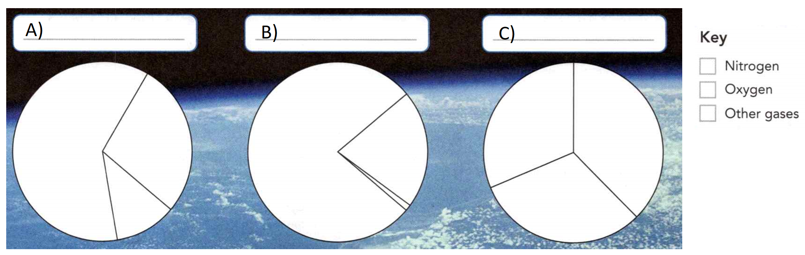
    <figcaption>Figure 1. Gases in the Air.</figcaption>
  </figure>

### Water Vapor 

So far, we've discussed the composition of dry air. But in reality, air is not
dry. Air contains **water vapor** - water in the form of a gas. Water vapor is
invisible. It is not the same thing as steam, which is made up of tiny droplets
of liquid water.

The amount of water vapor in the air varies greatly from place to place and from
time to time. Water vapor plays an important role in Earth's weather. 

Clouds form when water vapor condenses out of the air to form tiny droplets of
liquid water or crystals of ice. If these droplets or crystals become heavy
enough, they fall as rain or snow.

### Particles 

Pure air contains only gases. But pure air exists only in laboratories. In the
real world, air contains tiny solid and liquid particles of dust, smoke, salt,
and chemicals. You can see some of these particles in the air around you, but
most of them are too small to see.

  <figure>
    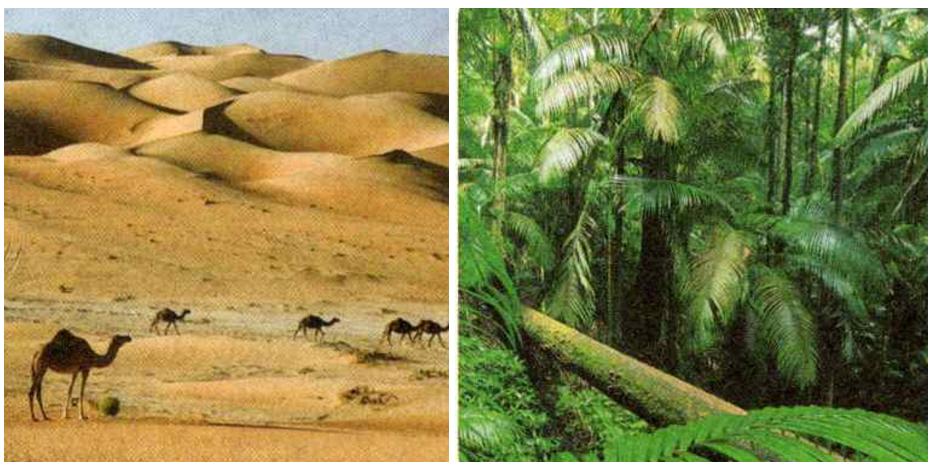
    <figcaption>Figure 2. Desert and Rainforest.</figcaption>
  </figure>

### How Is the Atmosphere a System?
The atmosphere is a system that interacts with other Earth systems, such as the
ocean. The atmosphere has many different parts. Some of these parts you can
actually see, such as clouds. But most parts of the atmosphere-like air, wind,
and energy-you can't see. Instead, you might feel a wind when it blows on you.
Or you might feel energy from the sun warming your face on a cool winter day.

At first, the wind that blows and the heat you feel may seem unrelated. But as
you'll learn, the different parts of the atmosphere interact with one another.
**Events in one part of the atmosphere affect other parts of the atmosphere.**

Energy from the sun drives the motions in the atmosphere. A storm such as the
hurricane in Figure 3 involves a tremendous amount of energy. The spiraling
shape of a hurricane is due in part to forces resulting from Earth's rotation. A
hurricane also gains energy from warm ocean water. Since the ocean water is
warmed by the sun, a hurricane's energy comes mostly from the sun.

  <figure>
    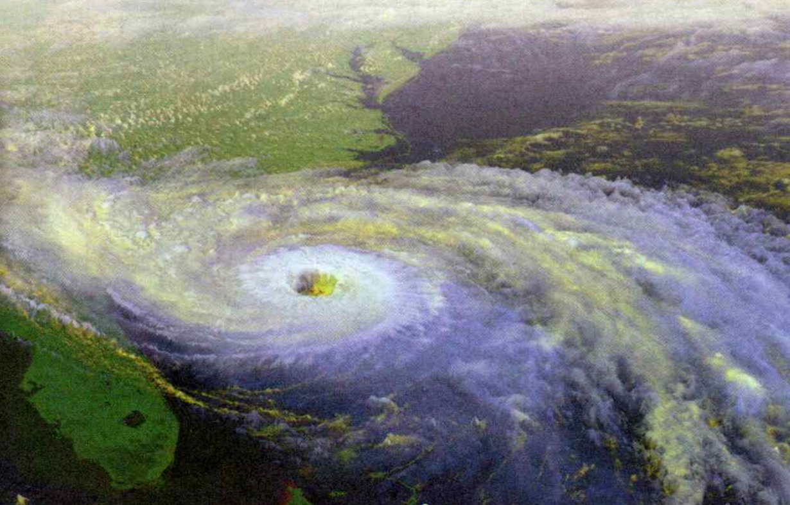
    <figcaption>Figure 3. Parts of the Atmosphere.</figcaption>
  </figure>


**Complete the tasks below.**

1. Gases in the Air, see Figure 1. The atmosphere is a thin layer of gases.
Identify which circle graph shows the correct percentage of gases in the
atmosphere. Shade in the key and the graph. Give your graph a title.

2. The amount of water vapor in the air can differ from place to place, see
Figure 2.
a) There is more water vapor in the (desert/ rain forest) than in the
(desert/rain forest).
b) What evidence do you see for your answer to Question a)?
c) What factors might affect the amount of water vapor in the air?

3. The ____ is the envelope of ___ that surrounds Earth.

4. List What are the four most common gases in dry air?

5. What is the difference between wet air and dry air?

6. The atmosphere is made up of	___ .

7. Parts of the Atmosphere, see Figure 3. What parts of the atmosphere interact?

8. Events in one part of the atmosphere ___ .

### Air Pressure
- What Are Some Properties of Air?
- What Instruments Measure Air Pressure?
- How Does Altitude Affect Air Pressure and Density?


**Complete the tasks below.**

1. Flying High Astronauts aren't the only people who go into space.
High-altitude pilots who fly above 15,250 meters are in a zone with conditions
similar to deep space. At these heights, ai pressure is so low that blood can
boil. A pilot can also pass out in less than a minute from lack of oxygen. To
survive, pilots wear pressure suits. These suits weigh about 16 kilograms and
are custom-built for each pilot. They inflate in an emergency, keeping air
pressure stable for the pilot. The suits are "very, very restrictive," says
pilot David Wright. "But it saves your life, so you're able to put up with
that." Pilots wear pressure suits in addition to flying in a pressurized plane.
Why do you think this is so?


### What Are Some Properties of Air?

How do you know air exists? You can't see it. Instead, you have to understand
what air does. It may seem to you that air has no mass. But the air in the
atmosphere consists of atoms and molecules, which have mass. **Because air has
mass, it also has other properties, including density and pressure.**


### Density 

The amount of mass in a given volume of air is its **density**. You calculate the
density of a substance by dividing its mass by its volume. If there are more
molecules in a given volume, the density is greater. If there are fewer
molecules, the density is less.

### Pressure 

The atmosphere is heavy. Its weight exerts a force on surfaces like you. The
force pushing on an area or surface is called pressure. **Air pressure** is the
result of the weight of a column of air pushing on an area.

As Figure 4 shows, there is a column of air above you that extends all the way
up through the entire atmosphere. In fact, the weight of the column of air above
your desk is about the same as the weight of a large school bus. So why doesn't
air pressure crush your desk? The reason is that the molecules in air push in
all directions-down, up, and sideways. The air pushing down on top of your desk
is balanced by the air pushing up on the bottom of your desk.


  <figure>
    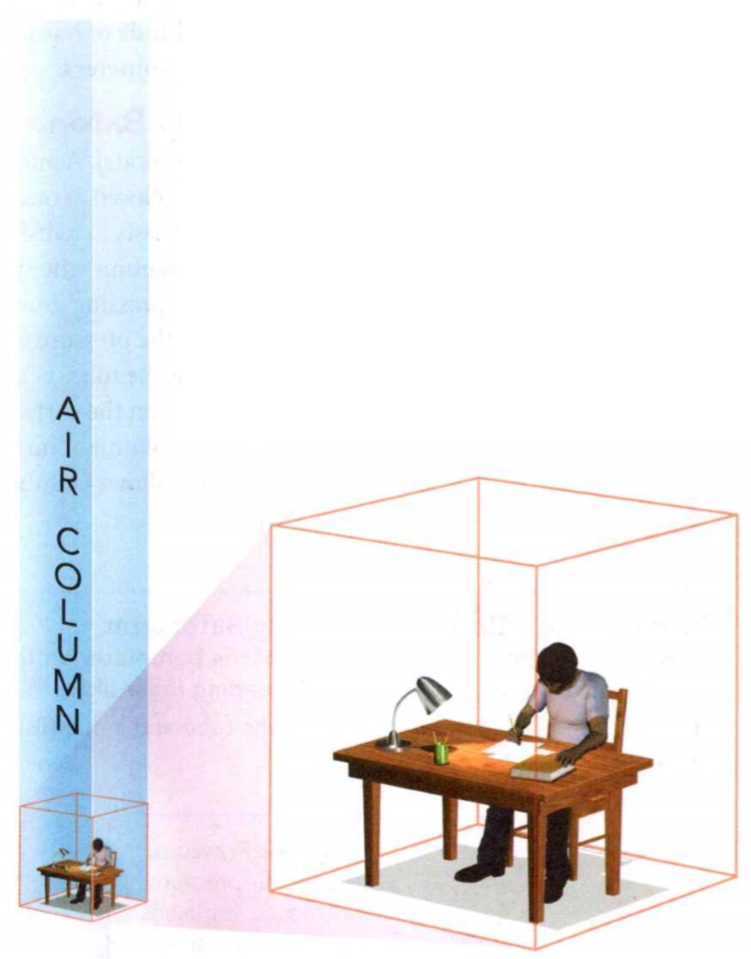
    <figcaption>Figure 4. Air Column.</figcaption>
  </figure>

### What Instruments Measure Air Pressure?

Air pressure can change daily. A denser substance has more mass per unit volume
than a less dense one. So denser air exerts more pressure than less dense air. A
barometer is an instrument that is used to measure air pressure. **The two
common kinds of barometers are mercury barometers and aneroid barometers.**

### Mercury Barometers 

Look at Figure 5 to see a mercury barometer model. A **mercury barometer** consists
of a long glass tube that is closed at one end and open at the other. The open
end of the tube rests in a dish of mercury. The closed end of the tube is almost
a vacuum-the space above the mercury contains very little air. The air pressing
down on the surface of the mercury in the dish is equal to the pressure exerted
by the weight of the column of mercury in the tube. When the air pressure
increases, it presses down more on the surface of the mercury. Greater air
pressure forces the column of mercury higher. So, the level of the mercury in
the tube shows you the pressure of the air that day.

  <figure>
    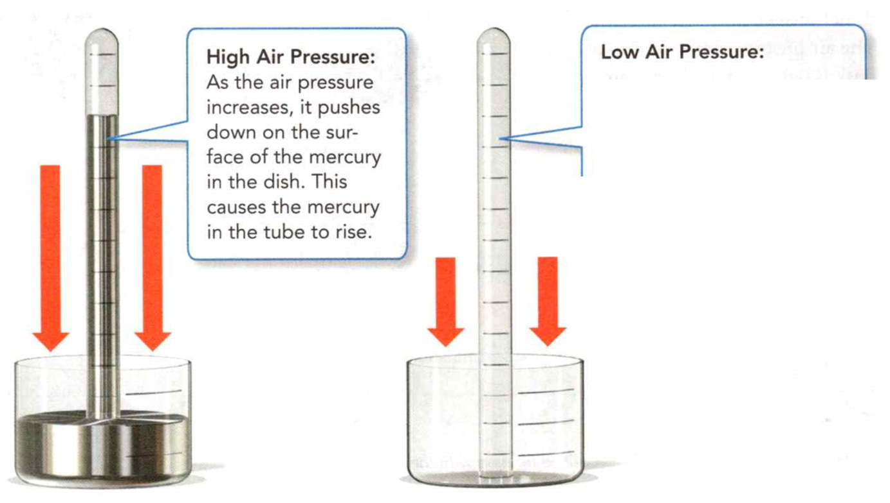
    <figcaption>Figure 5. Reading a Mercury Barometer.</figcaption>
  </figure>

### Aneroid Barometers 

If you have a barometer at home, it's probably an aneroid barometer. The word
aneroid means "without liquid." An **aneroid barometer** has an
airtight metal chamber, as shown in Figure 6. The metal chamber is sensitive to
changes in air pressure. When air pressure increases, the thin walls of the
chamber are pushed in. When the pressure drops, the walls bulge out. The chamber
is connected to a dial by a series of springs and levers. As the shape of the
chamber changes, the needle on the dial moves.

### Units of Air Pressure 

Weather reports use several different units for air pressure. Most weather
reports for the general public use inches of mercury. For example, if the column
of mercury in a mercury barometer is 30 inches high, the air pressure is "30
inches of mercury" or "30 inches."

National Weather Service maps indicate air pressure in millibars. The pressure
of the atmosphere is equal to one bar. One inch of mercury is about 33.86
millibars, so 30 inches of mercury is equal to about 1,016 millibars.

  <figure>
    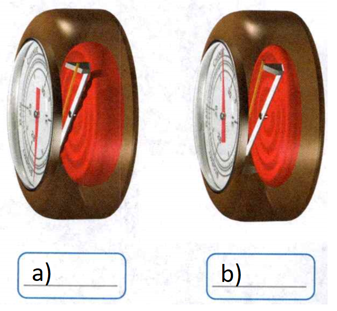
    <figcaption>Figure 6. Inside an Aneroid Barometer.</figcaption>
  </figure>

### How Does Altitude Affect Air Pressure and Density?

The higher you hike on a mountain, the more changes you'll notice. The
temperature will drop, and the plants will get smaller. But you might not notice
another change that is happening. At the top of the mountain, the air pressure
is less than the air pressure at sea level-the average level of the oceans.
**Altitude**, or elevation, is the distance above sea level. **Air pressure
decreases as altitude increases. As air pressure decreases, so does density.**

### Altitude Affects Air Pressure 

Suppose you have a stack of books. Which book has more weight on it, the second
book from the top or the book at the bottom? The second book from the top has
the weight of only one book on top of it. The book at the bottom of the stack
has the weight of all the books pressing on it.

Air at sea level is like the bottom book. Sea-level air has the weight of the
whole atmosphere pressing on it. Air near the top of the atmosphere is like the
second book from the top. There, the air has less weight pressing on it and thus
has lower air pressure.


### Altitude Also Affects Density 

As you go up through the atmosphere, the density of the air decreases. This
means the gas molecules that make up the atmosphere are farther apart at high
altitudes than they are at sea level. If you were near the top of a tall
mountain and tried to run, you would quickly get out of breath. Why? The air
contains 21 percent oxygen, whether you are at sea level or on top of a
mountain. However, since the air is less dense at a high altitude, each cubic
meter of air you breathe has fewer oxygen molecules than at sea level. So you
would become short of breath more quickly at a high altitude.

  <figure>
    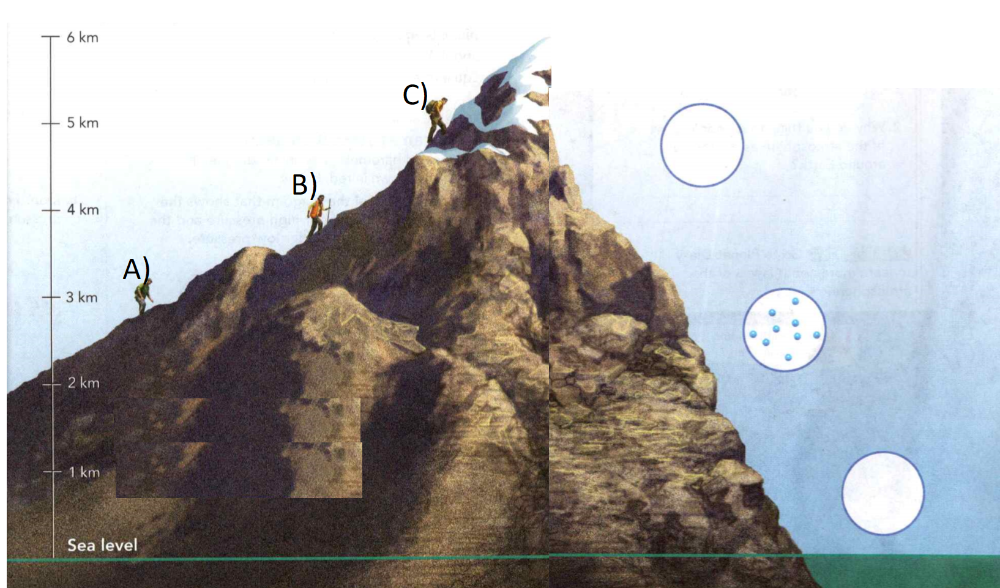
    <figcaption>Figure 8. Effect of Altitude on Pressure and Density.</figcaption>
  </figure>

**Complete the tasks below.**

1. Air Column, see Figure 4. The weight of the column of air above you puts
pressure on you.
a) What's an air column?
b) Add arrows to the diagram below to indicate how the pressure from air
molecules keeps you from being crushed.

2. Air has properties such as ___ .

3. The Greek word part baromeans "weight." How would it relate to the word part
-meter?

4.Reading a Mercury Barometer, see Figure 5. High Air Pressure: As the air
pressure increases, it pushes down on the surface of the mercury in the dish.
This causes the mercury in the tube to rise. Use the drawing of the barometer on
the right to show what a low air pressure reading looks like.
a) Shade in the level of the mercury in the tube and in the dish.
b) Describe what is happening.

5. Inside an Aneroid Barometer, see Figure 6.
An aneroid barometer has an airtight metal chamber, shown in red.
Identify the diagram that shows the aneroid barometer under high pressure and
the diagram that shows it under low pressure.
a) high/low pressure
b) high/low pressure

6. What two instruments are commonly used to measure air pressure?

7. What units are used to measure ail pressure?

8. How many millibars are equal to 27.23 inches of mercury?

9. Air pressure can be measured ____ .
 
  <figure>
    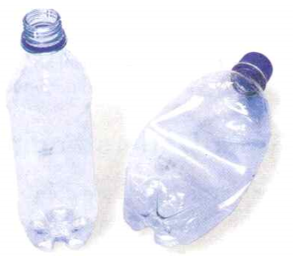
    <figcaption>Figure 7. Bottles.</figcaption>
  </figure>

10. You're back from a high-altitude hike. As you empty your bag, you notice
that the two empty bottles you carried down from the mountain look different,
see Figure 7.
a) What observations can you make about the bottles?
b) What's a possible explanation for your observations?

11. Effect of Altitude on Pressure and Density, see Figure 8.
a) Draw the air column above each hiker on the mountain. 
b) Which hiker has the least pressure on him/her? A) B) C)
c) In the empty circles, draw how densely packed you think the molecules would
be at the altitudes shown.

12. Explain how altitude can make you short of breath.

13. What is altitude?

14. How does air pressure change as altitude increases?

15. What changes in air pressure would you expect if you carried a barometer
down a mine shaft?

### Layers of the Atmosphere
- What Are the Four Main Layers of the Atmosphere?
- What Are the Characteristics of the Atmosphere's Layers?

**Complete the tasks below.**

1. Earth's Atmosphere. Misconception: The blanket of gases that makes up Earth's
atmosphere is thick. Fact: Earth's atmosphere extends far out into space, at
least as far again as the radius of Earth. However, most of the atmosphere is so
thin that it would be hard to tell it apart from the vacuum of space. Most of
the gas in the atmosphere is found close to Earth's surface. In fact, half of
the gas in the atmosphere is found in the 4 bottom 5.5 kilometers-the height of
a tall mountain! The rest of the gas extends thinly out into space for thousands
of kilometers. Evidence: The The mass of the atmosphere is surprisingly small.
In fact, a thin column of air 1 cm<sup>2</sup> extending out into space for
thousands of kilometers has about the same mass as 1-liter bottle of water.
a) Where is most of the gas in the atmosphere found?
b) Why do you think that people think of the atmosphere as a thick layer around
Earth?

### What Are the Four Main Layers of the Atmosphere?
Imagine taking a trip upward into the atmosphere in a hot-air balloon. You begin
on a warm beach near the ocean, at an altitude of 0 kilometers above sea level.

You hear a roar as the balloon's pilot turns up the burner to heat the air in
the balloon. The balloon begins to rise, and Earth's surface gets farther away.
As the balloon reaches an altitude of 3 kilometers, you realize the air is
getting colder. At 6 kilometers you begin to have trouble breathing. The air is
becoming less dense. It's time to go back down.

Six kilometers is pretty high. In fact, its higher than all but the very tallest
mountains. But there are still hundreds of kilometers of atmosphere above you.
It may seem as though air is the same from the ground to the edge of space. But
air pressure and temperature change with altitude. **Scientists divide Earth's
atmosphere into four main layers classified according to changes in temperature.
These layers are the troposphere, the stratosphere, the mesosphere, and the
thermosphere.**

### What Are the Characteristics of the Atmosphere's Layers?

Unless you become an astronaut, you won't make a trip to the upper atmosphere.
But if you could make that journey, what would you see? Read on to learn more
about the conditions you would experience in each layer of the atmosphere.

### The Troposphere 

You live in the inner, or lowest, layer of Earth's atmosphere, the
**troposphere**. Tropo- means "turning" or "changing" Conditions in the
troposphere are more variable than in the other layers. **The troposphere is the
layer of the atmosphere in which Earth's weather occurs.** The troposphere is
about 12 kilometers thick, as you can see in Figure 9. However, it varies from
16 kilometers thick above the equator to less than 9 kilometers thick above the
North and South poles. Although it's the shallowest layer, the troposphere is
the most dense. It contains almost all the mass of the atmosphere.

As altitude increases in the troposphere, the temperature decreases. On average,
for every 1-kilometer increase in altitude, the air gets about 6.5°C cooler. At
the top of the troposphere, the temperature stops decreasing and stays at about
-60°C. Water here forms thin, feathery clouds of ice.

### The Stratosphere 

The stratosphere extends from the top of the troposphere to about 50 kilometers
above Earth's surface. Strata-means "layer" or "spread out." **The stratosphere
is the second layer of the atmosphere and contains the ozone layer.**

The lower stratosphere is cold, about -60°C. Surprisingly, the upper
stratosphere is warmer than the lower stratosphere. Why is this? The middle
portion of the stratosphere has a layer of air where there is much more ozone
than in the rest of the atmosphere. Ozone is a form of oxygen that has three
atoms in each molecule instead of the usual two. When ozone absorbs energy from
the sun the energy is converted into heat, warming the air. The ozone layer
protects living things from ultraviolet radiation from the sun.

### The Mesosphere

Above the stratosphere, a drop in temperature marks the beginning of the next
layer, the **mesosphere**. Meso- means "middle," so the mesosphere is the middle
layer of the atmosphere. The mesosphere begins 50 kilometers above Earth's
surface and ends at an altitude of 80 kilometers. In the upper mesosphere,
temperatures approach -90°C. 

**The mesosphere is the layer of the atmosphere that protects Earth's surface
from being hit by most meteoroids.** Meteoroids are chunks of stone and metal
from space. What you see as a shooting star, or meteor, is the trail of hot,
glowing gases the meteoroid leaves behind in the mesosphere as it burns up.


### The Thermosphere 

Near the top of the atmosphere, the air is very thin. **The outermost layer of
Earth's atmosphere is the thermosphere.** The **thermosphere** extends from 80
kilometers above Earth's surface outward into space. It has no definite outer
limit.

### Heat in the Thermosphere 

Sunlight strikes the thermosphere first, making the air very hot, up to 1,800°C.
You wouldn't feel warm though. Temperature is the average amount of energy of
motion of each molecule of a substance. Gas molecules in this layer move fast,
so the temperature is very high. But the molecules are spaced far apart in the
thin air, so there aren't enough to collide with you and warm you.

### Layers in the Thermosphere 

The thermosphere has two layers. The lower layer, the **ionosphere**, begins about
80 kilometers above the surface and extends to about 400 kilometers. 

The **exosphere** is the outer layer. It extends from about 400 kilometers
outward for thousands of kilometers.


  <figure>
    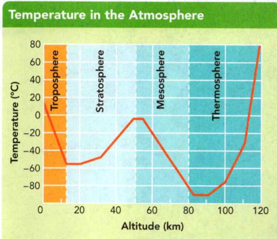
    <figcaption>Figure 10. Temperature in the Atmosphere.</figcaption>
  </figure>


Particles from the sun strike atoms in the ionosphere near the poles, see Figure
11. This causes brilliant light displays called auroras.

  <figure>
    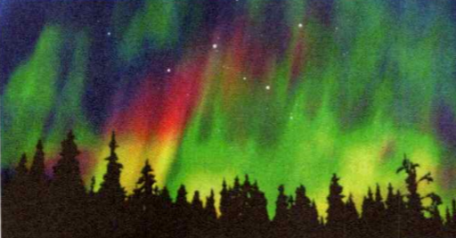
    <figcaption>Figure 11. Auroras.</figcaption>
  </figure>


**Complete the tasks below.**

1. Explain how the atmosphere changes as you go up in a hot-air balloon.

  <figure>
    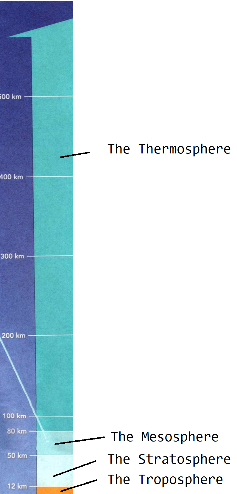
    <figcaption>Figure 9. The Atmosphere Layers.</figcaption>
  </figure>

2. Changing Temperatures, see Figure 9. The graph shows how temperatures in the
atmosphere change with altitude.
a) What is the temperature at the bottom of the stratosphere?
b) What layer of the atmosphere has the lowest temperature?
c) How does temperature change with altitude in the troposphere?

3. Name the four main layers of the atmosphere.

4. Why would you feel cold in the thermosphere?

### Energy in Earth's Atmosphere

- How Does Energy From the Sun Travel to Earth?
- What Happens to the Sun's Energy When It Reaches Earth?

**Complete the tasks below.**

1. Amanda: I love to swim. One time I was swimming at a beach in the summer. I
was swimming for a long time. I got out to eat and dried off in about half an
hour. Then I went swimming again, and it clouded over. I got out, and it took
about an hour to dry off this time. The sun was behind clouds, so it took longer
for me to dry off. I found it very interesting. Why did it take Amanda longer to
dry off the second time?

### How Does Energy From the Sun Travel to Earth?

Nearly all the energy in Earth's atmosphere comes from the sun. This energy
travels to Earth as **electromagnetic waves**, a form of energy that can move
through the vacuum of space. Electromag- netic waves are classified according to
wavelength, or distance between wave peaks. **Most of the energy from the sun
travels to Earth in the form of visible light and infrared radiation. A smaller
amount arrives as ultraviolet radiation.**


### Visible Light 

Visible light includes all of the colors that you see in a rainbow: red, orange,
yellow, green, blue, and violet. The different colors are the result of
different wavelengths. Red and orange light have the longest wavelengths, while
blue and violet light have the shortest wavelengths, as shown in Figure 1.

### Nonvisible Radiation 

The direct transfer of energy by electromagnetic waves is called **radiation**. One
form of electromagnetic energy, **infrared radiation**, has wavelengths that are
longer than wavelengths for red light. Infrared radiation is not visible by
humans, but can be felt as heat. The sun also gives off **ultraviolet radiation**,
which is an invisible form of energy with wavelengths that are shorter than
wavelengths for violet light. Ultraviolet radiation can cause sunburns.

  <figure>
    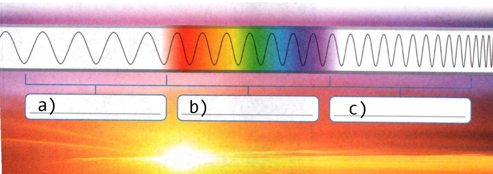
    <figcaption>Figure 12. Radiation From the Sun.</figcaption>
  </figure>
  
### What Happens to the Sun's Energy When It Reaches Earth?

Sunlight must pass through the atmosphere before it reaches Earth's surface. The
path of the sun's rays is shown in Figure 2. **Some sunlight is absorbed or
reflected by the atmosphere before it can reach the surface. The rest passes
through the atmosphere to the surface.**

### Upper Atmosphere 

Different wavelengths of radiation are absorbed by different layers in the
atmosphere. For example, some ultraviolet radiation is absorbed by the ozone
layer in the stratosphere. Infrared radiation penetrates farther into the
atmosphere before some of it is absorbed by water vapor and carbon dioxide.

  <figure>
    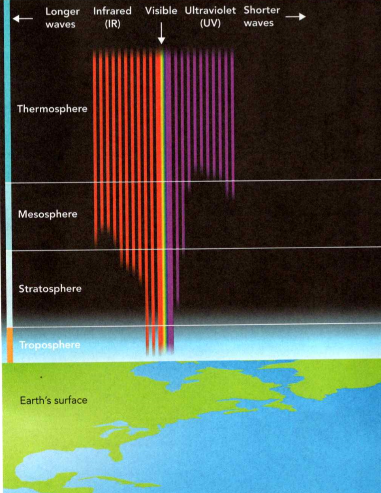
    <figcaption>Figure 13. Energy in the Atmosphere.</figcaption>
  </figure>

### Troposphere 

Clouds act as mirrors, reflecting sunlight back into space. Dust-size particles
and gases in the atmosphere disperse light in all directions, a process called
**scattering**. When you look at the sky, the light you see has been scattered by
gas molecules in the atmosphere. Gas molecules scatter short wavelengths of
visible light (blue and violet) more than long wavelengths (red and orange).
Scattered light looks bluer than ordinary sunlight. That's why the clear daytime
sky looks blue.

### Earth's Surface 

It may seem like a lot of the sun's energy is absorbed by gases in the
atmosphere or reflected by clouds and particles. However, about 50 percent of
the energy that reaches Earth's surface is absorbed by land and water and
changed into heat. Look at Figure 15 to see what happens to incoming sunlight at
Earth's surface.

  <figure>
    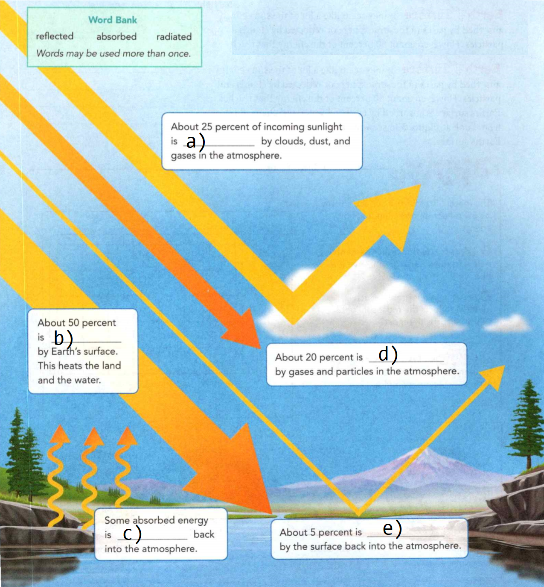
    <figcaption>Figure 15. Energy at Earth's Surface.</figcaption>
  </figure>


### Earth's Energy Budget 
What happens to the energy that heats the land and water? **Earth's surface
radiates some energy back into the atmosphere as infrared radiation.** Much of
this infrared radiation doesn't immediately travel all the way back into space.
Instead, it's absorbed by water vapor, carbon dioxide, methane, and other gases
in the air. The energy from the absorbed radiation heats the gases in the air.
These gases in turn hold heat in Earth's atmosphere in a process called the
**greenhouse effect**.

The greenhouse effect, shown in Figure 4, is a natural process. It keeps Earth's
atmosphere at a temperature that is comfortable for most living things. Over
time, the amount of energy absorbed by the atmosphere and Earth's surface is in
balance with the amount of energy radiated into space. In this way, Earth's
average temperatures remain fairly constant. But scientists have evidence that
human activities may be altering this process.

  <figure>
    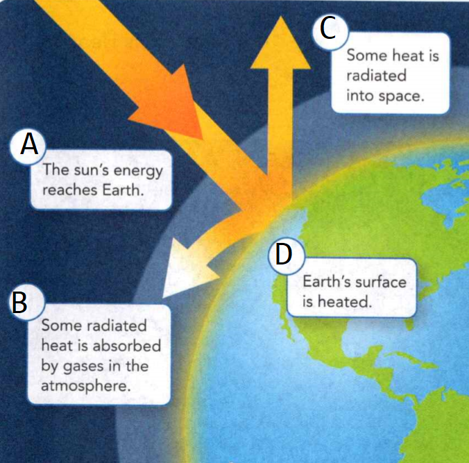
    <figcaption>Figure 16. Greenhouse Effect.</figcaption>
  </figure>

**Complete the tasks below.**

1. Radiation From the Sun, see Figure 12. Energy travels to Earth as
electromagnetic waves. Label the types of electromagnetic radiation in the
diagram.
a) __
b) __
c) __

2. Energy in the Atmosphere, see Figure 13. Some wavelengths reach Earth's
surface. Other wavelengths are completely or partially absorbed in the
atmosphere. What happens to the radiation as it passes through Earth's
atmosphere?

  <figure>
    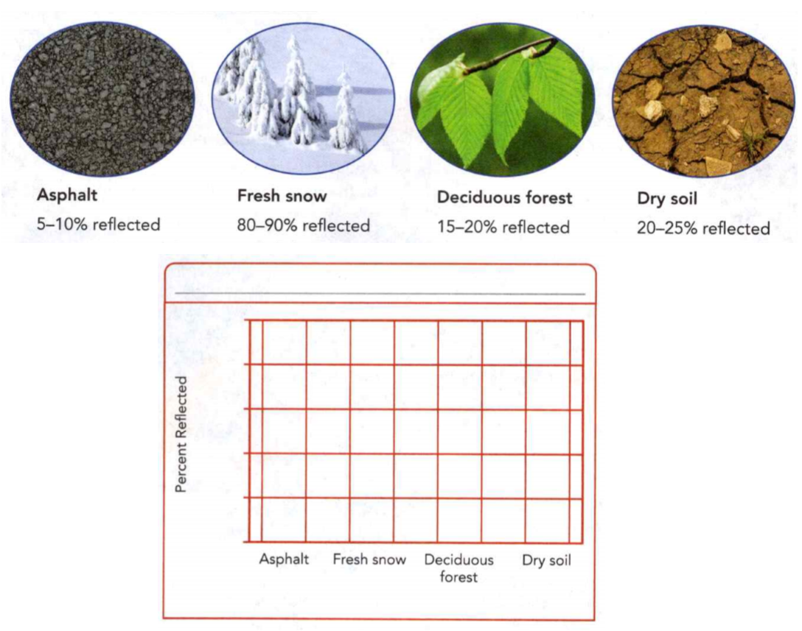
    <figcaption>Figure 14. The materials at Earth's surface reflect different amounts of energy..</figcaption>
  </figure>

3. The materials at Earth's surface shown in Figure 14 reflect different amounts of
energy.
a) Use the higher percentages to draw a bar graph. Give it a title.
b) Based on your graph, which material reflects the most sunlight? 
c) Which absorbs the most?
d) Predict what might happen if a forested area was replaced with an asphalt
parking lot.

4. Energy at Earth's Surface, see Figure 15. What's happening to energy in the
lower atmosphere and at Earth's surface? Find out by using the words in the word
bank below to complete each sentence. Word Bank: reflected absorbed radiated.
Words may be used more than once.
a) About 25 percent of incoming sunlight is ___ by clouds, dust, and gases in
the atmosphere.
b) About 50 percent is ___ by Earth's surface. This heats the land and the water.
c) Some absorbed energy is ___ back into the atmosphere.
d) About 20 percent is ___ by gases and particles in the atmosphere.
e) About 5 percent is ___ by the surface back into the atmosphere.
d) Using the diagram draw a conclusion about energy at Earth's surface.

5. Greenhouse Effect, see Figure 16. The greenhouse effect is a natural
heat-trapping process. Number each step in the diagram to show how the
greenhouse effect takes place. 

6. What happens to most of the sunlight that reaches Earth?

7. In Figure 15, what percentage of incoming sunlight is reflected by clouds,
dust, and gases in the atmosphere?

8. How might conditions on Earth be different without the greenhouse effect?


### Heat Transfer
- How Is Temperature Measured? 
- How Is Heat Transferred?

**Complete the tasks below.**

1. From the Freezer to the Table French fries are on many restaurant menus. But
have you ever wondered how they get from the freezer to the table? It takes a
little science in the kitchen to make it happen. First, you heat oil in a fryer
until it's around 340°F. Then, the frozen potato slices are dropped in. Hot oil
moves from the bottom of the fryer and begins to heat the potatoes. Exposure to
so much heat causes the water in the potatoes to boil. This is indicated by
bubbles rising to the surface of the oil. As the outside of the potato heats up,
it transfers heat to the inside of the potato slice. In a matter of minutes it's
crunchy on the outside and soft on the inside. Explain in your own words what
happens when the potatoes are exposed to heat.


### How Is Temperature Measured?

All substances are made up of tiny particles (atoms and molecules) that are
constantly moving. The faster the particles are moving, the more energy they
have. **Temperature** is the average amount of energy of motion of each particle of
a substance. In Figure 17, the hot tea in the teapot is the same temperature as
the hot tea in the teacup. But do they have the same thermal energy?

**Thermal energy** measures the total energy of motion in the particles of a
substance. This means that the tea in the pot has more thermal energy than the
tea in the cup because it has more mass.

### Measuring Temperature 

Temperature is an important factor affecting weather. **Air temperature is
usually measured with a thermometer.** A **thermometer** is a device that measures
temperature. Some thermometers have a thin glass tube with a bulb on one end
that holds liquid mercury or colored alcohol. When the air temperature
increases, the temperature of the liquid in the bulb increases. This causes the
liquid to expand and rise up the column.

### Temperature Scales 

Temperature is measured in units called degrees. Two temperature scales are the
Celsius scale and the Fahrenheit scale. On the Celsius scale at sea level, the
freezing point of water is 0°C, while the boiling point is 100°C. On the
Fahrenheit scale at sea level, the freezing point of water is 32°F and the
boiling point is 212°F. To convert from Farenheit to Celsius, you would use the
following formula:

```
(Fahrenheit - 32) / 1.8 = Celsius
```

  <figure>
    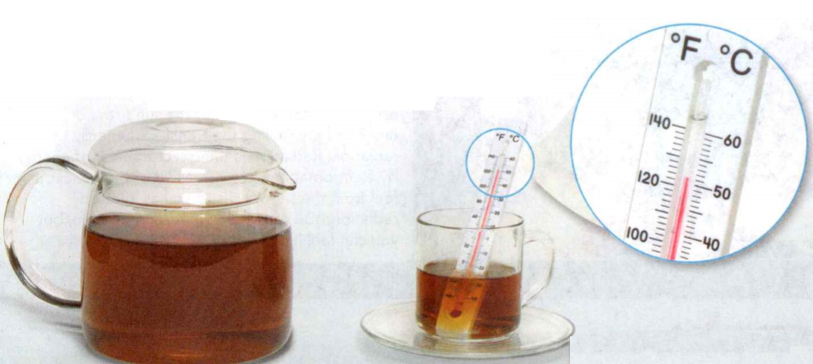
    <figcaption>Figure 17. Measuring Temperature.</figcaption>
  </figure>

### How Is Heat Transferred?

**Heat** is thermal energy that is transferred from a hotter object to a cooler one.
**Heat is transferred in three ways: convection, conduction, and radiation.**


### Convection 

In fluids (liquids and gases), atoms and molecules can move easily from one
place to another. As they move, their energy moves along with them. The transfer
of heat by the movement of a fluid is called **convection**.

### Conduction 

The transfer of heat between two substances that are in direct contact is called
**conduction**. In Figure 18, heat is being conducted between the pot and the grate
and between the pot and the liquid. When a fast-moving molecule bumps into a
slower-moving molecule, the faster molecule transfers some of its energy to the
slower one. The closer together the molecules are in a substance, the better
they conduct heat. Conduction works well in some solids, such as metals, but not
as well in liquids and gases. Air and water do not conduct heat well.

### Radiation 

Have you ever warmed yourself by a campfire or felt the heat of the sun's rays
on your face? You are feeling the transfer of energy by radiation. Radiation is
the direct transfer of energy by electromagnetic waves. Most of the heat you
feel from the sun travels to you as infrared radiation. You cannot see infrared
radiation, but you can feel it as heat.


  <figure>
    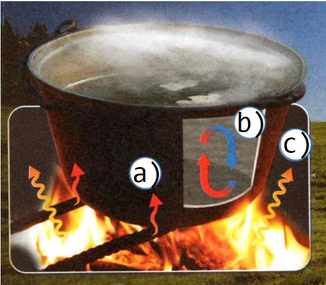
    <figcaption>Figure 18. Heat Transfer.</figcaption>
  </figure>

### Heating the Troposphere 

Radiation, conduction, and convection work together to heat the troposphere.
Notice in Figure 20 how the sun's radiation heats Earth's surface during the day.
The land gets warmer than the air. Air doesn't conduct heat well. So only the
first few meters of the troposphere are heated by conduction. When ground-level
air warms up, its molecules move more rapidly. As they bump into each other they
move farther apart, making the air less dense. Cooler, denser air sinks toward
the surface, forcing the warmer air to rise. The upward movement of warm air and
the downward movement of cool air form **convection currents**. **Heat is
transferred mostly by convection within the troposphere.**


  <figure>
    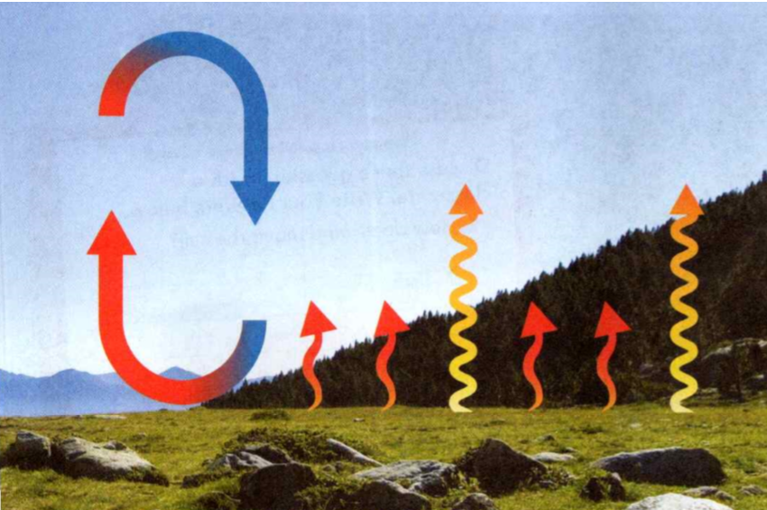
    <figcaption>Figure 20. Heating the Troposphere.</figcaption>
  </figure>


**Complete the tasks below.**

1. Measuring Temperature, see Figure 17.
a) The tea in the cup has (the same/less/more) thermal energy than the tea in
the pot.
b) If the tea in the cup cooled to 70°F, what would a Celsius thermometer read?

2. Temperature and thermal energy are different because ___ .

3. Heat Transfer, see Figure 18. Convection, Conduction, Radiation. Identify
each type of heat transfer in the photo.
a) __
b) __
c) __

  <figure>
    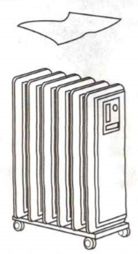
    <figcaption>Figure 19. Radiator.</figcaption>
  </figure>

3. Heat transfer occurs when a warm radiator heats a room, see Figure 19.
a) What type of heat transfer could keep the paper in the air?
b) Draw arrows on the image to indicate your answer and explain.

4. Heating the Troposphere, see Figure 20. Describe the process of heat transfer
taking place in the diagram at the left.

5. Why is convection more important than conduction in the troposphere?

6. Explain how a convection current can enable a hawk or eagle to soar upward
without flapping its wings.

7. Heat transfer happens in three ways in the atmosphere ____ .


### Winds
- What Causes Winds?
- How Do Local Winds and Global Winds Differ?

**Complete the tasks below.**

1. Windsurfing. Imagine being able to ride a wave at almost 81 km/h-not in a
boat powered by a motor but on a board powered only by the wind. That's what
windsurfing is all about. Windsurfers stand on a sailboard, which is similar to
a surfboard. But the sailboard has a mast and a sail that the surfer can control
with his or her hands. It uses a sail to capture wind and move the surfer along
the surface of the water. Jim Drake, one of the first inventors of windsurfing,
points out: "It's the simplicity of standing up so you can adjust your weight
and move quickly, as well as actively participate in transmitting the sail's
forces to the board."
a) How does wind move the sail?
b) How have you experienced the effects of wind?


### What Causes Winds?

Air is a fluid, so it can move easily from place to place. But how does it do
that? **Differences in air pressure cause the air to move**. **Wind** is the
movement of air parallel to Earth's surface. Winds move from areas of high
pressure to areas of lower pressure.

**Most differences in air pressure are caused by the unequal heating of the
atmosphere.** Recall that convection currents form when an area of Earth's surface
is heated by the sun's rays. Air over the heated surface expands and becomes
less dense. As the air becomes less dense, its air pressure decreases. If a
nearby area is not heated as much, the air above the less-heated area will be
cooler and denser. The cool, dense air with a higher pressure flows underneath
the warm, less dense air. This forces the warm air to rise.

  <figure>
    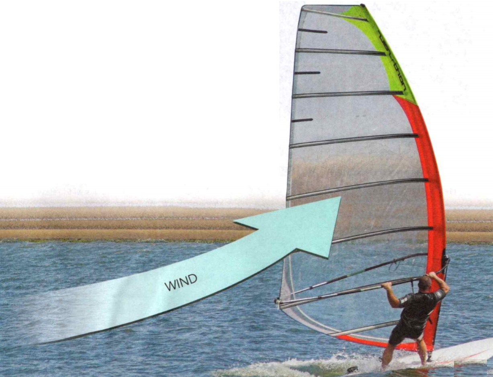
    <figcaption>Figure 21. Moving Air.</figcaption>
  </figure>

### Measuring Wind 

Winds are described by their direction and speed. Winds can blow from all
directions: north, south, east, and west. Wind direction is determined with a
wind vane. The wind swings the wind vane so that one end points into the wind.
The name of a wind tells you where the wind is coming from. For example, a south
wind blows from the south toward the north. A north wind blows to the south.

Wind speed can be measured with an **anemometer**. An anemometer has three or four
cups mounted at the ends of spokes that spin on an axle. The force of the wind
against the cups turns the axle. A meter connected to the axle shows the wind
speed. Figure 22 shows a wind vane and an anemometer.

  <figure>
    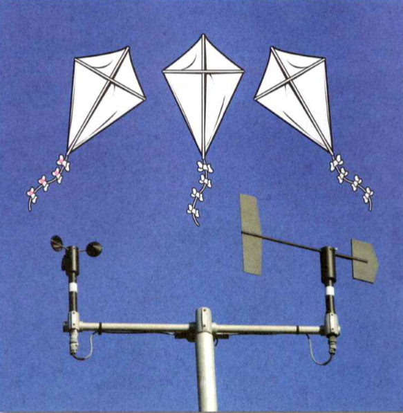
    <figcaption>Figure 22. Wind Direction and Speed.</figcaption>
  </figure>

### Windchill Factor 

On a warm day, a cool breeze can be refreshing. But during the winter, the same
breeze can make you feel uncomfortably cold. The wind blowing over your skin
removes body heat. The stronger the wind, the colder you feel. The increased
cooling that a wind can cause is called the **windchill factor**. A weather report
may say, "The temperature outside is 20 degrees Fahrenheit. But with a wind
speed of 30 miles per hour, the windchill factor makes it feel like 1 degree
above zero".


### How Do Local Winds and Global Winds Differ?

Have you ever noticed a breeze at the beach on a hot summer day? Even if there
is no wind inland, there may be a cool breeze blowing in from the water. This
breeze is an example of a local wind.

### Local Winds 

Winds that blow over short distances are called local winds. **The unequal
heating of Earth's surface within a small area causes local winds.** These winds
form only when large-scale winds are weak. Two types of local winds are sea
breezes and land breezes, as shown in Figure 23.

  <figure>
    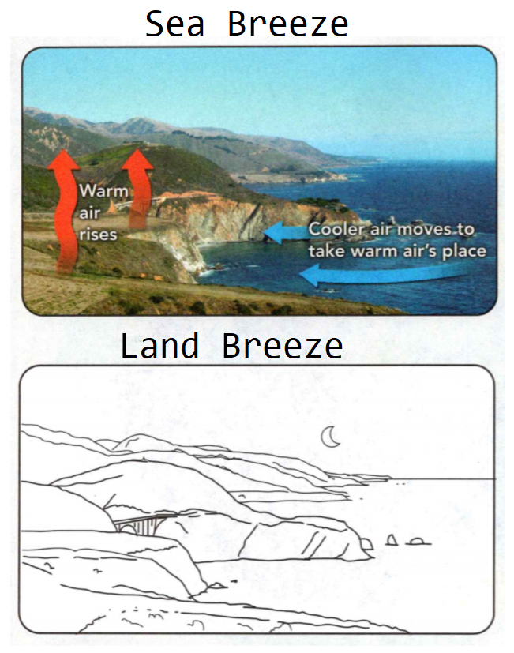
    <figcaption>Figure 23. Local Winds.</figcaption>
  </figure>

### Sea Breeze 

During the day, the land warms up faster than the water. The air over the land
gets warmer than the air over the water. This warm air is less dense. It expands
and rises, creating a low-pressure area. Cool air blows inland from over the
water and moves underneath the warm air, causing a sea breeze. A **sea breeze**
or a lake breeze is a local wind that blows from an ocean or lake.

### Land Breeze 

At night, the process is reversed. The flow of air from land to a body of water
forms a **land breeze**.


### Global Winds 

Global winds are winds that blow steadily from specific directions over long
distances. **Like local winds, global winds are created by the unequal heating
of Earth's surface. But unlike local winds, global winds occur over a large
area.** In Figure 24, you can see how the sun's radiation strikes Earth. In the
middle of the day near the equator, the sun is almost directly overhead. The
direct rays from the sun heat Earth's surface intensely. Near the poles, the
sun's rays strike Earth's surface at a lower angle. The sun's energy is spread
out over a larger area, so it heats the surface less. As a result, temperatures
near the poles are much lower than they are near the equator.

### Global Convection Currents 

How do global winds develop? Temperature differences between the equator and the
poles produce giant convection currents in the atmosphere. Warm air rises at the
equator, and cold air sinks at the poles. Therefore air pressure tends to be
lower near the equator and greater near the poles. This difference in pressure
causes winds at Earth's surface to blow from the poles toward the equator.
Higher in the atmosphere, however, air flows away from the equator toward the
poles. Those air movements produce global winds.

  <figure>
    
    <figcaption>Figure 24. Heating of Earth's Surface.</figcaption>
  </figure>

### The Coriolis Effect 

If Earth did not rotate, global winds would blow in a straight line from the
poles toward the equator. Because Earth is rotating, however, global winds do
not follow a straight path. As the winds blow, Earth rotates from west to east
underneath them, making it seem as if the winds have curved. The way Earth's
rotation makes winds curve is called the **Coriolis effect**. Because of the
Coriolis effect, global winds in the Northern Hemisphere gradually turn toward
the right. A wind blowing toward the south gradually turns toward the southwest.
In the Southern Hemisphere, winds curve toward the left.

  <figure>
    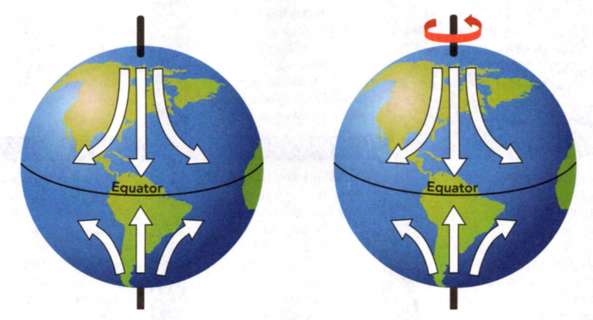
    <figcaption>Figure 25. Coriolis effect.</figcaption>
  </figure>


### Global Wind Belts
The Coriolis effect and other factors combine to produce a pattern of wind belts
and calm around Earth.

**Doldrums** are a calm area where warm air rises. They occur at the equator
where the sun heats the surface strongly. Warm air rises steadily, creating an
area of low pressure. Cool air moves into the area, but is warmed rapidly and
rises efore it moves very far. 

**Horse Latitudes** are two calm areas of sinking air. Latitude is the distance
from the equator, measured in degrees. At about 30° north and south latitudes,
the air stops moving toward the poles and sinks.

**Trade Winds** blow from the horse latitudes toward the equator. As cold air
over the horse latitudes sinks, it forms a region of high pressure. This causes
surface winds to blow. The winds that blow toward the equator are turned west by
the Coriolis effect.

**Prevailing Westerlies** blow from west to east, away from the horse latitudes.
In the mid-latitudes, between 30° and 60° north and south, winds that blow
toward the poles are turned toward the east by the Coriolis effect.

**Polar Easterlies** blow cold air away from the poles. Air near the poles sinks
and flows back toward lower latitudes. The Coriolis effect shifts these polar
winds to the west, producing the polar easterlies.


  <figure>
    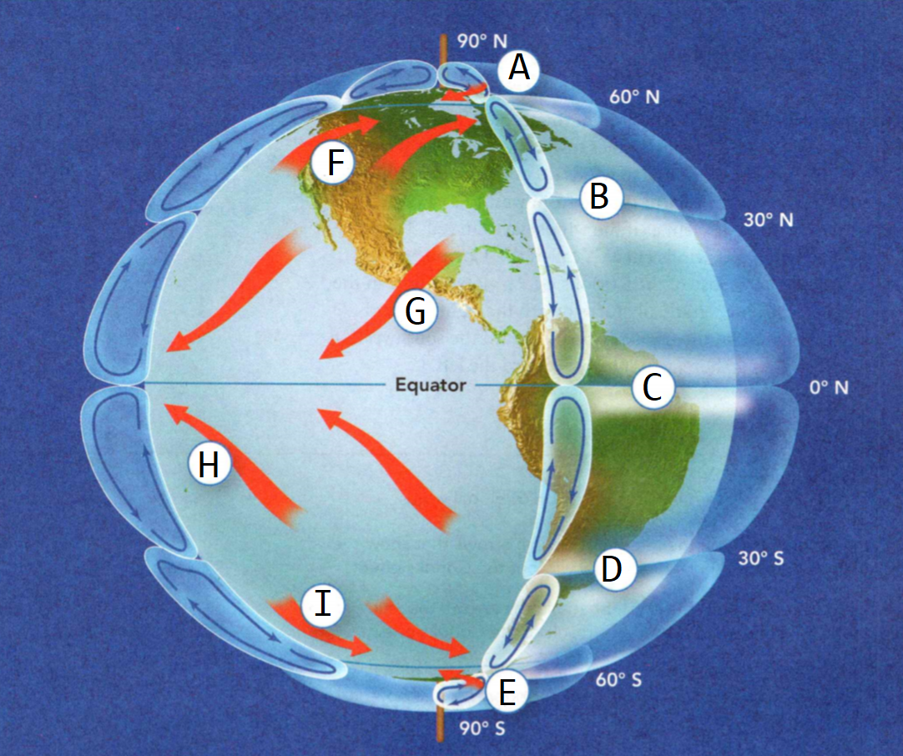
    <figcaption>Figure 26. Global Wind Belts.</figcaption>
  </figure>


**Complete the tasks below.**

1. Moving Air, see Figure 21. Windsurfers need wind in order to move across the
water. How do differences in air pressure cause wind?

2. Wind Direction and Speed, see Figure 22. Based on the direction of the wind
vane, which direction would your kite be flying?

3. What is wind?

4. How is wind related to air pressure and temperature?

5. Local Winds, see Figure 23. 
a) Add arrows to the bottom diagram to indicate how a land breeze develops. 
b) Summarize the process.

6. Heating of Earth's Surface, see Figure 24. The angle of the sun's rays causes
temperature differences at Earth's surface.
a) Identify the areas where the sun hits Earth most directly.
a) Identify the areas where the sun hits Earth least directly.
c) Draw a convection current in the atmosphere north of the equator.

7. The Coriolis effect determines the direction of global winds, see Figure 27.
a) Look at the globe on the left. Shade in the arrows that show the direction
the global winds would blow without the Coriolis effect.
b) Look at the globe on the right. Shade in the arrows that show the direction
the global winds blow as a result of the Coriolis effect.
c) Based on your last answer, what direction do global winds blow in the
Northern Hemisphere? In the Southern Hemisphere?

8. Global wind belts, see Figure 26. The Coriolis effect and other factors
combine to produce a pattern of wind belts and calm areas around Earth. Match
the global winds with their location on the globe. 
a) **Doldrums** are a calm area where warm air rises. They occur at the equator
where the sun heats the surface strongly. Warm air rises steadily, creating an
area of low pressure. Cool air moves into the area, but is warmed rapidly and
rises efore it moves very far. Locations:
b) **Horse Latitudes** are two calm areas of sinking air. Latitude is the distance
from the equator, measured in degrees. At about 30° north and south latitudes,
the air stops moving toward the poles and sinks. Locations:
c) **Trade Winds** blow from the horse latitudes toward the equator. As cold air
over the horse latitudes sinks, it forms a region of high pressure. This causes
surface winds to blow. The winds that blow toward the equator are turned west by
the Coriolis effect. Locations:
d) **Prevailing Westerlies** blow from west to east, away from the horse
latitudes. In the mid-latitudes, between 30° and 60° north and south, winds that
blow toward the poles are turned toward the east by the Coriolis effect.
Locations:
e) **Polar Easterlies** blow cold air away from the poles. Air near the poles sinks
and flows back toward lower latitudes. The Coriolis effect shifts these polar
winds to the west, producing the polar easterlies. Locations:

9. How does the sun's energy affect Earth's atmosphere? Earth's atmosphere is a
system made up of many different parts. Draw a picture or a diagram that helps
you understand the relationship between the concepts in the word bank. Word
Bank: atmosphere, air pressure, convection, radiation, global winds. 

10. What causes local winds?

11. What is a global wind?

12. How does the sun's energy affect Earth's atmosphere?

13. The sun's energy affects Earth's atmosphere by ___ Earth's surface, causing
differences in ___ that result in ___ .

### Study Guide

- Earth's atmosphere consists of nitrogen, oxygen, carbon dioxide, water vapor,
and other gases, as well as particles of liquids and solids.
- Events in one part of the atmosphere affect other parts of the atmosphere.
- Because air has mass, it also has other properties, including density and
pressure.
- Two common kinds of barometers are mercury barometers and aneroid barometers.
- Air pressure decreases as altitude increases. As air pressure decreases, so
does density.
- Scientists divide Earth's atmosphere into four main layers according to
changes in temperature.
- Earth's weather occurs in the troposphere. The stratosphere contains the ozone
layer.
- The mesosphere protects Earth from meteoroids.The thermosphere is the
outermost layer of Earth's atmosphere.
- The sun's energy travels to Earth as visible light, infrared radiation, and
ultraviolet radiation.
- Some sunlight is absorbed or reflected by the atmosphere. Some of the energy
Earth absorbs is radiated back out as infrared radiation.
- Air temperature is usually measured with a thermometer.
- Heat is transferred in three ways: convection, conduction, and radiation.
- Heat is transferred mostly by convection within the troposphere.
- Winds are caused by differences in air pressure.
- The unequal healing of Earth's surface within a small area causes local winds.
- Global winds ancaused by the unequa heating of Earth's since over a large area.

**Complete the tasks below.**

1. Which gas forms less than one percent of the atmosphere, but is essential to life?
A) carbon dioxide
B) oxygen
C) hydrogen
D) nitrogen

2. Weather occurs in Earth's troposphere, which is ___ .

3. Why is it difficult to include water vapor in a graph of the percentages of
various gases in the atmosphere? How could you solve the problem?

4. When density increases, the number of molecules in a volume
A) increases.
B) decreases.
C) stays the same.
D) varies.

5. One force affecting an object is air pressure, which is __ .

6. Why can an aneroid barometer measure elevation as well as air pressure?

7. Suppose you're on a hot-air balloon flight. Describe how air pressure and the
amount of oxygen would change during your trip. What would the changes feel
like? 

8. The layers of the atmosphere are classified according to changes in
A) altitude.
B) air pressure.
C) distance.
D) temperature.

9. List the layers of the atmosphere it order, moving up from Earth's surface.

10. The ozone layer is important because ___ .

11. Why are clouds at the top of the troposphere made of ice crystals rather
than drops of water?

12. How are the upper and lower parts of the stratosphere different?

  <figure>
    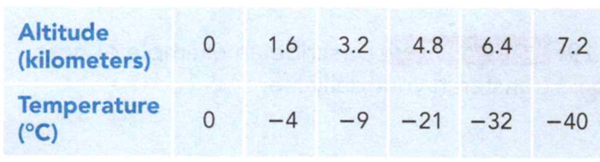
    <figcaption>Figure 27. Temperature at various altitudes above Omaha, Nebraska.</figcaption>
  </figure>

13. The table in Figure 27 shows the temperature at various altitudes above Omaha, Nebraska,
on a January day. Suppose an airplane was 6.8 kilometers above Omaha. What is
the approximate temperature at this height?

14. How does most of the energy from the sun travel to Earth's surface?
A) convection
B) conduction
C) radiation
D) scattering

15. What are three forms of radiation that come from the sun?

16. Why do people need to wear sunscreen at the beach?

17. What is the main way heat is transferred in the troposphere?
A) radiation currents
B) reflection currents
C) conduction currents 
D) convection currents

18. A pail of lake water is the same temperature as a lake. Compare the thermal
energy of the pail of water with the thermal energy of the lake.


20. The calm areas near the equator where warm air rises are
A) horse latitudes.
B) trade winds.
C) doldrums.
D) polar easterlies.

21. Nights often feature land breezes, which blow ___ .

22. How does the movement of hot air at the equator and cold air at the poles
produce global wind patterns?


23. Imagine you are sailing around the world. What winds would you expect to
find on different parts of your route? Explain the role of the sun's energy in
creating those winds.

24. Which of the following determines the movement of global winds?
A) humidity and temperature
B) infrared and ultraviolet radiation
C) prevailing winds and upper air currents convection currents in the atmosphere
and the Coriolis effect

25. What is the most abundant gas in the atmosphere?
A) ozone
B) water vapor
C) oxygen
D) nitrogen

26. What happens to air with increased altitude?
A) temperature increases
B) pressure decreases
C) pressure increases
D) wind speed dec-eases 

27. Which layer of the atmosphere protects Earth from meteoroids?
A) mesosphere
B) troposphere 
C) ionosphere
D) stratosphere

28. Uneven heating of Earth's atmosphere causes which of the following?
A) global temperature increase
B) infrared radiation
C) the greenhouse effect
D) local and global winds

  <figure>
    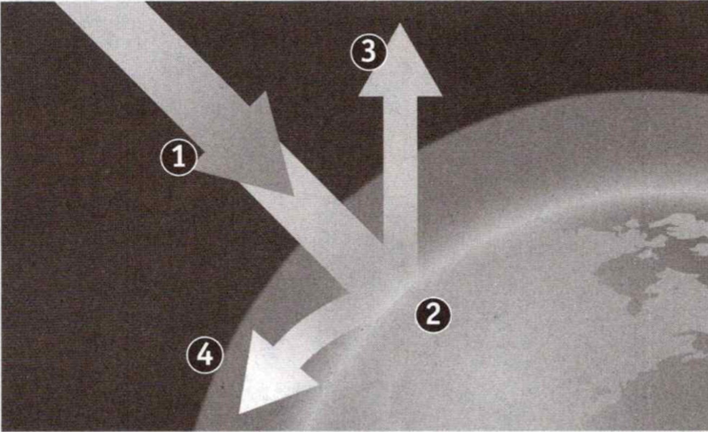
    <figcaption>Figure 28. Greenhouse effect.</figcaption>
  </figure>

29. Use the diagram in Figure 28. Describe the process that results in the
greenhouse effect. How does it affect Earth's atmosphere?

