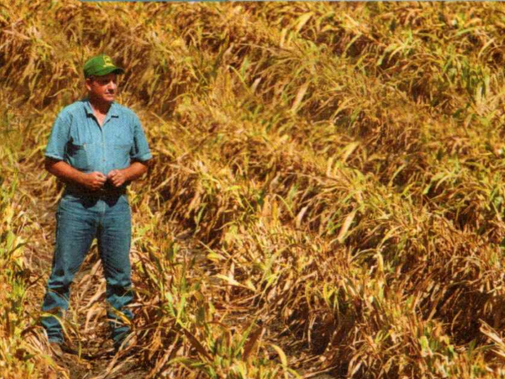
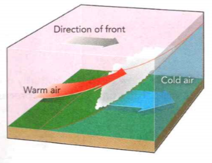

### Earth Science

## Geology

## Weather

**Fog** is made up of clouds that form near the ground.

**Vapor** is water in the form of a gas.

The **atmosphere** is the envelope of gases surrounding Earth.

**Complete the tasks below.**

1. "Is that smoke over the baseball field?" Eddie asked Cara in the park. "No:'
she replied. "It's fog." "Ah, water vapor," Eddie said. "No," Cara said. "If you
can see it, it's water droplets suspended in the atmosphere. Water vapor is an
invisible gas and can't be seen:" What does water vapor in the atmosphere look
like?

2. Prefix Meaning Example. psychro- , cold, psychrometer. alto- , high
altocumulus, altostratus. anti- , against or opposed to, anticyclone. Predict
what the word altocumulus means using what you know about the prefix alto-. 

### Chapter Preview

- water cycle 
- evaporation
- condensation 
- humidity
- relative humidity 
- psychrometer
- dew point 
- cirrus 
- cumulus
- stratus
- precipitation 
- rain gauge
- flood 
- drought
- air mass 
- tropical 
- polar
- maritime 
- continental
- jet stream 
- front 
- occluded
- cyclone 
- anticyclone
- storm 
- thunderstorm 
- lightning
- hurricane 
- storm surge
- tornado 
- evacuate
- meteorologist 
- isobar
- isotherm

### Water in the Atmosphere

- How Does Water Move Through the Atmosphere? 
- What Is Relative Humidity and How Is It Measured?

**Complete the tasks below.**

1. The Driest Place on Earth. The Atacama Desert in Chile is so dry that there
are places where humans have never measured a single drop of rain. But even the
Atacama has some moisture in the air. A dense fog along the coastline, known as
camanchaca, often flows inland from the Pacific Ocean. At one point, the people
of the fishing village Chungungo set up nets above the mountains to catch the
fog. Water condensed on the nets and then was collected and sent through pipes
that brou - ht the water to the village.
a) Why did the people of Chungungo need to use nets to catch moisture in the air?
b) What would be one way of collecting water where you live?

### How Does Water Move Through the Atmosphere?

During a rainstorm, the air feels moist. On a clear, cloudless day, the air may
feel dry. As the sun heats the land and oceans, the sun provides energy to
change the amount of water in the atmosphere. Water is always moving between
Earth's atmosphere and surface.

The movement of water through Earth's systems, powered by the sun's energy, is
the **water cycle**. **In the water cycle, water vapor enters the atmosphere by
evaporation from the oceans and other bodies of water and leaves by
condensation.** **Evaporation** is the process by which molecules of liquid water
escape into the air after becoming water vapor. **Condensation** is the process by
which water vapor becomes liquid water.

Water vapor is also added to the air by living things. Water enters the roots of
plants, rises to the leaves, and is released into the air as water vapor.
Animals also release water vapor into the air every time they exhale.

As part of the water cycle, shown in Figure 1, some of the water vapor in the
atmosphere condenses to form clouds. Rain and snow fall from the clouds toward
the surface as precipitation. The water then runs off the surface or moves
through the ground, back into lakes, streams, and eventually the oceans. Then
the water cycle starts all over again with evaporation.

  <figure>
    
    <figcaption>Figure 1. The Water Cycle.</figcaption>
  </figure>

### What Is Relative Humidity and How Is It Measured?
How is the quantity of water vapor in the atmosphere measured? **Humidity** is a
measure of the amount of water vapor in the air. The ability of air to hold
water vapor depends on its temperature. Warm air can hold more water vapor than
cool air.

### Relative Humidity 

Weather reports usually refer to the water vapor in the air as relative
humidity. **Relative humidity** is the percentage of water vapor that is
actually in the air compared to the maximum amount of water vapor the air can
hold at a particular temperature. For example, at 10°C, 1 cubic meter of air can
hold at most 8 grams of water vapor. If there were 8 grams of water vapor in the
air, then the relative humidity of the air would be 100 percent. Air with a
relative humidity of 100 percent is said to be saturated. If the air had 4 grams
of vapor, the relative humidity would be 50 percent.

### Measuring Relative Humidity 

**Relative humidity can be measured with an instrument called a psychrometer.**
A **psychrometer** has two thermometers, a wet-bulb thermometer and a dry-bulb
thermometer. As shown in Figure 2, the wet bulb is covered by a moist cloth.
When the psychrometer is "slung;" or spun, air blows over both thermometers.
Because the wet-bulb thermometer is cooled by evaporation, its reading drops.

If the relative humidity is high, the water on the wet bulb evaporates slowly,
and the wet-bulb temperature does not change much. If the relative humidity is
low, the water on the wet bulb evaporates rapidly, and the wet-bulb temperature
drops by a large amount. The relative humidity can be found by comparing the
temperatures of the wet-bulb and dry-bulb thermometers.

  <figure>
    
    <figcaption>Figure 2. Sling Psychrometer.</figcaption>
  </figure>

**Complete the tasks below.**

1. Starting with precipitation, list the order of the steps of the water cycle.

2. The Water Cycle, see Figure 1. In the water cycle, water moves from plants,
lakes, rivers, and oceans into the atmosphere and then falls back to Earth. Use
the word bank to label the parts of the water cycle. Word Bank: Condensation,
Evaporation, Precipitation.
a) __
b) __
c) __

3. Sling Psychrometer, see Figure 2. Read the psychrometer and compare the two
Celsius temperatures. Is the relative humidity low or high? How do you know?

  <figure>
    
    <figcaption>Figure 3. Relative Humidity.</figcaption>
  </figure>

4. Relative Humidity, see Figure 3. Relative humidity is affected by
temperature. Use the data table to answer the questions below. First, find the
dry-bulb temperature in the left column of the table. Then find the difference
between the wet- and dry-bulb temperatures across the top of the table. The
number in the table where these two readings intersect indicates the percentage
of relative humidity.
a) At noon the readings on a sling psychrometer are 18°C for the dry bulb and
14°C for the wet bulb. What is the relative humidity?
b) At 5 P.M. the reading on the dry bulb is 12°C and the reading on the wet bulb
is 11°C. Determine the new relative humidity.

5. What was the difference in relative humidity between noon and 5 P.M.? How was
the relative humidity affected by air temperature?

6. What is humidity?

7. Suppose a sample of air can hold at most 10 grams of water vapor. If the
sample actually has 2 grams of water vapor, what is its relative humidity?

8. How are humidity and relative humidity different?

9. Relative humidity is ___ and it can be measured with ___ .

### Clouds
- How Do Clouds Form?
- What Are the Three Main Types of Clouds?

**Complete the tasks below.**

The first time I flew to visit my grandparents, I learned something that really
surprised me. When we got above the clouds, I was amazed that something as big
as a cloud could float in the sky! I was gazing at the clouds when I asked my
mom what they were made of. I was shocked to discover that clouds were mostly
fog and mist! I thought they looked like giant piles of mashed potatoes.
a) Why do you think large clouds can float in the sky?
b) How might you describe what clouds look like?

### How Do Clouds Form?
When you look at a cloud, you are seeing millions of tiny water droplets or ice
crystals. **Clouds form when water vapor in the air condenses to form liquid water
or ice crystals.** Molecules of water vapor in the air become liquid water in a
process called condensation. How does water in the atmosphere condense? Two
conditions are required for condensation: cooling of the air and the presence of
particles in the air.

### The Role of Cooling 

As you have learned, cold air holds less water vapor than warm air. As air
cools, the amount of water vapor it can hold decreases. The water vapor
condenses into tiny droplets of water or ice crystals. The temperature at which
condensation begins is called the **dew point**. If the dew point is above
freezing, the water vapor forms droplets. If the dew point is below freezing,
the water vapor may change directly into ice crystals.

### The Role of Particles 

For water vapor to condense and form clouds, tiny particles must be present in
the atmosphere so that the water has a surface on which to condense. Most of
these particles are salt crystals, dust from soil, or smoke. Water vapor also
condenses on solid surfaces, such as blades of grass or window panes. Liquid
water that condenses from the air onto a cooler surface is called dew. Ice
deposited on a surface that is below freezing is called frost.

  <figure>
    
    <figcaption>Figure 4. How Clouds Form.</figcaption>
  </figure>

### What Are the Three Main Types of Clouds?

**Scientists classify clouds into three main types based on their shape: cirrus,
cumulus, and stratus. Clouds are further classified by their altitude.** Each type
of cloud is associated with a different type of weather.

### Cirrus Clouds

Wispy, feathery clouds are called **cirrus** clouds. Cirrus comes from a
word meaning "a curl.” Cirrus clouds form at high altitudes, usually above 6 km,
and at low temperatures. They are made of ice crystals and indicate fair
weather.

### Altocumulus and Altostratus

Clouds that form between 2 and 6 km above Earth's surface have the prefix alto-,
which means "high." The two main types of these clouds are altocumulus and
altostratus. These are "medium-level" clouds that are higher than regular
cumulus and stratus clouds, but lower than cirrus clouds. These clouds indicate
precipitation.

### Fog

Clouds that form near the ground are called fog. Fog can form when the ground
cools at night after a humid day. What happens to fog after sunrise?

###Cumulus Clouds

Clouds that look like cotton are called **cumulus** clouds. The
word cumulus means "heap" in Latin. Cumulus clouds form less than 2 km above the
ground, but they may extend upward as much as 18 km. Short cumulus clouds
usually indicate fair weather. Towering clouds with flat tops, or cumulonimbus
clouds, often produce thunderstorms. The suffix -nimbus means "rain."

### Cirrocumulus Clouds

Cirrocumulus clouds, which look like cotton balls, often indicate that a storm
is on its way.

### Stratus Clouds

Clouds that form in flat layers are known as **stratus** clouds, from the
Latin word strato, meaning "spread out." Stratus clouds usually cover all or
most of the sky and are a dull, gray color. As stratus clouds thicken, they may
produce drizzle, rain, or snow. They are then called nimbostratus clouds.

  <figure>
    
    <figcaption>Figure 5. What Are the Three Main Types of Clouds?.</figcaption>
  </figure>

  <figure>
    
    <figcaption>Figure 6. Cloud Weather Table.</figcaption>
  </figure>

**Complete the tasks below.**

1. How Clouds Form, see Figure 4. Clouds form when warm, moist air rises and cools.
Fill in the blanks to complete the sentences about cloud formation.
a) Warm, moist air rises from the surface. As air rises, it ___ .
b) At a certain height, air cools to the dew point and ___ begins.
c) Water vapor condenses on tiny ___ in the air.

2. What is the difference between dew and frost?

3. Clouds form when ___ .

4. Fog. Clouds that form near the ground are called fog. Fog can form when the
ground cools at night after a humid day. What happens to fog after sunrise?

5. Cloud Types, see Figure 6. There are many different types of clouds. Fill in
the table to predict the weather that you would expect with each type of cloud.
a) Cirrus
b) Cirrocumulus
c) Cumulus
d) Cumulonimbus
e) Stratus
f) Nimbostratus

6. Look out your window and identify the clouds you see. 
a) What kind of clouds are they? 
b) From what you know about this type of cloud, what sort of weather would you
expect over the next 24 hours? Why?

7. Briefly describe the shapes of the three main types of clouds.

8. Classify each of the following cloud types as low-level, medium-level, or
high-level.
a) Altocumulus
b) Altostratus
c) Cirrocumulus
d) Cirrus
e) Cumulus
f) Nimbostratus 	
g) Stratus

9. The three main types of clouds are	__ .

### Precipitation
- What Are the Common Types of Precipitation?
- What Are the Causes and Effects of Floods and Droughts?

**Complete the tasks below.**

1. Cloud Seeding. A scientist in China is launching tiny crystals of silver
iodide into the air to make rain. Clouds often contain water droplets that have
cooled below 0°C. But the droplets do not freeze unless they can condense onto
solid particles. When the silver iodide crystals reach the clouds, the droplets
can condense onto them. Once that happens, the droplets can fall as rain. Some
scientists think that cloud seeding can increase rainfall by 10 percent. Others
think that this is unlikely. In the United States, several western states are
trying cloud seeding. Dry states, such as Wyoming and Utah, need as much
rainfall as they can get.
a) Why would scientists want to find a way to make it rain?
b) Name a situation when you would want it to rain.

### What Are the Common Types of Precipitation?

Suppose you could control the weather. If you wanted it to rain, you would have
to get the water from somewhere.
Water evaporates from every water surface on Earth and eventually falls back to
the surface. **Precipitation** is any form of water that falls from clouds and
reaches Earth's surface. It is a vital part of the water cycle. In warm
climates, precipitation is almost always rain. In colder regions, it may fall as
snow or ice. **Common types of precipitation include rain, sleet, freezing
rain, snow, and hail.**

### Rain 

The most common kind of precipitation is rain. As shown in Figure 1, drops of
water are called rain if they are at least 0.5 millimeters in diameter.
Precipitation made up of smaller drops of water is called drizzle. Precipitation
of even smaller drops is called mist.

### Measuring Rain 

What if scientists need to measure how much rain has fallen? An open-ended tube
that collects rain is called a **rain gauge**. The amount of rain is measured by
dipping a ruler into the water or by reading a scale. For rainfall to be
measured more accurately, a rain gauge may have a funnel at the top that
collects ten times as much rain as the tube alone would without it. The depth is
easier to measure. To get the actual depth of rain, it is necessary to divide by
ten.

  <figure>
    
    <figcaption>Figure 7. Rain Gauge.</figcaption>
  </figure>

  <figure>
    
    <figcaption>Figure 8. Water Droplets.</figcaption>
  </figure>

### Freezing Rain
On a cold day, raindrops can sometimes fall as liquid water but freeze when they
touch a cold surface. This kind of precipitation is called freezing rain.

### Snow
You probably know that snowflakes have an endless number of different shapes and
patterns, many with six sides or branches. A snowflake forms when water vapor in
a cloud is converted directly into ice crystals. Snowflakes often join together
into large clumps of snow in which the crystals are hard to see.

### Hail
A hailstone is a round pellet of ice larger than 5 millimeters in diameter. If
you cut a hailstone in half, you would see layers of ice, like the layers of an
onion. Rail forms only inside cumulonimbus clouds during thunderstorms. A
hailstone starts as an ice pellet inside a cold region of a cloud. Strong
updrafts carry the hailstone up through the cold region many times. Each time
the hailstone goes through the cold region, a new layer of ice forms around it.
Eventually the hailstone becomes heavy enough to fall to the ground. Because
hailstones can grow large, hail can cause damage to crops, buildings, and
vehicles.

### Sleet
Sometimes raindrops fall through a layer of air that is below 0°C, the freezing
point of water. As they fall, the raindrops freeze into solid particles of ice.
Ice particles smaller than 5 millimeters in diameter are called sleet.

  <figure>
    
    <figcaption>Figure 9. Freezing Precipitation.</figcaption>
  </figure>

### Measuring Snow

Rain is not the only kind of precipitation meteorologists measure. Have you ever
walked through a large snowstorm and wanted to know exactly how much snow had
fallen?

Snowfall is usually measured in two ways: by using a simple measuring stick or
by melting collected snow and measuring the depth of water it produces. On
average, 10 centimeters of snow contains about the same amount of water as 1
centimeter of rain. However, light, fluffy snow contains far less water than
heavy, wet snow does.

### What Are the Causes and Effects of Floods and Droughts?

In September 2008, just three years after Hurricane Katrina, Hurricane Gustav
blasted the coasts of Louisiana and Mississippi. Lakes and rivers overflowed.
The result was severe flooding.

### Floods 

A **flood** is an overflowing of water in a normally dry area. The floods caused
by Gustav fortunately were not as devastating as those caused by Katrina.
Because of the flooding caused by Katrina, more than 100,000 homes and
businesses were destroyed, along with many bridges and highways.

### Causes and Effects of Floods 

Not all floods are as severe as those caused by a hurricane. **Small or large,
many floods occur when the volume of water in a river increases so much that the
river overflows its channel.** As rain and melting snow add more water, a river
gains speed and strength. A flooding river can uproot trees and pluck boulders
from the ground. It can even wash away bridges and buildings.

People who live near rivers try to control floods with dams and levees. A dam is
a barrier across a river that may redirect the flow of the river to other
channels or store floodwaters so they can be released slowly. A levee is an
embankment built along a river to prevent flooding of the surrounding land.
People sometimes strengthen levees with sandbags or stones and concrete. But
powerful floodwaters can sometimes break through dams and levees.

  <figure>
    
    <figcaption>Figure 10. Flooding Caused by Hurricane Gustav.</figcaption>
  </figure>

Drought in Texas, see Figure 11. In July 1998, a drought hit Wharton County,
Texas. This farmer lost about 50 percent of his normal cereal crop to the
drought.

  <figure>
    
    <figcaption>Figure 11. Drought in Texas.</figcaption>
  </figure>

### Droughts 

If you went away for a month and no one was around to water your plants, what
would happen to them? They would probably die from lack of water. A long period
of scarce rainfall or dry weather is known as a **drought**. A drought reduces the
supplies of groundwater and surface water. A drought can result in a shortage of
water for homes and businesses.

### Causes and Effects of Droughts

**Droughts are usually caused by dry weather systems that remain in one place for
weeks or months at a time.** Long-term droughts can devastate a region. Droughts
can cause crop failure. A drought can even cause famine in places where people
must grow their own food. Streams and ponds dry up, and people and animals
suffer.

People can prepare for droughts in several ways. When dry conditions first
occur, people can begin conserving water. Farmers can grow drought-resistant
plants that have been bred to withstand dry conditions. By practicing water and
soil conservation, people can ensure that when droughts do occur, people will be
prepared for their effects.

**Complete the tasks below.**

1. Rain Gauge, see Figue 7. The rain gauge, measuring in centimeters, collects
ten times the actual depth of rain that falls. How much rain has fallen so far?

2. Water Droplets, see Figure 8. Cloud droplets condense to become larger
droplets. Determine how many times larger the diameter of a large (5 mm)
raindrop is than the diameter of a cloud droplet.

3. Freezing Precipitation, see Figure 9. There are four types of freezing
precipitation: freezing rain, snow, sleet, and hail. Identify the temperature
range in the air and on the ground for which you would expect each kind of
precipitation. In some cases, more than one choice may be correct. Choices:
Above 0°C / At or below 0°C 
a) Rain. Air Temperature
b) Rain. Ground Temperature
c) Freezing rain. Air Temperature
d) Freezing rain. Ground Temperature
e) Sleet. Air Temperature
f) Sleet. Ground Temperature
g) Snow. Air Temperature
h) Snow. Ground Temperature
i) Hail. Air Temperature
j) Hail. Ground Temperature

4. A rain gauge with a wide funnel collects ten times the actual depth of rain
that falls. After the rain ends, the water level is at 15 centimeters.
a) How much rain actually fell?
b) If snow had fallen instead, how deep would that snow have been?

5. What is precipitation?

6. What factors determine if precipitation falls as freezing rain or as sleet?

7. The common types of precipitation are ___ .

8. Flooding Caused by Hurricane Gustav, see Figure 10.
Hurricane Gustav hit the Gulf Coast in September 2008, causing severe flooding. 
What sort of damage would you expect to your home if this flood took place in
the area where you live?

9. A '100-year flood" is the flooding elevation that has a 1% chance of
happening each year. Why is the name misleading?

10 . What are two ways to help reduce the dangers of floods?

11. Your community is considering building a dam on a nearby river to reduce
flooding. Would you support this proposal? Explain.

12. Floods are caused by and droughts are caused by	___ .

### Air Masses

- What Are the Major Air Masses? 
- What Are the Main Types of Fronts?
- What Weather Do Cyclones and Anticyclones Bring?

**Complete the tasks below.**

1. Cyclones and Tornadoes. 
**Misconception**: A cyclone is another name for tornado.
**Fact**: Both cyclones and tornadoes are spinning storm systems. Both rotate around
an area of low pressure. However, tornadoes cover a much smaller area than
cyclones do. And tornado winds reach much higher speeds.
**Evidence**: Outside the tropics, cyclones can be 1,000 to 4,000 kilometers across.
Tropical cyclones, which are powerful hurricanes, are smaller, ranging from 100
to 1,000 kilometers across. But tornadoes are smaller still. Tornadoes range in
size from a few meters to 1,600 meters across. Tornado winds are the fastest
known winds on Earth. They can reach speeds of 480 km/h, but are usually much
slower. Cyclone winds are strong, but do not move as fast as the fastest tornado
winds. Tropical cyclone winds rarely reach more than 320 km/h.
a) Which kind of storm do you think would cause damage over a larger area, a
cyclone or a tornado? Why?
b) Have you ever seen water swirl down a drain? How is it related to a tornado?

### What Are the Major Air Masses?

When you have a certain type of weather taking place outside, that's because a
certain type of air mass is influencing the weather. An **air mass** is a huge body
of air in the lower atmosphere that has similar temperature, humidity, and air
pressure at any given height. Scientists classify air masses according to
temperature and humidity. **Four major types of air masses influence the weather
in North America: maritime tropical, continental tropical, maritime polar, and
continental polar.**

As shown in Figure 1, the characteristics of an air mass depend on the
temperatures and moisture content of the region over which the air mass forms.
Remember that temperature affects air pressure. Cold, dense air has a higher
pressure, while warm, less-dense air has a lower pressure. **Tropical**, or warm,
air masses form in the tropics and have low air pressure. **Polar**, or cold, air
masses form north of 50° north latitude and south of 50° south latitude. Polar
air masses have high air pressure.

Whether an air mass is humid or dry depends on whether it forms over water or
land. **Maritime** air masses form over oceans. Water evaporates from the oceans, so
the air can become very humid. Continental air masses form over land.
**Continental** air masses have less exposure to large amounts of moisture from
bodies of water. Therefore, continental air masses are drier than maritime air
masses.

  <figure>
    
    <figcaption>Figure 12. Types of Air Masses.</figcaption>
  </figure>

### Maritime Polar

Cool, humid air masses form over the icy cold North Atlantic ocean. These air
masses are often pushed out to sea by westerly winds.

### Continental Polar

Large air masses form over Canada and Alaska and can bring bitterly cold weather
with low humidity. Storms may occur when these air masses move south and collide
with maritime tropical air masses moving north.

	
### Continental Tropical

Hot, dry air masses form mostly in summer over dry areas of the Southwest and
northern Mexico. They can bring hot, dry weather to the southern Great Plains.

### Maritime Tropical

Warm, humid air masses form over the Pacific Ocean. In summer, they usually
bring hot, humid weather, summer showers, and thunderstorms. In winter, they can
bring heavy rain or snow.

  <figure>
    
    <figcaption>Figure 13. North American Air Masses.</figcaption>
  </figure>

### How Air Masses Move 
When an air mass moves into an area and interacts with other air masses, it
causes the weather to change, sometimes drastically. In the continental United
States, air masses are commonly moved by the prevailing westerlies and jet
streams.

### Prevailing Westerlies 

The prevailing westerlies, the major wind belts over the continental United
States, generally push air masses from west to east. For example, maritime polar
air masses from the Pacific Ocean are blown onto the West Coast, bringing low
clouds and showers.

### Jet Streams 

Embedded within the prevailing westerlies are jet streams. Jet streams are bands
of high-speed winds about 10 kilometers above Earth's surface. As jet streams
generally blow from west to east, air masses are carried along their tracks.

### Fronts 

As huge masses of air move across the land and the oceans, they collide with
each other, but do not easily mix. Think about a bottle of oil and water. The
less-dense oil floats on top. Something similar happens when two air masses of
different temperature and humidity collide. They do not easily mix. The boundary
where the air masses meet becomes a front. Storms and changeable weather often
develop along fronts like the one in Figure 14.

  <figure>
    
    <figcaption>Figure 14. How a Front Forms.</figcaption>
  </figure>

### What Are the Main Types of Fronts?

When you leave school in the afternoon, you may find that the weather is
different from when you arrived in the morning. That might be because a front
has just recently passed through the area. **Colliding air masses can form four
types of fronts: cold fronts, warm fronts, stationary fronts, and occluded
fronts.** The kind of front that develops depends on the characteristics of the
air masses and the direction in which they move.

### Warm Fronts

Clouds and precipitation also accompany warm fronts. At a warm front, a
fast-moving warm air mass overtakes a slower cold air mass. Because cold air is
denser than warm air, the warm air moves over the cold air. If the warm air is
humid, light rain or snow falls along the front. If the air is dry, scattered
clouds form. Because warm fronts arrive slowly, the weather may be rainy or
cloudy for several days. After a warm front passes, the weather tends to be
warmer and humid.

### Cold Fronts

Cold air is dense and tends to sink. Warm air is less dense and tends to rise.
When a faster cold air mass runs into a slower warm air mass, the denser cold
air slides under the lighter warm air. The warm air is pushed upward along the
leading edge of the colder air. A cold front forms.

As the warm air rises, it expands and cools. The rising air soon reaches the dew
point, the temperature at which water vapor in the air condenses. Clouds form.
Heavy rain or snow may fall.

Cold fronts tend to arrive quickly, because their leading edges move along the
ground. They can cause abrupt weather changes, including thunderstorms. After a
cold front passes, colder, drier air moves in, often bringing clear skies, a
shift in wind direction, and lower temperatures.

### Occluded Fronts

The most complex weather situation occurs at an occluded front, where a warm air
mass is caught between two cooler air masses. The denser cool air masses move
underneath the less dense warm air mass and push the warm air upward. The two
cooler air masses meet in the middle and may mix. The temperature near the
ground becomes cooler. The warm air mass is cut off, or **occluded**, from the
ground. As the warm air cools and its water vapor condenses, the weather may
turn cloudy and rain or snow may fall.

### Stationary Fronts

Sometimes cold and warm air masses meet, but neither one can move the other. In
this case, the front is called a stationary front. Where the warm and cool air
meet, water vapor in the warm air condenses into rain, snow, fog, or clouds. But
if a stationary front stalls, it may bring many days of clouds and
precipitation.

  <figure>
    
    <figcaption>Figure 15. Types of Fronts.</figcaption>
  </figure>

### What Weather Do Cyclones and Anticyclones Bring?

As air masses collide to form fronts, the boundary between the fronts sometimes
becomes distorted. This distortion can be caused by surface features, such as
mountains, or strong winds, such as the jet stream. When this happens, the air
begins to swirl. The swirling air can cause a low-pressure center to form.

### Cyclones 

A circled L on a weather map stands for "low," and indicates an area of
relatively low air pressure. A swirling center of low air pressure is a cyclone,
from a Greek word meaning "wheel:' You can see a cyclone in Figure 16.

As warm air at the center of a cyclone rises, the air pressure decreases. Cooler
air blows inward from nearby areas of higher air pressure. Winds spiral inward
toward the center. In the Northern Hemisphere, the Coriolis effect deflects
winds to the right. So the cyclone winds spin counterclockwise when viewed from
above.

As air rises in a cyclone, the air cools, forming clouds and precipitation.
**Cyclones and decreasing air pressure are associated with clouds, wind, and
precipitation.**

### Anticyclones 

As its name suggests, an anticyclone is the opposite of a cyclone. **Anticyclones**
are high-pressure centers of dry air, shown by an H on a weather map. Winds
spiral outward from the center, moving toward areas of lower pressure. Because
of the Coriolis effect, winds in an anticyclone spin clockwise in the Northern
Hemisphere. As air moves out from the center, cool air moves downward from
higher in the troposphere. The cool air warms up, so its relative humidity
drops. **The descending air in an anticyclone generally causes dry, clear
weather.**

  <figure>
    
    <figcaption>Figure 16. Cyclones and Anticyclones.</figcaption>
  </figure>

**Complete the tasks below.**

1. Types of Air Masses, see Figure 12. Air masses can be classified according to
temperature and humidity. Fill in the table. Classify each type of air mass as
maritime or continental and as tropical or polar.
a) Warm, Wet:
b) Cool, Wet:
c) Warm, Dry:
d) Cool, Dry:

2. North American Air Masses, see Figure 13. Air masses can be warm or cold, and
humid or dry. Identify the two unlabeled air masses on the page by their
descriptions.
a) Cool, humid air masses form over the icy cold North Pacific ocean. Even in
summer, these ail masses often cool the West Coast. Type of air mass:	
b) Warm, humid air masses form over the Gulf of Mexico and the Atlantic Ocean.
They can bring thunderstorms, heavy rain, or snow. Type of air mass:

3. North American Air Masses, see Figure 13. Air masses can be warm or cold, and
humid or dry. According to the map and the text, which two of the following air
masses form over water? Maritime tropical, Maritime polar, Continental tropical,
Continental polar.

4. How a Front Forms, see Figure 14. The boundary where unlike air masses meet
is called a front. A front may be 15 to 600 km wide and extend high into the
troposphere. What kind of weather would develop along the front shown in the
photo?

5. What two characteristics are used to classify air masses?

6. What type of air mass would form over the northern Atlantic Ocean?

7. Classify the four major types of air masses according to moisture content.

8. The four major types of air masses are ___ .

9. Types of Fronts, see Figure 15. Identify the type of weather
brought by each front as it passes through an area.
a) Cold Fronts
b) Warm Fronts
c) Occluded Fronts
d) Stationary Fronts

10. What is a front?

11. What type of weather occurs as a warm front moves through an area?

12. What types of fronts would cause several days of rain and clouds?

13. The four main types of fronts are  ___ .

14. Cyclones and Anticyclones, see Figure 16. Label each diagram as either a
cyclone or an anticyclone. In each circle, draw an arrow to show the direction
of air motion for the system as it would be seen from above.
a) Clockwise or Anticlockwise?
b) Cyclone or Anticyclone?
c) Clockwise or Anticlockwise?
d) Cyclone or Anticyclone?

  <figure>
    
    <figcaption>Figure 17. Weather map.</figcaption>
  </figure>

15. Weather map, see Figure 17. Fill in the empty circles with either L for a
low-pressure center or H for a high-pressure center.
a) L or H?
b) L or H?
c) L or H?
d) L or H?
e) What information on the map helped you decide if an area's air pressure was
low or high?

16. What is a cyclone?

17. How does air move in a cyclone? 

18. Compare cyclone and anticyclone. 
a) What kind of weather is associated with a cyclone? 
b) What kind of weather is associated with an anticyclone?

### Storms
- How Do the Different Types of Storms Form? 
- How Can You Stay Safe in a Storm?

**Complete the tasks below.**

1. The Blizzard of 1978. In February 1978, a huge blizzard hit the northeastern
United States. Weather stations recorded hurricane-force winds, and many cities
received record-breaking amounts of snow. The storm hovered over New England,
and heavy snow fell for almost 33 hours without letting up. In Massachusetts,
people driving on highways abandoned their cars when the snow became too deep to
drive through. Rescuers used cross-country skis and snowmobiles to help evacuate
the roads. Stranded drivers returned home any way they could. The governor of
Massachusetts declared a state of emergency. He called in the National Guard to
clear the roads of snow. It took almost a week until the roads opened again.
a) What do you think made the blizzard so dangerous?
b) Besides the hurricane-force winds and the roads filling with snow, what other
hazards do you think the blizzard caused?

### How Do the Different Types of Storms Form?

The Blizzard of 1978 was one of the most intense storms ever to hit the
northeastern United States. A **storm** is a violent disturbance in the atmosphere.
Storms involve sudden changes in air pressure, which cause rapid air movements.
There are several types of severe storms: winter storms, thunderstorms,
hurricanes, and tornadoes.

### Winter Storms 

In the winter in the northern United States, a large amount of precipitation
falls as snow. **All year round, most precipitation begins in clouds as snow. If
the air is colder than 0°C all the way to the ground, the precipitation falls as
snow.** Heavy snow can block roads, trapping people in their homes and delaying
emergency vehicles. Extreme cold can damage crops and cause water pipes to
burst.

Some places, including Buffalo and Rochester in upstate New York, get a lot more
snow than others. In an average winter, nearly three meters of snow fall on
these cities due to lake-effect snow, as shown in Figure 1. Buffalo is located
east of Lake Erie. Rochester is located south of Lake Ontario. In the fall and
winter, the land near these lakes cools much more rapidly than the water in the
lakes. When a cold, dry air mass moves southeast across one of the lakes, it
picks up water vapor and heat. As soon as the air mass reaches the other side of
the lake, the air rises and cools again. The water vapor condenses and falls as
snow.

  <figure>
    
    <figcaption>Figure 18. Lake-Effect Snow.</figcaption>
  </figure>

A fulgurite forms when lightning strikes sand or sandy soil, see Figure 19. The
temperature of the lightning is so high that it melts the sand and forms a tube
made of glass.

  <figure>
    
    <figcaption>Figure 19. Fulgurite.</figcaption>
  </figure>

### Thunderstorms 

Do you find thunderstorms frightening? Exciting? As you watch the brilliant
flashes of lightning and listen to long rolls of thunder, you may wonder what
causes them.

### How Thunderstorms Form 

A **thunderstorm** is a small storm often accompanied by heavy precipitation and
frequent thunder and lightning. **Thunderstorms form in large cumulonimbus
clouds, also known as thunderheads.** Most cumulonimbus clouds form on hot,
humid afternoons or evenings. They also form when warm air is forced upward
along a cold front. In both cases, the warm, humid air rises rapidly, as shown
in Figure 2. The air cools, forming dense thunderheads with water condensing
into rain droplets. Heavy rain falls, sometimes along with hail. Within the
thunderhead are strong upward and downward winds known as updrafts and
downdrafts. Many thunderstorms form in the spring and summer in southern states
or on the western plains.

  <figure>
    
    <figcaption>Figure 20. How Thunderstorms Form.</figcaption>
  </figure>

### Lightning and Thunder 

During a thunderstorm, areas of positive and negative electrical charges build
up in the storm clouds. **Lightning** is a sudden spark, or electrical
discharge, as these charges jump between parts of a cloud, between nearby
clouds, or between a cloud and the ground. Lightning is similar to the shocks
you sometimes feel when you touch a metal object on a very dry day. Because
lightning is electricity, it is easily conducted by metal.

What causes thunder? A lightning bolt can heat the air near it to as much as
30,000°C, much hotter than the sun's surface. The rapidly heated air expands
explosively. Thunder is the sound of the explosion. Because light travels faster
than sound, you see lightning before you hear thunder.

### Thunderstorm Damage 

Thunderstorms can cause severe damage. The heavy rains associated with
thunderstorms can flood low-lying areas. Lightning can also cause damage. When
lightning strikes the ground, the hot, expanding air can shatter tree trunks or
start forest fires. When lightning strikes people or animals, it acts like a
powerful electric shock. Lightning can cause unconsciousness, serious burns, and
heart failure.

### Floods 

A major danger during severe thunderstorms is flooding. Some floods occur when
so much water pours into a stream or river that its banks overflow, covering the
surrounding land with water. In urban areas, floods can occur when the ground is
already saturated by heavy rains. The water can't soak into the water-logged
ground or the many areas covered with buildings, roads, and parking lots. A
flash flood is a sudden, violent flood that occurs shortly after a storm.

  <figure>
    
    <figcaption>Figure 21. Lightning Damage.</figcaption>
  </figure>

### Hurricanes 

A **hurricane** is a tropical cyclone with winds of 119 km/h or higher. A
typical hurricane is about 600 kilometers across. Hurricanes form in the
Atlantic, Pacific, and Indian oceans. In the western Pacific, they are called
typhoons. In the Indian ocean, they are simply called cyclones.

### How Hurricanes Form 

A typical hurricane that strikes the United States forms in the Atlantic Ocean north of the equator in August, September, or October. **A hurricane begins over warm ocean water as a low-pressure area, or tropical
disturbance.** If the tropical disturbance grows in size and strength, it becomes a tropical storm, which may then become a hurricane.

Look at Figure 22 to see how a hurricane forms. A hurricane draws its energy
from the warm, humid air at the ocean's surface. As this air rises and forms
clouds, more air is drawn into the system. Inside the storm are bands of very
high winds and heavy rains. Winds spiral inward toward the area of lowest
pressure at the center. The lower the air pressure at the center of a storm, the
faster the winds blow toward the center. Hurricane winds may be as strong as 320
km/h.

Hurricane winds are strongest in a narrow band around the storm's center. At the
center is a ring of clouds, called the eyewall, that encloses a quiet "eye." The
wind gets stronger as the eye approaches. When the eye arrives, the weather
changes suddenly. The air grows calm and the sky may clear. After the eye
passes, the storm resumes, but the wind blows from the opposite direction.

  <figure>
    
    <figcaption>Figure 22. Hurricane.</figcaption>
  </figure>

### How Hurricanes Move 

Hurricanes can last longer than other storms-a week or more. During that period,
they can travel thousands of kilometers. Hurricanes that form in the Atlantic
Ocean are steered by easterly trade winds toward the Caribbean islands and the
southeastern United States. After a hurricane passes over land, it no longer has
warm, moist air to draw energy from. The hurricane gradually weakens, although
heavy rainfall may continue for several days.

### Hurricane Damage 

When a hurricane comes ashore, it brings high waves and severe flooding, as well
as wind damage. The low pressure and high winds of the hurricane over the ocean
raise the level of the water as much as 6 meters above normal sea level. The
result is a **storm surge**, a "dome" of water that sweeps across the coast
where the hurricane lands. Storm surges can cause great damage, washing away
beaches, destroying coastal buildings, and eroding the coastline.

  <figure>
    
    <figcaption>Figure 23. Hurricane Katrina.</figcaption>
  </figure>

### Tornadoes 

A tornado is one of the most frightening and intense types of storms. A
**tornado** is a rapidly whirling, funnel-shaped cloud that reaches down from a
thunderstorm to touch Earth's surface. If a tornado occurs over a lake or ocean,
the storm is called a waterspout. Tornadoes are usually brief, but can be
deadly. They may touch the ground for 15 minutes or less and be only a few
hundred meters across. But an intense tornado's wind speed may approach 500
km/h.

### How Tornadoes Form 

Tornadoes can form in any situation involving severe weather. **Tornadoes most
commonly develop in thick cumulonimbus clouds-the same clouds that bring
thunderstorms.** Tornadoes often occur when thunderstorms are likely-in spring
and early summer, late in the afternoon when the ground is warm.

### Tornado Alley 

Tornadoes occur in nearly every part of the United States. However, the Great
Plains often have the kind of weather pattern that is likely to create
tornadoes: A warm, humid air mass moves north from the Gulf of Mexico into the
lower Great Plains, and a cold, dry air mass moves south from Canada. When the
air masses meet, the cold air moves under the warm air, forcing it to rise. A
line of thunderstorms called a squall line is likely to form, with storms
traveling northeast. A single squall line can produce ten or more tornadoes.

  <figure>
    
    <figcaption>Figure 24. Tornado Formation.</figcaption>
  </figure>

### Tornado Damage 

Tornado damage comes from both strong winds and flying debris. The low pressure
inside the tornado sucks objects into the funnel. Tornadoes can move large
objects and scatter debris many miles away. One tornado tore a sign off in
Oklahoma and dropped it 50 km away in Arkansas! A tornado can level houses on
one street but leave neighboring houses standing.

Tornadoes are ranked on the Enhanced Fujita scale by the amount of damage they
cause. The scale was named for the scientist who devised the original scale, Dr.
T. Theodore Fujita. As shown in Figure 7, the scale goes from light damage (EFO)
to extreme damage (EF5). Only about one percent of tornadoes are ranked as EF4
or EF5.

  <figure>
    
    <figcaption>Figure 25. Tornado Damage.</figcaption>
  </figure>

### How Can You Stay Safe in a Storm?

A winter storm or a thunderstorm can be fun to watch if you're in a safe place.
But you don't want to be near a hurricane or tornado if you can avoid it.

### Winter Storm Safety 

Imagine being caught in a snowstorm when the wind suddenly picks up. High winds
can blow falling snow sideways or pick up snow from the ground and suspend it in
the air. This situation can be dangerous because the blowing snow limits your
vision and makes it easy to get lost. Also, strong winds cool a person's body
rapidly. **If you are caught in a snowstorm, try to find shelter from the
wind.** Cover exposed parts of your body and try to stay dry. If you are in a
car, keep the engine running only if the exhaust pipe is clear of snow.

### Thunderstorm Safety 

The safest place to be during a thunderstorm is indoors. Avoid touching
telephones, electrical appliances, or plumbing fixtures. It is usually safe to
stay in a car. The electricity will move along the metal skin of the car and
jump to the ground. However, do not touch any metal inside the car. **During
thunderstorms, avoid places where lightning may strike. Also, avoid objects that
can conduct electricity, such as metal objects and bodies of water.**

How can you remain safe if you are caught outside during a thunderstorm? Do not
seek shelter under a tree, because lightning may strike the tree. Instead, find
a low area away from trees, fences, and poles. Crouch with your head down. If
you are swimming or in a boat, get to shore and find shelter away from the
water.

### Hurricane Safety 

Today, weather satellites can track the paths of hurricanes. So people now
receive a warning well in advance of an approaching hurricane. A "hurricane
watch" indicates that hurricane conditions are possible in an area within the
next 36 hours. You should be prepared to **evacuate**, or move away temporarily.
A "hurricane warning" means that hurricane conditions are expected within the
next 24 hours. **If you hear a hurricane warning and are told to evacuate, leave
the area immediately.**

### Tornado Safety 

A "tornado watch" is an announcement that tornadoes are possible in your area. A
"tornado warning" is an announcement that a tornado has been seen in the sky or
on weather radar. If you hear a tornado warning, move to a safe area as soon as
you can. Do not wait until you actually see the tornado.

**The safest place to be during a tornado is in a storm shelter or a basement.**
If there is no basement, move to the middle of the ground floor. Stay away from
windows and doors. Lie under a sturdy piece of furniture. If you are outdoors,
lie flat in a ditch.

**Complete the tasks below.**

1. Lake-Effect Snow, see Figure 18. As cold, dry air moves across the warmer
water, it becomes more humid as water vapor evaporates from the lake surface.
When the air reaches land and cools, lake-effect snow falls.
a) Identify the cities that receive lake-effect snow. 
b) Name a city that does not get it and explain why.

2. How Thunderstorms Form, see Figure 20. A thunderstorm forms when warm, humid
air rises rapidly within a cumulonimbus cloud. Fill in the captions noting the
direction of the warm, humid air and the cold air.
a) __
b) __

3. Lightning Damage, see Figure 21. Lightning can cause fires, serious damage,
and injuries. Which is more likely to be hit by lightning, a metal or a wooden
boat? Why?

4. Outline how a hurricane forms.

5. Hurricane, see Figure 22. In a hurricane, air moves rapidly around a
low-pressure area called an eye. Label the areas of the hurricane where the
winds are strong and where the winds are weak.
a) strong or weak?
b) strong or weak?
c) strong or weak?

6. Hurricane Katrina, see Figure 23. The picture shows the path of Hurricane Katrina.
a) On the picture, draw lines showing the possible paths the hurricane could
have taken after reaching land. 
b) What happens to a hurricane after it reaches land?

7. Tornado Formation, see Figure 24. Warm, moist air flows upward. A low
pressure area forms inside the cloud. The warm air begins to rotate. About 1,200
tornadoes occur in the United States every year. Weather patterns on the Great
Plains result in a "tornado alley." Pick a state on the map (or your home state)
and indicate whether its risk of tornadoes is low or high.

8. Tornado Damage, see Figure 25. How would you rank this tornado damage on the
Enhanced Fujita scale? Why?

9. What is a hurricane?

10. How do hurricanes form?

11. How do hurricanes differ from tornadoes?

12. The main kinds of storms are ___ .

13. Evacuation Site. In September 2005, the city of Dallas opened up shelters
such as the Reunion Arena for people who fled Hurricane Katrina. What is the
difference between a hurricane watch and a hurricane warning?

  <figure>
    
    <figcaption>Figure 26. Safety sign.</figcaption>
  </figure>

14. The two signs in the pictures in Figure 26 show warnings about possible
storms.
a) Match each safety sign to the appropriate storm.
b) In the space to the right, draw a sign to show how one could stay safe in a
thunderstorm or winter storm.

15. Based on the safety steps, list the four storms from least to most
dangerous.

16. How can a community make sure people stay safe in a storm?

17. To stay safe in a storm I should either ___ or, in the case of a hurricane,
I should ___ .

### Predicting the Weather

- How Do You Predict the Weather?
- What Can You Learn From Weather Maps?

**Complete the tasks below.**

1. Meteorologist Mish Michaels. Mish Michaels uses computers in her work every
day to sort data from weather satellites, radar, and weather stations from all
over the world. Then she shares her weather forecasts with Boston television
viewers. Michaels became interested in weather while in kindergarten in
Maryland. She watched a tornado damage her family's apartment complex. Since
then, she has been fascinated by storms. Michaels went on to major in
meteorology at Cornell University. Michaels is devoted to educating others about
weather. She supports the WINS program (Women in the Natural Sciences) of Blue
Hill Weather Observatory in Milton, Massachusetts. The program inspires girls to
pursue careers in math, science, and technology.
a) Why do you think that meteorologists depend so heavily on computers?
b) What subjects do you think future meteorologists need to study in school?

### How Do You Predict the Weather?

The first step in weather forecasting is to collect data, either from direct
observations or through the use of instruments. For example, if a barometer
shows that the air pressure is falling, you can expect an approaching
low-pressure area, possibly bringing rain or snow.

### Making Simple Observations 

You can read weather signs in the clouds, too. Cumulus clouds often form on warm
days. If they grow larger and taller, they can become cumulonimbus clouds, which
may produce a thunderstorm. If you can see thin cirrus clouds high in the sky, a
warm front may be approaching.

Even careful weather observers often turn to meteorologists for weather
information. **Meteorologists** are scientists who study and try to predict
weather.

### Interpreting Complex Data 

Meteorologists interpret information from a variety of sources. **Meteorologists
use maps, charts, computers, and other technology to analyze weather data and to
prepare weather forecasts.**

Weather reporters get their information from the National Weather Service, which
uses balloons, satellites, radar, and surface instruments to gather data.

### Using Technology 

Techniques for predicting weather have changed dramatically in recent years.
Short-range forecasts-forecasts for up to five days-are now fairly reliable.
Meteorologists can also make somewhat accurate long-range predictions.
Technological improvements in gathering weather data and using computers have
improved the accuracy of weather forecasts.

### Automated Weather Stations

Weather stations gather data from surface locations for temperature, air
pressure, relative humidity, rainfall, and wind speed and direction. The
National Weather Service has established a network of more than 1,700 surface
weather observation sites.

### Weather Balloons

Weather balloons carry instruments into the troposphere and lower stratosphere.
The instruments measure temperature, air pressure, and humidity.

### Computer Forecasts

Computers process weather data quickly to help forecasters make predictions. The
computer works through thousands of calculations using equations from weather
models to make forecasts.

### Weather Satellites

Satellites orbit Earth in the exosphere, the uppermost layer of the atmosphere.
Cameras on weather satellites can make images of Earth's surface, clouds,
storms, and snow cover. Satellites also collect data on temperature, humidity,
solar radiation, and wind speed and direction.

  <figure>
    
    <figcaption>Figure 27. Weather Technology.</figcaption>
  </figure>

### What Can You Learn From Weather Maps?

A weather map is a "snapshot" of conditions at a particular time over a large
area. There are many types of weather maps.

### Weather Service Maps 

Data from many local weather stations all over the country are assembled into
weather maps at the National Weather Service. The way maps display data is shown
in the Apply It feature below. The simplified weather map at the end of this
lesson includes a key that shows weather station symbols.

On some weather maps you see curved lines. These lines connect places with
similar conditions of temperature or air pressure. **Isobars** are lines joining
places on the map that have the same air pressure. (Iso means "equal" and bar
means "weight:') The numbers on the isobars are the pressure readings. These
readings may be given in inches of mercury or in millibars.

**Isotherms** are lines joining places that have the same temperature. The
isotherm may be labeled with the temperature in degrees Fahrenheit, degrees
Celsius, or both.

  <figure>
    
    <figcaption>Figure 28. Weather Map Symbol.</figcaption>
  </figure>

### Newspaper Weather Maps 

Maps in newspapers are simplified versions of maps produced by the National
Weather Service. Figure 3 shows a typical newspaper weather map. From what you
have learned in this lesson, you can probably interpret most symbols on this
map. **Standard symbols on weather maps show fronts, areas of high and low
pressure, types of precipitation, and temperatures.** Note that the high and low
temperatures are given in degrees Fahrenheit instead of Celsius.

### Limits of Weather Forecasts 

As computers have grown more powerful, and new satellites and radar technologies
have been developed, scientists have been able to make better forecasts. But
even with extremely powerful computers, it is unlikely that forecasters will
ever be able to predict the weather accurately a month in advance. This has to
do with the so-called "butterfly effect." The atmosphere works in such a way
that a small change in the weather today can mean a larger change in the weather
a week later! The name refers to a scientist's suggestion that even the flapping
of a butterfly's wings causes a tiny disturbance in the atmosphere. A tiny event
might cause a larger disturbance that could-eventually-grow into a large storm.

  <figure>
    
    <figcaption>Figure 29. Newspaper Weather Map.</figcaption>
  </figure>

**Complete the tasks below.**

1. Weather Technology, see Figure 27. Explain why better technology leads to
improved weather forecasting.

2. Meteorologists prepare weather forecasts using ___ .

3. How are isobars and isotherms alike? How do they differ?

4. The tables in Figure 28 show what various weather symbols represent.
a) According to the weather map symbol, what are the amount of cloud cover and
the wind speed?
b) Would you expect precipitation in an area marked by this weather symbol? Why?

5. Newspaper Weather Map, see Figure 29. The symbols on this map show fronts,
high- and low-pressure areas, the high and low temperature readings for
different cities, and precipitation. The color bands indicate different
temperature ranges.
a) Identify the weather that will occur in Denver according to this map.
b) Can you predict the weather in Denver a week later? Explain.

  <figure>
    
    <figcaption>Figure 30. Predicting the Weather.</figcaption>
  </figure>

6. Predicting the Weather, see Figure 30. How do meteorologists predict the
weather? What would you tell the people of Miami, Kansas City, and Seattle about
tomorrow's weather? Explain why.

7. What is a weather map?

8. How do meteorologists predict the weather?

9. Meteorologists predict the weather by collecting data about ___, ___, ___,
and ___ .

### Study Guide

- In the water cycle, water vapor enters the atmosphere by evaporation from the
oceans and other bodies of water and leaves by condensation.
- Relative humidity can be measured with an instrument called a psychrometer. 
- Clouds form when water vapor in the air condenses to form liquid water or ice
crystals.
- Scientists classify clouds into three main types based on their shape: cirrus,
cumulus, and stratus. Clouds are further classified by their altitude.
- Common types of precipitation include rain, sleet, freezing rain, snow, and hail.
- Many floods occur when the volume of water in a river increases so much that
the river overflows its channel.
- Droughts are usually caused by dry weather systems that remain in one place
for weeks or months at a time.
- The major air masses are classified as maritime or continental and as tropical
or polar.
- The four types of fronts are cold fronts, warm fronts, stationary fronts, and
occluded fronts.
- Cyclones come with wind and precipitation. An anticyclone causes dry, clear
weather.
- Most precipitation begins in clouds as snow.
- Thunderstorms and tornadoes form in cumulonimbus clouds.
- A hurricane begins over warm ocean water as a low-pressure area, or tropical
disturbance.
- Always find proper shelter from storms.
- Meteorologists use maps, charts, computers, and other technology to prepare
weather forecast.
- Standard symbols on weather maps show fronts, air pressure, precipitation, and
temperature.

**Complete the tasks below.**

1. What is the energy source for the water cycle?

2. At 3 P.M., a dry-bulb thermometer reading is 66°F. The wet-bulb reading is
66°F. What is the relative humidity? Explain.

3. What type of cloud forms at high altitudes and appears wispy and feathery?
A) stratus
B) altocumulus
C) Cumulus
D) cirrus

4. One type of cloud is a nimbostratus, which is __ .

5. Why do clouds usually form high in the air instead of near Earth's surface?

6. What is the name for raindrops that freeze as they fall through the air?
A) dew
B) sleet
C) hail
D) frost

7. Rain and hail are both precipitation, which is __ .

8. It is winter where Jenna lives. It's been snowing all day, but now the snow
has changed to sleet and then to freezing rain. What is happening to cause these
changes? In your answer, explain how snow, sleet, and freezing rain form.

9. What do you call a hot air mass that forms over land?

  <figure>
    
    <figcaption>Figure 31. Weather front.</figcaption>
  </figure>

10. What type of weather is most likely to form at the front shown in Figure 31?

11. What are very large tropical cyclones with high winds called?
A) storm surges
B) tornadoes
C) hurricanes
D) thunderstorms

12. Thunderstorms usually contain lightning, which is __ .

13. What do you think is the most important thing people should do to reduce the
dangers of storms?

14. On a weather map, lines joining places with the same temperature are called
A) low-pressure systems. 
B) isotherms. 
C) high-pressure systems. 
D) isobars.

15. To predict weather, meteorologists use __ .

16. How does the butterfly effect keep meteorologists from accurately
forecasting the weather a month in advance?

  <figure>
    
    <figcaption>Figure 32. Weather map.</figcaption>
  </figure>

17. Meteorologists use information from many sources to make predictions about
the weather. The weather map in Figure 32 shows that right now it is sunny in
Cincinnati, but the weather report for tomorrow shows a major snowstorm. Using
the map, explain how a meteorologist is able to make this prediction. Include
details on weather technology used and the atmospheric conditions that lead to a
snowstorm. Make sure to discuss clouds, air masses, fronts, temperature, and
pressure.

  <figure>
    
    <figcaption>Figure 33. Average Monthly Rainfall.</figcaption>
  </figure>

18. The table in Figure 33 shows the amount of rainfall in different months.
Which two months had the most rainfall?
A) June and August 
B) January and March
C) June and July
D) August and May

19. When the temperature equals the dew point, what is the relative humidity?
A) zero
B) 10%
C) 50%
D) 100%

20. How does the jet stream influence weather?
A) by elevating temperature and pressure
B) by lowering pressure and humidity
C) by reducing temperature and density
D) by moving air masses to produce fronts 
 
21. Low pressure over warm ocean water may produce which of the following conditions?
A) fair weather
B) a thunderstorm 
C) a hurricane
D) a tornado

22. Which of the following map symbols identifies a place likely to experience fair weather?
A) isobars
B) H for high pressure 
C) isotherms
D) H for high temperature

  <figure>
    
    <figcaption>Figure 34. Cloud formation.</figcaption>
  </figure>

23. Cloud formation see Figure 34.
a) Describe the process by which a cloud forms in Figure 34. 
b) What two conditions are necessary for this process to occur? 
c) How does this process compare to the process by which dew or frost form?

