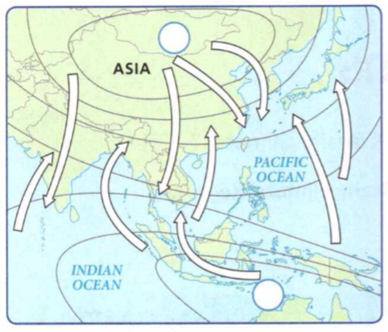

### Earth Science

## Geology

## Climate and Climate Change

**Altitude** is the height of a place above sea level.

**Temperature** is a measure of how hot or cold an object is compared to a reference
point.

**Precipitation** is any form of water that falls from clouds and reaches Earth's
surface.

**Complete the tasks below.**

1. Derek walks steadily up the path. As he climbs to a higher altitude, the air
changes. He can feel the temperature get cooler. Soon, he puts up his hood to
stay dry. At first the precipitation is rain, but as Derek gets higher up the
mountain, it changes to snow. Why does the precipitation change to snow as Derek
gets higher up the mountain?

2. Word - Definition - Example: affect - to produce a change in or have an effect
on - The actions of humans affect the environment. distinct - different; not the
same Each type of cloud is distinct. Choose the best word (affect/distinct) to
complete each sentence.
a) Trees in the rain forest form several __ layers.
b) If you are high up on a mountain, the altitude can __ how you breathe.

### Chapter Preview

- climate
- tropical zone
- polar zone
- temperate zone
- marine climate
- continental climate
- windward
- leeward
- monsoon
- rain forest
- savanna
- steppe
- desert
- humid subtropical
- subarctic
- tundra
- permafrost
- ice age 
- aerosol 
- sunspot
- greenhouse gas
- fossil fuel
- global warming

### What Causes Climate?
- What Factors Affect Temperature?
- What Factors Affect Precipitation?

**Complete the tasks below.**

1. Changes in Climate. Misconception: Only changes in the atmosphere can affect
climate. Fact: As air moves, it's affected by sunlight, cloud cover, oceans, and
even landforms such as mountains. Evidence: The ocean plays a big role in
shaping climate. For example, rain that falls in the mountains eventually runs
into rivers and oceans. Then water evaporates from the oceans and forms clouds.
Water in the oceans also absorbs heat. Ocean currents transfer thermal energy
from the equator to cooler areas in the Northern and Southern hemispheres.
Think about your own observations of Earth's climate.
a) How does the ocean affect Earth's climate?
b) How do you think the climate in coastal areas differs from the climate
farther inland?

### What Factors Affect Temperature?

No matter where you live, the weather changes every day. In some areas, the
change might be as small as a 1-degree drop in temperature from one day to the
next. In other areas, it can mean a cold, rainy day followed by a warm, sunny
one. Climate, on the other hand, is the long-term weather pattern in an area.
Specifically, **climate** refers to the average, year-after-year conditions of
temperature, precipitation, wind, and clouds in an area. Both weather and
climate depend on the transfer of thermal energy and water into and out of the
atmosphere.

Temperature changes cause evaporation and precipitation. The water cycle
determines climate patterns. For example, in California's Mojave Desert, shown
in Figure 1, there is more evaporation than precipitation. The climate there is
hot and dry. If you moved west from the Mojave desert toward California's coast,
you'd notice a different climate. It would be cooler and more humid. How is this
possible? **Temperature is affected by latitude, altitude, distance from large
bodies of water, and ocean currents.**

 <figure>
    
    <figcaption>Figure 1. Mojave desert.</figcaption>
  </figure>

### Latitude 

In general, areas near the equator have warmer climates than areas far from the
equator. The reason is that the sun's rays hit Earth's surface more directly at
the equator than at the poles. At the poles, the same amount of solar radiation
is spread over a larger area, which brings less warmth.

Recall that latitude is the distance from the equator, measured in degrees, as
shown in Figure 2. Based on latitude, Earth's surface can be divided into three
types of temperature zones.

The **tropical zone** is the area near the equator, between about 23.5° north
latitude and 23.5° south latitude. It receives direct or nearly direct sunlight
all year, making climates there warm.

In contrast, the sun's rays always strike at a lower angle near the North and
South poles, making climates there cold. These **polar zones** extend from about
66.5° to 90° north and 66.5° to 90° south latitudes.

Between the tropical zones and the polar zones are the temperate zones. In
summer, the sun's rays strike the **temperate zones** more directly. In winter, the
sun's rays strike at a lower angle. As a result, the weather in the temperate
zones ranges from warm or hot in summer to cool or cold in winter.

  <figure>
    
    <figcaption>Figure 2. Latitude and Temperature.</figcaption>
  </figure>

### Altitude 

A species of Polylepsis tree in Bolivia grows at the highest altitude of any
tree in the world-up to 5,200 m, see Figure 3.

  <figure>
    
    <figcaption>Figure 3. Polylepsis.</figcaption>
  </figure>

Standing at 6,309 meters high, Mount Chimborazo is Ecuador's tallest mountain.
Its peak is covered in glaciers year-round, as shown in Figure 3. But at 1°
south latitude, Chimborazo is located very close to the equator. How does the
top of this mountain stay so cold?

In the case of high mountains, altitude is a more important climate factor than
latitude. In the troposphere, temperature decreases about 6.5°C for every
1-kilometer increase in altitude. As a result, many mountainous areas have
cooler climates than the lower areas around them. Chimborazo is just over 6
kilometers high. The air at the top of this mountain is about 39°C colder than
the air at sea level at the same latitude.

  <figure>
    
    <figcaption>Figure 4. Altitude and Temperature. Mount Chimborazo, Ecuador.</figcaption>
  </figure>

### Distance From Large Bodies of Water 
Oceans or large lakes can also affect temperatures. Oceans greatly moderate, or
make less extreme, the temperatures of nearby land. Water heats up about five
times more slowly than land. It also cools down more slowly. Therefore, winds
off the ocean often prevent extremes of hot and cold in coastal regions. Much of
the west coasts of North America, South America, and Europe have **marine
climates**. These climates have relatively mild winters and cool summers.

The centers of North America and Asia are too far inland to be warmed or cooled
by the ocean. Most of Canada, Russia, and the central United States have
**continental climates**. These climates reach more extreme temperatures than
marine climates. Winters are cold, while summers are warm or hot.

### Ocean Currents 

Marine climates are influenced by ocean currents-streams of water within the
oceans that move in regular patterns. Some warm ocean currents move from the
tropics toward the poles. This warm ocean water warms the air above it. The
warmed air then moves over nearby land, affecting climate. The best-known
warm-water current is the Gulf Stream. When it crosses the North Atlantic, it
becomes the North Atlantic Drift.

Cold currents also affect climate by bringing cold water from the polar zones
toward the equator. A cold current brings cool air. The California Current is an
example of a cold current.

  <figure>
    
    <figcaption>Figure 6. Currents and Temperature.</figcaption>
  </figure>

### What Factors Affect Precipitation?

The amount of precipitation that falls in an area can vary yearly. But, over
time, total precipitation tends toward a yearly average. **The main factors that
affect precipitation are prevailing winds, presence of mountains, and seasonal
winds.**

### Prevailing Winds 

Weather patterns depend on the movement of huge air masses. Prevailing winds are
the winds that usually blow in one direction in a region. These winds move air
masses from place to place. Air masses can be warm or cool, dry or humid. The
amount of water vapor in the air mass influences how much rain or snow might
fall.

The amount of water vapor in a prevailing wind depends on where the wind blows
from. For example, winds that blow inland from oceans or large lakes carry more
water vapor than winds that blow from over land.

### Mountain Ranges 

A mountain range in the path of prevailing winds can also influence where
precipitation falls. When humid winds blow from the ocean toward coastal
mountains, they are forced to rise. The rising air cools and its water vapor
condenses, forming clouds, as shown in Figure 7. Rain or snow falls on the
**windward** side of the mountains, the side the wind hits.

By the time the air has moved over the mountains, it has lost much of its water
vapor, so it's cool and dry. The land on the **leeward** side of the
mountains-downwind-is in a rain shadow. Little precipitation falls there.

  <figure>
    
    <figcaption>Figure 7. Rain Shadow.</figcaption>
  </figure>

### Seasonal Winds 

In some parts of the world, a seasonal change in wind patterns can affect
precipitation. Sea and land breezes over a large region that change direction
with the seasons are called **monsoons**. What produces a monsoon? In the summer in
South and Southeast Asia, the land gradually gets warmer than the ocean. A wind
blows inland from the ocean all summer, even at night. Winds blow from areas of
high pressure to areas of low pressure. The air blowing from the ocean during
this season is very warm and humid. As the humid air rises over the land, the
air cools. This cooling air causes water vapor to condense into clouds,
producing heavy rains. In winter, the land becomes colder than the ocean. A wind
blows from the land to the ocean. These winds carry little moisture.

  <figure>
    
    <figcaption>Figure 8. Monsoons.</figcaption>
  </figure>

**Complete the tasks below.**

1. Climate, see Figure 1. Make a short list of words comparing the climate of
the Mojave with the climate of the area in which you live.

2. Summarize in your own words how latitude affects temperature.

3. Latitude and Temperature, see Figure 2. Use the map to complete the activity.
a) Shade in the three temperature zones differently on the map and complete the key.
b) In which temperature zone is most of the United States located?

4. Altitude and Temperature, see Figure 4.
a) Use Figure 2 to identify the temperature zone in which Ecuador is located.
(Hint: Ecuador is in northwestern South America.)
b) If it was 30°C at the base of Mount Chimborazo, about how cold would it be at the peak?
c) Use the photo to compare the conditions at the base of Mount Chimborazo with
the conditions at the peak.

5. Complete the sentence to show you understand the meaning of the word affect.
The ocean is too far from the middle of North America to ___ .

  <figure>
    
    <figcaption>Figure 5. Alaska.</figcaption>
  </figure>

6. Alaska is about twice the size of Texas, see Figure 5. Factors influencing
temperature, such as distance from large bodies of water, affect this big state
in different ways.
a) Where are Juneau and Fairbanks located in relation to each other?
b) Which climate data do you think describe Juneau, A or B? 
c) Which describe Fairbanks, A or B? Why?
d) Which city on the map do you think represents the set of data for City C?
Why?

7. Currents and Temperature, see Figure 6. Predict how the Gulf Stream and its
continuation, the North Atlantic Drift, affect the climate in western Europe.

8. How does climate differ from weather?

9. Name the three temperature zones.

10. There are several factors that affect temperature:	_

11. Rain Shadow, see Figure 9. Mountains can form a barrier to humid air. Fill
in the boxes to describe what happens as prevailing winds meet mountains.
a) 1
b) 2
c) 3
d) Shade in the landscape to show what the vegetation might look like on both
sides of the mountains.

12. Monsoons, see Figure 8. Monsoons are seasonal winds that bring drastic
changes in precipitation.
a) Shade in the arrows that indicate a summer monsoon.
b) Write an H or L in the circles on the map to indicate the areas of high
pressure and low pressure during the summer monsoon.

13. What is the leeward side of a mountain?

14. How do prevailing winds affect precipitation?

### Climate Regions
- How Do Scientists Classify Climates? 
- What Are the Six Main Climate Regions?

**Complete the tasks below.**

1. Rain, Rain Every Day When you think of Hawaii, warm, sunny days spent surfing
monster waves are probably the first thing that comes to mind. But Hawaii gets
its fair share of rain, too. In fact, it's home to one of the wettest places on
Earth-Mount Waialeale. A lush mountain on the island of Kauai, Waialeale gets an
average of 1,143 centimeters, or 450 inches, of rain every year. That's more
than an inch of rain every day! Yet nearby parts of Kauai get only 10 inches of
rain per year.
a) Why do you think Mount Waialeale gets so much rain?
b) How much rain does your area get compared with Mount Waialeale?

### How Do Scientists Classify Climates?

Suppose you lived at the equator for an entire year. It would be very different
from where you live now. The daily weather, the amount of sunlight, and the
pattern of seasons would all be new to you. You would be in another climate
region.

**Scientists classify climates according to two major factors: temperature and
precipitation.** They use a system developed around 1900 by Wladimir Koppen.
Besides temperature and precipitation, Koppen also looked at the distinct
vegetation in different areas. This system identifies broad climate regions,
each of which has smaller subdivisions.

 <figure>
    
    <figcaption>Figure 9. Reading Climate Graphs.</figcaption>
  </figure>

### What Are the Six Main Climate Regions?

Maps can show boundaries between climate regions. But generally, in the real
world, no clear boundaries mark where one climate region ends and another
begins. In most cases, each region blends gradually into the next. **The six
main climate regions are tropical rainy, dry, temperate marine, temperate
continental, polar, and highlands.** These climate regions are shown in Figure 10.

  <figure>
    
    <figcaption>Figure 10. Climate Regions.</figcaption>
  </figure>

### Tropical Rainy Climates 

Travel to Manaus, Brazil, or Bangkok, Thailand, and there's a good chance you
might see some rain on your trip. Although continents apart, these two cities
are both in the tropics. **The tropics are an area that have two types of
rainy climates: tropical wet and tropical wet-and-dry.**

### Tropical Wet 

A tropical wet climate has many rainy days and frequent afternoon thunderstorms.
These thunderstorms are triggered by midday heating. The trade winds also bring
moisture from the oceans to some tropical wet areas. With year-round heat and
heavy rainfall, vegetation grows lush and green. **Rain forests** - forests in which
large amounts of rain fall year-round-are common. In the United States, only the
windward sides of the Hawaiian Islands have a tropical wet climate.

### Tropical Wet-and-Dry 

Areas with tropical wet-and-dry climates get slightly less rain than areas with
tropical wet climates. They also have distinct dry and rainy seasons. Instead of
rain forests, these climates have tropical grasslands called **savannas**. Scattered
clumps of trees that can survive the dry season stand in the coarse grasses.
Only a small part of the United States-the southern tip of Florida - has a
tropical wet-and-dry climate.

  <figure>
    
    <figcaption>Figure 11. Bangkok, Thailand.</figcaption>
  </figure>

### Dry Climates 

A climate is dry if the amount of precipitation that falls is less than the
amount of water that could potentially evaporate. **Dry climates include
semiarid and arid climates.**

### Semiarid 

Large semiarid areas are usually located on the edges of deserts. These semiarid
areas are called steppes. A **steppe** is dry, but it gets enough rainfall for
short grasses and low bushes to grow. For this reason, a steppe may also be
called a prairie or grassland. The Great Plains are the steppe region in the
United States.

### Arid 

When you think about **deserts**, or arid regions, you may picture blazing heat
and drifting sand dunes. But deserts can actually be cold and rocky, too. On
average, arid regions get less than 25 centimeters of rain a year. Some years
may bring no rain at all. Only specialized plants such as cactus and yucca can
survive the desert's dryness and extreme temperatures. In the United States
there are arid climates in parts of California and the Southwest.

  <figure>
    
    <figcaption>Figure 12. Cairo, Egypt.</figcaption>
  </figure>

### Temperate Marine Climates 

Along the coasts of continents in the temperate zones, you can find the third
main climate region, temperate marine. **There are three kinds of temperate marine
climates: humid subtropical, marine west coast, and Mediterranean.** Because of
the moderating influence of oceans, all three are humid and have mild winters.

  <figure>
    
    <figcaption>Figure 13. Buenos Aires, Argentina.</figcaption>
  </figure>

### Humid Subtropical 

The warmest temperate marine climates are along the edges of the tropics. **Humid
subtropical** climates are wet and warm, but not as constantly hot as the tropics.
The South American city of Buenos Aires has a humid subtropical climate. Summers
are hot, with much more rainfall than winters. Mixed vegetation of ceiba trees,
rushes, and passionflowers grow here.

### Marine West Coast 

The coolest temperate marine climates are found on the west coasts of continents
north of 40° north latitude and south of 40° south latitude. Winters are mild
and rainy. Summer precipitation can vary considerably. Oregon and Washington
both have a marine west coast climate. Because of heavy precipitation, thick
forests of tall trees grow in these areas.

### Mediterranean 

The southern coast of California has a Mediterranean climate. This climate is
mild with two seasons. Summers are warm and dry; winters are cool and rainy. One
vegetation type, chaparral, has shrubs and small trees. Agriculture
is important to the economy of California's Mediterranean climate region.

### Temperate Continental Climates 

Temperate continental climates are not influenced very much by oceans, so they
commonly have extremes of temperature. **Temperate continental climates are only
found on continents in the Northern Hemisphere, and include humid continental
and subarctic. In the Southern Hemisphere there are no large land areas at the
right latitude for this climate to occur.**

  <figure>
    
    <figcaption>Figure 14. Chicago, Illinois, U.S..</figcaption>
  </figure>

### Humid Continental 

Shifting tropical and polar air masses bring constantly changing weather to
humid continental climates. In winter, continental polar air masses move south,
bringing bitterly cold weather. In summer, tropical air masses move north,
bringing heat and high humidity. In the United States, the eastern part of the
climate region is the Northeast. There is a mixture of forest types in this
area. Much of the western part of this climate region-the Midwest-was once tall
grasslands, but is now farmland.

### Subarctic 

The **subarctic** climates lie north of the humid continental climates. Summers in
the subarctic are short and cool. Winters are long and bitterly cold. In North
America, coniferous trees such as spruce and fir make up a huge northern forest
that stretches from Alaska to eastern Canada.

  <figure>
    
    <figcaption>Figure 15. Godthab, Greenland.</figcaption>
  </figure>

### Polar Climates 

Most polar climates are relatively dry, because the cold air contains little
moisture. **The polar climate is the coldest climate region and includes the
tundra and ice cap climates.**

### Tundra 

The **tundra** climate region stretches across northern Alaska, Canada, and Russia.
Short, cool summers follow bitterly cold winters. Because of the cold, some
layers of tundra soil are always frozen. This permanently frozen soil is called
**permafrost**. Because of the permafrost, water can't drain away, so the soil is
wet and boggy in summer. It's too cold for trees to grow, but mosses, grasses,
wildflowers, and shrubs grow during summer.

### Ice Cap 

With average temperatures always at or below freezing, the land in ice cap
climate regions is covered with ice and snow. Intense cold makes the air dry.
Lichens and a few low plants may grow on the rocks. Ice cap climates are found
mainly in Greenland and Antarctica.

  <figure>
    
    <figcaption>Figure 16. Mexico City, Mexico.</figcaption>
  </figure>

### Highlands 

Why are highlands a distinct climate region? **Temperature falls as altitude
increases, so highland regions are colder than the regions that surround them.**
Increasing altitude produces climate changes similar to the climate changes you
would expect with increasing latitude.

The climate on the lower slopes of a mountain range is like that of the
surrounding countryside. The Rocky Mountain foothills, for instance, share the
semiarid climate of the Great Plains. But higher up into the mountains,
temperatures become lower and precipitation increases. Climbing 1,000 meters up
in elevation is like traveling 1,200 kilometers toward one of the poles. The
climate high in the mountains is like the subarctic: cool with coniferous trees.

**Complete the tasks below.**

1. Reading Climate Graphs, see Figure 9. A graph of temperature can be combined
with a graph of precipitation to form a climate graph. The graphs below show
climate data for Makindu, Kenya.
a) Look at the first graph. What is the average temperature in July?
b) Look at the second graph. What is the average precipitation in July?
c) Look at the climate graph. How much rain does Makindu get in its hottest
month?

2. Climate Regions, see Figure 10. You've been selected by an Olympic committee
to visit six cities this July and to choose one to host the next summer games.
List each city and its climate region.
a) Location 1 : __ Climate Region: __
b) Location 2: __ Climate Region: __
c) Location 3: __ Climate Region: __
d) Location 4: __ Climate Region: __
e) Location 5: __ Climate Region: __
f) Location 6: __ Climate Region: __

3. Climate data for July.
a) Bangkok, Thailand, see Figure 11. July Temp.: __ .
b) Bangkok, Thailand, see Figure 11. July Precip.: __ .
c) Cairo, Egypt, see Figure 12. July Temp.: __ .
d) Cairo, Egypt, see Figure 12. July Precip.: __ .
e) Buenos Aires, Argentina, see Figure 13. July Temp.: __ .
f) Buenos Aires, Argentina, see Figure 13. July Precip.: __ .
g) Chicago, Illinois, U.S., see Figure 14. July Temp.: __ .
h) Chicago, Illinois, U.S., see Figure 14. July Precip.: __ .
i) Godthab, Greenland, see Figure 15. July Temp.: __ .
j) Godthab, Greenland, see Figure 15. July Precip.: __ .
g) Mexico City, Mexico, see Figure 16. July Temp.: __ .
h) Mexico City, Mexico, see Figure 16. July Precip.: __ .
k) Use the climate data you gathered for July to build a bar graph, see Figure 17.

  <figure>
    
    <figcaption>Figure 17. July Climate Data.</figcaption>
  </figure>

4. Place these climates in order from coldest to warmest: tundra, subarctic,
humid continental, and ice cap.

5. What place would have more severe winters: central Russia or the west coast
of France? 

6. Climate regions are found ___   

7. Climate regions change with latitude and ___ .

### Changes in Climate
- How Do Scientists Study Ancient Climates?
- What Natural Factors Can Cause Climate Change?

**Complete the tasks below.**

1. Otzi the Ice Man. Have you ever seen something so bizarre that you stopped
right in your tracks? That's just what happened to a pair of hikers in 1991.
During a hike in the Alps, they came across something strange. It was the
5,000-year-old mummified body of a man emerging from a melting glacier.
Archaelogists named the mummy Otzi. After removing him from the ice, they began
to study his weapons, clothes, and tools. What they found surprised them. There
was evidence that early humans knew how to make warm, waterproof clothing.
Otzi's shoes were very complex. They had bearskin soles, top panels made of
deerhide, and netting made of tree bark to give them traction on snow. Soft
grass inside the shoes acted like a warm sock.
a) What does the discovery of Otzi tell you about today's climate?
b) What does Otzi's clothing tell you about the climate during his time?

### How Do Scientists Study Ancient Climates?

Think about a weather forecast that you've seen or heard. This forecast is a
prediction about changes in upcoming weather. This prediction can help you plan
your day. However, long-term changes in climate happen more slowly, and may not
be apparent for years. Yet regardless of how slowly climate changes, the
consequences can be great.

Take Greenland, for example. Today this large island is mostly covered by an ice
cap. But 80 million years ago Greenland had a warm, moist climate. Fossils of
magnolias and palm trees found in Greenland provide evidence for this climate
change. Today magnolias and palm trees are native to warm, moist climates, like
Florida. Scientists assume that the ancestors of these trees required similar
conditions. **In studying ancient climates, scientists follow an important
principle: If plants or animals today need certain conditions to live, then
similar plants and animals in the past also required those conditions.**

### Pollen 

One source of information about ancient climates is pollen records. Each type of
plant has a particular type of pollen. Some lake bottoms have accumulated thick
layers of mud and plant material, including pollen, over thousands of years.
Scientists can drill down into these layers and bring up samples to examine.
Using a microscope to look at the pollen in each layer, scientists can tell what
types of plants lived there.

### Tree Rings 

Tree rings also tell a story about ancient climates. Each summer, a tree grows a
new layer of wood just under its bark. These layers form rings, as shown in
Figure 2. Wide rings indicate a good growing season that was long or wet. Narrow
rings indicate a dry year or a short growing season. Scientists study the
patterns of thick or thin tree rings. From these data they can see if previous
years were wet or dry, warm or cool.

### Ice Cores 

Imagine drilling three kilometers down into ice and removing an ice core almost
eight times longer than the Empire State Building! Ice cores have a layer for
each year, just like tree rings. Scientists study these layers to find out about
Earth's climate record. They can also analyze what's in the layers of ice, such
as pollen and dust.

  <figure>
    
    <figcaption>Figure 18. Evidence of Climate Change.</figcaption>
  </figure>

### What Natural Factors Can Cause Climate Change?
Why do climates change? **Possible explanations for major climate changes include
movement of the continents, variations in the position of Earth relative to the
sun, major volcanic eruptions, and changes in the sun's energy output.**

### Movement of Continents 

The continents have not always been located where they are now. Look at Figure
19. About 200 million years ago, most of the land on Earth was part of a single
continent called Pangaea (pan RE uh). At that time, most continents were far
from their present positions. Continents that are now in the polar zones were
once near the equator. This movement explains how tropical plants such as
magnolias and palm trees could once have been native to Greenland.

The movements of continents over time changed the locations of land and sea.
These changes affected the global patterns of winds and ocean currents, which
slowly changed climates. As the continents continue to move, their climates will
continue to change.

  <figure>
    
    <figcaption>Figure 19. Moving Continents.</figcaption>
  </figure>

### Earth's Position and Ice Ages 

The angle of Earth's axis and the shape of Earth's orbit affect Earth's climate.
Earth travels in an elliptical orbit around the sun. But the shape of this
ellipse varies over a period of about 100,000 years. When Earth's orbit is more
elliptical, less sunlight reaches Earth during the year. This change causes
Earth to experience an **ice age**, a period of glacial advance. Earth warms when
its orbit is more circular. The angle at which Earth's axis tilts and the
direction of the axis change over time as well. These changes in Earth's
position affect the severity of ice ages. Altogether, these changes cause
repeating 100,000-year cycles of ice ages interrupted by warm periods.

**During each ice age, huge sheets of ice called continental glaciers covered
large parts of Earth's surface.** Glaciers transformed the landscape. They
carved grooves in solid rock and deposited piles of sediment. They also moved
huge boulders hundreds of kilometers. From this evidence, scientists have
concluded that there were about 20 major ice ages in the last two million years.
Brief, warm periods called interglacials occur between long, cold ice ages. The
last ice age ended only about 10,000 years ago.

  <figure>
    
    <figcaption>Figure 20. Glaciers in North America.</figcaption>
  </figure>

### Volcanic Activity 

Major volcanic eruptions release huge quantities of ash and aerosols into the
atmosphere. Aerosols are solid particles or liquid drops in gas. **Aerosols** and
ash can stay in the upper atmosphere for months or years. Scientists think that
aerosols and ash reflect away some of the incoming solar radiation, and may
lower temperatures. For example, the eruption of Mount Tambora in Indonesia in
1815 blasted about 100 cubic kilometers of ash into the atmosphere. Climates
worldwide were dramatically colder the next few years, as shown in Figure 22.

  <figure>
    
    <figcaption>Figure 22. Volcanic Activity and Climate.</figcaption>
  </figure>

### Solar Energy 

Short-term changes in climate have been linked to changes in the amount of light
given off by the sun. This amount changes over a regular 11-year cycle. It can
also change over hundreds of years. The Little Ice Age was a period of cooling
between about 1600 and 1850. It was caused by a decrease in the sun's energy
output. The number of **sunspots**, dark, cooler regions on the surface of the sun,
increases when the sun gives off more light. They can be used to measure solar
output over the past 400 years.

**Complete the tasks below.**

1. Climate Change. Changes in climate happen gradually, but they have big
effects on conditions in an area. Why do you think Greenland's climate changed?

2. Evidence of Climate Change, see Figure 18. Inner tree rings hold clues about
a tree's early years. Outer rings hold clues about a tree's later years.
a) What was the climate like when the tree was young?
b) What was the climate like when the tree was older? 
c) How did the climate change over time?

3. Scientists can learn about ancient climates from studying ___ .

4. Moving Continents, see Figure 19. Use the maps to determine how continental
movement has affected climate.
a) Look at the two maps. What happened to the location of Greenland over time?
b) How do you think the breakup of Pangaea affected Greenland's climate?

5. Identify the changes in Earth's position that cause ice ages.

6. Glaciers in North America,see Figure 20. The map shows the parts of North
America that were covered by glaciers 18,000 years ago.
a) Find and shade in your state. 
b) Was it covered with ice during the ice age?

  <figure>
    
    <figcaption>Figure 21. Global temperature vs. Time.</figcaption>
  </figure>

7. Ice Ages and Temperature, see Figure 21. The estimated average worldwide
temperature for the past 350,000 years was about 14°C. Cold glacial periods have
alternated with warm interglacial periods.
a) Explain the pattern you see in these data.
b) Based on the pattern in the graph, how might global temperature change in the
future?

8. Volcanic Activity and Climate, see Figure 22 The year 1816 is often called
"the year without summer." A volcanic eruption in 1815 affected climates around
the world. Write captions for the two photos to help tell the story of that
summer.
a) Caption photo a)
b) Caption photo b)

9. What principle do scientists follow when studying ancient climates?

10. How does a volcanic eruption affect climate?

11. Natural factors such as	___ can cause climate change.

### Human Activities and Climate Change
- How Are Human Activities Affecting Earth's Climate?

**Complete the tasks below.**

1. How Big Is Your Footprint? Today people are measuring their effect on the
environment by looking at their carbon footprint. Carbon is found in two of the
greenhouse gases most responsible for warming Earth's climate. Your carbon
footprint measures the total amount of greenhouse gases you emit directly and
indirectly. Cars, factories, and home heating all rely on fuels that release
carbon into the atmosphere. The manufacturing of products you use, like food and
clothing, does, too. When people know how big their carbon footprints are, they
can make changes that improve their own lives and the environment.
a) What activities affect your carbon footprint? 
b) How big is your carbon footprint?

### How Are Human Activities Affecting Earth's Climate?

You may not realize it, but you are a powerful geologic force. Humans change the
land, air, and water of Earth's surface faster than most geologic processes. In
fact, human activities are causing a major change in the temperature of Earth's
atmosphere. It's important to understand this impact because the atmosphere
controls our climate and weather.

### Greenhouse Effect 

Outer space is incredibly cold: -270°C. If you were in a spaceship, you would
rely on the insulated walls of the ship to keep you from freezing to death. Now
think of Earth as a spaceship, moving through space as it orbits the sun.
Earth's atmosphere is like the walls of the ship. It insulates us from the cold
of space. How does it do this? The atmosphere keeps Earth's surface warm through
a process called the greenhouse effect, as shown in Figure 23.

  <figure>
    
    <figcaption>Figure 23. Greenhouse Effect.</figcaption>
  </figure>

When the sun warms Earth's surface, this heat is radiated back to space as
infrared waves. The infrared waves pass easily through nitrogen and oxygen,
which make up 99 percent of Earth's atmosphere. However, **greenhouse gases,** such
as water vapor, carbon dioxide, and methane, absorb the heat leaving Earth's
surface. These gases then radiate some energy back toward Earth, trapping heat
in the lower atmosphere. Greenhouse gases make up less than 1 percent of the
atmosphere. But as you can see, it only takes a small amount of them to absorb
heat, keeping Earth warm.

### Levels of Greenhouse Gases 

We need the greenhouse effect, but you can have too much of a good thing. **Many
human activities are increasing the level of greenhouse gases in the atmosphere
and producing changes in climate worldwide. This increase is causing global
temperatures to rise.** This conclusion is based on our observations and
measurements of the greenhouse gases humans release. It's also based on an
understanding of how greenhouse gases affect the temperature at Earth's surface.

  <figure>
    
    <figcaption>Figure 24. Atmospheric Carbon Dioxide, 1000-2010.</figcaption>
  </figure>

### Carbon Dioxide 

One of the most abundant greenhouse gases is carbon dioxide. Humans release
billions of tons of it into the atmosphere each year. Most of this carbon
dioxide is released by burning **fossil fuels** - energy-rich substances formed from
the remains of organisms. Humans burn fossil fuels such as coal, natural gas,
and gasoline to generate electricity, heat homes, and power cars.

### Methane

Human activities increase the amount of the greenhouse gas methane. Livestock
emit methane. Large numbers of livestock, such as cattle, are raised for food
production. As the population of livestock increases, more methane is released.
In past centuries, this activity has more than doubled the amount of methane in
the atmosphere. 

### Temperature Increase

Over the last 120 years, the average temperature of the troposphere has
increased by about 0.7°C. This gradual increase in the temperature of Earth's
atmosphere is called **global warming**. The effect is the same as it would be if
the heat from the sun increased by about half of one percent. But increasing
levels of greenhouse gases are causing global temperatures to rise more quickly
than before.

### Climate Models

Some models of climate change predict that global temperatures may rise several
degrees over the next hundred years. Climate models are complex computer
programs. They use data to predict temperature, precipitation, and other
atmospheric conditions. Scientists are trying to improve climate models. They
want to make more specific predictions about how warming will affect different
regions.

### Effects of Global Warming 

Over the past 800,000 years, global temperatures have gone up and down.
Scientists look at past events to predict the possible effects of global
warming. **The effects of global warming include melting glaciers, rising sea
levels, drought, desertification, changes to the biosphere, and regional changes
in temperature. Global warming is part of a larger set of changes to Earth's
climate that together are called climate change.**

### Melting Glaciers and Rising Sea Levels
Over the last century, scientists have observed glaciers retreating in many
mountain regions. Now there is evidence that mountain glaciers are melting
worldwide. Records also indicate that temperatures in parts of Antarctica, which
is covered by a thick ice sheet, have risen 6 degrees over 50 years. In fact,
several giant ice sheets have collapsed and tumbled into the sea. Since the end
of the last ice age, sea levels have risen 122 meters. As glaciers continue to
melt, sea levels will continue to rise. This rise poses a threat to the large
number of people who live near the ocean.

  <figure>
    
    <figcaption>Figure 25. Sea Level Rise.</figcaption>
  </figure>

### Droughts and Desertification

When global temperatures rise, some regions get very warm and dry. This can lead
to water shortages or periods of drought. Today the southwestern United States
is experiencing a severe drought at a time when global temperatures are warming.
Severe droughts also cause some lands to become deserts. This process of
desertification can lead to food shortages.

### Changes to the Biosphere

Each climate region has its own communities of living organisms that are adapted
to that climate. As global climateS warm, organisms are often pushed to new
locations to find familiar climates. Organisms that can't adapt may become
extinct. Species that can adapt to warmer conditions will survive.

### Regional Changes in Temperature

Global temperature changes affect regions differently. During the twentieth
century, global temperatures increased by an average of less than one degree.
Yet some parts of the world got warmer by more than five degrees, while others
got cooler. In some areas, temperature changes have led to longer growing
seasons.

### Limiting Global Warming 

Scientists think human activities that release greenhouse gases are responsible
for our recent episode of global warming. The solution might sound simple:
Reduce greenhouse gas emissions. But how do we do that? **Solutions for limiting
global warming and climate change include finding clean, renewable sources of
energy, being more energy efficient, and removing carbon from fossil fuel
emissions.**

### Clean Energy Sources
Clean energy refers to energy sources that release very small amounts of
greenhouse gases. Solar, wind, hydroelectric, geothermal, nuclear, and tidal
energy are clean energy sources.

Solar energy might be the most important future energy source. The sun provides
a continuous and nearly unlimited supply of energy. In one hour, Earth receives
as much energy from the sun as all humans use in one year. Solar energy drives
the water cycle behind hydroelectric power and the air motions behind wind
power.

### Efficient Energy

One of the best ways to reduce global warming is to develop more
energy-efficient technologies. Clean energy power plants can power electric and
hydrogen fuel cell cars. And factories can run on steam from power plants.
People can also practice energy-efficient habits. They can turn off lights when
they leave a room or use public transportation.

### Carbon Capture

When fossil fuels are burned, they release exhaust. Technologies are being
developed to remove carbon dioxide from exhaust. The carbon dioxide could then
be buried underground. This process takes more energy and is a bit more
expensive, but the result is that fewer greenhouse gases are released.

**Complete the tasks below.**

1. Greenhouse Effect, see Figure 23. Use the word bank to fill in the blanks. 
Word Bank: heated radiated absorbed
1 Sun's energy reaches Earth.
a) 2 Earth's surface is ___ .
b) 3 Some heat is ___ into space.
c) Some radiated heat is ___ by gases in the atmosphere and then radiated back
toward Earth.

2. Carbon Dioxide Levels. see Figure 24. The graph shows the levels of carbon
dioxide in the atmosphere over time.
a) Describe what the level of carbon dioxide was like about 500 years ago.
b) When did the biggest increase in carbon dioxide levels occur? Why?

3. Sea Level Rise, see Figure 25. This satellite image shows how sea level rise
could affect the eastern United States. How would the sea level prediction shown
here affect people in the eastern United States?

4. How can you help limit global warming? Pick one item from your home. Come up
with a plan to make it more energy efficient. Draw or explain your idea.

5. What is a greenhouse gas?

6. What are some solutions for reducing greenhouse gases?

7. What factors affect Earth's climate?

8. Human activities can affect Earth's climate by __ .

9. Some factors that affect Earth's climate are ____ , altitude, ___ , ocean
currents, prevailing and ____ winds, and ___ .

### Study Guide

- Temperature is affected by latitude, altitude, distance from large bodies of
water, and ocean currents.
- Precipitation is affected by prevailing winds, presence of mountains, and
seasonal winds.
- Scientists classify climates according to two major factors: temperature and
precipitation.
- The six main climate regions are tropical rainy, dry, temperate marine,
temperate continental, polar, and highlands.
- In studying ancient climates, scientists follow an important principle: If
plants and animals today need certain conditions to live, then similar plants
and animals in the past also required those conditions.
- Possible explanations for major climate changes include movement of
continents, variations in the position of Earth relative to the sun, major
volcanic eruptions, and changes in the sun's energy output.
- Many human activities are increasing the level of greenhouse gases in the
atmosphere, causing global temperatures to rise.
- The effects of global warming include melting glaciers, rising sea levels,
drought, desertification, changes in the biosphere, and regional changes in
temperature.
- Solutions for limiting global warming include finding clean, renewable sources
of energy, being more energy efficient, and removing carbon from fossil fuel
emissions.

**Complete the tasks below.**

1. In which area do temperatures range from warm or hot summers to cool or cold winters?
A) polar zone
B) temperate zone
C) tropical zone
D) tundra zone

2. The long-term weather in an area is its climate, which includes ___ .

  <figure>
    
    <figcaption>Figure 26. Temperature zones.</figcaption>
  </figure>

3. Use the map of world temperature zones to answer Question.
a) Which zone has the highest average temperatures all year? 
b) Why?

4. Explain how distance from large bodies of water can affect the temperature of
nearby land areas.

5. How are summer monsoons different from winter monsoons?

6. What do we call a climate region that is semiarid with short grasses and low
bushes?
A) tundra
B) savanna
C) desert
D) steppe

7. Rain forests are common in tropical wet regions because ___ .

8. Why are highland regions considered a climate region?

9. Suppose a city receives an average of 35 centimeters of precipitation in
November. If an average of 140 centimeters of precipitation falls there in a
year, what percentage falls in November?

10. Suppose you live in Location A, a part of the United States with a semiarid
climate. You travel to Location B, which is in a neighboring area. There you
find a humid continental climate. In which direction is Location B) likely to
be, relative to Location A? What is the best explanation for the difference?
(Hint: Read the section on humid continental climates.)

11. Which of the following is probably the main cause of ice ages?
A) Earth's orbit
B) volcanic activity
C) continental movement
D) solar energy

12. Some climate changes are correlated with sunspots, which are 	

13. How does the movement of continents explain changes in climate over millions
of years?

14. How is Earth's climate affected by major volcanic eruptions?

15. Thick tree rings in a cool climate suggest a longer warm season. Thick tree
rings in a dry climate suggest a rainier wet season. What conclusions can you
draw about the effect of climate on tree growth?

16. Which change in the atmosphere appears to contribute to global warming?
A) decreased moisture
B) decreased heat
C) increased oxygen
D) increased carbon dioxide

17. Greenhouse gases absorb	___ .

18. How is global warming different from earlier changes in Earth's climate?

19. What factors affect Earth's climate? You've been asked to give a report
about global warming at your next school meeting. As you prepare your report, be
sure to mention what you think the town can do to reduce its carbon footprint.

  <figure>
    
    <figcaption>Figure 27. Average monthly precipitation, Arizona.</figcaption>
  </figure>

20. Use the graph in Figure 27 to answer Question. During which period does this
location get the most precipitation?
A) January—March	
B) April—June
C) July—September
D) October—December

21. What kind of climate would you expect to find in an area with these features:
interior of a large continent, east side of a major mountain range, and winds
usually from west to east?
A) polar
B) temperate marine
C) tropical rainy
D) dry

22. What two major factors are usually used to classify climate?
A) altitude and precipitation
B) precipitation and temperature
C) air pressure and humidity
D) temperature and air pressure 

23. Which of the following factors contribute to global warming?
A) volcanic dust and industrial pollution
B) falling sea levels and ozone depletion 
C) decreased coastal flooding and drought
D) spreading glaciers and acid rain

24. Which climate is warm, wet, and located on the edges of the tropics?
A) humid continental
B) subarctic
C) semiarid
D) humid subtropical

  <figure>
    
    <figcaption>Figure 28. Map.</figcaption>
  </figure>

25. Use the map in Figure 28 to answer Question. Ice ages have occurred at
several times during Earth's history. What is an ice age, and how does it affect
the and surface and the oceans?

