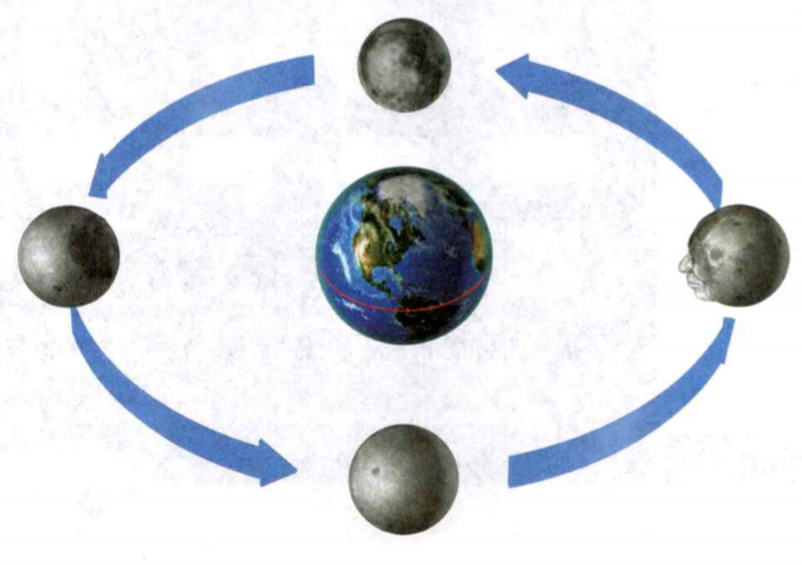

### Earth Science

## Astronomy

## Earth, Moon, and Sun

To **rotate** is to spin in place around a central line, or axis.

The **equator** is the imaginary line that divides Earth into two halves, the
**Northern Hemisphere** and the **Southern Hemisphere**.

**Complete the tasks below.**

1. Santiago is studying a globe. He sees that Earth has North and South poles.
The globe **rotates** around a line through its center between the two poles.
Another line called the **equator** divides Earth into two halves, the Northern
Hemisphere and the Southern Hemisphere. Where is the equator found?

2. Identify the sentence below that uses the scientific meaning of force.
A) The force of gravity holds objects in their orbits.
B) Her parents are trying to force her to get a job.

### Chapter Preview

- satellite 
- planet 
- meteor 
- comet 
- star 
- constellation
- axis 
- rotation	
- revolution
- orbit 
- calendar 
- solstice
- equinox
- force	
- gravity
- law of universal gravitation 
- mass 
- weight 
- inertia 
- Newton's first law of motion
- phase 
- eclipse
- solar eclipse
- umbra 
- penumbra
- lunar eclipse
- tide	
- spring tide
- neap tide
- maria	
- crater
- meteoroid

### The Sky From Earth
- What Can You See in the Night Sky?
- How Do Objects in the Sky Appear to Move?

**Complete the tasks below.**

1. Watching the Stars. When you look up at the night sky, what questions do you
ask yourself? Do you wonder why the stars seem to move, or why the moon shines?
Aryabhata was an early Indian astronomer who thought about these questions. He
was born in India in A.D. 476. Many historians think that Aryabhata realized
that the stars appear to move from east to west because Earth rotates from west
to east. He also wrote that the moon and the planets shine because they reflect
light from the sun. And he made all these inferences using just his eyes and his
mind. The first telescopes wouldn't come along for more than a thousand years!
a) What did Aryabhata infer about the motion of Earth?
b) What questions do you think about when you look at stars, the moon, or the
planets?

### What Can You See in the Night Sky?

Depending on how dark the sky is where you are, you might se 2,000 or 3,000
stars using just your eyes. **On a clear night, you may see stars, the moon,
planets; meteors, and comets.**

### Moon 

About half of every month, Earth's moon outshines everything else in the
night sky. The moon is Earth's only natural satellite. A satellite is a body
that orbits a planet.

### Planets
You may See objects that move from night to night against the background stars.
These are planets. A **planet** is an object that orbits the sun, is large
enough to have become rounded by its own gravity, and has cleared the area of
its orbit. There are eight planets in the solar system. Five are visible from
Earth without a telescope: Mercury, Venus, Mars, Jupiter, and Saturn.

### Stars 

Stars appear as tiny points of light. However, scientists infer that a **star**
is a giant ball of hot gas, mainly composed of hydrogen and helium. As seen from
Earth, the positions of stars relative to each other do not seem to change.

### Meteors and Comets 

Have you ever seen a "shooting star"? These sudden bright streaks are called
**meteors**. A meteor is the streak of light produced when a small object burns
up entering Earth's atmosphere. You can see a meteor on almost any night. Comets
are rarer. A **comet** is a cold mixture of dust and ice that gives off a long
trail of light as it approaches the sun.

### Constellations 

For thousands of years humans have seen patterns in groups of stars and given
names to them. **A constellation is a pattern or group of stars that people
imagined to represent a figure, animal, or object.** Astronomers also use the
word constellation for an area of the sky and all the objects in that area.

Different cultures have identified different constellations. In Western culture,
there are 88 constellations. Most constellation names used today come from the
ancient Greeks, who probably took them from the Egyptians and Mesopotamians.

Some constellations' names come from Latin. The constellation Leo, for example,
is named from the Latin word meaning "lion!' Some constellations are named for
people or animals in Greek myths. You may have read some of these myths in
school. Do the names Pegasus or Perseus sound familiar? They are mythological
characters and also constellations.

### How to Use a Star Chart
To use a star chart at night, follow these steps.
1. Choose the chart in Figure 1 that fits your location and season. This is a
summer chart for the Northern Hemisphere. 
2. Hold the chart upright in front of you. Turn the chart so the label at the
bottom matches the direction you face. (Hint: If you are looking at the Big
Dipper, you are looking north.)
3. Hold the chart at eye level. Compare the figures on the bottom half of the
chart to the sky in front of you.

  <figure>
    
    <figcaption>Figure 1. How to Use a Star Chart.</figcaption>
  </figure>

### Finding Constellations 

A star chart, like the one shown in Figure 1, can help you find constellations
in the night sky. Read the instructions for how to use the chart. It may seem a
little strange at first, but with some practice, these charts are easy to use.
Here is one tip to help you get started.

You can probably recognize the Big Dipper. This group of stars is actually not a
constellation itself. It is part of the constellation Ursa Major, or the Great
Bear. The two stars at the end of the dipper's "bowl" are called the Pointers.

Picture an imaginary line between those two stars. If you continue it away from
the "bowl," the first fairly bright star you'll reach is called Polaris. Polaris
is commonly called the North Star. It is located close to the sky's North Pole.

  <figure>
    
    <figcaption>Figure 2. Constellation pictures.</figcaption>
  </figure>

### How Do Objects in the Sky Appear to Move?

Stars, planets, and other objects appear to move over time. They do move in
space, but those actual motions and their apparent, or visible, motions may be
very different. **The apparent motion of objects in the sky depends on the
motions of Earth.**

### Star Motions 

Stars generally appear to move from east to west through the night. As Aryabhata
thought, this apparent motion is actually caused by Earth turning from west to
east. The sun's apparent motion during the day is also caused by Earth's motion.
Figure 3 shows how this kind of apparent motion occurs.

### Seasonal Changes 

Constellations and star patterns remain the same year after year, but which ones
you can see varies from season to season. For example, you can find Orion in the
eastern sky on winter evenings. But by spring, you'll see Orion in the west,
disappearing below the horizon shortly after sunset.

These seasonal changes are caused by Earth's orbit around the sun. Each night,
the position of most stars shifts slightly to the west. Soon you no longer see
stars once visible in the west, and other stars appear in the east.

There are a few constellations that you can see all year long. These are the
ones closest to the North Star. As Earth rotates, these constellations never
appear to rise or set.

  <figure>
    
    <figcaption>Figure 3. Opposite Motions.</figcaption>
  </figure>

### Planets 

Planets appear to move against the background of stars, as shown in Figure 4.
Because the planets all orbit the sun in about the same plane, they appear to
move through a narrow band in the sky. This band is called the zodiac. It
includes constellations such as Taurus, Leo, and Virgo.

Some planets, when they are visible, can be seen all night long. Mars, Jupiter,
and Saturn are all farther from the sun than Earth is. Sometimes, Earth passes
between them and the sun. When this occurs, the planets are visible after
sunset, once the sun's bright light no longer blocks the view.

You can see Venus and Mercury only in the evening or morning. They are closer to
the sun than Earth, and so they always appear close to the sun. Venus is the
brightest object in the night sky, other than the moon. Mercury appears low in
the sky and is visible for a limited time around sunrise or sunset.

  <figure>
    
    <figcaption>Figure 4. Tracking the Planets.</figcaption>
  </figure>

**Complete the tasks below.**

1. Find the constellations from Figure 2 in Figure 1. Then write each
constellation's name by its picture.
a) __
b) __
c) __
d) __ 
e) Choose another constellation from Figure 1. What does it represent? Do
research to find out.

2. Objects visible in the night sky include ___ .

3. Opposite Motions, see Figure 3. The restaurant on top of Seattle's Space
Needle rotates much as Earth does. The restaurant turns in one direction, which
makes objects outside appear to move in the opposite direction. Draw the
mountain as it would appear at each time shown.

4. Tracking the Planets, see Figure 4.
Each night, the planets appear in a slightly different place than they did the
night before. The planets appear to move through the zodiac. Predict The diagram
shows three positions of Mars. Draw where you would expect to see Mars in Week 7
and Week 9.

5. Objects in the sky appear to move from ___ to ___ because Earth turns from
___ to ___ .

6. What determines whether a planet is visible all night long?

### Earth in Space
- How Does Earth Move? 
- What Causes Seasons?

**Complete the tasks below.**

1. The Seasons. **Misconception:** The seasons change because Earth's distance
from the sun changes. **Fact:** Seasons are the result of Earth's tilted axis.
**Evidence:** Earth's distance from the sun does change, but that's not why
Earth has seasons. If that were the cause, people in the Northern and Southern
hemispheres would have the same seasons at the same time. Instead, seasons in
the Northern and Southern hemispheres are reversed. As Earth moves around the
sun, sometimes the Northern Hemisphere is tilted toward the sun. At other times
the Southern Hemisphere is tilted toward the sun.
a) Why are summers generally warmer than winters?
b) Where on Earth is the tilt of Earth least likely to affect seasons? Why?

### How Does Earth Move?

Until a few hundred years ago, most people thought that Earth stood still and
the sun, moon, and stars moved around it. But today, scientists know that Earth
itself moves and that objects seem to move across the sky because of Earth's
motion. **Earth moves in space in two major ways: rotation and revolution.**

### Rotation 

The imaginary line that passes through Earth's center and the North and South
poles is Earth's **axis**. The spinning of Earth on its axis is called **rotation**.

Earth's rotation causes day and night, as you can see in Figure 1. As Earth
rotates eastward, the sun appears to move west across the sky. As Earth
continues to turn to the east, the sun appears to set in the west. Sunlight
can't reach the side of Earth facing away from the sun, so it is night there. It
takes Earth about 24 hours to rotate once. As you know, each 24-hour cycle of
day and night is called a day.

  <figure>
    
    <figcaption>Figure 5. Earth Rotation.</figcaption>
  </figure>

### Revolution 

In addition to rotating, Earth travels around the sun. **Revolution** is the
movement of one object around another. One revolution of Earth around the sun is
called a year. Earth's path, or **orbit**, is a slightly elongated circle, or
ellipse. Earth's orbit brings the planet closest to the sun in January.

  <figure>
    
    <figcaption>Figure 6. The History of the Calendar.</figcaption>
  </figure>

### Calendars 

People of many cultures have divided time based on the motions of Earth and the
moon. They have used the motions to establish calendars. A **calendar** is a system
of organizing time that defines the beginning, length, and divisions of a year.

The most common calendar today is divided into years, months, and days. One year
equals the time it takes Earth to complete one orbit. One day equals the time it
takes Earth to turn once on its axis. People also divide the year into months
based on the moon's cycle. The time from one full moon to another is about 29
days, though modern months do not match the moon's cycle exactly.

### Egyptian

The ancient Egyptians created one of the first calendars. Based on star motions,
they calculated that the year was about 365 days long. They divided the year
into 12 months of 30 days each, with an extra 5 days at the end.

### Roman

The Romans borrowed the Egyptian calendar. But Earth's orbit
actually takes about 3651/4 days. The Romans adjusted the
Egyptian calendar by adding one day every four years. You know
this fourth year as "leap year," when February is given 29 days
instead of its usual 28. Using leap years helps to ensure that
annual events, such as the beginning of summer, occur on the pi same date each year.

### Gregorian

The Roman calendar was off by a little more than 11 minutes a year. Over the
centuries, these minutes added up. By the 1500s, the beginning of spring was
about ten days too early. To straighten things out, Pope Gregory XIII dropped
ten days from the year 1582. He also made some other minor changes to the Roman
system to form the calendar that we use today.

### What Causes Seasons?

Many places that are far from Earth's equator and its poles have four distinct
seasons: winter, spring, summer, and autumn. But there are differences in
temperature from place to place. For instance, it is generally warmer near the
equator than near the poles. Why?

### How Sunlight Hits Earth 

Figure 7 shows how sunlight strikes Earth's surface. Notice that, near the
equator, sunlight hits Earth's surface from almost overhead. Near the poles,
sunlight arrives at a steep angle. As a result, it is spread out over a greater
area. That's why it is warmer near the equator than near the poles.

  <figure>
    
    <figcaption>Figure 7. Sunlight on Earth.</figcaption>
  </figure>

### Earth's Tilted Axis 

If Earth's axis were straight up and down relative to its orbit, temperatures in
an area would remain fairly constant year-round. There would be no seasons.
**Earth has seasons because its axis is tilted as it revolves around the sun.**

Notice in Figure 8 that Earth's axis is always tilted at an angle of 23.5° from
the vertical. The North Pole always points in the same direction. As Earth
revolves around the sun, the north end of its axis is tilted away from the sun
for part of the year and toward the sun for part of the year. Summer and winter
are caused by Earth's tilt as it revolves around the sun.

  <figure>
    
    <figcaption>Figure 8. Seasons.</figcaption>
  </figure>

### December 

In December, people in the Southern Hemisphere receive the most direct sunlight,
so it is summer. At the same time, the sun's rays in the Northern Hemisphere are
more slanted and there are fewer hours of daylight. So it is winter in the
Northern Hemisphere.

### June 
In June, the north end of Earth's axis is tilted toward the sun. In the Northern
Hemisphere, the noon sun is high in the sky and there are more hours of daylight
than darkness. The sun's rays are concentrated. It is summer in the Northern
Hemisphere.

At the same time south of the equator, the sun's energy is spread over a larger
area. The sun is low in the sky and days are shorter than nights. It is winter
in the Southern Hemisphere.

  <figure>
    
    <figcaption>Figure 9. Solstices and Equinoxes.</figcaption>
  </figure>

### Solstices 

The sun appears farthest north of the equator once each year and farthest south once each year. Each of these days is known as a solstice (soHL stis). The day when the sun appears farthest north is the summer solstice in the Northern Hemisphere and the winter solstice in the Southern Hemisphere. This solstice occurs around June 21 each year. It is the longest day of the year in the Northern Hemisphere and the shortest day in the Southern Hemisphere. As you can see in Figure 5, the sun rises to the northeast and sets to the northwest.
Similarly, around December 21, the sun appears farthest south. This is the winter solstice in the Northern Hemisphere and the summer solstice in the Southern Hemisphere. The sun rises to the southeast and sets to the southwest.
Equinoxes Halfway between the solstices, neither hemisphere is tilted toward the sun. The noon sun is directly overhead at the equator, rises due east, and sets due west. Each of these days is known as an equinox, which means "equal night." During an equinox, day and night are each about 12 hours long everywhere. The vernal (spring) equinox occurs around March 21 and marks the beginning of spring in the Northern Hemisphere. The fall, or autumnal, equinox occurs around September 22. It marks the beginning of fall in the Northern Hemisphere.

**Complete the tasks below.**

1. Earth Rotation, see Figure 5. 
a) Draw an arrow to show the direction in which Earth rotates. 
b) Draw a line separating day from night.
c) In which city will the sun set next?
d) Where on Earth is it noon? Midnight?

2. The History of the Calendar, see Figure 6. Which calendar discussed in this
Figure was developed most recently?

3. What are the two major motions of Earth as it travels through space?

4. Which motion causes day and night?

5. Why do people use Earth's motions to determine units of time?

6. Sunlight on Earth, see Figure 7. The diagram shows how Earth's tilted axis
affects the strength of sunlight in different places. Near the equator, sunlight
does not spread very far. The sun's energy is concentrated in a smaller area.
Near the poles, the same amount of sunlight spreads over a greater area.
a) Identify the area where sunlight is most direct. 
b) Identify the places that sunlight reaches, but where it is less direct.

7. Seasons, see Figure 8. The diagram shows how Earth moves during the year. It
is not drawn to scale. Describe the weather and sunlight in the Northern and
Southern hemispheres in March and September.

8. Solstices and Equinoxes, see Figure 9. The diagrams show the apparent path of
the sun at the solstices and equinoxes in the Northern Hemisphere. The sun rises
and sets farthest north at the June solstice and farthest south at the December
solstice. Draw the sun's path at the equinoxes and the December solstice for the
Southern Hemisphere.

  <figure>
    
    <figcaption>Figure 10. Hours of Daylight.</figcaption>
  </figure>

9. Calculating Percents. The table in Figure 10 shows the number of hours of
sunlight in three cities at different times of year. What percentage of a
24-hour day has sunlight in Guadalajara on January 1? Step 1: Divide the number
of hours of sunlight by the total number of hours. Hours of sunlight/Total hours
= 10.90 hours / 24 hours = 0.45 Step 2: Multiply by 100 to find the percent.
0.45 x 100 = 45% In Guadalajara, 45% of a 24-hour day has sunlight on January 1.
a) What percentage of a day has sunlight in Helsinki on July 1?
b) What is the difference in the percentage of the day that has sunlight in
Helsinki and in Philadelphia on January 1?
c) What percentage of the day would you expect to have sunlight at the equator
in January? 
d) What percentage of the day would you expect to have sunlight at the equator
in June? 

10. The noon sun is directly overhead at the equator during (a solstice/an
equinox).

11. What causes the seasons?

12. How would the seasons be different if Earth were not tilted on its axis?
Explain.

### Gravity and Motion

- What Determines Gravity? 
- What Keeps Objects in Orbit?

**Complete the tasks below.**

1. Gravity Assists. You might think that gravity only brings objects down. But
gravity can also speed things up and send them flying! If a space probe comes
close to a planet, the planet's gravity changes the probe's path. Engineers plan
space mission's to take advantage of these "gravity assists." A gravity assist
can shorten the probe's interplanetary trip by many years. The diagram in Figure
11 shows how the probe Voyager 2 used gravity assists to visit all four outer
planets! How does a planet's gravity change the path of a space probe?

  <figure>
    
    <figcaption>Figure 11. Voyager 2.</figcaption>
  </figure>

## What Determines Gravity?

Earth revolves around the sun in a nearly circular orbit. The moon orbits Earth
in the same way. But what keeps Earth and the moon in orbit? Why don't they just
fly off into space?

The first person to answer these questions was the English scientist Isaac
Newton. In the 1600s, Newton realized that there must be a force acting between
Earth and the moon that kept the moon in orbit. A **force** is a push or a pull.

### Gravity 

Newton hypothesized that the force that pulls an apple to the ground also pulls
the moon toward Earth, keeping it in orbit. This force, called **gravity**,
attracts all objects toward each other. Newton's **law of universal
gravitation** states that every object in the universe attracts every other
object. **The strength of the force of gravity between two objects depends on
two factors: the masses of the objects and the distance between them.**

### Gravity, Mass, and Weight 

The strength of gravity depends in part on the masses of each of the objects.
**Mass** is the amount of matter in an object. Because Earth is so massive, it
exerts a much greater force on you than this book does.

The measure of the force of gravity on an object is called **weight**. Mass
doesn't change, but an object's weight can change depending on its location. On
the moon, you would weigh about one sixth as much as on Earth. This is because
the moon has less mass than Earth, so the pull of the moon's gravity on you
would also be less.

### Gravity and Distance 

Gravity is also affected by the distance between two objects. The force of
gravity decreases rapidly as distance increases. If the distance between two
objects doubles, the force of gravity decreases to one fourth of its original
value.

  <figure>
    
    <figcaption>Figure 12. Gravity, Mass, and Distance.</figcaption>
  </figure>

You could say we owe our understanding of gravity to disease! In 1665, Isaac
Newton was a student. Then a disease called plague shut down the university for
18 months. Newton had to go home. While he was there, he thought of the ideas
that led to his theory. (But it may not be true that he got the idea when an
apple fell from a tree.)

### What Keeps Objects in Orbit?

If the sun and Earth are constantly pulling on one another because of gravity,
why doesn't Earth fall into the sun? Similarly, why doesn't the moon crash into
Earth? The fact that such collisions have not occurred shows that there must be
another factor at work. That factor is called inertia.

### Inertia 

The tendency of an object to resist a change in motion is **inertia**. You feel the
effects of inertia every day. When you are riding in a car and it stops
suddenly, you keep moving forward. If you didn't have a seat belt on, your
inertia could cause you to bump into the car's windshield or the seat in front
of you. The more mass an object has, the greater its inertia. An object with
greater inertia is more difficult to start or stop.

Isaac Newton stated his ideas about inertia as a scientific law. **Newton's first
law of motion** says that an object at rest will stay at rest and an object in
motion will stay in motion with a constant speed and direction unless acted on
by a force.

### Orbital Motion 

Why do Earth and the moon remain in orbit? **Newton concluded that inertia and
gravity combine to keep Earth in orbit around the sun and the moon in orbit
around Earth.** You can see how this occurs in Figure 13.

  <figure>
    
    <figcaption>Figure 13. Orbital Motion.</figcaption>
  </figure>

**Complete the tasks below.**

1. Gravity, Mass, and Distance, see Figure 12. Draw arrows showing the force of
gravity in the second a) and third b) pictures. The longer the arrow, the
greater the force.

2. Orbital Motion, see Figure 13. Earth's gravity pulls the moon inward,
preventing it from moving in a straight line. But the moon keeps moving ahead
because of its inertia. Without Earth's gravity, the moon would move off in a
straight line. Similarly, Earth orbits the sun because the sun's gravity pulls
on it while Earth's inertia keeps it moving ahead. How would the moon move if
Earth's mass increased? 

  <figure>
    
    <figcaption>Figure 14. Gravity and Distance.</figcaption>
  </figure>

3. Gravity Versus Distance, see Figure 14. As a rocket leaves a planet's
surface, the force of gravity between the rocket and the planet changes. Use the
graph to answer the questions below.
a) Graphs The variables being graphed are __ and __ .
b) What is the force of gravity on the rocket at the planet's surface?
c) What is the force of gravity
on the rocket at two units (twice the planet's radius from its center)?
d) In general, how does the force of gravity on the rocket change as its
distance from the planet increases?

4. What two factors keep a planet in orbit around the sun?

5. What keeps Earth from falling into the sun?

6. How would a planet move if the sun suddenly disappeared? Explain.

### Phases and Eclipses
- What Causes the Moon's Phases? 
- What Are Eclipses?

**Complete the tasks below.**

1. One night, my mom, dad, and I were coming home from eating dinner. When we got
out of the car, we saw that the moon was turning red. We looked at the moon for
a while. Then our neighbor called and said that it was a lunar eclipse. It was
an amazing sight. What is the most interesting or unusual event you have ever
seen in the sky?

### What Causes the Moon's Phases?

Have you ever been kept awake by bright moonlight? The light streaming through
your window actually comes from the sun! The moon does not shine with its own
light. Instead, it reflects light from the sun. When the moon is full, this
light may be bright enough to read by! But at other times, the moon is just a
thin crescent in the sky. The different shapes of the moon you see from Earth
are called **phases**. Phases are caused by the motions of the moon around Earth.

### Motions of the Moon 

When you look up at the moon, you may see what looks like a face. What you are
really seeing is a pattern of light-colored and dark-colored areas on the moon's
surface that just happens to look like a face. Oddly, this pattern never seems
to move. The same side of the moon, the "near side," always faces Earth. The
"far side" of the moon always faces away from Earth. Why? The answer has to do
with the moon's motions.

Like Earth, the moon moves through space in two ways. The moon revolves around
Earth and also rotates on its own axis. The moon rotates once on its axis in the
same time that it takes to revolve once around Earth. Thus, a "day" on the moon
is the same length as a month on Earth. For this reason, the same side of the
moon always faces Earth, as you can see in Figure 15.

As the moon orbits Earth, the relative positions of the moon, Earth, and sun
change. **The changing relative positions of the moon, Earth, and sun cause
the phases of the moon.**

  <figure>
    
    <figcaption>Figure 15. The Moon's Motion.</figcaption>
  </figure>

### Phases of the Moon 

Half the moon is almost always in sunlight. But since the moon orbits Earth, you
see the moon from different angles. The phase of the moon you see depends on how
much of the sunlit side of the moon faces Earth. 

During the new moon phase, the side of the moon facing Earth is not lit. As the
moon revolves around Earth, you see more of the lit side of the moon, until you
see all of the lit side. As the month continues, you see less of the lit side.
You can see these changes in Figure 16. About 29.5 days after the last new moon,
a new moon occurs again.

  <figure>
    
    <figcaption>Figure 16. Moon Phases.</figcaption>
  </figure>

### What Are Eclipses?
The moon's orbit around Earth is slightly tilted with respect to Earth's orbit
around the sun. As a result, the moon travels above and below Earth's orbit. But
on rare occasions, Earth, the moon, and the sun line up.

When an object in space comes between the sun and a third object, it casts a
shadow on that object, causing an **eclipse** to take place. There are two types of
eclipses: solar eclipses and lunar eclipses. (The words solar and lunar come
from the Latin words for "sun" and "moon.)

### Solar Eclipses 

During a new moon, the moon lies between Earth and the sun. **A solar eclipse
occurs when the moon passes directly between Earth and the sun, blocking
sunlight from Earth. The moon's shadow then hits Earth.**

### Total Solar Eclipses 

The very darkest part of the moon's shadow is the **umbra**. You can see how the
umbra strikes Earth in Figure 3. Within the umbra, the sun's light is completely
blocked. Only people within the umbra experience a total solar eclipse. During a
total solar eclipse, the sky grows as dark as night. The air gets cool and the
sky becomes an eerie color. You can see the stars and the solar corona, which is
the faint outer atmosphere of the sun.

### Partial Solar Eclipses 

The moon casts another part of its shadow that is less dark than the umbra. This
larger part of the shadow is called the **penumbra**. In the penumbra, part of
the sun is visible from Earth. During a solar eclipse, people in the penumbra
see only a partial eclipse.

  <figure>
    
    <figcaption>Figure 17. Solar Eclipse.</figcaption>
  </figure>

### Lunar Eclipses 

During most months, the moon moves near Earth's shadow but not quite into it. A
**lunar eclipse** occurs at a full moon when Earth is directly between the moon and
the sun. You can see a lunar eclipse in Figure 18. in During a lunar eclipse,
Earth blocks sunlight from reaching the moon. Lunar eclipses occur only when
there is a full moon because the moon is closest to Earth's shadow at that time.

  <figure>
    
    <figcaption>Figure 18. Lunar Eclipse.</figcaption>
  </figure>

### Total Lunar Eclipses 

Like the moon's shadow in a solar eclipse, Earth's shadow has an umbra and a
penumbra. When the moon is in Earth's umbra, you see a total lunar eclipse.
Unlike a total solar eclipse, a total lunar eclipse can be seen anywhere on
Earth that the moon is visible. So you are more likely to see a total lunar
eclipse than a total solar eclipse.

### Partial Lunar Eclipses 

For most lunar eclipses, Earth, the moon, and the sun are not quite in line, and
only a partial lunar eclipse results. A partial lunar eclipse occurs when the
moon passes partly into the umbra of Earth's shadow. The edge of the umbra
appears blurry, and you can watch it pass across the moon for two or three
hours.

  <figure>
    
    <figcaption>Figure 19. Earth, the moon, and the sun.</figcaption>
  </figure>

**Complete the tasks below.**

1. Which sentence uses the scientific meaning of phase?
A) The doctor told the parent that the child was just going through a phase.
B) The moon goes through a cycle of phases every month.

2. The Moon's Motion, see Figure 15. The diagram shows the moon's rotation and
revolution.	
a) Find the face on the rightmost view of the moon. Draw the face as it would
appear on each view.
b) How would the moon appear from Earth if the moon did not rotate?

3. Describe a way to model the moon's phases using items you might have at home.

4. Moon Phases, see Figure 16. As the moon revolves around Earth, the amount of
the moon's surface that is lit remains the same. The part of the lit surface
that can be seen from Earth changes. Match each photo to its phase shown on the
diagram. Write the number of the phase.
a) Phase number:
b) Phase number:
c) Phase number:
d) Phase number:
e) Phase number:

5. Solar Eclipse, see Figure 17. The diagram shows the moon's penumbra and umbra
during an eclipse. It is not drawn to scale.
a) Mark an X to show where a total solar eclipse would be visible. 
b) Circle the area in which a partial solar eclipse would be visible.

6. Lunar Eclipse, see Figure 18. As the moon moves through Earth's shadow, total
and partial eclipses occur. This diagram is not to scale.
a) Draw a circle labeled T to show where the moon would be during a total
eclipse. 
b) Draw two circles labeled P to show two places the moon could be during a
partial eclipse.
c) Identify the photograph that shows a total eclipse.

7. How do Earth, the moon, and the sun interact? Look at the diagram in Figure
19. (The diagram is not to scale.) Identify 
a) what season it is in the Northern Hemisphere
b) what the phase of the moon is, and 
c) what kind of eclipse, if any, could occur.

7. How do Earth, the moon, and the sun interact? Look at the diagram in Figure
19. (The diagram is not to scale.) Use the diagram as a model. Draw the
arrangement of Earth, the moon, and the sun during a total lunar eclipse in
December.

8. A (solar/lunar) eclipse occurs when the moon passes into Earth's shadow. 

9. A (solar/lunar) eclipse occurs when Earth passes into the moon's shadow.

10. How do Earth, the moon, and the sun interact?

### Tides
- What Are Tides?

**Complete the tasks below.**

1. A River in Reverse. If you were visiting New Brunswick in Canada, you might
see the Saint John River flowing into the ocean. But six hours later, you might
find that the river changed direction while you were gone! How could this
happen? The Saint John River really does reverse course twice a day. At low
tide, it empties into the Bay of Fundy, shown below. At high tide, the Bay of
Fundy's tide pushes into the river, forcing the river to run in the opposite
direction. The Bay of Fundy's tides are among the highest in the world.
a) Why does the Saint John River change direction?
b) Have you ever seen a natural event that surprised you? Why was it surprising?

### What Are Tides?

The reversing Saint John River is caused by ocean **tides**, the rise and fall
of ocean water that occurs every 12.5 hours or so. The water rises for about six
hours, then falls for about six hours.

### The Tide Cycle 

The force of gravity pulls the moon and Earth (including the water on Earth's
surface) toward each other. **Tides are caused mainly by differences in how much
gravity from the moon and the sun pulls on different parts of Earth.**

At any one time on Earth, there are two places with high tides and two places
with low tides. As Earth rotates, one high tide occurs on the side of Earth that
faces the moon. The second high tide occurs on the opposite side of Earth.
Figure 29 explains why.

  <figure>
    
    <figcaption>Figure 20. Tides.</figcaption>
  </figure>

### Tides
You can think of Earth as a ball surrounded by a layer of water, as shown here.
The layer is really much thinner than this, but is drawn thicker so it is easier
to see.

### The Near Side 

The moon's gravity pulls a little more strongly on the water on the side closest
to the moon than on Earth as a whole. This difference causes a bulge of water on
the side of Earth closest to the moon. This bulge causes high tide.

### The Far Side 

The moon's gravity pulls more weakly on the water on the far side of Earth than
on Earth as a whole. Since Earth is pulled more strongly, the water is "left
behind." Water flows toward the far side, causing high tide. Halfway between the
high tides, water flows toward the high tides, causing low tide.

### The Sun's Role 

Even though the sun is about 150 million kilometers from Earth, it is so massive
that its gravity affects the tides. The sun pulls the water on Earth's surface
toward it. **Changes in the positions of Earth, the moon, and the sun affect the
heights of the tides during a month.**

### New Moon

The sun, the moon, and Earth are nearly in a line during a new moon. The gravity
of the sun and the moon pull in the same direction. Their combined forces
produce a tide with the greatest difference between consecutive low and high
tides, called a **spring tide**. The term "spring tide" comes from an Old English
word, springen, meaning "to jump."

### First Quarter

During the moon's first-quarter phase, the line between Earth and the sun is at
right angles to the line between Earth and the moon. The sun's pull is at right
angles to the moon's pull. This arrangement produces a **neap tide**, a tide with
the least difference between consecutive low and high tides. Neap tides occur
twice a month.

### Full Moon

At full moon, the moon and the sun are on opposite sides of Earth. Since there
are high tides on both sides of Earth, a spring tide is also produced. It
doesn't matter in which order the sun, Earth, and the moon line up.

  <figure>
    
    <figcaption>Figure 21. The Sun's Role.</figcaption>
  </figure>

  <figure>
    
    <figcaption>Figure 22. High and Low Tides.</figcaption>
  </figure>

**Complete the tasks below.**

1. Identify the causes of high and low tides.

2. Tides, see Figure 20. You can think of Earth as a ball surrounded by a layer
of water, as shown here. The layer is really much thinner than this, but is
drawn thicker so it is easier to see.
a) Identify where high tides occur 
b) Idenitfy where low tides occur.

3. The Sun's Role, see Figure 21. 
a) Draw the position of the moon and the tide bulges at third quarter. 
b) What kind of tide occurs?

4. The table in Figure 22 shows high and low tides at four times in May 2008, in
St. John, New Brunswick. St. John is on the Bay of Fundy.
a) Spring tides occurred at two of the times shown. Which two? How do you know?
b) Would the tide be higher when the moon is on the same side of Earth as New
Brunswick or on the opposite side? Why?

5. Most coastal areas have ___ high tides and ___ low tides each day.

6. What causes tides? 

7. What is the angle formed by the sun, Earth, and the moon during 
a) a neap tide? 
b) a spring tide?

8. Does a spring tide always happen in the season of spring? Explain your
answer.

### Earth's Moon
- What Is the Moon Like?

**Complete the tasks below.**

1. Galileo Galilei. In 1609, the Italian astronomer Galileo Galilei turned a new
tool—the telescope—toward the moon. What he saw amazed him: wide dark areas and
strange spots and ridges. "I have been led to that opinion ... that I feel sure
that the surface of the moon is not perfectly smooth but that on the contrary it
is ... just like the surface of the earth itself which is very good everywhere
by high mountains and deep valleys." Today, scientists know that Galileo was
right. Powerful telescopes have shown the mountains and craters on the moon, and
astronauts have walked and driven over the moon's surface.
a) What conclusions did Galileo draw about the moon?
b) How do you think it would feel to make an observation that no one had made
before?

### What Is the Moon Like?

For thousands of years, people could see the moon, but didn't know much about
it. Galileo's observations were some of the first to show details on the moon's
surface. Scientists have since learned more about the moon's features. **The
moon is dry and airless and has an irregular surface. Compared to Earth, the
moon is small and has large variations in its surface temperature.**

### Surface Features 

As Figure 23 shows, the moon has many unusual structures, including maria,
craters, and highlands.

  <figure>
    
    <figcaption>Figure 23. Moon Features.</figcaption>
  </figure>

### Maria 

Dark, flat areas, called maria, are hardened rock formed from huge lava flows
that occurred 3-4 billion years ago. The singular form of maria is mare.

### Craters 

Large round pits called **craters** can be hundreds of kilometers across. These
craters were caused by the impacts of **meteoroids**, chunks of rock or dust
from space. Maria have relatively few craters. This means that most of the
moon's craters formed from impacts early in its history, before maria formed.

### Highlands 

Some of the light-colored features you can see on the moon's surface are
highlands, or mountains. The peaks of the lunar highlands and the rims of the
craters cast dark shadows. The highlands cover most of the moon's surface.

### Size and Density 

The moon is 3,476 kilometers across, a little less than the distance across the
United States. This is about one fourth of Earth's diameter. However, the moon
has only one eightieth as much mass as Earth. Though Earth has a very dense
core, its outer layers are less dense. The moon's average density is similar to
the density of Earth's outer layers. Its gravity is about one sixth of Earth's.

### Temperature 

At the moon's equator, temperatures range from a torrid 130°C in direct sunlight
to a frigid —170°C at night. Temperatures at the poles are even colder.
Temperatures vary so much because the moon does not have an atmosphere. The
moon's surface gravity is so weak that gases can easily escape into space.

### Water 

For many years, people thought the moon had no water, except for small amounts
of ice. In 2009, scientists using data from several space probes determined that
a thin layer of water exists in the moon's soil. The total amount of water is
very small, but it is found in many places on the moon's surface.

### Origins of the Moon 

Scientists have suggested many possible theories for how the moon formed. The
theory that seems to best fit the evidence is called the collision-ring theory.
About 4.5 billion years ago, when Earth was very young, the solar system was
full of rocky debris. Scientists theorize that a planet-sized object collided
with Earth. Material from the object and Earth's outer layers was ejected into
orbit around Earth, where it formed a ring. Gravity caused this material to
clump together to form the moon.

  <figure>
    
    <figcaption>Figure 24. Earth and Moon.</figcaption>
  </figure>

**Complete the tasks below.**

1. Complete the table in Figure to compare and contrast Earth and the moon.
a) Earth Density:
b) Moon Density:
c) Earth Temperatures:
d) Moon Temperatures:
e) Earth Atmosphere:
f) Moon Atmosphere:
g) Earth Water:
h) Moon Water:

2. Within your lifetime, tourists may be able to travel to the moon. If you were
taking a trip to the moon, what would you pack? Remember that the moon is dry,
has almost no liquid water, and has no atmosphere.
a) Make a packing list, list five items you would need on the moon.
b) List two items that you could not use on the moon. Why would they not work?

3. What are the three main surface features on the moon?

4. How does the moon's gravity compare with Earth's?

5. Write a hypothesis explaining why the moon has very little liquid water.

6. Interactions between Earth, the moon, and the sun cause ___, ___, ___ and ___ .

### Study Guide

- On a clear night, you may see stars, the moon, planets, meteors, and comets.
- A constellation is a pattern or grouping of stars imagined by people to
represent figures.
- The apparent motion of objects in the sky depends on the motions of Earth. M
Earth moves in space in two major ways: rotation and revolution.
- Earth has seasons because its axis is tilted as it revolves around the sun.
- The strength of the force of gravity between two objects depends on two
factors: the masses of the objects and the distance between them.
- Newton concluded that inertia and gravity combine to keep Earth in orbit
around the sun and the moon in orbit around Earth.
- The changing relative positions of the moon, Earth, and sun cause the phases
of the moon.
- A solar eclipse occurs when the moon passes directly between Earth and the
sun, blocking sunlight from Earth. During a lunar eclipse, Earth blocks sunlight
from reaching the moon.
- Tides are caused by differences in how much gravity from the moon and the sun
pulls on different parts of Earth.
- Changes in the positions of Earth, the moon, and the sun affect the heights of
the tides during a month.
- The moon is dry and airless and has an irregular surface. Compared to Earth,
the moon is small and has large variations in its surface temperature.

**Complete the tasks below.**

1. Which of the following objects is found in Earth's atmosphere?
A) comet
B) meteor
C) moon
D) planet

2. Over time, people have given names to groups of stars, called ___ .

3. The constellation Orion appears in the eastern sky in December. Where would
you expect it to appear in March? Why?

4. Suppose you were camping on a summer night. Describe what objects yoL might
see in the sky and how the sky would change throughout the night.

5. What is Earth's annual motion around the sun called?
A) month
B) revolution
C) rotation
D) seasons

6. The ___ occurs when the sun is farthest north of the equator.

7. Mars's axis is tilted at about the same angle as Earth's axis. Do you think
Mars has seasons? Explain your answer.

8. Write a guide for younger , children explaining how Earth's motions are
related to the lengths of days and years. 

9. The tendency of an object to resist a change in motion is called
A) force.
B) gravity.
C) inertia.
D) weight.

10. An object is kept in orbit by ___ and ___ .

11. If you move two objects farther apart, how does the force of gravity between
the two objects change?

12. How are weight and mass different?

13. Explain Newton's first law of motion in your own words.

  <figure>
    
    <figcaption>Figure 25. Weight.</figcaption>
  </figure>

14. How much would the person in Figure 25 weigh on the moon?

15. The moon's shadow falling on Earth causes a
A) full moon.
B) lunar eclipse.
C) phase.
D) solar eclipse.

16. The darkest part of the moon's shadow is the ___ .

17. Why does the moon have phases? 	

18. Which occurs more often, a partial or a total lunar eclipse? Why?

19. About how long passes between high tides?
A) 6 hours
B) 12 hours
C) 24 hours
D) 48 hours

20. The least difference between high and low tides occurs during a ___ .

  <figure>
    
    <figcaption>Figure 26. Tide.</figcaption>
  </figure>

21. Does the diagram in Figure 26 show a spring or a neap tide? How do you know?
How do Earth, the moon, and the sun interact?

22. What caused the moon's craters?
A) maria
B) meteoroids
C) tides
D) volcanoes

23. The moon's light-colored highlands are ___ .

24. Why do temperatures vary so much on the moon? 	

25. Suppose you were hired to design a spacesuit for use on the moon. What
characteristics of the moon would be important for you to consider? Explain.

26. Can more people see a total solar eclipse or a total lunar eclipse? Explain
your answer.

  <figure>
    
    <figcaption>Figure 27. Eclipse.</figcaption>
  </figure>

27. Which of the following can occur when the moon is at location 1 in Figure 27?
A) only a lunar eclipse
B) only a solar eclipse
C) both a solar and a lunar eclipse
D) neither a solar nor a lunar eclipse

28. On what does the force of gravity between two objects depend?
A) mass and weight
B) speed and distance
C) weight and speed
D) mass and distance

29. What happens at a spring tide?
A) There is only one high tide each day.
B) There is only one low tide each day.
C) There is the most difference between consecutive high and low tides.
D) There is the least difference between consecutive high and low tides.

30. Which motion does Earth complete every 365 days?
A) eclipse
B) equinox 
C) revolution
D) rotation

31. The calendar we use is based on
A) the time it takes the moon to rotate once on its axis.
B) the time it takes Earth to complete one orbit.
C) the occurrence of a solar eclipse.
D) the length of each season.
5) 
  <figure>
    
    <figcaption>Figure 28. Sun's rays on Earth.</figcaption>
  </figure>

32. Use the diagram in Figure 28 to answer question. In the Northern Hemisphere,
is it the summer solstice, winter solstice, or one of the equinoxes? Explain how
you know.

