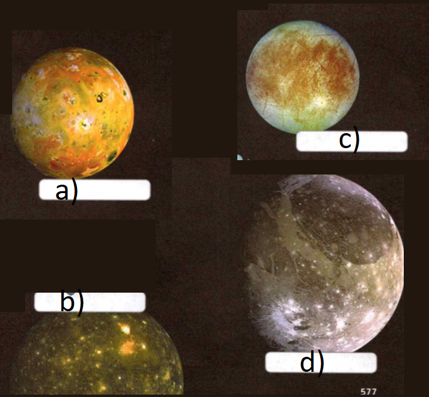

### Earth Science

## Astronomy

## The Solar System

**Revolution** is the motion of one object around another.

An object **rotates** when it spins around a central axis.

**Gravity** is the force that attracts all objects toward each other.

**Complete the tasks below.**

1. Tyrone is watching a movie. He sees astronauts explore a planet that revolves
around a star. As the astronauts travel, they notice that the planet rotates.
Tyrone knows that gravity holds the planet in orbit around the star. What causes
day and night on a planet?

2. Greek Word - Meaning - Example. hellos - sun - heliocentric, chromas - color -
chromosphere, sphaira - sphere - photosphere. Predict the meaning of
heliocentric.

### Chapter Preview

- geocentric 
- heliocentric
- ellipse
- solar system 
- astronomical unit
- planet 
- dwarf planet
- planetesimal
- core 
- nuclear fusion
- radiation zone 
- convection zone
- photosphere 
- chromosphere
- corona 
- solar wind 
- sunspot
- prominence 
- solar flare
- terrestrial planet
- greenhouse effect
- gas giant 
- ring
- asteroid belt 
- Kuiper belt
- Oort cloud 
- comet
- coma 
- nucleus 
- asteroid
- meteoroid 
- meteor 
- meteorite

### Models of the Solar System
- What Was the Geocentric Model?
- How Did the Heliocentric Model Develop?

**Complete the tasks below.**

1. Picturing the Solar System. When Walter Myers was seven years old, he found a
book with drawings of astronauts walking on the moons of Saturn. Ever since,
he's been making space pictures himself. At first, he used pencil. Today, he
works on computers. He likes using computers because he can create images that
are more like photographs, such as the ones below. As an artist, Mr. Myers can
show scenes that haven't been photographed, such as ideas for future spacecraft
and the views from another planet's moons. Mr. Myers especially likes creating
views of what human visitors to other planets might see. His work has appeared
in books, magazines, Web sites, and even on television!
a) What tool does Walter Myers use?
b) Why do people use art or other models to show objects in the solar system?

### What Was the Geocentric Model?

From here on Earth, it seems as if our planet is stationary and that the sun,
moon, and stars are moving around Earth. But is the sky really moving above you?
Centuries ago, before there were space shuttles or even telescopes, people had
no easy way to find out.

### Ancient Observations 

Ancient observers, including the Greeks, Chinese, and Mayans, noticed that the
patterns of the stars didn't change over time. Although the stars seemed to
move, they stayed in the same position relative to one another. These people
also observed planets, which moved among the stars.

Many early observers thought Earth was at the center of the , universe. Some
Chinese observers thought Earth was under a dome of stars. Many Greek
astronomers thought that Earth was inside rotating spheres nested inside each
other. These spheres contained the stars and planets. Since ge is the Greek word
for "Earth:' an Earth-centered model is known as a **geocentric** model. **In a
geocentric model, Earth is at the center of the revolving planets and stars.**

### Ptolemy's Model 

About A.D. 140, the Greek astronomer Ptolemy (nun uh mee) further developed the
geocentric model. Like the earlier Greeks, Ptolemy thought that Earth was at the
center of the universe. In Ptolemy's model, however, the planets moved in small
circles carried along in bigger circles.

Ptolemy's geocentric model explained the motions observed in the sky fairly
accurately. As a result, the geocentric model of the universe was widely
accepted for nearly 1,500 years after Ptolemy.

### How Did the Heliocentric Model Develop?

Not everybody believed in the geocentric system. An ancient Greek scientist
named Aristarchus developed a sun-centered model called a **heliocentric**
system. Helios is Greek for "sun." In a heliocentric system, Earth and the other
planets revolve around the sun. This model was not well received in ancient
times, however, because people could not accept that Earth was not at the center
of the universe.

### The Copernican Revolution

The Polish astronomer Nicolaus Copernicus further developed the heliocentric
model. **Copernicus was able to work out the arrangement of the known planets
and how they move around the sun.** He published his work in 1543. Copernicus's
theory would eventually revolutionize the science of astronomy. But at first
many people were unwilling to accept his theory. They needed more evidence to be
convinced.

### Brahe and Kepler

Ptolemy and Copernicus both assumed that planets moved in perfect circles. Their
models fit existing observations fairly well. But in the late 1500s, the Dutch
astronomer Tycho Brahe made much more accurate observations. Brahe's assistant,
Johannes Kepler, used the observations to figure out the shape of the planets'
orbits. When he used circular orbits, his calculations did not fit the
observations. **After years of detailed calculations, Kepler found that the
orbit of each planet is an ellipse.** An **ellipse** is an oval shape.

### Galileo's Evidence

In the 1500s and early 1600s, most people still believed in the geocentric
model. **However, evidence collected by the Italian scientist Galileo Galilei
gradually convinced others that the heliocentric model was correct.** In 1610,
Galileo used a telescope to discover four moons around Jupiter. These moons
proved that not everything in the sky revolves around Earth. Galileo also
discovered that Venus goes through a series of phases similar to the moon's. But
Venus would not have a full set of phases if both it and the sun circled around
Earth. Therefore, Galileo reasoned, the geocentric model must be incorrect.

  <figure>
    
    <figcaption>Figure 1. Changing Models.</figcaption>
  </figure>

**Complete the tasks below.**

1. Describe an experience from everyday life that appears to support the
geocentric model.

2. Changing Models, see Figure 1. Draw each model of the solar system. Include
the sun, Earth, the moon, and Jupiter. Include Jupiter's moons in Galileo's
model.
a) Draw Copernicus's model.
b) Draw Kepler's model.
c) Draw Galileo's model.
d) Why might people not have believed Ga'ileo's discoveries?

3. Which astronomer did his work first?
A) Tycho Brahe
B) Nicolaus Copernicus
C) Galileo Galilei
D) Johannes Kepler

4. (Kepler/Copernicus) discovered that planets move in ellipses.

5. What discoveries by Galileo support the heliocentric model?

### Introducing the Solar System

- What Makes Up the Solar System? 
- How Did the Solar System Form?

**Complete the tasks below.**

1. Extreme Conditions. Imagine a place where the sun shines 11 times brighter than
it does on Earth. How could you keep anything cool there? Engineers had to solve
just that problem when designing the Mercury MESSENGER spacecraft. In 2008, this
spacecraft began to visit Mercury, where temperatures can reach up to 370°C.
Engineers designed a sunshade to protect MESSENGER's instruments. It's made from
ceramic fabric! The fabric, made of elements such as silicon, aluminum, and
boron, is resistant to heat. It reflects most of the sun's heat away from the
MESSENGER spacecraft, keeping all the instruments at a comfortable room
temperature (about 20°C).
a) Why did engineers need to design a sunshade for Mercury MESSENGER?
b) What other challenges do you think there would be for engineers designing a
spacecraft to travel to Mercury?

### What Makes Up the Solar System?

Mercury is just one of many objects that make up the solar system. **Our solar
system consists of the sun, the planets, their moons, and a variety of smaller
objects.** The sun is at the center of the solar system, with other objects
orbiting around it. The force of gravity holds the solar system together.

### Distances in the Solar System 

Distances within the solar system are so large that they cannot be easily
measured in meters or kilometers. Instead, scientists often use a unit called
the astronomical unit. One astronomical unit (AU) equals the average distance
between Earth and the sun, about 150,000,000 kilometers. The solar system
extends more than 100,000 AU from the sun.

  <figure>
    
    <figcaption>Figure 2. Astronomical Unit.</figcaption>
  </figure>

### The Sun 

At the center of our solar system is the sun. The sun is much larger than
anything else in the solar system. About 99.85 percent of the mass of the solar
system is contained within the sun. Despite being more than a million times the
volume of Earth, our sun is actually a very ordinary mid-sized star. Using
telescopes, we see stars that have volumes a thousand times greater than the
sun's! This turns out to be a very good thing for us. Large stars burn out and
die quickly, but our sun will last for five billion more years.

### Mercury
Diameter: 4,879 km
Distance from the sun: 0.39 AU 
Orbital period: 87.97 Earth days 
Moons: 0

### Venus
Diameter: 12,104 km
Distance from the sun: 0.72 AU 
Orbital period: 224.7 Earth days 
Moons: 0

### Earth
Diameter: 12,756 km
Distance from the sun: 1 AU 
Orbital period: 365.26 Earth days 
Moons: 1

### Mars
Diameter: 6,794 km
Distance from the sun: 1.52 AU 
Orbital period: 687 Earth days 
Moons: 2

### Jupiter
Diameter: 142,984 km
Distance from the sun: 5.20 AU 
Orbital period: 11.86 Earth years 
Moons: 60+

### Saturn
Diameter: 120,536 km
Distance from the sun: 9.54 AU 
Orbital period: 29.47 Earth years 
Moons: 60+

### Uranus
Diameter: 51,118 km
Distance from the sun: 19.19 AU 
Orbital period: 83.75 Earth years 
Moons: 20+

### Neptune
Diameter: 49,258 km
Distance from the sun: 30.07 AU 
Orbital period: 163.72 Earth years 
Moons: 13+

### Planets

There are many different objects in the solar system. How do you decide what is
a planet and what isn't? In 2006, astronomers decided that a **planet** must be
round, orbit the sun, and have cleared out the region of the solar system along
its orbit. The first four planets are small and are mostly made of rock and
metal. The last four planets are very large and are mostly made of gas and
liquid. Like Earth, each planet has a "day" and a "year." Its day is the time it
takes to rotate on its axis. Its year is the time it takes to orbit the sun.
Figure 1 shows some basic facts about the planets.

### Dwarf Planets
For many years, Pluto was considered the ninth planet in the solar system. But
Pluto shares the area of its orbit with other objects. Pluto is now considered a
dwarf planet. A **dwarf planet** is an object that orbits the sun and has enough
gravity to be spherical, but has not cleared the area of its orbit. There are
five known dwarf planets in our solar system: Pluto, Eris, Ceres, Makemake, and
Haumea. As scientists observe more distant objects, the number of dwarf planets
might grow.

### Satellites

Except for Mercury and Venus, every planet in the solar system has at least one
natural satellite, or moon. Earth has the fewest moons, with just one. Jupiter
and Saturn each have more than 60! Some dwarf planets also have satellites.

### Smaller Objects

The solar system also includes many smaller objects that orbit the sun. Some,
called asteroids, are small, mostly rocky bodies. Many asteroids are found in an
area between the orbits of Mars and Jupiter. Comets are another large group of
solar system objects. Comets are loose balls of ice and rock that usually have
very long, narrow orbits.

  <figure>
    
    <figcaption>Figure 3. The Solar System.</figcaption>
  </figure>

### How Did the Solar System Form?

Where did the objects in the solar system come from? **Scientists think the
solar system formed about 4.6 billion years ago from a cloud of hydrogen,
helium, rock, ice, and other materials pulled together by gravity.**

### A Spinning Disk 

The process began as gravity pulled the cloud's material together. The cloud
collapsed and started to rotate, forming a disk. Most of the material was pulled
to the center. As this material became tightly packed, it got hotter and the
pressure on it increased.

Eventually, the temperature and pressure became so high that hydrogen atoms were
pressed together to form helium. This process, called nuclear fusion, releases
large amounts of energy. Once nuclear fusion began, the sun gave off light and
became a stable star. Sunlight is one form of the energy produced by fusion.

### The Planets Form 

Away from the sun, planets began to form as gravity pulled rock, ice, and gas
together. The rock and ice formed small bodies called **planetesimals**. Over time,
planetesimals collided and stuck together, eventually combining to form all the
other objects in the solar system.

### Inner Planets 

Close to the sun, the solar system was very hot. Most water evaporated,
preventing ice from forming. The bodies that formed in this region were
comparatively low in mass. Their gravity was too weak to hold on to light gases
such as hydrogen and helium. This is why the inner planets are small and rocky.

### Outer Planets 

At greater distances from the sun, temperatures were cooler. Ice formed, adding
mass to the planets that formed at these distances. As the planets grew, their
gravity was strong enough to hold hydrogen and helium, forming the gas giant
planets. Beyond the gas giants, temperatures were even lower. Ice and other
materials produced comets and dwarf planets.

**Complete the tasks below.**

1. Converting Units, see Figure 2. To convert from astronomical units (AU) to
kilometers (km), you can multiply the number of AU by 150,000,000.
a) Mars is 1.52 AU from the sun. About how many kilometers is Mars from the sun?	
b) If you know an object's distance from the sun in kilometers, how can you find
its distance in AU?

  <figure>
    
    <figcaption>Figure 6. Distance Scale.</figcaption>
  </figure>

2. The Solar System, see Figure 3. The planets' sizes are shown to scale, but their
distances from the sun are not. 
a) Mark the position of each planet on the distance scale in Figure 6.
b) Where is the largest gap between planets?
c) Could you show the planets' relative sizes and distances from the sun in the
same diagram on one page? Why or why not?

3. List the planets in order of increasing distance from the sun.

4. What is the relationship between a planet's distance from the sun and the
length of its year?

  <figure>
    
    <figcaption>Figure 4. Formation of the Solar System.</figcaption>
  </figure>

5. Formation of the Solar System, see Figure 4. Identify the correct order of
the images.

  <figure>
    
    <figcaption>Figure 5. Solar System Puzzle.</figcaption>
  </figure>

6. Solar System Puzzle, see Figure 5. Why are objects in the solar system
different from each other? Use the clues to complete the puzzle. Then answer the
question i).
a) ACROSS 3 The planet farthest from the sun
b) ACROSS 4 A loose, icy body with a long, narrow orbit
c) ACROSS 6 A gas giant planet that is smaller than Jupiter but larger than
Neptune
d) ACROSS 7 The smallest planet in the solar system
e) ACROSS 8 An object that orbits a planet
f) DOWN 1 The largest planet in the solar system
g) DOWN 2 A planet that formed closer to the sun than Earth but not closest to
the sun
h) DOWN 5 A small rocky body that orbits the sun
i) Why are the objects in clues 2 and 6 so different?

7. What force formed the solar system?

8. Why are objects in the solar system different from each other?

### The Sun
- What Is the Structure of the Sun? 
- What Features Can You See on the Sun?

**Complete the tasks below.**

1. Left in the Dark. On March 13, 1989, a flood of electric particles from the
sun reached Earth, causing a magnetic storm. Bright streamers of color filled
the sky as far south as Jamaica. But in Quebec, Canada, the storm brought
problems. At 2:45 A.M., the entire electric power system collapsed. People woke
up with no heat or light. Traffic snarled as traffic lights and subways stopped
working. How could particles from the sun take out a power system? The magnetic
storm caused an electrical surge through the power lines. Electric stations
couldn't handle the extra electricity, and they blew out, taking the power
system with them.
a) What caused the Quebec blackout of 1989?
b) How would your life be affected if a magnetic storm shut down electricity in
your area?

### What Is the Structure of the Sun?

Unlike Earth, the sun has no solid surface. About three fourths of the sun's
mass is hydrogen, and about one fourth is helium. There are tiny amounts of
other elements. **The sun has an interior and an atmosphere. The interior
includes the core, the radiation zone, and the convection zone.** Figure 7 shows
the sun's interior.

  <figure>
    
    <figcaption>Figure 7. Layers of the Sun.</figcaption>
  </figure>

### The Core

The sun produces an enormous amount of energy in its **core**, or central
region, through nuclear fusion. In the process of **nuclear fusion**, hydrogen
atoms join to form helium. Nuclear fusion requires extremely high temperature
and pressure, both of which are found in the core. The total mass of helium
formed by nuclear fusion is slightly less than the mass of the hydrogen that
goes into it. The remaining mass becomes energy.

### The Radiation Zone

The energy produced in the sun's core moves outward through the radiation zone.
The **radiation zone** is a region of very tightly packed gas where energy moves
mainly in the form of electromagnetic radiation. Because the radiation zone is
so dense, energy can take more than 100,000 years to move through it.

### The Convection Zone

The **convection zone** is the outermost layer of the sun's interior. Hot gases
rise from the bottom of the convection zone and gradually cool as they approach
the top. Cooler gases sink, forming loops of gas that move energy toward the
sun's surface.

#### The Sun's Atmosphere 

The sun has an atmosphere that stretches far into space, as you can see in
Figure 8. The layers of the atmosphere become less dense the farther they are
from the radiation zone. Like the sun's interior, the atmosphere is primarily
composed of hydrogen and helium. The sun's atmosphere includes the photosphere,
the chromosphere, and the corona. Each layer has unique properties.

  <figure>
    
    <figcaption>Figure 8. The Sun's Atmosphere.</figcaption>
  </figure>

### The Photosphere

The inner layer of the sun's atmosphere is called the **photosphere**. The sun
does not have a solid surface, but the gases of the photosphere are thick enough
to be visible. When you look at an image of the sun, you are looking at the
photosphere. It is considered to be the sun's surface layer.

### The Chromosphere

At the start and end of a total eclipse, a reddish glow is visible just around
the photosphere. This glow comes from the middle layer of the sun's atmosphere,
the **chromosphere**. The Greek word chroma means "color," so the chromosphere
is the "color sphere."

### The Corona

During a total solar eclipse, an even fainter layer of the sun becomes visible,
as you can see in Figure 8. This outer layer, which looks like a white halo
around the sun, is called the **corona**, which means "crown" in Latin. The corona
extends into space for millions of kilometers. It gradually thins into streams
of electrically charged particles called the **solar wind**.

### What Features Can You See on the Sun?

For hundreds of years, scientists have used special telescopes to study the sun.
They have spotted a variety of features on the sun's surface. **Features on or
just above the sun's surface include sunspots, prominences, and solar flares.**

  <figure>
    
    <figcaption>Figure 9. Sunspots and Prominences.</figcaption>
  </figure>

### Sunspots 

Photographs show dark areas on the sun's surface. These sunspots are areas of
gas on the sun's surface that are cooler than the gases around them. Cooler
gases don't give off as much light as hotter gases, which is why sunspots look
dark. Sunspots look small, but in fact they can be larger than Earth. The number
of sunspots varies in a regular cycle, with the most sunspots appearing about
once every 11 years.

### Prominences 

Sunspots usually occur in groups. Huge loops of gas called prominences often
link different parts of sunspot regions. You can compare sunspots and
prominences in Figure 9.

### Solar Flares 

Sometimes the loops in sunspot regions suddenly connect, releasing large amounts
of magnetic energy. The energy heats gas on the sun to millions of degrees
Celsius, causing the gas to erupt into space. These eruptions are called **solar
flares**.

### Solar Wind 

The solar wind is made up of electrical particles from the sun. Solar flares can
greatly increase the solar wind, which means that more particles reach Earth's
upper atmosphere. Earth's atmosphere and magnetic field normally block these
particles.
But near the North and South poles, the particles can enter Earth's atmosphere.
There, they create powerful electric currents that cause gas molecules in the
atmosphere to glow. These particles cause auroras near the poles. They can also
cause magnetic storms like the one that caused the blackout in Quebec in 1989.
Figure 10 shows how the solar wind interacts with Earth's magnetic field.

  <figure>
    
    <figcaption>Figure 10. Solar Wind.</figcaption>
  </figure>

**Complete the tasks below.**

1. Layers of the Sun, see Figure 7. The diagram shows the layers of the sun's
interior. 
a) Draw arrows to show energy as it passes from the sun's core through the
radiation and convection zones. 
b) Identify clues in the text that help you determine the path.

2. The Greek word photos means "light." What does photosphere mean?

3. The Sun's Atmosphere, see Figure 8. This image is a combination of two
photographs of the sun. One shows the sun's surface and was taken through a
special filter that shows the sun's features. The other shows the corona and was
taken during an eclipse.
a) On the photograph, identify the photosphere A/B.
b) On the photograph, identify the corona A/B. 
c) Shade in the area of the chromosphere.

4. Why can the chromosphere and corona only be seen from Earth during an
eclipse?

  <figure>
    
    <figcaption>Figure 11. Solar Temperature.</figcaption>
  </figure>

5. Solar Temperature, see Figure 11. Use the table to answer the questions.
a) Which layer is hottest?
b) How does the temperature change in the sun's atmosphere differ from the
temperature change in the sun's interior?

6. List the layers of the sun's interior and atmosphere, starting from the center.

7. What is one key difference between the radiation and convection zones?

8. Sunspots and Prominences, see Figure 9. Sunspots look dark in regular
photographs. Some photos of the sun are taken with special filters that show the
sun's structure. Sunspots may appear white in these photos. Sunspots are visible
in both of the photos above. 
a) Identify a prominence in the photos A/B.
b) Identify a sunspot in the photos A/B.

9. When prominences join, they cause (sunspots/solar flares).

10. Solar Wind, see Figure 10. Particles from the solar wind spread through the
solar system. When they reach Earth, they interact with Earth's magnetic field.
(Note: The diagram is not to scale.) The corona is the least dense layer of the
sun's atmosphere. How do you think the density of the solar wind compares to the
density of the corona?

11. (Prominences/sunspots) are loops of gas that extend from the sun's surface.

12. Why do sunspots look darker than the rest of the sun's photosphere?

13. How is the solar wind related to magnetic storms on Earth?

### The Inner Planets
- What Do the Inner Planets Have in Common? 
- What Are the Characteristics of the Inner Planets?

**Complete the tasks below.**

1. What's in a Name? Where in the solar system could you find Lewis and Clark's
guide Sacagawea, artist Frida Kahlo, writer Helen Keller, and abolitionist
Sojourner Truth all in the same place? On Venus! In fact, almost every feature
on Venus is named for a real, fictional, or mythological woman. In general, the
person or people who discover an object or feature in the solar system get to
choose its name. But scientists have agreed on some guidelines. Features on
Mercury are named for authors, artists, and musicians. Many craters on Mars are
named for towns on Earth. And most of the craters on Earth's moon are named for
astronomers, physicists, and mathematicians.
a) Who decides what to name a newly discovered feature in the solar system?
b) If you discovered a new planet, how would you decide what to name its features?

### What Do the Inner Planets Have in Common?

Earth, Mercury, Venus, and Mars are more like each other than they are like the
outer planets. **The inner planets are small and dense and have rocky surfaces.**
The inner planets are often called the **terrestrial planets**, from the Latin word
terra, which means "Earth." Figure 12 summarizes data about the inner planets.

The terrestrial planets all have relatively high densities. They are rich in
rocky and metallic materials, including iron and silicon. Each has a solid
surface. All except Mercury have atmospheres.

  
  <figure>
    
    <figcaption>Figure 12. The Inner Planets.</figcaption>
  </figure>

### What Are the Characteristics of the Inner Planets?

Though the four inner planets have many features in common, they differ in size
and composition as well as distance from the sun.

### Mercury 

Would you like to visit a place where the temperature can range from 430°C to
below -170°C? **Mercury is the smallest terrestrial planet and the planet
closest to the sun.** Mercury is not much larger than Earth's moon. The interior
of Mercury is probably made up mainly of the dense metal iron.

### Mercury's Surface 

As you can see in Figure 13, Mercury has flat plains and craters on its surface.
Most of these craters formed early in the history of the solar system. Since
Mercury has no water and not much atmosphere, the craters have not worn away
over time.

### Mercury's Atmosphere 

Mercury has virtually no atmosphere. Because Mercury's mass is small, its
gravity is weak. Gas particles can easily escape into space. However,
astronomers have detected small amounts of sodium and other gases around
Mercury. During the clay, the side of Mercury facing the sun can reach
temperatures of 430°C. Because there is so little atmosphere, the planet's heat
escapes at night. Then the temperature drops below -170°C.

### Exploring Mercury 

Much of what astronomers know about Mercury has come from space probes. Mariner
10 flew by Mercury three times in 1974 and 1975. Mercury MESSENGER has passed
Mercury several times, and will begin orbiting Mercury in 2011.

  <figure>
    
    <figcaption>Figure 13. Mercury.</figcaption>
  </figure>

### Venus 

Venus is so similar in size and mass to Earth that it is sometimes called
"Earth's twin." Venus's density and internal structure are similar to Earth's.
But in other ways Venus and Earth are very different. **Venus has a thick
atmosphere, an unusual pattern of rotation, and the hottest surface of any
planet.**

### Venus's Atmosphere 

Venus's atmosphere is so thick that it is always cloudy. As you can see in
Figure 14, astronomers can see only a smooth cloud cover over Venus. The thick
clouds are made mostly of droplets of sulfuric acid.

At Venus's surface, you would quickly be crushed by the weight of its
atmosphere. The pressure of Venus's atmosphere is 90 times greater than the
pressure of Earth's atmosphere. You couldn't breathe on Venus because its
atmosphere is mostly carbon dioxide.

### Venus's Rotation 

Venus takes about 7.5 Earth months to revolve around the sun. It takes about 8
months for Venus to rotate once on its axis. Thus, Venus rotates so slowly that
its day is longer than its year! Oddly, Venus rotates from east to west, the
opposite direction from most other planets and moons. Astronomers hypothesize
that this unusual rotation was caused by a very large object that struck Venus
billions of years ago. Such a collision could have caused the planet to change
its direction of rotation. Another hypothesis is that Venus's thick atmosphere
could have somehow altered its rotation.

  <figure>
    
    <figcaption>Figure 14. Venus.</figcaption>
  </figure>

### A Hot Planet 

Because Venus is closer to the sun than Earth is, it receives more solar energy
than Earth does. Much of this radiation is reflected by Venus's atmosphere.
However, some radiation reaches the surface and is later given off as heat. The
carbon dioxide in Venus's atmosphere traps heat so well that Venus has the
hottest surface of any planet. At 460°C, its average surface temperature is hot
enough to melt lead. This trapping of heat by the atmosphere is called the
**greenhouse effect**. Figure 15 shows how the greenhouse effect occurs.

  <figure>
    
    <figcaption>Figure 15. Greenhouse Effect.</figcaption>
  </figure>

### Exploring Venus 

The first probe to land on Venus's surface and send back data, Venera 7, landed
in 1970. It survived for only a few minutes because of the high temperature and
pressure. Later probes were more durable and sent images and data back to Earth.
The Magellan probe reached Venus in 1990, carrying radar instruments. Radar
works through clouds, so Magellan was able to map nearly the entire surface. The
Magellan data confirmed that Venus is covered with rock. Venus's surface has
more than 10,000 volcanoes. Lava flows from these volcanoes have formed plains.

More recent probes have included Venus Express, from the European Space Agency,
as well as brief visits by space probes headed for other planets. Images from
Venus Express have helped scientists inderstand how Venus's clouds form and
change.

### Earth 

There's only one planet in the solar system where you could live easily: Earth.
 **Earth has liquid water and a suitable temperature range and atmosphere for
living things to survive.**

### The Water Planet 

Earth is unique in our solar system in having liquid water on its surface. In
fact, most of Earth's surface, about 70 percent, is covered with water.

### Earth's Temperature 

Scientists sometimes speak of Earth as having "Goldilocks" conditions-in other
words, Earth is "just right" for life as we know it. Earth is not too hot and
not too cold. If Earth were a little closer to the sun, it would be so hot that
liquid water would evaporate. If it were a little farther away and colder, water
would always be solid ice.

### Earth's Atmosphere 

Earth has enough gravity to hold on to most gases. These gases make up Earth's
atmosphere. Earth is the only planet with an atmosphere that is rich in oxygen.
Oxygen makes up about 20 percent of Earth's atmosphere. Nearly all the rest is
nitrogen, with small amounts of other gases such as argon, carbon dioxide, and
water vapor.

Like Venus, Earth experiences a greenhouse effect. Earth's atmosphere traps
heat, though less heat than Venus's atmosphere does. Without the atmosphere,
Earth would be much colder.

  <figure>
    
    <figcaption>Figure 16. Earth's structure.</figcaption>
  </figure>

### Mars 

Mars is called the "red planet." Figure 17 shows why. This reddish color is due
to the breakdown of iron-rich rocks, leaving a rusty dust behind. **Though Mars
is mostly too cold for liquid water, it does have water ice now and shows
evidence of intermittent seasonal flowing water today as well as liquid water in
the past.**

### Mars's Atmosphere 
The atmosphere of Mars is more than 95 percent carbon dioxide. You could walk
around on Mars, but you would have to wear an airtight suit and carry your own
oxygen. Mars has few clouds, and they are very thin compared to clouds on Earth.
Temperatures on the surface range from -140°C to 20°C.

### Water and Ice 

Images of Mars taken from space show a variety of features that look as if they
were made by ancient streams, lakes, or floods. Scientists think that more
liquid water flowed on Mars's surface in the distant past. Scientists infer that
Mars must have been much warmer and had a thicker atmosphere at that time.

Today, Mars's atmosphere is so thin that most liquid water would quickly turn
into a gas. Some water is located in the planet's two polar ice caps, which are
almost entirely made of frozen water. Observations from the Mars Reconnaissance
Orbiter in 2015 found evidence of flowing water in warmer areas today.

  <figure>
    
    <figcaption>Figure 17. Mars Lander.</figcaption>
  </figure>

### Volcanoes 

Some regions of Mars have giant volcanoes. There are signs that lava flowed from
the volcanoes in the past, but the volcanoes are rarely active today. Olympus
Mons is the largest volcano in the solar system. It is as large as Missouri and
is nearly three times as tall as Mount Everest!

### Mars's Moons 

Mars has two very small moons. Phobos, the larger moon, is about 22 kilometers
across. Deimos is even smaller, about 13 kilometers across. Like Earth's moon,
Phobos and Deimos are covered with craters.

### Exploring Mars 

Many space probes have visited Mars, looking for signs of water and possible
life. Rovers called Spirit and Opportunity found traces of salts and minerals
that form in the presence of water. The Phoenix mission found frozen water near
the north polar cap, and the Mars Reconnaissance Orbiter found evidence of
flowing water in warmer areas. Mars Express detected methane gas in Mars's
atmosphere. This gas might be a clue that microscopic life forms exist on Mars,
even today!

**Complete the tasks below.**

1. The Inner Planets, see Figure 12.
a) Which planet is largest?
b) Which planet has the most moons?
c) Which planet is most similar to Earth in size?

2. Mercury, see Figure 13. The photo shows Mercury's cratered surface. 
a) List three things a visitor to Mercury would need to bring.
b) Refer to Figure 12. How many Mercury days are there in a Mercury year?

3. Venus, see Figure 14. This figure combines images of Venus taken from space
with a camera (left) and radar (right). Radar is able to penetrate Venus's thick
clouds to reveal the surface. The colors in both images are altered to show more
details. Why do scientists need to use radar to study Venus's surface?

4. List one feature Venus has in common with Earth and one feature that is
different.
a) In common: 	
b) Different:

5. Greenhouse Effect, see Figure 15. Gases in the atmosphere trap some heat
energy, while some is transmitted into space. More heat is trapped on Venus than
on Earth. Look at what happens to heat energy on Venus. Draw arrows to show what
happens on Earth.

6. Earth's Structure, see Figure 16. Earth has three main layers-a crust, a
mantle, and a core. The crust includes the solid, rocky surface. Under the crust
is the mantle, a layer of hot rock. Earth has a dense core made mainly of iron
and nickel. Identify the layer of Earth with the highest density.

7. The Red Planet, see Figure 17. Remote-controlled landers such as Phoenix,
Spirit, and Opportunity have sent back pictures of the surface of Mars. If you
were designing a Lander to work on Mars, where on Earth would you test it? Why?

8. Choose one of the inner planets other than Earth. 
a) Describe an alien that could live there. Include at least three features of
your alien that make it well suited for the planet you chose. 
b) Draw your alien.

9. Which inner planet has the thickest atmosphere?

10. Why is Venus hotter than Mercury?

### The Outer Planets
- What Do the Outer Planets Have in Common? 
- What Are the Characteristics of Each Outer Planet?

**Complete the tasks below.**

1. Predicting a Planet. In the 1840s, astronomers were puzzled. Uranus didn't
move as expected, based on the theory of gravity. Astronomers John Couch Adams
and Urbain Leverrier independently hypothesized that Uranus was being affected
by another planet's gravity. They calculated where this planet should be.
Another astronomer, Johann Galle, aimed his telescope at the place Leverrier
predicted. On September 23, 1846, he discovered the new planet-Neptune. What
science skills did the astronomers use when they discovered Neptune?

### What Do the Outer Planets Have in Common?

If you could visit the outer planets, you wouldn't have a solid place to stand!
**The four outer planets are much larger and more massive than Earth, and they do
not have solid surfaces.** Because these four planets are so large, they are often
called **gas giants**. Figure 18 summarizes some basic facts about the gas giants.

  <figure>
    
    <figcaption>Figure 18. The outer planets.</figcaption>
  </figure>

### Composition 

Jupiter and Saturn are composed mainly of hydrogen and helium. Uranus and
Neptune contain some of these gases, but also ices of ammonia and methane.
Because they are so massive, the gas giants exert a very strong gravitational
force. This gravity keeps gases from escaping, forming thick atmospheres.

Despite the name "gas giant:' much of the material in these planets is actually
liquid because the pressure inside the planets is so high. The outer layers are
extremely cold because they are far from the sun. Temperatures increase greatly
within the planets.

### Moons and Rings 

All the gas giants have many moons, ranging from 13 around Neptune to more than
60 around Jupiter! These moons vary from tiny balls of rock and ice barely a
kilometer across to moons larger than Mercury. Some of these moons even have
their own atmospheres!

In addition, each of the gas giants is surrounded by a set of rings. A **ring** is a
thin disk of small particles of ice and rock. Saturn's rings are the largest and
most complex.

### What Are the Characteristics of Each Outer Planet?

Since telescopes were first invented, scientists have studied the features of
the outer planets and their moons. Today, space-based telescopes and space
probes including the Voyager, Galileo, and Cassini missions have revealed many
details of these planets that are not visible from Earth. Scientists are
constantly discovering new information about these planets and their moons.

### Jupiter 

**Jupiter is the largest and most massive planet.** Jupiter's enormous mass
dwarfs the other planets. In fact, its mass is about times that of all the other
planets combined!

### Jupiter's Atmosphere 

Like all of the gas giants, Jupiter has a thick atmosphere made up mainly of
hydrogen and helium. One notable feature of Jupiter's atmosphere is its Great
Red Spot, a storm that is larger than Earth! The storm's swirling winds are
similar to a hurricane, as you can see in Figure 19. Unlike hurricanes on Earth,
however, the Great Red Spot shows no signs of going away.

### Jupiter's Structure 

Astronomers think that Jupiter probably has a dense core of rock and iron at its
center. A thick mantle of liquid hydrogen and helium surrounds this core.
Because of the weight of Jupiter's atmosphere, the pressure at Jupiter's core is
estimated to be about 30 million times greater than the pressure at Earth's
surface.

  <figure>
    
    <figcaption>Figure 19. The great red spot.</figcaption>
  </figure>

### Jupiter's Moons 

The Italian astronomer Galileo Galilei discovered Jupiter's largest moons in
1610. These moons, shown in Figure 20, are named Io, Europa, Ganymede, and
Callisto. Since Galileo's time, astronomers have discovered dozens of additional
moons orbiting Jupiter. Many of these are small moons that have been found in
the last few years thanks to improved technology.

  <figure>
    
    <figcaption>Figure 20. The Moons of Jupiter.</figcaption>
  </figure>

### Saturn 

The second-largest planet in the solar system is Saturn. Saturn, like Jupiter,
has a thick atmosphere made up mainly of hydrogen and helium. Saturn's
atmosphere also contains clouds and storms, but they are less dramatic than
those on Jupiter. The Cassini space probe found unusual six-sided cloud patterns
around Saturn's north pole. Scientists aren't sure what causes these patterns.

### Saturn's Rings 

**Saturn has the most spectacular rings of any planet.** These rings are made of
chunks of ice and rock, each traveling in its own orbit around Saturn. From
Earth, it looks as though Saturn has only a few rings and that they are divided
from each other by narrow, dark regions. Space probes have shown that each of
these obvious rings is divided into many thinner rings. Saturn's rings are broad
and thin, like a compact disc. Some rings are kept in place by gravity from tiny
moons that orbit on either side of the ring.

### Saturn's Moons 

Saturn's largest moon, Titan, is larger than the planet Mercury. It is also the
only moon in the solar system that has a thick atmosphere. The atmosphere is
composed mostly of nitrogen and methane. Some of these gases break down high in
the atmosphere, forming a haze that is somewhat like smog on Earth. In 2005, the
Huygens probe landed on Titan's surface. Photos from Huygens show features that
may have been formed by flowing liquid. A few scientists think that Titan might
support life.

Scientists have learned a great deal about Saturn's moons from the Cassini space
probe. Giant craters and trenches cut cross Mimas and Tethys. Ice and water
erupt in geysers from the surface of Enceladus. In 2009, scientists discovered a
ring of material that may come from the outermost moon, Phoebe. 

Saturn has the lowest density of any planet. If you could build a bathtub big
enough, Saturn would float!

### Uranus 

Although the gas giant Uranus is about four times the diameter of Earth, it is
still much smaller than Jupiter and Saturn. Uranus is twice as far from the sun
as Saturn, so it is much colder. Uranus looks blue-green because of traces of
methane in its atmosphere. Like the other gas giants, Uranus is surrounded by a
group of thin, flat rings, although they are much darker than Saturn's rings.

### Uranus's Moons 

Photographs from Voyager 2 show that Uranus's five largest moons have icy,
cratered surfaces. The craters show that rocks from space have hit the moons.
Uranus's moons also have lava flows on their surfaces, suggesting that material
has erupted from inside each moon. Voyager 2 images revealed 10 moons that had
never been seen before. Recently, astronomers discovered several more moons, for
a total of at least 27.

### A Tilted Planet 

**Uranus's axis of rotation is tilted at an angle of about 90 degrees from the
vertical.** Viewed from Earth, Uranus rotates from top to bottom instead of from
side to side, as other planets do. You can see the tilt in Figure 21. Uranus's
rings and moons rotate around this tilted axis. Astronomers think that billions
of years ago, an object hit Uranus and knocked it on its side. Images from the
Voyager 2 space probe allowed scientists to determine that Uranus rotates in
about 17 hours.

  <figure>
    
    <figcaption>Figure 21. A Sideways Planet.</figcaption>
  </figure>

### Neptune 

Neptune is similar in size and color to Uranus. **Neptune is a cold, blue
planet. Its atmosphere contains visible clouds.** The color comes from methane
in the atmosphere. Neptune's interior is hot due to energy left over from its
formation. As this energy rises, it produces clouds and storms in the
atmosphere.

### Neptune's Atmosphere 

In 1989, Voyager 2 flew by Neptune and photographed a Great Dark Spot about the
size of Earth. Like the Great Red Spot on Jupiter, the Great Dark Spot was
probably a giant storm. But it didn't last long. Images taken five years later
showed that the spot was gone.

### Neptune's Moons 

Astronomers have discovered at least 13 moons orbiting Neptune. The largest moon
is Triton, which has a thin atmosphere. Voyager 2 images show that the area of
Triton's south pole is covered by nitrogen ice.

  <figure>
    
    <figcaption>Figure 22. Changing Neptune.</figcaption>
  </figure>

**Complete the tasks below.**

1. The Outer Planets, see Figure 18. The table summarizes data about the outer
planets. Earth's diameter is about 12,750 km. About how many times larger is
Jupiter's diameter than Earth's?

2. Outline Jupiters.
a) Atmosphere
b) Structure

3. The Great Red Spot, see Figure 19. This storm is about 20,000 km long and
12,000 km wide. The largest tropical storm on Earth was 2,200 km across. Think
of the storm on Earth as a square and the Great Red Spot as a rectangle. About
how many Earth storms would fit inside the Great Red Spot?

4. The Moons of Jupiter, see Figure 20. Jupiter's four largest moons are larger
than Earth's moon. Each has characteristics that set it apart from the others.
**Ganymede** is Jupiter's largest moon. It is larger than Mercury! Its surface is
divided into dark and bright areas. **Callisto** is second to Ganymede in size, but
has less ice. It has the most craters of any of Jupiter's moons. **Io** is not icy,
unlike most of Jupiter's moons. It may have as many as 300 active volcanoes. The
eruptions from those volcanoes constantly change the moon's surface. **Europa** is
covered with ice. There may be liquid water below the ice-and if there's water,
there might be life! Based on the photograph, match each description below to
its moon.
a) __
b) __
c) __
d) __
 
5. Recent space probes have shown details of Saturn and its moons. Would it be
easier to build a space colony on Saturn or on one of its moons? Why?

6. A Sideways Planet, see Figure 21. How do day and night at Uranus's equator
change as Uranus revolves around the sun?

7. You qualify for a free mission to one planet or moon of your choice!
a) Which planet or moon do you choose? 
b) List three reasons for your choice.
c) What is one question you would want your mission to answer?

8. Describe one feature of each outer planet that distinguishes it from the
others.

9. Changing Neptune, see Figure 22. The photograph on the left was taken in
1989. The photograph on the right was taken in 2002. How did Neptune change?

### Small Solar System Objects
- How Do Scientists Classify Small Objects in the Solar System?

**Complete the tasks below.**

1. During the summer my dad and I go outside when it gets dark. We like to go
stargazing. I have even seen shooting stars! Shooting stars are very hard to
spot. You have to stare at the sky and sometimes you will see one shoot by. They
only stick around for one split second, but it is really amazing to see one.
This is my favorite thing to do when it gets dark during the summer! What do you
think shooting stars are?

### How Do Scientists Classify Small Objects in the Solar System?

The solar system contains many small objects that, like the planets, orbit the
sun. **Scientists classify these objects based on their sizes, shapes,
compositions, and orbits. The major categories include dwarf planets, comets,
asteroids, and meteoroids.**

### Areas of the Solar System 

Most of the small objects in the solar system are found in three areas: the
asteroid belt, the Kuiper belt, and the Oort cloud. The asteroid belt is a
region of the solar system between Mars and Jupiter. Beyond Neptune's orbit is a
region called the Kuiper belt which extends to about 100 times Earth's distance
from the sun. Beyond the Kuiper belt, the Oort cloud (ort) stretches out more
than 1,000 times the distance between the sun and Neptune. Figure 23 shows these
areas.
  
  <figure>
    
    <figcaption>Figure 23. Areas of the Solar System.</figcaption>
  </figure>

### Dwarf Planets 

"What happened to Pluto?" You may have found yourself asking this question as
you have learned about the solar system. For many years, Pluto was considered a
planet. But then scientists discovered other objects that were at least Pluto's
size. Some were even farther away than Pluto. Scientists began debating how to
define a planet.

### Defining Dwarf Planets 

In 2006, astronomers developed a new category of objects, called dwarf planets.
These objects orbit the sun and have enough gravity to pull themselves into
spheres, but they have other objects in the area of their orbits. As of 2009,
scientists had identified five dwarf planets: Pluto, Eris, Makemake, Haumea, and
Ceres. Eris is believed to be the largest dwarf planet so far. There are at
least a dozen more objects that may turn out to be dwarf planets, once
scientists are able to study them.
Like planets, dwarf planets can have moons. Pluto has three moons: Charon, Nix,
and Hydra. Haumea has two and Eris has one.

### Kuiper Belt Objects 

All the known dwarf planets except Ceres orbit beyond Neptune. (Ceres orbits in
the asteroid belt.) A dwarf planet that orbits beyond Neptune is also called a
plutoid. Most plutoids orbit the sun in the Kuiper belt, though Eris may be
beyond it. The Kuiper belt also includes many other objects that are too small
to be considered dwarf planets.

### Comets 

A comet is one of the most dramatic objects you can see in the night sky. On a
dark night, you can see its fuzzy white head and long, streaming tails.
**Comets** are loose collections of ice, dust, and small rocky particles whose
orbits can be very long, narrow ellipses. Some comets have smaller orbits that
bring them near Earth regularly. Most comets originate in the Oort cloud.

### A Comet's Head 

When a comet gets close to the sun, the energy in sunlight turns the ice into
gas, releasing gas and dust. Clouds of gas and dust form a fuzzy outer layer
called a **coma**. Figure 24 shows the coma and the **nucleus**, the solid inner core of
a comet. The nucleus is usually only a few kilometers across.

### A Comet's Tail 

As a comet approaches the sun, it heats up and starts to glow. Some of its gas
and dust stream outward, forming a tail. Most comets have two tails-a gas tail
and a dust tail. The gas tail points away from the sun and the dust tail points
along the path the comet has taken. A comet's tail can be more than 100 million
kilometers long and from Earth, appears to stretch across most of the sky. The
material is stretched out very thinly, however. 

  <figure>
    
    <figcaption>Figure 24. A Comet's Orbit.</figcaption>
  </figure>

### Asteroids 

Hundreds of small, irregular, rocky objects orbit the sun. These **asteroids**
are rocky objects, most of which are too small and too numerous to be considered
planets or dwarf planets. Astronomers have discovered more than 100,000
asteroids, and they are constantly finding more.

### Small Bodies 

Most asteroids are small-less than a kilometer in diameter. Only Ceres, Pallas,
Vesta, and Hygiea are more than 300 kilometers across. (Ceres is both a dwarf
planet and the largest asteroid.) Most asteroids are not spherical. Scientists
hypothesize that asteroids are leftover pieces of the early solar system that
never came together to form a planet.

### Asteroid Orbits 

Most asteroids orbit the sun in the asteroid belt. Some, however, have very
elliptical orbits that bring them closer to the sun than Earth's orbit. Someday,
an asteroid will hit Earth. One or more large asteroids did hit Earth about 65
million years ago, filling the atmosphere with dust and smoke and blocking out
sunlight around the world. Scientists hypothesize that many species of
organisms, including the dinosaurs, became extinct as a result.

### Meteoroids 

Chunks of rock or dust smaller than asteroids are called **meteoroids**. Meteoroids
are generally less than 10 meters across. Some meteoroids form when asteroids
collide. Others form when comets break up, creating dust clouds.

### Meteors and Meteorites 

When a meteoroid enters Earth's atmosphere, friction with the air creates heat
and produces a streak of light. This streak is a **meteor**. (People often call
meteors shooting stars, but they are not stars.) Most meteors come from tiny
bits of rock or dust that burn up completely. But some larger meteoroids do not
burn up. Meteoroids that pass through the atmosphere and are found on Earth's
surface are called **meteorites**. Meteorite impacts can leave craters, such as the
one shown in Figure 25.

  <figure>
    
    <figcaption>Figure 25. Meteor Crater.</figcaption>
  </figure>

### Meteor Showers 

Meteor showers occur when Earth passes through an area with many meteoroids.
Some of these groups of meteoroids are bits of comets that broke up. These
meteor showers occur every year as Earth passes through the same areas. Meteor
showers are often named for the constellation from which they appear to come.
The Perseids, Geminids, and Orionids are examples of meteor showers.

**Complete the tasks below.**

1. Areas of the Solar System, see Figure 23. The diagram shows the relative
positions of the asteroid belt, the Kuiper belt, and the Oort cloud.
a) Write a C to show where a comet would most likely come from. 
b) Write a P to show where you would expect to find a plutoid. 
c) Write an A to show where you would expect to find an asteroid.

2. The word comet comes from the Greek word kometes, meaning "long hair." Why do
you think this word is used?

3. A Comet's Orbit, see Figure 24. Comets, as shown here, have long, narrow
orbits. Their tails tend to grow longer as they approach the sun. Complete the
diagram above by adding the comet's tails.

4. This object is slightly smaller than Pluto. It orbits the sun beyond Neptune
and is spherical.
A) dwarf planet
B) comet 
C) asteroid 
D) meteoroid

5. This object is irregularly shaped. It orbits the sun just outside the orbit
of Mars.
A) dwarf planet
B) comet 
C) asteroid 
D) meteoroid

6. This object is a chunk of rock and metal. It was once part of another object
that orbited the sun.
A) dwarf planet
B) comet 
C) asteroid 
D) meteoroid

7. This object is composed of ice and rock. It orbits the sun in an elongated
orbit, taking many years to complete one orbit.
A) dwarf planet
B) comet 
C) asteroid 
D) meteoroid

8. Consider the following objects: dwarf planet, comet, asteroid, and meteoroid.
Which two types of objects are hardest to tell apart? Why?

9. Meteor Crater, see Figure 25. Meteor Crater in Arizona formed about 50,000
years ago from the impact of a meteorite 50-100 meters wide. How would a large
meteorite impact affect Earth today?

10. (Comets/Asteroids) are rocky, while (comets/asteroids) are made of ice and
dust.

11. What is the difference between a dwarf planet and an asteroid?

12. How and why does a comet change as it approaches the sun?

### Study Guide

- In a geocentric model, Earth is at the center.
- Copernicus worked out the arrangement of the known planets and how they orbit
the sun.
- Kepler found that planets' orbits are ellipses.
- Evidence from Galileo Galilei convinced others that the heliocentric model was
correct.
- Our solar system consists of the sun, the planets, their moons, and smaller
objects.
- The solar system formed about 4.6 billion years ago from a cloud of hydrogen,
helium, rock, ice, and other materials pulled together by gravity.
- The sun's interior consists of the core, the radiation zone, and the
convection zone. The sun's atmosphere includes the photosphere, the
chromosphere, and the corona.
- Features on or just above the sun's surface include sunspots, prominences, and
solar flares. 
- The inner planets are small and dense and have rocky surfaces.
- Mercury is the smallest terrestrial planet and the planet closest to the sun.
Venus has a thick atmosphere and the hottest surface of any planet. Earth has a
suitable temperature range and atmosphere for living things to survive. Mars has
ice and evidence of flowing liquid water.
- The outer planets are much larger than Earth and do not have solid surfaces.
- Jupiter is the largest and most massive planet. Saturn has the most
spectacular rings of any planet. Uranus's axis of rotation is tilted at an angle
of about 90 degrees from the vertical. Neptune is a cold, blue planet with
visible clouds.
- Scientists classify small objects based on their sizes, shapes, compositions,
and orbits. The major categories include dwarf planets, comets, asteroids, and
meteoroids.

**Complete the tasks below.**

1. What object is at the center of a geocentric system?
A) Earth
B) the moon
C) a star
D) the sun

2. Kepler discovered that planets move in ___ .

3. How did Tycho Brahe's work contribute to the development of the heliocentric
model?

4. Suppose you lived at the time 4 of Copernicus. Write a letter to a scientific
journal supporting the heliocentric model.

5. Pluto is an example of a(n)
A) dwarf planet.
B) inner planet.
C) outer planet.
D) planetesimal.

6. An astronomical unit is equal to ___ .

7. Compare the conditions that led to the formation of the inner planets with
those that led to the formation of the outer planets.

8. In which part of the sun does nuclear fusion take place?
A) chromosphere
B) convection layer
C) core
D) corona

9. Relatively cool areas on the sun's surface are called ___ .

10. How can the solar wind affect life on Earth?

11. The density of the sun's core is about 160 g/cm3. The density of
Earth's core is about 13.0 g/cm3. About how many times denser is the
sun's core than Earth's?

12. What feature is shared by all the inner planets?
A) thick atmosphere
B) rocky surface
C) ring system
D) liquid water

13. The inner planets are also called 	

14. Explain why Venus has the hottest surface of any planet.

15. Choose one inner planet. Write a news article describing a visit to that
planet's surface. Include descriptive details.

16. Which planet's orbit is farthest from Earth's?
A) Jupiter
B) Neptune
C) Saturn
D) Uranus

17. All the gas giants are surrounded by ___ .

  <figure>
    
    <figcaption>Figure 26. Planet Illustration.</figcaption>
  </figure>

18. Use the illustration in Figure 26 to answer Question. 
a) What planet is shown? 
b) What is unusual about it? 
c) What do scientists think caused that unusual feature?

19. Do you think astronomers have found all the moons of the outer planets?
Explain.

20. Where are most dwarf planets found?
A) asteroid belt
B) Kuiper belt
C) Oort cloud
D) plutoid belt

21. A ___ is a meteoroid that reaches Earth's surface.

22. Compare and contrast asteroids, comets, and meteoroids.

23. Suppose you could witness a large meteorite or asteroid striking Earth.
Write a news report explaining the event.

  <figure>
    
    <figcaption>Figure 27. Planet.</figcaption>
  </figure>

24. Use Figure 27 to answer question. 
a) What type of planet is shown? 
b) Under what conditions would it most likely have formed?

  <figure>
    
    <figcaption>Figure 28. Table data for five planets.</figcaption>
  </figure>

25. The table in Figure 28 shows data for five planets. According to the table,
which planet has a "day" that is most similar in length to a day on Earth?
A) Mars
B) Jupiter
C) Neptune
D) Uranus

26. What characteristic do all of the outer planets share?
A) They have rocky surfaces.
B) They are larger than the sun.
C) They have many moons.
D) They have thin atmospheres.

27. Which is the best description of our sun?
A) a small star
B) a mid-sized star
C) a large star
D) a supergiant star 

28. Mercury has a daytime temperature of about 430°C) and a nighttime
temperature below —170°C. What is the **best** explanation for this?
A) Mercury has a greenhouse effect.
B) Mercury is the closest planet to the sun.
C) Mercury has little to no atmosphere.
D) Mercury has no liquid water.

29. From what region do most comets come?
A) asteroid belt
B) inner solar system
C) Kuiper belt
D) Oort cloud

  <figure>
    
    <figcaption>Figure 29. Model of solar system.</figcaption>
  </figure>

30. What model of the solar system is shown in Figure 29? Give at least two
pieces of evidence that support the model.

