### Earth Science

## Astronomy

## Stars, Galaxies, and the Universe

A **wave** is a disturbance that transfers energy from place to place.

**Energy** is the ability to do work or cause change.

**Distance** is the length of a path between two points.

**Complete the tasks below.**

1. The children all held onto the edge of the giant parachute and shook it. The
fabric moved up and down as a wave moved across it. "There's energy traveling
across the fabric: their teacher said. "If we shake the edge quickly, the
distance between the tops of the waves will get smaller"." What will happen if
the students shake the parachute more slowly?

2. Suffix - Meaning - Example. -tion/-ion - Process of action of - scientific
notation. -ory - Place or thing connected with or used for - observatory. Use
the information to suggest a meaning for each vocabulary term below.
a) observatory	
b) scientific notation

### Chapter Preview

- electromagnetic radiation
- visible light 
- wavelength
- spectrum 
- telescope
- optical telescope
- refracting telescope 
- convex lens
- reflecting telescope 
- observatory
- radio telescope
- parallax 
- universe
- light-year 
- scientific notation
- spectrograph
- apparent brightness
- absolute brightness
- Hertzsprung-Russell diagram
- main sequence
- nebula 
- protostar 
- white dwarf
- supernova 
- neutron star
- pulsar 
- black hole
- binary star 
- eclipsing binary
- open cluster 
- globular cluster
- galaxy 
- spiral galaxy
- elliptical galaxy 
- irregular galaxy
- quasar
- big bang 
- Hubble's law
- cosmic background radiation
- dark matter 
- dark energy

### Telescopes
- What Are the Regions of the Electromagnetic Spectrum?
- What Are Telescopes and How Do They Work?

**Complete the tasks below.**

1. Infrared Goggles. Suppose you're a spy on a dark street, hoping to spot
another spy. How would you see the other spy in the dark? Wear a pair of
infrared goggles. All objects give off radiation that you can't see. The glowing
coils of an electric heater give off infrared radiation, which you feel as heat.
Human beings also glow infrared, and with the infrared goggles you can see a
green outline of a person in the dark. Some objects in space also give off
invisible radiation that we can detect with special telescopes. In what other
situations might you want to use infrared goggles?

### What Are the Regions of the Electromagnetic Spectrum?

To understand how telescopes work, it's useful to understand **electromagnetic
radiation**, or energy that can travel through space in the form of waves.

Scientists call the light you can see **visible light**. Visible light is just
one of many types of electromagnetic radiation. Many objects give off radiation
that you can't see. Objects in space give off all types of electromagnetic
radiation.

The distance between the crest of one wave and the crest of the next wave is
called the **wavelength**. Visible light has very short wavelengths, less than
one millionth of a meter. There are some electromagnetic waves that have even
shorter wavelengths. Other waves have much longer wavelengths, even several
meters long.

If you shine white light through a prism, the light spreads out to make a range
of different colors with different wavelengths, called a **spectrum**. The
spectrum of visible light is made of the colors red, orange, yellow, green,
blue, and violet. **The electromagnetic spectrum includes the entire range of
radio waves, infrared radiation, visible light, ultraviolet radiation, X-rays,
and gamma rays.** Look at Figure 1 to see a Flower in visible and ultraviolet
light.

  <figure>
    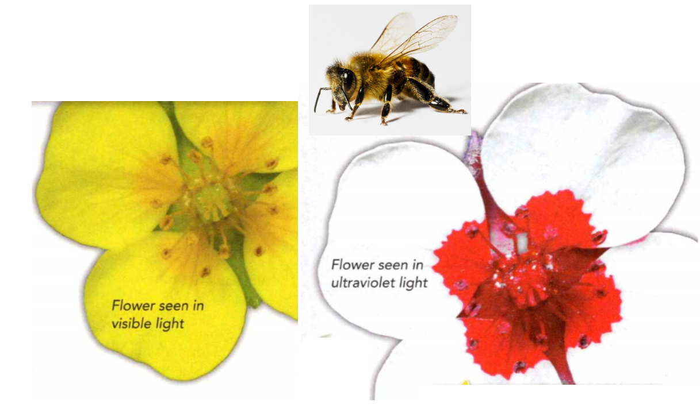
    <figcaption>Figure 1. Flower in visible and ultraviolet light.</figcaption>
  </figure>

### What Are Telescopes and How Do They Work?

On a clear night, your eyes can see at most a few thousand stars. But with a
telescope, you can see many millions. Why? The light from stars spreads out as
it moves through space and your eyes are too small to gather much light.

**Telescopes are instruments that collect and focus light and other forms of
electromagnetic radiation.**& Telescopes make distant objects appear larger and
brighter. A telescope that uses lenses or mirrors to collect and focus visible
light is called an **optical telescope**. There are also nonoptical telescopes.
These telescopes collect and focus different types of electromagnetic radiation,
just as optical telescopes collect visible light.

### Optical Telescopes 

The two major types of optical telescopes are refracting telescopes and
reflecting telescopes.

  <figure>
    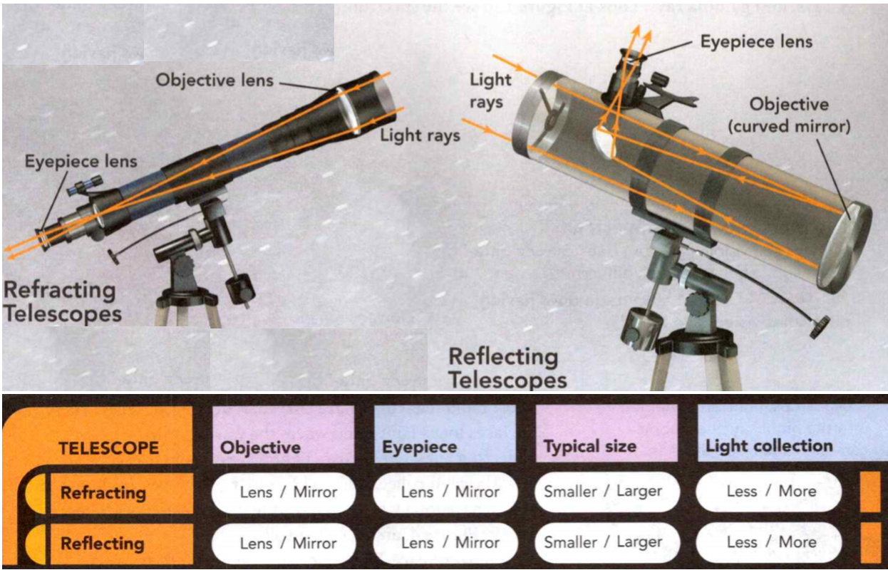
    <figcaption>Figure 2. Refracting and Reflecting Telescopes.</figcaption>
  </figure>

### Refracting Telescopes

A **refracting telescope** is a telescope that uses convex lenses to gather and
focus light. A **convex lens** is a piece of glass that is curved, so the middle
is thicker than the edges.

A simple refracting telescope has two convex lenses, one at each end of a long
tube. Light enters the telescope through the large objective lens at the top.
The objective lens focuses the light at a certain distance from the lens. This
distance is the focal length of the lens. A larger objective lens means that the
telescope can collect more light. This makes it easier for astronomers to see
faint objects, or objects that are far away.

The smaller lens at the lower end of a refracting telescope is the eyepiece
lens. The eyepiece lens magnifies the image produced by the objective lens. A
magnified image can be easier to study.

### Reflecting Telescopes

In 1668, Isaac Newton built the first reflecting telescope. A **reflecting
telescope** uses a curved mirror to collect and focus light. Like the objective
lens in a refracting telescope, the curved mirror in a reflecting telescope
focuses a large amount of light onto a small area. A larger mirror means that
the telescope can collect more light. The largest optical telescopes today are
all reflecting telescopes.

Why are the largest optical telescopes reflecting telescopes? Because the mirror
can be supported from below. But the lens of a refracting telescope must be
supported from the edges, so light can pass through it.

  <figure>
    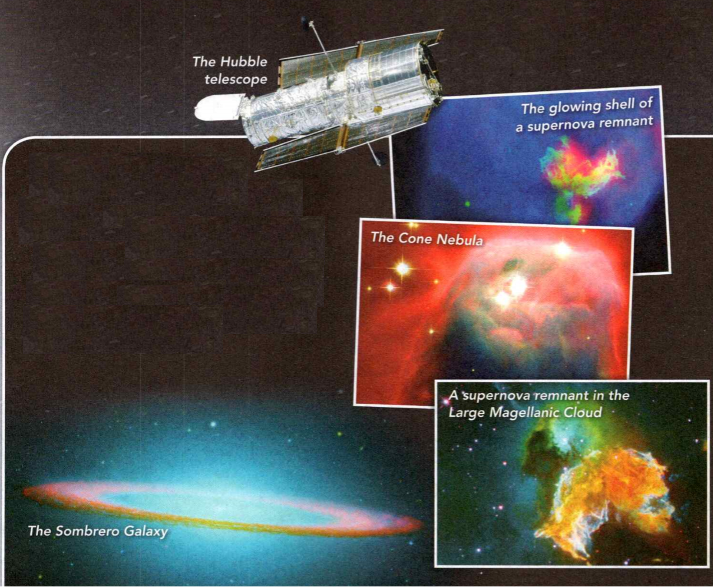
    <figcaption>Figure 3. The Hubble Space Telescope.</figcaption>
  </figure>

The Hubble Space Telescope, see Figure 3 The Hubble telescope is a reflecting
telescope with a mirror 2.4 meters in diameter. The Hubble telescope orbits Eart
above the atmosphere. As a result, it produces very detailed images in visible
light. It also collects ultraviolet and infrared radiation. Images such as the
ones shown here have changed the way astronomers view the universe.

Astronomers are concerned about "light pollution," artificial lighting that
makes it hard to see the skies at night. Some cities have replaced their street
lamps with ones that point down. With these lamps, light isn't beamed into the
night sky and people can once again see the stars.
	
### Other Telescopes 

Telescopes are usually located in observatories. An **observatory** is a
building that contains one or more telescopes. Many large observatories are
located on the tops of mountains or in space. Why? Earth's atmosphere makes
objects in space look blurry. The sky on some mountaintops is clearer than at
sea level and is not brightened by city lights.

- **Radio telescopes** detect radio waves from objects in space. Most radio
telescopes have curved, reflecting surfaces. These surfaces focus faint radio
waves the way the mirror in a reflecting telescope focuses light waves. Radio
telescopes need to be large to collect and focus more radio waves, because radio
waves have long wavelengths. Some radio telescopes, like the one in Figure 4,
are placed in valleys.

- The Spitzer Space Telescope, launched in 2003, produces images in the infrared
portion of the spectrum.

- Very hot objects in space give off X-rays. The Chandra X-ray Observatory
produces images in the X-ray portion of the spectrum. X-rays are blocked by
Earth's atmosphere, so this telescope is located in outer space.

Some new telescopes are equipped with computer systems that correct images for
problems such as telescope movement and changes in air temperature or mirror
shape.

  <figure>
    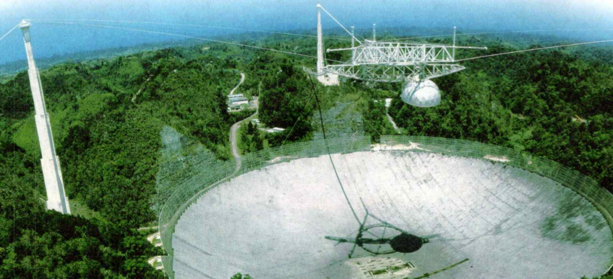
    <figcaption>Figure 4. Arecibo Radio Telescope.</figcaption>
  </figure>

**Complete the tasks below.**

1. Flower in visible and ultraviolet light, see Figure 1 Humans see visible
light, but bees can see ultraviolet light, so flowers look different to a bee.
What advantage does having ultraviolet vision give bees?

2. Complete the sentence by identifying the correct words. An (optics/optical)
device may use many different kinds of (optics/optical) including mirrors and
lenses.

3. Refracting and Reflecting Telescopes, see Figure 2. A refracting telescope
uses convex lenses to focus light. A reflecting telescope uses a curved mirror
to focus light. Identify the correct answers in the table showing the
similarities and differences between the two.
a) Objective Refracting: Lens/Mirror
b) Objective Reflecting: Lens/Mirror
c) Eyepiece Refracting: Lens/Mirror
d) Eyepiece Reflecting: Lens/Mirror
e) Typical size Refracting: Smaller/Large
f) Typical size Reflecting: Smaller/Large
g) Light collection Refracting: Less/More
h) Light collection Reflecting: Less/More

4. Arecibo Radio Telescope, see Figure 4. The Arecibo telescope in Puerto Rico
is 305 meters in diameter. Why are radio telescopes so large?

  <figure>
    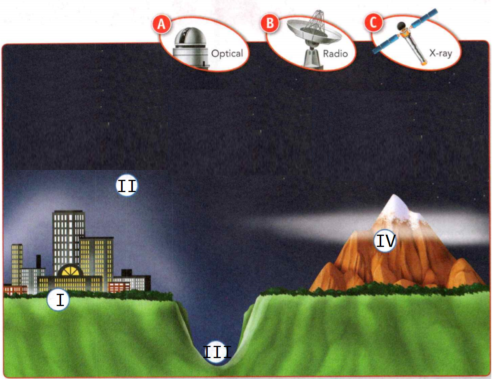
    <figcaption>Figure 5. Telescopes locations.</figcaption>
  </figure>

5. Telescopes locations, see Figure 5. Identify where the following kinds of
telescopes work best, and explain why.
a) Optical:
b) Radio:
c) X-ray:
d) Where would you not put a telescope?

6. List the electromagnetic waves, from longest to shortest wavelength.

7. A student of astronomy suggests locating a radio telescope near a radio
station. 
a) Is this a good idea?
b) Why or why not?

### The Scale of the Universe
- How Do Astronomers Measure Distances to the Stars?
- How Do Astronomers Describe the Scale of the Universe?

**Complete the tasks below.**

1. Voyager Golden Record Sixteen billion kilometers away flies a gold-plated
copper disk with a voice saying "Hello from the children of planet Earth." The
disk is carried aboard Voyager 1, a spacecraft launched in 1977 that once .ent
back information about the planets of the outer solar system. The disk is filled
with images and sounds of Earth. One day, aliens might find Voyager 1 and learn
all about us! What images and sounds would you put on a recording for aliens?

### How Do Astronomers Measure Distances to the Stars?

Standing on Earth looking up at the sky, it may seem as if there is no way to
tell how far away the stars are. However, astronomers have found ways to measure
those distances. **Astronomers often use parallax to measure distances to nearby
stars.**

**Parallax** is the apparent change in position of an object when you look at it
from different places. Astronomers can measure the parallax of nearby stars to
determine their distances.
  
  <figure>
    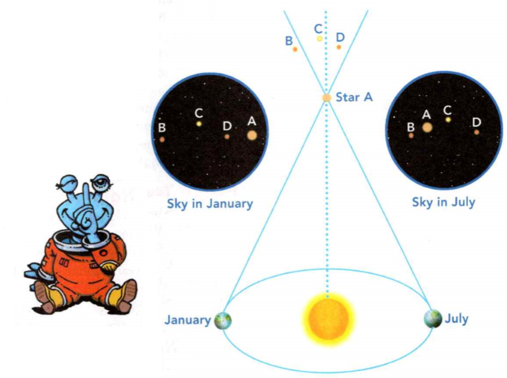
    <figcaption>Figure 6. Parallax of Stars.</figcaption>
  </figure>

As shown in Figure 6, astronomers look at a nearby star when Earth is on one
side of the sun. Then they look at the same star again six months later, when
Earth is on the opposite side of the sun. Astronomers measure how much the
nearby star appears to move against a background of stars that are much farther
away. They can then use this measurement to calculate the distance to the nearby
star. The less the nearby star appears to move, the farther away it is.

Astronomers can use parallax to measure distances up to a few hundred
light-years from Earth. The parallax of any star that is farther away is too
small to measure accurately.

### How Do Astronomers Describe the Scale of the Universe?

Astronomers define the **universe** as all of space and everything in it. The
universe is enormous, almost beyond imagination. Astronomers study objects as
close as the moon and as far away as quasars. They study incredibly large
objects, such as clusters of galaxies that are millions of light-years across.
They also study the behavior of tiny particles, such as the atoms within the
stars. **Since the numbers astronomers use are often very large or very small,
they frequently use scientific notation to describe sizes and distances in the
universe. They use a unit called the light-year to measure distances between the
stars.**

### The Light-Year 

Distances to the stars are so large that meters are not very practical units. In
space, light travels at a speed of about 300,000,000 meters per second. A
**light-year** is the distance that light travels in one year, about 9.46 trillion
kilometers. 

The light-year is a unit of distance, not time. To understand this better,
consider an example. If you bicycle at 10 kilometers per hour, it would take you
1 hour to go to a mall 10 kilometers away. You could say that the mall is "1
bicycle-hour" away.

### Scientific Notation 

Scientific notation uses powers of ten to write very large or very small numbers
in shorter form. Each number is written as the product of a number between 1 and
10 and a power of 10. For example: 1,200 is written as 1.2 x 103.

One light-year is about 9,460,000,000,000,000 meters. To express this number in
scientific notation, first insert a decimal point in the original number so that
you have a number between one and ten. In this case, the rounded number is 9.5.
To determine the power of ten, count the number of places that the decimal point
moved. Since there are 15 digits after the first digit, in scientific notation
this number can now be written as 9.5 x 1015 meters.

### The Immensity of Space 

The objects in the universe vary greatly in their distance from Earth. To
understand the scale of these distances, imagine that you are going on a journey
through the universe. Refer to Figure 7 as you take your imaginary trip. Start
on Earth. Now shift to the right and change the scale by 100,000,000,000, or
1011. You're now close to the sun, which is located 1.5 x
1011 meters away. As you move from left to right across Figure 2, the
distance increases. The nearest star to our sun, Alpha Centauri, is 4.2 x
1011 meters or 4.3 light-years away. The nearest galaxy to the Milky
Way, the Andromeda galaxy, is about 2.4 X 1022 meters away.

  <figure>
    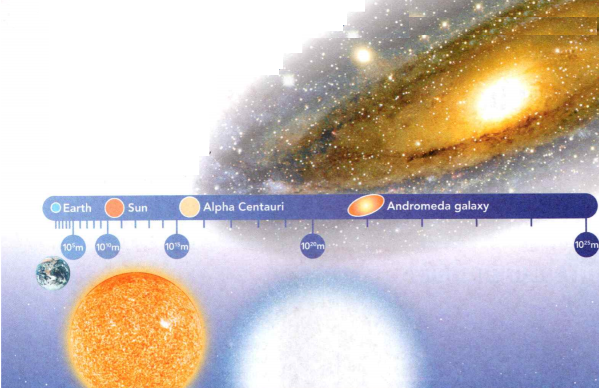
    <figcaption>Figure 7. Scale of the Universe.</figcaption>
  </figure>

**Complete the tasks below.**

1. Parallax of Stars, see Figure 6. The apparent movement of a star when seen
from a different position is called parallax. Note that the diagram is not to
scale. Hold a finger about half an arm's length away from your face, as shown in
the picture below. Switch back and forth between closing your left and right eye
and watch how your finger appears to move against the background. 
a) Why does your finger seem to move? 
b) How is this related to the parallax of stars?

2. Scientific Notation. To express a number in scientific notation, first insert
a decimal point in the original number so you have a number between one and ten.
Then count the number of places that the decimal point moved. That gives you the
power of ten.
a) Explain why astronomers use	scientific notation to describe sizes.
b) The sun takes about 220,000,000 years to revolve once around the center of
the galaxy. Express this length of time in scientific notation.
c) The distant star Deneb is thought by some astronomers to be 3,230 light-years
away. Write this distance in scientific notation.

3. Scale of the Universe, see Figure 7 Scientists often use scientific notation
to help describe the vast distances in space. The sun is 1.5 x 1011 m
away from Earth, but the next star, Alpha Centauri, is 4.2 x 1016 m
away, almost 300,000 times as far. Express the distances to the sun and Alpha
Centauri in meters by writing out all the zeroes in the number.
a) Sun:  
b) Alpha Centauri:

4. What is scientific notation?

5. How is scientific notation useful to astronomers?

6. The Andromeda galaxy is 2,200,000 light-years away. Write that measurement
using scientific notation.

### Characteristics of Stars 
- How Are Stars Classified?
- What Is an H-R Diagram and How Do Astronomers Use It?

**Complete the tasks below.**

1. Black Holes. If you were an astronomer, you might study some of the strangest
objects in the universe. For almost 100 years, scientists believed that some
stars became black holes when they died. But a black hole is an object with
gravity so strong that not even light can escape. So scientists couldn't prove
that black holes existed because they couldn't see them. Eventually, astronomers
discovered a way to prove black holes exist. They realized that they could
detect the matter being pulled into the black hole. That matter reaches such
high temperatures that it releases X-rays. In the 1960s, astronomers launched a
rocket to record X-rays from outer space. On this first mission, they found
evidence for black holes!
a) Why was it so hard to prove that black holes exist?
b) What subjects, other than astronomy, would astronomers have to study in order
to discover black holes?

### How Are Stars Classified?

All stars are huge spheres of glowing gas. Made up mostly of hydrogen, stars
produce energy through the process of nuclear fusion. Astronomers classify stars
according to their physical characteristics. **Characteristics used to classify
stars include color, temperature, size, composition, and brightness.**

### Color and Temperature 

If you look at the night sky, you can see slight differences in the colors of
the stars. Some stars look reddish. Others are yellow or blue-white, as shown in
Figure 1.

A star's color reveals its surface temperature. The coolest stars—with a surface
temperature of about 3,200°C—appear red. Our yellow sun has a surface
temperature of about 5,500°C. The hottest stars, with surface temperatures of
over 20,000°C, appear bluish.

### Size 

When you look at stars in the sky, they all appear to be points of light of the
same size. Many stars are actually about the size of the sun. However, some
stars are much larger than the sun. Very large stars are called giant stars or
supergiant stars.

Most stars are smaller than the sun. White dwarf stars are about the size of
Earth. Neutron stars are even smaller, about 20 kilometers in diameter.

  <figure>
    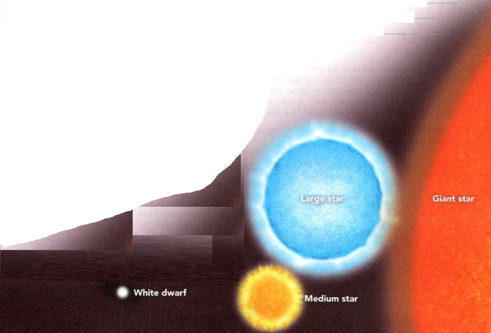
    <figcaption>Figure 8. Star Color and Temperature.</figcaption>
  </figure>

### Chemical Composition 

Stars vary in their chemical composition. The chemical composition of most stars
is about 73 percent hydrogen, 25 percent helium, and 2 percent other elements by
mass. This is close to the composition of the sun.

Astronomers use spectrographs to determine the elements found in stars. A
**spectrograph** is a device that breaks light into colors and produces an image
of the resulting spectrum. Today, most large telescopes have spectrographs to
analyze light.

The gases in a star's atmosphere absorb some wavelengths of light produced
within the star. When the star's light is seen through a spectrograph, each
absorbed wavelength is shown as a dark line on a spectrum. Each chemical element
absorbs light at particular wavelengths. Just as each person has a unique set of
fingerprints, each element has a unique set of spectral lines for a given
temperature.

### Brightness of Stars 

Stars also differ in brightness, the amount of light they give off. **The
brightness of a star depends upon both its size and temperature.** A larger star
tends to be brighter than a smaller star. A hotter star tends to be brighter
than a cooler star. 

How bright a star appears depends on both its distance from Earth and how bright
the star truly is. Because of these two factors, the brightness of a star is
described in two ways: apparent brightness and absolute brightness.

### Apparent Brightness 

A star's **apparent brightness** is its brightness as seen from Earth.
Astronomers can measure apparent brightness fairly easily using electronic
devices. However, astronomers can't tell how much light a star gives off just
from the star's apparent brightness. Just as a flashlight looks brighter the
closer it is to you, a star looks brighter the closer it is to Earth. For
example, the sun looks very bright. This does not mean that the sun gives off
more light than all other stars. The sun looks so bright simply because it is so
close.

### Absolute Brightness 

A star's **absolute brightness** is the brightness the star would have if it were at
a standard distance from Earth. Finding absolute brightness is more complex than
finding its apparent brightness. An astronomer must first find out both the
star's apparent brightness and its distance from Earth. The astronomer can then
calculate the star's absolute brightness. 

Astronomers have found that the absolute brightness of stars can vary
tremendously. The brightest stars are more than a billion times brighter than
the dimmest stars!

  <figure>
    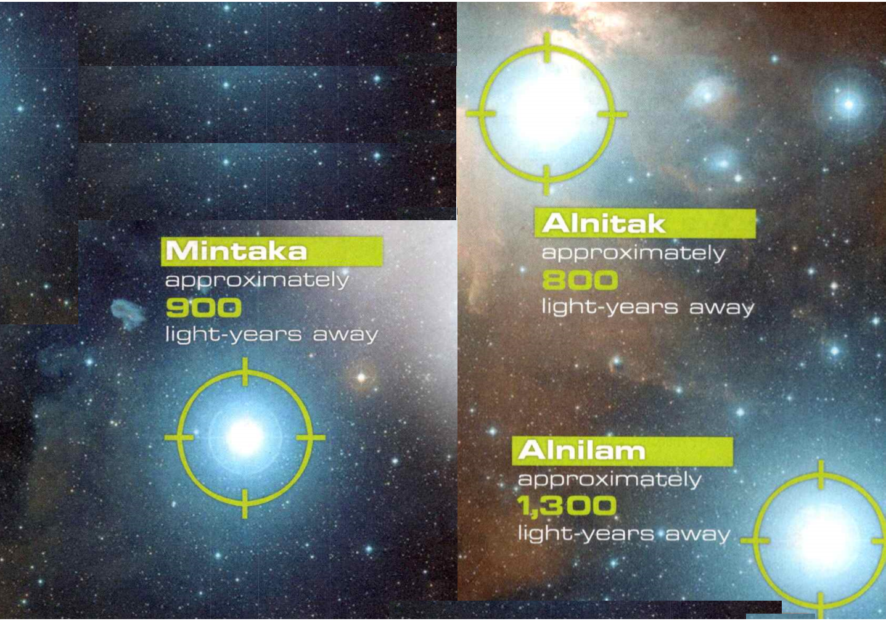
    <figcaption>Figure 9. Apparent and Absolute Brightness.</figcaption>
  </figure>

### What Is an H-R Diagram and How Do Astronomers Use It?

About 100 years ago, two scientists working independently made the same
discovery. Both Einar Hertzsprung in Denmark and Henry Norris Russell in the
United States made graphs to find out if the temperature and the absolute
brightness of stars are related. They plotted the surface temperatures of stars
on the x-axis and their absolute brightness on the y-axis. The points formed a
pattern. The graph they made is still used by astronomers today. It is called
the **Hertzsprung-Russell diagram**, or H-R diagram.

  <figure>
    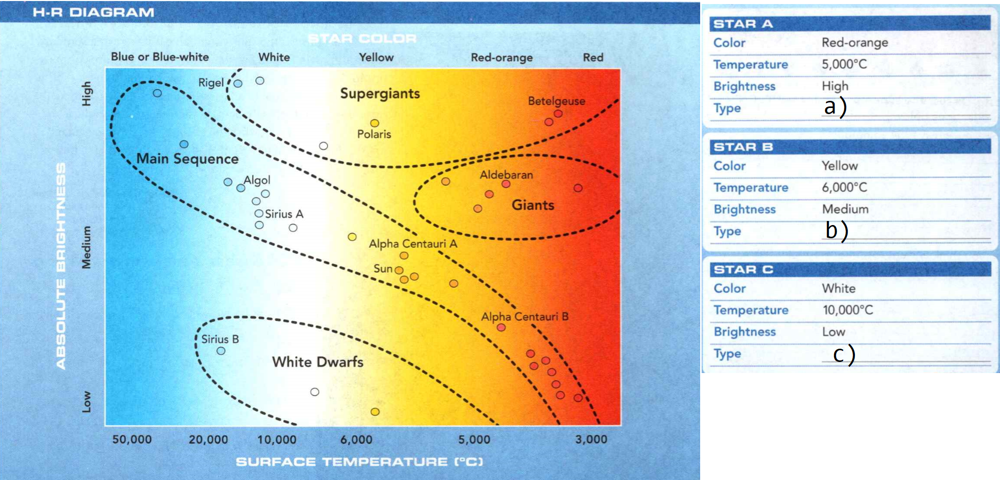
    <figcaption>Figure 10. Hertzsprung-Russell Diagram.</figcaption>
  </figure>

**Astronomers use H-R diagrams to classify stars and to understand how stars
change over time.** As shown in Figure 3, most of the stars in the H-R diagram
form a diagonal area called the **main sequence**. More than 90 percent of all
stars, including the sun, are main-sequence stars. Within the main sequence, the
surface temperature increases as absolute brightness increases. Thus, hot bluish
stars are located at the left of an H-R diagram and cooler reddish stars are
located at the right of the diagram.

The brightest stars are located near the top of an H-R diagram, while the
dimmest stars are located at the bottom. Giant and supergiant stars are very
bright. They can be found near the top center and right of the diagram. White
dwarfs are hot, but not very bright, so they appear at either the bottom left or
bottom center of the diagram.

**Complete the tasks below.**

1. Star Color and Temperature ,see Figure 8.
a) Which of the four stars shown has the highest temperature?
b) Why?

2. Write a sentence that says what the color of a star indicates.

  <figure>
    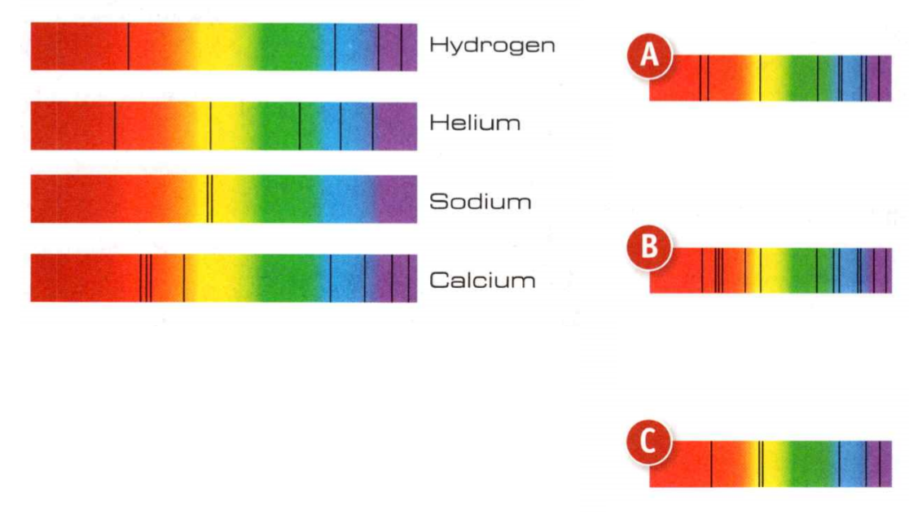
    <figcaption>Figure 27. Lines on spectrums.</figcaption>
  </figure>

3. The lines on the spectrums in Figure 27 are from four different elements. By
comparing a star's spectrum with the spectrums of known elements, astronomers
can infer each element found in the star. Each star's spectrum is an overlap of
the spectrums from the individual elements. Identify the elements with the
strongest lines in Stars A, B, and C.
a) Star A
b) Star B
c) Star C

4. Apparent and Absolute Brightness, see Figure 9. The three stars Alnitak,
Alnilam, and Mintaka in the constellation Orion all seem to have the same
apparent brightness from Earth. But Alnilam is actually farther away than the
other two stars.
a) Which star has the greatest absolute brightness? 
b) How do you know?

5. Hertzsprung-Russell Diagram, see Figure 10. The H-R diagram shows the
relationship between surface temperature and absolute brightness of stars. Place
the stars listed in the table on the diagram, and note on the table the
classification of each star.
a) Star A Supergiant/Giant/Main Sequence/White Dwarf
b) Star B Supergiant/Giant/Main Sequence/White Dwarf
c) Star C Supergiant/Giant/Main Sequence/White Dwarf

6. What two characteristics of stars are shown in an H-R diagram?

7. What is the relationship between brightness and temperature shown within the
main sequence?

8. The star Procyon B has a surface temperature of 7,500°C and a low absolute
brightness. What type of star is it?

### Lives of Stars
- How Does a Star Form and What Determines Its Life Span?
- What Happens to a Star When It Runs Out of Fuel?

**Complete the tasks below.**

1. The Supernova of 1054. In the summer of 1054, some Chinese astronomers noticed a
"guest star" in the night sky. The star was so bright people could see it during
the day! The star remained visible for almost two years. How did these ancient
astronomers interpret it? Was it a sign that the emperor would be visited by an
important guest? People from around the world recorded and interpreted the event
differently. Almost 1,000 years later, scientists realized the "guest star" was
the explosion of a giant star 4,000 light-years away. So powerful was the
explosion that all life within about 50 light-years would have been wiped out.
Now called Supernova 1054, its remains are known as the Crab Nebula.
a) Why was Supernova 1054 so notable?
b) How do you think ancient astronomers might have interpreted the event
differently than astronomers today?

### How Does a Star Form and What Determines Its Life Span?

Stars do not last forever. Each star is born, goes through its life cycle, and
eventually dies. (Of course, stars are not really alive. The words born, live,
and die are just helpful comparisons.) **A star is born when the contracting
gas and dust from a nebula become so dense and hot that nuclear fusion starts.
How long a star lives depends on its mass.**

### A Star Is Born 

All stars begin their lives as parts of nebulas, such as the one in Figure 11. A
**nebula** is a large cloud of gas and dust spread out in an immense volume. A star,
on the other hand, is made up of a large amount of gas in a relatively small
volume.

  <figure>
    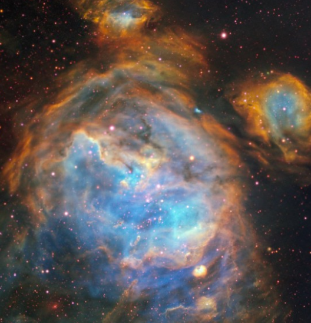
    <figcaption>Figure 11. A Stellar Nursery.</figcaption>
  </figure>

In the densest part of a nebula, gravity pulls gas and dust together. A
contracting cloud of gas and dust with enough mass to form a star is called a
**protostar**. Proto- means "earliest" in Greek, so a protostar is the earliest
stage of a star's life.

Recall that nuclear fusion is the process by which atoms combine to form heavier
atoms. In the sun, for example, hydrogen atoms combine to form helium. During
nuclear fusion, enormous amounts of energy are released. Nuclear fusion begins
in a protostar.

  <figure>
    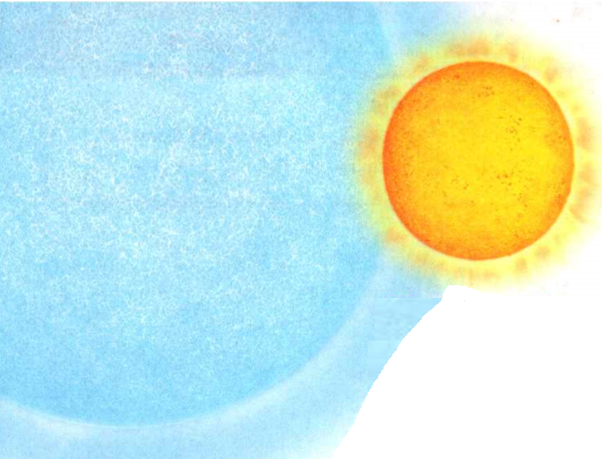
    <figcaption>Figure 12. Life of a Star.</figcaption>
  </figure>

### Lifetimes of Stars 

How long a star lives depends on the star's mass. You might think that stars
with more mass would last longer than stars with less mass. But the reverse is
true. You can think of stars as being like cars. A small car has a small gas
tank, but it also has a small engine that burns gas slowly. A large car has a
larger gas tank, but it also has a larger engine that burns gas rapidly. So the
small car can travel farther on a tank of gas than the larger car. Small-mass
stars use up their fuel more slowly than large-mass stars, so they have much
longer lives.

Generally, stars that have less mass than the sun use their fuel slowly, and can
live for up to 200 billion years. A medium-mass star like the sun will live for
about 10 billion years. The sun is about 4.6 billion years old, so it is about
halfway through its lifetime. In Figure 12, the yellow star is similar to the
sun.

Stars that have more mass than the sun have shorter lifetimes. A star that is
more massive than the sun, such as the blue star shown in Figure 12, may live
only about 10 million years. That may seem like a very long time, but it is only
one tenth of one percent of the lifetime of the sun.

### What Happens to a Star When It Runs Out of Fuel?

When a star begins to run out of fuel, its core shrinks and its outer portion
expands. Depending on its mass, the star becomes either a red giant or a
supergiant. Red giants and supergiants evolve in very different ways. **After a
star runs out of fuel, it becomes a white dwarf, a neutron star, or a black
hole.**

### White Dwarfs 

Low-mass stars and medium-mass stars like the sun take billions of years to use
up their nuclear fuel. As they start to run out of fuel, their outer layers
expand, and they become red giants. Eventually, the outer parts grow larger
still and drift out into space, forming a glowing cloud of gas called a
planetary nebula. The blue-white core of the star that is left behind cools and
becomes a **white dwarf**.

White dwarfs are about the size of Earth, but they have about as much mass as
the sun. A white dwarf is about one million times as dense as the sun. White
dwarfs have no fuel, but they glow faintly from leftover energy. After billions
of years, a white dwarf stops glowing. Then it is called a black dwarf.

### Supernovas 

The life cycle of a high-mass star is quite different. These stars quickly
evolve into brilliant supergiants. When a supergiant runs out of fuel, it can
explode suddenly. Within hours, the star blazes millions of times brighter. The
explosion is called a **supernova**. After a supernova, some of the material from
the star expands into space. This material may become part of a nebula. This
nebula can then contract to form a new, partly recycled star. Recall that
nuclear fusion creates heavy elements. A supernova provides enough energy to
create the heaviest elements. Astronomers think that the matter in the sun and
the planets around it came from a gigantic supernova. If so, this means that the
matter all around you was created in a star, and all matter on Earth is a form
of stardust.

  <figure>
    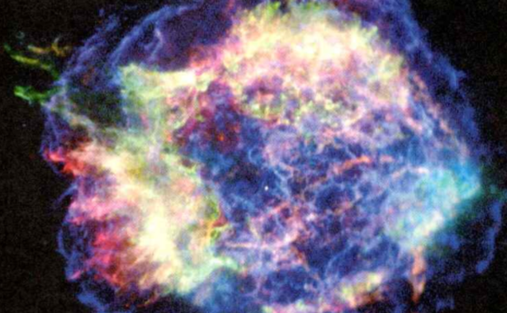
    <figcaption>Figure 13. Supernova Remnant Cassiopeia A.</figcaption>
  </figure>

### Neutron Stars 

After a supergiant explodes, some of the material from the star is left behind.
This material may form a neutron star. **Neutron stars** are the remains of
high-mass stars. They are even smaller and denser than white dwarfs. A neutron
star may contain as much as three times the mass of the sun but be only about 25
kilometers in diameter, the size of a city.

In 1967, Jocelyn Bell, a British astronomy student working with Antony Hewish,
detected an object in space that appeared to give off regular pulses of radio
waves. Some astronomers thought the pulses might be signals from an
extraterrestrial civilization. At first, astronomers even named the source LGM,
for the "Little Green Men" in early science-fiction stories. Soon, however,
astronomers concluded that the source of the radio waves was really a rapidly
spinning neutron star. Spinning neutron stars are called **pulsars**, short for
pulsating radio sources. Some pulsars spin hundreds of times per second!

  <figure>
    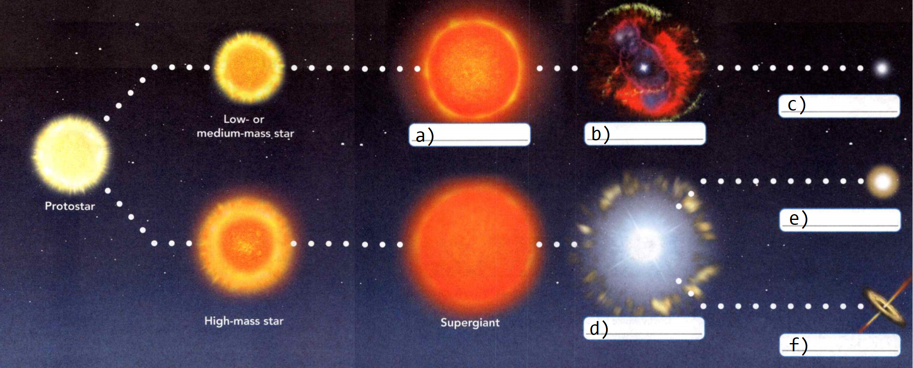
    <figcaption>Figure 14. Lives of Stars.</figcaption>
  </figure>

### Black Holes 

The most massive stars—those that have more than 10 times the mass of the
sun—may become black holes when they die.

A **black hole** is an object with gravity so strong that nothing, not even light,
can escape. After a very massive star dies in a supernova explosion, more than
five times the mass of the sun may be left. The gravity of this mass is so
strong that the gas is pulled inward, packing the gas into a smaller and smaller
space. The star's gas becomes squeezed so hard that the star converts into a
black hole, and its intense gravity will not allow even light to escape.

No light, radio waves, or any other form of radiation can ever get out of a
black hole, so it is not possible to detect directly. But astronomers can detect
black holes indirectly. For example, gas near a black hole is pulled so strongly
that it revolves faster and faster around the black hole. Friction heats the gas
up. Astronomers can detect X-rays coming from the hot gas and infer that a black
hole is present.

**Complete the tasks below.**

1. A Stellar Nursery, see Figure 11. New stars are forming in the nebula.
Describe the process of star formation.

2. Life of a Star, see Figure 12. A star's lifetime depends on its mass. The yellow
star has much less mass than the blue star and so will live longer. Explain why.

3. How does a star form from a nebula?

4. What factor determines how long a star lives?

5. A star is twice as massive as the sun. How will its lifespan compare?

6. How does the mass and size of a white dwarf compare with the mass and size of
the sun? 
A) Same mass; greater size
B) Less mass; greater size 
C) Same mass; smaller size 
D) Less mass; smaller size

7. Supernova Remnant Cassiopeia A, see Figure 13. Cassiopeia A is the remnant of a
once-massive star that died in a supernova explosion seen 325 years ago. Explain
the connection between your body and a supernova.

8. Lives of Stars, see Figure 14. Identify the missing stages on the diagram. 
a) Stage:
b) Stage:
c) Stage:
d) Stage:
e) Stage:
f) Stage:
g) Identify the stage of the sun.

9. Describe what will happen to the sun when it runs out of fuel.

10. An alien civilization is in orbit around a high-mass supergiant star. 
a) Should they stay or should they go elsewhere? 
b) Why?

11. What determines if a star becomes a white dwarf, neutron star, or black hole?

12. Which will the sun become: a white dwarf, neutron star, or a black hole? Why?

13. After a star runs out of fuel, it becomes ___ .

### Star Systems and Galaxies
- What Is a Star System?
- What Are the Major Types of Galaxies?

**Complete the tasks below.**

1. When I was ten, I went to visit a friend in the Adirondack Mountains. We were
outside on a clear, dark night until 2:00 A.M., and we saw the Milky Way. It was
a big, white stream in the sky. The Milky Way was filled with stars.
a) Why would it be easier to see the Milky Way from the mountains?
b) Why does the Milky Way appear more like a white stream than separate stars?

### What Is a Star System?

Our solar system has only one star: the sun. But this is not a common situation
for stars. **Most stars are members of groups of two or more stars, called star
systems.** If you were on a planet in one of these star systems, at times you
might see two or more suns in the sky! At other times, one or more of these suns
might be below the horizon.

### Multiple Star Systems 

Star systems that have two stars are called double stars or **binary stars**. (The
prefix bimeans "two.") Those with three stars are called triple stars.

Often one star in a binary star is much brighter and more massive than the
other. Astronomers can sometimes detect a binary star even if only one of the
stars can be seen from Earth. Astronomers can often tell that there is a dim
star in a binary system by observing the effects of its gravity. As the dim
companion star revolves around a bright star, the dim star's gravity causes the
bright star to wobble. Imagine watching a pair of dancers who are twirling each
other around, as shown in Figure 15. Even if one dancer were invisible, you
could tell the invisible dancer was there from the motion of the visible dancer.

  <figure>
    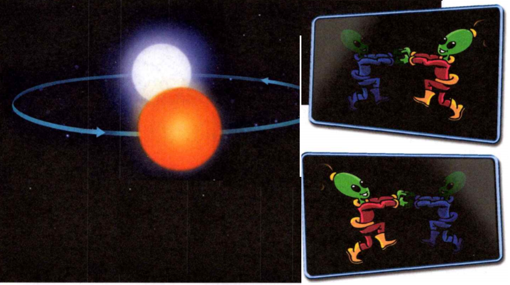
    <figcaption>Figure 15. Invisible Partner.</figcaption>
  </figure>

Invisible Partner, see Figure 15. A dim companion star might not be visible from
Earth, but its existence can be inferred, like the invisible dancer.

### Eclipsing Binaries 

A wobble is not the only clue that a star has a dim companion. A dim star in a
binary star may pass in front of a brighter star and eclipse it. From Earth, the
bright star would suddenly look much dimmer. A system in which one star blocks
the light from another periodically is called an **eclipsing binary**.

### Planets Around Other Stars 

In 1995, astronomers first discovered a planet revolving around another ordinary
star. They used a method similar to the one used in studying binary stars. The
astronomers observed that the star was moving slightly toward and then away from
us. They knew that the invisible object causing the movement didn't have enough
mass to be a star. They inferred that it must be a planet.

Since then, astronomers have discovered more than 300 planets around other
stars, and new ones are being discovered all of the time. Most of these new
planets are very large, with at least half of the mass of Jupiter. A small
planet would be hard to detect because it would have little gravitational effect
on the star it orbited.

Could there be life on planets in other solar systems? Some scientists think it
is possible. A few astronomers are using radio telescopes to search for signals
that could not have come from natural sources. Such signals might be evidence
that an alien civilization was sending out radio waves.

### Star Clusters 

Many stars belong to larger groupings called star clusters. All of the stars in
a particular cluster formed from the same nebula at about the same time and are
about the same distance from Earth.

There are two major types of star clusters: open clusters and globular clusters.
**Open clusters** have a loose, disorganized appearance as shown in Figure 17 and
contain up to a few thousand stars. They often contain many bright supergiants
and much gas and dust. In contrast, **globular clusters** are large groupings of
older stars. Globular clusters are round and packed with stars. Some may contain
more than a million stars.

### What Are the Major Types of Galaxies?

A galaxy is a huge group of single stars, star systems, star clusters, dust, and
gas bound together by gravity. There are billions of galaxies in the universe.
The largest galaxies have more than a trillion stars. CMI Astronomers classify
most galaxies into the following types: spiral, elliptical, and irregular.

  <figure>
    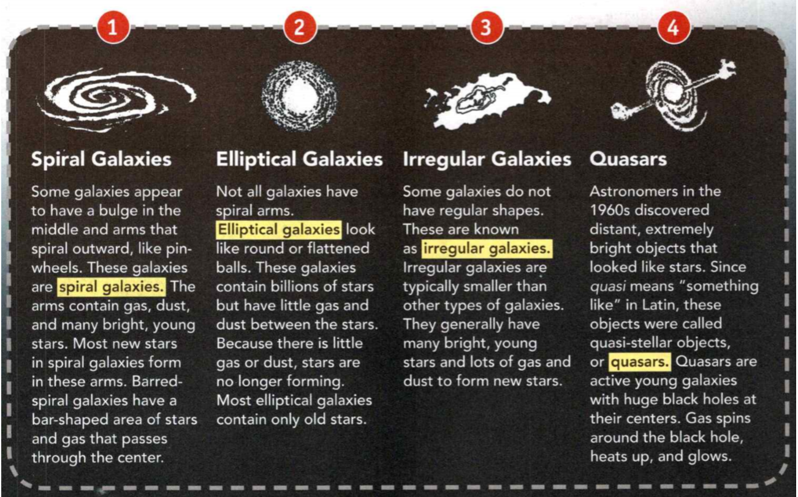
    <figcaption>Figure 18. Types of Galaxies.</figcaption>
  </figure>

### Spiral Galaxies

Some galaxies appear to have a bulge in the middle and arms that spiral outward,
like pinwheels. These galaxies are **spiral galaxies**. The arms contain gas, dust,
and many bright, young stars. Most new stars in spiral galaxies form in these
arms. Barred-spiral galaxies have a bar-shaped area of stars and gas that passes
through the center.

### Elliptical Galaxie

Not all galaxies have spiral arms. **Elliptical galaxies** look like round or
flattened balls. These galaxies contain billions of stars but have little gas
and dust between the stars. Because there is little gas or dust, stars are no
longer forming. Most elliptical galaxies contain only old stars.

### Irregular Galaxies

Some galaxies do not have regular shapes. These are known as **irregular galaxies**.
Irregular galaxies are typically smaller than other types of galaxies. They
generally have many bright, young stars and lots of gas and dust to form new
stars.

### Quasars

Astronomers in the 1960s discovered distant, extremely bright objects that
looked like stars. Since quasi means "something like" in Latin, these objects
were called quasi-stellar objects, or **quasars**. Quasars are active young
galaxies with huge black holes at their centers. Gas spins around the black
hole, heats up, and glows.

### Milky Way

Our solar system is located in a galaxy called the Milky Way. From the side, the
Milky Way would look like a narrow disk with a large bulge in the middle. But
from the top or bottom, the Milky Way would have a pinwheel shape. You can't see
the shape of the Milky Way from Earth because our solar system is inside one of
the arms.

When you see the Milky Way at night during the summer, you are looking toward
the center of our galaxy. The center of the galaxy is about 25,000 light-years
away, but it is hidden from view by large clouds of dust and gas. But
astronomers can study the center using X-rays, infrared radiation, and radio
waves.

**Complete the tasks below.**

1 What causes a binary star to wobble back and forth?
A) Gravity of another star 
B) Eclipsing by another star

  <figure>
    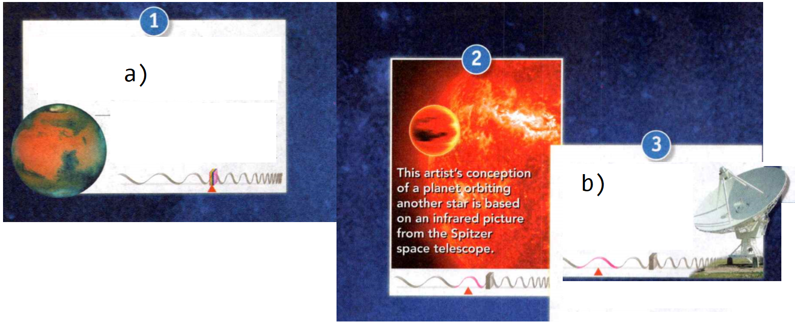
    <figcaption>Figure 16. How do astronomers learn about distant objects in the universe?.</figcaption>
  </figure>

2. How do astronomers learn about distant objects in the universe?

3. Explain what information we can get from light, and how that tells us about
things that are far away.

4. Imagine you are an astronomer looking for intelligent alien life around a
faraway star, see Figure 16. All you can get from the star is visible light and
other parts of the electromagnetic spectrum.
a) Suppose you detect a slight wobble of the star. What might that tell you?
b) What might you infer if you picked up a regular radio signal from the star
system?

  <figure>
    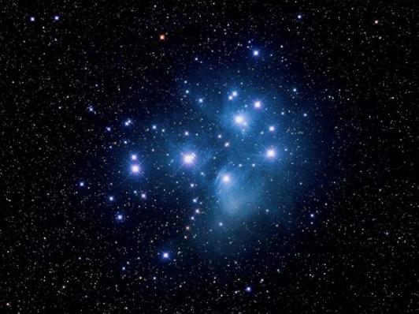
    <figcaption>Figure 17. Star Cluster Pleiades.</figcaption>
  </figure>

5. Star Cluster Pleiades, see Figure 17. Why did some ancient astronomers call
the Pleiades the "seven sisters"?

6. What is a binary star?

7. In what two ways can we tell if a star is a binary star?

8. How do astronomers learn about distant objects in the universe?

  <figure>
    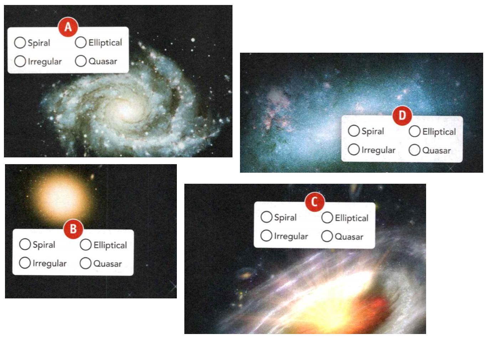
    <figcaption>Figure 19. Types of Galaxies Questions.</figcaption>
  </figure>

9. Types of Galaxies, see Figures 18 & 19. Identify the four galaxies shown in
Figure 19.
a) A Spiral/Elliptical/Irregular/Quasar
b) B Spiral/Elliptical/Irregular/Quasar
c) C Spiral/Elliptical/Irregular/Quasar
d) D Spiral/Elliptical/Irregular/Quasar

10. What kind of galaxy is the Milky Way? Explain why and draw a sketch of what
the Milky Way might look like from outside.

### The Expanding Universe
- What Does the Big Bang Theory Say About the Universe?

**Complete the tasks below.**

1. On Sunday, March 15, 2009, I flew to Orlando, Florida, to see the launch of
Discovery in Cape Canaveral, the first launch I ever saw. At 5 seconds, the
engines ignited and at 0 seconds, Discovery went into the sky. I could feel the
vibrations. Discovery looked like a ball of fire the color of autumn leaves, and
it left a trail of smoke. What would you want scientists to learn about the
universe from a space shuttle mission?

### What Does the Big Bang Theory Say About the Universe?

Astronomers have learned a lot about the universe. They theorize that the
universe began 13.7 billion years ago. At that time, the part of the universe we
can see was no larger than the period at the end of this sentence. This tiny
universe was incredibly hot and dense. The universe then exploded in what
astronomers call the **big bang**.

**According to the big bang theory, the universe formed in an instant, billions of
years ago, in an enormous explosion. New observations lead many astronomers to
conclude that the universe will likely expand forever.** Since the big bang, the
size of the universe has been increasing. The universe is immensely larger now
than it once was.

As the universe expanded, it gradually cooled. After a few hundred thousand
years, atoms formed. Within about the first 500 million years after the big
bang, the first stars and galaxies formed.

### Moving Galaxies 

In the 1920s, an American astronomer, Edwin Hubble, discovered important
evidence that led to the big bang theory. Hubble studied the spectrums of many
galaxies at various distances from Earth. By examining a galaxy's spectrum,
Hubble could tell how fast the galaxy was moving and whether it was moving
toward our galaxy or away from it.

Hubble discovered that almost all galaxies are moving away from us and from each
other. Hubble found the relationship between the distance to a galaxy and its
speed. **Hubble's law** states that the farther away a galaxy is, the faster it is
moving away from us. Hubble's law strongly supports the big bang theory.

### Cosmic Background Radiation 

Another piece of evidence for the big bang was discovered by accident. In 1965,
two American physicists, Arno Penzias and Robert Wilson, detected faint
radiation on their radio telescope coming from all directions. Scientists later
concluded that this **cosmic background radiation** is the leftover thermal
energy from the big bang. This energy was distributed in every direction as the
universe expanded.

Age of the Universe, see Figure 20 By measuring how fast the universe is
expanding, astronomers can infer how long it has been expanding. The COBE
satellite shown measured the cosmic background radiation, which also gave clues
to the age of the universe.

  <figure>
    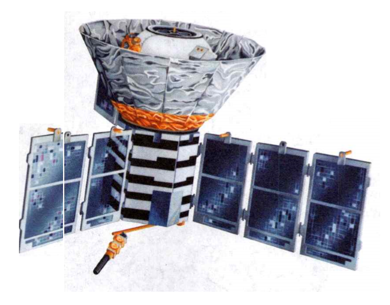
    <figcaption>Figure 20. Age of the Universe.</figcaption>
  </figure>

### The Big Bang and the Future of the Universe 

What will happen to the universe in the future? One possibility is that the
universe will continue to expand. All of the stars will eventually run out of
fuel and burn out, and the universe will be cold and dark. Another possibility
is that the force of gravity will begin to pull the galaxies back together, as
shown in Figure 21. The result would be a reverse big bang, or "big crunch." The
universe would be crushed in an enormous black hole.

  <figure>
    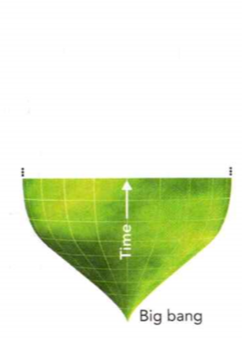
    <figcaption>Figure 22. The Big Crunch.</figcaption>
  </figure>

Which of these possibilities is more likely? Recent discoveries have produced a
surprising new view of the universe that is still not well understood. But many
astronomers conclude that the universe will likely expand forever.

### Dark Matter 

Until recently, astronomers assumed that the universe consisted solely of the
matter they could observe directly. But this idea was disproved by American
astronomer Vera Rubin. Rubin studied the rotation of spiral galaxies. She
discovered that the matter that astronomers can see makes up as little as ten
percent of the mass in galaxies. The rest exists in the form of dark matter.

**Dark matter** is matter that does not give off electromagnetic radiation. It
cannot be seen directly. However, its presence can be inferred by observing the
effect of its gravity on visible objects.

### An Accelerating Expansion 

In the late 1990s, astronomers observed that the expansion of the universe
appeared to be accelerating. That is, galaxies seemed to be moving apart at a
faster rate than in the past. This observation was puzzling, as no known force
could account for it. Astronomers infer that a mysterious new force, which they
call **dark energy**, is causing the expansion of the universe to accelerate, as
shown in Figure 23.

  <figure>
    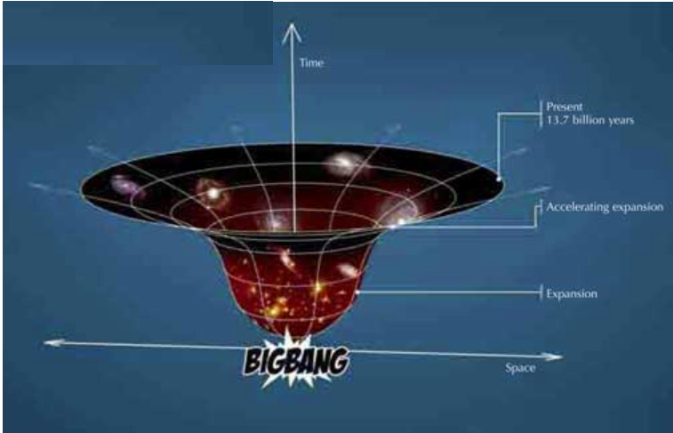
    <figcaption>Figure 23. Expansion of the Universe.</figcaption>
  </figure>

**Complete the tasks below.**

1. Identify the main evidence Hubble found that the universe is expanding.

  <figure>
    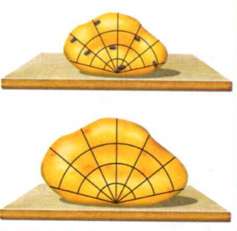
    <figcaption>Figure 21. Raisins in bread dough.</figcaption>
  </figure>

2. The galaxies in the universe are like raisins in rising bread dough, see
Figure 21. Draw the raisins in their new positions on the bottom picture.
Explain why the raisins are like galaxies.

3. The Big Crunch, see Figure 22. The small diagram represents the expansion of
the universe until now. The big bang is at the bottom. 
a) On the top part of the diagram, draw a sketch of the universe collapsing to a
big crunch. 
b) Explain your drawing.

4. What was the big bang?

5. When did the big bang occur?

6. Describe two pieces of evidence that support the big bang theory.

7. Expansion of the Universe, see Figure 23. The diagram represents a universe
that is expanding forever. Explain why scientists think this might happen.

8. Astronomers learn about distant objects in the universe by studying ___ .

### Study Guide

- The electromagnetic spectrum includes radio waves, infrared radiation, visible
light, ultraviolet radiation, X-rays, and gamma rays.
- Telescopes collect and focus light and other forms of electromagnetic
radiation.
- Astronomers often use parallax to measure distances to nearby stars.
- Since the numbers astronomers use are often very large or very small, they
frequently use scientific notation to describe sizes and distances in the
universe. They use a unit called the light-year to measure distances between the
stars.
- Characteristics used to classify stars include color, temperature, size,
composition, and brightness.
- The brightness of a star depends upon both its size and temperature.
- Scientists use H-R diagrams to classify stars. 
- A star is born when the contracting gas and dust from a nebula becomes so
dense and hot that nuclear fusion starts. How long a star lives depends on its
mass.
- After a star runs out of fuel, it becomes a white dwarf, a neutron star, or a
black hole.
- Most stars are members of groups of two or more stars, called star systems.
- Astronomers classify most galaxies into the following types: spiral,
elliptical, and irregular.
- According to the big bang theory, the universe formed in an instant, billions
of years ago, in an enormous explosion. New observations lead many astronomers
to conclude that the universe will expand forever.

**Complete the tasks below.**

1. What is visible light?
A) gamma rays and X-rays
B) the spectrum of rays
C) a particular wavelength
D) a form of electromagnetic radiation

2. Explain An optical telescope works by ___ .

3. What advantage might there be in placing a telescope on the moon?

4. Which type of numbers does scientific notation best describe?
A) very small or very large
B) very large only
C) very small only
D) large and small combined

5. Why can't astronomers measure the parallax of a star that is a million
light-years away?

6. math! The star Antares is about 604 light-years from Earth. Write this distance in scientific notation.

  <figure>
    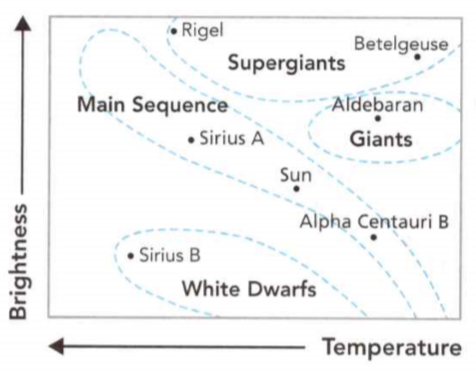
    <figcaption>Figure 24. HR Diagram.</figcaption>
  </figure>

7. On the diagram in Figure 24
a) Circle the star that has a greater absolute brightness: Aldebaran or Sirius
b) Underline the star that is most likely to be red: Rigel, Sirius B, or
Betelgeuse.

8. How does a star's mass affect its lifetime?

9. Explain how a black hole forms.

10. In what kind of star system does one star block the light from another?
A) open cluster
B) binary star system
C) quasar system
D) eclipsing binary

11. How is the number of stars different in an open cluster than in a globular
cluster?

12. Describe the "life story" of a star in a spiral galaxy. Explain where it was
born and what it was like there.

13. What is the name of the explosion that began the universe?
A) solar nebula
B) big bang
C) dark matter
D) supernova

14. Radio telescopes are able to detect cosmic background radiation, which is __
.

15. Explain the difference between a big crunch and an ever-expanding universe. 

How do astronomers learn
about distant objects
in the universe? 	

16. Write the introduction of a manual for young astronomers. Briefly describe
different tools astronomers have for learning about distant objects in the
universe. Tell what kind of information each tool can provide.

  <figure>
    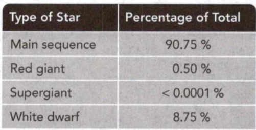
    <figcaption>Figure 25. Star distribution Milky Way galaxy.</figcaption>
  </figure>

17. The table in Figure 25 gives an estimate of star distribution in the Milky
Way galaxy. According to the table, what is the most common type of star in the
Milky Way?
A) main-sequence star
B) red giant
C) supergiant
D) white dwarf

18. What is the main factor that affects the evolution of a star?
A) color
B) brightness
C) mass
D) parallax

19. Which describes the volume of the sun in relation to the volume of Earth?
A) more than ten times greater
B) more than a hundred times greater
C) more than a thousand times greater
D) more than a million times greater 

20. Which of the following best describes a reflecting telescope?
A) Isaac Newton invention
B) has an objective lens 
C) is the smallest telescope
D) has a mirror lens

21. What is one example of electromagnetic energy?
A) electricity
B) heat
C) infrared light
D) sound waves

  <figure>
    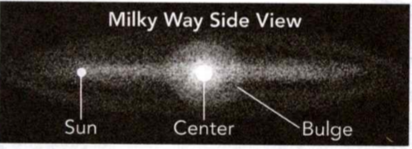
    <figcaption>Figure 26. Milky Way Side View.</figcaption>
  </figure>

22. Use the diagram in Figure 26 to answer this question. Describe the
appearance of the Milky Way as you would see it both from Earth and from a point
directly above the galaxy. Why does the galaxy look different from different
places?

