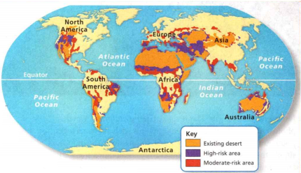
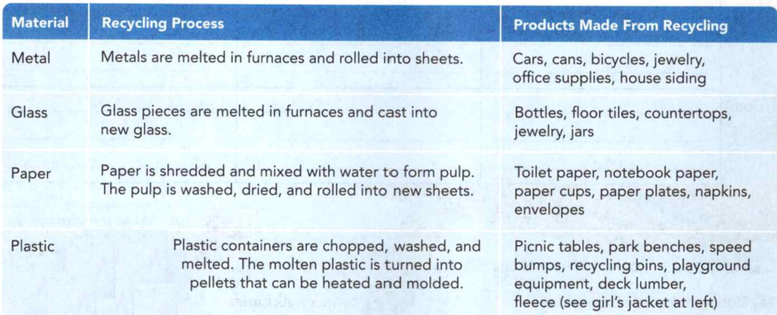

### Earth Science

## Geology

## Land, Air, and Water Resources

- The **water cycle** is the continuous process by which water moves from
Earth's surface to the atmosphere and back.

- **Evaporation** is the process by which molecules of liquid water absorb
energy and change to a gas.

- The **atmosphere** is the envelope of gases that surrounds the planet.

**Complete the tasks below.**

1. On a lazy summer day, Mia pours water on the hot sidewalk and imagines where
the water will go as it travels through the water cycle. After the water
evaporates, it may float through the atmosphere and fall as rain in faraway
lands or the ocean. What makes the water cycle a cycle?

### Chapter Preview

- natural resource 
- pollution
- point source 
- nonpoint source
- environmental science
- renewable resource
- nonrenewable resource
- sustainable use
- ecological footprint
- conservation
- litter 
- topsoil 
- subsoil
- bedrock 
- erosion
- nutrient depletion 
- fertilizer
- desertification 
- drought
- land reclamation
- municipal solid waste
- incineration 
- pollutant
- leachate 
- sanitary landfill
- recycling 
- biodegradable
- hazardous waste
- emissions 
- photochemical smog
- ozone 
- temperature inversion
- acid rain 
- radon 
- ozone layer
- chlorofluorocarbon
- groundwater 
- pesticide
- sewage 
- sediment

### Introduction to Environmental Issues
- What Are the Types of Environmental Issues? 
- How Are Environmental Decisions Made?

**Complete the tasks below.**

1. You have probably heard of scientists who study animals, plants, rocks, and
everything eke in an ecosystem. Social scientists study an often-overlooked but
very important part of any ecosystem-the people who use it! These scientists
study how people value nature. They study how much people would be willing to
pay to preserve nature. They also study how different age groups, genders,
races, and social groups use nature. For example, a scuba diver wants coral
reefs to remain beautiful and full of all kinds of organisms to enjoy in future
dives. A commercial fisherman cares more about a coral reef supporting the kind
of fish he wants to catch. You might care about coral reefs because you want to
visit one someday. Do you think it is important to consider how people value
nature? Explain.

### What Are the Types of Environmental Issues?

Here is a riddle for you what place is bigger than the United States and Mexico
combined? This place is covered with ice more than two kilometers thick. It is a
habitat for many animals and is a source of oil, coal, and iron. Stumped? The
answer is Antarctica. Some people think of Antarctica as a useless, icy
wasteland, but there are unique wildlife habitats in Antarctica. There are also
valuable minerals beneath its thick ice.

What is the best use of Antarctica? Many people want access to its rich deposits
of minerals and oil. Others worry that mining will harm its delicate ecosystems.
Some people propose building hotels, parks, and ski resorts. Others think that
Antarctica should remain undeveloped. Who should decide Antarctica's fate?

In 1998, 26 nations agreed to ban mining and oil exploration in Antarctica for
at least 50 years. As resources become more scarce elsewhere in the world, the
debate will surely continue.

Antarctica's future is just one environmental issue that people face today. 
**Environmental issues fall into three general categories: population growth,
resource use, and pollution.** Because these three types of issues are
interconnected, they are very difficult to study and resolve.

### Population Growth 

The human population grew very slowly until about A.D. 1650. Around that time,
improvements in medicine, agriculture, and waste disposal led to people living
longer. The human population has been growing faster and faster since then.

When a population grows, the demand for resources also grows. Has your town or
city ever experienced a water shortage? If so, you might have noticed that
people have been asked to restrict their water use. This sometimes happens in
areas with fast-growing populations. The water supplies in such areas were
designed to serve fewer people than they now do, so shortages can occur during
unusually dry weather.

### Resource Use 

Earth provides many materials people use throughout their lives. Anything that
occurs naturally in the environment and is used by people is called a **natural
resource**. Natural resources include trees, water, oil, coal, and other things.
However, people do not use resources in the same way. In some areas of the
world, people use a wide variety of resources. In other areas, people have
little or no access to certain natural resources. For example, people in central
Asia live too far away from ocean waters that provide fish and other resources.
Conflict arises when a natural resource is scarce or used in a way that people
feel is unfair.

### Pollution 

Many environmental factors can contribute to less than ideal conditions on Earth
for people or other organisms. The contamination of Earth's land, water, or air
is called **pollution**. Pollution can be caused by wastes, chemicals, noise, heat,
light, and other sources. Pollution can destroy wildlife and cause human health
problems.

Pollution is usually related to population growth and resource use. As you
probably know, the burning of gasoline releases pollutants into the air. With
more cars on the road, more gasoline is used, so more pollutants are released
into the air. As populations grow and more people need to be fed, more
fertilizers and other chemicals may be used to produce that food. As these
chemicals run off the land, they can pollute bodies of water.

Pollution sources can be grouped into two categories. A **point source** is a
specific pollution source that can be identified. A pipe gushing polluted water
into a river is an example of a point source. A nonpoint source of pollution is
not as easy to identify. A **nonpoint source** is widely spread and cannot be
tied to a specific origin. For example, the polluted air that can hang over
urban areas comes from vehicles, factories, and other polluter; The pollution
cannot be tied to any one car or factory.

### How Are Environmental Decisions Made?

Dealing with environmental issues means making decisions. Decisions can be made
at many levels. Your decision to walk to your friend's house rather than ride in
a car is made at a personal level. A town's decision about how to dispose of its
trash is made at a local level. A decision about whether the United States
should allow oil drilling in a wildlife refuge is made on a national level.
Decisions about how to protect Earth's atmosphere are made on a global level.
Your personal decisions have a small impact. But when the personal decisions of
millions of people are combined, they have a huge impact on the environment.

### Balancing Different Needs 

Lawmakers work with many groups to make environmental decisions. One such group
is environmental scientists. **Environmental science** is the study of natural
processes in the environment and how humans can affect them. Data provided by
environmental scientists are only part of the decision-making process.
Environmental decision making requires a balance between the needs of the
environment and the needs of people. **To help balance the different opinions on
an environmental issue, decision makers weigh the costs and benefits of a
proposal for change before making a decision.**

### Types of Costs and Benefits 

Costs and benefits are often economic. Will a proposal provide jobs? Will it
cost too much money? Costs and benefits are not measured only in terms of money.
For example, suppose a state must decide whether to allow logging in a certain
area. Removing trees changes the ecosystem, which is an ecological cost.
However, the wood and jobs provided by the logging are economic benefits.

It is also important to consider the short-term and long-term costs and benefits
of an environmental decision. A plan's short-term costs might be outweighed by
its long-term benefits.

### Costs of Offshore Drilling
- Setting up sites is expensive.
- Transporting the oil is risky and expensive.
- Oil supply is limited and will not meet energy demands.
- Oil spills and leaks harm marine organisms and the environment.

### Benefits of Offshore Drilling
- Creates jobs
- A larger oil supply lowers oil prices.
- Provides new oil supply to fight shortages
- Reduces dependence on foreign oil

**Complete the tasks below.**

1. Arguing Over Antarctica Some people want to leave Antarctica wild. Others
want it developed. Outline each argument.
a) Keep Antarctiva Wild
b) Develop Antarctica

2. The word conflict means a disagreement between people, ideas, or interests.
What causes conflicting opinions about natural resource use?

3. We use natural resources many times a day without even realizing it! A trip
to the beach uses land, water, fuel, and many other resources. List all the ways
you have used natural resources so far today. For example, a book is made of
paper that started as a tree.

4. What is a natural resource?

5. How is population growth related to resource use and pollution?

6. List:
a) Some causes of pullution.
b) some effects of pullution.

7. Suppose you are a member of a city planning board. A company wants to buy a
piece of land outside the city and build a factory on it. When you go into work
one day, you are met by protesters demanding that the land be turned into a
wildlife park.
a) How should you decide what to do with the land?
b) What are some ways you could find out people's opinions about the issue?

8. Weighing Costs and Benefits Costs of Offshore Drilling: - Setting up sites is
expensive. - Transporting the oil is risky and expensive. - Oil supply is
limited and will not meet energy demands. - Oil spills and leaks harm marine
organisms and the environment. Benefits of Offshore Drilling: - Creates jobs - A
larger oil supply lowers oil prices. - Provides new oil supply to fight
shortages - Reduces dependence on foreign oil Once you have identified the
potential costs and benefits of a decision, you must analyze them. Write a brief
letter to your senator explaining your opinion either in favor of or against
offshore drilling.

### Introduction to Natural Resources
- What Are Natural Resources?
- Why Are Natural Resources Important?

**Complete the tasks below.**

1. "It was a spring without voices. On the mornings that had once throbbed with the
dawn chorus of robins . . . there was now no sound; only silence lay over the
fields and woods and marsh." -Rachel Carson In the twentieth century, farmers
began to use chemicals to fight insects that killed their crops. People didn't
realize that these chemicals were hurting other animals as well. Rachel Carson,
born in 1907, was a scientist who wrote about sea life and nature. Carson began
to worry about these chemicals. in 1962, she wrote the book Silent Spring. She
explained what was happening to animals on land, in the air, and in the sea.
Today, people are more careful to protect living things.
a) What dangers did Rachel Carson warn people about?
b) Do you think the spring Carson wrote about would look different now that some
harmful chemicals are banned? Why or why not?

### What Are Natural Resources?

Did you turn on a light or use an alarm clock today? Flush a toilet or take a
shower? Ride in a car or bus? Eat some food? Use any paper-other than this page
that you are reading right now? All of these things-and so much more-depend on
Earth's resources.

Recall that anything that occurs naturally in the environment and is used by
people is called a natural resource. **Natural resources include organisms, water,
sunlight, minerals, and oil.**

### Renewable Resources 

A **renewable resource** is either always available or is naturally replaced in a
relatively short time. Some renewable resources, like wind and sunlight, are
almost always available. Other renewable resources, like water and trees, are
renewable only if they are replaced as fast as they are used.

  <figure>
    
    <figcaption>Figure 1. Trees.</figcaption>
  </figure>

### Nonrenewable Resources 

Over millions of years, natural processes changed the remains of organisms into
the substances now called oil and coal. Today's world is powered by these fuels.
Humans use these resources much faster than they are naturally replaced.
Resources that are not replaced in a useful time frame are **nonrenewable
resources**. Metals and minerals are also nonrenewable. Remember that some
resources, such as trees, may be renewable or nonrenewable, depending on how
quickly they are replaced.
  

### Why Are Natural Resources Important?

Humans cannot live without some natural resources, such as sunlight and fresh
water. Others, such as metals, are necessary to sustain modern life. **Humans
depend on Earth's natural resources for survival and for development.**

### How People Use Resources 

Around the world, people rely on natural resources for the same basic needs. Not
all resources are equally available in all parts of the world. In some areas,
there is a plentiful supply of clean fresh water. In other areas, water is
scarce. In some places, pollution threatens the water supply.

Globally, fuels are used for cooking, heating, and power. Different fuels are
common in different parts of the world. Coal is plentiful in some areas of the
world and oil is plentiful in others. See Figure 2. In some areas, wood is the
main fuel, not coal or oil.

  <figure>
    
    <figcaption>Figure 2. Resources Around the World.</figcaption>
  </figure>

### Sustainable Use 

How long a resource lasts depends on how people use it. **Sustainable use** of a
resource means using it in ways that maintain the resource at a certain quality
for a certain period of time. For example, a city may want to manage a river.
Does the city want the water to be clean enough to drink or clean enough to swim
in? Does the city want the water to be clean for fifty years, two hundred years,
or indefinitely? The answers to these questions define what would be considered
sustainable use of the river. However, it may not be sustainable from an
ecological perspective even if it meets human needs. Other clues rarther down
the river may have different answers to those questions, but their plans could
also be considered sustainable if they met their goals. Because of these
differences, policymakers and lawmakers struggle to define sustainable use. The
struggle adds to the challenge of regulating resources.

### Ecological Footprint 

The amount of land and water that individuals use to meet their resource needs
and absorb the waste they produce is called an **ecological footprint**. A high
level of resource use means a larger footprint. A low level of resource use
means a smaller footprint. Refer to Figure 3.

Ecological Footprint, see Figure 3. Everything you do contributes to your
ecological footprint, from how you travel, to the food you eat, to the home you
live in. Ecological footprints vary among individuals and among nations,
depending on how people live.

  <figure>
    
    <figcaption>Figure 3. Ecological Footprint.</figcaption>
  </figure>

### Conservation 

While we cannot avoid using resources, there are better ways to use them.
Resource **conservation** is the practice of managing the use of resources wisely so
the resources last longer. Conservation cannot make resources last forever, but
it can make resources last longer.

Governments and industries greatly affect resource conservation. Even
individuals can make a difference. Walking, riding a bike, or riding the bus
conserves fuel resources. People can also conserve resources when they turn off
lights and unplug equipment that they are not using. Taking shorter showers
saves water. When many people make small changes, the results can be huge.

**Complete the tasks below.**

1. The tree it the first diagram in Figure 1 are being harvested for wood. The
landowner tells you the trees are a renewable resource. Based on the number of
trees being harvested and replanted, is the landowner right? Why?

2. Categorizing Resources. Resources are grouped into two main categories:
renewable and nonrenewable. Gold is nonrenewable. Find examples of renewable and
nonrenewable resources.
a) Renewable Resources. Replaced in a short time or always available. Examples:
b) Nonrenewable Resources. Not replaced in a useful time frame. Examples:
c) Both. Fits both natural resource categories. Example:

3. What is a renewable resource?

4. Sunlight and trees are both natural resources. How are they different?

5. Resources Around the World, see Figure 2. People use natural resources in
different ways around the world. In Sierra Leone, entire communities get their
drinking water from a main well. In China, coal is delivered to homes by bicycle
to be burned for heat. In Iceland, most homes get hot water and heat from the
energy of the hot, liquidlike rock under Earth's surface.
Describe one way you use natural resources.
  
  <figure>
    
    <figcaption>Figure 4. Average Ecological Footprint.</figcaption>
  </figure>

6. The chart in Figure 4 gives the average ecological footprints for the people
of several countries. It also gives the footprint for each country as a whole
Ecological footprints are measured in global hectares. A global hectare (gha) is
a unit of area. It is adjusted to compare how much life different places on
Earth can support.
a) Which country has the largest ecological footprint?
b) About how many times larger is the average ecological footprint per person in
the United States than per person in Mexico?
c) China has a smaller ecological footprint per person than the United Kingdom,
but a much larger total ecological footprint. Why?

7. Conserving Resources at School. Students like you can take action to conserve
natural resources. What are ways your school can conserve resources?

8. Resources (are/are not) equally available around the world.

9. What two factors determine whether or not a resource is being used
sustainably?

10. As the human population continues to grow, how do you think it will affect
the use of natural resources?

### Conserving Land and Soil.
- How Do People Use Land?
- Why Is Soil Management Important?

**Complete the tasks below.**

1. Land inspiration. "Conservation is a state of harmony between men and land."
-Aldo Leopold. Aldo Leopold spent his life in beautiful landscapes. He was so
inspired by what he saw that he sought to better understand ft. Leopold realized
that and and all it contains-living and nonliving-are connected. He believed
people should use land in a way that protects it for all living things as well
as for future generations. Leopold called his idea the "land ethic." He wrote
several books on conservation using this philosophy, including his most famous
book, A Sand County Almanac. How do you think land should be used?

### How Do People Use Land?

Less than a quarter of Earth's surface is dry, ice-free land. All people on
Earth must share this limited amount of land to produce their food, build
shelter, and obtain resources. As the American author Mark Twain once said about
land, "They don't make it anymore7

People use land in many ways. CM Three uses that change the land are
agriculture, mining, and development. See Figure 5.

  <figure>
    
    <figcaption>Figure 5. Land Use.</figcaption>
  </figure>

### Agriculture 

Land provides most of the food that people eat. Crops such as wheat require lots
of fertile land, but less than a third of Earth's land can be farmed. The rest
is too dry, too salty, or too mountainous. New farmland is created by clearing
forests, draining wetlands, and irrigating deserts. Land can also be used to
grow food for animals, to provide grazing for livestock, or to grow crops such
as cotton.

### Mining 

Mining is the removal of nonrenewable resources from the land. Resources just
below the surface are strip mined. Strip mining removes a strip of land to
obtain minerals. The strip is then replaced. Strip mining exposes soil, which
can then be blown or washed away. The area may remain barren for years.
Resources can also be removed from deeper underground by digging tunnels to
bring the minerals to the surface.

### Development 

People settled in areas that had good soil near fresh water. As populations
grew, the settlements became towns and cities. People developed the land by
constructing buildings, bridges, and roads. In the United States, an area half
the size of New Jersey is developed each year.

### Why Is Soil Management Important?

To understand why soil management is important, you need to know about the
structure and function of fertile soil. It can take hundreds of years to form
just a few centimeters of new soil. Soil contains the minerals and nutrients
that plants need to grow. Soil also absorbs, stores, and filters water.
Bacteria, fungi, and other organisms in soil break down the wastes and remains
of living things. See Figure 6.

  <figure>
    
    <figcaption>Figure 6. Structure of Fertile Soil.</figcaption>
  </figure>

### Soil Use Problems 

Because rich topsoil takes so long to form, it is important to protect Earth's
soil. **Without soil, most life on land could not exist. Poor soil management
can result in three problems: erosion, nutrient depletion, and
desertification.** Fortunately, damaged soil can sometimes be restored.

### Erosion 

Normally, plant roots hold soil in place. But when plants are removed during
logging, mining, or farming, the soil is exposed and soil particles can easily
move. The process by which water, wind, or ice moves particles of rocks or soil
is called **erosion**. Terracing, one farming method that helps reduce erosion, is
shown in Figure 7.

 
  <figure>
    
    <figcaption>Figure 7. Terracing.</figcaption>
  </figure>

### Nutrient Depletion 

Plants make their own food through photosynthesis. Plants also need nutrients
such as the nitrogen, potassium, and phosphorus found in soil to grow.
Decomposers supply these nutrients to the soil as they break down the wastes and
remains of organisms. But if a farmer plants the same crops in a field every
year, the crops may use more nutrients than the decomposers can supply. The soil
becomes less fertile, a situation called **nutrient depletion**.

When soil becomes depleted, farmers usually apply **fertilizers**, which include
nutrients that help crops grow better. Farmers may choose other methods of soil
management, too. They may periodically leave fields unplanted. The unused parts
of crops, such as cornstalks, can be left in fields to decompose, adding
nutrients to the soil. Farmers also can alternate crops that use many nutrients
with crops that use fewer nutrients.

### Desertification 

If the soil in a once-fertile area becomes depleted of moisture and nutrients,
the area can become a desert. The advance of desertlike conditions into areas
that previously were fertile is called **desertification**.

One cause of desertification is climate. For example, a **drought** is a period when
less rain than normal falls in an area. During droughts, crops fail. Without
plant cover, the exposed soil easily blows away. Overgrazing of grasslands by
cattle and sheep and cutting down trees for firewood can cause desertification,
too.

Desertification is a serious problem. People cannot grow crops and graze
livestock where desertification has occurred. As a result, people may face
famine and starvation. Desertification is severe in central Africa. Millions of
rural people there are moving to the cities because they can no longer support
themselves on the land.

  
  <figure>
    
    <figcaption>Figure 8. Desertification Map.</figcaption>
  </figure>

### Land Reclamation 

Fortunately, it is possible to replace land damaged by erosion or mining. The
process of restoring an area of land to a more productive state is called **land
reclamation**. In addition to restoring land for agriculture, land reclamation can
restore habitats for wildlife. Many different types of land reclamation projects
are currently underway all over the world. But it is generally more difficult
and expensive to restore damaged land and soil than it is to protect those
resources in the first place. In some cases, the land may not return to its
original state.

  <figure>
    
    <figcaption>Figure 9. Land Reclamation.</figcaption>
  </figure>

**Complete the tasks below.**

1. Land Use, see Figure 5. The ways that people use land vary greatly. For
example, about 93 percent of land in Nebraska is used for agriculture, while
only 10 percent of land in Massachusetts is used for agriculture. How is land
used in your area?

2. Structure of Fertile Soil, see Figure 6. Fertile soil is made up of several
layers, including litter, topsoil, and subsoil. Litter - The top layer of dead
leaves and grass is called **litter**. Subsoil - Below the topsoil is the
subsoil. The **subsoil** also contains rock fragments, water, and air, but has
less animal and plant matter than the topsoil. Bedrock - All soil begins as
**bedrock**, the rock that makes up Earth's crust. Natural processes such as
freezing and thawing gradually break apart the bedrock. Plant roots wedge
between rocks and break them into smaller pieces. Acids in rainwater and
chemicals released by organisms slowly break the rock into smaller particles.
Animals such as earthworms and moles help grind rocks into even smaller
particles. As dead organisms break down, their remains also contribute to the
mixture. Topsoil - The next layer, **topsoil**, is a mixture of rock fragments,
nutrients, water, air, and decaying animal and plant matter. The water and
nutrients are absorbed by plant roots in this layer. Identify the organisms that
make up or play a role in each soil layer.

3. Identify causes and effects of two soil use problems.

4. Terracing, see Figure 7. A terrace is a leveled section of a hill used to grow
crops and prevent erosion. The flat surfaces allow crops to absorb water before
the water flows downhill.
a) Draw the path of water down the first hill and the terraced hill.
b) Why do you think terracing helps prevent erosion?

5. Desertification affects many areas around the world, see Figure 8.
a) Which continent has the most existing desert?
b) Where in the United States is the greatest risk of desertification?
c) Is desertification a threat only in areas where there is existing desert?
Explain. Circle an area on the map to support your answer.
d) If an area is facing desertification, what are some things people could do to
possibly limit its effects?

6. Land Reclamation, see Figure 9. These pictures show land before and after it
was mined. Write a story about what happened to the land.

7. Subsoil has (less/more) plant and animal matter than topsoil.
8. What can happen to soil if plants are removed?

9. What are some problems that could prevent people from supporting land
reclamation?

### Waste Disposal and Recycling
- What Are Three Solid Waste Disposal Methods? 
- What Are the Major Categories of Recycling? 
- How Are Hazardous Wastes Safely Disposed Of?

### What Are Three Solid Waste Disposal Methods?

People generate many types of waste, including empty packaging, paper, and food
scraps. The wastes produced in homes, businesses, schools, and in the community
are called **municipal solid waste**. Other sources of solid waste include
construction debris, agricultural wastes, and industrial wastes. **Three methods
of handling solid waste are burning, burying, and recycling. Each method has its
advantages and disadvantages.**

### Incineration 

The burning of solid waste is called **incineration**. The burning facilities, or
incinerators, do not take up much space. They do not directly pollute
groundwater. The heat produced by burning solid waste can be used to produce
electricity. Incinerators supply electricity to many homes.

Unfortunately, incinerators do have drawbacks. Even the best incinerators create
some air pollution. Although incinerators reduce the volume of waste by as much
as 90 percent, some waste still remains and needs to be disposed of somewhere.
Incinerators are also expensive to build.

  
  <figure>
    
    <figcaption>Figure 11. Sanitary Landfill Design.</figcaption>
  </figure>

### Landfills 

Until fairly recently, people disposed of waste in open holes in the ground
called dumps. Some of this waste polluted the environment. Any substance that
causes pollution is a **pollutant**. Dumps were dangerous and unsightly. Rainwater
falling on a dump dissolved chemicals from the wastes, forming a polluted liquid
called **leachate**. Leachate could run off into streams and lakes, or trickle down
into the groundwater.

In 1976, the government banned open dumps. Now much solid waste is buried in
landfills that are built to hold the wastes more safely. A **sanitary landfill**
holds municipal solid waste, construction debris, and some types of agricultural
and industrial waste. Figure 1 shows the parts of a well-designed sanitary
landfill. Once a landfill is full, it is covered with a clay cap to keep
rainwater from entering the waste.

Even well-designed landfills can pollute groundwater. Capped landfills can be
reused as parks and sites for sports arenas. They cannot be used for housing or
agriculture.

### Recycling 

You may have heard of the "three R's"-reduce, reuse, and recycle. Reduce refers
to creating less waste from the beginning, such as using cloth shopping bags
rather than disposable ones. Reuse refers to finding another use for an object
rather than discarding it, such as refilling reusable bottles with drinking
water instead of buying new bottled water.

The process of reclaiming raw materials and reusing them to create new products
is called **recycling**. You can recycle at home and encourage others to recycle.
You can buy products made from recycled materials. Your purchase makes it more
profitable for companies to use recycled materials in products.

Another way to reduce solid waste is to start a compost pile. The moist, dark
conditions in a compost pile allow natural decomposers to break down grass
clippings, leaves, and some food wastes. Compost is an excellent natural
fertilizer for plants.

### What Are the Major Categories of Recycling?

Recycling reduces the volume of solid waste by reusing materials. Recycling uses
energy, but it also saves the energy that would be needed to obtain, transport,
and process raw materials. Recycling is also cheaper than making new materials.
Additionally, recycling conserves nonrenewable resources and limits the
environmental damage caused by mining for raw materials.

Materials that can be broken down and recycled by bacteria and other decomposers
are **biodegradable**. Many products people use today are
not biodegradable, such as plastic containers, metal cans, rubber tires, and
glass jars. Instead, people have developed different ways to recycle the raw
materials in these products.

A wide range of materials can be recycled. **Most recycling focuses on four
major categories of products: metal, glass, paper, and plastic.**

  <figure>
    
    <figcaption>Figure 12. Recycling Table.</figcaption>
  </figure>

Is recycling worthwhile? Besides conserving resources, recycling saves energy.
Making aluminum products from recycled aluminum rather than from raw materials
uses about 90 percent less energy overall. For certain materials, recycling is
usually worthwhile. However, recycling is not a complete answer to the solid
waste problem. For some cities, recycling is not cost-effective. Scientists have
not found good ways to recycle some materials, such as plastic-coated paper and
plastic foam. Some recycled products, such as low-quality recycled newspaper,
have few uses. All recycling processes require energy and create pollution. The
value of recycling must be judged on a case-by-case basis.

### How Are Hazardous Wastes Safely Disposed Of?

Many people picture hazardous wastes as bubbling chemicals or oozing slime. Any
material that can be harmful to human health or the environment if it is not
properly disposed of is a **hazardous waste**.

### Types of Hazardous Wastes 

Toxic wastes can damage the health of humans and other organisms. Explosive
wastes can react very quickly when exposed to air or water, or explode when
dropped. Flammable wastes easily catch fire. Corrosive wastes can dissolve many
materials. Everyday hazardous wastes include electronic devices, batteries, and
paint.

Other wastes that require special disposal are radioactive wastes. Radioactive
wastes give off radiation that can cause cancer and other diseases. Some
radioactive waste can remain dangerous for millions of years.

### Health Effects 

A person can be exposed to hazardous wastes by breathing, eating, drinking, or
touching them. Even short-term exposure to hazardous wastes can cause problems
such as skin irritation or breathing difficulties. Long-term exposure can cause
diseases such as cancer, damage to body organs, or death.
  
  <figure>
    
    <figcaption>Figure 14. Sort It Out.</figcaption>
  </figure>

### Disposal Methods 

It is difficult to safely dispose of hazardous wastes. Hazardous wastes are most
often disposed of in carefully designed landfills. The landfills are lined and
covered with clay and plastic. These materials prevent chemicals from leaking
into the soil and groundwater. **Hazardous wastes that are not disposed of in
carefully designed landfills may be incinerated or broken down by organisms.
Liquid wastes may be stored in deep rock layers.**

Scientists are still searching for methods that will provide safe and permanent
disposal of radioactive wastes. Some wastes are currently stored in vaults dug
hundreds of meters underground or in concrete and steel containers above ground.

### Disposal Sites 

It is a challenge to decide where to build hazardous waste disposal facilities.
In general, people would prefer to have a single large facility located in an
area where few people live. However, it may be safer, cheaper, and easier to
transport wastes to small local facilities instead.

### Reducing Hazardous Waste 

The best way to manage hazardous wastes is to produce less of them in the first
place. Industries are eager to develop safe alternatives to harmful chemicals.
At home, you can find substitutes for some hazardous household chemicals. For
example, you could use citronella candles instead of insect spray to repel
insects.

**Complete the tasks below.**

1. Trash Talk. Here are some interesting facts about trash: - Every hour, people
throw away 2.5 million plastic bottles. - Recycling one aluminum can saves
enough energy to run a TV for three hours. - Americans create two kilograms of
trash per day. That trash could fill 63,000 garbage trucks each day! - In 2005
the U.S. government recorded the first-ever drop in the amount of trash produced
from the previous year. Trash declined by 1.5 million metric tons from 2004 to
2005, partly due to an increase in recycling.
a) Do you think the amount of trash we produce will increase or decrease in the future? Explain.
b) What can you do to reduce the amount of trash you create?

  <figure>
    
    <figcaption>Figure 10. Graph.</figcaption>
  </figure>

2. What happens to all the trash, see Figure 10? Disposal Method - Waste
(Percent). Incineration - 13%. Landfills - 54%. Recycling - 33%.
a) Use the data in the table and the key to fill in the bar graph. The graph
represents the methods of municipal waste disposal in the United States in 2007. 
b) Give the graph a title.
c) Why do you think incineration is the least popular method of solid waste
disposal?

3. Sanitary Landfill Design, see Figure 11. Sanitary landfills are designed to
protect the surrounding area. **Leachate Treatment** Leachate is pumped into
tanks for chemical treatment. **Leachate Collection** Water moving through the
landfill dissolves wastes, forming leachate. **Monitoring Wells** Liquid is
tested to detect pollutants in groundwater. Use the terms listed in the word
bank to fill in the missing labels on the diagram. Word Bank: Vent Pipes,
Liners, Solid Waste Layers.
a) ___ Pipes release gases produced when bacteria break down wastes.
b) ___ Compacting the waste prevents settling. Each layer is covered with clean
soil or plastic.
c) ___ Clay and plastic liners prevent liquids from reaching the soil.
d) Why is it important for landfills to be carefully designed?

4. Identify one pro and one con for each of the three solid waste disposal methods.
a) Incineration pro
b) Incineration con
c) Sanitary Lanfills pro
d) Sanitary Lanfills con
e) Recycling pro
f) Recycling con

5. What is incineration?

6. What could be some possible uses for the space over a landfill once it is capped? 

7. Which solid waste disposal method do you think is best? Why?

8. The prefix bio- means "life." A material is biodegradable if it can be broken
down and recycled by living things such as ___

  <figure>
    
    <figcaption>Figure 13. Like New.</figcaption>
  </figure>

9. Like New, see Figure 13. Did you know that old tires can be made into belts?
Or jeans into insulation? Besides the examples shown, name other objects that
could be made from these recyclables.
a) Tire
b) Jeans
c) Plastic bottle

10. How does recycling save energy?

11. How could your community solve its solid waste problem?

12. Sort It Out, see Figure 14! Wastes can be thrown away, recycled, or disposed of
as hazardous waste. Draw a line from each object to its appropriate disposal
container.
a) Waste/Recycle/Hazardous Waste
b) Waste/Recycle/Hazardous Waste
c) Waste/Recycle/Hazardous Waste
d) Waste/Recycle/Hazardous Waste
e) Waste/Recycle/Hazardous Waste
f) Waste/Recycle/Hazardous Waste
g) Waste/Recycle/Hazardous Waste
h) Waste/Recycle/Hazardous Waste
i) Waste/Recycle/Hazardous Waste
j) Waste/Recycle/Hazardous Waste

13. Hazardous waste can be harmful if improperly handled. What is the best way to
manage hazardous wastes?
A) Store waste in small facilities.
B) Produce less waste to start. 
C) Incinerate waste.

14. What are some negative health effects of exposure to hazardous wastes?

15. Do you think hazardous wastes should be disposed of at one large central
facility? Explain.

### Air Pollution and Solutions
- What Causes Outdoor and Indoor Air Pollution? 
- What Causes Damage to the Ozone Layer? 
- How Can Air Pollution Be Reduced?

**Complete the tasks below.**

1. Drawing for a Difference. Some people may think that kids can't help the
environment. Kids in the San Joaquin Valley of California know better! Each
year, students enter their drawings into a contest for a Clean Air Kids Calendar
sponsored by the San Joaquin Valley Air Pollution Control District. Lisa Huang
and Saira Delgada are two middle school students whose work was chosen to be a
part of the 2008 calendar. Their drawings show people why healthy air is
important. Every time people looked at the calendar, the drawings reminded them
of the simple ways they can help the planet. How could you raise awareness about
air pollution in your community?

### What Causes Outdoor and Indoor Air Pollution?

You can't usually see it, taste it, or smell it, but you are surrounded by air.
Air is a mixture of nitrogen, oxygen, carbon dioxide, water vapor, and other
gases. Almost all living things depend on these gases to survive. Recall that
these gases cycle between living things and the atmosphere. These cycles
guarantee that the air supply will not run out, but they don't guarantee that
the air will be clean.

### Outdoor Air Pollution 

What causes air pollution? Until the mid-1900s in the United States, factories
and power plants that burned coal produced most of the pollutants, or
**emissions**, that were released into the air. **Today, a large source of
emissions resulting in air pollution outdoors comes from motor vehicles such as
cars and trucks.** There are also some natural causes of air pollution. Methane
released from animals such as cows also sends pollutants into the atmosphere.

Air pollution sources can be grouped as point or nonpoint sources. A point
source is a specific source of pollution that is easy to identify, such as a
smokestack. A nonpoint source is a source that is widely spread and cannot be
tied to a specific origin, such as vehicle emissions. So the pollution cannot be
traced to any specific vehicle.
  
  <figure>
    
    <figcaption>Figure 15. Volcanoes and Air Pollution.</figcaption>
  </figure>

### Smog 

Have you ever heard a weather forecaster talk about a "smog alert"? A smog alert
is a warning about a type of air pollution called photochemical smog.
**Photochemical smog** is a thick, brownish haze formed when certain gases in the
air react with sunlight. When the smog level is high, it settles as a haze over
a city. Smog can cause breathing problems and eye and throat irritation.
Exercising outdoors can make these problems worse.

The major sources of smog are the gases emitted by cars and trucks. Burning
gasoline in a car engine releases gases into the air. These gases include
hydrocarbons (compounds containing hydrogen and carbon) and nitrogen oxides. The
gases react in the sunlight and produce a form of oxygen called **ozone**. Ozone,
which is toxic, is the major chemical found in smog. Ozone can cause lung
infections and damage the body's defenses against infection.

Normally, air close to the ground is heated by Earth's surface. As the air
warms, it rises into the cooler air above it. Any pollutants in the air are
carried higher into the atmosphere and are blown away from the place where they
were produced.

Certain weather conditions can cause a condition known as a temperature
inversion. During a **temperature inversion**, as shown in Figure 16, a layer of warm
air prevents the rising air from escaping. The polluted air is trapped and held
close to Earth's surface. The smog becomes more concentrated and dangerous.

  <figure>
    
    <figcaption>Figure 16. Temperature Inversion.</figcaption>
  </figure>

### Acid Rain 

Precipitation that is more acidic than normal because of air pollution is called
**acid rain**. Acid rain can also take the form of snow, sleet, or fog. Acid rain is
caused by the emissions from power plants and factories that burn coal and oil.
These fuels produce nitrogen oxides and sulfur oxides when they are burned. The
gases that are released react with water vapor in the air, forming nitric acid
and sulfuric acid. The acids dissolve in precipitation and return to Earth's
surface.

As you can imagine, acid falling from the sky has some negative effects. When
acid rain falls into a pond or lake, it changes the conditions there. Many fish,
particularly their eggs, cannot survive in more acidic water. When acid rain
falls on plants, it can damage their leaves and stems. Acid rain that falls on
the ground can also damage plants by affecting the nutrient levels in the soil.
Whole forests have been destroyed by acid rain. Fortunately, some of the effects
of acid rain are reversible. Badly damaged lakes have been restored by adding
lime or other substances that neutralize the acid.

  <figure>
    
    <figcaption>Figure 17. Acid Rain.</figcaption>
  </figure>

Acid rain doesn't just affect living things, The acid reacts with stone and
metal in buildings and statues. Statues and stonework damaged by acid rain may
look as if they are melting, as seen in Figure 17. Automobiles rust more quickly
in areas with acid rain. These effects are not reversible and the damage can be
costly.

### Indoor Air Pollution 

You might think that you can avoid air pollution by staying inside. The air
inside buildings can be polluted, too. Some substances that cause indoor air
pollution, such as dust and pet hair, bother only those people who are sensitive
to them. Other indoor air pollutants, such as toxic chemicals, can affect
anyone. Glues and cleaning supplies may give off toxic fumes. Cigarette smoke,
even from another person's cigarette, can damage the lungs and heart. Figure 18
shows some sources of air pollution that can be found in homes.
  
  <figure>
    
    <figcaption>Figure 18. Indoor Air Pollution.</figcaption>
  </figure>

### Carbon Monoxide 

One particularly dangerous indoor air pollutant is carbon monoxide. Carbon
monoxide is a colorless and odorless gas that forms when fuels are not
completely burned. When carbon monoxide builds up in an enclosed space, like a
house, it can be deadly. Any home heated by wood, coal, oil, or gas needs a
carbon monoxide detector.

### Radon 

Another indoor air pollutant that is difficult to detect is radon. **Radon** is
a colorless, odorless gas that is radioactive. It is formed naturally by certain
rocks underground. Radon can enter homes through cracks in basement walls or
floors. Breathing radon gas over many years may cause lung cancer and other
health problems. Homeowners can install ventilation systems to prevent radon
from building up in their homes.

### What Causes Damage to the Ozone Layer?

If you have ever had a sunburn, you have experienced the painful effects of the
sun's ultraviolet radiation. But did you know that sunburns would be even worse
without the protection of the ozone layer? The **ozone layer** is a layer of the
upper atmosphere about 15 to 30 kilometers above Earth's surface. The amount of
ozone in this layer is very small. Yet even this small amount of ozone in the
ozone layer protects people from the effects of too much ultraviolet radiation.
These effects include sunburn, eye diseases, and skin cancer.

Because you read earlier that ozone is a pollutant, the fact that ozone can be
helpful may sound confusing. The difference between ozone as a pollutant and
ozone as a helpful gas is its location in the atmosphere. Ozone close to Earth's
surface in the form of smog is harmful. Ozone higher in the atmosphere, where
people cannot breathe it, protects us from too much ultraviolet radiation.

### The Source of Ozone 

Ozone is constantly being made and destroyed. See Figure 19. When sunlight
strikes an ozone molecule, the energy of the ultraviolet radiation is partly
absorbed. This energy causes the ozone molecule to break apart into an oxygen
molecule and an oxygen atom. The oxygen atom soon collides with another oxygen
molecule. They react to form a new ozone molecule. Each time this cycle occurs,
some energy is absorbed. That energy does not reach Earth's surface.
 
  <figure>
    
    <figcaption>Figure 19. Ozone Cycle.</figcaption>
  </figure>

### The Ozone Hole 

In the late 1970s, scientists observed from satellite images that the ozone
layer over Antarctica was growing thinner each spring. The amount of ozone in
the ozone layer was decreasing. This caused an area of severe ozone depletion,
or an ozone hole. In Figure 20, you can see the size of the ozone hole in five
selected years.
  
  <figure>
    
    <figcaption>Figure 20. Ozone Hole.</figcaption>
  </figure>

Ozone Hole, see Figure 20. The ozone hole (shown in blue) is over Antarctica.
The hole has grown over time, but it varies seasonally and from year to year.

What is to blame for the ozone hole? **Scientists determined that the major
cause of the ozone hole is a group of gases called CFCs.** CFCs, or
**chlorofluorocarbons**, are human-made gases that contain chlorine and
fluorine. CFCs had been used in air conditioners, aerosol spray cans, and other
household products. CFCs reach high into the atmosphere, and react with ozone
molecules. The CFCs block the cycle in which ozone molecules absorb ultraviolet
radiation. As a result, more ultraviolet light reaches Earth's surface.

### What's Being Done 

In 1990, many nations signed an agreement to eventually ban the use of
ozone-depleting substances, including CFCs. Most uses of CFCs were banned in
2000. Some uses of CFCs are still allowed, but compared to the 1970s, few CFCs
now enter the atmosphere. Unfortunately, CFC molecules remain in the atmosphere
for a long time. Scientists predict that if the ban on ozone-depleting
substances is maintained, the ozone layer will gradually recover.

When scientists discovered that CFCs were harming the atmosphere, they
immediately began to search for substitutes. Refrigerators and air conditioners
were redesigned to use less-harmful substances. Most spray cans were either
replaced by pump sprays or redesigned to use other gases. Researchers developed
new ways to make products such as plastic foam without using CFCs. As a result
of this research and the development of CFC substitutes, far less CFCs now enter
the atmosphere.

### How Can Air Pollution Be Reduced?

Air pollution can be reduced if we examine the sources. The key to reducing air
pollution is to control emissions. In the United States, laws such as the Clean
Air Act regulate the amount of certain pollutants that can be released into the
air. Laws also encourage the development of new technology that reduces air
pollution. Reducing emissions also requires your efforts.

### Controlling Emissions From Factories 

At one time, industries dealt with emissions by building tall smokestacks. The
stacks released wastes high into the air where they could blow away, but the
pollutants still ended up somewhere. Now factories remove pollutants from their
emissions with devices known as scrubbers that release water droplets.
Pollutants dissolve in the water and fall into a container. The use of scrubbers
explains why "smoke" from factories is white-it's not smoke, it's steam.

### Controlling Emissions From Vehicles 

Cars and trucks now contain pollution-control devices. A catalytic converter is
a part of the exhaust system that reduces emissions of carbon monoxide,
hydrocarbons, and nitrogen oxides. This device causes the gases to react,
forming less-harmful carbon dioxide and water. Laws can ensure that people use
pollution-control devices. For example, in many states, cars must pass emissions
tests to be allowed on the road.

### What You Can Do 

You may not think there is much you can do to reduce air pollution. However,
even small changes in your behavior can make a big difference. You can help
reduce air pollution by reducing certain types of energy use. Much air pollution
is a result of burning fuels to provide electricity and transportation. Using
less energy conserves fuel resources and reduces emissions. Turning off lights,
computers, and televisions in empty rooms uses less energy and reduces
emissions. When you take public transportation, carpool, walk, or ride a
bicycle, there are fewer cars on the road. This means there are less emissions
that contribute to air pollution.

  <figure>
    
    <figcaption>Figure 22. Where Does an Apple Really Come From?</figcaption>
  </figure>

**Complete the tasks below.**

1. Volcanoes and Air Pollution, see Figure 15. Not all air pollution is caused by
people. Gases released by volcanic eruptions can also harm the atmosphere.
Identify one natural source of air pollution. 

2. Temperature Inversion, see Figure 16. Normally, pollutants rise into the
atmosphere and blow away. During a temperature inversion, warm air traps the
pollution close to the ground. On the photo above, label the warm air, cool air,
and polluted air.
a) ___ air
b) ___ air
c) ___ air

3. Acid Rain, see Figure 17. Acid rain harms plants, animals, buildings, and
statues. Identify the cause of acid rain.

4. You are a scientist called to testify before Congress about acid rain. The
government is proposing putting limits on emissions that lead to acid rain.
a) Some of the members of Congress do not think acid rain causes real damage.
What do you tell them?
b) Is rain the only form of precipitation you would identify as being
potentially acidic? Explain.
c) What could you tell a company that was unwilling to reduce its emissions
because the initial cost was high?

5. Indoor Air Pollution, see Figure 18. Indoor air pollution has many sources.
Identify the sources of indoor air pollution in this room.

6. (Photochemical smog/Methane) is a thick, brownish haze formed when gases in
the air are exposed to sunlight.

7. Do you think the government should regulate sources of air pollution such as
factory and car emissions? Explain.

8. Ozone Cycle, see Figure 19. The ozone cycle prevents harmful ultraviolet
radiation from reaching Earth's surface. Explain the ozone cycle in your own
words.

   <figure>
    
    <figcaption>Figure 21. Ozone and UV Radiation Resulting From CFCs.</figcaption>
  </figure>

9. Ozone and Ultraviolet Radiation, see Figure 21. The amount of ozone in the
atmosphere and the amount of UV radiation reaching Earth are linked.
Label the curve on the graph representing ozone and the curve representing UV
radiation.
a) Ozone or UV radiation?
b) Ozone or UV radiation?
c) Explain the graph in your own words.

10. Ozone and Ultraviolet Radiation, see Figure 21. Based on the photos:
a) Describe what happened to the hole in the ozone layer before CFCs were
banned. 
b) What do you think could happen if the ban is maintained and enforced?

11. How can ozone be both a pollutant and something beneficial to Earth?

12. What can countries do to help the ozone layer recover?

13. List ways you can reduce air pollution in your everyday life.

14. Where Does an Apple Really Come From, see Figure 22? Many things in our everyday
lives, even where food comes from, can contribute to air pollution. Analyze
Costs and Benefits Read the comic strip above. Identify pros and cons of buying
apples that were grown locally instead of those grown in another country.
a) Pros
b) Cons

### Water Pollution and Solutions
- Why Is Fresh Water a Limited Resource?
- What Are the Major Sources of Water Pollution? 
- How Can Water Pollution Be Reduced?

**Complete the tasks below.**

1. A Flood of Sludge In December 2008, over 4.5 billion liters of polluted water
flooded the area around Kingston, Tennessee. A nearby coal-powered electric
plant produced polluted water containing arsenic, lead, and other toxic
chemicals. The toxic chemicals and coal ash mixed with water in a holding pond
to form a thick sludge. When the dam holding back the pond broke, the water
poured into rivers. The sludge water spilled over the land, damaging trees,
homes, and other buildings. Local residents feared the flood would be dangerous
to their health as well. Is water pollution a problem in your community? Why or
why not?

### Why Is Fresh Water a Limited Resource?

Most of Earth's surface is covered by some form of water. Oceans cover nearly
three fourths of Earth's surface. Around the poles are vast sheets of ice. From
space you cannot even see many parts of Earth because they are hidden behind
clouds of tiny water droplets. There seems to be so much water-it's hard to
believe that it is a scarce resource in much of the world.

How can water be scarce when there is so much of it on Earth's surface? **Water is
scarce on Earth because most of it-about 97 percent-is salt water.** Salt water
cannot be used for drinking or watering crops. Also, about three quarters of the
fresh water on Earth is ice. Most liquid fresh water is **groundwater**, water
stored in soil and rock beneath Earth's surface. People use groundwater for
drinking, but it is not always found near where people live. Cities in dry areas
may draw their drinking water from hundreds of kilometers away.

### Renewing the Supply 

Fortunately, Earth's fresh water is renewable. Remember that water continually
moves between the atmosphere and Earth's surface in the water cycle. Even though
fresh water is renewable, there is not always enough of it in a given place at a
given time.

### Water Shortages 

Water shortages occur when people use water faster than the water cycle can
replace it. This is likely to happen during a drought when an area gets less
rain. Many places never receive enough rain to meet their needs and use other
methods to get water. Desert cities in Saudi Arabia get more than half of their
fresh water by removing salt from ocean water, which is very expensive.

### What Are the Major Sources of Water Pollution?

Since fresh water is scarce, water pollution can be devastating. Some
pollutants, such as iron and copper, make water unpleasant to drink or wash in.
Other pollutants, such as mercury or benzene, can cause sickness or even death.

**Most water pollution is the result of human activities. Wastes produced by
agriculture, households, industry, mining, and other human activities can end up
in water.** Water pollutants can be point or nonpoint pollution sources,
classified by how they enter the water. A pipe gushing wastewater directly into
a river or stream is an example of a point source. The pipe is a specific
pollution source that can be easily identified. Nonpoint pollution sources
include farm, street, and construction site runoff. The exact pollution source
is hard to trace and identify.

### Agricultural Wastes 

Animal wastes, fertilizers, and pesticides are also sources of pollution.
**Pesticides** are chemicals that kill crop-destroying organisms. Rain washes
animal wastes, fertilizers, and pesticides into ponds, causing algae to grow.
The algae block light and deplete the oxygen in the pond.

  
  <figure>
    
    <figcaption>Figure 23. Farm Pollution.</figcaption>
  </figure>

### Household Sewage 

The water and human wastes that are washed down sinks, showers, and toilets are
called sewage. If sewage is not treated to kill disease-causing organisms, the
organisms quickly multiply. People can become ill if they drink or swim in water
containing these organisms.

### Industry and Mining Wastes 

Some plants, mills, factories, and mines produce wastes that can pollute water.
Chemicals and metal wastes can harm organisms that live in bodies of water.
Animals that drink from polluted bodies of water or eat the organisms that live
in the water can also become ill.

### Sediments 

Water that causes erosion picks up **sediments**, or particles of rock and sand.
Sediments can cover up the food sources, nests, and eggs of organisms in bodies
of water. Sediments also block sunlight, preventing plants from growing.

### Heat 

Heat can also have a negative effect on a body of water. Some factories and
power plants release water that has been used tc cool machinery. This heated
water can kill organisms living in the body of water into which it is released.
This type of pollution is also known as thermal pollution.

### Oil and Gasoline 

An oil spill is a very dramatic form of water pollution. It can take many years
for an area to recover from an oil spill because the oil floats on water and is
difficult to collect. Another water pollution problem is caused by oil and
gasoline that leak out of damaged underground storage tanks. The pollution can
be carried far away from a leaking tank by groundwater.

### How Can Water Pollution Be Reduced?

By working together, governments, industries, and individuals can improve water
quality. Federal and state laws in the United States regulate the use of certain
substances that can pollute water. **The keys to keeping water clean are
effective cleanup of oil and gasoline spills, proper sewage treatment, and
reduction of pollutants.** There are also some important ways that people can
reduce water pollution at home.

### Cleaning Up Oil and Gasoline Spills

Nature can handle oil in small amounts. A natural cleaning process slowly takes
place after oil spills. Certain bacteria living in the ocean feed on the oil. Of
course, oil can cause much damage to an area in the time it takes the bacteria
to work, so people often help clean up large spills. The hard work of many
scientists and volunteers can minimize environmental damage from large spills.

Gasoline or oil that leaks from an underground tank is hard to clean up. If the
pollution has not spread far, the soil around the tank can be removed. But
pollution that reaches groundwater may be carried far away. Groundwater can be
pumped to the surface, treated, and then returned underground. This can take
many years.

### Sewage Treatment 

Most communities treat wastewater before returning it to the environment.
Treatment plants handle the waste in several steps. During primary treatment,
wastewater is filtered to remove solid materials. Then it is held in tanks where
heavy particles settle out. During secondary treatment, bacteria break down the
wastes. Sometimes the water is then treated with chlorine to kill
disease-causing organisms. See Figure 25.

  
  <figure>
    
    <figcaption>Figure 25. Wastewater Treatment.</figcaption>
  </figure>

The Exxon Valdez oil tanker spilled 40.9 million liters of Olt into the Pacific
Ocean on March 24, 1989. The oil eventually covered 28,000 square kilometers of
ocean!

### Reducing Pollutants

Instead of releasing wastes into the environment, industries can recycle their
wastes. Once such programs are underway, companies often find they save money as
well as reduce pollution. Other companies change their processes to produce less
waste or less-harmful waste by using fruit acids as cleaning agents instead of
toxic chemicals.

### What You Can Do 

It is easy to prevent water pollution at home. Some common household water
pollutants are paints and paint thinner, motor oil, and garden chemicals. You
can avoid causing water pollution by never pouring these chemicals down the
drain. Instead, save these materials for your community's next hazardous waste
collection day.

  <figure>
    
    <figcaption>Figure 26. Source of Pollution.</figcaption>
  </figure>

**Complete the tasks below.**

1. Why is fresh water is scarce?

2. Farm Pollution, see Figure 23. This scene may show common things found on a
farm, but even common things can lead to water pollution. Circle the potential
sources of water pollution in this scene.

  
  <figure>
    
    <figcaption>Figure 24. Water Pollution Sources.</figcaption>
  </figure>

3. Fill in the graphic organizer in Figure 24 to outline causes of water
pollution.
a) ___
b) ___
c) ___
d) ___
e) ___
f) ___
g) ___

4. Wastewater Treatment, see Figure 25. There are several steps to proper sewage
treatment. Put the steps of proper sewage treatment in order.
a) First step
b) Second step
c) Third step
d) Fourth step

5. Bacteria can be used to clean up oil spills. Some companies specialize in
creating bacteria for cleaning up oil. Identify some pros and cons of using
bacteria to clean oil spills.
a) pros
b) cons

6. If you were creating bacteria for cleaning oil spills, what characteristics
would you want to test the bacteria for?

7. Source of Pollution, see Figure 26. Identify the source of pollution.
Key of Pollution Sources: A. Sediments,
B. Municipal solid waste,
C. Runoff from development,
D. Emissions,
E. Oil and gasoline,
F. Agricultural wastes,
a) __
b) __
c) __
d) __
e) __
f) __

8. Describe at least one thing your community could do to reduce pollution on
land.

9. Describe at least one thing your community could do to reduce air pollution.

10. Describe at least one thing your community could do to reduce water
pollution.

11. What are sediments?

12. How can bacteria help clean an oil spill in the ocean?

13. What can people do to use resources wisely?

14. Why might a company not want to recycle the waste they produce even if it
would reduce water pollution?

15. To use resources wisely, people can reuse or __ materials and they can
properly dispose of hazardous wastes and other __ .

### Study Guide

- Environmental issues fall into three main categories: resource use, population
growth, and pollution.
- To balance opinions, decision makers weigh the costs and benefits of a
proposal.
- Natural resources include organisms, water, sunlight, minerals, and oil.
- Humans depend on Earth's natural resources for survival and for development.
- Three uses that change the land are agriculture, mining, and development.
- Without soil, most life on land could not exist. Poor soil management results
in three problems: erosion, nutrient depletion, and desertification.
- Solid waste is burned, buried, or recycled.
- Recycling categories include metal, glass, paper, and plastic.
- Hazardous wastes are stored depending on the type and potential danger.
- A major source of outdoor air pollution is vehicle emissions. Indoor air
pollution has a variety of causes.
- The major cause of the ozone hole is CFCs.
- Reducing air pollution requires reducing emissions. 
- Earth's water is about 97 percent salt water.
- Most water pollution is caused by human activities.
- The keys to keeping water clean include cleaning oil spills, proper sewage
treatment, and the reduction of pollutants.

**Complete the tasks below.**

1. Coal and sunlight are examples of
A) environmental sciences.
B) pollution.
C) natural resources.
D) extinction.

2. ___ can take many forms, including chemical wastes, noise, heat, and light.

  <figure>
    
    <figcaption>Figure 27. Categories of environmental issues.</figcaption>
  </figure>

3. Fill in the blank circles in Figure 27 with the other main categories of
environmental issues. 
a) __
b) __
c) How are they related?

4. Suppose your town is considering building a new coal-burning power plant. The
benefits of the new facility include providing power and jobs for the town's
growing population. 
a) What are some of the costs of this project? 
b) What do you think your town should do?

5. Which of the following actions can increase an individual's ecological
footprint?
A) riding a bicycle more often
B) reducing the use of plastic bags
C) reusing materials before disposal
D) turning on the air conditioner

6. Like oil, metals are an example of __ .

7. Water is a resource.
a) When is water a renewable resource? 
b) When is it nonrenewable?

8. What is an agricultural use of land?
A) growing crops on land
B) collecting water from land
C) building structures on land
D) removing minerals from land

9. Plant roots absorb nutrients and water from the layer of soil called ___ .	

10. What type of land use can result in nutrient depletion? Explain.

11. What is one benefit of recycling?
A) It increases the volume of solid waste.
B) If it is recycled, a material won't biodegrade.
C) It conserves resources and energy.
D) It uses more raw materials that need to be mined.

12. A ___ is a waste that can be harmful to human health or the environment.

13. How could your school reduce the amount of municipal solid waste it
produces? Include where you think the most waste is produced in your school and
propose at least two ways to reduce it.

14. Which of the following describes a pollutant that has been released into the air?
A) sewage
B) leachate
C) sediment
D) emissions

15. The ___ in the upper atmosphere prevents some of the sun's ultraviolet
radiation from reaching Earth.

16. Consider the ozone layer in the atmosphere. 
a) Do you think the hole in the ozone layer will increase or decrease in size?
b) Why?

17. Why is fresh water a limited resource?
A) because most water on Earth is in lakes
B) because most water on Earth is in clouds
C) because most water on Earth is in the ground
D) because most water on Earth is salt water

18. A ___ is a chemical that kills crop-destroying organisms.

19. Rain may wash fertilizers into bodies of water, such as ponds. How might
fertilizer affect a pond?

20. Every individual, including young people, can make decisions to use
resources wisely. Use the terms reduce, reuse, and recycle to explain how the
students in the picture below can help minimize solid waste.

  <figure>
    
    <figcaption>Figure 28. Methods of Waste Disposal in the U.S.</figcaption>
  </figure>

21. According to the circle graph in Figure 28, what is the most common method of
waste disposal in the United States?

22. In which layer of soil would you expect to find rock fragments, nutrients,
and decaying plant and animal matter?
A) litter
B) topsoil
C) subsoil
D) bedrock

23. What types of materials could be broken down in a compost pile?
A) all recyclable materials
B) biodegradable materials
C) all materials that can be incinerated
D) glass, metal, and other raw materials 

24. How can sediments negatively affect an aquatic ecosystem?
A) by blocking sunlight
B) by causing algae to grow
C) by causing plants to grow
D) by changing the water temperature

25. What are the main sources of ocean pollution?
A) upwellings
B) natural causes
C) human activities
D) waves of sunlight reacting with water

  
  <figure>
    
    <figcaption>Figure 29. Role of Ozone.</figcaption>
  </figure>

26. Compare and contrast the role of ozone in each of the images shown in Figure 29.
a) Left image
b) Right image

