### Life Science

## Biology

## 01 Introduction to Living Things

Something **microscopic** is so small that it cannot be seen without a magnifying lens or a microscope.    

**Yeast** is a single-celled organism that has a nucleus.   

**Bacteria** are single-celled organisms that do not have nuclei.   

**Complete the tasks below.**

1. You eat microscopic organisms all the time without realizing it! Some
microscopic organisms are necessary to prepare common foods. Yeast, for example,
is a tiny organism that is used to make bread. Bacteria are used to make yogurt,
sauerkraut, and many other foods. What is one kind of food that bacteria are used to make?

### Chapter Preview

- organism
- cell
- unicellular
- multicellular
- metabolism
- stimulus
- response
- development
- asexual reproduction
- sexual reproduction
- spontaneous generation
- controlled experiment
- autotroph
- heterotroph
- homeostasis
- classification
- taxonomy
- binomial nomenclature
- genus
- species
- prokaryote
- nucleus
- eukaryote
- evolution
- branching tree diagram
- shared derived characteristic
- convergent evolution

### What Is Life?

- What Are the Characteristics of All Living Things?    
- Where Do Living Things Come From?   
- What Do Living Things Need to Survive?   

**Complete the tasks below.**

1. It's Kismet! If you hear a loud noise, do you turn toward the sound to see what
caused it? When someone smiles at you, do you smile back? If somebody shoo
something in front of your face would you back away? Most people react in these
ways, and so does Kismet, a humanlike robot! Scientists developed Kismet to
interact with, cooperate with, and learn from humans. Kismet can understand
information that it sees and, hears as if it were a young child. When responding
to information, Kismet's face changes so that it seems interested, happy, or
frightened. Kismet's expressions are so convincing that it is sometimes hard to
remember that Kismet isn't really alive!
a) What does Kismet do that makes it seem human?
b) What are some things you think Kismet might not be able to do that humans can?

### What Are the Characteristics of All Living Things?

If you were asked to name some living things, or **organisms**, you might name
yourself, a pet, and some insects or plants. You would probably not mention a
moss growing in a shady spot, the mildew on bathroom tiles, or the slime molds
that ooze across lawns. But all of these things are organisms that share several
important characteristics with all other living things. **All living things
have a cellular organization, contain similar chemicals, use energy, respond to
their surroundings, grow and develop, and reproduce.**

### Cellular Organization   

All organisms are made of small building blocks called cells. A **cell**, like
the one shown here, is the basic unit of structure and function in an organism.
Organisms may be composed of only one cell or of many cells. 

Single-celled organisms, like bacteria, are **unicellular** organisms. The
single cell is responsible for carrying out all of the functions necessary to
stay alive. Organisms that are composed of many cells are **multicellular**. For
example, you are made of trillions of cells. In many multicellular organisms,
the cells are specialized to do certain tasks. Specialized cells in your body,
such as muscle and nerve cells, work together to keep you alive. Nerve cells
carry messages to your muscle cells, A making your body move.

### The Chemicals of Life

The cells of living things are made of chemicals. The most abundant chemical in
cells is water. Other chemicals, called carbohydrates are a
cell's main energy source. Two other chemicals, proteins and lipids, are the
building materials of cells, much as wood and bricks are the building materials
of houses. Finally, nucleic (noo KLEE ik) acids are the genetic material of
cells—the chemical instructions that cells need to carry out the functions of
life. 

### Energy Use

Organisms get energy from taking in and breaking down materials. The combination
of chemical reactions through which an organism builds up or breaks down
materials is called **metabolism**. The cells of organisms use energy to do what
living things must do, such as grow and repair injured parts. An organism's
cells are always hard at work. For example, as you read these words, not only
are your eye and brain cells busy, but most of your other cells are working,
too. Young sooty terns, like the one shown above, need lots of energy to fly.
These birds can fly four to five years without ever setting foot on land! An
organism's metabolism can vary through it's life span. Diet, exercise, hormones,
and aging all affect metabolism.

### Response to Surroundings

If you've ever seen a plant in a sunny window, you may have observed that the
plant's stems have bent so that the leaves face the sun. Like a plant bending
toward the light, all organisms react to changes in their environment. A change
in an organism's surroundings that causes the organism to react is called a
stimulus (plural stimuli). Stimuli include changes in light, sound, and other
factors.

An organism reacts to a stimulus with a response —an action or a change in
behavior. For example, has someone ever knocked over a glass of water by
accident during dinner, causing you to jump? The sudden spilling of water was
the stimulus that caused your startled response.

### Growth and Development

All living things grow and develop. Growth is the process of becoming larger.
Development is the process of change that occurs during an organism's life,
producing a more complex organism. As they develop and grow, organisms use
energy and make new cells.

### Reproduction

Another characteristic of organisms is the ability to reproduce, or produce
offspring that are similar to the parents. Organisms reproduce in different
ways. Asexual reproduction involves only one parent and produces offspring that
are identical to the parent. Sexual reproduction involves two parents and
combines their genetic material to produce a new organism that differs from both
parents. Mammals, birds, and most plants sexually reproduce. Penguins lay eggs
that develop into young penguins that closely resemble their parents.

**Complete the tasks below.**  

1. All living things share the same characteristics: Cellular Organization, The
Chemicals of Life, Energy Use, Response to Surroundings, Growth and Development,
Reproduction. Which characteristic do you think best identifies an object as a
living thing? Explain your choice.

2. A change in an organism's surroundings is a (stimulus/response).
3. A bird sitting in a tree flies away as you walk by. Which of the life
characteristics explains the bird's behavior?
4. Trees do not move like birds do, but they are living things. Why?

  <figure>
    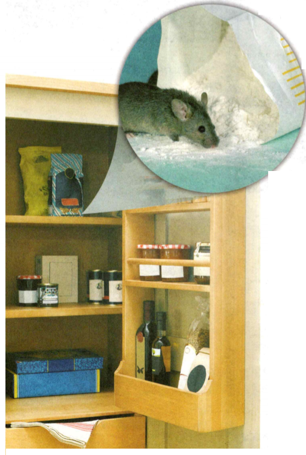
    <figcaption>Figure 1.Spontaneous Generation.</figcaption>
  </figure>

### Where Do Living Things Come From?

Today, when people see weeds poking out of cracks in sidewalks or find mice in
their cabinet, as shown in Figure 1, they know that these organisms are the
result of reproduction. Living things arise from other living things through
reproduction. Four hundred years ago, however, people believed that life could
appear from nonliving material. For example, when people saw flies swarming
around decaying meat, they concluded that flies were produced by rotting meat.
The mistaken idea that living things can arise from nonliving sources is called
**spontaneous generation**. It took hundreds of years of experiments to convince
people that spontaneous generation does not occur.

**Complete the tasks below.**

1. Spontaneous Generation, sometimes unexpected visitors, like this mouse, can
be found in kitchen cabinets. 
a) If you lived 400 years ago, where might you
think the mouse in the cabinet came from? 
b) Describe a way in which you could
test your hypothesis.

### Redi's Experiment 

In the 1600s, an Italian doctor named Francesco Redi helped to disprove
spontaneous generation. Redi designed a controlled experiment to show that
maggots, which develop into new flies, do not arise from decaying meat. In a
controlled experiment, a scientist carries out a series of tests that are
identical in every respect except for one factor. The one factor that a
scientist changes in an experiment is called the manipulated variable. The
factor that changes as a result of changes to the manipulated variable is called
the responding variable. Redi's experiment is shown in Figure 2.

  <figure>
    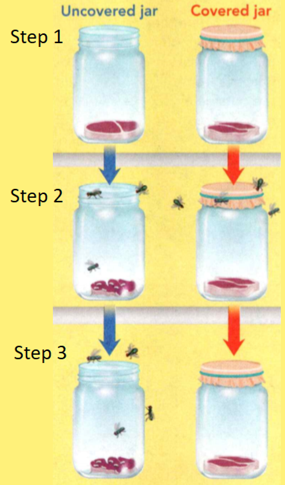
    <figcaption>Figure 2. Redi's Experiment.</figcaption>
  </figure>

**Complete the tasks below.**

1. In the 1600s, an Italian doctor named Francesco Redi helped to disprove
spontaneous generation. Redi designed a controlled experiment  to show that
maggots, which develop into new flies, do not arise from decaying meat (see Figure 2). Step 1: Redi placed meat in two jars. He left one jar uncovered. He covered the other jar with a cloth that let in air. Step2: After a few days, Redi saw maggots (young flies) on the decaying meat in the open jar. There were no maggots on the meat in the covered jar. Step 3: Redi reasoned that flies had laid eggs on the meat in the open jar. The eggs hatched into maggots. Because flies could not lay eggs on the meat in the covered jar, there were no maggots there. Redi concluded that decaying meat did not produce maggots. 
a) What is the manipulated variable in this experiment?
b) What is the responding variable?
c) Name two factors that would need to be kept constant in this experiment to avoid causing error. Why?

### Pasteur's Experiment 

Even after Redi's experiment, many people continued to believe in spontaneous
generation. In the mid-1800s, Louis Pasteur, a French chemist, designed another
experiment to test spontaneous generation. That experiment, shown in Figure 3-5,
along with Redi's work, finally disproved spontaneous generation.

#### Step 1 Experiment begins

Pasteur put clear broth into flasks with curved necks. The necks let in air but kept out bacteria. He boiled the broth in the flasks to kill all bacteria present.

  <figure>
    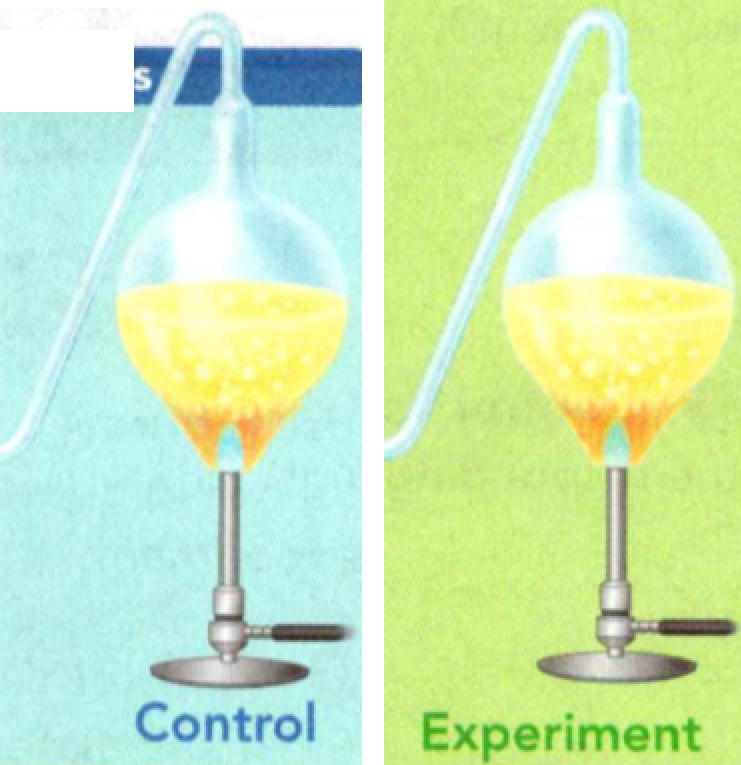
    <figcaption>Figure 3. Pasteur's Experiment Step 1.</figcaption>
  </figure>

#### Step 2 A year passes

The boiled broth remained clear. Pasteur then left some of the flasks as is.
Pasteur broke the curved necks off the other flasks. Bacteria from the outside
air now entered these flasks.

  <figure>
    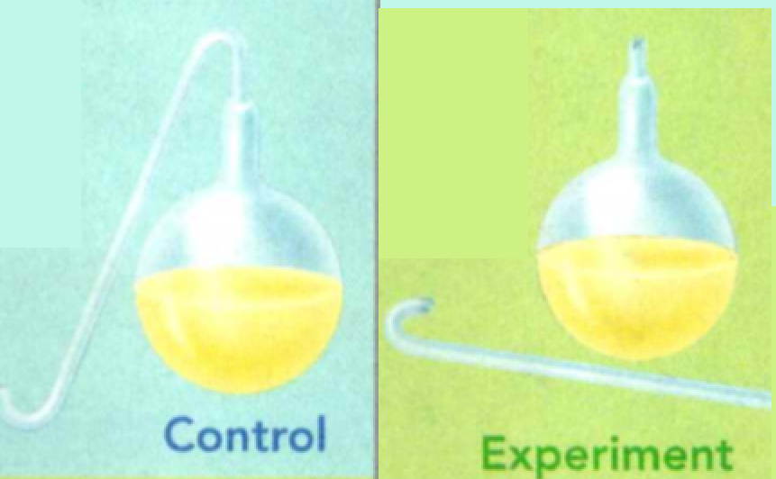
    <figcaption>Figure 4. Pasteur's Experiment Step 2.</figcaption>
  </figure>

#### Step 3 A few days later

The broth in the unbroken flasks remained clear. Pasteur concluded that bacteria
could not arise from the broth. The broth in the broken flasks became cloudy,
showing bacterial growth. This evidence confirmed that new bacteria arise only
from existing bacteria.

  <figure>
    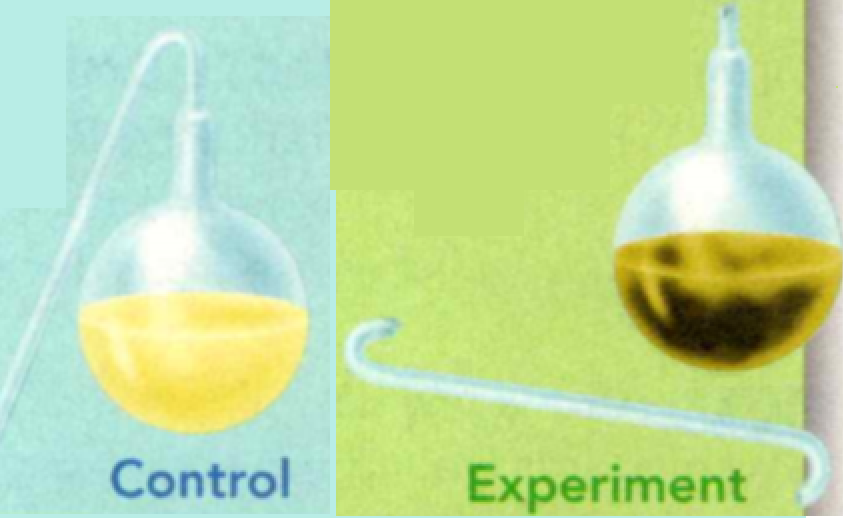
    <figcaption>Figure 5. Pasteur's Experiment Step 3.</figcaption>
  </figure>

**Complete the tasks below.**

1. Pasteur's Experiment Louis Pasteur's carefully controlled experiment demonstrated that bacteria arise only from existing bacteria. Why do you think flasks with curved necks were important?

2. A ____ is the one factor that changes in a controlled experiment.
3. Why is the idea of spontaneous generation incorrect?
4. Living things come from ____ .

### What Do Living Things Need to Survive?

Though it may seem surprising, flies, bacteria, and all other organisms have the same basic needs as you. **All living things must satisfy their basic needs for food, water, living space, and stable internal conditions.**

### Food 

Recall that organisms need a source of energy to live. They use food as their
energy source. Organisms differ in the ways they obtain energy. Some organisms,
such as plants, capture the sun's energy and use it to make food. Organisms that
make their own food are called **autotrophs**. Auto- means "self" and -troph means
"feeder:' Autotrophs use the food they make to carry out their own life
functions.

Organisms that cannot make their own food are called **heterotrophs**. Heterotrophs
obtain energy by feeding on other organisms. Some heterotrophs eat autotrophs
for food. Other heterotrophs consume heterotrophs that eat autotrophs. They use
the energy in the autotrophs' bodies. Therefore, a heterotroph's energy source
is also the sun—but in an indirect way. Animals, mushrooms, and slime molds are
examples of heterotrophs.

During the summer, when desert temperatures can exceed 47°C, a camel only needs
to drink water every five days. At that time, a camel can drink up to 189 liters
of water in just a few hours!

### Water 

All living things need water to survive. In fact, most organisms can live for
only a few days without water. Organisms need water to obtain chemicals from
their surroundings, break down food, grow, move substances within their bodies,
and reproduce.

One property of water that is vital to living things is its ability to dissolve
more chemicals than any other substance on Earth. In fact, water makes up about
90 percent of the liquid part of your blood. The food that your cells need
dissolves in blood and is transported to all parts of your body. Waste from
cells dissolves in blood and is carried away. Your body's cells also provide a
watery environment for chemicals to dissolve.

### Living Space 

All organisms need a place to live—a place to get food and water and find
shelter. Whether an organism lives in the freezing Arctic or the scorching
desert, its surroundings must provide what it needs to survive. 

Because there is a limited amount of space on Earth, some organisms must compete
for space. Trees in a forest, for example, compete with other trees for sunlight
above ground. Below ground, their roots compete for water and minerals.

### Stable Internal Conditions
Organisms must be able to keep the conditions inside their bodies stable, even
when conditions in their surroundings change significantly. For example, your
body temperature stays steady despite changes in the air temperature. The
maintenance of stable internal conditions is called **homeostasis.**

Homeostasis keeps internal conditions just right for cells to function. Think
about your need for water after a hard workout. When water levels in your body
decrease, chemicals in your body send signals to your brain, which cause you to
feel thirsty.

Other organisms have different mechanisms for maintaining homeostasis. Consider
barnacles, which as adults are attached to rocks at the edge of the ocean. At
high tide, they are covered by water. But at low tide, the watery surroundings
disappear, and barnacles are exposed to hours of sun and wind. Without a way to
keep water in their cells, they would die. Fortunately, a barnacle can close up
its hard outer plates, trapping some water inside. In this way, a barnacle can
keep its body moist until the next high tide. Refer to Figure 6 to see another
example of how an organism maintains homeostasis.

  <figure>
    
    <figcaption>Figure 6. During the winter months, birds rely on their feathers to maintain
homeostasis.</figcaption>
  </figure>

**Complete the tasks below.**

1. A giraffe, a heterotroph, obtains its energy by feeding on trees and shrubs.
From your own habitat, name two examples of autotrophs and two examples of
heterotrophs.

2. Desert Oasis: You might be surprised to see so much green in the middle of a
desert. In a desert oasis, there is water beneath the surface. The groundwater
can bubble to the surface and create springs. How can a small area in the middle
of a desert provide an organism what it needs to survive?

3. During the winter months, birds rely on their feathers to maintain
homeostasis (Figure 6). By fluffing its feathers, this bluebird is able to trap body heat
to keep warm. How do people maintain homeostasis when exposed to cold
temperatures?

4. Which basic need is a fox meeting by feeding on berries?

5. The arctic fox has thick, dense fur in the winter and much shorter fur in the
summer. How does this help the fox maintain homeostasis?

6. To survive, living things need ___ .

### Classifying Life
- Why Do Biologists Classify Organisms? 
- What Are the Levels of Classification? 
- How Are Taxonomic Keys Useful?

**Complete the tasks below.**

1. When people first began to travel in airplanes, birds often caused crashes. In
1960, 62 people were killed when birds flew into an airplane's engine. Something
had to be done, but no one knew what kinds of birds were causing the crashes.
Usually only a tiny, burnt piece of feather remained. Engineers didn't know how
big or heavy the birds were, so they couldn't design planes to keep birds out of
the engines. Then a scientist named Roxie Laybourne invented a way to classify
birds using a tiny piece of feather. She identified the birds from many crashes.
Her work helped engineers design engines to reduce bird collisions. She also
helped develop bird management programs for major airports. Roxie's work has
saved passengers' lives! 
a) What did Roxie Laybourne invent?
b) Why was her invention so important?

### Why Do Biologists Classify Organisms?
So far, scientists have identified more than one million kinds of organisms on
Earth. That's a large number, and it keeps growing as scientists discover new
organisms. Imagine how difficult it would be to find information about one
particular organism if you had no idea even where to begin. It would be a lot
easier if similar organisms were placed into groups.

  <figure>
    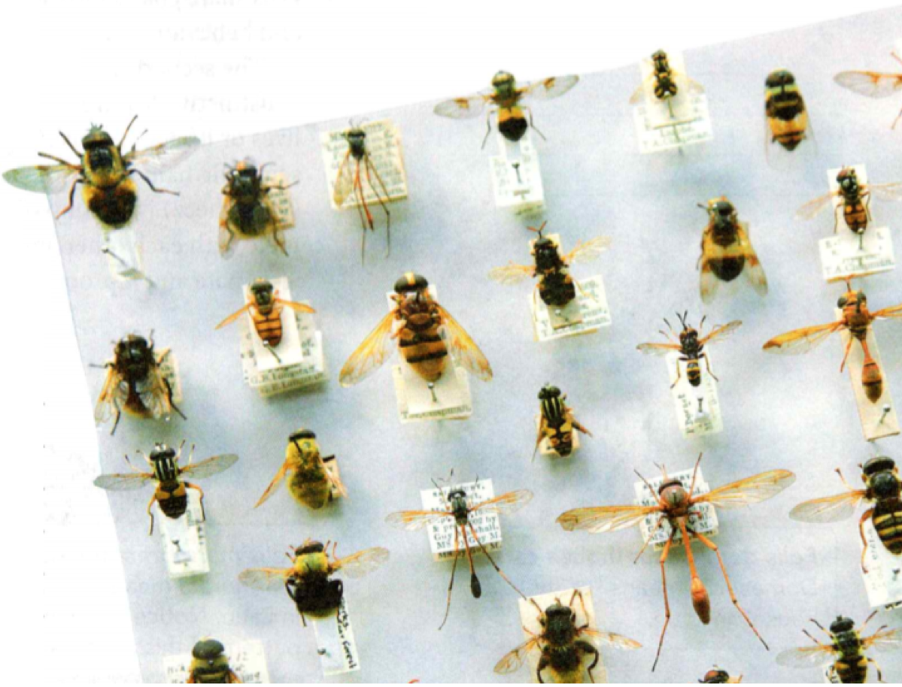
    <figcaption>Figure 7. Classifying Insects.</figcaption>
  </figure>

Organizing living things into groups is exactly what biologists have done.
Biologists group organisms based on similarities, just as grocers group milk
with dairy products and tomatoes with other produce. **Classification** is the
process of grouping things based on their similarities, as shown in Figure 7.

**Biologists use classification to organize living things into groups so that the
organisms are easier to study.** The scientific study of how organisms are
classified is called **taxonomy**. Taxonomy is useful because once an organism is
classified, a scientist knows a lot of information about that organism. For
example, if you know that a crow is classified as a bird, then you know that a
crow has wings, feathers, and a beak.

### Binomial Nomenclature

The three different species of cats in Figure 8 belong to the same genus. The
cats' scientific names share the same first word, Felis. The second word of
their names describes a feature of the animals.

  <figure>
    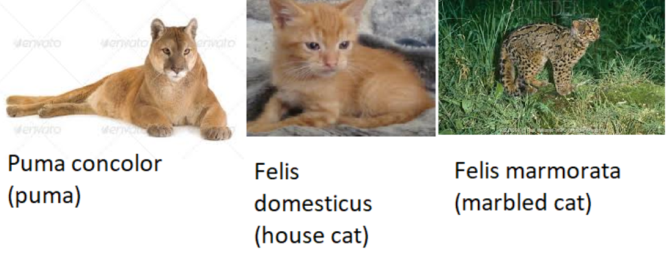
    <figcaption>Figure 8. Binomial Nomenclature.</figcaption>
  </figure>

#### Puma concolor (puma) Figure 8 left
Concolor means "the same color" in Latin. Notice that this animal's coat is mostly the same color.

#### Felis domesticus (house cat) Figure 8 middle
Domesticus means "of the house" in Latin.

#### Fells marmorata (marbled cat) Figure 8 right
Marmorata means "marble" in Latin. Notice the marbled pattern of this animal's coat.

**Complete the tasks below.**

1. See Figure 7 about Classifying Insects. These bees and wasps belong to a large
insect collection in a natural history museum. They have been classified
according to the characteristics they share. What characteristics do you think
may have been used to group these insects?

2. Suppose someone told you that a jaguarundi is classified in the same genus as house cats. What characteristics and behaviors do you think a jaguarundi might have?

### Naming System of Linnaeus
Taxonomy also involves naming organisms. In the 1730s, the Swedish botanist
Carolus Linnaeus devised a system of naming organisms that is still used today.
Linnaeus placed organisms in groups based on their observable features. Each
organism was given a unique, two-part scientific name. This system is called
**binomial nomenclature**. Binomial means "two names."

### Genus and Species 

The first word in an organism's scientific name is its genus.
A **genus** is a classification grouping that contains similar, closely related
organisms. As shown in Figure 8, pumas, house cats, and marbled cats are all
classified in the genus Felis. Organisms that are classified in the genus Felis
share characteristics such as sharp, retractable claws and behaviors such as
hunting other animals.

The second word in a scientific name often describes a distinctive feature of an
organism, such as where it lives or its appearance. Together, the two words form
the scientific name of a unique kind of organism. A **species** is a group of
similar organisms that can mate with each other and produce offspring that can
also mate and reproduce.

### Using Binomial Nomenclature  

A complete scientific name is written in italics. Only the first letter of the
first word in a scientific name is capitalized. Notice that scientific names
contain Latin words. Linnaeus used Latin words in his naming system because
Latin was the language that scientists used during that time.

Binomial nomenclature makes it easy for scientists to communicate about an
organism because everyone uses the same scientific name for the same organism.
Using different names or common names for the same organism can get very
confusing.

  <figure>
    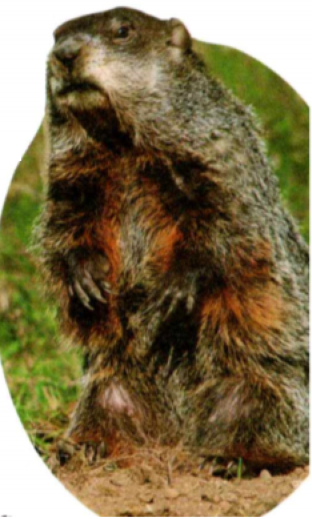
    <figcaption>Figure 9. Marmota monax.</figcaption>
  </figure>

Is this animal in Figure 9 a groundhog, a woodchuck, a marmot, or a whistlepig?
Depending on where you live, all of these names are correct. Luckily, this
animal has only one scientific name, Marmota monax.

**Complete the tasks below.**

  <figure>
    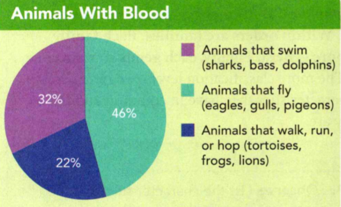
    <figcaption>Figure 10. Aristotle and Classification.</figcaption>
  </figure>

1. Aristotle, an ancient Greek scholar, also developed a classification system for animals.
a) Which group made up the largest percentage of animals?
b) What percent of these animals either fly or swim?
c) What new categories would you use to make a graph that classifies animals that move in more than one way?

2. The scientific study of how living things are classified is called ___ .

3. What is the advantage of using scientific names instead of using common names, like cat or dog?

### What Are the Levels of Classification?
The classification system that scientists use today is based on the
contributions of Linnaeus. But today's classification system uses a series of
many levels to classify organisms.

To help you understand the levels of classification, imagine a room filled with
everybody who lives in your state. First, all of the people who live in your
town raise their hands. Then those who live in your neighborhood raise their
hands. Then those who live on your street raise their hands. Finally, those who
live in your house raise their hands. Each time, fewer people raise their hands.
The more levels you share with others, the more you have in common with them.

### The Major Levels of Classification 

  <figure>
    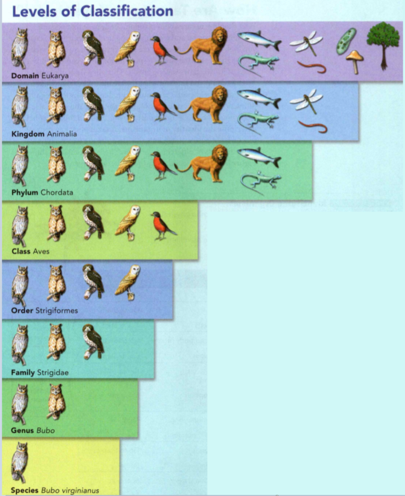
    <figcaption>Figure 11. Levels of Classification.</figcaption>
  </figure>

Of course, organisms are not grouped by where they live, but by their shared
characteristics. Most biologists today classify organisms into the levels shown
in Figure 11. First, an organism is placed in a broad group, which in turn is
divided into more specific groups. 

**A domain is the broadest level of organization. Within a domain, there are
kingdoms. Within kingdoms, there are phyla (singular phylum). Within phyla are
classes. Within classes are orders. Within orders are families. Each family
contains one or more genera. Finally, each genus contains one or more species.**
The more classification levels two organisms share, the more characteristics
they have in common and the more closely related they are.

**Complete the tasks below.**

1. See Figure 11. As you move down these levels of classification, the number of
organisms decreases. The organisms that remain share more characteristics with
one another and are more related. The figure shows how the levels of organization apply to a great horned owl.
a) List the characteristics that the organisms share at the kingdom level.
b) List the characteristics that the organisms share at the class level.
c) List the characteristics that the organisms share at the genus level.
d) How does the number of shared characteristics on your list change at each level?
e) Robins have more in common with (lions/owls).

### How Are Taxonomic Keys Useful?
Why should you care about taxonomy? Suppose that you are watching television and
feel something tickling your foot. Startled, you look down and see a tiny
creature crawling across your toes. Although it's only the size of a small melon
seed, you don't like the looks of its two claws waving at you. Then, in a flash,
it's gone.

How could you find out what the creature was? You could use a field guide. Field
guides are books with illustrations that highlight differences between
similar-looking organisms. You could also use a taxonomic key. **Taxonomic keys
are useful tools that help determine the identity of organisms.** A taxonomic key
consists of a series of paired statements that describe the various physical
characteristics of different organisms. The taxonomic key shown in Figure 12 can
help you identify the mysterious organism.

  <figure>
    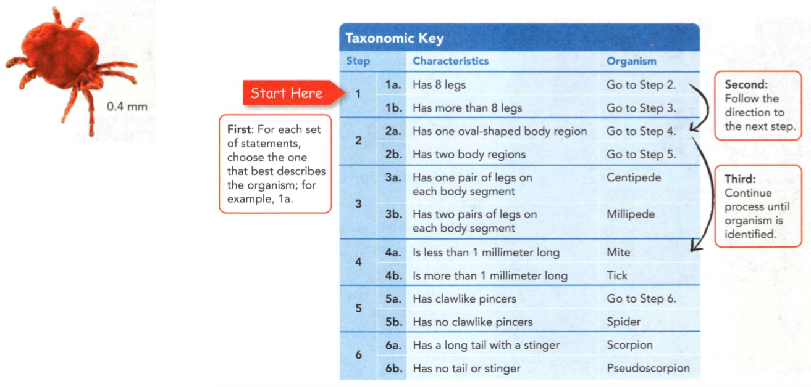
    <figcaption>Figure 12. Identifying Organisms.</figcaption>
  </figure>

**Complete the tasks below.**

1. See Figure 12. The six paired statements in this taxonomic key describe physical characteristics of different organisms.
a) ____	different organisms can be identified using this key.
b) The mysterious organism is a ____ .

  <figure>
    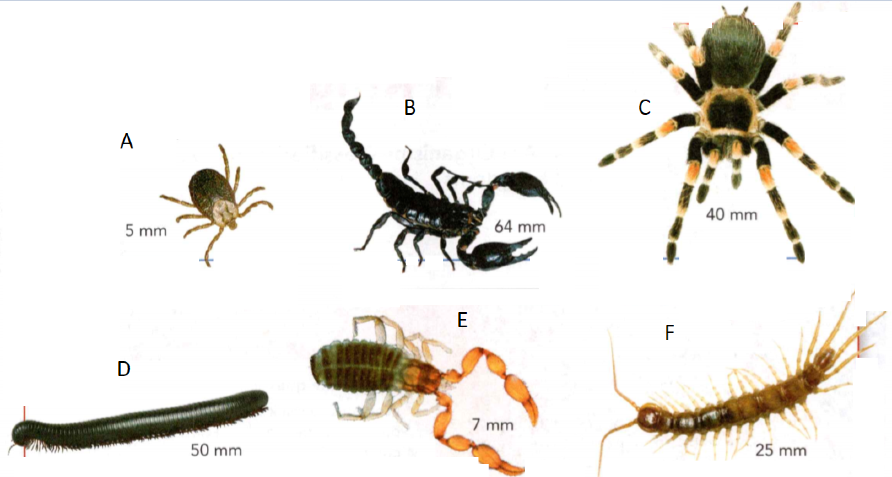
    <figcaption>Figure 13. Organisms.</figcaption>
  </figure>

2. Use the taxonimic key in Figure 12. Identify each pictured organism in Figure 13.
3. Taxonomic keys are used to ___ .

### Domains and Kingdoms

- How Are Organisms Classified Into Domains and Kingdoms?

**Complete the tasks below.**

1 Unbeelievable! Number of species: Bees: 19200, Mammals: 5400, Birds: 10000. Why do you think that bee species outnumber mammal and bird species combined?

### How Are Organisms Classified Into Domains and Kingdoms?

Suppose you helped Linnaeus classify organisms. You probably would have
identified organisms as either plants or animals. That's because in Linnaeus'
time there were no microscopes to see the tiny organisms that are known to exist
today. Microscopes helped to discover new organisms and identify differences
among cells.

Today, a three-domain system of classification is commonly used. As shown in the
table on the top of the next page, the three domains are Bacteria, Archaea, and
Eukarya. Within the domains are kingdoms. **Organisms are placed into domains
and kingdoms based on their cell type, their ability to make food, and the
number of cells in their bodies.**

### Domain Bacteria 
Although you may not know it, members of the domain Bacteria are all around you.
You can find them on the surfaces you touch and inside your body. Some bacteria
are autotrophs, while others are heterotrophs.

  <figure>
    
    <figcaption>Figure 14. Bacteria.</figcaption>
  </figure>

Most bacteria, such as Lactobacillus acidophilus, are helpful. These bacteria
help to produce yogurt and milk for people who are lactose intolerant.

Members of the domain Bacteria are called prokaryotes. Prokaryotes are
unicellular organisms whose cells lack a nucleus. A nucleus (plural nuclei) is a
dense area in a cell that contains nucleic acids—the chemical instructions that
direct the cell's activities. In prokaryotes, nucleic acids are not contained
within a nucleus.

### Domain Archaea 

Deep in the Pacific Ocean, hot gases and molten rock spew out from a vent in the
ocean floor. It is hard to imagine that any living thing could exist in such
harsh conditions. Surprisingly, a group of tiny organisms thrives in such a
place. They are members of the domain Archaea, whose name comes from the Greek
word for "ancient."

  <figure>
    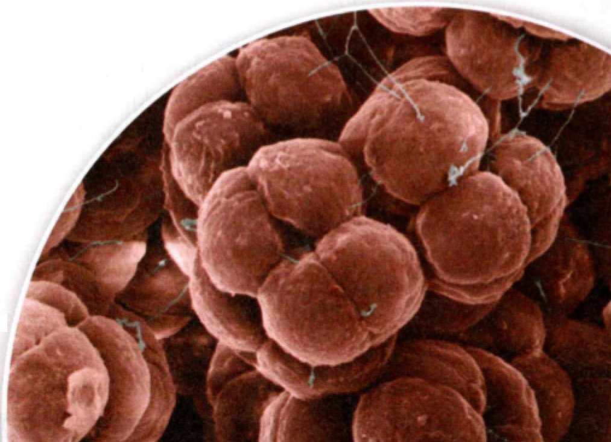
    <figcaption>Figure 15. Archaea.</figcaption>
  </figure>

Like bacteria, archaea are unicellular prokaryotes. And like bacteria, some
archaea are autotrophs and others are heterotrophs. Archaea are classified in
their own domain because their chemical makeup differs from that of bacteria.
Bacteria and archaea also differ in the structure of their cells. The bacteria
in Figure 14 and the archaea in Figure 2 have been stained and magnified to make
them easier to see.

**Complete the tasks below.**

1. The bacteria in Figure 14 and the archaea in Figure 15 have been stained and
magnified to make them easier to see. Archaea can be found in extreme
environments such as hot springs, very salty water, and the intestines of cows!
Scientists think that the harsh conditions in which archaea live are similar to
those of ancient Earth. How are archaea and bacteria similar? How are they
different?

### Domain Eukarya 

What do seaweeds, mushrooms, tomatoes, and dogs have in common? They are all
members of the domain Eukarya. Organisms in this domain are eukaryotes -
organisms with cells that contain nuclei. Scientists classify organisms in the
domain Eukarya into one of four kingdoms: protists, fungi, plants, or animals.

#### Protists
A protist is any eukaryotic organism that cannot be classified as a fungus,
plant, or animal. Because its members are so different from one another, the
protist kingdom is sometimes called the "odds and ends" kingdom. For example,
some protists are autotrophs, while others are heterotrophs. Most protists are
unicellular, but some, such as seaweeds, are multicellular.

#### Fungi
If you have eaten mushrooms, then you have eaten fungi . Mushrooms, molds, and
mildew are all fungi. The majority of fungi are multicellular eukaryotes. A few,
such as the yeast used in baking, are unicellular eukaryotes. Fungi are found
almost everywhere on land, but only a few live in fresh water. All fungi are
heterotrophs. Most fungi feed by absorbing nutrients from dead or decaying
organisms.

#### Plants
Dandelions on a lawn, peas in a garden, and the marsh grass shown here are
familiar members of the plant kingdom. Plants are all multicellular eukaryotes,
and most live on land. Also, plants are autotrophs that make their own food.
Plants provide food for most of the heterotrophs on land.

The plant kingdom includes a great variety of organisms. Some plants produce
flowers, while others do not. Some plants, such as giant redwood trees, can grow
very tall. Others, like mosses, never grow taller than a few centimeters.

#### Animals
A dog, a flea on the dog's ear, and a cat that the dog chases have much in
common because all are animals. All animals are multicellular eukaryotes. In
addition, all animals are heterotrophs. Animals have different adaptations that
allow them to locate food, capture it, eat it, and digest it. Members of the
animal kingdom live in diverse environments throughout Earth. Animals can be
found from ocean depths to mountaintops, from hot, scalding deserts to cold, icy
landscapes.

**Complete the tasks below.**

1. While on a walk, you find an organism that you've never seen before. You are
determined to figure out what kingdom it belongs to. Starting with the first
observation below, circle the kingdom(s) the organism could fit into. Using the
process of elimination, determine what kingdom the organism belongs to.
a) There are nuclei present. (Protists/Fungi/Plants/Animals)
b)	You can count more than one cell. (Protists/Fungi/Plants/Animals)
c) The organism cannot make its own food. (Protists/Fungi/Plants/Animals)
d) The organism gets nutrients from dead organisms. (Protists/Fungi/Plants/Animals)
e) Other members of this kingdom can be unicellular. (Protists/Fungi/Plants/Animals)

2. A cell that lacks a nucleus is called a (eukaryote/prokaryote).
3. Two ways that the members of the two domains of prokaryotes differ are in the ____ .
4. A dandelion is in the same kingdom as pine trees. Name three characteristics
that these organisms share.   
5. Organisms are classified into domains and kingdoms based on their ____ .

### Evolution and Classification
- How Are Evolution and Classification Related?

**Complete the tasks below.**
1. It Looks Like a Duck... The first scientist to see the pelt of the platypus
thought it was a joke. Could a four-legged, duck-billed, egg-laying mammal
exist? How had it evolved? Native people from Australia believed that the first
platypus was born when a water rat mated with a duck. But scientists put the
platypus into a new group of egg-laying mammals. Then many years later,
scientists began to argue. Had the platypus really evolved later with younger
marsupials such as kangaroos? Would the platypus have to be reclassified?
Scientists studied its DNA and discovered that the platypus was in the right
place! How did DNA help classify the platypus?

### How Are Evolution and Classification Related?
When Linnaeus developed his classification system, people thought that species
never changed. In 1859, a British naturalist named Charles Darwin published an
explanation for how species could change over time. Recall that the process of
change over time is called **evolution**. Darwin thought that evolution occurs by
means of natural selection. Natural selection is the process by which
individuals that are better adapted to their environment are more likely to
survive and reproduce than other members of the same species.   

As understanding of evolution increased, biologists changed how they classify
species. Scientists now understand that certain organisms may be similar because
they share a common ancestor and an evolutionary history. The more similar the
two groups are, the more recent the common ancestor probably is. Today's system
of classification considers the history of a species. **Species with similar
evolutionary histories are classified more closely together.**

### Branching Tree Diagrams 

Two groups of organisms with similar characteristics may be descended from a
common ancestor. A branching tree diagram, like the one in Figure 1, shows
probable evolutionary relationships among organisms and the order in which
specific characteristics may have evolved. Branching tree diagrams begin at the
base with the common ancestor of all the organisms in the diagram. Organisms are
grouped according to their shared derived characteristics.

  <figure>
    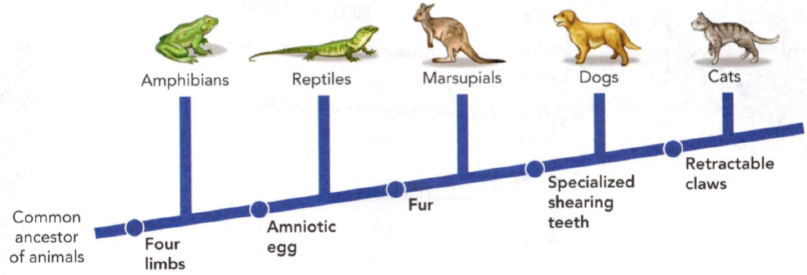
    <figcaption>Figure 16. A Branching Tree.</figcaption>
  </figure>

- Characteristics lower on the branching tree probably developed before
characteristics higher on the tree.
- A **shared derived characteristic** is a trait, such as fur, that the common
ancestor of a group had, and passed on to its descendants. Organisms to the
right of the fur label all have this shared derived characteristic.

**Complete the tasks below.**

1. This branching tree diagram in Figure 16 shows how cats have evolved.
a) Put squares around the shared derived characteristics.
b) Circle the animal(s) that belong to the smallest group.
c) Cats are more closely related to (reptiles/marsupials).

  <figure>
    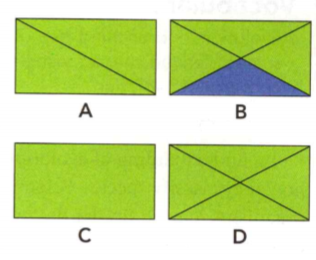
    <figcaption>Figure 17. Figures.</figcaption>
  </figure>

2. In Figure 17 note the characteristics of Figures A, B, C, and D. 
a) Which figure is the most similar to Figure B?
b) Suppose these shapes are fossils of extinct organisms. Which organism do you
think might be the ancestor of all the others? Why?

### Determining Evolutionary Relationships 

How do scientists determine the evolutionary history of a species? One way is to
compare the structure of organisms. Scientists can also use information about
the chemical makeup of the organisms' cells. Sometimes unrelated organisms
evolve similar characteristics because they evolved in similar environments,
like organisms that move through the water or eat similar foods. Because the
organisms perform similar functions, their body structures may look similar.
Look at Figure 18. The process by which unrelated organisms evolve
characteristics that are similar is called convergent evolution.

### Convergent Evolution

  <figure>
    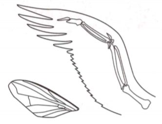
    <figcaption>Figure 18. Birds and insects both use wings.</figcaption>
  </figure>

Birds and insects both use wings to help them fly. However, these two organisms
are not closely related.

When studying the chemical makeup of organisms, sometimes new information is
discovered that results in reclassification. For example, skunks and weasels
were classified in the same family for 150 years. When scientists compared
nucleic acids from the cells of skunks and weasels, they found many differences.
These differences suggest that the two groups are not that closely related. As a
result, scientists reclassified skunks into a separate family.

### Study Guide
- All living things have a cellular organization, contain similar chemicals, use
energy, respond to their surroundings, grow and develop, and reproduce.
- Living things arise from other living things through reproduction
- All living things must satisfy their basic needs for food, water, living
space, and stable internal conditions.
- Biologists use classification to organize living things into groups so that
the organisms are easier to study.
- The levels of classification are domain, kingdom, phylum, class, order,
family, genus, and species.
- Taxonomic keys are useful tools that help determine the identity of organisms.
- Organisms are placed into domains and kingdoms based on their cell type,
ability to make food, and the number of cells in their bodies.
- Species with similar evolutionary histories are classified more closely together.

**Complete the tasks below.**

1. Look back at Figure 16. What characteristics do all reptiles share?

2. How are living things alike yet different?

3. Evolution and classification are related because ____ .

4. Living things can vary. For example, organisms may be prokaryotes or
___________.

5. All living things are made of ____ , which grow, develop, and reproduce.

6. The maintenance of stable internal conditions is called
A) stimulus.	
B) autotrophy.
C) homeostasis.	
D) response.

7.	____ involves only one parent and produces offspring that are identical to the parent.

8. Pick an organism in your home and describe how this organism meets the four
basic conditions for survival.

9. A student is designing a controlled experiment to test whether the amount of
water that a plant receives affects its growth. Which variables should the
student hold constant and which variable should the student manipulate?

10. Suppose you are searching for new life forms as part of an expedition in a
remote region of Alaska. At one site you find 24 greenish-brown objects, each
measuring around 1 cm3. The objects do not appear to have heads, tails, or legs,
but you suspect they may be alive. Describe what you would do to determine if
the objects are alive.

11. Which of the following is the broadest level of classification?
A) genus	
B) species
C) domain	
D) kingdom

12. The two-part naming system called was devised by Linnaeus in the 1700s.

13. Predict The scientific name for the red maple tree is Acer rubrum. Another
organism is called Acer negundo. Based on its name, what can you predict about
this organism? Explain.

14. Develop a taxonomic key that a person could use to identify each of the
plants shown in Figure 19.

  <figure>
    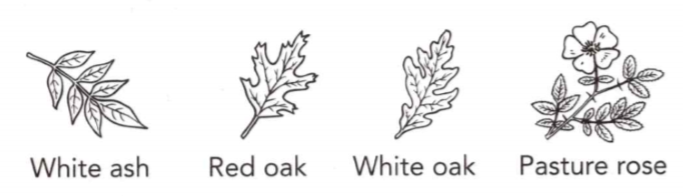
    <figcaption>Figure 19. Plants.</figcaption>
  </figure>

15. Which four kingdoms belong to the domain Eukarya?
A) prokarya, archaea, eukarya, bacteria
B) protists, fungi, plants, animals
C) mite, tick, scorpion, spider
D) class, order, family, genus

16. All eukaryotes belong to domain Eukarya, while ____ belong to domain
Bacteria or domain Archaea.

17. Both plants and fungi belong to the domain Eukarya. What is one main
difference between these organisms?

18. Which of the following factors is most important when classifying an organism?
A) size	
B) shape
C) habitat	
D) evolutionary history

19. A diagram that shows probable evolutionary relationships among organisms is
called a ____ .

20. If you discovered two unrelated organisms that looked very similar, how
could you explain it?

21. With the advances in commercial space travel, some day you may have the
opportunity to visit another planet and see things you've never seen before! How
would you go about identifying things on the other planet as being living or
nonliving? If an object turns out to be living, what characteristics would you
look for in order to classify it? Use four vocabulary terms from the chapter in
your answer.

  <figure>
    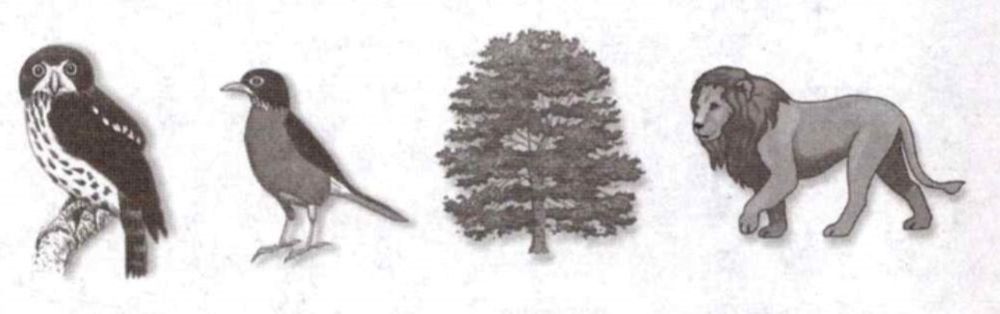
    <figcaption>Figure 20. 4 Organisms.</figcaption>
  </figure>

22. How many kingdoms are represented by the organisms shown below?

A) 1
B) 2
C) 3
D) 4

23. Which statement is the correct contrast to the mistaken idea of spontaneous
generation?
A) All organisms must take in energy.
B) All organisms must respond to their environments.
C) All organisms reproduce either sexually or asexually.
D) All organisms are made up of cells.

24. Which of the following is an example of a multicellular autotroph?
A) a lion	
B) a tree
C) archaea	
D) a mushroom 

25. Which domain does NOT contain prokaryotes?
A) Archaea
B) Bacteria 
C) Eukarya
D) None of the above. All three domains contain prokaryotes.

26. How are metabolism and homeostasis related?
A) Homeostasis controls the rate of an organism's metabolism.
B) Both are used to classify organisms. 
C) Metabolism involves chemical processes that maintain an organism's internal
environment.
D) Homeostasis occurs only in prokaryotes while metabolism occurs in eukaryotes.

  <figure>
    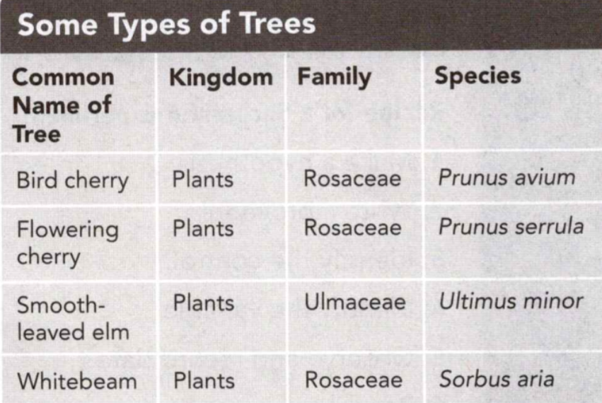
    <figcaption>Figure 21. Some types of trees.</figcaption>
  </figure>

27. Which one of the four trees in Figure 21 is most different from the other
three? Explain your answer.

### Recipe for a Successful Experiment
1. Make a hypothesis.
2. Write a procedure.
3. Identify the control.
4. Identify the variable.
5. Observe and record data.
6. Repeat.
7. Make a conclusion.

Before the 1800s, people thought that living things could appear from nonliving
material. But Louis Pasteur did not think that this accepted theory was correct.
He suspected that bacteria traveled on particles in the air and reproduced when
they landed on biological material—like broth. Pasteur experimented to test his
theory. His experiments were successful because they followed a good
experimental design. Pasteur tested only one variable, included a control, and
repeated his experiments.

Pasteur put broth into two flasks with curved necks. The necks would let in
oxygen but keep out bacteria in air. Pasteur boiled the broth in one flask to
kill any bacteria in the broth. He did not boil the broth in the other flask.

In a few days, the unboiled broth turned cloudy, showing that new bacteria were
growing. The boiled broth remained clear. Pasteur then took the flask with clear
broth and broke its curved neck. Bacteria from the air could enter the flask. In
a few days, the broth became cloudy. Pasteur's results showed that bacteria were
introduced into the broth through the air, and did not grow from the broth
itself. He repeated the experiment, and showed that the results were not an
accident.

**Complete the tasks below.**

1. The Dutch scientist Jean-Baptiste van Helmont proposed a recipe for generating
mice. He set up an experiment using dirty rags and a few grains of wheat in an
open barrel. After about 21 days, mice appeareD) The results, he concluded,
supported his hypothesis that living things come from nonliving sources. What is
wrong with van Helmont's experimental design? Using his hypothesis, design your
own experimental procedure. What is your control? What is your variable?

### Are you going to eat that?

Bacteria are everywhere. Most bacteria have no effect on you. Some even help
you. But bacteria in your food can be dangerous and can make you sick. 

Milk and many juices are treated by a process called pasteurization. The process
is named after Louis Pasteur, who invented it. Before the milk or juice reaches
the grocery store, it is heated to a temperature that is high enough to kill the
most harmful bacteria. Fewer bacteria means slower bacterial growth, giving you
enough time to finish your milk before it spoils.

**Tips for Keeping Food Safe in Homes and Restaurants**
- Keep foods refrigerated until cooking them to prevent any bacteria in the foods from reproducing.
- Cook meat thoroughly, so that the meat reaches a temperature high enough to
kill any bacteria that has been growing on it.
- Wash fresh foods, such as fruits and vegetables, to remove bacteria on the surface.
- Do not use the same utensils or cutting board for cutting raw meat and fresh
foods, so that any bacteria in raw meat are not transferred to other foods.

**Complete the tasks below.**

1. It Some champions of raw-food diets suggest that traditional methods of
pasteurization reduce the nutritional value of milk and cause milk to spoil
rather than to sour. Research the debate about raw dairy products and write a
persuasive article that explains whether you support pasteurization of dairy
products.
