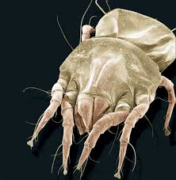

### Life Science

## Biology

## Introduction to Cells

- An **organism** is a living thing.
- A **lens** is a curved piece of glass or other transparent material that is
used to bend light.
- **Magnification** is the condition of things appearing larger than they are.

**Complete the tasks below.**
1. You heard that a pinch of soil can contain millions of **organisms**, and you
decide to check it out. Many organisms are too small to see with just your eyes,
so you bring a hand **lens**. You see a few organisms, but you think you would see
more with greater **magnification**. How does a hand lens help you see more objects
in the soil than you can see with just your eyes?

### Chapter Preview

- cell
- microscope 
- cell theory
- cell wall
- cell membrane 
- nucleus 
- organelle
- ribosome
- cytoplasm
- mitochondria
- endoplasmic reticulum
- Golgi apparatus
- vacuole
- chloroplast
- lysosome
- multicellular
- unicellular
- tissue
- organ
- organ system
- element 
- compound 
- carbohydrate
- lipid
- protein
- enzyme
- nucleic acid
- DNA
- double helix
- selectively permeable
- passive transport
- diffusion
- osmosis
- active transport
- endocytosis
- exocytosis

### Discovering Cells
- What Are Cells?
- What Is the Cell Theory? 
- How Do Microscopes Work?

**Complete the tasks below.**

1. Anton van Leeuwenhoek was the first researcher to see bacteria under a
microscope. In his journal, he described how he felt after discovering this new
and unfamiliar form of life. "For me ... no more pleasant sight has met my eye
than this of so many thousand of living creatures in one small drop of water."
Why do you think Leeuwenhoek was so excited about what he saw?

### What Are Cells?
What do you think a mushroom, a tree, a spider, a bird, and you have in common?
All are living things, or organisms. Like all organisms, they are made of cells.
**Cells** form the parts of an organism and carry out all of its functions. **Cells
are the basic units of structure and function in living things.**

### Cells and Structure 
When you describe the structure of an object, you describe what it is made of
and how its parts are put together. For example, the structure of a building
depends on the way bricks, steel beams, or other materials are arranged. The
structure of a living thing is determined by the amazing variety of ways its
cells are put together.

### Cells and Function 
An organism's functions are the processes that enable it to live, grow, and
reproduce. Those functions include obtaining oxygen, food, and water and getting
rid of wastes. Cells are involved in all these functions. For example, cells in
your digestive system absorb food. The food provides your body with energy and
materials needed for growth. Cells in your lungs help you get oxygen. Your
body's cells work together, keeping you alive. And for each cell to stay alive,
it must carry out many of the same functions as the entire organism.

**Complete the tasks below.**

  <figure>
    
    <figcaption>Figure 1. Needs of cells.</figcaption>
  </figure>

1. A single cell has the same needs as an entire organism, see Figure 1. On each
blank arrow, write the name of a material that moves as shown.

2.  A cell is the basic unit of ___ .

### What Is the Cell Theory?
Until the 1600s, no one knew cells existed because there was no way to see them.
Around 1590, the invention of the first microscope allowed people to look at
very small objects. A **microscope** is an instrument that makes small objects look
larger. Over the next 200 years, this new technology revealed cells and led to
the development of the cell theory. The **cell theory** is a widely accepted
explanation of the relationship between cells and living things.

### Seeing Cells 
English scientist Robert Hooke built his own microscopes and made drawings of
what he saw when he looked at the dead bark of certain oak trees. Hooke never
knew the importance of what he saw. A few years later, Dutch businessman Anton
van Leeuwenhoek was the first to see living cells through his microscopes.

### What the Cell Theory Says 
Matthias Schleiden, Robert Hooke, Anton van Leeuwenhoek, Rudolf Virchow, Theodor
Schwann are people who made key discoveries in the early study of cells. Their
work and the work of many others led to the development of the cell theory. The
cell theory states the following:

- All living things are composed of cells.
- Cells are the basic units of structure and function in living things.
- All cells are produced from other cells.

Living things differ greatly from one another, but all are made of cells. The
cell theory holds true for all living things, no matter how big or how small.
Because cells are common to all living things, cells can provide clues about the
functions that living things perform. And because all cells come from other
cells, scientists can study cells to learn about growth and reproduction.

**Complete the tasks below.**

1. The cell theory describes how cells relate to the structure and function of
living things. Hooke's Microscope. In 1663, Robert Hooke used his microscope to
observe a thin slice of cork. Cork, the bark of the cork oak tree, is made up of
cells that are no longer alive. To Hooke, the empty spaces in the cork looked
like tiny rectangular rooms. Therefore, Hooke called the empty spaces cells,
which means "small rooms." What was important about Hooke's work?

2. Leeuwenhoek's Microscope. Leeuwenhoek built microscopes in his spare time.
Around 1674, he looked at drops of lake water, scrapings from teeth and gums,
and water from rain gutters. Leeuwenhoek was surprised to find a variety of
one-celled organisms. He noted that many of them whirled, hopped, or shot
through water like fast fish. He called these moving organisms animalcules,
meaning "little animals." What did Leeuwenhoek's observations reveal?

3. Schleiden, Schwann, and Virchow In 1838, using his own research and the
research of others, Matthias Schleiden concluded that all plants are made of
cells. A year later, Theodor Schwann reached the same conclusion about animals.
In 1855, Rudolf Virchow proposed that new cells are formed only from cells that
already exist. "All cells come from cells," wrote Virchow. To which part of the
cell theory did Virchow contribute?

4. Which person was the first to see living cells through a microscope? Matthias
Schleiden, Robert Hooke, Anton van Leeuwenhoek, Rudolf Virchow, Theodor Schwann.

5. Why would Hooke's discovery have been impossible without a microscope?

6. Use Virchow's ideas to explain why plastic plants and stuffed animals are not
alive.

7. The cell theory describes ___ .

### How Do Microscopes Work?
The cell theory could not have been developed without microscopes. **Some
microscopes focus light through lenses to produce a magnified image, and other
microscopes use beams of electrons.** Both light microscopes and electron
microscopes do the same job in different ways. For a microscope to be useful, it
must combine two important properties - magnification and resolution.

### Magnification and Lenses 

Have you ever looked at something through spilled drops of water? If so, did the
object appear larger? Magnification is the condition of things appearing larger
than they are. Looking through a magnifying glass has the same result. A
magnifying glass consists of a convex lens, which has a center that is thicker
than its edge. When light passes through a convex lens and into your eye, the
image you see is magnified. Magnification changes how you can see objects and
reveals details you may not have known were there, as shown in Figure 2.

  <figure>
    
    <figcaption>Figure 2. Magnification.</figcaption>
  </figure>

**Complete the tasks below.**

1. The images in Figure 2 have all been magnified, which makes them look
unfamiliar. , Infer On the lines, write what you think each photograph shows,
and explain your reasoning. (One answer is completed for you.)

### Magnification With a Compound Microscope 

  <figure>
    
    <figcaption>Figure 3. Compound Microscope.</figcaption>
  </figure>

Figure 3 shows a microscope that is similar to one you may use in your
classroom. This type of instrument, called a compound microscope, magnifies the
image using two lenses at once. One lens is fixed in the eyepiece. A second lens
is chosen from a group of two or three lenses on the revolving nosepiece. Each
of these lenses has a different magnifying power. By turning the nosepiece, you
can select the lens you want. A glass slide on the stage holds the object to be
viewed.

A compound microscope can magnify an object more than a single lens can. Light
from a lamp (or reflecting off a mirror) passes through the object on the slide,
the lower lens, and then the lens in the eyepiece. The total magnification of
the object equals the magnifications of the two lenses multiplied together. For
example, suppose the lower lens magnifies the object 10 times, and the eyepiece
lens also magnifies the object 10 times. The total magnification of the
microscope is 10 x 10, or 100 times, which is written as "100x."

### Measuring Microscopic Objects

When you see objects through a microscope, they look larger than they really
are. How do you know their true size? One way is to use a metric ruler to
measure the size of the circular field in millimeters as you see it through the
microscope. Then you can estimate the size of the object you see by comparing it
to the width of the field.  

Resolution To create a useful image, a microscope must help you see the details
of the object's structure clearly. The degree to which two separate structures
that are close together can be distinguished is called resolution. Better
resolution shows more details. For example, the colors of a newspaper photograph
may appear to your eye to be solid patches of color. However, if you look at the
colors through a microscope, you will see individual dots. You see the dots not
only because they are magnified but also because the microscope improves
resolution. In general, for light microscopes, resolution improves as
magnification increases. Good resolution, as shown in Figure 5, makes it easier
to study cells.

**Complete the tasks below.**

1. The microscope in Figure 3 has a 10x lens in the eyepiece. The revolving
nosepiece holds three different lenses: 4x, 10x, and 40x.
a) Calculate the three total magnifications possible for this microscope.
b) What would happen if the object on the slide were too thick for light to pass through it?

  <figure>
    
    <figcaption>Figure 4. Field of a microscope.</figcaption>
  </figure>

2. In Photo A in Figure 4, you can see the millimeter markings of a metric ruler
in the field of the microscope. 
a) What is the approximate diameter of the field?
b) Use your measurement from a) to estimate the width of the letter in
Photo B.

  <figure>
    
    <figcaption>Figure 5. Resolution.</figcaption>
  </figure>

3. The images in colorful photographs actually consist of only a few ink colors
in the form of dots. In Figure 5 what color dots does improved resolution allow
you to see?

### Electron Microscopes 

The microscopes used by Hooke, Leeuwenhoek, and other early researchers were all
light microscopes. Since the 1930s, scientists have developed several types of
electron microscopes. Electron microscopes use a beam of electrons instead of
light to produce a magnified image. (Electrons are tiny particles that are
smaller than atoms.) By using electron microscopes, scientists can obtain
pictures of objects that are too small to be seen with light microscopes.
Electron microscopes allow higher magnification and better resolution than light
microscopes.

**Complete the tasks below.**

  <figure>
    
    <figcaption>Figure 6. A Dust Mite.</figcaption>
  </figure>

1. Dust mites live in everyone's homes. A colorized image made with an electron
microscope reveals startling details of a mite's body. In Figure 6 list at least
three details that you can see in the photo.

2. Magnification makes objects look (smaller/larger) than they really are.

3. The diameter of a microscope's field of view is estimated to be 0.9 mm. About
how wide is an object that fills two thirds of the field? Circle your answer.
1.8 mm 0.6 mm 0.3 mm

4. How are magnification and resolution different?

5. How do the characteristics of electron microscopes make them useful for
studying cells?

### Looking Inside Cells
- How Do the Parts of a Cell Work?
- How Do Cells Work Together in an Organism?

**Complete the tasks below.**

  <figure>
    
    <figcaption>Figure 7. Stained cells.</figcaption>
  </figure>

1. Do these cells look as if they're glowing? In Figure 7 the photograph shows
cells that have been stained with dyes that make cell structures easier to see.
Scientists view such treated cells through a fluorescent microscope, which uses
strong light to activate the dyes and make them glow. Here, each green area is a
cell's nucleus, or control center. The yellow "fibers" form a kind of support
structure for the cell. Why is staining useful when studying cells through a
microscope?

2. If you had a microscope, what kinds of things would you like to look at? Why?

### How Do the Parts of a Cell Work?

When you look at a cell through a microscope, you can usually see the outer edge
of the cell. Sometimes you can also see smaller structures within the cell. 
**Each kind of cell structure has a different function within a cell.** In this
lesson, you will read about the structures that plant and animal cells have in
common. You will also read about some differences between the cells.

### Cell Wall 

The **cell wall** is a rigid layer that surrounds the cells of plants and some other
organisms. The cells of animals, in contrast, do not have cell walls. A plant's
cell wall helps protect and support the cell. The cell wall is made mostly of a
strong material called cellulose. Still, many materials, including water and
oxygen, can pass through the cell wall easily.

### Cell Membrane 

Think about how a window screen allows air to enter and leave a room but keeps
insects out. One of the functions of the cell membrane is something like that of
a screen. The **cell membrane** controls which substances pass into and out of a
cell. Everything a cell needs, such as food particles, water, and oxygen, enters
through the cell membrane. Waste products leave the same way. In addition, the
cell membrane prevents harmful materials from entering the cell.

All cells have cell membranes. In plant cells, the cell membrane is just inside
the cell wall. In cells without cell walls, the cell membrane forms the border
between the cell and its environment.

### Nucleus 

A cell doesn't have a brain, but it has something that functions in a similar
way. A large oval structure called the nucleus acts as a cell's
control center, directing all of the cell's activities. The nucleus is the
largest of many tiny cell structures, called organelles, that carry out specific
functions within a cell. Notice in Figure 2 that the nucleus is surrounded by a
membrane called the nuclear envelope. Materials pass in and out of the nucleus
through pores in the nuclear envelope.

### Chromatin 

You may wonder how the nucleus "knows" how to direct the cell. Chromatin, thin strands of material that fill the nucleus, contains information for directing a cell's functions. For example, the instructions in the chromatin ensure that leaf cells grow and divide to form more leaf cells.

### Nucleolus 

Notice the small, round structure in the nucleus. This structure, the nucleolus,
is where ribosomes are made. Ribosomes are small grain-shaped organelles that
produce proteins. Proteins are important substances in cells.

  <figure>
    
    <figcaption>Figure 8. A typical animal cell.</figcaption>
  </figure>

### Organelles in the Cytoplasm 

  <figure>
    
    <figcaption>Figure 9. Nucleus.</figcaption>
  </figure>

Most of a cell consists of a thick, clear, gel-like fluid. The **cytoplasm**
fills the region between the cell membrane and the nucleus. The fluid of the
cytoplasm moves constantly within a cell, carrying along the nucleus and other
organelles that have specific jobs.

### Mitochondria 

  <figure>
    
    <figcaption>Figure 10. Mitochondrion.</figcaption>
  </figure>

Floating in the cytoplasm are rod-shaped structures that are nicknamed the "powerhouses" of a cell. Look again at Figure 10. Mitochondria (singular mitochondrion) convert energy stored in food to energy the cell can use to live and function.

### Endoplasmic Reticulum and Ribosomes 

  <figure>
    
    <figcaption>Figure 11. Endoplasmic Reticulum and Ribosomes.</figcaption>
  </figure>

In Figure 11, you can see what looks something like a maze of passageways. The
endoplasmic reticulum, often called the ER, is an organelle with a network of
membranes that produces many substances. Ribosomes dot some parts of the ER,
while other ribosomes float in the cytoplasm. The ER helps the attached
ribosomes make proteins. These newly made proteins and other substances leave
the ER and move to another organelle.

### Golgi Apparatus 

As proteins leave the endoplasmic reticulum, they move to a structure that looks
like the flattened sacs and tubes shown in Figures 13 and 14. This structure can
be thought of as a cell's warehouse. The Golgi apparatus receives proteins and
other newly formed materials from the ER, packages them, and distributes them to
other parts of the cell or to the outside of the cell.

### Vacuoles 

Plant cells often have one or more large, water-filled sacs floating in the
cytoplasm. This type of sac, called a vacuole, stores water, food, or other
materials needed by the cell. Vacuoles can also store waste products until the
wastes are removed. Some animal cells do not have vacuoles, while others do.

### Chloroplasts 

  <figure>
    
    <figcaption>Figure 17. Chloroplast.</figcaption>
  </figure>

A typical plant cell contains green structures, called **chloroplasts**, in the
cytoplasm. A chloroplast, shown in Figure 17, captures energy from sunlight and
changes it to a form of energy cells can use in making food. Animal cells don't
have chloroplasts, but the cells of plants and some other organisms do.
Chloroplasts make leaves green because leaf cells contain many chloroplasts.

### Lysosomes 

Look again at the animal cell in Figure 14. Notice the saclike organelles,
called **lysosomes**, which contain substances that break down large food
particles into smaller ones. Lysosomes also break down old cell parts and
release the substances so they can be used again. You can think of lysosomes as
a cell's recycling centers.

**Complete the tasks below.**

1. In Figure 8 use a colored pencil to shade the cell membrane and fill in the
box in the key.

  <figure>
    
    <figcaption>Figure 12. A typical animal cell (continued).</figcaption>
  </figure>

2. In Figure 12 use different-colored pencils to color each structure and its
matching box in the color key.

3. See Figure 9. What does the nuclear envelope do?

4. See Figure 10. In what of types of cells would you expect to find a lot of mitochondria?

5. See Figure 11. What do ribosomes do?

6. The prefix for "within." If the word part plasm refers to the "body" of the
cell, what does the prefix endo- tell you about the endoplasmic reticulum?

  <figure>
    
    <figcaption>Figure 13. Plant cell.</figcaption>
  </figure>

  <figure>
    
    <figcaption>Figure 14. Animal cell.</figcaption>
  </figure>

  <figure>
    
    <figcaption>Figure 15. Structures in cells.</figcaption>
  </figure>

7. In Figure 15 check the box for each structure present in plant cells or
animal cells.

8. What are cells made of? In Figures 13 and 14 these illustrations show typical
structures found in plant and animal cells. Other living things share many of
these structures, too. Describe the function of each structure.
a) Endoplasmic Reticulum
b) Nucleus
c) Cell Wall
d) Chloroplast
e) Vacuolo
f) Ribosomes
g) Cytoplasm
h) Mitochondria
i) Lysosomes
j) Cell Membrane
k) Golgi Apparatus

9. The Golgi apparatus is an organelle that ______ and ____ materials made in
the ______ .

  <figure>
    
    <figcaption>Figure 16. Store building.</figcaption>
  </figure>

10. Can a store's building (Figure 16) be a model for a cell? If so, how do the
parts of a cell function in ways that are similar to the parts of a building?
See if you can figure it out. 
a) In each blank space on the picture, write the name
of a cell structure that functions most like that part of the store.
b) How do you think making real-world comparisons with cells helps you
understand cell structure and function?

11. In which part of a plant would you NOT expect to find cells with
chloroplasts?

12. Summarize the differences  between a plant cell and an animal cell.

13. How are the functions of the endoplasmic reticulum and the Golgi apparatus related?

14. A solar panel collects sunlight and converts it to heat or electrical energy.
How is a solar panel similar to chloroplasts?

### How Do Cells Work Together in an Organism?

Plants and animals (including you) are **multicellular**, which means "made of
many cells." Single-celled organisms are called **unicellular**. In a
multicellular organism, the cells often look quite different from one another.
They also perform different functions.

### Specialized Cells 

All cells in a multicellular organism must carry out key functions, such as
getting oxygen, to remain alive. However, cells also may be specialized. That
is, they perform specific functions that benefit the entire organism. These
specialized cells share what can be called a "division of labor." One type of
cell does one kind of job, while other types of cells do other jobs. For
example, red blood cells carry oxygen to other cells that may be busy digesting
your food. Just as specialized cells differ in function, they also differ in
structure. Figure 18 shows specialized cells from plants and animals. Each type
of cell has a distinct shape. For example, a nerve cell has thin, fingerlike
extensions that reach toward other cells. These structures help nerve cells
transmit information from one part of your body to another. The nerve cell's
shape wouldn't be helpful to a red blood cell.

  <figure>
    
    <figcaption>Figure 18. The right cell for the job.</figcaption>
  </figure>

### Cells Working Together 

A division of labor occurs among specialized cells in an organism. It also
occurs at other levels of organization. **In multicellular organisms, cells are
organized into tissues, organs, and organ systems.*** A **tissue** is a group of
similar cells that work together to perform a specific function. For example,
your brain is made mostly of nerve tissue, which consists of nerve cells that
relay information to other parts of your body. An **organ**, such as your brain, is
made of different kinds of tissues that function together. For example, the
brain also has blood vessels that carry the blood that supplies oxygen to your
brain cells. Your brain is part of your nervous system, which directs body
activities and processes. An **organ system** is a group of organs that work
together to perform a major function. As Figure 19 shows, the level of
organization in an organism becomes more complex from cell, to tissue, to organ,
to organ systems.

  <figure>
    
    <figcaption>Figure 19. Levels of Organization.</figcaption>
  </figure>

**Complete the tasks below.**

1. See Figure 18. Many cells in plants and animals carry out specialized
functions. Match the cell number with the correct function letter.

2. Living things are organized in levels of increasing complexity. Many
nonliving things, like a school, have levels of organization, too. Write the
levels of organization of your school building, from the simplest level, such as
your desk, to the most complex.

3. What does the term division of labor mean as it is used in living cells?

4. Would a tissue or an organ have more kinds of specialized cells? Explain your
answer.

5. The levels of organization in a multicellular organism include

### Chemical Compounds in Cells
- What Are Elements and Compounds? 
- What Compounds Do Cells Need?

**Complete the tasks below.**

1. Energy Backpacks. Some people think a camel's humps carry water. Not true!
They actually store fat. A hump's fatty tissue supplies energy when the camel
doesn't eat. When a cam& has enough food, the hump remains hard and round. But
when food is scarce, the hump gets smaller and may sag to the side. If the camel
then gets more food, the hump can regain its full size and shape in about three
or four months. How do you think the camel might be affected if it didn't have
humps?

### What Are Elements and Compounds?
You are made of many substances. These substances supply the raw materials that
make up your blood, bones, muscles, and more. They also take part in the
processes carried out by your cells.

### Elements 
You have probably heard of carbon, hydrogen, oxygen, and nitrogen—maybe
phosphorus and sulfur, too. All of these are examples of **elements** found in
your body. **An element is any substance that cannot be broken down into
simpler substances.** The smallest unit of an element is a particle called an
atom. Any single element is made up of only one kind of atom.

### Compounds 
Carbon dioxide and water are examples of **compounds**. **Compounds form when two or more
elements combine chemically.** Most elements in living things occur in the form of compounds. For example, carbon dioxide is a compound made up of the elements carbon and oxygen.
The smallest unit of many compounds is a molecule. A molecule of carbon dioxide consists of one carbon atom and two oxygen atoms. Compare the diagrams of the carbon dioxide molecule and the water molecule in Figure 20.

  <figure>
    
    <figcaption>Figure 20. Molecules and Compounds.</figcaption>
  </figure>

**Complete the tasks below.**

1. See Figure 20. a) How many atoms form a water molecule?
b) Name the elements in a molecule of carbon dioxide.

2. Compounds form when ___ .

Did you know that your body needs a new supply of proteins every day because protein cannot be stored for later use, as fat or carbohydrates can?

### What Compounds Do Cells Need?
Many of the compounds in living things contain the element carbon. Most
compounds that contain carbon are called organic compounds. Organic compounds
that you may have heard of include nylon and polyester. Compounds that don't
contain carbon are called inorganic compounds. Water and table salt are familiar
examples of inorganic compounds.

**Some important groups of organic compounds that living things need are
carbohydrates, lipids, proteins, and nucleic acids. Water is a necessary
inorganic compound.** Many of these compounds are found in the foods you eat. This
fact makes sense because the foods you eat come from living things.

### Carbohydrates 

You have probably heard of sugars and starches. They are examples of
**carbohydrates**, energy-rich organic compounds made of the elements carbon,
hydrogen, and oxygen.

The food-making process in plants produces sugars. Fruits and some vegetables
have a high sugar content. Sugar molecules can combine, forming larger molecules
called starches, or complex carbohydrates. Plant cells store excess energy in
molecules of starch. Many foods, such as potatoes, pasta, rice, and bread, come
from plants and contain starch. When you eat these foods, your body breaks down
the starch into glucose, a sugar your cells can use to get energy.

Carbohydrates are important components of some cell parts. For example, the
cellulose found in the cell walls of plants is a type of carbohydrate.
Carbohydrates are also found on cell membranes.

**Complete the tasks below.**

1. Cooked pasta served with olive oil, spices, and other ingredients makes an
energy-packed meal. 
a) Which food is a starch? A) pasta B) olive oil
b) Which food is a lipid? A) pasta B) olive oil
c) Identify another example of a food that contains starch.
d) Identify another example of a food that contains lipids.

### Lipids 

Have you ever seen a cook trim fat from a piece of meat before cooking it? The
cook is trimming away one kind of lipid. **Lipids** are compounds that are made
mostly of carbon and hydrogen and some oxygen. Cell membranes consist mainly of
lipids.

Fats, oils, and waxes are all lipids. Gram for gram, fats and oils contain more
energy than carbohydrates. Cells store energy from fats and oils for later use.
For example, during winter, an inactive bear lives on the energy stored in its
fat cells. Foods high in fats include whole milk, ice cream, and fried foods.

### Proteins 

What do a bird's feathers, a spider's web, and a hamburger have in common? They
consist mainly of proteins. **Proteins** are large organic molecules made of
carbon, hydrogen, oxygen, nitrogen, and, in some cases, sulfur. Foods that are
high in protein include meat, dairy products, fish, nuts, and beans.

Much of a cell's structure and function depends on proteins. Proteins form part
of a cell's membrane. Proteins also make up parts of the organelles within a
cell. A group of proteins known as **enzymes** speed up chemical reactions in
living things. Without enzymes, the many chemical reactions that are necessary
for life would take too long. For example, an enzyme in your saliva speeds up
the digestion of starch. The starch breaks down into sugars while still in your
mouth.

### Nucleic Acids 

**Nucleic acids** are very long organic molecules. These molecules consist of
carbon, oxygen, hydrogen, nitrogen, and phosphorus. Nucleic acids contain the
instructions that cells need to carry out all the functions of life. Foods high
in nucleic acids include red meat, shellfish, mushrooms, and peas.

One kind of nucleic acid is deoxyribonucleic acid, or DNA. **DNA** is the
genetic material that carries information about an organism and is passed from
parent to offspring. This information directs a cell's functions. Most DNA is
found in a cell's nucleus. The shape of a DNA molecule is described as a
**double helix**. Imagine a rope ladder that's been twisted around a pole, and
you'll have a mental picture of the double helix of DNA. The double helix forms
from many small molecules connected together. The pattern and sequence in which
these molecules connect make a kind of chemical code the cell can "read."

**Complete the tasks below.**
1. Compare carbohydrates, lipids, and proteins by listing elements and
functions.
a) Type of compound: Carbohydrate. Elements:
b) Type of compound: Carbohydrate. Functions:
c) Type of compound: Lipid. Elements:
d) Type of compound: Lipid. Functions:
e) Type of compound: Protein. Elements:
f) Type of compound: Protein. Functions:

2. A parrot's beak, feathers, and claws are made of proteins. What part of your
body most likely consists of proteins similar to those of a parrot's claws?

  <figure>
    
    <figcaption>Figure 21. DNA.</figcaption>
  </figure>

3. Smaller molecules connect in specific patterns and sequences, forming DNA.
In the diagram of Figure 21, identify the pattern of colors. Then
color in the ones that are missing.

  <figure>
    
    <figcaption>Figure 22. Compounds found in cells.</figcaption>
  </figure>

4. Most cells contain the same compounds. The graph in Figure 22 compares the
percentages of some compounds found in a bacterial cell and in an animal cell. 
a) Write a title for the graph.
b) What is the percentage of water in an animal cell?
c) How does the number in b) compare to the percentage of water in a bacterial
cell?
d) (Proteins/Nucleic acids) make up a larger percentage of an animal cell.
e) In general, how do you think a bacterial cell and an animal cell compare in
their chemical composition?

5. Mostly Water. About two thirds of the human body is water. But you know you
don't really look like a tank of water with a fish! Complete and label a circle
graph to show the percentage of water in your body.

### Water and Living Things 
Water plays many important roles in cells. For example, most chemical reactions
in cells depend on substances that must be dissolved in water to react. And
water itself takes part in many chemical reactions in cells.

Water also helps cells keep their shape. A cell without water would be like a
balloon without air! Think about how the leaves of a plant wilt when the plant
needs water. After you add water to the soil, the cells absorb the water, and
the leaves perk up.

Water changes temperature slowly, so it helps keep the temperature of cells from
changing rapidly—a change that can be harmful. Water also plays a key role in
carrying substances into and out of cells. Without water, life as we know it
would not exist on Earth.

**Complete the tasks below.**

1. An organic compound that contains only the elements carbon, hydrogen, and
oxygen is most likely (a carbohydrate/ a protein/DNA). Explain your answer.

2. Which groups of organic compounds found in living things are NOT energy rich?
3. What is the function of DNA?
4. Describe ways a lack of water could affect cell functions.
5. The important compounds in living things include ___ .

### The Cell in Its Environment
- How Do Materials Move Into and Out of Cells?
- 
**Complete the tasks below.**

1. Something Good in the Air You're in your bedroom studying, and you smell
something good. Someone is cooking lunch! How did the smell travel from the
kitchen to your nose? During cooking, molecules from soup and many other foods
diffuse, or spread farther and farther apart. The molecules are also carried by
air currents. Your nose sniffs in the molecules and sends a message to your
brain. Even if only one molecule in ten million carries the odor, your nose will
send a "smell" message! Amazingly, your brain can identify about ten thousand
different smells. If the kitchen door is closed, how will that affect your
ability to smell cooking odors in your room?

### How Do Materials Move Into and Out of Cells?

Cells have structures that protect their contents from the world outside the
cell. To live and function, however, cells must let certain materials enter and
leave. Oxygen and water and particles of food must be able to move into a cell,
while carbon dioxide and other waste materials must move out. Much as a
gatekeeper controls the flow of traffic into and out of a parking lot, the cell
membrane controls how materials move into or out of a cell.

### Importance of the Cell Membrane 

  <figure>
    
    <figcaption>Figure 23. Cell Membrane.</figcaption>
  </figure>

Every cell is surrounded by a cell membrane. In Figure 23 you can see that the
cell membrane consists of a double layer of lipid molecules lined up side by
side. Remember that lipids are a group of organic compounds found in living
things. Here and there in the double layer of lipid molecules, you can see
proteins, some with chains of carbohydrates attached. Other carbohydrate chains
sit on the surface of the membrane. All these molecules play important roles in
helping materials move through the cell membrane.

Some materials move freely across the cell membrane. Others move less freely or
not at all. The cell membrane is **selectively permeable**, which means that some
substances can cross the membrane while others cannot. **Substances that can
move into and out of a cell do so by means of one of two processes: passive
transport or active transport.**

**Complete the tasks below.**

1. In what way is the cell membrane like a gatekeeper?

### Diffusion and Osmosis: Forms of Passive Transport 

If you have ever ridden a bicycle down a hill, you know that it takes hardly any
of your energy to go fast. But you do have to use energy to pedal back up the
hill. Moving materials across the cell membrane sometimes requires the cell to
use its own energy. At other times, the cell uses no energy. The movement of
dissolved materials across a cell membrane without using the cell's energy is
called **passive transport**.

  <figure>
    
    <figcaption>Figure 24. Diffusion.</figcaption>
  </figure>

**Complete the tasks below.**

1. In Figure 24 a drop of food coloring in a plate of gelatin gradually spreads as molecules of the dye diffuse. In the third plate, draw how you think the plate would look if diffusion continues.

2. Diffusion causes molecules to move from areas of ____ concentration to areas
of ____ concentration.

### Diffusion 
Molecules are always moving. As they move, they bump into one another. The more
molecules there are in a space, the more they are said to be concentrated in
that space. So they collide more often. Collisions cause molecules to push away
from one another. Over time, as molecules continue colliding and moving apart,
they become less concentrated. Eventually, they spread evenly throughout the
space. **Diffusion** is the process by which molecules move from an
area of higher concentration to an area of lower concentration. See Figure 24.

Consider a unicellular organism that lives in pond water. It gets oxygen from
that water. Many more molecules of oxygen are dissolved in the water outside the
cell than inside the cell. In other words, the concentration of oxygen is higher
outside the cell. What happens? Oxygen moves easily into the cell. The diffusion
of oxygen into the cell does not require the cell to use any of its energy.
Diffusion is one form of passive transport.

### Osmosis 

Like oxygen, water passes easily into and out of a cell across the cell
membrane. Osmosis is the diffusion of water molecules across a selectively
permeable membrane. Because cells cannot function properly without adequate
water, many cellular processes depend on osmosis. Osmosis is a form of passive
transport.

  <figure>
    
    <figcaption>Figure 25. Effects of osmosis. Cells shrink and die when they lose too
much water.</figcaption>
  </figure>

Osmosis can have important effects on cells and entire organisms. The plant
cells in the top photo of Figure 25 have a healthy flow of water both into and
out of each cell. Under certain conditions, osmosis can cause water to move out
of the cells more quickly than it moves in. When that happens, the cytoplasm
shrinks and the cell membrane pulls away from the cell wall, as shown in the
bottom photo. If conditions do not change, the cells can die.

**Complete the tasks below.**

1. Effects of Osmosis see Figure 25. Cells shrink and die when they lose too
much water. Using a colored pencil, shade the cells in the bottom photo to show
how they would change if the flow of water was reversed.

  <figure>
    
    <figcaption>Figure 26. Large and small cells.</figcaption>
  </figure>

2. Most cells are too small to be seen without a microscope. What does cell size
have to do with moving materials into and out of a cell? Suppose the diagrams at
in Figure 26 represent two cells. One cell is three times the width of the other
cell. Think about how this difference could affect processes in the cells.
a) Cytoplasm streams within a cell, moving materials some- what as ocean currents
move a raft. In which cell will materials move faster from the cell membrane to
the center of the cell? Why?
b) Wastes are poisonous to a cell and must be removed from the cytoplasm.
Predict how cell size could affect the removal process and the survival of a
cell.

### Facilitated Diffusion 

Oxygen and carbon dioxide diffuse freely across a cell membrane. Other
molecules, such as sugar, do not. Sugars cannot cross easily through the
membrane's lipid molecules. In a process called facilitated diffusion, proteins
in the cell membrane form channels through which the sugars can pass. The word
facilitate means "to make easier:' As shown in Figure 27, these proteins provide
a pathway for the sugars to diffuse. The proteins function much the way
downspouts guide water that flows from the roof of a house to the ground.
Facilitated diffusion uses no cell energy and is another form of passive
transport.

  <figure>
    
    <figcaption>Figure 27. Crossing the Cell Membrane.</figcaption>
  </figure>

### Active Transport 

Molecules in cells must often move in the opposite direction from the way they
would naturally move due to diffusion. That is, the molecules move from a place
of lower concentration to a place of higher concentration. Cells have to supply
the energy to do this work—just as you would supply the energy to pedal a bike
uphill. **Active transport** is the movement of materials across a cell membrane
using cellular energy.

As in facilitated diffusion, proteins within the cell membrane play a key role
in active transport. Using the cell's energy, transport proteins "pick up"
specific molecules and carry them across the membrane. Substances that are
carried into and out of cells by this process include calcium, potassium, and
sodium.

**Complete the tasks below.**

1. In Figure 27 molecules move into and out of a cell by means of passive or active transport. Fill in the words missing in the boxes.
a) A
b) B
c) C
d) D

2. On the diagram in Figure 27, write an "H" where the concentration of each
substance is high and an "L" where the concentration is low.

### Moving Large Particles 

  <figure>
    
    <figcaption>Figure 28. Amoeba Engulfing Food.</figcaption>
  </figure>

Amoeba Engulfing Food:
- Amoeba's cytoplasm streams toward food particles.
- Cytoplasm surrounds food particles as vacuole begins to form.
- Cell membrane fuses, trapping food particles in new vacuole.

Some materials, such as food particles, are too large to cross the cell
membrane. In a process called **endocytosis**, the cell membrane changes shape
and engulfs the particle. You can see this process happening in Figure 28. Once
the food particle is engulfed, the cell membrane fuses, pinching off a vacuole
within the cell. The reverse process, called **exocytosis**, allows large
particles to leave a cell. During exocytosis, a vacuole first fuses with the
cell membrane. Then the cell membrane forms an opening to the outside and spills
out the contents of the vacuole. Both endocytosis and exocytosis require energy
from the cell.

**Complete the tasks below.**

1. In Figure 28 a single-celled amoeba slowly surrounds bits of food. These
photographs show (endocytosis/exocytosis).

2. Use diffusion to tell what happens when you drop a sugar cube into water.

  <figure>
    
    <figcaption>Figure 29. Water molecules and cell membrane.</figcaption>
  </figure>

3. In Figure 29 Identify the arrow to show the overall direction water will travel as a result of osmosis. (The yellow line is the cell membrane.)

4. Active transport depends on (sugars/proteins) to move molecules across the
cell membrane.

5. How does active transport differ from passive transport?

6. A key function of the cell membrane is to ___ .

7. All living things are made of	___, which are the smallest units of	___
and ____ .

### Study Guide

- Cells are the basic units of structure and function in living things.
- All living things are composed of cells, and all cells come from other cells.
- Some microscopes focus light through lenses to produce a magnified image, and
other microscopes use beams of electrons.
- Each kind of cell structure has a different function within a cell.
- In multicellular organisms, cells are organized into tissues, organs, and
organ systems.
- Elements are the simplest substances. Compounds form when elements combine.
- Important compounds in living things include carbohydrates, lipids, proteins,
nucleic acids, and water.
- Substances move into and out of a cell by one of two processes: passive
transport or active transport.

**Complete the tasks below.**

1. Which tool could help you see a plant cell?
A) a filter	
B) a microscope
C) a microwave	
D) an electromagnet

2. The ____	states that all living things are made of cells.
3. Your cells take in oxygen, water, and food. What is one waste product that
leaves your cells?
4. How is a light microscope similar to an electron microscope? How do the two
types of microscopes differ?

  <figure>
    
    <figcaption>Figure 30. One-celled organism.</figcaption>
  </figure>

5. Using a microscope, you see the one-celled organism shown in Figure 30. The
diameter of the microscope's field of view is 0.8 mm. Estimate the cell's length
and width.

6. Which cellular structures are found in plant cells but NOT in animal cells?
A) chloroplast and cell wall
B) Golgi apparatus and vacuole
C) mitochondrion and ribosome
D) endoplasmic reticulum and nucleus

7. Mitochondria and chloroplasts are two types of _______

8. What is the function of the cell structure shown in purple in the cell at the
right?
9. Arrange the following, from smallest to largest level of organization: organ
system, tissue, cell, organ.

10. A certain cell can no longer package and release materials out of the cell.
Which of the cell's organelles is not working?

11. Imagine you are a tour guide. You and the tour group have shrunk to the size
of water molecules. You are now ready to start a tour of the cell! Write a
narrative of your tour that you could give a new tour guide to use.

12. Starch is an example of a
A) lipid.	
B) protein.
C) nucleic acid.	
D) carbohydrate.

13. Which type of organic molecule is found primarily in a cell's nucleus?
14. What is the difference between an element and a compound?
15. How may a lack of proteins in a person's diet affect the body?

  <figure>
    
    <figcaption>Figure 31. Compounds in Animal Cells.</figcaption>
  </figure>

16. The graph in Figure 31 shows the amounts of different compounds that make up
an animal cell. What percentage of the total cell weight is made up of lipids?

17. The process by which water moves across a cell's membrane is called
A) osmosis.	
B) exocytosis.
C) resolution.	
D) active transport.

18. Some substances but not others can cross the _______ membrane of a cell.

19. How are facilitated diffusion and active transport similar? How are they
different?

  <figure>
    
    <figcaption>Figure 32. Primrose.</figcaption>
  </figure>

20. In Figure 32 is a photograph of a multicellular plant called a primrose.
List three conclusions you can make about the primrose as a living thing.

  <figure>
    
    <figcaption>Figure 33. Transport.</figcaption>
  </figure>

21 . Which transport process is shown in the illustration in Figure 33?
A) osmosis	
B) diffusion
C) endocytosis	
D) exocytosis

22. Which of the following types of cells have cell walls?
A) plant cells	
B) muscle cells
C) blood cells	
D) animal cells

23. In order for an organism to develop specialized tissues, the organism must be which of the following?
A) a plant	
B) an animal
C) unicellular	
D) multicellular 

24. Which of the following is the most complex level of cell organization?
A) cell	
B) organ
C) organism	
D) tissue

25. The cell membrane is made mostly of a double layer of molecules called
A) lipids.	
B) proteins.
C) nucleic acids. 
D) carbohydrates.

  <figure>
    
    <figcaption>Figure 34. Cell.</figcaption>
  </figure>

26. Identify the drawing in Figure 34 as a plant cell or an animal cell. Justify your answer by describing how the structures of this cell compare to those of plant cells and animal cells.

27. The invention of the optical microscope around the year 1600 caused a
revolution in science. For the first time, scientists were able to see the cells
that make up living things. However, even the most modern optical microscopes
that focus light through lenses to produce an enlarged image can magnify an
object only about 1,000 times. Beginning in the early 1930s, new kinds of
microscopes have caused new revolutions in science. The electron microscope uses
electrons, instead of light, to make very detailed images of specimens. Today,
powerful microscopes can magnify images up to 1,000,000 times—enough to enable
scientists to see individual atoms! Scientists use three main types of very
powerful microscopes: iransm Jn Electron Microscope (TEM) A TEM focuses a beam
of electrons so that they pass through a very thinly sliced specimen. They are
very useful for studying the interior structures of cells. Scanning Electron
Microscope (SEM) An SEM uses an electron beam to scan the surface of the
specimen. The electron beam excites the electrons on the object's surface. The
excited electrons are used to make a three-dimensional image of the specimen.
Scanning Tunneling Microscope (STM) An STM works by passing an electrically
charged probe very close to the surface of a specimen. As the probe passes over
the specimen, the probe moves up and down to keep the current in the probe
constant. The path of the probe is recorded and is used to create an image of
the specimen's surface. Research to find images taken by electron or scanning
tunneling microscopes. Create a gallery or slide presentation of amazing
microscope images to share with your class. See if your classmates can guess
what object is shown in each image!

28. Scientists trace ancestry by determining which individuals share specific
genes or sequences of genes called genetic markers. Have you ever wondered where
your earliest ancestors came from? Archaeologists have worked for years to
uncover evidence of ancient human migrations. They study the things people left
behind, such as arrowheads, beads, and tools. Yet some of the most promising
evidence is not found in archaeological sites. It is found in the cells that
make up our bodies! The Genographic Project is a research project that uses DNA
samples to help uncover the history of the human species. Participants in the
Genographic Project receive a kit that allows them to provide a DNA sample. To
give a sample, participants use a cotton swab to gather cells from the inside of
their cheek. This sample is mailed to a lab that analyzes the DNA contained in
the cells. The DNA in the cells is compared with other DNA samples from around
the world. Then participants receive a report that describes the history of
their earliest ancestors. The report includes a map that shows the migration
route that these ancestors may have followed. Participants may choose to have
their genetic information anonymously added to a genetic database. This database
will help researchers build a very detailed map of ancient and modern human
migration. What has the Genographic Project discovered so far? Research the
project, and create a map that shows what it has revealed about ancient human
migration.

29. How do living things get energy? Looking straight up into the sky from the
ground, you can see the tallest trees on Earth. These giant California redwoods
can grow up to 110 meters tall, about the size of a 35-story skyscraper! To grow
this big takes energy and raw materials from food. These trees don't eat food as
you do. But they do get water through their roots, gases from the air, and lots
of sunlight. How do these trees get the energy they need to grow?

**Complete the tasks below.**
**Complete the tasks below.**
**Complete the tasks below.**
**Complete the tasks below.**
**Complete the tasks below.**
**Complete the tasks below.**
**Complete the tasks below.**
**Complete the tasks below.**
**Complete the tasks below.**
**Complete the tasks below.**
**Complete the tasks below.**
**Complete the tasks below.**
**Complete the tasks below.**
**Complete the tasks below.**
**Complete the tasks below.**
**Complete the tasks below.**
**Complete the tasks below.**
**Complete the tasks below.**
**Complete the tasks below.**
**Complete the tasks below.**
**Complete the tasks below.**
**Complete the tasks below.**
**Complete the tasks below.**
**Complete the tasks below.**
**Complete the tasks below.**
**Complete the tasks below.**
**Complete the tasks below.**
**Complete the tasks below.**
**Complete the tasks below.**
**Complete the tasks below.**
**Complete the tasks below.**
**Complete the tasks below.**
**Complete the tasks below.**
**Complete the tasks below.**
**Complete the tasks below.**
**Complete the tasks below.**

**Complete the tasks below.**
**Complete the tasks below.**
**Complete the tasks below.**
**Complete the tasks below.**
**Complete the tasks below.**
**Complete the tasks below.**
**Complete the tasks below.**
**Complete the tasks below.**
**Complete the tasks below.**
**Complete the tasks below.**
**Complete the tasks below.**
**Complete the tasks below.**
**Complete the tasks below.**
**Complete the tasks below.**
**Complete the tasks below.**
**Complete the tasks below.**
**Complete the tasks below.**
**Complete the tasks below.**
**Complete the tasks below.**
**Complete the tasks below.**
**Complete the tasks below.**

**Complete the tasks below.**
**Complete the tasks below.**
**Complete the tasks below.**
**Complete the tasks below.**
**Complete the tasks below.**
**Complete the tasks below.**
**Complete the tasks below.**
**Complete the tasks below.**
**Complete the tasks below.**
**Complete the tasks below.**
**Complete the tasks below.**
**Complete the tasks below.**
**Complete the tasks below.**
**Complete the tasks below.**
**Complete the tasks below.**
**Complete the tasks below.**
**Complete the tasks below.**
**Complete the tasks below.**
**Complete the tasks below.**
**Complete the tasks below.**
**Complete the tasks below.**

**Complete the tasks below.**
**Complete the tasks below.**
**Complete the tasks below.**
**Complete the tasks below.**
**Complete the tasks below.**
**Complete the tasks below.**
**Complete the tasks below.**
**Complete the tasks below.**
**Complete the tasks below.**
**Complete the tasks below.**
**Complete the tasks below.**
**Complete the tasks below.**
**Complete the tasks below.**
**Complete the tasks below.**
**Complete the tasks below.**
**Complete the tasks below.**
**Complete the tasks below.**
**Complete the tasks below.**
**Complete the tasks below.**
**Complete the tasks below.**
**Complete the tasks below.**

