### Life Science

## Biology

## Cell Processes and Energy

The **nucleus** is the organelle that acts as the cell's control center and
directs the cell's activities.
**Chloroplasts** are organelles that capture energy from sunlight and use it to
produce food for the cell.
**Mitochondria** are organelles that convert energy in food to energy the cell
can use to carry out its functions.

**Complete the tasks below.**
1. In science class, we looked at both plant and animal cells under the
microscope. I could see the nucleus in many cells. In plant cells, we could see
green-colored chloroplasts. Both plant and animal cells have mitochondria, but
they were too small for us to see with the microscopes we had. Consider the
following three names of the organelles: nucleus, mitochondria and chloroplasts. 
a) Select the names of the organelles found only in plant cells. 
b) Select the names of the organelles found in both plant and animal cells. 

### Chapter Preview

- photosynthesis 
- autotroph
- heterotroph
- chlorophyll
- cellular respiration 
- fermentation
- cell cycle
- interphase
- replication
- chromosome
- mitosis
- cytokinesis

### Photosynthesis
- How Do Living Things Get Energy From the Sun? 
- What Happens During Photosynthesis?
- 
**Complete the tasks below.**

1. When Is Food Not Food? Misconception: Some people think that the plant food
they give to house and garden plants is food for the plants. It isn't. Plants
make their own food—in the form of sugars—using water, carbon dioxide, and
sunlight. So what is the "food" that people add to plants? It's fertilizer.
Fertilizer is a mixture of minerals, such as potassium, calcium, and phosphorus.
It helps plants grow but doesn't supply them with energy as food does. Farmers
add fertilizer to soil to grow better quality crops. People do the same to grow
bigger and healthier plants at home. What is "plant food"?

2. What do you think would happen if you put a small seedling in complete
darkness for a month but kept all other environmental conditions the same?

### How Do Living Things Get Energy From the Sun?
On a plain in Africa, a herd of zebras peacefully eats grass. But watch out! A
group of lions is about to attack the herd. The lions will kill one of the
zebras and eat it.

  <figure>
    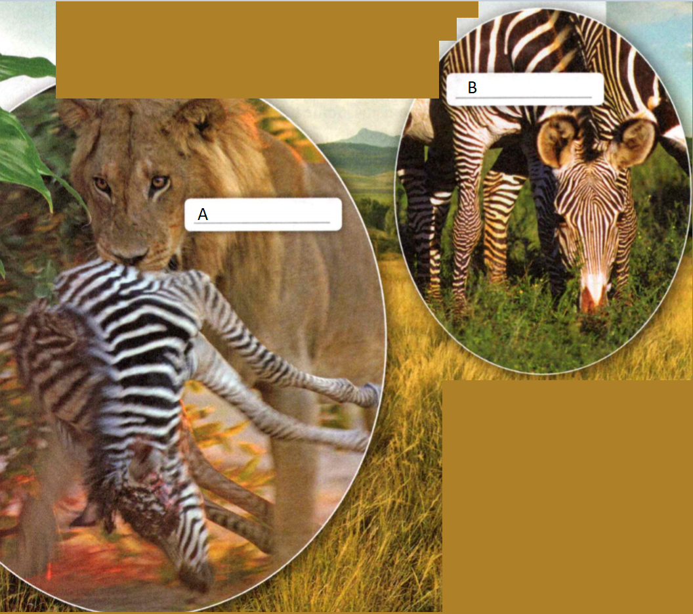
    <figcaption>Figure 1. Energy chain.</figcaption>
  </figure>

Both the zebras and the lion you see in Figure 1 use the food they eat to obtain
energy. Every living thing needs energy. All cells need energy to carry out
their functions, such as making proteins and transporting substances into and
out of the cell. The more cells an organism has, the more energy the organism
will require for survival. Like the raw materials used within a cell, energy
used by living things comes from their environment. Plant and animal cells
obtain their energy differently. Zebra meat supplies the lion's cells with
energy. Similarly, grass provides the zebra's cells with energy. But where does
the energy in the grass come from? Plants and certain other organisms, such as
algae and some bacteria, use the energy in sunlight to make their own food.

**Complete the tasks below.**

1. All living things need energy see Figure 1. 
a) Identify the direct source of energy for each organism. 
b) Which organism shown does not depend on another organism for food?

2. A spider catches and eats a caterpillar that depends on plant leaves for
food. Draw a diagram of your own that tracks how the sun's energy gets to the
spider. In your diagram, label each organism as a heterotroph or an autotroph.

### The Sun as an Energy Source 

The process by which a cell captures energy in sunlight and uses it to make food
is called photosynthesis. The term photosynthesis comes from the Greek words
photos, which means "light," and syntithenai, which means "putting together."
Nearly all living things obtain energy either directly or indirectly from the
energy of sunlight that is captured during photosynthesis. Grass obtains energy
directly from sunlight because grass makes its own food during photosynthesis.
When the zebra eats grass, it gets energy from the sun that has been stored in
the grass. Similarly, the lion obtains energy stored in the zebra. The zebra and
lion both obtain the sun's energy indirectly from the energy that the grass
obtained through photosynthesis.

### Producers and Consumers 
Plants make their own food through the process of photosynthesis. An organism
that makes its own food is called a producer, or an autotroph. An organism that
cannot make its own food, including animals such as the zebra and the lion, is
called a consumer, or a heterotroph. Many heterotrophs obtain food by eating
other organisms. Some heterotrophs, such as fungi, absorb their food from other
organisms.

**Complete the tasks below.**

1. An organism that makes its own food is a(n) (autotroph/heterotroph).
2. Why do living things need energy? 
3. Give an example of how energy from the sun gets into your cells.
4. Living things get energy directly from the sun by ____ or indirectly by ____ .

### What Happens During Photosynthesis?
You've just read that plants make their own food. So how do they do that? During
photosynthesis, plants and some other organisms absorb energy from the sun and
use the energy to convert carbon dioxide and water into sugars and oxygen. You
can think of photosynthesis as taking place in two stages. First, plants capture
the sun's energy. Second, plants produce sugars.

### Stage 1: Capturing the Sun's Energy 
In the first stage of photosynthesis, energy from sunlight is captured. In
plants, this process occurs mostly in the leaves. Recall that chloroplasts are
green organelles inside plant cells. The green color comes from pigments,
colored chemical compounds that absorb light. The main pigment for
photosynthesis in chloroplasts is **chlorophyll**.

Chlorophyll functions something like the solar cells in a solar-powered
calculator. Solar cells capture the energy in light and convert it to a form
that powers the calculator. Similarly, chlorophyll captures light energy and
converts it to a form that is used in the second stage of photosynthesis.

  <figure>
    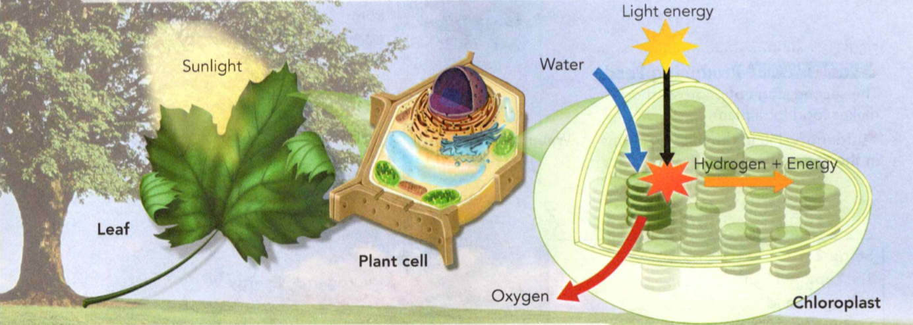
    <figcaption>Figure 2. First Stage of Photosynthesis.</figcaption>
  </figure>

During Stage 1, water in the chloroplasts is split into hydrogen and oxygen, as
shown in Figure 2. The oxygen is given off as a waste product. The hydrogen is
used in Stage 2.

**Complete the tasks below.**

1. The Greek word part chloros- means "pale green." Which word means "a green
compound that absorbs light"? Chloroplast/Chlorophyll

2. You might say the first stage of photosynthesis powers the "energy engine" of
the living world. What do you think this sentence means?

  <figure>
    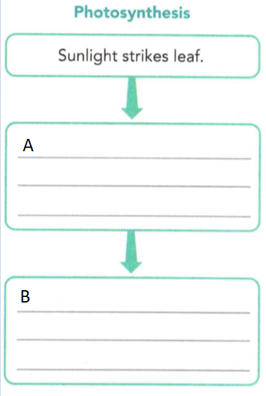
    <figcaption>Figure 3. Photosynthesis.</figcaption>
  </figure>

3. In Figure 3 complete the flowchart to show the process of photosynthesis.

### Stage 2: Using Energy to Make Food 
In the second stage of photosynthesis, cells produce sugars. As shown in Figure
3, cells use hydrogen (H) that came from the splitting of water in Stage 1.
Cells also use carbon dioxide (CO2) from the air. Carbon dioxide
enters the plant through small openings on the undersides of the leaves and
moves into the chloroplasts.

Powered by the energy captured in Stage 1, hydrogen and carbon dioxide undergo a
series of reactions that result in sugars. One important sugar produced is
glucose. It has the chemical formula C6H12O6.
You may know that sugars are a type of carbohydrate. Cells can use the energy in
glucose to carry out vital cell functions.

The other product of photosynthesis is oxygen gas (O2). Recall that
oxygen forms during the first stage when water molecules are split apart. Oxygen
gas exits a leaf through the openings on its underside. Almost all the oxygen in
Earth's atmosphere is produced by living things through the process of
photosynthesis.

  <figure>
    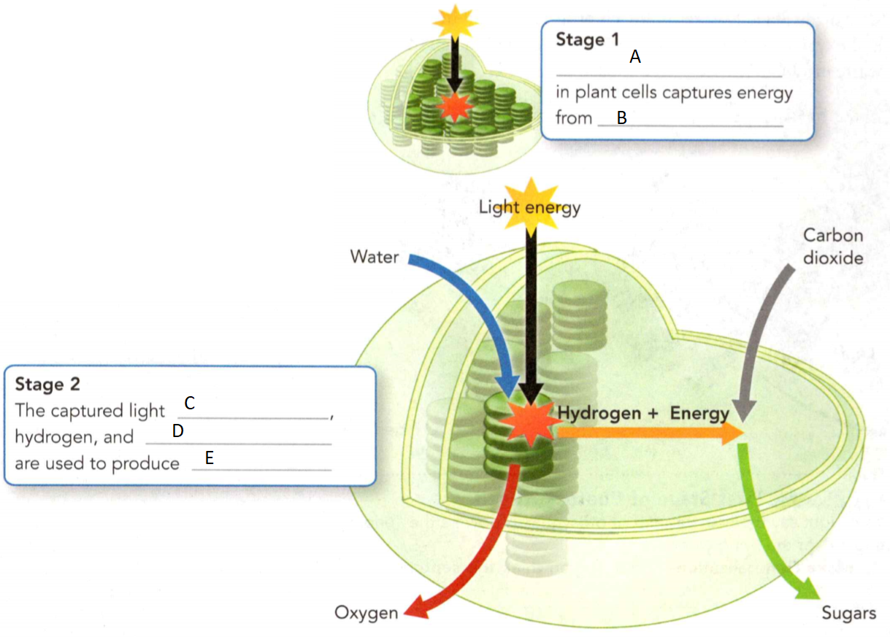
    <figcaption>Figure 4. Producing Food.</figcaption>
  </figure>

**Complete the tasks below.**

1. See Figure 4. The second stage of photosynthesis makes food for a plant. Fill
in the missing terms in the spaces provided.

  <figure>
    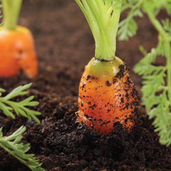
    <figcaption>Figure 5. From the sun to you, carrots.</figcaption>
  </figure>

2. Carrots (Figure 5) store food that is made in the carrot leaf cells. How are
carrots an energy link between you and the sun?

### The Photosynthesis Equation 
The events of photosynthesis that lead to the production of glucose can be
summed up by the following chemical equation (Figure 6):

  <figure>
    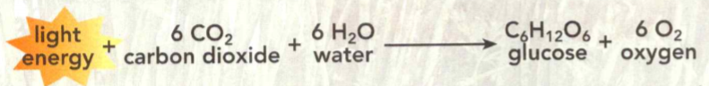
    <figcaption>Figure 6. The Photosynthesis Equation.</figcaption>
  </figure>

Notice that six molecules of carbon dioxide and six molecules of water are on
the left side of the equation. These compounds are raw materials. One molecule
of glucose and six molecules of oxygen are on the right side. These compounds
are products. An arrow, meaning "yields:' points from the raw materials to the
products. Energy is not a raw material, but it is written on the left side of
the equation to show that it is used in the reaction.

What happens to the sugars produced in photosynthesis? Plant cells use some of
the sugars for food. The cells break down these molecules in a process that
releases energy. This energy can then be used to carry out the plant's
functions, such as growing and making seeds. Some sugar molecules are made into
other compounds, such as cellulose for cell walls. Other sugar molecules may be
stored in the plant's cells for later use. When you eat food from plants, such
as potatoes or carrots, you are eating the plant's stored energy.

**Complete the tasks below.**

1. Select two products of photosynthesis. glucose/carbon
dioxide/oxygen/chlorophyll.
2. Refer to Figure 4. Where does the hydrogen that is used in Stage 2 of
photosynthesis come from?
3. Would you expect a plant to produce more oxygen on a sunny day or a cloudy
day? Explain your answer.
4. What happens during photosynthesis?

### Cellular Respiration
- What Happens During Cellular Respiration? 
- What Happens During Fermentation?
- 
**Complete the tasks below.**

1. Going to Extremes. You may not know it, but there are organisms living in
rocks deep below Earth's surface. Other organisms hang out in steaming ho lakes,
like Grand Prismatic Spring in Yellowstone National Park, shown here. The water
in this lake can be as hot as 86°C! Still other organisms nestle inside nuclear
waste. All of these organisms are extremophiles, organisms that thrive in
extreme habitats. These life forms can get energy in strange ways. Some make
food from ocean minerals. Others break down compounds in radioactive rocks!
Write a question about something else you would like to learn about
extremophiles.

### What Happens During Cellular Respiration?

You and your friend have been hiking all morning. You look for a flat rock to
sit on, so you can eat the lunch you packed. The steepest part of the trail is
ahead. You'll need a lot of energy to get to the top of the mountain! That
energy will come from food.

### What Is Cellular Respiration? 

After you eat a meal, your body breaks down the food and releases the sugars in
the food. The most common sugar in foods is glucose
(C6H12O6). Cellular respiration is the process
by which cells obtain energy from glucose. **During cellular respiration, cells
break down glucose and other molecules from food in the presence of oxygen,
releasing energy.** Living things need a constant supply of energy. The cells of
living things carry out cellular respiration continuously.

### Storing and Releasing Energy 

  <figure>
    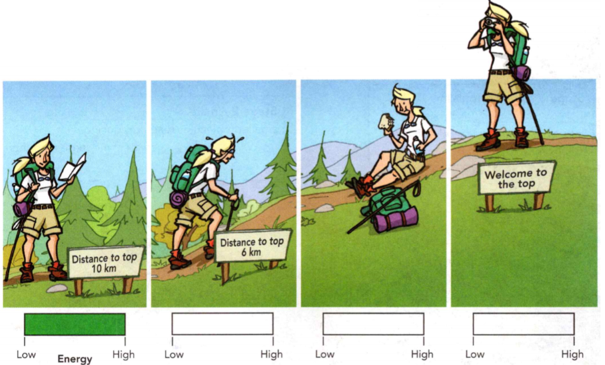
    <figcaption>Figure 7. Getting energy.</figcaption>
  </figure>

Imagine you have money in a savings account. If you want to buy something, you
withdraw some money. Your body stores and uses energy in a similar way, as shown
in Figure 7. When you eat a meal, you add to your body's energy savings account
by storing glucose. When cells need energy, they "withdraw" it by breaking down
glucose through cellular respiration.

### Breathing and Respiration 

You may have already heard of the word respiration. It can mean "breathing" - or
moving air in and out of your lungs. Breathing brings oxygen into your lungs,
which is then carried to cells for cellular respiration. Breathing also removes
the waste products of cellular respiration from your body.

**Complete the tasks below.**

1. Getting Energy Figure 7. Your body runs on the energy it gets from food.
a) Color in the last three energy scales to show how the hiker's energy changes.
b) How do you think the hiker's breathing rate changes as she climbs?

  <figure>
    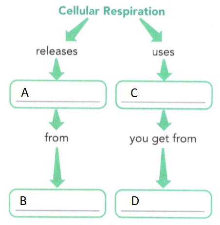
    <figcaption>Figure 8. Cellular Respiration.</figcaption>
  </figure>

2. In Figure 8 complete the concept map about Cellular Respiration.

### The Two Stages of Cellular Respiration 

Like photosynthesis, cellular respiration is a two-stage process. See Figure 2.
The first stage occurs in the cytoplasm of a cell. There, molecules of glucose
are broken down into smaller molecules. Oxygen is not involved in this stage,
and only a small amount of energy is released.

The second stage takes place in the mitochondria. There, the small molecules are
broken down even more. This change requires oxygen and releases a great deal of
energy that the cell can use for all its activities. No wonder mitochondria are
sometimes called the "powerhouses" of the cell!

### The Cellular Respiration Equation 

Although respiration occurs in a series of
complex steps, the overall process can be summarized in the following equation:

  <figure>
    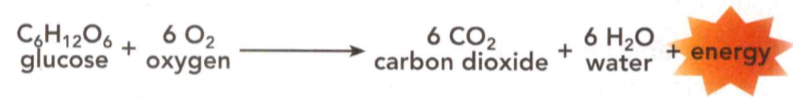
    <figcaption>Figure 9. The Cellular Respiration Equation.</figcaption>
  </figure>

Notice that the raw materials for cellular respiration are glucose and oxygen.
Animals get glucose from the foods they consume. Plants and other organisms that
carry out photosynthesis are able to produce their own glucose. The oxygen
needed for cellular respiration is in the air or water surrounding the organism.

  <figure>
    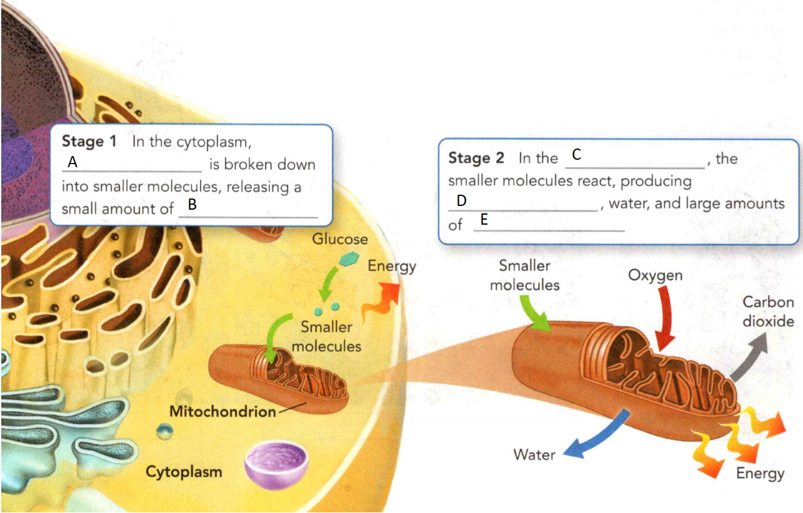
    <figcaption>Figure 10. Releasing Energy. </figcaption>
  </figure>

**Complete the tasks below.**

1. Cellular respiration takes place in two stages. In Figure 10 fill in the
missing terms in the spaces provided.

### Comparing Two Energy Processes

If you think the equation for cellular respiration is the opposite of the one
for photosynthesis, you're right! Photosynthesis and cellular respiration can be
thought of as opposite processes. Together, these two processes form a cycle
that keeps the levels of oxygen and carbon dioxide fairly constant in Earth's
atmosphere. As you can see from Figure 11, living things cycle both gases over
and over again. The energy released through cellular respiration is used or lost
as heat.

  <figure>
    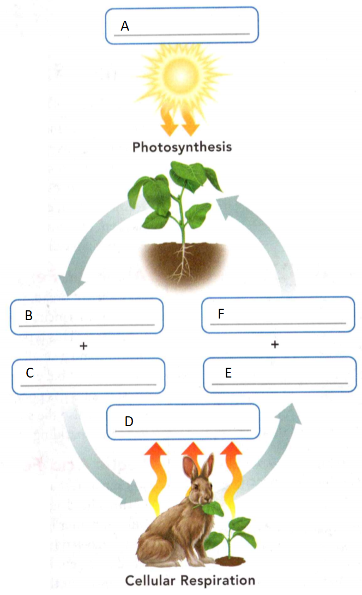
    <figcaption>Figure 11. Opposite Processes.</figcaption>
  </figure>

**Complete the tasks below.**

1. See Figure 11. Producers carry out photosynthesis, but producers and
consumers both carry out cellular respiration. Word Bank: Oxygen, Carbon
dioxide, Water, Energy, Glucose. Use the word bank to fill in the missing
terms. Words can be used more than once.

2. Look at Figure 10. How does Stage 2 of cellular respiration benefit a cell?

3. Why does cellular respiration add carbon dioxide to the atmosphere, but
photosynthesis does not?

4. During cellular respiration, cells ____ .

### What Happens During Fermentation?  

Some organisms can live in the presence or absence of oxygen. If not enough
oxygen is present to carry out cellular respiration, these organisms switch to
another process. **Fermentation** is an energy-releasing process that does not
require oxygen. **During fermentation, cells release energy from food without
using oxygen.** One drawback to fermentation is that it releases far less energy
than cellular respiration does.

### Alcoholic Fermentation 

Did you know that when you eat a slice of bread, you are eating a product of
fermentation? Alcoholic fermentation occurs in yeast and other single-celled
organisms. This type of fermentation produces alcohol, carbon dioxide, and a
small amount of energy. These products are important to bakers and brewers.
Carbon dioxide produced by yeast creates gas pockets in bread dough, causing it
to rise. Carbon dioxide is also the source of bubbles in alcoholic drinks such
as beer and sparkling wine.

### Lactic Acid Fermentation 

Think of a time when you ran as fast and as long as you could. Your leg muscles
were pushing hard against the ground, and you were breathing quickly. But, no
matter how quickly you breathed, your muscle cells used up the oxygen faster
than it could be replaced. Because your cells lacked oxygen, fermentation
occurred. Your muscle cells got energy, but they did so by breaking down glucose
without using oxygen. One product of this type of fermentation is a compound
known as lactic acid. When lactic acid builds up, you may feel a painful burning
sensation in your muscles. Lactic acid was once thought to be the cause of
muscle soreness. Scientists have learned that lactic acid is gone from muscles
shortly after exercising and is not responsible for the soreness you feel in
the days after you exercise. Instead, the soreness is likely caused by
microscopic damage to muscles that occurred during the exercise.

**Complete the tasks below.**

  <figure>
    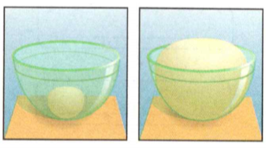
    <figcaption>Figure 12. Bread dough.</figcaption>
  </figure>

1. A ball of bread dough mixed with yeast is left in a bowl at room temperature
(Figure 12). As time passes, the dough increases in size.
a) How does fermentation that causes dough to rise differ from fermentation in
muscles?
b) How would you show that yeast was responsible for making the dough rise?

2. Plant cells capture energy by way of (photosynthesis/fermentation/
cellular respiration).
3. Plants are autotrophs because ___ .
4. Plant cells release energy for cell function by way of (photosynthesis/fermentation/ cellular respiration).
5. Plants get this energy when oxygen reacts with ___ .

6. A runner on an easy jog through the woods gets energy by way of (photosynthesis/fermentation/ cellular respiration).
7. The runner is a heterotroph because she gets energy from ___ .
8. If the runner makes a long, fast push to the finish, her muscle cells may get
energy by way of (photosynthesis/fermentation/ cellular respiration).
9. This process releases less energy and ___ .

10. When a race ends, why do you think runners continue to breathe quickly and
deeply for a few minutes?

11. How do living things get energy?

12. Fermentation is a way for cells to ___ .

### Cell Division

- What Are the Functions of Cell Division? 
- What Happens During the Cell Cycle?

**Complete the tasks below.**

1. Cycling On How long do you think it takes a cell to grow and reproduce, that
is, to complete one cell cycle? The answer depends on the type of cell and the
organism. Some cells, such as the frog egg cells shown here, divide every 30
minutes, and others take as long as a year! The table below compares the length
of different cell cycles.

  <figure>
    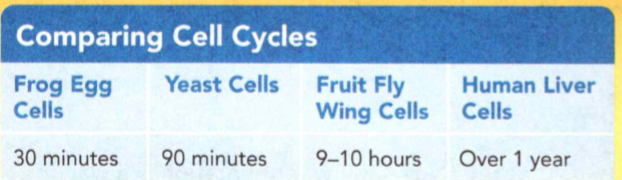
    <figcaption>Figure 13. Comparing Cell Cycles.</figcaption>
  </figure>

Use the table to help you answer the following questions.
a) Which type of cell completes a cell cycle fastest?
b) With each cell cycle, two cells form from one cell. In three hours, how many
cells could form from one frog egg cell?

### What Are the Functions of Cell Division?

How do tiny frog eggs become big frogs? Cell division allows organisms to grow
larger. One cell splits into two, two into four, and so on, until a single cell
becomes a multicellular organism.

How does a broken bone heal? Cell division produces new healthy bone cells that
replace the damaged cells. Similarly, cell division can replace aging cells and
those that die from disease.

Growth and repair are two functions of cell division. A third function is
reproduction. Some organisms reproduce simply through cell division. Many
single-celled organisms, such as amoebas, reproduce this way. Other organisms
can reproduce when cell division leads to the growth of new structures. For
example, a cactus can grow new stems and roots. These structures can then break
away from the parent plant and become a separate plant.

Most organisms reproduce when specialized cells from two different parents
combine, forming a new cell. This cell then undergoes many divisions and grows
into a new organism.

Cell division has more than one function in living things, as shown in Figure 14.
**Cell division allows organisms to grow, repair damaged structures, and
reproduce.**

  <figure>
    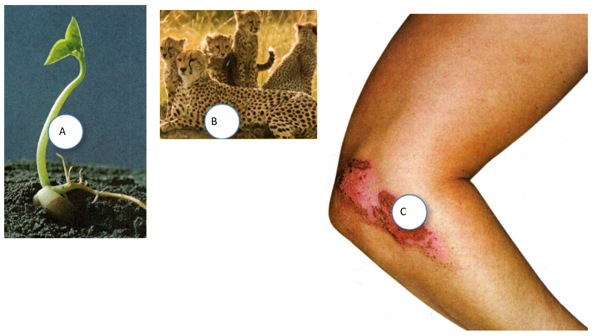
    <figcaption>Figure 14. Cell division.</figcaption>
  </figure>

**Complete the tasks below.**

1. Cell Division Figure 14. Each photo represents at least one function of cell
division. Label each photo as growth, repair, or reproduction.

2. Cell Division Figure 14. Which photo(s) represents more than one function and
what are they?

3. The functions of cell division are ___ .

### What Happens During the Cell Cycle?

The regular sequence of growth and division that cells undergo is known as the
cell cycle. **During the cell cycle, a cell grows, prepares for division, and
divides into two new cells, which are called "daughter cells:'.** Each of the
daughter cells then begins the cell cycle again. The cell cycle consists of
three main stages: interphase, mitosis, and cytokinesis.

### Stage 1: Interphase

The first stage of the cell cycle is **interphase**. This stage is the period before
cell division. During interphase, the cell grows, makes a copy of its DNA, and
prepares to divide into two cells.

#### Growing 
Early during interphase, a cell grows to its full size and produces the
organelles it needs. For example, plant cells make more chloroplasts. And all
cells make more ribosomes and mitochondria. Cells also make more enzymes,
substances that speed up chemical reactions in living things.

#### Copying DNA 
Next, the cell makes an exact copy of the DNA in its nucleus in a process called
**replication**. You may know that DNA holds all the information that a cell needs
to carry out its functions. Within the nucleus, DNA and proteins form threadlike
structures called **chromosomes**. At the end of replication, the cell contains two
identical sets of chromosomes.

#### Preparing for Division 

Once the DNA has replicated, preparation for cell division begins. The cell
produces structures that will help it to divide into two new cells. In animal
cells, but not plant cells, a pair of centrioles is duplicated. You can see the
centrioles in the cell in Figure 15. At the end of interphase, the cell is ready
to divide.

  <figure>
    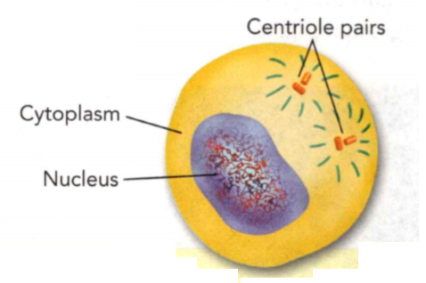
    <figcaption>Figure 15. Interphase: Preparing to Divide.</figcaption>
  </figure>

**Complete the tasks below.**

1. See Figure 15. Interphase: Preparing to Divide The changes in a cell during
interphase prepare the cell for mitosis. Make a list of the events that occur
during interphase.

2. When one cell splits in half during cell division, the result is two new
cells. Each of those two cells can divide into two more, and so on.

  <figure>
    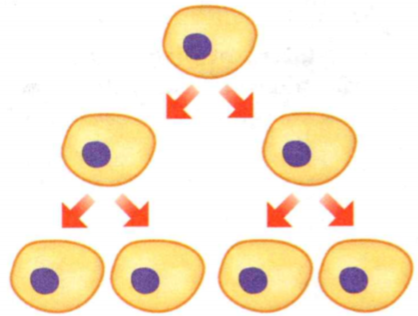
    <figcaption>Figure 16. Cell division.</figcaption>
  </figure>

a) How many cell divisions would it take to produce at least 1,000 cells from
one cell?
b) What happens to the number of cells after each division?
c) Do you think all human cells divide at the same rate throughout life? Justify
your answer.

### Stage 2: Mitosis
Once interphase ends, the second stage of the cell cycle begins. During mitosis,
the cell's nucleus divides into two new nuclei and one set of DNA is distributed
into each daughter cell.

  <figure>
    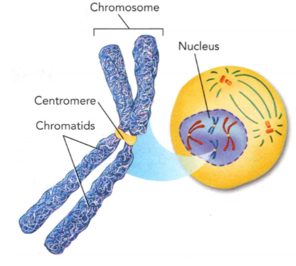
    <figcaption>Figure 17. Mitosis: Prophase.</figcaption>
  </figure>

Scientists divide mitosis into four parts, or phases: prophase, metaphase,
anaphase, and telophase. During prophase, the chromosomes condense into shapes
that can be seen under a microscope. In Figure 17 you can see that a chromosome
consists of two rod-like parts, called chromatids. Each chromatid is an exact
copy of the other, containing identical DNA. A structure known as a centromere
holds the chromatids together until they move apart later in mitosis. One copy
of each chromatid will move into each daughter cell during the final phases of
mitosis. When the chromatids separate they are called chromosomes again. Each
cell then has a complete copy of DNA. Figure 18 summarizes the
events of mitosis.

**Complete the tasks below.**

1. Mitosis: Prophase (Figure 17) Mitosis begins with prophase, which involves
further changes to the cell. How does prophase look different from interphase?

  <figure>
    
    <figcaption>Figure 18. The Cell Cycle.</figcaption>
  </figure>

2. In Figure 18 cells undergo an orderly sequence of events as they grow and
divide. The photographs show cells of a developing whitefish. 
a) Interphase: Two
cylindrical structures called centrioles are copied. Identify two other changes
that happen in interphase.

b) Mitosis. Prophase
Chromosomes in the nucleus condense. The pairs of centrioles move to opposite
sides of the nucleus. Spindle fibers form a bridge between the ends of the cell.
The nuclear envelope breaks down. Metaphase: Each chromosome attaches to a
spindle fiber at its centromere. What is missing from the cell? What happened to
the chromosomes?

  <figure>
    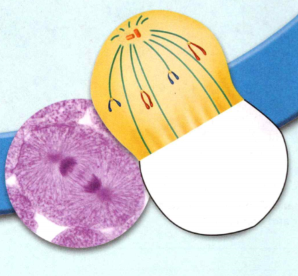
    <figcaption>Figure 20. Anaphase.</figcaption>
  </figure>

c) Anaphase: The centromere of each chromosome splits, pulling the chromatids
apart. Each chromatid is now called a chromosome. These chromosomes are drawn by
their spindle fibers to opposite ends of the cell. The cell stretches out. In
Figure 20 draw the missing structures.

d) Telophase. How does the diagram of a cell in telophase look different from
the one in anaphase?

e) Interphase: Two
cylindrical structures called centrioles are copied. Identify two other changes
that happen in interphase.

 <figure>
    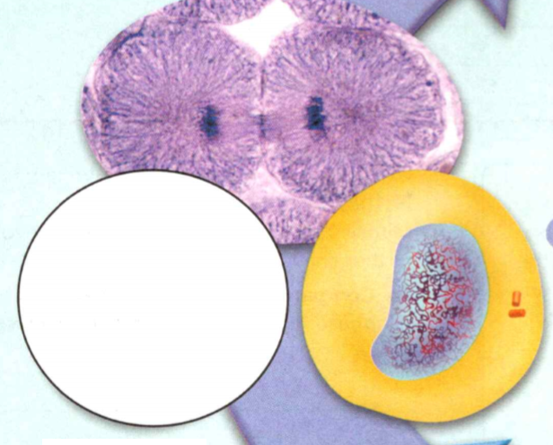
    <figcaption>Figure 19. Cytokinesis.</figcaption>
  </figure>

f) Cytokinesis begins during mitosis. As cytokinesis continues, the cell splits into two daughter cells. Each daughter cell ends up with an identical set of chromosomes and about half the organelles of the parent cell. In Figure 19 draw this daughter cell.

### Stage 3: Cytokinesis

The final stage of the cell cycle, which is called cytokinesis, completes the
process of cell division. During cytokinesis, the cytoplasm divides. The
structures are then distributed into each of the two new cells. Cytokinesis
usually starts at about the same time as telophase. When cytokinesis is
complete, each daughter cell has the same number of chromosomes as the parent
cell. At the end of cytokinesis, each cell enters interphase, and the cycle
begins again.

#### Cytokinesis in Animal Cells 
During cytokinesis in animal cells, the cell membrane squeezes together around
the middle of the cell, as shown here. The cytoplasm pinches into two cells.
Each daughter cell gets about half of the organelles of the parent cell.

#### Cytokinesis in Plant Cells 

Cytokinesis is somewhat different in plant cells. A plant cell's rigid cell wall
cannot squeeze together in the same way that a cell membrane can. Instead, a
structure called a cell plate forms across the middle of the cell as shown in
Figure 21. The cell plate begins to form new cell membranes between the two
daughter cells. New cell walls then form around the cell membranes.

Certain bacteria divide only once every 100 years! Bacteria known as Firmicutes
live in certain rocks that are found 3 kilometers below Earth's surface. The
life functions of Firmicutes occur so slowly that it takes 100 years or more for
them to store enough energy to split in two.

  <figure>
    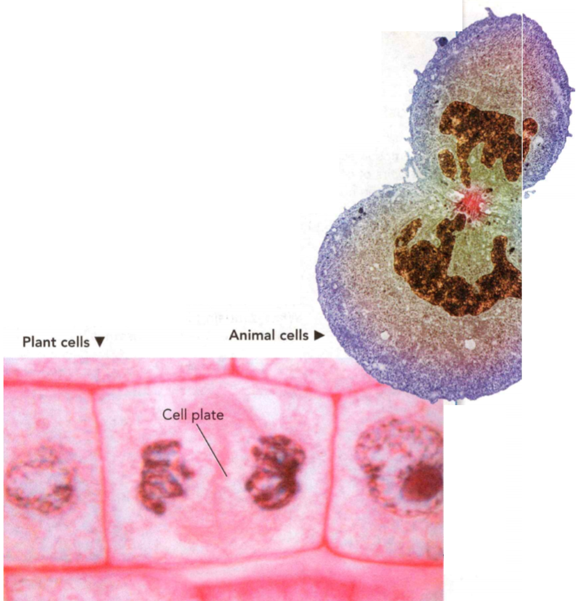
    <figcaption>Figure 21. Cytokinesis.</figcaption>
  </figure>

**Complete the tasks below.**

1. Both plant and animal cells undergo cytokinesis, Figure 21. How does cytokinesis differ in plant and animal cells?

  <figure>
    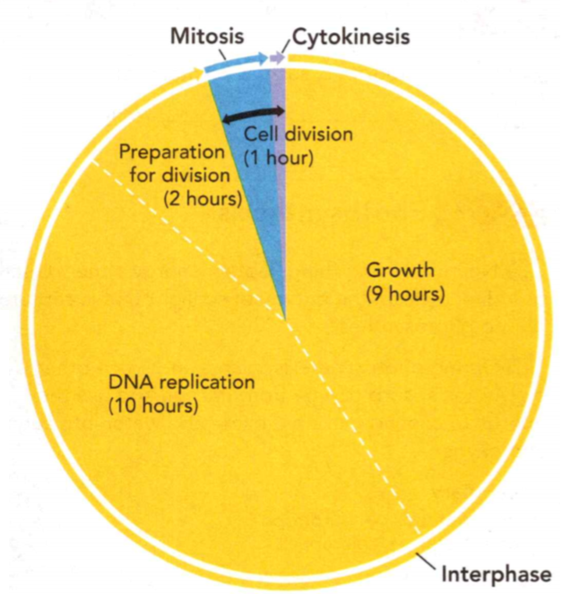
    <figcaption>Figure 22. Length of a liver cell cycle..</figcaption>
  </figure>

2. Length of a liver cell cycle, see Figure 22. How long does it take for a cell
to go through one cell cycle? It depends on the cell. Human liver cells
generally reproduce less than once per year. At other times, they can complete
one cell cycle in about 22 hours, as shown in the circle graph. Study the graph
and answer the following questions.
a) What do the three curved arrows outside of the circle represent?
b) The wedge representing growth is in which stage of the cell cycle?
c) About what percentage of the cell cycle is shown for DNA replication?
d) What stage in the cell cycle takes the shortest amount of time? How do you
know?

3. What are the three stages of the cell cycle?

4. Put the following terms in correct order: anaphase, telophase, metaphase,
prophase.

5. What do you think would happen if cell's DNA did not replicate correctly?

6. During the cell cycle _______ .

7. Autotrophs, such as plants, capture the sun's energy and make their food
through ____, while _____ get energy by eating food.

### Study Guide

- Nearly all living things obtain energy either directly or indirectly from the
energy of sunlight that is captured during photosynthesis.
- During photosynthesis, plants and some other organisms absorb energy from the
sun and use the energy to convert carbon dioxide and water into sugars and
oxygen.
- During cellular respiration, cells break down glucose and other molecules from
food in the presence of oxygen, releasing energy.
- During fermentation, cells release energy from food without using oxygen.
- Cell division allows organisms to grow, repair damaged structures, and reproduce.
- During the cell cycle, a cell grows, prepares for division, and divides into
two new cells, which are called "daughter cells."

**Complete the tasks below.**

1. Which of the following organisms are autotrophs?
A) fungi	
B) rabbits
C) humans	
D) oak trees

2. Plants are green because of ___ , the main photosynthetic pigment in
chloroplasts.

  <figure>
    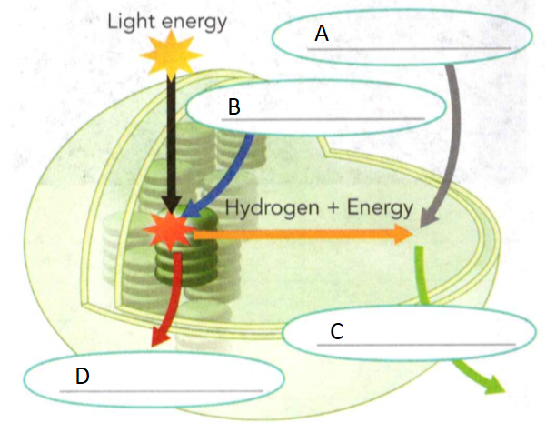
    <figcaption>Figure 23. Photosynthesis.</figcaption>
  </figure>

3. Fill in the missing labels in the diagram in Figure 23.

4. Suppose a volcano threw so much ash into the air that it blocked much of the
sunlight. How might this event affect the ability of animals to obtain energy to
live?

5. How do you get energy? Describe the path of energy from the sun to you, using
at least two vocabulary terms you learned in this lesson.

6. In which organelle does cellular respiration take place?
A) nucleus	
B) chloroplast
C) chlorophyll	
D) mitochondrion

7. ________ is a process that releases energy in cells without using oxygen.

8. What is one common food that is made with the help of fermentation?

9. Write a word equation for cellular respiration in cells.

10. In one or two sentences, summarize what happens during each of the two
stages of cellular respiration.

11. How is breathing related to cellular respiration?

12. During which phase of the cell cycle does DNA replication occur?
A) mitosis	
B) division
C) interphase	
D) cytokinesis

13. During _____, a cell's nucleus divides into two new nuclei.

14. Why is cell division a necessary function of living things?
15. Why is replication a necessary step in cell division?

  <figure>
    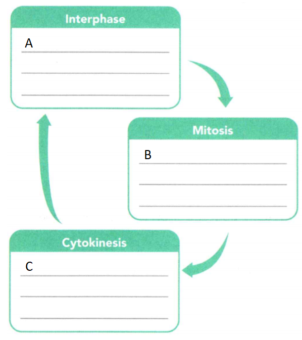
    <figcaption>Figure 24. Cell cycle.</figcaption>
  </figure>

16. Fill in the diagram in Figure 24 with descriptions of each part of the cell
cycle.

  <figure>
    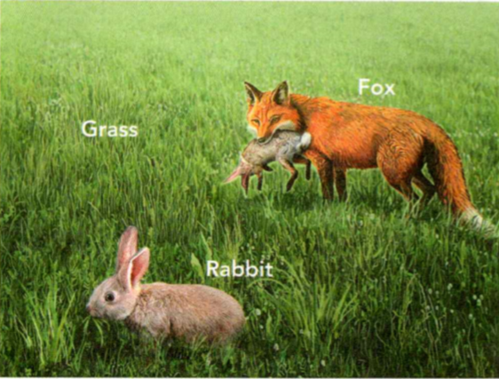
    <figcaption>Figure 25. Organisms.</figcaption>
  </figure>

17. All living things need energy. Use the terms autotroph and heterotroph to
describe how each of the organisms in the illustration in Figure 25 obtains energy.

18. Choose the name and cellular process that match the organelle shown in Figure 10.
A) chloroplast; cellular respiration
B) mitochondrion; cellular respiration
C) chloroplast; photosynthesis
D) mitochondrion; photosynthesis

19. What is the result of cell division?
A) one daughter cell with double the DNA of the parent cell
B) two daughter cells with double the DNA of the parent cell
C) one daughter cell with half the DNA of the parent cells
D) two daughter cells with the same DNA as the parent cell

20. What is the source of energy used in photosynthesis?
A) glucose
B) sunlight 
C) chlorophyll
D) DNA 

21. What is one main difference between fermentation and cellular respiration?
A) Fermentation does not require oxygen, while cellular respiration does.
B) Fermentation does not release energy, while cellular respiration does.
C) Fermentation does not occur in animals, while cellular respiration does.
D) Fermentation does not depend on the sun while cellular respiration does.

22. Which statement best applies to chromosomes?
A) They carry out respiration.
B) They consist mostly of the pigment chlorophyll.
C) Their structure is visible only during interphase.
D) They become visible during the mitosis stage of the cell cycle.

  <figure>
    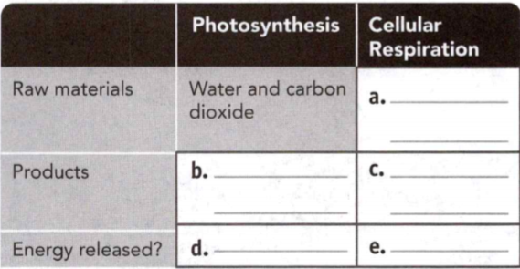
    <figcaption>Figure 26. Contrast photosynthesis and cellular respiration.</figcaption>
  </figure>

23. Complete the table in Figure 26 to compare and contrast photosynthesis and
cellular respiration.

24. Athletic trainers at commercial gyms help people perform exercises to
improve their health. But athletic trainers do more than play at the gym all
day. In reality, athletic trainers are professionals who understand the ways in
which muscles and body systems work together. Many athletic trainers who work
with elite athletes study biology, anatomy and physiology, or physical education
in college. They are often athletes too, and may gain experience as a trainer at
a commercial gym. An athletic trainer must apply scientific discoveries to
people's fitness training. For example, have you ever felt a burning sensation
in your muscles after a workout? People sometimes think this feeling is caused
by a buildup of lactic acid in the muscles. However, scientists think that cells
use lactic acid to produce energy when glucose supplies are low. An athletic
trainer may suggest that an athlete use endurance training. Endurance training
helps train muscles to efficiently burn lactic acid, which improves the
athlete's performance. Athletic trainers work in an exciting and constantly
changing fielD) As scientists learn more about human biology, athletic trainers
apply these lessons. They help athletes continue to push the limits of human
performance. Find out about an athletic trainer, and create a profile of that
person. Describe where he or she works, why he or she chose this career, and
whether the trainer performs any research. Then, identify where in your
community an athletic raiser might be able to help people.

25. You've probably heard of heartburn and heart attacks, and even heartbreak.
But have you heard of heart cancer? Heart cancer occurs very rarely, and the
tumors usually do not grow the way most cancer tumors do. So why doesn't the
heart usually develop cancer? The answer may lie with cell division. Every
moment of your life, cells in your body are dividing. During cell division, a
cell's genetic material is copied, and a new cell forms. However, mistakes in
how genes are copied can occur during cell division. Occasionally, these
mistakes can lead to certain forms of cancer. In a healthy heart, cell division
slows significantly by the time a person reaches adulthood. Cell division is
slow and rare in the adult heart because the cells of the heart are active every
minute of life. Therefore, heart cells do not mutate very often, so the risk of
a mutation causing cancer is very low. Find out more about rare cancers. Then,
create a multimedia presentation that describes why these types of cancer are
uncommon. Be sure to cite your sources of information.

  <figure>
    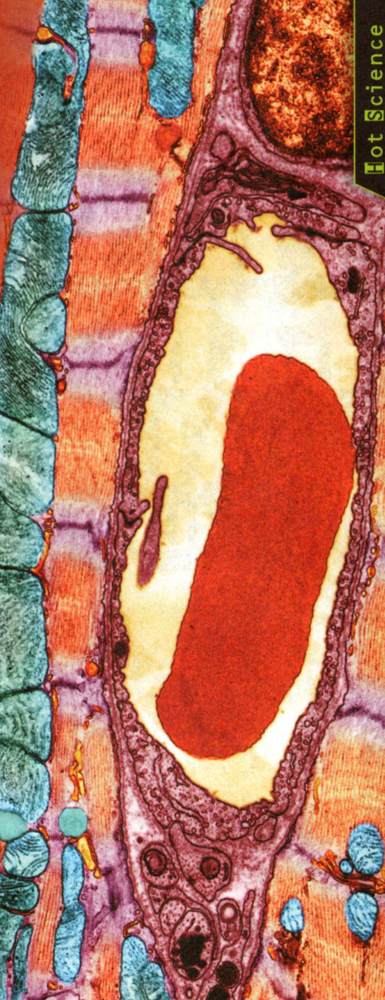
    <figcaption>Figure 27. This colored transmission electron micrograph (TEM) shows muscle cells from a healthy heart. The hardworking cells in your heart rarely rest long enough for cell division to occur.</figcaption>
  </figure>

  <figure>
    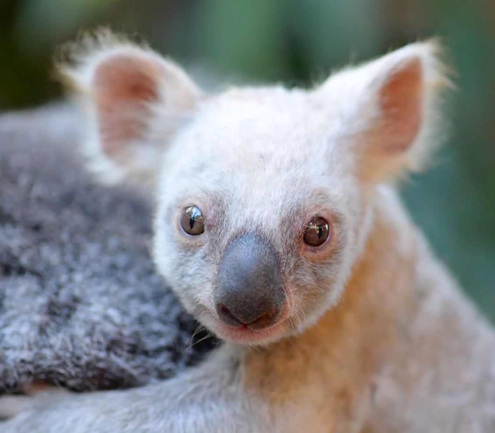
    <figcaption>Figure 28. Joey.</figcaption>
  </figure>

26. Why don't offspring always look like their parents? In Figure 28 even though
this young koala, or joey, has two fuzzy ears, a long nose, and a body shaped
like its mom's, you can see that the two are different. You might expect a young
animal to look exactly like its parents, but think about how varied a litter of
kittens or puppies can look. This joey is an albino - an animal that lacks the
usual coloring in its eyes, fur, and skin. Describe how this joey looks
different from its mom.
