### Life Science

## Biology

## Genetics: The Science of Heredity

**Sexual reproduction** involves two parents and combines their genetic material to produce a new organism that differs from both parents.

**Asexual reproduction** involves only one parent and produces offspring that
are identical to the parent.

During **mitosis**, a cell's nucleus divides into two new nuclei, and one copy
of DNA is distributed into each daughter cell.

**Complete the tasks below.**

1. Kent's cat just had six kittens. All six kittens look different from one
another—and from their two parents! Kent knows each kitten is unique because
cats reproduce through sexual reproduction, not asexual reproduction. Before
long, the kittens will grow bigger and bigger as their cells divide through
mitosis. In what way are the two daughter cells that form by mitosis and cell
division identical?

2. Fill in the blank with the correct suffix. A domin___ allele can mask a
recessive allele.

### Chapter Preview

- heredity
- trait
- genetics
- fertilization
- purebred
- gene
- allele
- dominant allele
- recessive allele
- hybrid
- probability
- Punnett square
- phenotype
- genotype
- homozygous
- heterozygous 
- incomplete dominance
- codominance
- multiple alleles
- polygenic inheritance
- meiosis

### What Is Heredity
- What Did Mendel Observe?
- How Do Alleles Affect Inheritance?
- 
**Complete the tasks below.**

1. Almost Forgotten When scientists make great discoveries, sometimes their work
is praised, criticized, or even forgotten. Gregor Mendel was almost forgotten.
He spent eight years studying pea plants, and he discovered patterns in the way
characteristics pass from one generation to the next. For almost 40 years,
people overlooked Mendel's work. When it was finally rediscovered, it unlocked
the key to understanding heredit. Did you ever rediscover something of yours
that you had forgotten?

### What Did Mendel Observe?
In the mid-nineteenth century, a priest named Gregor Mendel tended a garden in a
central European monastery. Mendel's experiments in that peaceful garden would
one day transform the study of heredity. **Heredity** is the passing of physical
characteristics from parents to offspring.

Mendel wondered why different pea plants had different characteristics. Some pea
plants grew tall, while others were short. Some plants produced green seeds,
while others had yellow seeds. Each specific characteristic, such as stem height
or seed color, is called a **trait**. Mendel observed that the forms of the pea
plants' traits were often similar to those of their parents. Sometimes, however,
the forms differed.

### Mendel's Experiments 

  <figure>
    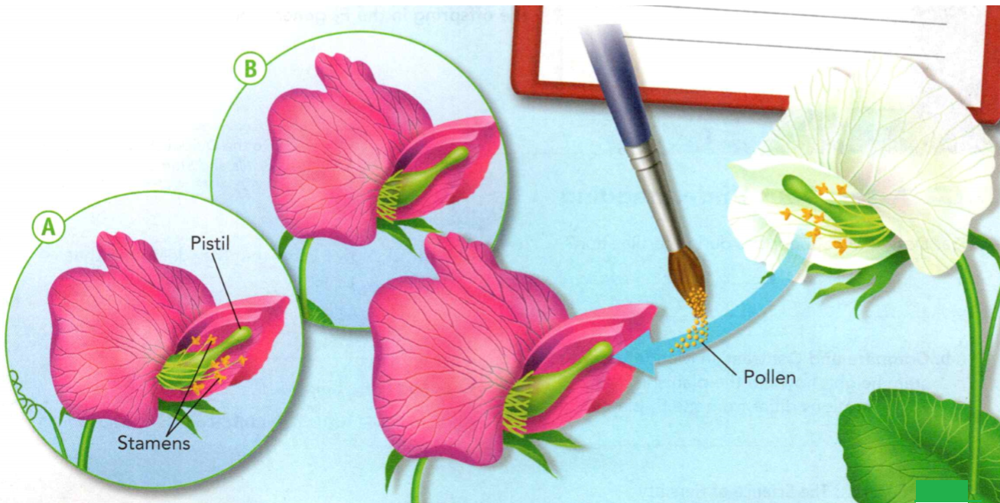
    <figcaption>Figure 1. Crossing Pea Plants.</figcaption>
  </figure>

Mendel experimented with thousands of pea plants. Today, Mendel's discoveries
form the foundation of **genetics**, the scientific study of heredity. Figure 1
shows the parts of a pea plant's flower. The pistil produces female sex cells,
or eggs. The stamens produce pollen, which contains the male sex cells, or
sperm. A new organism begins to form when egg and sperm cells join in the
process called **fertilization**. Before fertilization can happen in pea plants,
pollen must reach the pistil of a pea flower. This process is called
pollination.

Pea plants are usually self-pollinating. In self-pollination, pollen from a
flower lands on the pistil of the same flower. Mendel developed a method by
which he cross-pollinated, or "crossed:' pea plants. Figure 1 shows his method.

Mendel decided to cross plants that had contrasting forms of a trait—for
example, tall plants and short plants. He started with purebred plants. A
**purebred** organism is the offspring of many generations that have the same
form of a trait. For example, purebred tall pea plants always come from tall
parent plants.

**Complete the tasks below.**

1. Mendel devised a way to cross-pollinate pea plants. Use the diagram in Figure
1 to answer the questions about Mendel's procedure. How does flower B differ
from flower A?

2. Describe how Mendel cross-pollinated pea plants.

### The F1 and F2 Offspring 

Mendel crossed purebred tall plants with purebred short plants. Today,
scientists call these plants the parental, or P, generation. The resulting
offspring are the first filial, or F1, generation. The word filial
comes from filia and filius, the Latin words for "daughter" and "son".

  <figure>
    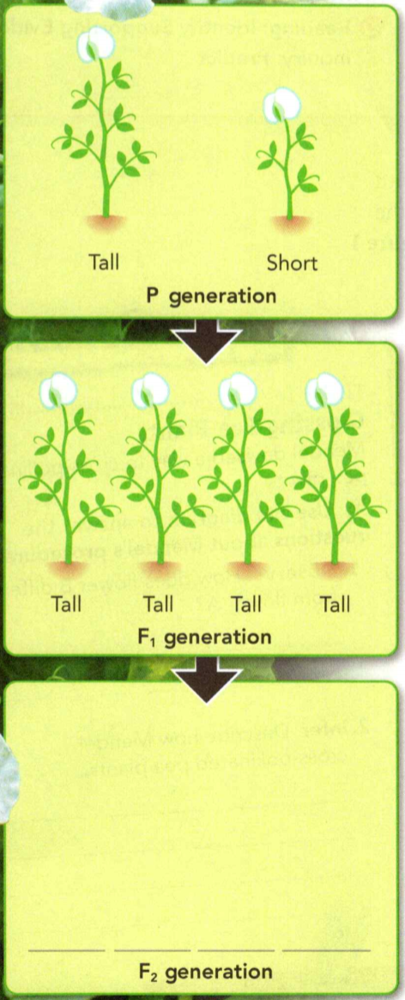
    <figcaption>Figure 2. Results of a Cross.</figcaption>
  </figure>

Look at Figure 2 to see the surprise Mendel found in the F1
generation. All the offspring were tall. The shortness trait seemed to have
disappeared!

When these plants were full-grown, Mendel allowed them to self-pollinate. The
F2 (second filial) generation that followed surprised Mendel even
more. He counted the plants of the F2 generation. About three fourths
were tall, while one fourth were short.

### Experiments With Other Traits 
Mendel repeated his experiments, studying other pea-plant traits, such as flower
color and seed shape. **In all of his crosses, Mendel found that only one form
of the trait appeared in the F1 generation. However, in the
F2 generation, the "lost" form of the trait always reappeared in
about one fourth of the plants.**

**Complete the tasks below.**

1. In Mendel's crosses, some forms of a trait were hidden in one generation but
reappeared in the next. Draw and label the offspring in the F2
generation.

2. What happens during fertilization?

3. In Mendel's cross for stem height, how did the plants in the F2
generations differ from the F1 plants? 

4. Mendel found that one form of a trait ___ .

### How Do Alleles Affect Inheritance?
Mendel reached several conclusions from his experimental results. He reasoned
that individual factors, or sets of genetic "information," must control the
inheritance of traits in peas. The factors that control each trait exist in
pairs. The female parent contributes one factor, while the male parent
contributes the other factor. Finally, one factor in a pair can mask, or hide,
the other factor. The tallness factor, for example, masked the shortness factor.

### Genes and Alleles 

Today, scientists use the word **gene** to describe the factors that control a
trait. **Alleles** are the different forms of a gene. The gene that controls
stem height in peas has one allele for tall stems and one allele for short
stems. Each pea plant inherits two alleles—one from the egg and the other from
the sperm. A plant may inherit two alleles for tall stems, two alleles for short
stems, or one of each.

  <figure>
    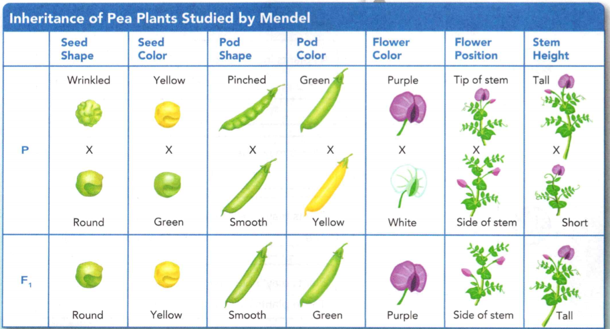
    <figcaption>Figure 3. Alleles in Pea Plants.</figcaption>
  </figure>

**An organism's traits are controlled by the alleles it inherits from its
parents. Some alleles are dominant, while other alleles are recessive.** A
**dominant allele** is one whose trait always shows up in the organism when the
allele is present. A **recessive allele**, on the other hand, is hidden whenever
the dominant allele is present. Figure 3 shows dominant and recessive alleles of
the traits in Mendel's crosses.

**Complete the tasks below.**

1. Mendel studied the inheritance of seven different traits in pea plants. Use
the table in Figure 3 to answer the questions. 
a) Circle the picture of each dominant form of the trait in the P generation.
b) Under what conditions would the recessive form of one of these traits
reappear?

### Alleles in Mendel's Crosses 
In Mendel's cross for stem height, the purebred tall plants in the P generation
had two alleles for tall stems. The purebred short plants had two alleles for
short stems. But each F1 plant inherited one allele for tall stems
and one allele for short stems. The F1 plants are called hybrids. A
hybrid organism has two different alleles for a trait. All the F1
plants are tall because the dominant allele for tall stems masks the recessive
allele for short stems.

### Symbols for Alleles 

Geneticists, scientists who study genetics, often use letters to represent
alleles. A dominant allele is symbolized by a capital letter. A recessive allele
is symbolized by the lowercase version of the same letter. For example, T stands
for the allele for tall stems, and t stands for the allele for short stems. When
a plant has two dominant alleles for tall stems, its alleles are written as TT
When a plant has two recessive alleles for short stems, its alleles are written
as tt. These plants are the P generation shown in Figure 4. Think about the
symbols that would be used for F1 plants that all inherit one allele
for tall stems and one for short stems.

 <figure>
    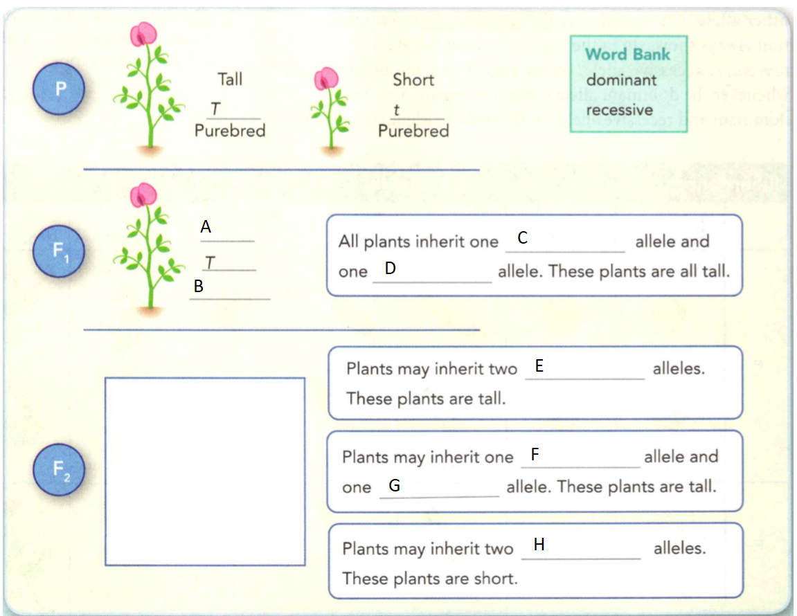
    <figcaption>Figure 4. Dominant and Recessive Alleles.</figcaption>
  </figure>

### Significance of Mendel's Contribution 

Mendel's discovery of genes and alleles eventually changed scientists' ideas
about heredity. Before Mendel, most people thought that the traits of an
individual organism were simply a blend of the parents' characteristics. Mendel
showed that offspring traits are determined by individual, separate alleles
inherited from each parent. Unfortunately, the value of Mendel's discovery was
not known during his lifetime. But when scientists in the early 1900s
rediscovered Mendel's work, they quickly realized its importance. Because of his
work, Mendel is often called the Father of Genetics.

**Complete the tasks below.**

1. Dominant and Recessive Alleles see Figure 4. Symbols serve as a shorthand way
to identify alleles.
a) Fill in the missing allele symbols and descriptions. A: ___ B: ___
b) Use the word bank to complete the statements. (Terms will be used more than
once.) C-H
c) Draw the two possible ways the F2 offspring could look.

2. In fruit flies, long wings are dominant over short wings. A scientist crossed
a purebred long-winged fruit fly with a purebred short-winged fruit fly.
a) If W stands for long wings, write the symbols for the alleles of each parent
fly.
b) What will be the wing length of the F1 offspring?
c) If the scientist crosses a hybrid male F1 fruit fly with a hybrid
F1 female, what will their offspring probably be like?

3. What evidence showed Mendel that traits are determined by separate alleles?

4. Why is a pea plant that is a hybrid for stem height tall?

5. Can a short pea plant be a hybrid for the trait of stem height? Why or why not? 

6. An organism's traits are controlled by ____ .

### Probability and Heredity
- How Is Probability Related to Inheritance? 
- What Are Phenotype and Genotype?
- 
**Complete the tasks below.**

1. Storm on the Way? Have you ever watched a hurricane form? Weather forecasters
at the National Hurricane Center (NHC) in Miami, Florida, have. From May 15 to
November 30, the NHC Operations Area is staffed around the clock with
forecasters. They study data from aircraft, ocean buoys, and satellites to
develop computer models. These models predict the probable paths of a storm. If
the probability of a certain path is high, the NHC issues a warning that helps
save lives and reduce damage. Local weather forecasters often talk about the
percent chance for rainfall. What do you think they mean?

### How Is Probability Related to Inheritance?

Before the start of a football game, the team captains stand with the referee
for a coin toss. The team that wins the toss chooses whether to kick or receive
the ball. As the referee tosses the coin, the visiting team captain calls
"heads:" What is the chance that the visitors will win the toss? To answer this
question, you need to understand the principles of probability.

### What Is Probability? 

Each time you toss a coin, there are two possible ways it can land—heads up or
tails up. **Probability** is a number that describes how likely it is that an
event will occur. In mathematical terms, you can say the probability that a
tossed coin will land heads up is 1 in 2. There's also a 1 in 2 probability that
the coin will land tails up. A 1 in 2 probability is expressed as the fraction
1/2 or as 50 percent.

The laws of probability predict what is likely to occur, not what will occur. If
you toss a coin 20 times, you may expect it to land heads up 10 times and tails
up 10 times. But you may get 11 heads and 9 tails, or 8 heads and 12 tails. The
more tosses you make, the closer your actual results will be to those predicted
by probability.

Do you think the result of one toss affects the result of the next toss? Not at
all. Each event occurs independently. Suppose you toss a coin five times and it
lands heads up each time. What is the probability that it will land heads up on
the next toss? If you said the probability is still 1 in 2, or 50 percent,
you're right. The results of the first five tosses do not affect the result of
the sixth toss.

**Complete the tasks below.**

1. Percentage. One way to express probability is as a percentage. A percentage
is a number compared to 100. For example, 50 percent, or 50%, means 50 out of
100. Suppose you want to calculate percentage from the results of a series of
basketball free throws in which 3 out of 5 free throws go through the hoop. STEP
1 Write the comparison as a fraction. 3 out of 5 = 3/5 STEP 2 Calculate the
number value of the fraction. 3 ÷ 5 = 0.6 STEP 3 Multiply this number by 100%.
0.6 x 100% = 60%
a) Suppose 5 out of 25 free throws go through the hoop. Write this result as a fraction.
b) Express your answer in Question a) as a percentage.

### Probability and Genetics 

How is probability related to genetics? Think back to Mendel's experiments. He
carefully counted the offspring from every cross. When he crossed two plants
that were hybrid for stem height (Tt), about three fourths of the F2
plants had tall stems. About one fourth had short stems.

Each time Mendel repeated the cross, he observed similar results. He realized
that the principles of probability applied to his work. He found that the
probability of a hybrid cross producing a tall plant was 3 in 4. The probability
of producing a short plant was 1 in 4. Mendel was the first scientist to
recognize that the principles of probability can predict the results of genetic
crosses.

### Punnett Squares
A tool that can help you grasp how the laws of probability apply to genetics is
called a Punnett square. A **Punnett square** is a chart that shows all the
possible ways alleles can combine in a genetic cross. Geneticists use Punnett
squares to see these combinations and to determine the probability of a
particular outcome, or result. **In a genetic cross, the combination of alleles
that parents can pass to an offspring is based on probability.**

  <figure>
    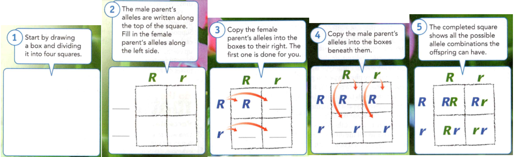
    <figcaption>Figure 5. How to Make a Punnett Square.</figcaption>
  </figure>

Figure 5 shows how to make a Punnett square. In this case, the cross is between
two hybrid pea plants with round seeds (Rr). The allele for round seeds (R) is
dominant over the allele for wrinkled seeds (r). Each parent can pass either one
allele or the other to an offspring. The boxes in the Punnett square show the
possible combinations of alleles that the offspring can inherit.

### Relating Punnett Squares to Mendel 

Mendel did not know about alleles. But a Punnett square shows why he got the
results he saw in the F2 generations. Plants with alleles RR would
have round seeds. So would plants with alleles Rr. Only plants with alleles rr
would have wrinkled seeds.

**Complete the tasks below.**

1. How to Make a Punnett Square see Figure 5. You can use a Punnett square to
find the probabilities of a genetic cross. Follow the steps in the figure to
fill in the Punnett square. In this case, the cross is between two hybrid pea
plants with round seeds (Rr). The allele for round seeds (R) is dominant over
the allele for wrinkled seeds (r). Each parent can pass either one allele or the
other to an offspring. The boxes in the Punnett square show the possible
combinations of alleles that the offspring can inherit.
a) What is the probability that an offspring will have wrinkled seeds?
b) What is the probability that an offspring will have round seeds? Explain your
answer.

2. What is probability?
3. What is the probability that a cross between a hybrid pea plant with round
seeds and one with wrinkled seeds will produce offspring with wrinkled
seeds? (Draw a Punnett square to find the answer.)
4. The combination of alleles parents can pass to offspring ____ .

### What Are Phenotype and Genotype?

Two terms that geneticists use are phenotype and genotype. **An organism's
phenotype is its physical appearance, or visible traits. An organism's genotype
is its genetic makeup, or alleles. In other words, genotype is an organism's
alleles.** Phenotype is how a trait looks or is expressed.

  <figure>
    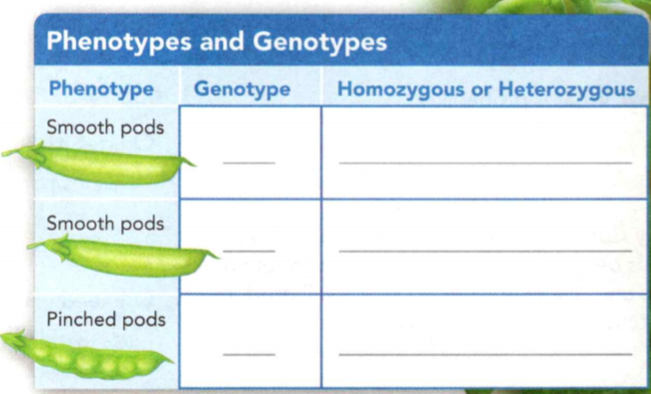
    <figcaption>Figure 6. Describing Inheritance.</figcaption>
  </figure>

To compare phenotype and genotype, look at Figure 6. The allele for smooth pea
pods (S) is dominant over the allele for pinched pea pods (s). All the plants
with at least one S allele have the same phenotype. That is, they all produce
smooth pods. However, these plants can have two different genotypes—SS or Ss. If
you were to look at the plants with smooth pods, you would not be able to tell
the difference between those that have the genotype SS and those with the
genotype Ss. The plants with pinched pods, on the other hand, would all have the
same phenotype—pinched pods—as well as the same genotype—ss.

Geneticists use two additional terms to describe an organism's genotype. An
organism that has two identical alleles for a trait is said to be **homozygous**
for that trait. A smooth-pod plant that has the alleles SS and a pinched-pod
plant with the alleles ss are both homozygous. An organism that has two
different alleles for a trait is **heterozygous** for that trait. A smooth-pod
plant with the alleles Ss is heterozygous. Recall that Mendel used the term
hybrid to describe heterozygous pea plants.

**Complete the tasks below.**

1. An organism's phenotype is its physical appearance see Figure 6. Its genotype is its genetic makeup. Based on what you have read, answer these questions.
a) Fill in the missing information in the table.
b) How many genotypes are there for the smooth-pod phenotype?

  <figure>
    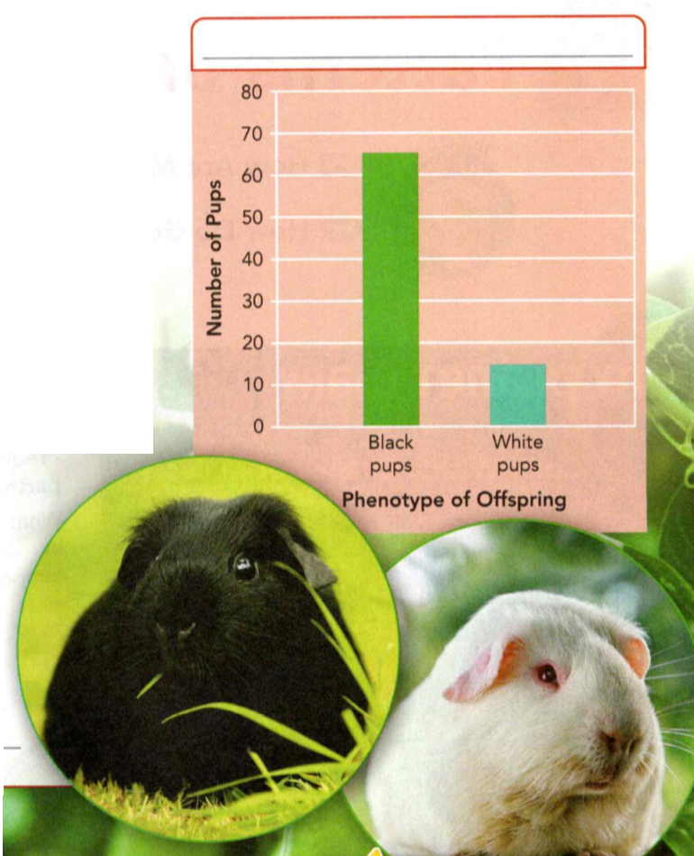
    <figcaption>Figure 7. Guinea pigs.</figcaption>
  </figure>

2. Mendel's principles of heredity apply to many other organisms. For example,
in guinea pigs (see Figure 7), black fur color (B) is dominant over white fur
color (b). Suppose a pair of black guinea pigs produces several litters of pups
during their lifetimes. The graph shows the phenotypes of the pups. 
a) Write a title for the graph.
b) How many black pups were produced? 
c) How many white pups were produced?
d) What are the possible genotypes of the offspring?
e) What can you conclude about the genotypes of the parent guinea pigs? Explain
your answer.

3. Explain how two organisms can have the same phenotype but different genotypes.

4. In their lifetimes, two guinea pigs produce 40 black pups and 40 white pups.
Make a Punnett square and find the likely genotypes of these parents.

5. Phenotype and genotype are terms that describe ____ .

### Patterns of Inheritance

- How Are Most Traits Inherited?
- How Do Genes and the Environment Interact?

**Complete the tasks below.**

1. Cold, With a Chance of Males it a male or a female? If you're a red-eared slider
turtle, the answer might depend on the temperature! These slider turtles live in
the calm, fresh, warm waters of the southeastern United States. For these
turtles and some other reptiles, the temperature of the environment determines
the sex of their offspring. At 26°C, the eggs of red-eared slider turtles all
hatch as males. But at 31°C, the eggs all hatch as females. Only at about 29°C
is there a 50% chance of hatching' turtles of either sex. What do you think
might happen to a population of red-eared slider turtles in a place where the
temperature remains near or at 26°C?

### How Are Most Traits Inherited?

The traits that Mendel studied are controlled by genes with only two possible
alleles. These alleles are either dominant or recessive. Pea flower color is
either purple or white. Peas are either yellow or green. Can you imagine if all
traits were like this? If people were either short or tall? If cats were either
black or yellow?

Studying two-allele traits is a good place to begin learning about genetics. But
take a look around at the variety of living things in your surroundings. As you
might guess, most traits do not follow such a simple pattern of inheritance.
**Most traits are the result of complex patterns of inheritance.** Four complex
patterns of inheritance are described in this lesson.

### Incomplete Dominance 
Some traits result from a pattern of inheritance known as incomplete dominance.
**Incomplete dominance** occurs when one allele is only partially dominant. For
example, look at Figure 8. The flowers shown are called snapdragons. A cross
between a plant with red flowers and one with white flowers produces pink
offspring.

  <figure>
    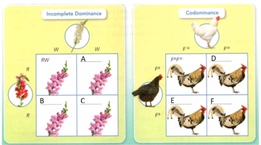
    <figcaption>Figure 8. Other Patterns of Inheritance.</figcaption>
  </figure>

Snapdragons with alleles RR produce a lot of red color in their flowers. It's no
surprise that their flowers are red. A plant with two white alleles (WW)
produces no red color. Its flowers are white. Both types of alleles are written
as capital letters because neither is totally dominant. If a plant has alleles
RW, only enough color is produced to make the flowers just a little red. So they
look pink.

### Codominance 

The chickens in Figure 1 show a different pattern of inheritance. Codominance
occurs when both alleles for a gene are expressed equally. In the chickens
shown, neither black feathers nor white feathers are dominant. All the offspring
of a black hen and a white rooster have both black and white feathers. Here,
FB stands for the allele for black feathers. FW stands for
the allele for white feathers. The letter F tells you the trait is feathers. The
superscripts B for black and W for white tell you the color.

**Complete the tasks below.**

1. Many crosses do not follow the patterns Mendel discovered. In Figure 8 fill
in the missing pairs of alleles.

  <figure>
    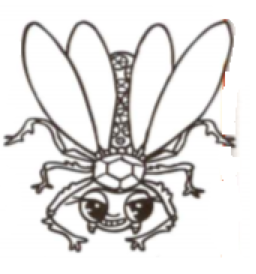
    <figcaption>Figure 9. Imaginary insect.</figcaption>
  </figure>

2. An imaginary insect in Figure 9 called the blingwing has three alleles for
wing color: R (red), B (blue), and Y (yellow). 
a) If an organism can inherit only two alleles for a gene, what are the six
possible allele pairs for wing color in blingwings? One answer is given. RB,
b) Suppose wing color results from incomplete dominance. What wing color would
each pair of alleles produce? One answer is given. RB: purple

 
### Multiple Alleles 

Some genes have **multiple alleles**, which means that three or more possible
alleles determine the trait. Remember that an organism can only inherit two
alleles for a gene—one from each parent. Even if there are four, five, or more
possible alleles, an individual can only have two. However, more genotypes can
occur with multiple alleles than with just two alleles. For example, four
alleles control the color of fur in some rabbits. Depending on which two alleles
a rabbit inherits, its coat color can range from brownish gray to all white.

### Polygenic Inheritance 

The traits that Mendel studied were each controlled by a single gene.
**Polygenic inheritance** occurs when more than one gene affects a trait. The
alleles of the different genes work together to produce these traits.

Polygenic inheritance results in a broad range of phenotypes, like human height
or the time it takes for a plant to flower. Imagine a field of sunflowers that
were all planted the same day. Some might start to flower after 45 days. Most
will flower after around 60 days. The last ones might flower after 75 days. The
timing of flowering is a characteristic of polygenic traits.

**Complete the tasks below.**

1. How are the symbols written for alleles that share incomplete dominance?
2. How is polygenic inheritance different from the patterns described by Mendel? 
3. Most traits are produced by 	____ .

### How Do Genes and the Environment Interact?

You were not born knowing how to skateboard, but maybe you can skateboard now.
Many traits are learned, or acquired. Unlike inherited traits, acquired traits
are not carried by genes or passed to offspring. Although inherited traits are
determined by genes, they also can be affected by factors in the environment.
The phenotypes you observe in an organism result both from genes and from
interactions of the organism with its environment.

### Inherited and Acquired Traits 

Humans are born with inherited traits, such as vocal cords and tongues that
allow for speech. But humans are not born speaking Spanish, or Mandarin, or
English. The languages that a person speaks are acquired traits. Do you have a
callus on your finger from writing with your pencil? That is an acquired trait.
Skills you learn and physical changes that occur, such as calluses and haircuts,
are aquired traits. See if you can tell the inherited traits from the acquired
traits in Figure 10.

  <figure>
    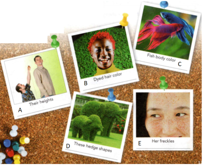
    <figcaption>Figure 10. Inherited or Acquired?.</figcaption>
  </figure>

### Genes and the Environment 

Think again about sunflowers. Genes control when the plants flower. But
sunlight, temperature, soil nutrients, and water also affect a plant's flowering
time. **Environmental factors can influence the way genes are expressed.** Like
sunflowers, you have factors in your environment that can affect how your genes
are expressed. For example, you may have inherited the ability to play a musical
instrument. But without an opportunity to learn, you may never develop the
skill.

Some environmental factors can change an organism's genes. For example, tobacco
smoke and other pollutants can affect genes in a person's body cells in a way
that may result in lung cancer and other cancers. Still other genetic changes
happen by chance.

Changes in body cells cannot be passed to offspring. Only changes in the sex
cells-eggs and sperm-can be passed to offspring. Not all genetic changes have
negative effects. Genetic change in sex cells is an important source of life's
variety.

**Complete the tasks below.**

  <figure>
    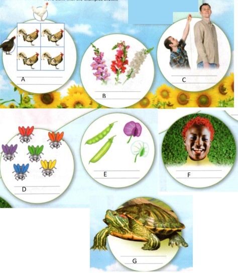
    <figcaption>Figure 11. Why don't offspring always look like their parents?.</figcaption>
  </figure>

1. Which traits shown are carried in the genes, and which are not? In Figure 10
identify each trait shown as inherited or acquired.

2. The traits you see in organisms result from their genes and from interactions
of genes with the environment. Word Bank: Incomplete dominance, Environmental
factors, Multiple alleles, Acquired traits, Dominant and recessive traits,
Polygenic inheritance, Codominance. In Figure 11 match the terms in the word
bank with the examples shown. 

3. Only genetic changes in (sex cells/ body cells) can be passed to offspring.

4. Give one example of how environmental factors affect gene expression.
5. Why don't offspring always look like I their parents?

### Chromosomes and Inheritance

- How Are Chromosomes, Genes, and Inheritance Related?
- What Happens During Meiosis?

**Complete the tasks below.**

1. Chromosome Sleuth. Finding answers about how chromosomes elate to disease is
one job of genetic technologists. These scientists analyze chromosomes from
cells. The analysis may pinpoint genetic information that can cause disease or
other health problems. In their work, genetic technologists use microscopes,
computer-imaging photography, and lab skills. They report data that are used in
research and in treating patients affected by genetic diseases.
a) Would you like to be a genetic technologist? Why or why not?
b) If you were a genetic technologist, what would you like to research?

### How Are Chromosomes, Genes, and Inheritance Related?

Mendel's work showed that genes exist. (Remember that he called them "factors:')
But scientists in the early twentieth century did not know what structures in
cells contained genes. The search for the answer was something like a mystery
story. The story could be called "The Clue in the Grasshopper's Cells".

At the start of the 1900s, Walter Sutton, an American geneticist, studied the
cells of grasshoppers. He wanted to understand how sex cells (sperm and eggs)
form. Sutton focused on how the chromosomes moved within cells during the
formation of sperm and eggs. He hypothesized that chromosomes are the key to
learning how offspring have traits similar to those of their parents.

  <figure>
    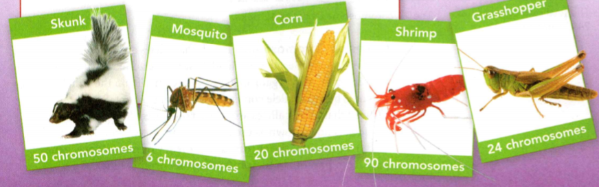
    <figcaption>Figure 12. Different types of organisms have different numbers of chromosomes.</figcaption>
  </figure>

**Complete the tasks below.**

1. The organism with the highest known number of chromosomes is a plant in the
fern family. The netted adderstongue fern has more than 1,200 chromosomes!
Different types of organisms have different numbers of chromosomes see Figure
12, and some organisms are easier to study than others. Suppose you are a
scientist studying chromosomes and you have to pick an organism from those shown
below to do your work. Which one would you pick and why?

### Chromosomes and Inheritance 

  <figure>
    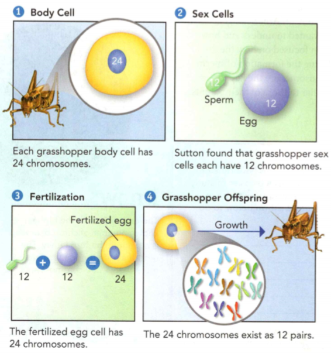
    <figcaption>Figure 13. Paired Up.</figcaption>
  </figure>

Sutton needed evidence to support his hypothesis. Look at Figure 13 to see how he
found this evidence in grasshopper cells. To his surprise, he discovered that
grasshopper sex cells have exactly half the number of chromosomes found in
grasshopper body cells.

### Chromosome Pairs 

Sutton observed what happened when a sperm cell and an egg cell joined. The
fertilized egg that formed had 24 chromosomes. It had the same number of
chromosomes as each parent. These 24 chromosomes existed as 12 pairs. One
chromosome in each pair came from the male parent. The other chromosome came
from the female parent.

**Complete the tasks below.**

1. Sutton studied grasshopper cells through a microscope. He
concluded that genes are carried on chromosomes. See Figure 13.
a) How does the number of chromosomes in grasshopper sex cells compare to the
number in body cells?
b) How is the inheritance of chromosomes similar to what you know about alleles?

### Genes on Chromosomes 

Recall that alleles are different forms of a gene. Because of Mendel's work,
Sutton knew that alleles exist in pairs in an organism. One allele comes from
the female parent. The other allele comes from the male parent. Sutton realized
that paired alleles are carried on paired chromosomes. His idea is now known as
the chromosome theory of inheritance. **According to the chromosome theory of
inheritance, genes pass from parents to their offspring on chromosomes.**

### A Lineup of Genes 

The body cells of humans contain 46 chromosomes that form 23 pairs. Chromosomes
are made up of many genes joined together like beads on a string. Although you
have only 23 pairs of chromosomes, your body cells each contain between 20,000
and 25,000 genes. Genes control traits.

Figure 2 shows a pair of chromosomes from an organism. One chromosome is from
the female parent. The other chromosome is from the male parent. Notice that
each chromosome has the same genes. The genes are lined up in the same order on
both chromosomes. However, the alleles for some of the genes are not identical.
For example, one chromosome has allele A, and the other chromosome has allele a.
As you can see, this organism is heterozygous for some traits and homozygous for
others.

  <figure>
    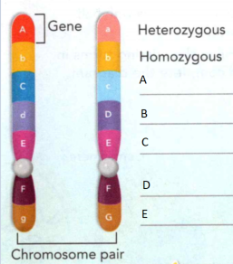
    <figcaption>Figure 14. A Pair of Chromosomes.</figcaption>
  </figure>

**Complete the tasks below.**

1. Chromosomes in a pair may have different alleles for some genes and the same
alleles for others see Figure 14. 
a) For each pair of alleles, tell whether the organism is homozygous or
heterozygous. The first two answers are shown.
b) Suppose gene A on the left chromosome is damaged and no longer functions.
What form of the trait would show? Why?

2. When two grasshopper sex cells join, the chromosome number in the new cell is
(half/double) the number in the sex cells.

3. Describe the arrangement of genes on a pair of chromosomes.

4. How do Sutton's observations support the chromosome theory of inheritance?

5. Genes are passed from parents to offspring ____ .

### What Happens During Meiosis?
How do sex cells end up with half the number of chromosomes as body cells? The
answer to this question is a form of cell division called meiosis. Meiosis (my
cm sis) is the process by which the number of chromosomes is reduced by half as
sex cells form. You can trace the events of meiosis in Figure 3. Here, the
parent cell has four chromosomes arranged in two pairs. **During meiosis, the
chromosome pairs separate into two different cells. The sex cells that form
later have only half as many chromosomes as the other cells in the organism.**

  <figure>
    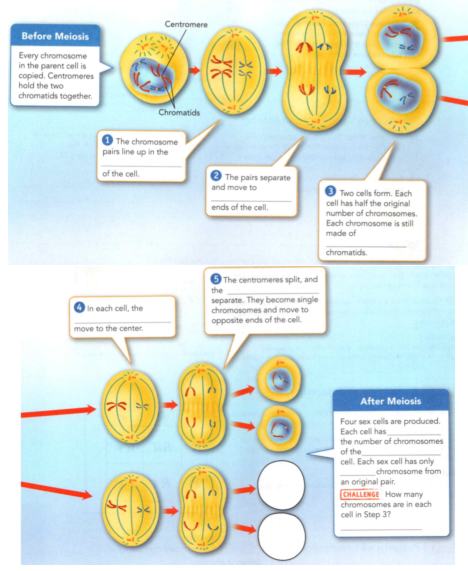
    <figcaption>Figure 15. Meiosis.</figcaption>
  </figure>

During meiosis, a cell divides into two cells. Then each of these cells divides
again, forming a total of four cells. The chromosomes duplicate only before the
first cell division.

Each of the four sex cells shown below receives two chromosomes - one chromosome
from each pair in the original cell. When two sex cells join at fertilization,
the new cell that forms has the full number of chromosomes. In this case, the
number is four. The organism that grows from this cell got two of its
chromosomes from one parent and two from the other parent.

**Complete the tasks below.**

1. During meiosis, a cell produces sex cells with half the number of
chromosomes, see Figure 15. Fill in the missing terms in the spaces provided,
and complete the diagram. Before Meiois: Every chromosome in the parent cell is
copied. Centromeres hold the two chromatids together.
a) 1 The chromosome pairs line up in the ___ of the cell.
b) 2 The pairs separate and move to ___  ends of the cell.
c) 3 Two cells form. Each cell has half the original number of chromosomes. Each
chromosome is still made of ____ chromatids.
d) 4 In each cell, the _______ move to the center.
e) 5 The centromeres split, and the ___ separate. They become single chromosomes and move to opposite ends of the cell.
f) After Meiosis: Four sex cells are produced. Each cell has ___ the number of chromosomes of the ___ cell.  Each sex cell has only ____  chromosome from an original pair.
g) How many chromosomes are in each cell in Step 3?
f) Complete the diagram in step 5.

2. During meiosis, the number of chromosomes ____ .
3. Offspring inherit different forms of genes called ____ from each parent. Traits
are affected by patterns of inheritance and interactions with the ____ .

### Study Guide

- In all of his crosses, Mendel found that only one form of the trait appeared
in the Fl generation. However, in the F2 generation, the "lost" form
of the trait always reappeared in about one fourth of the plants.

- An organism's traits are controlled by the alleles it inherits from its
parents. Some alleles are dominant, while other alleles are recessive.

- In a genetic cross, the combination of alleles that parents can pass to an
offspring is based on probability.

- An organism's phenotype is its physical appearance, or visible traits. An
organism's genotype is its genetic makeup, or alleles.

- Most traits are the result of complex patterns of inheritance.
- Environmental factors can influence the way genes are expressed.
- The chromosome theory of inheritance states that genes pass from parents to
their offspring on chromosomes.
- Meiosis produces sex cells that have half as many chromosomes as body cells.

**Complete the tasks below.**

1. Different forms of a gene are called
A) alleles.	
B) hybrids.
C) genotypes.	
D) chromosomes.

2. __ is the scientific study of heredity.

3. Mendel crossed two pea plants: one with green pods and one with yellow pods. The F1 generation all had green pods. What color pods did the F2 generation have? Explain your answer.

  <figure>
    
    <figcaption>Figure 16. Plant.</figcaption>
  </figure>

4. The plant in Figure 16 is purebred for height (tall). Write the alleles of
this plant. In any cross for height, what kind of offspring will this plant
produce? Why?

5. How do dominant alleles and recessive alleles differ?

6. Write a diary entry as if you are Gregor Mendel. You may describe any part of his experiences, experiments, or observations.

7. Which of the following represents a heterozygous genotype?
A) YY	
B) yy
C) Yy	
D) yH yH

8. An organism's ___ is the way its genotype is expressed.

  <figure>
    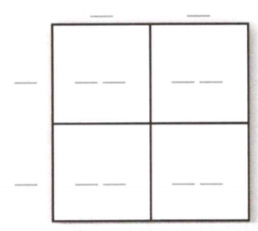
    <figcaption>Figure 17. Punnett square.</figcaption>
  </figure>

9. Fill in the Punnett square in Figure 17 to show a cross between two guinea
pigs that are heterozygous for coat color. B is for black coat color, and b is
for white coat color.

10. What is the probability that an offspring from the cross above has each of the following genotypes?
BB
Bb	
bb	

11. What kind of cross might tell you if a black guinea pig is BB or Bb? Why?

12. A garden has 80 pea plants. Of this total, 20 plants have short stems and 60
plants have tall stems. What percentage of the plants have short stems? What
percentage have tall stems?

13. Which of the following terms describes a pattern of inheritance in which one allele is only partially dominant?
A) codominance
B) acquired traits
C) multiple alleles
D) incomplete dominance

14. Traits that have three or more phenotypes may
be the result of __ alleles.

15. How is codominance different from incomplete dominance?

16. Human height is a trait with a very broad range of phenotypes. Which pattern of inheritance could account for human height? Explain your answer.

17. Neither of Josie's parents plays a musical instrument. Josie thinks that she won't be able to play an instrument because her parents can't. Is she right? Why or why not?

18. Genes are carried from parents to offspring on structures called
A) alleles.	
B) chromosomes.
C) phenotypes.	
D) genotypes.

19. The process of ___ results in the formation of sex cells.

20. If an organism's body cells have 12 chromosomes, how many chromosomes will
the sex cells have? Explain your answer.

21. A species of butterfly has three alleles for wing color: blue, orange, and
pale yellow. A blue butterfly mates with an orange butterfly. The following
offspring result see Figure 18: about 25% are blue and 25% are orange. However,
another 25% are speckled blue and orange, and 25% are yellow. Explain how these
results could occur.

  <figure>
    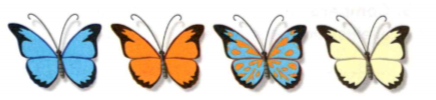
    <figcaption>Figure 18. Offspring of blue butterfly and orange butterfly.</figcaption>
  </figure>

  <figure>
    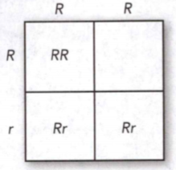
    <figcaption>Figure 19. Punnett squar.</figcaption>
  </figure>

22. The Punnett square in Figure 19 shows a cross between two pea plants, each
with round seeds. What is the missing genotype in the empty square?
A) rr
B) rR
C) Rr
D) RR

23. A particular trait has multiple alleles: A, B, and C. How many different
genotypes are possible?
A) 2
B) 3
C) 4
D) 6

24. A sperm and an egg cell join during the process of
A) meiosis.
B) fertilization.
C) probability.
D) genetics. 

25. For a particular plant, leaf texture is either fuzzy or smooth. A purebred
fuzzy plant is crossed with a purebred smooth plant. All offspring are smooth.
Which sentence best describes the alleles for this trait?
A) Fuzzy is dominant over smooth.
B) Smooth is dominant over fuzzy.
C) The alleles are codominant.
D) The alleles have incomplete dominance.

26. Which of the following traits is acquired?
A) the number of petals that grow in a plant's flowers
B) the wing shape of a wild bird
C) the ability of some gorillas to use sign language
D) a cheetah's ability to run faster than any other land animal

27. One of the cells shown in Figure 20 is a parent cell about to undergo
meiosis. Another cell is in the process of meiosis. A third cell is a sex cell
that results from meiosis. Identify which cell is which, and explain your
reasoning.

  <figure>
    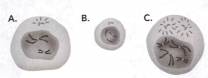
    <figcaption>Figure 20. 3 cells.</figcaption>
  </figure>

28. In 1990, the Monterey Bay
Aquarium in Monterey, California, released a young otter into the wild. Wildlife
rehabilitators at the aquarium raised the otter and taught her how to find food.
But, because she was used to receiving food and affection from people at the
aquarium, she did not know to avoid other humans. After the otter pestered some
local divers, she had to be returned to live at the aquarium. So, which
behaviors do animals learn, and which behaviors "just come naturally"? Actually,
the line between inherited behaviors and learned behaviors is rarely clear.
Although wild otters are naturally shy around humans, the otter at the Monterey
Bay Aquarium had learned to expect food and affection from humans. As a result,
wildlife rehabilitators commonly use puppets or animal costumes to keep the
animals they care for from becoming too familiar with humans. Choose a
species, such as deer, otter, or panda, that is raised in captivity and returned
to the wild. Design a rehabilitation activity to help orphaned animals learn a
skill that they will need to survive in the wild. Explain the features of your
rehabilitation activity to your class.

29. You would probably recognize a Dalmatian if you saw one—Dalmatians typically
have white coats with distinctive black or brown spots. Spots are a defining
characteristic of the Dalmatian breed. These spots can be large or small, but
all Dalmatians have them. In Dalmatians, spots are a dominant trait. When two
Dalmatians breed, each parent contributes a gene for spots. The trait for spots
is controlled by one set of genes with only two possible alleles. No matter how
many puppies are in a litter, they will all develop spots. But what if a
Dalmatian breeds with another dog that isn't a Dalmatian? While the puppies
won't develop the distinctive Dalmatian pattern, they will have spots, because
the allele for spots is dominant. Some puppies will have many tiny spots and
some will have large patches! Dalmatians, like leopards, cannot change their
spots. Dalmatians' spots may be black or liver (brown), but never both on the
same dog. Liver is a recessive allele. Use a Punnett square to predict the color
of the spots on the offspring of a liver Dalmatian and a black Dalmatian with a
recessive liver allele. Display your prediction on a poster.

30. American lobsters are usually dark green in color. But, most people see only
red lobsters. Lobsters turn red after they have been cooked. The chance of
finding a blue lobster is about one in a million. Why might a lobster have a
blue shell?
