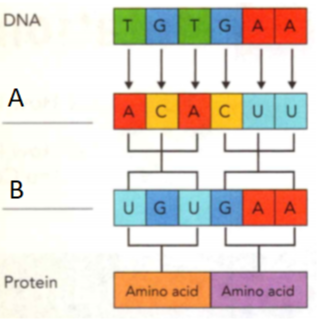

### Life Science

## Biology

## DNA: The Code of Life

A segment of DNA on a chromosome that codes for a specific trait is a **gene**.

**Heredity** is the passing of traits from parent to offspring.

A **trait** is a characteristic that an organism can pass on through its genes.

**Complete the tasks below.**

1. Leo's sister likes to joke that Leo inherited his dad's genes for playing the
piano. Leo knows that heredity may not be that simple. But there are other
traits -like the widow's peak on his forehead-that he did inherit from his
father. Why couldn't Leo inherit his dad's piano skills?

### Chapter Preview

- nitrogen bases 
- DNA replication
- messenger RNA
- transfer RNA
- mutation
- cancer 
- tumor 
- chemotherapy
- sex chromosomes 
- sex-linked gene 
- carrier
- selective breeding 
- inbreeding
- hybridization
- clone
- genetic engineering 
- gene therapy

### The Genetic Code

- What Forms the Genetic Code? 
- How Does DNA Copy Itself?

**Complete the tasks below.**

1. DNA Debut In 1951, English scientist Rosalind Franklin discovered that DNA
could exist in a dry form and a wet form. Franklin made an image of the wet form
of DNA by exposing it to X-rays. The X-rays bounced off the atoms in the DNA to
make the image. The image (see the background on the next journal page) was so
clear that it helped scientists understand the structure of DNA for the first
time. Her discovery was important for figuring out how genetic information is
passed from parent to offspring. Franklin's contribution to science was not only
in her research, but also in that she succeeded at a time when many people
thought women shouldn't be scientists. What does the X-ray of DNA in Figure 1
look like to you?

  <figure>
    
    <figcaption>Figure 1. X-ray of DNA.</figcaption>
  </figure>

### What Forms the Genetic Code?
It took almost 100 years after the discovery of DNA for scientists to figure out
that it looks like a twisted ladder. When James Watson and Francis Crick
published the structure of DNA in 1953, they added another clue to how traits
are passed from parent to offspring. DNA contains the genetic information for
cells to make proteins. Proteins determine a variety of traits, from hair color
to an organism's ability to digest food.

### The Structure of DNA 
Parents pass traits to offspring through chromosomes. Chromosomes are made of
DNA and proteins and are located in a cell's nucleus. Look at Figure 2. The
twisted ladder structure of DNA is also known as a "double helix:' The sides of
the double helix are made up of sugar molecules called deoxyribose, alternating
with phosphate molecules. The name DNA, or deoxyribonucleic acid, comes from
this structure.

  <figure>
    
    <figcaption>Figure 2. Genetic Structures.</figcaption>
  </figure>

The rungs of DNA are made of nitrogen bases. **Nitrogen bases** are molecules that
contain nitrogen and other elements. DNA has four kinds of nitrogen bases:
adenine, thymine, guanine, and cytosine. The capital letters A, T, G, and C are
used to represent the bases.

### Chromosomes, Genes, and DNA 

In Figure 3, you can see the relationship among chromosomes, genes, and DNA. A
gene is a section of a DNA molecule that contains the information to code for
one specific protein. A gene is made up of a series of bases in a row. The bases
in a gene are arranged in a specific order-for example, ATGACGTAC. A single gene
on a chromosome may contain anywhere from several hundred to a million or more
of these bases. Each gene is located at a specific place on a chromosome.

  <figure>
    
    <figcaption>Figure 3. Chromosomes and Genes.</figcaption>
  </figure>

Because there are so many possible combinations of bases and genes, each
individual organism has a unique set of DNA. DNA can be found in all of the
cells of your body except for red blood cells. DNA can be found in blood
samples, however, because white blood cells do contain DNA.

Humans have between 20,000 and 25,000 genes on their chromosomes. The corals
that make up ocean reefs are thought to have as many as 25,000 genes too!

If you took all the DNA from the cells in the average adult human body and
stretched it out, it would reach to the sun and back again multiple times!

**Complete the tasks below.**

1. Hummingbirds, like all organisms, contain all of the genetic structures in
Figure 2. Put the structures in order from largest to smallest.

2. Explain the role of genes in making proteins.

3. Can you help solve the crime? Someone robbed a jewelry store. The robber's
DNA was extracted from skin cells found on the broken glass of a jewelry case.
The police collected DNA samples from three suspects. The letters below
represent the sequences of nitrogen bases in the DNA. Based on the DNA found at
the crime scene, circle the DNA of the guilty suspect. Robber:
GACCAGTTAGCTAAGTCT Suspect 1: TAGCTGA Suspect 2: GACGAGT Suspect 3: CTAAGTC
a) Why can you solve crimes using DNA?
b) Could the police have used blood on the broken glass to test for DNA? Why or
why not?

### Order of the Bases 

A gene contains the code that determines the structure of a protein. **The order
of the nitrogen bases along a gene forms a genetic code that specifies what type
of protein will be produced. Remember that proteins are long-chain molecules
made of individual amino acids. In the genetic code, a group of three DNA bases
codes for one specific amino acid. For example, the three-base sequence CGT
(cytosineguanine-thymine) always codes for the amino acid alanine. The order of
the three-base code units determines the order in which amino acids are put
together to form a protein.

  <figure>
    
    <figcaption>Figure 4. DNA Bases.</figcaption>
  </figure>

**Complete the tasks below.**

1. Notice the pattern in the DNA bases in Figure 4. Which base always pairs with
cytosine?

2. These letters represent the nitrogen bases on one strand of DNA: GGCTATCCA.
What letters would form the other strand of the helix?

3. How can a parent pass a trait such as eye color to its offspring?

4. The genetic code of nitrogen bases specifies	____ .

### How Does DNA Copy Itself?
Two new cells, or daughter cells, result when a cell divides. To ensure that
each daughter cell has the genetic information it needs to carry out its
activities, DNA copies itself. **DNA replication** is the process in which an
identical copy of a DNA strand is formed for a new cell. Replication is very
important, since daughter cells need a complete set of DNA to survive.

  <figure>
    
    <figcaption>Figure 5. DNA Replication.</figcaption>
  </figure>

DNA replication begins when the two sides of a DNA molecule unwind and separate,
like a zipper unzipping, between the nitrogen bases. Next, nitrogen bases in the
nucleus pair up with the bases on each half of the DNA. **Because of the way the
nitrogen bases pair up, the order of the bases in each new DNA strand exactly
matches the order in the original DNA strand.** This pattern is key to
understanding how DNA replication occurs. Adenine always pairs with thymine,
while guanine always pairs with cytosine. At the end of replication, two
identical DNA molecules are formed.

  <figure>
    
    <figcaption>Figure 6. Magnified Strand of DNA.</figcaption>
  </figure>

**Complete the tasks below.**

1. Without DNA replication, daughter cells could not carry out their life
functions see Figure 5. Complete the sentences.
a) Steps in DNA Replication. ___ 	unzips.
b) Nitrogen bases in the cell ___ pair up with the bases on the DNA halves.
Two new identical DNA molecules are formed.

2. The (nitrogen base pattern/ number of genes/size of DNA) determines how DNA
is replicated.

3. Where in the cell does DNA replication take place?

4. What do you think would happen if the DNA code in a daughter cell did not match the code in the parent cell?

5. DNA replication is the process in which ____ .

### How Cells Make Proteins

- How Does a Cell Make Proteins?
- 
**Complete the tasks below.**

1. Dinosaur Chicken? In 2007, a 68-million-year-old dinosaur protein was
discovered by Harvard scientists. The protein, called collagen, was extracted
from the soft tissue of a Tyrannosaurus rex that died in Montana. Collagen is an
important component of bone. The protein from the dinosaur is similar to protein
found in modern-day chickens, supporting the connection between dinosaurs and
birds. With this discovery, scientists have more evidence that these two species
are related. What other information about the two species would you want to
compare?

### How Does a Cell Make Proteins?

The production of proteins in a cell is called protein synthesis. **During
protein synthesis, the cell uses information from a gene on a chromosome to
produce a specific protein.** Proteins help determine the size, shape, color,
and other traits of an organism by triggering cellular processes. The protein
code passes from parent to offspring through DNA, resulting in inherited traits.

### The Structure of Proteins 

  <figure>
    
    <figcaption>Figure 7. Proteins.</figcaption>
  </figure>

Proteins are made up of molecules called amino acids, as shown in Figure 7.
Although there are only 20 amino acids, cells can combine them in different ways
to form thousands of different proteins. You can think of the 20 amino acids as
being like the 26 letters of the alphabet. Those 26 letters can form thousands
of words. The letters you use and their order determine the words you form. A
change in just one letter, for example, from rice to mice, creates a new word.
Similarly, a change in the type or order of amino acids can result in a
different protein.

### The Role of RNA 

Protein synthesis takes place in the cytoplasm outside the cell's nucleus. The
chromosomes are found inside the nucleus, so a messenger must carry the genetic
code from the DNA inside the nucleus to the cytoplasm. This genetic messenger is
called RNA, or ribonucleic acid.

Although both RNA and DNA are nucleic acids, they have some differences. RNA has
only one strand and contains a different sugar molecule than DNA. Another
difference is in the nitrogen bases. Like DNA, RNA contains adenine, guanine,
and cytosine. However, instead of thymine, RNA contains uracil.

### Types of RNA 

Two types of RNA take part in protein synthesis. **Messenger RNA** (mRNA) copies the
message from DNA in the nucleus and carries the message to the ribosome in the
cytoplasm. **Transfer RNA** (tRNA) carries amino acids to the ribosome and adds them
to the growing protein.

**Complete the tasks below.**

1. Proteins help determine what you look like, see Figure 7. Complete the
sentence. Proteins are made of folded and bundled chains of ___ .

  <figure>
    
    <figcaption>Figure 8. RNA & DNA.</figcaption>
  </figure>

2. While working in the lab, your assistant accidentally mixes one beaker of DNA
into a beaker containing RNA see Figure 8. You need to separate the molecules
before doing your experiments. How could you test each molecule to determine if
it was DNA or RNA?

### Protein Synthesis

  <figure>
    
    <figcaption>Figure 9. The steps of protein synthesis.</figcaption>
  </figure>

#### 1 mRNA Enters the Cytoplasm

  <figure>
    
    <figcaption>Figure 10. 1 mRNA Enters the Cytoplasm.</figcaption>
  </figure>

DNA unzips between its base pairs. Then one of the strands of DNA directs the
production of a strand of mRNA. To form the RNA strand, RNA bases pair up with
the DNA bases. The process is similar to DNA replicatior Cytosine always pairs
with guanine. However, uracil, not thymine, pairs with adenine. The mRNA leaves
the nucleus and enters the cytoplasm.

#### 2 Ribosomes Attach to mRNA

  <figure>
    
    <figcaption>Figure 11. 2 Ribosomes Attach to mRNA.</figcaption>
  </figure>

A ribosome attaches to mRNA in the cytoplasm. On the ribosome, the mRNA provides
the code for the protein that will be made. In the cytoplasm, specific amino
acids are attached to specific molecules of tRNA.

#### 3 tRNA Attaches to mRNA

  <figure>
    
    <figcaption>Figure 12. 3 tRNA Attaches to mRNA.</figcaption>
  </figure>

Molecules of tRNA and their amino acids attach to the mRNA. The bases on tRNA
"read" the message and pair with bases on mRNA.

#### 4 Amino Acids Join in the Ribosome

  <figure>
    
    <figcaption>Figure 13. 4 Amino Acids Join in the Ribosome.</figcaption>
  </figure>

Transfer molecules attach one at a time to the ribosome and continue to read the
message. The amino acids are linked together and form a growing chain. The order
of the amino acids is determined by the order of the three-base codes on the
mRNA.

#### 5 Protein Chain Forms

  <figure>
    
    <figcaption>Figure 14. 5 Protein Chain Forms.</figcaption>
  </figure>

As the ribosome continues to move along the mRNA adding amino acids, the protein
grows. Once an amino acid is added, the tRNA is released and picks up another
amino acid of the same kind. The protein continues to grow until the ribosome
reaches a three-base code that signals it to stop. The protein is then released.

**Complete the tasks below.**

  <figure>
    
    <figcaption>Figure 15. Protein synthesis.</figcaption>
  </figure>

1. The chart in Figure 15 summarizes protein synthesis. Read the chart and fill
in the blank labels.

2. (Messenger RNA/Transfer RNA) carries the genetic information in DNA from the nucleus to the cytoplasm.

3. What does DNA do?

4. Protein synthesis is the process in which ___ .

### Mutations

- How Can Mutations Affect an Organism?
- How Is Cancer Related to Mutations and the Cell Cycle?

**Complete the tasks below.**

1. Dairy DNA very mammal, from mice to monkeys to whales, drinks milk as a baby.
But humans are the only mammals that can digest milk and other dairy products
throughout their lifetime. Humans have a mutation (a change in DNA) that allows
their bodies to break down lactose, a sugar in dairy products. However, not all
people can digest dairy products. Many people are lactose intolerant, meaning
their bodies cannot break down lactose. Lactose-intolerant people have the
original DNA without the mutation. While many other mutations are considered
harmful, this mutation is helpful to humans. And just think-ice cream might
never have been invented if humans couldn't break down lactose!
a) Do you think lactose intolerance is a serious condition? Explain.
b) Do you think people with this condition can never have milk?

2. Mutation comes from the Latin word mutare, meaning "to change." How can
mutations change an organism's traits?

### How Can Mutations Affect an Organism?

Some traits are not inherited from parent organisms. Traits can also be a result
of a change in DNA. A mutation is any change in the DNA of a gene or chromosome.
For example, instead of the base sequence AAG, the DNA might have the sequence
ACG.

**Mutations can cause a cell to produce an incorrect protein during protein
synthesis. As a result, the organism's trait may be different from what it
normally would be.**

If a mutation occurs in a body cell, such as a skin cell, the mutation will not
 be passed on to the organism's offspring. But if a mutation occurs in a sex
 cell (egg or sperm), the mutation can be passed on to an offspring and affect
 the offspring's traits.

### Types of Mutations 

Some mutations are the result of small changes in an organism's DNA. For
example, a base pair may be added, a base pair may be substituted for another,
or one or more bases may be deleted from a section of DNA. These types of
mutations can occur during the DNA replication process. Other mutations may
occur when chromosomes don't separate correctly during the formation of sex
cells. When this type of mutation occurs, a cell can end up with too many or too
few chromosomes. The cell can also end up with extra segments of chromosomes.

  <figure>
    
    <figcaption>Figure 16. Mutations.</figcaption>
  </figure>

### Effects of Mutations

Mutations introduce changes in an organism. Mutations can be harmful, helpful,
or neither harmful nor helpful. A mutation is harmful if it reduces the
organism's chances for survival and reproduction.

Whether a mutation is harmful or not depends partly on the organism's
environment. The mutation that led to this alligator's white color would
probably be harmful to it in the wild. A white alligator is more visible to its
prey. This alligator may find it difficult to catch prey and may not get enough
food to survive. A white alligator in a zoo has the same chance for survival as
a green alligator because it does not hunt. In a zoo, the mutation neither helps
nor harms the alligator.

Helpful mutations increase an organism's ability to survive and reproduce.
Mutations hay; allowed some bacteria that are harmful to humans to become
resistant to drugs. The drugs do not kill the bacteria with the mutations, so
they continue to survive and reproduce.

**Complete the tasks below.**

1. The types of mutations of DNA include deletion, addition, and substitution,
see Figure 16. 
a) Circle the added base pair on the third piece of DNA. 
b) Fill in the nitrogen bases on the fourth piece of DNA to illustrate a
substitution.

2. A white alligator does not blend into its natural habitat, but this color
change may be a beneficial mutation for an organism if it
A) reduces its chances for survival.
B) increases its chances for survival.
C) decreases its chances for reproduction.

**Complete the tasks below.**

1. Mutations that occur in body cells (can/cannot) be passed on to offspring.
2. Mutations that occur in sex cells (can/cannot) be passed on to offspring.

3. Drug resistance in bacteria is a beneficial mutation for the bacteria, but how can it be harmful for humans?

4. Mutations affect an organism's traits by ______ .

### How Is Cancer Related to Mutations and the Cell Cycle?
Did you know cancer is not just one disease? There are more than 100 types of
cancer, and they can occur in almost any part of the body. Cancer affects many
people around the world, regardless of age, race, or gender. Cancers are often
named for the place in the body where they begin. For example, lung cancer
begins in lung tissues, as shown in Figure 3.

### What Is Cancer? 

Cancer is a disease in which cells grow and divide uncontrollably, damaging the
parts of the body around them. Cancer cells are like weeds in a garden. Weeds
can overrun a garden by robbing plants of the space, sunlight, and water they
need. Similarly, cancer cells can overrun normal cells.

Different factors work together in determining if a person gets cancer. Because
of their inherited traits, some people are more likely than others to develop
certain cancers. A woman with a mother or grandmother who had breast cancer has
an increased chance of developing breast cancer herself. Some substances in the
environment may also lead to cancer, like the tar in cigarettes or ultraviolet
light from the sun or tanning beds. People who have a high-fat diet may also be
more likely to develop cancer.

  <figure>
    
    <figcaption>Figure 17. Lung Tumor X-Ray.</figcaption>
  </figure>

**Complete the tasks below.**

1. Tumors can be visible in X-rays see Figure 17. Circle the tumor in the X-ray in Figure 17.

2. You may have noticed labels like SPF 15 on your sunscreen. SPF stands for
"sun protection factor," and the number lets you know how long the sunscreen
works. For example, a person who burns in the sun after 10 minutes could use
sunscreen with an SPF of 15 and stay in the sun for as long as 150 minutes (10 x
15 = 150). This time can vary greatly and sunscreen should be reapplied often to
prevent damaging sunburns. Identify the time in the Sun with the length of time
for sun protection each SPF rating offers for someone who burns in 10 minutes
without sunscreen.
a) SPF 20
b) SPF 30
c) SPF 55
d) At the beach, you put on SPF 25 at 8:00 A.M. and your friend puts on SPF 15 at
9:00 A.M. You both would burn in 10 minutes without sunscreen. Who should
reapply their sunscreen first? When?

### How Cancer Begins
Scientists think that cancer begins when something damages a portion of the DNA
in a chromosome. The damage causes a mutation and the cells function abnormally.
Normally, the cells in one part of the body live in harmony with the cells
around them. Cells that go through the cell cycle divide in a controlled way.
**Cancer begins when mutations disrupt the normal cell cycle, causing cells to
divide in an uncontrolled way.** Without the normal controls on the cell cycle,
the cells may grow too large and divide too often.

  <figure>
    
    <figcaption>Figure 18. How Cancer Begins.</figcaption>
  </figure>

### How a Tumor Forms
At first, one cell develops in an abnormal way. As the cell divides over and
over, more and more abnormal cells are produced. In time, these cells form a
tumor. A **tumor** is a mass of abnormal cells that develops when cells divide and
grow uncontrollably.

  <figure>
    
    <figcaption>Figure 19. How a Tumor Forms.</figcaption>
  </figure>

### How Cancer Spreads
Tumors often take years to grow to a noticeable size. During that time, the
cells become more and more abnormal as they continue to divide. Some of the
cancerous cells may break off from the tumor and enter the bloodstream. In this
way, the cancer can spread to other areas of the body.

  <figure>
    
    <figcaption>Figure 20. How Cancer Spreads.</figcaption>
  </figure>

### How Cancer Is Treated 

People with cancer can undergo a variety of treatments. Treatments include
surgery, radiation, and drugs that destroy the cancer cells.

When cancer is detected before it has spread to other parts of the body, surgery
is usually the best treatment. If doctors can completely remove a cancerous
tumor, the person may be cured. If the cancer cells have spread or the tumor
cannot be removed, doctors may use radiation. Radiation treatment uses beams of
high-energy waves. The beams are more likely to destroy the fast-growing cancer
cells than normal cells.

Chemotherapy is another treatment option. **Chemotherapy** is the use of drugs to
treat a disease. Cancer-fighting drugs are carried throughout the body by the
bloodstream. The drugs can kill cancer cells or slow their growth. Many of these
drugs, however, destroy some normal cells as well, producing nausea and other
side effects patients often experience with chemotherapy treatments.

Scientists are continuing to look for new ways to treat cancer. If scientists
can better understand how the cell cycle is controlled, they may find ways to
stop cancer cells from multiplying.

**Complete the tasks below.**

1. Drugs are one cancer treatment option. If you were a cancer researcher working
on a cure, would you want to design a chemotherapy drug that would speed up the
cell cycle or slow it down? Why?

2. Based on what you have learned about cancer and chemotherapy, explain why you
think cancer patients who are treated with chemotherapy drugs can lose their
hair.

3. What are the options for treating cancer?

4. Based on the fact that people can get cancer regardless of their genetics,
what are some things you can do to lower your risk of getting cancer?

5. Cancer is related to mutations and the cell cycle because

### Human Inheritance

- What Are Some Patterns of Human Inheritance? 
- What Are the Functions of the Sex Chromosomes?

**Complete the tasks below.**

1. I have many traits and characteristics that my parents have passed down to
me. I have brown hair, like my mom's, but it's curly, like my dad's. I also have
my dad's dark brown eyes, while my mom has blue. Both my parents have fair skin
tone, but I have an olive complexion like my grandfather. I'm an interesting mix
of all my relatives. What characteristics do you have that resemble those of
your relatives?

### What Are Some Patterns of Human Inheritance?

Look at the other students in your classroom. Some people have curly hair;
others have straight hair. Some people are tall, some are short, and many others
are in between. You'll probably see eyes of many different colors, ranging from
pale blue to dark brown. The different traits you see are determined by a
variety of inheritance patterns. **Some human traits are controlled by single
genes with two alleles, and others by single genes with multiple alleles. Still
other traits are controlled by many genes that act together.**

### Single Genes With Two Alleles 

A number of human traits, such as a dimpled chin or a widow's peak, are
controlled by a single gene with either a dominant or a recessive allele. These
traits have two distinctly different physical appearances, or phenotypes.

### Single Genes With Multiple Alleles 
Some human traits are controlled by a single gene that has more than two
alleles. Such a gene is said to have multiple alleles-three or more forms of a
gene that code for a single trait. Even though a gene may have multiple alleles,
a person can carry only two of those alleles. This is because chromosomes exist
in pairs. Each chromosome in a pair carries only one allele for each gene.
Recall that an organism's genetic makeup is its genotype. The physical
characteristics that result are called the organism's phenotype.

Human blood type is controlled by a gene with multiple alleles. There are four
main blood types-A, B, AB, and O. Three alleles control the inheritance of blood
types. The allele for blood type A is written as IA. The allele for
blood type B is written as IB. The allele for blood type A and the
allele for blood type B are codominant. This means that both alleles for the
gene are expressed equally. A person who inherits an IA allele from
one parent and an IB allele from the other parent will have type AB
blood. The allele for blood type O-written as i-is recessive. Figure 21 shows the
different allele combinations that result in each blood type.

  <figure>
    
    <figcaption>Figure 21. Alleles of Blood Types.</figcaption>
  </figure>

**Complete the tasks below.**

1. Use what you have learned about blood types and Figure 21 to answer the
following question. Genotypes are listed in the (left/right) column of the
table, while phenotypes are on the (left/right).

2. Use what you have learned about blood types and Figure 21 to answer the
following question. Why are there more genotypes than phenotypes for blood
types?

### Traits Controlled by Many Genes 
If you look around your classroom, you'll see that height in humans has more
than two distinct phenotypes. In fact, there is an enormous variety of
phenotypes for height. Some human traits show a large number of phenotypes
because the traits are controlled by many genes. The alleles of the different
genes act together as a group to produce a single trait. At least four genes
control height in humans. You can see the extreme range of heights in Figure 22.
Skin color is another human trait that is controlled by many genes.

  <figure>
    
    <figcaption>Figure 22. Extreme Heights.</figcaption>
  </figure>

**Complete the tasks below.**

1. Human heights are known to range from the tall Bao Xishun, at 236 cm, to the
short He Pingping, at 76 cm. 
a) On the scale, mark your height and the heights of Bao Xishun and He Pingping.
b) How many times taller are you than He Pingping?
c) Do you think Bao Xishun's parents are also tall? Why?

2. Why do some traits exhibit a large number of phenotypes?
3. Aaron has blood type O. Can either of his parents have blood type AB? Explain
your answer.
4. Some human traits are controlled by ___ .

### What Are the Functions of the Sex Chromosomes?
The body cells of humans contain 23 chromosome pairs, or 46 chromosomes. The **sex
chromosomes** are one of the 23 pairs of chromosomes in each body cell. **The sex
chromosomes carry genes that determine a person's sex as being either male or
female. They also carry genes that determine other traits.**

### Girl or Boy? 
The sex chromosomes are the only chromosome pair that do not always match. Girls
have two sex chromosomes that match. The two chromosomes are called X
chromosomes. Boys have two sex chromosomes that do not match. They have an X
chromosome and a Y chromosome. The Y chromosome is much smaller than the X
chromosome. To show the size difference, the sex chromosomes in Figure 23 have
been stained and magnified.

  <figure>
    
    <figcaption>Figure 23. Male of Female.</figcaption>
  </figure>

### Sex Chromosomes and Fertilization 

When egg cells and sperm cells form, what happens to the sex chromosomes? Since
both of a female's sex chromosomes are X chromosomes, all eggs carry one X
chromosome. Males, however, have two different sex chromosomes. Therefore, half
of a male's sperm cells carry an X chromosome, while half carry a Y chromosome.

When a sperm cell with an X chromosome fertilizes an egg, the egg has two X
chromosomes. The fertilized egg will develop into a girl. When a sperm with a Y
chromosome fertilizes an egg, the egg has one X chromosome and one Y chromosome.
The fertilized egg will develop into a boy.

**Complete the tasks below.**

1. The father's chromosome determines the sex of his child see Figure 23. Using the genotypes
given for the mother and father, 
a) complete the Punnett square to show their child's genotype and phenotype.
b) What is the probability that the child will be a girl? A boy?
c) What sex will the child be if a sperm with a Y chromosome fertilizes an egg?

### Sex-Linked Genes
The genes for some human traits are carried on the sex chromosomes. Genes found
on the X and Y chromosomes are often called **sex-linked genes** because their
alleles are passed from parent to child on a sex chromosome. Traits controlled
by sex-linked genes are called sex-linked traits. One sex-linked trait is
red-green colorblindness. A person with this trait cannot see the difference
between red and green. Normal vision is dominant, while colorblindness is
recessive.

Like other genes, sex-linked genes can have dominant and recessive alleles. In
females, a dominant allele on an X chromosome will mask a recessive allele on
the other X chromosome. But in males, there is usually no matching allele on the
Y chromosome to mask the allele on the X chromosome. As a result, any allele on
the X chromosome-even a recessive allele-will produce the trait in a male who
inherits it. This means that males are more likely than females to express a
sex-linked trait that is controlled by a recessive allele. Individuals with
colorblindness may have difficulty seeing the numbers in Figure 24. Test your
vision below.

  <figure>
    
    <figcaption>Figure 24. Colorblindness.</figcaption>
  </figure>

### X and Y Chromosomes
The human X chromosome is larger and carries more genes than the human Y
chromosome.

  <figure>
    
    <figcaption>Figure 25. X and Y Chromosomes.</figcaption>
  </figure>

**Complete the tasks below.**

1. Colorblindness see Figure 24. Most colorblind individuals have difficulty
seeing red and green. Look at the circles. Identify the numbers you see.

### Inheritance of Colorblindness 

Colorblindness is a trait controlled by a recessive allele on the X chromosome.
Many more males than females have red-green colorblindness. You can understand
why this is the case by examining the Punnett square in Figure 26. Both parents
have normal color vision. Notice that the mother carries the dominant allele for
normal vision (XC) and the recessive allele for colorblindness
(Xc). A carrier is a person who has one recessive allele for a trait
and one dominant allele. A carrier of a trait controlled by a recessive allele
does not express the trait. However, the carrier can pass the recessive allele
on to his or her offspring. In the case of sex-linked traits, only females can
be carriers because they are the only ones who can carry two alleles for the
trait.

  <figure>
    
    <figcaption>Figure 26. Colorblindness Punnett Square.</figcaption>
  </figure>

**Complete the tasks below.**

1. Red-green colorblindess is a sex-linked trait see Figure 26.
a) Complete the Punnett square by filling in the child's genotype, sex, and
phenotype. For each child, draw the correct shape, and color it in to match the
key.
b) What is the probability that this couple will have a colorblind child?
c) What allele combination would a daughter need to inherit to be colorblind?

2. What is the sex of a person who is a carrier for colorblindness?
3. Mary and her mother are both colorblind. Is Mary's father colorblind, too?
How do you know?
4. The functions of the sex chromosomes are ___ .

### Advances in Genetics
- How Can Organisms Be Produced With Desired Traits?
- 
**Complete the tasks below.**

1. Zorses and Zedonks Most people can tell the difference between a zebra and a
horse. But would you be able to tell the difference between a zorse and a
zedonk? Both types of animals are zebroids, or zebra hybrids. These animals
result when a zebra mates with a horse or a donkey. Zebroids do not usually
occur in nature. They generally result when people cross them on purpose. People
may have first crossed zebras and horses in an effort to develop
disease-resistant transportation animals for use in Africa. Zebras are resistant
to African sleeping sickness. It was hoped that zorses, the offspring of zebras
and horses, would have this resistance.
a) Why may zebras and horses have been first crossed by people?
b) If zebras and horses do not usually mate in nature, should people
intentionally cross them? Why or why not?

### How Can Organisms Be Produced With Desired Traits?

Unless you are an identical twin, your DNA is different from everyone else's.
Because of advances in genetics, DNA evidence can show many things, such as
family relationships or the ability to produce organisms with desirable traits.
**Selective breeding, cloning, and genetic engineering are three different
methods for developing organisms with desired traits.**

### Selective Breeding 

The process of selecting organisms with desired traits to be parents of the next
generation is called **selective breeding**. Thousands of years ago, in what is
now Mexico, the food that we call corn was developed in this way. Every year,
farmers saved seeds from the healthiest plants that produced the best food. In
the spring, they planted only those seeds. This process was repeated over and
over. In time, farmers developed plants that produced better corn. People have
used selective breeding with many types of plants and animals. Two techniques
for selective breeding are inbreeding and hybridization.

### Inbreeding 
The technique of **inbreeding** involves crossing two individuals that have similar
desirable characteristics. Suppose a male and a female golden retriever are both
friendly and have the same coloring. Their offspring will probably also have
those qualities. Inbreeding produces organisms that are genetically very
similar. When inbred organisms are mated, the chance of their offspring
inheriting two recessive alleles increases. This can lead to genetic disorders.
For example, inherited hip problems are common in golden retrievers and other
types of inbred dogs.

### Hybridization 
In **hybridization**, breeders cross two genetically different individuals.
Recall that a hybrid organism has two different alleles for a trait. The hybrid
organism that results is bred to have the best traits from both parents. For
example, a farmer might cross corn that produces many kernels with corn that is
resistant to disease. The farmer is hoping to produce a hybrid corn plant with
both of the desired traits. Roses and other types of flowers are also commonly
crossed.

**Complete the tasks below.**

  <figure>
    
    <figcaption>Figure 27. Roses.</figcaption>
  </figure>

1. Since the late eighteenth century, gardeners and plant breeders have used hybridization to develop roses with certain characteristics.
a) Look at each rose in Figure 27. One characteristic for each flower is given
to you. List any other observable characteristics you see.
b) Based on the characteristics of the two roses, describe what you think the
hybrid offspring will look like. Name the flower and list its characteristics.

  <figure>
    
    <figcaption>Figure 28. Changing Rice Production.</figcaption>
  </figure>

2. Changing Rice Production Figure 28. This data table shows how worldwide rice
production changed between 1965 and 2005. New hybrid varieties of rice plants
are one factor that has affected the amount of rice produced.
a) Plot the data from the table and draw a line graph.
b) What is the approximate difference between rice production in 1965 and 2005?
c) What other factors might help account for the difference in rice production
between 1965 and 2005?

### Cloning 

  <figure>
    
    <figcaption>Figure 29. Cloning.</figcaption>
  </figure>

For some organisms, such as the dog shown in Figure 29, a technique called
cloning can be used to produce offspring with desired traits. A **clone** is an
organism that has exactly the same genes as the organism from which it was
produced. It isn't hard to clone some kinds of plants such as African violets.
Just cut a stem from one plant and put the stem in soil. Water it, and soon you
will have a whole new plant. The new plant is genetically identical to the plant
from which the stem was cut.

### Genetic Engineering 

Geneticists have developed another powerful technique for producing organisms
with desired traits. In this process, called **genetic engineering**, genes from one
organism are transferred into the DNA of another organism. Genetic engineering
can produce medicines and improve food crops.

  <figure>
    
    <figcaption>Figure 30. Genetic Engineering.</figcaption>
  </figure>

	
### Genetic Engineering
Scientists use genetic engineering to create bacterial cells that produce
important human proteins such as insulin see Figure 30.

#### Step 1 
Small rings of DNA, or plasmids, can be found in some bacterial cells.

#### Step 2 
Scientists remove the plasmid. An enzyme cuts open the plasmid and removes the
human insulin gene from its chromosome.

#### Step 3 
The human insulin gene attaches to the open ends of the plasmid to form a closed
ring.

#### Step 4 
Some bacterial cells take up the plasmids that have the insulin gene.

#### Step 5 
When the cells reproduce, the new cells will contain copies of the "engineered"
plasmid. The foreign gene directs the cells to produce human insulin.

### Genetic Engineering in Bacteria
One type of bacterium is genetically engineered to produce a human protein
called insulin. Many people with diabetes need insulin injections. Bacteria have
a single DNA molecule in the cytoplasm. Some bacterial cells also contain small
circular pieces of DNA called plasmids. You can see how scientists insert the
DNA for the human insulin gene into the plasmid of a bacterium in Figure 30. Once
the gene is inserted into the plasmid, the bacterial cell and all of its
offspring will contain this human gene. As a result, the bacteria produce the
protein that the human gene codes for—in this case, insulin. Because bacteria
can reproduce quickly, large amounts of insulin can be produced in a short time.

**Complete the tasks below.**

1. Cloning Figure 29. This puppy, Lancelot Encore, is thought to be the first
commercially cloned puppy in the United States. His owners paid $150,000 to have
him cloned in South Korea. Would you pay $150,000 to clone a pet? Why or why
not?

2. See Figure 30. How does a human insulin gene become part of a bacterium's plasmid?

### Genetic Engineering in Other Organisms 

Scientists can also use genetic engineering techniques to insert genes into
animals. For example, human genes can be inserted into the cells of cows. The
cows then produce milk containing the human protein coded by the gene.
Scientists have used this technique to produce the blood-clotting protein needed
by people with hemophilia.

Genes have also been inserted into the cells of plants, such as tomatoes and
rice. Some of the genes enable the plants to survive in cold temperatures or in
poor soil. Other genetically engineered crops can resist insect pests or contain
more nutrients.

### Gene Therapy 

Someday it may be possible to use genetic engineering to correct some genetic
disorders in humans. This process, called **gene therapy**, will involve inserting
copies of a gene directly into a person's cells. For example, doctors may be
able to treat hemophilia by replacing the defective allele on the X chromosome.
The inserted gene would provide the body the correct instructions to clot blood
normally.

### Concerns About Genetic Engineering 

Some people are concerned about the long- term effects of genetic engineering.
For example, some people think that genetically engineered crops may not be
entirely safe. People fear that these crops may harm the environment or cause
health problems in humans. To address such concerns, scientists are studying the
effects of genetic engineering.

**Complete the tasks below.**

1. The technique of crossing two individuals with similar characteristics is
(inbreeding/hybridization).

2. Why are identical twins not clones according to the text definition?

3. Lupita has a houseplant. Which method would be the best way of producing a similar plant for a friend? Explain your answer.

4. Three ways of producing organisms with desired traits are ____ .

5. DNA passes information to ___ which passes the information to ____, the
source of amino acids that make up ____ .

### Study Guide

- The order of the nitrogen bases along a gene forms a genetic code that
specifies what type of protein will be produced.
- Because of the way the nitrogen bases pair up, the order of the bases in each
new DNA strand exactly matches the order in the original DNA strand.
- During protein synthesis, the cell uses information from a gene on a
chromosome to produce a specific protein.
- Mutations can cause a cell to produce an incorrect protein during protein
synthesis. This may result in abnormal traits.
- Cancer begins when mutations disrupt the normal cell cycle, causing cells to
divide in an uncontrolled way.
- Human traits may be controlled by single genes with two alleles, by single
genes with multiple alleles, or by many genes that act together.
- Sex chromosomes carry genes that determine whether a person is male or female
as well as other traits.
- Selective breeding, cloning, and genetic
engineering are three methods for developing organisms with desired traits

**Complete the tasks below.**

1. DNA has four bases: A, C, G, and T. The base A always pairs with __, and C always pairs with __ .
A) A, C	
B) C, G
C) C, T	
C) T, G

2. A is a section of DNA within a chromosome that codes for a specific protein.
A) double helix
B) ribosome
C. gene
C) amino acid

3. A DNA molecule is shaped like a double helix. Label the structures of the
molecule. In Figure 31, draw in the missing bases and label each base with its code letter.

  <figure>
    
    <figcaption>Figure 31. DNA.</figcaption>
  </figure>

4. Proteins are made up of molecules called
A) RNA.	
B) ribosomes.
C) nitrogen bases.	
C) amino acids.

5. ___ carries the information from the genetic code out of the nucleus and into
the cytoplasm.

6. A mass of cancer cells is called a
A) tumor.	
B) chromosome.
C) mutation.	
D) phenotype.

7. A mutation is a change in ____ .

8. Circle the mutation shown in the illustration in Figure 32.

  <figure>
    
    <figcaption>Figure 32. Mutation.</figcaption>
  </figure>

9. What is the relationship between the cell cycle and cancer?

10. How can cancer spread from one part of the body to another?

11. Why does chemotherapy cause side effects such as nausea?

12. Which human trait is controlled by a single gene with multiple alleles?
A) height	
B) dimples
C) skin color	
C) blood type

13. Colorblindness is carried on the X chromosome and is more common in males
than in females because it is a ___ .

14. Describe the main differences between the inheritance patterns for a dimpled
chin and for height.

15. An organism that has the same genes as the organism that produced it is
called a
A) clone.	
B) hybrid.
C) genome.	
D) pedigree.

16. Inbreeding and hybridization are two different types of ____ .

17. Suppose that you are giving a presentation about genetic engineering to a
group of people who are not familiar with the topic. Write a short speech that
includes a definition of genetic engineering, a description of how it is used,
and an explanation of some of the concerns about its use.

18. Genetic information can be applied in healthcare, agriculture, forensics,
and many other fields. Using at least three vocabulary terms from this chapter,
describe a situation in which genetic information such as this karyotype could
have either a positive or negative impact on your daily life. Explain your
reasoning.

19. What determines a single inherited trait of an individual?
A) one pair or many pairs of genes
B) a disrupted cell cycle
C) one half of the replicated DNA strand
D) amino acids joined to form proteins

20. What is the main function of messenger RNA?
A) It adds amino acids to a growing protein chain.
B) It carries the information necessary for protein synthesis.
C) It carries the information necessary for DNA replication.
D) It carries information that causes deletions and other mutations.

21. What is the sequence of events that results in the growth of a tumor?
A) cancer, mutation, disrupted cell cycle, tumor
B) disrupted cell cycle, protein change, mutation, tumor
C) mutation, disrupted cell cycle, cancer, tumor
D) DNA, cancer, mutation, tumor 

22. Which of the following is a selective breeding technique that can produce
organisms more likely to survive in a given environment?
A) mutation
B) forensics 
C) inbreeding
D) gene therapy

23. When DNA replicates, the genes in the new strand are	the original strand.
A) similar to
B) larger than
C) different from
D) identical to

  <figure>
    
    <figcaption>Figure 33. Half of a DNA molecule.</figcaption>
  </figure>

24. The drawing in Figure 33 shows half of a DNA molecule. 
a) Write the letters of the bases that would form the other half. 
b) Explain the relationship between DNA and your traits. 
c) What could happen if the base C were substituted for the first base T?

25. Western Lowland Gorillas are one of the species that is most at risk froen
illegal hunting and the sale of bushmeat. Preserved DNA from many animals,
including the Western Lowland Gorillas, is kept at the Frozen Zoo. In addition
to habitat loss, gorillas in Africa are threatened by the trade in bushmeat.
Bushmeat is meat that comes from killing wild animals, such as gorillas.
Catching people who sell gorilla meat is difficult because gorilla meat looks
like other types of meat that are legal. Fortunately, researchers at the Frozen
Zoo are developing genetic tools to catch people who sell gorilla meat. The
Frozen Zoo is a resource center that stores biological material to aid in the
conservation of threatened and endangered animals. Researchers at the Frozen Zoo
are building a database of genetic material from gorillas. They hope that this
database will help conservation officers identify gorilla meat by using DNA
barcoding. DNA barcoding is a method that uses a short DNA sequence, found in a
cell's mitochondria, to identify an organism as belonging to a particular
species. tudents at High Tech High in San Diego recently used DNA barcoding to
identify samples of beef, ostrich meat, and turkey meat. Students in New York
have also used this tool to identify the fish in their sushi. Now, researchers
would like to teach this technique to conservation officers in Nigeria, where
gorillas are severely threatened by the trade in bushmeat. Find out more about
the Frozen Zoo. How do researchers use the biological material stored there?
Create a concept map that shows the main ways that the Frozen Zoo aids in the
conservation of threatened and endangered animals.

26. Fighting cancer. The DNA mutations that cause cancer happen deep inside
cells, where we can't see them, but that doesn't mean we are helpless. About one
third of all cancer deaths in the United States are linked to poor diet and lack
of exercise. A diet rich in fruits and vegetables reduces your cancer risk So
does regular exercise. Sunscreen or protective clothing can reduce the damage to
DNA caused by sunlight when outdoors. And smoking is the largest cause of
preventable cancer deaths in the world—by avoiding smoking and secondhand smoke,
you are doing your cells a favor! For existing cancer cases, scientists are
using DNA studies to create treatments for specific types of cancers and even
specific individuals! Scientists are also developing drugs that repair the
damaged DNA. Create a poster explaining one thing your classmates can do to
reduce their risk of cancer. Use facts and other appropriate information to
persuade your classmates.

27. Do restaurant menus always tell the truth? High schoo. students Kate
Stoeckle and Louisa Strauss asked themselves this question while eating sushi in
New Yor, City. They decided to identify the fish in their sushi. Ka and Louisa
gathered 60 fish samples from local restaurants and grocery stores. They sent
the samples to a lab that used DNA barcoding to test the samples. The tests
showed that 25 percent of the samples wer mislabeled! Often, inexpensive fish
was labeled as more expensive fish. For example, a sample labelel "red snapper"
was actually Atlantic coC) Another sample was from an endangered fish. In the
future, DNA barcoding could be done by using a handheld device. Such a device
might look similar to a supermarket barcode scanner. Then, anyone could quickly
solve a DNA mystery at the dinner table or beyond! Find out more about DNA
barcoding. Identify a question you could answer by using this echnology.
Describe how you could use DNA barcoding to answer your question. 

