### Life Science

## Biology

## Change over Time

A **trait** is a characteristic that an organism passes to offspring through its
genes.

**Sexual reproduction** results in offspring that are genetically different
from each parent.

**DNA** is genetic material that carries information about an organism and is passed from parent to offspring.

**Complete the tasks below.**

1. Last fall, Jerome collected more than 100 seeds from a single sunflower in
his garden. In the spring, he planted all the seeds. He was not surprised that
the new plants all varied in many traits. Jerome knows that, because of sexual
reproduction, each plant's DNA is different. How are the plants' different
traits related to sexual reproduction?

### Chapter Preview

- species
- fossil
- adaptation
- evolution
- scientific theory 
- natural selection 
- variation
- homologous structures
- gradualism
- punctuated equilibrium

### Darwin's Theory

- What Was Darwin's Hypothesis? 
- What Is Natural Selection?
- 
**Complete the tasks below.**

1. In 1839, Charles Darwin published his book The Voyage of the Beagle. Read the
following excerpt about an animal Darwin encountered while in the Galapagos
Islands. The inhabitants believe that these animals are absolutely deaf;
certainly they do not overhear a person walking close behind them. I was always
amused when overtaking one of these great monsters, as it was quietly pacing
along, to see how suddenly, the instant I passed, it would draw in its head and
legs, and uttering a deep hiss fall to the ground with a heavy sound, as if
struck dead. I frequently got on their backs, and then giving a few raps on the
hinder part of their shells, they would rise up and walk away; - but I found it
very difficult to keep my balance. What kind of animal do you think Darwin was
describing?

2. Describe your reaction to an unusual animal that you may have seen at a zoo at an aquarium, or in a pet store. What was your first impression of the animal?

### What Was Darwin's Hypothesis?

In 1831, the British ship HMS Beagle set sail from England on a five-year trip
around the world. Charles Darwin was on board. Darwin was a naturalist—a person
who observes and studies the natural world.

### Diversity 

Darwin was amazed by the diversity of living things that he saw during the
voyage. He wondered why they were so different from those in England. Darwin saw
insects that looked like flowers. He also observed sloths, slow-moving animals
that spent much of their time hanging in trees. Today, scientists know that
organisms are even more diverse than Darwin thought. In fact, scientists have
identified more than 1.6 million species of organisms on Earth. A **species** is a
group of similar organisms that can mate with each other and produce fertile
offspring. The exact number of species is unknown because many areas of Earth
have not yet been studied.

### Fossils 

Darwin saw fossils of animals that had died long ago. A **fossil** is the
preserved remains or traces of an organism that lived in the past. Darwin was
puzzled by some of the fossils he observed. For example, he saw fossils that
resembled the bones of living sloths but were much larger in size. He wondered
what had happened to the ancient, giant ground sloths. See Figure 1.

  <figure>
    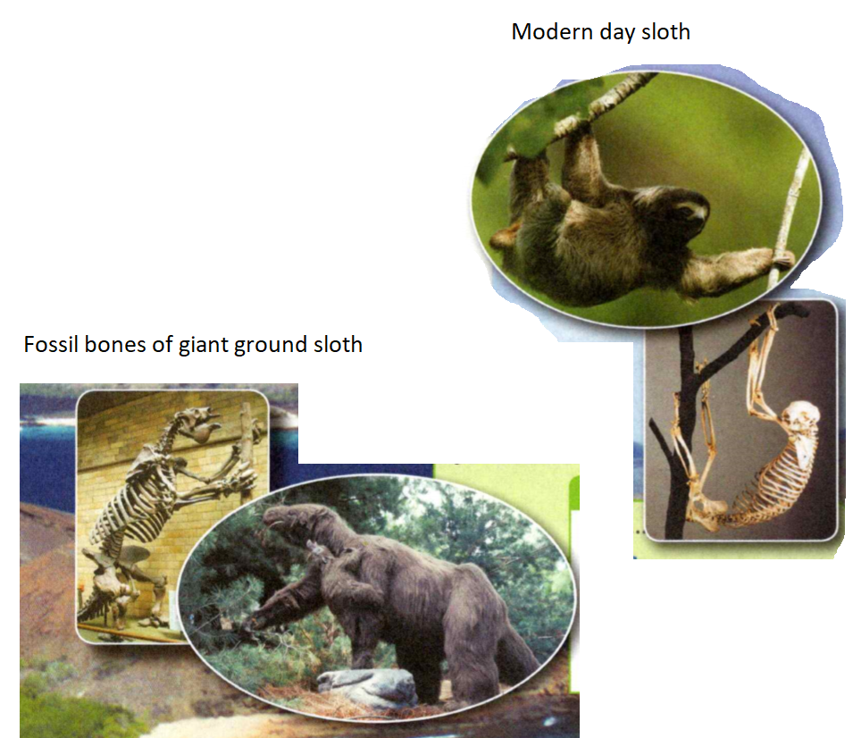
    <figcaption>Figure 1. Sloth Similarities.</figcaption>
  </figure>

**Complete the tasks below.**

1. Darwin thought that the fossil bones of the giant ground sloths in Figure 1
resembled the bones of modern-day sloths. List two similarities that you notice
between the two sloths.

### Galapagos Organisms 

The Beagle made many stops along the Atlantic and Pacific coasts of South
America. From the Pacific coast, the ship traveled west to the Galapagos
Islands. Darwin observed many unusual life forms there. He compared organisms
from the Galapagos Islands to organisms that lived elsewhere. He also compared
organisms living on the different islands.

Comparisons to South American Organisms Darwin discovered many similarities
between Galapagos organisms and those found in South America. Many of the birds
and plants on the islands resembled those on the mainland. However, he also
noted important differences between the organisms. For instance, you can see
differences between island and mainland iguanas in Figure 2.

  <figure>
    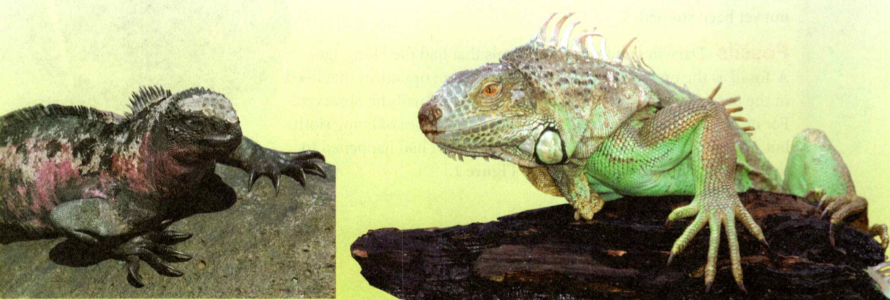
    <figcaption>Figure 2. Iguanas.</figcaption>
  </figure>

Darwin became convinced that species do not always stay the same. Instead, he
thought species could change and even produce new species over time. Darwin
began to think that maybe the island species were somehow related to South
American species. Perhaps, he thought, the island species had become different
from their mainland relatives over time.

The Galapagos penguin is the northernmost penguin in the world! It lives on the
equator and is kept cool by ocean currents. The Galapagos penguin is the rarest
penguin species and is endangered.

**Complete the tasks below.**

1. Comparing Iguanas see Figure 2. The iguanas on the Galapagos Islands have
large claws that allow them to grip slippery rocks so they can feed on seaweed.
The iguanas on the mainland have smaller claws that allow them to climb trees so
they can eat leaves. The color of each iguana is an adaptation to its
A) food.	
B) habitat.
C) predators.	
D) climate. 

### Comparisons Among the Islands 

Darwin also discovered many differences among organisms on the different
Galapagos Islands. For example, the tortoises on one island had dome-shaped
shells. Those on another island had saddle-shaped shells. A government official
in the islands told Darwin that he could tell which island a tortoise came from
just by looking at its shell.

### Adaptations 

Birds were also different from one island to the next. Look at Figure 3. When
Darwin returned to England, he learned that the different birds were all
finches. Darwin concluded that the finch species were all related to a single
ancestor species that came from the mainland. Over time, different finches
developed different beak shapes and sizes that were well suited to the food that
they ate. Beak shape is an example of an **adaptation**, a trait that increases an
organism's ability to survive and reproduce.

  <figure>
    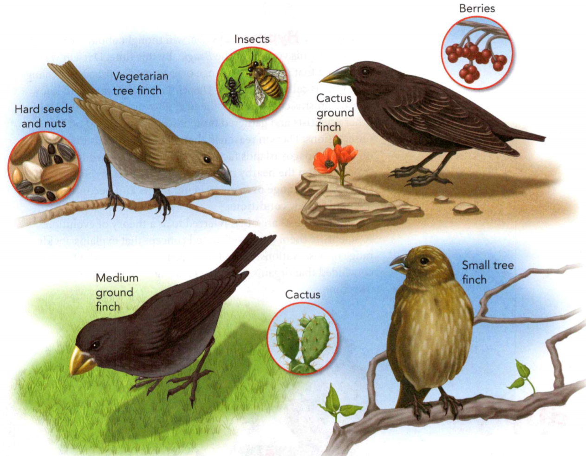
    <figcaption>Figure 3. Galapagos Finches.</figcaption>
  </figure>

**Complete the tasks below.**

1. The structure of each bird's beak is an adaptation to the type of food the
bird eats. Birds with long, pointed, sharp beaks pick at cacti. Those with
short, thick beaks crush seeds. Birds with narrow, pointed beaks grasp insects.
Those with short, hooked beaks tear open fruit. Look at the different beak
structures. Draw a line from each finch to the type of food you think it eats.

2. Write a sentence using the everyday meaning of the word adapt.

### Darwin's Hypothesis 

Darwin thought about what he had seen during his voyage on the Beagle. By this
time, Darwin was convinced that organisms change over time. The process of
change over time is called **evolution**. Darwin, however, wanted to know how
organisms change. Over the next 20 years, he consulted with other scientists and
gathered more information. Based on his observations, Darwin reasoned that
plants or animals that arrived on the Galapagos Islands faced conditions that
were different from those on the nearby mainland. **Darwin hypothesized that
species change over many generations and become better adapted to new
conditions.**

Darwin's ideas are often referred to as a theory of evolution. A **scientific
theory** is a well-tested concept that explains a wide range of observations.
From the evidence he collected, Darwin concluded that organisms on the Galapagos
Islands had changed over time.

**Complete the tasks below.**

  <figure>
    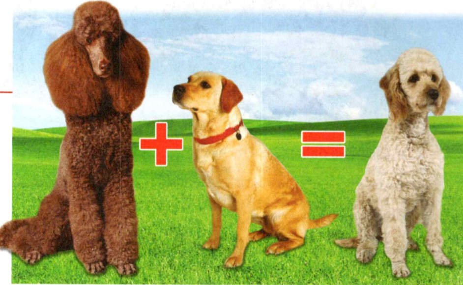
    <figcaption>Figure 4. Labradoodle.</figcaption>
  </figure>

1. The first labradoodle dog was bred in 1989. A labradoodle is a cross between
a standard poodle and a Labrador retriever. The poodle is very smart and has fur
that sheds very little. The poodle may be less irritating for people allergic to
dogs. Labradors are gentle, easily trained, and shed seasonally.
a) Why do you think people breed these two dogs together?
b) Would you expect the first labradoodle puppies to be the same as puppies
produced several generations later? Explain.

### Artificial Selection 

Darwin studied the offspring of domesticated animals that were produced by
artificial selection in an effort to understand how evolution might occur. In
artificial selection, only the organisms with a desired characteristic, such as
color, are bred. Darwin himself had bred pigeons with large, fan-shaped tails.
By repeatedly allowing only those pigeons with many tail feathers to mate,
Darwin produced pigeons with two or three times the usual number of tail
feathers. Darwin thought that a process similar to artificial selection might
happen in nature. But he wondered what natural process selected certain traits.

**Complete the tasks below.**

1. Make a list of three observations that Darwin made during the Beagle's voyage.
2. An adaptation is a trait that increases an organism's ability to ____
and ____ .

  <figure>
    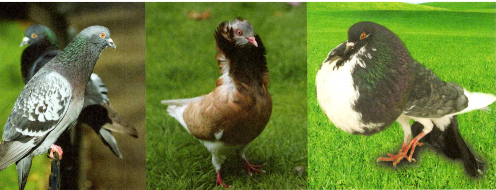
    <figcaption>Figure 5. Artificial Selection.</figcaption>
  </figure>

3. See Figure 5. The pigeons that Darwin bred were all descended from the rock
dove (left). Pigeons can be bred for characteristics such as color, beak shape,
wingspan, and feather patterns. If you were to breed an animal, what would it be
and what traits would you want it to have?

4. How does artificial selection support Darwin's hypothesis?

5. Darwin's hypothesis was ____ .

### What Is Natural Selection?

In 1858, Darwin and Alfred Russel Wallace, another British biologist, both
proposed the same explanation for how evolution occurs. The next year, Darwin
described his explanation in his book The Origin of Species. In this book,
Darwin proposed that evolution occurs by means of natural selection. Natural
selection is the process by which individuals that are better adapted to their
environment are more likely to survive and reproduce more than other members of
the same species. Darwin identified factors that affect the process of natural
selection: overproduction, variation, and competition. Figure 6 shows how
natural selection might happen in a group of sea turtles.

  <figure>
    
    <figcaption>Figure 6. A group of sea turtles over time.</figcaption>
  </figure>

### Overproduction 

Darwin knew that most species produce far more offspring than can possibly
survive. In many species, so many offspring are produced that there are not
enough resources—food, water, and living space—for all of them.

**Complete the tasks below.**

1. Overproduction, variation, and competition are factors that affect the process
of natural selection see Figure 6. Examine the sequence that shows how natural
selection could affect a group of sea turtles over time. Label each factor in
the illustration and write a brief caption explaining what is occurring.

### Variation 

Members of a species differ from one another in many of their traits. Any
difference between individuals of the same species is called a variation. For
example, sea turtles may differ in color, size, the ability to swim quickly, and
shell hardness.

### Competition 

Since food, space, and other resources are limited, the members of a species
must compete with one another to survive. Competition does not always involve
physical fights between members of a species. Instead, competition is usually
indirect. For example, some turtles may not find enough to eat. A slower turtle
may be caught by a predator, while a faster turtle may escape. Only a few
turtles will survive to reproduce.

### Selection 

Darwin observed that some variations make individuals better adapted to their
environment. Those individuals are more likely to survive and reproduce. Their
offspring may inherit the helpful characteristic. The offspring, in turn, will
be more likely to survive and reproduce, and pass the characteristic to their
offspring. After many generations, more members of the species will have the
helpful characteristic.

In effect, the environment selects organisms with helpful traits to become
parents of the next generation. **Darwin proposed that, over a long time,
natural selection can lead to change. Helpful variations may accumulate in a
species, while unfavorable ones may disappear.**

**Complete the tasks below.**

  <figure>
    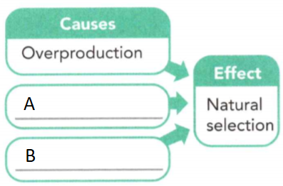
    <figcaption>Figure 7. Factors that cause natural selection.</figcaption>
  </figure>

1. In Figure 7 fill in the graphic organizer to identify the factors that cause
natural selection.

### Environmental Change 

A change in the environment can affect individuals, organisms with specific
traits, or entire species. Changes that affect an organism's ability to survive,
and therefore reproduce, lead to natural selection. For example, monkey flowers
are plants that do not normally grow in soil that has a high concentration of
copper. However, because of genetic variation, some varieties of monkey flower
now grow near copper mines. In Figure 8 you can see how natural selection might
have resulted in monkey flowers that can grow in copper-contaminated soil.

### Genes and Natural Selection 

Without variations, all the members of a species would have the same traits and
the same chance of surviving and reproducing. But where do variations come from?
How are they passed on from parents to offspring?

Darwin could not explain what caused variations or how they were passed on. As
scientists later learned, variations can result from changes in genes and the
shuffling of different forms of genes when egg and sperm join. Genes, such as
those for hair color and height, are passed from parents to their offspring.
Only traits that are inherited, or controlled by genes that are passed on to
offspring, can be acted upon by natural selection.

  <figure>
    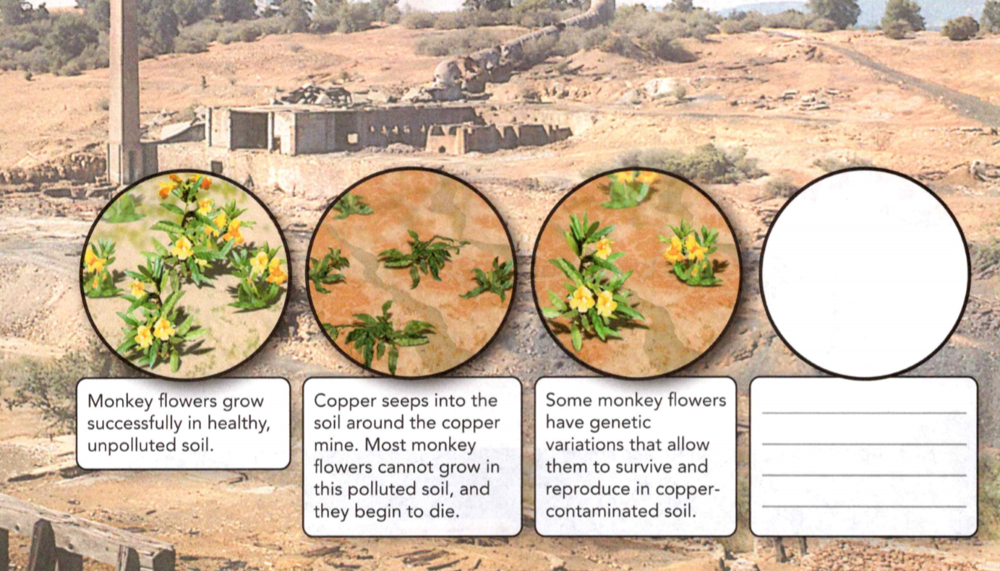
    <figcaption>Figure 8. Environmental Change.</figcaption>
  </figure>

**Complete the tasks below.**

  <figure>
    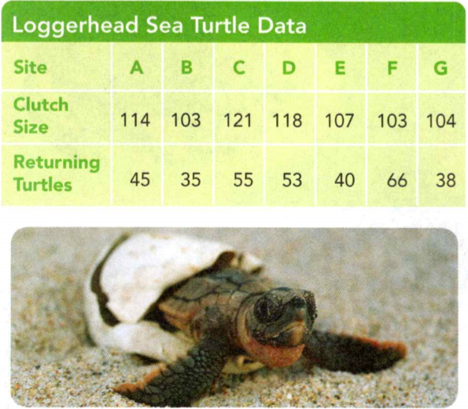
    <figcaption>Figure 9. Loggerhead Sea Turtle Data.</figcaption>
  </figure>

1. The typical clutch size, or number of eggs, a loggerhead sea turtle can lay
at once is around 113. Even with producing so many offspring, the loggerhead sea
turtle is endangered in many areas. Suppose that scientists counted the number
of eggs laid at seven different nesting sites along the southeast coast of the
United States. The following year, scientists check the nesting sites to see how
many offspring survived and returned.
a) Determine the mean for the clutch sizes of the seven nesting sites in the
table in Figure 9.   
b) How does the mean compare to the typical clutch size for loggerheads?
c) Do you think clutch size influences the survival rates of the offspring? Use
the data to support your answer.
d) Hypothesize why Site F had the largest number of returning turtles.

2. When copper contaminated the soil surrounding the monkey flowers, the
environment changed see Figure 8. Due to a genetic variation, some varieties of
monkey flower are now able to survive in that soil. In the last circle, draw
what you think the area will look like in ten years' time. Write a caption
describing what has taken place.

3. A variation is any (similarity/ difference) between individuals of the same
species.
4. How do life forms change over time?
5. Explain how unfavorable traits can disappear in a species.

### Evidence of Evolution
- What Evidence Supports Evolution?
 
**Complete the tasks below.**

1. In 2004, researchers on Ellesmere Island, Nunavut, in the Canadian Arctic,
found a fossil that provides information about when fish first came onto land.
The fossil, called Tiktaalik, is 375 million years old. Tiktaalik has
characteristics of both fish and four-legged animals. Like other fish, it has
fins. However, the fins have interior bones that helped push the animal up in
the shallow waters close to shore to find food. The discovery of Tiktaalik has
provided new fossil evidence to help scientists understand the relationship
between marine vertebrates and land vertebrates. 
a) Do you think the discovery of Tiktaalik is important to understanding
evolution? Why?
a) Do you think Tiktaalik spent most of its time on land or in water? Why?

  <figure>
    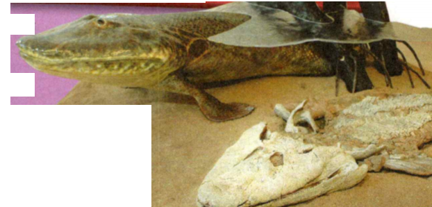
    <figcaption>Figure 10. Model of Tiktaalik shows how it may have looked like 375 million years ago.</figcaption>
  </figure>

### What Evidence Supports Evolution?

Since Darwin's time, scientists have found a great deal of evidence that
supports the theory of evolution. **Fossils, patterns of early development,
similar body structures, and similarities in DNA and protein structures all
provide evidence that organisms have changed over time.**

### Fossils 

By examining fossils, scientists can infer the structures of ancient organisms.
Fossils show that, in many cases, organisms that lived in the past were very
different from organisms alive today. The millions of fossils that scientists
have collected are called the fossil record. The fossil record provides clues
about how and when new species evolved and how organisms are related. Rock
layers that were deposited more recently are more likely to contain fossils of
organisms that resemble current species.

### Similarities in Early Development 

Scientists also infer evolutionary relationships by comparing the early
development of different organisms. For example, the organisms in Figure 11 look
similar during the early stages of development. All four organisms have a tail.
They also have a row of tiny slits along their throats. The similarities suggest
that these vertebrate species are related and share a common ancestor.

  <figure>
    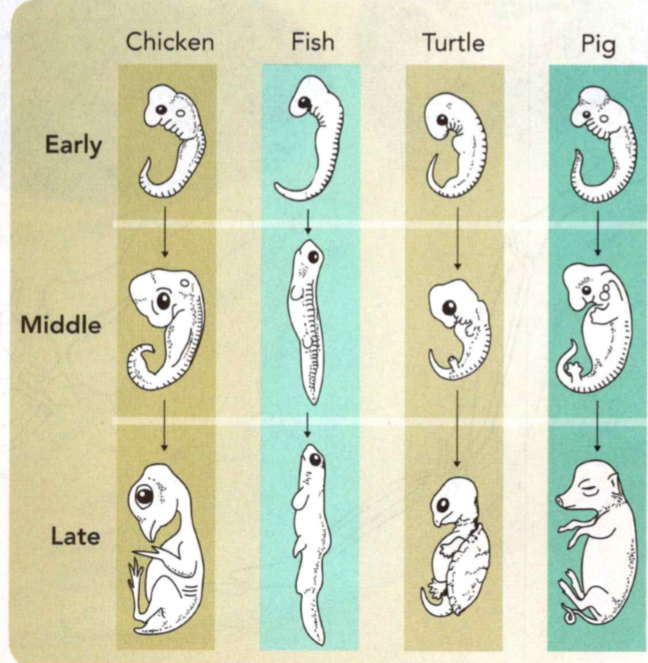
    <figcaption>Figure 11. Similarities in Development.</figcaption>
  </figure>

**Complete the tasks below.**

1. See Figure 11, Similarities in Development. These four organisms all look
similar during their early development.
a) Circle at least two similarities shared by all four organisms.
b) What are some differences between the organisms?

### Similarities in Body Structure 
An organism's body structure is its basic body plan, which in vertebrates
includes how its bones are arranged. Fishes, amphibians, reptiles, birds, and
mammals all have an internal skeleton with a backbone. This similarity provides
evidence that these animal groups all evolved from a common ancestor.

Similar structures that related species have inherited from a common ancestor
are known as **homologous structures**. In Figure 12, you can see some examples
of homologous structures. These include a bird's wing, a dolphin's flipper, and
a dog's leg.

Sometimes fossils show structures that are homologous with structures in living
species. For example, scientists have recently found fossils of ancient
whalelike creatures. The fossils show that the ancestors of today's whales had
legs and walked on land. This evidence supports other evidence that whales and
other vertebrates share a common ancestor that had a skeleton with a backbone.

  <figure>
    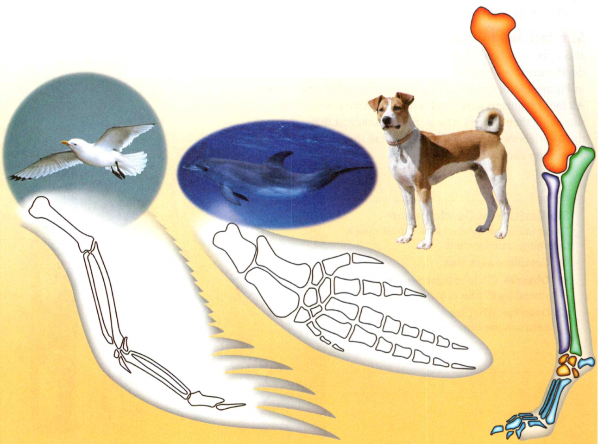
    <figcaption>Figure 12. Homologous Structures.</figcaption>
  </figure>

**Complete the tasks below.**

1. In Figure 12 the bones in a bird's wing, a dolphin's flipper, and a dog's leg
have similar structures. Use the drawing of the dog's leg as a guide. Color in
the matching bones in the bird's wing and the dolphin's flipper with the
appropriate colors.

### Similarities in DNA and Protein Structure 

Why do some species have similar body structures and development patterns?
Scientists infer that the species inherited many of the same genes from a common
ancestor.

Recall that genes are segments of DNA. Scientists compare the sequence of
nitrogen bases in the DNA of different species to infer how closely related the
two species are. The more similar the DNA sequences, the more closely related
the species are. The DNA bases along a gene specify what type of protein will be
produced. 

Therefore, scientists can also compare the order of amino acids in a protein to
see how closely related two species are.

In most cases, evidence from DNA and protein structure has confirmed conclusions
based on fossils, embryos, and body structure. For example, DNA comparisons show
that dogs are more similar to wolves than to coyotes. Scientists had already
reached this conclusion based on similarities in the structure and development
of these three species.

**Complete the tasks below.**

  <figure>
    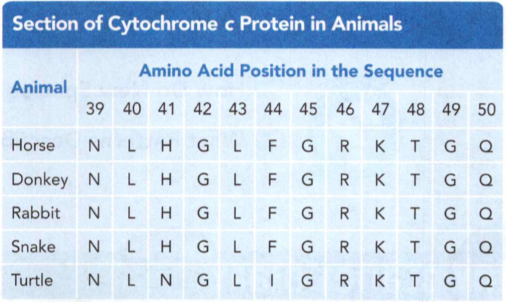
    <figcaption>Figure 13. Section of Cytochrome c Protein in Animals.</figcaption>
  </figure>

1. The table in Figure 13 shows the sequence of amino acids in one region of a
protein, cytochrome c, for five different animals. Each letter corresponds to a
different amino acid in the protein.
a) Which species is most distantly related to the horse?
b) Explain how amino acid sequences provide information about evolutionary
relationships among organisms.

2. ____ structures are structurally similar body parts in related species.

3. Insects and birds both have wings. What kinds of evidence might show whether
or not insects and birds are closely related? Explain.

4. The theory of evolution is supported by evidence that includes ___ .

### Rate of Change

- How Do New Species Form?
- What Patterns Describe the Rate of Evolution?

**Complete the tasks below.**

1. Crickets, Maggots, and Flies, Oh My! A male cricket chirps to attract a mate.
Unfortunately, chirping also attracts a parasitic fly. Parasitic flies listen
for chirping crickets. When a cricket is located, a female fly deposits larvae
onto the cricket's back. The larvae, or maggots, burrow into the cricket. The
maggots come out seven days later, killing the cricket in the process. Parasitic
flies reduced the cricket population on the Hawaiian island of Kauai between
1991 and 2001. By 2003, the cricket population on Kauai had increased. The male
crickets were silent! In about 20 cricket generations, the crickets had evolved
into an almost silent population.
a) Why do you think the crickets on Kauai evolved so quickly?
b) If most of the male crickets can no longer chirp, how do you think it might
affect the size of the cricket population?

### How Do New Species Form?

Natural selection explains how variations can lead to changes in a species. But
how could an entirely new species form? **A new species can form when a group
of individuals remains isolated from the rest of its species long enough to
evolve different traits that prevent reproduction.** Isolation, or complete
separation, occurs when some members of a species become cut off from the rest
of the species. One way this can happen is when a natural barrier, such as a
river, separates group members.

  <figure>
    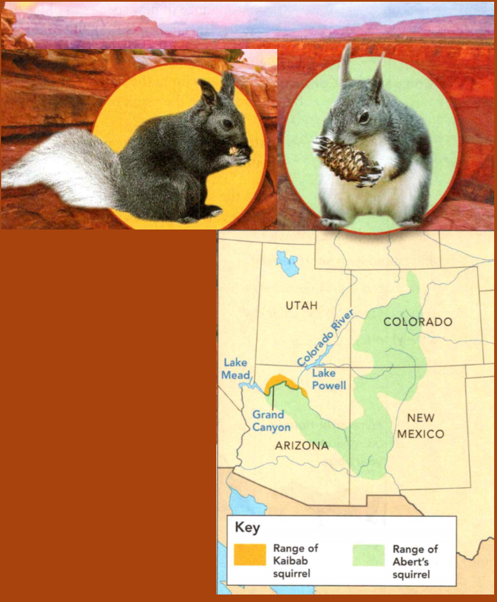
    <figcaption>Figure 14. Kaibab and Abert's Squirrels.</figcaption>
  </figure>

As you can see in Figure 14, the populations of Kaibab and Abert's squirrels are
separated by the Grand Canyon. The two kinds of squirrels are the same species,
but they have slightly different characteristics. For example, the Kaibab
squirrel has a black belly, while Abert's squirrel has a white belly. It is
possible that one day these squirrels will become so different that they will no
longer be able to mate with each other and will become separate species.

**Complete the tasks below.**

1. See Figure 14. The Kaibab squirrel (left) and the Abert's squirrel (right)
have been isolated from each other for a long time. Eventually, this isolation
may result in two different species. What conditions might differ from one side
of the Grand Canyon to the other that would cause the squirrels to be different
colors?

2. New species form when ____ .

### What Patterns Describe the Rate of Evolution?

The fossil record has provided scientists with a lot of important information
about past life on Earth. For example, fossils show a great variety of species
that became extinct as their environments changed. Scientists also have found
many examples of the appearance of new species as older species vanish.
Sometimes the new species appear rapidly, and at other times they are the result
of more gradual change. **Scientists have developed two patterns to describe the
pace of evolution: gradualism and punctuated equilibrium.**

### Gradual Change 

Some species in the fossil record seem to change gradually over time.
**Gradualism** involves small changes that add up to major changes over a long
period of time. Since the time scale of the fossil record involves hundreds,
thousands, or even millions of years, there is plenty of time for gradual
changes to produce new species. The fossil record contains many examples of
species that are intermediate between two others. One example is the horse
relative, Merychippus, shown in Figure 15. Many such intermediate forms seem to
be the result of gradual change.

  <figure>
    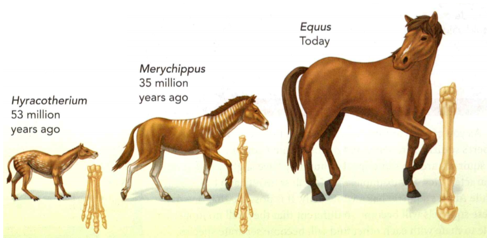
    <figcaption>Figure 15. Horse Evolution.</figcaption>
  </figure>

### Rapid Change 

Scientists have also found that many species remain almost unchanged during
their existence. Then, shortly after they become extinct, related species often
appear in the fossil record. This pattern, in which species evolve during short
periods of rapid change and then don't change much, is called **punctuated
equilibrium**. Today most scientists think that evolution can occur rapidly at
some times, and more gradually at others. Scientists have observed that some
species of insects and bacteria have undergone significant change in just a few
years.

**Complete the tasks below.**

1. Identify the similarity and the key differences between gradualism and punctuated equilibrium. 
a) Both describe the ______.
b) Gradualism states that evolution occurs (quickly/slowly) and (steadily/in short bursts).
c) Punctuated equilibrium states that evolution occurs (quickly/ slowly) over
periods of time.

2. Horses left a rich and detailed fossil record of their evolution see Figure
15. Many intermediate forms have been found between modern horses and their
four-toed ancestors. Merychippus is shown here.
a) Name two differences between the horses.
b) How could the evolution of the shape of the leg and the number of toes have
benefited Equus?

  <figure>
    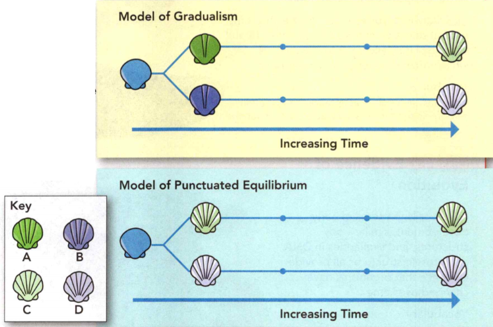
    <figcaption>Figure 16. Two patterns that describe the rate of evolution.</figcaption>
  </figure>

3. Two patterns that describe the rate of evolution are modeled in Figure 16.
Look at the shells in the key. For each pattern, decide if - and at what
point—each shell belongs on the timelines. Using colored pencils, draw and color
in the shells at their correct locations to show how they have evolved over
time.

4. The _____ has given scientists information about past life on Earth.

5. Why are fossils of intermediate life forms likely to be rare if the pattern
of punctuated equilibrium explains how evolution occurs?

6. Two patterns of evolution are ___ .

7. Living things change over time, or ____ , through a process called _____ .

### Study Guide

- Darwin hypothesized that species change over many generations and become
better adapted to new conditions.
- Darwin proposed that, over a long time, natural selection can lead to change.
Helpful variations may accumulate in a species, while unfavorable ones may
disappear.
- Fossils, patterns of early development, similar body structures, and
similarities in DNA and protein structures all provide evidence that organisms
have changed over time.
- A new species can form when a group of individuals remains isolated from the
rest of its species long enough to evolve different traits that prevent
reproduction.
- Scientists have developed two patterns to describe the pace of evolution:
gradualism and punctuated equilibrium.

**Complete the tasks below.**

1. A trait that helps an organism to survive and reproduce is called a(n)
A) variation.	
B) adaptation.
C) species.	
D) selection.

2. Two organisms that can mate and produce fertile offspring are members of the
same ___ .

3. Why are Darwin's ideas classified as a scientific theory?

4. What is one factor that affects natural selection? Give an example.

5. Identify one similarity and one difference between natural selection and
artificial selection.

6. You are a reporter in the 1800s interviewing Charles Darwin about his theory
of evolution. Write three questions you would ask him. Then write answers that
Darwin might have given.

7. Similar structures that related species have inherited from a common ancestor are called
A) adaptations.
B) fossils.
C) ancestral structures.
D) homologous structures.

8. The more ____ the DNA sequences between two organisms are, the more closely
related the two species are.

  <figure>
    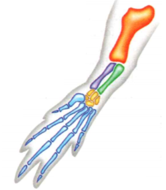
    <figcaption>Figure 17. Bones of a crocodile's leg.</figcaption>
  </figure>

9. Look at the drawing in Figure 17 of the bones in a crocodile's leg. Do you
think that crocodiles share a common ancestor with birds, dolphins, and dogs?
Support your answer with evidence.

10. What type of evidence is the best indicator of how closely two species are
related? Explain your answer.

11. The pattern of evolution that involves short periods of rapid change is called
A) adaptation.
B) gradualism. 
C) isolation.
D) punctuated equilibrium.

12.	____ involves tiny changes in a species that slowly add up to major changes over time.

13. A population of deer lives in a forest. Draw a picture that illustrates how
a geographic feature could isolate this deer population into two separate
groups. 
a) Label the geographic feature.
b) Describe the condition that could cause these two groups of deer to become
separate species over time.

15. Suppose that over several years, the climate in an area becomes much drier
than it was before. How would plants, like the ones shown below, be affected?
Using the terms variation and natural selection, predict what changes you might
observe in the plants as a result of this environmental change.

  <figure>
    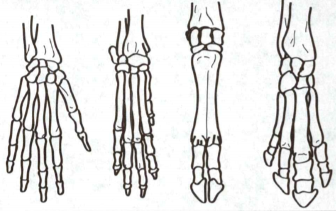
    <figcaption>Figure 18. Illustration.</figcaption>
  </figure>

16. The illustration in Figure has no title. Which of the following titles would
best describe the concept shown in this drawing?
A) Wrist Bone Adaptations
B) Similarities in Wrist Bone Development
C) Evolutionary Change Through Gradualism
D) Homologous Structures in Four Animals

17. Which of the following has provided scientists with evidence about the
changes in species over time?
A) fossil record
B) equilibrium record
C) evolution record
D) adaptation record

18. Which of the following is the best example of an adaptation that helps
organisms survive in their environment?
A) green coloring in lizards living on gray rocks
B) a thick coat of fur on animals that live in the desert
C) an extensive root system in desert plants
D) thin, delicate leaves on plants in a cold climate

19. Which of the following sets of factors did Darwin identify as affecting
natural selection?
A) adaptations, gradualism, and evolution
B) overproduction, variation, and competition 
C) adaptations, traits, and variations
D) predation, competition, and mutualism

20. Evolution that occurs slowly is described by the pattern of ____ while rapid
changes are described by ____
A) gradualism; natural selection
B) homologous structures; fossils
C) gradualism; punctuated equilibrium
D) natural selection; punctuated equilibrium

  <figure>
    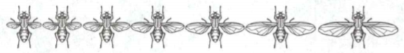
    <figcaption>Figure 19. Variations in wing size within a species of fly.</figcaption>
  </figure>

21. The drawing in Figure 19 shows variations in wing size within a species of
fly. Describe a situation in which natural selection might favor flies with the
smallest wings.

