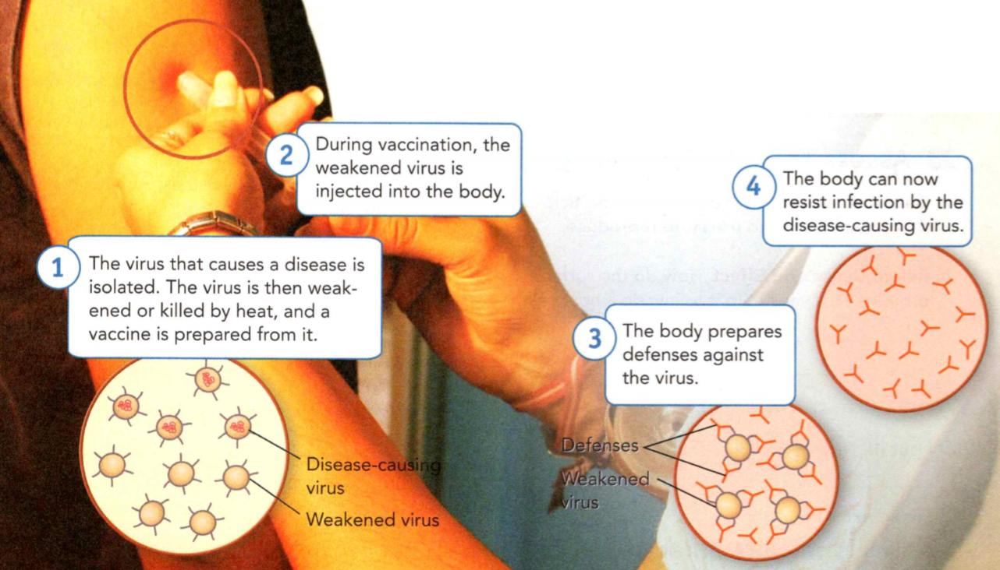
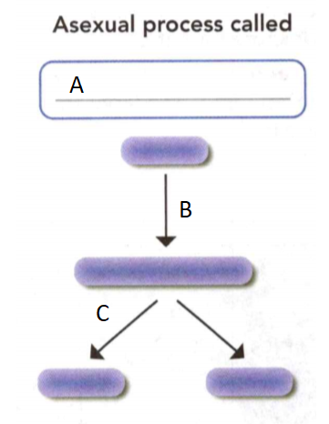
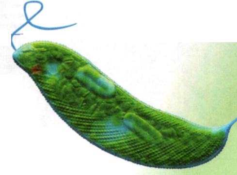

### Life Science

## Biology

## Viruses, Bacteria, Protists, and Fungi

A **prokaryote** is an organism whose single cell lacks a nucleus.

A **nucleus** is a large oval organelle that contains the cell's genetic
material in the form of DNA and controls many of the cell's activities.

A **eukaryote** is an organism with cells that contain nuclei.

**Complete the tasks below.**

1. "Yes, it is a prokaryote !" said Lena, pulling her head away from the
microscope. "No, it's not!" said Kiera. "Stop fighting!" said their friend Isa.
"Let me see:' Isa looked. "It's not a prokaryote; that's for sure. First of all,
it is too large. More importantly, you can clearly see its nucleus. It is
obviously a eukaryote. " Which organisms have nuclei—prokaryotes or eukaryotes?

### Chapter Preview

- virus
- host
- parasite
- vaccine 
- bacteria
- cytoplasm
- ribosome
- flagellum
- cellular respiration
- binary fission
- conjugation
- endospore
- pasteurization
- decomposer
- protist
- protozoan
- pseudopod
- contractile vacuole
- cilia
- algae
- pigment
- spore
- fungus
- hyphae
- fruiting body
- budding
- lichen

### Viruses
- What Are the Characteristics of Viruses?
- How Do Viruses Interact With the Living World?

**Complete the tasks below.**

1. Have you ever seen a snarling dog on TV? Chances are this "mad dog" was
supposed to have rabies. Rabies is a virus that affects the brain, causing "mad"
behaviors and spasms of the throat. Infected animals avoid water, giving the
disease the nickname hydrophobia, meaning "fear of water." In the 1800s, if
people were bitten by a mad dog, they would likely die. Then, in 1884, the
scientist Louis Pasteur said he had a cure. He claimed, "Whoever gets bitten by
a mad dog has only to submit to my three little inoculations, and he need not
have the slightest fear of hydrophobia." Would you try Pasteur's cure, even if
it had not been tested on humans? Why or why not?

### What Are the Characteristics of Viruses?

Have you ever noticed that when you spent time with a friend suffering from a
cold, you sometimes felt sick a few days later? You were probably infected by a
virus. A **virus** is a tiny, nonliving particle that enters and then reproduces
inside a living cell.

**Viruses are nonliving, have a protein coat that protects an inner core of
genetic material, and cannot reproduce on their own.**

### Virus Needs 

Why are viruses considered nonliving? They lack most of the characteristics of
living things. Viruses are not cells and do not use their own energy to grow or
to respond to their surroundings. Viruses also cannot make food, take in food,
or produce wastes. Although viruses can multiply like organisms, they can only
do so when they are inside a living cell.

The organism that a virus enters and multiplies inside of is called a host. A
**host** is an organism that provides a source of energy for a virus or another
organism. A virus acts like a **parasite**, an organism that lives on or in a
host and causes it harm. Almost all viruses destroy the cells in which they
multiply.

  <figure>
    
    <figcaption>Figure 1. Virus Shapes.</figcaption>
  </figure>

In Figure 1, the leglike structures on the bottom of the T4 bacteriophage keep
the virus firmly in place as it infects a cell.

### Virus Shapes 

As you can see in Figure 1, viruses vary widely in shape. Some viruses are
round, and some are rod-shaped. Other viruses are shaped like bricks, threads,
or bullets. There are even viruses that have complex, robotlike shapes, such as
the bacteriophage. A bacteriophage is a virus that infects bacteria. In fact,
its name means "bacteria eater".

  <figure>
    
    <figcaption>Figure 2. Virus Sizes.</figcaption>
  </figure>

**Complete the tasks below.**

1. The Streptococcus bacterium is a round organism that causes the infection strep throat.
a) A Streptococcus bacterium is 10 times larger than a cold virus. Calculate the
size of the bacterium.
b) Draw the bacterium to scale in the box in Figure 3.

  <figure>
    
    <figcaption>Figure 3. Streptococcus bacterium.</figcaption>
  </figure>

### Virus Sizes 

Viruses are smaller than cells and cannot be seen with the microscopes you use
in school. Viruses are so small that they are measured in units called
nanometers (nm). One nanometer is one billionth of a meter (m). The smallest
viruses are about 20 nanometers in diameter, while the largest viruses are more
than 200 nanometers in diameter. The average virus is quite small even compared
with the smallest cells—those of bacteria.

### Naming Viruses 

Because viruses are not considered organisms, scientists do not use the two-part
scientific naming system to identify them. Scientists name viruses in a variety
of ways. For example, some viruses, such as the poliovirus, are named after the
disease they cause. Other viruses are named for the area where they were
discovered. The West Nile virus is named after the place in Africa where it was
first found.

### How Viruses Multiply 

After a virus attaches to a host cell, it enters the cell. Once inside a cell,
the virus's genetic material takes over many of the cell's functions. It
instructs the cell to produce the virus's proteins and genetic material. These
proteins and genetic material then assemble into new viruses. Some viruses take
over cell functions immediately. Other viruses wait for a while.

### The Structure of Viruses 

Although viruses have many different shapes and sizes, they all have a similar
structure. All viruses have two basic parts: an inner core containing genetic
material and a protein coat that protects the virus. A virus's genetic material
contains the instructions for making new viruses.

Each virus contains unique surface proteins. These surface proteins play an
important role during the invasion of a host cell. The shape of the surface
proteins allows a virus to attach only to certain cells in the host. Like keys,
a virus's proteins fit only into specific "locks:' or proteins, on the surface
of a host's cells. So a particular virus can attach only to one or a few types
of host cells. For example, most cold viruses infect cells only in the nose and
throat of humans. Those cells have proteins on their surfaces that complement or
fit the proteins on cold viruses. Figure 4 shows how the lock-and-key system
works.

  <figure>
    
    <figcaption>Figure 4. Virus Structure and Invasion.</figcaption>
  </figure>

**Complete the tasks below.**

1. Some viruses are surrounded by an outer membrane envelope. For the virus on
the right, draw a line from the virus surface proteins to the matching cell
surface proteins. Circle any of the cell proteins that do not match.

2. A virus is a (living/nonliving) particle that enters a cell and uses it to
reproduce.

3. How do the surface proteins on a virus help it to invade a host cell?

4. Scientists hypothesize that viruses could not have existed on Earth before
organisms appeared. Do you agree? Explain.

5. The characteristics of viruses are ____ .

### How Do Viruses Interact With the Living World?

You may have only heard of viruses causing colds and diseases. But sometimes
viruses help rather than harm. **Though viruses can cause disease, they can also
be used to treat and prevent illnesses.**

Viruses and Disease 

Some viral diseases, such as colds, are mild and pass through the body quickly.
Other viral diseases, such as human immunodeficiency virus, or HIV, have much
more serious and lasting effects on the body.

Viruses also cause diseases in organisms other than humans. For example, apple
trees infected by the apple mosaic virus may produce less fruit. Dogs and cats
can get deadly viral diseases such as rabies and distemper.

### Usefulness of Viruses 

In a technique called gene therapy, scientists take advantage of a virus's
ability to enter a host cell. They use the virus as a "messenger service" to
deliver genetic material to cells that need it. Gene therapy can be used to
treat disorders such as cystic fibrosis. People with cystic fibrosis lack the
genetic material to keep their lungs functioning properly.

If you never got the chickenpox virus as a child, you may have a vaccine to
thank! A **vaccine** is a substance introduced in the body to help produce chemicals
that destroy specific viruses. A vaccine may be made from weakened or dead
viruses. Because they are weakened or dead, the viruses do not cause disease.
Instead, they activate the body's natural defenses. If that virus ever invades
your body, it is destroyed before it can make you sick.

  <figure>
    
    <figcaption>Figure 5. Vaccine Protection.</figcaption>
  </figure>

Influenza (flu) and other diseases can be prevented by vaccines.
1. The virus that causes a disease is isolated. The virus is then weakened or
killed by heat, and a vaccine is prepared from it.
2. During vaccination, the weakened virus is injected into the body.
3. The body prepares defenses against the virus.
4. The body can now resist infection by the disease-causing virus.

**Complete the tasks below.**

  <figure>
    
    <figcaption>Figure 6. Dengue Fever.</figcaption>
  </figure>

1. Viruses can cause disease around the world. Use the world map in Figure 6 to answer
the questions about dengue fever, a viral disease.
a) Which continents have outbreaks of dengue fever?
b) Why do you think dengue fever only occurs in warm places?
c) Suppose people in South America are getting sick with an influenza virus. A
few days earlier, there were reports of the same virus infecting people in
Africa. How could the influenza virus have spread so quickly?

2. Viruses interact in the living world by both ___ .

### Bacteria

- What Are Bacteria?
- How Do Bacteria Get Food, Get Energy, and Reproduce?
- What Is the Role of Bacteria in Nature?

**Complete the tasks below.**

1. "Good" Germs Misconception: All bacteria are harmful. Many bacteria are
harmless or even good for you! Your intestines are full of good bacteria. Some
types of helpful bacteria, often called probiotics, are found in foods like
yogurt, smoothies, and even cereal! Scientists have found that eating foods
containing probiotics keeps you healthy. These foods put good bacteria into your
body to help fight off the harmful bacteria that can cause disease.
a) Why do people often think all bacteria are bad for you?
b) Can you think of some products you have used at home or at school to kill
harmful bacteria?

### What Are Bacteria?

They thrive in your cup of yogurt. They coat your skin and swarm inside your
nose. You cannot escape them because they live almost everywhere—under rocks, in
the ocean, and all over your body. In fact, there are more of these organisms in
your mouth than there are people on Earth! You don't notice them because they
are very small. These organisms are bacteria.

### Cell Structures 

Bacteria were first discovered in the late 1600s by a Dutch merchant named Anton
von Leeuwenhoek. He made microscopes as a hobby. One day, while looking at
scrapings of his teeth, he noticed small wormlike organisms. If Leeuwenhoek had
owned a modern high-powered microscope, he would have seen that the
single-celled organisms were **bacteria** (singular bacterium). **Bacteria are
prokaryotes. The genetic material in their cells is not contained in a
nucleus.** In addition to lacking a nucleus, the cells of bacteria also lack
many other structures that are found in the cells of eukaryotes. Recall that
eukaryotes include protists, fungi, and animals.

  <figure>
    
    <figcaption>Figure 7. Bacterial Cell Structure.</figcaption>
  </figure>

Figure 7 shows the structures in a typical bacterial cell. Most bacterial cells
are surrounded by a rigid cell wall that protects the cell. Just inside the cell
wall is the cell membrane, which controls what materials pass in and out of the
cell. The region inside the cell membrane, called the **cytoplasm**, contains a
gel-like fluid that moves structures throughout the cell. Located in the
cytoplasm are tiny structures called **ribosomes**, chemical factories where
proteins are produced. The cell's genetic material, which looks like a tangled
string, is also found in the cytoplasm. It contains the instructions for all of
the cell's functions. A bacterial cell may also have a **flagellum**, a long,
whiplike structure that helps a cell to move.

**Complete the tasks below.**

1. A bacterial cell that lacks a flagellum can be carried from place to place by
air, water, or other organisms. Write the names of the missing cell structures
on the lines provided.

### Cell Shapes 

If you were to look at bacteria under a microscope, you would notice that most
bacterial cells have one of three basic shapes: spherical, rodlike, or spiral.
The chemical makeup of the cell wall determines the shape of a bacterial cell.
The shape of the cell helps scientists identify the type of bacteria.

### Cell Sizes 

Bacteria vary greatly in size. The largest known bacterium is about as big as
the period at the end of this sentence. An average bacterium, however, is much
smaller. For example, the spherical strep throat bacteria are about 0.5 to 1
micrometer in diameter. A micrometer is one millionth of a meter.

  <figure>
    
    <figcaption>Figure 8. Bacteria Shapes and Names.</figcaption>
  </figure>

**Complete the tasks below.**

1. Bacteria are sometimes named for their shape. Use the key to match the
scientific names in the word bank to the correct bacteria. Write your answers in
the boxes. Key to Scientific Names: Stella: star, Spira: coil or spiral, Kokkos:
sphere, Bacillus: rod. Word Bank: Leptospira interrogans, Bacillus anthracis,
Stella vacuolata, Streptococcus thermophilus.

2. Where is the genetic material located in a bacterial cell?

3. You are looking at a Stella vacuolata bacterium. What is its shape and how do
you know?

4. Bacteria are ___ .

### How Do Bacteria Get Food, Get Energy, and Reproduce?

From the bacteria that live in soil to those that live in the pores of your
skin, all bacteria need certain things to survive and reproduce **Bacteria get
energy by either making food or eating other organisms, and can reproduce
asexually or sexually.**

### Obtaining Food 

Some bacteria are autotrophs, meaning they make their own food. Some capture and
use the sun's energy as plants do. Others, such as bacteria that live deep in
mud, do not use the sun's energy. Instead, these bacteria use the energy from
chemical substances in their environment to make their food.

Some bacteria are heterotrophs, and cannot make their own food. These bacteria
must consume other organisms or the food that other organisms make.
Heterotrophic bacteria consume a variety of foods—from milk and meat, which you
might also eat, to decaying leaves on a forest floor.

  <figure>
    
    <figcaption>Figure 9. Obtaining Food.</figcaption>
  </figure>

Autotrophic bacteria in hot springs use chemical energy to make food.
Heterotrophic bacteria in compost get energy from decaying food.

These bacteria in Figure 10 break down pollutants in this biopile to get energy.

  <figure>
    
    <figcaption>Figure 10. Bacteria Buffet.</figcaption>
  </figure>

### Respiration 

Like all organisms, bacteria need a constant supply of energy to carry out their
functions. This energy comes from food. The process of breaking down food to
release energy is called **cellular respiration**. Like many other organisms,
most bacteria need oxygen to break down their food. But a few kinds of bacteria
do not need oxygen for respiration. In fact, those bacteria die if oxygen is
present in their surroundings. For them, oxygen is a poison that kills!

**Complete the tasks below.**

1. How do autotrophic and heterotrophic bacteria differ in the way they obtain
food?

  <figure>
    
    <figcaption>Figure 11. Disease-causing bacteria.</figcaption>
  </figure>

2. Suppose you are a scientist studying disease-causing bacteria. You make a
table (Figure 11) that lists how the bacteria get energy and whether they need
oxygen. One day, some of your data are accidentally erased.
Use what you know about bacteria to fill in the first two columns in the table.
How would you destroy these dangerous bacteria? Use the information in the table
to fill in the last column.

### Reproduction 

One of the characteristics of living things is that they are able to reproduce,
or make more copies of themselves. When bacteria have plenty of food, the right
temperature, and other suitable conditions, they thrive and reproduce often.
Bacteria can reproduce asexually or sexually.

Some bacteria are able to reproduce every 20 minutes.

### Asexual Reproduction

  <figure>
    
    <figcaption>Figure 12. Asexual Reproduction.</figcaption>
  </figure>

Bacteria sometimes reproduce asexually by a process called **binary fission**, in
which one cell divides to form two identical cells. To prepare for binary
fission, a bacterial cell grows to almost twice its size. Then it duplicates its
genetic material and splits into two separate cells. Each new cell receives a
complete copy of the parent's genetic material. As a result, the offspring are
genetically identical to the parent. Binary fission increases the number of
bacteria.

### Sexual Reproduction

  <figure>
    
    <figcaption>Figure 13. Sexual Reproduction.</figcaption>
  </figure>

Sometimes bacteria reproduce sexually by a process called **conjugation**.
During conjugation, one bacterium transfers some of its genetic material into
another bacterium through a thin, threadlike bridge. After the transfer, the
bacteria separate. Conjugation results in bacteria with new combinations of
genetic material. When the bacteria divide by binary fission, the new genetic
material passes to the offspring. Conjugation does not increase the number of
bacteria, as binary fission does. However, it does result in bacteria that are
genetically different from the parent cells.

### Endospore Formation

  <figure>
    
    <figcaption>Figure 14. Endospore Formation.</figcaption>
  </figure>

Sometimes, conditions in the environment become unfavorable for the growth of
bacteria. For example, food sources can disappear, water can dry up, or the
temperature can fall or rise dramatically. Some bacteria can survive harsh
conditions by forming endospores. An endospore is a small, rounded, thick-walled
resting cell that forms inside a bacterial cell. It encloses the cell's genetic
material and some of its cytoplasm.

Because endospores can resist freezing, heating, and drying, they can survive
for many years in harsh conditions. Endospores are also light—a breeze can lift
and carry them to new places. If an endospore lands in a place where conditions
are suitable, it opens up. Then the bacterium can begin to grow and multiply.

**Complete the tasks below.**

1. Asexual bacterial reproduction see Figure 12. Why are all the bacteria the
same color?

2. Asexual bacterial reproduction see Figure 12. In the diagram, label each
reproductive process.

3. Sexual bacterial reproduction see Figure 13. Why is the bacterium on the
bottom right colored red and yellow?

4. Sexual bacterial reproduction see Figure 13. In the diagram, label each
reproductive process.

5. The panels in Figure 14 illustrate endospore formation. Based on the reading,
draw and label the last panel.

6. What are three ways bacteria get food?

7. What are the steps of binary fission?

8. Why might bacteria that undergo conjugation be better able to survive in
unfavorable conditions?

9. Bacteria get food and energy by ____ and reproduce ___ .

### What Is the Role of Bacteria in Nature?

When you hear the word bacteria, you may think about getting sick. After all,
strep throat, many ear infections, and other diseases are caused by bacteria.
However, most bacteria are either harmless or helpful to people. In fact, in
many ways, people depend on bacteria. **Bacteria are involved in oxygen and
food production, in health maintenance and medicine production, and in
environmental cleanup and recycling.**

### Oxygen Production 

Would it surprise you to learn that the air you breathe depends in part on
bacteria? As autotrophic bacteria use the sun's energy to produce food, they
release oxygen into the air. Billions of years ago, Earth had very little
oxygen. Scientists think that autotrophic bacteria were responsible for first
adding oxygen to Earth's atmosphere. Today, the distant offspring of those
bacteria help keep oxygen levels in the air stable.

Did you know that one to two kilograms of your body weight are bacteria in your
digestive system? Up to 1,000 species of bacteria are crowded into your stomach
and intestines.

**Complete the tasks below.**

1. Early Earth. Conditions on early Earth were very different than conditions
today. There were frequent volcanic eruptions, storms, and earthquakes. Could
today's organisms have survived on early Earth? Why or why not?

  <figure>
    
    <figcaption>Figure 15. Autotrophic bacteria.</figcaption>
  </figure>

2. Imagine you are growing a colony of autotrophic bacteria in the laboratory.
What might happen to the level of oxygen as each of the three events listed
below occurs? Read all three events, then draw your prediction on the graph in Figure 15. -
First event: The colony of autotrophic bacteria grows quickly under a sun lamp.
- Second event: The size of the bacterial colony stays stable. - Third event:
You accidentally put the bacteria in the shade.

### Food Production 

Do you like cheese, sauerkraut, or pickles? The activities of helpful bacteria
produce all of these foods and more. For example, bacteria that grow in milk
produce dairy products such as buttermilk, yogurt, sour cream, and cheeses.

However, some bacteria cause food to spoil when they break down the food's
chemicals. Spoiled food usually smells or tastes foul and can make you very
sick. Refrigerating and heating foods are two ways to slow down food spoilage.
Another method, called pasteurization, is most often used to treat beverages
such as milk and juice. During pasteurization, the food is heated to a
temperature that is high enough to kill most harmful bacteria without changing
the taste of the food. As you might have guessed, this process was named after
Louis Pasteur, its inventor.

### Health and Medicine 

Did you know that many of the bacteria living in your body actually keep you
healthy? In your digestive system, for example, your intestines teem with
bacteria. Some help you digest your food. Some make vitamins that your body
needs. Others compete for space with disease-causing organisms. They prevent the
harmful bacteria from attaching to your intestines and making you sick.

Scientists use certain bacteria to make medicines and other substances. By
manipulating the bacteria's genetic material, scientists can cause bacteria to
produce human insulin. Although healthy people can make their own insulin, those
with some types of diabetes cannot. Many people with diabetes need to take
insulin daily. Thanks to bacteria's fast rate of reproduction, large numbers of
insulin-making bacteria can be grown in huge vats. The human insulin they
produce is then purified and made into medicine.

  <figure>
    
    <figcaption>Figure 16. Bacteria and the Environment.</figcaption>
  </figure>

**Complete the tasks below.**

1. Bacteria and the Environment, see Figure 16. The Deinococcus bacteria
pictured are named for their spherical shape. Fill in this graphic organizer to
summarize the role of bacteria in nature.

### Environmental Cleanup 

Some bacteria help to clean up Earth's land and water. Certain bacteria can
convert the poisonous chemicals in oil into harmless substances. Scientists have
put these bacteria to work cleaning up oil spills in oceans and gasoline leaks
in the soil under gas stations.

### Environmental Recycling 

Do you recycle? So do bacteria! Some bacteria that live in soil are
**decomposers** - organisms that break down large, complex chemicals in dead
organisms into small, simple chemicals.

Decomposers are "nature's recyclers." They return basic chemicals to the
environment for other living things to reuse. For example, in autumn, the leaves
of many trees die and drop to the ground. Decomposing bacteria spend the next
months breaking down the chemicals in the dead leaves. The broken-down chemicals
mix with the soil and can then be absorbed by the roots of nearby plants.

Another type of recycling bacteria, called nitrogen-fixing bacteria, help plants
survive. Nitrogen-fixing bacteria live in the roots of certain plants, such as
peanuts, peas, and soybeans. These helpful bacteria change nitrogen gas from the
air into nitrogen products that plants need to grow. Plants are unable to make
this conversion on their own. Therefore, nitrogen-fixing bacteria are vital to
the plants' survival.

**Complete the tasks below.**

1. How can certain bacteria in food make you sick?
2. A friend says that all bacteria are harmful to people. List three reasons
this statement is incorrect.
3. How would life on Earth change if all autotrophic bacteria died off?
4. How can bacteria acting as decomposers help plants grow?
5. The role of bacteria in nature includes ____ .

### Protists

- What Are the Characteristics of Animal-Like Protists? 
- What Are the Characteristics of Plant-Like Protists?
- What Are the Characteristics of Fungus-Like Protists?

**Complete the tasks below.**

1. Malaria claims the life of a child in Africa every 30 seconds. Nets like
these may help to malaria infections. The protist Plasmodium
causes malaria, a disease of the blood that can kill people. Plasmodium is
carried by mosquitoes and is spread by their bites. When Allyson Brown from
Melbourne, Florida, learned about malaria, she took action She turned a school
dance into a fundraiser, named Stayin' Alive, to buy mosquito nets for people in
Africa. The nets keep mosquitoes away while people sleep. Since then, Allyson
has teamed with the organization, Malaria No More, to help other schools to do
the same.
a) Why did Allyson donate mosquito nets to people in Africa?
b) How could you raise awareness about malaria at your school?

### What Are the Characteristics of Animal-Like Protists?

The beautiful and diverse organisms in Figure 1 below are protists. Protists are
eukaryotes that cannot be classified as animals, plants, or fungi. The word that
best describes protists is diverse. For example, most protists are unicellular,
but some are multicellular. Some are heterotrophs, some are autotrophs, and
others are both. Some protists cannot move, while others zoom around their
habitats. However, all protists are eukaryotes, and all protists live in moist
surroundings. Recall that eukaryotes are cells in which the genetic material is
contained in a nucleus.

Because protists are so different from each other, scientists divide them into
three categories based on characteristics they share with organisms in other
kingdoms. These categories are: animal-like protists, plant-like protists, and
fungus-like protists.

What image pops into your head when you think of an animal? Most people
immediately associate animals with movement. In fact, movement is often involved
with an important characteristic of animals-obtaining food. All animals that
obtain food by eating other organisms are heterotrophs.

**Like animals, animal-like protists are heterotrophs, and most can move to get
food. But unlike animals, animal-like protists, or protozoans, are
unicellular.**

### Diversity of Protists
Protists come in many sizes and forms. Slime molds, amoebas, and euglenoids are
just some of the many types of protists.

  <figure>
    
    <figcaption>Figure 17. Diversity of Protists.</figcaption>
  </figure>

**Complete the tasks below.**

1. The Greek word proton means "first" or "early." If the Greek word zoia means
"animal," what do you think protozoan means?

### The Four Groups of Protozoans-How They Move and Live

### Protozoans With Pseudopods

  <figure>
    
    <figcaption>Figure 18. Amoeba.</figcaption>
  </figure>

The amoeba in Figure 18 belongs to the first group of protozoans called
sarcodines. Sarcodines move and feed by forming pseudopods - temporary bulges of
the cell. The word pseudopod means "false foot." Pseudopods form when cytoplasm
flows toward one location and the rest of the organism follows. Pseudopods
enable sarcodines to move away from bright light. Sarcodines also use pseudopods
to trap food by extending one on each side of a food particle. When the two
pseudopods join together, the food is trapped inside the cell, as shown in
Figure 18. Protozoans that live in fresh water have a problem. If excess water
builds up inside the cell, the amoeba will burst. But amoebas have a contractile
vacuole, a structure that collects and expels excess water from the cell.

**Complete the tasks below.**

1. In Figure 18, the amoeba's pseudopods surround and trap a food particle. Draw
the second step of this process in the box.

### Protozoans With Flagella

  <figure>
    
    <figcaption>Figure 19. Giardia.</figcaption>
  </figure>

The second group of protozoans are the flagellates. Flagellates are protozoans
that use long, whiplike flagella to move. Some live inside the bodies of other
organisms. One type of flagellate lives in the intestines of termites. When the
termite eats wood, the flagellate breaks it down into sugars that the termite
can eat. In return, the termite protects the flagellate. Sometimes, however, a
protozoan harms its host. For example, the parasite Giardia, shown in Figure 19,
is deposited in fresh water in the wastes of wild animals. When people drink
water containing Giardia, these flagellates attach to their intestines, where
they feed and reproduce. The people develop an intestinal condition commonly
called hiker's disease.

**Complete the tasks below.**

  <figure>
    
    <figcaption>Figure 20. Boat.</figcaption>
  </figure>

1. See Figure 19. Giardia has eight flagella and two nuclei. How is the movement
of the oar on this boat in Figure 20 similar to the movement of a flagellum?

### Protozoans With Cilia

 <figure>
    
    <figcaption>Figure 21. Paramecium.</figcaption>
 </figure>

The third group of protozoans are the ciliates. Ciliates have structures called
cilia. These hairlike projections beat with a wavelike motion, moving the
organism. The cilia also sweep food into the organism. Notice that the
paramecium in Figure 21 has two contractile vacuoles that collect and expel water
from the cell. It also has two nuclei. The large nucleus controls the everyday
tasks of the cell. The small nucleus functions in reproduction. Paramecia
usually reproduce asexually by binary fission. But sometimes paramecia reproduce
by conjugation. This occurs when two paramecia join together and exchange some
of their genetic material.

**Complete the tasks below.**

  <figure>
    
    <figcaption>Figure 22. Boat.</figcaption>
  </figure>

1. See Figure 21. Paramecia use cilia to move through water. How is the movement
of oars on the boat in Figure 22 similar to the movement of cilia?

### Protozoans That Are Parasites

The fourth group of protozoans are characterized more by the way they live than
by the way they move. They are all parasites that feed on the cells and body
fluids of their hosts. These protozoans move in a variety of ways. Some have
flagella, and some depend on hosts for transport. One even produces a layer of
slime that allows it to slide from place to place! Many of these parasites have
more than one host. Plasmodium, is a protozoan that causes
malaria, a disease of the blood. Two hosts are involved in Plasmodium's life
cycle-humans and a species of mosquitoes found in tropical areas. The disease
spreads when a mosquito bites a person with malaria, becomes infected, and then
bites a healthy person. Symptoms of malaria include high fevers that alternate
with severe chills. These symptoms can last for weeks, then disappear, only to
reappear a few months later. Malaria can be fatal.

**Complete the tasks below.**

1. Plasmodium is transmitted through mosquito saliva. If you lived in a tropical
area, how could you reduce the risk of being infected with malaria?

  <figure>
    
    <figcaption>Figure 23. Amoebas response to light.</figcaption>
  </figure>

2. Suppose you fill a container with a culture of amoebas, see Figure 23. Then
you shine a bright light on one half of the container. 
a) How do you think the amoebas will respond to bright light? Draw your
prediction in the empty container below.
b) How were the amoebas able to respond to the light?
c) Why do you think it is important for amoebas to respond to bright light?

3. What are the three ways that animal-like protists move?

4. You observe a protist under a microscope. It moves by forming temporary
bulges of the cytoplasm. What type of protist is it? Explain your answer.

5. Why should you filter water from a stream before drinking it?

6. The characteristics of animal-like protists are

### What Are the Characteristics of Plant-Like Protists?

Plant-like protists, which are commonly called **algae** (singular alga), are
extremely diverse. **Algae are autotrophs, can be unicellular or multicellular,
and use pigments to capture the sun's energy.** Most are able to use the sun's
energy to make their own food.

Algae play a significant role in many environments. For example, algae that live
near the surface of ponds, lakes, and oceans are an important food source for
other organisms. In addition, much of the oxygen in Earth's atmosphere is made
by these algae.

Algae vary greatly in size and color. Some algae are unicellular, while others
are multicellular. Still others are groups of unicellular organisms that live
together in colonies. Algae exist in a wide variety of colors because they
contain many types of **pigments** - chemicals that produce color. Depending on
their pigments, algae can be green, yellow, red, brown, orange, or even black.

### Euglenoids

Euglenoids are green, unicellular algae that are usually found in fresh water.
Most euglenoids are autotrophs that produce food using the sun's energy.
However, when sunlight is not available, euglenoids will act as heterotrophs and
obtain food from their environment. The euglena on the right is a common
euglenoid. Notice the long, whiplike flagellum that helps the organism move.
Locate the red eyespot near the flagellum. The eyespot is not really an eye, but
it contains pigments that are sensitive to light. It helps the euglena recognize
the direction of a light source. Think how important this response is to an
organism that needs light to make food.

  <figure>
    
    <figcaption>Figure 24. Euglenoids.</figcaption>
  </figure>

### Dinoflagellates

Dinoflagellates are unicellular algae surrounded by stiff plates that look like
a suit of armor. Dinoflagellates exist in a variety of colors because they have
different amounts of green, orange, and other pigments. All dinoflagellates have
two flagella held in grooves between their plates. When the flagella beat, the
dinoflagellates twirl like toy tops as they move through the water. Many glow in
the dark. They can light up an ocean's surface when disturbed by a passing boat
or swimmer at night.

  <figure>
    
    <figcaption>Figure 25. Dinoflagellates.</figcaption>
  </figure>

### Diatoms

Diatoms are unicellular protists with beautiful glasslike cell walls. Some float
near the surface of lakes or oceans or attach to rocks in shallow water. Diatoms
are also a source of food for heterotrophs in the water. Many diatoms can move
by oozing chemicals out of slits in their cell walls and gliding in the slime.
When diatoms die, their cell walls collect on the bottoms of oceans and lakes.
Over time, they form layers of a coarse substance called diatomaceous earth.
Diatomaceous earth makes a good polishing agent and is used in household
scouring products. It is even used as an insecticide-the diatoms' sharp cell
walls puncture the bodies of insects.

  <figure>
    
    <figcaption>Figure 26. Diatoms.</figcaption>
  </figure>

### Red Algae

Almost all red algae are multicellular seaweeds. Divers have found red algae
growing more than 260 meters below the ocean's surface. Their red pigments are
especially good at absorbing the small amount of light that is able to reach
deep ocean waters. People use red algae in a variety of ways. Substances
extracted from red algae, such as carrageenan and agar, are used in products
such as ice cream and hair conditioner. Red algae is a nutrient-rich food that
is eaten fresh, dried, or toasted by many people in Asian cultures.

  <figure>
    
    <figcaption>Figure 27. Red Algae.</figcaption>
  </figure>

### Brown Algae

Many of the organisms that are commonly called seaweeds are brown algae. In
addition to their brown pigment, brown algae also contain green, yellow, and
orange pigments. A typical brown alga has many plant-like structures. For
example, structures called holdfasts anchor the alga to rocks much as roots do
for plants. Stalks support the blades, which are the leaflike structures of the
alga. Many brown algae also have gas-filled sacs called bladders that allow the
algae to float upright in ocean water. Some people eat brown algae. In addition,
substances called algins are extracted from brown algae and used as thickeners
in puddings and other foods.

  <figure>
    
    <figcaption>Figure 28. Brown Algae.</figcaption>
  </figure>

**Complete the tasks below.**

  <figure>
    
    <figcaption>Figure 29. Algae.</figcaption>
  </figure>

1. Algae play important roles in the environment. In Figure 29 label the type of
algae in each of these photos.

2. Check off the functions for each type of algae in the table in Figure 30.

  <figure>
    
    <figcaption>Figure 30. Functions of Algae.</figcaption>
  </figure>

2. Why is sunlight important to plant-like protists?
3. What are some ways that algae are different from each other?
4. How are euglenoids similar to animal-like protists?
5. The characteristics of plant-like protists are _____ .

### What Are the Characteristics of Fungus-Like Protists?

You can think of the fungus-like protists as the "sort of like" organisms.
Fungus-like protists are sort of like animals because they are heterotrophs.
They are sort of like plants because their cells have cell walls. **Fungus-like
protists are heterotrophs, have cell walls, and use spores to reproduce.** A **spore**
is a tiny cell that is able to grow into a new organism. All fungus-like
protists are able to move at some point in their lives. Three types of
fungus-like protists are slime molds, water molds, and downy mildews.

### Slime Molds 

  <figure>
    
    <figcaption>Figure 31. Slime Molds.</figcaption>
  </figure>

Slime molds are often brilliantly colored. They live in moist, shady places like
forest floors. They ooze along the surfaces of decaying materials, feeding on
bacteria and other microorganisms. Some slime molds are so small that you need a
microscope to see them. Others may span several meters!

Slime molds begin their life cycle as tiny, amoeba-like individual cells. The
cells use pseudopods to feed and creep around. If food is scarce, the cells grow
bigger or join together to form a giant, jellylike mass. In some species, the
giant mass is multicellular. In others, the giant mass is actually one giant
cell with many nuclei.

The mass oozes along as a single unit. When environmental conditions become
harsh, spore-producing structures grow out of the mass, as shown in Figure 8,
and release spores. Eventually the spores develop into a new generation of slime
molds.

### Water Molds and Downy Mildews 

Most water molds and downy mildews live in water or moist places. These
organisms often grow as tiny threads that look like fuzz. Water molds and downy
mildews attack many food crops, such as potatoes, corn, and grapes. A water mold
impacted history when it destroyed the Irish potato crops in 1845 and 1846. The
loss of these crops led to a famine. More than 1 million people in Ireland died.

**Complete the tasks below.**

1. The slime mold in Figure 31, Diachea leucopodia, is producing spores. What
conditions might have changed in the slime mold's environment to cause spore
production?

  <figure>
    
    <figcaption>Figure 32. Soybean plants crop loss.</figcaption>
  </figure>
 
2. Soybean Crop Loss. Soybean plants can be infected and ruined by a water mold called Phytophthora sojae. The graph in Figure 32 shows crop loss in metric tons in the United States between 2002 and 2005.
a) Create a title for the graph. 
b) Label the vertical axis.
c) In which year were the most soybeans lost?
d) Describe how the soybean crop loss changed between 2002 and 2005.

3. What are three types of fungus-like protists?
4. What are two ways that fungus-like and animal-like protists are similar?
5. A forest loses its trees and the forest floor dries up. How would slime molds
be affected?

6. The characteristics of fungus-like protists are ____ .

### Fungi

- What Are the Characteristics of Fungi? 
- What Is the Role of Fungi in Nature?

**Complete the tasks below.**

1. Fungus Farmers You may have heard of an "ant farm," but have you ever heard of
ant farmers? Leafcutter ants act like farmers, growing fungus for food. First,
the ants cut pieces of leaves from trees. Then the ants carry the leaves to an
underground nest, where the leaves are crushed and chewed to make a mulch.
Surprisingly, the ants don't eat the mulched leaves. They place them in a
special growing chamber or "garden." Then they move strands of fungus from an
existing garden to the new chamber, where it grows on the leaves. The ants help
the fungus grow by removing harmful bacteria and mold. Finally, the ants eat the
fungus!
a) How do the ants act like farmers?
b) How do the leafcutter ants and the fungus benefit from their relationship?

### What Are the Characteristics of Fungi?
You accidentally left an orange in your backpack. When you find it, it is
covered in white fuzz! The orange is being digested by a mold, which is a type
of fungus. You may be familiar with other kinds of fungi, too. For example, the
molds that grow on stale bread and the mushrooms that sprout in forests are also
fungi.

Most fungi (singular fungus) share several important characteristics. **Fungi are
eukaryotes that have cell walls, are heterotrophs that feed by absorbing their
food, and use spores to reproduce.** In addition, fungi need moist, warm places in
which to grow. They thrive on damp tree barks, moist foods, lawns coated with
dew, damp forest floors, and even wet bathroom tiles.

### Cell Structure 

  <figure>
    
    <figcaption>Figure 33. Structure of a Mushroom.</figcaption>
  </figure>

Fungi range in size from tiny unicellular yeasts to large multicellular fungi.
The cells of all fungi are surrounded by cell walls. Except for the simplest
fungi, such as unicellular yeasts, the cells of most fungi are arranged in
structures called **hyphae** (singular hypha), shown in Figure 33. Hyphae are
the branching, threadlike tubes that make up the bodies of multicellular fungi.
The hyphae of some fungi are continuous threads of cytoplasm that contain many
nuclei. Substances move quickly and freely through the hyphae. What a fungus
looks like depends on how its hyphae are arranged. In fuzzy-looking molds, the
threadlike hyphae are loosely tangled. In other fungi, the hyphae are packed
tightly together.

### Obtaining Food 

Although fungi are heterotrophs, they do not take food into their bodies as you
do. Instead, fungi absorb food through hyphae that grow into the food source.

First, the fungus grows hyphae into a food source. Then digestive chemicals ooze
from the hyphae into the food. The chemicals break down the food into small
substances that can be absorbed by the hyphae. Some fungi feed on dead
organisms. Other fungi are parasites that break down the chemicals in organisms.

**Complete the tasks below.**

1. See the structure of a mushroom in Figure 33. The tightly packed hyphae in
the cap and stalk give the mushroom its rigid structure. Underground Hyphae: A
mushroom's underground hyphae form a loose, threadlike maze in the soil. The
largest known organism on Earth is an underground fungus that is larger than a
thousand football fields. What function might the underground hyphae in this
mushroom perform?

### Reproduction in Fungi 

The way that fungi reproduce guarantees their survival and spread. Most fungi
reproduce both asexually and sexually. Fungi usually reproduce by making spores.
The lightweight spores are surrounded by a protective covering and can be
carried easily through air or water to new sites. Fungi produce millions of
spores, more than can ever survive. Only a few spores will fall where conditions
are right for them to grow.

Fungi produce spores in reproductive structures called **fruiting bodies**. The
appearance of a fruiting body varies from one type of fungus to another. In some
fungi, such as mushrooms and puffballs, the visible part of the fungus is the
fruiting body. In other fungi, such as bread molds, the fruiting bodies are
tiny, stalklike hyphae that grow upward from the other hyphae. A knoblike spore
case at the tip of each stalk contains the spores.

### Asexual Reproduction

  <figure>
    
    <figcaption>Figure 34. Asexual Reproduction of yeast.</figcaption>
  </figure>

When there is adequate moisture and food, fungi make spores asexually. Cells at
the tips of the hyphae divide to form spores. The spores grow into fungi that
are genetically identical to the parent.

Unicellular yeast cells undergo a form of asexual reproduction called budding,
shown in Figure 2. In budding, no spores are produced. Instead, a small yeast
cell grows from the body of a parent cell in a way somewhat similar to how a bud
forms on a tree branch. The new cell then breaks away and lives on its own.

**Complete the tasks below.**

1. Yeast Reproduction. The smaller structure in the photo in Figure 34 is a new
yeast cell budding from its parent. How is this new yeast cell similar to its
parent?

### Sexual Reproduction

Most fungi can also reproduce sexually, especially when growing conditions
become unfavorable. In sexual reproduction, the hyphae of two fungi grow
together and genetic material is exchanged. Eventually, a new reproductive
structure grows from the joined hyphae and produces spores. The spores develop
into fungi that differ genetically from either parent.

  <figure>
    
    <figcaption>Figure 35. Bread Mold Reproduction.</figcaption>
  </figure>

### Bread Mold Reproduction

See Figure 35. Two hyphae in this bread mold have joined together to undergo
sexual reproduction. The round object between the hyphae will eventually produce
spores.

### Classification of Fungi

Three major groups of fungi are the club, sac, and zygote fungi. These groups
are classified by the appearance of their reproductive structures. Additional
groups include water species that produce spores with flagella and those that
form tight associations with plant roots. Figure 36 shows an example from one of
the major groups of fungi.

  <figure>
    
    <figcaption>Figure 36. Club Fungus.</figcaption>
  </figure>

**Complete the tasks below.**

1. In Figure 36, the reproductive structures of this chanterelle look like tiny
clubs. You can see spherical spores forming at the end of one of the club-shaped
reproductive structures. What will happen after these spores are released?

2. What are hyphae?
3. What role do spores play in the reproduction of fungi?
4. Outline the steps by which fungi produce spores during sexual reproduction.
5. The characteristics of fungi are ____ .

### What Is the Role of Fungi in Nature?

Fungi affect humans and other organisms in many ways. **Fungi may act as
decomposers and recyclers, or provide foods for people. Fungi may help fight or
cause disease. Some fungi live in a beneficial relationship with other
organisms.**

### Environmental Recycling 

Like bacteria, many fungi are decomposers-organisms that break down the
chemicals in dead organisms. For example, many fungi live in the soil and break
down the chemicals in dead plant matter. This process returns important
nutrients to the soil. Without fungi and bacteria, Earth would be buried under
dead plants and animals!

### Food and Fungi 

When you eat a slice of bread, you benefit from the work of yeast, a type of
fungus. Bakers add yeast to bread dough to make it rise. Yeast cells use the
sugar in the dough for food and produce carbon dioxide gas as they feed. The gas
forms bubbles, which cause the dough to rise. You see these bubbles as holes in
a slice of bread. Without yeast, bread would be flat and solid. Yeast is also
used to make wine from grapes. Yeast cells feed on the sugar in the grapes and
produce carbon dioxide and alcohol.

Other fungi are also important sources of foods. The blue streaks in blue
cheese, for example, are actually growths of mold. People enjoy eating mushrooms
in salads and soups and on pizza. Because some mushrooms are extremely
poisonous, however, you should never pick or eat wild mushrooms.

**Complete the tasks below.**

  <figure>
    
    <figcaption>Figure 37. Wanted.</figcaption>
  </figure>

1. Wanted see Figure 37: A Fungus! Fungi are useful in many ways. Create a want ad for a
fungus. Include a title for your ad. Then list at least two things that the
fungus can help you do.

### Disease-Fighting Fungi 

In 1928, a Scottish biologist named Alexander Fleming was examining petri dishes
in which he was growing bacteria. To his surprise, Fleming noticed a spot of
bluish green mold growing in one dish. Curiously, no bacteria were growing near
the mold. Fleming hypothesized that the mold, a fungus named Penicillium,
produced a substance that killed the bacteria near it.

Fleming's work contributed to the development of the first antibiotic,
penicillin. It has saved the lives of millions of people with bacterial
infections. Since the discovery of penicillin, many other antibiotics have been
isolated from both fungi and bacteria.

### Disease-Causing Fungi 

Many fungi are parasites that cause serious diseases in plants. The sac fungus
that causes Dutch elm disease is responsible for killing millions of elm trees
in North America and Europe. Corn smut and wheat rust are two club fungi that
cause diseases in important food crops. Fungal plant diseases also affect other
crops, including rice, cotton, and soybeans, resulting in huge crop losses every
year.

Some fungi cause diseases in humans. Athlete's foot is an itchy irritation in
the damp places between toes. Ringworm shows up as a circular rash on the skin.
Because the fungus that causes these diseases produces spores at the site of
infection, the diseases spread easily from person to person. Both diseases can
be treated with antifungal medications.

**Complete the tasks below.**

  <figure>
    
    <figcaption>Figure 38. Mold.</figcaption>
  </figure>

1. Suppose you are a scientist studying two dishes of the same bacteria, see
Figure 38. One day, you notice that two dots of mold have started growing in the
middle of each dish. The next day you observe what happened.
a) How were the two dishes of bacteria affected by the mold?
b) Are the two dots of mold the same type of fungus? Explain your answer.

### Fungus-Plant Root Associations 

Some fungi help plants grow larger and healthier when their hyphae grow into, or
on, the plants' roots. The hyphae spread out underground and absorb water and
nutrients from the soil for the plant. With more water and nutrients, the plant
grows larger than it would have grown without its fungal partner. The plant is
not the only partner that benefits. The fungus gets to feed on the extra food
that the plant makes and stores.

Most plants have fungal partners. Many plants are so dependent on the fungi that
they cannot survive without them. For example, orchid seeds cannot develop
without their fungal partners.

### Lichens 

A **lichen** consists of a fungus and either algae or autotrophic bacteria that
live together in a relationship that benefits both organisms. You have probably
seen some familiar lichens-irregular, flat, crusty patches that grow on tree
barks or rocks. The fungus benefits from the food produced by the algae or
bacteria. The algae or bacteria, in turn, obtain shelter, water, and minerals
from the fungus.

**Complete the tasks below.**

1. Rico is taking a trip around the world. Follow him as he encounters viruses,
bacteria, protists, and fungi in the environment. How are living things other
than plants and animals important to Earth?

2. Rico receives a vaccine. What will this vaccine protect him against?

3. Rico arrives at a dairy factory in Europe. How are bacteria and fungi being
used to make dairy products?

4. During Rico's first stop in South America, he steps over a rotting tree trunk.
What are the roles of bacteria and fungi?

5. Next, Rico travels to the coast of Africa. He sees people gathering red and
brown algae. How might they use the algae?

6. On his way home, Rico sees lichens growing on a rock in Australia. How do the
algae and fungus in this lichen help each other?

7. What are some foods that are made with fungi?

8. How can fungi be used to treat disease?

9. How are living things other than plants and animals important to Earth?

10. The roles of fungi in the environment are ____ .

11. ____ are nonliving. Some protists, such as ____ produce oxygen. Bacteria and
fungi both play roles as ___ . 	

### Study Guide

- Viruses are nonliving, have a protein coat that protects an inner core of
genetic material, and cannot reproduce on their own.
- Though viruses can cause disease, they can also be used to treat and prevent
illnesses.
- Bacteria are prokaryotes. The genetic material in their cells is not contained
in a nucleus.
- Bacteria get energy by either making food or eating other organisms, and can
reproduce asexually or sexually.
- Bacteria are involved in oxygen and food production, in health maintenance and
medicine production, and in environmental cleanup and recycling.
- Like animals, animal-like protists are heterotrophs, and most can move to get
food.
- Algae are autotrophs, can be unicellular or multicellular, and use pigments to
capture the sun's energy.
- Fungus-like protists are heterotrophs, have cell walls, and use spores to
reproduce.
- Fungi are eukaryotes that have cell walls, are heterotrophs that feed by
absorbing their food, and use spores to reproduce.
- Fungi may act as decomposers and recyclers, or provide foods for people. Fungi
may help fight or cause disease. Some fungi live in a beneficial relationship
with other organisms.

**Complete the tasks below.**

1. Bacteriophages are viruses that attack and destroy
A) plants.	
B) bacteria.
C) humans.	
D) other viruses.

2. a ___ is an organism that lives on or in a host and causes it harm.

3. Label the following structures in the diagram in Figure 39: protein coat, surface proteins, and genetic material.

  <figure>
    
    <figcaption>Figure 39. Virus.</figcaption>
  </figure>

4. Chickenpox is a disease caused by a virus. The chickenpox vaccine began to be
recommended for children in 1995. How do you think the rate of chickenpox
infections changed after 1995?

5. Bacteria will grow in agar, a substance containing nutrients. Viruses do not
grow in agar. If you needed to grow viruses in the laboratory, what kind of
substances would you have to use? Explain your reasoning.

6. Which process is used to kill bacteria in foods such as milk and juice?
A) conjugation	
B) pasteurization
C) binary fission	
D) decomposition

7. Bacteria reproduce sexually through ____ .

  <figure>
    
    <figcaption>Figure 40. Bacteria.</figcaption>
  </figure>

8. Look at the photos in Figure 40. Classify the bacteria according to their shape.

  <figure>
    
    <figcaption>Figure 41. Bacteria and methods of obtaining energy.</figcaption>
  </figure>

9. Fill in the chart in Figure 41 to describe how bacteria obtain energy.

10. How do bacteria "recycle" Earth's nutrients?

11. Protozoans, such as ciliates and flagellates, are 
A) animal-like protists. 
B) plant-like protists.
C) fungus-like protists. 
D) bacteria-like protists.

12. Algae may be green, orange, red, yellow, brown, or black depending on the
____ they contain.

  <figure>
    
    <figcaption>Figure 42. xxx.</figcaption>
  </figure>

13. In Figure 42 four different groups of protists are classified as "animal-like." What characteristics do these groups share?

16. Which of the following is a characteristic of fungi?
A) They are autotrophic.
B) They lack cell walls.
C) They are eukaryotes.
D) They reproduce with seeds.

14. If all algae suddenly disappeared from Earth's waters, how would other
living things be affected? Explain your answer.

15. Write a pamphlet describing how homeowners can prevent the growth of slime
molds in their basements. Be sure to explain why the suggested action will be
effective.

17. Spores are produced in reproductive structures called ____ .

18. A fungicide is a substance that kills fungi and may be used in crop fields
where plants are growing. Describe an advantage and a disadvantage of fungicide
use.

19. Viruses, bacteria, protists, and fungi are neither plants nor animals. In
fact, viruses are not even alive! Still, each plays important roles on Earth.
Describe at least three ways in which viruses, bacteria, protists, or fungi are
important in your daily life.

  <figure>
    
    <figcaption>Figure 43. Organism.</figcaption>
  </figure>

20. Identify the organism shown in Figure 43 and the structure it uses to move.
A) paramecium; cilia
B) protozoan; flagella
C) amoeba; pseudopod
D) parasite; contractile vacuole

21. Which of the following statements about fungus reproduction is true?
A) Fungi only reproduce asexually.
B) Fungi can reproduce by making spores.
C) Fungi reproduce sexually by budding.
D) Fungi reproduce asexually by joining hyphae and exchanging genetic material.

22. Which part of a virus determines which host cell it can infect?
A) nucleus	
B) protein coat
C) ribosomes	
D) surface proteins 

23. Which statement is correct about plant-like and fungus-like protists?
A) Plant-like protists are all parasitic, while fungus-like protists are not.
B) Plant-like protists are unicellular, while fungus-like protists are
multicellular.
C) Plant-like protists are usually autotrophs, while fungus-like protists are
heterotrophs.
D) Plant-like protists live on land, while fungus-like protists live on land and
in water.

24. Yogurt is produced with the help of while bread rises because of
A) viruses; fungi.	
B) fungi; protists.
C) bacteria; fungi. 
D) protists; bacteria.

  <figure>
    
    <figcaption>Figure 44. Processes.</figcaption>
  </figure>

25. Name each process in the drawings in Figure 44 of bacteria shown above. Then
describe the main differences between these processes.

26. An epidemiologist wearing a hazardous materials (hazmat) "bunny suit," which
insulates the wearer from infectious diseases When an illness breaks out and
affects an unusual number of people in an area, most people want to be as far
away as possible. However, some scientists, called epidemiologists, travel to
the front lines of these breakouts to investigate. Epidemiologists study how
diseases spread. They identify a breakout or epidemic's cause, locate its
source, and track how it is spreading. Then they help health officials develop
strategies to slow or stop the spread of the disease. Some of an
epidemiologist's most dangerous work occurs in labs, where teams of scientists
study disease-causing organisms called pathogens. There are only six labs in the
world where epidemiologists can study deadly pathogens such as the Ebola and
Marburg viruses. These labs feature multiple airlocks, which prevent unfiltered,
infected air from leaving the lab. Epidemiologists must wear pressurized suits
and use oxygen tanks. This type of work is dangerous, but epidemiologists are
helping us to understand how to protect groups of people from deadly infectious
diseases. Find out more about the history of epidemiology. Learn about the
spread of one major disease. What have epidemiologists learned about that
disease? Create a timeline showing the first reported cases, the major events in
the epidemic, and major events in the treatment of the disease.

27. Sometimes researchers need to use human subjects in order to understand how
a new treatment will work on people. How do they weigh whether a decision is
appropriate? The research must be unlikely to hurt the subjects. The subjects
must also understand the risks and join the study voluntarily. Newspapers,
buses, and the radio often have advertisements for research studies. These
studies may offer volunteers money to try an experimental medicine, such as pain
medicine, during recovery from surgery. These advertisements often appeal to
college students and unemployed people. With a group of three or four
classmates, discuss any ethical issues in advertising for research subjects.
With your group, organize a debate about the ethics of these advertisements and
studies.

28. MUSHROOMS WORTH THEIR WEIGHT IN GOLD A mushroom that attracts wild pigs? That's
a delicacy? Absolutely! One of these mushrooms even sold for $330,000 at a
charity auction. Truffles live on the roots of certain trees. They feed on the
trees, and in turn help the roots of the trees absorb minerals. Animals such as
rodents or wild pigs eat the truffles, and their spores are spread around in the
animals' feces. Some truffles release an odor that pigs find irresistible.
Truffle hunters use pigs to sniff for these tasty underground fungi. Research
efforts to farm truffles using trees that have had truffle spores pumped into
them. Were the sources written for young students, scientists, or someone else?
Write a paragraph or two explaining your conclusion.
