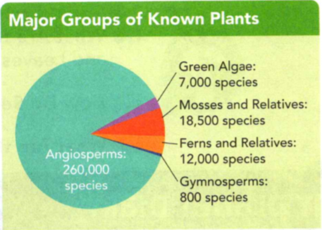
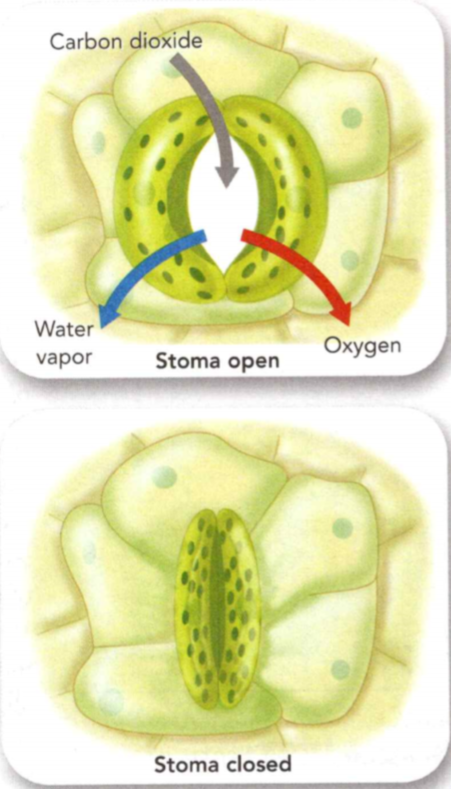
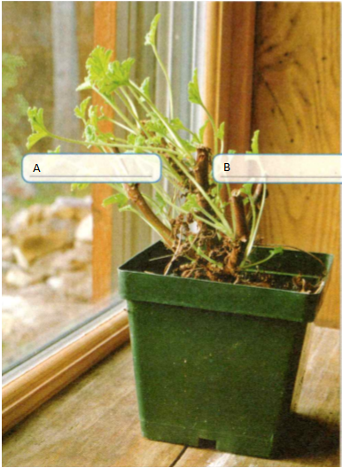
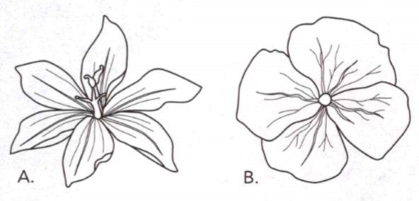

### Life Science

## Biology

## Plants

- An organism is a living thing.
- A pigment is a colored chemical compound that absorbs light.
- An autotroph is an organism that makes its own food.

**Complete the tasks below.**

1. Rahi m and Malika were in the park after school. "Plants are such cool
organisms," said Rahim. "Can you imagine if humans had green pigment in their
skin?" "Yeah:' said Malika. "If we were autotrophs, I'd never have to get up
early to pack my lunch!". Give an example of an autotrophic organism that has
green pigment.

2. Chlorophyll is a pigment found in plants. Which part of the word chlorophyll
tells you that it is a green pigment?

### Chapter Preview

- chlorophyll 
- photosynthesis
- tissue 
- chloroplast 
- vacuole
- cuticle 
- vascular tissue
- nonvascular plant 
- rhizoid
- vascular plant 
- phloem
- xylem 
- frond 
- pollen 
- seed
- gymnosperm 
- angiosperm
- cotyledon 
- monocot
- dicot
- root cap 
- cambium 
- stoma
- transpiration 
- embryo
- germination 
- flower
- pollination 
- sepal 
- petal
- stamen 
- pistil 
- ovary
- sporophyte 
- gametophyte
- annual 
- biennial 
- perennial
- fertilization 
- zygote
- cone 
- ovule 
- fruit
- tropism 
- hormone
- auxin 
- photoperiodism
- critical night length
- short-day plant 
- long-day plant
- day-neutral plant 
- dormancy
- peat

### What Is a Plant?

- What Characteristics Do All Plants Share?
- What Do Plants Need to Live Successfully on Land?

**Complete the tasks below.**

1. How Does Your Garden Grow? Students at The Hilldale School in Daly City,
alifornia, get to play in the dirt during class. The students planted and
maintain a garden filled with native species. Native plants, or plants that have
been in an area for a long time, can struggle to survive if new plants are
introduced. This creates problems for the insects, animals, and other organisms
that rely on the native plants. The students spent three months removing
nonnative plants before creating a garden that will help local organisms right
outside their school. Describe a plant project you would like to do at your
school.

### What Characteristics Do All Plants Share?

Which organisms were the ancestors of today's plants? In search of answers,
biologists studied fossils, the traces of ancient life forms preserved in rock
and other substances. The oldest plant fossils are about 400 million years old.
These fossils show that even at that early date, plants already had many
adaptations for life on land.

Better clues to the origin of plants came from comparing the chemicals in modern
plants to those in other organisms. Biologists studied a pigment called
chlorophyll. **Chlorophyll** is a green pigment found in the chloroplasts of
plants, algae, and some bacteria. Land plants and green algae contain the same
forms of chlorophyll. Further comparisons of genetic material clearly showed
that plants and green algae are very closely related. Today, green algae are
classified as plants. Members of the plant kingdom share several
characteristics.

**Nearly all plants are autotrophs, organisms that produce their own food. With
the exception of some green algae, all plants contain many cells. In addition,
all plant cells are surrounded by cell walls.**

### Plants Are Autotrophs 

You can think of a typical plant as a sun-powered, food-making factory. Sunlight
provides the energy for this food-making process, called **photosynthesis**.
During photosynthesis, a plant uses carbon dioxide gas and water to make food
and oxygen.

**Complete the tasks below.**

  <figure>
    
    <figcaption>Figure 1. Fossil leaf.</figcaption>
  </figure>

1. How do you think the ancient environment of the leaf in the fossil differed
from that of the modern leaf in the pictures in Figure 1?

### Plants Are Multicellular 

Except for some green algae, all plants are made of many cells. No matter how
large or small a plant is, its cells are organized into **tissues**. Tissues are
groups of similar cells that perform a specific function in an organism.

### Plant Cells 

Unlike the cells of animals, a plant's cells are enclosed by a cell wall. See
Figure 2. The cell wall surrounds the cell membrane and separates the cell from
the environment. Plant cell walls contain cellulose, a material that makes the
walls rigid. Because their cell walls are rigid, plant cells look like small
boxes. Cell walls make apples and carrots crunchy. Plant cells also contain many
other structures. Chloroplasts, which look like green jelly beans, are the
structures in which food is made. A **vacuole** is a large storage sac that can
expand and shrink. The vacuole stores many substances, including water, wastes,
and food. A plant wilts when too much water has left its vacuoles.

  <figure>
    
    <figcaption>Figure 2. Plant cells.</figcaption>
  </figure>

**Complete the tasks below.**

1. Plant cells are different from animal cells see Figure 2. Cell walls make
onions crunchy. How does having cell walls affect a plant's ability to grow
tall?

2. Almost all plants (make/do not make) their own food.

3. What is the function of the cell wall in a plant cell?

4. What do you think happens to a plant cell if the plant is given too much
water?

### What Do Plants Need to Live Successfully on Land?

Imagine multicellular algae floating in the ocean. The algae obtain water and
other materials directly from the water around them. They are held up toward the
sunlight by the water. Now imagine plants living on land. What adaptations would
help them meet their needs without water all around them? **For plants to
survive on land, they must have ways to obtain water and other nutrients from
their surroundings, retain water, support their bodies, transport materials, and
reproduce.**

### Obtaining Water and Other Nutrients 

Recall that all organisms need water to survive. Obtaining water is easy for
algae because water surrounds them. To live on land, plants need adaptations for
obtaining water from the soil. One adaptation is the way the plant produces its
roots, as shown in Figure 2. Plants must also have ways of obtaining other
nutrients from the soil.

  <figure>
    
    <figcaption>Figure 3. Getting Water in the Desert.</figcaption>
  </figure>

**Complete the tasks below.**

1. The saguaro cactus and the acacia tree both livead in quickly absorb water
over a wide area. Acacia trees in the Negev Desert of Israel get their water
from deep underground instead of at the surface. In Figure 3 draw the roots of
the acacia tree. Then describe how the growth of the roots differs between the
plants.

### Waterproof Leaves

  <figure>
    
    <figcaption>Figure 4. Leaf.</figcaption>
  </figure>

The waxy cuticle of many leaves, like the one in Figure 4, looks shiny under
light.

### Retaining Water 

When there is more water in plant cells than in the air, the water leaves the
plant and enters the air. The plant could dry out if it cannot hold onto water.
One adaptation that helps a plant reduce water loss is a waxy, waterproof layer
called the **cuticle**. You can see the cuticle on the leaf in Figure 4.

### Support 

A plant on land must support its own body. It's easier for small, low-growing
plants to support themselves. In larger plants, the food-making parts must be
exposed to as much sunlight as possible. Cell walls and tissue strengthen and
support the large bodies of these plants.

**Complete the tasks below.**

  <figure>
    
    <figcaption>Figure 5. Water Loss.</figcaption>
  </figure>

1. This graph in Figure 5 shows how much water a plant loses during the day. 
a) Give the graph a title.
b) During what part of the day did the plant lose the most water?
c) How might the line in the graph look from 10 P.M. to 8 A.M.? Why?
d) Do you think this graph would be the same for plants all around the world? Why?

### Transporting Materials 

A plant needs to transport water, minerals, food, and other materials from one
part of its body to another. In general, water and minerals are taken up by the
bottom part of the plant, while food is made in the top part. But all of the
plant's cells need water, minerals, and food.

In small plants, materials can simply move from one cell to the next. Larger
plants need a more efficient way to transport materials from one part of the
plant to another. These plants have tissue for transporting materials called
vascular tissue. **Vascular tissue** is a system of tubelike structures inside a
plant through which water, minerals, and food move. See vascular tissue in
action in Figure 6.

  <figure>
    
    <figcaption>Figure 6. Colorful Carnations.</figcaption>
  </figure>

### Reproduction 

For algae and some other plants, reproduction can only occur if there is water
in the environment. This is because the sperm cells of these plants swim through
the water to the egg cells. Land plants need to have adaptations that make
reproduction possible in dry environments.

**Complete the tasks below.**

1. In Figure 6, these three carnations were left overnight in glasses of water.
Blue dye was added to the glass in the middle. The stem of the flower on the
right was split in half. Part of the stem was placed in water with blue dye and
the other part was placed in water with red dye. Why did the flowers in the
glasses with dye change color?

2. What is a cuticle?

3. Describe the pros and cons of being a tall land plant.

4. To live on land, plants need to _____ .

### Classifying Plants

- What Are the Characteristics of Nonvascular Plants?
- What Are the Characteristics of Seedless Vascular Plants?
- What Are the Characteristics of Seed Plants?

**Complete the tasks below.**

1. The Moss Is Greener on the Other Side Tired of mowing the lawn? Never want to
pull out another weed? Hire a moss landscaper! Landscapers design beautiful
yards, usually planting trees, flowers, bushes, and grasses. These plants need a
lot of care. Moss doesn't. Moss grows in the shade where other plants can't.
Landscapers can use moss to cover an entire yard if the conditions are right.
Mosses are also better for the environment. People don't have to put toxic
chemicals on their moss lawns to kill weeds or keep it green. Do you think people
should use moss instead of grass for their lawns? Why?

### What Are the Characteristics of Nonvascular Plants?

Plants that lack vascular tissue for transporting materials are known as
**nonvascular plants**. **Nonvascular plants are low-growing, have thin cell walls,
and do not have roots for absorbing water from the ground.** Instead, they obtain
water and materials directly from their surroundings. The materials then pass
from one cell to the next. This means that materials do not travel far or
quickly. This slow method helps explain why most nonvascular plants live in
damp, shady places. The thin cell walls are why these plants cannot grow more
than a few centimeters tall.

### Mosses 

Have you ever seen mosses growing in the cracks of a sidewalk or in a shady
spot? With more than 10,000 species, mosses are by far the most diverse group of
nonvascular plants.

  <figure>
    
    <figcaption>Figure 7. Moss Structure.</figcaption>
  </figure>

If you were to look closely at a moss, you would see a plant that looks
something like Figure 7. Structures that look like tiny leaves grow off a small,
stemlike structure. Thin, rootlike structures called **rhizoids** anchor the moss
and absorb water and nutrients. Moss grows a long, slender stalk with a capsule
at the end. The capsule contains spores for reproduction.

**Complete the tasks below.**

  <figure>
    
    <figcaption>Figure 8. Moss Structure photo.</figcaption>
  </figure>

1. Label the capsule, stalk, and leaflike structure in the photo. 

### Liverworts and Hornworts 

Liverworts and hornworts are two other groups of nonvascular plants. There are
more than 8,000 species of liverworts. This group of plants is named for the
shape of the plant's body, which looks somewhat like a human liver. Wort is an
old English word for "plant." Liverworts are often found growing as a thick
crust on moist rocks or soil along the sides of a stream. There are fewer than
100 species of hornworts. If you look closely at a hornwort, you can see
slender, curved structures that look like horns growing out of the plant. Unlike
mosses or liverworts, hornworts are seldom found on rocks or tree trunks.
Instead, hornworts usually live in moist soil, often mixed in with grass plants.

  <figure>
    
    <figcaption>Figure 9. Liverwort and Hornwort.</figcaption>
  </figure>

**Complete the tasks below.**

  <figure>
    
    <figcaption>Figure 10. Nonvascular plants.</figcaption>
  </figure>

1. Fill in the table in Figure 10 about liverworts and hornworts.

2. (Vascular tissues/Rhizoids) anchor moss and absorb water and nutrients.

3. Why are most nonvascular plants short?

4. How are liverworts and hornworts different?

5. The characteristics of nonvascular plants are ___ .

### What Are the Characteristics of Seedless Vascular Plants?

If you could have walked through the ancient forests that existed long before
the dinosaurs lived, they would have looked very strange to you. You might have
recognized the mosses and liverworts that carpeted the moist soil, but you would
have seen very tall, odd-looking trees. Among the trees grew huge, tree-sized
ferns. Other trees resembled giant sticks with leaves up to one meter long. The
odd-looking plants in the ancient forests are the ancestors of the ferns,
clubmosses, and horsetails of today. **Ferns, club mosses, and horsetails share
two characteristics. They have vascular tissue and they do not produce seeds.
Instead of seeds, these plants reproduce by releasing spores.**

### Vascular Tissue 

Ancient trees were vascular plants. **Vascular plants** are plants with true
vascular tissue. Vascular plants can grow tall because their vascular tissue
provides an effective way of transporting materials throughout the plant. The
vascular tissue also strengthens the plants' bodies. You can see vascular tissue
in Figure 11. The cells making up the vascular tissue have strong cell walls.
Imagine a handful of drinking straws bundled together with rubber bands. The
bundle of straws is stronger and more stable than a single straw would be.
Arranged similarly, the strong, tubelike structures in vascular plants give the
plants strength and stability.

There are two types of vascular tissue. **Phloem** is the vascular tissue through
which food moves. After food is made in the leaves, it enters the phloem and
travels to other parts of the plant. Water and minerals, on the other hand,
travel in the vascular tissue called **xylem**. The roots absorb water and minerals
from the soil. These materials enter the root's xylem and move upward into the
stems and leaves.

  <figure>
    
    <figcaption>Figure 11. Vascular Tissue.</figcaption>
  </figure>

### Ferns 

There are more than 12,000 species of ferns alive today. They range in size from
tiny plants about the size of this letter M to tree ferns that grow up to five
meters tall. Ferns thrive in shaded areas with moist soil. Some remain green
year-round while others turn brown in the fall and regrow in spring.

### The Structure of Ferns 

Like other vascular plants, ferns have stems, roots, and leaves. The stems of
most ferns are underground. Leaves grow upward from the top side of the stems,
while roots grow downward from the bottom of the stems. Water and nutrients
enter the root's vascular tissue and travel through the tissue into the stems
and leaves.

Figure 12 shows a fern's structure. Notice that the fern's leaves, or **fronds**,
are divided into many smaller parts that look like small leaves. The upper
surface of each frond is coated with a cuticle that helps the plant retain
water. In many ferns, the developing leaves are coiled at first. Because they
resemble the top of a violin, these young leaves are often called fiddleheads.
Fiddleheads uncurl as they mature.

  <figure>
    
    <figcaption>Figure 12. Fern Structure.</figcaption>
  </figure>

**Complete the tasks below.**

1. Suppose you ran a flower shop that sold cut flowers and potted plants. You
have just received a shipment of potted ferns and several customers are
interested in purchasing them. Before they are ready to be sold, you need to
make sure your customers can take care of the ferns so they won't regret their
purchase.
a) Write the care instructions that will be given to your customers who buy potted
ferns. Include the conditions that the fern needs for light and water.
b) Florists recommend not putting plants like ferns in south- or west-facing
   windows. Why?

### Club Mosses and Horsetails 

Like ferns, club mosses and horsetails have true stems, roots, and leaves.
However, there are relatively few species of club mosses and horsetails alive
today.

Do not be confused by the name club moss. Unlike true mosses, club mosses have
vascular tissue. You may be familiar with the club moss in Figure 4. The plant,
which looks a little like a small branch of a pine tree, is sometimes called
ground pine or princess pine. Club mosses usually grow in moist woodlands and
near streams.

There are about 30 species of horsetails on Earth today. The whorled pattern of
growth somewhat resembles the appearance of a horse's tail. The stems contain
silica, a gritty substance also found in sand. During colonial times, Americans
used the plants to scrub their pots and pans. Another common name for horsetails
is scouring brushes.

  <figure>
    
    <figcaption>Figure 13. Moss Imposter?.</figcaption>
  </figure>

**Complete the tasks below.**

1. A club moss is pictured in Figure 13. Why is a club moss not a true moss?

2. In plants, water moves through (phloem/xylem). Food moves through (phloem/xylem).

3. Why do you think the developing leaves of a fern are coiled?

4. Why do you think there are more ferns than club mosses?

5. The characteristics of seedless vascular plants include ___ .

6. The word gymnosperm comes from the Greek words gumnos, meaning "naked," and
sperma, meaning "seed." Why are the seeds of gymnosperms considered to be naked?

### What Are the Characteristics of Seed Plants?

Seed plants outnumber seedless plants by more than ten to one. You eat many seed
plants-rice, peas, and squash, for example. You wear clothes made from seed
plants, such as cotton and flax. You may live in a home built from seed
plants-oak, pine, or maple trees. In addition, seed plants produce much of the
oxygen you breathe.

Seed plants share two important characteristics. **Seed plants have vascular
tissue, and they use pollen and seeds to reproduce.** In addition, the bodies of
all seed plants have roots, stems, and leaves. Most seed plants live on land.
Recall that land plants face many challenges, including standing upright and
supplying all their cells with food and water. Like ferns, seed plants meet
these two challenges with vascular tissue.

### Pollen and Seeds 

Unlike seedless plants, seed plants can live in a wide variety of environments.
Recall that seedless plants need water in their surroundings for fertilization
to occur. Seed plants do not need water for sperm to swim to the eggs. Instead,
seed plants produce **pollen**, tiny structures that contain the cells that will
later become sperm cells. Pollen deliver sperm cells directly near the eggs.
After sperm cells fertilize the eggs, seeds develop. A **seed** is a structure that
contains a young plant inside a protective covering. Seeds protect the young
plant from drying out.

### Gymnosperms 

The giant sequoia trees belong to the group of seed plants known as gymnosperms.
A **gymnosperm** is a seed plant that produces naked seeds. The seeds of
gymnosperms are referred to as "naked" because they are not enclosed by a
protective fruit.

Many gymnosperms have needlelike or scalelike leaves and deep-growing root
systems. Gymnosperms are the oldest type of seed plant. According to fossil
evidence, gymnosperms first appeared on Earth about 360 million years ago.
Fossils also indicate that there were many more species of gymnosperms on Earth
in the past than there are today. Four types of gymnosperms exist today, as
shown in Figures 14-17.

### Cycads

  <figure>
    
    <figcaption>Figure 14. Cycads.</figcaption>
  </figure>

About 175 million years ago, the majority of plants were cycads (sY kadz).
Today, cycads grow mainly in tropical and subtropical areas. Cycads look like
palm trees with cones that can grow as large as a football!

### Conifers

  <figure>
    
    <figcaption>Figure 15. Conifers.</figcaption>
  </figure>

Conifers, or cone-bearing plants, are the largest and most diverse group of
modern gymnosperms. Most conifers are evergreens, meaning they keep their leaves
or needles year-round.

### Ginkgoes

  <figure>
    
    <figcaption>Figure 16. Ginkgoes.</figcaption>
  </figure>

Ginkgoes also grew hundreds of millions of years ago. Today, only one species,
Ginkgo biloba, exists. It probably survived because the Chinese and Japanese
cared for it in their gardens. Today, ginkgo trees are planted along city
streets because they can tolerate air pollution.

### Gnetophytes

  <figure>
    
    <figcaption>Figure 17. Gnetophytes.</figcaption>
  </figure>

Gnetophytes live in hot deserts and in tropical rain forests. Some are trees,
some are shrubs, and others are vines. The Welwitschia (shown at left) of West
Africa can live for more than 1,000 years!

**Complete the tasks below.**
	
1. Which group of gymnosperms has the most species?

2. What could have happened to the ecosystem the Ginkgo biloba tree lived in if
the tree had become extinct?

### Angiosperms 

You probably associate the word flower with a sweet-smelling plant growing in a
garden. You certainly wouldn't think of something that smells like rotting meat.
That's exactly what the corpse flower, or rafflesia, smells like. This flower,
which grows in Asia, produces a meat smell, which attracts flies that spread the
flower's pollen. You won't be seeing rafflesia in your local florist shop any
time soon! Rafflesia belongs to the group of seed plants known as angiosperms.
**Angiosperms**, or flowering plants, share two important characteristics.
First, they produce flowers. Second, in contrast to gymnosperms, which produce
uncovered seeds, angiosperms produce seeds that are enclosed in fruits.

Angiosperms live almost everywhere on Earth. They grow in frozen areas in the
Arctic, tropical jungles, and barren deserts. A few angiosperms, such as
mangrove trees, live at the ocean's edge.

### Types of Angiosperms 

Angiosperms are divided into two major groups: monocots and dicots. "Cot" is
short for cotyledon. The cotyledon, or seed leaf, provides food for the embryo.
Mono- means "one" and di- means "two." Monocots are angiosperms that have only
one seed leaf. Grasses, including corn, wheat, and rice, and plants such as
lilies and tulips, are monocots. Dicots, on the other hand, produce seeds with
two seed leaves. Dicots include plants such as roses and violets, as well as
dandelions. Both oak and maple trees are dicots, as are food plants such as
beans and apples. Figure 6 shows the characteristics of monocots and dicots.

  <figure>
    
    <figcaption>Figure 18. Characteristics of Monocots and Dicots.</figcaption>
  </figure>

**Complete the tasks below.**

  <figure>
    
    <figcaption>Figure 19. Monocots and Dicots.</figcaption>
  </figure>

1. Use the table in Figure 18 to find your answer. Label the rafflesia (top) and
the other flowers in Figure 19 as monocots or dicots.

  <figure>
    
    <figcaption>Figure 20. Major groups of known plants.</figcaption>
  </figure>

2. Use the graph of known plant species in Figure 20 to answer the questions.
a) Which plant group has the fewest species?
b) Figure out the percentage that each of the following plant groups represents.
Round your answer to the nearest tenth. Green algae/Ferns and relatives/Angiosperms
c) Why do you think angiosperms are the largest group?

3. What are pollen?

4. Why do you think angiosperms enclose their seeds in fruits?

5. The characteristics of seed plants include

### Plant Structures
- What Are the Functions of Roots, Stems, and Leaves?
- How Do Seeds Become New Plants? 
- What Are the Structures of a Flower?

**Complete the tasks below.**

1. Plant Giants - The aroid plant (as shown here) on the island of Borneo in
Asia has leaves that can grow three meters long! These are the largest undivided
leaves on Earth! - The rafflesia flower can grow up to one meter wide and weigh
seven kilograms. - The jackfruit can weigh up to 36 kilograms. That's the
world's largest fruit that 'rows on trees! Why do you think the aroid plant has
such big leaves?

### What Are the Functions of Roots, Stems, and Leaves?

Each part of a plant plays an important role in its structure and function.
Roots, stems, and leaves are just three structures we will look into further.

### Roots 
Have you ever tried to pull a dandelion out of the soil? It's not easy, is it?
That is because most roots are good anchors. **Roots have three main functions.
Roots anchor a plant in the ground, absorb water and minerals from the soil, and
sometimes store food.** The more root area a plant has, the more water and
minerals it can absorb.

### Types of Roots 

The two main types of root systems are shown in Figure 1. A fibrous root system
consists of many similarly sized roots that form a dense, tangled mass. Plants
with fibrous roots take a lot of soil with them when you pull them out of the
ground. Lawn grass, corn, and onions have fibrous root systems. In contrast, a
taproot system has one long, thick main root. Many smaller roots branch off the
main root. A plant with a taproot system is hard to pull out of the ground.
Carrots, dandelions, and cacti have taproots.

  <figure>
    
    <figcaption>Figure 21. Root Systems and Structure.</figcaption>
  </figure>

### Root Structure

In Figure 22, you can see the structure of a typical root. The tip of the root
is rounded and is covered by the root cap. The root cap protects the root from
injury as the root grows through the soil. Behind the root cap are the cells
that divide to form new root cells.

  <figure>
    
    <figcaption>Figure 22. xxx.</figcaption>
  </figure>

Root hairs grow out of the root's surface. These tiny hairs can enter the spaces
between soil particles, where they absorb water and minerals. The root hairs
also help to anchor the plant in the soil.

Locate the vascular tissue in the center of the root. The water and nutrients
that are absorbed from the soil quickly move into the xylem. From there, these
substances are transported upward to the plant's stems and leaves. Phloem
transports food manufactured in the leaves to the root. The root tissues then
use the food for growth or store it for future use by the plant.

**Complete the tasks below.**

1. There are two main root systems with many structures. In Figure 21 label the
taproot T and the fibrous roots F.

2. Roots have many structures see Figure 2. What is the function of the root
cap?

### Stems 

The stem of a plant has two main functions. **The stem carries substances
between the plant's roots and leaves. The stem also provides support for the
plant and holds up the leaves so they are exposed to the sun.** In addition, some
stems, such as those of asparagus, store food.

### The Structure of a Stem 

Stems can be either woody or herbaceous. Woody stems are hard and
rigid, such as in maple trees. Herbaceous stems contain no wood and are often
soft. Plants with herbaceous stems include daisies, ivy, and asparagus (pictured
left).

  <figure>
    
    <figcaption>Figure 23. Stem Structure.</figcaption>
  </figure>

Herbaceous and woody stems consist of phloem and xylem tissue as well as many
other supporting cells. As you can see in Figure 23, a woody stem contains many
layers of tissue. The outermost layer is bark. Bark includes an outer protective
layer and an inner layer of living phloem, which transports food through the
stem. Next is a layer of cells called the **cambium**, which divides to produce new
phloem and xylem. It is xylem that makes up most of what you call "wood."
Sapwood is active xylem that transports water and minerals through the stem. The
older, darker, heartwood is inactive but provides support.

  <figure>
    
    <figcaption>Figure 24. Annual Rings.</figcaption>
  </figure>

### Annual Rings 

Have you ever looked at a tree stump and seen a pattern of circles that looks
something like a target? These circles are called annual rings. They represent a
tree's yearly growth. Annual rings are made of xylem. Xylem cells that form in
the spring are large and have thin walls because they grow rapidly. They produce
a wide, light brown ring. Xylem cells that form in the summer grow slowly and,
therefore, are small and have thick walls. They produce a thin, dark ring. One
pair (of light and dark rings represents one year's growth. You can estimate a
tree's age by counting its annual rings. The width of a tree's annual rings can
provide important clues about past weather conditions, such as rainfall. In
rainy years, more xylem is produced, so the tree's annual rings are wide. In dry
years, rings are narrow. By examining annual rings from some trees in the
southwestern United States, scientists were able to infer that severe droughts
occurred in the years 840, 1067, 1379, and 1632.

**Complete the tasks below.**

1. The woody stem of a tree contains many different structures, see Figure 23.
Label the active xylem and phloem on the tree trunk.

2. The annual rings in a tree reveal the tree's history, see Figure 24.
a) How old was the tree when it was cut down?
b) The area at Area C is blackened from a fire that affected one side of the
tree. Describe how the tree grew after the fire.
c) Areas A and B both represent four years of growth. What might account for
their difference in size?

3. The Greek word stoma means "mouth." How are the stomata of a plant like
mouths?

### Leaves 
Leaves vary greatly in size and shape. Pine trees have needle-shaped leaves.
Birch trees have small rounded leaves with jagged edges. Regardless of their
shape, leaves play an important role in a plant. **Leaves capture the sun's
energy and carry out the food-making process of photosynthesis.**

### The Structure of a Leaf 

If you were to cut through a leaf and look at the edge under a microscope, you
would see the structures in Figure 4. The leaf's top and bottom surface layers
protect the cells inside. Between the layers of cells are veins that contain
xylem and phloem.

The surface layers of the leaf have small openings, or pores, called stomata
(singular stoma). The stomata open and close to control when gases
enter and leave the leaf. When the stomata are open, carbon dioxide enters the
leaf, and oxygen and water vapor exit.

  <figure>
    
    <figcaption>Figure 25. Leaf Structure.</figcaption>
  </figure>

### Upper Leaf Cells
Tightly packed cells trap the energy in sunlight.

### Lower Leaf Cells
Widely spaced cells allow carbon dioxide to reach cells for photosynthesis and
oxygen to escape into the air.

**Complete the tasks below.**

1. Each structure helps a leaf produce food, see Figure 25.
(Cuticles/Chloroplasts) are the structures in which food is made.
(Cuticles/Chloroplasts) are the waxy layers that help plants reduce water loss.

### The Leaf and Photosynthesis 

The structure of a leaf is ideal for carrying out photosynthesis. The cells that
contain the most chloroplasts are located near the leaf's upper surface, where
they get the most light. The chlorophyll in the chloroplasts traps the sun's
energy.

Carbon dioxide enters the leaf through open stomata. Water, which is absorbed by
the plant's roots, travels up the stem to the leaf through the xylem. During
photosynthesis, sugar and oxygen are produced from the carbon dioxide and water.
Oxygen passes out of the leaf through the open stomata. The sugar enters the
phloem and then travels throughout the plant.

### Controlling Water Loss 

Because such a large area of a leaf is exposed to the air, water can quickly
evaporate from a leaf into the air. The process by which water evaporates from a
plant's leaves is called **transpiration**. A plant can lose a lot of water through
transpiration. A corn plant, for example, can lose almost 4 liters of water on a
hot summer day. Without a way to slow down the process of transpiration, a plant
would shrivel up and die.

Fortunately, plants have ways to slow down transpiration. One way plants retain
water is by closing the stomata. The stomata often close when leaves start to
dry out.

  <figure>
    
    <figcaption>Figure 26. Stomata.</figcaption>
  </figure>

**Complete the tasks below.**

1. Stomata can slow water loss, see Figure 26. What three substances enter and
leave a plant through stomata?

2. What are the functions of a stem? 

3. If you forget to water a houseplant for a few days, would its stomata be open
or closed? Why?

4. Roots, stems, and leaves perform functions like ____ .

### How Do Seeds Become New Plants?

Many plants begin their life cycle as a seed. You can follow the cycle from seed
to plant in Figure 27. All seeds share important similarities. **Inside a seed
is a partially developed plant. If a seed lands in an area where conditions are
favorable, the plant sprouts out of the seed and begins to grow.**

  <figure>
    
    <figcaption>Figure 27. Story of a Seed.</figcaption>
  </figure>

### Seed Structure 

A seed has three main parts-an embryo, stored food, and a seed coat. The young
plant that develops from the zygote, or fertilized egg, is called the **embryo**.
The embryo already has the beginnings of roots, stems, and leaves. In the seeds
of most plants, the embryo stops growing when it is quite small. When the embryo
begins to grow again, it uses the food stored in the seed until it can make its
own food by photosynthesis. In all seeds, the embryo has one or more seed
leaves, or cotyledons. In some seeds, food is stored in the cotyledons. In
others, food is stored outside the embryo.

The outer covering of a seed is called the seed coat. The seed coat acts like
plastic wrap, protecting the embryo and its food from drying out. This allows a
seed to remain inactive for a long time. In many plants, the seeds are
surrounded by a structure called a fruit.

### Seed Dispersal 

After seeds form, they are usually scattered. The scattering of seeds is called
seed dispersal. Seeds can be dispersed in many different ways. When animals eat
fruit, the seeds inside the fruit pass through the animal's digestive system and
are deposited in new areas. Other seeds are enclosed in barblike structures that
hook onto fur or clothing. The seeds fall off in a new area. Water also
disperses seeds that fall into oceans and rivers. Wind disperses lightweight
seeds, such as those of dandelions and maple trees. Some plants eject their
seeds. The force scatters the seeds in many directions. A seed that is dispersed
far from its parent plant has a better chance of survival. Far away, a seed does
not have to compete with its parent for light, water, and nutrients.

### Germination 
After a seed is dispersed, it may remain inactive for a while before it
germinates. **Germination** occurs when the embryo begins to grow again and
pushes out of the seed. Germination begins when the seed absorbs water. Then the
embryo uses stored food to begin to grow. The roots first grow downward. Then
its stem and leaves grow upward.

**Complete the tasks below.**

1. On the diagram in Figure 27, label the seed's embryo, cotyledons, and seed coat.

  <figure>
    
    <figcaption>Figure 28. Seed.</figcaption>
  </figure>

2. See Figure 28. Give two reasons why this seed can be successfully dispersed by wind.

  <figure>
    
    <figcaption>Figure 29. Young plants.</figcaption>
  </figure>

3. In Figure 29, which young plant, A or B, is more likely to grow into an adult
plant? Why?

4. A seed becomes a new plant when ____ .

### What Are the Structures of a Flower?

Flowers come in all sorts of shapes, sizes, and colors. But, despite their
differences, all flowers have the same function - reproduction. A **flower** is
the reproductive structure of an angiosperm. **A typical flower contains sepals,
petals, stamens, and pistils.**

The colors and shapes of most flower structures and the scents produced by most
flowers attract insects and other animals. These organisms ensure that
pollination occurs. **Pollination** is the transfer of pollen from male
reproductive structures to female reproductive structures. Pollinators, such as
those shown in Figure 30, include birds, bats, and insects such as bees and
flies. As you read, keep in mind that some flowers lack one or more of the
parts. For example, some flowers have only male reproductive parts, and some
flowers do not have petals.

  <figure>
    
    <figcaption>Figure 30. Pollinator Matchup.</figcaption>
  </figure>

### Sepals and Petals 

When a flower is still a bud, it is enclosed by leaflike structures called
**sepals**. Sepals protect the developing flower and are often green in color. When
the sepals fold back, they reveal the flower's colorful, leaflike **petals**. The
petals are generally the most colorful parts of a flower. The shapes, sizes, and
number of petals vary greatly between flowers.

### Stamens 

Within the petals are the flower's male and female reproductive parts. The
**stamens** are the male reproductive parts. Locate the stamens inside the
flower in Figure 31. The thin stalk of the stamen is called the filament. Pollen
is made in the anther, at the top of the filament.

  <figure>
    
    <figcaption>Figure 31. Structures of a Typical Flower.</figcaption>
  </figure>

### Pistils 

The female parts, or **pistils**, are found in the center of most flowers, as
shown in Figure 31. Some flowers have two or more pistils; others have only one.
The sticky tip of the pistil is called the stigma. A slender tube, called a
style, connects the stigma to a hollow structure at the base of the flower. This
hollow structure is the **ovary**, which protects the seeds as they develop. An
ovary contains one or more ovules.

**Complete the tasks below.**

1. Some pollinators are well adapted to the plants they pollinate. For example,
the long tongue of the nectar bat helps the bat reach inside the agave plant, as
shown in Figure 30. Write the letter of the pollinator on the plant it is
adapted to pollinate.

2. See Figure 31. Use the word bank to fill in the missing labels. (Pistils,
petals, stamens, sepals). ___ are the small, leaflike parts of a flower. They
protect the developing flower. ___ are usually the most colorful parts of a
flower. Pollinators are attracted by their color and scent. ___ are the male
reproductive parts of a flower. Pollen is produced in the anther, at the top of
the stalklike filament. ___ are the female reproductive parts of a flower. They
consist of a sticky stigma, a slender tube called the style, and a hollow
structure called the ovary at the base.

3. The structures of a flower include ___ .

### Plant Reproduction
- What Are the Stages of a Plant Life Cycle? 
- How Do Plants Reproduce?

**Complete the tasks below.**

1. If Trees Could Talk Suppose you had been alive during the ancient Egyptian
Empire, the Middle Ages, the American Revolution, and both World Wars. Think of
the stories you could tell! Bristlecone pine trees can be this old. In 1964, a
student got permission to cut down one of these trees. He counted the tree rings
to see how old the tree was, and discovered it was 4,900 years old. He had just
cut down the oldest living thing in the world! Today, Bristlecone pine forests
are protected. What could you learn from a 5,000-year-old tree?

### What Are the Stages of a Plant's Life Cycle?

Like other living things, plants develop and reproduce through life stages.
**Plants have complex life cycles that include two different stages, the
sporophyte stage and the gametophyte stage.** In the **sporophyte** stage, the
plant produces spores. The spore develops into the plant's other stage, called
the gametophyte. In the **gametophyte** stage, the plant produces two kinds of
sex cells: sperm cells and egg cells. See Figure 32.

  <figure>
    
    <figcaption>Figure 32. Plant Life Cycle.</figcaption>
  </figure>

- Produces spores
- The sporophyte produces spores, which develop into the gametophyte.
- The gametophyte produces sperm cells and egg cells.
- The sperm fertilizes the egg.
- The fertilized egg develops into a sporophyte.

Angiosperms are classified based on the length of their life cycles. Flowering
plants that complete a life cycle within one growing season are called **annuals**.
Annuals include marigolds, petunias, wheat, and cucumbers. Angiosperms that
complete their life cycle in two years are called **biennials**. In
the first year, biennials germinate and grow roots, very short stems, and
leaves. During their second year, biennials lengthen their stems, grow new
leaves, and then produce flowers and seeds. Parsley, celery, and foxglove are
biennials. Flowering plants that live for more than two years are called
**perennials**. Most perennials flower every year.

**Complete the tasks below.**

1. All plants go through two stages in their life cycle, see Figure 32. Label
the sporophyte and gametophyte stages.

2. Stages of a plant's life cycle include ___ .

### How Do Plants Reproduce?

Plants reproduce in different ways depending on their structures and the
environment they live in. **All plants undergo sexual reproduction that involves
fertilization.** **Fertilization** occurs when a sperm cell unites with an egg
cell. The fertilized egg is called a **zygote**. For algae and some plants,
fertilization can only occur if there is water in the environment. This is
because the sperm cells of these plants swim through the water to the egg cells.
Other plants, however, have an adaptation that makes it possible for
fertilization to occur in dry environments.

Many plants can also undergo asexual reproduction. Recall that asexual
reproduction includes only one parent and produces offspring that are identical
to the parent. New plants can grow from the roots, leaves, or stems of a parent
plant. Asexual reproduction does not involve flowers, pollination, or seeds, so
it can happen faster than sexual reproduction. A single plant can quickly spread
out in an environment if there are good conditions. However, asexual
reproduction can reproduce unfavorable traits since there is no new genetic
information being passed to offspring.

Scientists can take advantage of asexual reproduction in plants. A single plant
can be used to create identical plants for experiments. Scientists can also copy
plants with favorable characteristics. Grafting is one way of copying plants. In
grafting, part of a plant's stem is cut and attached to another related plant
species, such as a lemon tree and an orange tree. The plant matures and can then
produce more than one kind of fruit.

  <figure>
    
    <figcaption>Figure 33. Eyes on Potatoes.</figcaption>
  </figure>

**Complete the tasks below.**

1. A potato is actually the underground stem of the potato plant? If you have
ever left a potato out long enough, you may have noticed it beginning to sprout.
A potato can grow new potato plants from buds called eyes, as seen in the photo
in Figure 33. Potato plants also produce flowers and reproduce sexually. How
does being able to reproduce asexually benefit the plant?

  <figure>
    
    <figcaption>Figure 34. Tree.</figcaption>
  </figure>

2. A citrus farmer was able to graft a lemon tree branch onto an orange tree,
see Figure 34. Now the same tree produces lemons and oranges! The farmer plans
to use branches from the same lemon trees to create other combined fruit trees.
a) The farmer used the lemon tree's ability to (sexually/asexually) reproduce.
b) Name at least one negative effect of using the same lemon tree to create new
trees the farmer should know about.
c) Why might the public be opposed to using this method to create new fruit trees?

### Nonvascular and Seedless Vascular Plants 
Mosses, liverworts, hornworts, ferns, club mosses, and horsetails need to grow
in moist environments. This is because the plants release spores into their
surroundings, where they groI into gametophytes. When the gametophytes produce
egg cells an sperm cells, there must be enough water available for the sperm t
swim toward the eggs.

For example, the familiar fern, with its visible fronds, is the sporophyte stage
of the plant. On the underside of mature fronds spores develop in tiny spore
cases. Wind and water can carry the spores great distances. If a spore lands in
moist, shaded soil, it develops into a gametophyte. Fern gametophytes are tiny
plants that grow low to the ground.

  <figure>
    
    <figcaption>Figure 35. Spore cases on the fronds of a fern.</figcaption>
  </figure>

### Gymnosperms 
You can follow the process of gymnosperm reproduction in Figure 36.

  <figure>
    
    <figcaption>Figure 36. Gymnosperm Reproduction Cycle.</figcaption>
  </figure>

#### Cone Production

Most gymnosperms have reproductive structures called **cones**. Cones are covered
with scales. Most gymnosperms produce two types of cones: male cones and female
cones. Usually, a single plant produces both male and female cones. In some
types of gymnosperms, however, individual trees produce either male cones or
female cones. A few gymnosperms produce no cones.

#### Pollen Production and Ovule Development

(A) Male cones produce pollen grains. Cells in the pollen will mature into sperm
cells. (B) The female gametophyte develops in structures called ovules. An **ovule**
is a structure that contains an egg cell. Female cones contain at
least one ovule at the base of each scale. The ovule later develops into the
seed.

#### Egg Production

Two egg cells form inside each ovule on the female cone.

#### Pollination

The transfer of pollen from a male reproductive structure to a female
reproductive structure is called pollination. In gymnosperms, wind often carries
the pollen from the male cones to the female cones. The pollen collect in a
sticky substance produced by each ovule.

#### Fertilization

Once pollination has occurred, the ovule closes and seals in the pollen. The
scales also close, and a sperm cell fertilizes an egg cell inside each ovule.
The zygote then develops into the embryo part of the seed.

#### Seed Development

Female cones remain on the tree while the seeds mature. As the seeds develop,
the female cone increases in size. It can take up to two years for the seeds of
some gymnosperms to mature. Male cones, however, usually fall off the tree after
they have shed their pollen.

#### Seed Dispersal

When the seeds are mature, the scales open. The wind shakes the seeds out of the
cone and carries them away. Only a few seeds will land in suitable places and
grow into new plants.

**Complete the tasks below.**

1. The reproduction cycle of a gymnosperm is shown in Figure 36. 
a) Explain the steps of pollination.
b) Explain the steps of fertilization.
c) What is the relationship between cones and ovules?

  <figure>
    
    <figcaption>Figure 37. Angiosperm Reproduction.</figcaption>
  </figure>

**Complete the tasks below.**

1. Reproduction in angiosperms begins with flowers, see Figure 37. What do the
yellow and purple colors of the arrows represent?

### Angiosperms 

You can follow angiosperm reproduction in Figure 37. First, pollen fall on a
flower's stigma. In time, the sperm cell and egg cell join together in the
flower's ovule. The zygote develops into the embryo part of the seed.

### Pollination 

A flower is pollinated when a grain of pollen falls on the stigma. Some
angiosperms are pollinated by the wind, but most rely on other organisms. When
an organism enters a flower to obtain food, it becomes coated with pollen. Some
of the pollen can drop onto the flower's stigma as the animal leaves. The pollen
can also be brushed onto the stigma of the next flower the animal visits.

### Fertilization 

If the pollen fall on the stigma of a similar plant, fertilization can occur. A
sperm cell joins with an egg cell inside an ovule within the ovary at the base
of the flower. The zygote then begins to develop into the seed's embryo. Other
parts of the ovule develop into the rest of the seed.

### Fruit Development and Seed Dispersal

As the seed develops, the ovary changes into a **fruit**. A fruit is the ripened
ovary and other structures that enclose one or more seeds. Fruits include
apples, cherries, tomatoes, squash, and many others. Fruits are the means by
which angiosperm seeds are dispersed. Animals that eat fruits help to disperse
their seeds by depositing them in new areas.

The Arabidopsis plant became the first plant to flower and produce seeds in the
zero-gravity environment of outer space on a Soviet space station in 1982.

  <figure>
    
    <figcaption>Figure 38. Flower to Fruit.</figcaption>
  </figure>

**Complete the tasks below.**

1. Flowers eventually develop into fruit, see Figure 38. Write the numbers 1
through 4 in the blank circles to show the progression from flower to fruit.

2. (Fertilization/Asexual reproduction) occurs when a sperm cell unites with an
egg cell.

3. Why do plants like liverworts need to live in moist environments?

4. Underline the cause and circle the effect in the sentences below. Pollination
can occur when pollen on an insect is dropped onto the stigma. Animals eating
fruit is one way seeds are dispersed.

5. All of the major plant groups reproduce ___ .

### Plant Responses and Growth

- What Are Three Stimuli That Produce Plant Responses?
- How Do Plants Respond to Seasonal Changes?

**Complete the tasks below.**

1. Flower Power What makes a plant flower? Plants detect the amount of light
each day. When there is just enough light, the plant sends a signal to the
flower. But what is this signal? For almost 80 years, the answer remained a
mystery. In 2008, scientists discovered the protein that was responsible. They
linked the protein they thought controlled flowering to a fluorescent, or
glowing, protein they obtained from a jellyfish. Then they watched the bright
green protein travel with the flowering protein through the stem to make the
plant bloom. Why does this experiment matter? Global climate change is starting
to hurt crops. Some places near the equator are becoming too warm to farm. Areas
closer to Earth's poles may be needed to grow more crops as they warm. These
areas, however, do not get as much sunlight. Scientists could use the flowering
protein to encourage plants to flower without direct sunlight. In addition to
getting the plants to flower with no light, what other challenges might
scientists have to overcome when trying to get plants to succeed in a new area?

### What Are Three Stimuli That Produce Plant Responses?
You may be one of those people who close their window shades at night because
the morning light wakes you up. People respond to many stimuli each day. Did you
know plants also respond to some of the same stimuli, including light?

### Tropisms 

Animals usually respond to stimuli by moving. Unlike animals, plants usually
respond by growing either toward or away from a stimulus. A plant's growth
response toward or away from a stimulus is called a **tropism**. If a
plant grows toward the stimulus, it is said to show a positive tropism. If a
plant grows away from a stimulus, it shows a negative tropism. **Touch,
gravity, and light are three important stimuli that trigger growth responses, or
tropisms, in plants.**

  <figure>
    
    <figcaption>Figure 39. Tropisms.</figcaption>
  </figure>

### Touch

Some plants show a response to touch called thigmotropism. The prefix thigmo-
comes from a Greek word that means "touch." The stems of many vines, such as
morning glories, sweet peas, and grapes, show a positive thigmotropism. As the
vines grow, they coil around any object they touch.

### Gravity

Plants can respond to gravity. This response is called gravitropism. Roots show
positive gravitropism if they grow downward. Stems, on the other hand, show
negative gravitropism. Stems grow upward against gravity.

### Light
All plants exhibit a response to light called phototropism. The leaves, stems,
and flowers of plants grow toward light. This shows a positive phototropism. A
plant receives more energy for photosynthesis by growing toward the light.

Plants are able to respond to stimuli because they produce hormones. A
**hormone** produced by a plant is a chemical that affects how the plant grows
and develops. One important plant hormone is named **auxin**. Auxin speeds up
the rate at which a plant's cells grow and controls a plant's response to light.
When light shines on one side of a plant's stem, auxin builds up in the shaded
side of the stem. The cells on the shaded side begin to grow faster. The cells
on the stem's shaded side are longer than those on its sunny side. The stem
bends toward the light.

  <figure>
    
    <figcaption>Figure 40. Plant Responses to Stimuli.</figcaption>
  </figure>

**Complete the tasks below.**

1. The stimuli in space are not always the same as those on Earth. How might the
roots of a plant grow in space without the influence of gravity?

2. In Figure 40, label the side of the plant with more auxin and the side with
less auxin.

3. What is a tropism?

4. What do you think would happen if a plant did not create enough of the
hormone that controlled flower formation?

5. Plants respond to ___ .

### How Do Plants Respond to Seasonal Changes?

People have long observed that plants respond to the changing seasons. Some
plants bloom in early spring, while others don't bloom until summer. The leaves
on some trees change color in autumn and then fall off by winter.

### Photoperiodism 
What triggers a plant to flower? **The amount of darkness a plant receives
determines the time of flowering in many plants.** A plant's response to
seasonal changes in the length of night and day is called **photoperiodism**.

Plants respond differently to the length of nights. Some plants will only bloom
when the nights last a certain length of time. This length, called the critical
night length, is the number of hours of darkness that determines whether or not
a plant will flower. For example, if a plant has a **critical night length** of
11 hours, it will flower only when nights are longer than 11 hours. You can read
more on how different plants respond to night length in Figure 41.

  <figure>
    
    <figcaption>Figure 41. Photoperiodism.</figcaption>
  </figure>

### Plants and Night Length
- **Short-day plants** flower when the nights are longer than a critical length.
They bloom in fall or winter.
- **Long-day plants** flower when nights are shorter than a critical length.
They bloom in spring or summer.
- **Day-neutral plants** have a flowering cycle that is not sensitive to periods
of light and dark. They can bloom year-round depending on weather.

### Winter Dormancy 

Some plants prepare differently than others for certain seasons. As winter draws
near, many plants prepare to go into a state of **dormancy**. Dormancy is a
period when an organism's growth or activity stops. **Dormancy helps plants
survive freezing temperatures and the lack of liquid water.**

With many trees, the first visible change is that the leaves begin to turn
color. Cooler weather and shorter days cause the leaves to stop making
chlorophyll. As chlorophyll breaks down, yellow and orange pigments become
visible. In addition, the plant begins to produce new red pigments. This causes
the brilliant colors of autumn leaves. Over the next few weeks, sugar and water
are transported out of the tree's leaves. When the leaves fall to the ground,
the tree is ready for winter.

**Complete the tasks below.**

1. Flowering plants can be grouped as short-day plants, see Figure 41, long-day
plants, and day-neutral plants. Suppose you are a farmer in a climate that
supports plant growth all year-round but night length varies. Based on the
categories in the chart, would you plant mostly one type of plant or a mixture
of all three? Explain.

  <figure>
    
    <figcaption>Figure 42. Seed Germination.</figcaption>
  </figure>

2. One hundred radish seeds were planted in two identical trays of soil. One
tray was kept at 10C. The other tray was kept at 20C. The trays received equal
amounts of sun and water. The graph in Figure 42 shows how many seeds germinated
over time at each temperature. 
a) About how many seeds in the 20C tray germinated
on Day 13?
b) Based on the graph, what can you conclude about the relationship between the
two temperatures and germination?
c) After the experiment, a fellow scientist concludes that more seeds will
always germinate at higher temperatures. Is the scientist right? Why?

  <figure>
    
    <figcaption>Figure 43. Lab Findings on Rover Life-Form Samples.</figcaption>
  </figure>

3. Roving for Life in Space, see Figure 43. How do you know a plant when you see
it? You are a scientist researching distant planets. You have sent a rover to
collect samples from one of the planets and you get some exciting results. The
rover has found three living things, and one of them is a plant! But, on the way
back to Earth, the rover has a rough landing and the samples get mixed up. You
run some tests in your lab to find which sample is the plant. The results are
shown below.
a) Select the sample that is a plant. 
b) Choose one of the samples YOU did not circle. Why is this sample not a plant?

4. (Short-day/Long-day) plants flower when nights are shorter than a critical
length.

5. Why do the leaves of some trees change color in autumn?

6. How do you know a plant when you see it?

7. Plants respond to seasonal changes because 	

### Plants in Everyday Life
- How Are Plants Important to Everyday Life?

**Complete the tasks below.**

1. I never really thought much about how important trees are until my dad and I
planted a plum tree in our yard. I've watched it grow over the last couple of
years. The first year we didn't get any plums. The next year, we had tons of
plums and they were good! This made me think more about all that we get from
plants food to eat, wood to build houses, and cotton to make clothes! Describe
a plant that is important to your everyday life.

### How Are Plants Important to Everyday Life?

What did you have for breakfast today? Cereal? Toast? Orange juice? Chances are
you have already eaten something today that came from plants. Besides providing
food, plants play many roles on Earth. **In addition to food, plants provide
habitats. Plants can clean the water and protect the soil in an environment.
Plants are also the base of many products important to human life, such as
medicines, paper, and clothing.**

### The Role of Plants in an Ecosystem 
Plants play many roles in an ecosystem. 

- People benefit from the tree as well. It can provide shade in summer and
beautiful scenery during autumn. Oak wood is a valuable resource often used to
make furniture. During photosynthesis, plants cleanse carbon dioxide from the
air and release the oxygen you use to breathe. Photosynthesis is the major
source of oxygen in the atmosphere.

- An oak tree provides places for birds to nest, and acorns (seeds) for
squirrels, deer, wild turkeys, and other species to eat. Insects eat the leaves,
bark, wood, and fungi living in the tree. These organisms depend on the food
from the tree for the energy they need to carry out life processes.

- The oak's roots hold onto the soil and prevent it from being washed or blown
away. The roots also quickly absorb rainwater. Without the roots, the water
could flow over the land. The moving water could pick up substances that cause
pollution and deposit them into rivers or drinking water supplies.

Recall that an ecosystem contains living things and the nonliving
surroundings. People are included in ecosystems too!

### How People Use Plants 

People have found ways to directly use almost all plants. Green algae is often
used in scientific research and as a thickening agent in some foods. Liverworts,
club mosses, and other plants are used in parts of the world to treat conditions
from fevers to itchy skin.

Many people use moss in agriculture and gardening. The moss that gardeners use
contains sphagnum moss. Sphagnum moss grows in a type of wetland called a bog.
The still water in a bog is so acidic that decomposers cannot live in the water.
When the plants die, they do not decay. Instead, the dead plants accumulate at
the bottom of the bog. Over time, the mosses become compressed into layers and
form a blackish-brown material called **peat**. In some parts of Europe and
Asia, people use peat as a fuel to heat homes and to cook food.

Gymnosperms provide many useful products. Paper and the lumber used to build
homes come from conifers. The rayon fibers in clothes as well as the cellophane
wrappers on some food also come from conifers. Turpentine and the rosin used by
baseball pitchers, gymnasts, and musicians are made from conifer sap.

Angiosperms are an important source of food, clothing, and medicine. People eat
a variety of vegetables, fruits, and cereals, all of which are angiosperms. The
seeds of cotton plants are covered with cotton fibers. The stems of flax plants
provide linen fibers. The sap of rubber trees is used to make rubber for tires
and other products. Furniture is often made from the wood of maple, cherry, and
oak trees. Some important medications come from angiosperms, too. For example,
the heart medication digitalis comes from the leaves of the foxglove plant.

**Complete the tasks below.**

1. The Roles of an Oak Tree The roles of plants are often overlooked. List at
least two other roles the oak tree serves for living or nonliving things.

2. You are at a grocery store buying cleaning products to clean your bathroom.
You can choose a cleaner made from chemicals made in a lab or one made from
plant-derived chemicals.
a) What questions should you ask before making your decision?
b) What could be some disadvantages of the plant-based cleaner?

3. You may not have realized how many things, like clothes and sports equipment,
are made of plants! List at least five things in your everyday life that come
from plants.

4. Give two uses of moss.
5. Why is conifer sap important? 
6. Should governments spend more money on plant research than they currently do?
Why?

7. Plants provide many useful things, such as ___ .

8. Nearly all plants have cells surrounded by _____, are ____ that
photosynthesize, and are made of many cells.

### Study Guide

- Nearly all plants are autotrophs and contain many cells surrounded by cell
walls.
- For plants to survive on land, they must have ways to obtain water and
nutrients, retain water, support their bodies, transport materials and
reproduce.
- Nonvascular plants are low-growing, have thin cell walls, and do not have
roots.
- Seedless vascular plants have vascular tissue and produce spores.
- Seed plants have vascular tissue and seeds.
- A plant's roots, stems, and leaves anchor the plant, absorb water and
minerals, capture the sun's energy, and make food.
- A seed contains a partially developed plant.
- A typical flower contains sepals, petals, stamens, and pistils.
- Plants have complex life cycles that include a sporophyte stage and a
gametophyte stage.
- All plants undergo sexual reproduction that involves fertilization.
- Plants show growth responses, or tropisms, toward touch, gravity, and light.
- The amount of darkness a plant receives determines the time of flowering in
many plants. Dormancy helps plants survive winter.
- In addition to food, plants provide habitats, clean water, and protect soil.
Plants are also the base of many products, including medicine, paper, and
clothing.

**Complete the tasks below.**

1. In which cellular structure do plants store water and other substances?
A) cuticle	
B) vacuole
C) cell wall	
D) chloroplast

2. The pigment __ is found in chloroplasts.

  <figure>
    
    <figcaption>Figure 44. Table.</figcaption>
  </figure>

3. Complete the table in Figure 44 to describe plant adaptions for life on land.

4. Which of the following are seedless vascular plants?
A) ferns	
B) liverworts
C) gymnosperms	
D) angiosperms

5. Nonvascular plants have rootlike structures called ____ .

6. How are gymnosperms and angiosperms alike and different?

7. A plant absorbs water and minerals through
A) roots.	
B) stems.
C) leaves.	
D) stomata.

8. Transpiration slows down when are closed.

9. When a strip of bark is removed all the way around the trunk of a tree, the tree dies. Explain why.

10. Plant structures do not look the same among all plants. For example, some
leaves are short and others long. Explain why you think there is so much
variation.

11. A zygote is the direct result of
A) pollination.
B) fertilization.
C) biennial growth.
D) the sporophyte stage.

12. ___ complete their life cycle within one growing season.

13. Describe the major events it plant life cycle. Use the terms zygote, sperm,
sporophyte, spores, gametophyte, and egg.

14. A plant's response to gravity is an example of a
A) dormancy.	
B) hormone.
C) tropism.	
D) critical night length.

15. The plant hormone ___ affects the rate of cell growth.

16. A particular short-day plant has a critical night length of 15 hours.
Predict when this plant would flower.
a) Day Length 9h, night length 15h. Will it flower? Yes/No
b) Day Length 10h, night length 14h. Will it flower? Yes/No
c) Day Length 7.5h, night length 16.5h. Will it flower? Yes/No

17. Suppose climate change alters the environment of an oak tree from one with
cold and snowy winters to one with warmer winters. Will the tree still go into a
state of dormancy? Explain.

18. Which of the following is not a way that people use plants?
A) for food	
B) for clothing
C) for medicines	
D) for metal extracts

19. Over time, mosses may compact into ___ .

20. Should the government put as much effort into protecting plants as they do
animals? Why or why not?

21. Plants are all around us. Describe a plant that you see often and then
explain what makes it a plant.

  <figure>
    
    <figcaption>Figure 45. Flower.</figcaption>
  </figure>

22. The diagram in Figure 45 shows the parts of a flower. In which flower part
does pollination take place?

A) part A	
B) part B
C) part C	
D) part D

23. You examine plant cells under a microscope and notice many round, green
structures within the cells. The structures are most likely
A) tissues.	
B) vacuoles.
C) cell walls.	
D) chloroplasts.

24. In order to reproduce, most gymnosperms produce ___ , while most angiosperms
produce ___ .
A) sperm, eggs	
B) pollen, cones
C) cones, flowers 
D) flowers, fruits 

25. What kind of tropism do roots display when they respond to the environment by
growing downward into the soil?
A) gravitropism	
B) phototropism
C) thigmotropism 
D) photoperiodism

26. The vegetables, fruits, and cereals that people eat all come from which type
of producer?
A) peat	
B) angiosperms
C) moss	
D) nonvascular plants

  <figure>
    
    <figcaption>Figure 46. Plants.</figcaption>
  </figure>

27. Which of the plants in Figure 46 is a monocot? Which is a dicot? Explain your
answers.

28. You probably know that pollen can cause allergies, but did you know that it can
also be used as evidence in criminal investigations? A growing field of
research, called forensic botany, is helping investigators use plant evidence to
solve crimes. Forensic botany is the study of plant material, such as leaves,
pollen, wood, or seeds, to investigate a crime. Because certain plants grow in
specific areas and flower at specific times, plant material can help identify
the time or place that a crime occurred. Seeds or pollen found on a suspect's
clothing can be used to link a suspect to a crime scene. Botanical evidence can
also be found in a victim's stomach. Because certain plant parts cannot be
digested, forensic botanists can even determine a victim's last meal! Find out
more about the life cycle of a plant described in this chapter. Draw a life
cycle for the plant. Then describe how investigators could use knowledge of the
plant's life cycle to solve a crime.

