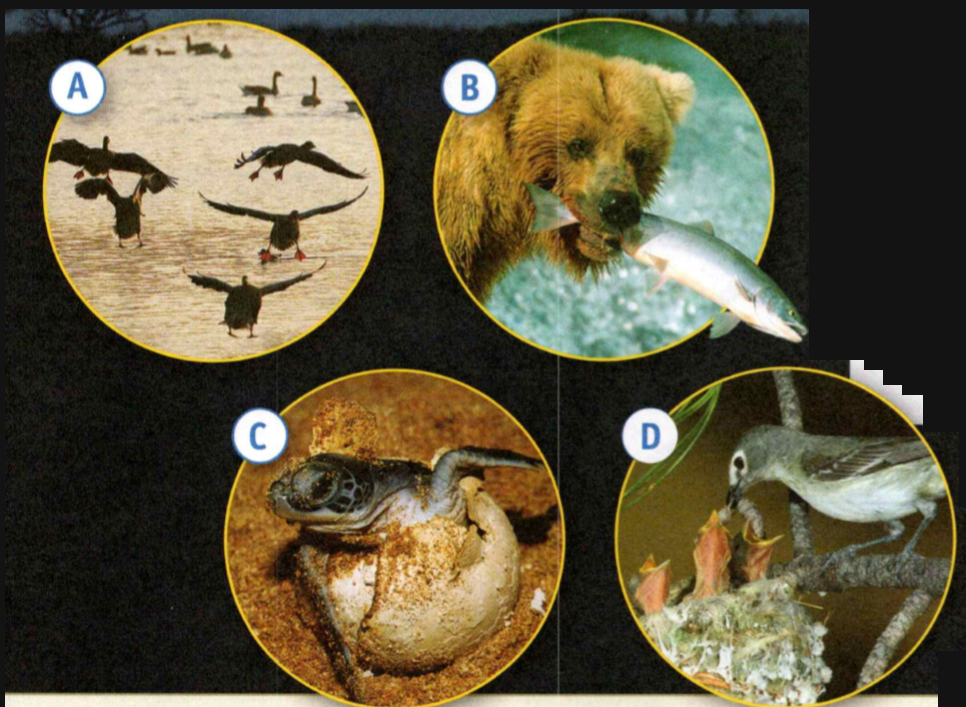

### Life Science

## Biology

## Introduction to Animals

To **survive** is to manage to stay alive, especially in difficult situations.

An **organism** is a living thing.

An **environment** is all the surrounding factors that affect the organism's
life.

**Complete the tasks below.**

1. Mei's birthday present is a bird. She knows that to survive, an organism
needs food, water, and oxygen. So at home she chooses a stable environment in a
warm place, away from drafts. Here, she sets up a cage with dishes for food and
paper for waste removal. Under Mei's care, her bird will have what it needs to
live and grow. What does an organism need to survive?

### Chapter Preview

- homeostasis
- adaptation
- vertebrate
- invertebrate
- tissue
- organ
- radial symmetry
- bilateral symmetry
- cnidarian
- mollusk
- arthropod
- exoskeleton
- echinoderm
- endoskeleton
- chordate
- notochord
- vertebra
- ectotherm
- endotherm
- fish
- cartilage
- amphibian
- reptile
- bird
- mammal
- mammary gland
- monotreme
- marsupial
- placental mammal
- placenta

### What Is an Animal
- What Are the Functions of Animals? 
- How Are Animals Classified?

**Complete the tasks below.**

1. What would a mammal never before seen look like? The answer lies in the
mountains of Tanzania, Africa. There, scientists discovered a new species of
mammal in 2005. The animal, which has been named Rhynchocyon udzungwensis, is a
species of giant elephant shrew. It weighs about 700 grams and measures about 30
centimeters in length, which is just a little longer than this book. This newly
discovered mammal is larger than other elephant shrews, and it has its own
distinctive color. Other animals have also been discovered in the mountains of
Tanzania. Unknown amphibians and reptiles have been discovered there as well.
Each discovery reveals more of the diversity of the animals living on Earth. Do
you think it is important to protect areas such as these mountains? Why?

### What Are the Functions of Animals?

Like plants, animals live almost everywhere on Earth. Animals may have scales,
feathers, shells, or fins. They may be brightly colored or completely
see-through. Some animals do not have limbs. Others have too many limbs to
count. You may wonder if animals have anything in common. Well, they do.

### Functions

All animals are multicellular organisms that feed on other organisms and perform
the same basic functions. **The main functions of an animal are to obtain food
and oxygen, keep internal conditions stable, move in some way, and reproduce.**
Keeping internal body conditions stable is called **homeostasis**.

### Adaptations

Structures and behaviors that allow animals to perform their functions are
called **adaptations**. Teeth and limbs are adaptations that allow animals to obtain
food and move. The pouch of a kangaroo is an adaptation for reproduction.

**Complete the tasks below.**

  <figure>
    
    <figcaption>Figure 1. Animals.</figcaption>
  </figure>

1. Match each animal in Figure 1 to the function(s) it is performing.
a) Obtaining Food ___ Animals eat other organisms and raw materials for energy
and for growth.
b) Reproducing ___ Animals make new individuals like themselves.
c) Moving ___ Animals move to perform other functions as well.

2. The functions of animals are ___.

### How Are Animals Classified?

There are more than 1.6 million species of animals, and more are discovered each
year. So far, biologists have classified animals into about 35 major groups. In
Figure 2, you can see some of the major groups. Notice how the groups are
arranged on branches. Animal groups on nearby branches are more closely related
than groups on branches farther apart. For example, birds are more closely
related to reptiles than they are to mammals.

  <figure>
    
    <figcaption>Figure 2. Mall Major Animal Groups.</figcaption>
  </figure>

**Animals are classified according to how they are related to other animals.
These relationships are determined by an animal's body structure, the way the
animal develops, and its DNA.** DNA is a chemical in cells that controls an
organism's inherited characteristics.

All animals are either vertebrates or invertebrates. **Vertebrates** are animals
with a backbone. **Invertebrates** are animals without a backbone.

**Complete the tasks below.**

1. See Figure 2. Are flatworms more closely related to segmented worms or to
roundworms?

2. See Figure 2. What do you think the bird branch coming off of the reptile branch indicates?

  <figure>
    
    <figcaption>Figure 3. Animals.</figcaption>
  </figure>

3. Use the information in Figure 2 to help you classify the animals in Figure 3.
a) Write the name of each animal's group in the box provided.
b) Which animals are vertebrates? 
c) Which animals are invertebrates?

4. What is a vertebrate?

5. How are vertebrates and invertebrates alike? How do they differ?

6. Animals are classified based on	___ .

### Animal Body Plans
- How Are Animal Bodies Organized?
- How Is Symmetry Related to Body Structure?

**Complete the tasks below.**

1. Spiny Sea Animals. What animal do you think of when you hear the word spiny?
You might think of a porcupine, but sea urchins are spiny, too. These small,
colorful creatures live in the ocean. Just by looking at them, you can't tell
that studying sea urchins would lead to a major discovery about how animals
reproduce. In 1875, biologist Oskar Hertwig was studying a transparent egg of a
sea urchin under a microscope. He saw a sperm, the male sex cell, enter the egg,
the female sex cell, and fuse with the nucleus of the egg. He had discovered how
sexual reproduction occurs. How do you think a sea urchin's transparent egg was
important to the discovery of how sexual reproduction occurs?

### How Are Animal Bodies Organized?

Animals are diverse organisms. But the animals within each phylum have uniquely
organized body structures. This organization is called a body plan. **The
organization of an animal's cells into higher levels of structure, including
tissues, organs, and organ systems, helps to describe an animal's body plan.**

### Cells and Tissues 

All animals are made up of many cells. Their cells are usually specialized and
organized as tissues. A **tissue** is a group of similar cells that performs a
specific function. Muscle tissue, nervous tissue, and connective tissue are all
animal tissues. Bone and blood are examples of kinds of connective tissues.

### Organs and Organ Systems 

In most animals, tissues combine to form organs and organ systems. An **organ** is
made up of different tissues. For example, the leg bone of a frog shown in
Figure 4 is an organ composed of bone tissue, nervous tissue, and blood. An
organ performs more complex functions than the tissues that make it up could
perform alone. Groups of organs make up organ systems. These systems perform the
animal's broadest functions.

  <figure>
    
    <figcaption>Figure 4. A Skeletal System's Organization.</figcaption>
  </figure>

**Complete the tasks below.**

1. Different levels of organization are found in a frog's skeleton, see Figure 4.
Tell what makes up each level of organization in this frog's skeletal system.
a) Tissue
b) Organ
c) Organ System

2. Animal bodies are organized into ___ .

### How Is Symmetry Related to Body Structure?

  <figure>
    
    <figcaption>Figure 5. A butterfly with bilateral symmetry.</figcaption>
  </figure>

Have you ever noticed a butterfly perched on a flower? You probably saw its
colors and wing patterns. Did you also see that the pattern on the left side is
a mirror image of the pattern on the right side? Many organisms and objects have
this balanced display of body parts called symmetry.

### Types of Symmetry 

Animals have different types of symmetry, as you can see in Figure 6. Some
animals have no symmetry, or are asymmetrical. For example, most sponges are
asymmetrical. However, most animals have either radial symmetry or bilateral
symmetry.

An animal has **radial symmetry** if many imaginary lines can be drawn through a
central point to divide it into two mirror images. For example, from above, the
shape of a jellyfish is circular. So any imaginary line drawn through its center
divides it into mirror images. These lines are called lines of symmetry.

Most animals have bilateral symmetry. An animal or an object has **bilateral
symmetry** if only one line of symmetry can be drawn to divide it into halves that
are mirror images. For example, the dashed line you see drawn on the butterfly
above divides the animal into halves that are mirror images of each other.

  <figure>
    
    <figcaption>Figure 6. Types of Symmetry.</figcaption>
  </figure>

**Complete the tasks below.**

1. See Figure 4. Write the type of symmetry each animal has. 

### Symmetry and Body Structure 

The structures of animals are related to their symmetry. **The bodies of animals
without symmetry are organized simply, with some specialized cells but no
tissues. In contrast, animals with radial symmetry have complex body plans with
tissues and usually with organ systems. Animals with bilateral symmetry have
organ systems.**

### Radial Symmetry 

All animals with radial symmetry live in water. Some creep slowly along the
ocean floor. Others stay in one spot as adults. A few can move quickly. Most
animals with radial symmetry do not have front or back ends. Also, they do not
have heads with specialized sense organs. This kind of symmetry allows them to
take in information about their surroundings from all directions. This is an
advantage for animals that usually move slowly.

**Complete the tasks below.**

  <figure>
    
    <figcaption>Figure 7. Objects.</figcaption>
  </figure>

1. See Figure 7. Many objects you see have symmetry, but some do not.
a) Identify the type of symmetry shown by the object.
b) Draw lines of symmetry on each object to support your choice.
c) Draw a common object not pictured here that has radial symmetry. Draw lines
of symmetry to support your choice.

2. Why is it an advantage for an animal to have its head be the first part of
its body to enter a new area?

  <figure>
    
    <figcaption>Figure 8. A Coral Reef.</figcaption>
  </figure>

3. Many animals with bilateral and radial symmetry live in coral reefs, see
Figure 8. How is a sea star and a fish alike and how are they different.

### Bilateral Symmetry 

In general, animals with bilateral symmetry are larger and more complex than
animals with radial symmetry. They have complex organ systems that help them
function efficiently. Also, most animals with bilateral symmetry have
streamlined bodies, which help them move quickly.

Most animals with bilateral symmetry have heads at their front ends. Having a
head is important to an animal. Most of an animal's specialized sense organs,
such as its eyes, are in its head, as you can see in Figure 8. In addition, a
concentration of nervous tissue is found in an animal's head. Nervous tissue
processes information for the animal and coordinates the animal's responses. In
fact, an animal usually moves into a new area with its head first.

**Complete the tasks below.**

  <figure>
    
    <figcaption>Figure 9. Tiger.</figcaption>
  </figure>

FIGURE 3 	

1. How do you know an animal when you see it? All animals have functions they
perform. Most animals have some type of symmetry and an organization that
includes organ systems, see Figure 9.
a) What are the functions of this animal?
b) What adaptations does this animal have for obtaining food?
c) How is this animal organized and what type of symmetry does it have?

2. Why do you think bilateral symmetry is an advantage for an animal?
3. How do you know an animal when you see it?
4. Symmetry relates to body structure because ___ .

### Introduction to Invertebrates
- What Are Invertebrates?

**Complete the tasks below.**

1. Ready, Aim, Fire! To bombard is to "attack with materials that explode." This
action is exactly what the bombardier beetle does. This incredible insect sprays
predators with an explosion of deadly chemicals from its own body! Why don't the
chemicals kill the beetle? The chemicals needed for the spray are stored in
different places in the beetle's body. When the beetle defends itself, the
chemicals are combined into a deadly mixture. The mixture is sprayed on a
predator at a temperature of 100°C! What other animals do you know about that
have unique forms of self defense? Describe their defenses.

### What Are Invertebrates?

At dusk near the edge of a meadow, a grasshopper leaps through the grass.
Nearby, a hungry spider waits in its web. The grasshopper leaps into the web.
It's caught! The spider bites the grasshopper to stun it and quickly wraps it in
silk. The grasshopper will soon become a tasty meal for the spider.

### Invertebrate Characteristics 

A grasshopper and a spider are both invertebrates. **Animals that do not have
backbones are invertebrates. The main invertebrate groups are sponges,
cnidarians, flatworms, roundworms, segmented worms, mollusks, arthropods, and
echinoderms.** About 96 percent of known animals are invertebrates. They live in
every climate.

### Sponges 

Sponges, such as the one shown in Figure 10, are asymmetrical invertebrates. They
have some specialized cells but no tissues or organs. Unlike most animals you
know, adult sponges stay in one place, like plants. But, like other animals,
sponges take food into their bodies to get energy.

### Cnidarians 

Jellyfishes and corals are examples of **cnidarians**, invertebrates that have
stinging cells and take food into a central body cavity. Cnidarians have radial
symmetry. Although they lack organs, they do have some tissues.

  <figure>
    
    <figcaption>Figure 10. Sponges and Cnidarians.</figcaption>
  </figure>

**Complete the tasks below.**

1. Both sponges and cnidarians are animals that live in water, see Figure 10.
Based on symmetry, label these animals as sponges or cnidarians. How are sponges
and cnidarians alike and how are they different.

### Worms 

If you have ever worked in a garden, you have probably seen some worms. The
three major phyla of worms are flatworms, roundworms, and segmented worms, which
you can see in Figure 11. All worms have bilateral symmetry, with head and tail
ends. They also have tissues, organs, and organ systems. Flatworms have flat,
soft bodies. Some have eye spots on their heads that detect light. Roundworms
look like smooth, thin tubes. They have two body openings: a mouth and an anus.
Segmented worms have bodies made up of many linked sections called segments.
They are the simplest animals with a brain. Their brains help them detect food
and predators.

  <figure>
    
    <figcaption>Figure 11. Worms.</figcaption>
  </figure>

**Complete the tasks below.**

1. See Figure 11. The three major phyla of worms are flatworms, roundworms, and segmented worms. Identify the phylum of each worm.
a) Earthworm
b) Hookworm
c) Planarian

2. Describe each worm.
a) Earthworm
b) Hookworm
c) Planarian

### Mollusks  

Have you ever picked up seashells on the beach? Those seashells probably
belonged to a mollusk. Invertebrates with soft, unsegmented bodies that are
often protected by a hard shell are called **mollusks**. All mollusks have a thin
layer of tissue called a mantle that covers their internal organs and an organ
called a foot. Depending on the type of mollusk, the foot might be used for
crawling, digging, or catching prey. Figure 12 shows some mollusks.

  <figure>
    
    <figcaption>Figure 12. Mollusks.</figcaption>
  </figure>

The three major groups of mollusks are gastropods, bivalves, and cephalopods.
Gastropods, such as snails, have a single shell or no shell, and a distinct
head. Bivalves, such as clams, have two shells and a simple nervous system.
Cephalopods may have an external or internal shell or no shell at all. They have
good vision and large brains to help them remember what they've learned. A squid
is a cephalopod with an internal shell.

**Complete the tasks below.**

1. See Figure 12. A snail, clam, and squid do not look alike, but they have the same basic structure.
a) Write a title for the chart.
b) Fill in each box in the chart for each organism. 

### Arthropods 

At first you may not think that a crab and a spider have anything in common. But
look at the spider and crab in Figure 4. Crabs and spiders are **arthropods**,
or invertebrates that have hard outer coverings, segmented bodies, and pairs of
jointed appendages. Legs, wings, and antennae are appendages. The outer covering
is called an **exoskeleton**, or outer skeleton.

At times, the exoskeleton is shed and replaced as the animal grows. One
arthropod group, crustaceans, includes animals such as crabs. A second group,
arachnids, includes animals such as spiders. A third group includes centipedes,
millipedes, and insects, such as bees and ants.

Smaller than a paper clip, honeybees are important insects. They collect nectar
from flowers to make honey and pollinate some plants. Without the honey bee, an
apple tree might not produce the apples you eat.

  <figure>
    
    <figcaption>Figure 13. Arthropods.</figcaption>
  </figure>

**Complete the tasks below.**

1. See Figure 13. Members of the three arthropod groups have different
characteristics. How do the number of pairs of legs of a spider and a bee
differ?

  <figure>
    
    <figcaption>Figure 14. Distribution of Animal Groups.</figcaption>
  </figure>

2. Distribution of Animal Groups, see Figure 14. 
a) What percentage of animals are not insects?
b) What percentage of animals are invertebrates that are not insects?

### Echinoderms 

An **echinoderm** is an invertebrate that has an internal skeleton and a system of
fluid-filled tubes. An internal skeleton is called an **endoskeleton**. Echinoderms,
shown in Figure 5, have radial symmetry. They use their system of tubes to move
and obtain food and oxygen. Sea cucumbers, sea stars, sea urchins, and brittle
stars are the major echinoderm groups.

  <figure>
    
    <figcaption>Figure 15. Echinoderms.</figcaption>
  </figure>

**Complete the tasks below.**

1. Echinoderms are diverse animals, but all live in salt water, see Figure 15.
Write a brief description of the shape and symmetry of each echinoderm.
a) Sea star b) Sea urchins c) brittle stars d) sea cucumber

2. How are all cnidarians alike?
3. If you saw a worm, how would you identify its phylum?

### Introduction to Vertebrates
- What Are the Characteristics of Chordates and Vertebrates?
- How Do Vertebrates Control Body Temperature?

**Complete the tasks below.**

1. BRRRR! It's Freezing! How can anything survive in Antarctica, the coldest and
windiest place on Earth? Emperor penguins have many physical characteristics
that help them live there. For example, they have a layer of fat that helps them
stay warm. They also have short, stiff feathers that help to insulate and
protect them from the freezing air. However, the penguins' physical
characteristics are not enough to stay warm in Antarctica during the winter.
Emperor penguins cooperate to keep warm. They huddle together in groups and take
turns standing on the outside of the huddle where it is the coldest. This way,
every penguin gets a chance to stand in the middle of the huddle where it is the
warmest. Now that's teamwork!
a) Why don't emperor penguins freeze to death in Antarctica?
b) What are other ways you know about that animals use to stay warm?

### What Are the Characteristics of Chordates and Vertebrates?

The animals you are probably most familiar with are members of the phylum
Chordata. Members of this phylum are called chordates. Most
chordates, including all fishes, amphibians, reptiles, birds, and mammals, are
vertebrates. A few chordates, such as sea squirts and lancelets, do not have
backbones.

### Chordate Characteristics 

**At some point in their lives, all chordates have three characteristics: a notochord, a nerve cord, and pouches in the throat area. Most chordates also have a backbone.**

#### Notochord 

A **notochord** is a flexible rod that supports a chordate's back. The name Chordata
comes from this structure's name.

#### Nerve Cord 

All chordates have a nerve cord that runs down their back. Your spinal cord is
such a nerve cord. The nerve cord connects the brain to nerves in other parts of
the body.

#### Throat Pouches 

At some point in their lives, chordates have pouches in their throat area. In
fishes and lancelets, like the one shown in Figure 16, grooves between these
pouches become gill slits. In most other vertebrates, the pouches disappear
before birth.

  <figure>
    
    <figcaption>Figure 16. Chordates.</figcaption>
  </figure>

**Complete the tasks below.**

1. Lancelets show the three characteristics shared by all chordates at some point in their lives, see Figure 16.
a) Identify the labels of the three chordate characteristics. 
b) Explain how a lancelet is different from a fish.

### Backbones

In addition to a notochord, a nerve cord, and throat pouches, most chordates
have a backbone. The backbone, or spine, runs down the center of the back and
replaces the notochord. The backbone is made up of a stack of many small bones
called **vertebrae** (singular vertebra). Each vertebra has a hole in it. The
holes form a tunnel that a bundle of nerve tissue, or spinal cord, passes
through. A pad of soft tissue separates each vertebra, giving the spine
flexibility.

The backbone is a key part of a vertebrate's endoskeleton. It protects the
spinal cord. The skull and ribs are other key parts of an endoskeleton. The
skull protects the brain. The ribs protect the heart and lungs. An endoskeleton,
such as the one you can see in Figure 2, shapes a body and provides muscles with
places to attach. It also forms an internal frame that supports the body and
allows it to move easily. An endoskeleton grows with the animal. Vertebrates
often grow larger than animals without an endoskeleton.

  <figure>
    
    <figcaption>Figure 17. A Seal Skeleton.</figcaption>
  </figure>

**Complete the tasks below.**

1. A seal has an endoskeleton that helps it move through water, see Figure 17.
Label the three key parts of the seal skeleton.

2. What is the organ that each key part of an endoskeleton protects.

3. What is a notochord?

4. What allows a backbone to be flexible?

### How Do Vertebrates Control Body Temperature?

The major groups of vertebrates differ in how they control body temperature.
**Some vertebrates do not produce much internal heat. Therefore, their body
temperatures change with the environment. Other vertebrates control their
internal heat and maintain a constant body temperature.**

Amphibians, reptiles, and most fishes are ectotherms. An animal that produces
little internal body heat is called an **ectotherm**. Its body temperature changes
with temperature changes in its environment.

Birds and mammals are endotherms. An **endotherm** is an animal that controls the
internal heat it produces and regulates its own temperature. An endotherm's body
temperature is always fairly constant. Endotherms have adaptations such as sweat
glands, fur, and feathers for maintaining body temperature.

**Complete the tasks below.**

1. The prefix ecto- means "outside." What do you think the prefix endo- means?

  <figure>
    
    <figcaption>Figure 18. Animals.</figcaption>
  </figure>

2. Animals control body temperature in different ways, see Figure 18.
a) Which animal is an endotherm which animal is an ectotherm.
b) Would it be more difficult for a penguin to live in a desert or a snake to
live in a polar region? Explain.

### Vertebrate Diversity
- What Are the Major Groups of Vertebrates?

**Complete the tasks below.**

1. Sending Messages Have you ever felt like stomping your feet to show your
frustration? People aren't the only ones who stomp their feet to express
themselves. Researchers think elephants communicate by stomping. For example,
they think elephants stomp their feet to greet one another and send warnings.
What if an animal has no feet to stomp? It can sing! Many species of whales
communicate with one another through song. They make different sounds to
communicate different messages. Who knows what else researchers will
discover-about animal communication! What are three ways you communicate with
others without using words?

### What Are the Major Groups of Vertebrates?

Vertebrates, like all other animals, are diverse. They live in almost all types
of environments on Earth and vary in shape, size, and color. **There are five
major groups of vertebrates. They are fishes, amphibians, reptiles, birds, and
mammals.** Members of each group share certain characteristics.

### Fishes 

A **fish** is a vertebrate that lives in water and uses fins to move. Most fishes
are ectotherms. They have scales and obtain oxygen through gills. They make up
the largest group of vertebrates. Based on certain characteristics, fishes are
organized into three major groups, which are shown in Figure 19.

Jawless fishes have no jaws or scales. They scrape, suck, and stab their food.
Their skeletons are made of **cartilage**, a tissue more flexible than bone.
Fish with jaws, scales, and skeletons made of cartilage are cartilaginous
fishes. Bony fishes have jaws, scales, and a pocket on each side of the head
that holds the gills. Their skeletons are made of hard bone.

  <figure>
    
    <figcaption>Figure 19. Types of Fishes.</figcaption>
  </figure>

**Complete the tasks below.**

1. The three groups of fishes are jawless fishes, cartilaginous fishes, and bony
fishes, see Figure 19. What are the characteristics of each group of fishes?

### Amphibians 

You may know that some amphibians such as frogs can be noisy neighbors. Frogs,
toads, and salamanders are examples of amphibians. An amphibian is a vertebrate
that is ectothermic and spends its early life in water and its adult life on
land. In fact, the word amphibian means "double life." Most amphibians spend
their adult lives on land. But they return to water to lay eggs and reproduce.
Look at the amphibians in Figure 20.

  <figure>
    
    <figcaption>Figure 20. Amphibian Diversity.</figcaption>
  </figure>

**Complete the tasks below.**

1. Adult salamanders have tails, but almost all adult frogs and toads do not,
see Figure 20.
a) Label each type of amphibian. 
b) Explain the evidence in each picture that helped you decide.

  <figure>
    
    <figcaption>Figure 21. Estimated Number of Species of Vertebrates.</figcaption>
  </figure>

2. Vertebrate Diversity, see Figure 21. The table shows the estimated number of species in each vertebrate group. Use the table to answer the questions.
a) About how many vertebrate species are there in all?
b) Which group has the greatest number of species? The least?

### Reptiles 

The alligator, snake, and chameleon shown in Figure 22 are all reptiles. A
reptile is an ectothermic vertebrate that has scaly skin and lungs and lays eggs
on land. Some reptiles, such as sea turtles, live in water but still breathe
air. Most reptiles live on land even though some swim a lot. To live on land, an
animal must have adaptations that keep water in its cells. The skin of reptiles
is thick and helps keep water inside their bodies. Reptiles also have organs
called kidneys that conserve water. Most young reptiles develop inside
tough-shelled eggs. The eggshell helps keep water inside the egg.

  <figure>
    
    <figcaption>Figure 22. Reptile Diversity.</figcaption>
  </figure>

**Complete the tasks below.**

1. Reptiles are adapted to life on land, see Figure 22.
a) Describe how you know that the animal is a reptile.
b) Explain how a shell keeps water inside an egg.

### Birds 

If you have ever watched birds at a feeder, you know how fascinating they are. A
bird is an endothermic vertebrate that lays eggs and has feathers and a
four-chambered heart. Birds are adapted for flight. They have wings and
lightweight, nearly hollow bones. Shown in Figure 23, birds are the only modern
animals with feathers.

- This ibis wades through water with its tall, thin legs. It uses its long bill
to find small prey.
- This rainbow bee-eater uses its pointed bill to feed on bees and other
insects, which it catches as it flies.
- Sharp vision and keen hearing help owls like this tawny owl hunt at night.
They use razor-sharp claws to grab prey.

  <figure>
    
    <figcaption>Figure 23. xxx.</figcaption>
  </figure>

**Complete the tasks below.**

1. Birds Different adaptations allow birds to live in different environments,
see Figure 23. For each bird, describe what adaptations has the bird that help
it survive. Then explain how you think feathers help birds survive.

2. List how reptiles and birds are alike and different.

### Mammals 

There are three main groups of mammals. **Mammals** are endothermic vertebrates that
have skin covered with fur or hair, and a four-chambered heart. The young are
fed with milk produced by organs, called **mammary glands**, in the mother's body.

The mammal groups differ in how their young develop. **Monotremes** lay eggs.
**Marsupials** are born at an early stage of development, and they usually continue
to develop in a pouch on the mother's body. A **placental mammal** develops inside
its mother's body until its body systems can function independently. Materials
are exchanged between the mother and the embryo through an organ called the
**placenta**

  <figure>
    
    <figcaption>Figure 24. Mammals.</figcaption>
  </figure>

**Complete the tasks below.**

1. The main groups of mammals are monotremes, marsupials, and placental mammals.
For each mammal write a note about how the young of the group develops.

2. Name the three groups of fishes.

3. Why can mammals live in colder environments than reptiles?

### Study Guide

- The main functions of an animal are to obtain food and oxygen, keep internal
conditions stable, move in some way, and reproduce.
- Animals are classified according to how they are related to other animals.
These relationships are determined by an animal's body structure, the way the
animal develops, and its DNA.
- The organization of an animal's cells into higher levels of structure helps to
describe an animal's body plan.
- Animals without symmetry have no tissues. Animals with radial symmetry have
tissues and usually have organ systems. Animals with bilateral symmetry have
organ systems.
- Animals that do not have backbones are invertebrates.
- At some point in their lives, all chordates have three characteristics: a
notochord, a nerve cord, and pouches in the throat area.
- The body temperatures of some vertebrates change with the environment. Other
vertebrates maintain a constant body temperature.
- There are five major groups of vertebrates. They are fishes, amphibians,
reptiles, birds, and mammals.

**Complete the tasks below.**

1. The process that the body uses to maintain a stable internal environment is called
A) adaptation.	
B) endothermic.
C) homeostasis.	
D) sweating.

2. The presence of a ____ determines whether an animal is a vertebrate or an
invertebrate.

3. What are the five main functions of animals?

4. Suppose a book titled Earth's Animals is about vertebrates. Is its title a
good one? Explain your answer.

5. Some insects and birds can fly. Despite this similarity, why are insects and
birds classified as different groups?

6. Choose an animal that you know well and describe a day in its life. Include
the functions it carries out and the adaptations it uses to survive in its
environment.

7. What is the highest level of organization an animal can have?
A) cells	
B) organ systems
C) organs	
D) tissues

8. An animal with many lines of symmetry has ___ symmetry.

9. Describe how the symmetry of a sea star, a sponge, and a fish differ.

10. Mollusks with two shells are called
A) cephalopods.	
B) sea stars.
C) bivalves.	
D) gastropods.

11. An __ has a system of fluid-filled tubes for obtaining food and oxygen.
12. Suppose you see an animal. You wonder if it is an arthropoD) What
characteristics would you look for?

13. Explain whether a snail or a sponge has a higher level of organization and
how this organization helps the invertebrate.

14. All vertebrates are
A) chordates.	
B) invertebrates.
C) fishes.	
D) reptiles.

15. A ___ is replaced by a backbone in many vertebrates.

16. Why is the endoskeleton important?

17. Whales, polar bears, and seals are endotherms. How might their thick layer
of fat help them?

18. Would an ectotherm or an endotherm be more active on a cold night? Explain.

19. Your friend has both a hamster and a lizard as pets. She wants to buy a heat
lamp for each of them to keep them warm. Tell her whether each pet needs a heat
lamp to stay warm. Include the two ways animals maintain their body temperatures
in your answer.

20. A reptile
A) is an endotherm.	
B) lives only in water.
C) has gills.	
D) has scaly skin.

21.	____ are the only animals with feathers.

22. Into which group of fishes would you classify a fish with jaws and a skeleton made of cartilage?

23. What is the main difference between the three mammal groups?

  <figure>
    
    <figcaption>Figure 25. How do you know an animal when you see it?.</figcaption>
  </figure>

24. Look at the squid in Figure 25. Describe how you know it is an animal.
Include details about its functions and its adaptations to survive.

  <figure>
    
    <figcaption>Figure 26. Lancelet.</figcaption>
  </figure>

25. A lancelet is shown in Figure 26. Which of its characteristics belong to a
chordate?
A) the mouth, gill slits, and nerve cord
B) the gill slits, notochord, and nerve cord
C) the notochord, nerve cord, and tail
D) the gill slits, notochord, and mouth

26. Which characteristics do birds and mammals have in common?
A) Both are endothermic vertebrates.
B) Both have fur or hair.
C) Both have a three-chambered heart.
D) Both are vertebrates that produce milk.

27. Which of the following best describes the function of the placenta?
A) delivers oxygen to the body's cells
B) stores food inside the body before swallowing and digesting it
C) directs and coordinates a mammal's complex movements
D) passes materials between a mother
and her offspring before it is born

28. What kind of evidence is used to determine the relationships between animals?
A) evidence from the way an animal develops
B) evidence from an animal's DNA 
C) evidence from an animal's body structure
D) all of the above

29. Which describes an ectothermic animal? 
A) an animal that has a thick coat of fur
B) an animal that sweats when the environment is too hot
C) an animal that depends on the sun to raise its body temperature
D) an animal that maintains its body temperature when walking through snow

  <figure>
    
    <figcaption>Figure 27. Animals.</figcaption>
  </figure>

30. Use the photos in Figure 27 below and your knowledge of science to help you
answer Question. Invertebrates are animals without a backbone. Identify the
group each of the invertebrates in Figure 27 belongs to. Then, for each group,
name three characteristics that all its members share.

31. What is a lemur's favorite snack? Are baboons grumpy when they wake up in the
morning? What, exactly, goes on behind the scenes at a zoo? If you want to know
the answers to these questions, find out about Junior Zookeeper programs. Many
zoos throughout the country have volunteer programs for teenagers. Junior
Zookeepers' tasks can include caring for zoo animals and assisting in zoo
research. At some zoos, volunteers even help design and run educational
programs. These volunteers serve as guides to help the public learn more from
the zoo exhibits. Some jobs are a little messy. You might have to help clean up
the elephant cages! But the rewards can be just as big—taking care of animals
can be a life-changing experience. Find out more about how zoo habitats are
designed. How do zookeepers simulate an animal's habitat? How do they design
exhibits that educate the public? Then choose an animal and design a model zoo
exhibit that simulates its habitat and educates the public about the animal.

32. If there were a contest for the most disgusting animal in the sea, the hagfish
would probably win. This eel-like creature is almost blind, and it feeds by
burrowing into the flesh of dead animals on the ocean floor. If a hagfish is
attacked, it releases large amounts of thick slime, which can suffocate any
predator foolish enough to attack! This thick gooey slime contains threads that
are almost as strong as spider silk. Studies of hagfish slime may one day help
scientists make materials that are stronger than the fabric we now use in
bulletproof vests! Find examples of how biological-research has
inspired the development of technology. Then make a poster that describes three
examples. Explain how the technology affected society.

