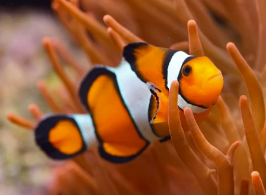
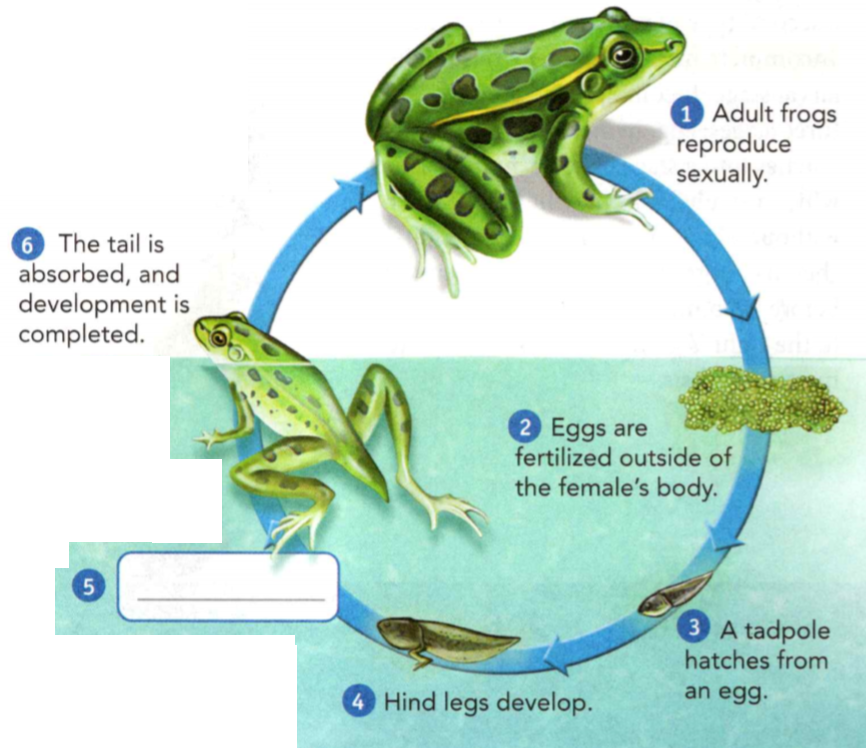

### Life Science

## Biology

## Animal Life Processes

- An animal that has a backbone is a **vertebrate**.
- An **adaptation** is a characteristic that enables an animal to live
successfully in its environment.
- An **endoskeleton** is an internal skeleton.

**Complete the tasks below.**

1. Why can you not leap like a frog? Like a frog, you are a vertebrate. But
frogs have adaptations for leaping. A frog's powerful hind legs and sturdy
endoskeleton allow it to leap and land without injury. What adaptations do frogs
have that enable them to leap?

### Chapter Preview

- molting 
- cartilage 
- joint 
- muscle
- nervous system 
- stimulus
- response 
- neuron 
- impulse
- sensory neuron 
- interneuron
- motor neuron 
- brain
- water vascular system 
- swim bladder
- carnivore 
- herbivore 
- omnivore
- filter feeder 
- digestion
- digestive system
- cellular respiration 
- diffusion
- respiratory system
- circulatory system
- larva 
- polyp 
- medusa
- external fertilization
- internal fertilization
- gestation period
- amniotic egg 
- placenta
- metamorphosis
- complete metamorphosis
- pupa 
- incomplete metamorphosis
- nymph 
- tadpole

### Skeletons and Muscles
- What Supports and Protects Animal Bodies?
- What Is the Role of Muscles?

**Complete the tasks below.**

1. Fast Felines. Which animal is the fastest sprinter? It is a cheetah. The
cheetah's body structure and muscles allow it to reach speeds of up to 112 km/h
in only three seconds. Its flexible spine enables the cheetah to extend its
limbs to great lengths. This ability allows the cheetah to cover as much ground
in one stride as a racehorse. The cheetah also has a high percentage of
fast-twitch muscle fibers. These fibers provide power and allow the cheetah to
reach its incredible speed faster than a race car can reach the same speed. It's
no wonder that the cheetah holds the title of "World's Fastest Land Animal."
a) What are two parts of a cheetah's body that help it run fast?
b) Why do you think a cheetah's speed is an advantage to the animal?

### What Supports and Protects Animal Bodies?

Imagine you are watching lions moving slowly through tall grass. They are
surrounding a young zebra that has wandered away from its mother. Flies buzz,
and beetles chew on grass blades. Buzzards circle in the distance. Nearby, a
snake slithers away from one of the lions. Unaware, the zebra continues to
graze.

Think about all these different animals. Do they have anything in common? The
answer is yes. All of their bodies are supported by skeletons, which have
similar functions. **A skeleton is a framework that shapes and supports an
animal, protects its internal organs, and allows it to move in its environment.**

### Types of Skeletons 

Most animals have one of three types of skeletons: skeletons without hard parts,
exoskeletons, and endoskeletons. An exoskeleton is a hard outer covering, while
an endoskeleton is a framework inside the body. Some animals, such as sponges,
do not have skeletons. However, most sponges have hard, spikelike structures
scattered among their cells. These structures help support and protect them.

**Complete the tasks below.**

1. Describe how endoskeletons and exoskeletons are alike and how they are
different.

### Skeletons Without Hard Parts 
Have you ever seen blobs that look like clear gelatin washed up on beach sand?
These blobs are the bodies of jellyfish. They still have some shape because of
their skeleton. Jellyfish and other cnidarians, as well as earthworms and some
other annelids, have skeletons without hard parts. These skeletons have
fluid-filled cavities surrounded by muscle, a tissue used in movement. Like all
skeletons, this type of skeleton helps an animal keep its shape and move about.

### Exoskeletons 

Mollusks and arthropods have exoskeletons. Clam and scallop shells are mollusk
exoskeletons made of calcium-containing compounds. The exoskeletons of
arthropods are made of a different substance. Exoskeletons have some
disadvantages. First, exoskeletons have no cells, so they cannot grow the way
organisms grow. A mollusk's shell does get larger over time as the animal
secretes calcium. But to grow, arthropods must shed their exoskeletons
periodically and produce new ones in a process called **molting**. Second, an
exoskeleton can be heavy. This weight prevents an animal from growing very
large. Look at the skeletons in Figure 1.

  <figure>
    
    <figcaption>Figure 1. Two Types of Skeletons.</figcaption>
  </figure>

Before this Pacific lobster shed its old exoskeleton, a new one grew right under
it. Once the new exoskeleton was ready, the lobster began drinking lots of
seawater. As its body swelled with seawater, the old exoskeleton started to
split. All the lobster had to do was back out of it, pulling its legs out last.
Until its new exoskelton hardens a bit, this lobster will not be able to move.

### Endoskeletons 

Echinoderms and vertebrates have endoskeletons. Like exoskeletons, endoskeletons
may contain different materials. For example, a sea star's endoskeleton is made
of plates that contain calcium. Sharks and some other fishes have endoskeletons
made of **cartilage**, a tissue that is more flexible than bone. The endoskeletons
of most other vertebrates are made of mostly bone with some cartilage.

Bone and cartilage contain living cells. As a result, a vertebrate's
endoskeleton can grow. In addition, because endoskeletons are relatively light,
vertebrates with endoskeletons can grow larger than animals with exoskeletons.
Some animals with endoskeletons are shown in Figure 2.

  <figure>
    
    <figcaption>Figure 2. Endoskeletons.</figcaption>
  </figure>

**Complete the tasks below.**

1. Some animals have skeletons without hard parts, while others have
exoskeletons, see Figure 1. Describe the type of the animal's skeleton.
a) Earthworm
b) Cicada
c) Scallop

2. Endoskeletons are made of different materials, see Figure 2.
Identify the material that each animal's endoskeleton is made of.
a) Sea Star
b) Great White Shark
c) Polar Bear

3. Why is having an endoskeleton an advantage to a bird?

### Joints 

Have you ever tried to run without bending your legs? If you have, then you know
it is difficult. Fortunately, most exoskeletons and endoskeletons have joints. A
**joint** is a place where two or more parts of a skeleton meet. The way the parts
are held together in a joint determines how the joint can move.

  <figure>
    
    <figcaption>Figure 3. Costa Rican Spider.</figcaption>
  </figure>

Both arthropods and vertebrates have joints. An arthropod's appendages, or
jointed attachments, enable the arthropod to move these appendages in different
ways. For example, an insect's mouthparts may move from side to side and crush
blades of grass. Its legs, however, may move forward and backward, enabling the
insect to crawl. Vertebrates also have jointed appendages. As with arthropods,
different joints enable vertebrates to move their appendages in different ways.

  <figure>
    
    <figcaption>Figure 4. Lemur.</figcaption>
  </figure>

**Complete the tasks below.**

1. Joints provide flexibility for animals. Look at the picture of the lemur in
Figure 4. Then answer the questions.
a) Circle the joints you see.
b) Describe how the leg joints enable the lemur to move.

2. What is cartilage?

3. Why is a lobster more vulnerable to predators when it molts?

4. A skeleton is a framework that ___ .

### What Is the Role of Muscles?

**Muscles help animals move their body parts.** Tissues that contract or relax
to create movement are muscles. Some muscles are part of an organ. For example,
muscles make up most of the walls of some blood vessels. When these muscles
contract, or get shorter, they squeeze blood through the vessels.

Other muscles attach to parts of skeletons. Muscles attach to the inside of
exoskeletons. In an endoskeleton, muscles attach to the outsides of the bones or
cartilage. For both types of skeletons, movement occurs when muscles pull on
skeletons.

  <figure>
    
    <figcaption>Figure 5. Muscle Pairs.</figcaption>
  </figure>

Muscles attached to skeletons always work in pairs, as shown in Figure 5. When
one muscle contracts, the other muscle relaxes, or returns to its original
length. The contracted muscle pulls on the skeleton and causes it to move in a
certain direction. Then, as the contracted muscle relaxes, the relaxed muscle
contracts. This action causes the skeleton to move in the opposite direction.

**Complete the tasks below.**

1. Muscles help animals move their body parts, see Figure 5. Label each muscle
as relaxed or contracted for both types of skeletons.

2. Muscles help animals ____ .

### The Nervous System
- What Is the Role of the Nervous System? 
- How Do Nervous Systems Differ?

**Complete the tasks below.**

1. The Nerve of That Newt! What happens when a newt loses a limb? It grows back! So
a newt that loses a limb is not necessarily doomed to having a life on three
legs. In 2007, a team of British scientists made an intriguing discovery. They
learned that a protein called nAG is needed for a newt to regrow a missing limb.
If the nerve that triggers the production of nAG is removed, the newt cannot
regrow its limb. However, the scientists developed a way to make the newt's
cells artificially produce nAG. When they did this, the newt was able to regrow
its limbs, even without the nerve.
a) What role does a nerve play in the newt's ability to regrow a missing limb?
b) Why do you think the discovery of nAG is important?

### What Is the Role of the Nervous System?

You are in the yard studying. Your dog, Rugger, is lying beside you. Suddenly,
Rugger lifts his head and perks his ears. A few seconds later, a car pulls into
the driveway.

### Interactions 

Rugger's actions resulted from interactions of his nervous system. A nervous
system receives information from the environment and coordinates a response. In
this way, it acts like the body's control panel. **A nervous system allows
animals to detect signals in their environments, process the signals, and react
to them.**

A signal that causes an animal to react in some way is called a **stimulus** (plural
stimuli). Touch, sound, and the things animals smell, taste, or see are stimuli.
After a nervous system detects a stimulus, it processes the information. For
animals like Rugger, this process happens in the brain. Processing information
results in a response. A **response** is an animal's reaction to a stimulus.
Rugger's response to hearing the car was to lift his head and perk his ears.
Rugger could have also responded by barking or running.

**Complete the tasks below.**

  <figure>
    
    <figcaption>Figure 6. A chameleon eats insects.</figcaption>
  </figure>

1. A chameleon eats insects, see Figure 6. When it sees an insect, a chameleon
snaps out its long, sticky tongue, which traps the insect on the end.
a) What is the stimulus for this chameleon? What is the response?
b) Why is this response important to the chameleon?

### Types of Cells 

Animals often respond to a stimulus in fractions of seconds. If they didn't,
they might not eat, or they might be eaten. The basic unit of the nervous
system, a neuron, enables speedy responses. A **neuron** is a nerve cell with a
unique structure for receiving and passing on information. In a nerve cell,
information travels as an electrical message called an **impulse**.

Complex animals have three kinds of neurons that work together to take in
information, process it, and enable an animal to respond. **Sensory neurons** are
nerve cells that detect stimuli. Organs, such as eyes and ears, contain many
sensory neurons. **Interneurons** are nerve cells that pass information between
neurons. **Motor neurons** are nerve cells that carry response information to
muscles and other organs.

**Complete the tasks below.**

  <figure>
    
    <figcaption>Figure 7. Mouse.</figcaption>
  </figure>

1. In complex animals, different kinds of neurons work together to transfer
information, see Figure 7.
Fore each picture, write the type of neuron the mouse is using.
a) A
b) B
c) C
d) Based on these pictures, what stimulus is the mouse receiving? What is its response?

2. What is a stimulus?

3. What kind of stimulus would produce a response from a hungry animal?

4. A nervous system allows animals to ___ .

### How Do Nervous Systems Differ?

It is hard to imagine an animal without a nervous system. This is because most
familiar animals have complex nervous systems. But sponges don't have a nervous
system, and many other animals have very simple ones. **The simplest nervous
systems are a netlike arrangement of neurons throughout the body. The most
complex systems have a nerve cord and a brain.**

### Types of Nervous Systems 

A cnidarian's nervous system consists of neurons arranged like a net, as you can
see in Figure 1. This type of nervous system is called a nerve net. Animals with
nerve nets have no specialized neurons. Therefore, a stimulus to one neuron
sends impulses in all directions.

  <figure>
    
    <figcaption>Figure 8. Nervous Systems.</figcaption>
  </figure>

- An octopus has about 40 million neurons in its brain. Octopuses seem to be
able to learn.
- A planarian has two small structures in its head that are formed from groups
of interneurons.
- A hydra has a nerve net with no specialized neurons.

Many animals have more organized nervous systems than those of cnidarians. For
example, a planarian's nervous system has nerve cords formed from groups of
interneurons. Arthropods, mollusks, and vertebrates have nervous systems with
brains. A **brain** is an organized grouping of neurons in the head of an animal
with bilateral symmetry. A brain receives information, interprets it, and
controls an animal's response. A complex animal with a brain and nerve cord may
have billions of neurons.

**Complete the tasks below.**

1. Different types of nervous systems have different functions, see Figure 8.
Describe the structures that make up each animal's nervous system.
a) Mollusk
b) Flatworm
c) Cnidarian

### Sense Organs 

The more complex an animal's nervous system is, the more specialized its sense
organs are. Sense organs such as ears, eyes, and noses detect stimuli in the
form of sound, light, odor, and touch. Many, but not all, sense organs are
located in the head. For example, a grasshopper has compound eyes and antennae
on its head, which detect chemicals and touch. It also has membranes on its body
that detect vibrations.

Animals with many sense organs can process many stimuli at the same time. This
is because different areas of the brain respond to different stimuli at the same
time For example, when an animal such as your dog is around food, its brain
processes messages about the food's color, smell, taste, and temperature all at
the same time. Look at Figure 2 to learn about some animals' sense organs.

**Complete the tasks below.**

1. For each animal describe how the sense organ might help the animal.
a) While under water, a platypus uses its bill to detect the movements of other
animals.
b) A frog detects vibrations in the air with its tympanic membrane.
c) The star-nosed mole uses its snout with fleshy tentacles to sense an object's
texture.
d) A shark uses cells in its nasal passages to detect tiny amounts of blood in
sea water.
e) Most insects detect some colors and movement with their compound eyes.

2. Where are the sense organs located on most animals with bilateral symmetry?
Why?

3. What is a brain?

4. Why is having many sense organs an advantage for an animal?

5. Structures in a simple nervous system differ from those in a complex nervous
system in that they have a ___ .

### Animal Movement
- What Causes Animals to Move?
- How Do Adaptations for Movement Compare?

**Complete the tasks below.**

1. Posted by Emily Location Bronxville, NY. If I could choose one thing to do
that I can't do today, it would be flying. I look at birds in New York and
imagine the great adventures they must have. I imagined taking off from my roof
and head- ing south to the Atlantic Ocean. As I soared over Long Island, I
decided I wanted to see the ocean all around me, so I flew east to Montauk
Point. I perched on top of a lighthouse and looked at the view below me. Then I
flew over Fire Island without stopping because I didn't want to miss the concert
at Jones Beach before returning home.
a) In what ways can people fly today?
b) Would it affect your life in a positive or negative way if people could fly
unassisted? Why?

### What Causes Animals to Move?

All animals move about in certain ways during their lives. They may swim, walk,
slither, crawl, run, hop, fly, soar, jump, or swing through trees. However, all
animal movements have something in common. **An animal moves about when its
nervous system, muscular system, and skeletal system work together to make
movement happen.** First, an animal's nervous system receives a signal from the
environment. Second, its nervous system processes the signal. Finally, its
nervous system signals the muscles, which contract, causing the skeleton to
move.

Animals move for many reasons. They move to obtain food, defend and protect
themselves, maintain homeostasis, and find mates.

  <figure>
    
    <figcaption>Figure 9. Moving animals.</figcaption>
  </figure>

**Complete the tasks below.**

1. For each animal in Figure 9, write a reason why the animal might be moving.
a) Racoon
b) Hermit Crab
c) Peacock

### How Do Adaptations for Movement Compare?

Animals live nearly everywhere on Earth. **Animals that live in water, on land,
or in the air have different adaptations for movement.**

### Moving in Water 

If you have ever tried to walk in a swimming pool, you know that moving in water
is more difficult than moving on land. This is because water is resistant to
movement through it. Many animals that swim, such as fishes, dolphins, and
penguins, have streamlined bodies that help them move through water. They also
have appendages for swimming. Fishes have fins, dolphins have flippers, and
penguins have wings.

Some animals that live in water do not swim but move through water in other
ways. For example, sea stars and other echinoderms have a **water vascular system**,
a system of fluid-filled tubes. The tubes produce suction, which enables an
echinoderm to grip surfaces and move along. Look at Figures 10-14 to see some
different animal adaptations for moving in water.

### Bony Fish
- **Fins for Balance** These fins help the fish stay upright in the water. 
- **Tail Fin** The tail fin, along with the fish's side muscles, provide swimming power.
- **Swim Bladder** A **swim bladder** is an internal, gas-filled sac. By adjusting the
gas level, a fish can stay at a certain depth without using much energy.

  <figure>
    
    <figcaption>Figure 10. Bony Fish.</figcaption>
  </figure>

### Penguin

**Streamlined Bodies** A penguin has a streamlined body and wings.

  <figure>
    
    <figcaption>Figure 11. Penguin.</figcaption>
  </figure>

### Sea Star

**Water Vascular System** A sea star has tube feet on the under sides of its
arms. They are part of the water vascular system and grip surfaces with suction.

  <figure>
    
    <figcaption>Figure 12. Sea Star.</figcaption>
  </figure>

### Frog

**Webbed Feet** Webbed feet help a frog push itself through water.

  <figure>
    
    <figcaption>Figure 13. Frog.</figcaption>
  </figure>

### Squid

**Jet Propulsion** A squid moves by jet propulsion. It uses muscles to pull
water into its body, and then shoots it out through a narrow tube. This shoots
the squid in the opposite direction.

  <figure>
    
    <figcaption>Figure 14. Squid.</figcaption>
  </figure>

**Complete the tasks below.**

1. Identify each animal's adaptation for moving. Then describe how the animal
moves.
a) Bony Fish
b) Penguin
c) Sea Star
d) Frog
e) Squid

2. How is a fish helped by staying at a certain depth without using a lot of
energy?

### Moving on Land 

Have you ever watched a snake slither through the grass? Perhaps you've watched
ants walk across the ground. Both snakes and ants move on land, but their
adaptations for moving on land are different. A snake contracts its muscles and
pushes against the ground with its body. An ant uses its jointed appendages to
walk. Figure 2 shows some of the many adaptations that animals have for moving
on land.

### Muscles and Bristles 

A segmented worm, such as this fireworm, has muscles that contract to extend the
worm forward. It also has bristles that grip the soil.

  <figure>
    
    <figcaption>Figure 15. Muscles and Bristles.</figcaption>
  </figure>

### Body Muscles 

This sidewinding adder snake uses its muscles to lift loops of its body off the
hot desert sand as it moves along.

  <figure>
    
    <figcaption>Figure 16. Body Muscles.</figcaption>
  </figure>

### Long Arms 
An orangutan grasps branches with its long arms and swings from place to place.

 <figure>
    
    <figcaption>Figure 17. Long Arms.</figcaption>
  </figure>

### Muscular Legs 
A grasshopper's muscular hind legs enable it to push off a surface. An adult
grasshopper can travel 20 times its body length in a single jump!

  <figure>
    
    <figcaption>Figure 18. Muscular Legs.</figcaption>
  </figure>

### Long Legs and Two Toes 
An ostrich has long legs with only two 1 toes on each foot. These traits help it
run as fast as 60 km/h.

  <figure>
    
    <figcaption>Figure 19. Long Legs and Two Toes.</figcaption>
  </figure>

### Foot and Mucus
To move, a snail contracts its muscular foot. The foot oozes slippery mucus,
which makes it easier for the snail to move along.

  <figure>
    
    <figcaption>Figure 20. Foot and Mucus.</figcaption>
  </figure>

**Complete the tasks below.**

1. Moving on Land. The different adaptations of these animals allow them to move
in different ways, see Figures 15-20. Describe an adaptation for moving on land
that three animals you know have.

2. Describe the adaptations that a kangaroo has for movement.

3. The word foot has other meanings besides appendage. Write another meaning for
foot below.

### Moving in Air 

What do beetles, birds, and bats have in common? The answer, of course, is that
they can fly. When you think of animals that fly, you probably first think about
birds. Birds are uniquely adapted for flight, as shown in Figure 21. But many
insects are also flight experts. Their wings grow from their exoskeletons and
can move up, down, forward, and backward. A few insects can even twist their
wings. Some insects warm up their flight muscles before flying by vibrating
their wings, much like a pilot warms un an airplane's engines before taking off.

  <figure>
    
    <figcaption>Figure 21. Moving in Air .</figcaption>
  </figure>

- **Skin and Bones** A bat is the only mammal that flies. A bat wing is made of thin
skin stretched over the bat's long finger bones.

- **Feathers** This hawk's long, broad wing feathers provide lift, enabling it to fly
very high. Also, the large surface area of its feathers help the hawk soar.

- **Paired Wings** A dragonfly has two wings on each side of its body. The wings
enable it to fly a long time and change direction quickly.

- **Wings for Hovering** The small, narrow wings of this hummingbird can flap
rapidly. This allows hummingbirds to fly forward, backward, and even hover like
a helicopter.

- **Short, Round Wings** Some forest birds, such as this pheasant, have short,
rounded wings that enable them to take off rapidly.

- **Front and Hind Wings** Butterflies have front and hind wings that are linked by
a thin layer of cells. This helps the butterfly flap both pairs of wings at the
same time.

**Complete the tasks below.**

1. Choose two animals on Figure 21. Describe how their wings are alike and
different.

2. Different insects beat their wings at different rates, which are measured in
beats per second (bps). Housefly: 190 Wing bps, Horsefly: 96 Wing bps, Large
white butterfly: 12 Wing bps. 
a) How many times does a housefly beat its wings in one minute?
b) How many times faster does a horsefly beat its wings than a large white
butterfly?

3. What adaptations does an eagle have for moving?

4. What kind of wings does a dragonfly have and how do they help it fly?

5. What structures enable a trout to move?

6. What are the skeletons of earthworms like?

7. How does a raccoon's nervous system work with its muscular system to escape
an eagle?

8. When a moose smells a leafy plant, what kinds of neurons are involved? What
roles do the neurons serve?

9. What adaptation does a grasshopper have to move on land?

10. How do animals move?

11. Animals have different adaptations for movement depending on ____ .

### Obtaining Energy
- How Do Animals Obtain and Digest Food?
- How Do Animals Obtain Oxygen?
- What Are the Two Types of Circulatory Systems?
- 
**Complete the tasks below.**

1. Owl Pellets You chew your food before you swallow it using your teeth. Owls,
however, do not have teeth. They swallow their food whole. Their food includes
mice and insects. After an owl swallows, the food travels into its digestive
system to be digested. What happens to the body parts that an owl cannot digest?
Any bones, teeth, and fur travel to the gizzard, a part of an owl's digestive
system. Then the owl regurgitates, or spits up, the undigested parts as a
pellet. Scientists can examine a pellet to find out what an owl eats.
a) What happens to the food that an owl eats?
b) What might you learn about an owl's environment by looking at its pellet?

### How Do Animals Obtain and Digest Food?

Think about the last time you had pizza and how good it tasted. That pizza was
more than just a great meal. It also gave you the energy you needed to ride a
bike or use a computer. All animals—including you—need food to provide the raw
materials and energy that their cells need to carry out their functions.

### What Animals Eat

**The different ways that an animal obtains food depends on what it eats and its
adaptations for getting food.** Animals may be grouped based on what type of food
they eat. Most animals, like those in Figure 1, are carnivores, herbivores, or
omnivores. Animals that eat only other animals are **carnivores**. Animals that eat
only plant material are **herbivores**. Animals that eat both plant material and
other animals are **omnivores**. A few types of animals-such as earthworms, snails,
and crabs-eat decaying plants and animals.

  <figure>
    
    <figcaption>Figure 22. Animal Diets.</figcaption>
  </figure>

**Complete the tasks below.**

1. All animals need food, but they differ in what they eat and how they get it,
see Figure 22. Choose one animal from each of the three groups and describe what
it eats.

### Animal Mouthparts 

If you have ever watched animals eating, you may have noticed some of the
different adaptations that animals have for eating. Some animals have mouthparts
that are specialized for tearing, chewing, or sucking food. For example,
grasshoppers have sharp mouthparts that tear and chew leaves. Hummingbirds and
butterflies have mouthparts that enable them to suck plant juices from flowers,
stems, and leaves.

Other animals have teeth that are specialized for eating certain types of food.
Carnivores, such as wolves, have pointed teeth used for tearing meat.
Herbivores, such as rabbits, have flat teeth for grinding plant material.
Omnivores usually have both pointed and flat teeth for eating their food.

Some animals that live in water strain their food from the water. They are
called **filter feeders**. Some filter feeders include baleen whales and clams. Most
filter feeders trap and eat microscopic organisms that live in the water.

  <figure>
    
    <figcaption>Figure 23. Many animals use teeth to eat..</figcaption>
  </figure>

**Complete the tasks below.**

1. Many animals use teeth to eat. Look at the teeth of each animal. Based on its
teeth, classify each animal as a carnivore, herbivore, or omnivore. Explain why you
classified the animal as you did.
a) Zebra
b) Bear
d) Crocodile

### Adaptations for Obtaining Food 

Animals have an amazing variety of adaptations for obtaining food. These
adaptations include structures and behaviors. For example, animals have an
opening through which food enters their bodies. This opening is usually called a
mouth. Structures such as beaks and claws enable animals to get food into their
mouths. Behaviors also help animals obtain food. For example, most spiders make
webs that help them capture their prey. In Figure 22, you can see some
adaptations that animals have for obtaining food.

  <figure>
    
    <figcaption>Figure 24. Obtaining Food.</figcaption>
  </figure>

**Complete the tasks below.**

1. Adaptations help organisms such as a grasshopper and a spider obtain food.
Study the photos in Figure 24 and read the description about how each animal
obtains food. - Birds use their beaks to obtain food. The shapes of beaks are
specialized for eating different kinds of food. - Insects have different
mouthparts. Grasshoppers have mouthparts for chewing grass. - This type of snake
stretches its jaws, opens its mouth very wide, and swallows its food whole.
a) Look at the beaks of the hawk and pileated woodpeckers. With a partner,
decide which beak shape is best for probing soft material and which is best for
eating meat.
b) This spider is a carnivore. Describe how you think it uses its fangs.
c) Explain how this adaptation might help this type of snake survive.

### Animal Digestion 

You already know that the food animals eat provides needed materials to their
cells. However, the food that animals eat is too large to enter the cells. It
must be broken down first. The process that breaks down food into small
molecules is called digestion. Some types of animals digest food mainly inside
their cells, but most animals digest food outside their cells.

### Digestion Inside Cells 

Sponges and a few other animals digest food inside specialized cells in their
bodies. The digested food then diffuses into other cells, where it is used. This
process is called intracellular digestion. Figure 25 shows how intracellular
digestion occurs in sponges.

  <figure>
    
    <figcaption>Figure 25. Intracellular Digestion.</figcaption>
  </figure>

Pore: Water containing food particles enters the sponge's body cavity through
pores in its body wall.

Collar Cell: Collar cells filter out food particles and then start to digest
them.

Jellylike Cell: Specialized jellylike cells complete digestion. Then they carry
digested food to the other cells of the sponge.

### Digestion Outside Cells 

Most animals digest their food outside their cells. This process is called
extracellular digestion. Digestion outside cells occurs in a digestive system. A
digestive system is an organ system that has specialized structures for
obtaining and digesting food. Most carnivores, herbivores, and omnivores have
digestive systems.

### Internal Body Cavity 

The simplest kind of digestive system has only one opening. Food enters the body
and wastes exit the body through the same opening. Cnidarians and flatworms have
this type of digestive system.

**Complete the tasks below.**

1. Intracellular Digestion, see Figure 25 Structures surrounding the central
cavity of a sponge are adapted for digestion. Read each box carefully. Show the
order in which intracellular digestion occurs in sponges.

### Digestive Tube 

Complex animals have digestive systems that consist of a tube with two openings.
One opening is a mouth for taking in food. The other opening is an anus through
which wastes leave. A digestive tube has specialized areas where food is
processed for digestion, digested, and absorbed. You can see the specialized
areas of an earthworm's and a fish's digestive tubes in Figure 26. A digestive
system with two openings is more efficient than a system with one opening. This
is more efficient because digested food does not mix with undigested food.

  <figure>
    
    <figcaption>Figure 26. Digestive Tubes.</figcaption>
  </figure>

**Complete the tasks below.**

1. The digestive tubes of earthworms and fishes have specialized areas in
common, see Figure 26. These areas have the same functions. For both fish and
earthworm list the names of each area of the tube in the order through which
food passes.
a) Fish
b) Earthworm

2. The way an animal obtains energy depends on ___ .

### How Do Animals Obtain Oxygen?

What happens when you try to hold your breath? It is not easy after a while, is
it? It is difficult because you must breathe to exchange two important gases
with your surroundings. Your body cannot function without constantly taking in
oxygen and getting rid of carbon dioxide.

### Why Animals Need Oxygen 

Just like you, all other animals need a constant supply of oxygen. Animals need
oxygen for a process called cellular respiration. **Cellular respiration** is
the process in which cells use oxygen and digested food mol- ecules to release
the energy in food. Cellular respiration occurs in every cell in an animal's
body. Carbon dioxide is a waste product of the process.

Breathing and cellular respiration are not the same pro- cess. Some animals
breathe to get oxygen into their bodies. But other animals do not breathe.
Instead, they get oxygen into their bodies in different ways. Cellular
respiration cannot occur until oxygen is inside an animal's cells. All animals
have cellular respiration, but not all animals breathe.

**Complete the tasks below.**

1. Compare and contrast breathing and cellular respiration.

### Exchanging Gases 

Animals exchange oxygen and carbon dioxide with their surroundings by diffusion.
In the process of **diffusion**, particles move from an area of high
concentration to an area of low concentration. **Animal cells exchange oxygen
and carbon dioxide with their surroundings by diffusion across the outer
coverings, or membranes, of cells.** 

Cell membranes are moist and thin, which enable efficient diffusion. Cells use
oxygen in the process of cellular respiration. Therefore, the concentration of
oxygen inside cells is usually lower than it is outside cells. So, oxygen tends
to diffuse into cells. Because cellular respiration produces carbon dioxide,
there is usually a higher concentration of carbon dioxide inside cells than
outside cells. As a result, carbon dioxide tends to diffuse out of cells.

### Comparing Animal Respiratory Systems

The structures that an animal uses to exchange gases with its surroundings make
up the **respiratory system**. Respiratory systems include structures such as skin,
gills, and lungs. The type of respiratory system an animal has depends on how
complex the animal is and where it lives.

Animals that exchange gases across their skin live in water or in moist places
on land. However, most animals that live in water, which contains dissolved
oxygen, have gills. Gills are featherlike structures where gases are exchanged
between water and blood. In contrast, most animals that breathe air, which
contains oxygen, have lungs. Lungs are saclike structures made up of a thin
layer of cells where gases are exchanged between air and blood. Lungs are
located inside the body where they can stay moist.

**Complete the tasks below.**

  <figure>
    
    <figcaption>Figure 27. Animal's muscle cell.</figcaption>
  </figure>

1. Use the model in Figure 27 of an animal's muscle cell to complete the activity.
a) Is the concentration of oxygen greater inside or outside the cell?
b) Draw X's to represent the concentration of carbon dioxide inside and outside
the cell. Explain what you drew.

### Animals Living in Water 

Think about animals that live in water, such as jellyfishes, clams, sharks, and
whales. Just as these animals are different, so are their respiratory
structures. Most of these animals use either their outer body coverings or gills
as respiratory structures, as shown in Figure 28. For example, cnidarians use
their outer body coverings for gas exchange. Fishes, mollusks, and arthropods
use their gills. However, some animals that live in water have lungs and get
oxygen from the air. Whales, dolphins, and alligators breathe air at the surface
and hold their breath when they dive.

  <figure>
    
    <figcaption>Figure 28. Respiration Without Lungs.</figcaption>
  </figure>

**Complete the tasks below.**

1. Respiration Without Lungs, see Figure 28. Animals that live in water and do
not have lungs use their outer body covering or gills to exchange gases.
Identify the animal's respiratory structure.
a) Reef squid
b) Fish
c) Coral

### Animals Living on Land 

You might think that all animals living on land use their lungs to exchange
gases. Some animals do use lungs, but others do not. For example, amphibians may
use their skin as their main respiratory structure. Arthropods and other
invertebrates have some unique respiratory structures. Although the respiratory
structures of land-dwelling animals are diverse, they do have something in
common. They all are made up of thin layers of moist cells. In addition, in more
complex animals, the layers have folds or pockets that increase the surface area
for gas exchange. The respiratory structures of invertebrates and vertebrates
are different.

### Invertebrate Structures 

Just a few of the invertebrates that live on land are shown in Figure 29. Their respiratory structures include skin, book lungs, and tracheal tubes.

  <figure>
    
    <figcaption>Figure 29. Invertebrate Respiration.</figcaption>
  </figure>

**Complete the tasks below.**

1. Skin, book lungs, and tracheal tubes are respiratory structures of
invertebrates, see Figure 29. Earthworms exchange gases through their moist
skin. Spiders have structures called book lungs, which are made of thin, stacked
cell layers. Grasshoppers have tracheal tubes, which have openings for gases to
enter and leave the body. For each animal shown, write the name of its
respiratory structure.
a) Grasshoppers
b) Spiders
c) Earthworms

### Vertebrate Structures 

Most vertebrates, including reptiles, birds, mammals, and most adult amphibians,
use lungs to breathe. However, lungs are not all the same. Because some lungs
have more pockets or folds than others, the amount of surface area for gas
exchange differs. For example, adult amphibian lungs are small and do not have
many pockets. Therefore, the main respiratory structure for an adult amphibian
is its skin. In contrast, the lungs of mammals are large. A mammal's lungs have
many more pockets than those of reptiles and adult amphibians. Additional
pockets make the lungs of mammals very efficient.

### Specialized Respiratory Structures 

Birds require a lot of energy to fly. Therefore, their cells must receive plenty
of oxygen to release the energy contained in food. To obtain more oxygen from
each breath of air, birds have a system of air sacs in their bodies. Most birds
have nine air sacs. As you can see in Figure 7, air sacs connect to the lungs.

  <figure>
    
    <figcaption>Figure 30. A Bird's Lungs.</figcaption>
  </figure>

**Complete the tasks below.**

1. A Bird's Lungs, see Figure 30. In this simplified diagram, you can see how
the fresh air a bird inhales flows through a long tube into the lower air sacs.
It then flows into the lungs. From there, it flows into the upper air sacs until
it is exhaled. On the diagram, draw arrows to trace the path of air through the
bird's respiratory structures.

2. What do all respiratory structures have in common?
3. Why is having several air sacs an advantage for a bird?
4. The type of respiratory structure an animal has depends on	___ .

### What Are the Two Types of Circulatory Systems?
You have probably seen ants coming and going from their nest. Did you know that
ants work as a team? Each ant has a specific job. While worker ants are out
searching for food, other ants are protecting the nest. A soldier ant may even
put its head in the nest's opening to stop enemies from entering. By working
together, these ants are able to get food and stay safe. What teamwork!

Getting materials to an animal's cells and taking away wastes also takes
teamwork. The circulatory system must work with both the digestive and
respiratory systems to do so. The **circulatory system** transports needed materials
to cells and takes away wastes.

**Complex animals have one of two types of circulatory systems: open or
closed.** Both types of systems include blood, vessels, and a heart. A heart is
a hollow, muscu- lar structure that pumps blood through vessels. Blood vessels
are a connected network of tubes that carries blood. Blood transports digested
food from the digestive system and oxygen from the respiratory system to the
cells. In addition, blood carries carbon dioxide and other wastes from cells to
the organs that eliminate them from the body.

**Complete the tasks below.**

1. Write in your own words how the digestive, respiratory, and circulatory
systems work as a team.

### Open Circulatory Systems 

Many invertebrates, including arthropods and most mollusks, have open
circulatory systems. In an open circulatory system, blood does not always travel
inside vessels. One or more hearts pump blood to the head and organs. Then the
blood flows into the spaces around the animal's organs. There, food particles,
oxygen, water, and wastes are exchanged between the blood and cells directly.
Eventually, the blood moves back into the heart or hearts to be pumped out to
the body again. You can see this type of circulatory system in the grasshopper
shown in Figure 31.

Did you know that many insects have green blood? Their blood is clear or
yellowish green. Unlike your blood, insect blood does not contain the protein
that makes it red.

  <figure>
    
    <figcaption>Figure 31. An Open Circulatory System.</figcaption>
  </figure>

**Complete the tasks below.**

1. See Figure 31. Grasshoppers have several hearts that pump blood into short
vessels. These vessels open into the body spaces containing the internal organs.
The blood washes over the organs and eventually returns to the hearts. Describe
the flow of blood in the grasshopper's body. Start with blood in the hearts.

### Closed Circulatory Systems 

Segmented worms, some mollusks, and all vertebrates have closed circulatory
systems. In a closed circulatory system, blood always stays inside vessels and
the heart. Large vessels lead away from the heart to the organs. In the organs,
vessels called capillaries surround the cells. Capillaries are tiny, thin-walled
blood vessels where the blood and body cells exchange substances. Digested food
molecules and oxygen in the blood pass through the capillary walls into the
cells. At the same time, carbon dioxide and other wastes pass from the cells
into the capillaries. The capillaries merge and form large vessels that lead
back to the heart. You can see an earthworm's closed circulatory system in
Figure 9.

  <figure>
    
    <figcaption>Figure 32. A Closed Circulatory System.</figcaption>
  </figure>

**Complete the tasks below.**

1. A Closed Circulatory System, see Figure 32. An earthworm's body is divided
into more than 100 segments. The earthworm's circulatory system runs through all
of the segments. Describe how open and closed circulatory systems are alike and
different.

2. Why is an earthworm's circulatory system more efficient than that of an insect?

3. What are the parts of a circulatory system?

4. What happens in a circulatory system if the heart stops functioning?

5. The two types of circulatory systems are ___ .

### Animal Reproduction and Fertilization
- How Do Animals Reproduce?
- How Do External and Internal Fertilization Differ?

**Complete the tasks below.**

1. A Nutty Experiment Did you know that moths have favorite foods? The navel
orangeworm moth lays its eggs inside of nuts, such as pistachios, walnuts, and
almonds. The young that hatch out of the eggs look like worms, and eat their way
out of the nuts. This causes damage to crops on nut farms. Navel orangeworm
moths were thought to prefer almonds over other nuts- that is, until California
middle school student Gabriel Leal found evidence to the contrary. Gabriel
conducted a science project to investigate whether the young of navel orangeworm
moths preferred pistachios, walnuts, or almonds. He put equal amounts of each
type of nut into three different traps. A fourth trap was left empty. All four
traps were placed into a cage with young navel orangeworms. Most worms went to
the pistachio trap. No worms went to the empty trap. Gabriel's research could
help scientists control worm damage to walnut and almond crops.
a) Write a one-sentence conclusion of Gabriel's research.
b) What was the purpose of the empty trap in Gabriel's experiment?

### How Do Animals Reproduce?

Whether they wiggle, hop, fly, or run, have backbones or no backbones- all
animal species reproduce. Elephants make more elephants, grasshoppers make more
grasshoppers, and sea stars make more sea stars. Some animals produce offspring
that are identical to the parent. Most animals, including humans, produce
offspring that are different from the parents. **Animals undergo either asexual
or sexual reproduction to make more of their own kind or species.** Because no
animal lives forever, reproduction is essential to the survival of a species.

### Asexual Reproduction 

Imagine you are digging in the soil with a shovel, and accidentally cut a worm
into two pieces. Most animals wouldn't survive getting cut in two- but the worm
might. Certain kinds of worms can form whole new worms from each cut piece. This
is one form of asexual reproduction. Another example of asexual reproduction is
called budding. In budding, a new animal grows out of the parent and breaks off.
In asexual reproduction, one parent produces a new organism identical to itself.
This new organism receives an exact copy of the parent's set of genetic
material, or DNA. Some animals, including sponges, jellyfish, sea anemones,
worms, and the hydra in Figure 33, can reproduce asexually.

  <figure>
    
    <figcaption>Figure 33. A Chip off the Old Block.</figcaption>
  </figure>

**Complete the tasks below.**

1. See Figure 33. Budding is the most common form of asexual reproduction for
this hydra, a type of cnidarian. How does this photo show asexual reproduction?

### Sexual Reproduction 

Like many animals, you developed after two sex cells joined- a male sperm cell
and a female egg cell. Sperm cells and egg cells carry DNA that determines
physical characteristics such as size and color. During sexual reproduction, the
sex cells of two parent organisms join together to produce a new organism that
has DNA that differs from both parents. The offspring has a combination of
physical characteristics from both parents and may not look exactly like either
parent. Most vertebrates, including the mammals in Figure 2, and most
invertebrates reproduce sexually.

In some animals, including some worms, mollusks, and fishes, a single individual
may produce both eggs and sperm. Individuals of these species will usually
fertilize the eggs of another individual, not their own eggs. Recall that
fertilization is the joining of sperm and egg cells. 

  <figure>
    
    <figcaption>Figure 34. Sexual Reproduction.</figcaption>
  </figure>

**Complete the tasks below.**

1. See Figure 34. These wolf cubs and guinea pig pups are products of sexual
reproduction. Use the photos to answer the questions. a) How do the offspring in
each photo differ from their parent? b) Why do the parent and the offspring look
different?

### Comparing Asexual and Sexual Reproduction

Asexual and sexual reproduction are different survival methods. Each method has
advantages and disadvantages. An advantage of asexual reproduction is that one
parent can quickly produce many identical offspring. But a major disadvantage is
that the offspring have the same DNA as the parent. The offspring have no
variation from the parent and may not survive changes in the environment. In
contrast, sexual reproduction has the advantage of producing offspring with new
combinations of DNA. These offspring may have characteristics that help them
adapt and survive changes in the environment. However, a disadvantage of sexual
reproduction is that it requires finding a mate, and the development of
offspring takes a longer time.

  <figure>
    
    <figcaption>Figure 35. Aphids.</figcaption>
  </figure>

These aphids in Figure 35 can reproduce asexually and sexually. They reproduce
asexually when environmental conditions are favorable. If conditions worsen,
they reproduce sexually.
  
<figure>
    
    <figcaption>Figure 36. Anemone Clownfish.</figcaption>
</figure>

Some fishes, such as this anemone clownfish in Figure 36, can change from male
to female during their lifetime!

**Complete the tasks below.**

1. Write an advantage and a disadvantage of each type of reproduction.
a) Asexual Reproduction
b) Sexual Reproduction

### Reproductive Cycles 
Several aquatic invertebrates, such as sponges and cnidarians, have life cycles
that alternate between asexual and sexual reproduction.

### Sponges
Sponges reproduce both asexually and sexually. Sponges reproduce asexually
through budding. Small new sponges grow, or bud, from the sides of an adult
sponge. Eventually, the buds break free ana begin life on their own. Sponges
reproduce sexually, too, but they do not have separate sexes. A sponge can
produce both sperm cells and egg cells. After a sponge egg is fertilized by a
sperm, a larva develops. A **larva** (plural larvae) is an immature form of an
animal that looks very different from the adult. Figure 37 shows sponge
reproduction.

  <figure>
    
    <figcaption>Figure 37. Reproduction of a Sponge.</figcaption>
  </figure>

### Cnidarians
Many cnidarians alternate between two body forms: a **polyp** that looks like an
upright vase and a **medusa** that looks like an open umbrella. Some polyps
reproduce asexually by budding. Other polyps just pull apart, forming two new
polyps. Both kinds of asexual reproduction rapidly increase the number of polyps
in a short time. Cnidarians reproduce sexually when in the medusa stage. The
medusas release sperm and eggs into the water. A fertilized egg develops into a
swimming larva. In time, the larva attaches to a hard surface and develops into
a polyp that may continue the cycle. The moon jelly in Figure 5 undergoes both
asexual and sexual reproduction.

  <figure>
    
    <figcaption>Figure 38. Life Cycle of a Jellyfish.</figcaption>
  </figure>

**Complete the tasks below.**

1. In Figure 37, these sponges are reproducing sexually.
a) A budded sponge is a product of (asexual/sexual) reproduction and a larva is
a product of (asexual/sexual) reproduction.
b) How do the sponge larva and adult differ?

2. Life Cycle of a Jellyfish, see Figure 38. This moon jelly changes shape as it
moves through its life cycle. Complete the descriptions of the moon jelly's life
cycle.

3. (Asexual/Sexual)) reproduction involves the joining of sperm and eggs.

4. How are the reproductive cycles of sponges and cnidarians similar?

5. In rare cases, female sharks born in captivity that have never been exposed
to male sharks have become pregnant. Is this an example of asexual or sexual
reproduction? Explain your answer.

6. Two ways animals can reproduce are ___ .

### How Do External and Internal Fertilization Differ?

Sexual reproduction involves fertilization, or the joining of a sperm cell and
an egg cell. Fertilization may occur either outside or inside of the female
organism's body. **External fertilization occurs outside of the female's body,
and internal fertilization occurs inside the female's body.**

### External Fertilization 

For many fishes, amphibians, and aquatic invertebrates, fertilization occurs
outside the body. Usually external fertilization must take place in water to
prevent the eggs and sperm from drying out. First, the female releases eggs into
the water. Then the male releases sperm nearby. Figure 39 shows trout
fertilization.

  <figure>
    
    <figcaption>Figure 39. External Fertilization.</figcaption>
  </figure>

**Complete the tasks below.**

1. A male trout is depositing a milky cloud of sperm over the round, white eggs.
a) (Land/Water) is the best environment for external fertilization. 

2. What might be a possible disadvantage of external fertilization?

### Internal Fertilization 

Fertilization occurs inside the body in many aquatic animals and all land
animals. The male releases sperm directly into the female's body, where the eggs
are located.

Most invertebrates and many fishes, amphibians, reptiles, and birds lay eggs
outside the parent's body. The offspring continue to develop inside the eggs.
For other animals, including most mammals, fertilized eggs develop inside the
female animal. The female then gives birth to live young. The length of time
between fertilization and birth is called the **gestation period**. Opossums have
the shortest gestation period- around 13 days. African elephants have the
longest gestation period- up to 22 months.

**Complete the tasks below.**

1. Describe how external and internal fertilization are alike and different.

  <figure>
    
    <figcaption>Figure 40. Gestation Periods of Animals.</figcaption>
  </figure>

2. Gestation Periods of Animals, see graph in Figure 40. 
a) About how many days longer is the giraffe's gestation period than the fox's?
b) How do you think an animal's size relates to the length of its gestation period?

3. External fertilization occurs ___ .
4. Internal fertilization occurs ___ .

### Development and Growth
- Where Do Embryos Develop?
- How Do Young Animals Develop?
- How Do Animals Care for Their Young?

**Complete the tasks below.**

1. Beware of Glass Is that a beetle or a bottle? Australian jewel beetles seem
to have trouble figuring out the difference. These large insects live in certain
dry regions of Australia. Male beetles can fly, but the larger females cannot.
As males fly around, they look for females. Males recognize females by the color
and pattern of the female beetle's body. Researchers have discovered that male
beetles are also attracted to something else with a similar color and pattern:
glass bottles. Many beetles have been seen trying to mate with discarded glass
bottles. Scientists are concerned that the jewel beetle population may be
harmed- because mating with bottles does not produce jewel beetle offspring!
a) Why would the male's attempt to mate with bottles harm the jewel beetle
population?
b) What is one way that this problem could be prevented?

### Where Do Embryos Develop?
Turtles, sharks, and mice all reproduce sexually. But after fertilization
occurs, the offspring of these animals develop in different ways. **The growing
offspring, or embryo, may develop outside or inside of the parent's body.**

### Egg-Laying Animals 

The offspring of some animals develop inside an egg laid outside of the parent's
body. Most animals without backbones, including worms and insects, lay eggs.
Many fishes, reptiles, and birds lay eggs, too. The contents of the egg provide
all the nutrients that the developing embryo needs. The eggs of land
vertebrates, such as reptiles and birds, are called **amniotic eggs**. Amniotic eggs
are covered with membranes and a leathery shell while still inside the parent's
body. Figure 1 shows some of the structures of an amniotic egg.

  <figure>
    
    <figcaption>Figure 41. Amniotic Egg.</figcaption>
  </figure>

**Complete the tasks below.**

1. Reptiles, such as this tortoise, develop inside an amniotic egg. The amniotic
egg is a unique adaptation for life on land, see Figure 41. Fluid in this
membrane cushions the embryo and keeps it moist. The embryo's wastes collect in
this membrane. The shell gives protection, keeps moisture in, and allows the
exchange of gases. Oxygen and carbon dioxide move across this membrane. The yolk
is the food supply for the embryo. Identify the descriptions of the structures
that keep the embryo from drying out.

### Egg-Retaining Animals 

In certain animals, an embryo develops inside an egg that is kept, or retained,
within the parent's body. The developing embryo gets all its nutrients from the
egg's yolk, just like the offspring of egg-laying animals. The young do not
receive any extra nutrients from the parent. The egg hatches either before or
after being released from the parent's body. This type of development is found
in fishes, amphibians, and reptiles.

**Complete the tasks below.**

1. Read the text about egg-retaining animals. Summarize how the embryo develops
in these animals.

### Placental Mammals 

In dogs, horses, humans, and other placental mammals, the embryo develops inside
the mother's body. The mother provides the embryo with everything it needs
during development. Materials are exchanged between the embryo and the mother
through an organ called the placenta, shown in Figure 42. Blood carrying food and
oxygen from the mother flows to the placenta and then to the embryo. Blood
carrying wastes and carhnn dioxide from the embryo flows to the placenta and
then to the mother. The mother's blood does not mix with the embryo's blood. A
placental mammal develops inside its mother's body until its body systems :an
function on their own.

  <figure>
    
    <figcaption>Figure 42. Placental Mammal Development.</figcaption>
  </figure>

**Complete the tasks below.**

1. This cat embryo develops inside its mother for about two months, see Figure 42.
Write which materials pass to the embryo and which materials pass to the parent on the lines in the arrows.
a) To Embryo
b) To Mother

2. Why is the placenta such an important structure in development?

3. The places embryos can develop are ____

### How Do Young Animals Develop?

Living things grow, change, and reproduce during their lifetimes. Some young
animals, including most vertebrates, look like small versions of adults. Other
animals go through the process of **metamorphosis**, or major body changes, as
they develop from young organisms into adults. **Young animals undergo changes
in their bodies between birth and maturity, when they are able to reproduce.**
As you read, notice the similarities and differences among the life cycles of
crustaceans, insects, and amphibians.

### Crustaceans 

Most crustaceans, such as lobsters, crabs, and shrimp, begin their lives as
tiny, swimming larvae. The bodies of these larvae do not resemble those of
adults. Larvae may swim or drift in the water as they grow and change.
Eventually, through metamorphosis, crustacean larvae develop into adults. Figure
43 shows three stages of a lobster's life cycle.

  <figure>
    
    <figcaption>Figure 43. Lobster Metamorphosis.</figcaption>
  </figure>

**Complete the tasks below.**

1. Lobster larvae are only 8 millimeters long. Adults can reach lengths of 1
meter, see Figure 43!
a) Write the correct order of the lobster's development.
b) Which structures changed as the lobster developed and grew?

### Insects 

Have you ever seen an insect egg? You might find one on the underside of a leaf.
After an insect hatches from the egg, it begins metamorphosis as it develops
into an adult. Insects such as butterflies, beetles, and grasshoppers undergo
complete metamorphosis or incomplete metamorphosis.

### Complete Metamorphosis 

The cycle to the right shows a ladybug going through **complete metamorphosis**,
which has four different stages: egg, larva, pupa, and adult. An egg hatches
into a larva. A larva usually looks something like a worm. It is specialized for
eating and growing. After a time, a larva enters the next stage of the process
and becomes a **pupa**. As a pupa, the insect is enclosed in a
protective covering. Although the pupa does not eat and moves very little, it is
not resting. Major changes in body structure take place in this stage, as the
pupa becomes an adult.

  <figure>
    
    <figcaption>Figure 44. Complete Metamorphosis.</figcaption>
  </figure>

### Incomplete Metamorphosis 

In contrast, a second type of metamorphosis, called **incomplete
metamorphosis**, has no distinct larval stage. Incomplete metamorphosis has
three stages: egg, nymph, and adult. An egg hatches into a stage called a
**nymph**, which usually looks like the adult insect without wings. As the nymph
grows, it may shed its outgrown exoskeleton several times before becoming an
adult. The chinch bug to the right is going through incomplete metamorphosis.

  <figure>
    
    <figcaption>Figure 45. Incomplete Metamorphosis.</figcaption>
  </figure>

  <figure>
    
    <figcaption>Figure 46. Insect Metamorphosis.</figcaption>
  </figure>

**Complete the tasks below.**

  <figure>
    
    <figcaption>Figure 47. Cycles.</figcaption>
  </figure>

1. The photos in Figure 46 show a monarch butterfly going through complete
metamorphosis. In the cycles in Figure 47, the shapes represent stages of
complete or incomplete metamorphosis. Using the shape bank, draw the shapes that
you think best represent the missing stages in each type of metamorphosis.

### Amphibians 

Frogs begin their life cycle as fertilized eggs in water. After a few days,
larvae wriggle out of the eggs and begin swimming. The larva of a frog is called
a **tadpole**. Tadpoles look very different from adult frogs. You can follow the
process of frog metamorphosis in Figure 48.

  <figure>
    
    <figcaption>Figure 48. Frog Life Cycle.</figcaption>
  </figure>

**Complete the tasks below.**

1. Important structures form during metamorphosis that help the frog live in
water and on land. Use the frog life cycle in Figure 48 diagram to complete each
task.
a) Identify the structures that grew at stage 5.
b) How do the structures in stages 3, 4, and 5 help the frog live in water and
on land?

2. (Complete/Incomplete) metamorphosis has three stages: egg, nymph, and adult.

3. Why is a nymph more likely than a larva to eat the same food as an adult?

4. How are the life cycles of crustaceans and amphibians similar?

5. As young animals develop they ___ .

### How Do Animals Care for Their Young?

Have you seen a caterpillar, tadpole, puppy, duckling, or other baby animal
recently? You may have noticed that different animals care for their offspring
in different ways. **Most amphibians and reptiles do not provide parental care,
while most birds and mammals typically care for their offspring.**

### No Parental Care 

Not all animals take care of their young. Most aquatic invertebrates, fishes and
amphibians release many eggs into water and then completely ignore them! Most
amphibian larvae, or tadpoles, develop into adults without parental help.
Similarly, the offspring of most reptiles, such as the snakes in Figure 6, are
independent from the time they hatch. Offspring that do not receive parental
care must be able to care for themselves from the time of birth.

**Complete the tasks below.**

1. These bushmaster snakes have just hatched from their eggs. They may stay
inside the shell for several days for safety. Make a list of what you think
these snakes must be able to do to survive their first few days of life.

### Parental Care 

You've probably never seen a duckling walking by itself. That's because most
birds and all mammals typically spend weeks to years under the care and
protection of a parent.

### Birds 

Most bird species lay their eggs in nests that one or both parents build. Then
one or both parents sit on the eggs, keeping them warm"' until they hatch. Some
species of birds can move around and find food right after they hatch.

Others are helpless and must be fed by the parent, as shown in Figure 49. Most
parent birds feed and protect their young until they are able to care for
themselves.

### Mammals 

Whether a monotreme, a marsupial, or a placental mammal, young mammals are
usually quite helpless for a long time after they are born. After birth, all
young mammals are fed with milk from the mother's body. One or both parents may
continue caring for their offspring until the young animals are independent.

  <figure>
    
    <figcaption>Figure 49. Parental Care.</figcaption>
  </figure>

**Complete the tasks below.**

1. The parent bird shown in Figure 49 cares for its hungry offspring until they
are ready to fly. The mother polar bear at the right stays with her cubs for up
to two years.
a) How are the parents in these two photos caring for their young?
b) What is one way that a family member cares for you?

  <figure>
    
    <figcaption>Figure 50. Fox & Turtle Offspring.</figcaption>
  </figure>

  <figure>
    
    <figcaption>Figure 51. Fox & Turtle Survival of Offspring.</figcaption>
  </figure>

2. Suppose that you are a scientist researching how many fox and turtle
offspring survive the first year of life. Foxes provide parental care, but
turtles do not.
a) Using the information in the second and fourth columns of the table,
calculate the number of offspring that survive the first year. 
b) Use the data from the table to construct a double bar graph in the space
provided in Figure 51. Label the vertical axis. Then provide a key for the data
in the graph.
c) How do you think parental care is related to the percentage of offspring that
survive the first year of life?
d) Why do you think animals that provide parental care have fewer offspring?

3. Parental care occurs __ .

### Study Guide

- A skeleton is a framework that shapes and supports an animal, protects its
internal organs, and allows it to move in its environment.
-	Muscles help animals move their body parts.
- A nervous system allows animals to detect, process, and react to environmental
signals.
- The simplest nervous systems are a netlike arrangement of neurons throughout
the body. Complex systems have a nerve cord and a brain.
- An animal moves about when its nervous system, muscular system, and skeletal
system work together to make movement happen.
- Animals that live in water, on land, or in the air have different adaptations
for movement.
- The different ways that an animal obtains energy depends on what and how it
eats.
- Animal cells exchange oxygen and carbon dioxide with their surroundings by
diffusion.
- Complex animals have one of two types of circulatory systems: open or closed.
- Animals undergo either asexual or sexual reproduction to make more of their
own kind.
- External fertilization occurs outside of the female's body, and internal
fertilization occurs inside the female's body.
- The growing offspring, or embryo, may develop outside or inside of the
parent's body.
- Young animals undergo changes in their bodies between birth and maturity.
- Most amphibians and reptiles do not provide parental care. Most birds and
mammals do.

**Complete the tasks below.**

1. A ___ is a place where two or more parts of a skeleton meet.
2. How might an endoskeleton affect the size of an animal?
3. Describe how your muscles work to help you kick a ball.

4. A signal that causes an animal to react in some way is called a
A) response.	
B) neuron.
C) stimulus.	
D) impulse.

5. The most complex nervous systems have a nerve cord and a

  <figure>
    
    <figcaption>Figure 52. Frogs.</figcaption>
  </figure>

6. See Figure 52. Explain the stimulus in diagram A and the response in diagram B.

7. An animal that moves using a water vascular system is a
A) sea star.	
B) penguin.
C) squid.	
D) shark.

8. What are three reasons why an animal might need to move about?

9. Write a paragraph in which you describe a different adaptation that rabbits,
bats, and snakes each have that enables them to move as they do.

10. Animals that eat only plant material are
A) omnivores.	
B) filter feeders.
C) carnivores.	
D) herbivores.

11. The process of breaking down food into small molecules is called ___ .

12. What type of teeth would you expect an omnivore to have? How do they help
the animal eat its food?

13. The process in which an animal's cells use oxygen and digested food
molecules to release the energy in food is
A) breathing.	
B) cellular respiration.
C) diffusion.	
D) gas exchange.

14. Describe three structures that an animal's respiratory system may have. Name
one animal that has each structure.

15. External fertilization is common for organisms that live in
A) trees.	
B) water.
C) deserts.	
D) open fields.

16. The ___ is an immature form of an organism that looks very different from
the adult.

17. Consider the following statement: Organisms that reproduce asexually are at
a higher risk of extinction than organisms that reproduce sexually. Do you agree
or disagree? Explain your answer.

18. Which of the following organisms lays amniotic eggs?
A) fish	
B) insect
C) turtle	
D) rabbit

19. How is the development of an embryo in an amniotic egg and in a placental
mammal different?

20. Why is parental care so important for newborn birds and mammals?

21. Suppose this ostrich's nervous system was not receiving signals properly.
How might it be dangerous for the ostrich?

22. Which is true of the endoskeleton of a mammal?
A) It grows with the animal.
B) It molts as the animal grows. 
C) It does not have hard parts.
D) It is mostly cartilage.

  <figure>
    
    <figcaption>Figure 53. Frog.</figcaption>
  </figure>

23. See Figure 53. The larval form of the frog shown in stage 3 is called a
A) nymph.	
B) pupa.
C) tadpole.	
D) adult. 

24. An amniotic egg is the result of ___  and ___ .
A) asexual reproduction; external fertilization
B) asexual reproduction; internal fertilization 
C) sexual reproduction; external fertilization
D) sexual reproduction; internal fertilization 

  <figure>
    
    <figcaption>Figure 54. Teeth.</figcaption>
  </figure>

25. Based on the type of teeth you see in the diagram in Figure 54, make an
inference about what type of animal it is.

A) omnivore	
B) herbivore
C) carnivore	
D) filter feeder

26. Animals with nerve nets have
A) no specialized neurons.
B) sensory neurons, but no interneurons. 
C) interneurons, but no sensory neurons.
D) only motor neurons.

  <figure>
    
    <figcaption>Figure 55. Mouse.</figcaption>
  </figure>

27. Describe how the mouse's nervous system is functioning in this diagram in
Figure 55. Include the roles of the sensory neurons, interneurons, and motor
neurons.

28. The male seahorse's brood pouch expands as the baby seahorses grow. In warm,
coastal waters all over the world, just after sunrise every day, a dance-like
scene takes place. Tails intertwined, pairs of seahorses spin and twirl under
water. Some use their long tails to hold onto strands of seaweed. These long
tails that are adapted for grabbing and holding things aren't seahorses' only
unusual feature. Seahorses also have some unusual reproductive habits! Seahorses
practice sexual reproduction, like other fish do. Unlike fish- or any other
vertebrate for that matter- it's the male seahorse that carries fertilized eggs,
provides the eggs with oxygen and nutrients, and gives birth. The males can do
this because they have pouches, called brood pouches, in their abdomens. When
mating, the female seahorse deposits about 2,000 eggs inside the male's pouch
each time, and he does the rest. He fertilizes the eggs, which become embedded
in his pouch wall, and carries them for several weeks. During this time, the
eggs receive oxygen and nutrients through a network of tiny blood vessels. In
about three weeks, the male seahorse's brood pouch expands until it is almost
spherical. It stays this way for several hours, until the seahorse suddenly
gives birth to between eight and 200 baby seahorses. These tiny seahorses can
swim and feed by themselves, although they will not be ready to mate with their
own partners for many months. About an hour after giving birth, the male is
ready to mate again. Pipefish are another species with unusual reproductive
habits. Find out about their reproductive cycles. Create a Venn diagram to
compare and contrast the pipefish cycle and the seahorse cycle.

29. Geckos are tiny lizards that live in warm climates all over the world,
including the southwestern United States. If you've ever seen one, you've
probably watched it scale a wall in about the time it takes for you to blink. Or
you may have seen a gecko hang from one foot. How do geckos hang from one foot?
The answer is their hair! The gecko's feet are covered in millions of tiny
hairs. Molecules in the hairs are attracted to molecules in the wall or on any
other surface. These forces of attraction, called van der Waals forces, affect
every form of matter, but they are usually so weak that you can't feel them.
However, there are so many tiny hairs on a gecko's feet that geckos can cling to
nearly any surface! Gecko feet have inspired scientists to design artificial
super-sticky materials that use the same principle. Maybe someday these
materials could be used for surgica bandages, wall-crawling robots, or even
shoes with incredible grip. For now, scientists will have to see which designs
stick! Technological design inspired by biology is called biomimetic design.
Research a few other examples of biomimetic design, and choose a simple problem
that one of your examples could solve. Make or draw a model of your solution.

30 How does your body work? Your body is an amazingly complex mass of trillions
of cells. These cells work together, doing all the functions that keep you
alive. On average, an adult has 206 bones, 96,500 kilometers of blood vessels,
and a brain with a mass of 1.4 kilograms. Your nerves can send signals at speeds
of up to 120 meters per second. Your smallest muscle is in your ear. What jobs
do some of these body parts do?

