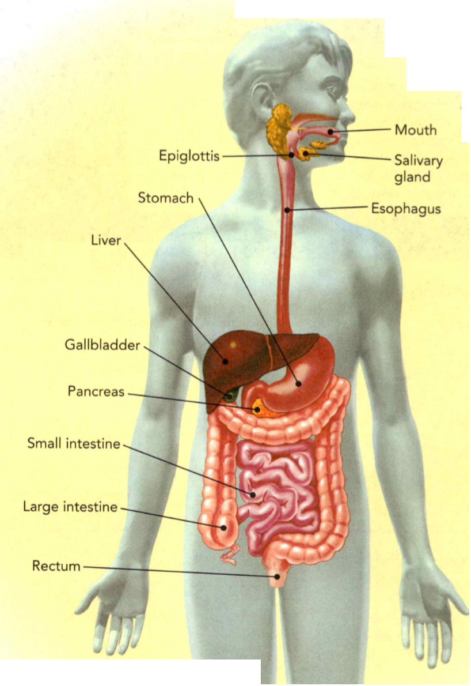
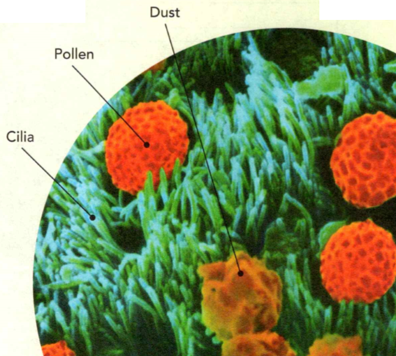
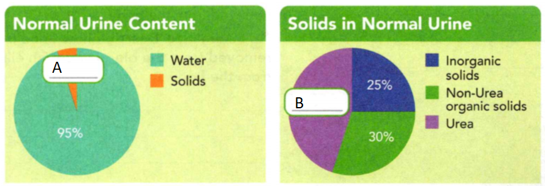

### Life Science

## Biology

## Managing Materials in the Body

To **circulate** is to move in a circle and return to the same point.

To **transport** is to carry something from one place to another.

**Glucose** is a sugar that is the major source of energy for the body's cells.

**Complete the tasks below.**

1. Each day, Ken circulates from the food pantry to senior centers around the
city and then returns to the pantry. He transports meals and juice to the
seniors and collects their empty bottles. Similarly, your blood circulates in
your body. From the heart, your blood carries oxygen and glucose to your body
cells. It picks up wastes before returning to the heart. What materials does
your blood transport to your body cells?

1. Obtaining energy from food is a ____ activity.

### Chapter Preview

- calorie 
- enzyme 
- esophagus
- peristalsis 
- villi
- circulatory system 
- heart
- atrium 
- ventricle 
- valve
- artery 
- aorta 
- capillary 
- vein
- hemoglobin
- pharynx
- trachea
- cilia
- bronchi
- lungs
- alveoli
- diaphragm
- larynx
- vocal cords
- excretion
- urea
- urine
- kidney
- ureter
- urinary bladder
- urethra
- nephron

### Digestion
- Why Do You Need Food?
- What Happens in Your Digestive System?

**Complete the tasks below.**

1. The Science of Food You know that you need to eat food every day. But did you
know that for some people studying food is their job? People called food
scientists research and improve the food products you buy at the grocery store.
Sometimes, they even think up new foods! Many food scientists spend a lot of
time in a lab. They use what they know about biology and chemistry to test foo
for nutrition, taste, and shelf life, which is how long the food will last
before it spoils. If you like science and food, being a food scientist might be
the job for you!
a) Why should food scientists test foods before the foods are sold?
b) How might food scientists improve your favorite breakfast food?

### Why Do You Need Food?
All living things need food to stay alive. **Food provides your body with
materials to grow and to repair tissues. It also provides energy for everything
you do.** Exercising, reading, and sleeping require energy. Even maintaining
homeostasis takes energy.

### Calories 

When food is used for energy, the amount of energy released is measured in
calories. One **calorie** is the amount of energy needed to raise the
temperature of one gram of water by one degree Celsius. The unit Calorie, with a
capital C, is used to measure the energy in foods. One Calorie equals 1,000
calories. Everyone needs a certain number of Calories to meet their daily energy
needs. However, the more active you are, the more Calories you need.

**Complete the tasks below.**

  <figure>
    
    <figcaption>Figure 1. Bar graph.</figcaption>
  </figure>

1. The U.S. Department of Agriculture recommends that people do about 30 to 60
minutes of physical activity most days. The data shows the Calories a
13-year-old weighing 45 kilograms burned in 30 minutes of each activity.
Activiy/Calories Burned in 30 minutes: Soccer/275, Dancing/115, Walking/75
a) Use the data to draw a bar graph in Figure 1. 
b) Write a title for the bar graph.
c) Why does the type of physical activity change a person's dietary needs? Use
the graph to explain your answer.

### What Nutrients Do You Need? 

Your body breaks down the food you eat into nutrients. Nutrients are the
substances in food that provide the raw materials and energy the body needs to
carry out all its processes. People need six types of nutrients: carbohydrates,
fats, proteins, vitamins, minerals, and water.

### Carbohydrates

Carbohydrates are a major source of energy. They also provide raw materials to
make cell parts. About 45 to 65 percent of your daily Calories should come from
carbohydrates. Simple carbohydrates, called sugars, can give you a quick burst
of energy. One sugar, glucose, is the major source of energy for your cells.
Complex carbohydrates are made of many linked sugar molecules. Starch is a
complex carbohydrate. Potatoes. rice. wheat, and corn contain starches Your body
breaks down starches into sugar molecules. In this way, starches provide a
steady long-term energy source.

### Fats
Like carbohydrates, fats are energy- containing nutrients. However, 1 gram of
fat provides 9 Calories of energy, while 1 gram of carbohydrate provide: only 4
Calories. Fats form part of the cell membrane. Fatty tissue also protects your
organs and insulates your body. No more than 30 percent of your daily Calories
should come from fats.

### Proteins

Your body needs proteins for growth and tissue repair. Proteins also can be an
energy source. About 10 to 35 percent of your daily Calorie intake should come
from proteins. Proteins are made up of small, linked units called amino acids.
Thousands of different proteins are built from about 20 different amino acids.
Your body can make about half of the amino acids it needs. The other half must
come from food. Foods from both animals and plants contain protein.

### Vitamins and Minerals

Unlike some nutrients, vitamins do not provide the body with raw materials and
energy. Instead, vitamins act as helper molecules in your body's chemical
reactions. The body can make a few vitamins, such as vitamin D, but foods are
the source of most vitamins. Nutrients that are not made by living things are
called minerals. Like vitamins, minerals do not provide your body with raw
materials and energy. However, your body still needs small amounts of minerals
to carry out chemical processes. For example, you need calcium to build bones
and teeth, and you need iron to help red blood cells function. Plant roots
absorb minerals from the soil. You obtain minerals by eating plants or animals
that have eaten plants.

### Water

Water is the most important nutrient because all the body's vital processes take
place in water. In addition, water helps regulate body temperature and remove
wastes. Water accounts for about 65 percent of the average healthy person's body
weight because it makes up most of the body's fluids, including blood. Under
normal conditions, you need to take in about 2 liters of water every day to stay
healthy.

  <figure>
    
    <figcaption>Figure 2. Feeding Your Body.</figcaption>
  </figure>

**Complete the tasks below.**

1. Feeding Your Body. The nutrients your body needs come from the foods you eat.
Why do you think it's important to eat a variety of foods every day?

2. What does a Calorie measure?

3. What do you think is meant by the phrase "a balanced diet"?

4. Why do active teenagers have high energy needs?

5. Food provides the body with ___ .

### What Happens in Your Digestive System?

Your digestive system is about 9 meters long from beginning to end. Figure 3
shows the structures of the digestive system. **The digestive system breaks down
food, absorbs nutrients, and eliminates waste.** These functions occur one after
the other in an efficient, continuous process.

  <figure>
    
    <figcaption>Figure 3. The Digestive System.</figcaption>
  </figure>

### Digestion 

The process by which your body breaks down food into small nutrient molecules is
called digestion. Digestion can be mechanical or chemical. In mechanical
digestion, bites of food are torn or ground into smaller pieces. This kind of
digestion happens mostly in the mouth and stomach. In chemical digestion,
chemicals break foods into their building blocks. Chemical digestion takes place
in many parts of the digestive system. Substances made in the liver and pancreas
help digestion occur.

### Absorption and Elimination 

Absorption occurs after digestion. Absorption is the process by which nutrient
molecules pass from your digestive system into your blood. Most absorption
occurs in the small intestine. The large intestine eliminates materials that are
not absorbed.

**Complete the tasks below.**

1. The Digestive System, see Figure 3. Food passes directly through five organs
of your digestive system.
a) Identify the name(s) of the organ(s) where mechanical digestion mainly occurs. 
b) Identify the name(s) of the organ(s) where most absorption occurs. 
c) Identify the name(s) of the organ(s) where elimination occurs.

### The Mouth 

Have you noticed that smelling food can be enough to start your mouth watering?
This response happens because your mouth is where digestion begins. When you
bite off a piece of food, both mechanical and chemical digestion begin inside
your mouth. Your teeth and tongue carry out mechanical digestion. Your teeth
cut, tear, crush, and grind food into small pieces. Your tongue pushes food
toward your teeth.

As your teeth work, your saliva moistens food into a slippery mass.
Saliva is the fluid released by salivary glands when you eat. Saliva contains a
chemical that can break down starches into sugars. This step begins the chemical
digestion of your food.

The chemical in saliva that digests starch is an enzyme. An **enzyme** is a protein
that speeds up chemical reactions in the body. Your body produces many different
enzymes. Each enzyme has a specific chemical shape that enables it to speed up
only one kind of reaction. Different enzymes are needed to complete the process
of digestion. Figure 4 shows how enzymes work.

- The starch molecule binds to an enzyme that has a matching shape.
- The starch molecule is broken down into two separate sugar molecules.
- The enzyme and the sugar molecules all separate.

  <figure>
    
    <figcaption>Figure 4. How Enzymes Work.</figcaption>
  </figure>

**Complete the tasks below.**

1. How Enzymes Work, see Figure 4. Enzymes help break down starches, proteins,
and fats. Which molecule does not change?

  <figure>
    
    <figcaption>Figure 5. Teeth.</figcaption>
  </figure>

2. You have four types of teeth, see Figure 5. Each type has a specific
function.
a) Think about eating a carrot. Which type of teeth cuts the carrot into a
bite-sized piece?
b) Which teeth at the back of your mouth crush and grind the carrot piece? __
and __ .	
c) When people tear chicken off a bone, they use their pointed teeth called __ .
d) Write about all the teeth people use to eat an apple.

### To the Stomach 

Food moves from your mouth through your **esophagus** and then into your
stomach. The stomach is a J-shaped muscular pouch where most mechanical
digestion and some chemical digestion occur. Mechanical digestion occurs as
layers of smooth muscle in the stomach wall contract, producing a churning
motion. Chemical digestion occurs as the food mixes with digestive juice.
Digestive juice is a fluid produced by cells that line the stomach. It contains
the enzyme pepsin that chemically digests proteins into short chains of amino
acids.

Food usually stays in your stomach for a few hours until mechanical digestion is
complete. Now a thick liquid, the food enters the next part of the digestive
system. That is where chemical digestion continues and absorption takes place.

  <figure>
    
    <figcaption>Figure 6. The Stomach.</figcaption>
  </figure>

**Complete the tasks below.**

1. The stomach wall has three muscle layers, see Figure 6. The microscopic view
shows you the cells that line the inside of the stomach.
Esophagus The esophagus is lined with mucus, a thick, slippery substance
produced by the body. Mucus helps food move easily. Peristalsis Waves of
involuntary muscle contractions, called peristalsis (pehr ih STAWL sis), push
food through the esophagus and the rest of the digestive system. Stomach Lining
Cells here produce digestive juice that contains hydrochloric acid, a strong
acid that helps pepsin work. Mucus lines the stomach and protects it from the
acid.
a) What type of digestion is aided by the action of stomach muscles?
b) How does having different layers of stomach muscles aid digestion?

### The Small Intestine 

At about 6 meters_ longer than some full-sized cars_ the small intestine makes up
two thirds of the length of the digestive system. The small intestine is the
part of the digestive system where most chemical digestion and absorption take
place. Its small diameter, from 2 to 3 centimeters wide, gives the small
intestine its name.

A great deal happens in the small intestine. When food reaches it, starches and
proteins have been partially broken down, but fats have not been digested.
**Substances produced by the liver, pancreas, and lining of the small intestine
help to complete chemical digestion.** The liver and the pancreas send their
substances into the small intestine through small tubes.

  <figure>
    
    <figcaption>Figure 7. Organs of Digestion.</figcaption>
  </figure>

**Complete the tasks below.**

1. Organs of Digestion, see Figure 7. The liver, pancreas, and gallbladder aid
digestion in the small intestine.
**Gallbladder** The gallbladder stores bile and releases it into the small
intestine.
**Liver** The liver has many jobs. One job is making bile for the digestive
system. Bile breaks fats into smaller droplets but is not involved in chemical
digestion.
**Pancreas** Like the liver, the pancreas has many jobs. One job is to produce
enzymes that break down carbohydrates, proteins, and fats.
a) Fill in the missing label A.
b) Fill in the missing label B.
c) How may a blockage in the tube between the gallbladder and the small
intestine affect digestion?

### Absorption in the Small Intestine 

After chemical digestion takes place, the small nutrient molecules are ready for
the body to absorb. The structure of the small intestine helps absorption occur.
The inner surface of the small intestine is folded into millions of tiny
finger-shaped structures called **villi** (singular villus). Villi, shown in
Figure 8, greatly increase the surface area of the small intestine. More surface
area means that more nutrients can be absorbed. Nutrient molecules pass from
cells on the surface of a villus into blood vessels and are then delivered to
body cells.

  <figure>
    
    <figcaption>Figure 8. Tiny villi line the folds of the small intestine..</figcaption>
  </figure>

**Complete the tasks below.**

1. If the average person's small intestine had smooth walls, its surface area
would be 0.57 m2. With villi, the surface area is about 250
m2, about the size
of a tennis court.
a) Divide to find how many times greater the surface area is with villi than it
is without villi. Round your answer to the nearest whole number.
b) In Question a), how did you know which number to divide by to get your answer?
c) Some people have a wheat allergy that results in villi being destroyed. What
problems might these individuals have?

### The Large Intestine 

By the time material reaches the end of the small intestine, most nutrients have
been absorbed. The water and undigested food that is left move from the small
intestine into the large intestine. The large intestine is the last section of
the digestive system. As the material moves through the large intestine, water
is absorbed into the bloodstream. The remaining material is readied for
elimination from the body.

The large intestine is about 1.5 meters long. It contains bacteria that feed on
the material passing through. These bacteria normally do not cause disease. In
fact, they are helpful because they make certain vitamins, including vitamin K.

The large intestine ends in a short tube called the rectum. In the rectum waste
material is compressed into solid form. This waste material is eliminated from
the body through the anus, a muscular opening at the end of the rectum.

**Complete the tasks below.**

1. Write the sequence of organs that food passes through during digestion. 
Mouth - ___ - ___ - ___ - ____ .

2. ___ digestion occurs when enzymes break down foods into simpler substances.
(Chemical/Mechanical)

3. How is the stomach similar to a washing machine?

4. How are the liver and pancreas involved in digestion?

5. How do villi help the small intestine carry out its function?

6. The digestive system works through the actions of organs that include ___ .

### The Circulatory System
- What Happens in Your Circulatory System? 
- What Does Blood Contain?
- 
**Complete the tasks below.**

1. Why is it important for a person's heart to be healthy? Your Heart, Your
Health Here are some fascinating facts that you may not know about your heart. -
In one year, your heart pumps enough blood to fill more than 30
competition-sized swimming pools! - A drop of blood makes the entire trip
through your body in less than a minute. - Your heart beats about 100,000 times
a day. - Your heart pushes bloo- through about 100,000 kilometers of vessels.
They would circle Earth more than twice! - A child's heart is about the size of
a fist. An adult's heart is about the size of two fists. About how many times
does your heart beat in a week? In a year?

### What Happens in Your Circulatory System?

As shown in Figure 9, the **circulatory system**, or cardiovascular system, is
made up of the heart, blood vessels, and blood. **The circulatory system
delivers needed substances to cells, carries wastes away from cells, and helps
regulate body temperature. In addition, blood contains cells that fight
disease.**

#### Delivers Materials
Blood transports chemical messengers, oxygen from your lungs, and glucose from
your digestive system to your body cells.

#### Removes Wastes
Blood takes away wastes from body cells. For example, blood transports carbon
dioxide from body cells to your lungs, where it is exhaled.

#### Regulates Body Temperature
Changes in the amount of blood flow in the skin help carry heat away or prevent
heat loss.

#### Fights Disease
Blood contains cells that attack disease-causing microorganisms.

  <figure>
    
    <figcaption>Figure 9. The Circulatory System.</figcaption>
  </figure>

**Complete the tasks below.**

1. Like roads that link all the parts of a town, your circulatory system links
all the parts of your body. See Figure 9.
a) What might happen if your circulatory system did not function properly?

### The Heart 

Without your heart, your blood would not go anywhere. As Figure 2 shows, the
**heart** is a hollow, muscular organ that pumps blood to the body through blood
vessels.

  <figure>
    
    <figcaption>Figure 10. The Heart.</figcaption>
  </figure>

- Left Atrium - Oxygen-rich blood from the lungs enters the left atrium.
- Right Atrium - The right atrium receives oxygen-poor blood from the body.
- Right Ventricle - The right ventricle pumps oxygen-poor blood to the lungs.
- Left Ventricle - The left ventricle pumps oxygen-rich blood to all parts of the body.

### The Heart's Structure 

The heart has a right side and left side that are completely separated by a wall
of tissue called the septum. Each side has two chambers. Each upper chamber,
called an **atrium** (plural atria), receives blood that comes into the heart.
Each lower chamber, called a **ventricle**, pumps blood out of the heart. The
pacemaker, a group of cells in the right atrium, sends out signals that regulate
heart rate. These signals make the heart muscle contract.

**Complete the tasks below.**

1. The Heart, see Figure 10. Your heart works 24 hours a day, resting only
between beats.
a) Find and label the septum on the diagram.
b) Explain why the contraction of the left ventricle must be stronger than the
contraction of the right ventricle.

### How the Heart Works 

Valves separate the atria from the ventricles. A **valve** is a flap of tissue
that prevents blood from flowing backward. Valves also separate the ventricles
and the large blood vessels that carry blood away from the heart.

A heartbeat sounds something like lub-dup. First, the heart muscle relaxes and
the atria fill with blood. Next, the atria contract, squeezing blood through
valves, like those in Figure 11, and into the ventricles. Then the ventricles
contract. This contraction closes the valves between the atria and ventricles,
making the lub sound and squeezing blood into large blood vessels. Finally, the
valves between the ventricles and blood vessels snap shut, making the dup sound.
All this happens in less than one second.

  <figure>
    
    <figcaption>Figure 11. Heart Valves.</figcaption>
  </figure>

Valves control the direction of blood flow through the heart.

### The Path of Blood Flow 

As you can see in Figure 12, the overall pattern of blood flow through the body
is similar to a figure eight. The heart is at the center where the two loops
cross. In the first loop, blood travels from the heart to the lungs and then
back to the heart. In the second loop, blood travels from the heart throughout
the body and then back to the heart.

Your body has three kinds of blood vessels: arteries, capillaries, and veins.
Arteries carry blood away from the heart. For example, blood in the left
ventricle is pumped into the aorta the largest artery in the body. From the
arteries, blood flows into tiny vessels called capillaries. In the capillaries,
substances are exchanged between the blood and body cells. From capillaries,
blood flows into veins, which carry blood back to the heart.

  <figure>
    
    <figcaption>Figure 12. Blood Flow.</figcaption>
  </figure>

**Complete the tasks below.**

1. Blood Flow, see Figure 12. Your heart can pump five liters of blood through the two loops each minute. 
a) In each box, write where the blood from the heart travels. 
b) Identify where blood travels after it leaves each part listed below.
- Right atrium
- Veins from the body
- Arteries to the lungs

### A Closer Look at Blood Vessels 

Like hallways in a large building, your blood vessels run through all the
tissues of your body. Although some blood vessels are as wide as your thumb,
most of them are much finer than a human hair. If all the blood vessels in your
body were hooked together end to end, they would stretch a distance of almost
100,000 kilometers. That's long enough to wrap around Earth twice- with a lot
left over!

### Arteries 

Arteries, shown in Figure 13, are thick-walled, muscular vessels. Arteries carry
blood away from the heart. As they do, they split into smaller arteries. In
general, the thick, elastic artery walls have three tissue layers. The innermost
layer is epithelial tissue that enables blood to flow freely. The middle layer
is mostly smooth muscle tissue that relaxes and contracts, allowing the artery
to widen and narrow. This layer regulates the amount of blood sent to different
organs. The outer layer is flexible connective tissue. These layers enable
arteries to withstand the force of pumping blood.

### Capillaries 

Blood flows from arteries into tiny capillaries. The thin capillary walls are
made of a single layer of epithelial cells. Materials pass easily from the
blood, through the capillary walls, and into the body cells. The waste products
of cells pass in the opposite direction.

### Veins 

Capillaries merge and form larger vessels called veins. From capillaries, blood
enters veins and travels back to the heart. The walls of veins have the same
tissue layers as arteries. However, the walls of veins are thinner than artery
walls.

  <figure>
    
    <figcaption>Figure 13. Blood Vessels.</figcaption>
  </figure>

**Complete the tasks below.**

1. Blood vessels, see Figure 13. What happens to blood in each kind of vessel.
a) Artery
b) Capillary
c) Vein

2. In the diagram in Figure 13, label the parts of each vessel. 

4. Blood vessels, see Figure 13. Describe how the vessel's structure enables it
to function.
a) Artery
b) Capillary
c) Vein

5. Your pulse results from the alternating relaxation and contraction of
arteries as blood is forced through them. Touch the inside of your wrist and
find your pulse.
a) How does your pulse feel through your fingertips?
b) How many heartbeats do you count in one minute?

6. Blood returning from the lungs enters the heart at the (right atrium/left
atrium/right ventricle/left ventricle).

7. In which direction do arteries carry blood?

8. Why is it important for your blood to complete both loops of circulation?

9. The circulatory system transports ___ .

### What Does Blood Contain?

While riding your bike, you fall off and scrape your knee. Your knee stings, and
blood oozes from the open wound. You go inside to clean the scrape. As you do,
you wonder about what blood is.

Blood is a complex tissue. **Blood has four components: plasma, red blood cells,
white blood cells, and platelets.** About 45 percent of the volume of blood is
cells. The rest is plasma.

  <figure>
    
    <figcaption>Figure 14. Cells in Blood.</figcaption>
  </figure>

Transfusions for patients in hospitals and other medical facilities create a
constant need for blood. In Florida, blood centers across the state collect a
total of more than 1,000,000 units of blood each year. (One unit is equal to 450
mL.)

### Red Blood Cells

Red blood cells take up oxygen in the lungs and deliver it to cells throughout
the body. Red blood cells, like most blood cells, are produced in bone marrow.
Mature red blood cells have no nuclei. Without a nucleus, a red blood cell
cannot reproduce or repair itself. Mature red blood cells live only about 120
days.

### Hemoglobin
A red blood cell is made mostly of **hemoglobin**, a protein that contains iron
and binds chemically to oxygen molecules in the lungs. Hemoglobin releases
oxygen as blood travels through the capillaries. Oxygen makes red blood cells
bright red. Without it, the cells are dark red. Hemoglobin also picks up some
carbon dioxide produced by cells and releases it into the lungs.

### Plasma
Most materials transported in blood travel in the plasma. Plasma carries
nutrients, such as glucose, fats, vitamins, and minerals. Plasma also carries
chemical messengers that direct body activities, such as how your cells use
glucose. In addition, plasma carries away most of the carbon dioxide and many
other wastes that cell processes produce. Proteins in the plasma make it look
pale yellow. Some of these proteins regulate water in the blood. Some help fight
disease. Others help to form blood clots.

### White Blood Cells

Like red blood cells, white blood cells are produced in bone marrow. White blood
cells are the body's disease fighters. Some white blood cells recognize
disease-causing organisms, such as bacteria, and alert the body to the invasion.
Other white blood cells produce chemicals to fight the invaders. Still others
surround and kill the organisms. White blood cells are larger than red blood
cells and contain nuclei. They may live for days, months, or even years.

### Platelets

Platelets are cell fragments that help form blood clots. When a blood vessel is
cut, platelets collect and stick to the vessel at the wound. The platelets
release chemicals that produce a protein called fibrin. Fibrin weaves a net of
tiny fibers across the cut. Platelets and blood cells become trapped in the net,
and a blood clot forms.

**Complete the tasks below.**

1. Cells in Blood, see Figure 14. In addition to red blood cells and white blood
cells, blood contains platelets and plasma.
a) What is the main function of hemoglobin in the blood?
b) What do you think would happen to the number of white blood cells in the body
when a person is fighting an infection? Explain your answer.

2. List and describe the materials that plasma carries.

### Marker Molecules and Transfusions 

A blood transfusion is the transfer of blood from one person to another. Most
early attempts at blood transfusion failed, but no one knew why. In the early
1900s, a physician named Karl Landsteiner tried mixing blood samples from two
people. Sometimes the two blood samples blended smoothly. At other times, the
red blood cells clumped together. In a patient, this clumping would clog the
capillaries, causing death.

### Blood Types 

Landsteiner identified the four major types of blood: A, B, AB, and 0. Blood
types are determined by marker molecules on red blood cells. If your blood type
is A, you have the A marker. If your blood type is B, you have the B marker.
People with type AB blood have both A and B markers. People with type 0 blood do
not have A or B markers.

Clumping proteins in your plasma recognize red blood cells with "foreign"
markers that are not your type. The proteins make cells with foreign markers
clump together. For example, blood type A contains anti-B clumping proteins that
act against cells with B markers. Blood type 0 has clumping proteins for both A
and B markers. In Figure 7, you can see all the blood type marker molecules and
clumping proteins.

  <figure>
    
    <figcaption>Figure 15. Blood Types and Their Markers.</figcaption>
  </figure>

### Rh Factor 

Landsteiner also discovered a protein on red blood cells that he called Rh
factor. About 85 percent of the people he tested had this protein. The rest did
not. As with blood type, a marker molecule on the red blood cells determines the
presence of Rh factor. An Rh-positive blood type has the Rh marker. An
Rh-negative blood type does not. Clumping proteins will develop in people with
Rh-negative blood if they receive Rh-positive blood. This situation may be
potentially dangerous.

**Complete the tasks below.**

1. Depending on your blood type, you may have certain marker molecules on your
red blood cells and certain clumping proteins in your plasma, see Figure 15.
a) Label the marker molecules 
b) Identify the clumping proteins. Blood Type B
c) Identify the clumping proteins. Blood Type AB
d) Identify the clumping proteins. Blood Type O

  <figure>
    
    <figcaption>Figure 16. Safe/Unsafe Donors.</figcaption>
  </figure>

2. The marker molecules on your red blood cells determine the type of blood you
can safely receive in transfusions. For example, a person with type A blood can
receive transfusions of type A or type 0 blood. But type B blood would cause
clumping and would not be safe. Through a process called cross-matching, a
patient's blood type is checked so that safe donor types can be determined. Use
what you know about blood types to complete the table in Figure 16.

3. Which blood type may accept safe transfusions from any other blood type? Why?

4. Which blood type is a "universal donor," that is, a blood type that can be
used in transfusions to anyone? Explain your reasoning.

5. What is plasma?

6. What did Karl Landsteiner's observations lead him to discover?

7. How might a lack of iron in a person's diet affect his or her blood?

8. Blood contains ___ .

### The Respiratory System

- What Is the Role of the Respiratory System? 
- What Happens When You Breathe?

**Complete the tasks below.**

1. The Breath of Life Misconception: The only gas you exhale is carbon dioxide.
Actually, about 16 percent of the air you exhale is oxygen. The air you inhale
is made up of about 21 percent oxygen. Your body only uses a small portion of
the oxygen in each breath, so the unused portion is exhaled. Sometimes, this
exhaled oxygen can mean the difference between life and death. If a person stops
breathing, he or she needs to get more oxygen quickly. A rescuer can breathe
into the person's mouth to give unused oxygen to the person. This process is
called rescue breathing. Why would you want to learn to perform rescue
breathing?

### What Is the Role of the Respiratory System?

In an average day, you may breathe 20,000 times. You breathe all the time
because your body cells need oxygen, which comes from the air. **Your
respiratory system moves air containing oxygen into your lungs and removes
carbon dioxide and water from your body. Your lungs and the structures that lead
to them make up your respiratory system.**

### Breathing and Homeostasis 

Your body needs oxygen for cellular respiration. During cellular respiration,
cells break down glucose, releasing energy. You use energy for activities such
as reading this book or playing ball. Your body also uses energy in carrying out
processes that maintain homeostasis, such as removing wastes, growing, and
regulating body temperature.

Breathing gets oxygen into your body. But cellular respiration depends on body
systems working together. The digestive system supplies glucose from food. And
the circulatory system carries this glucose and the oxygen from the respiratory
system to all the cells in the body.

Substances in the air you breathe can affect your lungs and breathing passages.
The Florida Department of Environmental Protection monitors and reports on air
quality for the entire state. The reports include data about particles that can
cause allergies and other pollutants that can affect human health.

  <figure>
    
    <figcaption>Figure 17. Systems Working Together.</figcaption>
  </figure>

**Complete the tasks below.**

1. Systems Working Together, see Figure 17. Body systems work together, getting
the materials needed for cellular respiration to cells. Describe how each system
provides cells with materials needed for cellular respiration.
a) Respiratory System
b) Circulatory System
c) Cellular Respiration and Homeostasis
d) Digestive System

2. How does cellular respiration help the body to maintain homeostasis.

### Breathing Structures 

When you breathe in, air and
particles such as pollen and dust move through a series of structures and then into the lungs. You can see these structures_the nose, pharynx, trachea, and bronchi_on the right. These structures also warm and moisten the air you breathe.

### Nose 

Air enters the body through the nose or the mouth. Hairs in the nose trap large
particles. The air passes into spaces called nasal cavities. Some cells lining
the nasal cavities produce mucus, a sticky material that moistens the air and
traps more particles.

### Pharynx and Trachea 

From the nose, air enters the **pharynx**, or throat. Both the nose and the mouth
connect to the pharynx. So air and food enter the pharynx. From the pharynx, air
moves into the **trachea**, or windpipe. When you swallow, a thin flap of tissue
called the epiglottis covers the opening of the trachea to keep food out. Cells
that line the trachea have **cilia** (singular cilium), tiny hairlike
extensions that can move together in a sweeping motion. The cilia, like those
shown in Figure 18, sweep the mucus made by cells in the trachea up to the
pharynx. If particles irritate the trachea, you cough, sending the particles
back into the air. Find the pharynx and trachea in Figure 19.

  <figure>
    
    <figcaption>Figure 18. Cilia.</figcaption>
  </figure>

### Bronchi and Lungs 

Air moves from the trachea into the left and right **bronchi** (singular
bronchus). These two passages take air into the lungs. The **lungs** are the
main organs of the respiratory system. Inside the lungs, the bronchi branch into
smaller and smaller tubes. At the end of the smallest tubes are **alveoli**
(singular alveolus), tiny, thin-walled sacs of lung tissue where gases can move
between air and blood.

  <figure>
    
    <figcaption>Figure 19. Structures of the Respiratory System.</figcaption>
  </figure>

**Complete the tasks below.**

1. Cilia, see Figure 18. The photo shows a microscopic view of cilia.
a) How does coughing protect the respiratory system?
b) What might happen if you did not have hairs in your nose and cilia in your
trachea?

2. Structures of the Respiratory System, see Figure 19. Particles in air are
filtered out as the air moves through your respiratory system. Describe what
each part of the respiratory system does.
a) Nose
b) Pharynx
c) Lung
d) Bronchus
e) Trachea

3. What happens in the lungs?

4. How are breathing and cellular respiration different?

### What Happens When You Breathe?

Like other body movements, breathing is controlled by muscles. The lungs are
surrounded by the ribs, which have muscles attached to them. At the base of the
lungs is the diaphragm, a large, dome-shaped muscle. You use these muscles to
breathe. **When you breathe, your rib muscles and diaphragm work together,
causing air to move into or out of your lungs. This airflow leads to the
exchange of gases that occurs in your lungs.**

### The Breathing Process 

As shown in Figure 20, when you inhale your rib muscles contract. This tightening
lifts the chest wall upward and outward. At the same time, the diaphragm
contracts and flattens. These two actions make the chest cavity larger, which
lowers the air pressure inside your lungs. The air pressure outside your body is
now higher than the pressure inside your chest. This pressure difference causes
air to rush into your lungs.

When you exhale, your rib muscles and diaphragm relax. As they relax, your chest
cavity becomes smaller, making the air pressure inside your chest greater than
the air pressure outside. As a result, air rushes out of your lungs.

  <figure>
    
    <figcaption>Figure 20. The Breathing Process.</figcaption>
  </figure>

**Complete the tasks below.**

1. The Breathing Process, see Figure 20. When you inhale, air is pulled into
your lungs. When you exhale, air is forced out.
Describe what happens to your muscles when you breathe.
a) Inhale, Rib Muscles
b) Inhale, Diaphrame
d) Exhale, Rib Muscles
e) Exhale, Diaphrame

### Breathing and Speaking 

Did you know that the air that moves out of your lungs when you breathe also
helps you to speak? Your **larynx**, or voice box, is located at the top of your
trachea. Two **vocal cords**, which are folds of connective tissue, stretch
across the opening of the larynx. When you speak, muscles make the vocal cords
contract, narrowing the opening as air rushes through. Then the movement of the
vocal cords makes air molecules vibrate, or move rapidly back and forth. This
vibration causes a sound - your voice.

**Complete the tasks below.**

1. Describe the steps that help you speak.
a) Step 1
b) Step 2
c) Step 3

2. When you sing, the sounds you make can vary in pitch. That is, you can sing
low notes, high notes, and many notes in between. Press your index and middle
fingers of one hand gently on the front of your throat.
a) Hum softly, and move your fingers around until you think you have located
your voice box. How did humming help you find it?
b) With your fingers still in place, sing softly, switching between low notes
and high notes. Describe the differences you felt.
c) How do you think the function of the vocal cords is related to these
differences?

### Gas Exchange 

Air's final stop in its journey through the respiratory system is an alveolus in
the lungs. An alveolus has thin walls and is surrounded by many thin-walled
capillaries. Figure 5 shows some alveoli.

Because the alveoli and the capillaries have very thin walls, certain materials
can pass through them easily. After air enters an alveolus, oxygen passes
through the wall of the alveolus and then through the capillary wall into the
blood. Similarly, carbon dioxide and water pass from the blood into the air
within the alveolus. This whole process is called gas exchange.

### How Gas Exchange Occurs 

Imagine that you are a drop of blood. You are traveling through a capillary that
wraps around an alveolus. You have a lot of carbon dioxide and a little oxygen.
As you move through the capillary, oxygen attaches to the hemoglobin in your red
blood cells. Carbon dioxide moves into the alveolus. As you move away from the
alveolus, you are rich in oxygen and poor in carbon dioxide.

  <figure>
    
    <figcaption>Figure 21. Gas Exchange.</figcaption>
  </figure>

### Surface Area for Gas Exchange 

Your lungs can absorb a large amount of oxygen because of the surface area of
the alveoli. An adult's lungs have about 300 million alveoli. Together these
alveoli have a surface area of about 100 meters squared (m2) - the
area of the floor in an average classroom! As a result, the alveoli provide a
huge amount of surface area for exchanging gases. Therefore, healthy lungs can
supply all the oxygen that a person needs - even when the person is very active.

**Complete the tasks below.**

1. Gas Exchange, see Figure 21. Gases move across the thin walls of both alveoli
and capillaries. Label each arrow with the gas being exchanged and describe
where it is coming from and moving to.

2. The verb absorb means "to take in." Use this meaning to write a sentence
using the noun absorption.

3. Where is the larynx located?

4. When you inhale, why does air rush into your lungs?

5. How do the alveoli enable people to be very active?

6. When I breathe, air ___ .

### Excretion
- What Is the Role of the Excretory System?
- How Does Excretion Help Your Body Maintain Homeostasis?

**Complete the tasks below.**

1. Useful Urine. You can recycle plastic, glass, and paper. Did you know that
urine can be recycled, too? Some astronauts in space will see their urine turned
into drinking water! NASA has developed a machine that will purify the
astronauts' urine. The water that is recovered can be used for drinking, among
other things. Why do astronauts need this kind of machine? Large quantities of
water are too heavy to carry into space. So the machine runs urine through a
filtering system to remove waste. Then iodine is added to the filtered urine to
kill any harmful bacteria. What remains is drinkable water.
a) How else might the astronauts use the filtered urine?
b) Do you think this system would be useful on Earth? Why or why not?

### What Is the Role of the Excretory System?

The human body faces a challenge similar to keeping your room clean. Just as you
must clean up papers that pile up in your room, your body must remove wastes
from cellular respiration and other processes. The process of removing waste is
called **excretion**.

If wastes were not removed from your body, they would pile up and make you sick.
**The excretory system collects the wastes that cells produce and removes them
from the body.** The system includes the kidneys, ureters, urinary bladder,
urethra, lungs, skin, and liver. Two wastes that your body must eliminate every
day are excess water and urea. **Urea** is a chemical that comes from the breakdown
of proteins. As you know, the lungs eliminate some water. Most remaining water
is eliminated in a fluid called **urine**, which includes urea and other wastes.

**Complete the tasks below.**

  <figure>
    
    <figcaption>Figure 22. Urine Content.</figcaption>
  </figure>

1. Urine is made up of water, organic solids, and inorganic solids, see Figure
22. The organic solids include urea and acids. The inorganic solids include
salts and minerals. The solids are dissolved in the water.
a) Calculate and label on the Normal Urine Content graph the percentage of urine
that is solids. 
b) Calculate and label on the Solids in Normal Urine graph the percentage of
solids that is urea.
c) What might a sharp decrease in the percentage of water in a person's urine
indicate about the health of that person?

### Structures That Remove Urine 

Figure 1 shows the organs that remove urine from the body. Your two kidneys are
the major organs of the excretory system. The **kidneys** act like filters. They
remove urea and other wastes from the blood but keep materials that the body
needs. These wastes are eliminated in the urine. Urine flows from the kidneys
through two narrow tubes called **ureters**. The ureters carry urine to the **urinary
bladder**, a muscular sac that stores urine. Urine leaves the body through a small
tube called the **urethra**.

### Waste Filtration 

Each kidney has about one million nephrons. A **nephron** is a tiny filtering
factory that removes wastes from blood and produces urine. The nephrons filter
wastes in two stages. First, both wastes and needed materials are filtered out
of the blood. Next, much of the needed material is returned to the blood, and
the wastes are eliminated from the body. Follow this process in Figure 2.

  <figure>
    
    <figcaption>Figure 23. Removing Urine.</figcaption>
  </figure>

**Complete the tasks below.**

1. Removing Urine, see Figure 23. Urine is produced in the kidneys and then
removed from the body. Describe how urine is removed from the blood and then
eliminated from the body.

  <figure>
    
    <figcaption>Figure 24. How the Kidneys Work.</figcaption>
  </figure>

2. How the Kidneys Work, see Figure 24. Stage 1
- Blood flows into the cluster of capillaries
in the thin-walled, hollow nephron capsule.
- Urea, glucose, and some water are filtered out of the blood and into the capsule.
- These materials then pass into the nephron tube.
Stage 2
- As the material flows through the nephron tube, most of the needed glucose and water move back into the blood through the capillaries.
- Most of the urea and some of the water stay in the nephron tube and become urine.
Most of the work of the kidneys is done in the nephrons.
In the key, write what each color represents in the diagram. 
a) A
b) B
c) C
d) Explain below why it is important for capillaries to surround the nephron
tube.

3. The chemical	___ comes from the breakdown of proteins.

4. Why is it important for a kidney to have many nephrons?

5. The function of the excretory system is to ___ .

6. You know the noun excretion means "the process of removing wastes." Use this
meaning to choose the correct meaning of the verb excrete.
A) relating to removing wastes 
B) to remove wastes
C) the state of removing wastes

### How Does Excretion Help Your Body Maintain Homeostasis?

A buildup of wastes such as urea, excess water, and carbon dioxide can upset
your body's balance. **Excretion helps to maintain homeostasis by keeping the
body's internal environment stable and free of harmful levels of chemicals.**
The organs of excretion include the kidneys, lungs, skin, and liver.

### Kidneys 

As the kidneys filter blood, they regulate the amount of water in your body,
helping to maintain homeostasis, or internal stability. Remember that as urine
is being formed, needed water passes from the nephron tubes into the blood. The
amount of water that returns to the blood depends on conditions both outside and
inside the body. For example, on a hot day when you have been sweating a lot and
have not had much to drink, almost all the water in the nephron tubes will move
back into the blood. You will excrete only a small amount of urine. On a cool
day when you have drunk a lot of water, less water will move back into the
blood. You will excrete a larger volume of urine. Look at Figure 25.

  <figure>
    
    <figcaption>Figure 25. Fluid Absorption.</figcaption>
  </figure>

**Complete the tasks below.**

1. Fluid Absorption, see Figure 25. These three students have been doing
different activities all day. Which student will probably produce the least
urine? Explain.

### Lungs, Skin, and Liver 

Organs that function as part of other systems in your body also help keep you
healthy by excreting wastes. For example, the lungs of the respiratory system
remove carbon dioxide and some water when you exhale. The skin, part of your
integumentary system, contains sweat glands that produce perspiration.
Perspiration consists mostly of water, salt, and a small amount of urea.

The liver, which functions as part of the digestive system, also makes urea from
the breakdown of proteins in the body. In addition, the liver breaks down other
wastes into forms that can be excreted. For example, the liver breaks down old
red blood cells. It even recycles some of their parts. In this way, you can
think of the liver as a recycling factory.

**Complete the tasks below.**

1. Describe each organ's role in excretion.
a) Lungs
b) Skin
c) Liver
d) Kidneys

  <figure>
    
    <figcaption>Figure 26. How do systems of the body move and manage materials?.</figcaption>
  </figure>

2. How do systems of the body move and manage materials? See Figure 26. The
systems of the body work together, helping to maintain homeostasis by changing
materials and moving them to where they can be used or excreted. For each
system, identify its main function and tell what materials are managed or moved.
a) Respiratory System
b) Excretory System
c) Circulatory System
d) Digestive System

3. How do systems of the body move and manage materials? See Figure 26. The
systems of the body work together, helping to maintain homeostasis by changing
materials and moving them to where they can be used or excreted. Which system is
the link for moving materials among the other three systems?
A) Respiratory System
B) Excretory System
C) Circulatory System
D) Digestive System

4. How does removing wastes from the body help maintain homeostasis?

5. On a long bus trip, a traveler does not drink water for several hours. How
will the volume of urine she produces that day compare to the volume on a day
when she drinks several glasses of water? Explain.

6. How do systems of the body move and manage materials?

7. Excretion helps maintain homeostasis in my body by

8. Materials in the body are managed and moved by the ___ , ___, ___ and ___
systems.

### Study Guide

- Food provides your body with materials for growth and repair. It also provides
energy.
- The digestive system breaks down food, absorbs nutrients, and eliminates
waste.
- Substances produced by the liver, pancreas, and lining of the small intestine
help to complete chemical digestion.
- The circulatory system delivers substances to cells, carries wastes away, and
regulates body temperature. Blood cells fight disease.
- Blood has four components: plasma, red blood cells, white blood cells, and
platelets.
- Your respiratory system moves air containing oxygen into your lungs and
removes carbon dioxide and water from your body. Your lungs and the structures
that lead to them make up your respiratory system.
- When you breathe, your rib muscles and diaphragm work together, causing air to
move into or out of your lungs. This airflow leads to the exchange of gases that
occurs in your lungs.
- The excretory system collects the wastes that cells produce and removes them
from the body.
- Excretion helps maintain homeostasis by keeping the body's internal
environment stable and free of harmful levels of chemicals.

**Complete the tasks below.**

1. Mechanical digestion begins in the
A) liver.	
B) esophagus.
C) mouth.	
D) small intestine.

2. ____ is the involuntary contraction of muscles that pushes food forward.

  <figure>
    
    <figcaption>Figure 27. Acid reflux.</figcaption>
  </figure>

3. How do you think acid reflux, the condition illustrated in the diagram in
Figure 27, affects the esophagus?

4. How does the function of the digestive system contribute to homeostasis?

5. Have you ever choked while eating? Explain what happens in a person's body
when they choke. Describe some things people can do to avoid choking while
eating.

6. What structure regulates the direction of blood flow through the heart?
A) ventricle	
B) pacemaker
C) valve	
D) artery

7. The ___ in your body carry blood back to your heart.

  <figure>
    
    <figcaption>Figure 28. Heart chambers.</figcaption>
  </figure>

8. Which chambers of the heart in Figure 28 are the ventricles? Which chamber
receives oxygen-poor blood from the body?

9. Which chamber of the heart in Figure 28 receives oxygen-poor blood from the
body?

10. Is it safe for a person with blood type 0+ to receive a blood transfusion
from a person who has blood type A+? Explain.

11. People who do not have enough iron in their diets sometimes develop anemia,
a condition in which their blood cannot carry a normal amount of oxygen. Write a
paragraph to explain why this is so.

12. Your voice is produced by the
A) pharynx.	
B) larynx.
C) trachea.	
D) alveoli.

13. Clusters of air sacs in the lungs are ___ .

14. What part of the respiratory system connects the mouth and nose?

15. What happens to the carbon dioxide in blood when it flows through the
capillaries in the alveoli?

16. How do mucus and cilia work together to remove dust that enters your nose?
How do they differ?

17. Suppose you are a doctor with patients who are mountain climbers. Write a
letter to these patients that explains how gas exchange is affected at the top
of a mountain, where air pressure is lower and there is less oxygen than at
lower elevations.

18. Urine leaves the body through the
A) ureters.	
B) nephrons.
C) urinary bladder.	
D) urethra.

19. Urine is stored in the ___ .

20.  How do the kidneys help maintain homeostasis?

21. You eat an apple. Describe how the functions of your body systems working
together can provide you with energy from the apple.

22. Which statement below correctly describes the diagram?
A) Blood Vessel A carries blood to the heart.
B) Blood Vessel A is where a pulse can be measured.
C) Blood Vessel B is where diffusion takes place.
D) Blood Vessel B carries blood to the lungs. 

23. Which of the following nutrients provides the most energy for the body?
A) fats
B) proteins 
C) carbohydrates
D) vitamins

24. Which of the following parts of the digestive system is paired with its function?
A) esophagus-digests carbohydrates
B) stomach-digests fats
C) large intestine-absorbs water
D) small intestine-begins mechanical digestion

25. Which of the following organs functions as both a respiratory organ and an
excretory organ?
A) the liver
B) the skin
C) the kidneys
D) the lungs

26. The correct sequence for the path of blood through the body is
A) heart-lungs-other body parts
B) lungs-other body parts-heart
C) heart-lungs-heart-other body parts
D) heart-other body parts-lungs-heart

  <figure>
    
    <figcaption>Figure 29. Blood types.</figcaption>
  </figure>

27. Use the table in Figure 29. A blood bank stores donated blood for
transfusions. Which blood type should a blood bank store the most of? People
with which blood type will have the greatest chance of finding donated blood
that will not cause clumping in a transfusion? Explain your answers.

28. Blood is amazing. It carries oxygen, nutrients, and hormones throughout the
body, and carries waste products away from cells. If you have a cut, blood cells
called platelets quickly patch things up. Blood also carries cells that fight
diseases and infections. If patients lose a lot of blood, doctors must rely on
donated blood supplies. This donated blood saves a lot of lives, but it is in
short supply. So, scientists have been trying to develop compounds that make it
possible to use less blood. One such compound is 50 times more effective at
carrying oxygen than red blood cells are. This compound also delivers oxygen
through blood vessels that are too damaged to allow red blood cells to pass.
Artificial blood compounds have been used to treat a small number of patients,
but they can be expensive to make. Also, no compound can perform all the jobs
that blood does. However, researchers hope to produce an artificial blood source
that is as good as the real thing! Scientists have been trying to find many ways
to use less donated blood, including artificial blood. Research problems
scientists have come across in developing blood replacements, and write an essay
describing these problems.

29. How hard does your heart work to pump blood? One tool for learning about a
person's physical fitness is to measure how exercise affects his or her heart
rate. Cardiovascular appraisals measure the difference between a person's heart
rate before exercise and during exercise. In simple cardiovascular fitness
appraisals, participants check and record their resting heart rates. They then
do some form of exercise for a set period of time. The exercises must be aerobic
exercises-activities that increase the body's need for oxygen and raise the
heart rate. Running, climbing stairs, or riding a bike are common aerobic
exercises. After a period of time, participants stop their exercises and
immediately check their heart rates again. The graph below shows how exercise
affects the heart rates of two people. Which person is more physically fit?
Explain your reasoning. Analyze It Just how much an you tell about the fitness
nd activity levels of the wo people in the graph? ist characteristics of Person
and Person B that might ave affected the results of this fitness appraisal.
Design a questionnaire that would Plow you to find out more about the test
subjects.

30. What systems regulate and control body processes? Soccer, known as football
in most of the world, can be an exciting game. The Brazilian player in yellow is
trying to advance the ball past the U.S. players in red and white. As they play
the game, all these players rely on their body systems to sense what is
happening, think about game strategy, react quickly, and sustain their energy.
When you are about to collide with someone, how do you react?

