### Life Science

## Biology

## Controlling Body Processes

**Involuntary** action is not under a person's conscious control.

**Sense organs**, such as eyes and ears, are body structures that gather
information from your surroundings.

**Voluntary** action is under a person's conscious control.

**Complete the tasks below.**

1. Rajev wakes up gasping. Smoke enters his nose and stings his eyes. He feels
the involuntary pounding of his heart. His sense organs send signals to his
brain—alarms, shouts, smoke, heat, and sirens. Instantly, Rajev interprets the
signals and takes voluntary action. He crawls to the window as the fire ladder
rises below him. Why is Rajev's crawling to the window a voluntary rather than
an involuntary action?

### Chapter Preview

- neuron	
- nerve impulse
- nerve	
- synapse
- central nervous system 
- peripheral nervous system 
- reflex
- gland
- duct
- hormone
- target cell
- hypothalamus
- pituitary gland
- negative feedback
- fertilization	
- egg	
- sperm
- zygote	
- testes	
- testosterone
- scrotum	
- semen	
- penis
- ovary	
- estrogen
- Fallopian tube	
- uterus	
- vagina
- menstrual cycle	
- menstruation
- ovulation
- embryo	
- fetus	
- amniotic sac
- placenta	
- umbilical cord

### The Nervous System
- What Is the Role of the Nervous System?
- How Do the Parts of Your Nervous System Work? 
- What Do Your Senses Do?

**Complete the tasks below.**

1. Wake Up! Did you ever wake from a nap, only to find that your arm is
"asleep"? What causes this "pins-and-needles" sensation? If you lie on your arm
for a long period of time, too much pressure is placed on the nerves. The
communication between your arm and brain no longer flows smoothly. A decrease in
normal signals makes your arm feel odd. The pins-and-needles feeling actually
happens when you remove the pressure from the nerves. They begin to send a
normal flow of messages from your arm to your brain again. You slowly regain
normal feeling in your arm. Remember to change your position often when you sit
or lie down. If you don't, you'll end up having to wake up your arms and legs!
a) Why would your arm feel numb if you put too much pressure on it?
b) Describe a time when one of your limbs fell asleep. How did it feel?

### What Is the Role of the Nervous System?

You can use the Internet to chat with a friend hundreds of miles away. You can
also use it to gather information from anywhere in the world. Like the Internet,
your nervous system is a communications network. It includes the brain, the
spinal cord, and the nerves that run throughout the body. It also includes the
eyes, ears, and other sense organs. **Your nervous system receives information
about what is happening both inside and outside your body. It directs how your
body responds to this information. In addition, your nervous system helps
maintain homeostasis.** Without your nervous system, you could not move, think,
or sense the world around you.

### Receiving Information 

Your nervous system makes you aware of what is happening around you. For
example, if you were at a cookout like the one shown in Figure 1, you would know
when the wind was blowing or a fly was buzzing around your head. Your nervous
system also checks conditions inside your body, such as the level of glucose in
your blood and your internal body temperature.

  <figure>
    
    <figcaption>Figure 1. Gathering Information.</figcaption>
  </figure>

**Complete the tasks below.**

1. Gathering Information, see Figure 1. The nervous system allows people to
react to their environment. List four things that your nervous system would help
you notice if you were enjoying a meal with this family.

### Responding to Information 

Any change or signal in the environment that an organism can recognize and react
to is called a stimulus (plural stimuli). For example, a buzzing fly is a
stimulus. After your nervous system analyzes a stimulus, it directs a response.
A response is a reaction to a stimulus. Some nervous system responses, such as
swatting a fly, are voluntary, or under your control. But heart rate, breathing,
sweating, and other necessary processes are involuntary responses to stimuli
inside your body.

### Maintaining Homeostasis 

The nervous system helps maintain homeostasis by directing your body to respond
properly to information it receives. For example, when your blood's glucose
level drops, your nervous system signals that you are hungry. So, you eat. This
action maintains homeostasis by supplying your body with needed nutrients and
energy.

**Complete the tasks below.**

1. Soccer goalies rely on their nervous systems. Describe how the goalie is
doing each task.
a) Receiving information
b) Maintaining homeostasis
c) Responding to information

2. Soccer goalies rely on their nervous systems. Suppose the goalie starts
sweating. What may have caused this response?

### How Do the Parts of Your Nervous System Work?

Your nervous system includes your brain, spinal cord, and the nerves that
connect these organs to all parts of your body. Individual cells that carry
information through your nervous system are called **neurons**, or nerve cells.
The message that a neuron carries is called a **nerve impulse**. These impulses
may occur as either electrical or chemical signals.

### Neurons 

**Neurons carry nerve impulses throughout the body.** A neuron has a large cell body
that contains a nucleus, threadlike extensions called dendrites, and an axon, as
shown in Figure 2. Nerve impulses begin in a dendrite and move through the
neuron's cell body to the tips of the axon. Axons and their tissue covering make
up nerve fibers. Nerve fibers are often arranged in parallel bundles covered
with more connective tissue. They look like uncooked spaghetti wrapped in thin
plastic. A bundle of nerve fibers is called a **nerve**.

  <figure>
    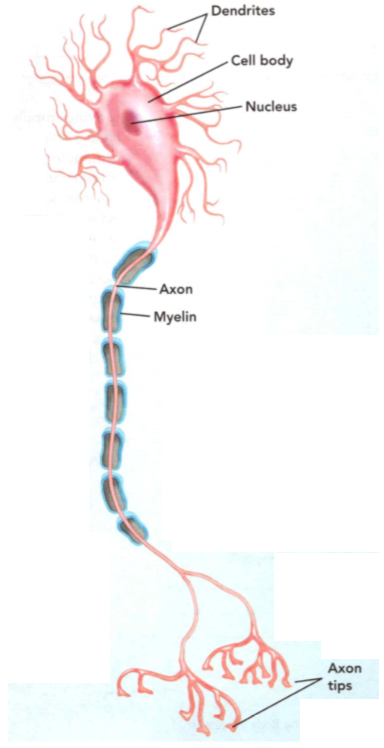
    <figcaption>Figure 2. Structure of a Neuron.</figcaption>
  </figure>

### Three Kinds of Neurons 

Your nervous system includes three kinds of neurons. A sensory neuron picks up a
stimulus and converts it into a nerve impulse. The impulse travels along sensory
neurons until it reaches an interneuron usually in the brain or spinal cord. An
interneuron carries a nerve impulse to another interneuron or to a motor neuron.
A motor neuron sends an impulse to a muscle or gland, enabling it to respond.

Nerves that are coated with a material called myelin can transmit impulses as
fast as 120 meters per second. Nerves without a coating of myelin transmit much
slower. Like the coating on electrical wires, myelin speeds up the rate of
transmission.

**Complete the tasks below.**

1. Structure of a Neuron, see Figure 2. A neuron has only one axon but can have
many dendrites that extend from the cell body.
a) Draw a line with an arrow to show the path of a nerve impulse in the neuron.
b) How does having both dendrites and an axon help a neuron function?
 
  <figure>
    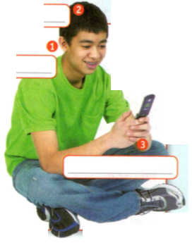
    <figcaption>Figure 3. When you answer the phone.</figcaption>
  </figure>

2. When you answer the phone, see Figure 3, the three kinds of neurons in your
body-sensory neurons, interneurons, and motor neurons must work together.
a) Label the type of neuron at each location.
b) Describe the order in which the neurons function together to enable the boy
to answer the phone.

### Moving Impulses Between Neurons 

Every day, billions of nerve impulses travel through your nervous system from
neurons to other neurons or body structures. The place where a neuron transfers
an impulse to another structure is called a **synapse**. Figure 4 shows
the gap within the synapse between the axon tip of one neuron and the dendrite
of another neuron. At the axon tips, electrical signals carried through the
neuron change into a chemical form. This change allows the message to cross the
gap. The message then continues in electrical form through the next neuron.
These changes are like answering a phone and then writing down the information
you hear. The change from hearing information to writing it is like the change
from electrical to chemical form.

  <figure>
    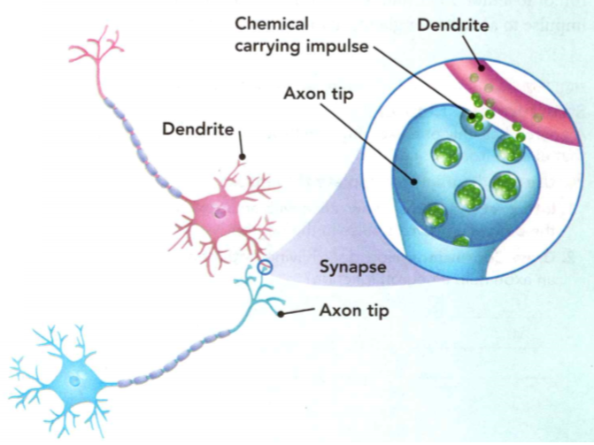
    <figcaption>Figure 4. The Synapse.</figcaption>
  </figure>

**Complete the tasks below.**

1. The Synapse, see Figure 4. At a synapse, chemicals leave the tip of a
neuron's axon and travel across a gap to the next nerve cell. What would happen
to an impulse if a neuron could not produce chemicals at a synapse?

### The Central Nervous System 

Like a traffic cop directing car drivers through a busy intersection, your
nervous system directs your movements. It has two divisions that work together:
the central nervous system and the peripheral nervous system. The **central
nervous system** includes the brain and spinal cord and acts like the traffic
cop. The **peripheral nervous system** includes all the nerves outside of the
central nervous system, which are like the car drivers. Figure 4 shows both
systems.

**The brain is the control center of the central nervous system. The spinal cord
is a thick column of nervous tissue that links the brain to the peripheral
nervous system.** Most impulses from the peripheral nerves travel through the
spinal cord to get to the brain. The brain then directs a response, which
usually travels through the spinal cord and back to peripheral nerves.

  <figure>
    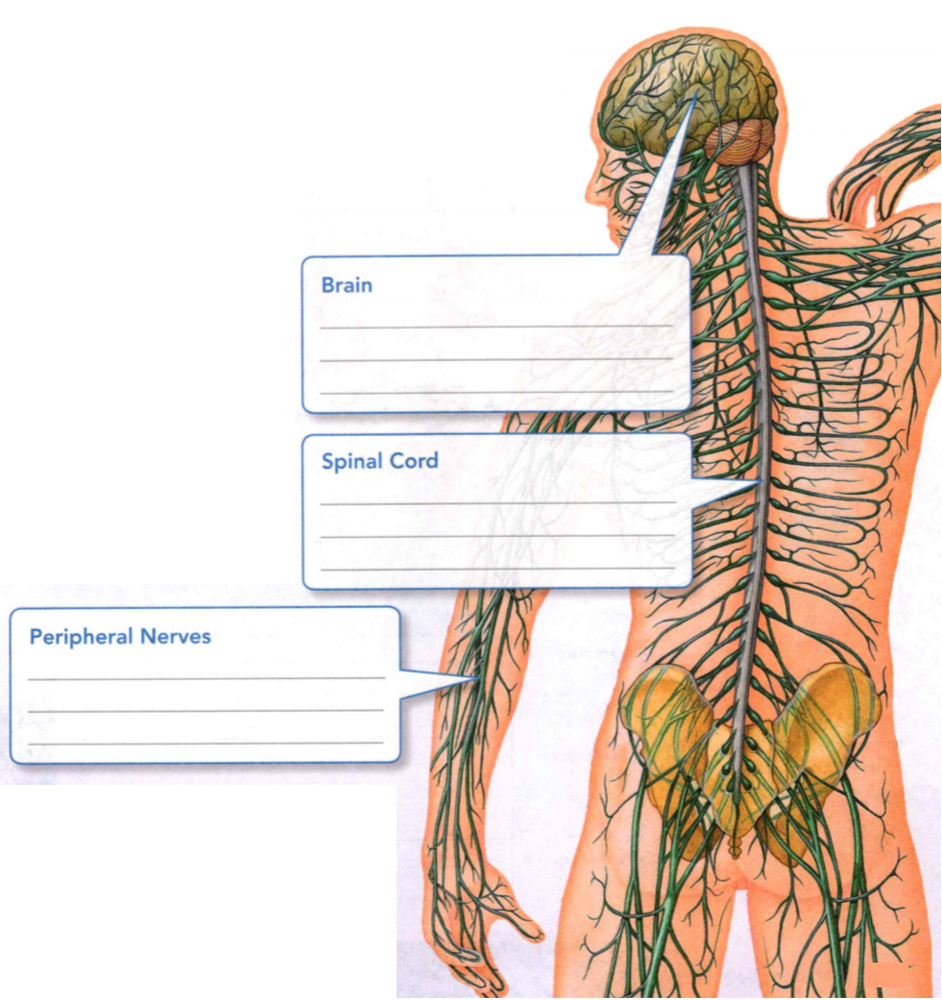
    <figcaption>Figure 5. The Nervous System.</figcaption>
  </figure>

**Complete the tasks below.**

1. The Nervous System, see Figure 5. All information about what is happening in
the outside world and inside your body travels through your nervous system.
Identify the name of each structure that is part of the central nervous
system.

2. The Nervous System, see Figure 5. All information about what is happening in
the outside world and inside your body travels through your nervous system.
Explain the function of the structures in the diagram.
a) Brain
b) Spinal Cord
c) Peripheral Nerves

3. Which structures protect the brain from injury?

### The Brain 

Your brain has about 100 billion neurons, all of which are interneurons. Each of
those neurons may receive up to 10,000 messages from other neurons and may send
messages to about 1,000 more! Three layers of connective tissue under the skull
cover the brain. Fluid fills the space between the middle layer and the
innermost layer of connective tissue. The skull, the connective tissue, and the
fluid all help protect the brain from injury. Three main regions of the brain
are the brain stem, the cerebellum, and the cerebrum, as shown in Figure 6.

### The Spinal Cord 

The brain stem connects to the spinal cord. Run your fingers down the center of
your back to feel the bones of the vertebral column. The vertebral column
surrounds and protects your spinal cord. Like the brain, layers of connective
tissue cover the spinal cord. Also like the brain, fluid protects the spinal
cord.

- The cerebrum interprets input from your senses, controls movement, and carries
out complex mental processes such as learning and remembering.
- The brain stem controls your body's involuntary actions. For example, it helps
control your breathing and heartbeat.
- The cerebellum coordinates your muscle actions and helps you keep your
balance.

  <figure>
    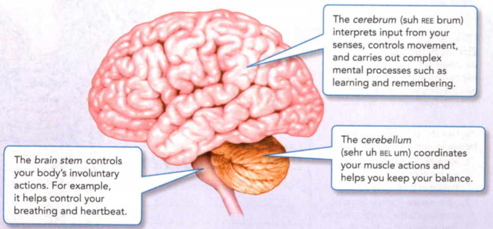
    <figcaption>Figure 6. The Brain.</figcaption>
  </figure>

**Complete the tasks below.**

1. The Brain, see Figure 6. Different regions of the brain receive and process
different information. Write examples of how you use each region of your brain.
a) Cerebrum
b) Cerebellum
c) Brain stem

### The Peripheral Nervous System 
The second division of the nervous system is the peripheral nervous system. The
peripheral nervous system is a network of nerves that branches out from the
central nervous system and connects it to the rest of the body. The peripheral
nervous system is involved in both involuntary and voluntary actions.

  <figure>
    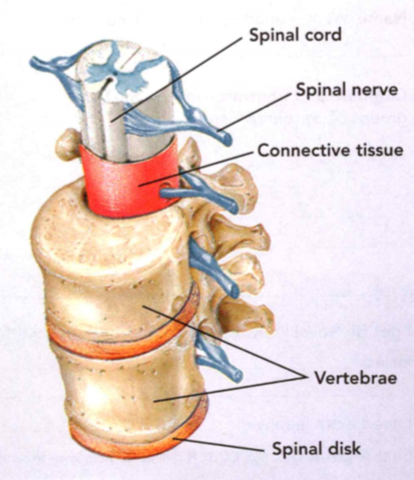
    <figcaption>Figure 7. The Spinal Nerves.</figcaption>
  </figure>

The peripheral nervous system has 43 pairs of nerves. Twelve pairs begin in the
brain. The other 31 pairs-the spinal nerves-begin in the spinal cord. One nerve
in each pair goes to the left side of the body, and the other goes to the right.
Look at the spinal nerves shown in Figure 7. Each spinal nerve contains axons of
both sensory and motor neurons. The sensory neurons carry impulses from the body
to the central nervous system. In contrast, the motor neurons carry impulses
from the central nervous system to the body.

### Somatic and Autonomic Systems 

The peripheral nervous system has two groups of nerves. They are the nerves of
the somatic nervous system and those of the autonomic nervous system. The
somatic nervous system controls voluntary actions, such as using a fork. The
autonomic nervous system controls involuntary actions, such as digesting food.

**Complete the tasks below.**

1. The Spinal Nerves, see Figure 7. The spinal nerves leave the spinal cord
through spaces between the vertebrae.
a) On the diagram, circle the two spinal nerves that are a pair. 
b) Explain how a spinal nerve is like a two-lane highway.

2. The prefix auto- comes from the Greek word for "self." How can this prefix
help you to remember the function of the autonomic nervous system?

### Reflexes 

The brain usually controls the contraction of skeletal muscles. Sometimes,
however, skeletal muscles contract without involving the brain. A reflex is an
automatic response that occurs rapidly without conscious control. For example,
when your finger touches a sharp object, sensory neurons detect a pain stimulus.
They send impulses to the spinal cord. Interneurons there pass those impulses
directly to motor neurons. The motor neurons cause your arm muscles to contract,
pulling your finger away from the sharp object like the cactus in Figure 8.

As the reflex action happens, other nerve impulses travel to your brain. As your
brain interprets them, you feel a pain in your finger. It takes longer for the
pain impulses to reach the brain and be interpreted than it does for the reflex
action to occur. By the time you feel the pain, you have already jerked your
hand away.

  <figure>
    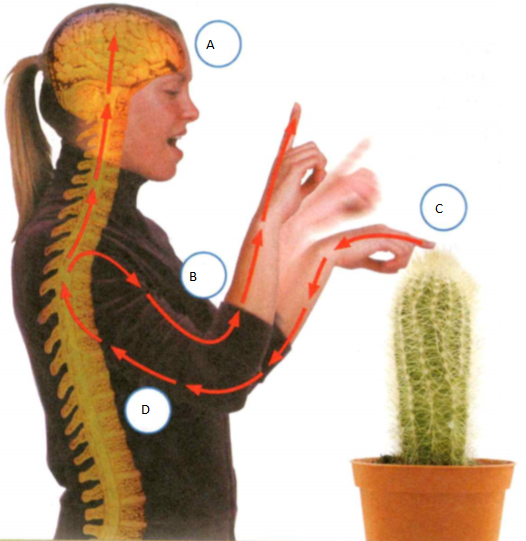
    <figcaption>Figure 8. Reflex Action.</figcaption>
  </figure>

**Complete the tasks below.**

1. Reflex Action. Reflexes help protect your body. On the diagram, find the
order of the steps in a reflex action.

2. What is another name for a nerve cell?

3. How do the two groups of peripheral nerves differ?

4. The part of the brain that helps you keep from falling is the ___ .

5. Why is it important for the brain to be so well protected?

6. Messages are carried through the nervous system along structures that include
___ .

### What Do Your Senses Do?

Going to the movie theater can be a treat for your senses. Show times and titles
flash on displays. Moviegoers chatter in line. As you walk into the theater, you
can smell the popcorn. When you finally sit in your seat, you can feel the
texture of the cushions on your body. You take a bite of your snack, and enjoy
the show.

**Your eyes, ears, nose, mouth, and skin are specialized sense organs that enable
you to get information from the outside world.** Each of these organs contains
sensory neurons that send impulses to your brain. Your brain interprets them,
enabling you to understand more about your environment.

### How You See 

You would not be able to enjoy the visual experience of a movie without your
sense of sight. Your eyes respond to the stimulus of light. They convert that
stimulus into impulses that your brain interprets, enabling you to see.

The eye has many parts, as shown in Figure 9. Notice that light rays enter the
eye through the pupil. Then they pass through the lens. Muscles attached to the
lens adjust its shape and focus light rays on the retina. Because the lens bends
light rays, it produces an upside-down image. The retina contains
light-sensitive cells that produce nerve impulses. These impulses travel through
the optic nerve to the brain. Your brain turns the image right-side up and
combines the images from both eyes to produce a single image.

  <figure>
    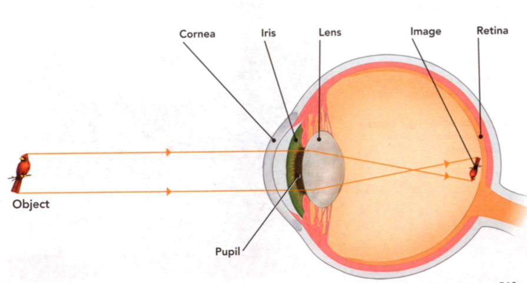
    <figcaption>Figure 9. The Eye.</figcaption>
  </figure>

**Complete the tasks below.**

1. The Eye, see Figure 9. Light from an object produces an image on the retina.
Develop Hypotheses Hold your hand in front of your face. Look at it with one eye
closed, then with the other. Explain why the image of your hand shifts.

### Taste and Smell 

The senses of taste and smell work together. Both depend on chemicals in the air
or in food. The chemicals trigger responses in receptors in the nose and mouth.
Nerve impulses then travel to the brain and are interpreted as smells or tastes.

The nose can distinguish at least 50 basic odors. In contrast, there are only
five main taste sensations-sweet, sour, salty, bitter, and a meatlike taste
called umami. When you eat, however, you experience a wider variety of flavors,
since both smell and taste affect the flavor of food.

There is a type of berry that can temporarily alter your tastebuds. For about 15
to 30 minutes after eating one of these berries, everything sour tastes sweet.
At a Miami, Florida hospital, researchers are studying whether this berry can
help cancer patients whose chemotherapy treatments have left them with dulled
taste buds.

### How You Hear 

When you hear your alarm clock ring, your brain tells you that it is time to get
up. Most sounds are caused by the vibrations of air particles. The air particle
vibrations move outward from the source of the sound, like waves moving out from
a stone dropped in the water. In this way, sound is carried as waves. Ears are
the sense organs that convert sound waves into nerve impulses that your brain
interprets.

The three parts of the ear-outer, middle, and inner-are shown in Figure 9. Sound
waves enter your outer ear through the ear canal. When the sound waves reach
your eardrum, they cause it to vibrate. The vibrations pass to three tiny bones
in your middle ear, which transmit the vibrations to your inner ear. There,
sensory neurons in the cochlea convert these vibrations into nerve impulses.
These impulses travel through the auditory nerve to the brain. Your brain
interprets these impulses as sounds.

  <figure>
    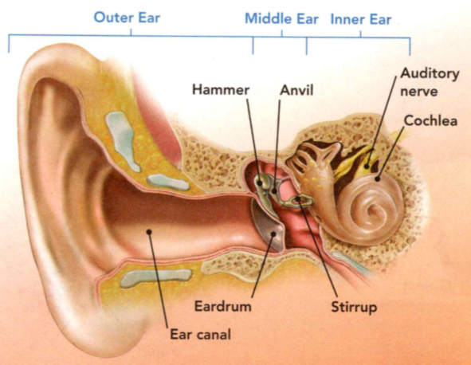
    <figcaption>Figure 10. The Ear.</figcaption>
  </figure>

**Complete the tasks below.**

1. The Ear, see Figuer 10. Sound waves pass through the structures of the ear
and are carried by nerve impulses to the brain.
a) Identify the names of the three bones of the middle ear.
b) What might happen if the eardrum became damaged?

### Touch 

Unlike your other senses, the sense of touch is not found in one place. It is in
all areas of your skin. Your skin has different kinds of touch receptors that
respond to different stimuli. All of the touch receptors are located in the
dermis, or the inner layer of skin.

The receptors that respond to light touch are in the upper part of the dermis.
These receptors also let you feel textures, such as smooth glass and rough
sandpaper. Receptors deeper in the dermis pick up the feeling of heavy pressure.
For example, if you press down hard on your desk, you will feel pressure in your
fingertips.

The dermis also contains receptors that respond to temperature and pain. Pain
can be one of your most important sensa- tions because it alerts you to danger.

**Complete the tasks below.**

  <figure>
    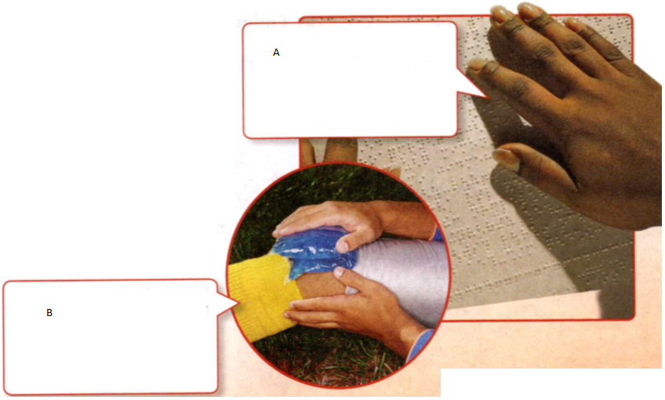
    <figcaption>Figure 11. Touch.</figcaption>
  </figure>

1. Touch, see Figure 11. Your skin lets you feel the world around you. Describe
the kind of touch receptors each person is using.
a) A b) B

2. Light-sensitive cells that produce nerve impulses are found in the ___ .

3. If a head cold interferes with your sense of smell, how do you think your
sense of taste would be affected?

4. Describe the eardrum's function.

5. How is the sense of touch different from the other senses?

### The Endocrine System
- How Does the Endocrine System Function? 
- What Controls Hormone Levels?

**Complete the tasks below.**

1. The Cause of Acne Misconception: Eating oily foods can cause acne. Scientists
have not found a link between eating certain foods and acne. So, what does cause
acne? Much of the blame falls on certain hormones. Your body starts to produce
these hormones when you enter adolescence. They stimulate your body to produce
an oily substance called sebum. When your body produces too much sebum, some
hair follicles in your skin may become blocked. This blockage causes bacteria to
get trapped. Because the sebum and bacteria have nowhere to go, your skin
becomes inflamed. The result is acne. How would you explain to a friend what
causes acne?

### How Does the Endocrine System Function?

Have you ever been so afraid that you heard your heart thump rapidly in your
chest? When something frightens you, your body's endocrine system reacts.

Your body has two systems that regulate its activities: the nervous system and
the endocrine system. The nervous system regulates most activities by sending
nerve impulses throughout the body. **The endocrine system regulates short-term
and long-term activities by sending chemicals throughout the body. Long-term
changes include growth and development.**

The endocrine system is made up of glands. A **gland** is an organ that produces
or releases a chemical. Some glands, such as those producing saliva and sweat,
release their chemicals into tiny tubes, or **ducts**. The ducts deliver the
chemicals to specific places in the body or to the skin's surface. However, the
glands of the endocrine system do not have delivery ducts. The endocrine glands
produce and release chemicals directly into the blood. Then the blood carries
those chemicals throughout the body.

### Hormones 

A chemical produced by an endocrine gland is called a **hormone**. Hormones are
chemical messengers that travel in the blood. Hormones turn on, turn off, speed
up, or slow down the activities of organs and tissues.

Nerve impulses from the brain act quickly. In contrast, hormones usually cause a
slower, longer-lasting response. For example, if you see danger, your brain
interprets the information and sends an impulse to an endocrine gland. The gland
releases the hormone adrenaline into your blood. Adrenaline speeds up your heart
rate and breathing rate. Even a quick hormonal response such as releasing
adrenaline is much slower than a nerve response.

Each hormone affects specific target cells. **Target cells** are cells that are
specialized in a way that enables them to recognize a hormone's chemical
structure. Hormones travel in the blood until they find their target cells. Read
about the endocrine glands and the hormones they produce in Figure 12.

  <figure>
    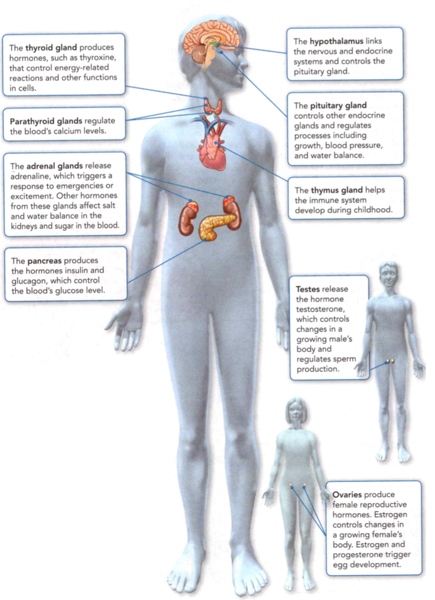
    <figcaption>Figure 12. Glands of the Endocrine System.</figcaption>
  </figure>

- The **thyroid gland** produces hormones, such as thyroxine, that control
energy-related reactions and other functions in cells.
- The **hypothalamus** links the nervous and endocrine systems and controls the
pituitary gland.
- **Parathyroid glands** regulate the blood's calcium levels.
- The **pituitary gland** controls other endocrine glands and regulates
processes including growth, blood pressure, and water balance.
- The **adrenal glands** release adrenaline, which triggers a response to
emergencies or excitement. Other hormones from these glands affect salt and
water balance in the kidneys and sugar in the blood.
- The **thymus gland** helps the immune system develop during childhood.
- The **pancreas** produces the hormones insulin and glucagon, which control the
blood's glucose level.
- **Testes** release the hormone testosterone, which controls changes in a
growing male's body and regulates sperm production.
- **Ovaries** produce female reproductive hormones. Estrogen controls changes in
a growing female's body. Estrogen and progesterone trigger egg development.

**Complete the tasks below.**

1. Glands of the Endocrine System, see Figure 12. Each endocrine gland releases
specific hormones. You eat a sandwich before your soccer game. Choose the gland
you think is involved.
A) Adrenal	
B) Thyroid
C) Testes	
D) Thymus

2. Each endocrine gland releases specific hormones. You ride a roller coaster.
Choose the gland you think is involved.
A) Pituitary	
B) Pancreas
C) Adrenal	
D) Thyroid

3. Each endocrine gland releases specific hormones. You have a growth spurt.
Choose the gland you think is involved.
A) Pancreas	
B) Thymus
C) Parathyroid	
D) Pituitary

  <figure>
    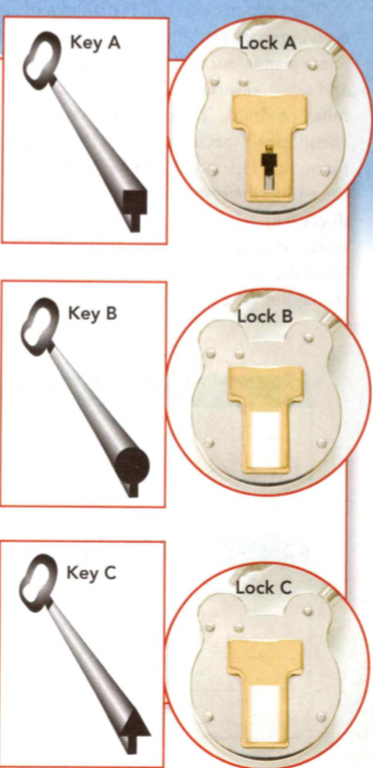
    <figcaption>Figure 13. Keys.</figcaption>
  </figure>

4. Hormones interact with target cells much like keys interact with locks, see
Figure 13. Look at Key A and Lock A. Draw the shapes of the keyholes for the
locks that Key B and Key C will unlock.

5. How do a hormone and a target cell function like a key and a lock?

6. What body system does the endocrine system depend on to function? Explain.

### Regulators of the Endocrine System 

The nervous system and the endocrine system work together. The part of your
brain that links the two systems is the **hypothalamus**. It sends out nerve
messages that control sleep, hunger, and other basic body processes. It also
produces hormones that control other endocrine glands and organs. You can see
the hypothalamus in Figure 14.

  <figure>
    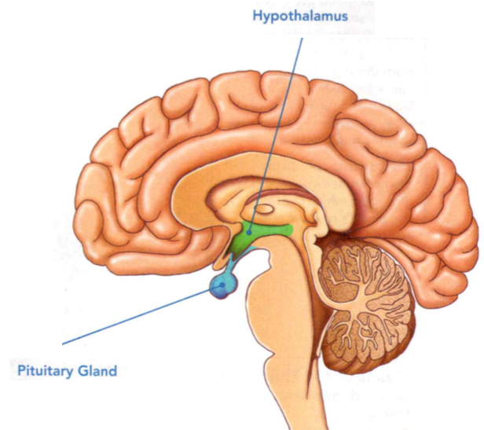
    <figcaption>Figure 14. The Hypothalamus and Pituitary Gland.</figcaption>
  </figure>

Just below the hypothalamus is the pituitary gland, an endocrine gland about the
size of a pea. The **pituitary gland** works with the hypothalamus to control many
body activities. The hypothalamus sends messages to the pituitary gland to
release its hormones. Some of those pituitary hormones signal other endocrine
glands to produce hormones. Other pituitary hormones, such as prnwth hormone,
control body activities directly.

**Complete the tasks below.**

1. The Hypothalamus and Pituitary Gland, see Figure 14. The hypothalamus and the
pituitary gland are located deep within the brain. Describe the functions of
these two endocrine glands.

2. How does adrenaline affect the heart?

3. Explain how the hypothalamus affects growth.

### What Controls Hormone Levels?

Suppose you set a thermostat at 20°C. If the room temperature falls below 20°C,
the thermostat signals the furnace to turn on. When heat from the furnace warms
the room to 20°C, the thermostat shuts off the furnace. In certain ways, the
endocrine system works like a thermostat. It uses a process called **negative
feedback** in which a system is turned off by the condition it produces.

**When the amount of a hormone in the blood reaches a certain level, the endocrine
system sends signals that stop the release of that hormone.** In Figure 15, you can
see how negative feedback regulates the level of the hormone thyroxine in the
blood.

  <figure>
    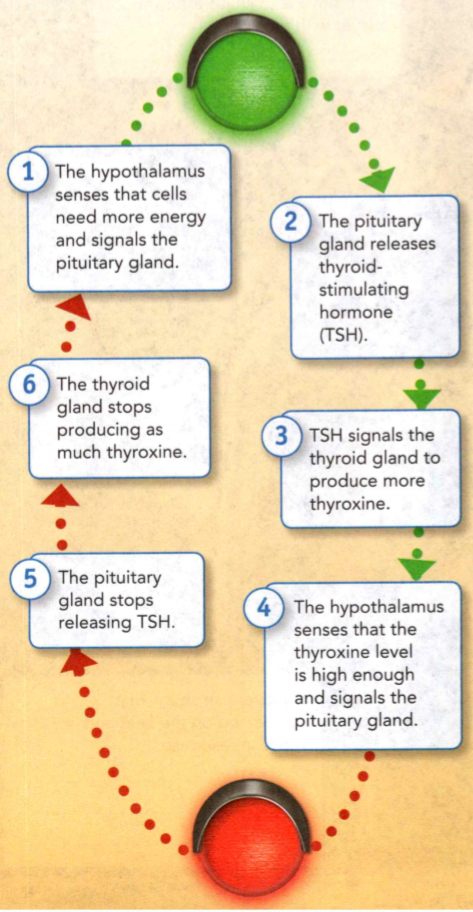
    <figcaption>Figure 15. Negative feedback.</figcaption>
  </figure>

1. The hypothalamus senses that cells need more energy and signals the pituitary
gland.
2. The pituitary gland releases thyroid-stimulating hormone (TSH).
3. TSH signals the thyroid gland to produce more thyroxine.
4. The hypothalamus senses that the thyroxine level is high enough and signals
the pituitary gland.
5. The pituitary gland stops releasing TSH.

6. The thyroid gland stops producing as much thyroxine.

**Complete the tasks below.**

 1. Negative Feedback. Thyroxine is a hormone that controls how much energy is
 available to cells, see Figure 15. The release of thyroxine is controlled by
 negative feedback. Identify the stage of the process in which negative feedback
 occurs. Then explain what happens when the amount of thyroxine gets too low.

2. What systems regulate and control body processes? The fans, players, and
referee at this football game in Figure 16 react to their surroundings because of their
endocrine and nervous systems. Read the descriptions and identify what
structures in the nervous system or endocrine system are involved.
a) A player understands that his next move is to chase after the player with the
ball.
b) This structure produces hormones that make this player's heart beat faster
and his breathing rate increase.
c) A player can sense what is happening on the field and move in response.
d) This structure produces hormones that help these fans get energy from the
foods they eat.
e) This structure produces hormones that control how this young fan grows.
f) The referee watches and listens to the action so he can make the correct
calls.

  <figure>
    
    <figcaption>Figure 16. Football game.</figcaption>
  </figure>

3. Negative feedback works by turning a system (on/off) by the condition the
system produces.

4. What do you think would happen to the level of a hormone in the blood if
negative feedback didn't happen?

5. Negative feedback controls hormone levels by	___ .

### The Male and Female Reproductive Systems
- What Are the Functions of the Reproductive Systems?
- What Happens During the Menstrual Cycle?

**Complete the tasks below.**

1. In Vitro Fertilization In 1977, Dr. Patrick Steptoe and Dr. Robert Edwards
had been working for years on an experimental procedure called in vitro
fertilization. Their goal was to help women who could not become pregnant
naturally. In vitro fertilization begins with retrieving an egg from a woman.
The egg is placed in a lab dish along with a man's sperm. If the egg is
successfully fertilized, it is placed back into the woman's body to grow into a
baby. Dr. Steptoe and Dr. Edwards were unsuccessful time and time again, until
they met Lesley and John Brown. The doctors implanted a fertilized egg in
Lesley. Nine months later, on July 25, 1978, the world's first in vitro baby was
born. Her parents named her Louise Joy Brown.
a) At what point during the in vitro fertilization process is the egg placed
back into the woman's body?
b) What impact do you think in vitro fertilization has had?

### What Are the Functions of the Reproductive Systems?

Have you noticed how a child's body changes as the child grows? Two different
endocrine glands-the ovaries and the testes-releasc hormones that control many
of these changes. They also produce the sex cells that are part of sexual
reproduction.

### Sexual Reproduction 

You were once a single cell. That cell resulted from the joining of an egg cell
and a sperm cell, which is a process called **fertilization**. An **egg** is the
female sex cell. The male sex cell is a **sperm**. Both cells are shown in
Figure 17. Fertilization is part of sexual reproduction, the process by which
males and females produce new individuals. Sexual reproduction involves the
production of eggs by the female and sperm by the male. The egg and sperm join
together during fertilization. When fertilization occurs, a fertilized egg, or
**zygote**, is produced. The zygote contains all the information needed to
produce a new human being.

  <figure>
    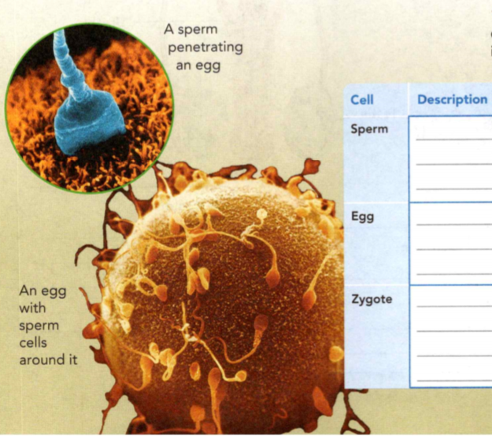
    <figcaption>Figure 17. Egg and Sperm.</figcaption>
  </figure>

**Complete the tasks below.**

1. Egg and Sperm, see Figure 17. An egg is one of the largest cells in the body.
A sperm cell is much smaller than an egg and can move. Describe each of the
cells involved in fertilization.
a) Sperm
b) Egg
c) Zygote

### Male Reproductive System 

Look at the organs of the male reproductive system shown in Figure 2. **The male
reproductive system is specialized to produce sperm cells and the hormone
testosterone.** The structures of this system include the testes, scrotum, and
penis.

### The Testes 

The **testes** (singular testis) are the organs in which sperm are produced. The
testes consist of clusters of tiny, coiled tubes where sperm are formed. In
addition to sperm, the testes produce testosterone. The hormone **testosterone**
controls the development of adult male characteristics. These include facial
hair, deepening of the voice, broadening of the shoulders, and the ability to
produce sperm.

The testes are located in a pouch of skin called the **scrotum**. The scrotum holds
the testes away from the rest of the body. This distance keeps the testes about
2°C to 3°C below normal body temperature, which is 37°C. The cooler temperature
is important because sperm cannot develop properly at 37°C.

  <figure>
    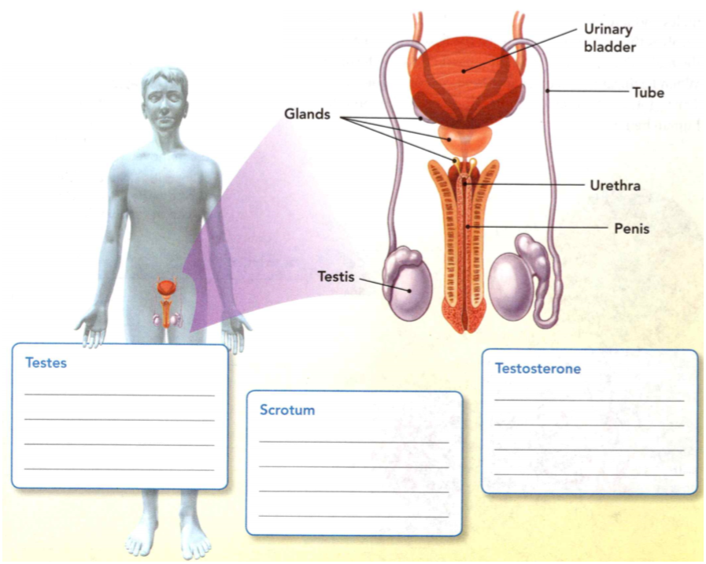
    <figcaption>Figure 18. Structures of the Male Reproductive System.</figcaption>
  </figure>

Sperm The production of sperm cells begins during the teenage years. Each sperm
cell has a head that contains chromosomes, and a long, whiplike tail. The
chromosomes carry the information that controls inherited characteristics, such
as blood type. The tail helps the sperm swim in fluid.

After forming in the testes, sperm travel through tubes in the male reproductive
system. As they travel, sperm mix with fluids produced by nearby glands, as
shown in Figure 19. This mixture of sperm cells and fluids is called **semen**.
The fluids in semen provide an environment where sperm can swim. Semen also
contains nutrients that the sperm use for energy.

Semen leaves the body through an organ called the **penis**. The semen travels
through the tube in the penis called the urethra. Urine also leaves the body
through the urethra. When semen passes through the urethra, however, muscles
near the bladder contract. Those muscles prevent urine and semen from mixing.

**Complete the tasks below.**

1. Structures of the Male Reproductive System, see Figure 18. Describe the
structure and function of each organ.
a) Testes
b) Scrotum
c) Testosteron

2. Find the temperatures at which sperm develop properly.

  <figure>
    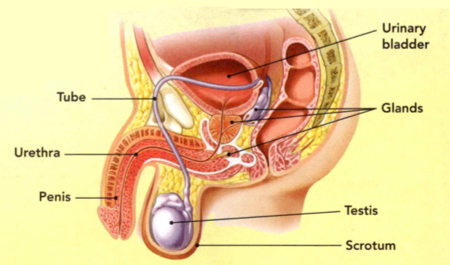
    <figcaption>Figure 19. Sperm Production and Passage From the Body.</figcaption>
  </figure>

3. Sperm Production and Passage From the Body, see Figure 19. Sperm Production
and Passage From the Body. Sperm are produced in the testes and leave the body
through the urethra. On the diagram, draw arrows to trace the path that sperm
travel through the male reproductive system.

4. Why do sperm need to swim?

### Female Reproductive System 

**The female reproductive system is specialized to produce eggs and nourish a
developing baby until birth. It also produces estrogen and other hormones.** The
organs of this system include the ovaries, Fallopian tubes, uterus, and vagina.

### The Ovaries 

The **ovaries** are the female reproductive structures that produce eggs. They
are located slightly below the waist, one on each side of the body, as shown in
Figure 20. Like the testes in males, the ovaries are also endocrine glands that
produce hormones. One hormone, **estrogen**, triggers the development of some
adult female characteristics. For example, estrogen causes the hips to widen and
the breasts to develop. Estrogen is also involved in the development of egg
cells. Each month, one of the ovaries releases a mature egg into the nearest
oviduct, or Fallopian tube. A **Fallopian tube** is the passageway an egg
travels from an ovary to the uterus. Fertilization usually occurs within a
Fallopian tube.

  <figure>
    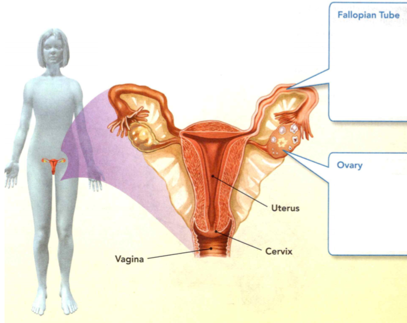
    <figcaption>Figure 20. Structures of the Female Reproductive System.</figcaption>
  </figure>

When the female reproductive system becomes mature, the ovaries contain about
400,000 undeveloped eggs. However, only about 450 of those eggs will actually
leave the ovaries and reach the uterus during a typical woman's life.

**Complete the tasks below.**

1. Structures of the Female Reproductive System, see Figure 20. The word ovary
comes from the Latin word ova meaning "eggs." Describe the functions of 
a) Ovaries
b) Fallopian tube

### Egg Cells 

From an ovary, an egg travels through the Fallopian tube to the uterus. The
**uterus** is a hollow, muscular organ. If an egg has been fertilized in the
Fallopian tube, it attaches to the wall of the uterus. An unfertilized egg
breaks down in the uterus. It leaves through the cervix, an opening at the base
of the uterus. The egg then enters the vagina. The **vagina** is a muscular
passageway leading to the outside of the body. The vagina, or birth canal, is
the passageway through which a baby leaves its mother's body during childbirth.
Figure 21 shows the female reproductive system.

  <figure>
    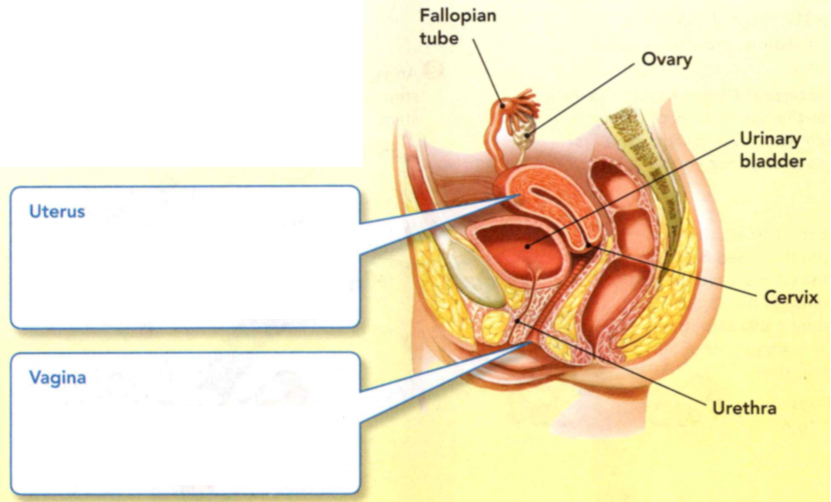
    <figcaption>Figure 21. Egg Production and Passage From the Body.</figcaption>
  </figure>

**Complete the tasks below.**

1. Egg Production and Passage From the Body, see Figure 21. Each month, an ovary
produces an egg that leaves the body if it is not fertilized. Describe the
functions of 
a) the uterus 
b) the vagina.

2. When you know the meaning of a word, you can often identify and understand
related words. How are the meanings of fertilized and fertilization related?

3. What is fertilization?

4. The male and female reproductive systems ___ .

5. What changes does estrogen cause in a female's body?

### What Happens During the Menstrual Cycle?

Usually starting sometime during a girl's teenage years, an egg develops and is
released about once a month. This event is part of the **menstrual cycle**, or
the monthly cycle of changes that occurs in females. **During the menstrual
cycle, an egg develops in an ovary. At the same time, the lining of the uterus
thickens in a way that prepares the uterus for a fertilized egg.** Follow the
stages of the menstrual cycle in Figure 22.

  <figure>
    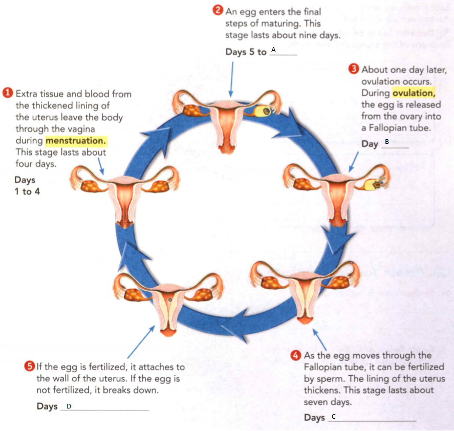
    <figcaption>Figure 22. The Menstrual Cycle.</figcaption>
  </figure>

1. Extra tissue and blood from the thickened lining of the uterus leave the body
through the vagina during menstruation. This stage lasts about four days.
2. An egg enters the final steps of maturing. This stage lasts about nine days.
3. About one day later, ovulation occurs. During ovulation, the egg is released
from the ovary into a Fallopian tube.
4. As the egg moves through the Fallopian tube, it can be fertilized by sperm.
The lining of the uterus thickens. This stage lasts about seven days.
5. If the egg is fertilized, it attaches to the wall of the uterus. If the egg
is not fertilized, it breaks down.

**Complete the tasks below.**

1. The Menstrual Cycle, see Figure 22. The menstrual cycle takes about 28 days.
Write the day or days of the cycle in which each stage occurs. The first stage
is done for you.
a) A b) B c) C d) D

  <figure>
    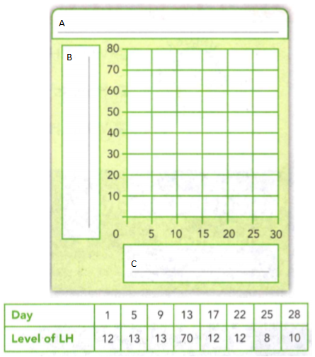
    <figcaption>Figure 23. A woman's hormone levels.</figcaption>
  </figure>

2. A woman's hormone levels change throughout her menstrual cycle, see Figure
23. One such hormone is called LH.
a) Use the data in the table to draw a line graph.
b) Write a title for the graph. A
c) Label the axes B.
d) Label the axes C.
e) On what day was the LH level the lowest? 
f) On what day was the LH level the highest? 
g) How might LH level and ovulation be related?

3. In the menstrual cycle, what happens after ovulation occurs?

4. What happens in the menstrual cycle if an egg is fertilized?

5. During the menstrual cycle ___ .

### Pregnancy and Birth What Happens Before Birth?

- How Is the Embryo Protected and Nourished? 
- What Happens During Childbirth?

**Complete the tasks below.**

1. Obstetrician Some doctors specialize in caring for women during pregnancy.
These doctors are called obstetricians. Obstetricians care for pregnant women,
deliver babies, and make sure the mothers and new babies are healthy in the days
that follow childbirth. If you are interested in becoming an obstetrician, plan
on spending at least ten years in school and training after you graduate high
school. During this tim you will learn how to care for mothers during pregnancy,
childbirth, and after delivery. You will also learn about the seriou conditions
that babies may be bor with. This career can be rewarding, even though it takes
a lot of time and effort to get there.
a) What are two responsibilities of an obstetrician?
b) Why do you think a woman should see an obstetrician when she is pregnant?

### What Happens Before Birth?

When sperm are deposited into the vagina, they swim into and through the uterus
and enter the Fallopian tubes. An egg can be fertilized in the Fallopian tubes
during the first few days after ovulation. If a sperm fertilizes an egg,
pregnancy can occur. The fertilized egg is called a zygote. **Before birth, the
zygote develops first into an embryo and then into a fetus.**

### Zygote and Embryo

After fertilization, the zygote divides into two cells. These cells continue to
divide as they travel toward the uterus. They form a hollow ball of more than
one hundred cells by the time they reach the uterus. The ball attaches to the
lining of the uterus. From the two-cell stage through the eighth week, a
developing human is called an **embryo**.

### Fetus 

From the end of the eighth week until birth, a developing human is called a
**fetus**. The internal organs that began to form in the embryo, such as the
brain, continue to develop and start to function. The eyes, ears, and nose also
develop, as you can see in Figure 1. The heart becomes large enough that a
doctor can use a tool to hear it beat. The fetus begins to move and kick.

  <figure>
    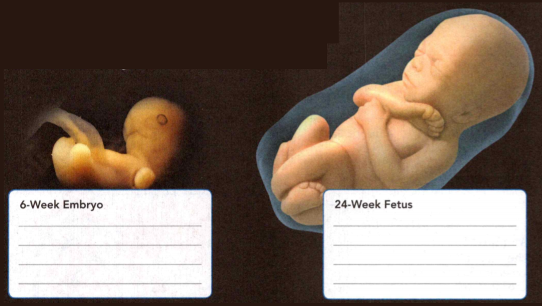
    <figcaption>Figure 24. Development of the Fetus.</figcaption>
  </figure>

**Complete the tasks below.**

1. Development of the Fetus, see Figure 24. An embryo develops into a fetus.
Note: These photos do not show the actual sizes. Describe the body parts of the
embryo and fetus that you can see.
a) 6-Week Embryo
b) 24-Week Fetus

### How Is the Embryo Protected and Nourished?

Soon after the embryo attaches to the uterus, new membranes and structures form.
**The membranes and structures that form in the uterus during pregnancy protect
and nourish the developing baby.**

### Membranes 

Figure 25 shows the two membranes that form during development. The amniotic sac
surrounds the embryo and is filled with fluid. The fluid cushions and protects
the embryo and later the fetus.

Another membrane helps form the **placenta**, which links the embryo and the
mother. In the placenta, the embryo's blood vessels are next to the mother's
blood vessels. Their blood does not mix, but substances are exchanged from one
bloodstream to the other. The embryo's carbon dioxide and other wastes diffuse
to the mother. Nutrients and oxygen diffuse from the mother to the embryo. In
addition, drugs, alcohol, and chemicals in tobacco can diffuse from the mother
to the embryo and cause it harm. Some effects on the development of the child
are immediate. Others may not appear for many years.

### Structures 
A ropelike structure, called the **umbilical cord**, begins to form between the
embryo and the placenta. It contains blood vessels from the embryo that link the
embryo to the placenta.

  <figure>
    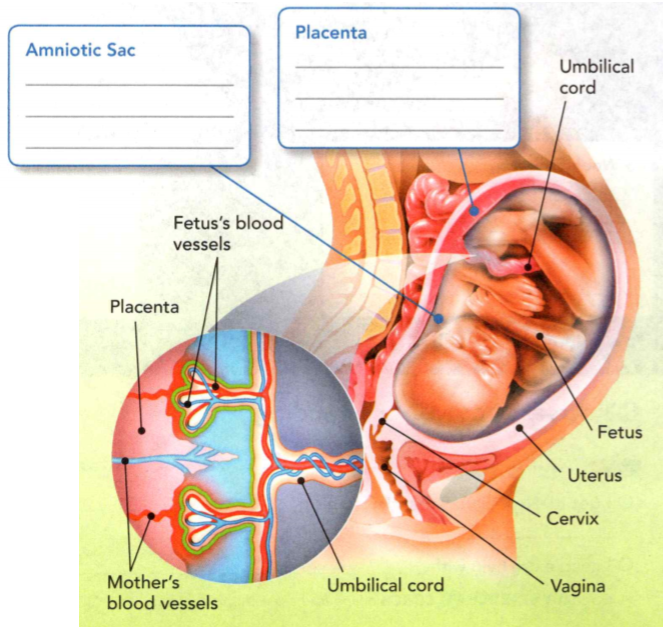
    <figcaption>Figure 25. The Amniotic Sac and the Placenta.</figcaption>
  </figure>

**Complete the tasks below.**

1. The Amniotic Sac and the Placenta, see Figure 25. A fetus needs nourishment
and protection to develop properly.
a) Describe the functions of the amniotic sac 
b) Describe the functions of the placenta.

2. How do you think it is possible for a baby to be born addicted to drugs?

  <figure>
    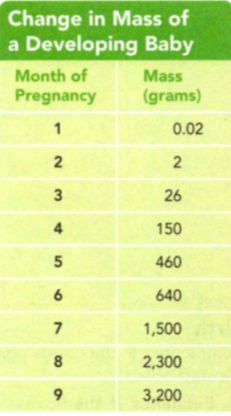
    <figcaption>Figure 26. Change in Mass of a Developing Baby.</figcaption>
  </figure>

3. A pregnancy is often divided into three stages called trimesters, see Figure
26. Each trimester is three months.
How much mass does a developing fetus gain during each trimester?
a) First Trimester	
b) Second Trimester
c) Third Trimester 	

3. A pregnancy is often divided into three stages called trimesters, see Figure
26. Each trimester is three months. To find the percentage mass increase in a
trimester, divide the mass gained in the trimester by the mass at the start of
the trimester. Then multiply by 100. The percentage mass increase for the second
trimester is as follows: (614 ÷ 26) x 100 = about 2,361 percent. Find the
percentage mass increase for the third trimester.

4. What substances pass from the embryo or fetus to the mother?

5. Why is it dangerous for a pregnant woman to drink alcohol?

6. An embryo or fetus is protected and nourished by ____ .

### What Happens During Childbirth?

After about nine months of development inside a uterus, a baby is ready to be
born. **The birth of a baby takes place in three stages: labor, delivery, and
afterbirth.**

### Labor 

Labor is the first stage of birth. Strong muscle contractions of the uterus
cause the cervix to open. Eventually, the opening is large enough for the baby
to fit through. Labor may last from about two hours to more than 20 hours.

### Delivery and Afterbirth 

The second stage of birth is called delivery. During a normal delivery the baby
is pushed out of the uterus through the vagina. The head usually comes out
first. Delivery can last several minutes to an hour or so. Shortly after
delivery, the umbilical cord is cut about five centimeters from the baby's
abdomen, as you can see in Figure27. Seven to ten days later, the rest of the
umbilical cord, which is now dried, falls off. It leaves a scar called the
navel, or bellybutton.

Soon after delivery, muscles in the uterus contract, pushing the placenta and empty amniotic sac out through the vagina. This last stage, called afterbirth, usually takes less than an hour.

  <figure>
    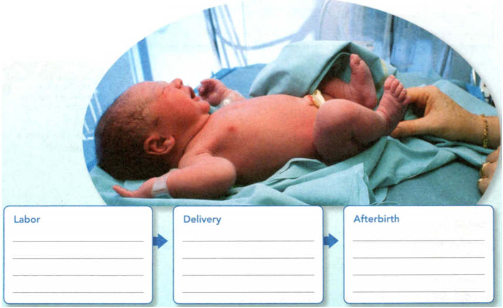
    <figcaption>Figure 27. Birth.</figcaption>
  </figure>

**Complete the tasks below.**

1. Birth, see Figure 27. Contractions in the uterus signal the start of labor.
Describe the events in each stage of birth.
a) Labor
b) Delivery
c) Afterbirth

### Birth and the Baby 

During birth, pressure caused by the muscle contractions briefly decreases the
baby's oxygen supply. In response, the baby's endocrine system releases
adrenaline, which increases the baby's heart rate. Seconds after delivery, the
baby cries and begins breathing. The newborn's heart rate then slows down.

### Multiple Births 

The delivery of more than one baby from a single pregnancy is called a multiple
birth. Twin births are the most common multiple births. There are two types of
twins: identical and fraternal. Figure 28 shows how both types develop.

  <figure>
    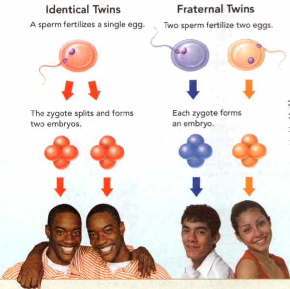
    <figcaption>Figure 28. Multiple Births.</figcaption>
  </figure>

**Complete the tasks below.**

1. Multiple Births, see Figure 28. Other multiple births, such as triplets, can
also be fraternal or identical. Explain why fraternal twins can be different
sexes and identical twins cannot.

2. During labor, contractions cause the	___ to open.

3. Why must a baby start breathing right after birth?

4. My ___ and ___ systems help regulate and control my body processes.

### Study Guide

- Your nervous system receives information about what is happening both inside
and outside your body. It directs how your body responds to this information and
helps maintain homeostasis.
- Neurons carry nerve impulses throughout the body. The brain is the control
center of the central nervous system. The spinal cord links the brain to the
peripheral nervous system.
- Your eyes, ears, nose, mouth, and skin are specialized sense organs that
enable you to get information from the outside world.
- The endocrine system regulates short-term and long-term activities by sending
chemicals throughout the body. Long-term changes include growth and development.
- When the amount of a hormone in the blood reaches a certain level, the
endocrine system sends signals that stop the release of that hormone.
- The male reproductive system produces sperm and testosterone. The female
reproductive system produces eggs and estrogen. It also nourishes a developing
baby until birth.
- Before birth, the zygote develops first into an embryo and then into a fetus.
- The membranes and structures that form in the uterus during pregnancy protect
and nourish the developing baby.
- The birth of a baby takes place in three stages: labor, delivery, and
afterbirth.

**Complete the tasks below.**

1. Which structure links the brain and the peripheral nervous system?
A) the cerebrum	
B) the cerebellum	
C) the cochlea	
D) the spinal cord	

2. The senses of ___ and ___ depend on chemicals in the air and food. The sense
of __ depends on the stimulus of light. The sense of ___ depends on the stimulus
of sound. The sense of ___ is found in all areas of your skin.

3. How does the nervous system help maintain homeostasis?

4. What is the result if the spinal cord is cut?

5. As a man walks barefoot along the beach, he steps on a sharp shell. His foot
automatically jerks upward, even before he feels pain. What process is this an
example of? How does it help protect the man?

6. The cerebrum, the cerebellum, and the brain stem are regions of the brain that carry out specific functions. Write a brief job description for each of these regions of the brain.

7. The structure that links the nervous system and the endocrine system is the
A) thyroid gland.	
B) umbilical cord.
C) target cell.	
D) hypothalamus.

8. ____ recognize a hormone's chemical structure.

9. What is the endocrine system's role?

10. Study the sequence. Pancreas releases insulin. -> Blood sugar decreases. ->
Pancreas releases glucagon. -> Blood sugar increases. Suggest how the hormones
glucagon and insulin might work together to maintain homeostasis in a healthy
person. 

11. The release of an egg from an ovary is called
A) ovulation.	
B) menstruation.
C) fertilization.	
D) negative feedback.

12. A mixture of sperm and fluids is called ___ .

13. What is the role of the fluids in semen?

14.  What changes occur in the uterus during the menstrual cycle?

15. In what ways are the functions of the ovaries and the testes similar? How do their functions differ?

16. The average menstrual cycle is 28 days in length. But it can vary from 21 to
35 days. Ovulation usually occurs 14 days before the end of the cycle. On what
day will ovulation occur after the start of a 21-day cycle? A 35-day cycle? 

17. The membrane that protects and cushions the embryo is called the
A) umbilical cord.	
B) scrotum
C) amniotic sac.	
D) ovary.

18. The ___ contains blood vessels from the embryo that link the embryo and the
placenta.

19. What three stages of development does a fertilized egg go through before
birth?

20. Fraternal twins develop from (a single egg/two eggs). Identical twins
develop from (a single egg/two eggs).

21. The body goes through many changes during adolescence. Suppose a tumor in
the pituitary gland causes the gland to function incorrectly. How might a
person's development during adolescence be affected? Explain.

  <figure>
    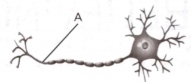
    <figcaption>Figure 29. Neuron.</figcaption>
  </figure>

22. What is the function of the part labeled A on the neuron shown in Figure 29?
A) It carries the nerve impulse toward the cell body.
B) It protects the neuron from damage.
C) It carries the nerve impulse away from the cell body.
D) It picks up stimuli from the environment.

23. You are riding your bike when a small child suddenly darts out in front of
you. Which of your endocrine glands is most likely to release a hormone in
response to this situation?
A) pituitary gland
B) adrenal gland
C) thyroid gland
D) parathyroid gland

24. A change that occurs in girls during puberty is
A) their skin wrinkles.
B) egg production begins.
C) muscle strength decreases.
D) ovulation and menstruation begins. 

25. A woman gives birth to twins who developed from a single fertilized egg that
split early in development. Which of the following is a reasonable prediction
that you can make about the twins?
A) They will be the same sex.
B) They will have similar interests.
C) They will not look alike.
D) They will have different inherited traits.

26. During pregnancy, which structure permits diffusion of substances from the
mother to the fetus?
A) zygote
B) placenta
C) uterus
D) fallopian tubes

  <figure>
    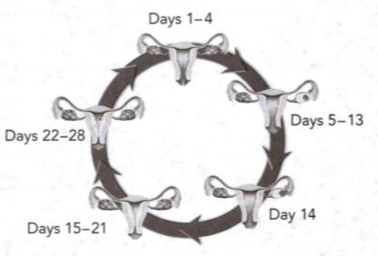
    <figcaption>Figure 30. Menstrual cycle.</figcaption>
  </figure>

27. Describe what happens during each of the five stages of the menstrual cycle, see Figure 30.

28. Your eyes are constantly checking out the world around you and sending
visual information to your brain. Signals from the optic nerves take about one
tenth of a second to become a visual image in the brain. Researchers think this
lag causes the brain to predict images that will occur one tenth of a second in
the future, filling in the gaps. This lag may explain why you see certain types
of optical illusions.
Many optical illusions rely on the fact that the brain easily perceives
patterns. Scientists think that when there is a gap in a pattern, the brain
tries to predict what fills the gap. When these predictions don't match reality,
you may end up seeing a false image. You probably experience an optical illusion
every day without even noticing it. Television and movies are actually a series
of images that are played rapidly, creating the illusion of motion.
Is the figure in Figure 31 an image of a vase or of two people facing each other? You
can't see both images at the same time, because your brain gets fooled by
thinking there's only one possible background. You can see both images at
different times by shifting your attention.

  <figure>
    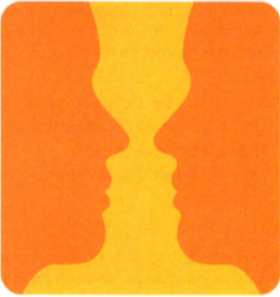
    <figcaption>Figure 31. Figure.</figcaption>
  </figure>

29. List three questions you have about fetal surgery. Research to find the
answers, and write one or two paragraphs to answer each question.

30. Michael Skinner had surgery at a very young age. How young? He was the first
patient ever to undergo fetal surgery-an operation on a developing fetus. In
1981, Michael's mother was pregnant with twins. Although one twin was developing
normally, doctors noticed that Michael had a serious condition that affected his
development. After consulting with medical ethicists who helped them consider
the risks, Michael's parents and doctors decided to risk surgery on the fetus.
Surgeons used a long needle to reach the fetus inside the mother's uterus and to
deliver the treatment Michael needed. The risk paid off, and the surgery was a
success! Hospitals in the United States now perform two types of fetal surgery.
In some cases, surgeons use a needle, as they did with Michael Skinner's mother,
to deliver treatment. Sometimes, surgeons are able to insert tiny cameras and
surgical instruments through a small incision in the uterus. The cameras allow
doctors to view the fetus on a computer monitor. These procedures are much less
invasive than surgeries in which the uterus is opened. Therefore, they greatly
reduce the risks to the mother and the developing fetus. For other problems,
surgeons may need to open the mother's uterus and operate on the fetus directly.
At the end of surgery, the surgeon closes the uterus. The fetus is allowed to
develop normally inside the mother.

31. This three-year-old girl from Somalia is getting a polio vaccine. Polio is
spread through contaminated water or food, or by contact with a person infected
with the virus. It was a common disease in Somalia. In the United States, polio
has been almost eliminated because most babies receive the polio vaccine.
Vaccines prevent some viral diseases. Other viral diseases, such as the common
cold, have no vaccine. What steps can you take to stop a virus such as a cold
from spreading?
