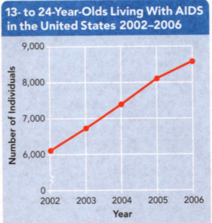

### Life Science

## Biology

## Fighting Disease

**Bacteria** are single-celled organisms that lack a nucleus.

An object that is **contaminated** has become unclean and could possibly infect
the body.

**Infection** is the process in which disease-causing microorganisms invade the
body and then multiply.

**Complete the tasks below.**

1. Camila steps on a nail that punctures her foot. She knows that bacteria can
cause a disease called tetanus in a wound that is contaminated. Fortunately,
Camila just received a shot to prevent tetanus. However, to help stop infection,
she soaks her foot in warm soapy water. How can a wound lead to an infection?

### Chapter Preview

- microorganism 
- pathogen
- infectious disease 
- toxin
- inflammatory response
- phagocyte 
- immune response
- lymphocyte 
- T cell 
- antigen
- B cell 
- antibody
- AIDS 
- HIV
- immunity 
- active immunity
- vaccination 
- vaccine
- passive immunity 
- antibiotic
- antibiotic resistance
- noninfectious disease 
- allergy
- allergen 
- histamine 
- asthma 
- insulin 
- diabetes 
- tumor 
- carcinogen

### Infectious Disease
- How Do Pathogens Cause Disease?
- What Pathogens Cause Infectious Disease and How Are They Spread?

**Complete the tasks below.**

1. Fight the Flu Misconception: You cannot catch the flu if you have gotten a
flu shot. The flu vaccine decreases your chances of catchin the flu, but it does
not protect you 100 percent. However, if you get the shot and still end up
catching the flu, your symptoms probably will b milder than if you had not
gotten vaccinated. There are many strains of the flu virus. Each year,
scientists choose the strains that they think will appear in the United States.
Then a vaccine is made that contains those strains. The vaccine is given to
people across the country. However, getting a flu shot will not protect you
against any strain that is not in the vaccine. Read the following questions.
Write your answers below.
a) What is one challenge that scientists face when making the flu vaccine?
b) Does a person need to get a flu shot every year? Why or why not?

### How Do Pathogens Cause Disease?

In ancient times, people had different ideas about what caused disease. They
thought that things such as evil spirits or swamp air caused disease. In fact,
they sometimes cut holes in the skulls of sick people to let the evil spirits
out. The ancient Greeks thought that disease resulted from an imbalance of four
body fluids: blood, phlegm (flem) or mucus, black bile, and yellow bile.

### Louis Pasteur and Microorganisms 
It was not until the 1860s that a French scientist named Louis Pasteur
discovered the cause of some diseases. After investigating what causes foods to
spoil, Pasteur concluded that **microorganisms**, living things too small to see
without a microscope, were the cause. Pasteur thought that microorganisms might
be causing disease in animals and people, too. So he investigated a disease
attacking silkworms at the time. Pasteur found microorganisms inside silkworms
with the disease. He was able to show that these organisms caused the disease.
Pasteur's work led to an understanding of what causes most infectious
diseases-microorganisms.

  <figure>
    
    <figcaption>Figure 1. Preventing Infection.</figcaption>
  </figure>

**Complete the tasks below.**

1. Preventing Infection, see Figure 1. A clean environment reduces the chance of
infection after surgery. Observe the pictures in Figure 1. 
a) Compare the operating rooms then and now.
b) Discuss how technology affects surgery today.

### Joseph Lister 

Pasteur's work influenced a British surgeon named Joseph Lister. Before the
twentieth century, surgery was risky because most surgeons operated with dirty
instruments and did not wash their hands. The sheets on hospital beds were
rarely washed between patients. Even if people lived through an operation, many
died later from an infection.

Lister hypothesized that microorganisms cause the infections that often followed
surgery. He planned an experiment to test his hypothesis. Before performing
operations, he washed his hands and surgical instruments with carbolic acid, a
chemical that kills microorganisms. He also sprayed the patients with the acid,
as shown in Figure 1. After the surgeries, he covered the patients' wounds with
bandages dipped in carbolic acid.

Lister's results were dramatic. Before he used his new methods, about 45 percent
of his surgical patients died from infection. With Lister's new techniques, only
about 15 percent died.

### Robert Koch 
In the 1870s and 1880s, the German physician Robert Koch showed that a specific
microorganism causes each disease. For example, the microorganism that causes
strep throat cannot cause chickenpox or other diseases. Look at Figure 2 to see
how Koch identified the microorganism for a disease called anthrax.

Organisms that cause disease are called **pathogens**. A disease caused by a
pathogen is an **infectious disease**. **When you have an infectious disease,
pathogens are in your body causing harm.** Pathogens damage large numbers of
individual cells, which makes you sick.

  <figure>
    
    <figcaption>Figure 2. Koch's Experiment.</figcaption>
  </figure>

1. Koch identified a certain pathogen in the blood of Mouse A, which had died of
anthrax.
2. Koch injected Mouse A's blood into Mouse B, a healthy mouse. Mouse B soon
developed anthrax.
3. In Mouse B's blood, Koch found the same pathogen as the one in Mouse A's
blood.

**Complete the tasks below.**

1. Koch's Experiment, see Figure 2 Koch followed the scientific method in his
research of pathogens. How would Koch's conclusion have been different if Mouse
B's blood had not contained the pathogen found in Mouse A's blood?

2. What is an infectious disease?

3. How did Pasteur's work affect Lister's work?

4. Pathogens cause disease by	___ .

### What Pathogens Cause Infectious Disease and How Are They Spread?

You share Earth with many kinds of organisms. Most of these organisms are
harmless, but some can make you sick. Some diseases are caused by multicelled
animals, such as worms. However, most pathogens can be seen only with a
microscope.

### Types of Pathogens 
**The four major types of human pathogens are bacteria, viruses, fungi, and
protists. They can be spread through contact with a sick person, other living
things, or an object in the environment.** You can see some examples of
pathogens in Figure 3.

  <figure>
    
    <figcaption>Figure 3. Pathogens.</figcaption>
  </figure>

- Bacteria - These rod-shaped bacteria cause tetanus. Tetanus is a disease in
which toxins produced by the bacteria damage nerves that send messages to
muscles to work.

- Viruses - When young children have the flu, this virus, called adenovirus, may
be the cause of the runny nose and sore throat.

- Protists - This microorganism is called Giardia. People who drink from streams
or lakes with this protist can get an intestinal disease called hiker's disease.

- Fungi - This fungus causes a skin infection called athlete's foot.

### Bacteria 

Bacteria are one-celled microorganisms. They cause many diseases, including ear
infections, food poisoning, tetanus, and strep throat. Some bacteria damage body
cells directly. Other bacteria, such as those that cause tetanus, damage cells
indirectly by producing a poison, or **toxin**.

### Viruses 

Viruses are tiny nonliving particles much smaller than bacteria. They can
reproduce only inside living cells. The cells are damaged or destroyed when the
new virus particles are released. These new virus particles then infect other
cells. Viruses cause many diseases including colds and the flu. There are more
than 200 kinds of cold viruses alone.

### Fungi 

Some fungi, such as molds and yeasts, also cause infectious diseases. Fungi that
cause disease may be one-celled or multicelled living things. Fungi grow best in
warm, dark, moist areas of the body. Athlete's foot and ringworm are two fungal
diseases.

### Protists 
Most protists are one-celled microorganisms and some can cause disease. They are
larger than bacteria but still tiny. One type of protist causes the disease
malaria, which is common in tropical areas. African sleeping sickness and
hiker's disease are other diseases caused by protists.

**Complete the tasks below.**

1. Pathogens, see Figure 3. Microscopic organisms cause many common diseases.
From the following list (viruses, bacteria, protists, fungi ) identify which
type of pathogen produces toxins.

  <figure>
    
    <figcaption>Figure 4. Compare and contrast Pathogens.</figcaption>
  </figure>

2. Compare and contrast Pathogens, fill in the table in Figure 4.

### How Pathogens Are Spread 

Pathogens can infect you in several ways. They can spread through contact with
an infected person; through soil, food, or water; and through a contaminated
object or an infected animal.

  <figure>
    
    <figcaption>Figure 5. Pathogens are spread through contaminated water.</figcaption>
  </figure>

### Infected People 

Pathogens often pass from one person to another through direct physical contact,
such as kissing and shaking hands. For example, if you kiss someone with an open
cold sore, the virus that causes cold sores can get into your body. Pathogens
spread indirectly, too. For example, when a person with a cold sneezes,
pathogens shoot into the air. People who inhale these pathogens may catch the
cold.

### Soil, Food, and Water 

Some pathogens occur naturally in the environment. For example, the bacteria
that cause botulism, a severe form of food poisoning, live in soil. These
bacteria can produce toxins in foods that have been improperly canned. Other
pathogens contaminate food and water and sicken people who eat the food or drink
the water. Cholera and dysentery, deadly diseases that cause severe diarrhea,
are spread through contaminated food or water.

**Complete the tasks below.**

1. If you have a cold, what can you do to prevent spreading it?

  <figure>
    
    <figcaption>Figure 6. Cholera Cases, London, 1854.</figcaption>
  </figure>

2. Cholera is a deadly disease caused by bacteria in drinking water, see Figure
6. This map shows the locations of cholera cases in the 1854 cholera epidemic in
London, England, and the city's water pumps.
a) Which pump was probably the source of the contaminated water? What evidence
do you have?
b) Suppose a doctor at the time learned that two more people had died of
cholera. What two questions would the doctor most likely have asked?

### Contaminated Objects 
Some pathogens can survive for a time outside a person's body. People can
contact pathogens by using objects, such as towels or keyboards, that an
infected person touched. Colds and flu can be spread in this way. Tetanus
bacteria can enter the body if a contaminated nail or other object punctures the
skin.

### Infected Animals 

If an animal that is infected with certain pathogens bites a person, the
pathogens can pass to the person. For example, people get rabies, a serious
disease of the nervous system, from the bite of an infected animal, such as a
dog or raccoon. In tropical regions, mosquito bites transfer the malaria protist
to people. Deer ticks, as shown in Figure 7, live mostly in the northeastern and
upper mideastern United States. The bites of some deer ticks spread Lyme
disease. If left untreated, Lyme disease can damage joints and cause many other
health problems.

  <figure>
    
    <figcaption>Figure 7. Deer Ticks and Lyme Disease.</figcaption>
  </figure>

**Complete the tasks below.**

1. Deer Ticks and Lyme Disease, see Figure 7. To prevent Lyme disease, wear a
long-sleeved shirt and tuck your pants into your socks if you plan to walk where
ticks may live. Explain how a deer tick could infect you without your realizing
it.

2. Name four types of pathogens that cause disease in humans.

3. How could people make bacteria-contaminated water safe to drink in order to
prevent illness?

4. Disease-causing pathogens include ___ , and they are spread by ___ .

### The Body's Defenses
- What Is the Body's First Line of Defense?
- What Are the Inflammatory and Immune Responses?
- 
**Complete the tasks below.**

1. The Kissing Disease Have you ever heard of mononucleosis? Also known as mono
(or glandular fever or pfeifferschen drüsenfieber), or the kissing disease,
mononucleosis is most common among older teenagers and people in their twenties.
It got its nickname because the disease can be spread through kissing. But, be
careful. Because mono is passed through saliva, it can also be 'spread by
sharing cups, forks, 'straws, and other utensils. Some common symptoms of mono
are fever, sore throat, swollen glands, and fatigue. If you display these
symptoms, you might want to pay your doctor a visit, even if you haven't kissed
anyone!
a) How can mononucleosis be spread?
b) What can you do to lower your chances of catching mono?

### What Is the Body's First Line of Defense?

You have probably battled invaders in video games. Video games have fantasy
battles, but on and in your body, real battles against invading pathogens happen
all the time. You are hardly ever aware of these battles because the body's
disease-fighting system has lines of defense that effectively eliminate
pathogens before they can harm your cells. **In the first line of defense, the
surface of your skin, breathing passages, mouth, and stomach function as
barriers to pathogens. These barriers trap and kill most pathogens with which
you come into contact.**

### Skin 

Your skin is an effective barrier to pathogens, as you can see in Figure 8.
Pathogens on the skin are exposed to destructive chemicals in oil and sweat.
Even if these chemicals do not kill them, the pathogens may fall off with dead
skin cells. Most pathogens get through the skin only when it is cut. However,
blood clots at a cut. Then a scab forms over the cut. So pathogens have little
time to enter the body this way.

  <figure>
    
    <figcaption>Figure 8. Skin as a Barrier.</figcaption>
  </figure>

**Complete the tasks below.**

1. Skin as a Barrier, see Figure 8. The dots are groups of bacteria. The
bacteria were on the skin of a person's hand.
a) In each box, write one of the skin's defenses against pathogens.
b) Why would you want a cut to bleed some?

### Breathing Passages 

Your breathing passages defend you from many pathogens you inhale. The nose,
pharynx, trachea, and bronchi have hairs, mucus, and cilia, all of which trap
pathogens from the air. In addition, you sneeze and cough when pathogens
irritate your breathing passages. Sneezing and coughing force pathogens out of
your body.

### Mouth and Stomach 

Even if foods are handled safely, they still contain potential pathogens. Most
of these pathogens are destroyed in your mouth or stomach. Saliva in your mouth
contains destructive chemicals, and your stomach produces acid. Figure 2 shows
three of your body's barriers to pathogens.

  <figure>
    
    <figcaption>Figure 9. Barriers to Pathogens.</figcaption>
  </figure>

**Complete the tasks below.**

1. Barriers to Pathogens, see Figure 9. Your breathing passages, mouth, and
stomach are part of your first line of defense against pathogens. Describe how
the barrier protects the body from pathogens.
a) Mouth
b) Breathing Passages
c) Stomach

2. The body's first lines of defense are ___ .

### What Are the Inflammatory and Immune Responses?

Sometimes the first line of defense fails, and pathogens get into your body.
Fortunately, your body has a second and third line of defense-the inflammatory
response and the immune response. CZ In the inflammatory response, fluid and
white blood cells leak from blood vessels and fight pathogens in nearby tissues.
In the immune response, certain immune cells in the blood and tissues react to
each kind of pathogen with a defense targeted specifically at the pathogen.

### Inflammatory Response 

Have you ever scraped your knee? When body cells are damaged, they release
chemicals that trigger the **inflammatory response**, which is your body's
second line of defense. The inflammatory response is the same regardless of the
pathogen, so it is a general defense. This response involves white blood cells,
inflammation, and sometimes fever.

Your red bone marrow produces about 1 billion new white blood cells every day.
Some of them are on patrol in your body right now, looking for pathogens and
destroying them.

**Complete the tasks below.**

1. The Latin word inflammare means "to set on fire." How does the Latin meaning
relate to the word inflammation?

2. Describe how the inflammatory and immune responses are alike and how they are different.

### White Blood Cells 

Most white blood cells are disease fighters. However, each type of white blood
cell has a particular function. The type of white blood cell involved in the
inflammatory response is the phagocyte. A **phagocyte** is a white blood cell
that engulfs pathogens and destroys them by breaking them down.

### Inflammation 

The inflammatory response is shown in Figure 3. During this response,
capillaries widen in the area with pathogens. This enlargement increases blood
flow to the area. Fluid and phagocytes leak out of the enlarged capillaries, and
the affected area becomes red and swollen. In fact, if you touch the area, it
will feel slightly warmer than usual. The phagocytes engulf the pathogens and
destroy them.

### Fever 

Chemicals produced during the inflammatory response sometimes cause a fever.
Although a fever makes you feel bad, it helps your body fight the infection.
Some pathogens do not grow or reproduce well at higher temperatures.

  <figure>
    
    <figcaption>Figure 10. The Inflammatory Response.</figcaption>
  </figure>

**Complete the tasks below.**

1. The Inflammatory Response, see Figure 10. 
Inflammation is a sign your phagocytes are working.
Describe what is happening in each diagram.
a) Diagram 2
b) Diagram 3

### Immune Response 

If an infection from a pathogen is severe enough, it triggers the body's third
line of defense- the **immune response**. The immune response is controlled by the
immune system. The cells of the immune system can distinguish between different
kinds of pathogens. They react to invaders with a defense targeted against that
pathogen.

The white blood cells that distinguish between different kinds of pathogens are
called **lymphocytes**. Your body has two major kinds of lymphocytes: T cells
and B cells.

### T Cells 

A **T cell** is a lymphocyte that identifies pathogens and distinguishes one
pathogen from another. Each kind of T cell recognizes a different kind of
pathogen. What T cells actually recognize are a pathogen's marker molecules,
which are called antigens. **Antigens** are molecules that the immune system
recognizes either as part of your body or as coming from outside your body. Each
different pathogen has its own antigen, with its own chemical structure. Look at
Figure 4 to see how T cells function.

  <figure>
    
    <figcaption>Figure 11. T Cell Function.</figcaption>
  </figure>

1. A T cell recognizes a pathogen's antigen.
2. The T cell divides many times, producing more T cells that recognize the
antigen.
3. Some T cells attack the cells damaged by the pathogen.
4. Other T cells activate B cells.

**Complete the tasks below.**

1. T Cell Function, see Figure 11. Healthy people have tens of millions of T
cells in their blood. Describe two roles does a T cell plays after it divides.

### B Cells 

The lymphocytes called **B cells** produce proteins that help destroy pathogens.
These proteins are called **antibodies**. Each kind of B cell produces only one
kind of antibody, and each kind of antibody has a different structure. Antigen
and antibody molecules fit together like pieces of a puzzle. When antibodies
bind to the antigens on a pathogen, they mark the pathogen for destruction. Some
antibodies make pathogens clump together like those shown in Figure 5. Others
keep pathogens from attaching to the body cells they might harm. Still other
antibodies make it easier for phagocytes to destroy the pathogens.

  <figure>
    
    <figcaption>Figure 12. B Cells.</figcaption>
  </figure>

- T cells activate B cells to make antibodies against a pathogen's antigens. 

- The antibodies then bind to antigens on any pathogens. The pathogens clump
together and are destroyed by the phagocytes.

**Complete the tasks below.**

1. B Cells, see Figure 12. B cells produce antibodies, which fit on specific
antigens like pieces of a puzzle. In the box below each B cell, draw an antigen
that fits into the antibody on that B cell.

  <figure>
    
    <figcaption>Figure 13. Strep throat.</figcaption>
  </figure>

2. Certain bacteria cause strep throat, see Figure 13. Your T cells and B cells
work together to combat the infection. Describe each step of the immune response
against the bacteria that causes strep throat.

3. Identify the key cells that are part of the immune response.

4. The inflammatory and immune responses are the body's ___ .

5. How does the inflammatory response defend against pathogens?

### HIV and AIDS
- How Does HIV Affect the Body? 
- How Is HIV Spread and Treated?

**Complete the tasks below.**

1. The NAMES Project Foundation-AIDS Memorial Quilt Headquarters: Atlanta,
Georgia How do you cope with loss? Some who have lost loved ones to AIDS express
their feelings by making panels to add to the AIDS Memorial Quilt. Begun in 1987
in San Francisco, the NAMES Project Foundation takes care of the quilt. The
quilt is made up of more than 47,000 individual panels from countries all around
the world. The panels help people honor those whom they have lost to the tragic
disease. The large number of panels sadly illustrates that AIDS has taken so
many lives. Yet, the quilt is a symbol of unity that supports continuing
research to find a cure for this devestating disease.
a) The quilt is made up of panels from around the world. What does this tell you
about AIDS?
b) Why do you think scientists are important in the fight against AIDS?

### How Does HIV Affect the Body?

Our immune system protects us well. So we usually do not even realize that our
body has been attacked by a pathogen. But what happens when our immune system
itself is sick?

Acquired immunodeficiency syndrome, or **AIDS**, is a disease caused by a virus
that attacks the immune system. The virus that causes AIDS is called the human
immunodeficiency virus, or **HIV**. **HIV is the only kind of virus known to
attack the human immune system directly and destroy T cells.** Once inside the
body, HIV enters T cells and reproduces. People can be infected with HIV-that
is, have the virus living in their T cells-for many years before they become
sick.

In 1981, the first case of AIDS was reported in the United States. Nearly one
million Americans may now be infected with HIV. Many of these people-one in
four-do not realize yet that they are infected. However, the disease is not
found only in the United States. It is a worldwide epidemic.

**Complete the tasks below.**

  <figure>
    
    <figcaption>Figure 14. Populations Living With HIV in 2007.</figcaption>
  </figure>

1. The table in Figure 14 shows the number of men, women, and children under age
15 worldwide living with HIV in 2007.
a) Use the data in the table to make a bar graph. 
b) Write a title for the graph.
c) What do you notice about the number of men and women living with HIV in 2007?
d) What conclusion can you make about the populations the virus affects?

### HIV and AIDS 
When people first become infected with HIV, they often have no symptoms. A month
or so later, they may seem to have the flu, but it goes away. Although they may
not have symptoms at first, people can still spread the virus.

It may take ten years or more for severe symptoms to appear. However, in time,
HIV begins to destroy the T cells it has infected. As the virus destroys T cells
like the one shown in Figure 1, the body begins to lose its ability to fight
disease. This is a symptom of the disease called AIDS.

### Infections 

People with AIDS start to get diseases that healthy people do not get normally.
Development of these infections is one symptom of the disease AIDS. Most people
infected with HIV eventually develop the symptoms of AIDS. Many survive attack
after attack of infections. Yet, in time, their immune systems fail, and they
die.

1. Complete the steps that happen after a person is infected with HIV and
develops AIDS. Step 1 A person is infected.
a) Step 2
b) Step 3
c) Step 4
d) Step 5

  <figure>
    
    <figcaption>Figure 15. HIV.</figcaption>
  </figure>

**Complete the tasks below.**

1. HIV, see Figure 15. HIV reproduces inside T cells. It then bursts out to
attack other T cells. Use what you see in the photo to explain why HIV destroys
an immune system.

2. HIV affects the body by ___ .

### How Is HIV Spread and Treated?

Like all other viruses, HIV can reproduce only inside cells. However, the virus
can survive for a short time outside the human body in fluids. These fluids
include blood and the fluids that the male and female reproductive systems
produce.

**HIV can spread from one person to another if body fluids from an infected
person come in contact with body fluids of an uninfected person.** Sexual
contact is one way this transfer happens. HIV may also pass from an infected
woman to her baby during pregnancy or childbirth, or through breast milk.
Infected blood can also spread HIV. For example, drug users who share needles
can pass HIV. Since 1985, all donated blood in the United States has been tested
for HIV.

At this time, there is no cure for AIDS. However, combinations of drugs that
fight the virus in different ways can delay the development of AIDS and extend
life expectancy. See Figure 2 for information about young people living with
AIDS.

  <figure>
    
    <figcaption>Figure 16. Young People and AIDS.</figcaption>
  </figure>

**Complete the tasks below.**

1. Young People and AIDS, see Figure 16. The graph shows how advances in HIV
treatments enabled more people to live with AIDS. Using the graph, estimate how
many 13- to 24-year-olds were living with AIDS in 2007.

2. Where does HIV reproduce in people?

3.  How is AIDS treated?

4. HIV can spread ___ .

### Infectious Disease and Your Health
- How Can You Become Immune?
- How Can Infectious Diseases Be Treated and Prevented?

**Complete the tasks below.**

1. Chickenpox Vaccine Before the chickenpox vaccine was developed, more than 4
million Americans were infected with the chickenpox virus every year. Parents
planned chickenpox parties to spread the disease. Parents wanted to expose their
children to chickenpox early in life because children are less likely to get
seriously ill from chickenpox than adults. The development of a chickenpox
vaccine in 1995 has made chickenpox parties mostly a thing of the past. Now,
anyone over one year old can get the vaccine. The vaccine has reduced the
likelihood of getting chickenpox to just 10 to 30 percent. Since the vaccine is
somewhat new, more research is being done to determine if the vaccine can last
through adulthood.
a) What was the purpose of chickenpox parties?
b) Why do you think there is a 10 to 30 percent chance of chickenpox with the
vaccine?

### How Can You Become Immune?

People get diseases. However, they get some diseases only once. This is because
people develop immunity to some diseases once they recover from them.
**Immunity** is the body's ability to destroy pathogens before they can cause
disease. Immunity can be active or passive. **You acquire active immunity when
your own immune system produces antibodies against a pathogen in your body. You
acquire passive immunity when the antibodies come from a source outside your
body.**

### Active Immunity 

People who have had chickenpox were once invaded by the chickenpox virus. In
response, their immune systems produced antibodies. The next time the chickenpox
virus invades their bodies, their immune systems will produce antibodies
quickly. So they will not become sick with chickenpox again. This reaction is
called **active immunity** because the body has produced the antibodies that
fight pathogens. Active immunity can result from either getting the disease or
being vaccinated. It often lasts for many years. Sometimes it lasts for life.

**Complete the tasks below.**

1. Chickenpox is a highly contagious viral disease. In most cases, chickenpox is
mild and gets better without medical treatment. The main symptom is a
characteristic blistering skin rash.
a) What is the effect of contracting chickenpox virus the first time?
b) What is the effect of contracting chickenpox virus the second time?

### The Immune Response 

The immune system produces active immunity as part of the immune response.
Recall that during the immune response, T cells and B cells help destroy
pathogens. After the person recovers, some T cells and B cells keep the "memory"
of the pathogen's antigen. If that kind of pathogen invades again, these memory
cells recognize the antigen. They start the immune response so quickly that the
person often does not get sick.

### Vaccination 

Vaccination is another way of gaining immunity, as shown in Figure 1.
**Vaccination**, or immunization, is the process by which harmless antigens are
put into a person's body to produce active immunity. Vaccinations are given by
injection, by mouth, or through a nasal spray. The substance used in a
vaccination is a vaccine. A **vaccine** usually consists of weakened or killed
pathogens that trigger the immune response into action. The T cells and B cells
still recognize and respond to the antigens of these weakened or killed
pathogens and destroy them. So when you receive a vaccination, you usually do
not get sick. However, after destroying these pathogens, your immune system
responds by producing memory cells and active immunity to the disease.

  <figure>
    
    <figcaption>Figure 17. Vaccination.</figcaption>
  </figure>

**Complete the tasks below.**

1. Vaccination, see Figure 17. A vaccine activates the immune response. Describe
what is happening in each diagram.
a) Step 1
b) Step 2
c) Step 3

### Passive Immunity 

Some diseases, such as rabies, are uncommon. So people rarely receive
vaccinations against them. However, someone who is bitten by an animal with
rabies is usually given injections containing antibodies to the rabies antigen.
This type of protection is called passive immunity. **Passive immunity** results
when antibodies are given to a person. Unlike active immunity, passive immunity
usually lasts no more than a few months.

A baby acquires passive immunity to some diseases before birth. This immunity
results from antibodies that are passed from the mother's blood into the baby's
blood during pregnancy. After birth, these antibodies protect the baby for about
six months.

**Complete the tasks below.**

1. Your body can destroy pathogens in two different ways. Compare and contrast
active immunity and passive immunity.

2. What are two ways that you could acquire active immunity?

3. Why does passive immunity usually not last for long?

### How Can Infectious Diseases Be Treated and Prevented?

Bacteria and viruses can cause infectious diseases that require treatment.
**Bacterial diseases can be treated with specific medications. Viral diseases
have no known cure. Both types of diseases can be prevented.**

### Bacterial Diseases 

If you get a bacterial disease, you may be given an antibiotic. An
**antibiotic** is a chemical that kills bacteria or slows their growth without
harming body cells. Antibiotics are made naturally by some bacteria and fungi.
They also are made in factories. Some antibiotics, such as amoxicillin, cause
the cell walls of certain bacteria to burst.

Over time, many bacteria can become resistant to antibiotics. **Antibiotic
resistance** results when some bacteria are able to withstand the effects of an
antibiotic. For example, in the 1940s, the use of antibiotics caused the number
of tuberculosis cases to drop significantly. Yet, a few tuberculosis bacteria
resisted the antibiotics. As resistant bacteria survive and reproduce, the
number of resistant bacteria increases. As a result, the number of tuberculosis
cases worldwide has increased over the last 20 years.

  <figure>
    
    <figcaption>Figure 18. Tuberculosis (TB).</figcaption>
  </figure>

**Complete the tasks below.**

1. Tuberculosis (TB) is a bacterial disease that affects the lungs. The data
table in Figure 18 shows the estimated number of new TB cases in 1997, 2002, and
2007.
a) Which country has the greatest problem with TB? Explain how you know.
b) Why are the data presented as the number of new cases per 100,000 people?

### Viral Diseases 

Medicines you take when you have a cold or the flu do not kill the viruses
because the viruses are nonliving. But, medicines can reduce your symptoms so
you feel better. Always follow the medicine's directions. Medicine can sometimes
hide symptoms that should send you to see a doctor.

To recover from a bacterial or viral disease, get plenty of rest and drink
fluids. If you do not feel better in a short time, see a doctor.

### Prevention 

There are ways to prevent getting sick from microorganisms. You can avoid
contact with infected people and wash your hands often. You can also eat a
balanced diet and exercise to stay healthy. To prevent some diseases, such as
the flu, you can get a vaccine. However, you cannot get a vaccine for cold
viruses.

  <figure>
    
    <figcaption>Figure 19. Colds and the Flu.</figcaption>
  </figure>

**Complete the tasks below.**

1. Colds and the Flu, see Figure 19. Complete the common cold card. Use the flu
card as a guide.
a) Symptoms:
b) How It Spreads:
c) Treatment:
d) Prevention:

2. What is the best treatment for viral diseases?

3. Explain why antibiotics are ineffective against viral diseases.

4. If I get sick, I can treat ____ and prevent ___ .

### Noninfectious Disease
- How Do Allergies, Asthma, and Diabetes Affect the Body?
- What Is Cancer and How Can It Be Treated?

**Complete the tasks below.**

1. Athletes With Asthma Asthma is a disease that causes shortness of breath and
wheezing or coughing. You may think people who have asthma cannot excel in
sports. But asthma does not have to stop anyone from succeeding. Here are some
facts about asthma and athletics. - One out of six athletes in the 1996 Summer
Olympics had a history of asthma. Thirty percent of them won a medal. - 22
percent of the athletes in the 1998 Winter Olympics suffered from asthma. -
Jerome Bettis (NFL football player), Jackie Joyner-Kersee (Olympic track and
field medalist), Hakeem Olajuwon (NBA basketball player), and Amy VanDyken
(Olympic swimmer) all live with asthma.
a) Why might people think that someone with asthma cannot play sports?
b) What would you tell a friend who has asthma and wants to join the swim team?

### How Do Allergies, Asthma, and Diabetes Affect the Body?

Americans are living longer than ever before. A person who was born in 2000 can
expect to live about 77 years. In contrast, a person who was born in 1950 could
expect to live only about 68 years, and a person born in 1900 only about 50
years.

Progress against infectious disease is one reason why life spans have increased.
However, as most infectious diseases have become less common, noninfectious
diseases have grown more common. **Noninfectious diseases** are diseases that
are not caused by pathogens. Unlike infectious diseases, noninfectious diseases
cannot be transmitted from person to person. Two noninfectious diseases,
cardiovascular disease and cancer, are the first and second leading causes of
death from disease in the United States. Allergies, asthma, and diabetes are
other noninfectious diseases. While not ofte fatal, these diseases are chronic.
That is, they reappear frequently over time. **Allergies cause an inflammatory
response by the body. Asthma affects breathing, while diabetes affects how body
cells take up glucose.**

**Complete the tasks below.**

1. Name two foods that many people are allergic to.

### Allergies 

People who sneeze a lot in the spring may not have a cold. Instead, they may be
showing a symptom of an allergy. An **allergy** is a reaction caused when the immune
system is overly sensitive to a foreign substance-something not normally found
in the body.

Any substance that causes an allergy is an **allergen**. Allergens include pollen,
dust, molds, some foods, pet dander (dandruff), and even some medicines.
Unfortunately, the bodies of many people react to one or more allergens.

Allergens may get into your body when you inhale them, eat them in food, or
touch them. Allergens signal cells in the body to release a substance called
histamine. **Histamine** is a chemical that is responsible for the
symptoms of an allergy, such as a rash, sneezing, and watery eyes. Drugs that
interfere with the action of histamine, called antihistamines, may lessen this
reaction. However, if you have an allergy, the best way to prevent allergy
symptoms is to try to avoid the substance lit to which you are allergic.

**Complete the tasks below.**

1. Suzy ate some strawberries. A short time later, she broke out in a rash.
a) What might have caused Suzy's rash?
b) Explain how eating strawberries can cause a rash.
c) What might a doctor prescribe to relieve Suzy's rash?

### Asthma 

Some allergic reactions can cause a condition called asthma. **Asthma** is a
disease in which the airways in the lungs narrow significantly. This narrowing
causes wheezing, coughing, and shortness of breath. Other factors that may
trigger asthma attacks include stress and heavy exercise. Tobacco smoke, air
pollution, strong odors, and respiratory infections can also trigger an attack.
More than 20 million Americans have asthma.

Figure 1 shows a normal airway and an airway affected by asthma. During an
asthma attack, the muscles around the airways tighten, narrowing the airways. At
the same time, the inner walls of the airways become irritated, red, swollen,
and warm. They produce mucus. The mucus clogs the airways and makes breathing
even more difficult.

Someone who is having an asthma attack needs medicines, such as an inhaler, to
open the airways and reduce swelling. A severe attack may require emergency
care. An asthma attack can be fatal.

  <figure>
    
    <figcaption>Figure 20. Airways With and Without Asthma.</figcaption>
  </figure>

**Complete the tasks below.**

1. Airways With and Without Asthma, see Figure 20. Asthma is a common condition
among young people. Look at the diagram of a normal airway. Then in each box of
the second diagram, describe what happens in an airway affected by asthma.
a) A
b) B
c) C

### Diabetes 

One function of the pancreas is to produce insulin. **Insulin** is a substance that
enables body cells to take glucose from the blood and use it for energy. In the
condition called **diabetes**, either the pancreas produces too little insulin or
body cells do not use insulin properly. People with diabetes, or diabetics, have
high levels of glucose in their blood but not enough of it in their body cells.
If untreated, diabetics may lose weight and feel weak and hungry. They also may
urinate often and feel thirsty.

Diabetes has two main forms. Type I diabetes often begins in childhood. The
pancreas produces little or no insulin. People with this condition need insulin
injections. Type II diabetes usually develops in adults. Either body cells stop
responding normally to insulin or the pancreas stops making enough insulin. Some
Type II diabetics can control their symptoms through diet, weight control, and
exercise instead of insulin injections. All diabetics must check their blood
frequently, as shown in Figure 2.

  <figure>
    
    <figcaption>Figure 21. Glucose Testing.</figcaption>
  </figure>

**Complete the tasks below.**

1. Glucose Testing, see Figure 21. The student is using a device called a glucometer to measure the amount of glucose in
his blood.
Write notes in the table about Type I and Type II diabetes.
a) Type 1, cause:
b) Type 1, symptoms:
c) Type 1, treatment:
d) Type 2, cause:
e) Type 2, symptoms:
f) Type 2, treatment:

2. ____	is a disorder in which airways of the lungs narrow significantly.

3. How are insulin levels affected in Type I diabetes?

4. Allergies, asthma, and diabetes affect	_____.

### What Is Cancer and How Can It Be Treated?

Usually, the body produces new cells at about the same rate that other cells
die. **However, cancer is a disease in which cells multiply uncontrollably, over
and over, destroying healthy tissue. Treatments include surgery, radiation, and
drugs.**

### How Cancer Develops 

As cells divide over and over, they often form abnormal masses of cells called
**tumors**. Not all tumors are cancerous. Cancerous tumors invade and destroy the
healthy tissue around them. Eventually, cells from a tumor may break away from
the tumor and enter the blood or lymph vessels. The blood or lymph carries the
cancer cells to other parts of the body, where they may form new tumors. Unless
stopped by treatment, cancer progresses through the body.

### Causes of Cancer 

Different factors may work together to cause cancer. Inherited characteristics
make some people more likely to develop certain cancers. For example, daughters
of mothers who had breast cancer have an increased chance of developing breast
cancer themselves. Factors in the environment, called **carcinogens**, can also
cause cancer. The tar in cigarette smoke is a carcinogen.

**Complete the tasks below.**

  <figure>
    
    <figcaption>Figure 22. New cancer cases.</figcaption>
  </figure>

1. Th data table in Figure 22 shows the estimated number of new cases of
different cancers in the United States in 1981 and 2007.
a) Which type of cancer has increased the most from 1981 to 2007 in men? In
women?
b) Explain why the number of new cancer cases might increase as tests to detect
cancer improve.

### Cancer Treatment 

Surgery, radiation, and drugs are used to treat cancer. If cancer is detected
before it has spread, doctors may remove tumors with surgery. After surgery,
radiation or drugs may be used to kill remaining cancer cells.

Radiation treatment uses high-energy waves to kill cancer cells. When these
waves are aimed at tumors, the intense energy damages and kills cancer cells.
Drug therapy is the use of chemicals to destroy cancer cells. It is often called
chemotherapy. However, many of these chemicals can destroy some normal cells,
too. Both radiation and chemotherapy can have side effects, such as nausea and
hair loss.

### Cancer Prevention 

People can reduce their risk of cancer by avoiding carcinogens, such as those in
tobacco and sunlight. A low-fat diet that includes plenty of fruits and
vegetables can help prevent cancers of the digestive system.

Also, people can get regular checkups to increase their chance of surviving
cancer. The earlier cancer is detected, the more likely it can be treated
successfully. In Figure 3, you can see a blackened spot on skin. This spot is a
skin cancer called melanoma. Exposing unprotected skin to sunlight too often
contributes to the development of skin cancer. It is especially important to
avoid sunburns, which damage skin cells.

  <figure>
    
    <figcaption>Figure 23. Melanoma.</figcaption>
  </figure>

**Complete the tasks below.**

1. Melanoma is the most serious skin cancer. It can affect many other organs in
your body if not treated quickly.
a) What can you do to prevent skin cancer?
b) What steps might a doctor take to treat melanoma?

2. Why do you sometimes get sick?

3. What is a tumor?

4. How do cancerous tumors harm the body?

5. Why do you sometimes get sick?

6. What is cancer?

7. A __ in my body may cause an __ disease. I can also get sick from a ___
disease.

8. A boy's sneeze might be a symptom of a cold or an allergy.
a) If a boy has a cold, what made him sick? Explain how you know.
b) How might he spread his sickness if it is a cold?
c) What might cause him to sneeze if he has an allergy?

### Study Guide

- When you have an infectious disease, pathogens are in your body causing harm.

- The four major types of human pathogens are bacteria, viruses, fungi, and
protists. They can be spread through contact with a sick person, other living
things, or an object in the environment.

- The first line of defense is your outer coverings, which trap and kill most
pathogens.
- In the inflammatory response, fluid and white blood cells fight pathogens in
nearby tissues.
- In the immune response, cells in the blood and tissues target each kind of
pathogen.
- HIV is the only kind of virus known to attack the human immune system directly
and destroy T cells.
- HIV can spread from one person to another if body fluids from an infected
person come in contact with body fluids of an uninfected person.
- You acquire active immunity when your own immune system produces antibodies.
You acquire passive immunity when the antibodies come from a source outside your
body.
- Bacterial diseases can be treated with medications. Viral diseases have no
known cure.
- Allergies cause an inflammatory response by the body. Asthma affects
breathing, while diabetes affects how body cells take up glucose.
- Cancer is a disease in which cells multiply uncontrollably, destroying healthy
tissue. Treatments include surgery, radiation, and drugs.

**Complete the tasks below.**

1. Organisms that cause disease are called
A) histamines.	
B) pathogens.
C) phagocytes.	
D) toxins.

2. ___ are living things too small to see with a microscope that cause most
infectious diseases.

3. What are the four ways in which a person can become infected with a pathogen?

4. Describe how bacteria and viruses are alike and different in terms of how
they cause disease.

5. Can you catch a cold by sitting in a chilly draft? Explain.

6. Write a short speech that Joseph Lister might have delivered to other
surgeons to convince them to use his surgical techniques. In the speech, Lister
should explain why his techniques were so successful. 

7. Proteins produced by B cells are called
A) phagocytes.	
B) T cells.
C) antibodies.	
D) pathogens.

8.	___ engulf pathogens and destroy them.

9. How does the body make it difficult for a pathogen to reach a part of the
body where it can cause disease?

  <figure>
    
    <figcaption>Figure 24. Diagram.</figcaption>
  </figure>

10. In the diagram in Figure 24, identify each labeled structure and its role in
the immune response.

11. HIV attacks the human immune system and destroys
A) B cells.	
B) antigens.
C) antibodies.	
D) T cells.

12. HIV spreads from an infected person to an uninfected person through the
contact of ___ .

13. How does the destruction of T cells interfere with the body's ability to
fight disease?

14. Which of the following produce active immunity without causing illness?
A) vaccines	
B) antibody injections
C) antibiotics	
D) phagocytes

15.	___ are chemicals that can kill bacteria without harming body cells.

16. Describe one way that a person can acquire active immunity and passive
immunity.

17. Abnormal tissue masses are called
A) allergies.	
B) cancer.
C) diabetes.	
D) tumors.

18. An ___ is any substance that causes an allergy.

19. For some people, dander of a cat causes an allergic reaction. On a separate
paper, describe how a person's body responds when exposed to this allergen. How
can they lessen the reaction?

20. Strep throat is an example of an infectious disease, while asthma is an
example of a noninfectious disease. Compare and contrast what causes these
diseases and how your body protects you from them.

  <figure>
    
    <figcaption>Figure 25. Sars Cases.</figcaption>
  </figure>

21. SARS is a respiratory disease caused by a virus. Use the data table in
Figure 25 to decide which statement below is true.
A) Most of the people who got SARS died.
B) Most SARS cases were in mainland China.
C) Most SARS cases were in North America.
D) Most SARS cases were in Singapore. 

22. All of the following are the body's defenses against pathogens except
A) a physical barrier such as the skin.
B) the inflammatory response.
C) the immune response.
D) attacks by red blood cells.

23. Abnormal masses of cells that can lead to cancer are called
A) vaccines
B) phagocytes 
C) tumors
D) antibodies

24. Which of these diseases occurs when the airways in the lungs narrow significantly during an allergic reaction?
A) asthma
B) diabetes 
C) AIDS
D) melanoma

25. Which of the following is paired correctly?
A) rabies: infectious disease
B) diabetes: infectious disease 
C) AIDS: noninfectious disease
D) allergy: infectious disease

  <figure>
    
    <figcaption>Figure 26. Blood glucose levels.</figcaption>
  </figure>

26. In a glucose tolerance test, a doctor gives a patient a sugar drink and
measures the blood glucose level over time. The graph in Figure 26 shows two
people's test results. Which person may have diabetes? Explain your answer.

27. What runs, but never walks? Water! Even though water is all around us, over
1 billion people across the world can only dream of having clean drinking water.
Every day, about 4,000 children die from water-related diseases because they
drink unsafe water. But now, a packet of powder the size of a ketchup packet at
a cafeteria can stop this from happening. Scientists have created a powder that
can purify dirty, polluted water in 30 minutes. Just one small packet of the
stuff can clean 2.5 gallons of water! The powder is made up of bleach and iron
sulfate. The bleach kills bacteria and viruses. The iron sulfate causes solids
in the water, such as metals like lead, to bind together in clumps. These clumps
can be filtered out using a cotton cloth. With helpful technology like this,
more kids will be able to have safe and clean drinking water. Natural disaster
victims, such as those who survive a hurricane or a flood, often have a hard
time getting clean drinking water. Write a letter to a rescue agency, such as
the Red Cross, explaining the importance of having clean drinking water and what
they can do to purify the water.

28. Cholera is an infection of the intestines that is spread by drinking water
or eating food contaminated with cholera bacteria. It causes diarrhea, vomiting,
and cramps. When cholera strikes, approximately one victim in 20 can become
seriously ill, and may die within hours. Because most places in the United
States have safe drinking water, we don't see a lot of cholera here. But in many
developing countries, cholera is still common. For a long time, scientists could
not predict cholera epidemics. Outbreaks happened suddenly, with no warning. And
after the epidemic, scientists could not detect the cholera bacteria in the
water. So, where did the bacteria go, and how did they reappear so suddenly?
Rita Colwell suspected that the cholera bacteria were present in the water in an
inactive state between outbreaks. She thought that the bacteria became active
when the water temperature rose. After many years, Colwell proved her
hypothesis. Using new methods, scientists were able to detect the inactive
cholera bacteria in water where they had not previously been able to detect
cholera. Satellite data also confirmed that cholera outbreaks occur when ocean
temperatures rise. Warmer water causes cholera bacteria to multiply. Now,
scientists use this information to help prevent future cholera outbreaks.
Rita Colwell developed a simple cloth filter to help prevent the
spread of cholera. Research the life cycle of cholera bacteria. Prepare an
information card that uses diagrams to explain how Colwell's filter helps to
stop the spread of bacteria.

29. How do living things affect one another? Clownfish live among the poisonous
and stinging tentacles of sea anemones to avoid being eaten by larger fish.
Amazingly, the clownfish do not get stung! This is because a fluid called mucus
protects the skin of the fish. How might a sea anemone benefit from having
clownfish around?

