### Life Science

## Biology

## Populations and Communities

**Soil** is made up of rock fragments, water, air, and decaying plant and animal
matter.

Rain, hail, sleet, and snow are all types of **precipitation.**

Earth's **atmosphere** contains oxygen, carbon dioxide, nitrogen, and other
gases.


**Complete the tasks below.**

1. Raquel planted a garden in a sunny area near her home. First, she loosened
the soil, so the plant roots could easily grow. If days passed with no
precipitation, she watered the plants. That was all she had to do—the rest of
what the plants needed came from the atmosphere! How do soil, precipitation, and
the atmosphere help a plant grow?


### Chapter Preview

- organism 
- habitat
- biotic factor 
- abiotic factor
- species 
- population
- community 
- ecosystem 
- ecology
- birth rate 
- death rate 
- immigration 
- emigration 
- population density
- limiting factor
- carrying capacity
- natural selection 
- adaptation
- niche 
- competition 
- predation
- predator 
- prey 
- symbiosis
- mutualism 
- commensalism 
- parasitism 
- parasite 
- host 
- succession 
- primary succession 
- pioneer species
- secondary succession

### Living Things and the Environment

- What Does an Organism Get From Its Environment? 
- What Are the Two Parts of an Organism's Habitat? 
- How Is an Ecosystem Organized?

**Complete the tasks below.**

1. Love Song. The gray, golden brown, and Goodman's mouse lemurs are some of the
world's smallest primates. These three lemurs look similar. Looking so similar
makes it difficult for the lemurs to find members of their own kind or species
during mating season. However, it seems that the lemurs can identify their own
species by song. Scientists recorded the mating calls of the three species of
lemurs. They discovered that the lemurs reacted more to the calls from their own
species. This allows the lemurs to pick the right mate, even at night.
a) If you were looking for your sneakers among several pairs that looked just
like yours, what characteristics would make it easier for you to find them?
b) What do you think would happen if a lemur mated with a different kind of
lemur?

### What Does an Organism Get From Its Environment?

If you were to visit Alaska, you might see a bald eagle fly by. A bald eagle is
one type of **organism**, or living thing. Different types of organisms live in
different types of surroundings, or environments. **An organism gets food,
water, shelter, and other things it needs to live, grow, and reproduce from its
environment.** An environment that provides the things a specific organism needs
to live, grow, and reproduce is called its **habitat**.

In a forest habitat, mushrooms grow in the damp soil and woodpeckers build nests
in tree trunks. Organisms live in different habitats because they have different
requirements for survival and reproduction. Some organisms live on a prairie,
with its flat terrain, tall grasses, and low rainfall amounts. A prairie dog,
like the one shown in Figure 1, obtains the food and shelter it needs from a
prairie habitat. It could not survive on this rocky ocean shore. Likewise, the
prairie would not meet the needs of a sea star.

  <figure>
    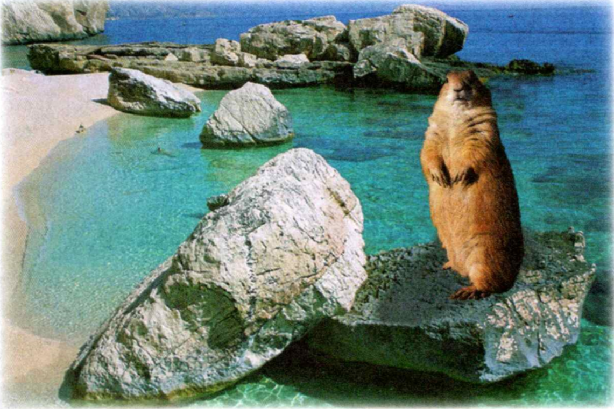
    <figcaption>Figure 1. What's Wrong With This Picture?.</figcaption>
  </figure>

**Complete the tasks below.**

1. What's Wrong With This Picture? See Figure 1. Most people would never expect
to see a prairie dog at the beach. Give three reasons why this prairie dog would
not survive in this habitat.

2. Describe how biotic and abiotic factors are similar and how they are
different.

### What Are the Two Parts of an Organism's Habitat?
To meet its needs, a prairie dog must interact with more than just the other
prairie dogs around it. **An organism interacts with both the living and
nonliving parts of its habitat.**

### Biotic Factors 

What living things can you see in the prairie dog's habitat shown in Figure 2?
The parts of a habitat that are living, or once living, and interact with an
organism are called **biotic factors**. The plants that provide seeds
and berries are biotic factors. The ferrets and eagles that hunt the prairie dog
are also biotic factors. Worms and bacteria are biotic factors that live in the
soil underneath the prairie grass. Prairie dog scat, owl pellets, and
decomposing plant matter are also biotic factors.


### Abiotic Factors 

Not all of the factors that organisms interact with are living. **Abiotic
factors** are the nonliving parts of an organism's habitat. These factors, as
shown in Figure 2, include sunlight, soil, temperature, oxygen, and water.

  <figure>
    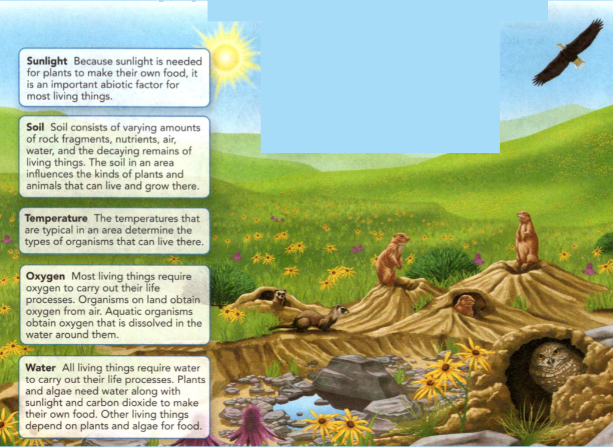
    <figcaption>Figure 2. Factors in a Prairie Habitat.</figcaption>
  </figure>


**Sunlight** Because sunlight is needed 1 for plants to make their own food, it
is an important abiotic factor for most living things. 

**Soil** Soil consists of varying amounts of rock fragments, nutrients, air,
water, and the decaying remains of living things. The soil in an area influences
the kinds of plants and animals that can live and grow there.

**Temperature** The temperatures that are typical in an area determine the types
of organisms that can live there.

**Oxygen** Most living things require oxygen to carry out their life processes.
Organisms on land obtain oxygen from air. Aquatic organisms obtain oxygen that
is dissolved in the water around them.

**Water** All living things require water to carry out their life processes.
Plants and algae need water along with sunlight and carbon dioxide to make their
own food. Other living things depend on plants and algae for food.

**Complete the tasks below.**

1. A prairie dog interacts with many biotic and abiotic factors in the prairie
habitat, see Figure 2. Add another biotic factor to the picture. For each
abiotic factor, draw a line from the text box to an example in the picture.

  <figure>
    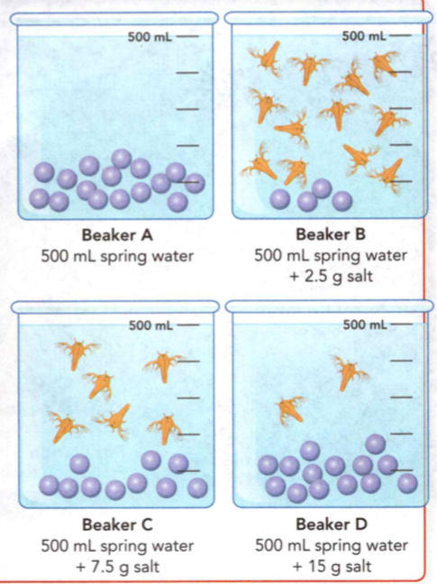
    <figcaption>Figure 3. Brine shrimp eggs.</figcaption>
  </figure>

2. Salt is an abiotic factor found in some environments, see Figure 3. To see
how the amount of salt affects the hatching of brine shrimp eggs, varying
amounts of salt were added to four different 500-mL beakers.
a) In which beaker(s) did the eggs, shown as purple circles, hatch?	
b) The manipulated variable was ___ .
c) The responding variable was ___ .
d) Beaker ___	was the control.
e) What can you conclude about the amount of salt in the shrimps' natural
habitat?

3. List two biotic and two abiotic factors in Figure 2.

4. Name two abiotic factors in your habitat and explain how your life would be
different without them.

5. Two parts of an organism's habitat are

### How Is an Ecosystem Organized?

Most organisms do not live all alone in their habitat. Instead, organisms live
together in populations and communities that interact with abiotic factors in
their ecosystems.

### Organisms 

Black-tailed prairie dogs that live in prairie dog towns on the Nebraska plains
are all members of one species. A **species** is a group of organisms that can
mate with each other and produce offspring that can also mate and reproduce.

### Populations 

All the members of one species living in a particular area are referred to as a
**population**. The prairie dogs in the Nebraska town are one example of a
population.

### Communities 

A particular area contains more than one species of organism. The prairie, for
instance, includes prairie dogs, hawks, snakes, and grasses. All the different
populations that live together in an area make up a **community**.

  <figure>
    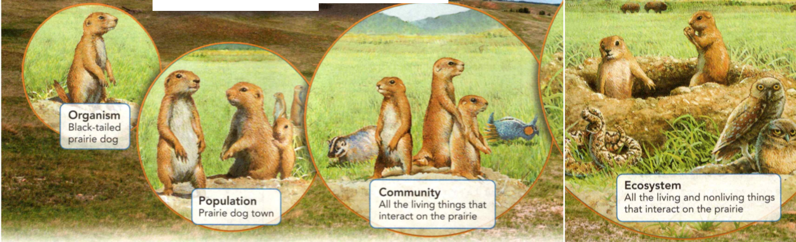
    <figcaption>Figure 4. How do living things affect one another?.</figcaption>
  </figure>

**Complete the tasks below.**

1. Describe how an ecosystem of your choice is organized. Identify each level.
Include biotic and abiotic examples.


### Ecosystem

All the living and nonliving things that interact on the prairie Ecosystems The
community of organisms that live in a particular area, along with their
nonliving environment, make up an **ecosystem**. A prairie is just one of the many
different ecosystems found on Earth. Other ecosystems are deserts, oceans,
ponds, and forests.

Figure 4 shows the levels of organization in a prairie ecosystem. **The smallest
level of organization is a single organism, which belongs to a population that
includes other members of its species. The population belongs to a community of
different species. The community and abiotic factors together form an
ecosystem.**

Because the populations in an ecosystem interact with one another, any change
affects all the different populations that live there. The study of how
organisms interact with each other and with their environment is called
**ecology**.

**Complete the tasks below.**

1. All of the different kinds of organisms in a forest are a (community/
population).

2.  How do living things affect one another?

### Populations
- How Do Populations Change in Size?
- What Factors Limit Population Growth?

**Complete the tasks below.**

1. Prairie Dog Picker-Upper Did you know that vacuum cleaners do more than just
clean carpets? Across the Great Plains, farmers are using specially designed
vacuum cleaners to help them remove black-tailed prairie dogs from the farm
land. Prairie dogs an eat crops, cause soil erosion, and endanger cattle and
farm machinery. The prairie dog vacuum uses a 4-in. plastic hose to suck prairie
dogs out of the ground at 483 km/h! The prairie dogs end up in a padded tank,
usually unharmed. They are hen relocated or donated to the U.S. Fish and
Wildlife Service to be fed to endan- gered eagles, hawks, and black-footed
ferrets.
a) If all of the prairie dogs were removed, how do you think the prairie
ecosystem would be affected?
b) Should prairie dogs be used as food for endangered species? Explain.

### How Do Populations Change in Size?

Ecologists are scientists who study biotic and abiotic factors of an ecosystem
and the interactions between them. Some ecologists study populations and monitor
the sizes of populations over time. **Populations can change in size when new
members join the population or when members leave the population.**

### Births and Deaths 

The most common way in which new individuals join a population is by being born
into it. If more individuals are born into a population than die in any period
of time, a population can grow. So when the **birth rate**, the number of births per
1,000 individuals for a given time period, is greater than its **death rate**, the
number of deaths per 1,000 individuals for a given time period, the population
may increase. The main way that individuals leave a population is by dying. If
the birth rate is the same as the death rate, then the population may stay the
same. In situations where the death rate is higher than the birth rate, then the
population may decrease.

**Complete the tasks below.**

  <figure>
    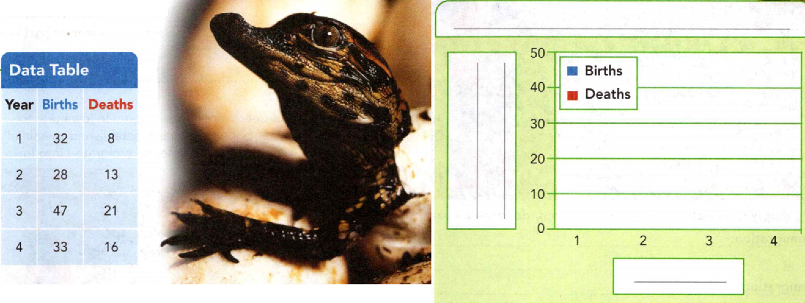
    <figcaption>Figure 5. Alligator.</figcaption>
  </figure>

1. Depending on the size and age of the female, an American Alligator can lay
between 10 and 50 eggs per year, see Figure 5.
a) Using the data table and colored pencils, create a double bar graph showing
alligator births and deaths for four years.
b) Label the x-axis and y-axis. 
c) Write a title for the graph.
d) What factors might explain the number of births and deaths in Year 3?

2. Both the terms immigration ("moving into a population") and emigration
("moving out of a population") come from the Latin word migrare ("to move").
What do you think the prefixes im- and e- mean?

### The Population Statement 

When the birth rate in a population is greater than the death rate, the
population will generally increase. This can be written as a mathematical
statement using the "is greater than" sign:
```
If birth rate > death rate, population size increases.
```
However, if the death rate in a population is greater than the birth rate, the
population size will generally decrease. This can also be written as a
mathematical statement:

```
If death rate > birth rate, population size decreases.
```

### Immigration and Emigration 

The size of a population also can change when individuals move into or out of
the population. **Immigration** means moving into a population. **Emigration**
means leaving a population. For instance, if food is scarce, some members of an
antelope herd may wander off in search of better grassland. If they become
permanently separated from the original herd, they will no longer be part of
that population.

### Graphing Changes in Population 

Changes in a population's size can be displayed on a line graph. Figure 2 shows
a graph of the changes in a rabbit population. The vertical axis identifies the
number of rabbits in the population, while the horizontal axis shows time. The
graph represents the size of the rabbit population over a ten-year period.

<figure>
    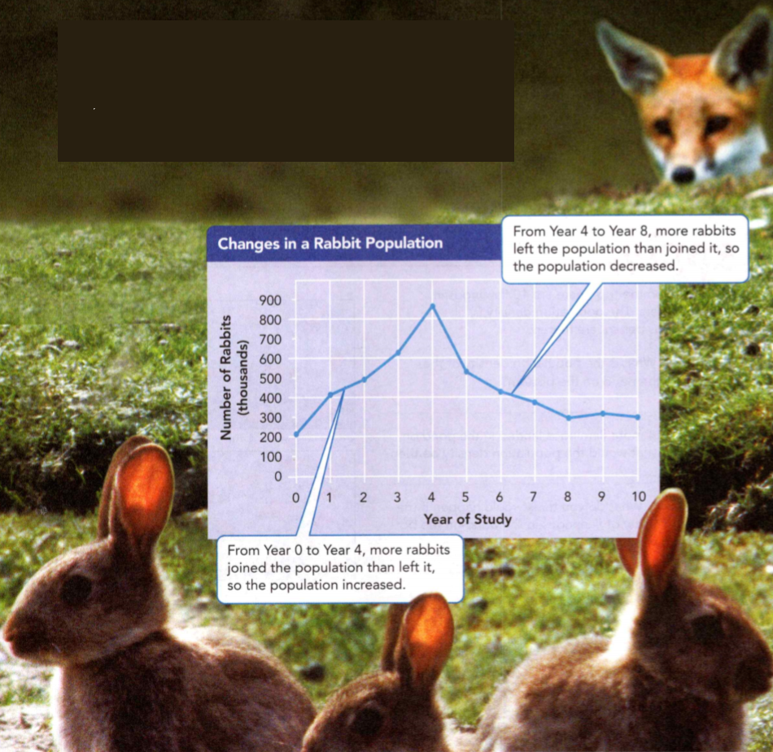
    <figcaption>Figure 6. Changes in a Rabbit Population.</figcaption>
</figure>

**Complete the tasks below.**

1. Changes in a Rabbit Population, see Figure 6. This graph shows how the size
of a rabbit population changed over ten years.
a) In Year ___, the rabbit population reached its highest point.
b) What was the size of the rabbit population in that year?  	
c) How do you think the rabbit population affected the fox population over the
same ten-year period? Explain your reasoning.


### Population Density 

Sometimes an ecologist needs to know more than just the total size of a
population. In many situations, it is helpful to know the **population density** - the
number of individuals in an area of a specific size. Population density can be
written as an equation:
```
Population density = Number of individual / Unit area
```

For example, suppose you counted 20 butterflies in a garden measuring 10 square
meters. The population density would be 20 butterflies per 10 square meters, or
2 butterflies per square meter.

**Complete the tasks below.**

  <figure>
    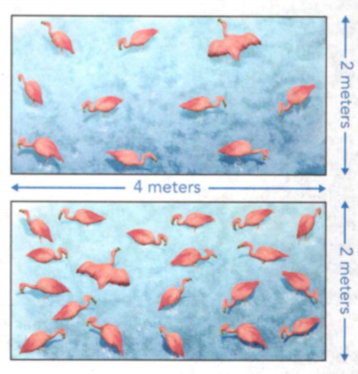
    <figcaption>Figure 7. Pond.</figcaption>
  </figure>

1. See Figure 7. In the pond on the top, there are 10 flamingos in 8 square
meters. The population density is 1.25 flamingos per square meter.
a) What is the population density of the flamingos in the pond on the bottom?
b) If 14 more flamingos landed in the pond on the bottom, what would the
population density be then?
c) What do you think would happen if the population density of flamingos in the
pond on the bottom became too great?

2. Two ways to join a population are ___ and ___ . Two ways to leave a
population are ___ and ___ . 

3. Suppose a population of 8 wolves has produced 20 young in a year. If 7 wolves
have died, how many wolves are in the population now? (Assume no wolves have
moved into or out of the population for other reasons.)

### What Factors Limit Population Growth?

When the living conditions in an area are good, a population will generally
grow. But eventually some environmental factor will cause the population to stop
growing. A **limiting factor** is an environmental factor that causes a population
to stop growing or decrease in size. **Some limiting factors for populations
are weather conditions, space, food, and water.**

### Climate 

Changes in climate conditions, such as temperature and the amount of rainfall,
can limit population growth. A cold spring season can kill the young of many
species of organisms, including birds and mammals. Unusual events like floods,
hurricanes, and a tornado can also have long-lasting effects on population size.

Some plants, like the black walnut tree, release chemicals into the environment
that discourage other plants from growing too close. This process is called
allelopathy.


**Complete the tasks below.**

1. Weather as a Limiting Factor. A tornado or flood can destroy nests and
burrows. Name two types of natural disasters that you think can also limit
population growth.

### Space
Space is another limiting factor for populations. Gannets are seabirds that are
usually seen flying over the ocean. They come to land only to nest on rocky
shores. But the nesting shores get very crowded. If a pair does not find room to
nest, they will not be able to add any offspring to the gannet population. So
nesting space on the shore is a limiting factor for gannets. If there were more
nesting space, more gannets would be able to nest. The population could
increase.

Figure 8 shows how space is also a limiting factor for plants. The amount of
space in which a plant grows determines whether the plant can obtain the
sunlight, water, and soil nutrients it needs. For example, many pine seedlings
sprout each year in forests. But as the seedlings grow, the roots of those that
are too close together run out of space. Branches from other trees may block the
sunlight the seedlings need. Some of the seedlings then die, limiting the size
of the pine population.

### Food and Water

Organisms require food and water to survive. When food and water are in limited
supply, they can be limiting factors. Suppose a giraffe must eat 10 kilograms of
leaves each day to survive. The trees in an area can provide 100 kilograms of
leaves a day while remaining healthy. Five giraffes could live easily in this
area, because they would need just 50 kilograms of food a day. But 15 giraffes
could not all survive-there would not be enough food. No matter how much
shelter, water, and other resources there were, the population would not grow
much larger than 10 giraffes. The largest population that an area can support is
called its **carrying capacity**. The carrying capacity of this giraffe habitat
would be 10 giraffes. The size of a population can vary, but usually stays near
its carrying capacity because of the limi habitat.

  <figure>
    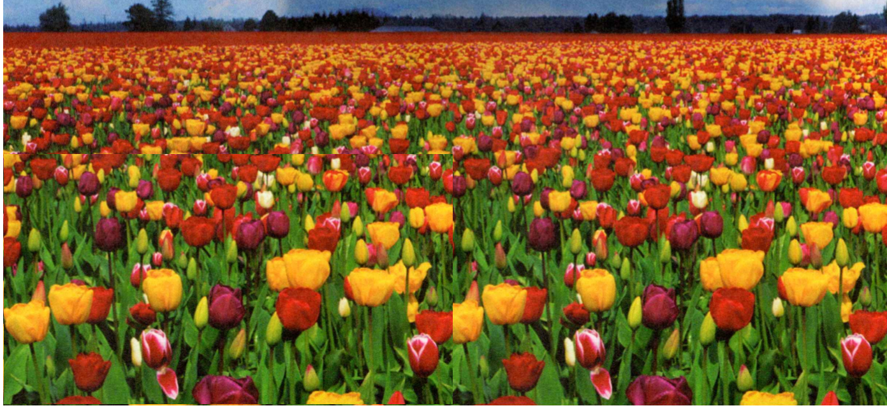
    <figcaption>Figure 8. Space as a Limiting Factor.</figcaption>
  </figure>

**Complete the tasks below.**

1. Space as a Limiting Factor, see Figure 8, If no more tulip plants can grow in
this field, the field has reached its carrying capacity for tulips. Identify
three things a plant needs to survive.

2. Giant pandas live in the mountains of south central China. Most (99 percent)
of the pandas' diet is made up of the bamboo plant. Bamboo is not nutrient rich.
Pandas spend 55 percent of their day eating between 9 and 38 kilograms of
bamboo. Getting enough bamboo to eat can be a challenge. Farming and the timber
industry have destroyed the pandas' habitat and bamboo forests. In addition,
when a bamboo plant flowers, the plant dies and does not regrow for several
years. It is difficult for scientists to know exactly how many giant pandas
exist in the wild. The best estimate is that there are about 1,600 of them. Due
to the small population size, this species is classified as endangered. Write a
letter to the editor that describes how food and space may be limiting factors
for the giant panda species. Add a headline to your letter.

3. When the climate changes or there is not enough ___ or ___ or ___, a
population can (begin/stop) growing in size. 

4. Choose a limiting factor and describe the factor's effect on population
growth.

### Interactions Among Living Things
- How Do Adaptations Help an Organism Survive? 
- What Are Competition and Predation?
- What Are the Three Types of Symbiosis?

**Complete the tasks below.**

1. Predator Power. What predator can close its jaws the fastest? You might think
it is a lion or a shark, but you would be wrong. It is the trap-jaw ant that has
the fastest strike in the animal kingdom. The trap-jaw ant closes its mouth
around its prey in 0.13 milliseconds at speeds of 35 to meters per second! The
force created when its jaw snaps shut also helps the ant escape danger by either
jumping up to 8.3 centimeters high or 39.6 centimeters sideways.
a) How does the trap-jaw ant's adaptation help it avoid becoming the prey of
another organism?
b) What are some adaptations that other predators have to capture prey?

### How Do Adaptations Help an Organism Survive?

As day breaks, a sound comes from a nest tucked in the branch of a saguaro
cactus. Two young red-tailed hawks are preparing to fly. Farther down the stem,
a tiny elf owl peeks out of its nest in a small hole. A rattlesnake slithers
around the base of the saguaro, looking for breakfast. Spying a shrew, the snake
strikes it with needle-like fangs. The shrew dies instantly.

Figure 9 shows some organisms that live in, on, and around the saguaro cactus.
Each organism has unique characteristics. These characteristics affect the
individual's ability to survive and reproduce in its environment.

  <figure>
    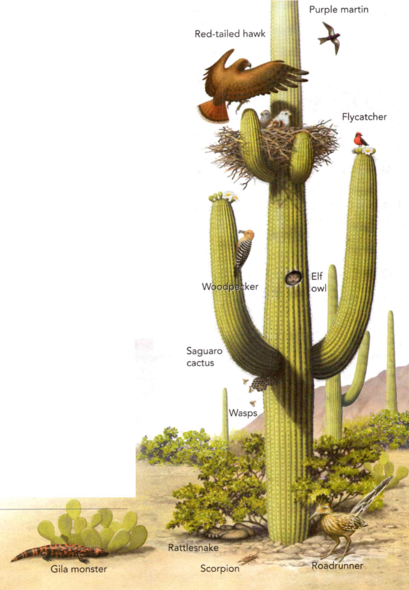
    <figcaption>Figure 9. Saguaro Community.</figcaption>
  </figure>

### Natural Selection 

A characteristic that makes an individual better suited to a specific
environment may eventually become common in that species through a process
called **natural selection**. Natural selection works like this: Individuals whose
unique characteristics are well-suited for an environment tend to survive and
produce more offspring. Offspring that inherit these characteristics also live
to reproduce. In this way, natural selection results in **adaptations**, the
behaviors and physical characteristics that allow organisms to live successfully
in their environments. For example, the arctic hare has fur that turns from gray
to white in the winter which helps camouflage the hare against the snow.

Individuals with characteristics poorly suited to a particular environment are
less likely to survive and reproduce. Over time, poorly suited characteristics
may disappear from the species. If a species cannot adapt to changes in its
environment, the entire species can disappear from Earth and become extinct.


### Niche 

The organisms in the saguaro community have adaptations that result in specific
roles. The role of an organism in its habitat is called its **niche**. A niche
includes what type of food the organism eats, how it obtains this food, and what
other organisms eat it. A niche also includes when and how the organism
reproduces and the physical conditions it requires to survive. Some organisms,
like share the same habitat but have very specific niches that allow them to
live together. **Every organism has a variety of adaptations that are suited to
its specific living conditions and help it survive.**


**Complete the tasks below.**

1. Saguaro Community, see Figure 9. Idenitify and describe two examples of how
organisms interact in this scene.

  <figure>
    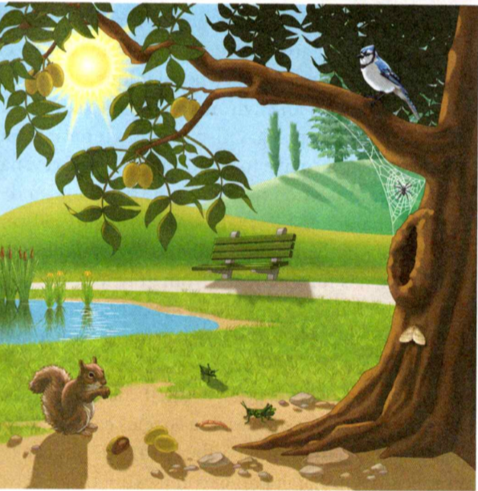
    <figcaption>Figure 10. Organisms.</figcaption>
  </figure>

2. Organisms occupy many niches in an environment like the one in this picture
in Figure 10.
a) List two abiotic factors in the picture.
b) Describe the niche of the squirrel in the picture.
c) What adaptations might the squirrel have that make it able to live in this
environment?

3. Adaptations are the ___ and ___ characteristics that allow organisms to live
successfully in their environments.

4. How are a snake's sharp fangs an adaptation that help it survive in the
saguaro community?


### What Are Competition and Predation?

During a typical day in the saguaro community, a range of interactions takes
place among organisms. **Two major types of interactions among organisms are
competition and predation.**

### Competition 

Different species can share the same habitat and food requirements. For example,
the flycatcher and the elf owl both live on the saguaro and eat insects.
However, these two species do not occupy exactly the same niche. The flycatcher
is active during the day, while the owl is active mostly at night. If two
species occupy the same niche, one of the species might eventually die off. The
reason for this is **competition**. The struggle between organisms to survive as
they attempt to use the same limited resources is called competition. For
example, weeds in a garden compete with vegetable crops for soil nutrients,
water, and sunlight.

In any ecosystem, there are limited amounts of food, water, and shelter.
Organisms that share the same habitat often have adaptations that enable them to
reduce competition. For example, the three species of warblers in Figure 11
specialize in feeding only in a certain part of the spruce tree.

  <figure>
    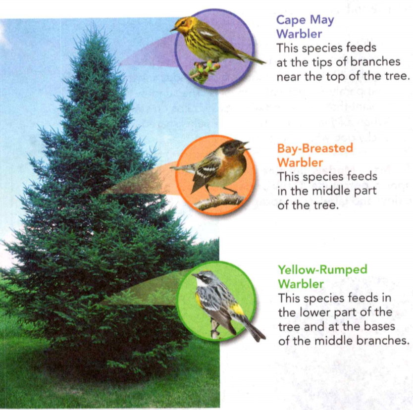
    <figcaption>Figure 11. Niche and Competition.</figcaption>
  </figure>


**Complete the tasks below.**

1. Niche and Competition, see Figure 11.

2. Each of these warbler species occupies a very specific location in its
habitat. By feeding on insects in different areas of the tree, the birds avoid
competing for food and are able to live together.
a) What could happen if these warbler species fed in the same location on the
tree?
b) For what resources do the tree and the grass compete?


### Predation 
In Figure 12, a tiger shark bursts through the water to seize an albatross in
its powerful jaws. An interaction in which one organism kills another for food
or nutrients is called **predation**. The organism that does the killing is the
**predator**. The organism that is killed is the **prey**. Even though they do not kill
their prey, organisms like cows and giraffes are also considered predators
because they eat plants.

  <figure>
    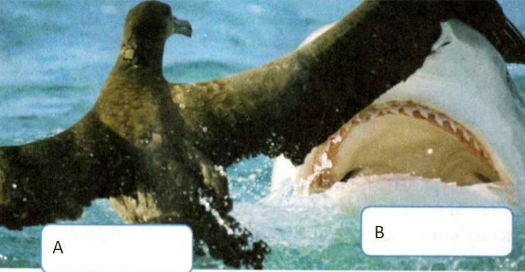
    <figcaption>Figure 12. Predation.</figcaption>
  </figure>

Predation can have a major effect on a prey population size. Recall that when
the death rate exceeds the birth rate in a population, the population size can
decrease. So, if there are too many predators in an area, the result is often a
decrease in the size of the prey population. But a decrease in the number of
prey results in less food for their predators. Without adequate food, the
predator population can decline. Generally, populations of predators and their
prey rise and fall in related cycles.

  <figure>
    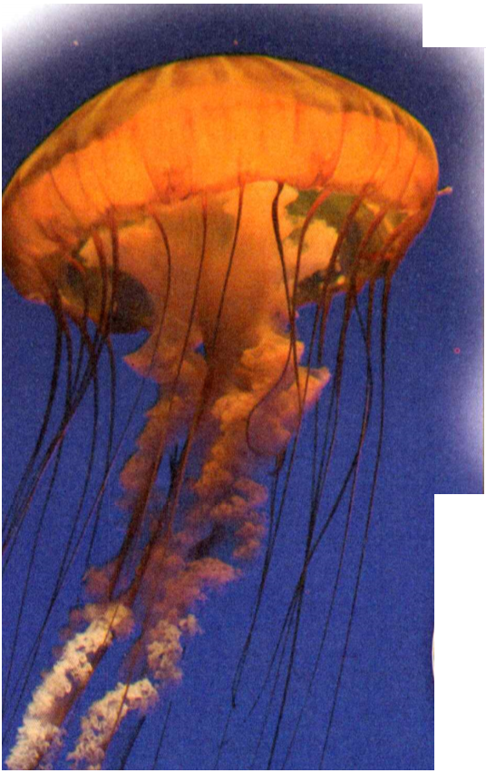
    <figcaption>Figure 13. Predator Adaptations: jellyfish.</figcaption>
  </figure>

In Figure 13 a jellyfish's tentacles contain a poisonous substance, that
paralyzes tiny water animals. 

  <figure>
    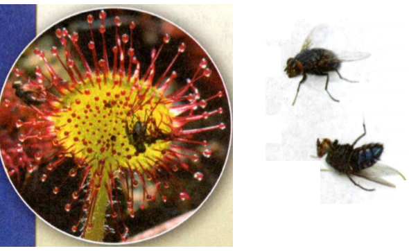
    <figcaption>Figure 14. Predator Adaptations: sundew.</figcaption>
  </figure>

The sundew in Figure 14 is a plant that is covered with sticky bulbs on stalks.
When a fly lands on a bulb, it remains snared in the sticky goo while the plant
digests it.


### Predator Adaptations 

Predators, such as those in Figures 13 & 14, have adaptations that help them
catch and kill their prey. A cheetah can run very fast for a short time,
enabling it to catch its prey. Some predators, such as owls and bats, have
adaptations that enable them to hunt at night when their prey, small mammals and
insects, are active.

### Prey Adaptations 

How do organisms avoid being killed by effective predators? The smelly spray of
a skunk and the sharp quills of a porcupine help keep predators at a distance.
As you can see in Figure 5, organisms have many kinds of adaptations that help
them avoid becoming prey.

  <figure>
    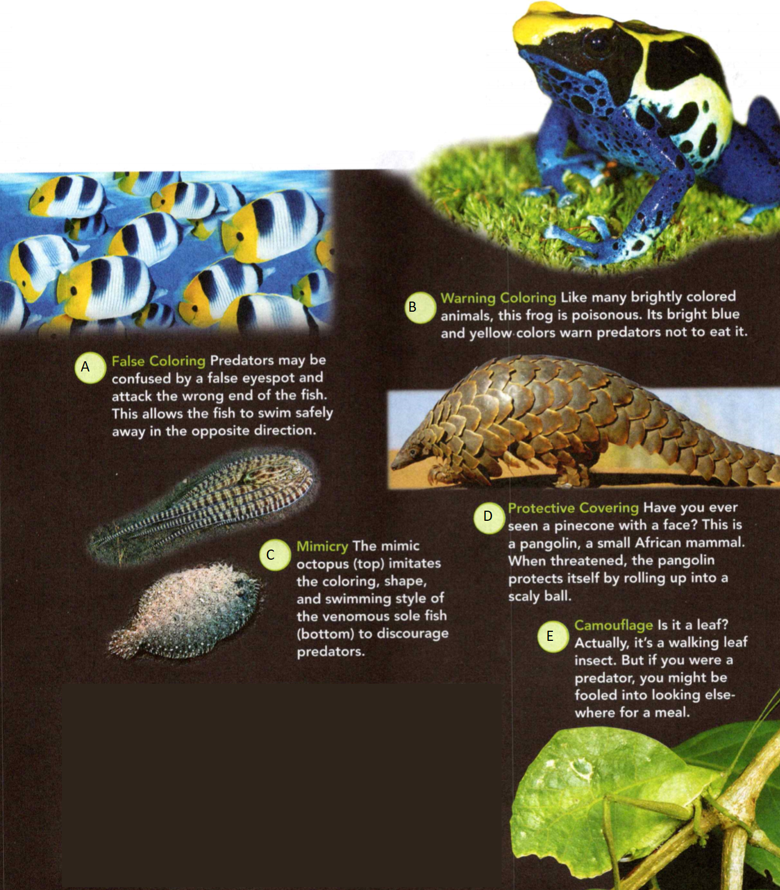
    <figcaption>Figure 15. Defense Strategies.</figcaption>
  </figure>

-**False Coloring** Predators may be confused by a false eyespot and attack the
wrong end of the fish. This allows the fish to swim safely away in the opposite
direction.

-**Warning Coloring** Like many brightly colored animals, this frog is
poisonous. Its bright blue :nd yellow colors warn predators not to eat it.

-**Mimicry** The mimic octopus (top) imitates the coloring, shape, and swimming
style of the venomous sole fish (bottom) to discourage predators.

-**Protective Covering** Have you ever seen a pinecone with a face? This is
pangolin, a small African mammal. When threatened, the pangolin protects itself
by rolling up into a scaly ball.

-**Camouflage** Is it a leaf? Actually, it's a walking leaf insect. But if you
were a predator, you might be fooled into looking elsewhere for a meal.

**Complete the tasks below.**

1. Predation, see Figure 12. This tiger shark and this albatross are involved in
a predator-prey interaction. Label the predator and the prey in the photo.
a) A
b) B

2. Imagine an ideal predator to prey upon a porcupine. Draw or describe your
predator and label its adaptations.

3. Defense Strategies, see Figure 15. Organisms display a wide range of
adaptations that help them avoid becoming prey. Rate each prey adaptation from 1
(best) to 5 (worst). Explain your best choice.
a) A False Coloring
b) B Warning Coloring
c) C Mimicry
d) D Protective Covering
e) E Camouflage

  <figure>
    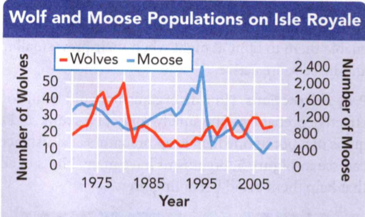
    <figcaption>Figure 16. Wolf and Moose.</figcaption>
  </figure>

4. Predator-Prey Interactions, see Figure 16. On Isle Royale, an island in Lake Superior, the populations of wolves (the predator) and moose (the prey) rise and fall in cycles. Use the graph to answer the questions.
a) What variable is plotted on the horizontal axis? What two variables are
plotted on the vertical axis?
b) How did the moose population change between 2002 and 2007? 
c) What happened to the wolf population from 2003 through 2006?
d) How might the change in moose population have led to the change in the wolf
population?
e) What adaptations does a wolf have that make it a successful predator?
f) How might disease in the wolf population one year affect the moose population
the next year?

5. Two main ways in which organisms interact are ___ and ___ .

6. Give an example of competition. Explain your answer.

7. Owls often prey on mice. What adaptations do you think the mice have that
help them avoid becoming prey?


### What Are the Three Types of Symbiosis?

In addition to competition and predation, symbiosis is a third type of
interaction among organisms. **Symbiosis** is any relationship in which two
species live closely together and at least one of the species benefits. **The
three main types of symbiotic relationships are mutualism, commensalism, and
parasitism.**

### Mutualism 

In some relationships, two species may depend on one another. This is true for
some species of acacia trees and stinging ants in South America. The stinging
ants nest only in the acacia tree, whose thorns discourage the ants' predators.
The tree also provides the ants' only food. The ants, in turn, attack other
animals that approach the tree and clear competing plants away from the base of
the tree. This relationship is an example of **mutualism**. A relationship in
which both species benefit is called mutualism. Other examples of mutualism can
be seen in Figure 17.

  <figure>
    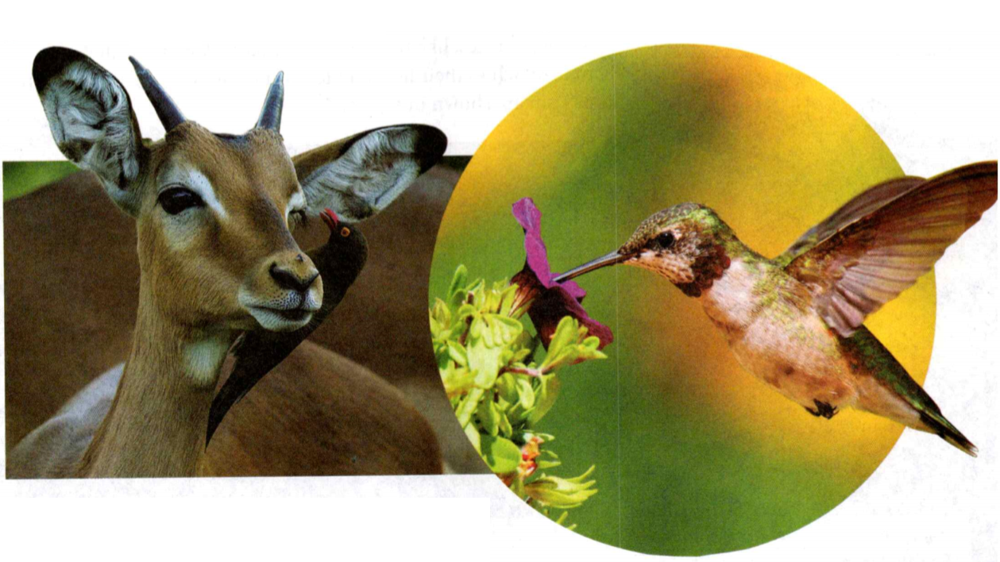
    <figcaption>Figure 17. Mutualism.</figcaption>
  </figure>

**Complete the tasks below.**

1. Mutualism, see Figure 17. An oxpecker rides and snacks aboard an impala. The
oxpecker eat ticks living on the impala's ears. This interaction is an example
of mutualism because both organisms benefit.
a) How does the oxpecker benefit?
b) How does the impala benefit?
c) Explain how the relationship between the hummingbird and the flower is an
example of mutualism.

### Commensalism 

Have you ever seen a bird build a nest in a tree? The bird gets a place to live
while the tree is unharmed. This relationship is an example of commensalism.
**Commensalism** is a relationship in which one species benefits and the other
species is neither helped nor harmed. In nature, commensalism is not very common
because two species are usually either helped or harmed a little by any
interaction.

### Parasitism 

Many family pets get treated with medication to prevent tick and flea bites.
Without treatment, pets can suffer from severe health problems as a result of
these bites. A relationship that involves one organism living with, on, or
inside another organism and harming it is called **parasitism**. The organism
that benefits is called a **parasite**. The organism it lives on or in is called
a **host**. The parasite is usually smaller than the host. In a parasitic
relationship, the parasite benefits while the host is harmed. Unlike a predator,
a parasite does not usually kill the organism it feeds on. If the host dies, the
parasite could lose its source of food or shelter.

Some parasites, like fleas and ticks, have adaptations that enable them to
attach to their host and feed on its blood. Other examples of parasitism are
shown in Figure 18.

  <figure>
    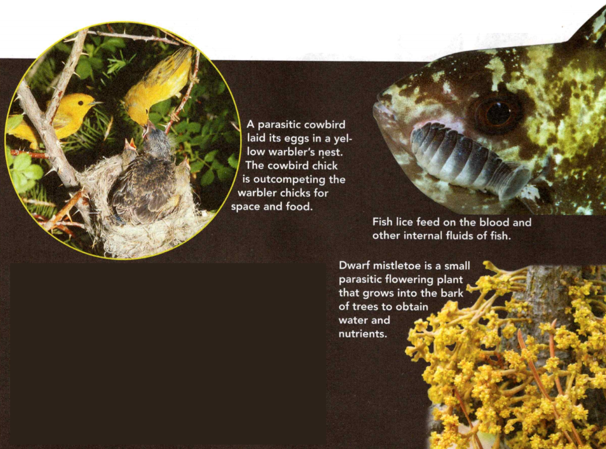
    <figcaption>Figure 18. Parasitism.</figcaption>
  </figure>


**Complete the tasks below.**
1. List the names of the parasites and the hosts in Figure 18.

2. There are many examples of parasitic relationships. Besides fleas, ticks, and
tapeworms, some plants and birds are parasites. Why doesn't a parasite usually
kill its host?

  <figure>
    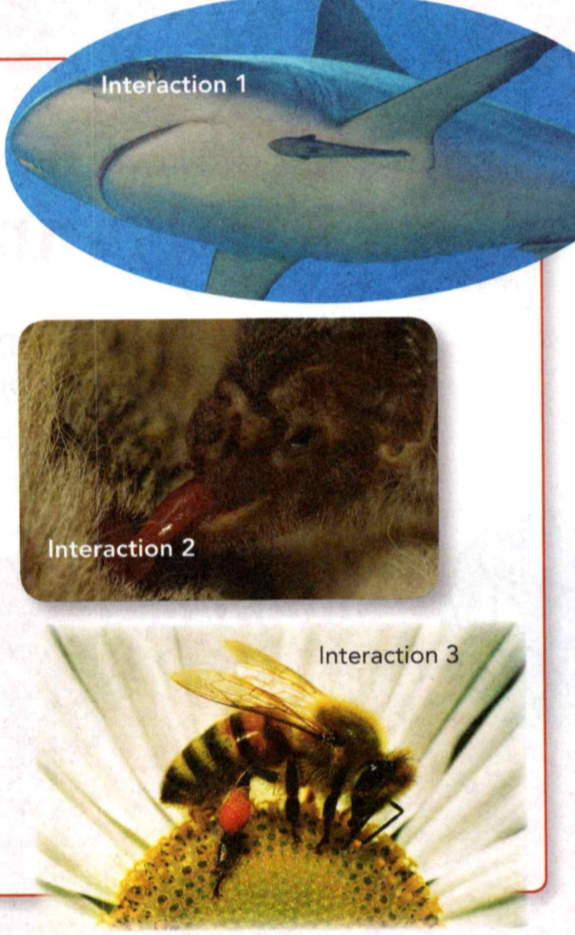
    <figcaption>Figure 19. xxx.</figcaption>
  </figure>

3. Each photograph in Figure 19 represents a different type of symbiosis.
Interaction 1: A remora fish attaches itself to the underside of a shark without
harming the shark, and eats leftover bits of food from the shark's meals.
Interaction 2: A vampire bat drinks the blood of horses. Interaction 3: A bee
pollinates a flower. Classify each interaction as mutualism, commensalism, or
parasitism. Explain your answers.
a) Interaction 1 
b) Interaction 2 
c) Interaction 3

4. What are the three types of symbiosis?

5. Microscopic mites live at the base of human eyelashes, where they feed on
tiny bits of dead skin. What type of symbiosis could this be? Explain your
answer.

6. Name each type of symbiosis and explain how the two species are affected.

### Changes in Communities

- How Do Primary and Secondary Succession Differ?

**Complete the tasks below.**

1. Fighting Fire With Fire Wildfires are often reported in the national news.
The images associated with these reports show how damaging these fires can be to
property and to some ecosystems. What you may not know is that fire can actually
help fight wildfires! Controlled burns, or prescribed burns, are fires that are
purposely and carefully set by professional foresters. Prescribed burns are used
to remove materials such as dead, dry branches and leaves that can fuel
wildfires. A wildfire that occurs in an area that has previously been burned
would cause less damage and be easier for firefighters to control.
a) Why should only professional foresters set prescribed fires?
b) What do you think could be some other benefits to using prescribed burns in
an ecosystem?

### How Do Primary and Secondary Succession Differ?
Fires, floods, volcanoes, hurricanes, and other natural disasters can change
communities very quickly. But even without disasters, communities change. The
series of predictable changes that occur in a community over time is called
**succession**.

### Primary Succession 

When a new island is formed by the eruption of an undersea volcano or an area of
rock is uncovered by a melting sheet of ice, no living things are present. Over
time, living things will inhabit these areas. **Primary succession** is the series
of changes that occurs in an area where no soil or organisms exist.

  <figure>
    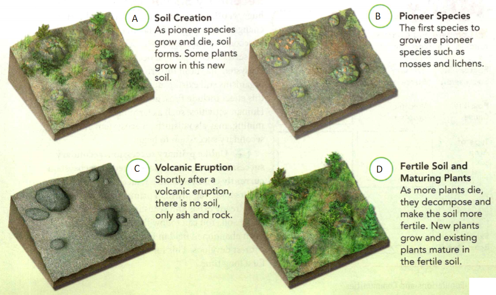
    <figcaption>Figure 20. Primary Succession.</figcaption>
  </figure>

-**Soil Creation** As pioneer species grow and die, soil forms. Some plants grow
in this new soil.
-**Pioneer Species** The first species to grow are pioneer species such as
mosses and lichens.
-**Volcanic Eruption** Shortly after a volcanic eruption, there is no soil, only
ash and rock.
-**Fertile Soil and Maturing Plants** As more plants die, they decompose and
make the soil more fertile. New plants grow and existing plants mature in the
fertile soil.

Figure 20 shows how an area might change following a volcanic eruption. Just like
the pioneers that first settled new frontiers, the first species to populate an
area are called **pioneer species**. They are often carried to the area by wind or
water. Typical pioneer species are mosses and lichens. Lichens are fungi and
algae growing in a symbiotic relationship. As pioneer species grow, they help
break up the rocks. When the organisms die, they provide nutrients that enrich
the thin layer of soil that is forming on the rocks.

As plant seeds land in the new soil, they begin to grow. The specific plants
that grow depend on the climate of the area. For example, in a cool, northern
area, early seedlings might include alder and cottonwood trees. Eventually,
succession may lead to a community of organisms that does not change unless the
ecosystem is disturbed. Reaching this mature community can take centuries.

  <figure>
    
    <figcaption>Figure 21. Secondary Succession.</figcaption>
  </figure>

### Secondary Succession 

In October 2007, huge wildfires raged across Southern California. The changes
following the California fires are an example of secondary succession.
**Secondary succession** is the series of changes that occurs in an area where
the ecosystem has been disturbed, but where soil and organisms still exist.
Natural disturbances that have this effect include fires, hurricanes, and
tornadoes. Human activities, such as farming, logging, or mining, may also
disturb an ecosystem and cause secondary succession to begin.

**Unlike primary succession, secondary succession occurs in a place where an
ecosystem currently exists.** Secondary succession usually occurs more rapidly
than primary succession because soil already exists and seeds from some plants
remain in the soil. You can follow the process of succession in an abandoned
field in Figure 21. After a century, a forest develops. This forest community may
remain for a long time.

**Complete the tasks below.**

1. Primary Succession, see Figure 20. Primary succession occurs in an area where
no soil and no organisms exist. Identify the correct order of events.

2. Secondary Succession, see Figure 21. Secondary succession occurs following a
disturbance to an ecosystem, such as clearing a forest for farmland. Grasses and
wildflowers have taken over this abandoned field. After a few years, pine
seedlings and other trees Replace some of the grasses and wildflowers. As tree
growth continues, the trees begin to crowd out the grasses and wildflowers.
Eventually, a forest of mostly oak, hickory, and some pine dominates the
landscape. Write a brief title that describes what happens at each of the four
stages of secondary succession.
a) A
b) B
c) C
d) D

  <figure>
    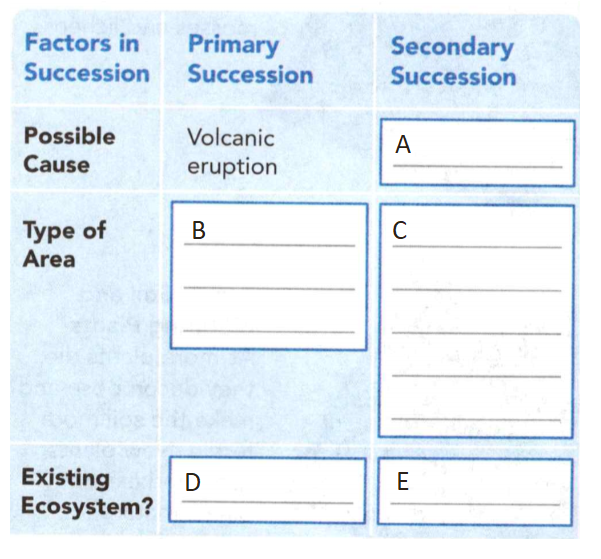
    <figcaption>Figure 22. Succession.</figcaption>
  </figure>

3. Complete the table in Figure 22.
a) A
b) B
c) C
d) D
e) E

4. Pioneer species are the ____ species to populate an area.

5. Is grass poking through a sidewalk crack primary or secondary succession?
Why?

6. Why are the changes during succession predictable?

7. Living things interact in many ways, including competition and ___, as well
as through symbiotic relationships such as mutualism, commensalism, and ___ .


### Study Guide

- An organism gets the things it needs to live, grow, and reproduce from its
environment.
- Biotic and abiotic factors make up a habitat.
- The levels of organization in an ecosystem are organism, population, and
community.
- Populations can change in size when new members join the population or when
members leave the population.
- Some limiting factors for populations are weather conditions, space, food, and
water.
- Every organism has a variety of adaptations that are suited to its specific
living conditions to help it survive.
- Two major types of interactions among organisms are competition and predation.
- The three main types of symbiotic relationships are mutualism, commensalism,
and parasitism.
- Unlike primary succession, secondary succession occurs in a place where an
ecosystem currently exists.


**Complete the tasks below.**

1. A prairie dog, a hawk, and a snake are all members of the same
A) niche.	
B) community.
C) species.	
D) population.

2. Grass is an example of a(n) ___ in a habitat.

3. Put these levels in order from the smallest to the largest: population,
organism, ecosystem, community.

4. Name two biotic and two abiotic factors you might find in a forest ecosystem.

5. In 1815, Mount Tambora, a volcano in Indonesia, erupted. So much volcanic ash
and dust filled the atmosphere that 1816 is referred to as the "Year Without a
Summer." How might a volcanic eruption affect the abiotic factors in an
organism's habitat?

6. Write at least one paragraph describing your habitat. Describe how you get
the food, water, and shelter you need from your habitat. How does this habitat
meet your needs in ways that another would not?

7. All of the following are limiting factors for populations except
A) space.	
B) food.
C) time.	
D) weather.

8. ___ occurs when individuals leave a population.

  <figure>
    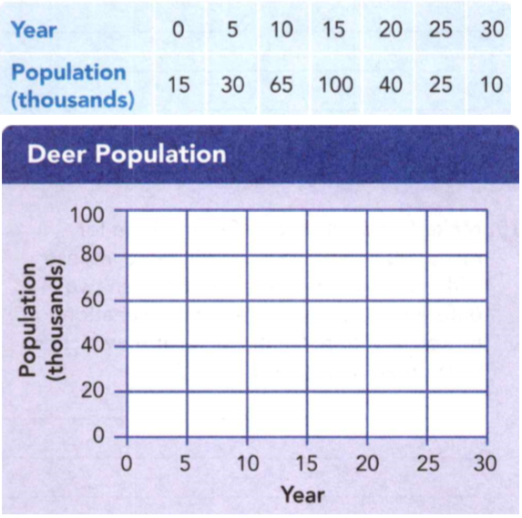
    <figcaption>Figure 23. Deer Population.</figcaption>
  </figure>

9. Use the data table in Figure 23 to answer the question. Ecologists monitoring a deer population collect data during a 30-year study.
a) Use the data to make a line graph.
b) In which year was the deer population the highest? 
c) In which year was the deer population the lowest? 
d) In Year 16 of the study, this region experienced a severe winter. How might
this have affected the deer population?


10. In which type of interaction do both species benefit?
A) predation	
B) mutualism
C) commensalism	
D) parasitism

11. A parasite lives on or inside its ___ .

12.  Name two prey adaptations. How does each adaptation protect the organism?

13. Competition for resources in an area is usually more intense within a single
species than between two different species. Suggest an explanation for this
observation. (Hint: Consider how niches help organisms avoid competition.)

14. Some scientists think that the relationship between clownfish and sea
anemones is an example of commensalism. Other scientists think that the
relationship is mutualism. If this relationship is actually mutualism, how might
both the clownfish and sea anemone benefit?

15. The series of predictable changes that occur in a community over time is called
A) natural selection	
B) ecology
C) commensalism	
D) succession

16.	___ are the first species to populate an area.

  <figure>
    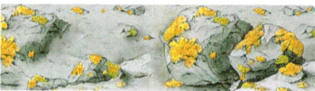
    <figcaption>Figure 24. Lichens and mosses.</figcaption>
  </figure>

17. Lichens and mosses have just begun to grow on the rocky area shown in Figure 24. 
What type of succession is occurring? Explain.

18. Humans interact with their environment on a daily basis. These interactions
can have both positive and negative effects. Using at least four vocabulary
terms from this chapter, describe a human interaction and the effect it has on
the environment.

  <figure>
    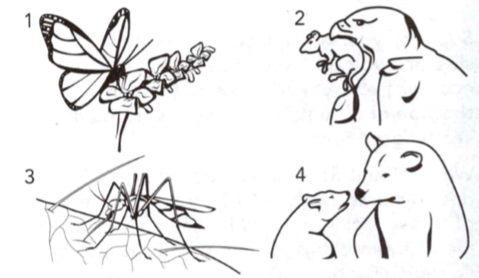
    <figcaption>Figure 25. Images.</figcaption>
  </figure>

19. Symbiotic relationships include mutualism, commensalism, and parasitism.
Which of the images in Figure 25 shows mutualism?
A) Image 1	
B) Image 2
C) Image 3	
D) Image 4 

20. In general, which of the following is a true statement about population size?
A) If birth rate < death rate, population size increases.
B) If death rate < birth rate, population size decreases.
C) If birth rate > death rate, population size increases.
D) If death rate > birth rate, population size increases.

21. Ecosystems have different levels of organization. A group of similar
organisms makes up a ___ , which, along with other types of organisms, makes up
a(n) ___.
A) species, population
B) habitat, ecosystem
C) population, community
D) population, habitat 

22. Three different bird species all live in the same trees in an area, but
competition between the birds rarely occurs. Which of the following is a likely
explanation for this lack of competition?
A) The three species occupy different niches.
B) The three species eat the same food.
C) The three species have a limited supply of food.
D) The three species live in the same part of the trees.

23. Which of the following is a typical pioneer species?
A) grass
B) lichen
C) pine trees
D) soil


  <figure>
    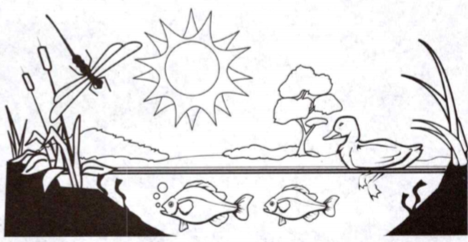
    <figcaption>Figure 26. Habitat.</figcaption>
  </figure>

24. An organism interacts with both the biotic and abiotic factors in its habitat. 
List three biotic factors and three abiotic factors shown in the drawing in Figure 26.

25. Suppose your workplace were on the side of a volcano! Roger del Moral is an
ecologist who spends a lot of time on the side of Mount St. Helens, a volcano in
Washington State. When Mount St. Helens erupted in 1980, it destroyed as much as
518 square kilometers of forest. Del Moral and his team study how plant
communities form in the aftermath of volcanic eruptions. They visit the volcano
regularly to identify plants and estimate the remaining populations of plants to
describe how the plant communities are recovering. This work enables researchers
to develop more effective ways to help areas recover from human-caused
environmental changes. Del Moral loves his work and says, "My work on Mount St.
Helens allows me to follow my passion, train students, and contribute to a
better understanding of how the world works." If you are interested in ecology,
try volunteering or interning at a local park or field museum. National parks
also have Junior Naturalist programs designed to give you experience in the
field. Find a park in your neighborhood or town and describe the kinds of plants
you find. Make a table in which you list each kind of plant, describe it,
describe where it grew, and draw conclusions about the reasons why it might have
grown there.

26. Scientists need all the help they can get estimating large populations!
Binocular Boot Camp, a program for kids in Sonoma Valley, California, trains
kids to identify the songs, calls, and flight patterns of birds. Participants
form teams and identify and count as many birds as they can in one afternoon.
The information they gather gets entered into a huge database of bird
observations. You don't have to go to Binocular Boot Camp to help, though. For
four days in February, schools, clubs, and individuals in the United States and
Canada take part in the Great Backyard Bird Count (GBBC). All you need to do is
count birds for 15 minutes, then fill out a form to help scientists learn how
climate change, habitat change, and other factors affect bird populations. Find
out more about the GBBC. Design a poster or use presentation software to create
a presentation to convince Air school to participate.

27. How accurate are estimates of bird populations? Scientists at North Carolina
State University wondered whether background noise affects scientists' ability
to count bird populations. They used Bird Radio to find out. Bird Radio won't be
on the top 40-unless birds get a vote. It plays bird songs to simulate a wild
bird population. Researchers adjusted background noise and the number of
different bird songs. They learned that this affected people's ability to
estimate the number of "birds" singing on Bird Radio. Even slight increases in
background noise reduced the accuracy of population counts by up to 40 percent!
Scientists are using these data to develop better ways to estimate bird
populations. Create a log sheet for population estimates. The ,text time you are
in a room with other people, close your eyes and try to estimate the number of
people in the room. Then count them. Was your estimate close? What factors
affected it? Try this experiment in five different settings and record what
happens each time.

28. Flying around hunting for food, this barn owl spots a mouse for dinner. But
what did the mouse eat? Perhaps it nibbled on seeds or a caterpillar. Then you
might ask, where did the seeds and caterpillar get their food? Where do living
things get their food?
