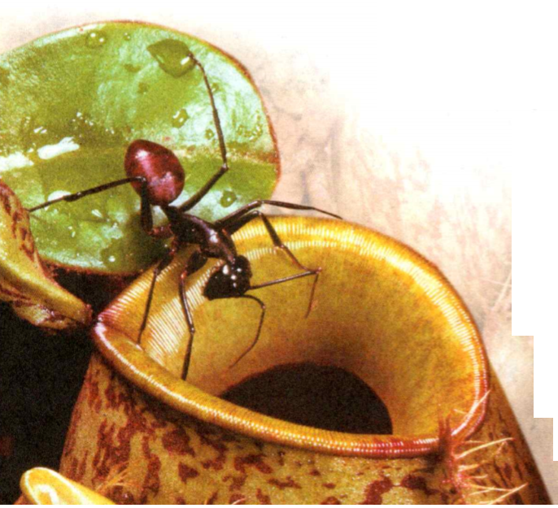
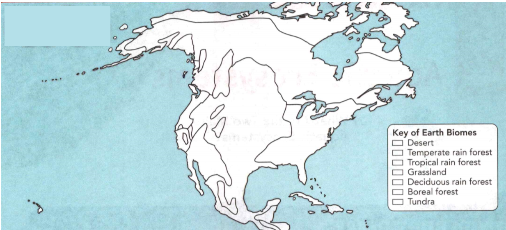
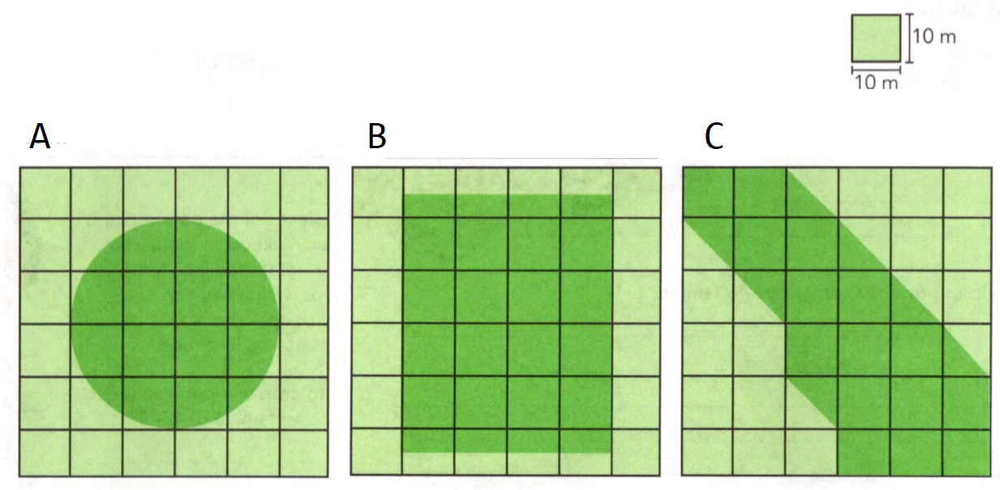
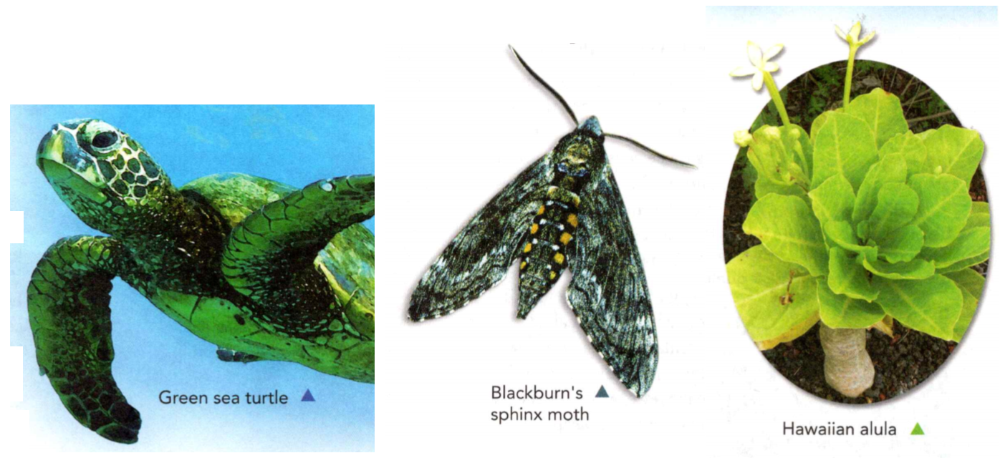

### Life Science

## Biology

## Ecosystems and Biomes

The community of organisms that live in a particular area, along with their
nonliving environment, make up an **ecosystem**.

**Abiotic factors** are the nonliving parts of an organism's habitat.

**Biotic factors** are the living parts of an organism's habitat.

The biosphere is the area where life exists.

**Complete the tasks below.**

1. One morning, Han walks to the park and sits by the pond. He has just studied
ecosystems in class, and now, looking at the pond, he realizes he sees things in
a new way. He notices a turtle sunning itself on a rock, and knows that the sun
and rock are abiotic factors, while the turtle, and other living things, are
biotic factors. Name one more biotic factor and one more abiotic factor that Han
might see at the pond.

### Chapter Preview

- producer 
- consumer
- herbivore 
- carnivore 
- omnivore
- scavenger 
- decomposer
- food chain 
- food web
- energy pyramid
- evaporation 
- condensation
- precipitation 
- nitrogen fixation
- biome 
- climate 
- desert
- rain forest 
- emergent layer
- canopy 
- understory 
- grassland
- savanna 
- deciduous tree
- boreal forest 
- coniferous tree
- tundra 
- permafrost
- estuary
- intertidal zone
- neritic zone
- biodiversity 
- keystone species
- gene 
- extinction
- endangered species
- threatened species
- habitat destruction
- habitat fragmentation 
- poaching
- captive breeding

### Energy Flow in Ecosystems

- What Are the Energy Roles in an Ecosystem? 
- How Does Energy Move Through an Ecosystem?

**Complete the tasks below.**

1. I'll Have the Fish. Scientists have noticed something fishy going!" on with
the wolves in British Columbia, Canada. During autumn, the wolves ignore their
typical food of deer and moose and feast on salmon instead. Salmon are very
nutritious and lack the big horns and hoofs that can injure or kill wolves.
Plus, there are plenty of fish in a small area, making them easier to find and
catch. Many animals, including the wolves, depend upon the salmon's annual
mating trip upstream. Losing this important food source to overfishing would
hurt the populations of bears, wolves, birds, and many other animals.
a) What are two reasons the wolves may eat fish in autumn instead of deer or
moose?
b) What effect could overfishing salmon have on an ecosystem?

### What Are the Energy Roles in an Ecosystem?

Do you play an instrument in your school band? If so, you know that each
instrument has a role in a piece of music. Similar to instruments in a band,
each organism has a role in the movement of energy through its ecosystem.

An organism's energy role is determined by how it obtains food and how it
interacts with other organisms. **Each of the organisms in an ecosystem fills
the energy role of producer, consumer, or decomposer.**

### Producers 

Energy enters most ecosystems as sunlight. Some organisms, like the plants and
algae shown in Figure 1, and some types of bacteria, capture the energy of
sunlight and store it as food energy. These organisms use the sun's energy to
turn water and carbon dioxide into food molecules in a process called
photosynthesis.

An organism that can make its own food is a **producer**. Producers are the source
of all the food in an ecosystem. In a few ecosystems, producers obtain energy
from a source other than sunlight. One such ecosystem is found in rocks deep
beneath the ground. Certain bacteria in this ecosystem produce their own food
using the energy in hydrogen sulfide, a gas that is present in their
environment.

  <figure>
    
    <figcaption>Figure 1. Producers.</figcaption>
  </figure>

### Consumers 

Some members of an ecosystem, like the organisms listed in Figure 2, cannot make
their own food. An organism that obtains energy by feeding on other organisms is
a **consumer**.

Consumers are classified by what they eat. Consumers that eat only plants are
**herbivores**. Some familiar herbivores are caterpillars, rabbits, and deer.
Consumers that eat only animals are **carnivores**. Wolves, walruses, and snakes are
some examples of carnivores. Consumers that eat both plants and animals are
**omnivores**. Crows, bears, and humans are omnivores.

Some carnivores are scavengers. A **scavenger** is a carnivore that feeds on the
bodies of dead organisms. Scavengers include catfish and vultures.

**Complete the tasks below.**

1. Producers are organisms that can make their own food, see Figure 1. Complete
a shopping list to identify the producers that are part of your diet.

  <figure>
    
    <figcaption>Figure 2. What Happened Here?.</figcaption>
  </figure>

2. What Happened Here? See Figure 2. While you were hiking, some hungry animals
turned your campsite upside down.
a) In the table, check off the clues that relate to the organisms that were in
the area. 
b) Using the clues, see if you can determine the order in which the organisms
visited the campsite.

3. The prefix ornni- means "all" or "every." How does this prefix help you
understand what omnivores eat?

4. An organism's energy role is determined by how it obtains ___ and how it ___
with other organisms.

5. What is the main source of energy for all three energy roles? Why?

### Decomposers 

If an ecosystem had only producers and consumers, the raw materials of life,
such as carbon and nitrogen, would stay locked up in wastes and the bodies of
dead organisms. However, there are organisms in ecosystems that prevent this
from happening. **Decomposers** break down biotic wastes and dead organisms and
return the raw materials to the ecosystem.

You can think of decomposers as nature's recyclers. While obtaining energy for
their own needs, decomposers return simple molecules to the environment. These
molecules can be used again by other organisms. Mushrooms, bacteria, and mold
are common decomposers.

### How Does Energy Move Through an Ecosystem?

As you have read, energy enters most ecosystems as sunlight and is converted
into food by producers. This energy is transferred to the organisms that eat the
producers, and then to other organisms that feed on the consumers. **Energy
moves through an ecosystem when one organism eats another.** This movement of
energy can be shown as food chains, food webs, and energy pyramids.

### Food Chains 

One way to show how energy moves in an ecosystem is with a food chain. A food
chain is a series of events in which one organism eats another and obtains
energy. You can follow one example of a food chain in Figure 3. In this food
chain, you can see how energy moves from plants, to a grasshopper, to the fox.
The arrows show how energy moves up the food chain, from one organism to the
next.

  <figure>
    
    <figcaption>Figure 3. Food Chain.</figcaption>
  </figure>

### Food Webs 

A food chain shows only one possible path along which energy can move through an
ecosystem. Most producers and consumers are part of many food chains. A more
realistic way to show the flow of energy through an ecosystem is with a food
web. As shown in Figure 4, a **food web** consists of many overlapping food chains
in an ecosystem.

Organisms may play more than one role in an ecosystem. Look at the crayfish in
Figure 4. A crayfish is an omnivore that is a first-level consumer when it eats
plants. But when a crayfish eats a snail, it is a second-level consumer.

Just as food chains overlap and connect, food webs interconnect as well. A gull
might eat a fish at the ocean, but it might also eat a mouse at a landfill. The
gull, then, is part of two food webs—an ocean food web and a land food web. All
the world's food webs interconnect in what can be thought of as a global food
web.

  <figure>
    
    <figcaption>Figure 4. Food Webs.</figcaption>
  </figure>

**Complete the tasks below.**

1. Using what you have learned about food chains, draw or describe a food chain
from your local ecosystem. Show at least three organisms in your food chain.
Name each organism and label it as a producer, consumer, or decomposer.

2. How can the fox be both a second-level and third-level consumer?

3. Food Web, see Figure 4. A food web consists of many interconnected food
chains. Complete the tasks. Pick two organisms from the food web. Draw arrows
connecting them to the decomposers.

### Energy Pyramids 

When an organism in an ecosystem eats, it obtains energy. The organism uses some
of this energy to move, grow, reproduce, and carry out other life activities.
These activities produce heat, a form of energy, which is then released into the
environment. When heat is released, the amount of energy that is available to
the next consumer is reduced.

A diagram called an energy pyramid shows the amount of energy that moves from
one feeding level to another in a food web. You can see an energy pyramid in
Figure 5. **The most energy is available at the producer level of the pyramid.
As energy moves up the pyramid, each level has less energy available than the
level below.** An energy pyramid gets its name from the shape of the diagram-wider
at the base and narrower at the top.

In general, only about 10 percent of the energy at one level of a food web is
transferred to the next higher level. Most of the energy at each level is
converted to heat. Since about 90 percent of the food energy is converted to
heat at each step, there is not enough energy to support many feeding levels in
an ecosystem.

The organisms at higher feeding levels of an energy pyramid do not necessarily
require less energy to live than the organisms at lower levels. Because so much
energy is converted to heat at each level, the amount of energy available at the
producer level limits the number of consumers that the ecosystem is able to
support. As a result, there are usually fewer organisms at the highest level in
a food web.

  <figure>
    
    <figcaption>Figure 5. Energy Pyramid.</figcaption>
  </figure>

This energy pyramid diagram shows the energy available at each level of a food
web and how it is calculated. Energy is measured in kilocalories, or kcal.

**Complete the tasks below.**

1. Look at the energy pyramid in Figure 5. Why is a pyramid the best shape to
show how energy moves through an ecosystem?

  <figure>
    
    <figcaption>Figure 6. Energy Pyramids.</figcaption>
  </figure>

2. Energy Pyramids. Suppose that the producers at the base of an energy pyramid
contain 330,000 kilocalories. Using Figure 5 as a guide, label in Figure 6 how
much energy would be available at each level of the pyramid based on the
questions below.
a) If mice ate all of the plants, how much energy would be available to them as
first-level consumers?
b) If all of the mice were eaten by snakes, how much energy would the snakes
receive?
c) If all of the snakes were eaten by the owl, how much energy would the owl
receive?
d) About how much energy would the owl use for its life processes or lose as
heat? 	
e) How much energy would be stored in the owl's body? 	

3. A food (web/chain) is a series of events in which one organism eats another
and obtains energy. A food (web/chain) consists of many overlapping food
(webs/chains).

4. Why is a food web a more realistic way of portraying an ecosystem than a food
chain?

5. Why are there usually fewer organisms at the top of an energy pyramid?

### Cycles of Matter
- What Processes Are Involved in the Water Cycle? 
- How Are the Carbon and Oxygen Cycles Related? 
- How Does Nitrogen Cycle Through Ecosystems?

**Complete the tasks below.**

1. Canaries and Coal Have you ever stopped to listen to a bird sing? If you were
a coal miner in the early 1900s, your life may have depended on it! Sometimes
miners stumbled upon pockets of carbon monoxide, a toxic, odorless gas that
makes it difficult for the body to get enough oxygen. Without fresh air
circulating in the mineshafts, the miners would fall asleep and eventually die.
To prevent this disaster from happening, canaries were used to monitor the air
quality. A singing canary indicated that all was well. If the canary stopped
singing and died, the miners knew that they needed to quickly leave the mine. Do
you think it was ethical, or fair to use canaries this way? Explain.

### What Processes Are Involved in the Water Cycle?

Recycling is important for ecosystems because matter is limited. To understand
how matter cycles through an ecosystem, you need to know a few terms that
describe the structure of matter. Matter is made up of tiny particles called
atoms. Two or more atoms that are joined and act as a unit make up a molecule.
For example, a water molecule consists of two hydrogen atoms and one oxygen
atom.

Water is essential for life. The water cycle is the continuous process by which
water moves from Earth's surface to the atmosphere and back. **The processes of
evaporation, condensation, and precipitation make up the water cycle.**

### Evaporation

How does water from the ground get into the air? The process by which molecules
of liquid water absorb energy and change to a gas is called **evaporation**. The
energy for evaporation comes from the heat of the sun. In the water cycle,
liquid water evaporates from oceans, lakes, and other sources and forms water
vapor, a gas, in the atmosphere. Smaller amounts of water also evaporate from
living things. Plants release water vapor from their leaves. You release liquid
water in your wastes and water vapor when you exhale.

### Condensation 

As water vapor rises higher in the atmosphere, it cools down. The cooled vapor
then turns back into tiny drops of liquid water. The process by which a gas
changes to a liquid is called **condensation**. The water droplets collect
around dust particles and form clouds.

### Precipitation 

As more water vapor condenses, the drops of water in the clouds grow larger.
Eventually the heavy drops fall to Earth as **precipitation** -rain, snow,
sleet, or hail. Precipitation may fall into oceans, lakes, or rivers. The
precipitation that falls on land may soak into the soil and become groundwater,
or run off the land, flowing back into a river or ocean.

  <figure>
    
    <figcaption>Figure 7. Water Cycle.</figcaption>
  </figure>

**Complete the tasks below.**

1. In the water cycle (see Figure 7), water moves continuously from Earth's
surface to the atmosphere and back. Label the three processes of the water cycle
in the diagram.

2. Producers, consumers, and decomposers all play a role in recycling carbon and
oxygen. Describe how you think a cow eating grass is part of both the carbon and
oxygen cycles.

### How Are the Carbon and Oxygen Cycles Related?

Carbon and oxygen are also necessary for life. Carbon is an essential building
block in the bodies of living things. For example, carbon is a major component
of bones and the proteins that build muscles. And most organisms use oxygen for
their life processes. **In ecosystems, the processes by which carbon and oxygen
are recycled are linked. Producers, consumers, and decomposers all play roles in
recycling carbon and oxygen.**

### The Carbon Cycle 

Most producers take in carbon dioxide gas from the air during food-making or
photosynthesis. They use carbon from the carbon dioxide to make
food-carbon-containing molecules such as sugars and starches. As consumers eat
producers, they take in the carbon-containing molecules. Both producers and
consumers then break down the food to obtain energy. As the food is broken down,
producers and consumers release carbon dioxide and water into the environment.
When producers and consumers die, decomposers break down their remains and
return carbon molecules to the soil. Some decomposers also release carbon
dioxide into the air.

### The Oxygen Cycle 

Look at Figure 8. Like carbon, oxygen cycles through ecosystems. Producers
release oxygen as a result of photosynthesis. In fact, photosynthesis is
responsible for most of the oxygen in Earth's atmosphere. Most organisms take in
oxygen from the air or water and use it to carry out their life processes.

### Human Impact 

Human activities also affect the levels of carbon and oxygen in the atmosphere.
When humans burn oil and other plant-based fuels, carbon dioxide is released
into the atmosphere. Carbon dioxide levels can also rise when humans clear
forests for lumber, fuel, and farmland. Increasing levels of carbon dioxide are
a major factor in global warming.

As you know, producers take in carbon dioxide during photosynthesis. When trees
are removed from the ecosystem, there are fewer producers to absorb carbon
dioxide. There is an even greater effect if trees are burned down to clear a
forest. When trees are burned down, additional carbon dioxide is released during
the burning process.

  <figure>
    
    <figcaption>Figure 8. Carbon and Oxygen Cycles.</figcaption>
  </figure>

- Some human activities release carbon compounds into the air.
- Animals and plants break down sugars and release carbond dioxide.
- Carbon compounds are taken up by plants.
- Plant tak in carbon dioxide and use carbon to make sugar molecules.
- Plant produce oxygen, which is then taken in by animals.
- When organisms die, decomposers return carbon compounds to the soil and
release carbon dioxide to the air.

**Complete the tasks below.**

1. Carbon and Oxygen Cycles, see Figure 8. Producers, consumers, and decomposers
all play a role in recycling carbon and oxygen. When humans burn fuel or cut
down trees, they (increase/decrease) levels of carbon dioxide in the atmosphere.

2. Carbon and oxygen are both ___ in an ecosystem.

3. How might the death of all the producers in a community affect the carbon and
oxygen cycles?

### How Does Nitrogen Cycle Through Ecosystems?

Like carbon, nitrogen is one of the necessary building blocks that make up
living things. For example, in addition to carbon, nitrogen is also an important
component of proteins. **In the nitrogen cycle, nitrogen moves from the air
into the soil, into living things, and back into the air or soil.** Since the air
around you is about 78 percent nitrogen gas, you might think that it would be
easy for living things to obtain nitrogen. However, most organisms cannot use
nitrogen gas. Nitrogen gas is called "free" nitrogen because it is not combined
with other kinds of atoms.

  <figure>
    
    <figcaption>Figure 9. Growth in Nitrogen-Poor Soil.</figcaption>
  </figure>

### Nitrogen Fixation 

Most organisms can use nitrogen only after it has been "fixed," or combined with
other elements to form nitrogen-containing compounds. The process of changing
free nitrogen into a usable form of nitrogen, as shown in Figure 4, is called
**nitrogen fixation**. Most nitrogen fixation is performed by certain kinds of
bacteria. These bacteria live in bumps called nodules on the roots of legumes.
These plants include clover, beans, peas, alfalfa, peanuts, and some trees. 

The relationship between the bacteria and the legumes is an example of
mutualism. Both the bacteria and the plants benefit from this relationship: The
bacteria feed on the plants' sugars, and the plants are supplied with nitrogen
in a usable form.

### Return of Nitrogen to the Environment

Once nitrogen is fixed, producers can use it to build proteins and other complex
compounds. Nitrogen can cycle from the soil to producers and then to consumers
many times. At some point, however, bacteria break down the nitrogen compounds
completely. These bacteria then release free nitrogen back into the air, causing
the cycle to continue.

  <figure>
    
    <figcaption>Figure 10. Nitrogen Cycle.</figcaption>
  </figure>

- Soil bacteria release some free nitrogen into the air.
- Consumers eat nitrogen compounds in plants.
- Decomposers return simple nitrogen compounds to the soil.
- Plants use simple nitrogen compounds to make proteins and other comples compounds
- Bacteria in root nodules fix free nitrogen into simple compounds.

**Complete the tasks below.**

1. Growth in Nitrogen-Poor Soil, see Figure 9. Pitcher plants can grow in nitrogen-poor soil because they obtain nitrogen by trapping insects in their tube-shaped leaves. The plants then digest the insects and use their nitrogen compounds.
a) If nitrogen in the soil isn't (fixed/free), then most organisms cannot use it.
b) The relationship between the pitcher plant and the insects is an example of
(competition/predation/symbiosis).

2. Nitrogen Cycle, see Figure 10. In the nitrogen cycle, free nitrogen from the
air is fixed into compounds. Consumers can then use these nitrogen compounds to
carry out their life processes. Nitrogen compounds become available to organisms
(in the soil/in the plants/in the air).

  <figure>
    
    <figcaption>Figure 11. How do energy and matter move through ecosystems?.</figcaption>
  </figure>

3. How do energy and matter move through ecosystems, see Figuer 11? Energy and
matter are constantly being cycled through an ecosystem. These cycles can occur
at the same time. Using colored pencils, draw arrows to represent the following
in the figure below: water cycle (blue), carbon cycle (purple), oxygen cycle
(yellow), nitrogen cycle (orange), food chain (green). Label each cycle.

4. (Fixed/Free) nitrogen is not combined with other kinds of atoms.

5. What might happen in a community if farmers did not plant legume crops?

6. How do energy and matter move through ecosystems?

### Biomes
- What Are the Six Major Biomes?

**Complete the tasks below.**

1. That's Super Cool! Misconception: It is always fatal when body temperatures
drop below freezing. Fact: In the tundra, arctic ground squirrels hibernate up
to eight months a year. During this time, a squirrel's body temperature drops
below freezing! This is called supercooling and gives the squirrel the lowest
body temperature of any mammal. Without waking, a squirrel will shiver for
several hours every - ple of weeks to increase its body temperature. What do you
think are the advantages of supercooling?

### What Are the Six Major Biomes?

Imagine that you are taking part in an around-the-world scientific expedition.
On this expedition you will collect data on the typical climate and organisms of
each of Earth's biomes. A **biome** is a group of ecosystems with similar climates
and organisms.

**The six major biomes are desert, rain forest, grassland, deciduous forest,
boreal forest, and tundra.** It is mostly the **climate** -the average annual
temperature and amount of precipitation-in an area that determines its biome.
Climate limits the species of plants that can grow in an area. In turn, the
species of plants determine the kinds of animals that live there.

### Desert Biomes 

The first stop on your expedition is a desert. You step off the bus into the
searing heat. A **desert** is an area that receives less than 25 centimeters of
rain per year. Some of the driest deserts may not receive any precipitation in a
year! Deserts often undergo large shifts in temperature during the course of a
day. A scorching hot desert like the Namib Desert in Africa cools rapidly each
night when the sun goes down. Other deserts, such as the Gobi in central Asia,
have a yearly average temperature that is below freezing.

Organisms that live in the desert, like the fennec in Figure 12, must be adapted
to little or no rain and to extreme temperatures. For example, the stem of a
saguaro cactus has folds that are similar to the pleats in an accordion. The
stem expands to store water when it is raining. Gila monsters can spend weeks at
a time in their cool underground burrows. Many other desert animals are most
active at night when the temperatures are cooler.

  <figure>
    
    <figcaption>Figure 12. Desert.</figcaption>
  </figure>

**Complete the tasks below.**

1. Organisms must be adapted to live in the desert, see Figure 12. How do you
think the fennec's ears and fur are adaptations to the desert's extreme
temperatures?

2. Write five things you'll need to be well adapted to desert conditions. Pack
carefully!

### Rain-Forest Biomes 

The second stop on your expedition is a rain forest. **Rain forests** are
forests in which large amounts of rain fall year-round. This biome is living up
to its name-it's pouring! After a short shower, the sun reappears. However, very
little sunlight reaches the ground.

Plants are everywhere in the rain forest. Some plants, like the vines hanging
from tree limbs, even grow on other plants! And animals are flying, creeping,
and slithering all around you.

### Temperate Rain Forests 

You may think that a rain forest is a warm, humid "jungle" in the tropics. But
there is another type of rain forest. The Pacific Northwest of the United States
receives more than 300 centimeters of rain a year. Huge trees grow there,
including redwoods, cedars, and firs. Many ecologists refer to this ecosystem as
a temperate rain forest. The term temperate means "having moderate
temperatures".

  <figure>
    
    <figcaption>Figure 13. Temperate Rain Forests.</figcaption>
  </figure>

**Complete the tasks below.**

1. Compare temperate and tropical rain forests. 

2. Temperate Rain Forests, see Figure 13. The sugar pine is the tallest kind of
pine tree, reaching heights of 53 to 61 meters. It also produces the largest
pine cones. A sugar pine cone can reach a length of 30 to 56 centimeter. What
conditions do you think allow a tree to grow so tall?

### Tropical Rain Forests 

As you can see on the map, tropical rain forests are found in regions close to
the equator. The climate is warm and humid all year long, and there is a lot of
rain. Because of these climate conditions, an amazing variety of plants grow in
tropical rain forests.

Trees in the rain forest form several distinct layers. The tallest layer of the
rain forest which receives the most sunlight and can reach up to 70 meters, is
the **emergent layer**. Underneath, trees up to 50 meters tall form a leafy roof
called the **canopy**. Below the canopy, a layer of shorter trees and vines,
around 15 meters high, form an **understory**. Understory plants grow well in
the shade formed by the canopy. The forest floor is nearly dark, so only a few
plants live there. Look at the tree layers in Figure 3.

  <figure>
    
    <figcaption>Figure 14. Tropical Rain Forests.</figcaption>
  </figure>

The abundant plant life in tropical rain forests provides habitats for many
species of animals. Ecologists estimate that millions of species of insects live
in tropical rain forests. These insects serve as a source of food for many
reptiles, birds, and mammals. Many of these animals, in turn, are food
sources for other animals. Although tropical rain forests cover only a small
part of the planet, they probably contain more species of plants and animals
than all the other biomes combined.

**Complete the tasks below.**

1. Tropical Rain Forests, see Figure 14. On the edge of this tropical rain
forest, an amazing variety of organisms can be found in the different layers.
Label the four distinct layers of the tropical rain forest in the boxes.

### Grassland Biomes 

The third stop on the expedition is a grassy plain called a prairie.
Temperatures are more comfortable here than they were in the desert. The breeze
carries the scent of soil warmed by the sun. This rich soil supports grasses as
tall as you. Startled by your approach, sparrows dart into hiding places among
the waving grass stems.

Although the prairie receives more rain than a desert, you may notice only a few
scattered areas of trees and shrubs. Ecologists classify prairies, which are
generally found in the middle latitudes, as grasslands. A **grassland** is an area
that is populated mostly by grasses and other nonwoody plants. Most grasslands
receive 25 to 75 centimeters of rain each year. Fires and droughts are common in
this biome. Grasslands that are located closer to the equator than prairies are
known as savannas. A **savanna** receives as much as 120 centimeters of rain each
year. Scattered shrubs and small trees grow on savannas, along with grass.

Grasslands are home to many of the largest animals on Earth- herbivores such as
elephants, bison, antelopes, zebras, giraffes, kangaroos, and rhinoceroses.
Grazing by these large herbivores maintains the grasslands. Their grazing keeps
young trees and bushes from sprouting and competing with the grass for water and
sunlight. You can see some grassland birds in Figure 4.

  <figure>
    
    <figcaption>Figure 15. Grasslands.</figcaption>
  </figure>

**Complete the tasks below.**

1. Grasslands, see Figure 15. The rhea, cassowary, and ostrich are grassland
birds that live on different continents. On the world map, identify the
continents in which these three birds are located. 
a) Rhea, South America
b) Cassowary, Australia
c) Ostrich, Africa

2. Grasslands, see Figure 15. The rhea, cassowary, and ostrich are grassland
birds that live on different continents. List three characteristics that these
grassland birds all share.

### Deciduous Forest Biomes 

Your trip to the fourth biome takes you to another forest. It is now late
summer. Cool mornings here give way to warm days. Several members of the
expedition are busy recording the numerous plant species. Others are looking
through binoculars, trying to identify the songbirds.

You are now visiting a deciduous forest biome. Many of the trees in this forest
are **deciduous trees**, trees that shed their leaves and grow new
ones each year. Oaks and maples are examples of deciduous trees. Deciduous
forests receive enough rain to support the growth of trees and other plants, at
least 50 centimeters of rain per year. Temperatures can vary greatly during the
year. The growing season usually lasts five to six months.

The variety of plants in a deciduous forest creates many different habitats.
Many species of birds live in different parts of the forest, eating the insects
and fruits in their specific areas. Mammals such as chipmunks and skunks live in
deciduous forests. In a North American deciduous forest you might also see wood
thrushes and white-tailed deer.

If you were to return to this biome in the winter, you would not see much
wildlife. Many of the bird species migrate, or fly great distances, to warmer
areas. Some of the mammals hibernate, or enter a state of greatly reduced body
activity similar to sleep. Look at Figure 16. During the winter months, animals
that hibernate get energy from fat stored in their bodies.

  <figure>
    
    <figcaption>Figure 16. Deciduous Forest.</figcaption>
  </figure>

How far would you be willing to migrate? The bobolink has one of the longest
songbird migration routes. The birds travel south from southern Canada and the
northern United States to northern Argentina. This migration route is
approximately 20,000 kilometers round trip!

**Complete the tasks below.**

1. Deciduous Forest, see Figure 16. Most of the trees in a deciduous forest have
leaves that change color and drop to the forest floor each autumn. In the
leaves, this dormouse hibernates through the winter. Is hibernation an
adaptation to life in a deciduous forest? Explain your answer.

### Boreal Forest Biomes 

Now the expedition heads north to a colder biome, the boreal forest. The term
boreal means "northern," and **boreal forests** are dense forests found in upper
regions of the Northern Hemisphere. The expedition leaders claim they can
identify a boreal forest by its smell. When you arrive, you catch a whiff of the
spruce and fir trees that blanket the hillsides. Feeling the chilly early fall
air, you pull a jacket and hat out of your bag.

### Boreal Forest Plants 

Most of the trees in the boreal forest are **coniferous trees**, trees that
produce their seeds in cones and have leaves shaped like needles. The boreal
forest is sometimes referred to by its Russian name, the taiga. Winters in these
forests are very cold. The snow can reach heights well over your head! Even so,
the summers are rainy and warm enough to melt all the snow.

Tree species in the boreal forest are well adapted to the cold climate. Since
water is frozen for much of the year, trees must have adaptations that prevent
water loss. Coniferous trees, such as firs and hemlocks, all have thick, waxy
needles that prevent water from evaporating.

### Boreal Forest Animals 

Many of the animals of the boreal forest eat the seeds produced by the
coniferous trees. These animals include red squirrels, insects, and birds such
as finches. Some herbivores, such as moose and beavers, eat tree bark and new
shoots. The variety of herbivores in the boreal forest supports many predators,
including lynx, otters, and great horned owls. Figure 17 shows an herbivore and
its predator.

  <figure>
    
    <figcaption>Figure 17. Boreal Forest.</figcaption>
  </figure>

**Complete the tasks below.**

1. Boreal Forest, see Figure 17. This lynx and snowshoe hare are adapted to life
in the boreal forest. The feet of each animal are an adaptation to its
A) food.	
B) climate.
C) predators.	
D) all of the above 

### Tundra Biomes 

As you arrive at your last stop, the driving wind gives you an immediate feel
for this biome. The **tundra** is extremely cold and dry. Expecting deep snow,
many are surprised to learn that the tundra may receive no more precipitation
than a desert.

Most of the soil in the tundra is frozen all year. This frozen soil is called
permafrost. During the short summer, the top layer of soil thaws, but the
underlying soil remains frozen. Because rainwater cannot soak into the
permafrost, shallow ponds and marshy areas appear in the summer.

### Tundra Plants 

Mosses, grasses, and dwarf forms of a few trees can be found in the tundra. Most
of the plant growth takes place during the long days of the short summer season.
North of the Arctic Circle, the sun does not set during midsummer.

### Tundra Animals 

In summer, the insects are abundant. Insect-eating birds take advantage of the
plentiful food by eating as much as they can. But when winter approaches, these
birds migrate south. Mammals of the tundra include caribou, foxes, and wolves.
The mammals that remain on the tundra during the winter grow thick fur coats.
What can these animals find to eat on the tundra in winter? The caribou scrape
snow away to find lichens. Wolves follow the caribou and look for weak members
of the herd to prey upon.

  <figure>
    
    <figcaption>Figure 18. Tundra.</figcaption>
  </figure>

**Complete the tasks below.**

1. Tundra, see Figure 18. Although the ground is frozen for most of the year,
mosses, grasses, and dwarf willow trees grow here. 
a) Why are there no tall trees on the tundra?
b) Describe two factors that you think may influence tree growth.

### Mountains and Ice 

Some land areas are not classified as biomes. Recall that biomes are defined by
abiotic factors such as climate and soil, and by biotic factors such as plant
and animal life. Because the organisms that live in these areas vary, mountain
ranges and land covered with thick ice sheets are not considered biomes.

The climate of a mountain changes from its base to its summit. If you were to
hike all the way up a tall mountain, you would pass through a series of biomes.
At the base, you might find grasslands. As you climbed, you might pass through
deciduous forest and then boreal forest. As you neared the top, your
surroundings would resemble the cold, dry tundra.

Other places are covered year-round with thick ice sheets. Most of Greenland and
Antarctica fall into this category. Organisms that are adapted to life on ice
include leopard seals and polar bears.

**Complete the tasks below.**

  <figure>
    
    <figcaption>Figure 19. Climate data.</figcaption>
  </figure>

1. Biome Climates, see Figure 19. An ecologist collected climate data from two
locations. The graph shows the monthly average temperatures in the two
locations. The total yearly precipitation in Location A is 250 centimeters. In
Location B, the total yearly precipitation is 14 centimeters.
a) Provide a title for the graph. 
b) What variable is plotted on the horizontal axis? 
c) What variable is plotted on the vertical axis? 
d) How would you describe the temperature over the course of a year in Location A? 
e) How would you describe the temperature over the course of a year in Location B? 
c) Given the precipitation and temperature data for these locations, in which
biome would you expect each to be located?

  <figure>
    
    <figcaption>Figure 20. Map.</figcaption>
  </figure>

2. Map, see Figure 20. Using the colors: Desert: orange, Temperate rain forest:
tapestry, Tropical rain forest: dark green, Grassland: Light green, Decidous
forest: brown, Boreal forest: blue, Tundra: red, Mountains: purple, Ice: white. 
a) Color in the key
b) Use the key to color in the areas on the map of North America.
c) Where are most of the boreal forests located? 
d) Why are there no boreal forests in the Southern Hemisphere?
e) Describe Mark the area in which you live with an X on the map. 
f) What is the climate like where you live? 
g) How do you think your climate affects which organisms live there?

3. ___ and ___ are the two main factors that determine an area's biome. 

4. What biome might you be in if you were standing on a bitterly cold, dry plain
with only a few, short trees scattered around?

5. What are the six major biomes?

### Aquatic Ecosystems

- What Are the Two Major Aquatic Ecosystems?

**Complete the tasks below.**

1. Underwater Alvin. Meet Alvin, an HOV (Human-Occupied Vehicle). Equipped with
propulsion jets, cameras, and robotic arms, Alvin helps scientists gather data
and discove ecosystems that exist deep in the ocean. Built in 1964, Alvin was
one of the world's first deep-ocean submersibles and has made more than 4,500
dives. Alvin is credited with finding a lost hydrogen bomb, exploring the first
known hydrothermal vents, and surveying the wreck of the Titan. Suppose that on
each of the 4,500 dives Alvin has made, a new pilot and two new scientists were
on board. How many scientists have seen the deep ocean through Alvin's windows?
How many people, in total, traveled in Alvin?

### What Are the Two Major Aquatic Ecosystems?

Since almost three quarters of Earth's surface is covered with water, many
living things make their homes in and near water. **There are two types of
aquatic, or water-based, ecosystems: freshwater ecosystems and marine (or
saltwater) ecosystems.** All aquatic ecosystems are affected by the same
abiotic, or nonliving, factors: sunlight, temperature, oxygen, and salt content.
Sunlight is an important factor in aquatic ecosystems because it is necessary
for photosynthesis in the water just as it is on land. Half of all oxygen
produced on Earth comes from floating algae called phytoplankton. Because water
absorbs sunlight, there is only enough light for photosynthesis to occur near
the surface or in shallow water.

### Freshwater Ecosystems 

No worldwide expedition would be complete without exploring Earth's waters. Even
though most of Earth's surface is covered with water, only 3 percent of the
volume is fresh water. Freshwater ecosystems include streams, rivers, ponds, and
lakes. On this part of your expedition, you'll find that freshwater biomes
provide habitats for a variety of organisms.

### Streams and Rivers 

At the source of a mountain stream, the water flows slowly. Plants take root on
the bottom, providing food for insects and homes for frogs. These consumers then
provide food for larger consumers. Stream currents increase as streams come
together to make larger streams, often called rivers. Animals here are adapted
to strong currents. For example, trout have streamlined bodies to swim in the
rushing water. As the current speeds up, it can become cloudy with sediment. Few
plants or algae, grow in this fast-moving water. Consumers such as snails feed
on leaves and seeds that fall into the stream. At lower elevations, streams are
warmer and often contain less oxygen, affecting the organisms that can live in
them.

### Ponds and Lakes 

Ponds and lakes are bodies of still, or standing, fresh water. Lakes are
generally larger and deeper than ponds. Ponds are often shallow enough that
sunlight can reach the bottom, allowing plants to grow there. In large ponds and
most lakes, however, algae floating at the surface are the major producers. Many
animals are adapted for life in still water. Dragonflies, snails, and frogs live
along the shores of ponds. In the open water, sunfish feed on insects and algae
close to the surface. Scavengers such as catfish live near the bottoms of ponds.
Bacteria and other decomposers also feed on the remains of other organisms.

  <figure>
    
    <figcaption>Figure 21. Freshwater Ecosystems.</figcaption>
  </figure>

**Complete the tasks below.**

1. Freshwater Ecosystems, see Figure 21. Water lilies live in ponds and lakes.
What are two abiotic factors that can affect water lilies?

2. What adaptations do fish have that allow them to live in water?

  <figure>
    
    <figcaption>Figure 22. Marine Ecosystems.</figcaption>
  </figure>

### Marine Ecosystems 

The expedition now heads to the coast to explore some marine biomes. On your
way, you'll pass through an estuary. An estuary, is found where
the fresh water of a river meets the salt water of an ocean. Algae and plants
provide food and shelter for animals, including crabs and fish. Many animals use
the calm waters of estuaries for breeding grounds. Last, you explore the
different ocean zones as described in Figure 23.

  <figure>
    
    <figcaption>Figure 23. Ocean Zones.</figcaption>
  </figure>

### Intertidal zone	
Located on the shore between the highest high-tide line and the lowest low-tide
line

Organisms must be able to survive pounding waves and the Sudden changes in water
levels and temperature that occur with high and low tides. For example,
barnacles and sea stars cling to the rocks while clams and crabs burrow in the
sand.

### Neritic zone	
Region of shallow water found below the low-tide line and extending over the
continental shelf

Sunlight passes through shallow water, allowing photosynthesis to occur. Many
living things, such as algae and schools of fish, live here. Coral reefs can
also be found here in warmer waters.

### Surface zone, open ocean

Located beyond the neritic zone and extending from the water's surface to about
200 meters deep	

Sunlight penetrates this zone, allowing photosynthesis to occur in floating
phytoplankton and other algae. Tuna, swordfish, and some whales depend on the
algae for food.

###Deep zone, open ocean
Located beneath the surface zone to the ocean floor

Little, if any, sunlight passes through. Animals feed on the remains of
organisms that sink down. Organisms, like the giant squid and anglerfish, are
adapted to life in the dark.

**Complete the tasks below.**

1. Marine Ecosystems, see Figures 22 & 23. The ocean is home to a number of
different ecosystems. Using the clues, determine at which depth each organism
belongs. For each organism write the number of the correct zone.
a) A Anglerfish
b) B Tripod Fish
c) C Yellowfin Tuna
d) D Blue Whale
e) E Swordfish

2. While on a deep sea exploration, you discover a new marine organism on the
ocean floor. 
a) Draw or describe the new organism. 
b) Identify the structures and adaptations it has to live in the deep zone.

3. The four abiotic factors that affect all aquatic ecosystems are ___ .

4. Why is sunlight important to all aquatic ecosystems?

### Biodiversity
- What Is Biodiversity's Value?
- What Factors Affect Biodiversity?
- How Do Humans Affect Biodiversity?

**Complete the tasks below.**

1. Posted by: Max. Location: Hagerstown, Maryland I went to summer camp to learn
about wildlife and how to protect it. One of the activities that I liked the
most was making "bat boxes." hese are wooden homes for brown bats, which often
need places to nest. Making these houses is important, because without brown
bats, there would be too many mosquitoes. I hope the bats like their new homes
as much as I loved making them. How do you think helping the bats in an area
helps other species nearby?

### What Is Biodiversity's Value?

No one knows exactly how many species live on Earth. As you can see in Figure 24,
scientists have identified more than 1.6 million species so far. The number of
different species in an area is called the area's **biodiversity**. It is
difficult to estimate the total biodiversity on Earth because many areas have
not been thoroughly studied.

There are many reasons why preserving biodiversity is important. One reason to
preserve biodiversity is that wild organisms and ecosystems are a source of
beauty and recreation. **In addition, biodiversity has both economic value and
ecological value within an ecosystem.**

### Economic Value 

Many plants, animals, and other organisms are economically valuable for humans.
These organisms provide people with food and supply raw materials for clothing,
medicine, and other products. No one knows how many other useful species have
not yet been identified. Ecosystems are economically valuable, too. Many
companies now run wildlife tours to rain forests, savannas, mountains, and other
places. This ecosystem tourism, or ecotourism, is an important source of jobs
and money for such nations as Brazil, Costa Rica, and Kenya.

### Ecological Value 

All the species in an ecosystem are connected to one another. Species may depend
on each other for food and shelter. A change that affects one species can affect
all the others. Some species play a particularly important role in their
ecosystems. A **keystone species** is a species that influences the survival of many
other species in an ecosystem. Sea otters, as shown in Figure 25, are one example
of a keystone species.

  <figure>
    
    <figcaption>Figure 24. Species Diversity.</figcaption>
  </figure>

**Complete the tasks below.**

1. Species Diversity, see Figure 24. There are many more species of insects than
plant or other animal species on Earth! What percentage of species shown on the
pie graph do insects represent? Round your answer to the nearest tenth.

  <figure>
    
    <figcaption>Figure 25. Keystone Otters.</figcaption>
  </figure>

2. Keystone Otters, see Figure 25. Sea otters are a keystone species in the kelp
forest ecosystem. Read the comic. 
a) In the empty panel, draw or explain what happened to the kelp forest when the
otters returned. 
b) Write a caption for your panel.

### What Factors Affect Biodiversity?

Biodiversity varies from place to place on Earth. Factors that affect
biodiversity in an ecosystem include climate, area, niche diversity, genetic
diversity, and extinction.

### Climate 

The tropical rain forests of Latin America, southeast Asia, and central Africa
are the most diverse ecosystems in the world. The reason for the great
biodiversity in the tropics is not fully understood. Many scientists hypothesize
that it has to do with climate. For example, tropical rain forests have fairly
constant temperatures and large amounts of rainfall throughout the year. Many
plants grow year-round. This continuous growing season means that food is always
available for other organisms.

### Area 

See Figure 3. Within an ecosystem, a large area will usually contain more
species than a small area. For example, you would usually find more species in a
100-square-meter area than in a 10-square-meter area.

  <figure>
    
    <figcaption>Figure 26. Park Size.</figcaption>
  </figure>

Rain forests cover only about seven percent of the Earth's land surface. But
they contain more than half of the world's species, including the chimpanzee!

**Complete the tasks below.**

1. Park Size, see Figure 26. A park manager has received three park plans. The
dark green area represents the park.
a) Identify the plan the manager should choose to support the most biodiversity.
b) Suppose that 15 square meters of the park could support seven species of
large mammals. About how many species could the park you circled support?

### Niche Diversity 

Coral reefs are the second most diverse ecosystems in the world. Found only in
shallow, warm waters, coral reefs are often called the rain forests of the sea.
A coral reef supports many different niches. Recall that a niche is the role of
an organism in its habitat, or how it makes its living. A coral reef enables a
greater number of species to live in it than a more uniform habitat, such as a
flat sandbar, does.

### Genetic Diversity 

Diversity is very important within a species. The greatest genetic diversity
exists among species of unicellular organisms. Organisms in a healthy population
have diverse traits such as color and size. **Genes** are located within cells and
carry the hereditary information that determines an organism's traits. Organisms
inherit genes from their parents.

The organisms in one species share many genes. But each organism also has some
genes that differ from those of other individuals. Both the shared genes and the
genes that differ among individuals make up the total gene pool of that species.
Species that lack a diverse gene pool are less able to adapt to and survive
changes in the environment.

**Complete the tasks below.**

1. New potato plants are created from pieces of the parent plant. So a potato crop
has the same genetic makeup as the parent plant. In 1845, Ireland was struck by
a potato famine. A rot-causing fungus destroyed potato crops, which were an
important part of the Irish diet. Many people died of starvation, and many more
left the country to find food.
a) How did a potato crop without a variety of different genes lead to the Irish
potato famine of 1845?
b) What could farmers do to prevent another potato famine?

### Extinction of Species 

The disappearance of all members of a species from Earth is called
**extinction**. Extinction is a natural process that occurs when organisms do
not adapt to changes in their environment. In the last few centuries, the number
of species becoming extinct has increased dramatically. Once a population drops
below a certain level, the species may not recover. People have directly caused
the extinction of many species through habitat destruction, hunting, or other
actions.

Species in danger of becoming extinct in the near future are called **endangered
species.** Species that could become endangered in the near future are called
**threatened species.** Endangered and threatened species are found on every
continent and in every ocean.

  <figure>
    
    <figcaption>Figure 27. Endangered Species.</figcaption>
  </figure>

**Complete the tasks below.**

1. Large animals, like the green sea turtle, are the most publicized endangered
species, see Figure 27. Did you know insects and plants can also be endangered?
Why do you think some endangered species get more attention than others?

2. A (smaller/larger) area will contain more species than a (smaller/larger)
area.

3. How is biodiversity related to niches?

4. What is the difference between an endangered species and a threatened
species?

### How Do Humans Affect Biodiversity?

Humans interact with their surroundings every day. The many choices people make
impact the environment and affect species. **Biodiversity can be negatively or
positively affected by the actions of humans.**

### Damaging Biodiversity 

A natural event, such as a hurricane, can damage an ecosystem, wiping out
populations or even entire species. Human activities can also threaten
biodiversity and cause extinction. These activities include habitat destruction,
poaching, pollution, and the introduction of exotic species.

### Habitat Destruction 

The major cause of extinction is **habitat destruction**, the loss of a natural
habitat. Clearing forests or filling in wetlands changes those ecosystems.
Breaking larger habitats into smaller, isolated pieces, or fragments, is called
**habitat fragmentation.** See Figure 5. Some species may not survive such
changes to their habitats.

  <figure>
    
    <figcaption>Figure 28. Habitat Fragmentation.</figcaption>
  </figure>

### Poaching 

The illegal killing or removal of wildlife from their habitats is called
**poaching**. Some endangered species are valuable to poachers. Animals can be sold
as pets or used to make jewelry, coats, belts, or shoes. Plants can be sold as
houseplants or used to make medicines.

### Pollution 

Some species are endangered because of pollution. Pollution may reach animals
through the water they drink, the air they breathe, or the food they eat.
Pollutants may kill or weaken organisms or cause birth defects.

### Exotic Species 

Introducing exotic species into an ecosystem can threaten biodiversity. Exotic
species can outcompete and damage native species. The gypsy moth was introduced
into the United States in 1869 to increase silk production. Gypsy moth larvae
have eaten the leaves off of millions of acres of trees in the northeastern
United States.

**Complete the tasks below.**

1. Habitat Fragmentation, see Figure 28. Breaking habitats into pieces can have
negative effects on the species that live there. In the first diagram below, a
road divides a habitat in two. On the second diagram, redraw the road so it
divides the habitat's resources equally.

### Protecting Biodiversity 

Some people who preserve biodiversity focus on protecting individual endangered
species. Others try to protect entire ecosystems. Three methods of protecting
biodiversity are captive breeding, laws and treaties, and habitat preservation.

### Captive Breeding 

**Captive breeding** is the mating of animals in zoos or on wildlife preserves.
Scientists care for the young, and then release them into the wild. Much of the
sandhill crane habitat in the United States has been destroyed. To help the
population, some cranes have been taken into captivity. The young are raised and
trained by volunteers to learn the correct behaviors, such as knowing how and
where to migrate. They are then released into the wild.

  <figure>
    
    <figcaption>Figure 29. Sandhill cranes.</figcaption>
  </figure>

### Laws and Treaties 

In the United States, the Endangered Species Act prohibits trade of products
made from threatened or endangered species. This law also requires the
development of plans to save endangered species. The Convention on International
Trade in Endangered Species is an international treaty that lists more than 800
threatened and endangered species that cannot be traded for profit or other
reasons anywhere in the world.

### Habitat Preservation 

The most effective way to preserve biodiversity is to protect whole ecosystems.
Protecting whole ecosystems saves endangered species, the species they depend
upon, and those that depend upon them. Many countries have set aside wildlife
habitats as parks and refuges. Today, there are about 7,000 nature parks,
preserves, and refuges in the world.

**Complete the tasks below.**

1. The photos in Figure 29 show young sandhill cranes being raised by their
parents. The photos on the bottom show humans copying this process to increase
the crane population. What is a possible disadvantage of the human approach?

  <figure>
    
    <figcaption>Figure 30. How do natural and human activities change ecosystems?.</figcaption>
  </figure>

2. How do natural and human activities change ecosystems, see Figure 30? This
photo shows the diversity of the organisms in a coral reef ecosystem. The coral
and sponges provide living space for algae and shelter for crabs, fishes, and
other animals. Some fishes eat the algae.
a) A Suppose many more orange fish immigrate to this ecosystem, doubling the
species' population. How might the increased numbers of orange fish impact other
populations in the ecosystem? Explain.
b) B Suppose people start to overfish this area. How might this change the
ecosystem? Explain.
c) D Suppose a tsunami, a huge ocean wave, were to hit this ecosystem,
destroying much of the reef. Do you think the ecosystem would come back after
the tsunami? Explain

3. What is poaching?

4. How do natural and human activities change ecosystems?

5. Producers, ___ , and ___ help to cycle energy through ecosystems.

### Study Guide

- Each of the organisms in an ecosystem fills the energy role of producer,
consumer, or decomposer.
- Energy moves through an ecosystem when one organism eats another.
- The most energy is available at the producer level of the pyramid. As energy
moves up the pyramid, each level has less energy available than the level below.
- The processes of evaporation, condensation, and precipitation make up the
water cycle.
- The processes by which carbon and oxygen are recycled are linked. Producers,
consumers, and decomposers play roles in recycling both.
- Nitrogen moves from the air into the soil, into living things, and back into
the air or soil.
- The six major biomes are desert, rain forest, grassland, deciduous forest,
boreal forest, and tundra.
- There are two types of aquatic, or water-based, ecosystems: freshwater
ecosystems and marine (or saltwater) ecosystems.
- Biodiversity has both economic value and ecological value within an ecosystem.
- Factors that affect biodiversity in an ecosystem include climate, area, niche
diversity, genetic diversity, and extinction.
- Biodiversity can be negatively or positively affected by the actions of
humans.

**Complete the tasks below.**

1. A diagram that shows how much energy is available at each feeding level in an
ecosystem is a(n)
A) food web.	
B) food chain.
C) water cycle.	
D) energy pyramid.

2. A(n)	is a consumer that eats only plants.

  <figure>
    
    <figcaption>Figure 31. Illustration.</figcaption>
  </figure>

3. Which organisms in the illustration in Figure 31 are producers? Consumers?

4. How are food chains and food webs different?

5. Think about your own food web. Name the producers and consumers that make up
your diet.

6. When drops of water in a cloud become heavy enough, they fall to Earth as
A) permafrost.
B) evaporation.
C) precipitation.
D) condensation.

7. Evaporation, condensation, and precipitation are the three main processes in
the ___ .

  <figure>
    
    <figcaption>Figure 32. Glass.</figcaption>
  </figure>

8. Which process is responsible for the droplets visible on the glass in Figure
32? Explain.

9. Which group of organisms is the source of oxygen in the oxygen cycle?
Explain.

10. Describe the roles of producers and consumers in the carbon cycle.

11. What would happen if all the nitrogen-fixing bacteria disappeared?

12. Little precipitation and extreme temperatures are main characteristics of
which biome?
A) desert
B) grassland
C) boreal forest
D) deciduous forest

13. A ___ is a group of ecosystems with similar climates and organisms.

14. How are the tundra and desert similar? How are they different?

15. In which ocean zone would you find barnacles, sea stars, and other organisms
tightly attached to rocks?
A) neritic zone
B) intertidal zone
C) estuary ecosystem 
D) freshwater ecosystem

16. Coral reefs are found in the shallow, sunny waters of the	

17. How are a pond and lake similar? How do they differ?

18. The most effective way to preserve biodiversity is through
A) captive breeding
B) habitat destruction
C) habitat preservation
D) habitat fragmentation

19. ___ occurs when all members of a species disappear from Earth.

20. How could the extinction of a species today affect your life in 20 years?

21. Many acres of the Amazon rain forest have been destroyed to create farmland.
Describe how the amount of energy in the food web for this area might be
affected. How might the carbon and oxygen cycle also be affected?

  <figure>
    
    <figcaption>Figure 33. Energy pyramid.</figcaption>
  </figure>

22. At which level of this energy pyramid in Figure 33 is the least energy available?
A) Level A
B) Level B
C) Level C
D) Level D

23. You are in an area in Maryland where the fresh water of the Chesapeake Bay
meets the Atlantic Ocean. Which of the following terms describes where you are?
A) tundra
B) estuary
C) neritic zone
D) intertidal zone

24. Which pair of terms could apply to the same organism?
A) carnivore and producer
B) consumer and carnivore
C) scavenger and herbivore
D) producer and omnivore 

25. Which of the following terms describes a species that is in danger of
becoming extinct in the near future?
A) captive species
B) keystone species 
C) endangered species
D) threatened species

26. Which of the following human activities has a positive impact on Earth's
ecosystems?
A) habitat fragmentation
B) urban growth
C) soil monitoring
D) landfill development

  <figure>
    
    <figcaption>Figure 34. Cycle.</figcaption>
  </figure>

27. Describe each numbered part of the cycle shown in the diagram in Figure 34.

28. Much like living things, lakes change over tim, and even have life spans.
Scientists call this change "lake succession". One way this occurs is through
eutrophication. Eutrophication refers to the addition of nutrients to bodies of
water. It occurs naturally, but human activity can speed up the process.
Nutrients-especially phosphorus and nitrogen-are necessary for algae and plants
to grow in lakes. However, too many nutrients, such as those from fertilizers
and sewage, can lead to excessive algae growth or "blooms." These blooms often
kill plant and animal life by upsetting the oxygen and carbon dioxide cycles.
Decomposers, such as bacteria, feed off the algae, using up dissolved oxygen in
the water in the process. This limits the amount and kinds of aquatic life that
can live there. Over many years, a lake becomes shallower when it fills with
dying plant and animal matter. Material also builds up from outside the lake.
The lake becomes a marsh that, over time, turns into dry land. Mr With your
classmates, analyze a body of water to determine its ability to support life. To
study biotic factors, obtain and identify samples of organisms. Find information
about how to count the kinds and ,numbers of invertebrates to judge pollution
levels. Then look at abiotic factors. Use thermometers, probeware, and water
chemistry kits to determine Temperature, dissolved oxygen, and pH levels.
Research information about how these factors affect the survival of organisms.
Compile findings in a table hand graph data. Pass records on to future classes
to interpret and predict changes over time.

