### Physical Science
°
## Chemistry

## 1 Introduction to Matter

## 1.1 Describing Matter

# What Properties Describe Matter?

A pure material is not mixed with any other matter.
A ratio tells you the relationship between two or more things.
A property is a characteristic that belongs to a person or thing.

You have probably heard the word matter used many times. "As a matter of fact..." or "Hey, what's the matter?" In science, matter is anything that has mass and takes up space. All the "stuff" around you is matter, and you are matter too. Air, plastic, metal, wood, glass, paper, and cloth are all matter.
Even though air and paper are both matter, you know they are different materials. Matter can have many different properties, or characteristics that can be used to identify and classify it. Materials can be hard or soft, hot or cold, liquid, solid, or gas. Some materials catch fire easily, but others do not burn. Chemistry is the study of matter and how matter changes.

# Substances 

Some types of matter are substances and some are not. In chemistry, a substance is a single kind of matter that is pure, meaning it always has a specific makeup, or composition. For example, table salt has the same composition and properties whether it comes from seawater or a salt mine. Water from a geyser and water from a glacier are two examples of water that appear to be very different. Water is a substance. Pure water is always the same, whether it comes from a glacier or from a geyser.

# Physical and Chemical Properties of Matter
Matter is described by its properties. Every form of matter has two kinds of properties - physical properties and chemical properties. A physical property is a characteristic of a substance that can be observed without changing it into another substance. 
Some properties of matter can't be seen just by observation or touch. A chemical property is a characteristic of a substance that describes its ability to change into different substances. To observe the chemical properties of a substance, you must try to change it into another substance. Physical and chemical properties are used to classify matter.

# Basketball Hoop 

Two physical properties of metals are luster, or shine, and the ability to conduct electric current and heat. Another physical property is flexibility, which is the ability to be bent into shapes.

Mark all the objects that are flexible.
0 Aluminum can
0 Copper sheeting
0 Brick house
0 Glass window
0 Silver spoon
0 Wood drumstick
What do all of the flexible objects have in common?
What physical property makes metal pots good for cooking?

Water: A physical property of water is that it freezes at 0°C. When liquid water freezes, it changes to ice, but it is still water. The temperatures at which substances boil and melt are also physical properties. 

Rusty Metal Chain: A chemical property of iron is that it combines slowly with oxygen in the air to form a different substance, rust. Silver reacts with sulfur in the air to form tarnish. In contrast, a chemical property of gold is that it does not react easily with oxygen or sulfur.

Frozen Fruit Bar: Hardness, texture, temperature, and color are examples of physical properties. When you describe a material as a solid, a liquid, or a gas, you are describing its state of matter. State of matter is another physical property.

Describe three properties of a frozen fruit bar, including its state of matter.

Will any of these properties change after a couple of hours in the sun? Explain.

Charcoal Briquettes: Fuels, like charcoal, can catch fire and burn. When a fuel burns, it combines with oxygen in the air and changes into the substances water and carbon dioxide. The ability to burn, or flammability, is a chemical property.

How do you know that flammability is a chemical property?

The wax in a burning candle can be described by both physical and chemical properties. Describe What are the physical properties of the wax in a burning candle?
Why is melting a physical property of the wax, but flammability is a chemical property?

The melting point of table salt is 801°C. Is this a physical or chemical property?

Helium does not usually react with other substances. Does this mean that helium has no chemical properties? Explain.

## 1.2 Classifying Matter

Write your answers to the questions below.
1. A nickel is about 2 millimeters thick, or 2/1,000 of a meter. How many nanometers is this?

2. Imagine being the size of an atom. Describe how something like a red blood cell might look to you.

# Smaller Than Small
What's the smallest thing you can think of? A grain of sand? A speck of dust? If you look at these items under a powerful microscope, you'll see that they're made up of smaller and smaller pieces. All matter is made up of very tiny particles called atoms. Atoms are so small, there is a special unit of measure used to describe them called a nanometer (nm). A nanometer is equal to 1/1,000,000,000 or
one-billionth of a meter!

At least 50,000 of these tiny compounds called nanobouquets could fit on the head of a pin.

# Vocabulary
element, atom, chemical bond, molecule, compound, chemical formula, mixture

# What Is Matter Made Of?

What is matter? Why is one kind of matter different from another kind of matter? Around 450 B.C., a Greek philosopher named Empedocles attempted to answer these questions. He proposed that all matter was made of four "elements" -air, earth, fire, and water. Empedocles thought that all other matter was a combination of these elements. The idea of four elements was so convincing that people believed it for more than 2,000 years.

# Elements

In the late 1600s, experiments by early chemists began to show 
that matter was made up of many more than four elements. 
Scientists know that all matter in the universe is made of more 
than 100 different substances, called elements. An element is a 
substance that cannot be broken down into any other substances 
by chemical or physical means. Elements are the simplest 
substances. Each element can be identified by its specific 
physical and chemical properties. You may already be 
familiar with some elements such as aluminum or tin. 
Elements are represented by one- or two-letter symbols, 
such as C for carbon, O for oxygen, and Ca for calcium.

### Questions
How can you tell one element from another? Explain   
Match the pictures on this page of items containing 
common elements to the element's name. A) helium	B) gold	C) copper D) iron	E) neon   
Choose another element that you are familiar with and describe its properties.

# Atoms 
Imagine tearing a piece of aluminum foil in half over and over 
again. Would you reach a point where you had the smallest 
possible piece of aluminum? The answer is yes. The 
particle theory of matter explains that all matter is made 
of atoms. An atom is the basic particle from which all elements 
are made. An atom has a positively charged center, or nucleus, 
containing smaller particles. The nucleus is surrounded by 
a "cloud" of negative charge. The elements have different 
properties because their atoms are different.
Molecules Atoms of most elements are able to combine 
with other atoms. When atoms combine, they form a chemical 
bond, which is a force of attraction between two atoms. In many
cases, atoms combine to form larger particles called molecules. 
A molecule is a group of two or more atoms held together by 
chemical bonds. A molecule of water, for example, is made up 
of an oxygen atom chemically bonded to two hydrogen atoms. 
Two atoms of the same element can also combine to form a molecule. 
Oxygen molecules are made up of two oxygen atoms. 
Figure 1 shows models of some common molecules.

<figure>
  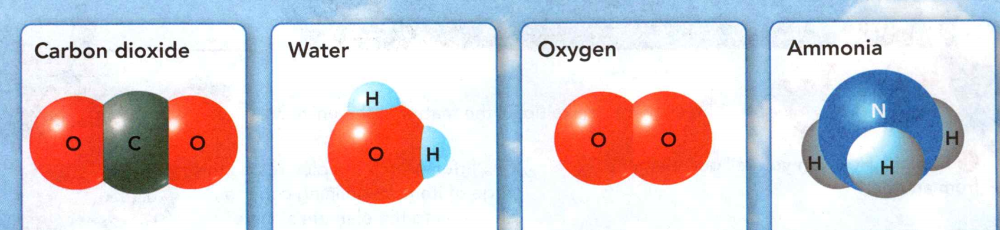
  <figcaption>Figure 1. Molecules are made up of groups of atoms. C = Carbon, H = Hydrogen, O = Oxygen, N = Nitrogen</figcaption>
</figure>

## Atoms and Molecules
Molecules are made up of groups of atoms.
Use the molecule models to complete the activities.
1. Interpret Diagrams: Count the number of atoms of each element 
in the molecules and write it on the lines below.
2. CHALLENGE On the bottom line, write a representation for 
each molecule using letters and numbers.

## Compounds 
Water, ammonia, and carbon dioxide are all compounds. 
A compound is a substance made of two or more elements 
that are chemically combined in a set ratio. A compound is 
represented by a chemical formula, which shows the elements 
in the compound and the ratio of atoms. For example, the 
chemical formula for carbon dioxide is CO2. 
The 2 below the O for oxygen tells you that the ratio of 
carbon atoms to oxygen atoms is 1 to 2. If there is no number 
after an element's symbol, it is understood that the number 
is 1. A different number of atoms in a formula represents a different compound. 
For example, the formula for carbon monoxide is CO. Here, the 
ratio of carbon atoms to oxygen atoms is 1 to 1.   

When elements chemically combine, they form compounds with 
properties different from those of the elements. 

<figure>
  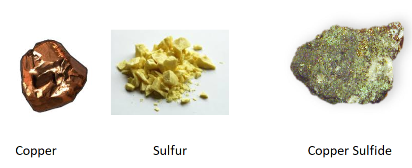
  <figcaption>Figure 2. Compounds from elements.</figcaption>
</figure>

Figure 2 shows that the element sulfur is a yellow solid and 
the element copper is a shiny metal. When copper and sulfur 
combine, they form a compound called copper sulfide. The new 
compound has different properties from both copper and sulfur.

### Review

What holds the hydrogen and oxygen atoms together in a water molecule?   
Table sugar has the chemical formula 
C12H22O11. What is the ratio of 
carbon atoms to oxygen atoms in this compound?   
Two formulas for compounds containing hydrogen and oxygen 
are H2O and H2O2. 
Do these formulas represent the same compound? Explain.    

#### Vocabulary 
Prefixes The prefix homo- comes from a Greek wo that means 
"the same or alike.' Predict the meaning of the prefix hetero-.

## What Are Two Types of Mixtures?  

Elements and compounds are substances, but most materials are mixtures. 
Figure 3 shows some common mixtures. 

<figure>
  
  <figcaption>Figure 3. Many foods are mixtures.</figcaption>
</figure>

A mixture is made of two or more 
substances that are together in the same place, but their atoms are 
not chemically bonded. Mixtures differ from compounds. Each substance 
in a mixture keeps its own properties. Also, the parts of a mixture are 
not combined in a set ratio.  

Think of a handful of sand. If you look closely at the sand, you will 
see particles of rock, bits of shells, maybe even crystals of salt.

### Heterogeneous Mixtures 

There are two types of mixtures. 
<b>A mixture can be heterogeneous or homogeneous</b>. In a heterogeneous 
mixture , you can usually see the different parts and they can easily be 
separated out. The sand described above is a heterogeneous mixture. 
So is a salad. Think of how easy it is to see the pieces of lettuce, 
tomatoes, onions, and other ingredients that can be mixed in countless 
ways.

### Homogeneous Mixtures 

The substances involved in a homogeneous mixture, 
are so evenly mixed that you can't see the different parts. It is 
difficult to separate the parts of a homogeneous mixture. Air is a 
homogeneous mixture of gases. You know that oxygen is present in the 
air because you are able to breathe, but you cannot identify where the 
oxygen is in the air. A solution is another example of a homogeneous mixture. 
Solutions can be liquids, gases, or even solids.

### Separating Mixtures 

Since the substances in a mixture keep their properties, you can use 
those properties to separate a mixture into its parts. 
Methods used to separate the parts of a mixture, including 
distillation, evaporation, filtration, and magnetic attraction, are 
shown in below.

Solids can be separated from liquids by pouring the mixture through a filter (Figure 4).

<figure>
  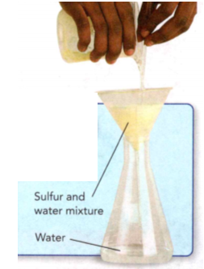
  <figcaption>Figure 4.</figcaption>
</figure>

Iron objects can be separated from a mixture using a magnet (Figure 5).  
<figure>
  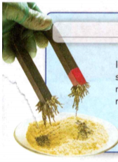
  <figcaption>Figure 5.</figcaption>
</figure>

When left in the open air, liquid solutions can change to gas, leaving solid components behind (Figure 6).  

<figure>
  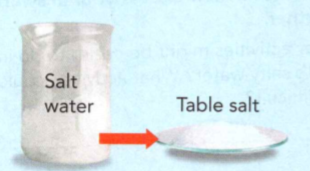
  <figcaption>Figure 6.</figcaption>
</figure>

Liquids can be separated from each other by heating them up to the temperature at which one of the liquids boils. The liquid boils into a gas. Then the gas cools, forming the separated liquid (Figure 7).  

<figure>
  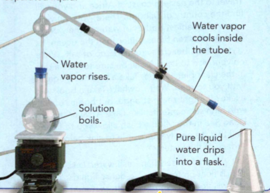
  <figcaption>Figure 7.</figcaption>
</figure>

Many foods are mixtures. Label each food as a heterogeneous or homogeneous mixture.   
Different methods can be used to separate mixtures. Name the type of separation method being used in each photo.   

## 01.3 Measuring Matter

What Units Are Used to Express Mass and Volume? weight, mass, International System of Units, volume, density
How Is Density Determined?  

### Field Trip  
Site: Lake Assal
Location: Djibouti, Republic of Djibouti
Travel to the eastern coast of Africa and you will find the country of Djibouti. There, you can visit one of the saltiest bodies of water in the world. Lake Assal is ten times saltier than the ocean. Its crystal white beaches are made up of salt. While on your visit to Lake Assal, be sure to take a dip in the clear blue waters. Take a book or magazine with you to read. Wait ... what? Take a book into a lake? It might seem strange, but bodies of water with high salt contents, like Lake Assal or the Dead Sea in the Middle East, allow you to float so well that it's nearly impossible to sink below the surface of the water.
Salt water is denser than fresh water. Less-dense liquids float on top of more-dense liquids. You, too, will float on top of the salty water. In fact, it will be difficult even to swim, so what else can you do? Read a book while you float along!

What water activities might be easier to do in Lake Assal's salty water? What activities could be more difficult?

### What Units Are Used to Express Mass and Volume?

Here's a riddle for you: Which weighs more, a pound of feathers or a 
pound of sand? If you answered "a pound of sand," think again. 
Both weigh exactly the same - one pound.

There are all sorts of ways to measure matter, and you use these 
measurements every day. Scientists rely on measurements as well. In 
fact, scientists work hard to make sure their measurements are as 
accurate as possible.

### Weight 

Your **weight** is a measure of the force of gravity on you. On another 
planet, the force of gravity will be more if the planet is more massive 
than Earth and less if the planet is less massive than Earth. On the moon, 
you would weigh only about one sixth of your weight on Earth. On Jupiter, 
you would weigh more than twice your weight on Earth.   

To find the weight of an object, you could place it on a scale like the 
one shown in Figure 8. 

<figure>
  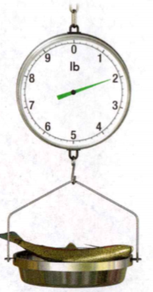
  <figcaption>Figure 8. Measuring Weight.</figcaption>
</figure>

The object's weight pulls down on the mechanisms 
inside the scale. These mechanisms cause beams or springs inside the scale 
to move. The amount of movement depends on the weight of the object. From 
the movement of the beams, the scale displays the weight to you.

**Complete the tasks below.**
1. Use the weight of the first scale to estimate the weight of 
the fish on the other scales.
2. Describe how their weight would change on a small planet like Mercury? 
Or a large planet like Neptune?

**Did you know?**  
The first country to use an SI-based system of measurement was France in 
1795. Today, there are only three countries in the world who have not 
adopted the SI system - Liberia, Myanmar, and the United States.  

### Mass 

How can you weigh less on the moon than on Earth when nothing about you 
has changed? Your weight is dependent on the gravity of the planet you 
are visiting. The amount of matter in an object is its **mass**, which does 
not change with location even if the force of gravity changes. If you 
travel to the moon, the amount of matter in your body - your mass - does 
not change. You are the same size. For this reason, scientists prefer 
to describe matter in terms of mass rather than weight. The mass of an 
object is a physical property.

To measure the properties of matter, scientists use a system called the 
International System of Units (abbreviated SI for the French name, Systeme
International d'Unites). The SI unit of mass is the kilogram (kg). 
If you weigh 90 pounds on Earth, your mass is about 40 kilograms. 
Often, a smaller unit is used to measure mass, the gram (g). 
There are 1,000 grams in a kilogram, or 0.001 kilograms in a gram. 
The table in Figure 9 lists the masses of some common items.

<figure>
  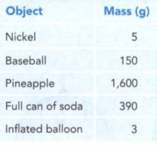
  <figcaption>Figure 9. Mass of Common Objects.</figcaption>
</figure>

**Complete the tasks below.**

1. Complete the following tasks about mass. The SI system uses grams 
and kilograms to measure mass.  In the table, convert the mass
of each object from grams to kilograms.
2. Suppose you are taking a flight to Europe. You are only allowed a 23-kg 
suitcase. How much is that in pounds? (Hint: 1 kg = 2.2 lbs.) 50.6 lbs, 46.2 lbs  or 10.5 lbs

### Volume 

All matter has mass and takes up space. The amount of space that matter 
occupies is called its volume. It's easy to see that solids and 
liquids take up space, but gases have volume, too.  

The SI unit of volume is the cubic meter (m3). Other common SI 
units of volume include the cubic centimeter (cm3), the liter (L), 
and the milliliter (mL). Common plastic soda bottles hold 2 liters of 
liquid. A milliliter is 1/1,000 of a liter and is exactly the same 
volume as 1 cubic centimeter. A teaspoonful of water has a volume of 
about 5 milliliters. In a lab, volumes of liquid are often measured 
with a graduated cylinder.

### Calculating Volume

Suppose you want to know the volume of a rectangular object, like one of 
the suitcases shown in Figure 3. 

<figure>
  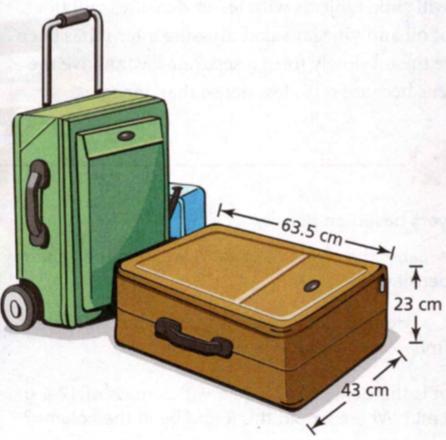
  <figcaption>Figure 10. Suitcases.</figcaption>
</figure>

First, measure the length, width, and height (or thickness) of the suitcase. 
Then, multiply the measurements together.   

Volume = Length x Width x Height   

When you multiply the three measurements, you must also multiply the units.   

Units = cm x cm x cm = cm3

### Measuring Irregular Objects

How do you measure the volume of an irregular object, such as a 
key or a raspberry? One way is to submerge the object in a liquid 
in a graduated cylinder. The liquid level will rise by an amount 
that is equal to the volume of the object in milliliters.

**Complete the tasks below.**
1. Explain why is mass more useful than weight for measuring matter?

### How Is Density Determined?

Remember the riddle about the sand and the feathers? Although they 
weigh the same, a kilogram of sand takes up much less space than a 
kilogram of feathers. The volumes differ because sand and feathers have 
different densities - an important property of matter.

### Calculating Density 

Density is a measure of the mass of a material in a given volume. 
Density can be expressed as the number of grams in one cubic 
centimeter (g/cm3). For example, the 
density of water at room temperature is stated 
as "one gram per cubic centimeter" (1 g/cm3). Recall that volume 
can also be measured in milliliters. So the density of water can also 
be expressed as 1 g/mL.   

You can determine the density of a sample of 
matter by dividing its mass by its volume.

Density =  Mass / Volume

### Sinking or Floating? 

Suppose you have a block of wood and a block of iron of equal mass. 
When you drop both blocks into a tub of water, you see that the wood 
floats and the iron sinks. You know the density of water 
is 1 g/cm3. 
Objects with densities greater than that of water will sink. 
Objects with lesser densities will float.   

Watch a bottle of oil and vinegar salad dressing after it has 
been shaken. You will see the oil slowly form a separate 
layer above the vinegar. This happens because oil is less 
dense than vinegar.

**Complete the tasks below.**
1. Liquids can form layers based on density. In figure 11 label the layers of colored liquid in the 
columns according to their densities.
Densities in (g/mL): Water: 1.00, Honey 1.36, Dish soap 1.03, Corn syrup 1.33, Vegetable oil 0.91.
What is the density of a liquid with a mass of 17.4 g and a volume of 20 mL? Where would this liquid
be in the column?
In which layer(s) would a solid cube with 6-cm sides and a mass of 270 g float? Explain.

<figure>
  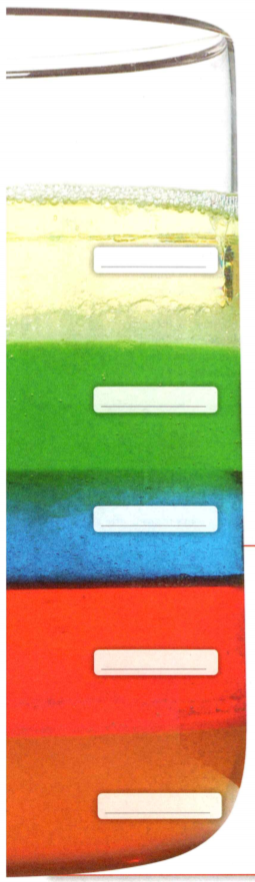
  <figcaption>Figure 11. Liquids can form layers based on density.</figcaption>
</figure>

### Using Density 

Suppose you are a gold miner in the 1800s. 
One day, while panning through the sediment in a stream, you come across 
a shiny golden rock. How do you know if the rock is real gold? Since 
density is a physical property of a substance, it can be used to 
identify an unknown substance. You can measure the mass and 
volume of the rock and find its density. 
If it matches 19.3 g/cm3, the density of gold, then you 
have struck it rich!

**Complete the tasks below.**   
1. Using Density. Density can be used to identify substances.
Hypothesize which rock sample is gold. Then, calculate the 
density of each sample. Circle the rock that is real gold.
My hypothesis is that the gold rock is:

<figure>
  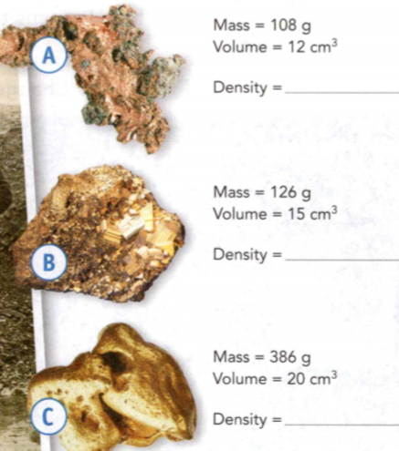
  <figcaption>Figure 12. Using Density.</figcaption>
</figure>

2. Maple syrup will (float/sink) in water because its density 
is greater than 1 g/cm3.
3. What is the mass of a sample of a substance with a volume 
of 120 mL and a density of 0.75 g/mL?  
4. Liquid water and ice are the same substance, H20. 
How would you explain why ice floats in water?

## 01.4 Changes in Matter

What Happens to a Substance in a Physical Change?  
What Happens to a Substance in a Chemical Change?  
How Are Changes in Energy and Matter Related?  

### Blog
Posted by: Dylan   
Location: Fountain Valley, California  

Whenever I go to the beach, I spend a majority of my time 
building a sand castle. I try to build it after a high tide 
comes. That way I have a lot of time to build up the walls 
and they will not be destroyed as quickly by the water.
Even though the waves will eventually destroy the castle 
and take the sand with them back to the ocean, the sand 
could be easily separated from the ocean. At the end of 
the day when I leave and kick and stomp on my sand castle, 
it is still sand. Only its appearance changes.

1. Describe the differences in the ways the sand castle 
is changed by an ocean wave and by Dylan stomping on it.  
2. Dylan changed a formless pile of sand into a sand 
castle. What other natural materials can be changed into art?  

### Vocabulary

physical change, chemical change, law of conservation of mass,
temperature, thermal energy, endothermic change, exothermic change,
chemical energy

### What Happens to a Substance in a Physical Change?

How can matter change? A physical change alters the form or 
appearance of matter but does not turn any substance in the 
matter into a different substance. In Figure 13, a butter 
artist has changed a formless block of butter into artwork. 

<figure>
  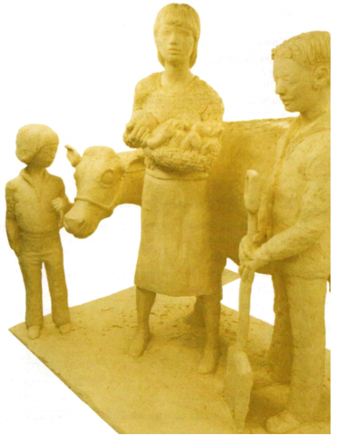
  <figcaption>Figure 13. Butter sculpture.</figcaption>
</figure>

Although it looks different, the sculpture is still butter. 
A substance that undergoes a physical change is still the 
same substance after the change. Many physical changes, 
such as snow melting into water, occur in nature.

Describe the changes the butter sculpture will undergo in a 
few hours if it is left out in the sun.

### Changes of State 

As you may know, matter occurs in three familiar states - solid, 
liquid, and gas. Suppose you leave a small puddle of 
liquid water on the kitchen counter. When you come back 
two hours later, the puddle is gone. Has the liquid 
water disappeared? No, a physical change happened. 
The liquid water changed into water vapor (a gas) and 
mixed with the air. A change in state, such as from a solid 
to a liquid or from a liquid to a gas, is an example of a 
physical change.  

### Changes in Shape or Form 

Is there a physical change when you dissolve a teaspoon of 
table sugar in water? To be sure, you would need to know whether 
or not the sugar has been changed to a different substance. 
For example, you know that a sugar solution tastes sweet, just 
like the undissolved sugar. If you pour the sugar solution 
into a pan and let the water dry out, the sugar will remain as 
a crust at the bottom of the pan. The crust may not look 
like the sugar before you dissolved it, but it's still
sugar. So, dissolving is also a physical change. Other examples 
of physical changes are bending, crushing, breaking, and 
chopping. Any change that alters only the shape or form of 
matter is a physical change. The methods of separating 
mixtures, such as filtration and distillation, also involve 
physical changes.

**Complete the tasks below.**   
Changes in Appearance

1. The Japanese art of origami paper folding involves physical 
changes. Using a sheet, make two physical changes to the paper.
2. Identify and list below the changes you made.
3. Is it correct to say that dissolving a packet of juice 
powder in water makes a new substance, fruit punch, so it 
must not be a physical change?  
4. Mark all the processes that are physical changes.
drying wet clothes, lighting a match from a matchbook, cutting snowflakes out of paper,
 melting butter for popcorn
5. Describe three physical changes that occur in nature.

### What Happens to a Substance in a Chemical Change?
Another kind of change occurs when a substance transforms into another substance. 
A change in matter that produces one or more new substances is a chemical change, 
or chemical reaction. In some chemical changes, a single substance breaks down 
into two or more other substances. For example, hydrogen peroxide breaks down 
into water and oxygen gas when it's poured on a cut on your skin. 
In other chemical changes, two or more substances combine to form different substances. 
Photosynthesis is a natural chemical change. Several compounds combine with 
energy from the sun to produce new substances.  

Figure 14 shows chemical changes that are used in forensics to collect 
evidence. To make fingerprints more visible, a chemical found in 
super-strong glues is heated. Vapors from the glue react with 
sweat or other body chemicals in a fingerprint to form a white powder 
making the print visible. 

<figure>
  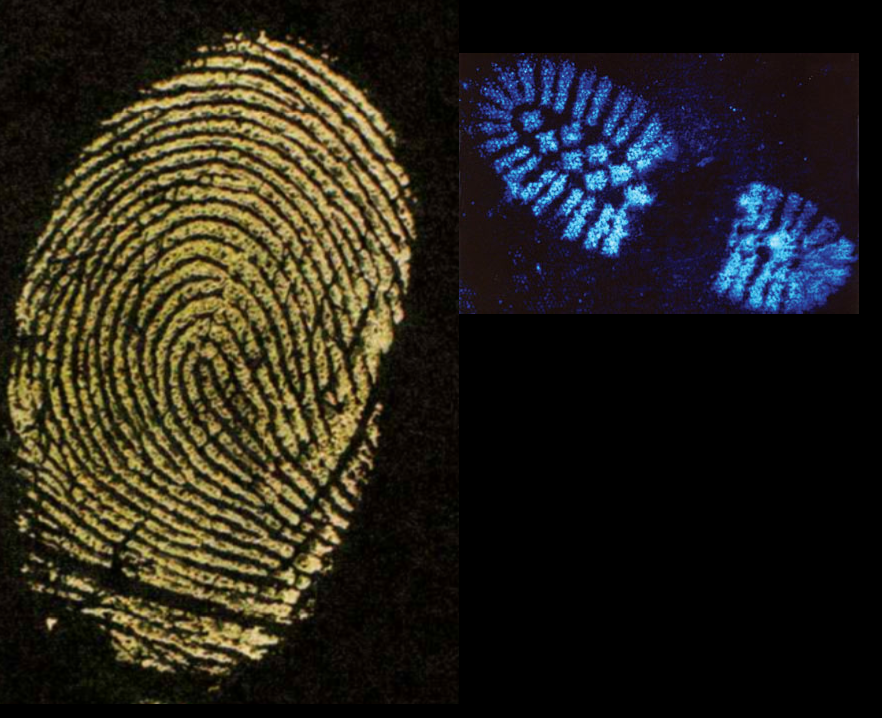
  <figcaption>Figure 14. The prints are visible because of a chemical change.</figcaption>
</figure>

Luminol is a chemical that reacts with blood.
It combines with traces of blood that are all to see with the naked eye 
to form a new substance that s inWk. The footprint in Figure 14 has been treated with
luminol.	Unlike a physical change, a chemical change creates 
new substances with new and different properties.

**Complete the tasks below.**   

You are a detective investigating a robbery. When you arrive at the scene, 
there are not many clues that you can see to help solve the crime. You're able 
to write down a few observations.  

Determine how you would use chemical changes to gather evidence at the crime scene.
1. An empty jewelry box is knocked over on a table.
2. An open box of bandages is on the floor. Bandage wrappers are found nearby.
3. Shattered glass from a window is scattered across the floor.

### Examples of Chemical Change 

One common chemical change is the burning of natural gas on a gas stove. 
Natural gas is mostly made up of the compound methane (CH4). When it burns, 
methane combines with oxygen in the air and forms new substances. These 
new substances include carbon dioxide gas (CO2) and water 
vapor (H2O). Both of these substances can be identified by their 
properties, which are different from those of methane. The chemical change that 
occurs when fuels, such as natural gas, candle wax, or wood, burn in air is called 
combustion. Other processes resulting in chemical change include 
electrolysis, oxidation, and tarnishing. 

__Combustion__ 
Rapid combination of a fuel with oxygen; 
produces heat, light, and new substances.
Example: Gas, oil, or coal burning in a furnace

__Electrolysis__	Use of electricity to break a	
compound into elements or simpler	compounds	
Example: Breaking down water into hydrogen and oxygen

__Oxidation__	Combination of a substance with oxygen.
Example: Rusting of an iron fence

__Tarnishing__ Slow combination of a bright metal	with 
sulfur or another substance, producing a dark 
coating on the metal.
Example: Tarnishing of brass

**Complete the tasks below.**    
The copper in the Statue of Liberty is exposed to 
oxygen in the air. What chemical change did the 
Statue of Liberty likely undergo? Describe the 
properties before and after the chemical change.

### Conservation of Mass 
Water may seem to "disappear" when it evaporates, 
but scientists long ago proved otherwise. In the 
1770s, a French chemist, Antoine Lavoisier, measured 
mass both before and after a chemical change. His 
data showed that no mass was lost or gained during 
the change. The fact that matter is not created or 
destroyed in any chemical or physical change is 
called the **law of conservation of mass**. 
This law is also called the law of conservation of 
matter since mass is a measurement of matter.

Suppose you could measure all of the carbon dioxide 
and water produced when methane burns. You 
would find that it equals the mass of the 
original methane plus the mass of the oxygen from 
the air that was used in the burning. 
Figure 15 demonstrates that during a chemical change, 
atoms are not lost or gained, only rearranged.

<figure>
  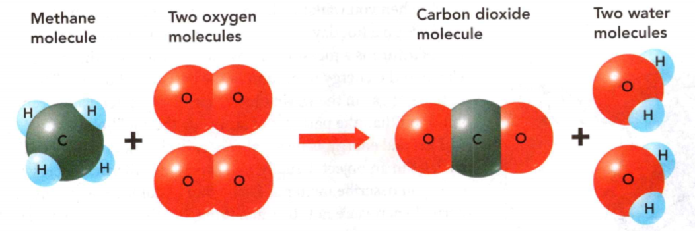
  <figcaption>Figure 15. During a chemical change, 
atoms are not lost or gained, only rearranged.</figcaption>
</figure>

**Complete the tasks below.** 
1. Count the atoms of each element in Figure 15 before 
and after the chemical change. Is mass conserved in 
this reaction? Explain.  
2. What kind of chemical change do you think 
occurs when a banana peel turns brown in the open air? 
Explain.
3. Assuming no mass escapes, explain why the mass of 
a rusted nail is greater than the mass of a nail 
before it rusted.

### How Are Changes in Energy and Matter Related?

Do you feel as if you are full of energy today? 
Energy is the ability to do work or cause change. 
Every chemical and physical change in matter 
includes a change in energy. A change as 
simple as bending a paper clip takes energy. 
When ice changes to liquid water, it absorbs 
energy from the surrounding matter. When 
candle wax burns, it gives off energy as light and 
heat.  

Like matter, energy is conserved in a chemical 
change. Energy is never created or destroyed. It 
can only be transformed from one form to another.

### Temperature and Thermal Energy   
Think of how it feels when you walk inside an 
air-conditioned building from the outdoors on a 
hot day. Whew, what a difference in temperature! 
**Temperature** is a measure of how hot or cold something 
is. It is related to the energy of 
motion of the particles of matter. 
The particles of gas in the warm outside air have 
greater average energy of motion than the particles 
of air inside the cool building.

**Thermal energy** is the total energy of the 
motion of all of the particles in an object. 
Usually, you experience thermal energy when you 
describe matter as feeling hot or cold. 
Temperature and thermal energy are not the 
same thing, but the amount of thermal energy an 
object has is related to its temperature. 
Thermal energy naturally flows from warmer 
matter to cooler matter.

### Thermal Energy and Changes in Matter

Thermal energy is a form of energy that is often 
released or absorbed when matter changes. For example, 
ice absorbs thermal energy from its surroundings when 
it melts, leaving the surroundings feeling cold. 
That's why you can pack food and drinks in an 
ice-filled picnic cooler. The melting of ice is
an **endothermic change**, a change in which energy is 
absorbed.
Changes in matter can also occur when energy is given 
off. An **exothermic change** releases energy. 
Combustion is a chemical change that releases 
thermal energy and light.

### Transforming Chemical Energy 

The energy stored in the chemical bonds between atoms 
is a form of energy called **chemical energy**. Chemical 
energy is stored in foods, fuels, and even the 
cells of your body. Animals, like a bear, gain 
chemical energy from food.   

Burning fuels transforms chemical energy and releases 
some of it as thermal energy. When you ride a 
bike up a hill, chemical energy from foods you ate 
changes into energy of motion. Chemical energy can 
change into other forms of energy, and other 
forms of energy can change into chemical energy.

**Complete the tasks below.** 
1. A student records the temperature of two reactions 
once per minute. Her data are plotted on the graph in Figure 16.
What was the change in temperature for each reaction 
after 10 minutes?
On the graph, label each reaction as exothermic or 
endothermic. How can you tell?

<figure>
  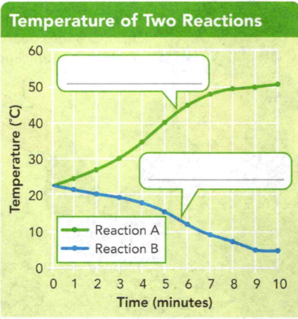
  <figcaption>Figure 16. Temperature of two 
reactions.</figcaption>
</figure>

2. Describe how your hand
would be affected if you made a snowball or held a 
frozen treat.

3. This arrowhead, mostlikely carved by an ancient hunter, 
was discovered in a pile of rocks. Describe the 
type of mixture the arrowhead was found in.

4. I found these coins near the opening 
of a foul-smelling cave. I believe they were a 
shiny metal at one point, perhaps silver, 
platinum, or aluminum. 
I've determined the mass of each coin to be 315 g and 
the volume to be 30 cm3.
a) What element are the coins made of?
Aluminum (density = 2.7 g/cm3)
Silver (density = 10.5 cm3)
Platinum (density = 21.5 cm3)
b) Describe the coins properties and the physical or 
chemical changes it underwent.

5. The mummy we found today is badly decayed, probably 
because its sarcophagus is not sealed airtight. I 
translated a scroll found nearby that says the mummy and 
case originally had a mass of 200 kg. The mass is 
now 170 kg. Explain how the mummy and its sarcophagus 
decreased in mass if the law of conservation of mass must 
be obeyed.

6. The paper of this ancient **map** has suffered from changes 
over the years making it nearly impossible to read.
I've come across some **clay pots**. Many have been 
broken or cracked over time.
Describe each object's properties and the 
physical or chemical changes it underwent.

7. I believe we have found the remains of the famous
Carved Dove wax statue. It would have been a valuable 
artifact, but all that's left is a puddle of liquid. 
Describe at least two changes the wax has undergone 
over time.

8. What energy transformation takes place when you exercise?

9. How is matter described?

#### Describing Matter
Every form of matter has two kinds of properties - 
physical properties and chemical properties.  

Vocabulary: matter, chemistry, substance,	physical property,
chemical property

#### Classifying Matter
All matter in the universe is made of 
more than 100 different substances, called elements.
A mixture can be heterogeneous or homogeneous.

Vocabulary: element, atom, chemical bond, 
molecule, compound,	chemical formula, mixture

#### Measuring Matter 	

The SI unit of mass iS the kilogram (kg).  
The SI unit of volume is the cubic meter (m3).  
You can determine the density of a sample of 
matter by dividing its mass by its volume.

Vocabulary: weight, mass, International System of Units, 
volume, density

#### Changes in Matter   
A substance that undergoes a physical change is still 
the same substance after the change.
Unlike a physical change, a chemical change produces 
new substances with new and different properties.
Every chemical and physical change in matter includes
a change in energy.

Vocabulary: physical change, chemical change, law of 
conservation of mass,	temperature, thermal energy, 
endothermic change, exothermic change, chemical energy

### Review and Assessment

#### Describing Matter
1. Which of the following is an example of a chemical 
property? a. density	b. flammability c. hardness	d. luster

2. A substance can be classified by its physical 
properties, which are properties that

3. Which of the following is a pure substance: 
table salt, seawater, or sand? Explain how you know.

4. Write a title that describes the table below.
Helium	Colorless; less dense than air
Iron	Attracted to magnets; melting point of 1,535 C
Oxygen	Odorless; gas at room temperature

5. Write an e-mail to a friend explaining why the 
melting point of a substance is a physical property but 
flammability is a chemical property. Use examples to 
explain.

#### Classifying Matter
6. Which of the following is an element? a. water	b. carbon dioxide c. oxygen	d. ammonia

7. Four methods that can be used to separate mixtures are   

Use the diagrams to answer Questions 8-10. 
<figure>
  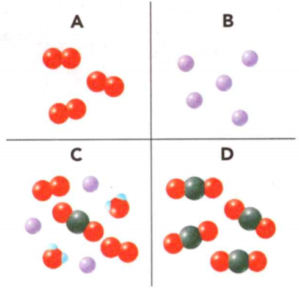
  <figcaption>Figure 17. Diagrams to answer Questions 8-10.</figcaption>
</figure>
Each diagram represents a different kind of matter. Each ball represents an atom. Balls of the same color are the same kind of atom.

8. Which diagram or diagrams represent a single element? 
Explain.  
9. How do the atoms in Diagram A differ from those in 
Diagram D?  
10. Which diagram or diagrams represent a mixture? Explain.   

#### Measuring Matter

11. What is the SI unit of mass? a. milliliter	b. kilogram c. pound	d. cubic centimeter
12. The density of a substance is calculated by
13. Which measurement shown in the diagram of Figure 18 is 
not needed to find the volume of the box? Explain.
<figure>
  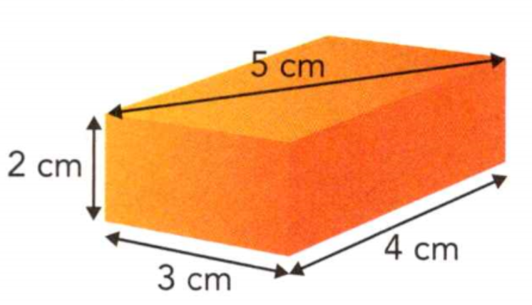
  <figcaption>Figure 18. Volume of a box.</figcaption>
</figure>

14. A piece of metal has a volume of 
38 cm3 and a mass of 277 g. 
Calculate the density of the metal and 
identify it based on the information below.
Density of Common Metals:
Iron	7.9 g/cm3, 
Lead	11.3 g/cm3,
Tin	7.3 g/cm3,
Zinc	7.1 g/cm3

#### Changes in Matter
15. Which of the following is a physical change? a. burning	b. rusting c. freezing	d. oxidation
16. The law of conservation of mass states that
17. How could you prove that dissolving table salt in water is a physical change, 
not a chemical change?

18. Choose a substance you're familiar with. What are its 
physical and chemical properties? How would you measure its 
density? What are some physical and chemical 
changes it can undergo?

19. Each diagram below represents a different kind of matter. 
Each ball represents an atom. Balls of the same size and shade 
are the same atom. Which diagram **best** represents a mixture 
of two kinds of molecules?
<figure>
  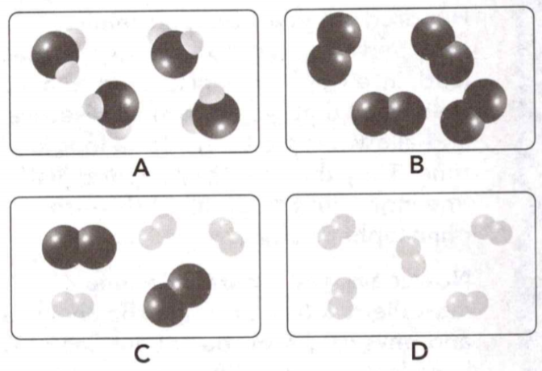
  <figcaption>Figure 19. Different kind of matter.</figcaption>
</figure>

20. The fact that matter is neither created nor destroyed 
in any chemical or physical change is called the
A law of exothermic change.
B	law of endothermic change.
C law of thermal matter.
D	law of conservation of mass.

21. The density of a substance equals its mass divided by its 
volume. The density of sulfur is 2.0  g/cm3. What is 
the mass of a sample of sulfur with a volume of 6.0 cm3? A 3.0g	B 4.0 g C 8.0 g	D 12 g 

22. The abilities to dissolve in water and to conduct electric 
current are examples of A physical properties. B	chemical properties. C physical changes. D	chemical bonding.

23. Which two pieces of laboratory equipment would be the **most** 
useful for measuring the mass and volume of a rectangular block? A a metric ruler and a stopwatch B	a balance and a metric ruler C a graduated cylinder and a metric ruler D	a balance and a stop watch

24. Use the graph below and your knowledge of science to help 
you answer this questions. A student mixes two liquids of the 
same temperature together. The graph above 
shows the change in temperature after the 
liquids mix. Did the reaction absorb thermal energy or 
release it? Explain your answer.

<figure>
  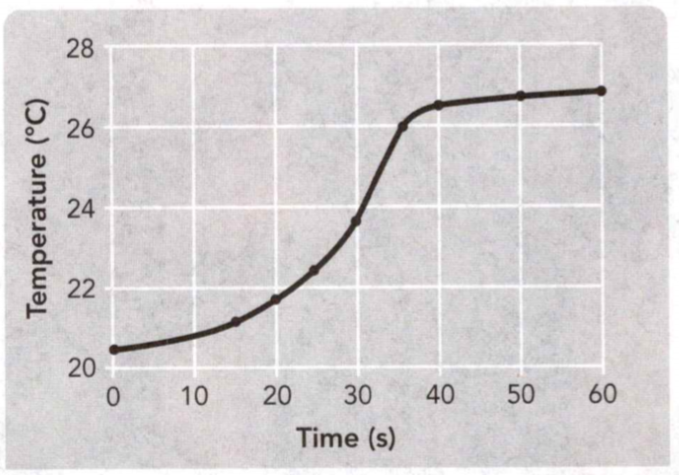
  <figcaption>Figure 20. Temperature vs Time.</figcaption>
</figure>

