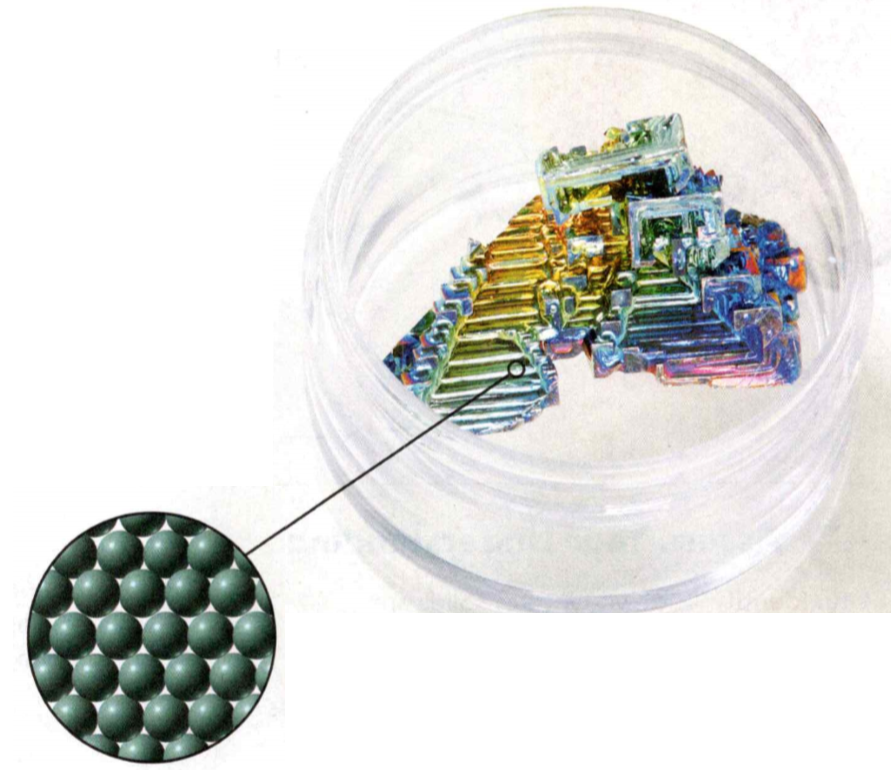
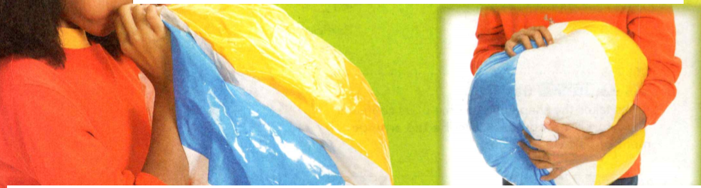

### Physical Science
°
## Chemistry

## 2 Solids, Liquids, and Gases

Temperature is a measure of the average energy of 
random motion of particles of matter.  
Ice is water in the solid form.  
Energy is the ability to do work or cause change.  

**Check Your Understanding**
1. Read the paragraph below and then answer the question.
The air temperature outside has been below freezing all week. 
The local pond has frozen over and is ready for ice skating. 
Ronnesia is excited just thinking about all the things she can 
do on the ice. She eats a good breakfast to get the energy she 
needs for ice skating. Why is the pond ready for ice skating?


### Vocabulary Skill Suffixes 

A suffix is a letter or group of letters added to the end of a 
word to change its meaning and often its part of speech. In this chapter, 
you will learn vocabulary words that end in the suffixes -ation, 
-ine, and -sion.

-ation:	State of, process of, act of, example:	Vaporization, evaporation,
condensation, sublimation   

-ine: Consisting of, example: Crystalline solid   

-sion	State of, process of, act of, example:	Surface tension

Vapor is another word for gas. Use the table above to predict 
the meaning of vaporization. Revise your definition as needed.


#### Chapter Preview

- solid
- crystalline solid
- amorphous solid
- liquid
- fluid
- surface tension
- viscosity
- gas
- pressure
- melting
- melting point
- freezing
- vaporization
- evaporation
- boiling
- boiling point
- condensation
- sublimation
- Charles's Law
- directly proportional
- Boyle's Law
- inversely proportional


### Liquid Crystals

Have you ever wondered why some television sets are referred to as LCD TVs? 
LCD stands for "liquid crystal display." An LCD is a thin, flat screen. 
LCDs have replaced the picture tube in many computer monitors and 
television sets because they are lighter and use less power. LCDs are 
also found in cell phones and clock radio faces.   

Liquid crystals are neither solid nor liquid—instead they fall somewhere 
in between. But it takes just a small amount of thermal energy to change
a liquid crystal to a liquid. As a result, LCDs tend to be very
sensitive to heat.

**Complete the tasks below.**  

1. List some things that contain LCDs.  
2. Why might you not want to leave a cell phone or a laptop 
computer outside on a hot day?


### Vocabulary  

- solid 
- crystalline solid 
- amorphous solid 
- liquid
- fluid 
- surface tension 
- viscosity 
- gas 
- pressure

### How Do You Describe a Solid?  

Look at the bowl in Figure 1. It contains the metal bismuth. 
<figure>
  
  <figcaption>Figure 1. Piece of bismuth and particles in a solid.</figcaption>
</figure>  

Notice that the shape and size of the piece of bismuth 
are different from the bowl's shape and size. What 
would happen if you took the bismuth out of the bowl 
and placed it on a tabletop? Would it become flatter? 
What would happen if you put it in a larger bowl? 
Would it become larger? Of course not, because it's a 
solid. A **solid** has a definite shape and a definite 
volume. Your pencil is another example of a solid. 
If your pencil has a cylindrical shape and a volume 
of 6 cubic centimeters, it will keep this shape and 
volume in any position in any container. 

 
### Particles in a Solid 

The particles that make up a solid are packed very 
closely together. Also, each particle is tightly 
fixed in one position. This fixed, closely packed 
arrangement of particles in a solid causes it to 
have a definite shape and volume. Do the particles 
that make up a solid move at all? Yes, but not much. 
The particles in a solid are closely locked in position 
and can only vibrate in place. This means that the 
particles move back and forth slightly, like a group of people running in place.

**Complete the tasks below.**   

1. Place a check in each category that describes a solid.
Shape: Definite or Indefinite
Volume: Definite or Indefinite
2. A solid does not take the shape or volume of its 
container. Describe the arrangement of particles in a solid.

### Types of Solids 

In many solids, the particles form a regular, repeating pattern. 
These patterns create crystals. Solids that are made up of crystals 
are called **crystalline solids**. Salt, sugar, and snow are examples of 
crystalline solids. The fluorite crystal shown in Figure 2 is an example 
of a colorful crystalline solid. When a crystalline solid is heated, it 
melts at a distinct temperature.  

In **amorphous solids**, the particles are not arranged in a regular pattern. 
Unlike a crystalline solid, an amorphous solid does not melt at a distinct 
temperature. Instead, it may become softer and softer or change into
other substances. Glass is an example of an amorphous solid. A glass blower 
can bend and shape glass that has been heated. Plastics and rubber are other 
examples of amorphous solids.


**Complete the tasks below.**  
l. What are the two types of solids?
2. Are the particles in a solid motionless? Explain your answer.
3. Candle wax gradually loses its shape as it is heated. What type of solid is candle wax? Explain.
4. Solids are either crystalline or amorphous. Butter is an 
amorphous solid. The mineral fluorite is a crystalline solid. 
Compare and contrast the characteristics of amorphous 
and crystalline solids.


### How Do You Describe a Liquid?

Without a container, a liquid spreads into a wide, shallow puddle. Like a 
solid, however, a liquid does have a constant volume. A **liquid** has a definite 
volume but no shape of its own. Figure 2 shows equal volumes of iced tea in two 
different containers. 

<figure>
  
  <figcaption>Figure 2. Liquid.</figcaption>
</figure>  

The shape of a liquid may change with its container, but its volume 
remains the same. 

### Particles in a Liquid 

In general, the particles 
in a liquid are packed almost as closely together as those in a 
solid. However, the particles in a liquid move around one another 
freely. You can compare this movement to the way you might move a 
group of marbles around in your hand. Like the particles of a 
liquid, the marbles slide around one another but 
still touch. Because its particles are free to move, a liquid 
has no definite shape. However, it does have a definite volume. 
These freely moving particles allow a liquid to flow from 
place to place. For this reason, a liquid is also called a 
**fluid**, meaning a "substance that flows:"


**Complete the tasks below.**   

1. Place a check in each category that describes a liquid.
Shape: Definite or Indefinite
Volume: Definite or Indefinite


### Properties of Liquids 
One characteristic property of liquids is surface tension. 
**Surface tension** is an inward force, or pull, among the molecules 
in a liquid that brings the molecules on the surface closer together. 
You may have noticed that water forms droplets and can bead up on
many surfaces, such as leaves. That's because water molecules attract 
one another strongly. These attractions cause molecules at the water's 
surface to be pulled slightly toward the water molecules beneath its 
surface. Due to surface tension, the surface of water can act like a 
sort of skin. For example, a sewing needle floats when you place it 
gently on the surface of water, but it quickly sinks if you push it 
below the surface. Surface tension lets an insect called a water 
strider walk on the calm surface of a pond.

Another characteristic property of liquids is **viscosity**, or a 
liquid's resistance to flowing. A liquid's viscosity depends 
on the size and shape of its particles and the attractions 
between the particles. Some liquids flow more easily than 
others. Liquids with high viscosity flow slowly. Honey is an 
example of a liquid with a very high viscosity. Liquids with low 
viscosity flow quickly. Water and vinegar have relatively low 
viscosities.

**Complete the tasks below.**  
1. A substance that flows is called a
2. Why is a liquid able to flow? 
3. How do liquids with a high viscosity differ from liquids with a 
low viscosity?
4. Now I know that a liquid has a definite volume but not a definite shape because	

### How Do You Describe a Gas?

Like a liquid, a gas is a fluid. Unlike a liquid, however, a **gas** has neither a definite 
shape nor a definite volume. If a gas is in a closed container such as a 
flask, the gas particles will move and spread apart as they fill the container.
If you could see the particles that make up a gas, you would see them moving in 
all directions. As gas particles move, they spread apart, filling all the space available. 
Thus, a gas has neither definite shape nor definite volume. When working with a gas, it 
is important to know its volume, temperature, and pressure. 
So what exactly do these measurements mean?

### Volume 
Remember that volume is the amount of space that matter fills. Volume is 
measured in cubic centimeters (cm<sup>3</sup>), cubic meters (m<sup>3</sup>), 
milliliters (mL), liters (L), and other units. Because gas particles move and 
fill all of the space available, the volume of a gas is the same as the 
volume of its container. For example, a large amount of helium gas can be 
compressed—or pressed together tightly—to fit into a metal tank. When you use 
the helium to fill balloons, it expands to fill many balloons that have a total 
volume much greater than the volume of the tank.

**Complete the tasks below.**
1. Place a check in each category that describes a gas.
Shape Definite Indefinite
Volume Definite Indefinite

2. A gas takes the shape and volume of its container (Figure 3). 
Describe the arrangement of particles in a gas.

<figure>
  
  <figcaption>Figure 3. Particles in a gas.</figcaption>
</figure>


### Pressure 
Gas particles constantly collide with one another and with the walls of 
their container. As a result, the gas pushes on the walls of the container. 
The **pressure** of the gas is the force of its outward push divided by the area 
of the walls of the container. Pressure is measured in units of pascals 
(Pa) or kilopascals (kPa) (1 kPa = 1,000 Pa).

The firmness of a gas-filled object comes 
from the pressure of the gas. For example, 
the air inside an inflated ball has a higher pressure than 
the air outside. This higher pressure is due to the 
greater concentration of gas particles inside the ball 
than in the surrounding air. Concentration is the number of 
gas particles in a given unit of volume.   

Why does a ball leak even when it has only a tiny hole? 
The higher pressure inside the ball results in gas particles 
hitting the inner surface of the ball more often. Therefore, 
gas particles inside the ball reach the hole and escape more 
often than gas particles outside the ball reach the hole and 
enter. Thus, many more particles go out than in. 
The pressure inside drops until it is equal to the 
pressure outside.

### Calculating Pressure  

When calculating pressure, force is measured in newtons (N). 
If the area is measured in square meters (m<sup>2</sup>), 
pressure is expressed in pascals (Pa), where 1 Pa = 1 N/m<sup>2</sup>. 
Suppose a gas exerts a force of 252 N on a piston having an 
area of 0.430 m<sup>2</sup>. What is the pressure on the 
piston in Pascals?


**Complete the tasks below.**  
1. A gas exerts a force of 5,610 N over an area of 0.342 m<sup>2</sup>. 
What pressure does the gas exert in Pa?


<figure>
  
  <figcaption>Figure 6. A beach ball being inflated (right) and 
then deflated (left).</figcaption>
</figure>

2. Figure 6 shows a beach ball being inflated and then deflated. 
Select the answers that complete the description of each process.    
Ball being inflated: The concentration of gas particles 
inside the beach ball (increases/decreases). 
The gas pressure inside the beach ball (increases/decreases).     
Ball being deflated: The concentration of gas particles 
inside the beach ball (increases/decreases). The gas pressure 
inside the beach ball (increases/decreases).


### Temperature 
The balloonists in Figure 7 are preparing the balloon for flight. 

<figure>
  
  <figcaption>Figure 7. Temperature of a Gas.</figcaption>
</figure>

To do this, they use a propane burner to heat the air inside the 
balloon. Once the temperature of the air is hot enough, the balloon 
will start to rise. But what does the temperature tell you? 
Recall that all particles of matter are constantly moving. 
Temperature is a measure of the average energy of random motion 
of the particles of matter. The faster the particles are moving, 
the greater their energy and the higher the temperature. You 
might think of a thermometer as a speedometer for particles.
Even at room temperature, the average speed of particles in a 
gas is very fast. At about 20°C, the particles in a typical 
gas travel about 500 meters per second—more than twice the 
cruising speed of a jet plane!

**Complete the tasks below.**  	
1. Why are the hot gas particles moving faster 
than the cool gas particles?
2. Describe how the motions of gas particles are 
related to the pressure exerted by the gas.
3. Why does pumping more air into a basketball 
increase the pressure inside the ball?

### Changes of State

What Happens to the Particles of a Solid as It Melts?
What Happens to the Particles of a Liquid as It Vaporizes?
What Happens to the Particles of a Solid as It Sublimes?

### On the Boil   
You might have noticed that as an uncovered pot of water boils, 
the water level slowly decreases. The water level changes 
because the liquid is changing to a gas. As you heat the water, 
the thermal energy of its molecules increases. The longer you 
leave the pot on the hot stove, the more energy is absorbed 
by the water molecules. When the water molecules gain enough 
energy, they change state from a liquid to a gas.  
The graph shows the temperature of a small pot of water on a 
stove set to high heat. The starting temperature of the 
water is 20°C.


**Complete the tasks below.** 
<figure>
  
  <figcaption>Figure 8. Liquid to a Gas.</figcaption>
</figure>

1. In Figure 8 how long does it take for the water to start boiling? At 
what temperature does the water boil? 
     
2. Does it take more energy to heat the water to 100°C or to 
boil it?


### Vocabulary  

- melting 
- melting point 
- freezing 
- vaporization
-	evaporation 
- boiling 
- boiling point 
- condensation
-	sublimation


### What Happens to the Particles of a Solid as It Melts?

Particles of a liquid have more thermal energy than particles of the 
same substance in solid form. As a gas, the particles have even more 
thermal energy. A change from a solid to a liquid involves an increase 
in thermal energy. As you might guess, a change from a liquid to a 
solid is just the opposite: It involves a decrease in thermal energy.


### Melting 

The change in state from a solid to a liquid is called melting. 
In pure, crystalline solids, melting occurs at a specific temperature, 
called the melting point. Because the melting point is a characteristic 
property of a substance, chemists often compare melting points when 
trying to identify an unknown material. The melting point of pure water, 
for example, is 0°C at sea level.   
What happens to the particles of a solid as it melts? Think of an ice 
cube taken from the freezer. The energy needed to melt the ice comes 
mostly from the air in the room. At first, the added thermal energy makes 
the water molecules vibrate faster, raising their temperature.
**At a solid's melting point, its particles
vibrate so fast that they break free from their fixed positions.** At
0°C, the temperature of the ice stops increasing. Any 
added energy continues to change the arrangement of the water
molecules from ice crystals into liquid water. The
ice melts.


**Complete the tasks below.** 
1. Which diagram (A or B) in Figure 9 describes ice, 
which describes liquid water?

<figure>
  
  <figcaption>Figure 9. Water molecules.</figcaption>
</figure>

2. Describe how ice and liquid water differ in the 
arrangement of their molecules.


### Freezing 

The change of state from a liquid to a solid is called freezing. 
It is just the reverse of melting. **At a liquid's freezing point, 
its particles are moving so slowly that they begin to take on 
fixed positions.**   
When you put liquid water into a freezer, for example, the water 
loses energy to the cold air in the freezer. The water molecules 
move more and more slowly as they lose energy. Over time, the water 
becomes solid ice. When water begins to freeze, its temperature 
stays at 0°C until freezing is complete. The freezing point of 
water, 0°C, is the same as its melting point.


**Complete the tasks below.**   
1. In metal casting, a liquid metal is poured into a container called 
a mold. The mold gives a shape to the metal when it cools and hardens.
How does metal casting make use of the different characteristics of 
liquids and solids?  
2. The melting point of copper is 1084°C. How does the energy of the 
particles in a certain amount of liquid copper compare to the 
energy of the molecules in the same amount of liquid water? Why?
3. What is the change in state from a solid to a liquid called?
4. How does what happens to the particles in a substance during 
melting differ from what happens in freezing?


### What Happens to the Particles of a Liquid as It Vaporizes?

Have you ever wondered how clouds form or why puddles dry up? To 
answer these questions, you need to look at what happens when changes 
occur between the liquid and gas states.  

### Evaporation and Boiling 

The change in state from a liquid to a gas is called vaporization. 
**Vaporization occurs when the particles in a liquid gain
enough energy to move independently.** There are two 
main types of vaporization—evaporation and boiling.   

Vaporization that takes place only on the surface of a liquid is 
called **evaporation**. A shrinking puddle is an example. Water in the 
puddle gains energy from the ground, the air, or the sun. The added 
energy enables some of the water molecules on the surface of the 
puddle to escape into the air, or evaporate.  

Vaporization that takes place both below and at the surface of a 
liquid is called **boiling**. When water boils, vaporized water 
molecules form bubbles below the surface. The bubbles rise and
eventually break the surface of the liquid. The temperature at 
which a liquid boils is called its **boiling point**. As with 
melting points, chemists use boiling points to help identify 
unknown substances.

**Complete the tasks below.** 

1. Liquid water changes to water vapor by either evaporation or boiling.
In figure 10 identify the type of vaporization occurring in each flask. 
Describe the paths of water molecules leaving each flask. Suppose there 
is the same amount of water in both of the flasks.
Which flask does water vaporize from first? Why?

<figure>
  
  <figcaption>Figure 10. Types of Vaporization.</figcaption>
</figure>

2. Complete the sentences using the correct forms of the word condense.
_____________	 is the change in state from a gas to a liquid. 
Clouds form because water vapor	__________ .


### Condensation 

Condensation is the reverse of vaporization. The change in state from a gas 
to a liquid is called **condensation**. You can observe condensation by breathing 
onto a mirror. When warm water vapor in your breath reaches the cooler surface
of the mirror, the water vapor condenses into liquid droplets. 
**Condensation occurs when particles in a gas lose enough thermal energy to 
form a liquid.**  

Clouds typically form when water vapor in the atmosphere condenses into tiny 
liquid droplets. When the droplets get heavy enough, they fall to the ground as 
rain. Water vapor is a colorless gas that you cannot see. The steam you see 
above a kettle of boiling water is not water vapor, and neither are clouds or fog. 
What you see in those cases are tiny droplets of liquid water suspended in air.

**Complete the tasks below.** 

1. Why does a mirror fog up after a hot shower?   
2. What is the change in state from a liquid to a gas called?
3. How does the thermal energy of water vapor change as the vapor condenses?
4. Why do clouds form before it rains?

### What Happens to the Particles of a Solid as It Sublimes?

In places where the winters are cold, the snow may disappear even when the 
temperature stays well below freezing. This change is the result of 
sublimation. **Sublimation** occurs when the surface particles of a solid gain 
enough energy that they forma gas.
**During sublimation, particles of a solid do not pass through the liquid 
state as they form a gas.**  

One example of sublimation occurs with dry ice. Dry ice is the common 
name for solid carbon dioxide. At ordinary atmospheric pressures, carbon 
dioxide cannot exist as a liquid. So instead of melting, solid carbon dioxide 
changes directly into a gas. As it sublimes, the carbon dioxide absorbs 
thermal energy. This property helps keep materials near dry ice cold and dry. 
For this reason, using dry ice is a way to keep the temperature low when a 
refrigerator is not available. Some fog machines use dry ice to create 
fog in movies or at concerts. When dry ice becomes a gas, it cools water vapor
in the nearby air. The water vapor then condenses into a liquid, forming fog
near the dry ice.   

Mosquitos are attracted to the carbon dioxide gas you exhale during breathing. 
A mosquito trap baited with dry ice can attract up to four or five times as 
many mosquitos as traps baited with a light source alone.  


**Complete the tasks below.** 

1. A fog machine uses dry ice to create fog at a rock concert.	
Why does fog form near dry ice?
2. A lake has frozen over due to the cold weather. As liquid water 
freezes, do its molecules gain or lose thermal energy?
3. How does the motion of the water molecules change during freezing?
4. The air outside is so warm that a snowman is melting. During melting, 
do the water molecules gain or lose thermal energy?
5. How does the motion of the water molecules change during melting?
6. Wet footprints are disappearing due to evaporation. As water 
evaporates, do its molecules gain or lose thermal energy?
7. How does the motion of the water molecules change during evaporation?
8. During the night, water vapor in the air condensed on a spider web. 
As water vapor condenses, do its molecules gain or lose thermal energy?
9. How does the motion of the water molecules change during condensation?
10. What is dry ice?
11. If you allowed dry ice to stand in a bowl at room temperature 
for several hours, what would be left?
12. Why does a substance change states?
13. What do the the particles in a solid do when sublimation occurs?

### Gas Behavior

### Jacques Charles (1746-1823)

French scientist Jacques Charles is best known for his work on gases. 
But he also made contributions to the sport of ballooning. 
On August 27, 1783, Charles released the first hydrogen-filled balloon, 
which was about 4 meters in diameter. This balloon, which did not carry 
any people, rose to a height of 3,000 feet. Charles
also improved the design of hot-air balloons. He added a
valve line that allowed the pilot to release gas from the balloon. He also
added a wicker basket that attached to the balloon with ropes.
Charles was elected to the French Academy of Sciences in 1785.

### How Are Pressure and Temperature of a Gas Related?

If you dropped a few grains of sand onto your hand, you would hardly feel 
them. But what if you were caught in a sandstorm? Ouch! The sand grains 
fly around very fast, and they would sting if they hit you. Although gas 
particles are much smaller than sand grains, a sandstorm is a good model 
for gas behavior. Like grains of sand in a sandstorm, gas particles 
travel at high speeds. The faster the gas particles move, the greater 
the force with which they collide with the walls of their container.


Consider a gas in a closed, rigid container. If you heat the gas, 
its particles will move faster on average. They will collide 
with the walls of their container with greater force. The greater 
force over the same area results in greater pressure. 
**When the temperature of a gas at constant volume is increased, 
the pressure of the gas increases. When the temperature is decreased, 
the pressure of the gas decreases.**  

On long trips, especially in the summer, a truck's tires can 
become very hot. As the temperature increases, so does the pressure 
of the air inside the tire. If the pressure becomes greater than 
the tire can hold, the tire will burst. For this reason, truck 
drivers need to monitor and adjust tire pressure on long trips.

### Vocabulary  

- Charles's law 
- Boyle's law
- directly proportional 
-	inversely proportional 

**Complete the tasks below.** 

1. How are pressure and temperature of a gas related?
2. How are volume and temperature of a gas related?
3. How are pressure and volumne of a gas related?
4. When a gas is heated in a closed, rigid container, the particles 
move faster and collide more often (Figure 11). 
Which pressure gauge shows the higher pressure A or B?   
<figure>
  
  <figcaption>Figure 11. Temperature and Gas Pressure.</figcaption>
</figure>

5. What happens to the pressure when the temperature of a gas at a constant volume 
increases?

### How Are Volume and Temperature of a Gas Related?

The volume of a gas-filled balloon decreases as temperature 
decreases and then increases as temperature increases.

<figure>
  
  <figcaption>Figure 12. Cooling a Balloon.</figcaption>
</figure>

Figure 12 shows what happens when a balloon is slowly 
lowered into liquid nitrogen at nearly -200°C and then 
removed. As the air inside the balloon cools, its volume 
decreases. When the air inside warms up again, its volume 
increases. The pressure remains more or less constant 
because the air is in a flexible container.


### Charles's Law

Charles's Law French scientist Jacques Charles examined the relationship 
between the temperature and volume of a gas that is kept at a 
constant pressure. He measured the volume of a gas
at various temperatures in a container that could change volume. 
(A changeable volume allows the pressure to remain constant.)
**When the temperature of a gas at constant pressure is increased, 
its volume increases. When the temperature of a gas at constant 
pressure is decreased, its volume decreases.** This principle is 
called **Charles's law**.


**Complete the tasks below.**   
1. A gas in a cylinder in Figure 13 with a movable piston is slowly 
heated. Draw the piston and gas particles when the 
temperature reaches 200°C and 400°C.

<figure>
  
  <figcaption>Figure 13. Gas in a cylinder.</figcaption>
</figure>

### Graphing Charles's Law   

Suppose you do an experiment to test Charles's law. The experiment 
begins with 50 mL of gas in a cylinder with a movable piston similar to 
the one in Figure 13. The gas is slowly heated. Each time the 
temperature increases by 10°C, the gas volume is recorded. The data are 
recorded in the data table in Figure 14. 

<figure>
  
  <figcaption>Figure 14. Gas in a cylinder.</figcaption>
</figure>

Note that the temperatures in the data table have been converted to 
kelvins, the SI unit of temperature. To convert from Celsius degrees 
to kelvins (K), add 273.  

As you can see in the graph of the data, the data points form a 
straight line. The dotted line represents how the graph would look 
if the gas could be cooled to 0 K. Notice that the line passes through 
the point (0, 0), called the origin. When a graph of two variables 
is a straight line passing through the origin, the variables are 
said to be **directly proportional** to each other. The graph of 
Charles's law shows that the volume of a gas is directly proportional 
to its kelvin temperature at constant pressure.

**Complete the tasks below.**   

1. In an experiment, a gas is heated at a constant pressure.	The data 
shown in the table are plotted on the graph Figure 14. What happens to 
the volume of a gas when the temperature is increased at constant pressure?
2. Suppose the data formed a line with a steeper slope. For the same 
change in temperature, how would the change in volume compare?
3. The graph of Charles's law	shows that the volume of a gas is ___ to its
kelvin temperature at constant pressure.
4. Suppose the gas in Figure 14 could be cooled to 100 K (-173°C). 
Predict the volume of the gas at this temperature.


### How Are Pressure and Volume of a Gas Related?

Suppose you use a bicycle pump to inflate a tire. By pressing down on the 
plunger, you force the gas inside the pump through the rubber tube and out 
of the nozzle into the tire. What happens to the volume of air inside the 
pump cylinder as you push down on the plunger? What happens to the pressure?  

### Boyle's Law 

In the 1600s, the scientist Robert Boyle carried out experiments to try to
improve air pumps. He measured the volumes of gases at different pressures. 
Boyle's experiments showed that gas volume and pressure were related. 
**When the pressure of a gas at constant temperature is increased, the 
volume of the gas decreases. When the pressure is decreased, the volume 
increases.** This relationship between the pressure and the volume 
of a gas is called **Boyle's law**.  
Boyle's law describes situations in which the volume of a gas is 
changed. The pressure then changes in the opposite way. For
example, as you push down on the plunger of a bicycle pump, the 
volume of air inside the pump cylinder gets smaller, and the 
pressure inside the cylinder increases. The increase in pressure 
forces air into the tire.


**Complete the tasks below.**  

1. As weights are added to the top of each piston, the piston moves 
farther down in the cylinder (Figure 15). First, rank the pressure in each of the 
cylinders. Then rank the volume. A ranking of 1 is the greatest. 
A ranking of 3 is the lowest.
<figure>
  
  <figcaption>Figure 15. Boyle's Law.</figcaption>
</figure>   


<figure>
  
  <figcaption>Figure 16. Boyle's Law.</figcaption>
</figure>  

2. In an experiment, the volume of a gas was varied at a constant 
temperature. The pressure of the gas was recorded after 
each 50-mL change in volume. The data are in the table in Figure 16.
- Use the data to make a line graph. Plot volume on
the horizontal axis. Plot pressure on the vertical axis. Write a title for the graph at the top.
- The manipulated variable in this experiment is___. The responding 
variable is __ .
- What happens to the pressure of a gas when the volume is dec
reased at a constant temperature?
- The graph of Boyle's law shows that the gas pressure 
is ___  to volume at constant temperature.
- Use the graph that you made to find the pressure of
to the gas when its volume is 125 mL.


### Graphing Boyle's Law 

Look at the graph that you made above. Notice that the points lie 
on a curve and not a straight line. The curve is steep at lower 
volumes, but it becomes less steep as volum increases. If you 
multiply the two variables at any point on the curve, you will 
find that the product does not change.
```
300 mL x 20 kPa = 6,000 mL x kPa
250 mL x 24 kPa = 6,000 mL x kPa
```
When the product of two variables is constant, the variables are 
**inversely proportional** to each other. The graph for Boyle's law 
shows that gas pressure is inversely proportional to volume at 
constant temperature.

### Study Guide
A substance (gains/loses) thermal energy when it melts or vaporizes.
A substance (gains/loses) thermal energy when it freezes or condenses.

### LESSON 1 States of Matter
- The fixed, closely packed arrangement of particles causes a solid 
to have a definite shape and volume.
- Because its particles are free to move, a liquid has
no definite shape. However, it does have a definite volume.
- As gas particles move, they spread apart, filling all the 
space available. Thus, a gas has neither definite shape nor 
definite volume.

Vocabulary  

- solid - crystalline solid - amorphous solid - liquid
- fluid - surface tension - viscosity - gas - pressure

### LESSON 2 Changes of State
- At a solid's melting point, its particles vibrate so fast that 
they break free from their fixed positions.  
- Vaporization occurs when the particles in a liquid gain 
enough thermal energy to move independently.  
- During sublimation, particles of a solid do not pass through 
the liquid state as they form a gas.

Vocabulary  

- melting -melting point -freezing -vaporization -evaporation
- boiling -boiling point -condensation -sublimation

### LESSON 3 The Behavior of Gases
- When the temperature of a gas at constant volume is increased, 
the pressure of the gas increases.  
- When the temperature of a gas at constant pressure
is increased, its volume increases.  
- When the pressure of a gas at constant temperature is increased, 
the volume of the gas decreases.  

Vocabulary  

-	Charles's law - directly proportional - Boyle's law
-	inversely proportional


### Review and Assessment

#### States of Matter

1. A substance with a definite shape and definite volume is a  
A solid 
B liquid
C gas	
D fluid

2. Rubber is considered a(n) _______ solid because it does not melt 
at a distinct temperature.
3. Why do liquids and gases take the shape of their containers 
while solids do not?
4. What happens to the gas particles in an inflated ball when it 
gets a hole? Why? 
5. Earth's atmosphere exerts a force of 124,500 N on a kitchen table 
with an area of 1.5 m<sup>2</sup>. What is the pressure in pascals?  
6. Write a short essay in which you create an analogy to describe 
particle motion. Compare the movements and positions of people 
dancing with the motions of water molecules in liquid water and in 
water vapor.


#### Changes of State  

7. A puddle dries up by the process of
A melting
B freezing
C condensation	
D evaporation

8. When you see fog or clouds, you are seeing water in the ____
state.

9. Label the correct change of state on top of the arrows in the 
diagram in Figure 17.

<figure>
  
  <figcaption>Figure 17. Gas Liquid Solid.</figcaption>
</figure>  

10. At room temperature, table salt is a solid and mercury is 
a liquid. What conclusion can you draw about the melting points 
of these substances?

11. When you open a solid room air freshener, the solid slowly 
loses mass and volume. How do you think 
this happens?


#### The Behavior of Gases

12. According to Boyle's law, the volume of a gas increases when its
A pressure increases. 
B pressure decreases. 
C temperature falls.	
D temperature rises

13. According to Charles's law, when the temperature of a gas is increased at a 
constant pressure, its volume _____ .  
14. How does heating a gas in a rigid container change its pressure?   
15. Predict what a graph of the data in the table would look like. Volume is plotted on 
the x-axis. Pressure is plotted on the y-axis.  

<figure>
  
  <figcaption>Figure 18. Volume versus Pressure.</figcaption>
</figure>  

16. Explain why placing a dented table-tennis ball in boiling water 
is one way to remove the dent in the ball. (Assume the ball has no holes.)

17. A fog forms over a lake. What two changes of state must occur to 
produce the fog? Do the water molecules absorb or release energy during these
changes of state? What happens to the motion of the water molecules as 
result?

<figure>
  
  <figcaption>Figure 19. Changes in 1 g of a solid as energy is added.</figcaption>
</figure>

18. The graph in Figure 19 shows changes in 1 g of a solid as energy is added. 
What is the total amount of energy absorbed b the substance as it completely changes from a 
solid at 40°C to a gas at 200°C?   
A 3 kJ	
B 6 kJ
C 12 kJ	
D 18 kJ

19. Which of the following correctly describes a solid?
A The particles do not move at all.
B The particles are closely locked in position and can only vibrate in place.
C The particles are free to move about independently, colliding frequently.
D The particles are closely packed but have enough energy to slide past one another.

20. Which of the following changes of state is exothermic?
A freezing
B melting
C evaporation
D sublimation 

21. A gas at constant temperature is in a cylinder with a movable piston. 
The piston is pushed into the cylinder, decreasing the volume of the gas. 
The pressure increases. What are the variables in this experiment?   
A temperature and time
B time and volume
C volume and pressure
D pressure and 

22. A student is studying water. The sample has a definite volume, 
but no definite shape. Which state of matter is the student examining?  
A gaseous water vapor
B a sublimed solid
C liquid water
D solid ice


<figure>
  
  <figcaption>Figure 20. Changes in 1 g of a solid as energy is added.</figcaption>
</figure>

23. The diagrams in Figure 20 represent the molecules of water before and after a 
change of state. What change of state has occurred? Explain.

24. When you swim to the bottom of a pool, you can feel the pressure of the water around you. That pressure increases 
rapidly during a deeper dive. 

To make really deep dives, people use SCUBA (self-contained underwater breathing apparatus) gear. The SCUBA 
tank is filled with air at very high pressure. Boyle's law states that as pressure increases under
ditions of constant temperature, the volume of he gas decreases. In other words, more air 
will fit into the tank when the pressure is high.  

Breathing air straight from the tank could damage the diver's lungs. The pressure of the air entering the 
diver's lungs needs to match the pressure of the gases already inside the diver's body. Valves on the 
tank adjust the pressure of the air as it is released to match the pressure of
the water around the diver, so that when it enters the diver's body, it matches the 
pressure of the gases in the body.

Make an instruction card for new divers explaining that it is dangerous for divers to hold their breath during a 
deep dive or ascent. Use Boyle's law to explain why this is true.


25. You touch a plasma globe, and lightning crackles. Zap! A plasma globe is a glass globe filled with partially 
ionized gas (that's the plasma!) and pumped full of high voltage power.

What's the Matter?

Plasma is different! In plasma, the electrons have been separated from the neutral atoms, so that they're no 
longer bound to an atom or molecule. Because positive and negative charges move independently, plasma can
conduct electricity—causing the shocking light displays in a plasma globe. Plasma is its own state of matter. 
Like a gas, it has no shape or volume until it is captured in a container. Unlike a gas, it can form 
structures and layers, like the bolts in a plasma globe, or a bolt of lightning. It's shocking!

Research and make a list of Plasma objects. Discuss how plasma changes state to become a gas.

26. You may have heard that no two snowflakes look the same. Writers use the unique structures of
snowflakes as a metaphor for things that are one- of-a-kind, and 
impossible to reproduce. And it's probably true! A snowflake forms when water
begins to freeze around small particles of dust inside a cloud. The exact shape of 
the crystal depends on 1 humidity and temperature, and because there are tiny 
variations in both of these factors, each snowflake will differ slightly from 
every other snowflake.  
All snowflakes share a common shape, though. The hexagonal shape of a snow 
crystal forms as molecules come together during the phase change from 
liquid to solid.
The oxygen atom has a partial negative charge and the hydrogen atoms 
a partial positive charge, so the atoms are attracted to one another. 
The most stable arrangement of water molecules occurs when six molecules form a ring.
Research to find out how the exact shapes of snow crystals 
change as temperature and humidity change. Draw a line graph that illustrates your findings.

