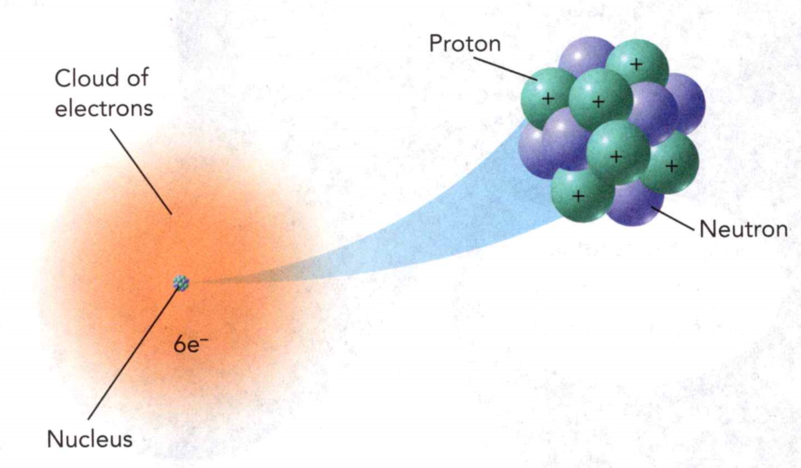
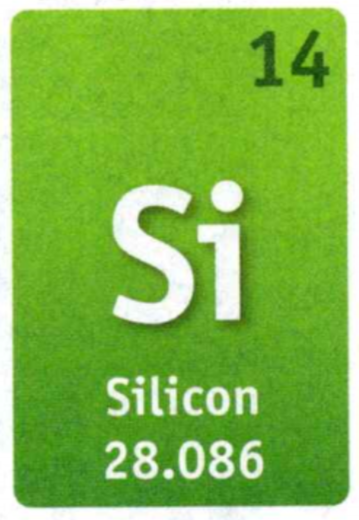
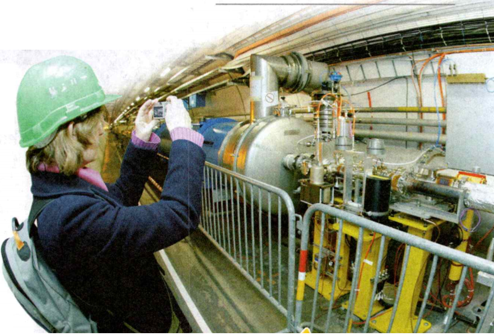

### Physical Science
°
## Chemistry

## 3 Elements and the Periodic Table

An **element** is a pure substance that cannot be broken down into any other 
substances by chemical or physical means.  
A **molecule** is a group of two or more atoms held together by chemical bonds.  
An **atom** is the basic particle from which all elements are made.   

**Complete the tasks below.**  

1. Katherine and her family are having a barbecue. They are 
burning charcoal in the grill to provide heat to cook their 
food. Charcoal is one form of the element carbon. As the 
charcoal burns, it reacts with oxygen molecules in the air. 
Each oxygen molecule contains two atoms.  
How can oxygen be 
both an element and a molecule?

Greek Origin: atomos  	 
Meaning:	Cannot be cut, indivisible  
Key Words: Atom, atomic number, atomic mass

Greek Origin: di  
Meaning:	Two, double  
Key Words: Diatomic molecule

2. Predict the meaning of diatomic molecule.

### Chapter Preview
LESSON 1
- atom	
- electron	
- nucleus
- proton	
- energy level
- neutron	
- atomic number
- isotope	
- mass number

LESSON 2
- atomic mass	
- periodic table
- chemical symbol	
- period
- group

LESSON 3
- metal	luster	
- malleable
- ductile	
- thermal conductivity
- electrical conductivity	
- reactivity
- corrosion	
- alkali metal
- alkaline earth metal
- transition metal

LESSON 4
- nonmetal	
- diatomic molecule
- halogen	
- noble gas	
- metalloid
- semiconductor

LESSON 5
- radioactive decay
- nuclear reaction	
- radioactivity
- alpha particle	
- beta particle
- gamma ray	
- half-life
- radioactive dating	
- tracer

### Introduction to Atoms

- How Did Atomic Theory Develop?   
- What Is the Modern Model of the Atom?   

### Nanowhiskers
What's more than 16,000 times thinner than a human hair, and, 
when added to fabric, able to repel spills, stains, and the 
smell of the sweatiest of socks? It's a nanowhisker!   
Nanowhiskers are tiny threads that measure about 
10 nanometers (nm) in length and
1.5 nanometers in diameter (1 nm equals 0.000000001 m). 
They are often made of carbon or silver atoms. Scientists have 
found a way to bond nanowhiskers to individual threads of cloth. 
The nanowhiskers are so small and so close together that they 
form a barrier that prevents substances from ever touching the 
fabric. Nanowhiskers made from silver can even kill bacteria on 
your feet and stop socks from smelling!

**Complete the tasks below.**  

1. Why are nanowhiskers used to repel stains on fabrics?  
2. What uses for nanowhiskers can you imagine?  

### How Did Atomic Theory Develop?  

If you could see a single atom, what would it look like? Studying 
atoms is difficult because atoms are so small. The smallest 
visible speck of dust may contain 10 million billion atoms! 
Scientists have created models to describe atoms because they 
are so small. Models of the atom have changed many times.   
Around 430 B.C., the Greek philosopher Democritus proposed that 
matter was formed of small pieces that could not be cut into 
smaller parts. He used the word atomos, meaning "uncuttable" 
for these smallest possible pieces.   
In modern terms, an **atom** is the smallest particle that still
 can be considered an element.   
The idea of atoms began to develop again in the 1600s. 
As people did experiments, atomic theory began to take shape. 

**Atomic theory grew as a series of models that developed
from experimental evidence. As more evidence was collected, 
the theory and models were revised.**  

### Dalton's Atomic Theory 
Using evidence from many experiments, John Dalton, an English 
chemist, inferred that atoms had certain characteristics. 
Dalton thought that atoms were like smooth, hard balls that 
could not be broken into smaller pieces. The main ideas of
 Dalton's theory are summarized here:

### Dalton's Model  

### Dalton's Atomic Theory
- All elements consist of atoms that cannot be divided.
- All atoms of the same element are exactly alike and have the 
same mass. Atoms of different elements are different and have different masses.
- An atom of one element cannot be changed into an atom of a different element by a
chemical reaction.
- Compounds are formed when atoms of more than one element 
combine in a specific ratio.

**Complete the tasks below.**  

1. Dalton thought that atoms were smooth, hard balls.
Based on Dalton's Atomic Theory theory, 
would you expect a carbon atom to have the
same mass as an oxygen atom? Explain.

### Thomson's Model 

Dalton's atomic theory has some similarities to today's models, 
but there are many differences. One important change is that 
atoms are now known to be made of even smaller parts. In 1897,
J.J. Thomson discovered that atoms contain negatively
charged particles called electrons. Yet scientists knew that
atoms themselves had no electrical charge. So Thomson
reasoned that atoms must also contain some sort of positive
charge. This positive charge must balance the negative charge 
of the electrons.  
Thomson proposed a model like the one shown in Figure 1. 

<figure>
  
  <figcaption>Figure 1. Thomson's Model.</figcaption>
</figure>  

Thomson suggested that atoms had negatively charged electrons 
set in a positive sphere. Each electron is represented 
above by the symbol e-.

He described an atom that had electrons scattered throughout a 
ball of positive charge—something like seeds in a watermelon.

### Rutherford's Model 
In 1911, one of Thomson's former students, Ernest Rutherford, 
found evidence that challenged Thomson's model. Rutherford's 
research team aimed a beam of positively charged particles at 
a thin sheet of gold foil. A diagram of the experiment is 
shown in Figure 2. 

<figure>
  
  <figcaption>Figure 2. Rutherford's Gold Foil Experiment.</figcaption>
</figure>  

Rutherford and his team predicted that, if Thomson's model were 
correct, the charged particles would pass straight through the foil. 
They also predicted that the paths of some particles would bend, or 
deflect, slightly. The particles would be only slightly deflected 
because the positive charge was thought to be spread out in the gold 
atoms.   
Rutherford observed that most of the particles passed straight through 
the foil with little or no deflection. But to everyone's surprise, a 
few particles were deflected by the gold foil at very large angles. 
Based on the results of his experiment, Rutherford suggested that 
the atom is mostly empty space but has a positive charge at its center.   

Like charges repel each other. So Rutherford inferred that an atom's 
positive charge must be packed within a small region in its center, 
called the **nucleus**. (The plural of nucleus
is nuclei.) Any particle that was deflected strongly had been 
repelled by a gold atom's nucleus. Rutherford's new model of the 
atom, which is shown in Figure 3, is like a cherry.

<figure>
  
  <figcaption>Figure 3. According to Rutherford's
model, an atom was mostly open space. The "6+" in the model means that there are six
protons in the nucleus.</figcaption>
</figure> 

The pit models the nucleus of the atom. The rest of the fruit is 
the space taken up by the electrons. Later research suggested 
that the nucleus was made up of one or more positively charged 
particles. Rutherford called the positively charged particles in 
an atom's nucleus **protons**.

**Complete the tasks below.**  

1. Rutherford was surprised that a few particles were deflected 
strongly. Place a check in Figure 2  to show the paths of the particles 
that  were not predicted by Thomson's atomic model.

2. Use the diagrams in Figure 4 to compare the expected and 
observed results of Rutherford's gold foil experiment. 
Part a shows the expected paths of the charged particles 
through the atoms of the gold foil. In part b, draw the 
observed paths of the charged particles. Show at least one 
particle that is deflected strongly.

<figure>
  
  <figcaption>Figure 4. In part b, draw the 
observed paths of the charged particles. Show at least one 
particle that is deflected strongly.</figcaption>
</figure> 

### Bohr's Model 
One of Rutherford's students was Niels Bohr, a Danish scientist.
In 1913, Bohr revised the atomic model again. Bohr suggested 
that electrons are found only in specific orbits around the 
nucleus. The orbits in Bohr's
model look like planets orbiting the sun or the rings of a 
tree, as shown in Figure 5. 

<figure>
  
  <figcaption>Figure 5. Bohr's Model.</figcaption>
</figure> 

Each possible electron orbit in Bohr's model has a fixed 
energy. 

### Cloud Model 
In the 1920s, the atomic model changed again. Scientists 
determined that electrons do not orbit the nucleus like 
planets, as Bohr suggested. Instead, electrons move rapidly 
within a cloudlike region around the nucleus. Look at Figure 6.

<figure>
  
  <figcaption>Figure 6. Cloud Model
Electrons move rapidly in different 
 around the nucleus.</figcaption>
</figure> 
 
The orange "cloud" is a visual model. It represents where 
electrons are likely to be found. An electron's movement is 
related to its energy level, or the specific amount of 
energy it has. Electrons at different energy levels are 
likely to be found in different places.

**Complete the tasks below.**  

1. What is an atom?   
2. Bohr's model of the atom consisted of a central ____ surrounded 
by electrons moving in specific ____ .
3. How is the cloud model of the atom different from Bohr's 
model?
4. Why did the atomic theory change with time?

### What Is the Modern Model of the Atom?
In 1932, English scientist James Chadwick showed that another 
particle exists in the nucleus of atoms. This particle, called 
a neutron, was hard to find because it has no electric charge.
Scientists have learned more about the atom since then. 
One modern model of the atom is shown in Figure 7.  

<figure>
  
  <figcaption>Figure 7. Modern Model of an Atom.</figcaption>
</figure> 

At the center of the atom is a tiny, dense nucleus containing 
protons and neutrons. Surrounding the nucleus is a cloudlike 
region of moving electrons.   

Most of an atom's volume is the space in which the electrons move. 
This space is huge compared to the space taken up by the nucleus. 
Imagine holding a pencil while standing in the middle of a stadium. 
If the nucleus were the size of the pencil's eraser, the 
electrons would reach as far away as the top row of seats!   

New research supports the modern model of the atom. 
However, scientists still don't know the details of the 
smallest scales of matter. Who will develop the next 
model of the atom? Maybe it will be you!

### Particle Charges 

In Figure 7, protons are shown by a plus sign (+). Electrons 
are shown by the symbol e-. According to the scale 
used for measuring charge in atoms, protons have a charge of +1. 
Electrons have exactly the opposite charge. So electrons have
a charge of -1. If you count the number of protons in 
Figure 7, you'll see there are six. The number of 
protons equals the number of electrons. As a result, the 
positive charge from the protons equals the negative charge 
from the electrons. The charges balance, making the atom 
neutral. Neutrons don't affect the charge of an atom 
because they have a charge of zero.

**Complete the tasks below.**  

1. A carbon atom has a nucleus
made up of positively charged protons and neutral neutrons Figure 7. 
The nucleus is surrounded by a cloud of negatively charged 
electrons. How many protons are in the carbon atom?
2. What is the charge of a proton?   
3. What is the charge of an electron?
4. What is the charge of a neutron?

### Comparing Particle Masses 

Although electrons may balance protons charge for charge, 
they can't compare when it comes to mass. It takes 
almost 1,840 electrons to equal the mass of one proton. 
A proton and a neutron are about equal in mass. Together, 
the protons and neutrons make up almost all the mass of an atom.   

<figure>
  
  <figcaption>Figure 8. An atom is made up of protons, neutrons, and electrons.</figcaption>
</figure> 

Figure 8 compares the charges and masses of the three atomic
particles. Atoms are too small to be described by everyday 
units of such as grams or kilograms. Sometimes scientists use
units known as atomic mass units (amu). A proton or a
neutron has a mass equal to about one amu.

### Atomic Number 

Every atom of an element has the same number of protons. For 
example, every carbon atom has 6 protons and every iron atom 
has 26 protons. The number of protons in the nucleus of an atom 
is the atomic number of that atom's element. The definition of 
an element is based on its atomic number. Carbon's atomic number 
is 6 and iron's is 26.

### Isotopes 
All atoms of an element have the same number of protons. The number 
of neutrons can vary. Atoms with the same number of protons and different 
numbers of neutrons are called **isotopes**. Figure 9 shows three isotopes of carbon.   

An isotope is identified by its **mass number**, which is the
sum of the protons and neutrons in the atom. The most common
isotope of carbon has a mass number of 12 (6 protons + 6 neutrons, and may be 
written as "carbon-12." About 99 percent of naturally occurring carbon is 
carbon-12. Two other isotopes are carbon-13 and carbon-14. Despite their 
different mass numbers, all three carbon isotopes react the same way chemically.

<figure>
  
  <figcaption>Figure 9. All isotopes of carbon contain 6 protons. They 
differ in the number of neutrons.</figcaption>
</figure> 

**Complete the tasks below.**

1. Fill in the missing information for each isotope in Figure 9.
2. What is atomic number? How is atomic number used to distinguish one element from another?
3. The atomic number of nitrogen is 7. How many protons, neutrons, and
electrons make up an atom of nitrogen-15?  
4. Describe the modern model of the atom.  

### Organizing the Elements   

- What Did Mendeleev Discover?
- What Information Does the Periodic Table Contain? 
- How Is the Periodic Table Useful?

### Dmitri Mendeleev   

The Russian chemist Dmitri Mendeleev is given credit for creating 
the first version of the periodic table in 1869. By arranging the 
elements according to their atomic masses, he predicted that new 
elements would be discovered:  

"We must expect the discovery of many yet unknown elements - for example, elements 
analogous [similar] to aluminum and silicon—whose atomic weight [mass] 
would be between 65 and 75."  

Within 17 years, chemists had discovered these missing elements.

**Complete the tasks below.** 

1. What did Mendeleev predict?  

### What Did Mendeleev Discover?
By 1869, a total of 63 elements had been discovered. A few were gases. 
Two were liquids. Most were solid metals. Some reacted explosively 
as they formed compounds. Others reacted slowly. Scientists wondered if 
the properties of elements followed a pattern. Dmitri Mendeleev discovered 
a set of patterns that applied to all the elements.

### Mendeleev's Work  

Mendeleev knew that some elements had similar chemical and physical properties. For 
example, silver and copper are both shiny metals. Mendeleev thought these similarities 
were important clues to a hidden pattern.   
To find that pattern, Mendeleev wrote each element's melting point, 
density, and color on an individual card. He also included the element's 
atomic mass. The **atomic mass** of an element is the average mass of all 
the isotopes of that element. Mendeleev tried arranging the cards in 
different ways.  
**Mendeleev noticed that a pattern of properties appeared when he arranged the elements 
in order of increasing atomic mass. He found that the properties repeated regularly.**
For example, lithium, sodium, and potassium showed several common properties. As you can see 
from Figure 10, these elements react with water in a similar way. 

<figure>
  
  <figcaption>Figure 10. Lithium, sodium, and potassium all react with water.</figcaption>
</figure>

(The letters amu mean "atomic mass units:') Mendeleev lined up the cards for these 
elements to form their own group. He did the same with other elements that shared similar
properties.

### The Periodic Table 
Mendeleev created the first periodic table in 1869. A periodic table is an arrangement 
of elements showing the repeating pattern of their properties. 
(The word periodic means "in a regular, repeated pattern:") The periodic table shown in 
Figure 11 was an improved version published in 1871. In his periodic table, Mendeleev left 
blank spaces. He predicted that the blank spaces would be 
filled by elements that had not yet been discovered. He even correctly 
predicted the properties of those new elements.

<figure>
	
	<figcaption>Figure 11. Mendeleev's Periodic Table.</figcaption>
</figure>

As scientists discovered new elements and learned more about atomic structure, the periodic 
table changed. It is now known that the number of protons in the nucleus, given by the 
atomic number, determines the chemical properties of an element. Modern periodic tables 
are arranged in order of increasing atomic number.

**Complete the tasks below.**  

1. In what order did Mendeleev arrange the elements in his periodic table?  
2. How could Mendeleev predict the properties of elements that had not yet been discovered?  

### What Information Does the Periodic Table Contain?   
The periodic table contains information about each of the known elements.
In this book, the periodic table includes the atomic number, chemical symbol, name, and 
atomic mass for each element. The information that the periodic table lists about potassium 
is shown below in Figure 12.

<figure>
	
	<figcaption>Figure 12. Potassium has an atomic number of 19 and an atomic mass of 39.098 amu.</figcaption>
</figure>

1. **Atomic Number** The first piece of information is the number 19, the atomic number of potassium. 
Every potassium atom has 19 protons in its nucleus.  
2. **Chemical Symbol** Just below the atomic number is the letter K—the chemical symbol for potassium. 
Chemical symbols contain either one or two letters. Often, an element's symbol is an abbreviation 
of the element's name in English. Other elements have symbols that are abbreviations of their Latin names.
3. **Atomic Mass** The last piece of information is the average atomic mass. For potassium, this 
value is 39.098 amu (atomic mass units). The atomic mass is an average because most elements consist 
of a mixture of isotopes.  

The modern periodic table is shown in Figure 13. Can you find potassium?

<figure>
	
	<figcaption>Figure 13. xxx.</figcaption>
</figure>

**Complete the tasks below.**  

1. The entry for silicon (Si) in the periodic table looks like in Figure 14.
a) What is the atomic number of silicon?
b) Without looking at the periodic table, do you think that any other element 
has the same atomic number as silicon? Explain.

<figure>
	
	<figcaption>Figure 14. The entry for silicon (Si) in the periodic table.</figcaption>
</figure>

2. The periodic table is one of the most valuable tools to a chemist. Find the element 
identified by the atomic number 25 on the periodic table. 
a) What is the Name of the element?
b) What is the Chemical symbol?
c) What is the Atomic mass?

3. Describe two differences between Mendeleev's periodic table and the modern periodic table.  
4. An atom of which element has 47 protons in its nucleus?  
5. What information in included in the periodic table for each element?

### How Is the Periodic Table Useful?  

Look at the periodic table above. Notice that the atomic numbers increase from left to 
right. Also notice that each color-coded region corresponds to a different class of 
elements—metals, nonmetals, and metalloids.   

As you look across a row, the elements' properties change in a predictable way. 
**An element's properties can be predicted from its location in the periodic table.**  
This predictability is the reason that the periodic table is so useful to chemists.

### Periods 

The periodic table is arranged in rows called periods. A period contains a series of 
different elements. From left to right, the properties of the elements change in a pattern. 
Metals are shown on the left of the table and nonmetals are located on the right. Metalloids are 
found between the metals and nonmetals. This pattern is repeated in each period. Figure 15 shows the 
elements of Period 3.  

<figure>
	
	<figcaption>Figure 15. The properties of the Period 3 elements change as you move across the period..</figcaption>
</figure>

**Complete the tasks below.**   

1. The element of period 3 are: Na, Mg, Al, Si, P, S, Cl, Ar. 
a) Which elements are metals?
b) Which elements are metalloids?
c) Which elements are nonmetals?

### Groups 
The modern periodic table has 7 periods, which form 18 columns. 
The elements in a column form a **group**. Groups are also known as 
families. The groups are numbered from Group 1 on the left of the 
table to Group 18 on the right.   
The pattern of properties repeats in each period, so the elements 
in each group have similar characteristics. For example, except for 
hydrogen, the elements in Group 1 are all metals that react violently 
with water. Group 17 elements are very reactive, but Group 18 
elements are generally nonreactive. The elements of Group 10 are 
shown in Figure 6.

**Complete the tasks below.** 

1. The rows in the periodic table are called ___ . 
2. The columns in the periodic table are called ___ .
3. What do elements in the same group in the periodic table have 
in common?
4. Use the periodic table to name two elements that you would expect 
to have properties very much like those of calcium (Ca).
5. Why is the periodic table is useful?

### Metals

- What Are the Properties of Metals? 
- How Are Metals Classified?

### Recycling Metals  

You can find metals in many items that you use every day, including cell 
phones, computers, appliances, and money. In 2006, the supply
of metal in the United States was more than 150 million metric tons. 
(One metric ton equals 1,000 kilograms.) Many of these metals can be 
recycled. Recycling helps conserve energy and reduces the amount of 
waste in landfills.

**Complete the tasks below.**  

1. Beverage cans contain mostly aluminum. 
Estimate the percent of beverage cans that you recycle. 
What other objects that contain metal do you think can be recycled?

### What Are the Properties of Metals?  

It's hard to imagine modern life without metals. The cars and buses 
you ride in are made of steel, which is mostly iron (Fe). Airplanes are 
covered in aluminum (Al). Copper (Cu) wires carry electric current to 
lamps, stereos, and computers.  

Elements can be classified by their properties, including melting 
temperature, density, hardness, and thermal and electrical 
conductivity. Metals are elements that are good conductors
of electric current and heat. They also tend to be shiny and 
bendable—like copper wire, for instance. The majority of
elements in the periodic table are metals. The metals begin on the 
left side and extend across the periodic table.

<figure>
	
	<figcaption>Figure 16. Physical Properties of Metals. magnetite, 
gold, copper.</figcaption>
</figure>

### Physical Properties 
Figure 16 shows some common metal objects. **The physical properties of 
metals include luster, malleability, ductility, and conductivity.** 
A material that has a high luster is shiny and reflective. A malleable 
 material is one that can be hammered or rolled into flat sheets or 
other shapes. A ductile material is one that can be pulled out, or 
drawn, into long wires. Copper is both malleable and ductile. It 
can be made into thin sheets or drawn into wires.  

**Thermal conductivity** is the ability of an object to transfer heat. The 
ability of an object to carry electric current is called **electrical 
conductivity.** Most metals are good thermal conductors and electrical 
conductors. Metals also generally have low specific heats. Recall that 
specific heat is the amount of energy required
to raise the temperature of 1 gram of a material by 1 kelvin. 
This means that only a small amount of thermal energy is required 
to raise the temperature of a metal.  
Some metals are magnetic. Iron, cobalt (Co), and nickel (Ni) are 
attracted to magnets and can be made into magnets. Most metals are 
solids at room temperature. Only mercury (Hg) is a liquid at room 
temperature.

### Chemical Properties 

The ease and speed with which an element combines, or reacts, with 
other substances is called its **reactivity**. Metals usually react by 
losing electrons to other atoms. Some metals are very reactive. 
For example, sodium (Na) reacts strongly with water. By comparison, 
gold (Au) and platinum (Pt) do not react easily with other substances.  

The reactivities of other metals fall somewhere between those of sodium 
and gold. Iron, for example, reacts slowly with oxygen in the air, 
forming iron oxide, or rust. An iron chain is coated with rust after 
being exposed to air and
water. The deterioration of a metal due to a 
chemical reaction in the environment is called **corrosion**.

**Complete the tasks below.**  

<figure>
	
	<figcaption>Figure 17. The forks shown are made of silver (Ag).</figcaption>
</figure>

1. The forks shown in Figure 17 are made of silver (Ag). Some of the 
silver forks shown have lost their luster—they have become tarnished. 
This is an example of ___ .
2. What properties of gold and
platinum make these metals desirable for jewelry?
3. What does the term thermal conductivity mean?
What property of metals led to the use of plastic or wooden handles 
on many metal cooking utensils? Explain.
4. The physical properties of metals include what?

### How Are Metals Classified?

The metals in a group have similar properties. Properties within a 
group change gradually as you look across the periodic table. 
For example, the reactivity of metals tends to decrease from left 
to right across the table. **In the periodic table, metals are 
classified as alkali metals, alkaline earth metals, transition 
metals, metals in mixed groups, lanthanides, and actinides.**

### Alkali Metals 
The metals of Group 1, from lithium (Li) to francium (Fr), are called
the alkali metals. These metals are the most reactive metals in 
the periodic table. Alkali metals are so reactive that they are never 
found as uncombined elements in nature.
They are found only in compounds. Compounds that contain 
potassium (K) are used in fireworks.
In the laboratory, chemists can isolate alkali metals from 
their compounds. As pure, uncombined elements, some of the 
alkali metals are shiny and so soft you can cut them with a plastic 
knife. These elements have low densities and melting points. 
For example, sodium melts at 98°C and has a density 
of 0.97 g/cm3 - less than water.

### Alkaline Earth Metals
The metals of Group 2 are called the alkaline earth metals. These 
metals are harder and denser, and
melt at higher temperatures than the alkali metals. For example, 
magnesium (Mg) is a hard metal that melts at 648.8°C.
Alkaline earth metals are very reactive, though not as reactive 
as the alkali metals. These metals are also never found uncombined
in nature. Calcium (Ca) is one of the most common alkaline earth 
metals. Calcium compounds are essential for bone health. 

**Complete the tasks below.**  

<figure>
	
	<figcaption>Figure 18. Melting Points in a Group of Elements.</figcaption>
</figure>

1. Properties of elements in a 
single group in the periodic table often change according to a 
certain pattern. The graph in Figure 18 shows the melting points of the Group 1 
elements, or the alkali metals.
a) does the melting points of the alkali metals increase or decrease
from lithium to francium.
2. Which of the alkali metals are liquids at 50°C?
3. If element 119 were discovered, it would fall below francium 
in Group 1. Predict the approximate melting point of element 119.

### Transition Metals  

The elements in Groups 3 through 12 are called the **transition metals**. 
The transition metals include iron, copper, nickel, gold, and silver. 
Most of these metals are hard and shiny solids. However, mercury is a 
liquid at room temperature. Except for mercury, the transition metals 
often have high melting points and high densities. They are also good 
conductors of heat and electric current, and are very malleable. 
Gold is sometimes used to coat an astronaut's 
visor.  

The transition metals are less reactive than the metals in Groups 1 
and 2. When iron reacts with air, forming rust,
it sometimes takes many years to react completely.

### Metals in Mixed Groups

Bicycle frames often contain aluminum
because it is durable but light. Aluminum is in Group 13 of the 
periodic table. Only some of the elements in Groups 13 through 16 
are metals. Other metals in these groups that you may be familiar 
with are tin (Sn) and lead (Pb). A thin coating of tin protects 
steel from corrosion in some cans of food. Lead was once used in 
paints and water pipes. Lead is no longer used for these purposes 
because it was found to be poisonous. Now its most common use is in 
automobile batteries.

### Lanthanides and Actinides 

Two rows of elements are placed below the main part of the periodic 
table. The elements in the top row are the lanthanides. Compounds 
containing neodymium (Nd), a lanthanide, are used to make laser light. 
These lasers are used for surgery, for cutting metals, and in laser 
range finders.   
The elements below the lanthanides are called actinides. Many 
of these elements are not found in nature but are made artificially 
in laboratories.

### Transuranium Elements 

Elements that follow uranium (U) in the periodic table are transuranium 
elements. These elements are made, or synthesized, when nuclear 
particles are forced to crash into one another. They are sometimes 
called synthetic elements. For example, plutonium (Pu) is synthesized 
by bombarding nuclei of uranium-238 with neutrons in a nuclear reactor.   

To make elements with atomic numbers above 95, scientists use devices 
called particle accelerators that move atomic nuclei at extremely 
high speeds. If these nuclei crash into the nuclei of
other elements with enough energy, the particles can combine 
into a single nucleus. An example of a particle accelerator is 
shown in Figure 19.

<figure>
	
	<figcaption>Figure 19. Particle Accelerator.</figcaption>
</figure>

In general, the difficulty of synthesizing new elements increases with atomic 
number. So new elements have been synthesized only as more powerful particle 
accelerators have been built. Elements
in the periodic table with atomic numbers
greater than 113 do not yet have permanent
names or symbols. In the future, scientists
around the world will agree on permanent
names and symbols for these elements.

**Complete the tasks below.**  
1. Which family of elements in the periodic table contains the most reactive metals?  
2. Period 4 of the periodic table contains the elements potassium, calcium, and copper. Which is the least reactive?  
3. How is plutonium made?  

### Nonmetals and Metalloids

- What Are the Properties of Nonmetals?  
- What Are the Families Containing Nonmetals?  

### Something in the Air
A common misconception is that the air in the atmosphere is mostly oxygen.
Fact: At sea level, air is actually only about 21 percent oxygen by volume. 
Nitrogen makes up about 78 percent of the atmosphere. The 
remaining one percent is made up of several gases, including
argon and carbon dioxide.
Evidence: Oxygen
is actually toxic at
high concentrations. If you breathed in oxygen, you would eventually
get very sick.

**Complete the tasks below.**  
1. Why don't scuba divers fill their tanks with pure oxygen?  
2. Can you think of anything else that is good for you in small amounts but bad for you in large amounts?  

### What Are the Properties of Nonmetals?  

Life on Earth depends on many nonmetals. For example, carbon (C), nitrogen (N), 
phosphorus (P), hydrogen (H), and oxygen (O) are all nonmetal elements found in 
your body's DNA. A model of DNA is shown in Figure 20. 

<figure>
	
	<figcaption>Figure 20. DNA, which is made up of 
atoms of nonmetals, is essential to life.</figcaption>
</figure>

While many compounds made with nonmetals are essential to life, some nonmetals are 
poisonous and highly reactive. Still others are nonreactive. Compared to metals, 
nonmetals have a much wider variety of properties. However, nonmetals do have 
several properties in common.
Physical Properties A nonmetal is an element that lacks most of the properties 
of a metal. Except for hydrogen, the nonmetals are found on the right 
side of the periodic table. In general, most nonmetals are poor conductors 
of electric current and heat. Solid nonmetals tend to be dull and brittle. 
If you were to hit most solid nonmetals with a hammer, they would break or 
crumble into a powder. Also, nonmetals usually have lower densities than metals.
Many nonmetals are gases at room temperature. The air you breathe 
contains mostly nitrogen and oxygen. Some nonmetal elements, such as carbon, 
sulfur (S), and iodine (I), are solids at room temperature. Bromine (Br) is 
the only nonmetal that is a liquid at room temperature.

### Chemical Properties  
Atoms of nonmetals usually gain or share electrons when they react with other atoms. 
When nonmetals and metals react, electrons move from the metal atoms to
the nonmetal atoms. For example, when sodium and chlorine react to 
form table salt (NaCl), an electron moves from the sodium atom to the chlorine atom.   

Many nonmetals can form compounds with other nonmetals. In these types of compounds, 
the atoms share their electrons to form bonds. When two or more atoms bond this way, 
they form a molecule. A water (H2O) molecule consists of two hydrogen 
atoms and one oxygen atom.

**Complete the tasks below.**  
1. Can you think of other substances essential to life that contain nonmetals?
2. Most properties of nonmetals are the opposite of the 
properties of metals. Complete the table about the 
properties of metals and nonmetals.

| Properties of Metals                | Properties of Nonmetals |
|-------------------------------------|-------------------------|
| Shiny                               | Dull                    |
| Malleable                           | a)                      |
| Good conductors of electric current | b)                      |
| c)                                  | Poor conductors of heat |

3. Sulfur is a nonmetal. What properties can you
observe from Figure 21? 
What additional properties can you predict?

<figure>
	
	<figcaption>Figure 21. Sulfur.</figcaption>
</figure>

4. What property of nonmetals is the opposite of being malleable and ductile?
5. What happens to the atoms of most nonmetals when they react with other elements?

### What Are the Families Containing Nonmetals?

Look back at the periodic table. There are nonmetals 
in  Group 1 and in Groups 14 -18. The families containing nonmetals
include the carbon family, the nitrogen family, the oxygen family, 
the halogen family, the noble gases, and hydrogen.

**Complete the tasks below.**  

1. Refer to the periodic table to complete the table
below.

| Family          | Group | Nonmetals in Family |
|-----------------|-------|---------------------|
| Carbon family   | 14    | a)                  |
| Nitrogen family | 15    | b)                  |
| Oxygen family   | 16    | c)                  |
| Halogen family  | 17    | d)                  |
| Noble gases     | 18    | e)                  |
| Hydrogen        | 1     | f)                  |

### The Carbon Family 

In Group 14, only carbon is a nonmetal. Carbon is 
especially important in its role in the chemistry of life. 
Proteins, DNA, and fats all contain carbon.  
Most of the fuels that are burned to yield energy contain carbon. 
Coal contains large amounts of carbon. Gasoline
is made from crude oil, a mixture of carbon compounds
with one carbon atom to chains
of several hundred carbon atoms. A
diamond, which is shown in Figure 22, is
made of pure carbon.

<figure>
	
	<figcaption>Figure 22. Diamond.</figcaption>
</figure>

### The Nitrogen Family   

Group 15, the nitrogen family,
contains two nonmetals, nitrogen
and phosphorus. Nitrogen makes
up about 78 percent of Earth's
atmosphere by volume. In nature,
nitrogen exists as two nitrogen atoms
bonded together to form a diatomic
molecule, N2. A **diatomic molecule**
is made up of two atoms. In this
form, nitrogen is not very reactive.  
Although living things need nitrogen, most of them are 
unable to use nitrogen from the air. However, certain 
kinds of bacteria can use the nitrogen from the air to 
form compounds. This process
is called nitrogen fixation. Plants can then take in 
these nitrogen compounds formed by the bacteria in 
the soil. Farmers also add nitrogen compounds to 
the soil in the form of fertilizers. Lightning also 
converts nitrogen in the atmosphere into a form 
that can be used by plants. The energy released in the 
atmosphere in the form of lightning is able to break 
the bonds between nitrogen atoms, causing them to react 
with oxygen.  
Phosphorus is the other nonmetal in the nitrogen 
family. Much more reactive than nitrogen, phosphorus 
in nature is always found in compounds.

**Complete the tasks below.**  

1. How do you get the nitrogen you need?  

### The Oxygen Family 
Group 16, the oxygen family, contains three nonmetals - 
oxygen, sulfur, and selenium (Se). Oxygen is
a gas at room temperature, whereas sulfur and selenium 
are both solids.  
You are using oxygen right now. With every breath, oxygen 
travels into your lungs. There, it is absorbed into your 
bloodstream, which distributes it all over your body. Like nitrogen, 
oxygen (O2) is a diatomic molecule. Oxygen is 
relatively reactive, so it can combine with almost every other element.  
If you have ever smelled the odor of a rotten egg, then you are already 
familiar with the smell of some sulfur compounds. Sulfur is used in the 
manufacturing of rubber for rubber bands and automobile tires.

### The Halogen Family 
Group 17 contains the nonmetals fluorine (F), 
chlorine (Cl), bromine, and iodine. These elements 
are also known as the halogens, which means "salt forming:".
The properties of astatine (At) are unknown because it is extremely rare.  

All of the halogens are very reactive. Fluorine is the most reactive of all the 
elements. It is so reactive that it reacts with almost every known substance,
including water. Chlorine gas is extremely dangerous, but it is used
in small amounts to kill bacteria in water supplies.   

Though the halogen elements are dangerous, many of the 
compounds that halogens form are quite useful. Compounds of 
fluorine make up the nonstick coating on cookware. Fluorine compounds
are also found in toothpaste
because they help prevent tooth decay.  

### The Noble Gases 
The elements in Group 18 are known as the noble gases. They do 
not ordinarily form compounds because atoms of noble gases 
do not usually gain, lose, or share electrons. As a result, 
the noble gases are usually nonreactive. Even so, scientists have
been able to synthesize some noble gas compounds in the laboratory.  

You have probably seen a floating balloon filled with helium (He). 
Noble gases are also used in glowing electric lights.

### Hydrogen 
Alone in the upper left corner of the periodic table is hydrogen - 
the element with the simplest atoms. The chemical properties of hydrogen 
are very different from those of the other elements, so it cannot be grouped 
in with a family.  

Hydrogen makes up more than 90 percent of the atoms in the universe. 
Stars—like the sun contain massive amounts of hydrogen. But, hydrogen 
makes up only 1 percent of the mass of Earth's crust, oceans, and atmosphere. 
Hydrogen is rarely found on Earth as a pure element. 
Most hydrogen is combined with oxygen in water.

**Complete the tasks below.** 

1. Why isn't hydrogen considered an alkali metal?

### Metalloids 
Between the metals and the nonmetals in the periodic table
lie the metalloids. The metalloids have
some properties of metals and some properties of nonmetals. 
All metalloids are solids at room temperature. The metalloids are 
brittle, hard, and somewhat reactive.
The most common metalloid is silicon (Si). Ordinary sand, which is 
mostly silicon dioxide (SiO2), is the main component of glass. 
A compound of boron (B) and oxygen is added during the process of 
glassmaking to make heat-resistant glass.   
A metalloid's most useful property is the ability to conduct 
electric current. The conductivity of a metalloid can depend on 
temperature, exposure to light, or the presence of impurities.   

For this reason, metalloids such as silicon and germanium (Ge) 
are used to make semiconductors. **Semiconductors** are substances 
that can conduct electric current under some conditions but not 
under other conditions. Semiconductors are used to 
make computer chips, transistors, and lasers. 
Semiconductors are also used in solar cells.

**Complete the tasks below.**  

1. Use this portion of the periodic table in Figure 23 to answer the questions.

<figure>
	
	<figcaption>Figure 23. Portion of the periodic table.</figcaption>
</figure>

a) List the chemical symbols of the nonmetals.
b) The remaining elements are classified as what?

2. Selenium has properties similar to a) sulfur or bromine,
because they are in the same b) period or group.

<figure>
	
	<figcaption>Figure 24. Periodic table with alien names.</figcaption>
</figure>

3. Imagine that inhabitants of another planet send a message to 
Earth that contains information about 30 elements. 
However, the message contains different names and symbols 
for these elements than those used on Earth. Using
the clues provided, fill in the periodic table (Figure 24) with 
these "alien" names. Alien Elements
The noble gases are bombal (Bo), wobble (Wo), jeptum (J), and logon (L). 
Among these gases, wobble has the greatest atomic mass and bombal the l
east. Logon is lighter than jeptum.
The most reactive group of metals are xtalt (X),
byyou (By), chow (Ch), and quackzil (Q).
Of these metals, chow has the lowest atomic mass. Quackzil is in 
the same period as wobble.
Apstrom (A), vulcania (Vc), and kratt (Kt) are nonmetals in Group 17. 
Vulcania is in the same period as quackzil and wobble.
The metalloids are ernst (E), highho (Hi), terriblum (T), and 
sississ (Ss). Sississ is the metalloid with the greatest atomic mass. 
is the metalloid with the lowest atomic mass. Highho and terriblum
are in Group 14. Terriblum has more protons than highho. 
Yazzer (Yz) touches the zigzag line, but it's a metal, not a metalloid.
The lightest element of all is called pfsst (Pf). The heaviest element in 
the group of 30 elements is eldorado (El). The most chemically active 
nonmetal is apstrom. Kratt reacts with byyou to form table salt.
The element doggone (D)
has only 4 protons in its atoms.
Floxxit (Fx) is important in the chemistry of life. It forms compounds 
made of long chains of atoms. Rhaatrap (R) and doadeer (Do) are metals 
in the fourth period, but rhaatrap is less reactive than doadeer.
Magnificon (M), goldy (G), and sississ are all members of Group 15. 
Goldy has fewer electrons than magnificon.
Urrp (Up), oz (Oz), and nuutye (Nu) are in Group 16. Nuutye is found 
as a diatomic molecule and has the same properties as a gas found 
in Earth's atmosphere. Oz has a lower atomic number than urrp.
The element anatom (An) has atoms with a total of 49 electrons. 
Zapper (Z) and pie (Pi) are both members of Group 2. Zapper has 
protons than pie.

4. What are the nonmetals in Group 16 of the periodic table?  
5. How do the chemical properties of the halogens compare to those of the noble gases?  
6. How is the periodic table organized?  

### Radioactive Elements

- What Happens to an Atom During Radioactive Decay?  
- What Does Radioactive Decay Produce?  
- How Are Radioactive Isotopes Useful?  
- 
### Running on Radioactive Isotope
Did you know that the Cassini spacecraft, which is being 
used to explore Saturn, runs on batteries? The batteries 
are called radioisotope thermoelectric generators 
(RTGs).   

The batteries you can buy in the store use chemical 
reactions to generate electrical energy. However, 
RTGs produce electrical energy by using radioactive 
decay. RTGs contain unstable isotopes, which are 
called radioactive isotopes. Heat is released as the 
radioactive isotopes lose particles from their atoms. 
The heat is then converted into electrical energy. A 
single RTG contains several pounds of radioactive 
material. This is enough fuel to provide power for up 
to 23 years!

**Complete the tasks below.** 

1. How are RTGs different from the batteries you buy 
at a store?  
2. Imagine being on a spacecraft traveling to distant 
planets. What are some of the things you might see?

### What Happens to an Atom During Radioactive Decay?

Suppose you could find a way to turn dull, cheap lead into 
valuable gold. More than a thousand years ago, many people 
tried, but nothing worked. There is no chemical reaction that 
converts one element into another. Even so, elements do sometimes 
change into other elements. For example, atoms of carbon can become atoms of nitrogen. 
How are these changes possible?

### Radioactive Decay 

Recall that atoms with the same number of protons and different numbers of neutrons 
are called isotopes. Some isotopes are unstable, so their nuclei do not 
hold together well. These unstable isotopes are also called radioactive 
isotopes. In a process called radioactive decay, the atomic nuclei of 
radioactive isotopes release fast-moving particles and energy. **During radioactive decay, the identity of an atom changes.**  
Radioactive decay is an example of a nuclear reaction.
**Nuclear reactions** involve the particles in the nucleus of an atom. 
Nuclear fission, a process in which an atom's nuclei split apart, 
and nuclear fusion, the process in which atomic nuclei join together, 
are both nuclear reactions. These physical processes make it possible 
for scientists to turn one element into another.

**Complete the tasks below.**  

1. Goldy is furiously trying to turn lead into gold in the chemistry lab. Meanwhile, 
her lab partner Lucy is trying to convince her that it can't be done with a 
chemical reaction. Use what you know about nuclear and chemical reactions 
to complete Lucy's argument.

### Discovery of Radioactive Decay 

In 1896, the French scientist Henri Becquerel accidentally 
discovered the effects of radioactive decay. He observed 
that when a mineral containing uranium was exposed to sunlight, 
it gave off an energy that could fog photographic film plates. 
Becquerel thought that sunlight was necessary for the energy 
release. So, on a cloudy day, he put away the mineral in a desk 
drawer next to a photographic plate wrapped in paper. Later, 
when Becquerel opened his desk to retrieve his materials, he 
found an image of the mineral on the photographic plate. Sunlight 
wasn't necessary after all. Becquerel hypothesized that uranium 
gives off energy, called radiation, all the time.  

Becquerel presented his findings to a young Polish researcher, 
Marie Curie, and her husband, French chemist Pierre Curie.
The Curies showed that a reaction was taking place
within the uranium nuclei. The uranium was able to
spontaneously emit radiation. Marie Curie called
this property **radioactivity**. The Curies, along with
Becquerel, won the Nobel Prize in physics for their
work on radioactivity. Marie Curiewas later awarded 
the Nobel Prize in
chemistry for her research on radioactive elements.
She eventually died of cancer, a result of her years of
exposure to radium. Marie Curie was the first scientist to win the Nobel 
Prize in two different subject areas (physics and chemistry). 
She was also the first woman ever to receive a Nobel Prize.

**Complete the tasks below.** 

1. What is the spontaneous emission of radiation by an unstable atomic nucleus called?
2. What caused the fogging of the photographic plates that Becquerel observed in 1896?

### What Does Radioactive Decay Produce?  

<figure>
	
	<figcaption>Figure 25. Radioactive elements give off particles and energy during radioactive decay..</figcaption>
</figure>

Figure 25 illustrates the three major forms of radiation produced 
during the decay of an unstable nucleus. Radioactive decay can produce alpha particles, 
beta particles, and gamma rays.

### Alpha Decay

An alpha particle consists of two protons and two neutrons. It is 
positively charged. The release of an alpha particle by an atom 
during alpha decay decreases the atomic number by 2 and the 
mass number by 4. For example, a thorium-232 nucleus decays to 
produce an alpha particle and a radium-228 nucleus.

### Beta Decay

During beta decay, a neutron in an unstable nucleus changes into a 
negatively charged beta particle and a proton. A beta particle is a 
fast-moving electron given off by a nucleus during radioactive decay. The 
new proton remains inside the nucleus. The nucleus is then left with one less 
neutron and one more proton. Its mass number remains the same but its 
atomic number increases by one. For example, a carbon-14 nucleus 
decays to produce a beta particle and a nitrogen-14 nucleus.

### Gamma Radiation

Alpha and beta decay are almost always accompanied by gamma radiation. 
Gamma rays consist of high-energy waves, similar to X-rays. 
Gamma rays (also called gamma radiation) have no charge and do 
not cause a change in either the atomic mass or the atomic number.

**Complete the tasks below.** 

1. Identify the change (if any) that occurs in an unstable nucleus 
during each form of radioactive decay.

### Effects of Nuclear Radiation 

<figure>
	
	<figcaption>Figure 26. Effects of Nuclear Radiation.</figcaption>
</figure>

Figure 26 depicts a radioactive source that emits alpha particles, beta particles, 
and gamma rays. Alpha particles move very fast, they can be blocked 
by just a sheet of paper. Alpha radiation can cause an 
injury to human skin that is much like a bad burn.  

Beta particles are much faster and more penetrating 
than alpha particles. They can pass through paper. But, they 
are blocked by an aluminum sheet 5 millimeters thick. Beta particles 
can also travel into the human body and damage its cells.  

Gamma radiation is the most penetrating. You would need a piece of lead 
several centimeters thick or a concrete wall about a meter thick 
to stop gamma rays. They can pass right through a human body. 
Gamma rays deliver intense energy to cells and can cause severe damage.

**Complete the tasks below.** 

1. What is the name of the particle produced by radioactive decay that consists of 2 protons and 2 neutrons?  
2. Rank the three major types of nuclear radiation from 1 (most penetrating) to 3 (least penetrating).  
3. What are the identity and mass number of the nucleus formed during the beta 
decay of magnesium-28?  
4. What are the three major forms of radiation produced during radioactive decay?  
<figure>
	
	<figcaption>Figure 27. The Effects of Nuclear Radiation.</figcaption>
</figure>

5. Use the key to complete the paths of the alpha particle, beta particle, and gamma 
ray emitted by the radioactive sample (Figure 27). Each path should end at the point 
where the radiation is blocked.

### How Are Radioactive Isotopes Useful?

Radioactive isotopes have many uses in science and industry. In some cases, 
the energy released by radioactive isotopes is itself useful. In other cases, 
radiation is useful because it can be easily detected. **Uses of radioactive isotopes include determining 
the ages of fossils, tracing the steps of chemical reactions and industrial 
processes, diagnosing and treating disease, and providing sources of energy.**

### Radioactive Dating 

Radioactive isotopes decay at different rates. The **half-life** of a radioactive isotope 
is the length of time needed for half of the atoms of a sample to decay. The half-life 
is different for each radioactive isotope. Half-lives can range from les, 
than a second to billions of years!  

Fossils are traces or remains of living things that have been preserved. For 
fossils millions or billions of years old, ages are found from radioactive 
isotopes with very long half-lives, like uranium. For much younger fossils, 
carbon-14 is often used.  

As plants grow, they use carbon dioxide (CO2) from the air. A fraction of 
all carbon dioxide contains the radioactive isotope carbon-14. This becomes 
part of a plant's structures. After the plant dies, it stops taking in carbon 
dioxide. If the plant's remains are preserved, the amount of carbon-14 present 
can be measured. Scientists can calculate how many half-lives have passed since
the plant died and estimate the age of the fossil. This process is called **radioactive dating**.

**Complete the tasks below.** 

<figure>
	
	<figcaption>Figure 28. Half-Lives of Some Radioactive Isotopes.</figcaption>
</figure>

1. Data from a fossil of a mammoth tooth shows that carbon-14 has been decaying in the tooth for five half-lives.
   a) Calculate the age of the tooth: ___ half-lives x	___ years/half-life =	___ years.
   b) What fraction of the amount of carbon-14 that was in the mammoth's tooth when it died is left after five half-lives?
   (1/2)5 = ____ .

2. Why are radioactive isotopes useful for following the steps of a chemical reaction?

### Uses in Science and Industry 

A radioactive isotope, like a lighthouse flashing in the night, "signals" where 
it is by emitting radiation that can be detected. Tracers are radioactive 
isotopes that can be followed through the steps of a chemical reaction or 
an industrial process. Tracers behave chemically like nonradioactive forms of 
an element. For example, phosphorus is used by plants
in small amounts for healthy growth. The plant in Figure 5 will absorb radioactive phosphorus-32 just as it does the nonradioactive form. Radiation will be present in any part of the plant that contains the isotope. In this way, biologists can learn where and how plants use phosphorus.
Tracers are used to find weak spots in metal pipes, especially in oil pipelines. When added to a liquid, tracers can be easily detected if they leak out of the pipes. Gamma rays can pass through metal and be detected by photographic film. The gamma ray images allow structural engineers to detect small cracks in the metal of bridges and building frames before a disaster occurs.

**Complete the tasks below.** 

1. Phosphorus-32 added to soil is absorbed through a plant's roots Figure 29. The tracer 
can be detected in any plant structures in which phosphorus is used. Write a short
caption for each figure a), b) c) to explain what is happening.

<figure>
	
	<figcaption>Figure 29. Radioactive Tracers.</figcaption>
</figure>

### Uses in Medicine 

Doctors use radioactive isotopes to detect medical problems and to treat 
some diseases. Tracers are injected into the body and travel to 
organs and other structures in which that chemical is normally 
used. Technicians make images of the bone, blood vessel, or organ 
affected using equipment that detects radiation.   

Cancer tumors are sometimes treated from outside the body with high-energy 
gamma rays. Gamma radiation directed toward a cancer tumor 
damages the cancer cells so that they can no longer function.

### Nuclear Energy 

Many power plants use radioactive isotopes as fuel. Both nuclear fission and 
nuclear fusion release huge amounts of energy when they react. In a nuclear 
reactor, atoms of uranium-235 are split under controlled conditions. The energy 
produced heats water to produce steam.
The steam turns a turbine. This generates electricity. Nuclear power plants 
provide electrical energy in many parts of the world. Nuclear reactions also provide 
the energy for large submarines and other types of ocean vessels.
The cooling tower of a nuclear power plant helps control the temperature inside the reactor.  
The power plant converts thermal energy to electrical energy.

**Complete the tasks below.** 

1. Why is half-life useful to an archaeologist?  
2. Why are	radioactive isotopes that emit gamma rays?    
useful for treating some forms of cancer?  
3. What are four uses of radioactive isotopes?  
4. In the periodic table, the elements are organized in order of atomic number. The properties of the elements repeat in each ____ .

### Study Guide

### Introduction to Atoms

Atomic theory grew as a series of models that developed from experimental evidence.
At the center of the atom is a tiny, dense nucleus containing 
protons and neutrons. Surrounding the nucleus is a cloudlike region of moving electrons.

### Organizing the Elements  

Mendeleev noticed a pattern of properties it elements arranged by increasing atomic mass.
The periodic table includes each element's atomic number, symbol, name, and atomic mass.
The properties of an element can be predicted from its location in the periodic table.

### Metals

The physical properties of metals include luster, malleability, ductility, and conductivity.
Metals are classified as alkali metals, alkaline earth metals, transition 
metals, metals in mixed groups, lanthanides, and actinides.

### Nonmetalls and Metalloids

In general, most nonmetals are poor conductors. Solid 
nonmetals tend to be dull and brittle.
The families containing nonmetals include the carbon family, the nitrogen 
family, the oxygen family, the halogen family, the noble gases, and hydrogen.

### Radioactive Elements

During radioactive decay, the identity of an atom changes.
Radioactive decay can produce alpha particles, beta particles, and gamma rays.
Uses of radioactive isotopes include determining the ages of fossils, 
tracing the steps of chemical and industrial processes, and providing sources of energy.

**Complete the tasks below.** 

1. The atomic number of an element is determined by the number of
a) protons.	
b) electrons.
c) neutrons.	
d) isotopes.

2. Two isotopes of an element have the same number of a) ____ 	but different
numbers of	b) ___ .

3. How can an atom be electrically neutral when it contains particles that are charged?  
4. How did Rutherford's experimental evidence lead to the development of a new atomic model?  	
5. Write a letter that Thomson might have sent to another scientist explaining why an atom 
must contain positive charges as well as negative charges. The letter should also explain 
why Thomson proposed the atomic model that he did.

6. The rows in the periodic table are called
a) groups.	
b) periods.
c) nonmetals.	
d) metals.

7. Dmitri Mendeleev constructed the first periodic table, which is what?
8. Below is an entry taken from the periodic table. Identify the type of information 
given by each labeled item.

<figure>
	
	<figcaption>Figure 30. Entry from periodic table.</figcaption>
</figure>

9. Why aren't the atomic masses of most elements whole numbers?  
10. Write an advertisement that you could use to sell copies of 
Mendeleev's periodic table to chemists in 1869. Be sure to emphasize the 
benefits of the table to the chemical profession. Remember, the chemists have 
never seen such a table.

11. Of the following, the group that contains elements that are the most 
reactive is the
a) alkali metals.	
b) alkaline earth metals.
c) carbon family.	
d) noble gases.

12. A property of metals is high thermal conductivity, which is what?  
13. Using the periodic table, predict which element—potassium, aluminum, or 
iron - is most reactive. Explain your answer.  

14. Unlike metals, solid nonmetals are
a) good conductors of heat and electric current.
b) malleable.
c) dull and brittle.
d) ductile.

15. What are two elements that have properties similar to those of chlorine?   

16. What property of the materials used in computer chips makes them
useful as switches that turn electricity on and off?  

17. Unstable atomic nuclei that release fast-moving particles
and energy are
a) radioactive.	
b) alloys.
c) isotopes.	
d) alpha particles.

18. What is a radioactive isotope that can be followed through a chemical 
reaction or industrial process called?  
19. What type of radioactive decay results in uranium-238 becoming 
thorium-234?  
20. Suppose you could go back in time to interview Henri Becquerel on the 
day he discovered radioactivity. From his perspective, write an account 
of the discovery.

<figure>
	
	<figcaption>Figure 31. A portion of the periodic table.</figcaption>
</figure>

21. A portion of the periodic table is shown in Figure 31 above. 
Which element on the periodic table has properties that are most 
similar to those of nitrogen (N)? Explain.

<figure>
	
	<figcaption>Figure 32. A portion of the periodic table.</figcaption>
</figure>

22. A portion of the periodic table is shown 
in Figure 32. Which elements are noble gases? 

A) oxygen, fluorine, and neon  
B) sulfur, chlorine, and argon   
C) fluorine and chlorine  
D) neon and argon  

23. Why is the mass of a carbon atom greater 
than the total mass of its protons and electrons?  
A) The mass of a proton is greater than the mass of an electron.  
B) A proton is positively charged and an electron is negatively charged.  
C) Most of the atom's volume is the sphere-shaped cloud of electrons.  
D) The neutrons in the nucleus add mass to the atom.  

24. Elements that are gases at room temperature are 
likely to be classified as which of the following?  
A) metals  
B) nonmetals  
C) metalloids  
D) semiconductors  

25. Which property of aluminum makes it a suitable metal 
for soft-drink cans?   
A) It has good electrical conductivity.   
B) It can be hammered into a thin sheet (malleability).  
C) It can be drawn into long wires (ductility).  
D) It can reflect light (luster).   

26. Radioactive isotopes give off radiation that can be 
detected. This property makes them useful in which of the following ways?  
A) as tracers in chemical reactions  
B) in detecting leaks in oil pipelines   
C) in diagnosing certain medical problems  
D) all of the above  

<figure>
	
	<figcaption>Figure 33. Elements.</figcaption>
</figure>

27. Identify each element in Figure 33 as an alkali metal, 
transition metal, halogen, or noble gas. 
Explain your answers.

28. Find out more about the discovery of the following
elements: helium, copper, americium, aluminum, and silicon. Then, create a
timeline that shows when each element was discovered and how that discovery
affected human life.

### Science and history: Discovery of the elements

Flame tests historically helped chemists to identify elements. More than 100
chemical elements have been discovered or created on Earth. The following
stories describe some of the spectacular ways in which elements have been
discovered: 

#### 1669 Phosphorus 
In 1669, alchemist Hennig Brand was searching for a
way to turn lead into gold. He hypothesized that animal urine might contain a
substance that could cause the transformation. In the process of heating the
urine to obtain a pure substance, he discovered a material that glowed in the
dark. That material is phosphorus, which is important in maintaining a healthy
body. 

#### 1811 Iodine 
As French chemist Barnard Courtois isolated sodium and
potassium compounds from seaweed ashes, he accidentally added too much sulfuric
acid. The mess he created sent out a cloud of violet-colored gas that condensed
on metal surfaces in the room. That gas was iodine. Even today, some iodine is
isolated from seaweed. Having enough iodine in your diet can prevent illness and
allow for healthy development. 

#### 1936 Technetium 
Italian chemists Emilio Segre and
Carlo Perrier made technetium in a cyclotron in 1936. This was the first element
to be produced artificially. Technetium is similar in appearance to platinum,
but is very radioactive. Because it breaks down quickly, technetium is not found
in nature. 

### Elements of the Human Body

It's elemental! Atoms of
only five different elements make up 98 percent of the mass of the human body.
#### Oxygen and Hydrogen  
About two thirds of the body consists of water. So, in terms
of mass, more than half of the body is oxygen atoms, and another 10 percent is
hydrogen atoms. Both oxygen and hydrogen are also present in other body parts.

#### Carbon 
The key element in organic molecules is carbon. Organic molecules make up
all body tissues, including muscles. 

#### Calcium and Phosphorus 
The hard, strong
parts of bones are built mostly of calcium phosphate crystals, which contain
calcium, phosphorus, and oxygen. 

#### Trace Elements 
Some elements exist in the body
in small amounts, but play important roles. For example, chemical reactions
inside body organs require enzymes that contain magnesium. The thyroid gland
needs iodine to control growth. The element iron makes up less than one
twentieth of 1 percent of the body, yet is an extremely important part of the
hemoglobin molecule. Red blood cells use hemoglobin to carry oxygen throughout
the body. 

**Complete the tasks below.** 

<figure>
	
	<figcaption>Figure 34. Elements in the Human Body.</figcaption>
</figure>

1. See Figure 34. Research how the human body acquires these elements. Then use
the data from the table of Elements in the Human Body to create a circle graph
that shows the relative percentages of each element in the body.

### How can bonding determine the properties
of a substance?  

Mexico's Cave of Crystals contains the world's largest natural crystals.
These rocks are made of the mineral gypsum. They grew under 
water for as	more about chemical many as 500,000 years. 
The water was pumped out to reveal thousands of giant crystals 
up to 11 meters in length and 50,000 kilograms in mass. The cave 
might appear to be a fun place to climb around, but temperatures inside
can reach 65°C (hotter than a desert afternoon). This makes it deadly 
for human exploration without specialized equipment. 

<figure>
	
	<figcaption>Figure 35. Cave of the Crystals. Mexico</figcaption>
</figure>

**Complete the tasks below.** 

1. Based on the photograph in Figure 35 of the Cave of Crystals, how would you 
define a crystal?