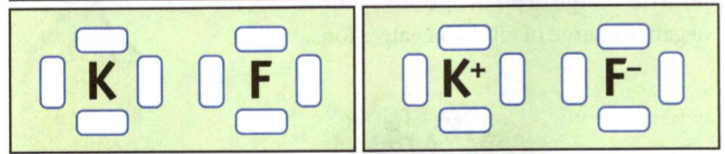
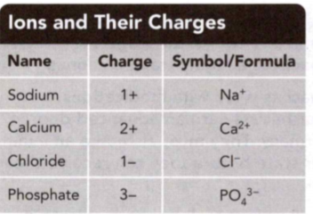

### Physical Science
°
## Chemistry

## 4 Atoms and Bonding

### Getting Started   

#### Check Your Understanding
1. Read the paragraph below and then answer the question. 
The melting point of a substance is the temperature at which the substance changes from a
solid to a liquid. A solid has a definite shape and a definite volume. Marcy
fills an ice cube tray with water and places it in a freezer. The temperature in
the freezer is -18°C, which is lower than the melting point of water (0°C). When
Marcy opens the freezer a few hours later, she finds that the water has frozen
into solid ice cubes. 
What will happen to an ice cube if it is left outside on
a warm, sunny day? Explain.

**Complete the tasks below.**  

1. High-use academic words are words you are likely to encounter while reading. 
Look for the following words in context as you read this chapter.

- stable:	adj. not easily or quickly changed	
from one state to another 
Gold is a stable metal that	does not rust or tarnish.

- symbol	n. a written sign that stands for
something else.	The symbol for the element oxygen is O.

Choose the word that best completes the sentence.
a) The letter H is the ___ for hydrogen.
b) Platinum jewelry lasts a long time because the metal is very ___

### Chapter Preview

LESSON 1
- valence electron 
- electron dot diagram  
- chemical bond  

LESSON 2
- ion  
- polyatomic ion ionic bond
- ionic compound 
- chemical formula 
- subscript
- crystal

LESSON 3
- covalent bond 
- molecule
- double bond 
- triple bond
- molecular compound
- nonpolar bond 
- polar bond

LESSON 4
- metallic bond 
- alloy

What Determines an Element's Chemistry?

**Complete the tasks below.**  

Many people enjoy fireworks displays. Did you know that chemistry plays a big
part in the beauty and the noise? The different colors and effects produced
depend on the properties of the elements in the chemical compounds used in each
firework rocket. These compounds produce smoke, color bursts, loud noises, or a
combination of these effects when they are detonated.

The table below lists some elements found in the compounds used in rockets. It
shows the effects these elements produce.

**Element: Effect**  
Strontium: Red color 
Barium: Green color  
Copper: Blue color   
Sodium:	Yellow color  
Magnesium or aluminum: White color  
Potassium or sodium: Whistling sound  
Potassium and sulfur: White smoke  

1. Using what you know about the periodic table, answer the questions below. What
elements do you think were used to produce a red and yellow fireworks display in
the photo? What groups of the periodic table do these elements belong to?

### What Determines an Element's Chemistry?

How do atoms combine to form compounds? The answer has to do with electrons and their energy levels.

**Valence Electrons** The number of protons in a neutral atom equals the number
of electrons. The electrons of an atom are found in different energy levels.
Electrons at higher energy levels have higher amounts of energy. The valence
electrons of an atom are those electrons that have the highest
energy. Valence electrons are involved in chemical bonding. **The number of
valence electrons in each atom helps determine the chemical properties of that
element.**

**Electron Dot Diagrams** Each atom of an element has a certain number of
valence electrons. The number of valence electrons is specific to that element.
Different elements can have from 1 to 8 valence electrons. Figure 1 demonstrates
one way to show the number of valence electrons in an element. An electron dot
diagram includes the symbol for the element surrounded by dots. Each dot stands
for one valence electron.

**Bonding** Atoms tend to be more stable if they have 8 valence electrons. Atoms
of neon (Ne), argon (Ar), krypton (Kr), and xenon (Xe) have 8 valence electrons.
These elements are nonreactive, or stable. Helium (He) is stable with 2
electrons.

Atoms tend to form bonds so that they have 8 valence electrons and become more
stable. Hydrogen needs only 2 to be stable. When atoms bond, valence electrons
may be transferred from one atom to another. Or they may be shared between the
atoms. A chemical bond is the force of attraction that holds atoms together as a
result of the rearrangement of electrons between them.

**Complete the tasks below.**  

  <figure>
    
    <figcaption>Figure 1. In electron dot diagrams.</figcaption>
  </figure>

1. In electron dot diagrams the valence electrons of an atom are shown as dots
around the symbol of the element. Complete the electron dot diagram for neon in Figure 1 by
drawing the correct number of dots.

  <figure>
    
    <figcaption>Figure 2. Periodic table of the Elments.</figcaption>
  </figure>

2. What is the number of valence electrons for each group:
a) Group 1, Alkali metals
b) Group 2, Alkaline Earth metals
c) Group 14 Carbon family
d) Group 18 Nobel gases

### Applying the Periodic Table  
The periodic table is shown in Figure 2. It gives
you information about the valence electrons in atoms. The table is organized
into rows, called periods, and columns, called groups. The atomic number of an
element is the number of protons in each atom of that element.  

The elements in the periodic table are in order by increasing atomic number. The
number of valence electrons increases from left to right across each period.
Each period begins with an element that has 1 valence electron. Except for
Period 1, a given period ends with an element that has 8 valence electrons. This
repeating pattern means that the elements within a group (except for Period 1)
always have the same number of valence electrons. As a result, the elements in
each group have similar properties.

Each element in Periods 2 and 3 has one more valence electron than the element
to its left. Group 1 elements have 1. Group 2 elements have 2. Group 13 elements
have 3 valence electrons. Group 14 elements have 4, and so on. (Elements in
Groups 3 to 12 follow a slightly different pattern.)

**Complete the tasks below.**  

  <figure>
    
    <figcaption>Figure 3. Periods 2 and 3 with incorrect electron dots.</figcaption>
  </figure>

1. The symbols for the elements in Periods 2 and 3 are shown in Figure 3. The correct
electron dot diagrams are shown for only half of the elements.
a) Complete the electron dot diagrams for nitrogen, oxygen, fluorine, sodium,
magnesium, aluminum, silicon, and argon.
b) Fluorine (F) and Chlorine (CI) are in Group ___ .
c) A fluorine atom has ___	valence electrons.
d) A chlorine atom has	___ valence electrons.
e) How many valence electrons does a bromine (Br) atom have?

### Noble Gases 
The Group 18 elements are the noble gases. Atoms of the noble gases
have 8 valence electrons, except for helium, which has 2. Atoms with 8 valence
electrons (or 2, in the case of helium) are stable. They are unlikely to gain or
lose electrons or to share electrons with other atoms. Noble gases do not react
easily with other elements. Some don't react at all. But, chemists have been
able to make some noble gases form compounds with a few other elements.

**Complete the tasks below.**  

1. Use the word stable to explain why the alkali metals tend to lose 1 valence electron.

### Metals 
The metals are the elements in the blue section of the periodic table in
Figure 2. Metal atoms react by losing their valence electrons. In general, the
reactivity of a metal depends on how easily its atoms lose valence electrons.
The reactivity of metals decreases from left to right across the periodic table.

At the far left side of the periodic table is Group 1, the alkali metals. Each
alkali metal is the most reactive element in its period. Atoms of the alkali
metals have 1 valence electron. Except for lithium (Li), when a Group 1 atom
loses an electron, it is left with a stable arrangement of 8 electrons in the
highest energy level. These electrons are in a lower energy level than the 1
valence electron that was lost. (Lithium atoms are left with a stable
arrangement of 2 electrons.) The alkali metals are so reactive that they can
cause an explosion when added to water!

### Nonmetals 
The elements in the orange section of the periodic table in Figure 2 are the
nonmetals. Nonmetal atoms become stable when they gain or share enough electrons
to have 8 valence electrons. (Hydrogen atoms are left with a stable arrangement
of 2 electrons.)  
The nonmetals usually combine with metals by gaining electrons. Nonmetals can
also combine with other nonmetals and metalloids by sharing electrons.  
Atoms of Group 17, the halogens, have 7 valence electrons. A gain of one more
electron gives these atoms a stable 8 electrons. The halogens react easily with
other elements. Figure 4 shows the reaction of bromine (Br), a halogen, with
aluminum (Al).

**Complete the tasks below.**  

  <figure>
    
    <figcaption>Figure 4. Aluminum reacts violently with bromine to produce
aluminum bromide.</figcaption>
  </figure>

1. Reactivity of Bromine. Aluminum reacts violently with bromine to produce
aluminum bromide Figure 4. What would happen if an alkali metal was combined with a
halogen? Explain. 

<figure>
    
    <figcaption>Figure 5.  Table about groups of elements in the periodic table.</figcaption>
  </figure> 

2. Complete the table about groups of elements in the periodic table.  

### Metalloids 
The metalloids lie along the zigzag line in the periodic table,
between the metals and the nonmetals. Atoms of the metalloids can either lose or
share electrons when they combine with other elements. Each metalloid has some
of the properties of metals and some of the properties of nonmetals. Silicon, a
metalloid, is one of the most abundant elements on Earth. It is used to make
computer processor chips.

### Hydrogen 
Hydrogen (H) is placed in Group 1 in the periodic table because it has
1 valence electron, but hydrogen is considered to be a nonmetal. The properties
of hydrogen are very different from the properties of the alkali metals.
Hydrogen shares its electron when forming compounds with other nonmetals to
obtain a stable arrangement of 2 electrons.  

**Complete the tasks below.**  

1. What are valence electrons?  
2. Why do the properties of elements change in a regular way across a period?  
3. Explain the reactivity of the noble gases in terms of valence electrons.  
4. How are the chemical properties of an element determined?  

### Ionic Bonds

### The Periodic Palette
Imagine calling the colors of the rainbow cadmium, chromium, cobalt, and
manganese. These may not sound like the typical colors of the rainbow to you,
but they do to many artists and painters!   
The "colors" listed above are transition metal elements. These metals can form
compounds known as ionic compounds. Many transition metal compounds are brightly
colored. They can be used to make the pigments found in oil, acrylic, and
watercolor paints. For example, cadmium and chromium compounds are used for red,
orange, yellow, or green paints. Cobalt and manganese compounds are used for
blue and violet paints.  

**Complete the tasks below.**  

1. Why are transition metal compounds often used in paint pigments?
2. Some of the compounds used in paint pigments may cause serious health
problems. Do you think that using these types of paints is worth the possible
health risks? Why or why not?  

### How Do Ions Form?
You and a friend walk past a market that sells apples for 40 cents each and
pears for 50 cents each. You have 45 cents and want an apple. Your friend also
has 45 cents but wants a pear. If you give your friend a nickel, she will have
50 cents and can buy a pear. You will have 40 cents left to buy an apple.
Transferring the nickel gets both of you what you want. In a simple way, your
actions model what can happen between atoms. 

### Ions  
An ion is an atom or group of atoms that has an electric charge. **When a
neutral atom loses a valence electron, it loses a negative charge. It becomes a
positive ion. When a neutral atom gains an electron, it gains a negative charge.
It becomes a negative ion.** This is shown in Figure 1.

  <figure>
    
    <figcaption>Figure 6. How ions form.</figcaption>
  </figure>

Metal atoms are likely to lose electrons. These atoms lose enough electrons to
have a stable arrangement of 8 valence electrons at a lower energy level. A
potassium (K) atom easily loses its 1 valence electron to become more stable.
Nonmetal atoms are likely to gain electrons. These atoms gain enough electrons
so that they have 8 valence electrons. A fluorine (F) atom gains 1 electron to
have a stable arrangement of 8 valence electrons.

**Complete the tasks below.**  

1. An atom that loses one of its electrons becomes a positively charged ion. The
atom that gains the electron becomes a negatively charged ion. Complete the
electron dot diagrams for potassium (K) and fluorine (F) before and after the
electron is transferred.

  <figure>
    
    <figcaption>Figure 7. Potassium and flourine.</figcaption>
  </figure>

2. Using Figure 7, explain why the potassium atom becomes positively
charged and the fluorine atom becomes negatively charged.

  <figure>
    
    <figcaption>Figure 8. Common Ions and Their Charges.</figcaption>
  </figure>

### Common Ions 
Figure 8 lists the names of some common ions. Notice that some ions are made of
several atoms. The ammonium ion is made of 1 nitrogen atom and 4 hydrogen atoms.
Ions that are made of more than 1 atom are called polyatomic ions. The prefix
poly- means "many" so polyatomic means "many atoms." Like other ions, polyatomic
ions have an overall positive or negative charge.

### Ionic Bonds 
When atoms that easily lose electrons react with atoms that easily gain
electrons, valence electrons are transferred from one type of atom to another.
The transfer gives each type of atom a more stable arrangement of electrons.
Look at Figure 9 to see how sodium atoms and chlorine atoms react to form sodium
chloride (table salt).

1. The sodium atom has 1 valence electron. The chlorine atom has 7 valence electrons.
2. The valence electron of the sodium atom is transferred to the chlorine atom. Both atoms become ions. The sodium atom becomes a positive ion (Na+). The chlorine atom becomes a negative ion (Cl-).
3. Oppositely charged particles attract, so the positive Na+ ion and the
negative Cl- ion attract. An **ionic bond** is the attraction between two oppositely
charged ions. The resulting compound is called an **ionic compound**. It is made up
of positive and negative ions. In an ionic compound, the total positive charge
of all the positive ions equals the total negative charge of all the negative
ions.

  <figure>
    
    <figcaption>Figure 9. Steps of formation of an Ionic Bond.</figcaption>
  </figure>

**Complete the tasks below.**  

1. Complete the electron dot diagrams in Figure 9 for the sodium and chlorine atoms and their ions.
2. Why is potassium iodide electrically neutral?  
3. An atom that loses a valence electron becomes a (positive/negative) ion.  
4. An atom that gains a valence electron becomes a (positive/negative) ion.   
5.  Write the symbols for the ions that form when potassium and
iodine react to form the ionic compound potassium iodide.

### How Are the Formulas and Names of Ionic Compounds Written?  

You will often see a compound represented by its chemical formula. A chemical
formula is a group of symbols that shows the ratio of elements in a compound.
The formula for magnesium chloride is MgCl2. What does this formula tell you?

### Formulas of Ionic Compounds 

When ionic compounds form, the ions combine to balance the charges on the ions. The chemical formula for the compound reflects this balance. Look at the formula for magnesium chloride.

<figure>
    
    <figcaption>Figure 10. Formula for magnesium chloride.</figcaption>
  </figure>

Figure 10 shows that the charge on the magnesium ion is 2+. The charge on each
chloride ion is 1 -. Two chloride ions balance the charge on the magnesium ion.
The number "2" in the formula is a subscript. Subscripts tell the ratio of
elements in a compound. The ratio of magnesium ions to chloride ions in MgCl2 is 1 to 2.

**To write the formula for an ionic compound, write the symbol of the positive ion and then the symbol of the negative ion. Add the subscripts that are needed to balance the charges.**

If no subscript is written, it is understood that the subscript is 1. The formula NaCl tells you that there is a 1-to-1 ratio of sodium ions to chloride ions. Formulas for compounds of polyatomic ions are written in a similar way. Calcium carbonate has the formula CaCO3. There is one calcium ion (Ca2+) for each 
carbonate ion (CO32-).

**Complete the tasks below.** 

1. Choose the word that best completes the following sentence. Mg is the ___ for magnesium.
2. CaCO3 	
Corals make calcium carbonate, which helps protect them. When coral dies, its
calcium carbonate shell remains and adds structure to the reef. Circle the part
of the formula representing the carbonate ion. Then identify the charge of each
ion in the compound.  

### Naming Ionic Compounds   
Magnesium chloride, sodium bicarbonate, sodium oxide—where do these names come
from? **For an ionic compound, the name of the positive ion comes first,
followed by the name of the negative ion.** The name of the positive ion is
usually the name of a metal. But, a few positive polyatomic ions exist, such as
the ammonium ion (NH4+). If the negative ion is a single element, the end of its
name changes to -ide. For example, MgO is named magnesium oxide. If the negative
ion is polyatomic, its name usually ends in -ate or -ite. Ammonium nitrate
(NH4NO3) is a common fertilizer for plants

Calcium oxide (CaO), also known as lime, gives off a white light when heated.
Theaters once used special lamps to focus this bright light on a single actor.
So, the expression in the limelight describes a person who receives favorable
attention.
 

**Complete the tasks below.**  

1. Chemists refer to compounds by either their names or their chemical formulas.
Use the periodic table and Figure 8 to fill in the table.

 <figure>
    
    <figcaption>Figure 11. Chemical formulas.</figcaption>
  </figure>

2. The formula for sodium sulfide is Na2S. Explain what this formula means.

3. Write the formula for calcium chloride. Explain how you determined this formula.

### Halite
The ions in ionic compounds are arranged in specific three-dimensional shapes called crystali. Some crystals have a cubic shape, like these crystals of halite, or sodium chloride.  

 <figure>
    
    <figcaption>Figure 12. Halite.</figcaption>
  </figure>

### What Are Properties of Ionic Compounds?  

Compounds have properties that are different from their component elements. You have already read about the properties of metals and nonmetals, but what are the properties of the ionic compounds that form when metals
and nonmetals react?	**In general, ionic compounds
form hard, brittle crystals that have high melting points. They conduct electric current when dissolved in water or melted.**  

### Ionic Crystals 

Ionic compounds form solids by building up repeating patterns of
ions. Figure 12 shows a chunk of halite, which is how sodium chloride occurs
naturally. Pieces of halite have a cubic shape. Equal numbers of Na+ and Cl- ions in
halite are attracted in an alternating pattern, as shown in the diagram. The
ions form an orderly, three-dimensional arrangement called a **crystal**.   

Every ion
in an ionic compound is attracted to ions of an opposite charge that surround
it. The pattern formed by the ions is the same no matter what the size of the
crystal. In a single grain of salt, the crystal pattern extends for millions of
ions in every direction. Many crystals of ionic compounds are hard and brittle.
This is due to the strength of their ionic bonds and the attractions among all
the ions.

### High Melting Points 

The ions in the crystal have to break apart for an ionic compound to melt. It takes a huge amount of energy to separate the ions in a crystal, because the attraction between the positive and negative ions is so great. As a result, ionic compounds have very high melting points. The melting point of sodium chloride is 801°C.

**Complete the tasks below.** 

1. Galena, or lead sulfide (PbS), has a structure similar to that of table salt.
a) The chemical formula of lead sulfide tells you that it contains	___ 52- ion(s) for every Pb2+</sup+ ion.
b) What holds the ions together in galena?

  <figure>
    
    <figcaption>Figure 13. Gelena.</figcaption>
  </figure>

c) If the pattern of ions shown in Figure 13 for galena is expanded in every direction, how many sulfide ions would surround each lead ion? 	

d) How many lead ions would surround each sulfide ion? 

2. Electric current can be conducted through a pickle because pickles contain salt
water. After a time, the pickle becomes hot and begins to glow. What ions are present in solution inside the pickle?
3. Ionic bonds are strong enough to cause almost all ionic compounds to be at
room temperature.   
4. Solid table salt does not conduct electric current. How
does dissolving salt in water allow electric current to flow?

### Electrical Conductivity

Electric current is the flow of charged particles. When ionic crystals dissolve
in water, the ions are free to move about, and the solution can conduct current.
Likewise, when an ionic compound melts, the ions are able to move freely, and
the liquid conducts current. In contrast, ionic compounds in solid form do not
conduct current well. The ions in the solid crystal are tightly bound to each
other and cannot move from place to place. If charged particles cannot move,
there is no current.  

### Covalent Bonds   

How Are Atoms Held Together in a Covalent Bond?   
What Are Properties of Molecular Compounds?   
How Do Bonded Atoms Become Partially Charged? 

### Sticky Feet
Have you ever seen a gecko climbing up a wall or running across a ceiling? Geckos seem to defy gravity. They have tiny hairs that cover the pads of their feet. These hairs branch out into hundreds of smaller structures, called spatulae. When a gecko climbs a wall, billions of spatulae on its feet come into contact with
the surface. Scientists believe that geckos can	,
stick to surfaces because of the billions of small attractive forces, called van der Waals forces, between the molecules of the spatulae and the molecules on the surface. Now, scientists are developing adhesives that can copy the characteristics of the spatulae. 

**Complete the tasks below.** 

1. Why is it important that billions of spatulae come into contact with the surface the gecko is climbing?

2. What uses do you think you could find for an adhesive that works like the gecko's foot?

### How Are Atoms Held Together in a Covalent Bond?  
You and a friend walk past a bakery that sells giant chocolate chip cookies for
one dollar each. But each of you has only 50 cents. If you combine your money,
you can buy a cookie and split it. So, you can afford a cookie by sharing your
money. Similarly, 2 atoms can form a bond by sharing electrons. The chemical
bond formed when 2 atoms share electrons is called a **covalent bond**. Covalent
bonds usually form between nonmetal atoms. Ionic bonds usually form when a metal
combines with a nonmetal.
 

### Electron Sharing 
Nonmetals can bond to other nonmetals by sharing electrons. Atoms of some
nonmetals can bond with each other. Figure 1 shows how 2 fluorine atoms can
react by sharing a pair of electrons. By sharing electrons, each fluorine atom
is surrounded by 8 valence electrons. **The attractions between the shared
electrons and the protons in the nucleus of each atom hold the atoms together in
a covalent bond.** The 2 bonded fluorine atoms form a molecule. A molecule is a
neutral group of atoms joined by covalent bonds.

  <figure>
    
    <figcaption>Figure 14. Sharing Electrons By sharing 2 electrons in a covalent bond, each fluorine atom gains a stable set of
8 valence electrons.</figcaption>
  </figure>

**Complete the tasks below.** 

1. Circle the shared electrons that form a covalent bond between the 2 fluorine
atoms in Figure 14. 
2. Draw electron dot diagrams to show how 2 iodine atoms
bond together to form a molecule.

 <figure>
    
    <figcaption>Figure 15. Covalent Bonds. Atoms can form single, double, and triple covalent bonds by sharing one or more pairs of electrons.
</figcaption>
  </figure>

### How Many Bonds? 
Look at the electron dot diagrams in Figure 15. Count the valence electrons
around each hydrogen and oxygen atom. Hydrogen has 1 valence electron. Oxygen
has 6 valence electrons. In a water molecule, oxygen forms one covalent bond
with each of 2 hydrogen atoms. As a result, the oxygen atom has a stable
arrangement of 8 valence electrons. Each hydrogen atom forms one bond because it
needs only 2 electrons to be stable.  

Look at the electron dot diagram of the oxygen molecule (O2) in
Figure 15. This time the 2 atoms share 2 pairs of electrons, forming a double
bond. Atoms of some elements, such as nitrogen, can share 3 pairs of electrons,
forming a triple bond. The electron dot diagram for the nitrogen molecule
(N2) is also shown in Figure 14.

**Complete the tasks below.**  

1. In a carbon dioxide (CO2) molecule, the carbon atom forms a double bond with each of the 2 oxygen atoms. Draw the electron dot diagram for carbon dioxide below.   

### What Are Properties of Molecular Compounds?
Water, oxygen, and sucrose (table sugar, C12H22O11) are all examples of
molecular compounds. A molecular compound is a compound that is made up of
molecules. The molecules of a molecular compound contain atoms that are
covalently bonded. Ionic compounds are made up of ions and do not form
molecules.
**Unlike ionic compounds, molecular compounds usually do not conduct electric
current when melted or dissolved in water. Also, compared to ionic compounds,
molecular compounds generally have lower melting points and boiling points.**

### Poor Conductivity 
Most molecular compounds do not conduct electric current. Molecular compounds do
not contain charged particles that are available to move, so there is no
current. Have you ever noticed that some wires are insulated with plastic or
rubber? These materials are made up of molecular compounds. Even as liquids,
molecular compounds are poor conductors. Pure water does not conduct electric
current. Neither does table sugar when it is melted or dissolved in pure water.  

### Low Melting Points and Boiling Points
Forces hold the molecules close to one another in a molecular solid. But the
forces between molecules are much weaker than the forces between ions. Compared
with an ionic solid, less heat must be added to a molecular solid to separate
the molecules and change it from a solid to a liquid. For example, table salt
melts at 801°C, but table sugar melts at about 190°C.

 
**Complete the tasks below.**   

1. Wires, such as the ones found on your headphones, are insulated with plastic or rubber to prevent electric current from flowing between the wires. The insulation also allows you to touch the wires without being shocked or electrocuted.
What are some other objects that have insulated wires?

2. Molecular and Ionic Compounds. The table in Figure 16 shows the melting points and boiling points of a few molecular compounds and ionic compounds.

 
  <figure>
    
    <figcaption>Figure 16. The melting points and boiling points of a few molecular compounds and ionic compounds.</figcaption>
  </figure>

a) In the space below in Figure 17, draw a bar graph of the melting points of these compounds. Arrange the bars in order of increasing melting point. Label each bar with the chemical formula of the compound.

  <figure>
    
    <figcaption>Figure 17. Label each bar.</figcaption>
  </figure>

b) The melting points of molecular compounds are (lower/higher) than those of ionic compounds.
c) The boiling points of molecular compounds are (lower/higher) than those of ionic compounds.
d) Ammonia (NH3) has a melting point of —78°C and a boiling point of —34°C. These data suggest that ammonia is a(n) (molecular/ionic) compound.

### How Do Bonded Atoms Become Partially Charged?

Have you ever played tug-of-war? If you have, you know that when one team pulls
the rope with more force than the other team, the rope moves toward the side of
the stronger team. The same is true of electrons in a covalent bond. Atoms of
some elements pull more strongly on the shared electrons of a covalent bond than
do atoms of other elements. As a result, the electrons are shared unequally.
**Unequal sharing of electrons causes covalently bonded atoms to have slight
electric charges**.

### Nonpolar Bonds and Polar Bonds   
If 2 atoms pull equally on the electrons, neither atom becomes charged. This
happens when identical atoms are bonded. A covalent bond in which electrons are
shared equally is a nonpolar bond. The hydrogen molecule (H2) shown in Figure 18
has a nonpolar bond. When electrons in a covalent bond are shared unequally, the
atom with the stronger pull gains a slightly negative charge. The atom with the
weaker pull gains a slightly positive charge. A covalent bond in which electrons
are shared unequally is a polar bond. Hydrogen fluoride (HF), also shown in
Figure 18, has a polar bond.

  <figure>
    
    <figcaption>Figure 18. Nonpolar and Polar Bonds Hydrogen forms a nonpolar bond with another hydrogen
 atom. In hydrogen fluoride, fluorine attracts electrons more strongly than
 hydrogen does. The bond formed is polar.
</figcaption>
  </figure>

**Complete the tasks below.**   

1. In a nonpolar bond electrons are shared (equally/unequally). 
2. In a polar bond electrons are shared (equally/unequally).

<figure>
  
  <figcaption>Figure 19. Nonpolar Bonds and Polar Bonds.</figcaption>
</figure>

3. Nonpolar and Polar Molecules in Figure 19. Both carbon dioxide and water molecules contain
polar bonds. However, only water is a polar molecule. Draw a positive (+) sign
next to the atoms that gain a slight positive charge. Draw a negative (-) sign
next to the atoms that gain a slight negative charge.

### Polar Bonds in Molecules 
A molecule is polar if it has a positively charged end
and a negatively charged end. However, not all molecules containing polar bonds
are polar overall. In a carbon dioxide molecule, the oxygen atoms attract
electrons more strongly than the carbon atom does. The bonds between the oxygen
and carbon atoms are polar. But, as you can see in Figure 18, a carbon dioxide
molecule has a straight-line shape. The two oxygen atoms pull with equal
strength in opposite directions. The attractions cancel out, so the molecule is
nonpolar.   

A water molecule, with its two polar bonds, is itself polar. As you
can see in Figure 18, a water molecule has a bent shape. The two hydrogen atoms
are at one end of the molecule. The oxygen atom is at the other end of the
molecule. The oxygen atom attracts electrons more strongly than do the hydrogen
atoms. As a result, the end of the molecule with the oxygen atom has a slight
negative charge. The end of the molecule with the hydrogen atoms has a slight
positive charge.

**Complete the tasks below.**   

1. Water is an example of a(n) (ionic/molecular) compound.  
2. This type of bond forms when ___ .
3. Properties of these compounds include ___ .   

### Attractions Between Molecules  
Opposite charges attract. Polar molecules are connected to each other by weak
attractions between their slight negative and positive charges. These
attractions are called van der Waals forces. The negatively charged oxygen ends
of the polar water molecules attract the positively charged hydrogen ends
of'nearby water molecules. Van der Waals forces pull water molecules toward each
other. They are also the reason a gecko's feet can grip onto smooth surfaces,
such as glass.

The properties of polar and nonpolar compounds are different because of
differences in attractions between their molecules. The melting point and
boiling point of water are much higher than the melting point and boiling point
of oxygen. The attractions between the polar water molecules require more energy
to overcome than the attractions between the nonpolar oxygen molecules.

**Complete the tasks below.**  

1. What type of bonds are formed when atoms share electrons unequally?  
2. Would carbon dioxide or water have a higher boiling point?  
3. How can bonding determine the properties of a substance?
4. Sodium Chloride (NaCI) is an example of a(n) (ionic/molecular) compound.  
5. This type of bond forms when ___ .
6. Properties of these compounds include ___ .

### Bonding in Metals   

### Superconductors 

In 1911, physicist Heike Kamerlingh Onnes made a remarkable
discovery. When he cooled mercury to —269°C (4 kelvins), the mercury no longer
resisted the flow of electric current! The cooled mercury became the world's
first superconductor. A superconductor is a material that has no resistance to
the flow of electric current.  

Certain metals and alloys become superconductors
as they are cooled to very low temperatures. This means they can carry electric
currents for long periods of time without losing energy as heat. Superconductors
can also be used to produce very powerful magnetic fields. These magnetic fields
can be used to levitate and move high-speed trains.

**Complete the tasks below.**  

1. How is a superconductor different from a regular conductor?
2. Power lines lose 10 to 15 percent of the electric current they carry to heat. Why might scientists want to create superconducting power lines?
3. What Is the Structure of a Metal Crystal?   
4. What Are Properties of Metals?  

### What Is the Structure of a Metal Crystal?  

The properties of solid metals can be explained by the structure of metal atoms
and the bonding among those atoms. When metal atoms combine chemically with
atoms of other elements, they usually lose valence electrons. They then become
positively charged metal ions. Metal atoms lose electrons easily because they do
not hold onto their valence electrons very strongly.  

The loosely held valence
electrons in metal atoms result in a type of bonding that happens in metals.
Most metals are crystalline solids. **A metal crystal is composed of closely
packed, positively charged metal ions**. The valence electrons drift among the
ions. Each metal ion is held in the crystal by a metallic bond - an attraction
between a positive metal ion and the electrons surrounding it. Figure 20
illustrates the metallic bonds that hold together aluminum foil.
 
  <figure>
    
    <figcaption>Figure 20. Metallic Bonding.</figcaption>
  </figure>
 

**Complete the tasks below.**

1. Metallic bonding Figure 20. The positively charged metal ions are embedded in
a "sea" of valence electrons. Why would nonmetals be unlikely to have the type
of bonding shown here?

### What Are Properties of Metals?   

You know a piece of metal when you see it. It's usually hard, dense, and shiny.
Almost all metals are solids at room temperature. They can be hammered into
sheets or drawn out into thin wires. Electronics such as stereos, computers, and
MP3 players have metal parts because metals conduct electric current. Metallic
bonding explains many of the common physical properties of metals.

Properties of metals include a shiny luster, and high levels of malleability,
ductility, electrical conductivity, and thermal conductivity. Each of these
properties is related to the behavior of valence electrons in metal atoms.

Luster Some of the parts of the motorcycle shown in Figure 2 are covered in
chromium, which is shiny. Polished metals have a shiny and reflective luster,
called metallic luster. The luster of a metal is due to its valence electrons.
When light strikes these electrons, they absorb the light and then re-emit the
light.

### Malleability and Ductility   

Metals are ductile. They can be bent easily and pulled into thin strands or
wires. Metals are also malleable. They can be rolled into thin sheets, as with
aluminum foil, or beaten into complex shapes. Metals act this way because the
positive metal ions are attracted to the loose electrons all around them rather
than to other metal ions. These ions can be made to change position. However,
the metallic bonds between the ion and the surrounding electrons keep the metal
ions from breaking apart from one another.

### Thermal Conductivity  

Thermal energy is the total energy , of motion of all the particles in an
object. Thermal energy flows from warmer matter to cooler matter. The greater
energy of the particles in the warmer parts of the material is transferred to
the particles in the cooler parts. This transfer of thermal energy is known as
heat. Metals conduct heat easily because the valence electrons within a metal
are free to move. Electrons in the warmer part of the metal can transfer energy
to electrons in the cooler part of the metal.

### Electrical Conductivity   

Charged particles that are free to move can conduct an electric current. Metals
conduct electric current easily because the valence electrons in a metal can
move freely among the atoms. Electrical wires are made out of metal. Circuit
boards, such as the one shown in Figure 21, contain metal strips that conduct
electric current throughout the circuit.  

  <figure>
    
    <figcaption>Figure 21. Metal strips on a circuit board inside this arduino board conduct electric current throughout the circuit.</figcaption>
  </figure>

**Complete the tasks below.**   

1. Many objects that are made out of metal take advantage of one or more properties of metals.
In Figure 22 choose the physical property listed below for the object or objects you think best exhibit that particular property.
Luster, Malleability, Ductility, Thermal Conductivity, Electrical Conductivity,

  <figure>
    
    <figcaption>Figure 22. Choose the physical property.</figcaption>
  </figure>

2. Name an example of a metal object that shows both luster and malleability.

### Alloys 

Very few of the "metals" you use every day are made up of just one element. Most
of the metallic objects you see and use are made of alloys. An alloy is a
mixture made of two or more elements, at least one of which is a metal. Alloys
are generally stronger and less reactive than the pure metals from which they
are made. Pure gold is shiny, but it is soft and easily bent. For that reason,
gold jewelry is made of an alloy of gold mixed with a harder element, such as
copper or silver. Gold alloys are much harder than pure gold but still retain
its beauty and shine. 

Iron is a strong metal, but iron objects rust when they
are exposed to air and water. For this reason, iron is oft-alloyed with one or
more other elements to make steel. Objects made of iron alloys are much stronger than iron and resist
rust much better. Forks and spoons made of stainless steel can be washed over
and over again without rusting. That's because stainless steel - an alloy of
iron, carbon, nickel, and chromium - does not react with air and water as iron
does.

**Complete the tasks below.**   

1. What accounts for the properties of metals?
2. Explain why metals are good conductors of electric current.
3. Why is it safer to use a nonmetal mixing spoon when cooking something on the stove?
4. Compared to molecular compounds, ionic compounds have ___  melting points.
5. Ionic compounds conduct electric current when ________________ .

### Summary

- The number of valence electrons in each atom of an element helps determine the chemical properties of that element.
- When a neutral atom loses or gains a valence electron, it becomes an ion.
- For an ionic compound, the name of the negative ion follows the name of the positive ion.
- Ionic compounds have high melting points.
- Attractions between the shared electrons and the protons in the nucleus of each atom hold the atoms together in a covalent bond.
- Molecular compounds have low melting points and do not conduct electric current.
- Unequal sharing of electrons causes bonded atoms to have slight electric charges.
- A metal crystal is composed of closely packed, positively charged metal ions. The valence electrons drift among the ions.
- Properties of metals include a shiny luster, and high levels of malleability, ductility, electrical conductivity, and thermal conductivity.

**Complete the tasks below.**   

1. An electron dot diagram shows an atom's number of
a) protons.	
b) electrons.
c) valence electrons. 
d) chemical bonds.

2. When atoms react, they form a chemical bond, which is defined as	___ .

  <figure>
    
    <figcaption>Figure 23. Elements.</figcaption>
  </figure>

3. Consider the diagrams in Figure 23.
a) Which of these elements can become stable by losing 1 electron? Explain.
b) Which of these elements is least likely to react with other elements? Explain.

4. Go to your local grocery store and observe how the products on the shelves
are organized. Write a paragraph comparing how food products are organized in a
grocery store and how elements are organized in the periodic table.

5. When an atom loses or gains electrons, it becomes a(n)
a) ion.	
b) formula.
c) crystal.	
d) subscript.

6. Magnesium chloride is an example of an ionic compound, which is a compound composed of ______ .

7. Based on their chemical formulas, which of these compounds is not likely to
   be an ionic compound: KBr, SO2, or AlCl3? Explain your answer.

8. Use the periodic table to find the number of valence electrons for calcium
   (Ca), aluminum (Al), rubidium (Rb), oxygen (0), sulfur (S), and iodine (I).
   Then use that information to predict the formula for each of the following
   compounds: calcium oxide, aluminum iodide, rubidium sulfide, and aluminum
   oxide.
9. Pretend that you are the size of an atom and you are observing a reaction
    between a potassium ion and a fluorine atom. Describe how an ionic bond
    forms as the atoms react. Tell what happens to the valence electrons in each
    atom and how each atom is changed by losing or gaining electrons.

10. A covalent bond in which electrons are shared equally is called a 
a) double bond. 
b) triple bond. 
c) polar bond. 
d) nonpolar bond.

11. The formulas N2  , H2O, and CO2 all represent molecules, which are defined as _________ .
12. A carbon atom can form four covalent bonds. How many valence electrons does a carbon atom have?
13. Identify each molecule in Figure 24 as either a polar molecule or a nonpolar molecule. Explain your reasoning.

  <figure>
    
    <figcaption>Figure 24. Oxygen & Carbon dioxide molecules.</figcaption>
  </figure>

14. The metal atoms in iron are held together by
a) ionic bonds.	
b) polar bonds.
c) covalent bonds.	
d) metallic bonds.

15. Polished metals have a metallic luster, which means that ____ .
16. Why does an aluminum horseshoe bend but not break when a blacksmith pounds it into shape with a hammer?
17. An ice cube and a scoop of table salt are left outside on a warm, sunny day. Explain why the ice cube melts and the salt does not.

  <figure>
    
    <figcaption>Figure 25. Ions and Their Charges.</figcaption>
  </figure>

18. The table in Figure 25 lists some ions and their charges.
How many sodium ions are needed to balance the charge of one phosphate ion?
A) 1
B) 2 
C) 3
D) 4

19. The chemical formula for a glucose molecule is C6H12O6. The subscripts represent the
A) mass of each element.
B) number of atoms of each element in a glucose molecule. 
C) total number of bonds made by each atom.
D) number of valence electrons in each atom.

20. Elements that have the same number of valence electrons are
A) within the same group of the periodic table.
B) within the same period of the periodic table. 
C) called noble gases.
D) called metalloids. 

21. When an atom loses an electron, it
A) becomes a negative ion.
B) becomes a positive ion.
C) forms a covalent bond.
D) gains a proton.

22. All of the following are characteristics that result from metallic bonding except
A) the tendency to form hard, brittle crystals.
B) the ability to conduct electric current. 
C) the ability to be hammered into sheets.
D) luster.

  <figure>
    
    <figcaption>Figure 26. Electron dot diagrams.</figcaption>
  </figure>

23. Use the electron dot diagrams in Figure 26 to help you answer this question. Predict the formula for the compounds, if any, that would form from each of the following combinations of elements: magnesium and fluorine, aluminum and sulfur, and potassium and neon. If a compound is unlikely to form, explain the reason why.

### Pharmacists

Interested in science—specifically in chemistry? Your local drugstore pharmacist
is a highly trained chemist. Pharmacists work with medications. All pharmacists
earn an advanced degree in pharmacy. They must also take an exam in their state
before they can receive their license. 

Retail pharmacists dispense medications
from behind a pharmacy counter at a drugstore. They work with customers to make
sure the customers' medications are safe for them to take. This means knowing
how medications interact with each other, and which are safe to take at the same
time. 

But drugstore pharmacies aren't the only places you'll find pharmacists.
Research pharmacists develop and test new medications in labs. These medicines
may improve and save lives, lives of people you know.

### The superhero of glues

It bonds instantly to put together a broken dish, close a hole in a fish's skin,
or stick a ton of concrete to a metal beam! Magic? No, it's cyanoacrylate, a
special glue. Just three square centimeters of cyanoacrylate can hold more than
one ton of just about anything to any surface.   

Cyanoacrylate (C5H5NO2(l)) forms
strong bonds when it comes into contact with hydroxide ions (OH-(g)), found in
water. Almost the moment you squeeze it out of the tube, the adhesive comes into
contact with water vapor in the air and hardens, changing from liquid to solid.  

Cyanoacrylate's powerful electron-attracting groups form chains of molecules,
linked together. These chains form a rigid, plastic net that holds any molecules
it comes into contact with! You have one super sticky situation.

**Complete the tasks below.** 

Design a cartoon strip explaining how the cyanoacrylate molecule forms chains to produce super bonds.

### Sci-Fi Metal

Scientists in California have produced an amorphous, or glassy, metal that acts
like plastic but is stronger than titanium. To produce the metal, elements are
mixed and melted together, and then cooled very quickly. 

A glassy metal is
stronger than other metals because its atoms do not cool into a crystalline
pattern. Instead, it has a random arrangement of atoms, which makes it able to
transfer energy faster and last longer than other metals. 
NASA has used amorphous metal, which has a mirrored surface, to make solar wind collector tiles.

**Complete the tasks below.** 

Research the advantages and disadvantages of using glassy metals. What impact might
glassy metals have on industry and society?

### How do bees make honey?

How is matter conserved in a chemical reaction? Honeybees drink nectar from
flowers. They store the nectar in a honey sac found inside their bodies. Nectar
begins changing into honey in the honey sac. Nectar is mostly water, which
evaporates during the honey-making process. 

After collecting nectar, the
honeybees return to the hive where they spit the nectar into the mouths of house
bees. Chemicals in the mouths of the house bees continue changing the nectar
into honey until it is ready to be stored in the honeycomb.

**Complete the tasks below.** 

Explain why the amount of nectar that bees collect is larger than the amount of honey they produce.

