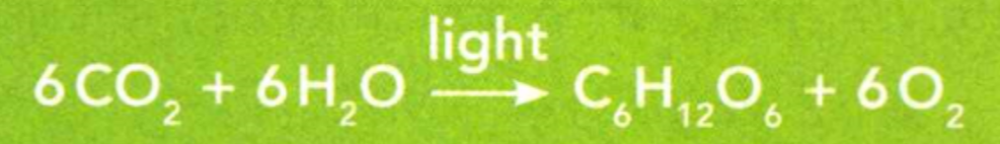

### Physical Science
°
## Chemistry

## 5 Chemical Reactions

An ionic compound consists of positive and negative ions. Mass is the amount of
material in an object. A chemical formula shows the ratio of elements in a
compound.

**Complete the tasks below.**   

1. Alex is doing an experiment to see how vinegar reacts with ionic compounds.
He measures the mass of a sample of baking soda. Alex records the measurement in
his lab book next to the chemical formula for baking soda, NaHCO<sub>3</sub>. Which
substance is an ionic compound in the experiment that Alex is conducting?

#### matter

Everyday Meaning:
a subject of discussion, concern, or action
Example: We had an important
matter to discuss in the meeting.

Scientific Meaning:
anything that has mass and takes up space   
Example: Solids, liquids, and gases are states of matter.


#### product

Everyday Meaning:
anything that is made or created Example: Milk and cheese are dairy products.

Scientific Meaning:
a substance formed as a result of a chemical reaction
Example: In a chemical reaction, substances can combine or split up to form products.


**Complete the tasks below.**   

1. Which sentence below uses the scientific meaning of the word product.
a) She brought napkins and other paper products to the picnic.
b) Table salt is the product of the reaction of sodium and chlorine.


### Chapter Preview


LESSON 1
- physical change
- chemical change
- reactant
- product
- precipitate
- exothermic reaction
- endothermic reaction

LESSON 2
- chemical equation
- law of conservation of mass
- open system
- closed system
- coefficient
- synthesis
- decomposition
- replacement

LESSON 3
- activation energy
- concentration
- catalyst
- enzyme
- inhibitor


### Observing Chemical Change
- How Can Changes in Matter Be Described?   
- How Do You Identify a Chemical Reaction?  

### Chemistry in the Kitchen
Teen chef Fatoumata Dembele knows that chemical reactions are an important part
of cooking great food. In fact, Fatoumata is so skilled at using chemistry in
the kitchen that she won an award for her recipes.  


Fatoumata knows that to prepare some foods, such as eggs, adding heat is
required. Other foods, such as gelatin, need to have heat removed to taste best.
Fatoumata says you have to keep a close eye on food while it's cooking. A good
chef always pays attention to signs of change. For example, when you cook meat,
the color is what tells you when it's ready. A raw steak is red, but a medium
steak should be dark brown on the outside and pink in the center. Fatoumata
prefers her steak well done. She knows it's ready when the meat is brown all the
way through. For chefs like Fatoumata, there is one particular property that
matters the most. It's the taste!

**Complete the tasks below.**   

1. Energy is required for chemical reactions to take place. What form of energy is used in cooking?   
2. Think of something you've cooked before. What changes did you observe in the food?   

### How Can Changes in Matter Be Described?  
Picture yourself frying an egg. You crack open the shell, and the yolk and egg
white spill into the pan. As the egg heats up, the white changes from a clear
liquid to a white solid. The egg, the pan, and the stove are all examples of
matter. Recall that matter is anything that has mass and takes up space. An
important part of chemistry is describing matter.


### Properties of Matter 
Matter is often described by its characteristics, or properties, and how it
changes. There are two kinds of properties of matter—physical properties and
chemical properties.

How would you describe a penny? It is solid, shiny, and hard. A
physical property is a characteristic of a substance that can be observed
without changing the substance into another substance. The temperature at which
a solid melts is a physical property. Color, texture, density, and conductivity
are other physical properties of matter.

  <figure>
    
    <figcaption>Figure 1. Penny.</figcaption>
  </figure>

A chemical property is a characteristic of a substance that describes its
ability to change into other substances. To observe the chemical properties of a
substance, you must try to change it into another substance. For example, Figure
1B shows a penny that has turned green. This color change demonstrates a
chemical property of the penny's copper coating. When copper is exposed to air,
it reacts over time to form a dull, crusty solid. Another chemical property is a
material's ability to burn in the presence of oxygen. This property is called
flammability.


**Complete the tasks below.**   

1. Which properties
of copper are (reddish color, reacts with oxygen, smooth texture, conducts heat, not flammable)
a) physical properties
b) and which are chemical properties.
c) Add two properties to the list and classify them as physical or chemical.  


### Changes in Matter 

Like properties of matter, there are two types of changes in matter. Changes in
matter can be described in terms of physical changes and chemical changes. A
physical change is any change that alters the form or appearance of a substance
but does not change it into another substance. When you cut an apple in half you
cause a physical change. In a physical change, some of the physical properties
of the material may be altered, but the chemical composition remains the same.
Bending, crushing, and cutting are all physical changes. Changes in the state of
matter, such as melting, freezing, and boiling, are also physical changes.  

Sometimes when matter changes, its chemical composition is changed. For example,
when a cut apple is left out in the air, it turns brown.
Compounds in the apple react with the oxygen in the air to form new compounds. A
change in matter that produces one or more new substances is a chemical change,
or chemical reaction. In a chemical change, the atoms rearrange to form new
substances. When a substance undergoes a chemical change, it results in
different physical properties as well. Burning and rusting are both chemical
changes. Substances that undergo the chemical changes are called reactants. The
new substances that form are the products.


**Complete the tasks below.**  


1. Right or wrong?
a) Paper that has been burned has undergone a chemical change.  
b) Paper that has been torn has undergone a chemical change.  

2. Label the change in each set of pictures in Figure 2 as a physical or chemical change.

  <figure>
    
    <figcaption>Figure 2. Physical or chemical change.</figcaption>
  </figure>


3. Describe how a green leaf will look if it undergoes 
a) a physical change 
b) a chemical change.

### Bonding and Chemical Change   

Chemical changes occur when existing bonds break and new bonds form. As a
result, new substances are produced. Atoms form bonds when they share or
transfer electrons. The reaction pictured in Figure 3 involves both the breaking
of shared bonds and the transfer of electrons.   


  <figure>
    
    <figcaption>Figure 3. Oxygen reacts with Magnesium.</figcaption>
  </figure>

Oxygen gas (O<sub>2</sub>) in the air consists of molecules made up of two
oxygen atoms bonded together. These bonds break when oxygen reacts with
magnesium (Mg) and a new ionic bond forms. The compound magnesium oxide (MgO) is
produced. Magnesium oxide, a white powder, has properties that differ from those
of either shiny magnesium or invisible oxygen gas. For example, while magnesium
melts at 650°C, magnesium oxide melts at 2,800°C.

**Complete the tasks below.**   

1. Describe what happens in Figure 3 to the bonds in each of the steps as oxygen reacts with magnesium.   
2. Identify the type of property (physical/chemical):
a) The freezing point of water.
b) The ability of oxygen to react with iron to cause rust.
3. When silver coins are found in ancient shipwrecks, they are coated with a
black crust. Ask a question that could help you determine whether the silver
underwent a chemical change or physical. Explain.
4. What are two ways of describing changes in matter?


### How Do You Identify a Chemical Reaction?  
How can you tell when a
chemical reaction occurs? Chemical reactions involve changes in properties and
changes in energy that you can often observe.

### Changes in Properties 

One way to detect chemical reactions is to observe changes in the physical
properties of the materials. Changes in properties result when new substances
form. For instance, formation of a precipitate, gas production, and a color
change are all possible evidence that a chemical reaction has taken place. Many
times, physical properties such as texture and hardness may also change in a
chemical reaction.   

Changes in physical properties can be easy to recognize in a
chemical reaction, but what about the chemical properties? During a chemical
reaction, reactants interact to form products with different chemical
properties. For example, sodium (Na) and chlorine (Cl<sub>2</sub>) react to form an ionic
compound, sodium chloride (NaCl). Both reactants are very reactive elements.
However, the product, sodium chloride, is a very stable compound.

  
Many kinds of change provide evidence that a chemical reaction has occurred.

Although you may observe a change in matter, the change does not always indicate
that a chemical reaction has taken place. Sometimes physical changes give
similar results. For example, when water boils, the gas bubbles you see are made
of molecules of water, just as the liquid was. Boiling is a physical change. The
only sure evidence of a chemical reaction is that one or more new substances are
produced.

### Evidence of Chemical Reactions

#### 1 Formation of a Precipitate     

The mixing of two liquids may form a precipitate. A precipitate is a solid that
forms from liquids during a chemical reaction. For example, the precipitate seen
in this curdled milk has formed from the liquids milk and lemon juice.

#### 2 Gas Production
Another observable change is the formation of a gas from solid or liquid reactants. Often, the gas formed can be seen as bubbles.  

#### 3 Color Change
A color change can signal that a new substance has formed. For example, avocados
turn brown when they react with oxygen in the air.  

**Complete the tasks below.**   

1. Precipitation can mean rain, snow, or hail. In chemistry, precipitation is the 
formation of a solid from ____ .
2. Describe how you would test the best method for separating the precipitate
from the liquid in curdled milk.  
3. Bread dough rises from gas bubbles produced when yeast reacts with sugar.
What evidence in a slice of bread shows the presence of gas?
4. Draw or describe evidence of a chemical reaction you have observed in food or
in other types of matter. Label the evidence as a color change, formation of a
precipitate, or gas production.
5. Adding food coloring to water causes a color change. Is this evidence of a
chemical reaction? Explain.


### Changes in Energy    
Recall that a chemical reaction occurs when bonds break and new bonds form.
Breaking bonds between atoms or ions requires energy, while forming bonds
releases energy.


In an **exothermic reaction**, the energy released as the products
form is greater than the energy required to break the bonds of the reactants.
The energy is usually released as heat. For example, some stoves use natural
gas. When natural gas burns, it releases heat. This heat is used to cook your
food. Similarly, the reaction between oxygen and other fuels that produce fire,
such as wood, coal, oil, or the wax of a candle, release
energy in the form of light and heat.

  <figure>
    
    <figcaption>Figure 4. Baking soda.</figcaption>
  </figure>

In an **endothermic reaction**, more energy is required to break the bonds of
the reactants than is released by the formation of the products. The energy can
be absorbed from nearby matter. When energy is absorbed, it causes the
surroundings to become cooler. In Figure 5, baking soda undergoes an endothermic
reaction when it is mixed with vinegar. The reaction absorbs heat from its
surroundings, so the reaction feels cold. Not all endothermic reactions result
in a temperature decrease. Many endothermic reactions occur only when heat is
constantly added, as when you fry an egg. Heat must be applied throughout the
entire process in order for the reactions that cook the egg to continue.


**Complete the tasks below.**   

1. Chemical reactions either absorb energy or release energy. Complete the following tasks.
2. Burning candle and Water in baking sode : How might each reaction feel if you were to put your hands near it?

  <figure>
    
    <figcaption>Figure 5. Temperature vs time.</figcaption>
  </figure>

3. A student adds magnesium oxide to hydrochloric acid. She measures the
temperature of the reaction every minute (Figure 5). Her data are recorded in
the table. 
a) Plot the data from the table onto the graph. Then name the graph.
b) Is the reaction endothermic or exothermic? Explain.
c) In which time interval did the temperature increase the most?

4. What changes in physical properties can be used as evidence that a chemical reaction has occurred?
5. What evidence of a chemical change is observed when rust forms on iron?  
6. How are endothermic and exothermic reactions the same? How are they different?  

### Describing Chemical Reactions  
- What Information Does a Chemical Equation Contain?
- How Is Mass Conserved During a Chemical Reaction? 
- What Are Three Types of Chemical Reactions?

### Lifesaving Reactions
What moves faster than 300 km/h, inflates in less than a second, and saves
lives? An airbag, of course! Did you know that the "air" in an airbag is made by
a chemical reaction? A compound called sodium azide (NaN<sub>3</sub>) breaks down into
sodium metal (Na) and nitrogen gas (N<sub>2</sub>). The nitrogen gas fills the airbag and
cushions the passengers in an accident.  

It's important that the correct amount of sodium azide is used. The mass of
sodium azide in the airbag before the collision will equal the mass of sodium
and nitrogen that is made by the reaction. If too little or too much nitrogen
gas is made, the airbag will not inflate properly.


**Complete the tasks below.**  

1. What might happen if an airbag doesn't contain the correct amount of sodium azide?


### What Information Does a Chemical Equation Contain?
Cell phone text messages use symbols and abbreviations to express ideas in shorter form. A type of shorthand is used in chemistry, too. A **chemical equation** is a way to show a chemical reaction, using symbols instead of words. Chemical equations are shorter than sentences, but they contain plenty of information. In chemical equations, chemical formulas and other symbols are used to summarize a reaction.

### Formulas in an Equation
You may recall that a chemical formula a combination of symbols that represents
th( elements in a compound. For example, CO<sub>2</sub> is the formula for carbon dioxide.
The formula tells you that the ratio of carbon atoms to oxygen atoms in this
compound is 1 to 2. Carbon dioxide is a molecular compound. Each carbon dioxide
molecule has 1 carbon atom and 2 oxygen atoms. Figure 6 lists the formulas of
other familiar compounds.

  <figure>
    
    <figcaption>Figure 6. Formulas of Familar Compounds.</figcaption>
  </figure>
 

**Complete the tasks below.**   

1. The formula of a compound identifies the elements in the compound and the
ratio in which their atoms or ions are present. Complete the table in Figure 6 by filling
in the missing chemical formulas.


### Structure of an Equation 
Suppose you are building a skateboard. What parts do you need? How many of each
part are necessary to build a complete skateboard? Similarly, a chemical equation
summarizes everything needed to carry out a chemical reaction.  

All chemical equations have a basic structure that is followed. **A chemical
equation tells you the substances you start with in a reaction and the
substances that are formed at the end.** The substances you have at the beginning
are the reactants. When the reaction is complete, you have new substances,
called the products. 

The formulas for the reactants are written on the left,
followed by an arrow. You read the arrow as "yields." or "reacts to form." The
formulas for the products are written to the right of the arrow. When there are
two or more reactants, they are separated by plus signs. In a similar way, plus
signs are used to separate two or more products. Below is the general structure
of a chemical equation. 

Reactant + Reactant --> Product + Product 

The number of reactants and products can vary. Some reactions have only one
reactant or product. Other reactions have two, three, or more reactants or
products. For example, the reaction that occurs when limestone, or calcium
carbonate (CaCO<sub>3</sub>), is heated has one reactant and two products (CaO and CO<sub>2</sub>).

CaCO<sub>3</sub> --> CaO + CO<sub>2</sub>


**Complete the tasks below.**   

1. In Figure 7 molecules of nitrogen (N<sub>2</sub>) and hydrogen (H<sub>2</sub>) react to form ammonia (NH<sub>3</sub>).  
a) Indicate the number of H<sub>2</sub> and N<sub>2</sub> molecules needed to yield two molecules of NH<sub>3</sub>.  
b) Draw the correct number of reactant molecules in the boxes on the left side of the equation.  
c) What bonds of the reactants are broken in this reaction? What bonds are formed in the product?  

  <figure>
    
    <figcaption>Figure 7. Reaction.</figcaption>
  </figure>
2. What do the formulas, arrows, and plus signs tell you in a chemical equation?
3. Write the chemical equation for the following reaction: The elements carbon and oxygen combine to yield the compound carbon dioxide.


### How Is Mass Conserved During a Chemical Reaction?  

Look at the reaction below. 

```
Fe + S ---> FeS
```

Iron and sulfur can react to form iron
sulfide (FeS). Can you predict the mass of iron sulfide, knowing the mass of the
reactants? It might help you to know about a principle first demonstrated by the
French chemist Antoine Lavoisier in 1774. This principle, called the law of
conservation of mass, states that during a chemical reaction, matter is not
created or destroyed.

The idea of atoms explains the conservation of mass. **In a chemical reaction, all
of the atoms present at the start of the reaction are present at the end of the
reaction.** Atoms are not created or destroyed. However, they may be rearranged to
form new substances. 


```
Fe + S ---> FeS
```
Suppose 1 atom of iron reacts with 1 atom of sulfur. At the end of the reaction,
you have 1 iron atom bonded to 1 sulfur atom in the compound iron sulfide (FeS).
All the atoms in the reactants are present in the products. The amount of matter
does not change. According to the law of conservation of mass, the total mass
stays the same before and after the reaction.


Antoine Lavoisier is known as the father of modern chemistry, but he was also a
lawyer and a tax collector. Despite his support for reform, his connection to
tax collection led to his unfortunate beheading in 1794 during the French
Revolution.


### Open and Closed Systems   

At first glance, some reactions may seem to violate the principle of
conservation of mass. It's not always easy to measure all the matter involved in
a reaction. For example, if you burn a match, oxygen comes into the reaction
from the surrounding air, but how much? Likewise, the products escape into the
air. Again, how much?   

A fish bowl is an example of an open system. It contains different types of
matter that are interacting with each other. In an **open system**, matter can enter
from or escape to the surroundings. If you want to measure all the matter
before and after a reaction, you have to be able to contain it. In a **closed
system**, matter does not enter or leave. A chemical reaction that occurs inside a
sealed, airtight container is a closed system. The enclosed ecosphere shown in
Figure 5 doesn't allow any mass to enter or escape.


**Complete the tasks below.**   

1. Design Experiments Which system would you use to demonstrate conservation of mass? Why?  
2. Why do you think a fish bowl with water, plants and fish is considered a system, but an empty fish bowl is not?   

### Balancing Chemical Equations 

The principle of conservation of mass means that the total number of atoms of
each element in the reactants must equal the total number of atoms of each
element in the products. To be accurate, a chemical equation must show the same
number of atoms of each element on both sides of the equation. Chemists say an
equation is balanced when conservation of mass is correctly shown. How can you
write a balanced chemical equation?


Step 1. Write the Equation Suppose you want to write a balanced chemical
equation for the reaction between hydrogen and oxygen that forms water. To
begin, write the correct chemical formulas for both reactants and the product.
Place the reactants, H<sub>2</sub> and O<sub>2</sub>, on the left side of the arrow, separated by a
plus sign. Then write the product, H<sub>2</sub>O, on the right side of the arrow.

 <figure>
    
    <figcaption>Figure 8. Step 1.</figcaption>
  </figure>


Step 2. Count the Atoms Count the number of atoms of each element on each side
of the equation. Recall that a subscript tells you the ratio of elements in a
compound.
 
  <figure>
    
    <figcaption>Figure 9. Step 2.</figcaption>
  </figure>


After counting, you find 2 atoms of oxygen in the reactants but only 1 atom of
oxygen in the product. How can the number of oxygen atoms on both sides of the
equation be made equal? You cannot change the formula for water to
H<sub>2</sub>O<sub>2</sub> because H<sub>2</sub>O<sub>2</sub> is the formula for
hydrogen peroxide, a completely different compound. So how can you show that
mass is conserved?

Step 3. Use Coefficients to Balance Atoms To balance the equation, use
coefficients. A coefficient is a number placed in front of a
chemical formula in an equation. It tells you the amount of a reactant or a
product that takes part in a reaction. The coefficient applies to every atom of
the formula it is in front of. If the coefficient is 1, you don't need to write
it. 

Balance the number of oxygen atoms by changing the coefficient of H<sub>2</sub>O to 2.
Again, count the number of atoms on each side of the equation.

  <figure>
    
    <figcaption>Figure 10. Step 3 a.</figcaption>
  </figure>


Balancing the oxygen atoms "unbalances" the number of hydrogen atoms. There are
now 2 hydrogen atoms in the reactants and 4 in the product. How can you balance
the hydrogen? Try changing the coefficient of H<sub>2</sub> to 2. Then, count the atoms
again.

  <figure>
    
    <figcaption>Figure 11. Step 3b.</figcaption>
  </figure>

Step 4. Look Back and Check Is the number of atoms of each element in the
reactants equal to the number of atoms of each element in the products? If so,
mass is conserved and the equation is balanced. The balanced equation tells you
2 hydrogen molecules react with 1 oxygen molecule to yield 2 water molecules.  


**Complete the tasks below.**   

1. Describe the steps to balancing a chemical equation.
2. Use the sample problem in the blue box in Figure 12 to help you balance the following equations.

  <figure>
    
    <figcaption>Figure 12. Balance equations.</figcaption>
  </figure>

3. One day, you might be able to drink the exhaust from your car! Sounds gross,
right? Well, it could be possible with hydrogen fuel cells. Hydrogen fuel cells
use a chemical reaction between hydrogen and oxygen to generate energy for
running a car. In the process, water is produced. Use what you've learned about
chemical reactions to answer questions about fuel cells. 
a) The reaction in a fuel
cell is used to power cars and other devices. Is it an endothermic or exothermic
reaction? Explain. 
b) Inside a fuel cell, hydrogen is converted into H<sup>+</sup>
ions. These ions combine with oxygen to produce energy for the car and water as
exhaust. Describe how the fuel cell obeys the law of conservation of mass.  
c) Hydrogen fuel cells power missions in space. Describe why the product of fuel
cells would be more beneficial to space missions than that of other fuels.
d) Hydrogen must be obtained from decomposing fuels like methane (CH<sub>4</sub>).
Balance the equation for generating hydrogen for fuel cells in Figure 13.

  <figure>
    
    <figcaption>Figure 13. Balance the equation.</figcaption>
  </figure>

4. If the total mass of the products in a reaction is 90 grams, what was the total mass of the reactants?
5. Balance the equations.


  <figure>
    
    <figcaption>Figure 14.  Balance the equations.</figcaption>
  </figure>

6. How is matter conserved in a chemical reaction?


### What Are Three Types of Chemical Reactions?   
In a chemical reaction, substances may combine to make a more complex substance. They may break apart to make simpler substances. They may even exchange parts. In each case, new substances are formed.	**Three types of chemical reactions are
synthesis, decomposition, and replacement.**

### Synthesis 
Some musicians use a machine called a synthesizer. A synthesizer combines different electronic sounds to make music. To synthesize is to put things together. In chemistry, when two or more elements or compounds combine to make a more complex substance, the reaction is classified as synthesis. The reaction of phosphorus with oxygen is a synthesis reaction.


### Decomposition 
In contrast to a synthesis reaction, a decomposition reaction occurs when
compounds break down into simpler products. You probably have a bottle of
hydrogen peroxide (H<sub>2</sub>O<sub>2</sub>) in your house to clean cuts. If you keep such a bottle
for a very long time, you'll have water instead. Hydrogen peroxide decomposes
into water and oxygen gas.


### Replacement 
When one element replaces another element in a compound, or if two elements in different compounds trade places, the reaction is called a replacement. Look at this example.


Copper metal is obtained by heating copper oxide with carbon.
The carbon replaces the copper in the compound with oxygen.  

The reaction between copper oxide and carbon is called a
single replacement reaction because one element, carbon, replaces
another element, copper, in the compound. In a double replacement
reaction, elements in a compound appear to trade places with the elements in another compound. The following reaction is an example of a double replacement.


**Complete the tasks below.**

1. Aluminum (Al) reacts with silver tarnish (Ag<sub>2</sub>S) to yield pure silver (Ag) in a baking soda solution.
a) What type of reaction is this?
b) Which element replaces another in the reaction?
c) Use information from the reaction to design an experiment that could be used
to remove the tarnish (Ag<sub>2</sub>S) from a silver fork.
   
2. Label each type of reaction represented.


3. How are synthesis and decomposition reactions related to each other?
4. What type of chemical reaction is shown in the chemical equation below?


5. The elements iron and oxygen can react to form the compound iron oxide. What type of reaction is this? Explain.


### Controlling Chemical Reactions
How Do Reactions Get Started?  
What Affects the Rate of a Chemical Reaction?  

### Up in Flames 
On May 6, 1937, the Hindenburg airship was consumed by flames while
landing at Lakehurst Naval Air Station in New Jersey. Thirty-five of the 97
people on board and one person on the ground died in the accident.

The cause of the fire, which destroyed the ship within one minute, is still
unknown. Most people now believe that an electrical spark started the fire.
However, several theories have been proposed to explain what caught fire first.
One theory states that the spark ignited the flammable hydrogen inside the
blimp. Anothe theory proposes that the paint on the fabric covering the ship
caught fire first, setting off a reaction in the hydrogen.


**Complete the tasks below.**   

The Hindenburg could fly because the hydrogen that filled it was "lighter than
air." Yet, hydrogen is incredibly flammable. Describe your own design for the
ideal air transport machine.


### How Do Reactions Get Started?   

Suppose you're a snowboarder. You know that the only way to ride down the
mountain is to first get to the top. One way to get there is by riding the
chairlift. Once you reach the top of the mountain, you can get off the lift and
enjoy the ride down. If you never get to the top, you will never be able to go
down the mountain.


### Activation Energy   
Chemical reactions can be like snow-boarding. A reaction won't
begin until the reactants have enough energy to push them to the "top of the
mountain." The energy is used to break the chemical bonds of the reactants. Then
the atoms form the new bonds of the products. Activation energy is the minimum
amount of energy needed to start a chemical reaction. **All chemical reactions
need a certain amount of activation energy to get started.** Usually, once a few
molecules react, the rest will quickly follow. The first few reactions provide
the activation energy for more molecules to react. 

Hydrogen and oxygen can react
to form water. However, if you just mix the two gases together, nothing happens.
For the reaction to start, activation energy must be added. An electric spark or
adding heat can provide that energy. A few of the hydrogen and oxygen molecules
will react, producing energy. That energy will provide the activation energy
needed for even more molecules to react.

### Graphing Changes in Energy 
Every chemical reaction needs activation energy to start. Whether or not a
reaction still needs more energy from the environment to keep going depends on
whether it is exothermic or endothermic.  

 <figure>
    
    <figcaption>Figure 21. Exothermic reactions and Endothermic reactions.</figcaption>
  </figure>

Exothermic reactions follow the pattern you can see in Figure 21 A. The dotted
line marks the energy of the reactants before the reaction begins. The peak on
the graph shows the activation energy. Notice that at the end of the reaction,
the products have less energy than the reactants. This type of reaction results
in a release of energy. The burning of fuels, such as wood, natural gas, or oil,
is an example of an exothermic reaction.

Now look at the graph of an endothermic reaction in Figure 21 B. Endothermic
reactions also need activation energy to get started. In addition, they need
energy to continue. Notice that the energy of the products is greater than the
energy of the reactants. This means that the reaction must continually absorb
energy to keep going. Some endothermic reactions draw energy from the
surroundings, leaving the area feeling cold. However, most endothermic reactions
require continuous energy. For example, cooking a hamburger requires adding
energy constantly until the meat is done.


**Complete the tasks below.**   

1. In Figure 21 each of the graphs shows the amount of energy before and after
the reaction. On each graph, label whether energy is absorbed or released.


### What Affects the Rate of a Chemical Reaction?   

Chemical reactions don't all occur at the same rate. Some, like explosions, are
very fast. Others, like the rusting of iron in air, are slow. A particular
reaction can occur at different rates depending on the conditions. If you want
to make a chemical reaction happen faster, the particles of the reactants need
to collide either more quickly or with more energy. Also, if more particles are
available to react, the reaction will happen faster. To slow down a reaction,
you need to do the opposite. **Factors that can affect rates of reactions include
surface area, temperature, concentration, and the presence of catalysts and
inhibitors.**

### Surface Area   

Sugar dust can react quickly because it has
a greater surface area than a pile of sugar. A chemical reaction that moves quickly can cause an explosion.
A sugar factory exploded when sugar dust ignited in the air above the stored piles of
sugar. Although the sugar itself doesn't react violently in air, the dust can.
This difference is related to surface area. When a piece of solid substance
reacts with a liquid or gas, only the particles on the surface of the solid come
into contact with the other reactant. If you break the solid into smaller
pieces, more particles are exposed to the surface and the reaction happens
faster. Speeding up a reaction by increasing surface area can be dangerous, but
it can also be useful. For example, chewing your food breaks it into smaller
pieces that your body can digest more easily and quickly.


**Complete the tasks below.**   


1. To find the surface area of a cube with 2-cm-long sides, find the area of each face of the cube.
Area = Length x Width 

4 cm<sup>2</sup> = 2 cm x 2 cm 

Then add them together.

4 cm<sup>2</sup> + 4 cm<sup>2</sup> + 4 cm<sup>2</sup> + 4 cm<sup>2</sup> + 4 cm<sup>2</sup> + 4 cm<sup>2</sup> = 24 cm<sup>2</sup>

Imagine cutting the cube in half. Find the surface area of each half. Add the values together to get the total surface area.

### Temperature
Changind the temperature of a chemical reaction also affects the reaction rate.
When you heat a substance, its particles move faster. Faster-moving particles
have more energy, which helps reactants get over the activation energy barrier
more quickly. Also, faster-moving particles come in contact more often, giving
more chances for a reaction to happen.    

In contrast, reducing temperature slows
down reaction rates. For example, milk contains bacteria, which carry out
thousands of chemical reactions as they live and reproduce. You store milk and
other foods in the refrigerator because keeping foods cold slows down those
reactions, so your foods stay fresh longer.

### Concentration   
Another way to increase the rate of a chemical reaction is to
increase the concentration of the reactants. Concentration is the amount of a
substance in a given volume. For example, adding a small spoonful of sugar to a
cup of tea will make it sweet. Adding a large spoonful of sugar makes the tea
even sweeter. The cup of tea with more sugar has a greater concentration of
sugar molecules.

Increasing the concentration of reactants supplies more particles to react. The product of the decomposition
reaction of a 35 percent hydrogen peroxide solution in water is oxygen. Hydrogen peroxide
that you buy at your local drug store is usually between 3 percent and 12
percent. The high concentration of hydrogen peroxide solution used in this
reaction will release huge amounts of oxygen gas more quickly than a lower
concentration would.

**Complete the tasks below.**   

1. A chemical reaction takes place in glow sticks. Changing the temperature affects the rate of the reaction.  
a) When the temperature increases, the rate of a chemical reaction increases or
decreases?  
b) The brightness of a glow stick's light is affected by temperature. What would
happen if the glow stick were placed in boiling water?  
c) The military uses glow sticks for lighting at night. Suggest a method for
storing them during the day to maximize their use at night.

2. The product of the decomposition reaction of a 35 percent hydrogen peroxide
solution in water is oxygen. This reaction is nicknamed "elephant toothpaste"
because of the enormous amount of bubbles it produces. How would using a lower
concentration of hydrogen peroxide affect the rate of reaction?

### Catalysts and Inhibitors 

Another way to control the rate of a reaction is to change the activation energy
needed. A **catalyst** increases the reaction rate by lowering the activation energy
needed. Although catalysts affect a reaction's rate, they are not permanently
changed by a reaction and are not considered reactants.   

Many chemical reactions can normally only happen at temperatures that would kill
living things. Yet, some of these reactions are necessary for life. The cells in
your body contain thousands of biological catalysts called **enzymes** that help
these reactions occur at body temperature. Each one is specific to only one
chemical reaction. Enzymes provide a surface on which reactions can take place.
Since enzymes bring reactant molecules close together, chemical reactions using
enzymes require less activation energy and can happen at lower temperatures.
Sometimes it is more useful to slow down a reaction rather than speed it up. A
material used to decrease the rate of a chemical reaction is an **inhibitor**.
Inhibitors called preservatives are added to food to prevent spoiling.

**Complete the tasks below.**   

1. Adding a catalyst speeds up a chemical reaction. In Figure 22 draw and label the energy graph for
the same chemical reaction when using a catalyst.

  <figure>
    
    <figcaption>Figure 22. Effects of a catalyst.</figcaption>
  </figure>


2. To slow down a reaction, you can (increase/decrease) the concentration of the reactants.
3. What would react more quickly in the air, a pile of grain or a cloud of grain dust? Explain.
4. Explain how enzymes speed up chemical reactions in your body?


### Study Guide   
- Changes in matter can be described in terms of physical changes and chemical changes.   
- Chemical reactions involve changes in properties and changes in energy that you can often observe.  
- A chemical equation tells you the substances you start with in a reaction and the substances that are formed at the end.  
- In a chemical reaction, all of the atoms present at the start of the reaction are present at the end of the reaction.  
- Three types of chemical reactions are synthesis, decomposition, and replacement.  
- All chemical reactions need a certain amount of activation energy to get started.  
- Factors that can affect rates of reactions include surface area, temperature, concentration, and the presence of catalysts and inhibitors.  


**Complete the tasks below.**  

1. Which of the following results in a chemical change in matter?
a. bending a straw	
b. boiling water
c. braiding hair	
d. burning wood

2. A solid that forms from liquids in a chemical reaction is called a(n) _____ .   
3. What evidence in the photo in Figure 23 below tells you that a chemical reaction may have
occurred?   
  <figure>
    
    <figcaption>Figure 23. Chemical reaction.</figcaption>
  </figure>

4. Steel that is exposed to water and salt rusts quickly. If you were a
shipbuilder, how would you protect a new ship? Explain.
5. Suppose you have an Internet friend who is studying chemistry just like you
are. Your friend claims the change from liquid water to water vapor is a
chemical change. Write a brief e-mail that might convince your friend otherwise.

6. How can you balance a chemical equation?
a. Change the coefficients.
b. Change the products. 
c. Change the reactants. 
d. Change the subscripts.
 
7. In an open system, such as a campfire, matter can _______ .  
8. Identify each of the balanced equations in Figure 24 below as synthesis, decomposition, or replacement. 

  <figure>
    
    <figcaption>Figure 24. Balanced equations.</figcaption>
  </figure>


9. Water decomposes into hydrogen (H<sub>2</sub>) and oxygen (O<sub>2</sub>) when an electric current
is applied. How many grams of water must decompose to produce 2 grams of hydrogen and 16 grams of oxygen?   

10. Balance the equations in Figure 25. 

  <figure>
    
    <figcaption>Figure 25. Balance the equations.</figcaption>
  </figure>


11. In general, what happens when you increase the temperature of a reaction?
a. The heat destroys the reactants.
b. The rate of the reaction decreases.
c. The rate of the reaction increases.
d. The rate of the reaction stays the same.

Graphs A and B in Figure 26 represent the same chemical reaction under different conditions. Use the graphs to answer Questions 12 and 13.

  <figure>
    
    <figcaption>Figure 26. The same chemical reaction under different conditions.</figcaption>
  </figure>

12. How does the energy of the products compare with the energy of the reactants?
13. What change in condition might account for the lower activation energy barrier in the second graph? Explain.

14. Rust forms when iron metal (Fe) reacts with oxygen (O<sub>2</sub>) to
produce iron oxide (Fe<sub>2</sub>O<sub>3</sub>). Write a balanced equation for
this reaction. Suppose you find the mass of an iron object, let it rust, and
measure the mass again. Predict whether the mass will increase, decrease, or
stay the same. Explain your answer in terms of the law of conservation of mass.


15. The diagram below (Figure 27) represents molecules of two different elements. The
elements react chemically to produce a compound. The diagram represents an  

  <figure>
    
    <figcaption>Figure 27.</figcaption>
  </figure>

a. endothermic reaction in which energy is absorbed.    
b. endothermic reaction in which energy is released.  
c. exothermic reaction in which energy is absorbed.  
d. exothermic reaction in which energy is released.  


16. Which of the following is the best evidence for a chemical reaction?  
a. change in temperature  
b. change of state  
c. formation of a new substance  
d. gas bubbles  


17. Which shows a balanced chemical equation for the decomposition of aluminum oxide (Al<sub>2</sub>O<sub>3</sub>)?

<figure>
    
    <figcaption>Figure 28.</figcaption>
</figure>

18. Which of the following would increase the rate of reaction?  
a. maintain a constant temperature  
b. increase the concentration of the reactants  
c. increase the activation energy  
d. add an inhibitor  

19. Which equation describes a synthesis reaction?

  <figure>
    
    <figcaption>Figure 29.</figcaption>
  </figure>


20. Use the table below and your knowledge of science to help you answer
    Question. 

  <figure>
    
    <figcaption>Figure 30. Compounds.</figcaption>
  </figure>

The main compound of natural gas is methane. When methane reacts with oxygen
gas, carbon dioxide and water vapor are produced. Write a balanced equation for
this reaction. Explain why the burning of methane is a chemical change, not a
physical change. Does this change absorb heat or release heat?


### A Shrinking Storehouse

Carbon is present in the atmosphere in carbo = ,dioxide. Plants are natural
storehouses of carb 'too. The carbon is stored in the tissues of plants during
the process of photosynthesis. In this reactio energy from the sun transforms
the reactants carbon dioxide and water into the products of glucose— a type of
sugar—and oxygen. The overall chemical reaction in this process follows:

  <figure>
    
    <figcaption>Figure 31. Photosynthesis.</figcaption>
  </figure>

But this process can only be carried out if carbon dioxide, energy from the sun,
and water all are present. In 2010, researchers reported that in some parts of
the world, one of these essential ingredients had been in short supply from 2000
to 2009. Which ingredient? Water!

Images from Earth-orbiting satellites showed that during the first decade of the
21st century, a lack of precipitation caused drought in many areas, including
parts of South America, Africa, Australia, and Southeast Asia. The red areas on
the images of Earth show where drought caused plant life to die. In these areas,
fewer plants were available to remove carbon dioxide from the air during
photosynthesis. This contributed to increasing levels of carbon dioxide in the
atmosphere.

Scientists don't know whether this trend will continue. However, they are
concerned that recent shifts in climate may continue to reduce the amount of
water available to plants in more areas. Less water means less photosynthesis,
and less photosynthesis means more carbon dioxide in the atmosphere.

**Complete the tasks below.**  

Find out more about carbon dioxide's role in the atmosphere. Use what you learn
to write a short essay on how the events presented in this feature might affect
worldwide temperatures.

### A Race to the Finish

BEEEEP! The starter signal goes off. You run around the track—faster, faster.
Your heart is racing—faster, faster. Your breathing increases—faster, faster.
After the race ends, you are exhausted. You walk around slowly and breathe
deeply to catch your breath. What process allows your body to get energy quickly
for such a race? Cellular respiration. 

During cellular respiration, oxygen in
your body's cells reacts with glucose to produce the energy you need to power
your body and stay alive. At the same time, the waste products of
respiration—carbon dioxide and water—are delivered to your bloodstream. The
circulatory system returns most of these waste products to your lungs where they
are exhaled. Your cells carry out this process 24 hours a day, seven days a
week. However, some activities, like running, demand a lot of energy. Waste
products build up. Your breathing increases to take in oxygen and to remove
carbon dioxide more quickly. At the same time, your heart rate increases, and
blood circulates more quickly to move oxygen and glucose to cells and carbon
dioxide and water away from cells. At the end of the race, you slow down and
"catch your breath." Your heart rate and breathing rate return to normal. You
are ready to accept the prize for winning the race!

**Complete the tasks below.**  

1. Find out more about cellular respiration. Identify the cell part where this
process takes place, and how the amount of energy produced changes as more
energy demands are made on muscle cells during a race. Try to answer this
question: When runners race for 20 minutes, how do their bodies obtain energy?
  

### How did this sinkhole appear

What determines the properties of a solution? You might be wondering, "What is a
sinkhole?" A sinkhole forms when the ground suddenly collapses. Sometimes
sinkholes are caused by human activities like mining or by broken water pipes.
In this photograph, divers are exploring a sinkhole that happened naturally when
the underground rock, called limestone, mixed with slightly acidic water. The
water actually dissolved the rock! 

**Complete the tasks below.**   

Do you think this sinkhole appeared
suddenly or gradually over time? Explain your reasoning.
