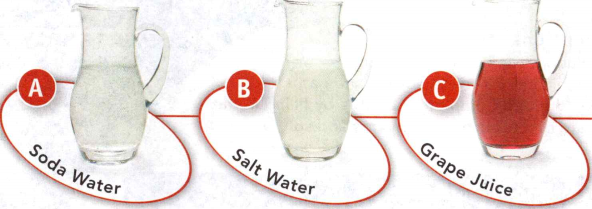

### Physical Science
°
## Chemistry

## 06 Acids, Bases, and Solutions

When we breathe, we take in oxygen (O2) and exhale carbon dioxide
(CO2). The bonds between the oxygen atoms in O2 are
nonpolar bonds. The bonds between the carbon and oxygen atoms in CO2
are polar bonds. However, carbon dioxide is a nonpolar molecule.

A covalent bond in which electrons are shared equally is a nonpolar bond. 
 
A covalent bond in which electrons are shared unequally is a polar bond.  

**Complete the tasks below.**  

1. Carbon monoxide (CO) is an air pollutant. What type of bonds are in carbon monoxide?
 
### Chapter Preview

- solution
- solvent
- solute
- colloid
- suspension
- dilute solution
- concentrated solution
- solubility
- saturated solution
- acid
- corrosive
- indicator
- base
- hydrogen ion (H+)
- hydroxide ion (OH-)
- pH scale
- neutralization
- salt

### Understanding Solutions

- How Are Mixtures Classified?   
- How Does a Solution Form?   

### Killer Quicksand?  
Misconception: You may have watched scenes in a movie like the one below. It's a
common misconception that if you fall into a pit of quicksand, it is nearly
impossible to escape its muddy clutches. 

Fact: Although it is real, quicksand is
not as deadly as it's often made out to be. Quick- sand is a mixture of sand and
water and is rarely more than a few feet deep. It forms when too much water
mixes with loose sand. Water molecules surround the individual grains of sand,
reducing the friction between them. The sand grains easily slide past each other
and can no longer support any weight. 

Fortunately, a human body is less dense than quicksand, which means you can float
on it. By relaxing and lying on your back, you'll  eventually float to the top.

**Complete the tasks below.**   

1. Quicksand can be frightening until you understand how it works. Describe something that seemed scary to you until you learned more about it.

### How Are Mixtures Classified? 

What do peanut butter, lemonade, and salad dressing have in common? All of these
are examples of different types of mixtures. **A mixture is classified as a
solution, colloid, or suspension based on the size of its largest particles.**

### Solutions 

Grape juice is one example of a mixture called a solution. A **solution**
is a mixture containing a solvent and at least one solute and has the same
properties throughout. The **solvent** is the part of a solution usually present in
the largest amount. It dissolves the other substances. The **solute** is the
substance that is dissolved by the solvent. Solutes can be gases, liquids, or
solids. Water is the solvent in grape juice. Sugar and other ingredients are the
solutes. A solution has the same properties throughout. It contains solute,
molecules or ions that are too small to see. 

### Water as a Solvent 

In many common
solutions, the solvent is water. Water dissolves so many substances that it is
often called the "universal solvent:' Life depends on water solutions. Nutrients
used by plants are dissolved in water in the soil. Water is the solvent in
blood, saliva, sweat, urine, and tears.

**Complete the tasks below.**   

1. There are many common solutions in daily life. In a solution, the substance present in the greatest amount is the (solute/solvent).

  <figure>
    
    <figcaption>Figure 1.</figcaption>
  </figure>

2. Answer the questions below about the solutions shown in Figure 1.
a) Which solution(s) has a gas solute?
b) In which solution(s) is water the solvent? 
c) Which solution(s) has two or more solutes?

3. What are some of the solutes in low-fat chocolate milk?

### Other Solvents 
Although water is the most common solvent, it
is certainly not the only one. Many solutions are made with solvents other than
water. For example, gasoline is a solution of
several different liquid fuels. Solvents don't even have to be liquids. A
solution may be a combination of gases, liquids, or solids. Air is an example of
a solution that is made up of nitrogen, oxygen, and other gases. Solutions can
even be made up of solids. Metal alloys like bronze, brass, and steel are
solutions of different solid elements.

- Sea water is a solution of sodium chloride and other compounds in water.
- The air in water bubbles of a diver is a solution of oxygen and other gases in nitrogen.
- The steel of a dive tank is a solution of carbon and metals in iron.

**Complete the tasks below.** 

1. Solutions can be made from any combination of solids, liquids, and gases.
Complete the table in Figure 2 by filling in the state of matter of the solvents and solutes.

  <figure>
    
    <figcaption>Figure 2. Common Solutions.</figcaption>
  </figure>

### Colloids 

Not all mixtures are solutions. As shown in Figure 2, a **colloid** 
is a mixture containing small, undissolved particles that do not settle
out. The particles in a colloid are too small to be seen without a microscope,
yet they are large enough to scatter a beam of light. For example, fog is a
colloid that is made up of water droplets in air. Fog scatters the headlight
beams of cars. Milk, shaving cream, and smoke are some other examples of
colloids. Because they scatter light, most colloids are not clear, unlike many
solutions. 

### Suspensions 

If you tried to mix sand in water, you would find that
the sand never dissolves completely, no matter how much you stir it. Sand and
water make up a suspension. A **suspension** is a mixture in which
particles can be seen and easily separated by settling or filtration. Unlike a
solution, a suspension does not have the same properties throughout. It contains
visible particles that are larger than the particles in solutions or colloids.

  
**Complete the tasks below.**   

1. What is a solution?  
2. How are colloids and suspensions different from solutions?  
3. Suppose you mix food coloring in water to make it blue. Have you made a solution or a suspension? Explain.   

### How Does a Solution Form?

If it were possible to see the particles of a solution, you could see how a
solute behaves when it's mixed in a solution. A solution forms when particles of
the solute separate from each other and become surrounded by particles of the
solvent. 

### Ionic and Molecular Solutes 

  <figure>
    
    <figcaption>Figure 3. Forming a Solution.</figcaption>
  </figure>

Figure 3 shows an ionic solid, sodium
chloride (NaCl), mixed with water. The positive and negative ions of the solute
are attracted to the partially charged polar water molecules. Eventually, water
molecules will surround all of the ions and the solid crystal will be completely
dissolved. 

Molecular compounds, such as table sugar, break up into individual
neutral molecules in water. The polar water molecules attract the polar sugar
molecules. This causes the sugar molecules to move away from each other. The
covalent bonds within the molecules remain unbroken.

**Complete the tasks below.**   

1. Explain what occurs as sodium chloride, an ionic solid, dissolves in water (Figure 3).
2. Airplane de-icing fluids are typically solutions of ethylene glycol in water.

  <figure>
    
    <figcaption>Figure 4. Effect of De-icing Fluid on the Freezing Point of Water.</figcaption>
  </figure>

a) The freezing point of pure water is 0°C. How is the percent of ethylene glycol
in de-icing fluid related to water's freezing point?
b) How much does a 45% solution of de-icing fluid lower the freezing point of water?
c) Would you allow a plane to take off in -20°C weather if it were de-iced with
   a solution of 30% ethylene glycol? Explain.

### Solutes and Conductivity 
How could you find out if the solute of a water
solution was salt or sugar? Ionic compounds in water conduct electric current,
but a solution of molecular compounds may not. If ions are present, electric
current will flow and you'll know the solute is salt. 

### Effects of Solutes 
Solutes raise the boiling point of a solution above that of the solvent. As the
temperature of a liquid rises, the molecules gain energy and escape as gas. In a
liquid solution, the solute particles prevent the solvent molecules' escape. The
temperature must go above the boiling point of the solvent in order for the
solution to boil. However, the temperature increases only slightly and is not
enough to cook food faster. 

Solutes lower the freezing point of a solution below
that of the solvent alone. When pure liquid water freezes at 0°C, the molecules
pack together to form crystals of ice. In a solution, the solute particles get
in the way of the water molecules forming ice crystals. The temperature must
drop below 0°C in order for the solution to freeze.

**Complete the tasks below.**   

1. Why is salt sprinkled on icy roads and sidewalks?

### Concentration and Solubility

- How Is Concentration Changed?   
- What Factors Affect Solubility?  
 

### Even Whales Get the Bends
Decompression sickness, or "the bends" as it's commonly known, is a fear for
many scuba divers. Under the extreme pressure of the deep ocean, nitrogen and
other gases from the air dissolve in a diver's body tissues. If the diver rises
too quickly, the sudden decrease in pressure causes the dissolved gas to bubble
out of the tissue. The bubbles can enter a blood vessel and cause intense pain,
and sometimes more severe injury. But what if the diver is a whale? Previously,
it was thought that whales did not suffer from the bends. Scientists have
discovered evidence in beached whales of nitrogen bubbles expanding and damaging
vital organs. It is believed that sonar waves from nearby ships may have
frightened the whales, causing them to surface too quickly. This can result in
the bends.

**Complete the tasks below.**   

1. Scientists have found small gashes in the bones of whale fossils, which are a
sign of the bends. What conclusions can you draw from these fossils?
2. Scuba diving is a popular activity. Would you scuba dive knowing the risks of
getting the bends?

### How Is Concentration Changed?
Have you ever had maple syrup on your pancakes? You probably know that it's made
from the sap of maple trees. Is something that sweet really made in a tree?
Well, not exactly. 

The sap of a maple tree and maple syrup differ in their
concentrations. That is, they differ in the amount of solute (sugar and other
compounds) dissolved in a certain amount of solvent (water). A dilute solution
is a mixture that has only a little solute dissolved in a certain amount of
solvent. A concentrated solution is a mixture that has a lot of solute dissolved
in the solvent. The sap is a dilute solution and the syrup is a concentrated
solution.

### Changing Concentration 
How is sap turned into syrup? **You can change the concentration of a solution by
adding solute. You can also change it by adding or removing solvent.** For
example, water is removed from the dilute sap to make the more concentrated
syrup.

**Complete the tasks below.**   

  <figure>
    
    <figcaption>Figure 5. Changing the Concentration of a Solution.</figcaption>
  </figure>

1. Changing the Concentration of a Solution. The solution in Figure 5 is made with two droppers of coloring.
a) Show two ways you can make a more concentrated solution by shading in the droppers and water level you would use.
b) Describe your methods.

2. To concentrate is the verb form of the adjective concentrated. Write a
sentence about solutions using the verb concentrate.

### Calculating Concentration 

You know that maple syrup is more concentrated than maple sap. What is the
actual concentration of either solution? To determine the concentration of a
solution, compare the amount of solute to the total amount of solution. You can
report concentration as the percent of solute in solution by volume or mass.

**Complete the tasks below.**  

1. To calculate concentration, compare the amount of solute to the amount of
solution. For example, if a 100-gram solution contains 10 grams of solute, its
concentration is 10% by weight.

  <figure>
    
    <figcaption></figcaption>
  </figure>

For the following contact solutino: 10.7 grams hydrogen peroxide 355 grams solution. Determine the concentration of the contact solution.

2. What is a concentrated solution?
3. Find the concentration of a solution with 30 grams of solute in 250 grams of solution.
4. Solution A has twice as much solute as Solution B. Is it possible for the solutions to have the same concentration? Explain.

### What Factors Affect Solubility?   
Suppose you add sugar to a cup of hot tea. Is there a limit to how sweet you can
make the tea? Yes, at some point, no more sugar will dissolve. Solubility is a
measure of how much solute can dissolve in a solvent at a given temperature. CM
Factors that can affect the solubility of a substance include pressure, the type
of solvent, and temperature.  

When you've added so much solute that no more dissolves, you have a saturated
solution. If you can continue to dissolve more solute in a solution, then the
solution is unsaturated.  

Certain factors also affect the rate at which a solution forms. Smaller
particles of solute dissolve more quickly than larger particles. Stirring and
warmer temperatures can speed up the dissolving of the solute, too. Also, the
more saturated a solution, the slower it will dissolve additional solute.   

### Working With Solubility 

  <figure>
    
    <figcaption>Figure 7. Solubility in Water.</figcaption>
  </figure>

Look at the table in Figure 7.
It compares the solubilities of familiar compounds in 100 grams of water at 20°C. You can see that only 9.6 grams of baking soda will dissolve in these conditions. However, 204 grams of table sugar will dissolve in the same amount of water at the same temperature.  

Solubility can be used to help identify a substance. It is a characteristic property of matter. Suppose you had a white powder that looked like table salt or sugar. Since you never taste unknown substances, how could you identify the powder? You could measure its solubility in 100 grams of water at 20°C. Then compare the results to the data in Figure 7 to identify the substance.

**Complete the tasks below.**   

1. Pickling requires saturated solutions of salt in water. Using the table in Figure 7, determine the amount of sodium chloride you would need to make pickles using 500 grams of water.

The popping sound you hear when you crack your knuckles is dissolved gas coming
out of the fluid between the joints because of a decrease in pressure. That's
why you can't crack the same knuckle twice in a row. You have to wait a few
minutes for the gas to dissolve back into the fluid.

### Factors Affecting Solubility 
You have already read that there is a limit to solubility. By changing certain
conditions, you can change a substance's solubility. 

**Pressure** The solubility of
a gas solute in a liquid solvent increases as the pressure of the gas over the
solution increases. To increase the carbon dioxide concentration in soda water,
the gas is added to the liquid under high pressure. Opening the bottle or can
reduces the pressure. The escaping gas makes the fizzing sound you hear. 

Scuba
divers must be aware of the effects of pressure on gases if they want to avoid
decompression sickness. Under water, divers breathe from tanks of compressed
air. The air dissolves in their blood in greater amounts as they dive deeper. If
divers return to the surface too quickly, the gases can bubble out of solution.
The bubbles can block blood flow. Divers double over in pain, which is why you
may have heard this condition called "the bends." 

  <figure>
    
    <figcaption>Figure 8. Some polar and nonpolar compounds form layers when they are mixed together. A is polar.</figcaption>
  </figure>

**Solvents** Sometimes you just
can't make a solution because the solute and solvent are not compatible, as
shown in Figure 8. This happens with motor oil and water. Have you ever tried to
mix oil and water? If so, you've seen how quickly they separate into layers
after you stop mixing them. Oil and water separate because water is a polar
compound and oil is nonpolar. Some polar and nonpolar compounds do not mix very
well. 

For liquid solutions, ionic and polar compounds usually dissolve in polar
solvents. Nonpolar compounds do not usually dissolve in very polar solvents, but
they will dissolve in nonpolar solvents.

**Temperature** For most solid solutes, solubility increases as temperature
increases. For example, the solubility of table sugar in 100 grams of water at
0°C is 180 grams. However, the solubility increases to 231 grams at 25°C and 487
grams at 100°C. 

Cooks use this increased solubility of sugar to make candy. At
room temperature, not enough sugar for candy can dissolve in the water.
Solutions must be heated for all the sugar to dissolve. 

When heated, a solution
can dissolve more solute than it can at cooler temperatures. If a heated,
saturated solution cools slowly, the extra solute may remain dissolved to become
a supersaturated solution. It has more dissolved solute than is predicted by its
solubility at the given temperature. If you disturb a supersaturated solution,
the extra solute will quickly come out of solution. You can see an example of a
supersaturated solution in Figure 4. 

Unlike most solids, gases become less
soluble when the temperature goes up. For example, more carbon dioxide can
dissolve in cold water than in hot water. If you open a warm bottle of soda
water, carbon dioxide escapes the liquid in greater amounts than if the soda
water had been chilled. Why does a warm soda taste "flat" when it's opened? It
contains less gas. If you like soda water that's very fizzy, open it when it's
cold!

  <figure>
    
    <figcaption>Figure 9. Supersaturated Solution: Dropping a crystal into a supersaturated solution causes the extra solute to rapidly come out of solution.</figcaption>
  </figure>

**Complete the tasks below.**   

1. Some polar and nonpolar compounds form layers when they are mixed together.
Determine which of these liquids are polar and which are nonpolar by the way
they form layers or mix together. The first answer is given.

2. Crystallized honey, a supersaturated solution, can be more than 70 percent sugar.
a) How many grams of sugar could be in 50 grams of crystallized honey?
b) How would you explain why certain types of honey rarely crystallize?
c) Is there a way to turn crystallized honey back into liquid honey? Explain.

3. The chef is in a hurry and needs the pasta to cook fast. He adds a handful of
salt to the pot of water to raise the boiling point. Explain whether the chef's
plan to cook the pasta faster will work or not. 

4. A customer at the
Solutions Shack complains because his soda water is flat. Suggest a reason why
this happened. 

5. The chef is making salad dressing with vinegar, olive
oil, and pepper, but the ingredients are not mixing together.

6. The chef makes the best iced tea. His secret is to make it exactly 15 percent
sugar by mass. If he wants to make 3,000 grams of iced tea, how many grams of
sugar should he use? 
 
a) 200 grams	
b) 450 grams
c) 20,000 grams 
d) 45,000 grams

7. How can you tell when a solution is saturated?

8. You are given two white powdery substances. How would you use solubility to identify them?
9. What determines the properties of a solution?
10. What is affecting the solubility of a substance?

### Describing Acids and Bases

- What Are the Properties of Acids?   
- What Are the Properties of Bases?  

### Bog Bodies  

Even in Shakespeare's time it was known that tanning, the process of making
leather, helps preserve body tissues. Hundreds of years later, the body of a
2,300-year-old man was found in the peat bogs of Europe. The man is a bog body.
Bog bodies are the remains of human bodies that have been preserved in the
highly acidic conditions of peat bogs. The bog acids are similar in strength to
vinegar. They naturally pickle the human bodies. The lack of oxygen and cold
temperatures of Northern Europe cause the acids to saturate body tissues before
they decay. As a result, the organs, hair, and skin are all preserved. The acids
dissolve the bones of the bog bodies, but details like tattoos and fingerprints
can still be seen on some of the bodies.

**Complete the tasks below.**   

1. Hypothesize why bog acids react differently with the bones of the bodies than
they do with the organs, hair, and skin.  
2. How are pickles similar to bog bodies?  

### What Are the Properties of Acids?   

Have you had any fruit to eat recently? If so, an acid was probably part of your
meal. Many common items contain acids. **Acids** are compounds with specific
characteristic properties. **An acid reacts with metals and carbonates, tastes
sour, and turns blue litmus paper red.** 

Acids are an important part of our lives.
Folic acid, found in green, leafy vegetables, is important for cell growth.
Hydrochloric acid in your stomach helps with digestion. Phosphoric acid is used
to make plant fertilizers. Sulfuric acid drives many types of batteries, giving
it the nickname "battery acid:' 

### Reactions With Metals 
Acids react with certain
metals to produce hydrogen gas. Platinum and gold don't react with most acids,
but copper, zinc, and iron do. When they react, the metals seem to disappear in
the solution. This is one reason acids are described as corrosive, meaning they
"wear away" other materials. The purity of precious metals can be determined
using acids. Figure 1 shows a touchstone, which is used to test the purity of
gold. The gold object is scraped on the touchstone. Then, acid is poured onto
the streak. The more gas bubbles the streak produces, the lower the purity of
the gold.

### Reactions With Carbonates 

Acids also react with carbonate ions. Carbonate ions contain carbon and oxygen
atoms bonded together with an overall negative charge (CO32-). One product of
the reaction of an acid with a carbonate is the gas carbon dioxide. 

  <figure>
    
    <figcaption>Figure 10. Sculpture.</figcaption>
  </figure>

Objects that
contain carbonate ions include seashells, eggshells, chalk, and limestone. The
sculpture shown in Figure 10 is carved from limestone. Geologists use this
property of acids to identify rocks. If carbon dioxide gas is produced when
dilute acid is poured on a rock's surface, then the rock could be made of
limestone.

### Sour Taste 
If you've ever tasted a lemon, you've had firsthand experience with the sour
taste of acids. Citrus fruits, such as lemons, grapefruit, and oranges, all
contain citric acid. Other foods such as vinegar and tomatoes also contain
acids. 

Although sour taste is a characteristic of many acids, it is not one you
should use to identify a compound as an acid. Scientists don't taste chemicals.
It is never safe to taste unknown chemicals. 

# Reactions With Indicators   
Chemists use indicators to test for acids. Litmus paper is an example of an
indicator, a compound that changes color when it comes in contact with an acid.
Acids turn blue litmus paper red.   

  <figure>
    
    <figcaption>Figure 11. Blue litmus paper turns red in the presence of acid.</figcaption>
  </figure>

**Complete the tasks below.**   

1. Acids are used to test the purity of precious metals. What could you
determine about a gold necklace that bubbles when it is exposed to an acid?

2. Acids react with the carbonates in limestone. Describe what a geologist would
observe if she poured acid on a sculpture.

3. What is a compound that changes color in an acid called?
A) metal	
B) indicator
C) carbonate

4. Why are acids described as corrosive?

5. How might you tell if a food contains an acid?

### What Are the Properties of Bases?

**Bases** are another group of compounds that can be identified by their common
properties. **A base tastes bitter, feels slippery, and turns red litmus paper
blue.** The properties of bases are often described as the "opposite" of acids.
Bases have many uses. Ammonia is used in fertilizers and household cleaners.
Baking soda is a base called sodium bicarbonate, which causes baked goods to
rise. 

### Bitter Taste 
Have you ever tasted tonic water? The base, quinine,
causes the slightly bitter taste. Bases taste bitter. Other foods that contain
bases include bitter melon, almonds, and cocoa beans, like those shown above.

### Slippery Feel 
Bases have a slippery feel. Many soaps and detergents contain
bases. The slippery feeling of your shampoo is a property of the bases it
contains.   
Just as you avoid tasting an unknown substance, you wouldn't want to
touch one either. Strong bases can irritate your skin. A safer way to identify
bases is by their other properties.

**Complete the tasks below.**   

  <figure>
    
    <figcaption>Figure 12. Acid and Base.</figcaption>
  </figure>

1. Consider Figure 12.
a) Identify the items which are "acid";
b) Identify the items which are "base";

2. What are some uses of bases?

### Reactions of Bases 
Unlike acids, bases don't react with metals. They also don't
react with carbonates to form carbon dioxide gas. The lack of a reaction can be
a useful property in identifying bases. If you know that a compound doesn't
react with metals, you know something about it. For example, you know the
compound is probably not an acid. Another important property of bases is how
they react with acids in a type of chemical reaction called neutralization, in
which acids and bases deactivate one another.

### Reactions With Indicators 
Since litmus paper can be used to test acids, it can
be used to test bases, too. Unlike acids, however, bases
turn red litmus paper blue. An easy way to remember this is to think of the
letter b. Bases turn litmus paper blue.

**Complete the tasks below.**  

  <figure>
    
    <figcaption>Figure 13. Litmus Paper.</figcaption>
  </figure>

1. Litmus paper is used to test if a substance is an acid or a base. Look at the
apple and soap photos. What color would you expect to see from the substance.
a) Apple
b) Soap
2. What would you infer about a substance that did not change the color of red
or blue litmus paper?
3. Complete the table of properties of acids and bases in Figure 14.

  <figure>
    
    <figcaption>Figure 14. Properties of Acids and Bases.</figcaption>
  </figure>

4. Bee venom is slightly acidic, but wasp venom is closer to neutral, meaning it's not an acid or a base. Pure water is another neutral substance.
a) Bee venom would taste (bitter/sour).
b) How would bee venom and wasp venom react with litmus paper?
c) One suggestion for treating a bee sting is cleaning it with vinegar. Is this a cure
that you would try? Explain.
 
5. The properties of bases are often considered (identical/opposite) to acids.
6. In what products are you most likely to find bases in your home?
7. The color of hydrangea flowers depends on the amount of acid or base in the
soil. Write a question that helps you determine the cause of a pink hydrangea.
8. What do the properties of bases include?
9. Stings from other kinds of animals can be acidic. How might you treat a sting
that contains an acid?
10. Since jellyfish are nearly invisible, most people never know they're in danger. What advice would you give to a person planning on spending a day at the beach?

### Acids and Bases in Solution
- What Ions Do Acids and Bases Form in Water? 
- What Are the Products of Neutralization?

### Ocean Stingers
You've probably heard of venomous animals like rattlesnakes and black widow
spiders. Did you know that some of the most venomous creatures in the world are
jellyfish? Some jellyfish stings can permanently scar and even kill their
victims. Jellyfish use their venom to stun and paralyze both prey and predators,
including humans. A jellyfish sting can quickly turn a day at the beach into a
dash to the hospital. Luckily, most jellyfish stings can be easily treated. The
venom of some jellyfish contains bases. Bases can be neutralized, or
deactivated, by an acid. The best way to treat some jellyfish stings is to rinse
the affected area with vinegar. Vinegar is a solution containing acetic acid,
which is a weak acid that is safe for your skin.

### What Ions Do Acids and Bases Form in Water?  

A chemist pours hydrochloric acid into a beaker. Then she slowly adds a base,
sodium hydroxide, to the acid. What happens when these two chemicals mix? To
answer this question, you must know what happens to acids and bases in solution.

### Acids in Solution 

  <figure>
    
    <figcaption>Figure 15. Common Acids.</figcaption>
  </figure>

Figure 15 lists some common acids. Notice that each formula begins with the letter H, the symbol for hydrogen. In a solution with water, most acids separate into hydrogen ions and negative ions. A hydrogen ion (H+) is an atom of hydrogen that has lost its electron. In the case of hydrochloric acid, for example, hydrogen ions and chloride ions form.

HCl --> H+ + Cl-

The production of hydrogen ions helps define an acid. **An acid produces
hydrogen ions (H+) in water.** These hydrogen ions are responsible
for corroding metals and turning blue litmus paper red. Acids may be strong or
weak. Strength refers to how well the acid dissociates, or separates, into ions
in water. Molecules of a strong acid, such as nitric acid,
dissociate to form hydrogen ions in solution. With a weak acid, like acetic
acid, very few particles separate to form ions in solution.

**Complete the tasks below.** 

  <figure>
    
    <figcaption>Figure 16. Strengths of Acids.</figcaption>
  </figure>

1. In solution, strong acids act differently than weak acids do. In the empty
beaker in Figure 16, use the key to draw how ions of acetic acid would act in solution.

### Bases in Solution 

  <figure>
    
    <figcaption>Figure 17. Common Bases.</figcaption>
  </figure>

Look at the table in Figure 17. Many of the bases shown are made of positive ions
combined with hydroxide ions. The hydroxide ion (OH-) is a negative
ion made of oxygen and hydrogen. When some bases dissolve in water, they
separate into positive ions and hydroxide ions. Look, for example, at what
happens to sodium hydroxide in water.

NaOH --> Na+ + OH-

Not every base contains hydroxide ions. For example, ammonia (NH3) does not. In
solution, ammonia reacts with water to form hydroxide ions. 

NH3 + H2O --> NH4+ + OH-

Notice that both reactions produce negative hydroxide ions. **A base produces
hydroxide ions (OH-) in water.** Hydroxide ions are responsible for the bitter
taste and slippery feel of bases, and for turning red litmus paper blue. Strong
bases, like sodium hydroxide, readily produce hydroxide ions in water. Weak
bases, such as ammonia, do not.

### Measuring pH 

To determine the strength of an acid or base, chemists use a scale called pH. As
shown in Figure 18, the pH scale ranges from 0 to 14. It expresses the
concentration of hydrogen ions in a solution.

  <figure>
    
    <figcaption>Figure 18. The pH scale helps classify solutions as
acidic or basic.</figcaption>
  </figure>

The most acidic substances are found at the low end of the scale, while basic
substances are found at the high end. A low pH tells you that the concentration
of hydrogen ions is high and the concentration of hydroxide ions is low. A high
pH tells you that the opposite is true. You can find the pH of a solution using
indicator paper, which changes a different color for each pH value. Matching the
color of the paper with the colors on the scale tells you the solution's pH. A
pH lower than 7 is acidic. A pH higher than 7 is basic. If the pH is 7, the
solution is neutral, meaning it's neither an acid nor a base.
  
**Complete the tasks below.**   

  <figure>
    
    <figcaption>Figure 19. The pH Scale.</figcaption>
  </figure>

1. Use the pH scale to complete the following tasks. Find the approximate pH of
each substance shown on the scale in Figure 19.
2. Each unit of the pH scale represents a tenfold (10x) change in hydrogen ion
concentration. What is the difference in hydrogen ion concentration between
hydrochloric acid and a lemon?
3. You can predict the pH of an acid or base using its properties. Place each item on the pH scale below.
4. Add your own item to the pH scale based on properties you've experienced.
5. What type of solution has a pH of 7?
A) acidic 
B) basic  
C) neutral
6. Solution A has a pH of 1.6 Solution B has a pH of 4. Which solution has a
greater concentration of hydrogen ions? Explain.
7. In water, 
a) acids produce: ___
b) bases produce: ___

### What Are the Products of Neutralization?   

Are you curious about what happens when you mix an acid and a base? Would you be
surprised to learn it results in salt water? Look at the equation for the
reaction between equal concentrations and amounts of hydrochloric acid and
sodium hydroxide.

HCl + NaOH --> H2O + Na+ + Cl-

If you tested the pH of the mixture, it would be close to 7, or neutral. In
fact, a reaction between an acid and a base is called neutralization.

### Reactants  

After neutralization, an acid-base mixture is not as acidic or basic as the
individual starting solutions were. The reaction may even result in a neutral
solution. The final pH depends on the volumes, concentrations, and strengths of
the reactants. For example, if a small amount of strong base reacts with a large
amount of strong acid, the solution will remain acidic, but closer to neutral
than the original pH.

**Complete the tasks below.**   

  <figure>
    
    <figcaption>Figure 20. Neutralization.</figcaption>
  </figure>

1. Write the color of the pH indicator paper on the strip for each solution based on its pH.
2. Estimate the pH of a mixture of a large amount of weak acid and large amount of strong base. Explain your reasoning.

### Products   

"Salt" may be the familiar name of the stuff you sprinkle on food, but to a
chemist, the word refers to a specific group of compounds. A salt is any ionic
compound that can be made from a neutralization reaction. A salt is made from
the positive ion of a base and the negative ion of an acid. The reaction of a
metal with a nonmetal is a neutralization reaction and produces a salt.

Look at the equation for the neutralization reaction of nitric acid with
potassium hydroxide that forms potassium nitrate salt.

HNO3 + KOH --> H2O + NO3-   
(acid) + (base) --> (water) + (salt)

**In a neutralization reaction, an acid reacts with a base to produce a salt and
water.** Some common salts are shown in the table in Figure 21.

**Complete the tasks below.**   

1. The table in Figure 21 lists common salts produced from neutralization reactions. Complete the table in Figure 21 with the formula for each salt.  

  <figure>
    
    <figcaption>Figure 21. Common Salts.</figcaption>
  </figure>

2. How is the scientific meaning of salt different from the common meaning of salt?
3. Is the pH of an acid-base neutralization always 7? Why or why not?
4. What does a neutralization reaction produce?   

### Study Guide   
- A mixture is classified as a solution, colloid, or suspension based on the size of its largest particles.  
- A solution forms when particles of the solute separate from each other and become surrounded by particles of the solvent.   
- You can change the concentration of a solution by adding solute. You can also change it by adding or removing solvent.  
- Factors that can affect the solubility of a substance include pressure, the type of solvent, and temperature.   
- An acid reacts with	metals and carbonates, tastes sour, and turns blue litmus paper red.  
- A base tastes bitter, feels slippery, and turns red litmus paper blue.
- An acid produces hydrogen ions (H+) in water.
- A base produces hydroxide ions (OH-) in water.
- In a neutralization reaction, an acid reacts with a base to produce a salt and water.   

**Complete the tasks below.**   

1. Which of the following is an example of a solution?
A) fog	
B) soda water
C) milk	
D) mud

2. Why is a mixture of pepper and water a suspension?  

3. The table below in Figure 22 shows the main components of Earth's atmosphere. What is the solvent in air? What are the solutes?   

<figure>
  
  <figcaption>Figure 22. Composition of Earth's Atmosphere.</figcaption>
</figure>

4. Suppose you put equal amounts of pure water and salt water into separate ice
cube trays of the same size and shape. What would you expect to happen when you
put both trays in the freezer? Explain.

5. How can you increase the concentration of a solution?   
A) add solute	 
B) increase temperature  
C) add solvent	 
D) decrease pressure  

6. Most gases become more soluble in liquid as the temperature ____ .  

7. Which of the diagrams below shows a dilute solution? Which one shows a concentrated solution? Explain.  

8. The concentration of a water and alcohol solution is 25 percent alcohol by
volume. Calculate what the volume of alcohol would be in 200 mL of the solution.   

9. Which of the following is a property of bases?
A) sour taste
B) slippery feel
C) turns blue litmus paper red
D) reacts with some metals  

10. Why is Litmus paper an example of an indicator?  

11. Which of the following substances contain bases? Explain your reasoning.   

12. Acid rain forms when carbon dioxide (CO2) in the air reacts with
rainwater. How could you test if rain in your town was acid rain?   

13. A bottle of acid is missing from the chemistry lab. Design a "Missing Acid"
poster describing the properties of the acid. Include examples of tests that
could be done to check if a bottle that is found contains acid.

14. What is an ion called that is made of hydrogen and oxygen?   
A) an acid	
B) a base
C) a hydrogen ion	
D) a hydroxide ion  

 
15. Into what do water, acids separate into?   

16. Suppose you have a solution that is either an acid or a base. It doesn't react with any metals. Is the pH of the solution more likely to be 4 or 9? Explain.   

17. You are given three beakers of unknown liquids. One beaker contains pure
water. One contains salt water. One contains sugar water. Without tasting the
liquids, how could you identify the liquid in each beaker?  

18. The graph below shows how the solubility of potassium chloride (KCl) in water changes with temperature.  

  <figure>
    
    <figcaption>Solubility of potassium chloride (KCl) in water.</figcaption>
  </figure>

Thirty grams of potassium chloride are dissolved in 100 grams of water at 60°C. Which best describes the solution?
A) saturated	 
B) supersaturated  
C) unsaturated  
D) acidic  

19. Which of the following pH values indicates a solution with the highest
concentration of hydrogen ions?
A) pH = 1  
B) pH = 2  
C) pH = 7  
D) pH = 14  

20. Three sugar cubes are placed in a beaker containing 50 milliliters of water
at 20°C. Which action would speed up the rate at which the sugar cubes dissolve
in the water?   
A) Use less water.   
B) Transfer the contents to a larger beaker.  
C) Cool the water and sugar cubes to 5°C.  
D) Heat and stir the contents of the beaker.   

21. A scientist observes that an unknown solution turns blue litmus paper red
 and reacts with zinc to produce hydrogen gas. Which of the following *best*
 describes the unknown solution?
A) a colloid
B) an acid
C) a base
D) a suspension   

22. Why is dissolving table salt in water an example of a physical change?   
A) Neither of the substances changes into a new substance.  
B) The salt cannot be separated from the water.   
C) The water cannot become saturated with salt.  
D) A physical change occurs whenever a substance is mixed with water.  

23. At temperatures below 0°C, fresh water on the surface of a lake is frozen
while a nearby body of salt water is not frozen. Explain this observation in
terms of what happens to water molecules when water freezes.

### Limestone and Acid Drainage

Sport Meets Science

Fifteen-year-old Luke Andraka likes to go kayaking on the Cheat River in West
Virginia. On a trip during the summer of 2007, he did more than paddle around.
Observing that the water in some areas was orange, Luke began asking questions.
He learned that acid runoff from a nearby mine flowed into the stream. The acid
changed the chemistry of the stream, causing dead zones, where plants and
shellfish could not live and the color of the water changed. 

This gave Luke an
idea for his science fair project. Luke knew that limestone can neutralize acid
rain. He hypothesized that adding limestone to the water could reverse the
effects of the runoff from the mine. He experimented to see whether adding small
pieces of limestone would work better than adding large pieces of limestone. He
proved that limestone could raise the pH level in the stream and clear the
stream's pollution without harming the organisms living in the river habitat.
Luke also found that limestone sand would work more quickly than an equal mass
of limestone rocks.

**Complete the tasks below.**   

1. Be a keen observer. Research one environmental issue in your community. Identify a possible cause, and present one possible solution. Explain in a letter to your local newspaper how you would research the effectiveness of that solution.

### Vinegar

From West Africa, we have chicken yassa seasoned with malt or cider vinegar.
From Japan, we have sushi rice seasoned with rice vinegar. From Italy we have
grilled sea bass with anchovy dressing seasoned with balsamic vinegar. All the
world loves vinegar! 

This sour-tasting ingredient is made from the oxidation of
ethanol in a liquid. Most vinegar is 3 to 5 percent acetic acid by volume, which
is why it curdles with basic ingredients that have a basic pH, such as milk.

PKD1L3 and PKD2L1 are two proteins on the surface of the tongue. They cause
vinegar to taste sour.

Why does vinegar taste so sour? For a long time, scientists weren't sure. Then a
team led by scientists at Duke University Medical Center identified two proteins
on the surface of our tongues PKD1L3 and PKD2L1. They also tracked the process
that sends an electrical signal to your brain to pucker up. Another study showed
that your genes may play a role in how sour something tastes to you. 

**Complete the tasks below.**   

1. Design an experiment to find out more about people's taste for sour
flavors. How do different people respond to the same sour food and drink?
Consider how you can test their reactions. How many people would you need to
test? Will repeated trials help you to draw a conclusion?

### How do you describe the motion of an object?
First there is the long, slow climb up the hill. Then the big plunge down. Your body momentarily leaves the seat. The coaster enters a loop the loop and you are upside down! Up and down faster, slower until you finally stop PHEW!

**Complete the tasks below.**   

1. What kinds of motion happen during a roller coaster ride?

