 ### Physical Science

## Physics

## 07 Motion

- **Direction** is the line along which something moves.  
- **Instant** is a point or very short space in time.  
- **Time** is the period of duration between two events.  

- system:	an established way of doing something Example:	People have different systems for keeping
their music collections organized.   
- equation: a statement of equality between two	
quantities, as shown by the equal sign (=). Example: The equation for the area of a circle is	A = π x r<sup>2</sup>.
conclude	v. to decide by reasoning	After investigating the evidence, they
concluded that everyone should wear a . bicycle helmet.

**Complete the tasks below.**  

1. Jenny is watching television. Suddenly, a warning from the National Weather
Service appears on the screen. A thunderstorm is heading in her direction. At
that instant, Jenny sees a bolt of lightning in the distant sky. Jenny hopes the
storm will be over in time for her soccer game. What might happen if the storm
were to change direction?
 
### Chapter Preview

- motion
- reference point
- International System of Units
- distance
- speed
- average speed
- instantaneous speed
- velocity
- slope
- acceleration

### Describing Motion

### Nicolaus Copernicus
Why would anyone think that Earth moves around the sun? After all, on a clear
day you can see the sun move across the sky. But Polish astronomer Nicolaus
Copernicus realized that an object revolving around you from left to right looks
the same as an object standing still while you rotate from right to left. In On
the of the Heavenly Spheres, he wrote:

"Every apparent change in respect of
position is due to motion ofthe object
observed, or ofthe observer; or indeed
to an unequal change ofboth."

This-book was published in 1543. It was, a summary of more than 30 years of
Copernicus's studies on the solar system.

Because of Earth's spin, the stars appear to move in circular arcs across the
night sky. Only the North Star remains in a fixed position. Historically,
sailors have used the North Star to help them navigate.

**Complete the tasks below.**   

1. For thousands of years, many people thought Earth was the center of the
universe. Name one possible reason why they thought this.

### When Is an Object in Motion?
Deciding if an object is in motion isn't as easy as you might think. For
example, you are probably sitting in a chair as you read this book. Are you
moving? Parts of you are. Your eyes blink and your chest moves up and down. But
you would probably say that you are not moving. An object is in **motion** if its
position changes relative to another object. Because your position relative to
your chair does not change, you could say that you are not in motion.

### Reference Points 
To decide if you are moving, you use your chair as a reference point. A
**reference point** is a place or object used for comparison to determine if
something is in motion. **An object is in motion if it changes position
relative to a reference point.** Objects that are fixed relative to Earth—such as
a building, a tree, or a sign—make good reference points. 

You may already know what happens if your reference point is moving relative to
Earth. Have you ever been in a school bus parked next to another bus? Suddenly,
you think that your bus is moving backward. When you look out the window again
for a fixed point, you find that your bus isn't moving at all—the other bus is
moving forward! Your bus seemed to be moving backward because you had used the
other bus as a reference point.

**Complete the tasks below.**   

  <figure>
    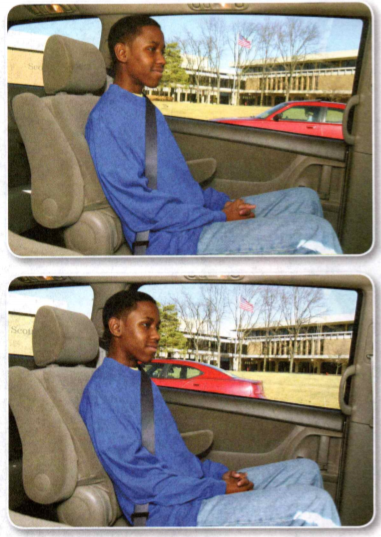
    <figcaption>Figure 1. Reference Point.</figcaption>
  </figure>

1. The photo in Figure 1 was taken shortly before the bottom photo. Answer the following
questions. 
a) Did the car that the boy is in move, or did the
car in the background move? Explain your answer. 
b) What objects in this photo make good reference points?

2. A tree is (stationary/in motion) relative to Earth.   
3. A tree is (stationary/in motion) relative to sun.  


### Relative Motion 
If you use your chair as your reference point as you sit and read, you are not
moving. If you choose another object as a reference point, you may be moving.

Suppose you use the sun as a reference point instead of your chair. If you
compare your position to the sun, you are moving quite rapidly because you and
your chair are on Earth, which revolves around the sun. Earth moves around the
sun at a speed of about 30 kilometers every second. So you and everything else
on Earth are moving that quickly as well. Going that fast, you could travel from
New York City to Los Angeles in about two minutes! Relative to the sun, both you
and your chair are in motion. But because you are moving with Earth, you do not
seem to be moving.

**Complete the tasks below.**   

1. People are riding on a spinning carousel. Are the people moving relative to each
other? Are they moving relative to objects on the ground? Explain.   
2. How is your choice of reference point important when describing the motion of the people?   


### Measuring Distance  
To describe motion completely, you need to use units of measurement. Scientists
use a system of measurement called the **International System of Units** or, in
French, Systeme International (SI). Distance is the length of the path between
two points. The SI unit for length is the meter (m). The distance from the floor
to a doorknob is about 1 meter.    
Scientists use other units to measure distances much smaller or much larger than
a meter. For example, the width of a spider can be measured
in centimeters (cm). The prefix centi- means "one hundredth:' A centimeter is
one hundredth of a meter, so there are 100 centimeters in a meter. For lengths
smaller than a centimeter, the millimeter (mm) is used. The prefix milli- means
"one thousandth," so there are 1,000 millimeters in a meter. Distances much
longer than a meter can be measured in kilometers (km). The prefix kilo- means
"one thousand:' so there are 1,000 meters in a kilometer. A straight line
between San Francisco and Boston would measure about 4,300 kilometers. 

**Complete the tasks below.**   

1. Fill in the following common conversions for length.
```
1 m  = ___ mm
1 m  = ___ cm
1 km = ___ m
```

2. What is a place or object used for comparison to determine if something is in motion called?  
3.  Why is it important to know if your reference point is moving?


### Speed and Velocity   
- How Do You Calculate Speed? 
- How Do You Describe Velocity? 
- How Do You Graph Motion?


**Complete the tasks below.**   

1. Once my sister talked me into going to the roller-skating rink with her. I hate
skating, but against my better judgment, I agreed to go. I can skate, but I
don't go very fast. At the rink, there were these speed skaters, or, as I like
to call them, "assassin skaters." The assassin skaters went ridiculously fast.
They were probably going approximately 20 miles per hour in the same direction
as me. They zipped past me, just barely missing me. 

The worst part about going skating was getting stuck behind a group of skaters
or a couple. They went so slowly that you had to speed up to get around them.

Do all the skaters in the rink move at the same speed? Explain.

2. Describe a sport or activity in which speed is important.


### How Do You Calculate Speed?   
You might describe the motion of an airplane as fast or the motion of a snail as
slow. By using these words, you are describing the object's speed. The **speed** of
an object is the distance the object moves per unit of time. Speed is a type of
rate. A rate tells you the amount of something that occurs or changes in one
unit of time.

### The Speed Equation   
To calculate the speed of an object, divide the distance the object travels by the amount of time it takes to travel that distance. This relationship can be written as an equation.

 <figure>
    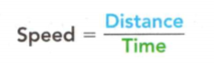
    <figcaption>Figure 2. Speed.</figcaption>
  </figure>

The speed equation contains a unit of distance divided by a unit of time. If you
measure distance in meters and time in seconds, the SI unit for speed is meters
per second, or m/s. (The slash is read as "per.") For example, at its cruising
altitude, an airplane might travel at a constant speed of 260 m/s. This means
that the airplane will travel a distance of 260 meters in 1 second. The speed of
a snail is about 1 mm/s. This means that the snail will travel a distance of 1
millimeter in 1 second. The speed of the airplane is much greater than the speed
of the snail because the airplane travels much farther than the snail in the
same amount of time.

**Complete the tasks below.**   

1. How can the relationship between speed, distance, and time be written?  
2. A cyclist is moving at a constant speed of 10 m/s during her ride. 
a) How far does the cyclist travels after 4 seconds?
b) How long will it take the cyclist to travel 400 meters?


### Average Speed 
When a plane is at its cruising altitude, it can travel at a constant speed for
many hours. But the speed of most moving objects is not constant. In a race
known as the triathlon, the competitors (or triathletes) first swim, then bike,
and finally run. The speeds of the triathletes change throughout the race. They
travel slowest when they swim, a little faster when they run, and fastest when
they bike.   

Although the triathletes do not travel at a constant speed, they do have an
average speed throughout the race. To **calculate average speed**, divide the total
distance traveled by the total time. For example, suppose a triathlete swims a
distance of 3 kilometers in 1 hour. Then the triathlete bikes a distance of 50
kilometers in 3 hours. Finally, the triathlete runs a distance of 12 kilometers
in 1 hour. The average speed of the triathlete is the total distance divided by
the total time.
```
Total distance = 3 km + 50 km + 12 km = 65 km
Total time =1h+3h+1h=5h
Average speed = 65km/5m = 13 km/h
```
The triathlete's average speed is 13 kilometers per hour.


### Instantaneous Speed  
Suppose Triathlete B passes Triathlete A during the biking leg. At that moment,
Triathlete B has a greater instantaneous speed than Triathlete A. Instantaneous
speed is the speed at which an object is moving at a given instant in time. It
is important not to confuse instantaneous speed with average speed. The
triathlete with the greatest average speed, not the greatest instantaneous
speed, wins the race.   

**Complete the tasks below.** 

1. Triathletes A and B are competing in a triathlon. The first two legs of the race are swimming and biking. 
```
Leg 1 Swimming
Total distance: 3.0 km 
Triathlete A's total time: 0.8 h 
Triathlete B's total time: 1.0 h

Triathlete A's average speed =

Triathlete B's average speed =

Leg 2 Biking
Total distance: 50.0 km 
Triathlete A's total time: 3.0 h 
Triathlete B's total time: 2.5 h

Triathlete A's average speed =

Triathlete B's average speed =

```

a) Use the data to calculate each triathlete's average speed during the swimming and biking legs of the race.
b) The triathletes run in the third and final leg of the triathlon.

```
Leg 3 Running
Total distance: 12.0 km 
Triathlete A's total time: 1.2 h 
Triathlete B's total time: 1.0 h
```
Use the data from all three legs to solve for each triathlete's average speed.
c) Which triathlete finishes first?

2. The (instantaneous/average) speed is the speed of the object at a given instant in time. 
3. The (instantaneous/average) speed is the speed of the object over a longer period of time.
4. The speedometer in a car gives the car's __________	speed.
5. To calculate the speed of an object, I need to ____ .

### How Do You Describe Velocity?  

Knowing the speed at which something travels does not tell you everything about
its motion. To describe an object's motion, you also need to know its direction.
For example, suppose you hear that a thunderstorm is traveling at a speed of 25
km/h. Should you prepare for the storm? That depends on the direction of the
storm's motion. Because storms usually travel from west to east in the United
States, you probably need not worry if you live west of the storm. You probably
should take cover if you live east of the storm. 

**When you know both the speed
and direction of an object's motion, you know the velocity of the object.** Speed
in a given direction is called **velocity**. You know the velocity of the storm when
you know that it is moving 25 km/h eastward. 

At times, describing the velocity
of moving objects can be very important. For example, air traffic controllers
must keep close track of the velocities of the aircraft under their control.
These velocities change as airplanes move overhead and on the runways. An error
in determining a velocity, either in speed or in direction, could lead to a
collision. 

Velocity is also important to airplane pilots. For example, stunt
pilots make spectacular use of their control over the velocity of
their aircraft. Stunt pilots use this control to stay in close formation while
flying graceful maneuvers at high speeds.


  
**Complete the tasks below.**   

1. Why is velocity important to air traffic controllers?

  <figure>
    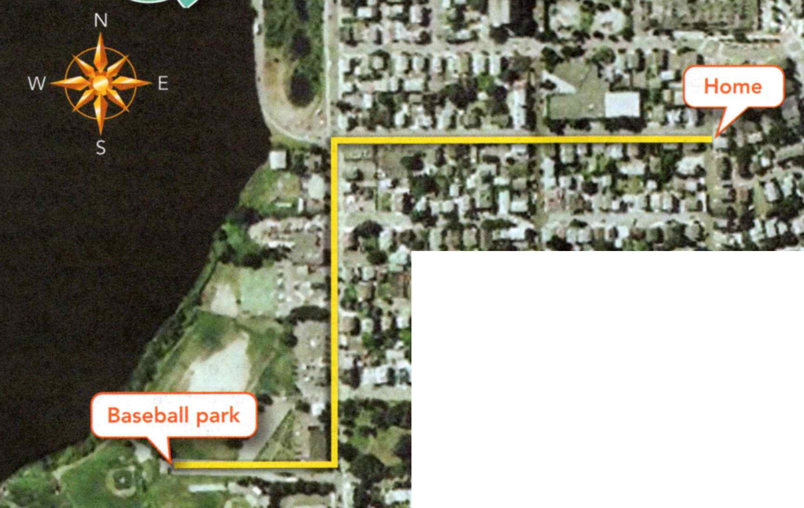
    <figcaption>Figure 3. Map.</figcaption>
  </figure>

2. Mario is planning on riding his bike from his home to the baseball park. He
looks up the route online. The map in Figure 3 shows the route that he will follow. On the
map, 1 cm = 100 m. 
a) Use a metric ruler to determine how far west and
how far south Mario has to travel to get to the park.
b) Suppose Mario is meeting a friend at the park at noon. If he leaves his house at 11:55 A.M., at what average speed does he have to travel to make it there on time? Write your answer in m/s.
3. How do you describe the motion of an object?
4. The velocity of an object is the ____ .

### How Do You Graph Motion?


 <figure>
    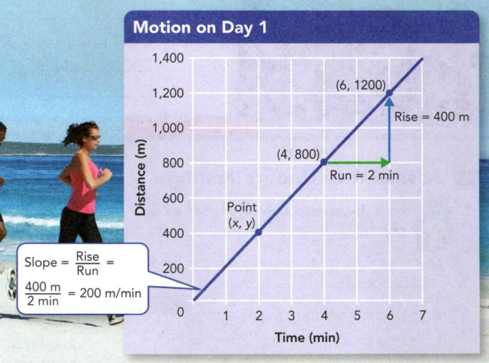
    <figcaption>Figure 4. Constant speed. The graph shows the motion of a jogger.</figcaption>
  </figure>

  <figure>
    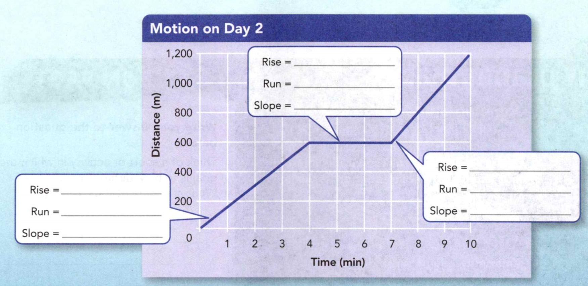
    <figcaption>Figure 5. Changing speed. The graph shows how the speed of a jogger varies during her second day of training.</figcaption>
  </figure>

The graphs you see in Figure 4 and Figure 5 are distance-versus time motion
graphs. **You can show the motion of an object on a line graph in which you plot
distance versus time.** By tradition, time is shown on the horizontal axis, or
x-axis. Distance is shown on the vertical axis, or y-axis. A point on the line
represents the distance an object has traveled during a particular time. The x
value of the point is time, and the y value is distance. 

The steepness of a line
on a graph is called **slope**. The slope tells you how fast one variable changes in
relation to the other variable in the graph. In other words, slope tells you the
rate of change. Since speed is the rate that distance changes in relation to
time, the slope of a distance-versus-time graph represents speed. The steeper
the slope is, the greater the speed. A constant slope represents motion at
constant speed. 

### Calculating Slope 
You can calculate the slope of a line by
dividing the rise by the run. The rise is the vertical difference between any
two points on the line. The run is the horizontal difference between the same
two points. 

 <figure>
    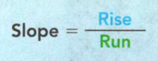
    <figcaption></figcaption>
  </figure>

In Figure 4, using the points shown, the rise is 400 meters and the
run is 2 minutes. To find the slope, you divide 400 meters by 2 minutes. The
slope is 200 meters per minute. 


### Different Slopes 

Most moving objects do not
travel at a constant speed. For example, the graph in Figure 5 shows a jogger's
motion on the second day of training. The line is divided into three segments.
The slope of each segment is different. From the steepness of the slopes you can
tell that the jogger ran fastest during the third segment. The horizontal line
in the second segment shows that the jogger's distance did not change at all.
The jogger was resting during the second segment.


**Complete the tasks below.**   

1. In Figure 4 what is the jogger's speed?   
2. On the same graph, draw a line that represents the motion of a jogger who
moves at a constant speed of 100 m/min.
3. In Figure 5 find the rise, the run, and the slope for each segment of the
graph. Write the answers in the boxes.
4. The ___	of a distance-versus-time graph shows you the speed of a moving object.  
5. The rise of a line on a distance versus-time graph is 900 m and the run is 3
min. What is the slope of the line?  
6. Is it possible for a distanceversus-time graph to be a vertical line? Explain.

### Acceleration   
- What Is Acceleration?
- How Do You Graph Acceleration?

**Complete the tasks below.**   

1. A small spider, less than 2 centimeters long, spots an insect. The spider
crouches and crawls slowly forward. Then it lifts its front legs and leaps,
landing right on its victim! Amazingly, a jumping spider can jump 10 to 40 times
its body length. To capture prey from that far away, it must accurately estimate
its initial velocity. Once the spider jumps, the force of gravity controls its
motion, causing it to follow a curved path. Its velocity changes at every point
along the path until it lands on its prey. 
Think of a sport or activity in which the goal is to hit a target from
far away. What are some of the challenges?


### What Is Acceleration?   

Suppose you are a passenger in a car stopped at a red light. When the light
changes to green, the driver steps on the accelerator. As a result, the car
speeds up, or accelerates. In everyday language, acceleration means "the process
of speeding up."   

Acceleration has a more precise definition in science.
Scientists define **acceleration** as the rate at which velocity changes. Recall
that velocity describes both the speed and direction of an object. A change in
velocity can involve a change in either speed or direction—or both. **In science,
acceleration refers to increasing speed, decreasing speed, or changing
direction.**

### Changing Speed 

Whenever an object's speed changes, the object accelerates. A car that begins to
move from a stopped position or speeds up to pass another car is accelerating.
People can accelerate too. For example, you accelerate when you coast down a
hill on your bike. 

Just as objects can speed up, they can also slow down. This
change in speed is sometimes called deceleration, or negative acceleration. A
car decelerates as it comes to a stop at a red light. A water skier decelerates
as the boat slows down.


### Changing Direction 
Even an object that is traveling at a constant speed can be accelerating. Recall
that acceleration can be a change in direction as well as a change in speed.
Therefore, a car accelerates as it follows a gentle curve in the road or changes
lanes. Runners accelerate as they round the curve in a track. A softball
accelerates when it changes direction as it is hit. 

Many objects continuously
change direction without changing speed. The simplest example of this type of
motion is circular motion, or motion along a circular path. For example, the
seats on a Ferris wheel accelerate because they move in a circle.

**Complete the tasks below.**   

  <figure>
    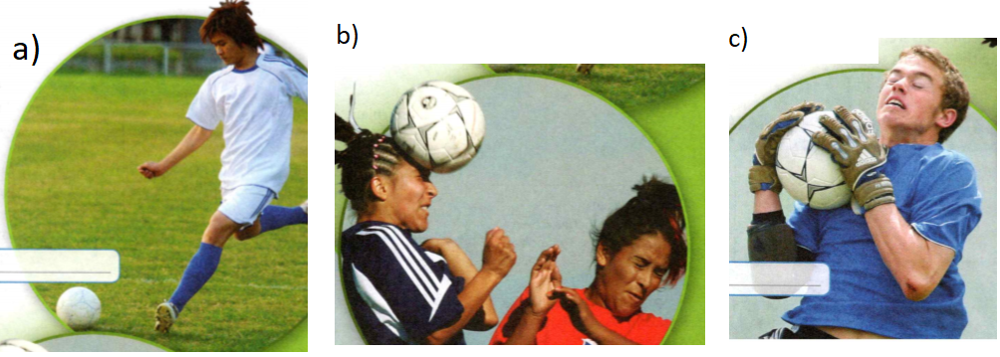
    <figcaption>Figure 7. Acceleration.</figcaption>
  </figure>

1. During the game of soccer, a soccer ball can show three types of
acceleration—increasing speed, decreasing speed, and changing direction.
Label the type of acceleration that is occurring in each of the
photos in Figure 7.

### Calculating Acceleration 
Acceleration describes the rate at which velocity
changes. If an object is not changing direction, you can describe its
acceleration as the rate at which its speed changes. To determine the
acceleration of an object moving in a straight line, you calculate the change in
speed per unit of time. This is summarized by the following equation.

```
Acceleration =  Final Speed — Initial Speed Time
```

If speed is measured in meters per second (m/s) and time is measured in seconds,
the SI unit of acceleration is meters per second per second, or m/s<sup>2</sup>. Suppose
speed is measured in kilometers per hour and time is measured in hours. Then the
unit for acceleration is kilometers per hour per hour, or km/h<sup>2</sup>.

To understand acceleration, imagine a small airplane moving down a runway.
Figure 9 shows the airplane's speed after each second of the first three seconds
of its acceleration. To calculate the acceleration of the airplane, you must
first subtract the initial speed of 0 m/s from its final speed of 24 m/s. Then
divide the change in speed by the time, 3 seconds.

  <figure>
    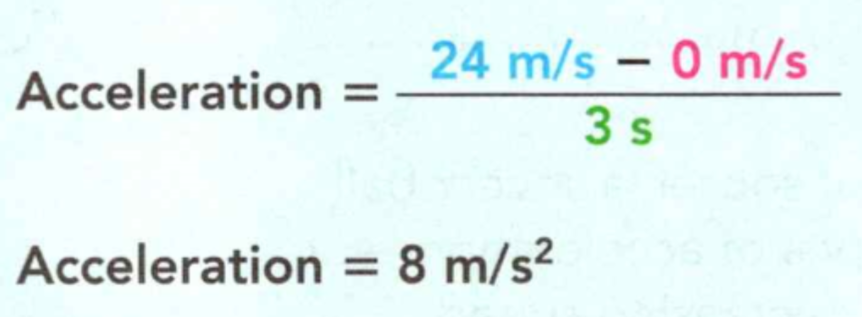
    <figcaption></figcaption>
  </figure>

The airplane accelerates at a rate of 8 m/s<sup>2</sup>. This means that the
airplane's speed increases by 8 m/s every second. Notice in Figure 9 that after
each second of travel, the airplane's speed is 8 m/s greater than its speed in
the previous second.

  <figure>
    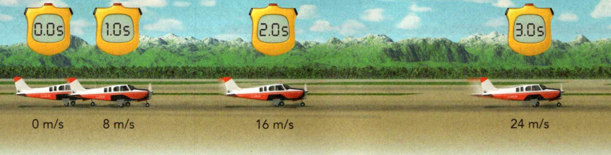
    <figcaption>Figure 9. Acceleration
The airplane is accelerating at a rate of 8 m/s<sup>2</sup>.</figcaption>
  </figure>

**Complete the tasks below.**   

1. Determine the speed of the airplane in Figure 9 at 4.0 s and 5.0 s.

2. An airplane touches down on the runway with a speed of 70 m/s. It decelerates at a rate of - 5 m/s<sup>2</sup>.
Determine the speed of the airplane after each second (1-4) of its deceleration.

3. Large accelerations are part of the thrill in many amusement park rides. The
problems below are based on actual amusement park rides. One type of ride falls
straight down for 3 seconds. During this time, the ride accelerates from a speed
of 0 m/s to a speed of 30 m/s. What is the average acceleration of the ride?

4. A roller coaster accelerates from a speed of 4 m/s to 22 m/s in 3 seconds.
What is the average acceleration of the ride?

5. What is the rate at which velocity changes called?  

6. A softball has a (positive/negative) acceleration when it is thrown. A
softball has a (positive/negative) acceleration when it is caught.

7. A girl skates around the perimeter of a circular ice rink at a constant speed
of 2 m/s. Is the girl accelerating? Explain.


	
### How Do You Graph Acceleration?
Suppose you bike down a long, steep hill. At the top of the hill, your speed is
0 m/s. As you start down the hill, your speed increases. Each second, you move
at a greater speed and travel a greater distance than the second before. During
the five seconds it takes you to reach the bottom of the hill, you are an
accelerating object. **You can use both a speed-versus-time graph and a
distance-versus-time graph to analyze the motion of an accelerating object.**


### Speed-Versus-Time Graph

**Complete the tasks below.** 
1. The data in the table show how your speed changes during each second of your bike ride. Use the data to answer the questions.

  <figure>
    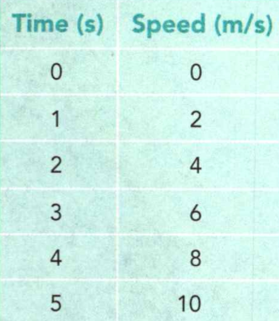
    <figcaption>Figure 10. Speed versus Time.</figcaption>
  </figure>

a) Use this data to plot a line graph. Plot time on the horizontal axis. Plot speed on the vertical axis. Give the graph a title.
b) What is the slope of the graph?

c) Analyzing a Speed-Versus-Time Graph: Look at the speed-versus-time graph that
you made in a). What can you learn about your motion by analyzing this graph?
First, since the line slants upward, the graph shows that your speed was
increasing. Next, since the line is straight, you can tell that your
acceleration was constant. A slanted, straight line on a speed-versustime graph
means that the object is accelerating at a constant rate. Your acceleration is
the slope of the line.


2. The data in the table show how your distance changes during each second of
your bike ride.

  <figure>
    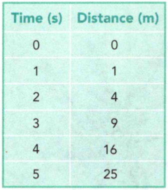
    <figcaption>Figure 11. Distance-Versus-Time Graph.</figcaption>
  </figure>

a) Use this data to create a line graph. Plot time on the horizontal axis. Plot distance on the vertical axis. Give the graph a title.
b) How does the distance change with time?
c) Analyzing a Distance-Versus-Time Graph: Look at the distance-versus-time graph
that you made in a). The curved line tells you that during each second,
you traveled a greater distance than the second before. For example, you
traveled a greater distance during the third second than you did during the
first second. The curved line in a) also tells you that during each second
your speed was greater than the second before. Recall that the slope of a
distance-versus-time graph is the speed of an object. From second to second, the
slope of the line in a) gets steeper. Since the slope is increasing, you
can conclude that your speed was also increasing. You were accelerating.

3. What are the two types of graphs that you can use to analyze the motion of an accelerating object?  
4. Which term, speed or velocity, gives you more information about an object's motion? Why?

### Study Guide  

- An object is in motion if it changes position relative to a reference point.
- To calculate the speed of an object, divide the distance the object travels by the amount of time it takes to travel the distance.
- When you know both the speed and direction of an object's motion, you know the velocity of the object.
- You can show the motion of an object on a line graph in which you plot distance versus time.
- In science, acceleration refers to increasing speed, decreasing speed, or changing direction.
- You can use both a speed-versus-time graph and a distance-versus-time graph to analyze the motion of an accelerating object.
  


**Complete the tasks below.**  

1. What is the SI unit of distance?  
A) foot	
B) meter
C) mile	
D) kilometer
2. What is a change in position with respect to a reference point called?
3. Suppose you are in a train. List some objects that make good reference points
to determine whether or not the train is moving.  

4. Use the illustration to answer Questions.


  <figure>
    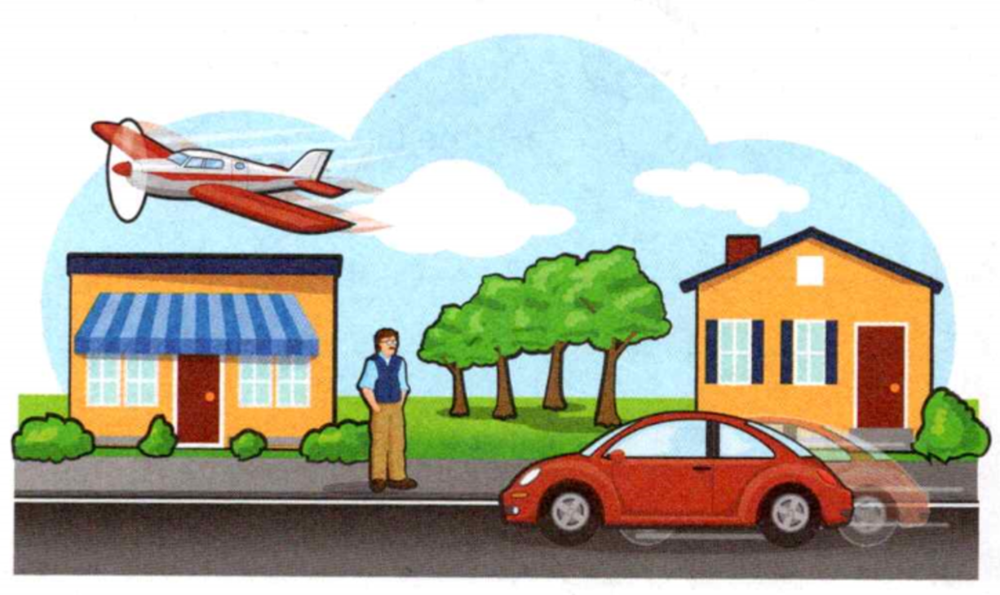
    <figcaption>Figure 12. xxx.</figcaption>
  </figure>

a) Suppose you are standing on the sidewalk. Describe the direction of your
motion relative to the car and the plane. 

b) Suppose you are riding in the
plane. Describe the direction of your motion relative to the person standing on
the sidewalk and the car.
 
6. What quantity can you calculate if you know that a car travels 30 kilometers in 20 minutes?  
A) average speed	
B) direction
C) velocity	
d) instantaneous speed

7. On a graph of distance versus time, the slope of the line indicates the ___
of an object.

8. The graph shows the motion of a remote-control car. Use the graph to answer Question.

  <figure>
    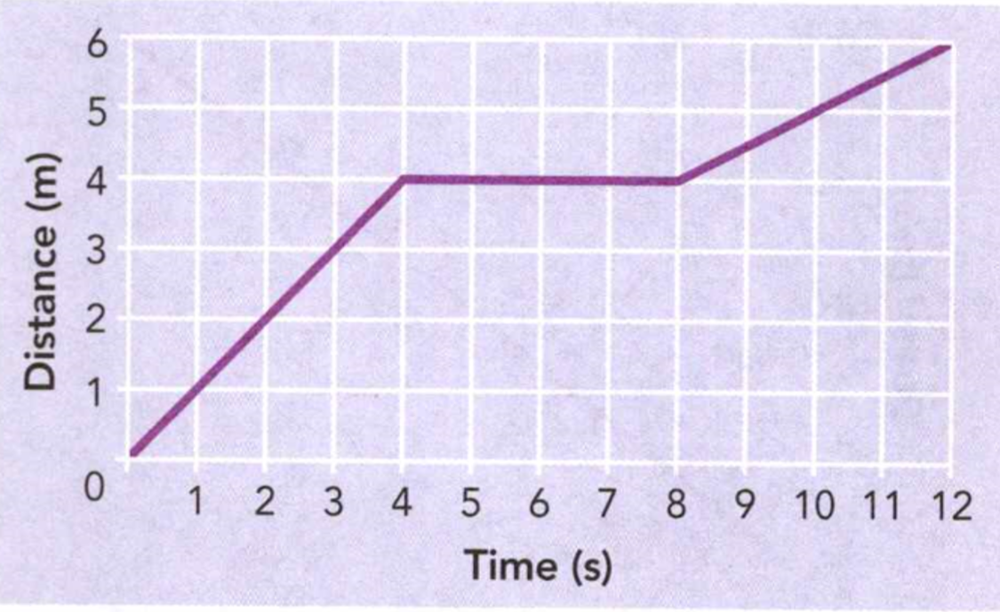
    <figcaption>Figure 13. The motion of a remote-control car.</figcaption>
  </figure>

a) During which time period was the car moving the fastest?
b) What was the speed of the car during the first four seconds?

10. A family takes a car trip. They travel for an hour at 80 km/h and then 2
hours at 40 km/h. Find their average speed during the trip.

11. The rate at which velocity changes is
A) acceleration.	
B) direction.
C) speed.	
D) velocity.

12. You can calculate the acceleration of an object moving in a straight line by dividing the ____________ by the time.


13. The graph below in Figure 14 shows the speed of a downhill skier during a
period of several seconds. Use the graph to answer Question. What is the skier's
acceleration? 

  <figure>
    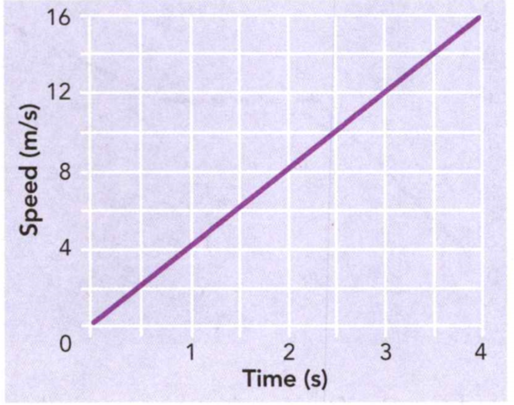
    <figcaption>Figure 14. Speed versus Time.</figcaption>
  </figure>

14. A ball is dropped from a window and takes 2 seconds to reach the ground. It
starts from rest and reaches a final speed of 20 m/s. What is the ball's
acceleration?  
15. Describe how a baseball player accelerates as he runs around the bases after
hitting a home run.

16. The distance-versus-time graph in Figure 15 is for two runners in a 50-meter race.
Describe the motion of the runners in as much detail as you can. Which runner
won the race? How do you know? Suppose the graph showed the runners' motion
until they came to a stop. Describe how the graph would change.

  <figure>
    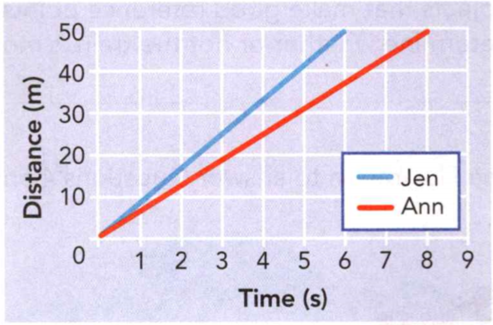
    <figcaption>Figure 15. Distance versus Time.</figcaption>
  </figure>

17. The graph below shows the motion of a runner.

  <figure>
    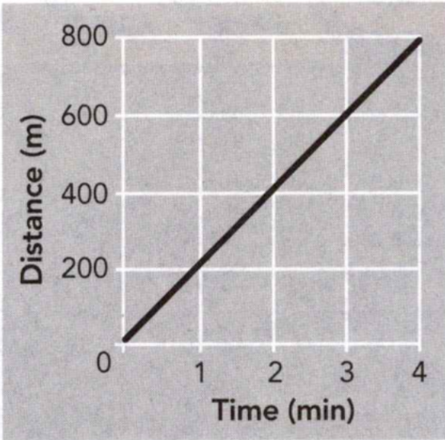
    <figcaption></figcaption>
  </figure>

What could the runner do to make the slope of the line rise?
A) stop running
B) decrease speed
C) maintain the same speed
D) increase speed 

18. Members of the Fairview Track Running Club are running a 5-kilometer race.
What is the distance of the race in meters?
A) 0.5 m
B) 50 m 
C) 500 m
D) 5000 m

19. What condition is necessary for an object to make a good reference point?
A) The object is moving at a constant speed.
B) The object is accelerating.
C) The object is fixed relative to the motion you are trying to describe.
D) The object is large. 


20. Two objects traveling at the same speed have different velocities if they
A) start at different times.
B) travel different distances. 
C) have different masses.
D) move in different directions.

21. Your family is driving to the beach. You travel 200 kilometers in the first
    two hours. During the next hour, you stop for lunch and only travel 25
    kilometers. What was your average speed?
A) 60 km/h
B) 75 km/h 
C) 100 km/h
D) 225 km/h
 
21. The graph above shows the motion of a person. Describe the motion.

  <figure>
    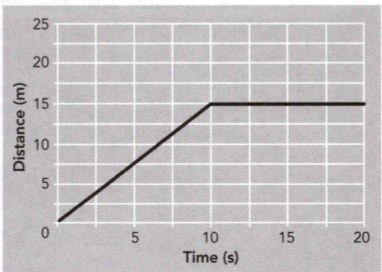
    <figcaption></figcaption>
  </figure>

### The Race for Speed


As soon as people started driving automobiles, someone started racing them.
We've been trying to go faster ever since. 

So how fast can we go? The official
top land speed record was set by a man named Andy Green in Blackrock, Nevada, in
1997. Green and his vehicle, named the Thrust SSC, reached a speed of 1,288
km/h. That's faster than the speed of sound! In fact, the Thrust SSC produced a
sonic boom. A sonic boom sounds a lot like an explosion. Thunder is a natural
sonic boom. 

How did the Thrust SSC go so fast? It used two turbo jet engines. So
Green's previous experience as a fighter pilot came in handy when he was
learning to drive this car. 

There are lots of other speed records.


**Complete the tasks below.**   

1. Research the wheel-driven land speed record and the rail speed record, to start.
Make a graph or chart that compares all of the speed records you can find. 


### Stop Sign  
If you've ever watched a movie about jet pilots or race car drivers, you've
probably heard someone talk about "pulling Gs." But what does that mean? A
G-force is an informal unit of measurement used in aeronautics and space
engineering. One G-force is the average acceleration due to gravity at Earth's
surface. You experience one G-force all the time. In the 1940s and 1950s,
Colonel John Paul Stapp experienced a lot monthan one G-force. At what is now
Edwards Air Force Base, Colonel Stapp strapped himself into a device that
scientists called the Gee Whiz. This was a rocket sled that hurled volunteers
forward before bringing them to a sudden stop along the track. In one of his
runs, Colonel Stapp was subjected to 46 Gs! His work had an impact on everything
from seat belts to the restraints worn by astronauts.

**Complete the tasks below.**  

1. Research what happens when people experience extreme G-forces. Find out what
physical symptoms they are likely to experience and how those symptoms can be
prevented. Design a safety pamphlet describing your findings.

### How do objects react to forces?   
This teen is part of a traveling youth circus that performs in New England. As a
circus trouper, she may do stunts such as tumbling and swinging on a trapeze.
These stunts often appear to be gravity-defying and dangerous, but the troupers
know how to perform in a way that lets them land safely.


