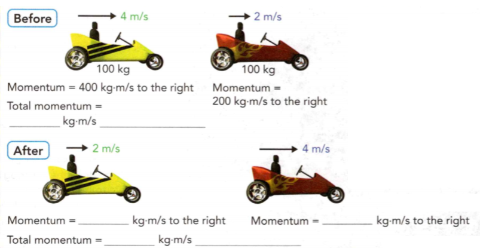

### Physical Science

## Physics

## 08 Forces

**Speed** is the distance an object travels per unit of time.
**Velocity** is speed in a given direction.
**Acceleration** is the rate at which velocity changes with time.

The dashboard of a car displays your **speed** so that you know how fast you're
going. Since this reading doesn't change when you turn, you don't know the car's
**velocity**. If the car did show you your change in velocity, you could calculate
the car's **acceleration**.

**Complete the tasks below.** 

What are three ways to accelerate (change velocity)?

### Vocabulary Skill
Latin Word Origins Many science words in English come from Latin. For example, the word solar, which means "of the sun," comes from the Latin sol, which means "sun."

### Latin Word -	Meaning of Latin Word	- Example
- fortis -	strong -	force, n. a push or pull exerted on an object   
- iners -	inactivity -	inertia, n. the tendency of an object to resist
any change in it


### Chapter Preview

- force
- newton
- net force
- friction
- sliding friction 
- static friction 
- fluid friction 
- rolling friction 
- gravity
- mass
- weight
- inertia
- momentum
- law of conservation of momentum
- free fall
- satellite
- centripetal force
- buoyant force

### The Nature of Force
- How Are Forces Described? 
- How Do Forces Affect Motion?

### Forced to Change
Misconception: Any object that is set in motion will slow down on its own.   

Fact:
A force is needed to change an object's state of motion. A soccer ball sits at
rest. You come along and kick it, sending it flying across the field. It
eventually slows to a stop. You applied a force to start it moving, and then it
stopped all on its own, right? No! Forces cause all changes in motion. Just as
you applied a force to the ball to speed it up from rest, the ground applied a
force to slow it down to a stop. If the ground didn't apply a force to the ball,
it would keep rolling forever without slowing down or stopping.

**Complete the tasks below.**

1. Give an example of a force you apply to slow something down.

2. Where might it be possible to kick a soccer ball and have it never slow down?

### How Are Forces Described?
In science, the word force has a simple and specific meaning. A **force** is a push
or a pull. When one object pushes or pulls another object, the first object
exerts a force on the second object. You exert a force on a computer key when
you push it. You exert a force on a chair when you pull it away from a table.   

**Like velocity and acceleration, a force is described by its strength and by the
direction in which it acts.** Pushing to the left is a different force from
pushing to the right. The direction and strength of a force can be represented
by an arrow. The arrow points in the direction of the force. 
The length of the arrow tells you the strength of the force—the longer the
arrow, the greater the force. The strength of a force is measured in the SI unit
called the newton (N), after scientist Sir Isaac Newton.


### How Do Forces Affect Motion?
Often more than one force acts on an object at the same time. The combination of
all the forces on an object is called the net force. The net force determines if
and how an object will accelerate. You can find the net force on an object by
adding together the strengths of all the individual forces acting on the object.
Look at Figure 1a. The big dog pushes on the box with a force of 16 N to the
right. The small dog pushes on the box with a force of 10 N to the right. The
net force on the box is the sum of these forces. The box will accelerate to the
right. In this situation, there is a nonzero net force. **A nonzero net
force causes a change in the object's motion.**

What if the forces on an object aren't acting in the same direction? In Figure
1b, the big dog pushes with a force of 20 N. The small dog still pushes with a
force of 10 N, but now they're pushing against each other. When forces on an
object act in opposite directions, the strength of the net force is found by
subtracting the strength of the smaller force from the strength of the larger
force. You can still think of this as adding the forces together if you think of
all forces that act to the right as positive forces and all forces that act to
the left as negative forces. The box will accelerate to the right. When forces
act in opposite directions, the net force is in the same direction as the larger
force.

**Complete the tasks below.** 

  <figure>
    
    <figcaption>Figure 1. Net Force.</figcaption>
  </figure>

1. The change in motion of an object is determined by the net force acting on the object.
Calculate and draw an arrow for the net force for each situation in the boxes in Figure 1.

2. Use the information in the text to determine the net force of the two force arrows in Figure 2.
  
  <figure>
    
    <figcaption>Figure 2. Forces.</figcaption>
  </figure>

3. Use what you know about net force to describe the motion of the box in Figure
3. Assume that the box starts at rest. What is the net force on the leash? 

  <figure>
    
    <figcaption>Figure 3. Forces.</figcaption>
  </figure>


4. You pull on your dog's leash to the right with a 12 N force. Your dog pulls
to the left with a 6 N force. Sketch this situation, including labeled force
arrows.


5. You push on a desk with a force of 120 N to the right. Your friend
pushes on the same desk with a force of 90 N to the left. What is the net force
on the desk?
6. Your friend increases her force on the desk by 30 N. She doesn't change the
direction of her push. What happens to the ne force on the desk? Will the desk accelerate?


### Friction and Gravity
- What Factors Affect Friction? 
- What Factors Affect Gravity?

### Space Athletes
Have you ever seen pictures of astronauts playing golf on the moon or playing
catch in a space station? Golf balls and baseballs can float or fly farther in
space, where gravitational forces are weaker than they are on Earth. Imagine
what professional sports would be like in reduced gravity! 

You may not have to
imagine much longer. At least one company specializes in airplane flights that
simulate a reduced gravity environment. Similar to NASA training flights that
astronauts use when preparing to go into space, these flights allow passengers
to fly around the cabin. In environments with reduced gravity, athletes can
perform jumps and stunts that would be impossible on Earth. As technology
improves, permanent stadiums could be built in space for a whole new generation
of athletes.

**Complete the tasks below.** 

1. Sports can be more fun in reduced gravity. What jobs could be harder or less
fun to do in space? Why?

2. What kinds of sports do you think could be more fun in space? Why?

### What Factors Affect Friction?   

If you slide a book across a table, the surface of the book rubs against the
surface of the table. The force that two surfaces exert on each other when they
rub against each other is called **friction**. 

**Two factors that affect the force of
friction are the types of surfaces involved and how hard the surfaces are pushed
together.** A football player is pushing on a blocking sled. If his
coach wanted to make it harder to move the sled, the coach could change the
surface of the sled. Covering the bottom of the sled with rubber would increase
friction and make the sled harder to move. In general, smooth surfaces produce
less friction than rough surfaces. 

What would happen if the football player
switched to a much heavier sled? He would find the heavier sled harder to push
because it pushes down harder against the ground. Similarly, if you rubbed your
hands together forcefully, there would be more friction than if you rubbed your
hands together lightly. Friction increases when surfaces push harder against
each other. 

Friction acts in a direction opposite to the direction of the
object's motion. Without friction, a moving object will not stop until it
strikes another object.

**Complete the tasks below.** 

  <figure>
    
    <figcaption>Figure 4. Friction and Different Surfaces.</figcaption>
  </figure>

1. The strength of friction depends on the types of surfaces involved. 
Rank the surfaces in Figure 4 by how hard it would be to push a sled over them, from
easiest (1) to hardest (3). (Each surface is flat.) What does this ranking tell
you about the amount of friction over these surfaces?


### Sliding Friction

**Sliding friction** occurs when two solid surfaces slide over each other. Sliding
friction is what makes moving objects slow down and stop. Without sliding
friction, a penguin that slid down a hill wouldn't stop until he hit a wall!

  <figure>
    
    <figcaption>Figure 5. Friction acts opposite the direction of motion.</figcaption>
  </figure>

### Static Friction
Static friction acts between objects that aren't moving. Think about trying to
push a couch across the room. If you don't push hard enough, it won't move. The
force that's keeping you from moving it is static friction. Once you push hard
enough to overcome static friction, the couch starts moving and there is no more
static friction. However, there is sliding friction.


### Fluid Friction  
Fluids, such as water and air, are materials that flow easily. **Fluid friction**
occurs when a solid object moves through a fluid. Fluid friction is easier to
overcome than sliding friction. This is why sidewalks become slippery when they
get wet.


### Rolling Friction
When an object rolls across a surface, **rolling friction** occurs. Rolling friction
is much easier to overcome than sliding friction for similar materials. That's
why it's easy to push a bike along the sidewalk when the wheels can turn, but
much harder to push the bike if you're applying the brakes and the tires slide,
not roll.

**Complete the tasks below.** 

1. Your family is moving and isn't sure how to best overcome friction while moving
furniture. You have a spring scale, wood blocks to represent your furniture, and
sandpaper, aluminum foil, marbles, and olive oil as possible surfaces to slide
your furniture over. 
a) Design an experiment that will help you
determine which material will reduce friction the most. 

b) You know that friction
occurs between surfaces when they slide against each other. If you measure the
applied force required to push something across a surface, you know that your
applied force would (increase/decrease) as friction increased. 

c) How
would you determine your applied force in this experiment? 
d) Draw the data table you would use when performing this experiment. 
e) What variables would you have to control to keep your results
accurate?

2. Name four types of friction and give an example of each.

3. What types of friction occur between your bike tires and the ground when you
ride over cement, ride through a puddle, and apply your brakes?


### What Factors Affect Gravity?  
A skydiver would be surprised if she jumped out of a plane and did not fall. We
are so used to objects falling that we may not have thought about why they fall.
One person who thought about it was Sir Isaac Newton. He concluded that a force
acts to pull objects straight down toward the center of Earth. **Gravity** is a
force that pulls objects toward each other.

### Universal Gravitation 
Newton realized that gravity acts everywhere in the
universe, not just on Earth. It is the force that makes skydivers
fall to the ground. It is the force that keeps the moon orbiting around Earth.
It is the force that keeps all the planets in our solar system orbiting around
the sun. 

What Newton realized is now called the law of universal gravitation.
The law of universal gravitation states that the force of gravity acts between
all objects in the universe that have mass. This means that any two objects in
the universe that have mass attract each other. You are attracted not only to
Earth but also to the moon, the other planets in the solar system, and all the
objects around you. Earth and the objects around you are attracted to you as
well. However, you do not notice the attraction among small objects because
these forces are extremely small compared to the force of Earth's attraction.

### Factors Affecting Gravity 
A gravitational force exists between any two objects in the universe. However,
you don't see your pencil fly toward the wall the way you see it fall toward
Earth. That's because the gravitational force between some objects is stronger
than the force between others. You observe only the effects of the strongest
gravitational forces. **Two factors affect the gravitational attraction
between objects: mass and distance.** Mass is a measure of the amount of matter in
an object. The SI unit of mass is the kilogram.  

The more mass an object has, the greater the gravitational force between it and
other objects. Earth's gravitational force on nearby objects is strong because
the mass of Earth is so large. Gravitational
force also depends on the distance between the objects' centers. As distance
increases, gravitational force decreases. That's why Earth can exert a visible
gravitational force on a pencil in your room and not on a pencil on the moon.


### Weight and Mass 
Mass is sometimes confused with weight. Mass is a measure of the amount of
matter in an object. **Weight** is a measure of the force of gravity on an
object. When you stand on a bathroom scale, it displays the gravitational force
Earth is exerting on you. At any given time, your mass is the same on Earth as
it would be on any other planet. But weight varies with the strength of the
gravitational force. A dog has has a different weight at different places in the
solar system. On the moon, he would weigh about one sixth of what he does on
Earth. On Mars, he would weigh just over a third of what he does on Earth.


**Complete the tasks below.** 

1. The Mars Phoenix Lander weighs about 3,400 N on Earth. It weighs about 
1,300 N on Mars. The first scale shows the dog's weight on Earth, it is 60 N. Predict its weight
on the moon and on Mars. 

2. Describe What happens to the gravitational force between two objects when their masses are increased? What happens when the distance between the objects increases?

3. If the mass of Earth increased, what would happen to your weight? What about
your mass?


### Newton's Laws of Motion
- What Is Newton's First Law of Motion? 
- What Is Newton's Second Law of Motion? 
- What Is Newton's Third Law of Motion?


### Horse Force
Sir Isaac Newton: "If a horse draws a stone tied to a rope, the horse (if I may so say) will be equally drawn back towards the stone....".

Scientists have used everyday examples to explain their ideas for hundreds of
years. The quotation is from Newton's Mathematical Principles of Natural
Philosophy, which was first published in the 1680s. Newton used this book to
set down his laws of motion. These three simple laws describe much of the
motion around you, and the continue to be studied today.

**Complete the tasks below.**
1. What current scientific discoveries
might be taught in schools hundreds of years from now?


### What Is Newton's First Law of Motion?  

You would be surprised if a rock started rolling on its own or a raindrop paused
in midair. If an object is not moving, it will not start moving until a
force acts on it. If an object is moving, it will continue at a constant
velocity until a force acts to change its speed or its direction. **Newton's
first law of motion states that an object at rest will remain at rest unless
acted upon by a nonzero net force. An object moving at a constant velocity will
continue moving at a constant velocity unless acted upon by a nonzero net force.**

### Inertia 
All objects, moving or not, resist changes in motion. Resistance to change in
motion is called **inertia**. Newton's first law of motion is also
called the law of inertia. Inertia explains many common events, including why
you move forward in your seat when the car you are in stops suddenly. You keep
moving forward because of inertia. A force, such as the pull of a seat belt, is
needed to pull you back. Roller coasters have safety
bars for the same reason. 

### Inertia Depends on Mass 

Some objects have more inertia
than others. Suppose you need to move an empty backpack and a full backpack. The
greater the mass of an object, the greater its inertia, and the greater the
force required to change its motion. The full backpack is harder to move than
the empty one because it has more mass and therefore more inertia.
 
**Complete the tasks below.** 

1. A roller coaster is hard to stop because it has a lot of inertia.	Use Newton's
first law of motion to explain why you feel tossed around whenever a roller coaster goes over a hill or through a loop.


### What Is Newton's Second Law of Motion?
Which is harder to push, a full shopping cart or an empty one? Who can cause a
greater acceleration on a shopping cart, a small child or a grown adult? 

### Changes in Force and Mass 

Suppose you increase the force on a cart without changing its
mass. The acceleration of the cart will also increase. Your cart will also
accelerate faster if something falls out. This reduces the mass of the cart, and
you keep pushing just as hard. The acceleration of the sled in Figure 2 will
change depending on the mass of the people on it and the force the sled dogs
apply. Newton realized these relationships and found a way to represent them
mathematically. 

### Determining Acceleration 
**Newton's second law of motion states
that an object's acceleration depends on its mass and on the net force acting on
it.** This relationship can be written as follows.

  <figure>
    
    <figcaption></figcaption>
  </figure>


This formula can be rearranged to show how much force must be applied to an
object to get it to accelerate at a certain rate.

  <figure>
    
    <figcaption></figcaption>
  </figure>

Acceleration is measured in meters per second per second (m/s<sup>2</sup>). Mass is
measured in kilograms (kg). Newton's second law shows that force is measured in
kilograms times meters per second per second (kg•m/s<sup>2</sup>). This unit is also called
the newton (N), which is the SI unit of force. One newton is the force required
to give a 1-kg mass an acceleration of 1 m/s<sup>2</sup>.


**Complete the tasks below.** 

1. Suppose that four dogs pull a sled carrying two people.
a) How could you increase the sled's acceleration?
b) How could you decrease the sled's acceleration?

2. Every year in cities around the world, teams create cars, push them across
platforms, and hope they will fly. Unfortunately, the cars always end up
accelerating down into the water. 
a) If a 100-N net force acts on a 50-kg car, what will the acceleration of the
car be?
b) After that same car leaves the platform, gravity causes it to accelerate
downward at a rate of 9.8 m/s<sup>2</sup>. What is the gravitational force on
the car?

3. What equation allows you to calculate the force acting on an object?
4. What is the net force on a 2-kg skateboard accelerating at a rate of 2 m/s<sup>2</sup>?
5. If the mass of the skateboard doubled but the net force on it remained
constant, what would happen to the acceleration of the skateboard?

### What Is Newton's Third Law of Motion?
If you leaned against a wall and it didn't push back on you, you'd fall through.
The force exerted by the wall is equal in strength and opposite in direction to
the force you exert on the wall. **Newton's third law of motion states that if one
object exerts a force on another object, then the second object exerts a force
of equal strength in the opposite direction on the first object.** Another way to
state Newton's third law is that for every action there is an equal but opposite
reaction. 

### Action-Reaction Pairs 
Pairs of action and reaction forces are all
around you. When you walk, you push backward on the ground with your feet. Think
of this as an action force. (It doesn't matter which force is called the
"action" force and which is called the "reaction" force.) The ground pushes
forward on your feet with an equal and opposite force. This is the reaction
force. You can only walk because the ground pushes you forward! In a similar
way, a swimmer moves forward by exerting an action force on the
water with her hands. The water pushes on her hands with an equal reaction force
that propels her body forward.


**Complete the tasks below.** 

1. A swimmer moves because the water pushes her forward when she pushes back on
it. Draw arrows to show the action and reaction forces
between a gymnast and the balance beam. 

2. Action and reaction force pairs are all around you, but they aren't always
obvious. Write down a question about a situation in which you can't identify
what force pairs are at work.

### Detecting Motion 
If you drop your pen, gravity pulls the pen downward. According to Newton's
third law, the pen pulls Earth upward with an equal and opposite reaction force.
You see the pen fall. You don't see Earth accelerate toward the pen. Remember
Newton's second law. If mass increases and force stays the same, acceleration
decreases. The same force acts on both Earth and your pen. Since Earth has such
a large mass, its acceleration is so small that you don't notice it.

### Do Action-Reaction Forces Cancel? 
You have learned that two equal forces acting in opposite directions on an
object cancel each other out and produce no change in motion. So why don't the
action and reaction forces in Newton's third law of motion cancel out as well?  

Action and reaction forces do not cancel out because they act on different
objects. A swimmer exerts a backward action force on the water.
The water exerts an equal but opposite forward reaction force on her hands. The
action and reaction forces act on different objects—the action force acts on the
water and the reaction force acts on her hands. Unlike the swimmer and the
water, the volleyball players in Figuer 8 both exert a force on the same
object—the volleyball. Each player exerts a force on the ball equal in strength
but opposite in direction. The forces on the volleyball are balanced. The ball
does not move toward one player or the other.


  <figure>
    
    <figcaption>Figure 8. Action-Reaction Forces. All the horizontal forces on the volleyball cancel out.</figcaption>
  </figure>


Newton's third law of motion explains why rockets accelerate in space, even
though there is no water or air to push off of. Inside rockets, gas is produced.
When the rockets push that gas backward out of the rocket, a reaction force
occurs that pushes the rocket forward.


**Complete the tasks below.** 

1 A bug was at rest on a tree when it saw the car and decided to fly toward it.
If the bug has a mass of 0.05 kg and accelerates at 2 m/s<sup>2</sup>, what's the net force
on the bug?

2. A driver hates killing bugs. When she saw one coming toward the windshield,
she braked suddenly and hoped it would get out of the way. (Sadly, it did not.)
When she hit the brakes, she felt that she was thrown forward. Use one of
Newton's laws to explain why.


3. The unfortunate bug hits the windshield with a force of 1 N. If you call this
the action force, what is the reaction force? Does the car hit the bug any
harder than the bug hits the car? Use one of Newton's laws to explain why or why
not.

4. Compare the forces on the bug and the car again. Use another one of Newton's
laws to explain why the bug goes splat and the car keeps going, without
noticeably slowing down.

5. A dog pulls on his leash with a 10-N force to the left, but doesn't move.
Identify the reaction force.

6. Using all three of Newton's laws, explain how objects react to forces.


### Momentum
- What Is an Object's Momentum?

### Air Hockey Science
Whoosh—you've just scored a goal! The puck is about to go back into play. How
can you keep the puck out of your goal and get it back into your opponent's? One
of the factors you have to consider is momentum. Momentum is a physical quantity
that all moving objects have. If you know about momentum, you can predict how an
object will act when it collides with other objects. With some quick scientific
thinking, you can get the puck to bounce all over the table and back into your
opponent's goal!

**Complete the tasks below.** 

1. Why might it be better to try to bounce a puck off the wall rather than shoot
it El straight into your opponent's goal?
2. Where else could it be helpful to know how objects act after colliding?  

### What Is an Object's Momentum?
Is it harder to stop a rolling bowling ball or a rolling marble? Does your
answer depend on the velocities of the objects? All moving objects have what
Newton called a "quantity of motion?' Today its called momentum. **Momentum** 
is a characteristic of a moving object that is related to the mass and
the velocity of the object. **The momentum of a moving object can be deter- mined
by multiplying the object's mass by its velocity.**

```
Momentum = Mass x Velocity
```

Since mass is measured in kilograms and velocity is measured in meters per
second, the unit for momentum is kilograms times meters per second (kg m/s).
Like velocity, acceleration, and force, momentum is described by both a
direction and a strength. The momentum of an object is in the same direction as
its velocity. 

The more momentum a moving object has, the harder it is to stop.
For example, a 0.1 kg baseball moving at 40 m/s has a momentum of 4 kg m/s in
the direction it's moving. 
```
Momentum = 0.1 kg x 40 m/s 
Momentum = 4 kg m/s But a
```
But a 1,200-kg car moving at the same speed as the baseball has a much greater
momentum: 48,000 kg m/s. The velocity of an object also affects the amount of
momentum it has. For example, a tennis ball served by a professional tennis
player has a large momentum. Although the ball has small mass it travels at a high velocity.


### Conservation of Momentum 
Imagine you're driving a go-cart. If you ran into another go-cart that was at
rest and got stuck to it, what do you think would happen to your momentum?
Before you hit the other go-cart, your momentum was just your mass times your
velocity. How has the additional mass changed that momentum? It actually hasn't
changed it at all!   

A quantity that is conserved is the same after an event as it was before. The
law of conservation of momentum states that, in the absence of outside forces
like friction, the total momentum of objects that interact does not change. The
amount of momentum two cars have is the same before and after they interact.
**The total momentum of any group of objects remains the same, or is conserved,
unless outside forces act on the objects.**


### "Non-Sticky" Collisions
Look at this example of a collision. When two objects of the same mass don't
stick together and outside forces (such as friction) are I negligible, the
objects just trade velocities. The car that is going faster before the collision
will end up slowing down, and the car that is going slower before the collision
I will end up speeding up.  

  <figure>
    
    <figcaption>Figure 9. "Non-Sticky" Collision.</figcaption>
  </figure>


### "Sticky" Collisions
Sometimes objects end up I sticking together during a collision. These two
cars, which have the same mass, got tangled together after they collided.
Since the green car was at rest and had a momentum of zero, only the blue car
had any momentum before the collision. After they collided and stuck
together, the cars shared that momentum. The total momentum of the two 
cars stayed the same.
 	

 <figure>
    
    <figcaption>Figure 10. "Sticky" Collision.</figcaption>
  </figure>

**Complete the tasks below.** 


1. Complete the equations describing the momentum of each collision in Figure 9 and 10. Identify the direction in
each case.

2. How can a heavy moving van have the same momentum as a small motorcycle?

3. What is the momentum of a 750-kg car traveling at a velocity of 25 m/s?

4. The total momentum of two marbles before a collision is 0.06 kg.m/s. No
outside forces act on the marbles. What is the total momentum of the marbles
after the collision?


### Free Fall and Circular Motion
- What Is Free Fall?
- What Keeps a Satellite in Orbit?

### Finding Yourself
The GPS (Global Positioning System) is a "constellation" of satellites that
orbit 10,600 miles above Earth. The GPS makes it possible for people with ground
receivers to pin- point their geographic location. The first GPS satellites were
placed in orbit in 1978. These early satellites were expected to operate for
approximately five years. Newer satellites have an expected lifespan of seven to
eight years.

### What Is Free Fall?
When the only force acting on an object is gravity, the object is said to be in
free fall. The force of gravity causes the object to accelerate. **Free fall is
motion where the acceleration is caused by gravity.** When something falls on
Earth, there is fluid friction from the air around it. This friction acts
against gravity, reducing the acceleration of falling objects. Air friction
increases as an object falls. If an object falls for long enough, increased air
friction will reduce its acceleration to zero. The object will continue to fall,
but it will fall at a constant velocity.   

Near the surface of Earth, the acceleration due to gravity is 9.8 m/s<sup>2</sup>. If there
were no air friction, a falling object would have a velocity of 9.8 m/s after
one second and 19.6 m/s after two seconds. Since air friction reduces
acceleration, an object falling on Earth for one second will actually have a
velocity that is less than 9.8 m/s.

  <figure>
    
    <figcaption>Figure 11. Free fall.</figcaption>
  </figure>

### Free Fall
The photo in Figure 11 shows a tennis ball and a crumpled piece of paper of
different masses as they fall during a fraction of a second. If the only force
acting on them were gravity, they would fall at exactly the same rate and line
up perfectly. However, air friction is also present. Air friction has a greater
effect on the paper's acceleration than on the tennis ball's acceleration. This
causes the tennis ball to fall faster.

**Complete the tasks below.** 

1. Suppose you had a chamber with no air, eliminating the force of air friction.
Complete the table below for an object that is dropped from rest. Remember the
formula
```
Velocity = Acceleration x Time. 
```
The acceleration due to gravity is 9.8 m/s2.


### What Keeps a Satellite in Orbit?
Objects don't always fall down in straight lines. If you throw a ball
horizontally, the ball will move away from you while gravity pulls the ball to
the ground. The horizontal and vertical motions act independently, and the ball
follows a curved path toward the ground. If you throw the ball faster, it will
land even farther in front of you. The faster you throw an object, the farther
it travels before it lands. 

### Satellite Motion 
This explains how satellites, which
are objects that orbit around other objects in space, follow a curved path
around Earth. What would happen if you were on a high mountain and could throw a
ball as fast as you wanted? The faster you threw it, the farther away it would
land. But, at a certain speed, the curved path of the ball would match the
curved surface of Earth. Although the ball would keep falling due to gravity,
Earth's surface would curve away from the ball at the same rate. The ball would
fall around Earth in a circle, as shown in Figure 12.

**Satellites in orbit around Earth continuously fall toward Earth, but because
Earth is curved they travel around it.** In other words, a satellite is a falling
object that keeps missing the ground! It falls around Earth rather than onto it.
Once it has entered a stable orbit, a satellite does not need fuel. It continues
to move ahead due to its inertia. At the same time, gravity continuously changes
the satellite's direction. Most satellites are launched at a speed of about
7,900 m/s. That's more than 17,000 miles per hour!

  <figure>
    
    <figcaption>Figure 12. Satellite Motion.</figcaption>
  </figure>

**Complete the tasks below.** 
1. A satellite launched from Earth enters orbit because the curve of its path
matches the curved surface of Earth. 
a) On the picture in Figure 12, draw arrows
representing the gravitational force on the ball at each point.   
b) Explain why Earth's atmosphere would prevent this baseball from ever actually
being thrown into orbit. Why is this not a problem for satellites?

### Centripetal Force 
Many manufactured satellites orbit Earth in an almost circular
path. Recall that an object traveling in a circle is accelerating because it
constantly changes direction. If an object is accelerating, a force must be
acting on it. A force that causes an object to move in a circular path is a
**centripetal force**. The word centripetal means
"center-seeking." Centripetal forces always point toward the center of the
circle an object is moving in. If you could turn off a centripetal force,
inertia would cause the object to fly off in a straight line. For example, the
string of a yo-yo being swung in a circle provides a centripetal force. Cutting
the string would cut off the centripetal force, and the yo-yo would fly off in a
straight line.

**Complete the tasks below.** 

1. What is creating the centripetal force in each
situation below?
a) A tetherball swinging around a pole
b) Mars orbiting around the sun
c) A child standing on a merry-go-round

2. What is the force that causes objects to move in circles?

3. If Earth's gravity could be turned off, what would happen to satellites that
are currently in orbit? Explain your reasoning.

### Sinking and Floating   
- What Makes Things Float? 
- What Will Float?

For several decades in the nineteenth and twentieth centuries, the Greenpoint
oil spill polluted the Newtown Creek between Brooklyn and Queens in New York
City. I happen to live in Queens and love animals and the water. The spill
caused oil and other chemicals to float on top of the water. It threatened all
the sea life that lived in the New York Harbor. 

I am happy that our government
declared Newtown Creek a Superfund site in 2010. The Superfund program is
responsible for cleaning up the most dangerous and harmful waste sites in the
United States. I hope that in a few years the oil and chemicals will be gone and
the sea life will swim in Newtown Creek once again.

**Complete the tasks below.** 

1. How do you think the fact that oil floats affects the clean-up process? 


### What Makes Things Float?
The ability to float is called buoyancy. You know that ships float. However,
things can happen that make a ship sink. Small craft on a pond or huge oil
tankers that cross the ocean can become sunken wrecks within a few hours. How
could this happen? To understand buoyancy, you need to understand the buoyant
force. 


### Buoyant Force 
If you have ever picked up an object under water, you know
that it seems much lighter in water than in air. Water and other fluids exert an
upward force, called buoyant force, on a submerged object. Fluid pressure is
exerted in all directions. Because fluid pressure increases with depth, there is
greater force exerted on the bottom of a submerged object than on top. As you
can see in Figure 13, this difference in pressure results in a net force in the
upward direction, called buoyant force. Buoyant force acts in the opposite
direction to the force of gravity, so it makes an object feel lighter. 

  <figure>
    
    <figcaption>Figure 13. Fluid pressure is shown by the green force arrows surrounding the balls.</figcaption>
  </figure>

### Unequal Forces

Fluid pressure exerts force all over the ball's surface. The total force pushing
upward is greater than the total force pushing down.

### Net Buoyant Force

The result of the forces pushing on the ball is a net upward force, called
buoyant force. The blue arrow shows the buoyant force on the ball.

### Measuring Buoyant Force 

You know that all objects take up space. A submerged object
displaces, or takes the place of, a volume of fluid equal to its own volume. A
partly submerged object, however, displaces a volume of fluid equal to the
volume of its submerged portion only.

A ship floats as long as the buoyant force acting on it is equal to its total
weight. If the empty spaces in a ship fill with water, then the buoyant force
will no longer be able to keep the ship afloat. The ship will sink. The floating
personal watercraft in Figure 2 displaces a certain volume of water. The weight
of the displaced water equals the buoyant force acting on the watercraft.

  <figure>
    
    <figcaption>Figure 14. Displacement. The personal watercraft is only partly submerged, so it displaces a volume of water equal to just the part that is submerged.</figcaption>
  </figure>


**Complete the tasks below.** 

1. The personal watercraft in Figure 14 is only partly submerged, so it
displaces a volume of water equal to just the part that is submerged. 
a) Use a pencil to fill in the space taken up by the watercraft.
b) How does the submerged volume of the watercraft compare to the total volume?

  <figure>
    
    <figcaption>Figure 15.</figcaption>
  </figure>

2. All fluids, including milk, shampoo, and air, exert buoyant force. Some
fluids exert a stronger buoyant force than others.
a) See Figure 15. The brick weighs the most in (air/water/syrup).
b) (Water/Syrup) exerts greater buoyant force on the brick.
c) What variables are controlled in the experiment?

3. Buoyant force results from fluid pressure (increasing/decreasing) with depth.  
4. Dense fluids exert _______ buoyant force than less dense fluids
because they have more mass within a certain volume than a less dense fluid.

### What Will Float?

There are two ways to determine whether an object will sink or float in a fluid.
**To predict whether an object will sink or float, you can compare the
densities of the object and the fluid it is in, or you can find the net force
acting on the object.** 

### Density and Floating 
Think about a bottle of
oil-andvinegar salad dressing. Recall how the dressing separates into layers as
it sits undisturbed on a counter. Even though the oil appears thick and sticky,
its density is less than the density of the vinegar in the dressing. The oil
rises to the surface of the vinegar and floats. 

### Changing Density 
A pure substance has a characteristic density. However, density can be affected
by phase changes and variables such as temperature. For example, when liquid
water freezes, its particles move farther apart. As a result, an ice cube
occupies slightly more space than the same mass of liquid water. That's why ice
is less dense than water, and why ice floats in water. 

You can make an object sink or float in a fluid by changing its density. Some
submarines work this way. To make the submarine rise, water is pumped out of
special tanks, reducing the submarine's mass while its volume remains the same.
To make the submarine sink, water is let into the tanks.

### Buoyant Force and Floating 

Remember that the weight of an object is a downward force determined by its mass
and the force of gravity. The combination of an object's weight and the buoyant
force is the net force acting on the object. The net force determines whether
the object sinks or floats:

- If the weight of an object is greater than the buoyant force, the net force
will be downward and the object will sink.
- If the weight of an object is less than the buoyant force, the net force will
be upward and the object will rise.
- If the weight and buoyant force are equal and not in motion, or balanced,
there is no net force and the object will neither rise nor sink.

Figure 17 shows how the net force is different for three objects with about the
same volume. You can also think about how buoyant force can change for a certain
amount of mass. A solid clay ball will sink in water. However, if you shape the
clay into a bowl, it takes up more volume. If big enough, the bowl will generate
a buoyant force big enough to counteract the weight of clay.

Think again about a ship floating in the water. The weight of the water
displaced by the ship equals the weight of the ship, so the ship floats. If the
ship is damaged, it begins to fill with water. The water increases the ship's
weight by replacing air, which is lighter. The buoyant force also increases as
more of the ship sinks into the water. But once the entire ship sinks into the
water, the buoyant force can no longer increase. The ship continues to fill with
water. The weight of the ship becomes greater than the buoyant force, so the
ship sinks.

The larger an object, the more buoyant force it will generate. But as you have
learned, the buoyant force must equal the object's weight for it to float. One
way to make an object bigger while keeping its weight the same is to decrease
its density. For example, a solid block of steel sinks. But if the steel were
shaped into a ship, which is bigger and less dense than the block, the ship
would float. The ship displaces more water than the steel block and thus
generates enough buoyant force to balance the steel's weight.

**Complete the tasks below.** 

1. Complete the table in Figure 16 by determining the density of each substance. Then
mark and label in the graduated cylinder where each material would float.

  <figure>
    
    <figcaption>Figure 16.</figcaption>
  </figure>

2. You release a basketball, a full water balloon, and a rock underwater. Use the force arrows shown to indicate whether each object will rise, sink, or stay in place. 
a) Basketball
b) Full water balloon
c) Rock

  <figure>
    
    <figcaption>Figure 17. Rising or Sinking.</figcaption>
  </figure>

3. The personal watercraft shown in Figure 18 floats because the buoyant force acting
on it balances its weight. What happens when two people sit on the watercraft?
a) The weight (increases/decreases/is the same).
b) Does the watercraft displace more water, less water, or the same amount of water? Explain.
c) How does the buoyant force change? Explain.

  <figure>
    
    <figcaption>Figure 18. Personal watercraft.</figcaption>
  </figure>


4. Underline the sentence that uses the scientific meaning of force. Then write
the scientific definition.
- I had to force my sister to give me the balloon.
- The net force on the balloon was in an upward direction.

5. An object that is (less/more) dense than the fluid it is in will sink. An
object that is (less/more) dense than the fluid it is in will float.

6. The net force acting on an object that is sinking is ____ ?

### Study Guide
	
- Like velocity and acceleration, a force is described by its strength and by
the direction in which it acts. 
- A nonzero net force causes a change in the
object's motion. 
- Two factors that affect the force of friction are the types
of surfaces involved and how hard the surfaces are pushed together. 
- Two factors affect the gravitational attraction between objects: their masses and
distance. 
- Objects at rest will remain at rest and objects moving at a
constant velocity will continue moving at a constant velocity unless they are
acted upon by nonzero net forces. 
- The acceleration of an object depends on
its mass and on the net force acting on it. 
- If one object exerts a force on
another object, then the second object exerts a force of equal strength in the
opposite direction on the first object. 
- The momentum of a moving object can be determined by multiplying the object's
mass by its velocity. 
- The total momentum of any group of objects remains the same, or is conserved,
unless outside forces act on the objects. 
- Free fall is motion where the acceleration
is caused by gravity. 
- Satellites in orbit around Earth continuously fall
toward Earth, but because Earth is curved they travel around it. 
- Buoyant force acts in the opposite direction to the force of gravity, so it
makes an object feel lighter.
- To predict whether an object will sink or float, you can compare the densities
of the object and the fluid it is in, or you can find the net force acting on
the object.

**Complete the tasks below.** 

1. When a nonzero net force acts on an object, the force
A) changes the motion of the object.
B) must be greater than the reaction force.
C) does not change the motion of the object.
D) is equal to the weight of the object.

2. What is the SI unit of force?

3. What is the net force on the box in Figure 19? Be sure to specify direction.
  <figure>
    
    <figcaption>Figure 19.</figcaption>
  </figure>

4. Friction always acts
A) in the same direction as motion.
B) opposite the direction of motion.
C) perpendicular to the direction of motion.
D) at a 30° angle to the direction of motion.

5. What are the factors that affect the gravitational force between two objects?
	
6. What are two ways you can increase the frictional force between two objects?  

7. Design a ride for an amusement park. Describe the ride and explain how
friction and gravity will affect the ride's design.

8. Which of Newton's laws of motion is also called the law of inertia?
A) First	
B) Second
C) Third	
D) Fourth

9. Newton's second law states that force is equal to ____ .	

10. Look at the diagram in Figure 20 of two students pulling a bag of volleyball equipment. The friction force between the bag and the floor is 4 N. What is the net force acting on the bag? What is the acceleration of the bag?

  <figure>
    
    <figcaption>Figure 20.</figcaption>
  </figure>

11. Suppose you are an astronaut making a space walk outside your space station and your jet pack runs out of fuel. How can you use your empty jet pack to get you back to the station?  

12. Momentum is calculated by multiplying 
A) mass times velocity. 
B) weight times mass.
C) force times speed. 
D) inertia times force.

13. What is the SI unit of momentum?

14. How can two objects of different masses have the same momentum?

15. Satellites remain in orbit around Earth because
A) the moon's gravitational pull on them is equal to Earth's pull.
B) no forces act on them.
C) their motors keep them moving in circles.
D) the curve of their paths as they fall matches the curve of Earth.

16. Centripetal forces always point ____ .

17. Determine the velocity of an object that started from rest and has been in free
fall for 10 seconds. Assume there is no air resistance.   

18. A helium-filled balloon will float in air because
A) there is more air than helium.
B) helium is less dense than air.
C) helium is more dense than air.
D) helium and air have equal densities.

19. Apply Concepts Iron has a density of 7.9 g/cm<sup>3</sup>. Mercury has a density of
13.6 g/cm<sup>3</sup>. Determine whether iron will float or sink in mercury, and tell why.

20. Forces are all around you. Describe an example of each of Newton's laws of
motion that you experience before you get to school in the morning.

1. In the balloon diagram above, why don't the two forces cancel each other out?
A) They are not equal.
B) They both act on the air.
C) They both act on the balloon.
D) They act on different objects.

2. An object is floating in a container of water. Which force opposes gravity?
A) inertia
B) friction
C) buoyant force
D) centripetal force

3. What force makes it less likely for a person to slip on a dry sidewalk than on an icy sidewalk?
A) gravity
B) friction
C) inertia
D) momentum

4. A satellite orbits Earth at a constant speed. What part of the satellite's motion is changing?
A) speed
B) friction
C) inertia
D) acceleration 

5. Where would a 5-kg object experience the greatest gravitational force?
A) on the moon
B) at sea level 
C) at the top of a tall mountain
D) at the bottom of the ocean

6. In a game of tug-of-war, you pull on the rope with a force of 100 N to the right and your friend pulls on the rope with a force of 100 N to the left. What is the net force on the rope?
A) 200 N to the right
B) 200 N to the left
C) 0 N
D) 100 N to the right


7. Use all three of Newton's laws of motion to describe what happens when a car
starts off at rest, is pushed across a platform, and then accelerates downward.

8. Race car drivers travel at higher speeds than most drivers experience. A
five-point harness provides extra security at these high speeds.

Did you wear your seat belt the last time you rode in a car? Seat belts are
safety restraints designed to protect you from injury while you travel in a
moving vehicle, whether you stop suddenly to avoid a crash or are stopped
suddenly by a crash.

Without a seat belt, inertia would cause the driver and passengers in a car that
suddenly stopped to continue traveling forward. Without a restraint, a
75-kilogram driver driving at 50 km/h would experience 12,000 newtons of force
in a crash! A safety restraint prevents that forward motion and keeps the driver
and passengers safe.

Safety harnesses and seat belts are available in many different designs. Most
seat belts are three-point harnesses. Five- and seven-point harnesses are used
in vehicles like race cars and fighter jets.

Most states have laws that require drivers and passengers to wear seat
belts. Research the seat belt laws in your state, and participate in a class
debate about whether the seat belt laws are strong enough.


9. Could you lift an elephant with water? It depends on the container the water is
in! Suppose you have a sealed container completely full of water. If you apply
pressure to one area of the container, that pressure is exerted equally in all
parts of the fluid and on the inner surfaces of the container. This is Pascal's
principle, named for Blaise Pascal, a French scientist who lived in the 1600s.  

Hydraulic systems are based on Pascal's principle. In these systems, a force
presses a piston against an enclosed fluid. The force transfers with the same
pressure throughout the fluid and presses a second piston outward. If the two
pistons are the same size, the inward force and the outward force are the same.  

What if the surface areas of the two pistons differ? Suppose the output piston's
surface area is four times greater than that of the input piston. Four times
more fluid presses against the output piston, which applies four times the
force. With a system like that, you could lift an elephant with water! 

Hydraulic car lifts a, hydraulic brakes are two technologies that work because
of Pascal's principle. Research another hydraulic device and diagram how it
works.

10. How do machines make it easier to do work? A Formula 1 race car is waved
into the pit, where a group of mechanics is ready to replace the tires. Formula
1 race cars are heavy—they must have a mass of at least 605 kg, including the
driver. The pit crew can't lift the car or replace the tires by hand, so they use many tools to help get the job
done. With the right tools, the pit crew can quickly get their car back into the
race. How does a mechanic lift up a heavy race car?

