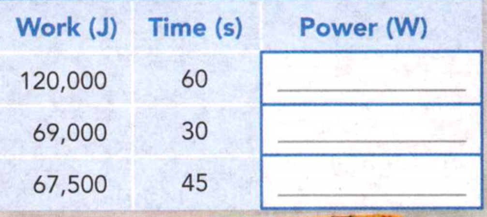
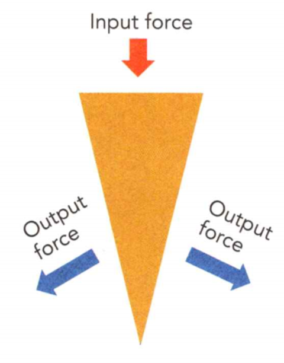
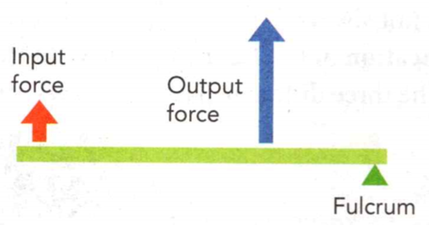
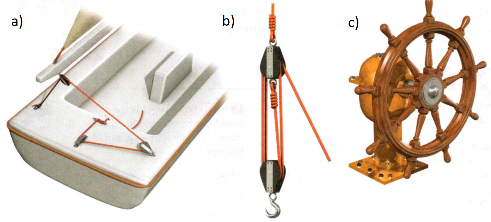

### Physical Science

## Physics

## 9 Work and Machines

A ***force*** is a push or pull exerted on an object.   

***Weight*** is a measure of the force of gravity on an object.

**Complete the tasks below.** 

1. Charles wants to move his bed across the room, but the weight of the bed is too
great for him to lift it. However, he can generate enough force to push the bed.
What forces are acting on the bed as Charles pushes it across the floor?


Word	Everyday Meaning	Scientific Meaning
### work	
Everyday Meaning: A job or responsibility	
Example: She carried her backpack	which that force is exerted
to work every day.

Scientific Meaning: The product of a force and the distance over
Example: It takes twice as much work to lift a
suitcase 2 meters as it does to lift it 1 meter.

### machine	
	
Everyday Meaning: A motorized device   
Example: A washing machine contains a large rotating basin.  
Scientific Meaning: Any device that makes work easier  
Example: A wheelbarrow is a machine that lets you lift more weight than you normally could.   

**Complete the tasks below.** 

1. Which sentence below uses the scientific meaning of the word work.
A) Jim did work on the bed to move it out of his room.
B) Tina had a lot of work to do at the end of the semester.

### Chapter Preview


- work
- joule 
- power 
- watt
- machine
- input force
- output force
- mechanical advantage 
- efficiency
- simple machine
- inclined plane
- wedge
- screw
- lever
- fulcrum
- pulley
- wheel and axle
- compound machine

### Work and Power

### How Is Work Defined?
If you push a child on a swing, you are doing work on the child. If you pull
your books out of your backpack, you do work on your books. In scientific terms,
you do work any time you exert a force on an object that causes the object to
move some distance.
***Work is done on an object when the object moves in the same direction in which
the force is exerted.***


**Complete the tasks below.** 

1. You've heard of weightlifting, but bus-pulling? People have made a sport out
   of pulling huge objects using their muscles - sometimes their ears! Talk
   about extreme sports! Manjit Singh used his ears to drag this double-decker
   bus for 5 meters. David Huxley pulled an air- plane for more than 90 mete
   landing him in the Guinness World Records book. These competitors have
   certainly worked hard to get to the top.   
a) What factors might have affected how much work these competitors did?
b) Name an everyday task that you would consider to be a lot of work.


### No Work Without Motion 
Suppose you push on a car that is stuck in the mud. You certainly exert a force
on the car, so it might seem as if you do work. But if the force you exert does
not make the car move, you are not doing any work on it. To do work on an
object, the object must move some distance as a result of your force. If the
object does not move, no work is done, no matter how much force is exerted.

### Force in the Same Direction 
Think about carrying your backpack to school in the morning. You know that you
exert a force on your backpack when you carry it, but you do not do any work on
it. To do work on an object, the force you exert must be in the same direction
as the object's motion. When you carry an object while walking at constant
velocity, you exert an upward force on the object. The motion of the object is
in the horizontal direction. Since the force is vertical and the motion is
horizontal, you don't do any work.

  <figure>
    
    <figcaption>Figure 1. Three different ways to move a cello.</figcaption>
  </figure>


Figure 1 shows three different ways to move a cello. You can lift it off the ground and carry it, you can push it parallel to the ground, or you can pull it at an angle to the ground. The weight of the cello is the same in each situation, but the amount of work varies.

  <figure>
    
    <figcaption>Figure 2. When April lifts a trumpet or a tuba up the stairs, she does work..</figcaption>
  </figure>

### Calculating Work 

Look at Figure 2. Which do you think involves more work: lifting a 40-newton
tuba up three steps (about 0.5 meters), or lifting a 5-newton trumpet up the
same three steps? Your common sense may suggest that lifting a heavier object
requires more work than lifting a lighter object. This is true. But is it more
work to lift an instrument up three steps or up to the top story of a building?
As you might guess, moving an object a greater distance requires more work than
moving the same object a shorter distance. The amount of work you do depends on
both the amount of force you exert and the distance the object moves. **The amount
of work done on an object can be determined by multiplying force times distance.**
```
Work = Force x Distance
```

When you lift an object, the upward force you exert must be at least equal to
the object's weight. So, to lift the trumpet, you would have to exert a force of
5 newtons. The distance you lift the trumpet is 0.5 meters. The amount of work
you do on the trumpet can be calculated using the work formula.
```
Work = Force x Distance 
Work = 5 N x 0.5 m
Work = 2.5 Nm
```

To lift the tuba, you would have to exert a force of 40 newtons. So the amount
of work you do would be 40 newtons X 0.5 meters, or 20 Nm. You do more work to
lift the heavier object.

Participants in the Empire State Building Run-Up race up the skyscraper's
stairs. For a 500 N person to climb 1,576 steps (320 m) it takes 160,000 J of
work. That's enough work to lift an elephant over 3 m!


When force is measured in newtons and distance in meters, the SI unit of work is
the newton-meter (Nm). This unit is also called a joule in honor of James
Prescott Joule, a physicist who studied work in the mid-1800s. One joule (J) is
the amount of work you do when you exert a force of 1 newton to move an object a
distance of 1 meter. It takes 2.5 joules of work to lift the trumpet up three
steps. Lifting the tuba the same distance requires 20 joules of work.


**Complete the tasks below.** 

1. A climber does work on his equipment as he carries it up the mountain. 

a) On a warm day, the climber does 3,000J of work to get his pack up the mountain.
On a snowy day, he adds equipment to his pack. If he climbs to the same height,
he would do (more/less/the same amount of) work.
b) If the climber's pack stayed the same weight and the climber only climbed
halfway up, he would do (more/less/the same amount of) work. 
c) How much work does the climber do on his pack if his pack weighs 90 N he
climbs to a height of 30 m?
d) On a different trip, the climber's pack weighs twice as much and he climbs
twice as high. How many times more work does he do on this pack than the one in
question c)?

2. A waiter carries a 5-newton tray of food while he walks a distance of 10
meters. Is work done on the tray? Why or why not?

3. You're holding your dog's leash and trying to stand still as he pulls on the
leash at an angle. You move forward. (All of/Some of/ None of) his force does
work on you.

4. How much work do you do when you push a shopping cart with a force of 50 N
for a distance of 5 m?

### What Is Power?
If you carry a backpack up a flight of stairs, the work you do is the same
whether you walk or run. The amount of work you do on an object is not affected
by the time it takes to do the work. But scientists keep track of how fast work
is done with a rate called power.

**Power** is the rate at which work is done. **Power equals the amount of work
done on an object in a unit of time.** You need more power to run up the stairs
with your backpack than to walk because it takes you less time to do the same
work.

You can think of power in another way. An object that has more power than
another object does more work in the same time. It can also mean doing the same
amount of work in less time.

### Calculating Power 
Whenever you know how fast work is done, you can calculate power. Power is
calculated by dividing the amount of work done by the amount of time it takes to
do the work. This can be written as the following formula.
```
Power = Work / Time
```

Since work is equal to force times distance, you can rewrite the equation for
power as follows.

```
Power = (Force x Distance) / Time
```


**Complete the tasks below.** 

  <figure>
    
    <figcaption>Figure 3. Work and Power.</figcaption>
  </figure>

1. April carried her moving boxes up a flight of stairs (Figure 3). Notice how
much time it took her. Suppose April ran instead. Fill in the second
panel to show how much time it would take her.

### Power Units 
You may have heard car advertisements mention horsepower. The term isn't
misleading. It's the same kind of power you just learned how to calculate. When
work is measured in joules and time in seconds, the SI unit of power is the
joule per second (J/s). This unit is also known as the watt (W). One joule of
work done in one second is one watt of power. In other words, 1 J/s = 1 W. A
watt is very small, so power is often measured in larger units such as kilowatts
or horsepower. One kilowatt (kW) equals 1,000 watts. One horsepower equals 746
watts.


**Complete the tasks below.** 

1. When a tow truck pulls a car, it applies a force over a distance. Work is done
in a horizontal direction.   

Recall the formula for power is
```
Power = Work/Time
```
If a tow truck does 10,000 J of work in 5 seconds, then the power of the truck
is calculated as follows.
```
Power = 10000J/5s = 2000W
```

Complete the table in Figure 4 by calculating the power of the
tow truck in each case.

  <figure>
    
    <figcaption>Figure 4. Calculating power.</figcaption>
  </figure>

### Understanding Machines

- What Does a Machine Do?
- What Is Mechanical Advantage? 
- What Is Efficiency?

### Sticks and Stones
When you need to peel an apple or open a can of soup, you reach for the right
tool to do the job. 

Some animals use items such as sticks and rocks to make finding or eating their
food easier. For example, woodpecker finches and capuchin monkeys use sticks to
get food out of places they can't reach. Sea otters and Egyptian vultures both
use rocks as tools. Otters use rocks to pry shellfish away from other rocks.
Egyptian vultures use their beaks to pick up rocks and break open eggs to eat.


**Complete the tasks below.** 

1. How does a rock make it easier for a chimpanzee to crack
open nuts? What human tools would you use to do the same job?

### What Does a Machine Do?

What do you picture when you hear the word machine? You may think of machines as
complex gadgets with motors, but a machine can be as simple as a ramp.
***Machines*** are devices that allow you to do work in an easier way. Machines
do not reduce the amount of work you do. Instead, they just change the way you
do work. In Figure 1, April does the same amount of work to move her speaker
onto the stage whether or not she uses a ramp. The ramp makes that work easier.
***A machine makes work easier by changing at least one of three factors: the
amount of force you exert, the distance over which you exert your force, or the
direction in which you exert your force.***

### Input Versus Output 

  <figure>
    
    <figcaption>Figure 5. Using a ramp makes it easier for April to move the speaker onto the stage.</figcaption>
  </figure>

When you do work, the force you exert is called the ***input force***. You exert your
input force over the input distance. In Figure 5B, April's input force is the
force she uses to pull the speaker up the ramp. The input distance is the length
of the ramp. The machine exerts the ***output force*** over the output distance. The
weight of the speaker is the output force. The height of the ramp is the output
distance. Input force times input distance equals input work. Output force times
output distance equals output work. Since machines do not reduce the work you
do, your output work can never be greater than your input work.

**Complete the tasks below.** 

1. In Figure 5B, draw a line that represents April's output distance and an arrow that represents her output force.


  <figure>
    
    <figcaption>Figure 6. Making Work Easier. The devices shown all make work easier in different ways. The arrows on the photos show how the machines change input work.</figcaption>
  </figure>


### Changing Force 
In some machines, the output force is greater than the input force. How can this
happen? Recall the formula for work: Work = Force x Distance. If the amount of
work stays the same, a decrease in force means an increase in distance. So if a
machine allows you to use less input force to do the same amount of work, you
must apply that smaller input force over a greater distance.

You see machines that work like this every day. How hard would it be to turn on
a faucet that didn't have a handle? Since the handle is wider than the shaft of
the faucet, your hand turns a greater distance than it would if you turned the
shaft directly. Turning the handle a greater distance allows you to use less
force.


### Changing Distance 

In some machines, the output force is less than the input force. This kind of
machine allows you to exert your input force over a shorter distance. In order
to apply a force over a shorter distance, you need to apply a greater input
force. When do you use this kind of machine? Think of a pair of chopsticks. When
you use chopsticks to eat, you move the hand holding the chopsticks a short
distance. The other end of the chopsticks moves a greater distance, allowing you
to pick up and eat a large piece of food with a small movement.

### Changing Direction 

  <figure>
    
    <figcaption>Figure 8. Changing direction.</figcaption>
  </figure>

Some machines don't change either force or distance. The photo above shows a
machine called a pulley attached to a bucket. (You'll learn more about pulleys
soon.) The pulley doesn't increase input force or distance. However, by changing
the direction of the input force, the pulley makes it much easier to move the
bucket to the top of a building—you can just pull down on the rope. Without a
pulley, you would have to carry the bucket up a ladder or staircase. A flagpole
rigging is also a pulley.


**Complete the tasks below.** 

  <figure>
    
    <figcaption>Figure 7. Input work equals Output work.</figcaption>
  </figure>

1. Complete the equation In Figure 7. Be sure to describe each quantity as large or small.

2. Name two examples of machines for which the output force is greater than the input force.

3. Suppose that you use a pair of chopsticks and apply a force of 1 N over a
distance of 0.01 m. How much work do you do? If the output force of the
chopsticks is only 0.5 N, how far do the tips of the chopsticks move?

### What Is Mechanical Advantage?
You've just learned how to describe machines using words, but you can also
describe machines with numbers. A machine's ***mechanical advantage*** is the number
of times a machine increases a force exerted on it. ***The ratio of output force to
input force is the mechanical advantage of a machine.***

```
Mechanical advantage = Output force/Input force
```

### Increasing Force 

When the output force is greater than the input force, the mechanical advantage
of a machine is greater than 1. You exert an input force of 10 newtons on a can
opener, and the opener exerts an output force of 30 newtons. The mechanical
advantage of the can opener is calculated below.
```
Output force/Input force = 30 N / 10 N = 3
```
The can opener triples your input force!

### Increasing Distance 

When a machine increases distance, the output force is less than the input
force. The mechanical advantage is less than 1. If input force is 20 newtons and
the output force is 10 newtons, the mechanical advantage is shown below.

```
Output force/Input force = 10 N /	20 N = 0.5 
```

Your input force is cut in half, but your input distance is doubled.


### Changing Direction 

What can you predict about the mechanical advantage of a machine that changes
the direction of the force? If only the direction changes, input force will be
the same as the output force. The mechanical advantage will always be 1.


**Complete the tasks below.** 

  <figure>
    
    <figcaption>Figure 9. Mechanical Advantage. Drums are tuned by tightening and loosening bolts. Drum keys make the bolts easier to turn.
.</figcaption>
  </figure>


1. When April in Figure 9 provides an input force of 10 N, the drum key provides an output force of 15. 
a) Is the output force acting on the same direction as the input force?
b) Calculate the mechanical advantage of the drum key.
c) Since the drum key increases April's input force, is her input distance greater or smaller
than the key's output distance?

  <figure>
    
    <figcaption>Figure 10. Mechanical advantages of ramps.</figcaption>
  </figure>

2. The graph in Figure 10 shows input and output force data for three different ramps. Use the graph to answer the questions below. (The actual ramps are not pictured. Do not confuse the lines in the graph with the ramps themselves!)
a) If an 80 N input force is exerted on Ramp 2, what is the output force?
b) Find the slope of the line for each ramp.
c) Why does the slope represent each ramp's mechanical advantage?
d) On the graph above, plot a line for a ramp that has a mechanical advantage of 3.
e) Which ramp is the steepest? How do you know?


### What Is Efficiency?  

So far you have assumed that the work you put into a machine is exactly equal to
the work done by the machine. In an ideal situation, this would be true. In real
situations, however, the output work is always less than the input work.

### Overcoming Friction 

If you have ever tried to cut something with rusty scissors, you know that a
large part of your work is wasted overcoming the friction between the parts of
the scissors. 

All machines waste some work overcoming the force of friction. A
common way to reduce friction is to lubricate or wax surfaces. The less friction
there is, the closer the output work is to the input work. The **efficiency** of a
machine compares output work to input work. Efficiency is expressed as a
percentage. The higher the percentage, the more efficient the machine is. If you
know the input work and output work for a machine, you can calculate a machine's
efficiency.


### Calculating Efficiency

**To calculate the efficiency of a machine, divide the output work by the input
work and multiply the result by 100 percent.** This is summarized by the following
formula.

```
Efficiency = Output work / Input work = 100%
```

**Complete the tasks below.** 

1. Calculate the efficiency of a bicycle if the input work to turn the pedals is
45 J and the output work is 30 J. Show your calculations.

2. What will happen to the efficiency of the bike after the gears have been
cleaned and the chain has been oiled?


### Real and Ideal Machines   

A machine with an efficiency of 100 percent would be an ideal machine. Since all
machines lose work to friction, ideal machines do not exist. All machines have
an efficiency of less than 100 percent. 

How does this affect mechanical
advantage? Ideal mechanical advantage is your input distance divided by the
machine's output distance. It is often related to the measurements of a machine.
What you have calculated so far (output force divided by input force) is actual
mechanical advantage. If machines were ideal and input work was equal to output
work, ideal and actual mechanical advantages would be equal. Because of
friction, actual mechanical advantage is always less than ideal mechanical
advantage.

**Complete the tasks below.** 

1. The balls of this Newton's cradle may swing for a long time, but they will eventually come to rest. Discuss where in this machine work is lost due to friction. Explain your reasoning.

2. a) Real machines have an efficiency of less than 100% because some work is wasted to overcome  
b) What happens to the efficiency of a bicycle as it gets rusty? What must you
do to maintain the same amount of output work?

### Inclined Planes and Levers
- How Do Inclined Planes Work? 
- How Are Levers Classified?

### Is It a Machine?

<figure>
  
  <figcaption>Figure 11. Truck and motorbike.</figcaption>
</figure>

Which objects in the photo in Figure 11 are machines? If you guessed the truck and the
motorbike, you're correct - but not completely! Remember, a device doesn't have to
be complicated or motorized in order to be a machine. Look between the truck and
the motorbike. The ramp is a machine. Look at the person rolling the bike up the
ramp. His hands hold the handlebars. His knees bend to help him walk. These are
examples of simple machines. The motorbike and the truck contain many simple
machines. There are dozens of machines in this photo, not just the two with
motors.

**Complete the tasks below.** 

1. What kind of work is made easier by the ramp in Figure 11?
2. What are other examples of ramps that you have seen or used?

### How Do Inclined Planes Work?

Machines can be as simple as chopsticks or as complex as motorbikes. Any complex
machine can be broken down into smaller building blocks called simple machines.
A simple machine is the most basic device for making work easier. Three closely
related simple machines - the inclined plane, the wedge, and the screw—form the
inclined plane family.

### Inclined Plane   

Lifting a heavy object such as a motorbike is much easier with a ramp. A ramp is
an example of a simple machine called an inclined plane. An inclined plane is a
flat, sloped surface.

How It Works. **An inclined plane allows you to exert your input force over a
longer distance.** As a result, the input force needed is less than the output
force. The input force you use on an inclined plane is the force with which you
push or pull an object along the slope. The inclined plane's output force is
equal to the object's weight.

**Mechanical Advantage** You can determine the ideal mechanical advantage of an
inclined plane by dividing the length of the incline by its height.


**Complete the tasks below.** 

  <figure>
    
    <figcaption>Figure 12. Ramps.</figcaption>
  </figure>

1. Imagine you were pushing a wheelchair up the ramps in the drawing in Figure 12.
Which would be the hardest to use? Why?

2. Calculate the ideal mechanical advantage of each ramp using the following
formula.
```
Ideal mechanical advantage = Length of ramp / Height of ramp
```

3. The ramp with the (smallest/greatest) mechanical advantage is the steepest.


### Wedge  

  <figure>
    
    <figcaption>Figure 13. Wedge.</figcaption>
  </figure>

If you've ever sliced an apple with a knife or pulled up a zipper, you are
familiar with another simple machine known as a wedge. A **wedge** is a device that
is thick at one end and tapers to a thin edge at the other end.

How It Works: Think of a wedge as an inclined plane (or two back-to-back
inclined planes) that moves. **When you use a wedge, instead of moving an object
along the inclined plane, you move the inclined plane itself.** For example, when
an ax is used to split wood, the ax handle exerts a force on the blade of the
ax, which is the wedge. That force pushes the wedge down into the wood. The
wedge in turn exerts an output force at a 90° angle to its slope, splitting the
wood in two.

**Mechanical Advantage** The ideal mechanical advantage of a wedge is determined by
dividing the length of the wedge by its width. The longer and thinner a wedge
is, the greater its mechanical advantage. When you sharpen a knife, you make the
wedge thinner. This increases its mechanical advantage. That is why sharp knives
cut better than dull knives.

```
Ideal mechanical advantage = Length of wedge / Width of wedge
```

**Complete the tasks below.** 

1. Calculate the ideal mechanical advantage of the firefighter's wedge if it is
4 cm wide and 22 cm long


### Screw 

Like a wedge, a screw is a simple machine that is related to the inclined plane.
A screw can be thought of as an inclined plane wrapped around a cylinder.

How It Works When you twist a screw into a piece of wood, you exert an input
force on the screw. **The threads of a screw act like an inclined plane to
increase the distance over which you exert the input force.** As the threads of
the screw turn, they exert an output force on the wood. Friction holds the screw
in place. Other examples of screws include bolts, drills, and jar lids.  

**Mechanical Advantage** Think of the length around the threads of a screw as the
length of an inclined plane and the length of the screw as the height of an
inclined plane. The ideal mechanical advantage of the screw is the length around
the threads divided by the length of the screw—just as the ideal mechanical
advantage of an inclined plane is its length divided by its height. The closer
together the threads of a screw are, the greater the mechanical advantage.

  <figure>
    
    <figcaption>Figure 14. A screw with ten threads.</figcaption>
  </figure>

**Complete the tasks below.** 

1. a) What is the mechanical advantage of the screw in Figure 14?
b) On the smooth screw next to it, draw in the threads to make a screw that is
the same length but would be easier to screw into a piece of wood. 

2. List three closely related simple machines in the inclined plane family.   

3. A simple inclined plane makes work easier by decreasing the input
(force/distance) required to move the object.

4. Name one way inclined planes and screws are similar and one way they are
different.

### How Are Levers Classified?   

Have you ever ridden on a seesaw or used a spoon to eat your food? If so, then
you are already familiar with another simple machine called a lever. A **lever** is
a rigid bar that is free to pivot, or rotate, on a fixed point. The fixed point
that a lever pivots around is called the **fulcrum**.

How It Works: To understand how levers work, think about using a spoon. Your
wrist acts as the fulcrum. The bowl of the spoon is placed near your food. When
you turn your wrist, you exert an input force on the handle, and the spoon
pivots on the fulcrum. As a result, the bowl of the spoon digs in, exerting an
output force on your food.


**Complete the tasks below.** 

  <figure>
    
    <figcaption>Figure 15. Levers.</figcaption>
  </figure>

1. A seesaw is a type of lever in which the fulcrum is located halfway between the input and output forces.
a) Draw a diagram of a seesaw. Label the fulcrum, the input force, and the output force. 
2. The diagrams in Figure 15 show levers in which the fulcrum is not centered.
Write the name of a machine that matches each diagram.

### Mechanical Advantage 

Using a lever like a spoon doesn't increase your input force or change the
direction of your input force. Instead, it increases your input distance. When
you use a spoon, you only have to move the handle a short distance in order to
scoop up food over a longer distance. However, you need to apply a greater force
than you would have without the spoon.

The ideal mechanical advantage of a lever is determined using the following
formula.
```
Ideal mechanical advantage = Distance from fulcrum to input force / Distance from fulcrum to output force
```
In the case of the spoo n, the distance from the fulcrum to the input force is
less than the distance from the fulcrum to the output force. This means that the
mechanical advantage is less than 1.


### Types of Levers 

When a spoon is used as a lever, the input force is located
between the fulcrum and the output force. But this is not always the case.
**Levers are classified according to the location of the fulcrum relative to the
input and output forces.** The three different classes of levers are explained
on the next page.

**Complete the tasks below.**

  <figure>
    
    <figcaption>Figure 16. Hockey stick.</figcaption>
  </figure>

1. A hockey stick in Figure 16 is an example of a lever. Your shoulder acts as the fulcrum of
the lever. The output force is exerted where the stick hits the puck. You exert
the input force where your bottom hand grips the stick. What is the mechanical
advantage of a hockey stick that is gripped at point D and hits the puck at point A? 	

a) that is gripped at point D and hits the puck at point B?   

b) Would the mechanical advantage of a hockey stick ever be greater than 1? Explain.

### Three Classes of Levers  

The three classes of levers differ in the positions of the fulcrum, input force, and output force.	

### First-Class Levers 

  <figure>
    
    <figcaption>Figure 17. First-class levers.</figcaption>
  </figure>

First-class levers change the direction of the input force. They also increase
force or distance. Force increases if the fulcrum is closer to the output
force. Distance increases if the fulcrum is closer to the input force. Examples
of first-class levers include seesaws and scissors.

### Second-Class Levers

  <figure>
    
    <figcaption>Figure 18. Second-class levers.</figcaption>
  </figure>

Second-class levers increase force. They do not change the direction of the
input force. Examples include doors, nutcrackers, and bottle openers. The
mechanical advantage of second-class levers is always greater than 1.

### Third-Class Levers

  <figure>
    
    <figcaption>Figure 19. Third-class levers.</figcaption>
  </figure>

Third-class levers increase distance, but do not change the direction of the
input force. Examples include spoons, shovels, and baseball bats. The mechanical
advantage of third-class levers is always less than 1.

**Complete the tasks below.** 

1. Describe how each class of lever makes work easier.  

2. a) What is the mechanical advantage of a lever with 2 m between the input force
and the fulcrum and 1 m between the output force and the fulcrum?
b) What class(es) of lever could the lever from the previous question be?
Explain.

### Putting Machines Together  

- What Simple Machines Make Use of Turning?
- How Does a Compound Machine Do Work?

### Lidar Alert
One of the oldest forms of transportation in the world - the sailboat - may benefit
from new technology: a mobile lidar station. Lidar (short for light detection
and ranging) stations sense wind speed and direction using laser beams. The new
station, developed by Chinese scientists, fits on a bus that can be parked near
bodies of water. Sailors need to know about wind speed and direction to position
their sails. With the information they gather from these new lidar stations and
the simple machines they use to control their sails, sailors can greatly improve
their chances of navigating safely and winning races. 


**Complete the tasks below.** 

1. Why might sailboat makers incorporate simple machines into their designs?

2. What is another example of pairing advanced technology with simple machines?

### What Simple Machines. Make Use of Turning?  

If you have ever pulled a suitcase with wheels that were stuck, you know that it
is easier to move the suitcase when the wheels can turn. **Two simple machines
take advantage of turning: the pulley and the wheel and axle.**  

### How a Pulley Works   

When you raise a sail on a sailboat, you are using a pulley. A **pulley** is a
simple machine made of a grooved wheel with a rope or cable wrapped around it.
You use a pulley by pulling on one end of the rope. This is the input force. At
the other end of the rope, the output force pulls up on the object you want to
move. The grooved wheel turns. This makes it easier to move the rope than if it
had just been looped over a stick. To move an object some distance, a pulley can
make work easier in two ways. It can decrease the amount of input force needed
to lift the object. It can also change the direction of your input force. For
example, when you pull down on a flagpole rope, the flag moves up.


**Complete the tasks below.** 

  <figure>
    
    <figcaption>Figure 20. Simple Machines in Sailboats.</figcaption>
  </figure>

1. You can find many simple machines on a sailboat. In Figure 20 are some
diagrams of different parts of a sailboat. Which of the machines on the diagram
are pulleys?

### Types of Pulleys 
A pulley that you attach to a structure is a fixed pulley. Fixed pulleys are
used at the tops of flagpoles. A movable pulley is attached directly to the
object you are attempting to move. Construction cranes often use movable
pulleys. Combining fixed and movable pulleys makes a pulley system called a
block and tackle. The direction of the input force of a block and tackle could
be either up or down depending on the arrangement of the rope and pulleys. The
ideal mechanical advantage of a pulley or pulley system is equal to the number
of sections of rope that support the object. Don't include the rope on which you
pull downward though, because it does not support the object.

### Fixed Pulley

  <figure>
    
    <figcaption>Figure 21. Fixed Pulley.</figcaption>
  </figure>

A fixed pulley changes the direction of force but not the amount applied.
Mechanical advantage = 1.

### Movable Pulley  

  <figure>
    
    <figcaption>Figure 22. Movable Pulley.</figcaption>
  </figure>

A movable pulley decreases the amount of input force needed. It does not change
the direction of the force. Mechanical advantage = 2.


### Block and Tackle   

  <figure>
    
    <figcaption>Figure 23. Block and Tackle.</figcaption>
  </figure>

A block and tackle is a pulley system made up of fixed and movable pulleys.
Mechanical advantage = 3.


**Complete the tasks below.** 

  <figure>
    
    <figcaption>Figure 24. The pulley system shown here allows the painter to raise or lower himself.</figcaption>
  </figure>

1. Suppose the painter in Figure 24 pulls down on the rope with just enough
force to lift himself. 
a) Draw and label arrows to indicate the direction of the
input and output forces. Draw one of the arrows longer to indicate which force
is greater.   
b) What is the mechanical advantage of this pulley system?    
c) What is the benefit of combining fixed and movable pulleys in a system like
this one?   

### How a Wheel and Axle Works 

  <figure>
    
    <figcaption>Figure 25. Wheel and Axle.</figcaption>
  </figure>

You use a screwdriver to tighten screws because it is much easier to turn the
handle instead of turning the screw itself. A simple machine made of two
connected objects that rotate about a common axis is called a **wheel and axle**.
The object with the larger radius is the wheel. In a screwdriver, the handle is
the wheel and the shaft is the axle. When you turn the wheel, the axle rotates.
The axle exerts a larger output force over a shorter distance.  

If you apply force to the axle, your output force will be less than your input
force. However, it will be exerted over a greater distance. This is how a paddle
wheel on a boat works. The boat's motor turns an axle that turns the boat's
wheel, pushing the boat forward a greater distance.


### Mechanical Advantage 
The ideal mechanical advantage of a wheel and axle is the radius of the wheel
divided by the radius of the axle. (A radius is the distance from the outer edge
of a circle to the circle's center.) The greater the ratio of the wheel radius
to the axle radius, the greater the advantage.
```
Ideal mechanical advantage = Radius of wheel / Radius of axle
```

**Complete the tasks below.** 

  <figure>
    
    <figcaption>Figure 26. The screwdrivers have the same shaft radius. The blue screwdriver has a larger handle radius.</figcaption>
  </figure>

1. Which screwdriver in Figure 26 has the greater mechanical advantage?   

2. The blue screwdriver a) in Figure 26 has a handle radius of 1.5 cm and a
shaft radius of 0.25 cm. What is its mechanical advantage?	

3. List two examples of a wheel and axle. Which of your examples has the greater
mechanical advantage?

4. You exert a 100 N force on a pulley system to lift 300 N. What's the
mechanical advantage of this system? How many sections of rope support the
weight?

### How Does a Compound Machine Do Work?  

Suppose you and your neighbors volunteer to clean up a local park. Will the job
be easier if just a few people help or if everyone in the neighborhood works
together? Getting a job done is usually easier if many people work on it.
Similarly, doing work can be easier if more than one simple machine is used. A
machine that combines two or more simple machines is called a **compound machine**.

**Within a compound machine, the output force of one simple machine becomes the
input force of another simple machine.** Think about a stapler. The handle is a
lever. Each tip of a staple acts as a wedge. Suppose the lever has a mechanical
advantage of 0.8 and the wedge has mechanical advantage of 2. If you input a
force of 10 N on the lever, the output force of the lever will be 8 N. That 8 N
becomes the input force of the wedge, and the final output force is 8 N times 2,
or 16 N.

Recall that mechanical advantage is output force divided by input force. The
mechanical advantage of the stapler is 16 N divided by 10 N, or 1.6. There is
another way to calculate this value. You can multiply the mechanical advantages
of the stapler's component machines, the lever (0.8) and the wedge (2). The
ideal mechanical advantage of a compound machine is the product of the ideal
mechanical advantages of the simple machines that it consists of.

**Complete the tasks below.** 

  <figure>
    
    <figcaption>Figure 27. Compound machines: Apple peeler.</figcaption>
  </figure>

1. The compound machine in Figure 27 consists of two or more simple machines.   
a) Circle and identify three simple machines that make up the apple peeler.   
b) If the mechanical advantages of the component machines in the peeler are 2,
3, and 12, what is the overall mechanical advantage of the apple peeler?   

  <figure>
    
    <figcaption>Figure 28. Piano movers use compound machines to get their job done. 
    </figcaption>
  </figure>

2. a) Calculate the mecnanicai advantage (MA) of each simple machine in the
compound machine in Figure 28 (The simple machine mounted on the truck has an
inner radius of 0.05 m and an outer radius of 0.25 m.)    
b) What is the Overall mechanical advantacie?

3. What is the mechanical advantage of a pencil sharpener made from a wheel and
axle with a mechanical advantage of 3 and a wedge with a mechanical advantage of 4?

4. Explain how simple and compound machines make it easier to do work.

5. Work is done when a ____ 	is applied in the direction of motion.  

6. ____ make it easier to do work.


### Study Guide

- Work is done on an object when the object moves in the same direction in which the force is exerted.  
- The amount of work done on an object can be determined by multiplying force times distance.  
- Power equals the amount of work done on an object in a unit of time.   
- A machine makes work easier by changing force, distance, or direction.   
- The ratio of output force to input force is the mechanical advantage of a machine.   
- To calculate the efficiency of a machine, divide the output work by the input
work and multiply the result by 100 percent.   
- Three closely related simple machines—the inclined plane, the wedge, and the
screw—form the inclined plane family.  
- Levers are classified according to the location of the fulcrum relative to the
input and output forces.   
- Two simple machines make use of turning: the pulley and the wheel and axle.
- Within a compound machine, the output force of one simple machine becomes the
input force of another simple machine.

**Complete the tasks below.** 

1. The amount of work done on an object is found by multiplying  
A) force times distance.	
B) force times time.
C) power times efficiency. 
D) speed times time.

2. What is the rate at which work is done called?  

3. You go rock climbing with a pack that weighs 70 N and you reach a height of
30 m.   
a) How much work did you do to lift your pack?   
b) If you finished the climb in 10 minutes (600 s), what was your power?   

4. What do automobile makers mean when they say their cars are more powerful
than their competitors' cars?  

5. Your friend's parents tell him that he needs to do more work around the
house. How can your friend use science to explain to them that he does plenty of
work just by going through his daily activities?

6. One way a machine can make work easier is by  
A) increasing force	
B) decreasing time
C) increasing work	
D) reducing work

7. The actual mechanical advantage of any machine is its _____ divided by its
_____ .

8. You and your friends are building a treehouse, and you need a machine to get
a heavy load of wood from the ground to the top of the tree. You set up a pulley
system that allows you to pull down on a rope to lift the wood up. You end up
able to lift a load you normally couldn't. In what way(s) does your machine make
work easier?   

9. You are designing an experiment to test the efficiency of different bikes.
What variables do you have to control?    

10. You push on an old skateboard with a force of 20 N. The output force is only
10 N. What is the skateboard's efficiency? How would the efficiency change if
the old, rusty ball bearings were replaced with new ones?

11. Which of these is an example of a simple machine from the inclined plane family?   
A) baseball bat	
B) jar lid
C) bottle opener	
d) wheelbarrow  

12. What is the fixed point that a lever pivots around called?   

  <figure>
    
    <figcaption>Figure 29. 2 ramps.</figcaption>
  </figure>

13. Which ramp in Figure 29 has the greater ideal mechanical advantage?

14. Your friend wants to design a wheelbarrow with an ideal mechanical advantage
    of 5,000. Do you think your friend should consider a different design?
    Explain.

15. Draw one example of each of the three different classes of levers. For each
lever, measure the distance between the fulcrum and the input force, the
distance between the fulcrum and the output force, and calculate the ideal
mechanical advantage.

16. Which of these is an example of a wheel and axle?
A) axe	
B) seesaw
C) doorknob	
D) flagpole rigging


17. What system consists of at least one fixed pulley and one movable pulley?   

18. A circular faucet handle is an example of a wheel and axle. How could you
increase the mechanical advantage of a circular faucet handle?   

19. This paper cutter is a compound machine. How does it make cutting paper
easier? What simple machines make up the paper cutter? Describe how they
interact.

20. The table below shows the input work and output work for four different
pulleys. Which pulley has the highest efficiency?

  <figure>
    
    <figcaption>Figure 30. Work of different pulleys.</figcaption>
  </figure>

A) Fixed pulley A
B) Fixed pulley B 
C) Movable pulley
D) Block and tackle

21. Why does it take more work to carry a 22-N bag of birdseed to the third
floor of a house than it takes to move a 16-N bag of cat food to the second
floor of a house?

A) Work equals distance divided by force and the birdseed requires less force to lift it.
B) The force exerted on the birdseed is not in the direction of motion.
C) The cat food has less mass than the birdseed.
D) The birdseed has greater mass and has to be moved farther.

22. Which is the best scientific definition of a machine?  

A) A machine is a timesaving device that uses motors and gears.
B) A machine changes the amount of input force.
C) A machine makes work easier by changing force, distance, or direction.
D) A machine can either be simple or compound.

23. Which of the following will increase the efficiency of a machine by reducing friction?

A) greasing the axles on a bicycle
B) decreasing a bicycle wheel's radius 
C) increasing a wheel axle's radius
D) increasing the length of scissors' blades

24. Which activity describes work being done on an object?

A) walking a dog on a leash
B) lifting a bag of groceries 
C) holding an umbrella still
D) pressing a stamp onto an envelope

25. Explain why an engineer would design a road to wind around a mountain rather
than go straight up the side. Explain how this design would be better.

  <figure>
    
    <figcaption>Figure 31. Artist's impression of a nanite.</figcaption>
  </figure>

26. The image in Figuer 31 shows an artist's idea of how a nanite might look as
it helps fight cancer in the body. Imagine a tiny machine that works right
inside your cells, delivering medication to specific sites. Scientists are
working to build just such machines. Nanomachines, or nanites, are machines
whose size is measured in nanometers. One nanometer is equivalent to one
billionth (10 <sup>-9</sup>) of a meter. That's pretty tiny - smaller than most
people can imagine. In comparison with these tiny machines, red blood cells,
which have a diameter of about 7 micrometers (7 x 10<sup>-6</sup> of a meter),
look huge! 

So how do these tiny machines work? Most nanomachines are made of gold or
platinum. They use cylindrical carbon molecules or hydrogen peroxide for fuel.
Scientists hope that nanomachines will one day use the fuel of a patient's cell
to do work. 

Some tube-shaped nanomachines convert energy from light into chemical energy and
then into mechanical energy to do work. These machines are injected into human
cancer cells in the dark. Before they are injected, the tiny machines are loaded
with medicine. When scientists expose the machines to light, a chemical reaction
causes a wagging motion inside the tube, which releases the medication in
exactly the right spot. 

Scientists are working to develop a "submarine" nanomachine. Research how this new
machine is different from other medical nanomachines? Draw the submarine and
describe its functions.
