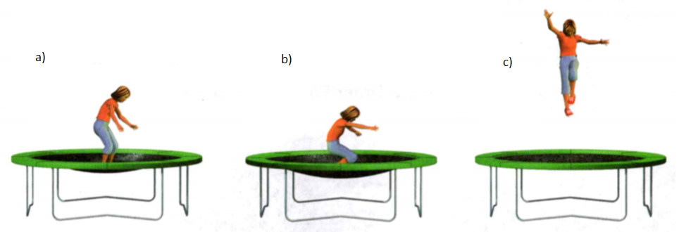

### Physical Science

## Physics

## 10 Energy

***Mass*** is a measure of the amount of matter in an object.   

A ***force*** is a push or pull.   

The ***speed*** of an object is the distance the object travels per unit of time.   


**Complete the tasks below.** 

1. Michael pulls his brother in a wagon. Suddenly, Michael's dog jumps on his
brother's lap. Michael continues to pull the wagon, but it is more difficult now
The added mass of the dog means that Michael has to generate more force to
accelerate the wagon to the same speed. Why is it harder to pull the wagon with
the dog in it?


### Vocabulary Skill

Word: energy   
Everyday Meaning: the ability to be active or take part	in a vigorous activity, Example: She had enough energy to run for miles.   
Scientific Meaning: the ability to do work or cause change, Example: The wind can move objects because it has energy.   

Word: power   
Everyday Meaning: the ability to influence others,	Example: The coach has a lot of power over his young athletes.   
Scientific Meaning: the rate at which work is done, Example: A truck's engine has more power than a car's engine.   

**Complete the tasks below.**    

1. Circle the sentence that uses the scientific meaning of the word energy.  
A) A puppy has too much energy to be inside the house all day.   
B) A wrecking ball has enough energy to knock down a building.   

### Chapter Preview

- energy
- kinetic energy
- potential energy
- gravitational potential energy
- elastic potential energy
- mechanical energy
- nuclear energy
- thermal energy
- electrical energy
- electromagnetic energy
- chemical energy
- energy transformation
- law of conservation of energy

### What Is Energy?
- How Are Energy, Work, and Power Related?    
- What Are Two Types of Energy?   

**Complete the tasks below.** 

1. Did you know that wind can be used to produce electricity? A wind farm is a group
of very large windmills, or turbines, placed in a location that gets a lot of
wind. The energy of the wind causes the propellers of the turbines to spin. The
turbines are connected to generators. When the turbines are spinning, the
generators p electricity. The amount of electricity produced depends on the
size of the propellers, the number of turbines, and the strength of the wind.
What are some advantages and disadvantages of using wind energy to create electricity?  

### How Are Energy, Work, and Power Related? 
Did you put a book in your backpack this morning? If so, then you did work on
the book. Recall that work is done when a force moves an object. The ability to
do work or cause change is called energy.   

**Work and Energy** When you do work on an object, some of your energy is
transferred to that object. You can think of work as the transfer of energy.
When energy is transferred, the object upon which the work is done gains energy.
Energy is measured in joules—the same units as work.    

### Power and Energy 

You may recall that power is the rate at which work is done. **Since the
transfer of energy is work, then power is the rate at which energy is
transferred, or the amount of energy transferred in a unit of time.**

```
Power = Energy Transferred/Time
```

Different machines have different amounts of power. For example, you could use
either a hand shovel or a snowblower, to remove snow
from your driveway. Each transfers the same amount of energy when it moves the
snow the same distance. However, you could move the snow faster using a
snowblower than a hand shovel. The snowblower has more power because it
transfers the same amount of energy to the snow in less time.

**Complete the tasks below.** 

1. You could use an elevator or the stairs to lift a box to the tenth floor.
Which has greater power? Why?


### What Are Two Types of Energy?

Moving objects, such as vehicles, have one type of energy.
A rock perched on the edge of a cliff or a stretched rubber band has another
type of energy. **The two basic types of energy are kinetic energy and
potential energy.** Whether energy is kinetic or potential depends on the motion,
position, and shape of the object. 

### Kinetic Energy 

A moving object can do work
when it strikes another object and moves it. For example, a swinging hammer does
work on a nail as it drives the nail into a piece of wood. The hammer has energy
because it can do work. The energy an object has due to its motion is called
**kinetic energy**. 

### Factors Affecting Kinetic Energy 

The kinetic energy of an object depends on both its speed and its mass. Suppose
you are hit with a tennis ball that has been lightly tossed at you. It probably
would not hurt much. What if you were hit with the same tennis ball traveling at
a much greater speed? It would hurt! The faster an object moves, the more
kinetic energy it has. 

Kinetic energy also increases as mass increases. Suppose a tennis ball rolls
across the ground and hits you in the foot. Compare this with getting hit in the
foot with a bowling ball moving at the same speed as the tennis ball. The
bowling ball is much more noticeable because it has more kinetic energy than a
tennis ball. The bowling ball has more kinetic energy because it has a greater
mass.


### Calculating Kinetic Energy 

You can use the following equation to solve for the kinetic energy of an object.

Kinetic energy = 1/2 x Mass x Speed<sup>2</sup>   

For example, suppose a boy is pulling a 10-kg wagon at a speed of 1 m/s.

Kinetic energy of wagon = 0.5 x 10 kg x (1 m/s)<sup>2</sup>   

= 5 kg m<sup>2</sup>/s<sup>2</sup>  = 5 joules

Note that 1 kg m<sup>2</sup>/s<sup>2</sup> = 1 joule

Do changes in speed and mass have the same effect on the kinetic energy of the
wagon? No—changing the speed of the wagon will have a greater effect on its
kinetic energy than changing its mass by the same factor. This is because speed
is squared in the kinetic energy equation. For example, doubling the mass of the
wagon will double its kinetic energy. Doubling the speed of the wagon will
quadruple its kinetic energy.


**Complete the tasks below.** 

1. What has a greater effect on an object's kinetic energy - doubling its mass
or doubling its speed? Explain

2. A girl and her dog are running. The dog has a mass of 20 kg. The girl has a mass of 60 kg.
a) Suppose both the dog and the girl run at a speed of 2 m/s. Calculate both of their kinetic energies.
b) Suppose the dog speeds up and is now running at a speed of 4 m/s. Calculate the dog's kinetic energy.
c) Are your answers to a) and b) reasonable? Explain.

3. Write the SI unit for each quantity
a) Force   
b) Height   
c) Work   
d) Mass   
e) Energy

### Potential Energy 

An object does not have to be moving to have energy. Some objects have energy as
a result of their shapes or positions. When you lift a book up to your desk from
the floor or compress a spring by winding a toy, you transfer energy to it. The
energy you transfer is stored, or held in readiness. It might be used later if
the book falls or the spring unwinds. Energy that results from the position or
shape of an object is called **potential energy**. This type of energy has the
potential to do work.

### Gravitational Potential Energy 

Potential energy related to an object's height is called gravitational potential
energy. The gravitational potential energy of an object is equal to the work
done to lift it to that height. Remember that work is equal to force multiplied
by distance. The force you use to lift the object is equal to its weight. The
distance you move the object is its height above the ground. You can calculate
an object's gravitational potential energy using this equation.
```
Gravitational potential energy = Weight x Height
```
For example, suppose a book has a weight of 10 newtons (N). If the book is
lifted 2 meters off the ground, the book has 10 newtons times 2 meters, or 20
joules, of gravitational potential energy.

**Complete the tasks below.** 

  <figure>
    
    <figcaption>Figure 1. The rock climbers have gravitational potential energy.</figcaption>
  </figure>

1. The rock climbers have gravitational potential energy. Use the diagram in Figure 1 to
answer the questions.
a) Who is the rock climber with the greatest potential energy?   
b) Calculate this potential energy. The height to be used is at the rock climber's lowest foot.  
c) Where would the rock climbers at the top have to be to have half as much potential energy?  


### Elastic Potential Energy 

An object has a different type of potential energy due to its shape. **Elastic
potential energy** is the energy associated with objects that can be compressed
or stretched. For example, when the girl in Figure 2 presses down on the
trampoline, the trampoline changes shape. The trampoline now has potential
energy. When the girl pushes off of the trampoline, the stored energy sends the
girl upward.

<figure>
  
  <figcaption>Figure 2. Elastic Potential Energy.</figcaption>
</figure>

**Complete the tasks below.** 

1. The energy stored in a stretched object, such as the trampoline, is elastic
   potential energy.
a) Rank the amount of elastic potential energy of the trampoline in Figure 2 from greatest to least. A ranking of one is the greatest.
b) Explain your answers.

2. The energy an object has due to its motion is called (kinetic/potential) energy.    
3. Stored energy that results from the position or shape of an object is called (kinetic/potential) energy.    
4. What are the two factors that affect an object's kinetic energy?   
5. What type of energy does a cup sitting on a table have? Why?


### Forms of Energy

- How Can You Find an Object's Mechanical Energy? 
- What Are Other Forms of Energy?

**Complete the tasks below.** 

1. The first hurricane that I ever saw was a big one! The storm had weakened by the
time it arrived, but the wind was still so powerful it easily flung around our
lawn chairs. The trees bent and swayed in the wind. When it was over, branches
were scattered across our lawn. The wind even ripped up a tree, blocking our
road. The storm did a lot of damage, but we were lucky to be safe inside while
watching this awesome force of nature. 
What is some evidence that the storm described had energy?

### How Can You Find an Object's Mechanical Energy?   

What do a falling basketball, a moving car, and a trophy on a shelf all have in
common? They all have mechanical energy. The form of energy associated with the
motion, position, or shape of an object is called **mechanical energy**.

### Calculating Mechanical Energy 

An object's mechanical energy is a combination of its potential energy and its
kinetic energy. For example, the basketball in Figure 1 has both potential
energy and kinetic energy. The higher the basketball moves, the greater its
potential energy. The faster the basketball moves, the greater its kinetic
energy. You can find an object's mechanical energy by adding together the
object's kinetic energy and potential energy.  

```
Mechanical energy = Potential energy + Kinetic energy
```

Sometimes an object's mechanical energy is its kinetic energy or potential
energy only. A car moving along a flat road has kinetic energy only. A trophy
resting on a shelf has gravitational potential energy only. But both have
mechanical energy.


**Complete the tasks below.** 

  <figure>
    
    <figcaption>Figure 3. Mechanical Energy.</figcaption>
  </figure>

1. The basketball in Figure 3 has mechanical energy because of its speed and
position above the ground.    
a) Solve for the mechanical energy of the basketball at point A and point B.   
b) Why does the ball's gravitational potential energy increase from points A to B?   


### Mechanical Energy and Work

An object with mechanical energy can do work on another object. In fact, you can
think of mechanical energy, like all forms of energy, as the ability to do work.
For example, a basketball does work on the net as it falls through the hoop. The
net moves as a result. The more mechanical energy an object has, the more work
it can do.   

Machines can transfer mechanical energy from one object to another.
If you use a crow bar as a lever to pry up a heavy stone, your arms apply
mechanical energy to the lever, and the lever transfers that mechanical energy
to the stone.  


**Complete the tasks below.** 

1. The bowling ball does work on the pins when it hits them.
a) Why can the ball do work? 
b) How should you throw the ball to maximize the amount of work it does on the
pins?
c) A bowling ball has a mass of 7.0 kg. A candlepin bowling ball has a mass of
about 1.0 kg. Does the 7 kg ball always have the greater mechanical energy?
Explain.

2. At a certain point the kinetic energy of a falling apple is 5.2 J and its
potential energy is 3.5 J. What is its mechanical energy?

3. If an object's mechanical energy is equal to its potential energy, how much
kinetic energy does the object have? Explain.


### What Are Other Forms of Energy?   

So far, you have read about energy that involves the motion, position, or shape
of an object. But an object can have other forms of kinetic and potential
energy. These other forms are associated with the particles that make up
objects. These particles are far too small to see with the naked eye. Forms of
energy associated with the particles of objects include nuclear energy, thermal
energy, electrical energy, electromagnetic energy, and chemical energy.

### Nuclear Energy 

All objects are made up of particles called atoms. The region in the center of
an atom is called the nucleus. A type of potential energy called **nuclear energy**
is stored in the nucleus of an atom. Nuclear energy is released during a nuclear
reaction. One kind of nuclear reaction, known as nuclear fission, occurs when a
nucleus splits. A nuclear power plant uses fission reactions to produce
electricity. Another kind of reaction, known as nuclear fusion, occurs when the
nuclei of atoms fuse, or join together. Nuclear fusion reactions occur
constantly in the sun, releasing huge amounts of energy. Only a tiny portion of
this energy reaches Earth as heat and light.

**Complete the tasks below.** 

1.Compare and contrast nuclear fission and nuclear fusion.


### Thermal Energy 

The particles that make up objects are constantly in motion. This means that
they have kinetic energy. These particles are arranged in specific ways in
different objects, so they also have potential energy. The total kinetic and
potential energy of the particles in an object is called **thermal energy**.

The higher the temperature of an object, the more thermal energy the object has.
For example, suppose you heat a pot of water. As heat is applied to the water,
the particles in the water move faster on average. The faster the particles
move, the greater their kinetic energy and the higher the temperature.
Therefore, a pot of water at 75°C, for example, has more thermal energy than the
same amount of water at 30°C.

### Electrical Energy 

When you receive a shock from a metal doorknob, you experience electrical
energy. The energy of electric charges is **electrical energy**. Depending on
whether the charges are moving or stored, electrical energy can be a form of
kinetic or potential energy. Lightning is a form of electrical energy. You rely
on electrical energy from batteries or electrical lines to run devices such as
computers, handheld games, and digital audio players.


### Electromagnetic Energy 

The light you see is one type of electromagnetic energy. Electromagnetic energy,
also called radiant energy, is a form of energy that travels through space in
waves. The source of these waves is vibrating electric charges. These waves do
not require a medium, so they can travel through a vacuum, or empty space. This
is why you can see the sun and stars.  

The microwaves you use to cook your food and the X-rays doctors use to examine
patients are also types of electromagnetic energy. Other forms of
electromagnetic energy include ultraviolet rays, infrared (or heat) waves, and
radio waves. Cell phones send and receive messages using microwaves.


### Chemical Energy 

Chemical energy is in the foods you eat, in the matches you use to light a
candle, and even in the cells of your body. **Chemical energy** is potential energy
stored in chemical bonds. Chemical bonds are what hold atoms together. Often
when these bonds are broken, this stored energy is released. For example, bonds
are broken in your cells and release energy for your body to use.

**Complete the tasks below.** 

1. During a lightning storm, electric charges move between the clouds and the ground, releasing stored _____ .

2. Why do the particles of objects have both kinetic and potential energy?  

3. The energy you get from eating a peanut butter and jelly sandwich is in the
form of ______ energy.

### Energy Transformations and Conservation   

- How Are Different Forms of Energy Related? 
- What Is the Law of Conservation of Energy?

**Complete the tasks below.** 

1. Science Day at the Amusement Park. During science days at an Amusement Park
the park becomes a giant laboratory! Here is how one investigation might work.
You choose a ride like the Drop Tower, which drops you 68 meters in less than
four seconds, or the Fire Fall, which contains a series of vertical twists and
turns. You observe how your speed and height change during the ride. Then you
use your observations to learn about transformations between potential and
kinetic energy. How do you think energy is transformed in the Drop Tower?

### How Are Different Forms of Energy Related?

What does flowing water have to do with electricity? In a hydroelectric power
plant, the mechanical energy of moving water is transformed into electrical
energy. **All forms of energy can be transformed into other forms of energy.** A
change from one form of energy to another is called an **energy transformation**.
Some energy changes involve single transformations, while others involve many
transformations.

### Single Transformations 

Sometimes, one form of energy needs to be transformed into another to get work
done. For example, a toaster transforms electrical energy to thermal energy to
toast your bread. A cell phone transforms electrical energy to electromagnetic
energy that travels to other phones.   

Your body transforms the chemical energy in food to the mechanical energy you
need to move your muscles. Chemical energy in food is also transformed to the
thermal energy your body uses to maintain its temperature.  

### Multiple Transformations 

Often, a series of energy transformations is needed to do work. In a car engine,
a series of energy conversions occurs. Electrical energy produces a spark. The
thermal energy of the spark releases chemical energy in the fuel.   

The chemical energy in the fuel originated with nuclear reactions within the sun
that reached Earth as electromagnetic energy. Plants transformed the energy in
sunlight into chemical energy, which was stored in the fossilized remains of
living organisms that made up the fuel. As the fuel burns, it expands as it is
broken down into smaller particles. The expansion of the fuel produces pressure
on parts of the car. The increased pressure eventually causes the wheels to
turn, transforming chemical energy into mechanical energy.

**Complete the tasks below.** 

1. A series of energy transformations must occur for you to ride your bike. Write
the forms of energy involved in each transformation.   
a) Reactions occur within a the sun to transform ____ energy into _____ energy.
b) Plants transform ______ energy into _____ energy. 
c) Your body transforms ______	energy into _____	 energy to maintain your body temperature.
c) Your body also transforms ______	energy into _____	energy when you ride your bike.


### Kinetic and Potential Energy   

The transformation between potential and kinetic energy is one of the most
common energy transformations. For example, when you stretch a rubber band, you
give it elastic potential energy. If you let it go, the rubber band flies across
the room. When the rubber band is moving, it has kinetic energy. The potential
energy of the stretched rubber has transformed to the kinetic energy of the
moving rubber band. Transformations between kinetic and potential energy can
also occur in any object that rises or falls. A falling object, a pendulum, and
a pole vault are all examples of these transformations.

### Falling Object  
A transformation between potential and kinetic energy occurs in the ball in
Figure 4. As the height of the ball decreases, it loses potential energy. At the
same time, its kinetic energy increases because its speed increases. Its
potential energy is transformed into kinetic energy.

### Pendulum  
A pendulum like the one in Figure 5 swings back and forth. At the highest point
in its swing, the pendulum has no movement. As it swings downward, it speeds up.
The pendulum is at its greatest speed at the bottom of its swing. As the
pendulum swings to the other side, its height increases and its speed decreases.
At the top of its swing, it comes to a stop again.


### Pole Vault 
The pole-vaulter in Figure 6 starts out by running forward. When the
pole-vaulter plants the pole to jump, his speed decreases and the pole bends. As
the pole straightens out, the pole-vaulter is lifted high into the air. Once he
is over the bar, the pole-vaulter's speed increases as he falls toward the
safety cushion.

**Complete the tasks below.** 

  <figure>
    
    <figcaption>Figure 4. Falling Ball.</figcaption>
  </figure>

1. The ball in Figure 4 was photographed at equal time intervals as it fell. How
can you tell that the ball's kinetic energy is increasing?

  <figure>
    
    <figcaption>Figure 5. Pendulum.</figcaption>
  </figure>

2. A continuous transformation between potential and kinetic energy occurs in a
pendulum. In Figure what are the types of energy the pendulum has at positions A, B, and C?

  <figure>
    
    <figcaption>Figure 6. Pole Vault.</figcaption>
  </figure>

3. Energy transformations enable this athlete to vault more than 6 meters into
the air. In Figure 6 identify the main forms of energy present at points A
through D.

4. A change in one form of energy to another form of energy is called a(n)

5. When you turn on an iron, ____ energy is transformed into ______ energy.   

6. Describe the energy transformation that occurs in a waterfall.

### What Is the Law of Conservation of Energy?   

Once you set a pendulum in motion, does it swing forever? No, it does not. Then
what happens to its energy? Is the energy destroyed? Again, the answer is no.
The **law of conservation of energy** states that when one form of energy is
transformed to another, no energy is lost in the process. **According to the
law of conservation of energy, energy cannot be created or destroyed.** The total
amount of energy is the same before and after any transformation. If you add up
all of the new forms of energy after a transformation, all of the original
energy will be accounted for. So what happens to the energy of the pendulum once
it stops moving?

As the pendulum swings, it encounters friction at the pivot of the string and
from the air through which it moves. Whenever a moving object experiences
friction, some of its kinetic energy is 14 transformed into thermal energy. So
the mechanical energy of the pendulum is not destroyed. It is transformed to
thermal energy.   

The fact that friction transforms mechanical energy to thermal energy should not
surprise you. After all, you take advantage of such thermal energy when you rub
your cold hands together to warm them up. Friction is also the reason why no
machine is 100 percent efficient. You may recall that the output work of any
real machine is always less than the input work. This reduced efficiency occurs
because some mechanical energy is always transformed into thermal energy due to
friction.

When ancient animals and plants died, the chemical energy they had stored was
trapped within their remains. This trapped energy is the chemical energy found
in coal.


**Complete the tasks below.** 

  <figure>
    
    <figcaption>Figure 7. Conserving Energy While You Ride.</figcaption>
  </figure>


1. Transformations between potential and kinetic energy
occur during a roller coaster ride in Figure 7.	Use what you have learned
about energy transformations to answer Questions.
a) The roller coaster starts from rest at the top of the first hill. Describe
approximately how much potential and kinetic energy the coaster has at each
point. Assume that none of the coaster's mechanical energy is transformed to
thermal energy. Also assume that no electrical energy is used to move the
coaster.
b) Why is the first hill of a roller coaster always the tallest?

2. How is energy conserved in a transformation?

### Study Guide

- Since the transfer of energy is work, then power is the rate at which energy is transferred, or the amount of energy transferred in a unit of time.
- The two basic types of energy are kinetic energy and potential energy.  
- You can find an object's mechanical energy by adding together the object's kinetic energy and potential energy.  
- Forms of energy associated with the particles of objects include nuclear energy, thermal energy, electrical energy, electromagnetic energy, and chemical energy.
- All forms of energy can be transformed into other forms of energy.  
- According to the law of conservation of energy, energy cannot be created or destroyed.  
**Complete the tasks below.** 

1. When you stretch a rubber band, you give it

A) kinetic energy.	
B) electrical energy.
C) potential energy.
D) chemical energy.

2. To calculate power, divide the amount of energy transferred by	_____ .   

3. In the illustration in Figure 8, which vehicle has the greatest kinetic energy?
Explain your answer.

  <figure>
    
    <figcaption>Figure 8. Moving vehicles.</figcaption>
  </figure>

4. If a handsaw does the same amount of work on a log as a chainsaw does, which
has more power? Why? 

5. A 1,350-kg car travels at 12 m/s. What is its kinetic energy?  

6. What is the energy stored in the nucleus of an atom called?

A) electrical energy	
B) chemical energy
C) thermal energy	
D) nuclear energy

7. An object's mechanical energy is the sum of its ______.

8. When you heat a pot of water over a flame, what form of energy is added to the water?   

 Use the graph to answer Questions 9 and 10.

  <figure>
    
    <figcaption>Figure 9. The graph shows the kinetic energy of a 500-N diver during a dive from a 10-m platform.</figcaption>
  </figure>

9. The graph in Figure 9 shows the kinetic energy of a 500-N diver during a dive from a 10-m platform. 
a) How does the diver's kinetic energy change as the diver falls? Why?
b) What is the diver's gravitational potential energy just before the dive?   

11. As a car skids to a stop, friction transforms kinetic energy to
A) thermal energy.	
B) potential energy.
C) chemical energy.	
D) electrical energy.

12. What does the law of conservation of energy state?  
 
13. Describe the energy transformation that occurs in a digital clock.    

14. Explain why a spinning top will not remain in motion forever.   

15. Why does a bouncing ball rise to a lower height with each bounce?   

16. An eagle flies from its perch in a tree to the ground to capture and eat its
prey. Describe its energy transformations.

  <figure>
    
    <figcaption>Figure 10. Golfer.</figcaption>
  </figure>

17. The golfer in Figure 10 is taking a swing. The golf club starts at point A and ends at point E. 
a) Describe the energy transformations of the club from points A to E. 
b) The kinetic energy of the club at point C is more than the potential energy
of the club at point B. Does this mean that the law of conservation of energy is
violated? Why or why not?

  <figure>
    
    <figcaption>Figure 11. The kinetic and potential energy of a 6-kg cat doing various activities.</figcaption>
  </figure>

18. The table in Figure 11 gives the kinetic and potential energy of a 6-kg cat
doing various activities. During which activity does the cat have the greatest
mechanical energy?
A) climbing a tree 
B) leaping
C) running	
D) sleeping on a chair  

2. Why does wind have energy? 

A) It can change direction.
B) It can do work.
C) It moves through space as waves.
D) It is electrically charged.


3. A gardener uses a wheelbarrow to haul a load of mulch. How does the
wheelbarrow transfer energy to the mulch?    

A) The wheelbarrow applies potential energy to the mulch.
B)	The mulch applies gravitational force to the wheelbarrow.
C) The gardener uses chemical energy to move the wheelbarrow.
D)	The wheelbarrow transfers energy of motion to the mulch.


4. Why does a pendulum eventually slow down and stop swinging?

A) Friction transforms some of the mechanical energy to thermal energy.
B)	Kinetic energy changes to potential energy. 
C) Gravity pulls the pendulum toward Earth's center.
D)	Potential energy changes to kinetic energy.

5. Which energy transformation takes place when wood is burned?

A) Nuclear energy is transformed to thermal energy.
B) Thermal energy is transformed to electrical energy.
C) Chemical energy is transformed to thermal energy.
D)	Mechanical energy is transformed to thermal energy.

  <figure>
    
    <figcaption>Figure 12. A large pendulum at a science museum.</figcaption>
  </figure>

6. A large pendulum at a science museum is set in motion at the beginning of the
day. The table in Figure 12 shows how its speed at the bottom of the swing
changes during the day. Use this data to determine how the height of the
pendulum's swing changes. Explain your answer.


### Charge It!

Have you ever noticed how many batteries you use every day? There are batteries
in cars, flashlights, cell phones, laptop computers, and even bug zappers!
Discarded batteries add up to a lot of waste. Fortunately, rechargeable
batteries can help keep the energy flowing and reduce the number of batteries
that get thrown out. Can you imagine how many nonrechargeable batteries a cell
phone would go through in a month?

Batteries transform chemical energy into electrical energy. To refuel a
rechargeable battery, you plug it into a power source—such as an outlet in the
wall. The electrical energy reverses the chemical changes, storing the
electrical energy as chemical energy. The battery is once again "charged up" and
ready to go! 


  <figure>
    
    <figcaption>Figure 13. The inside of this rechargeable battery has three long thin layers. A separator
separates a positive electrode from a negative electrode. Using the battery
causes lithium ions to move from the positive material to the negative one.
Applying an electrical charge moves the ions back to the positive electrode.</figcaption>
  </figure>

**Complete the tasks below.** 

1. Gasoline-powered cars and hybrid cars have rechargeable batteries. Research how the batteries in gasoline-powered cars and hybrid cars are recharged.

### Power It Up!

When you turn on the TV, are you using solar energy for power? You may be
surprised to learn that the answer is probably "Yes (at least, technically)!"
Almost 85 percent of the energy we use comes from fossil fuels—oil, coal, or
natural gas. When these fuels are burned, they release solar energy that was
stored in them millions of years ago as plants and animals decayed. Fossil fuels
are easy to use and reliable. The problem is, they're also nonrenewable. That
means they are in limited supply and will one day be used up.  

The sun is the source of other energy resources. Weather is influenced by the
sun. Changes in weather result in wind and water movement. Both wind and moving
water can turn turbines to make electricity. The sun provides the energy for
plants to grow, producing biomass, an energy source that can be burned like
fossil fuels. These resources are known as renewable energy sources. They will
never be used up, or they can be replaced quickly.  

Some fuels don't originate with the sun. There are more than 100 nuclear power
plants in the United States. In these power plants, the decay of radioactive
atoms produces great amounts of energy. But the use of nuclear power is not
increasing. Many people fear accidents, and these power plants also produce
dangerous radioactive waste. Geothermal energy comes from Earth's interior. This
renewable source of energy is nonpolluting and will never run out. But it is
only economical to generate electricity in areas where magma heats rock or water
near Earth's surface.   


Today, renewable sources supply only about 8 percent of our energy needs. That's a fraction of the energy we use, but the percentage is gradually increasing.

  <figure>
    
    <figcaption>Figure 14. Where our Energy comes from.</figcaption>
  </figure>

**Complete the tasks below.** 

How much energy do you use in a day, and what are the sources of this energy?
Keep a log of one day of your personal energy use. Write down everything—from
running your computer (electricity from a plant that burns coal?) to your hot
shower (solar collectors on your roof?) to your bus ride to school (diesel fuel
from petroleum?). Compare your log with others' logs in class. Are most of your
energy needs met with renewable or nonrenewable sources? How do you think this
might channge in the future?


### How does heat flow from one object to another?

  <figure>
    
    <figcaption>Figure 15. thermogram.</figcaption>
  </figure>

The image in Figure 15 is called a thermogram. A special camera measures the
electromagnetic radiation of an object and creates a temperature "map." A
thermographic camera can be used to find people in a fire, detect when a
racehorse might be injured, and spot tumors in humans. By noticing excessive
heat in motors, transformers, and pumps, the camera can detect equipment
problems before they fail, saving millions of dollars. 


**Complete the tasks below.** 

1. Since a thermogram shows temperature, what might the colors you see indicate?

