### Physical Science

## Physics

## 11 Thermal Energy and Heat

- ***Kinetic energy*** is energy an object has due to its motion.
- A ***joule*** is a unit of work equal to one newton-meter.
- ***Density*** is the ratio of the mass of a substance to its volume.


**Complete the tasks below.** 

1. Kiera is swimming in the ocean. Since she is moving, she has **kinetic energy**.
Energy is measured in **joules**. Her brother, who swims at the same speed but has
more mass, has more kinetic energy. If he slows down, he will have the same
amount of kinetic energy as Kiera. While swimming, she notices that it is easier
to float in salt water because it has a higher **density** than fresh water. What
are the two ways you can increase kinetic energy?

### Vocabulary Skill
 
Word: conductor    
Everyday Meaning: the director of an orchestra; Example: The conductor signaled	to the musicians to begin playing.
Scientific Meaning: a material that conducts heat well; Example: Metal is a good conductor.

Word: heat   
Everyday Meaning: to make warm or hot; Example: The fireplace began to heat the room.   
Scientific Meaning: thermal energy moving from a warmer object; Example: When
the door was left open, heat transferred from the warm room to the cool air
outside.  

**Complete the tasks below.** 

1. Which sentence below uses the scientific meaning of the word conductor?
A) The conductor got a standing ovation after the concert.
B) It is easier to cook eggs in a pan that is a good conductor.

### Chapter Preview

- temperature 
- Fahrenheit scale
- Celsius scale 
- Kelvin scale 
- absolute zero 
- heat
- convection
- convection current 
- radiation
- conduction
- conductor
- insulator
- specific heat
- thermal expansion


### Temperature, Thermal Energy, and Heat  

- What Determines the Temperature of an Object? 
- What Is Thermal Energy?

**Complete the tasks below.** 

1. Nature's Bathtub. Could you take a hot bath outside, with no ceramic bathtub
or running water? This is possible in hot springs all over the world. Hot
springs occur when underground water heated by Earth bubbles up and collects in
pools on Earth's surface. The water in a hot spring can reach above 50°C
(122°F). By contrast, a hot shower is about 43°C (110°F). Visitors use these hot
springs to relax. What other daily household functions could be done without
running water or electricity?

### What Determines the Temperature of an Object?   

You may have used a thermometer to take your temperature when you were sick.
Temperature is a measure of how hot or cold something is compared to a reference
point. (One reference point is the freezing point of water.) What makes an
object hot or cold?

Recall that all moving objects have kinetic energy. Matter is made up of tiny
particles that are always moving, so these particles have kinetic energy. 
**Temperature is a measure of the average kinetic energy of the particles in an
object.** As an object heats up, its particles move faster. As a result, both the
average kinetic energy of the particles and the temperature increase.

The United States uses the **Fahrenheit scale** to measure temperature. Most
countries use the **Celsius scale**. You can use an equation to convert between
scales, but it's simpler to estimate using thermometers.
Temperatures that line up, like 32°F and 0°C, are equivalent. Many scientists
use the Kelvin scale. Celsius and Fahrenheit scales are divided into degrees.
The Kelvin scale is divided into kelvins (K). A temperature change of 1 K is the
same temperature change as 1°C. Zero kelvins, or absolute zero, is the lowest
temperature possible. At absolute zero, particles have no kinetic energy. Zero K
is equal to —273°C.

When Anders Celsius invented the Celsius scale, he had 100°C as the freezing
point of water and 0°C as its boiling point.

**Complete the tasks below.** 

  <figure>
    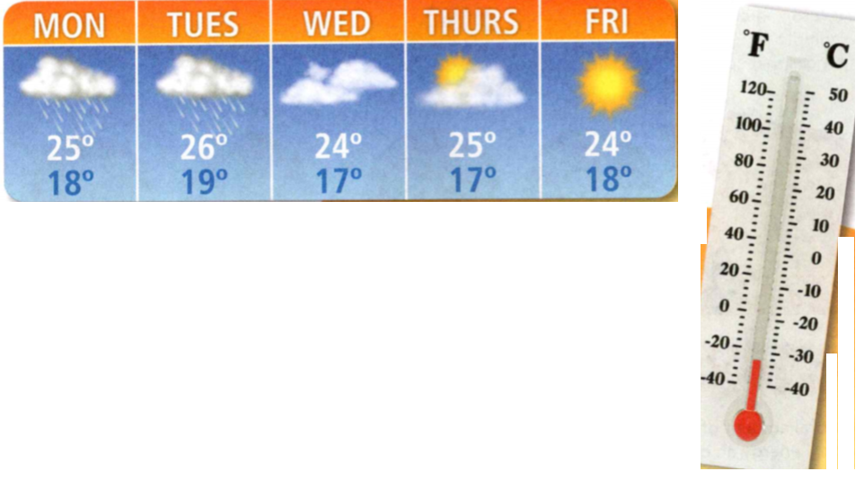
    <figcaption>Figure 1. Temperature Scales.</figcaption>
  </figure>

1. The chart above shows a weather report, but it does not identify the
temperature scale. Explain why this report would mean something different in
Japan than it would in the United States. Fill in the thermometer to show the first of
the temperatures in Celsius. What is this equivalent to in Fahrenheit? 

### What Is Thermal Energy?
Different objects at the same temperature can have different amounts of energy.
To understand this, you need to know about thermal energy and about heat.
Temperature, thermal energy, and heat are closely related, but they are not the
same thing. **Thermal Energy Temperature is a measure of the average kinetic
energy of the individual particles in an object.** However, it is not a measure of
the total amount of energy in an object. Thermal energy is the total energy of
all the particles in an object. It depends on the temperature of an object, the
number of particles in it, and how those particles are arranged. This lesson
will focus on the first two factors.  

The more particles an object has at a given temperature, the more thermal energy
it has. For example, a 1-liter pot of tea at 75°C has more thermal energy than a
0.2-liter mug of tea at 75°C because the pot contains more tea particles. On the
other hand, the higher the temperature of an object, the more thermal energy the
object has. Therefore, if two 1-liter pots of tea have different temperatures,
the pot with the higher temperature has more thermal energy.

**Complete the tasks below.** 

  <figure>
    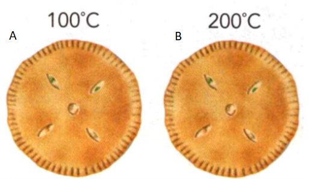
    <figcaption>Figure 2. Chicken pot pie.</figcaption>
  </figure>

  <figure>
    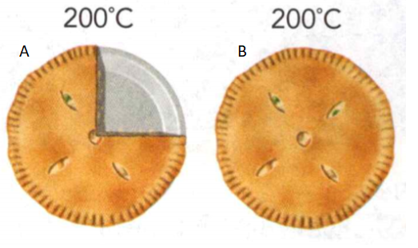
    <figcaption>Figure 3. More Chicken pot pie.</figcaption>
  </figure>

1. The total amount of thermal energy an object has depends on its temperature and how many particles it contains.
a) In the two panels in Figure 2, which chicken pot pie contains more thermal energy?
b) In the two panels in Figure 3, which chicken pot pie contains more thermal energy?

### Heat 

You might say that an object contains heat, but, strictly speaking, it does not.
Objects contain thermal energy. **Heat** is the transfer of thermal energy from a
warmer object to a cooler object. The warmer object will cool down, and the
cooler object will warm up until they are the same temperature. When this
happens, heat stops transferring. Heat is measured in the units of
energy - joules.

**Complete the tasks below.** 

1. Write a sentence that uses the scientific meaning of heat.   

  <figure>
    
    <figcaption>Figure 4. Heat.</figcaption>
  </figure>

2. When you hold your hand over a plate of food, you will feel warmth if heat
   transfers into you and cold if heat transfers out of you. In Figure 4, draw
   arrows to show the direction of heat transfer for at least two foods. Would
   your hand feel warmer over some foods than over others? What characteristics
   of the food might affect how warm or cold your hand feels?

3. What are two factors that determine an object's thermal energy?

4. Object A has less thermal energy than Object B, but heat flows from Object A
to Object B. What conditions would make this possible?


### The Transfer of Heat
- How Is Heat Transferred?


### How Is Heat Transferred?   

Heat is transferring around you all the time. If it wasn't, nothing would ever
change temperature. Heat doesn't transfer randomly. It travels only in one
direction and by three different methods. **Heat is transferred from warmer areas
to cooler areas by conduction, convection, and radiation.**


### Convection  

Convection is a type of heat transfer that occurs only in fluids, such as water
and air. When air is heated, its particles speed up and move farther apart. This
makes the heated air less dense. The heated air rises to float on top of the
denser, cooler air. Cooler air flows into its place, heats up, and rises.
Previously heated air cools down, sinks, and the cycle repeats. This flow
creates a circular motion known as a convection current. Convection currents in
air cause wind and weather changes.

### Radiation  

Radiation is the transfer of energy by electromagnetic waves. Radiation is the
only form of heat transfer that does not require matter. You can feel the
radiation from a fire without touching the flames. The sun's energy travels to
Earth through 150 million kilometers of empty space.

### Conduction 

Conduction transfers heat from one particle of matter to another within an
object or between two objects. The fast-moving particles in the floor of the
oven collide with the slow-moving particles in the uncooked pizza. This causes
the pizza's particles to move faster, making the pizza hotter.


**Complete the tasks below.** 

1. Wild Weather Hurricanes are intense storms that can cause billions of dollars
in damage. These storms form when very warm, moist air rises quickly, creating
an area of lower air pressure below. As the air rises, the water vapor in the
air condenses, releasing a huge amount of thermal energy. This energy causes
swirling winds, which draw in more warm water, feeding the storm. If a
hurricane's path takes it over land, the storm can cause massive destruction.
However, as the storm moves over land, its energy source—the warm ocean water—is
depleted, and the storm eventually fizzles out. Why do hurricanes tend to form
in warmer climates?
 
2. A wood-fire pizza oven demonstrates three types of heat transfer.   
a) Describe a heat transfer that occurs after the pizza comes out of the oven.     
b) What kind of transfer is it?    

  <figure>
    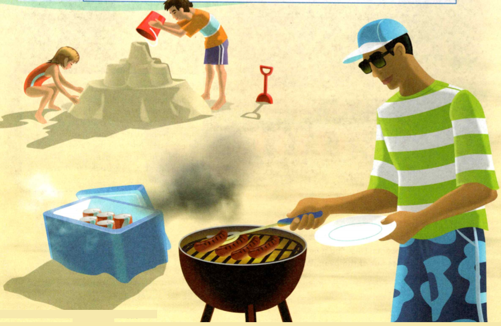
    <figcaption>Figure 5. Heat transfer goes on all around you all the time, even on the beach.</figcaption>
  </figure>

  <figure>
    
    <figcaption>Figure 6. Heat transfer goes on all around you all the time, even on the beach.</figcaption>
  </figure>

3. Heat transfer goes on all around you all the time, even on the beach. In
Figures 5 & 6, identify at least one example of each type of heat transfer. Draw
arrows to show how heat is being transferred in each example.

  <figure>
    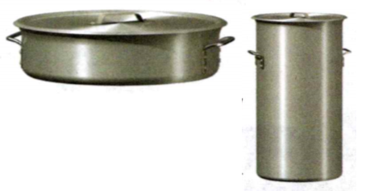
    <figcaption>Figure 7. Cooking pots.</figcaption>
  </figure>

4. Cooking pots come in a variety of shapes and sizes (Figure 7), but you're
much more likely to see a wide, squat pot than a tall, narrow pot. Use
conduction to explain why this is the case.

5. How does heat flow from one object to another?

6. What type of heat transfer occurs when eggs cook in a hot pan? Before
toasters, people toasted bread by holding it over a fire. What type of heat
transfer occurred then? Name the third type of heat transfer and an example of a
food cooked by it.

### Thermal Properties
- How Do Different Materials Respond to Heat?

### How Do Different Materials Respond to Heat?

When you bake something in the oven, you use dishes made of glass, ceramics, or
metal instead of plastic. Some materials can stand up to the heat of an oven
better than others. Materials respond to heat in different ways. The thermal
properties of an object determine how it will respond to heat.


**Complete the tasks below.** 

1. Suiting Up. Comic book superheroes often wear special suits that allow them to fly
or protect them from enemies. But there are some everyday heroes who wear suits
that give them similar superpowers: astronauts! Whenever astronauts go outside a
space station or ship, they put on suits that weigh hundreds of pounds. The
suits enable them to survive in the wide temperature swings that occur in space.
The suits are designed with a flexible insulating material to protect astronauts
from extreme temperature swings, radiation, and low pressure in space. They also
provide air to breathe, radio communication, and protection from
micrometeoroids. You also use special clothing to stay warm. What materials do
you use to stay warm?

### Conductors and Insulators 
If you walk barefoot from your living room rug to the tile floor of your
kitchen, you will notice that the tile feels colder than the rug. But the
temperature of the rug and the tile are the same—room temperature! The
difference has to do with how materials conduct heat. **Some materials
conduct heat well, while other materials do not.** 

### Conductors 

A material that conducts heat well is called a conductor. Metals such as silver
are good conductors. Some materials are good conductors because of the particles
they contain and how those particles are arranged. A good conductor, such as the
tile floor, feels cold to the touch because heat easily transfers out of your
skin and into the tile. However, heat also transfers out of conductors easily. A
metal flagpole feels much hotter on a summer day than a wooden pole would in the
same place because heat easily transfers out of the metal pole and into your
hand. 

### Insulators 

A wooden pole and your living room rug are good insulators. Insulators are
materials that do not conduct heat well. Other good insulators include air and
wool. For example, wool blankets slow the transfer of heat out of your body.

**Complete the tasks below.** 

1. Both conductors and insulators are useful in a kitchen. Conductors easily
transfer heat to cook your food. Insulators stay cool enough to be handled. List
objects in a kitchen that can act as insulators.


### Specific Heat 

Imagine running across hot sand toward the ocean. You run to the water's edge,
but you don't go any farther—the water is too cold. How can the sand be so hot
and the water so cold? After all, the sun heats both of them. The answer is that
water requires more heat to raise its temperature than sand does. 

When an object is heated, its temperature rises. But the temperature does not
rise at the same rate for all objects. The amount of heat required to raise the
temperature of an object depends on the object's chemical makeup. **To change
the temperature of different objects by the same amount, different amounts of
thermal energy are required.**

The amount of energy required to raise the temperature of 1 kilogram of a
material by 1 kelvin is called its **specific heat**. It is measured in joules per
kilogram-kelvin, or J/(kg K). A material with a high specific heat can absorb a
great deal of thermal energy without a great change in temperature. You can
calculate thermal energy changes with a formula.
```
Energy Change = Mass x Specific Heat x Temp. Change
```


You can calculate the amount of thermal energy gained by 2 kg of water as its
temperature increases by 3 K.

```
Energy Change = Mass x Specific Heat x Temp. Change 
Energy Change = 2 kg x 4,180 J/(kg K) x 3 K
Energy Change = 25,080 J
```

### Thermal Expansion   

To loosen a jar lid, you can hold it under a stream of hot water. This works
because the metal lid expands more than the glass does as it gets hotter. **As
the thermal energy of matter increases, its particles usually spread out,
causing the substance to expand.** This is true for almost all matter. The
expanding of matter when it is heated is known as **thermal expansion**. When matter
is cooled, the opposite happens. Thermal energy is released. This causes the
particles to slcm down and move closer together. As matter cools, it usually
decreases in volume, or contracts. One exception is water. Water expands
slightly when it freezes. This is why solid ice floats in a glass of liquid
water.

**Complete the tasks below.** 

  <figure>
    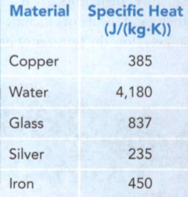
    <figcaption>Figure 8. Specific Heat.</figcaption>
  </figure>

1. Use the table in Figure 8 to calculate how much energy is lost by 0.5 kg of
   silver that cools off by 2 K.

2. How many times more energy must you transfer into a kilogram of glass than a
kilogram of silver to raise their temperatures by the same amount?

3. The seawater at a beach heats up more slowly than the sand on the beach does.
The specific heat of water must be (greater than/less than) the specific heat of
sand.

  <figure>
    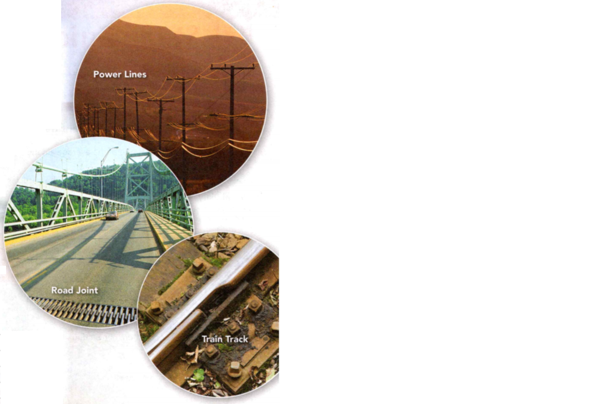
    <figcaption>Figure 9. Thermal Expansion.</figcaption>
  </figure>

4. Many objects are specifically designed to allow extra space for thermal
expansion. Pick one of the examples. What might happen if thermal expansion was
not considered when this object was designed?

5. Foam picnic coolers keep food cold on a hot day. Is foam a conductor or an
insulator? Explain.

6. The specific heat of foam is about 1,200 J/(kg K). How much heat does it take
to raise the temperature of 1 kg of foam by 2 K?

7. Heat flows from ____  	objects to ____ 	objects. 

8. What are the three methods of heat transfer?

### Study Guide

- Temperature is a measure of the average kinetic energy of the particles in an object.
- Thermal energy is the total energy of all the particles in an object.
- Heat is transferred from warmer areas to cooler areas by conduction, convection, and radiation.
- Some materials conduct heat well, while other materials do not.
- To change the temperature of different objects by the same amount, different
amounts of thermal energy are required.
- As the thermal energy of matter increases, its particles usually spread out,
causing the substance to expand.

**Complete the tasks below.** 

1. What is the total energy of all the particles in an object called?
A) chemical energy	
B) thermal energy
C) potential energy	
D) mechanical energy

2. The temperature scale used in most of the world is the ______ .
	
3. How does heat flow when you place an ice cube in your hand?   

  <figure>
    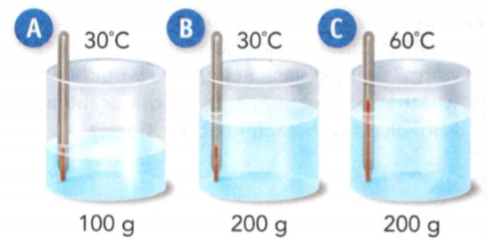
    <figcaption>Figure 10. xxx.</figcaption>
  </figure>

4. Use the illustration in Figure 10 to answer the question
a) Compare the average motion of the particles in the three containers. Explain your answer.
b) Compare the total amount of thermal energy in containers A and B. Explain your answer.  


5. What is the process by which heat transfers from one particle of matter to
another when the particles collide?
A) conduction	
B) convection
C) expansion	
D) radiation

6. What is a convection current?

7. Identify each example of heat transfer as conduction, convection, or radiation: 
a) opening the windows in a hot room; 
b) a lizard basking in the sun; 
c) putting ice on a sprained ankle.

8. How can heat be transferred across empty space? Explain your answer.

9. Suppose you try to heat your home using a fireplace in one of the rooms.
    Would a fan be helpful? Explain.

10. Explain why a school might ask teachers to keep the windows closed and the
shades down during a heat wave.

11. Suppose you want to know the amount of heat needed to raise the temperature
of 2 kg of copper by 10°C. What property of the copper do you need to know? 
A) the thermal energy of the copper
B) the temperature of the copper
C) the specific heat of copper
D) the melting point of copper

12. Wool is a good insulator, what does this mean?

13. When they are hung, telephone lines are allowed to sag. Explain why.   

  <figure>
    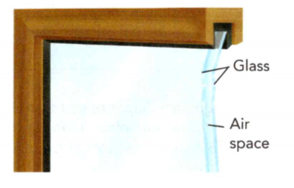
    <figcaption>Figure 11. Window.</figcaption>
  </figure>

14. Why are two panes of glass used in the window shown in Figure 11? (Hint: Air is an insulator.)


  <figure>
    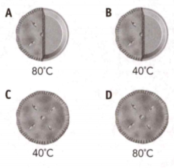
    <figcaption>Figure 12. Temperatures of four pies.</figcaption>
  </figure>

15. The temperatures of four pies are shown in Figure 12. Which statement is true?    
A) A and D have the same thermal energy.
B) C and D have the same thermal energy.
C) B has twice the thermal energy as C.
D) D has twice the thermal energy as A.

16. Iron has a specific heat of 450 J/(kg K). Design a set of three iron cooking
pots. How much heat is required to increase the temperature of each pot by 100 K?

17. Suppose you were out camping and the weather turned cold. How would you keep
warm? Explain each action you would take. Tell whether conduction, convection,
or radiation is involved with each heat transfer.

18. What does a thermometer measure?
A) the average kinetic energy of the particles in an object
B)	the movement of heat from one object to another
C) the amount of thermal energy in an object
D)	the specific heat of an object

19. Which statement describes the direction of heat flow?
A) Heat flows between two objects at the same temperature.
B)	Thermal energy can only be absorbed by cool objects.
C) Heat flows from a warmer object to a cooler object.
D)	Heat flows from a cooler object to a warmer object.

20. The specific heat of iron is 450 J/(kg K). How much thermal energy must be
transferred to 15 kg of iron to raise its temperature by 4.0 K?
A) 450 J
B) 2,700 J
C) 5,400 J
D) 27,000 J

21. Which of the following can be classified as a good conductor of thermal energy?
A) air
B) wood 
C) silver
D) wool 

  <figure>
    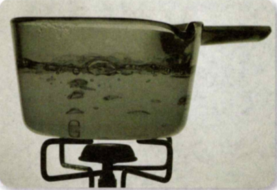
    <figcaption>Figure 13. Water pot.</figcaption>
  </figure>

22. Using the principles of conduction, convection, and radiation, explain how the water in the pot gets hot.

**Complete the tasks below.** 

  <figure>
    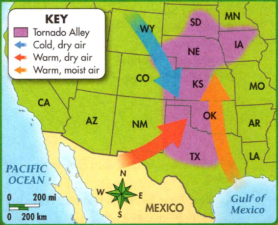
    <figcaption>Figure 14. Tornado Alley.</figcaption>
  </figure>

1. Tornadoes are the most intense storms on Earth. With swirling winds that can top
480 km per hour, they can blow down houses, rip up trees, and toss train cars
like toys. Tornadoes can occur almost anywhere, but they are more likely in
Kansas than in California. Why? Kansas is in Tornado Alley (Figure 14). 

Tornado Alley is a zone in the central U.S. where tornadoes touch down more
often than at any other place on Earth. Warm, moist air moving north from the
Gulf of Mexico clashes there with cool, dry air moving in from the north and
west. Where the air masses meet, the cool air forces the warm, moist air aloft. 

The warm air has water vapor that changes from a liquid to a gas during
evaporation. Thermal energy from the sun is absorbed by and stored in the water
vapor. As the moist air rises, the water vapor in it cools and condenses into
droplets that form clouds. As the water vapor condenses, the water • releases
its stored thermal energy. The thermal energy warms the air and allows the moist
air that follows to rise higher before cooling, which builds up as huge storm
clouds. Under the right conditions, the air inside these clout. can begin to
rotate and form tornadoes, the Midwest's most dramatic storms.

With over 1,000 tornadoes each year, the U.S. ranks first in the world. Canada
ranks second, with about 100. Within the U.S., tornadoes are most frequent in
Tornado Alley. 

Tornado Alley is not the only area where tornadoes form. Research the occurrence
of tornadoes over the last five years in the United States. Represent your
findings on a map. Caption your map with an explanation of how absorption and
release of thermal energy is related to the formation of tornadoes.


2. You jump out of bed, ready for the first day of your family's beach vacation.
But wait! What is that red and black flag? The weather report says "Hurrican
Watch." Your area may lie in the path of a hurricane.

What provides the power to these severe tropical storms that can cover thousands
of kilometers? Well, it all starts with the sun!

I. The sun warms ocean water by radiation. Conduction transfers the thermal
energy of the water to the air in contact with it. As surface water evaporates,
convection lifts the warm humid air high in the atmosphere, forming
thunderstorms.
II. Over several days, the thunderstorms can organize into a system with a
low-pressure center. This s stem is called a tropical depression.
III. As sustained winds increase, the tropica depression can strengthen to become
a tropical storm. Thermal energy continue to move from the ocean to the atmosph
Pressure at the center of the system continues to drop, and winds increase.
IV. When winds reach a sustained speed of 119 kph, the storm is classified as a
hurricane. But hurricane winds can top 320 kph.

Hurricanes can last for two weeks or more over warm, open water. A hurricane
starts to lose strength as it passes over cool water or land because the storm
loses its warm-water fuel. 
What happens if the temperature of an ocean's surface increases overall? Some
scientists say there would be more hurricanes—and they have data to support this
prediction. Sea-surface temperature has risen since 1900, and so has the average
number of hurricane each year. This is something to watch out for when planning
your next beach getaway! 

Research the life cycle of a recent hurricane. Draw its track on a map. Then
locate and explain each stage of its development along the track. Remember to
link the end of the hurricane with its loss of warm-water fuel. Share your
diagram in class.


3. Imagine a sunny day on a calm sea. It seems as if you can see to the edge of
the world. Suddenly, the clouds roll in, and the waves begin to get larger and
faster. Soon, you can barely see past the next wave. One after another, they
batter the sailboat, making it pitch and roll like a wild roller coaster. What
are some features of waves?

