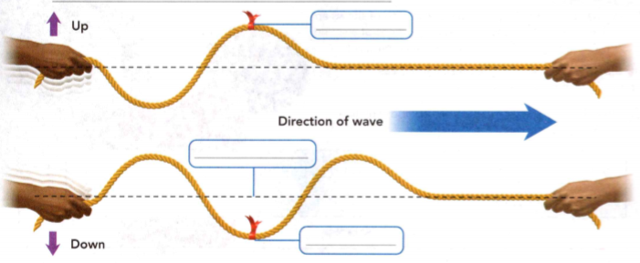

### Physical Science

## Physics

## 12 Characteristics of Waves

Something **floats** if it moves or rests on the surface of a liquid without
sinking. 

The **properties** of something are its characteristic qualities or
features. 

**Interaction** is the combined action or effect that things have on each
other.


**Complete the tasks below.** 

1. At a public pond, Lionel skips stones and tosses rocks into the water, sending
waves in all directions. Nearby, Ali floats a wooden boat. Both boys observe the
properties of the waves. The rocks make higher waves than the stones. They watch
the interaction of the waves and the boat. The boat bounces violently as the
higher waves travel under it. What example in the paragraph suggests that the
properties of waves might affect a floating object?


### Vocabulary Skill
 
Word: reflection  
Everyday Meaning: serious thought or consideration   
Scientific Meaning: the bouncing back of a wave from a surface   

Word: frequency   
Everyday Meaning: the rate at which something occurs   
Scientific Meaning: the number of waves that pass a point in a certain time   


### Chapter Preview

- wave
- energy
- medium
- mechanical wave
- vibration
- transverse wave
- crest
- trough
- longitudinal wave
- compression
- rarefaction
- amplitude
- wavelength
- frequency
- hertz
- reflection
- refraction
- diffraction
- interference
- constructive interference
- destructive interference
- standing wave
- node
- antinode
- resonance

### What Are Waves?
- What Forms Mechanical Waves?
- What Are the Types of Mechanical Waves?

### The Power of Waves
Where does the energy that powers your school come from? It may be from oil,
gas, or coal. You also may have heard of using the sun or wind as energy
sources. But did you know that ocean waves could be used as an energy source,
too? Mechanical systems placed in the ocean or along the shore transform the
energy from waves into electricity. Unlike oil, gas, or coal, the energy from
ocean waves will not run out. Although wave energy technology is still very new,
many scientists are optimistic about its possible use around the world.

**Complete the tasks below.** 

1. How might wave energy impact the environment? Consider both intended and
unintended consequences.

### What Forms Mechanical Waves?
You have probably seen and felt water waves while swimming. But did you know
that many kinds of waves affect you daily? Sound and light are very different
from water waves, but they are waves, too. 

### Characteristics of Waves 
What is a wave? A **wave** is a disturbance involving the transfer of energy from
place to place. In science, **energy** is defined as the ability to do work. For
example, the energy of a water wave can lift an object on the water's surface as
the wave passes under it. But after the wave passes, the water is calm again. 

Most waves need something to travel through. For example, sound waves can travel
through air, water, and even solid materials. Water waves travel along the
surface of the water. A wave can even travel along an object, such as a rope.
The material through which a wave travels is called a **medium**. Gases (such as
air), liquids (such as water), and solids (such as ropes) can all act as
mediums. Waves that require a medium to travel are called **mechanical waves**.


**Complete the tasks below.** 

1.The news medic such as newspapers and television stations, carry current
events worldwide. Explain how the way news travels is similar to the way a wave
travels.

### Waves and Energy 

Energy is needed to make a wave. **Mechanical waves form when a source of energy
causes a medium to vibrate.** A **vibration** is a repeated back-and-forth or
up-and-down motion. Moving objects have energy, which they can transfer to a
medium to produce waves. For example a motorboat's propeller can transfer energy
to calm water. As a result, the particles that make up the water start to
vibrate. The vibrations move through the water, resulting in a wave.

Energy Source: Moving objects have energy.   
Medium: Mechanical waves form in mediums.   
Vibration: When a vibration moves through a medium, a wave results.   

### What Are the Types of Mechanical Waves?   

Waves move through mediums in different ways. **The three types of mechanical
waves are transverse waves, longitudinal waves, and surface waves.** These waves
are classified by how they move through mediums.   

### Transverse Waves 

When you make a wave on a rope, the wave moves from one end of the rope to the other. However, the rope itself moves up and down or from side to side, at right angles to the direction in which the wave travels. A wave that vibrates the medium at right angles, or perpendicular, to the direction in which the wave travels is called a **transverse wave**.

Making a transverse wave on a rope forms high and low points along the rope. A
high point on a transverse wave is called a **crest**, and a low point is called a
**trough** (trawf). In Figure 2, you can see that the red ribbon on the rope is
first at a crest and then at a trough. As the wave moves through the rope, the
ribbon moves up and down between crests and troughs. The dashed line shows the
rope's position before it was moved. It is called the rest position.

  <figure>
    
    <figcaption>Figure 1. Motion in a Transverse Wave.</figcaption>
  </figure>

**Complete the tasks below.** 

1. Motion in a Transverse Wave (Figure 1). When you shake out a bedsheet or move
a rope up and down, you create a transverse wave.
a) Label the crest, trough, and rest position.
b) Draw a vertical line through the purple arrows and a horizontal line through
the blue arrow until it touches the vertical line. What angle did you draw?

2. The word trough has more than one meaning. Write two sentences that use the
word, one showing its everyday meaning and one showing its scientific meaning.

### Longitudinal Waves 

If you push and pull one end of a spring toy, you can produce a longitudinal
wave like the one shown in Figure 3. Notice that the coils in the spring move
back and forth in the same direction, or parallel, to the wave's motion. 

A **longitudinal wave** vibrates the medium in the same direction in which the wave
travels. Also, notice how the spacing between the coils varies. Some coils are
close together, while others are farther apart. An area where the coils are
close together is called a **compression**. An area where the coils are spread out
is called a **rarefaction**.

As compressions and rarefactions travel along the spring toy, each coil moves
forward and then back. The energy travels from one end of the spring to the
other, in the form of a wave. After the wave passes, each coil returns to its
starting position.

Fixed points on a transverse wave vibrate up and down. Fixed points on a
longitudinal wave, such as the one marked by the red ribbon, vibrate back and
forth.

  <figure>
    
    <figcaption>Figure 2. Motion in a Longitudinal Wave.</figcaption>
  </figure>


**Complete the tasks below.** 

1. Label the areas of compression and rarefaction in the diagram in Figure 2.

  <figure>
    
    <figcaption>Figure 3. Sound waves are longitudinal waves.</figcaption>
  </figure>

2. Sound waves are longitudinal waves. The picture in Figure 3 shows an area of
air as the compressions and rarefactions of a sound wave pass through it. The
dots represent air particles.
a) R in the rarefaction areas and a C in the compression areas.
b) Draw what the particles should look like in area Z.

### Surface Waves 

Surface waves are combinations of transverse and longitudinal waves. This type
of wave travels along a surface that separates two mediums. Ocean waves are the
most familiar surface wave. An ocean wave travels at the surface between water
and air. When a wave passes through water, the water (and anything on it)
vibrates up and down, like a transverse wave on a rope. The water also moves
back and forth slightly in the direction that the wave is traveling, like the
coils of a spring. But unlike the coils of a spring, water does not compress.
The up-and-down and back-and-forth movements combine to make each particle of
water move in a circle, as you see in Figure 4.

  <figure>
    
    <figcaption>Figure 4. Waves Transfer Energy.</figcaption>
  </figure>

**Complete the tasks below.** 

1. A wave moves the bottle in a circular motion (Figure 4). After the wave
passes, the bottle returns to where it started. In the empty box, draw what the
next picture should look like.

2. Compared to the direction it travels, at what angle does a transverse wave
vibrate a medium? How are transverse and longitudinal waves alike and different?   

3. What are the three types of mechanical waves?  

### Properties of Waves
- What Are the Amplitude, Wavelength, Frequency, and Speed of a Wave?  
- How Are Frequency, Wavelength, and Speed Related?


**Complete the tasks below.** 

1. Bzzzzzzzzz! Bzzzzzzzzz! What's that noise? It's the sound of a mosquito
buzzing in your ear. This distinct buzzing sound comes from sound waves formed
as a mosquito beats its wings. Researchers recently discovered that the buzzing
sound of female mosquitoes attracts male mosquitoes. When a male mosquito meets
a female, he quickly adjusts his own buzz to match the frequency the sound waves
created by he female. Researchers think that this matched buzzing frequency aids
in mosquito mating. What are two other animals you know of that make buzzing
sounds?

### What Are the Amplitude, Wavelength, Frequency, and Speed of a Wave?

Waves may vary greatly. For example, waves can be long or short. They can carry
a little energy or a lot of energy. They can be transverse or longitudinal.
However, all waves have common properties—amplitude, wavelength, frequency, and
speed. **Amplitude describes how far the medium in a wave moves. Wavelength
describes a wave's length, and frequency describes how often it occurs. Speed
describes how quickly a wave moves.**

### Amplitude 
The height of a wave's crest depends on its amplitude. **Amplitude** is the maximum
distance the medium vibrates from the rest position. For a water wave, this
distance is how far the water particles move above or below the surface level of
calm water. High waves have more energy than low waves. The more energy a wave
has, the greater its amplitude.

A transverse wave is shown in Figure 1. Its amplitude is the maximum distance
the medium moves up or down from its rest position. The amplitude of a
longitudinal wave is a measure of how compressed or rarefied the medium becomes.
When the compressions are dense, it means the wave's amplitude is large.

**Complete the tasks below.** 

  <figure>
    
    <figcaption>Figure 5. Amplitude.</figcaption>
  </figure>

1. The amplitude of a transverse wave is the maximum distance the medium vibrates
from the rest position. See Figure 5. 
a) Label the parts of the wave. 
b) What is the amplitude of the wave in centimeters?

  <figure>
    
    <figcaption>Figure 6. Properties of Waves .All waves have amplitude, wavelength, frequency, and speed.</figcaption>
  </figure>

2. Properties of Waves. All waves have amplitude, wavelength, frequency, and
speed. See Figure 6.
a) Which transverse wave has the shortest wavelength?
b) If a transverse wave travels 10 meters in 5 seconds, what is its speed?
c) How does a shorter wavelength affect the frequency of a wave?
d) Which wave has the greater amplitude - yellow or blue?
e) One yellow wave passes a point each second, so the frequency is _____ .
f) Two green waves pass a point each second, so the frequency is _____ .


### Wavelength 

A wave travels a certain distance before it starts to repeat. The distance
between two corresponding parts of a wave is its **wavelength**. You can find the
wavelength of a transverse wave by measuring the distance from crest to crest as
shown in Figure 2. For a longitudinal wave, the wavelength is the distance
between compressions.

### Frequency 

The **frequency** of a wave is the number of waves that pass a given point in a
certain amount of time. For example, if you make waves on a rope so that one
wave passes by a point every second, the frequency is 1 wave per second. Move
your hand up and down more quickly and you increase the frequency.

Frequency is measured in units called hertz (Hz), and is defined as the number
of waves per second. A wave that occurs every second has a frequency of 1 wave
per second (1/s) or 1 Hz. If two waves pass every second the frequency is 2
waves per second (2/s) or 2 Hz.

### Speed 

Different waves travel at different speeds. Think about watching a distant
thunderstorm on a hot summer day. The thunder occurs the instant the lightning
flashes, but the light and sound reach you seconds apart. This happens because
light waves travel much faster than sound waves. In fact, light waves travel
about a million times faster than sound waves!

The speed of a wave is how far the wave travels in a given amount of time. You
can determine a wave's speed by dividing the distance it travels by the time it
takes to travel that distance. Sound, for example, travels about 990 meters in 3
seconds in air when the temperature is 0°C. Therefore, its speed is 330 m/s in
these conditions. As long as the temperature of the medium (air) doesn't change,
the speed of sound will stay the same.

### How Are Frequency, Wavelength, and Speed Related?

You just learned that you can calculate the speed of a wave by dividing the
distance it travels by the time it takes to travel that distance. But you can
also calculate the speed of a wave if you know its wavelength and frequency. =
The speed, wavelength, and frequency of a wave are related by a mathematical
formula.

```
Speed = Wavelength x Frequency
```

If you know two quantities in the formula, you can calculate the third quantity.
For example, if you know a wave's speed and wavelength, you can calculate its
frequency. If you know the , speed and frequency, you can calculate the
wavelength.

```
Frequency = Speed / Wavelength

Wavelength =	Speed / Frequency
```

The speed of a wave remains constant if the medium, temperature, and pressure do
not change. For example, all sound waves travel at the same speed in air at a
given temperature and pressure. Even if a sound wave's frequency changes, its
speed stays the same. So, if the frequency of a sound wave increases, its
wavelength must decrease to maintain a constant speed.


**Complete the tasks below.** 

  <figure>
    
    <figcaption>Figure 7. The table shows measurements of some properties of a sound wave in water and in air..</figcaption>
  </figure>

1. The table in Figure 7 shows measurements of some properties of a sound wave in water and in air.
a) fill in the table.
b) What can this table tell you about the speed of a wave?

2. The waves in some amusement park wave pools are controlled by regularly
spaced bursts of air. Changing the timing and strength of these air bursts also
changes the characteristics of the waves that result. 
a) List and describe four wave characteristics. 
b) Which characteristic(s) do you think would change if the air bursts were
stronger? 
c) Which would change if more air bursts came in a shorter amount of time?
Explain.

3. Wavelength, frequency, and speed are related by which formula?

4. A wave's frequency is 2 Hz and its wavelength is 4 m. What is the wave's
speed?

### Interactions of Waves
- What Changes the Direction of a Wave?
- What Are the Two Types of Wave Interference? 
- How Do Standing Waves Form?

**Complete the tasks below.** 

1. The Fall of Galloping Gertie "My breath was coming in gasps; my knee were raw
and bleeding, my hands bruised and swollen.... Safely back at the toll plaza, I
saw the bridge in its final collapse and saw my car plunge into the Narrows."
This dramatic piece of writing is a witness's real-life account of the collapse
of the Tacoma Narrows Bridge in Tacoma, Washington, on November 7, 1940. Prior
to its collapse, the suspension bridge was known for its swaying and rolling in
the wind. This motion happened so regularly that the bridge was nicknamed
"Galloping Gertie." Only four months after its construction, the bridge
collapsed into the waters of Puget Sound during a windstorm. Although a
disaster, Galloping Gertie's collapse became a valuable teaching tool for
engineers. 
a) Why is "Galloping Gertie" an appropriate nickname for the bridge? 
b) If you were an engineer studying this bridge collapse, what is one
thing you would research?


### What Changes the Direction of a Wave?  

If you toss a ball against a wall, the ball bounces back in a new direction.
Like a ball, waves can also change direction. **Waves change direction by
reflection, refraction, and diffraction.**

### Reflection 
When a wave hits a surface, any part of the wave that cannot pass through the
surface bounces back. This interaction with a surface is called reflection.
Reflection happens often in your everyday life. When you looked in your mirror
this morning you used reflected light to see yourself. The echo you hear when
you shout in an empty gym is also a reflection.

In Figure 8 you can see how light waves are reflected. All reflected waves obey
the law of reflection.

  <figure>
    
    <figcaption>Figure 8. The law of reflection.</figcaption>
  </figure>

The law of reflection states that the angle of incidence equals the angle of reflection.
a) **Incoming wave** A wave moving toward the surface at an angle.
b) **Angle of incidence** The angle between the incoming wave and the normal.
c) **Normal** A line perpendicular to the surface at the point where reflection occurs.
d) **Angle of reflection** The angle between the reflected wave and the normal.
e) **Reflected wave** A wave bouncing off the surface at an angle.


**Complete the tasks below.** 

1. In Figure 8 read the sequence of steps, matching each step to its letter in
the photo. If the angle of incidence is 45°, explain what the angle of
reflection would be.

### Refraction 
Have you ever ridden a skateboard and gone off the sidewalk onto grass? If so,
you know it's hard to keep moving in a straight line. The front wheel on the
side moving onto the grass slows down. The front wheel still on the sidewalk
continues to move fast. The difference in the speeds of the two front wheels
causes the skateboard to change direction.

  <figure>
    
    <figcaption>Figure 9. Refraction of Light Waves.</figcaption>
  </figure>

Like a skateboard that changes direction, changes in speed can cause waves to
change direction. Look at Figure 9. When a wave enters a new medium at an angle,
one side of the wave changes speed before the other side. This causes the wave
to bend. Bending occurs because different parts of the wave travel at different
speeds. Refraction is the bending of waves due to a change in speed.

Waves do not always bend when entering a new medium. No bending occurs if a wave
enters a new medium at a right angle. Bending does not occur if the speed of the
wave in the new medium is the same as the speed of the wave in the old medium.


**Complete the tasks below.** 

1. Light bends when it enters water at an angle because the side of the wave
that enters the water first slows down before the other side does. Suppose you
shine a light into a corner of an empty pool. Why will a different spot be lit
up if the pool is filled with water?

### Diffraction 

Waves sometimes bend around barriers or pass through openings. When a wave
moves around a barrier or through an opening in a barrier, it bends and
spreads out. These wave interactions are called diffraction. Two examples of
diffraction are shown in Figure 10. 
- Water waves diffract when they encounter canals or shorelines.
- The waves spread out after passing through the narrow opening.

  <figure>
    
    <figcaption>Figure 10. The Diffraction of Water Waves.</figcaption>
  </figure>

**Complete the tasks below.** 

  <figure>
    
    <figcaption>Figure 11. Waves changing directions.</figcaption>
  </figure>

1. Use the three pictures in Figure 11 to answer the questions.
How do the waves change direction?
 
2. In what way are reflection, refraction, and diffraction similar?

3. What is diffraction?

4. How can a wave's direction be changed?

5. A wave bends after entering a new medium. What type of interaction is this?


### What Are the Two Types of Wave Interference?

Have you ever seen soccer balls collide? The balls bounce off each other because
they cannot be in the same place at the same time. Surprisingly, this is not
true of waves. Unlike two balls, two waves can overlap when they meet.
Interference is the interaction between waves that meet. **There are two types of
interference: constructive and destructive.** 

### Constructive Interference
Interference in which waves combine to form a wave with a larger amplitude than
any individual wave's amplitude is called **constructive interference**. You can
think of constructive interference as waves "helping each other," or adding
their energies. For example, in Figure 4, when the crests of two waves overlap,
they make a higher crest. If two troughs overlap, they make a deeper trough. In
both cases, the amplitude of the combined crests or troughs increases.

  <figure>
    
    <figcaption>Figure 12. Constructive Interference.</figcaption>
  </figure>


Interference is responsible for the iridescent colors seen in oil films, soap
bubbles, and the feathers of some birds, like the common grackle. The structure
of the bird's feathers creates the interference. The bright colors are only seen
at specific angles of reflection.


**Complete the tasks below.** 

1. In Figure 12 what does the black dotted line represents?  
2. What happens to the direction of each wave when the waves meet.


### Destructive Interference 

Interference in which two waves combine to form a wave with a smaller amplitude
than either original wave had is called destructive interference. Destructive
interference can occur when the crest of one wave overlaps the trough of another
wave. If the crest has a larger amplitude than the trough of the other wave, the
crest "wins" and part of it remains.  

If the original trough had a larger amplitude than the crest of the other wave,
the result is a trough. If a crest and trough have equal amplitudes, they will
completely cancel as shown in Figure 13. Destructive interference is used in
noise-canceling headphones to block out distracting noises in a listener's
surroundings.

  <figure>
    
    <figcaption>Figure 13. Destructive Interference.</figcaption>
  </figure>


**Complete the tasks below.** 

1. Describe the steps of destructive interference a) - c) in Figure 13.   
2. What are the two types of wave interference?

### How Do Standing Waves Form?  

If you tie a rope to a doorknob and shake the free end, waves will travel down
the rope, reflect at the end, and come back. The reflected waves will meet the
incoming waves and interference occurs. **If the incoming wave and reflected
wave have just the right frequency, they combine to form a wave that appears to
stand still. This wave is called a standing wave.** 

A **standing wave** is a wave that
appears to stand in one place, even though it is two waves interfering as they
pass through each other.

### Nodes and Antinodes 

In a standing wave, destructive interference produces points
with zero amplitude, called **nodes**, as shown in Figure 6. The nodes are always
evenly spaced along the wave. At points in the standing wave where constructive
interference occurs, the amplitude is greater than zero. Points of maximum
amplitude on a standing wave are called antinodes. The antinodes always occur
halfway between two nodes.

  <figure>
    
    <figcaption>Figure 14. Standing Waves.</figcaption>
  </figure>


**Complete the tasks below.** 

1. As the frequency of the standing wave increases, more nodes and antinodes are
created, see Figure 14. 
a) In the second box, label the nodes and antinodes.   
b) In the third box, draw the next standing wave in the series, and label its
nodes and antinodes.   

### Resonance   

Have you ever pushed a child on a swing? At first the swing is difficult to
push. But once it is going, you need only a gentle push to keep it going. This
is because the swing has a natural frequency. Even small pushes that are in
rhythm with the swing's natural frequency produce large increases in the swing's
amplitude.  

Most objects have at least one natural frequency of vibration. Standing waves
occur in an object when it vibrates at a natural frequency. If a nearby object
vibrates at the same frequency, it can cause resonance. **Resonance** is an increase
in the amplitude of a vibration that occurs when external vibrations match an
object's natural frequency.  

The Tacoma Narrows Bridge, or "Galloping Gertie," may have collapsed because of
resonance. Storm winds are said to have resonated with the natural frequency of
the bridge. This caused the amplitude of the bridge's sway to increase until the
bridge collapsed.


**Complete the tasks below.** 

1. What causes resonance to occur?  
2. When do standing waves form?   
3. What causes nodes to form in a standing wave?

### Study Guide


- Mechanical waves form when a source of energy causes a medium to vibrate.
- The three types of mechanical waves are transverse waves, longitudinal waves,
and surface waves.
- Amplitude describes how far the medium in a wave moves. Wavelength describes a
wave's length, and frequency describes how often it occurs. Speed describes how
quickly a wave moves.
- The speed, wavelength, and frequency of a wave are related by a mathematical formula:
```
Speed = Wavelength x Frequency.
```
- Waves change direction by reflection, refraction, and diffraction. 
- There are two types of interference: constructive and destructive.
- If the incoming wave and reflected wave have just the right frequency, they
combine to form a wave that appears to stand still. This wave is called a
standing wave.

**Complete the tasks below.** 

1. A wave transfers
A) energy.	
B) particles
C) water.	
D) air.
2. What	forms when a source of energy causes a medium to vibrate?

  <figure>
    
    <figcaption>Figure 15. Transverse wav.</figcaption>
  </figure>

3. Label the crest(s) and trough(s) on the transverse wave in Figure 15.  

4. What is the difference between a transverse wave and a
longitudinal wave?

5. Suppose ripples move from one side of a lake to the other. Does the water
move across the lake? Explain.

6. The distance between two crests is a wave's   
A) amplitude.	
B) wavelength.
C) frequency.	
D) speed.

7. The _________ of a wave is the number of waves that pass a given point in a
certain amount of time.

  <figure>
    
    <figcaption>Figure 16. This wave in the middle of the ocean was produced by an underwater earthquake.</figcaption>
  </figure>

8. The wave shown in Figure 16 is in the middle of the ocean and was produced by an underwater earthquake. 
a) What is the amplitude of the wave?   
b) What is its wavelength?   
c) Find the frequency of the wave.   
d) How long would it take this wave to travel 5,000 km?

9. The bending of a wave due to a change in speed is called
A) interference.	
B) reflection.
C) diffraction.	
D) refraction.

10. __________________ occurs when external vibrations match an object's natural frequency.

11. Two waves are traveling toward each other. The crests from the waves meet.
Describe what happens.  

12. If you push a shopping cart and one wheel hits a rough patch of concrete, it
is difficult to steer the cart in a straight line. Explain how this is similar
to refraction of a wave as it enters a new medium.

13. Wave interaction occurs often - in the environment. Describe three different
ways that you could observe waves changing direction in an indoor swimming pool.
Mention as many types of waves as possible.

14. During a storm, a TV reporter says, "The ocean waves are 3 meters high. They
are about 45 m apart and are hitting the shore every 15 seconds." Think about
the four basic properties of waves and describe these ocean waves using the
correct science words. (Hint: You will need to do some calculations first.)


15. Two waves approach each other as shown in the diagram below. What will be the
amplitude of the wave produced when the crests from each wave meet?
A) 20 cm	
B) 35 cm
C) 15 cm	
D) 5 cm

16. When a wave enters a new medium at 60° and changes speed, the wave
A) does not bend because one side changes speed before the other side.
B) does not bend because the angle is less than 90°.
C) bends because both sides change speed at the same time.
D) bends because one side changes speed before the other side.

17. The speed of a wave in a spring is 3 m/s. If the wavelength is 0.1 m, what is
the frequency?
A) 30 Hz	
B) 0.3 Hz
C) 30 m/s	
D) 0.3 m/s 

18. Which of the following is true about standing waves?
A) Constructive interference produces points with zero amplitude.
B) The nodes are unevenly spaced along the wave.
C) The amplitude of antinodes is greater than nodes.
D) Nodes are points of maximum energy on the wave.

19. What is the angle of incidence if a reflected wave bounces off a mirror at an
angle of 65°?
A) 25°
B) 65°
C) 90°
D) 115° 

  <figure>
    
    <figcaption>Figure 17. 2 Waves.</figcaption>
  </figure>

20. Use the diagram in Figure 17 for this question. The waves shown travel at
the same speed. Which wave has the higher frequency? Which has the longer
wavelength? Which has the greater amplitude?

21. For as long as humans have sailed on the oceans, ships have disappeared without
explanation. People chalked these losses up to bad luck and bad weather. A
mysterious phenomenon, proven in 2004 to exist, may finally explain why some
large ships are never seen again. 

Waves in water usually behave like the other waves around them. Most waves in an
area are about the same height and move at the same rate. Ocean waves are rarely
more than 15 meters in height and usually form rolling hills of water. But freak
monster waves can top 30 meters in height, forming huge walls of water! 

Some monster waves form where two currents meet and their waves combine. The
weather may be responsible for other monster waves. If an ordinary large wave
travels at the same speed and in the same direction as the wind for more than 12
hours, the extra push from the wind can cause the wave to reach monster heights.
Some monster waves seem to grow out of normal ocean wave patterns. Physicists
theorize that these unstable waves absorb energy from the surrounding waves and
grow to vast heights. 

Most ships are not designed to withstand 30-meter-high waves, so it's no wonder
that little has been found but wreckage. Fortunately, scientists are working on
ways to protect ships and sailors in the face of these enormous destructive
waves.

Research how so-called monster waves focus and amplify the effects of
surrounding waves. Use computer technology to create a diagram or to model the
effects.

22. Can someone really break a glass by singing a high note? It may seem like a
superpower, but the human voice does have the power to shatter a crystal wine
glass! This feat is commonly credited to opera singers because they have very
powerful and well-trained voices.

Many wine glasses are made of a type of glass called crystal. The molecules in a
crystal glass are arranged in a repeating pattern that forms a repeating
internal structure. If you tap a crystal object, you can hear a clear tone. That
tone is the natural resonant frequency of vibration for that crystal. When the
crystal is exposed to a sound at that frequency, the molecules of the crystal
vibrate. When the glass vibrates too much, the shape of the glass distorts,
which causes the glass to crack. The cracks expand very rapidly, and the crystal
shatters.

A trained singer can reproduce the natural frequency of a crystal glass. If the
singer can sing the tone of the crystal's natural frequency loudly enough, the
singing can shatter the glass!

Resonant frequencies can also be used to make music. Glass harps use wine
glasses filled with varying amounts of water to create different notes. The
player runs a moistened finger around the rim of each glass. The size of the
glass and the amount of water determine which note sounds. 

Research to learn more about how glass harps work. Then design an experiment to
test the amount of water needed to create different pitches. Create a one-page
procedure for your experiment.

23. As New Orleans musicians play their instruments, vibrations travel through the
air as sound waves. The audience hears the music when their ears detect the
sound waves. How do you hear sound from a drum?


