### Physical Science

## Physics

## 13 Sound 

- To **vibrate** is to move back and forth.  
- **Waves** are disturbances that carry energy from one place to another.
- A **medium** is a material through which a wave travels.

### Vocabulary Skill
 
Word: medium
Everyday Meaning: in the middle in quality, amount, or size; Example: The boy is
medium in size and build
Scientific Meaning: the material through which a wave travels; Example: Air is a
common medium for sound to travel throught.  

Word: reflect
Everyday Meaning: to express or show; Example: Her skills in basketball reflect
years of training.
Scientific Meaning: to be bent or thrown back; Example: The water waves reflect
off the sides of the pool.

**Complete the tasks below.** 

1. One morning, an earthquake occurs in California. The ground vibrates as waves
travel out in all directions from the source of the earthquake. The rocks inside
Earth are the medium that transmits the waves. What happens inside Earth during
an earthquake?

2. Which of the two sentences below uses the scientific meaning of the word reflect?
A) Her article reflects thorough research.
B) Light waves reflect off the surface of a mirror.

3. Thunder and Lightning. It's a hot, sticky summer day, and the sky is filled with
dark clouds. Suddenly, a flash of light zigzags through the air! A few seconds
later, you hear the loud crack of thunder. 

The lightning you see causes the thunder you hear. The reason you see lightning
before you hear thunder is because light travels much faster than sound. You can
use this fact to figure out how close the storm is. After you see a flash of
lightning, count off the seconds until you hear the thunder. Divide the number
of seconds by five. The result gives the approximate distance (in miles) to the
storm.

You notice that the time between seeing the lightning and hearing the thunder is
increasing. What does this mean?

### Chapter Preview

- density
- pitch
- loudness
- intensity
- decibel
- music
- fundamental tone
- overtone
- ear canal
- eardrum
- cochlea
- echolocation
- ultrasound
- sonar
- sonogram

### The Nature of Sound

- What is Sound?
- What Factors Affect the Speed of Sound?

### What Is Sound?   
Here is a riddle: If a tree falls in a forest and no one hears it, does the tree
make a sound? To a scientist, a falling tree makes a sound whether someone hears
it or not. When a tree falls, the energy with which it strikes the ground causes
a disturbance. Particles in the ground and the air begin to vibrate, or move
back and forth. The vibrations create a sound wave as the energy travels through
two mediums—air and the ground. **Sound is a disturbance that travels through a
medium as a longitudinal wave.**


### Making Sound Waves 
A sound wave begins with a vibration. Look at the drum shown in Figure 1. When
the side of the drum (called the drumhead) is struck, it vibrates rapidly in and
out. These vibrations disturb nearby air particles. Each time the drumhead moves
outward, it pushes air particles together, creating a compression. When the
drumhead moves inward, the air particles bounce back and spread out, creating a
rarefaction. These compressions and rarefactions travel through the air as
longitudinal waves.  

### How Sound Waves Travel 
Like other mechanical waves, sound waves carry energy through a medium without
moving the particles of the medium along. Each particle of the medium vibrates
as the disturbance passes. When the disturbance reaches your ears, you hear the
sound.

A common medium for sound is air. But sound can travel through solids and
liquids, too. For example, when you knock on a solid wooden door, the particles
in the wood vibrate. The vibrations make sound waves that travel through the
door. When the waves reach the other side of the door, they make sound waves in
the air.


An astronaut riding a vehicle on the surface of the moon would not hear the
sound of the engine. Sound can travel only if there is a medium. There are no
air molecules to compress or expand on the moon, so there is no sound.

### Diffraction of Sound Waves 
Have you ever wondered why when you are sitting in a classroom you can hear your
friends talking in the hallway before they walk through the doorway? You hear
them because sound waves do not always travel in straight lines. Sound waves can
diffract, or bend, around the edges of an opening, such as a doorway.  

Sound waves can also diffract around obstacles or corners. This is why you can
hear someone who is talking in the hallway before the person walks around the
corner. The sound waves bend around the corner. Then they spread out so you can
hear them even though you cannot see who is talking. Remember this the next time
you want to tell a secret!

**Complete the tasks below.** 

  <figure>
    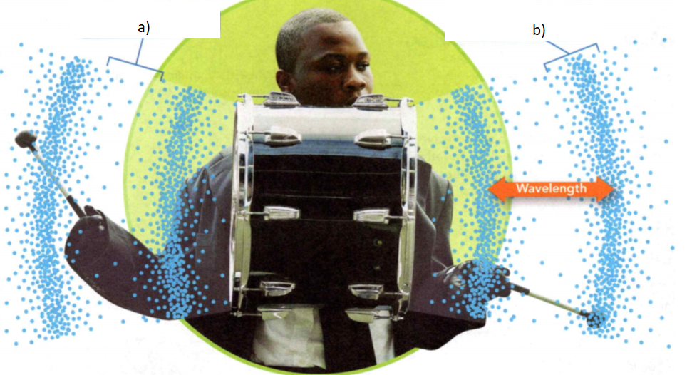
    <figcaption>Figure 1. Sound Waves.</figcaption>
  </figure>

1. As the drumheads in Figure 1 vibrate, they create sound waves that travel
through the air. Identify each letter a) & b) as a compression or a rarefaction.
Explain how you knew what to label them.

  <figure>
    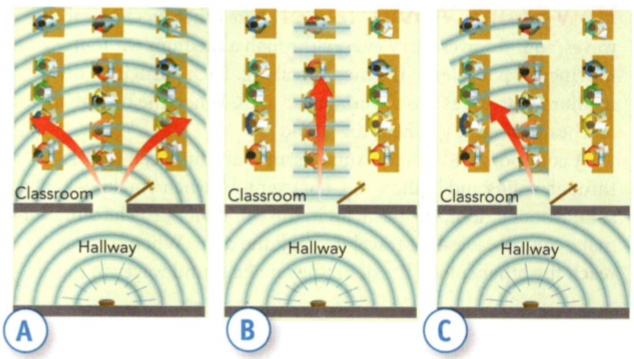
    <figcaption>Figure 2. Diffraction.</figcaption>
  </figure>

2. Diffraction occurs when sound waves pass through an opening such as a
doorway in Figure 2. Which diagram - A, B, or C - correctly shows what happens to sound
waves when they pass through the doorway? Explain your answer.

3. A sound wave carries _______ through a medium.

4. In a sound wave, the particles in the medium are close together in a
(compression/rarefaction) and farther apart in a (compression/rarefaction).

5. Explain why you can hear a ringing telephone through a closed door.

### What Factors Affect the Speed of Sound?

Suppose you were in a stadium watching the baseball player. You
might see the bat hit the ball before you hear the hit. It is possible to see an
action before you hear it because sound travels much more slowly than light. At
room temperature, about 20°C, sound travels through air at 342 m/s. This is
nearly 900,000 times slower than the speed of light! But the speed of sound is
not always 342 m/s. Sound waves travel at different speeds in different media.
** The speed of sound depends on the temperature, stiffness, and density of the
medium the sound travels through.**

### Temperature 

In a given liquid or gas, sound travels more slowly at lower temperatures than
at higher temperatures. Why? At lower temperatures, the particles of a medium
move more slowly than at higher temperatures. It is more difficult for the
particles to move, and they return to their original positions more slowly.


**Complete the tasks below.** 

  <figure>
    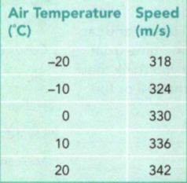
    <figcaption>Figure 3. Speed of Sound in Air.</figcaption>
  </figure>

1. How fast the sound of the bat hitting the ball travels depends on the air
temperature. The data in the table in Figure 3 show how the speed of sound in
air changes with temperature.
a) Create a line graph. Plot temperature on the horizontal axis and speed on the
vertical axis. Give the graph a title.
b) What might the speed of sound be at 30°C?

### Stiffness 

Years ago, Native Americans put their ears to the ground to find out if herds of
bison or other animals were nearby. By listening for sounds in the ground they
could hear the herds sooner than if they listened for sounds in the air. What is
it about the state of the medium—solid, liquid, or gas—that determines the speed
of sound?   

The speed of sound depends on the stiffness of the medium. Sound travels more
quickly in stiff media because when the particles of the medium are compressed,
they quickly spread out again. For example, steel is stiffer than wood. If you
knocked on both a wooden and steel door of the same thickness, the steel door
would transmit the sound more easily. Sound also travels better over long
distances in stiff media because sound waves lose energy more slowly than in
less stiff media.   

Solids are stiffer than liquids or gases. The particles in a solid are close
together, so they bounce back and forth quickly as the compressions and
rarefactions of the sound waves pass by. Most liquids are not as stiff as
solids. So sound does not travel as fast in liquids as it does in solids. Gases
are not very stiff. Sound generally travels the slowest in gases.


**Complete the tasks below.** 

  <figure>
    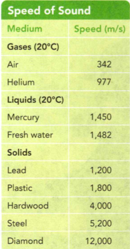
    <figcaption>Figure 4. Speed of Sound.</figcaption>
  </figure>


1. The table shows the speed of sound in different media. Use the data to answer
the following questions.
a) In general, does sound travel faster in solids, liquids, or gases?
b) Which substance is stiffer—air or water?
c) What is the stiffest substance in the table?
d) Suppose you put your ear to a steel fence. You tell your friend to yell and
tap the fence at the same time from far away. Which do you think that you will
hear first, the yell or the tap? Why?
e) How many times faster does sound travel in a diamond than in air?

### Density 

In materials of the same stiffness, sound travels more slowly in the denser
material. Density is how much matter or mass there is in a given amount of space
or volume. The more dense the material, the more mass it has in a given volume.
In denser materials, it is harder for the particles to move as sound waves pass
by. This slows sound down.   

The Channel Tunnel is a 50-kilometer-long undersea tunnel with a railway
connecting England and France. The engineers sent messages to each other by
tapping on the steel pipes. The sounds traveled through the pipes at a speed of
5,200 m/s. This is nearly four times faster than the speed of sound in lead. The
speed of sound in steel is greater than in lead because steel is both less dense
and stiffer than lead.

**Complete the tasks below.** 

1. Engineers in the Channel Tunnel sent messages to each other by tapping on the
steel pipes. Why did they use the steel pipes to communicate?

2. Why does sound usually travel faster in solids than in liquids or gases?  

3. The sounds from a marching band travel (faster/slower) when the air
temperature is 30°C than when the air temperature is 20°C.

4. Steel is denser than plastic, yet sound travels faster in steel than in
plastic. Develop a hypothesis to explain why.

5. The speed of sound depends on what?

	
### Properties of Sound
- What Affects Pitch?
- What Affects Loudness?
- What Causes the Doppler Effect?
- 
**Complete the tasks below.** 

  <figure>
    
    <figcaption>Figure 5. Range of Hearing.</figcaption>
  </figure>

1. To get a dog's attention, a dog trainer blows into a small whistle. But you
don't hear a thing. Dogs can hear frequencies well above the human range of
hearing. Frequency is measured in hertz (Hz), or the number of sound waves a
vibrating objet gives off per second. A higher frequency means that the sound
has a higher pitch. The table in Figure 5 compares the range of frequencies that humans and
various animals can hear. Which animal can hear the widest range of frequencies?


### What Affects Pitch?   

Pitch is an important property of sound that you may already know about. Have
you ever described someone's voice as "high-pitched" or "low-pitched"? The pitch
of a sound is a description of how high or low the sound seems to a person. ;:;)
The pitch of a sound you hear depends on the frequency of the sound wave. Sound
waves with a high frequency have a high pitch. Sound waves with a low frequency
have a low pitch.   

The frequency of a sound wave depends on how fast the source of the sound is
vibrating. For example, when you speak or sing, air from your lungs rushes past
your vocal cords, making them vibrate. This produces sound waves. To sing
specific pitches, or notes, you use muscles in your throat to stretch or relax
your vocal cords. When your vocal cords stretch, they vibrate more quickly as
the air rushes by them. This creates higher-frequency sound waves that have
higher pitches. When your vocal cords relax, lower-frequency sound waves with
lower pitches are produced.  

Frequency is measured in hertz (Hz). For example, a frequency of 50 Hz means 50
vibrations per second. A trained soprano voice can produce frequencies higher
than 1,000 Hz. A bass singer can produce frequencies lower than 80 Hz. Young
people can normally hear sounds with frequencies between 20 Hz and 20,000 Hz.

### What Affects Loudness? 

Loudness is another important property of sound. You probably already know about
loudness. For example, the closer you are to a sound, the louder it is. Also, a
whisper in your ear can be just as loud as a shout from a block away. **Loudness**
describes your awareness of the energy of a sound. **The loudness of a sound
depends on the energy and intensity of the sound wave.**  

### Energy 

If you hit a drum lightly, you hear a sound. If you hit the drum harder, you
hear a louder sound. Why? When you hit a drum harder, you transfer more energy
to it. This causes the amplitude, or the distance the drumhead moves from its
rest position, to increase. A sound source vibrating with a large amplitude
produces a sound wave with a large amplitude. Recall that the greater the
amplitude of a wave, the more energy it has. So the more energy a sound wave
has, the louder it sounds.

### Intensity 

  <figure>
    
    <figcaption>Figure 6. Intensity.</figcaption>
  </figure>

If you were to move closer to the stage shown in Figure 6, the voices of the
performers would sound louder. Why? Close to the sound source, a sound wave
covers a small area. As a wave travels away from the source, it covers more
area. The total energy of the wave, however, stays the same. Therefore, the
closer a sound wave is to its source, the more energy it has in a given area.
The amount of energy a sound wave carries per second through a unit area is its
intensity. A sound wave of greater intensity sounds louder.


### Measuring Loudness 

The loudness of different sounds is compared using a unit called the decibel
(dB). The table in the Apply It below compares the loudness of some familiar
sounds. The loudness of a sound you can barely hear is about 0 dB. A 10-dB
increase in loudness represents a tenfold increase in the intensity of the
sound. For example, a 10-dB sound is ten times more intense than a 0-dB sound. A
20-dB sound is 100 times more intense than a 0-dB sound and ten times more
intense than a 10-dB sound. Sounds louder than 100 dB can cause damage to your
ears, especially if you listen to those sounds for long periods of time. For
this reason, airport workers, like the one shown to the right, wear hearing
protection.


**Complete the tasks below.** 

1. Sound waves spread out as they travel away from the source. Rank the
intensity of a sound wave at the three locations in Figure 6. A ranking of 1 is
the greatest. Explain your answers.

  <figure>
    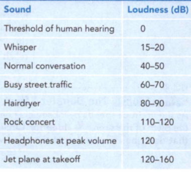
    <figcaption>Figure 7. Measuring Loudness.</figcaption>
  </figure>


2. Use the table in Figure 7 to answer the questions.
a) Which sounds louder, a rock concert or a jet plane at takeoff?
b) Which sounds could be dangerous to your ears?
c) How much more intense is a 20-dB whisper than the threshold of human hearing?
d) How much more intense is a 90-dB hair dryer than 60-dB street traffic?

3. The amount of energy a sound wave carries per second through a unit area is
its ______ .

4. The intensity of a sound wave (increases/decreases) with distance.

5. An 80-dB sound is _____ times more intense than a 60-dB sound.  

6. What does the loudness of a sound depends on.

### What Causes the Doppler Effect?

Have you ever listened to the siren of a firetruck on its way to a fire? If so,
then you probably noticed that as the truck goes by, the pitch of the siren
drops. But the pitch of the siren stays constant for the firefighters in the
truck. The siren's pitch changes only if it is moving toward or away from a
listener. 

The change in frequency of a wave as its source moves in relation to an observer
is called the Doppler effect. If the waves are sound waves, the change in
frequency is heard as a change in pitch. The Doppler effect is named after the
Austrian scientist Christian Doppler (1803-1853). The Doppler effect occurs
because the motion of the source causes the waves to either get closer together
or spread out. 

  <figure>
    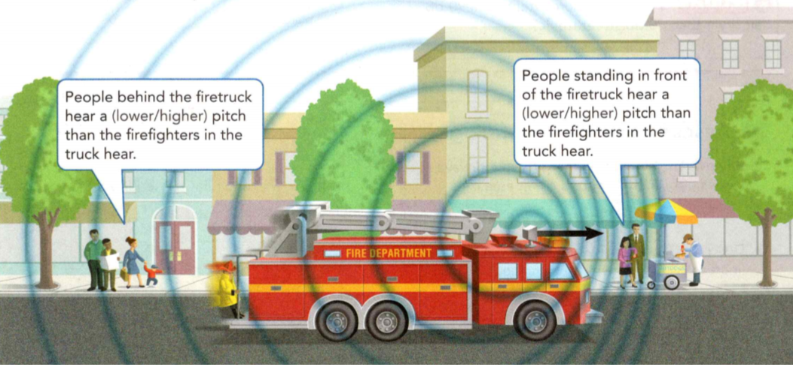
    <figcaption>Figure 8. The Doppler Effect.</figcaption>
  </figure>

Figure 8 shows how sound waves from a moving source
behave. Each time the siren sends out a new wave, the firetruck moves ahead in
the same direction as the waves in front of the truck. This causes the waves to
get closer together. Because the waves are closer together, they have a shorter
wavelength and a higher frequency as they reach observers in front of the truck.
As the truck moves away, it travels in the opposite direction of the sound waves
behind it. This causes the waves to spread out. Because they spread out, the
waves have a longer wavelength and a lower frequency as they reach the observers
behind the truck.


**Complete the tasks below.** 

1. As the firetruck in Figure 8 speeds by, observers hear a change in the pitch of the siren.
a) The waves in front of a moving sound source have a (shorter/longer)
wavelength. 
b) The waves behind a moving sound source have a (shorter/longer)
wavelength.
c) People behind the firetruck hear a (lower/higher) pitch than the firefighters
in the truck hear.

  <figure>
    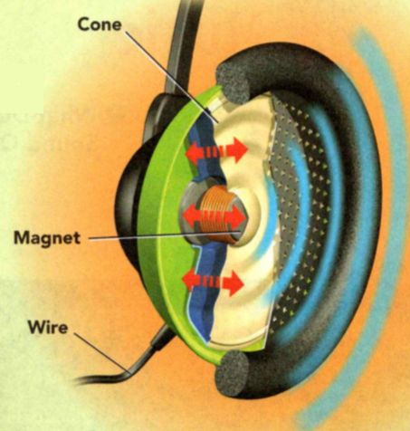
    <figcaption>Figure 9. Headphones.</figcaption>
  </figure>

3. What determines the pitch and loudness of sound?
Headphones turn an electrical signal into sound waves.
- An electrical signal travels up a wire.
- The electrical signal causes a magnet to vibrate.
- The magnet is attached to a thin cone of material. The vibrating cone sends sound waves through the air.
Compare how a drum and headphones produce sounds of higher pitch and greater
loudness.

4. What determines the pitch and loudness of sound?


5. I play an instrument called the French horn. The French horn has valves, a bell,
a mouthpiece, and three keys. It is interesting how pitch affects the music that
I make. While I was practicing, the music sounded out of tune. I realized I
hadn't tuned the instrument, so I slid the tuning valve up and down until I got
the right pitch. I like to play my instrument because it enhances my hand/eye
coordination. I also love the sound right. 
a) What does it mean to tune an instrument?
b) The musicians in a marching band do not tune their instruments until they are
outside. Why do you suppose this is?

### Music

- What Determines Sound Quality?


### What Determines Sound Quality?

Most people agree on what is and what is not music. Music is a set of notes that
combine in patterns that are pleasing. Noise, on the other hand, usually has no
pleasing patterns. When you describe a sound as pleasant or unpleasant, you are
describing sound quality. The sound quality of music depends on the instruments
making the music. **The sound quality of musical instruments results from
blending a fundamental tone with its overtones.**


## Fundamental Tones and Overtones 
To understand sound quality, consider the example of a guitar string. As the
string vibrates, waves travel along the string and reflect back, setting up a
standing wave. Standing waves occur in all musical instruments when they are
played. In a trumpet, for example, standing waves occur in a vibrating column of
air. 

A standing wave can occur only at specific frequencies, which are called
natural frequencies. The lowest natural frequency is called the **fundamental
tone.** The higher natural frequencies are called overtones. **Overtones** have
frequencies that are two, three, or more times the frequency of the fundamental
tone. 

Most instruments produce several natural frequencies at once. The
fundamental tone determines what note you hear. Each instrument produces
different overtones, so the blending of the fundamental tones and overtones
produces different sound qualities. The size, shape, and material of the
instrument determine which overtones are loudest. For example, strumming a
guitar's strings forces the guitar's hollow body to vibrate and resonate with
the natural frequencies of the guitar strings. Resonance increases the amplitude
of the vibration, increasing the loudness of the guitar.

**Complete the tasks below.** 

  <figure>
    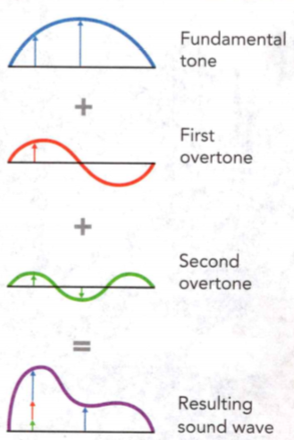
    <figcaption>Figure 10. Tones.</figcaption>
  </figure>


1. A guitar can produce a fundamental tone of 262 Hz. The diagram in Figure 10 show how the
fundamental tone and the first two overtones combine to produce the unique sound
for a guitar string. 
a) What are the frequencies of the first and second
overtones?
b) What determines which overtone will be loudest?
c) Which overtone will be loudest? Why?


### Groups of Musical Instruments

How does a musician control the sounds produced by a musical instrument? To
control pitch, the musician changes the fundamental tones. To control loudness,
the musician changes the energy of the vibrations. The way pitch and loudness
are controlled varies among the groups of instruments.

### Stringed Instruments

Stringed instruments include the guitar, violin, cello, and double bass. The
strings of these instruments produce sound by vibrating when they are plucked or
rubbed with a bow. To create louder sounds, the musicians pluck the strings
harder or press the bow harder against the strings. To vary the pitch, the
musicians change the length of the vibrating string. They do this by placing
their fingers on different places along the string as they play. A short string
produces a higher-pitched sound than a long string. The material, thickness, and
tightness of a string also affect the pitch it produces. 

### Percussion Instruments
Percussion instruments include the drums, bells, cymbals, and xylophone. These
instruments vibrate when struck. To create louder sounds, the musician hits the
instrument harder. The pitch of these instruments depends on the material from
which they are made, the size of the instrument, and the part of the instrument
that is played. For example, a large drum produces a lower pitch than a small
drum.


### Wind Instruments
Wind instruments include the trumpet, trombone, clarinet, and flute. These
instruments create sound when the musician blows on or across the mouthpiece.
This causes the air column inside the instrument to vibrate. The musician
creates a louder sound by blowing harder. The musician changes pitch by changing
the length of the air column. A shorter air column produces a higher pitch than
a longer air column. In many wind instruments, the musician changes the length
of the air column by pressing keys or valves. In the trombone, the musician
changes the length of the air column by moving a slide either closer to or
farther away from the mouthpiece.


**Complete the tasks below.** 

  <figure>
    
    <figcaption>Figure 11. Violin.</figcaption>
  </figure>

1. The musician in Figure 11 creates sound by rubbing the bow across the
strings. Insert an arrow in the box above to indicate in what direction the
musician should move his finger to create a higher-pitched sound.


  <figure>
    
    <figcaption>Figure 12. Drums.</figcaption>
  </figure>

2. The musicians create sound by hitting the drums. Circle the drum that would
produce the highest pitch.

  <figure>
    
    <figcaption>Figure 13. Trombone.</figcaption>
  </figure>

3. The musician in Figure 13 creates sound by blowing into the mouthpiece. If the musician
pushes the slide away from her, what will happen to the pitch of the trombone?
Why?

4. List What are the three groups of musical instruments?  
 
5. What types of instruments are a bell, a whistle, and a banjo?

6. Misconception: Deaf people are not able to sense music. Did you know that
Beethoven composed many great works after he lost his hearing? Like all
musicians, Beethoven could read music and hear it being played in his mind. But
Beethoven may have been able to appreciate music in ways that musicians with
normal hearing cannot. A recent study has shown that deaf people can sense
vibrations in the same area of the brain that is used to hear. These vibrations
create a pattern that they recognize and enjoy. Deaf musicians can also feel
vibrations in different parts of their bodies. The famous solo percussionist
Evelyn Glennie performs barefoot so that she can better feel the vibrations in
the floor. She also notices changes in the density of the air around her.
a) What senses are used to feel music?
b) Describe an example of how you have felt the vibrations from music.

### Hearing Sound
- Do Your Ears Work?


### How Do Your Ears Work?

The library is quiet. You are doing your homework. Suddenly, a door slams shut.
Startled, you turn in the direction of the sound. Your ears detected the sound
waves produced by the slamming door. But how exactly did your brain receive the
information? 

**Your ear gathers sound waves and sends information about sound to
your brain.** Your ear has three main sections: the outer ear, the middle ear, and
the inner ear. Each section has a different function. The outer ear funnels
sound waves, the middle ear transmits the waves inward, and the inner ear
converts sound waves into a form that travels to your brain.

**Complete the tasks below.** 

1. One of the functions of your ears is to locate the direction of sounds. Ask
your partner to sit in a chair with eyes closed. Observe Tap two pencils
together in different locations around your partner's head and face. Ask your
partner to identify what direction the sounds come from. Record the locations
where the taps are easily identified. Record the locations where the taps are
harder to identify. Switch places with your partner and repeat steps 1 and 2.
Discuss which sounds were easily located. Suggest an explanation for your observations.


### Outer Ear
The first section of your ear is the outer ear. The outermost part of your outer
ear looks and acts like a funnel. It collects sound waves and directs them into
a narrow region called the ear canal. Your ear canal is a few centimeters long
and ends at the eardrum. The eardrum is a small, tightly stretched, drumlike
membrane. The sound waves make your eardrum vibrate, just as a drum vibrates
when you strike it.

### Middle Ear
Behind the eardrum is the middle ear. The middle ear contains the three smallest
bones in your body—the hammer, the anvil, and the stirrup. The hammer is
attached to the eardrum. When the eardrum vibrates, the hammer does too. The
hammer then transmits vibrations first to the anvil and then to the stirrup.

### Inner Ear
A membrane separates the middle ear from the inner ear, the third section of the
ear. When the stirrup vibrates against this membrane, the vibrations pass into
the cochlea. The **cochlea** is a liquid-filled cavity shaped like a snail shell.
The cochlea contains more than 10,000 tiny structures called hair cells. These
hair cells have hairlike projections that float in the liquid of the cochlea.
When vibrations move through the liquid, the hair cells move, causing messages
to be sent to the brain through the auditory nerve. The brain processes these
messages and tells you that you've heard sound.

**Complete the tasks below.** 

  <figure>
    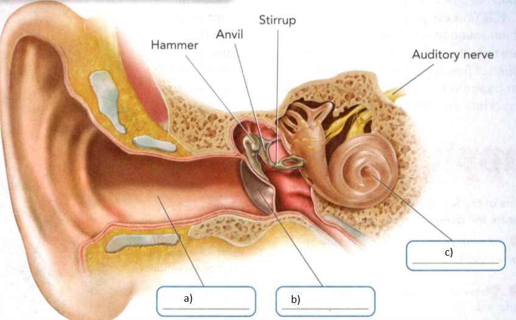
    <figcaption>Figure 14. The Human Ear.</figcaption>
  </figure>

1. See Figure 14. The ear has three main sections: the outer ear, the middle
ear, and the inner ear.
a) Identify the ear canal, eardrum, and cochlea.
b) Which structure provides evidence that sound can travel through liquids?
Explain.

### Hearing Loss 

When hearing loss occurs, a person may have difficulty hearing soft sounds or
high-pitched sounds. Hearing loss can occur suddenly if the eardrum is damaged
or punctured. (Imagine trying to play a torn drum!) For this reason, it is
dangerous to put objects into your ear, even to clean it. Hearing loss can also
occur gradually. As a person gets older, some hair cells in the cochlea die and
do not grow back. People with this kind of hearing loss often have difficulty
hearing high-frequency sounds. Extended exposure to loud sounds cal also damage
hair cells. 

For some types of hearing loss, hearing aids can restore some
ability to hear. Some hearing aids amplify sounds entering the ear. Others can
amplify specific frequencies that a person has lost the ability to hear. For
severe forms of hearing loss, a cochlear implant replaces the entire function of
the ear. A cochlear implan contains a sound processor, an implant, and
electrodes, as shown in Figure 15. The sound processor turns sound waves into an
electrical signal. The implant transmits the signal to the electrodes. The
electrodes stimulate the auditory nerve directly instead of the damaged cochlea.


  <figure>
    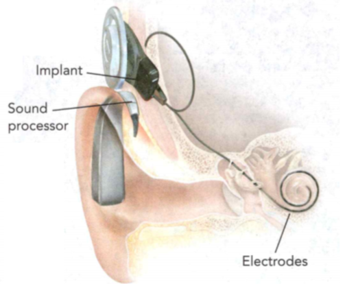
    <figcaption>Figure 15. A Cochlear Implant.</figcaption>
  </figure>

**Complete the tasks below.** 

1. A cochlear implant can restore the ability to hear. How does a cochlear
implant replace the function of the ear?

2. What are the three sections of the ear?

3. What happens to a sound wave as it enters your ear canal?

4. Marine scientist. Why are marine scientists in Sarasota Bay, Florida, spying on
dolphins? Dolphins send out a series of high-frequency clicks to navigate and
find food. They whistle to communicate with each other. The scientists are
recording underwater sounds in the bay. They are also noting dolphin sightings.
They will use the data to determine how boat noise in the bay affects dolphin
behavior. Boat noise, underwater drilling, and sonar devices used by the
military have all been shown to affect dolphins, porpoises, and whales. For this
reason, it is a rich area of research for marine scientists.
How do you think boat noise could affect the dolphins in the bay?


### Using Sound
- How Do Animals and People Use Sound?

### How Do Animals and People Use Sound?   

Have you ever shouted into a canyon or a cave and then waited for the echo? An
echo is a reflected sound wave. When a sound wave hits a surface that it cannot
pass through, it may reflect. Some practical uses of sound, including
echolocation and ultrasound technologies, are based on the fact that sound
reflects off surfaces.

### Echolocation 
Many animals find it easy to move around in dark places. This is because they
use echolocation. **Echolocation** is the use of reflected sound waves to determine
distances or to locate objects. **Some animals, including bats and dolphins, use
echolocation to navigate and find food.** 

Sound waves with frequencies above the normal human range of hearing are called
**ultrasound**. The prefix ultra- means "beyond:' Bats use ultrasound waves with
frequencies up to 100,000 Hz to move around and hunt. As a bat flies, it sends
out short pulses of ultrasound waves. The waves reflect off objects and return
to the bat's ears. The time it takes for the sound waves to return tells the bat
how far it is from obstacles or prey. 

Dolphins use ultrasound waves with frequencies up to
150,000 Hz to hunt and move around in murky, deep water. The sound waves travel
through the water and reflect off fish or other prey. Dolphins sense the
reflected sound waves through their jawbones.

### Ultrasound Technologies 

Unlike animals, people cannot send out pulses of ultrasound to help them move
around in the dark. But people sometimes need to explore places they cannot
easily reach, such as deep under water or inside the human body. **People use
ultrasound technologies, such as sonar and ultrasound imaging, to observe things
that they cannot see directly.**

Sonar A system that uses reflected sound waves to detect and locate objects
under water is called **sonar**. The word sonar comes from the initial letters of
sound navigation and ranging. "Navigation" means finding your way around on the
ocean (or in the air). "Ranging" means finding the distance between objects.
People use sonar to determine the depth of water, to map the ocean floor, and to
locate objects such as sunken ships and schools of fish. 

A sonar device sends a
burst of ultrasound waves that travel through the water. When the sound waves
strike an object or the ocean floor, they reflect. The sonar device detects the
reflected waves. A computer in the sonar device measures the time it takes for
the sound waves to go out and return. Then it uses the following equation to
solve for the total distance that sound travels.

```
Distance = Speed of sound in water x Time
```

To solve for how far away the object is you must divide the total distance by
two. This is because sound waves travel out and return.


**Complete the tasks below.** 

  <figure>
    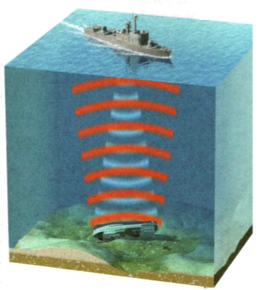
    <figcaption>Figure 16. A sonar device sends out sound waves to detect a sunken ship.</figcaption>
  </figure>

1. A sonar device sends out sound waves to detect a sunken ship (Figure 16).
a) Suppose the sonar device detects the reflected sound waves 10.0 seconds
later. The speed of sound in salt water is 1,530 m/s. How far down is the sunken
ship?
b) The Titanic is located nearly 3,800 meters below the surface of the ocean. How
much time would it take for the sound waves to travel to the Titanic and back to
the surface?

### Ultrasound Imaging 

Doctors use ultrasound imaging to look inside the human body. An ultrasound
imaging device sends ultrasound waves into the body. Then it detects the
reflected sound waves. Different parts of the body, such as bones, muscles, the
liver, or the heart, reflect sound differently. The device uses the reflected
waves to create a picture called a sonogram. A doctor can use sonograms to
diagnose and treat many medical conditions. 

  <figure>
    
    <figcaption>Figure 17. Ultrasound in Medicine.</figcaption>
  </figure>

The technician in Figure 17 is using an ultrasound imaging device to examine a
fetus. The technician holds a small probe on the pregnant woman's abdomen. The
probe sends out very high frequency ultrasound waves (about 4 million Hz). By
analyzing the reflected sound waves, the device builds up a sonogram. The
sonogram can show the position of the fetus. Sonograms can also show if there is
more than one fetus. In addition to a still picture, ultrasound imaging can
produce a video of the fetus.


**Complete the tasks below.** 

1. An ultrasound imaging device in Figure 17 creates a sonogram of a fetus. Explain
How does an ultrasound imaging device work?

2. ___ is the use of reflected sound waves to determine distances or to locate
objects.

3. How is sonar similar to ultrasound imaging? How is it different?

4. Why do Animals use echolocation and humans use ultrasound technologies?

5. The pitch of a sound depends on the ____ of the sound wave. The loudness
of a sound depends on the ___	and ___	of the sound wave.

### Study Guide

- Sound is a disturbance that travels through a medium as a longitudinal wave.
- The speed of sound depends on the temperature, stiffness, and density of the
medium the sound travels through.
- The pitch of a sound you hear depends on the frequency of the sound wave.
- The loudness of a sound depends on the energy and intensity of the sound wave.
- The Doppler effect occurs because the motion of the source causes the waves to
either get closer together or spread out.
- The sound quality of musical instruments results from blending a fundamental
tone with its overtones.
- Your ear gathers sound waves and sends information about sound to your brain.
- Some animals, including bats and dolphins, use echolocation to navigate and find food.
- People use ultrasound technologies, such as sonar and ultrasound imaging, to
  observe things that they cannot see directly.

**Complete the tasks below.** 

1. What term describes how much matter or mass there is in a given volume?
A) stiffness	
B) density
C) temperature	
D) diffraction

2. If you increase the temperature of a liquid or gas, a sound wave will travel ____ .

3. What three properties of a medium affect the speed of sound?

4. In the circles in Figure 18, draw the air particles in a compression and
rarefaction of the same sound wave.

  <figure>
    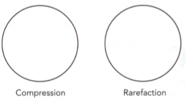
    <figcaption>Figure 18. compression and
rarefaction.</figcaption>
  </figure>

5. Why is a vibration of an object necessary for a sound
wave to form?

6. Thunder and lightning happen at the same time. Explain why you see the
lightning before you hear the thunder.

7. What property of sound describes your awareness of the energy of a sound?
A) loudness	
B) intensity
C) pitch	
D) elasticity

8. As a sound wave travels, its intensity decreases because ____ .

9. Look at the sound waves coming from the two speakers.
Which speaker cone is vibrating faster? How do you know?

  <figure>
    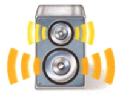
    <figcaption>Figure 19. Two speakers.</figcaption>
  </figure>

10. As a car drives past a person standing on a sidewalk, the driver keeps a
hand on the horn. How does the pitch of the horn differ for the driver and the
person standing on the sidewalk?

11. Explain how listening to your headphones at too high a volume can cause just
as much damage to your ears as the sounds at a rock concert.

12. What term describes the lowest natural frequency of the source of a sound?
A) overtone	
B) standing wave
C) fundamental tone 
D) pitch

13. The quality of sound that a musical instrument produces is the result of ____ .

14. A trumpet player pushes down on one of the valves to produce
a lower note. How did the length of the air column in the trumpet change?
Explain.

15. What part of the ear contains thousands of hair cells that transmit sound?
A) cochlea	
B) middle ear
C) ear canal	
D) eardrum

16. The middle ear contains the three smallest bones in the body, which are
called the ____ , the ____ and the ____ .

17. Sometimes a very loud sound or physical contact with an object can tear the
eardrum. How would this affect hearing? Why?

18. What system uses reflected sound waves to detect and locate objects under water?
A) sonogram	
B) ultrasound imaging
C) diffraction	
D) sonar

19. Some animals use _____ to navigate by sensing reflected sound waves.

20. Suppose it takes 6.0 seconds for a sound wave to travel to the bottom of the
ocean and back to the surface. If the speed of sound in salt water is 1,530 m/s,
how deep is the ocean at this point?

21. How could you make sounds of different pitch and loudness with the two
drums in Figure 20?

  <figure>
    
    <figcaption>Figure 20. Drums.</figcaption>
  </figure>

22. The table in Figure 21 compares the loudness of several different sounds.

  <figure>
    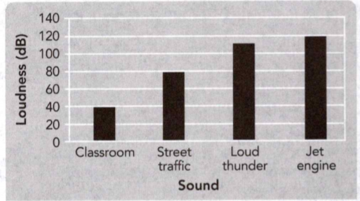
    <figcaption>Figure 21. Loudness table.</figcaption>
  </figure>

How many times more intense is the sound of a jet engine than the sound of loud thunder?
A) 2	
B) 10
C) 20	
D) 100

23. Fishing boats use sonar to locate schools of fist What characteristic of sound is most important for this application of sonar?
A) Sound waves reflect off some surfaces.
B) Sound waves diffract around corners.
C) Sound waves interfere when they overlap.
D) Sound waves spread out from a source.

24. A trumpet and a piano can both play the same note, but the sound qualities are
very different Why does the sound quality depend on the instrument that produces
it?
A) Each instrument produces a different fundamental tone.
B) Each instrument produces different overtones.
C) The amplitude of the notes is different.
D) The intensity of the sound is different. 

25. Why does sound intensity decrease as the distance from the source increases?
A) Most of the energy is absorbed by the particles of the medium.
B) The same amount of energy is spread out over a larger area.
C) The frequency increases as distance from the source increases.
D) The energy of the sound wave decreases.

26. What is the function of the inner ear?
A) The inner ear vibrates when sound waves strike it.
B) The inner ear converts vibrations into signals that travel to the brain.
C) The inner ear increases the frequency of sound waves.
D) The inner ear transmits sound waves from the ear canal to the cochlea.

  <figure>
    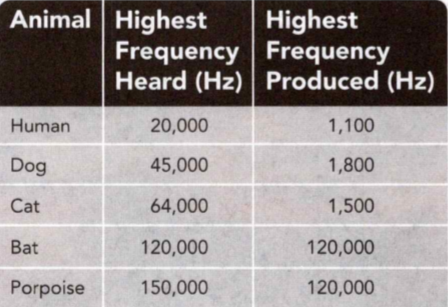
    <figcaption>Figure 22. Animals hearing.</figcaption>
  </figure>

27. Use the table in Figure 22 to answer question. 
a) Make a bar graph to compare
highest frequencies heard by and produced by each animal listed. 
b) Which animal(s) can produce sounds that are too high for humans
to hear?

28. CRASH! BANG! BEEP BEEP! In cities all across the world, noise pollution is
part of everyday life. Noise pollution is loud, distracting sound. 

There are many different types of noise pollution. Some of the most common are
residential noise, road traffic noise, and air traffic noise. Residential noise
pollution occurs in places where people live. It includes noisy neighbors,
high-pitched car alarms, and power tools from renovations. Road traffic noise
pollution is common at busy intersections or on highways. Helicopters and
airplanes cause air traffic noise pollution. Air traffic noise is especially
troublesome for people who live or work near airports.

Too much noise can cause hearing loss, lack of sleep, and increased stress.
Studies show that students who go to school in areas that have high levels of
noise pollution have lower test scores. The noise affects students' ability to
concentrate. 

More than 100 million Americans are regularly exposed to noise levels higher
than 55 decibels—the common standard for background noise levels. As a result,
governments are passing laws to reduce noise pollution.

Write a letter to your town or city council. Identify and explain
what the impact of noise pollution is on the people in your town or city.
Describe your ideas about how to reduce noise in your area.

29. Settings and costumes can make a film interesting to watch. But think for a
moment about watching a car chase without the sounds of traffic, tires
squealing, or motors revving. The scene might look great, but it would be less
thrilling. Several people work to create the sound effects in a movie. 

Foley artists create the background noises that make a scene convincing. They create
everyday sounds such as footsteps or jingling keys. They also create less
ordinary noises, such as punching noises. These noises might not be very
obvious, but you would notice if they weren't there. 

Sound mixers record all
sound effects and dialogue. If all of the sounds were recorded at the same time
scenes were filmed, you wouldn't be able to hear a thing the actors were
saying—the wrong noises would be loud and cover the speech. So sound mixers
record the dialogue and effects separately and mix them together in the studio.

Sound effects editors make sure that everyone follows the sound plan for the
film, and that all of the noises happen at the right time in a way that works.

Record an audio track. Design a solution for sounds you have to "fake." For
example, how would you make a sound for something dropping from the roof? Play
your track for the class, can they tell what is happening?

30. What kinds of waves make up the electromagnetic spectrum? It might look like
a colorful wig, but this image shows the nerve pathways of the brain. Using
machines that read energy from our bodies, doctors can see how and when
different areas of the brain are active without surgery or radiation. When your
brain performs a task, such as remembering a phone number, blood circulation to
that part of your brain increases. The scan recognizes that activity. What might
the colors of this brain scan mean?
