### Physical Science

## Physics

## 14 Electromagnetic Waves

- A **wave** is a disturbance that transfers energy from place to place.
- The material through which a wave travels is the **medium**.
- To **vibrate** is to move in a repeated back-and-forth or up-and-down motion.

### Vocabulary Skill
 
Word: mikro-
Everyday Meaning: small
Scientific Meaning: microwaves, electromagnetic radiation with short wavelengths and high frequencies

Word: -skopion
Everyday Meaning: for seeing or observing
Scientific Meaning: spectroscope, instrument used to see different colors of light

Word: photos
Everyday Meaning: light
Scientific Meaning: photon, packet of light energy

**Complete the tasks below.** 

1. Have you ever stepped in a large puddle? When your foot hits the water, it
transfers energy to the water, creating a wave. The medium, water, vibrates with
the transfer of energy. The water ripples around your foot. What caused the
water to vibrate?

### Chapter Preview

- electromagnetic wave 
- electromagnetic radiation 
- polarized light
- photoelectric effect
- photon
- electromagnetic spectrum
- radio waves
- microwaves
- radar
- infrared rays 
- thermogram 
- visible light 
- ultraviolet rays 
- X-rays
- gamma rays
- amplitude modulation 
- frequency modulation

### The Nature of Electromagnetic Waves

- What Makes Up an Electromagnetic Wave?
- What Models Explain How Electromagnetic Waves Behave?

**Complete the tasks below.** 

1. Electromagnetic waves are used in everyday life. Some examples are phones,
iPods, scales, and super computers. Imaging machines such as MRIs, CAT Scans,
X-rays, and ultrasound allow us to detect abnormalities in the body.
Electromagnetic waves help us with jobs, school, and medical problems. They make
life easier by shortening time needed to do things. Phones allow us to speak to
relatives in different states. Super computers help us monitor the shuttles in
space.
a) How do electromagnetic waves make life easier?
b) How do you use electromagnetic waves in your everyday life?

### What Makes Up an Electromagnetic Wave?
As you sit at your desk and read this book, you are surrounded by waves you
cannot see or hear. There are radio waves, microwaves, infrared rays, visible
light, ultraviolet rays, and tiny amounts of X-rays and gamma rays. These waves
are all electromagnetic waves.

### Characteristics of Electromagnetic Waves
An **electromagnetic wave** is a transverse wave that involves the transfer of
electric and magnetic energy. **An electromagnetic wave is made up of vibrating
electric and magnetic fields that move through space or some medium at the speed
of light.**

An electromagnetic wave can begin with the movement of charged particles, all of
which have electric fields around them. As the particles change speed or
direction, a vibrating electric field is created, which in turn produces a
vibrating magnetic field. The vibrating magnetic field creates a vibrating
electric field. The electric and magnetic fields produce each other repeatedly.
The result is an electromagnetic wave, shown in Figure 1. Note that the two
fields vibrate at right angles to one another.

### Energy 

The energy that electromagnetic waves transfer through matter or space is
called **electromagnetic radiation**. Electromagnetic waves do not require a medium
such as air, so they can transfer energy through a vacuum, or empty space.

  <figure>
    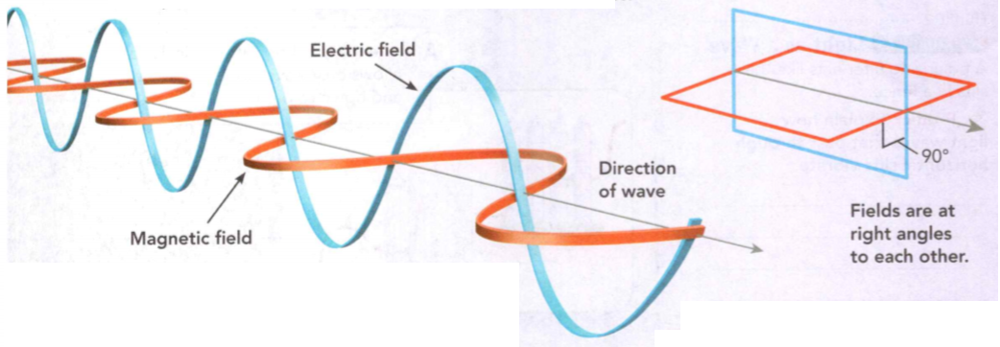
    <figcaption>Figure 1. Electromagnetic Wave.</figcaption>
  </figure>

**Complete the tasks below.** 

1. An electromagnetic wave travels through space at the speed of light—about
300,000 kilometers per second. How long will it take sunlight to
travel the 150 million kilometers to Earth? 

2. What are electromagnetic waves made of?

### What Models Explain How Electromagnetic Waves Behave?
**Two different models are needed to explain the behavior of electromagnetic
waves. A wave model best explains many of the behaviors, but a particle model
best explains others.** Light is an electromagnetic wave. It has many properties
of waves but can also act as though it is a stream of particles.

### Wave Model of Light 
When light passes through a polarizing filter, it has the properties of a wave.
An ordinary beam of light consists of waves that vibrate in all directions. A
polarizing filter acts as though it has tiny slits aligned in only one
direction. The slits can be horizontal or vertical. When light enters a
polarizing filter, only some waves can pass through it. The light that passes
through is called **polarized light**.

To help you understand the wave model, think of light waves like transverse
waves on a rope. They vibrate in all directions. If you shake a rope through a
fence with vertical slits, only waves that vibrate up and down will pass
through, as shown in Figure 2. The other waves are blocked. A polarizing filter
acts like the slits in a fence. It allows only waves that vibrate in one
direction to pass through it.

  <figure>
    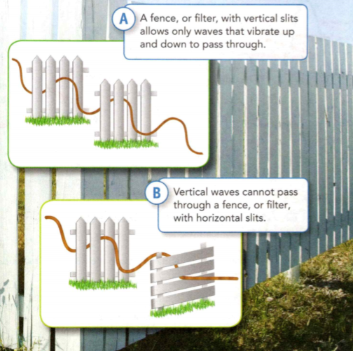
    <figcaption>Figure 2. Light as a Wave.</figcaption>
  </figure>

**Complete the tasks below.** 

1. A fence, or filter, with vertical slits allows only waves that vibrate up and
down to pass through. Vertical waves cannot pass through a fence, or filter,
with horizontal slits. A polarizing filter acts like the slits in a fence.
Explain how light waves that pass through horizontal slits vibrate.

  <figure>
    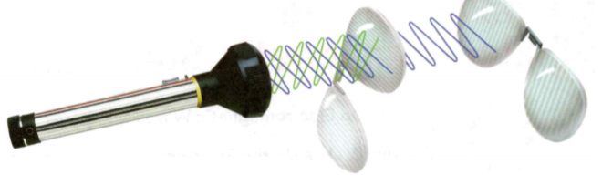
    <figcaption>Figure 3. Flashlight.</figcaption>
  </figure>

2. The picture in Figure 3 shows the light from a flashlight shining on the
lenses of two pairs of polarized sunglasses. 
a) Label the polarizing filters and the polarized
light. 
b) Why will the polarized light not pass through the second sunglass lens?

### Particle Model of Light 
Sometimes light behaves like a stream of particles. For example, when a beam of
high frequency light shines on some metals, it causes tiny particles to move.
These particles are called electrons. Sometimes light can even cause an electron
to move so much that it is knocked out of the metal, as shown in Figure 4. This
is called the **photoelectric effect**. This effect can be explained by thinking of
light as a stream of tiny packets, or particles, of energy. Each packet of light
energy is called a **photon**. For the effect to occur, each photon must contain
enough energy to knock an electron free from the metal.

  <figure>
    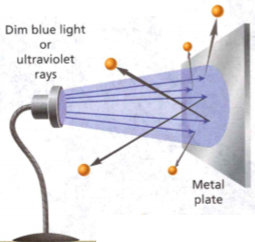
    <figcaption>Figure 4. The Photoelectric Effect.</figcaption>
  </figure>

**Complete the tasks below.** 

1. A ____ 	is a tiny packet of energy.  

2. What does a polarizing filter do?  

3. What are the two models that explain how electromagnetic waves behave?

	
### Waves of the Electromagnetic Spectrum
- How Do Electromagnetic Waves Compare? 
- What Makes Up the Electromagnetic Spectrum?

**Complete the tasks below.** 

1. Hey, Where Did It Go? What would you do if you had an invisibility cloak? This
idea might not be as far-fetched as it sounds. Scientists have actually been
working on creating a way to make objects invisible! Researchers have created a
device that can change the direction of microwaves, so that they flow around a
test object. This rerouting causes the object to look invisible at microwave
frequencies. Unfortunately, people cannot see microwaves, which means the object
isn't invisible to us. But, who knows, maybe one day you'll be able to put on
one of these "cloaks" and move around completely unseen! If a device like this
is developed for visible light, how do you think a scientist who studies animals
in nature might use it?

### How Do Electromagnetic Waves Compare?
Can you imagine trying to take a photo with a radio or heating your food with
X-rays? Light, radio waves, and X-rays are all electromagnetic waves. But each
has properties that make it more useful for some purposes than others. **All
electromagnetic waves travel at the same speed in a vacuum, but they have
different wavelengths and different frequencies.** A vacuum is a space that
contains no air or other gas. 

Visible light is the only range of wavelengths
your eyes can see. Your radio detects radio waves, which have much longer
wavelengths than visible light. X-rays, on the other hand, have much shorter
wavelengths than visible light. 

For waves in any medium, as the wavelength
decreases, the frequency increases. Waves with the longest wavelengths have the
lowest frequencies. Waves with the shortest wavelengths have the highest
frequencies. The higher the frequency of a wave, the higher its energy.

  <figure>
    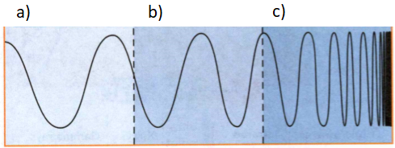
    <figcaption>Figure 5. Comparing Electromagnetic Waves.</figcaption>
  </figure>

**Complete the tasks below.** 

1. See Figure 5: Different types of electromagnetic waves have different wavelengths.
a) Write the names visible light, radio waves, and X-rays in the correct boxes
on the diagram.
b) Which wave has the highest energy? Explain.

2. Electromagnetic waves have different ____ but the same _____ .

### What Makes Up the Electromagnetic Spectrum?

  <figure>
    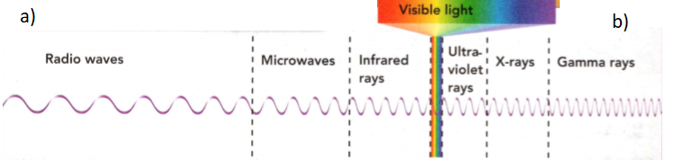
    <figcaption>Figure 6. The Electromagnetic Spectrum.</figcaption>
  </figure>

There are many different types of electromagnetic waves. The complete range of
electromagnetic waves placed in order of increasing frequency is called the
electromagnetic spectrum. **The electromagnetic spectrum is made up of radio
waves, microwaves, infrared rays, visible light, ultraviolet rays, X-rays, and
gamma rays.** The full spectrum is shown in Figure 2. Radio Waves Electromagnetic
waves with the longest wavelengths and the lowest frequencies are radio waves.
Radio waves are used in broadcasting to carry signals for radio programs. A
broadcast station sends out radio waves at certain frequencies. Your radio picks
up the radio waves and converts them into an electrical signal. The electrical
signal is then converted into sound.

**Complete the tasks below.** 

1. The electromagnetic spectrum can be broken up into different categories.
Word bank: Shortest wavelength; Longest wavelength; Highest frequency; Lowest frequency
a) Use the above word bank and see Figure 6. At the left side find the correct words for this region.
b) Use the above word bank and see Figure 6. At the right side find the correct words for this region.
c) Do microwaves or ultraviolet waves have longer wavelengths? 
d) Do microwaves or ultraviolet waves have higher frequencies?

### Microwaves 
**Microwaves** have shorter wavelengths and ligher frequencies than radio waves do.
When you think about microwaves, you probably think of microwave ovens that cook
and heat food. But microwaves have many other uses, A nicluding cellular phone
communication and radar.

Radar stands for radio detection and ranging. **Radar** is a system that uses
reflected microwaves to detect Objects and measure their distance and speed. To
measure distance, a radar device sends out microwaves that reflect off an object.
The time it takes for the reflected waves to return is used to calculate the
object's distance.   

To measure speed, a radar device uses the Doppler effect. For
example, suppose a police radar gun sends out microwaves that reflect off a car.
Because the car is moving, the frequency of the reflected waves is different
from the frequency of the original waves. The difference in frequency is used to
calculate the car's speed.

**Complete the tasks below.** 

1. Radio stations are broadcast in two different frequency ranges. The ranges are
the kilohertz range (kHz) for AM stations and the megahertz range (MHz) for FM
stations. The prefix kilo- means "thousand"; mega- means "million."
a) What is the frequency range of the AM band on the radio? Of the FM band?  
b) Approximately what frequencies are being tuned in on each band?  

2. The units kHz and MHz stand for kilohertz and megahertz, respectively. If 1
MHz = 1000 kHz and 1 kHz = 1000 Hz, what is the frequency, in Hz, of a signal
broadcast on 99.7 FM? Express your answer in scientific notation.

3. The prefix thermocomes from the Greek word thermos which means "warm or hot."
How does this meaning relate to the definition of thermogram?

### Infrared Rays 

If you turn on an electric stove's burner, you can feel it warm up before the
heating element starts to glow. The invisible heat you feel is infrared
radiation, or infrared rays. **Infrared rays** are electromagnetic waves with
wavelengths shorter than those of microwaves. They have higher frequencies and
therefore more energy than microwaves. Because you can feel the energy of
infrared rays as heat, these rays are often called heat rays. Heat lamps have
bulbs that give off mainly infrared rays. They are used to keep things warm,
such as food in a cafeteria or young animals in an incubator. 

Most objects give off some infrared rays. Warmer objects give off infrared rays
with more energy and higher frequencies than cooler objects. An infrared camera
uses infrared rays instead of visible light to take pictures called thermograms.
A **thermogram** is an image that shows regions of different temperatures in
different colors, as shown in Figure 7.

  <figure>
    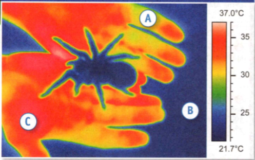
    <figcaption>Figure 7. The Uses of Infrared Rays: Thermogram.</figcaption>
  </figure>

**Complete the tasks below.** 

1. Infrared rays are used in devices such as heat lamps and TV remote controls.
In Figure 7 list the labeled areas on the thermogram from hottest to coolest.

  <figure>
    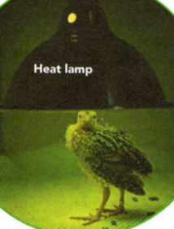
    <figcaption>Figure 8. The Uses of Infrared Rays: Heat lamp.</figcaption>
  </figure>

2. In Figure 8 where do you think this heat lamp is being used?

### Visible Light 

  <figure>
    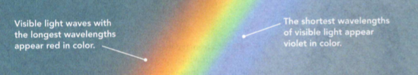
    <figcaption>Figure 9. The Visible Spectrum.</figcaption>
  </figure>

Electromagnetic waves that you can see are called **visible** light. They make up
only a small part of the electromagnetic spectrum. Visible light waves have
shorter wavelengths and higher frequencies than infrared rays. 

Visible light that appears white is actually a mixture of many colors. Recall
that light waves bend, or refract, when they enter a new medium. So, when white
light passes through rain drops, a rainbow can result, like the one in Figure 9.

**Complete the tasks below.** 

1. See Figure 9. 
a) What are the colors of the visible spectrum in order, starting with red?
b) Which color has the highest frequency?
c) Describe other times when you have seen the visible spectrum.

### Ultraviolet Rays 

Electromagnetic waves with wavelengths just shorter than those of visible light
are called **ultraviolet rays**. Ultraviolet rays have higher frequencies than
visible light, so they carry more energy. The energy of ultraviolet rays can
damage or kill living cells. For example, too much exposure to ultraviolet rays
can burn your skin and over time may cause skin cancer. However, small doses of
ultraviolet rays are useful. They cause skin cells to produce vitamin D, which
is needed for healthy bones and teeth.

The Environmental Protection Agency of the United States tracks ultraviolet
light levels in Texas and throughout the country. The agency's UV index rates
ultraviolet exposure on a scale of 1 to 11+. High ratings result in UV exposure
warnings. These warnings let people know how long they can be out in the sun
safely without sunblock.

### X-rays 

Electromagnetic waves with wavelengths just shorter than those of ultraviolet
rays are X-rays. Their frequencies are just a little higher than ultraviolet
rays. Because of their high frequencies, X-rays carry more energy than
ultraviolet rays and can penetrate most matter. Dense matter, such as bone or
lead, absorbs X-rays so they do not pass through. Therefore, X-rays are used to
make images of bones and teeth. However, too much exposure to X-rays can cause
cancer.

X-rays can also be used in industry and engineering. Engineers can use an X-ray
image of a steel or concrete structure to find cracks. Dark areas on the X-ray
film show the cracks.

### Gamma Rays 

Electromagnetic waves with the shortest wavelengths and highest frequencies are
***gamma rays***. Since they have the greatest amount of energy, gamma rays are the
most penetrating of electromagnetic waves. Because of their penetrating ability,
these rays are used to examine the body's internal structures. A patient can be
injected with a fluid that emits gamma rays. Then, a gamma-ray detector can form
an image of the inside of the body.

Some radioactive substances and certain nuclear reactions produce gamma rays.
Some objects in space emit bursts of gamma rays. However, these rays are blocked
by Earth's atmosphere. Astronomers think that explosions of distant stars
produce these gamma rays.

**Complete the tasks below.** 

1. Why does a dentist cover you with a lead apron to take X-rays of your teeth?

  <figure>
    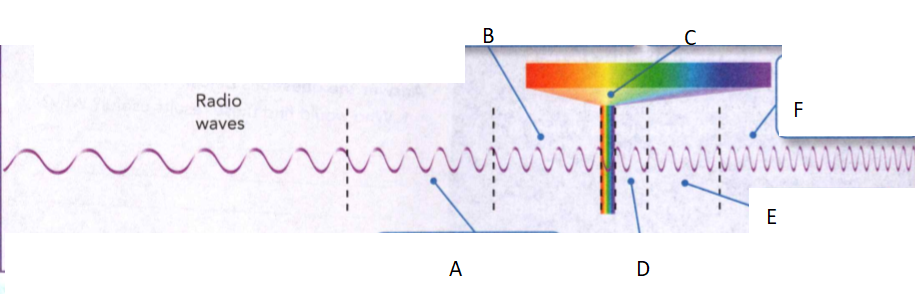
    <figcaption>Figure 10. The electromagnetic spectrum.</figcaption>
  </figure>

2. The electromagnetic spectrum includes many kinds of waves. See Figure 10.
a) Identify each kind of wave on the electromagnetic spectrum.
b) Identify the name of the highest energy waves.

3. Describe the uses of two kinds of electromagnetic waves.

4. How do ultraviolet rays help your bones and teeth?

5. What kinds of waves make up the electromagnetic spectrum?

	
### Wireless Communication  

- How Do Radio Waves Transmit Information? 
- How Does a Cell Phone Work?
- How Does Satellite Communication Work?

**Complete the tasks below.** 

1. How do teens feel about cell phones? Researchers asked some teens to take a
surve so that they could learn about teens' cell-phone usage. How do these
results compare with your own ideas?
- 45 percent believe that having a cell phon: is the key to their social life.
- Having a cell phone makes 78 percent feel safe when they're not at home.
- When asked to select additional features for a basic cell phone, 71 percent
chose a music player.
- More than half use cell phones to check e-mail.
- Nearly half said they could send text messages while blindfolded!
a) Who would find these results useful? Why?
b) What do you think is the most important use of a cell phone?

### How Do Radio Waves Transmit Information?
You are in the car on a long road trip and switch on the radio to listen to some
music. In an instant, your favorite song is coming through the car's speakers.
How do radio broadcasts reach you?

Broadcasting Radio waves carry, or transmit, signals for radio programs. Charged
particles vibrating inside transmission antennas produce radio waves.
Transmission antennas send out, or broadcast, radio waves in many directions.
**Radio waves carry information from the antenna of a broadcasting station to
the receiving antenna of your radio.**

  <figure>
    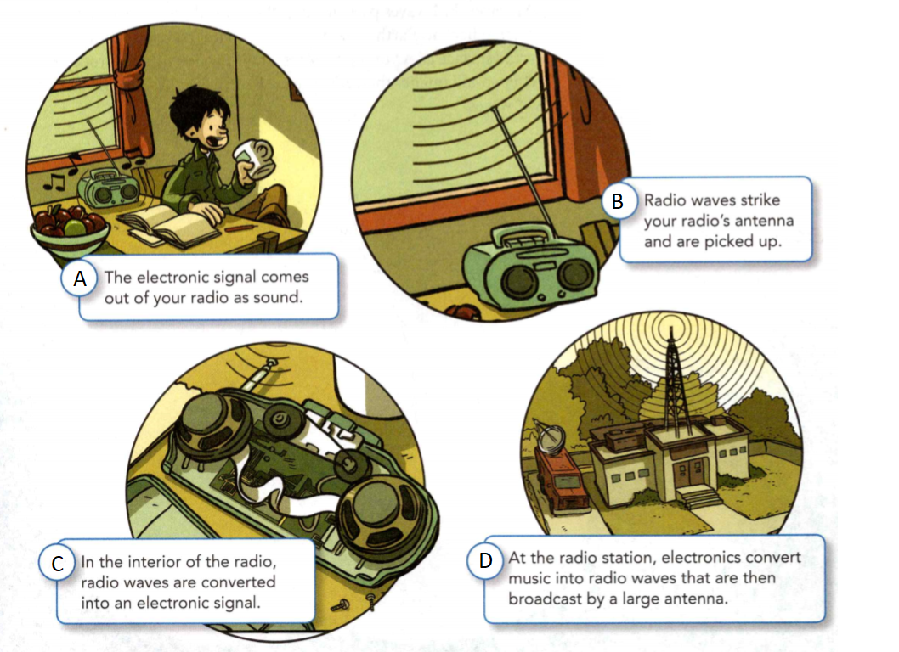
    <figcaption>Figure 11. How a radio workds.</figcaption>
  </figure>

**Complete the tasks below.** 

1. Radios tune in radio wave signals broadcast by antennas located at radio stations.
In Figure 11 show the correct order of events that results in hearing a broadcast.

### Broadcasting Signals 
Radio stations broadcast signals in two frequency bands. These bands are
amplitude modulation (AM) and frequency modulation (FM).

### Amplitude Modulation 
A method of broadcasting signals by changing the amplitude of a wave is called
**amplitude modulation**. AM signals travel as changes, or modulations, in the
amplitude of the wave. The frequency of an AM wave is constant. AM radio waves
have relatively long wavelengths and low frequencies and energy. They are easily
reflected back to Earth's surface by Earth's ionosphere, a region of charged
particles high in the atmosphere. Therefore, AM radio stations can be broadcast
over long distances.

### Frequency Modulation 
**Frequency modulation** is a method of broadcasting signals by changing the
frequency of a wave. FM signals travel as changes in the frequency of the wave.
The amplitude of an FM wave is constant. 

FM waves have higher frequencies and more energy than AM waves. FM waves pass
through the ionosphere instead of being reflected back to Earth. Therefore, they
do not travel as far on Earth's surface as AM waves. However, FM waves usually
produce better sound quality than AM waves. Figure 12 shows FM waves and AM
waves.

  <figure>
    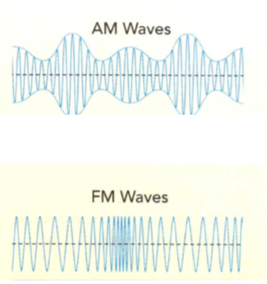
    <figcaption>Figure 12. FM and AM waves.</figcaption>
  </figure>

### The Radio Spectrum 
In addition to AM and FM broadcasts, radio waves are used for many types of
communication. The FCC assigns different radio frequencies for different uses.
Radio stations use one part of the radio spectrum. Taxi and police radios are
assigned separate sets of frequencies. Amateur radio frequencies are assigned
for people who operate radios as a hobby. Because the signals all have different
assigned frequencies, they travel without interfering.

**Complete the tasks below.** 

  <figure>
    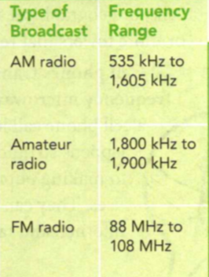
    <figcaption>Figure 13. Broadcast Frequencies.</figcaption>
  </figure>

1. The table in Figure 13 shows the frequencies assigned by the Federal Communications
Commission (FCC) for various radio channels.
a) Which broadcast uses the highest-frequency range? 
b) Which uses the lowest-frequency range?
c) Convert each given frequency range into units of hertz. (Hint: 1 kHz = 1000
Hz, and 1 MHz = 1,000,000 Hz.)

2. What wave property is changed when AM radio signals are broadcast?

3. Longer wavelengths bend more easily around obstacles such as mountains. In a
hilly countryside, will you be more likely to hear an AM or FM station?

  <figure>
    
    <figcaption>Figure 14. Using a Cell Phone.</figcaption>
  </figure>

### How Does a Cell Phone Work?
Cellular telephones, or cell phones, are an important part of your daily life.
However, they only work if they are in a cellular system. The cellular system
works by dividing regions into many small cells, or geographical areas, as shown
in Figure 3. Each cell has one or more towers that relay signals to a central
hub.

**Cell phones transmit and receive signals using high- frequency microwaves.**
Though the process needed to complete a cell phone call looks complicated, the
entire process happens so quickly it seems to be instantaneous. In addition to
making phone calls, cell phones have many different uses. They can be used to
send text messages, browse the Internet, and take photos.

**Complete the tasks below.** 

1. See Figure 14 for this question. The quality of your cell-phone calls depends
on the terrain and how close your phone is to a cell-phone tower or a central
hub.
a) Suppose you make a call from location B to a friend at location C. Draw the
path the signal could travel to complete the call. 
b) Explain what would likely happen if you made a cell call from location A.
c) What happens if your cell phone is far away from a tower?
d) Your cell phone sends out a signal at a specific frequency. What will happen
if a cell phone next to you also uses this frequency?

### How Does Satellite Communication Work?

Satellites orbiting Earth send information around the world. Communications
satellites work like the receivers and transmitters of a cellular phone system.
**Communications satellites receive radio, television, and telephone signals and
relay the signals to receivers on Earth.** Because a satellite can "see" only
part of Earth at any time, more than one satellite is needed for any purpose.

### Satellite Phone Systems 

Several companies offer satellite phone systems. Radio waves from one phone are
sent up to a communications satellite. The satellite transmits the waves back to
the receiving phone on Earth. With this kind of phone, you can call anywhere in
the world, but it costs more than using a cell phone.

### Satellite Television Systems 

Television networks and cable companies use communications satellites.
Television signals are sent up to satellites. The satellites then relay the
signals to places around the world. Television signals from satellites are often
scrambled. Customers of satellite companies need a satellite dish antenna like
the one shown in Figure 15 to pick up the signals and a decoding box to
unscramble the signals.

  <figure>
    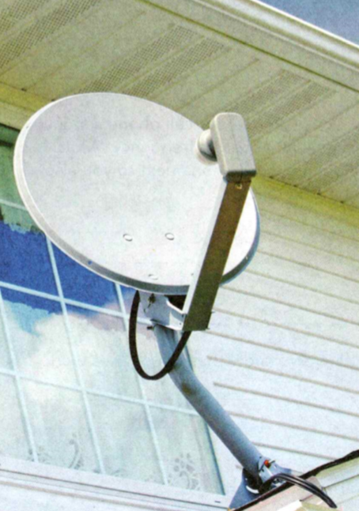
    <figcaption>Figure 15. Satellite Dishes.</figcaption>
  </figure>

**Complete the tasks below.** 

1. Dish-shaped antennas receive signals for television programs from satellites.
Satellite dishes point to a fixed location in the sky. What does this tell you
about the position of the satellite?

### Global Positioning System 

The Global Positioning System (GPS) is a system of navigation originally
designed for the military. GPS uses a network of 24 satellites that broadcast
radio signals to Earth. These signals carry information that tells you your
exact location on Earth's surface, or even in the air. Anybody with a GPS
receiver can pick up these signals. GPS receivers can be found in cars,
airplanes, boats, and even cell phones.

Signals from four out of 24 GPS satellites are used to determine your position.
The signals from three satellites tell you where you are on Earth's surface. The
signal from the fourth satellite tells you how far above Earth's surface you
are.

**Complete the tasks below.** 

  <figure>
    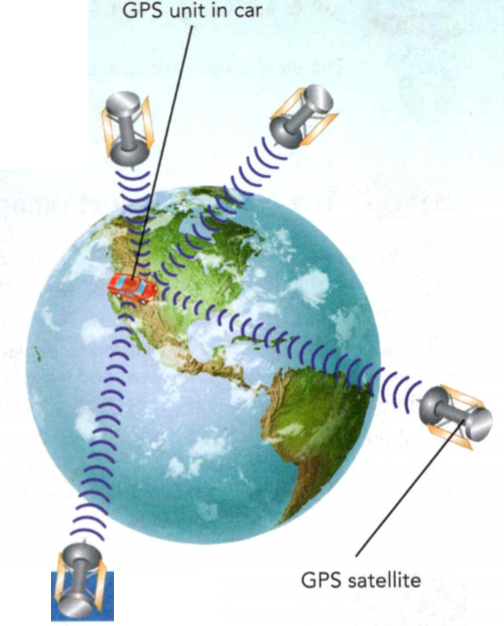
    <figcaption>Figure 16. Uses of Satellites.</figcaption>
  </figure>

1. Modern communication uses satellites in different ways. Suummarize how
satellites are used in each type of communication see Figure 16.
a) Global Positioning System.
b) Satelitte Phone System.
c) Television Satellites.

2. The electromagnetic spectrum is made up of radio waves, ______, _____, visible
light, ____ , ____, and gamma rays.

### Study Guide

- An electromagnetic wave is made up of vibrating electric and magnetic fields
that move through space or some medium at the speed of light.
- Two different models are needed to explain the behavior of electromagnetic
waves. A wave model best explains many of the behaviors, but a particle model
best explains others.
- All electromagnetic waves travel at the same speed in a vacuum, but they have
different wavelengths and different frequencies.
- The electromagnetic spectrum is made up of radio waves, microwaves, infrared
rays, visible light, ultraviolet rays, X-rays, and gamma rays.
- Radio waves carry information from the antenna of a broadcasting station to
the receiving antenna of your radio.
- Cell phones transmit and receive signals using high-frequency microwaves.
- Communications satellites receive radio, television, and telephone signals and
relay the signals to receivers on Earth.

**Complete the tasks below.** 

1. An electromagnetic wave consists of
A) AM and FM waves.
B) electrons and protons.
C) electric and magnetic fields.
D) particles of a medium.

2. The _____ model of light describes the behavior of light when it acts as a
stream of photons.

3. Explain how polarized light is different from non-polarized light.

4. How do you know that electromagnetic waves can travel through a vacuum?

5. Suppose you go shopping for sunglasses with a friend. He likes a pair of
sunglasses labeled polarized lenses. Explain to him how polarizing sunglasses work.

6. The electromagnetic waves with the longest wavelengths and lowest frequencies are
A) radio waves.	
B) infrared rays.
C) X-rays.	
D) gamma rays.

7. ____ is the only type of electromagnetic wave that you can see.

  <figure>
    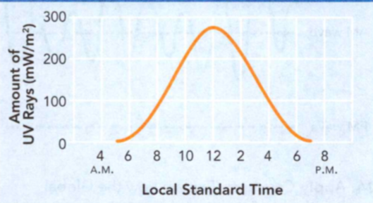
    <figcaption>Figure 17. Ultraviolet Rays During a Day.</figcaption>
  </figure>

8. Use the graph in Figure 17 to answer question. 
a) What is the amount of ultraviolet rays at 8 P.M.?
b) What is the cause of the peak in the graph line at 12 P.m.?

9. Explain how the visible spectrum is formed as a rainbow appears after it
rains. In your answer, explain what white light is composed of.

10. Night vision goggles allow you to see warm objects in a dark environment.
Which type of electromagnetic wave do they detect?

11. What is the ionosphere?
A) a type of AM radio wave
B) a region of charged particles in Earth's atmosphere
C) the region of a cell-phone network
D) a type of FM radio wave

12. Cell phones transmit and receive signals using ____ .

13. An AM wave is shown in Figure 18. Draw an FM wave in the space provided.

  <figure>
    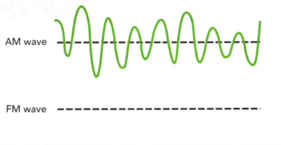
    <figcaption>Figure 18. AM and FM.</figcaption>
  </figure>

14. Explain how the Global Positioning System works.

15. You are going on a car trip with your family across the United States. To
your brother's surprise, the AM radio station that your family is listening to
is coming from a city 1,000 kilometers away. Explain to him how this is
possible. Be sure to describe how the ionosphere affects AM radio transmissions.

16. What kinds of waves make up the electromagnetic spectrum? Many everyday
technologies with which you come in contact use electromagnetic waves. Choose
four objects from the picture below and describe the kinds of electromagnetic
waves that they use. List your answer in order of increasing energy of the waves
each object uses.

17. What would you add to the picture below in Figure 19 so that light does not
hit the final screen?

  <figure>
    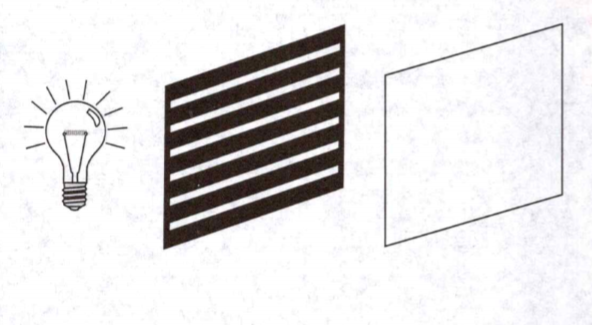
    <figcaption>Figure 19. Light.</figcaption>
  </figure>

A) another light bulb
B) a filter with horizontal slits
C) a filter with vertical slits
D) none of the above

18. Ultraviolet rays from the sun are able to reach Earth's surface because
A) they require air to travel through.
B) they have less energy than infrared rays.
C) they have lower frequency than visible light.
D) they can travel through empty space.

19. Which of the following groups of electromagnetic waves is listed correctly
in order of increasing energy?
A) X-rays, visible light, radio waves
B) radio waves, visible light, X-rays 
C) infrared rays, visible light, radio waves
D) visible light, gamma rays, X-rays 

20. Radar is a system that
A) detects objects and measures their speed.
B) kills bacteria.
C) carries AM signals.
D) searches for hidden objects.

21. AM radio waves are able to travel farther than FM radio waves because
A) AM waves produce better sound quality.
B) waves are reflected by Earth's ionosphere.
C) AM waves are faster than FM waves.
D) AM waves have constant amplitude.

22. You have access to an entire world of entertainment and information at the push
of a button, and you don't have to leave your chair. When you push the buttons
on your remote control, it uses infrared light (an invisible part of the
electromagnetic spectrum) to send signals to an electronic device. 

When you press a button on a TV remote control, it sends out pulses of infrared
light. These pulses contain a binary code. A binary code consists of a
combination of the numbers 1 and 0. Each command on the remote control has a
different binary code. For example, on one type of remote the command for
"channel up" is 001 0000. The command for "channel down" is 001 0001. The TV's
microprocessor, or the brain of the TV, interprets and carries out the correct
command. 

So why doesn't that remote control turn on the CD player or the microwave? To
avoid interference from other infrared light sources, such as the sun and
fluorescent light bulbs, each remote control uses a specific wavelength for its
signals. As a result, other electronic devices won't respond to the infrared
signals from the TV remote control. 

Research how a remote control can use both infrared light and radio frequencies.
Design a device that uses both types of waves and explain how the device works
and how it can be used.

23. How would you like to turn your bedroom window into an invisible power
plant? How about the roof of your family car? Or the roof of your home? Or the
fabric of your T-shirt? If scientists and engineers have their way, one or more
of these questions will have an answer in just a few years. And the answer will
be "Why not?"

All electric power plants change some original form of energy into electricity,
another form of energy. The starting form of energy might be the motion of water
rushing through a dam. It might be thermal energy produced either by burning
coal, oil, or natural gas or by the decay of nuclei of radioactive atoms. It
could also be a steady wind that spins the blades of a forest of turbines. Power
plants that use these methods of producing electricity are large. But new ones
may be so tiny, you might have trouble seeing them.

Over the years, scientists and engineers have developed very tiny power plants
called photovoltaic cells. These cells are made of materials that give off
electrons when they absorb light. These electrons can then be guided to form an
electric current. In this way, a photovoltaic cell transforms light energy
directly into electrical energy.

Scientists and engineers are now producing photovoltaic cells that are so small,
they could be built into a windowpane that still allows you to see through the
glass. They are so thin that they can bend like a length of thread. Will these
miniature power plants be used some day to rake your T-shirt light up in the
dark, to help run your family car, or to light the bulbs in your home? You
probably won't be shocked if the answer turns out to be "Yes."

All types of power plants have both benefits and drawbacks. Do research to find
out what these benefits and drawbacks are. Then discuss the reasons why solar
cells should, or should not, be used to replace existing sources of electricity.

