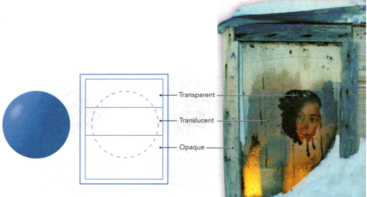
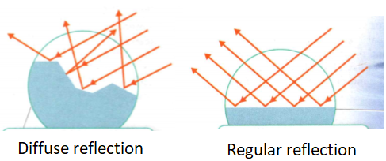
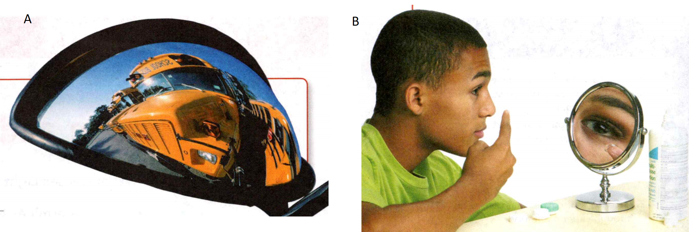
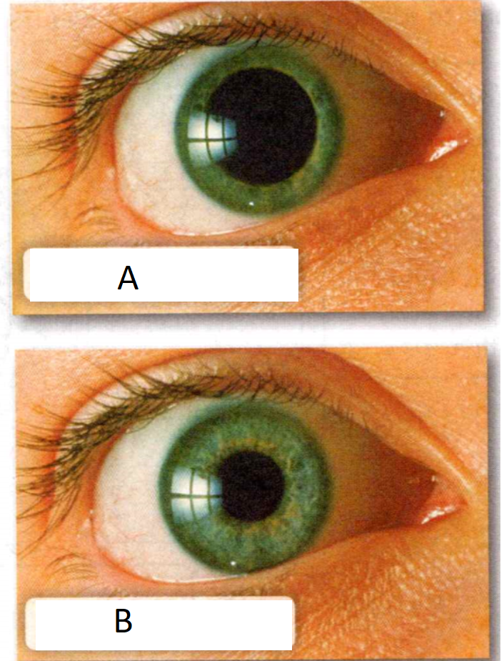

### Physical Science

## Physics

## 15 Light

**Complete the tasks below.** 

- To **transmit** is to pass something from one place to another.
- To **reflect** is to throw something back.
- To **absorb** is to take something in or soak it up.

### Vocabulary Skill
 

| Prefix | Meaning                          | Example                       |
|--------|----------------------------------|-------------------------------|
| micro- | small, tiny                      | microscope                    |
| tele-  | distant, operating at a distance | telescope                     |
| con-   | together with jointly            | concave mirror, convex mirror |
| trans- | through                          | translucent                   |

### Chapter Preview

- transparent 
- translucent
- opaque 
- primary color
- secondary color
- complementary color 
- pigment
- ray 
- regular reflection 
- image
- diffuse reflection 
- plane mirror
- virtual image 
- concave mirror
- optical axis 
- focal point
- real image 
- convex mirror
- index of refraction 
- mirage
- lens 
- concave lens
- convex lens
- cornea 
- pupil 
- iris 
- retina
- rods 
- cones 
- optic nerve
- nearsighted 
- farsighted
- camera 
- telescope
- refracting telescope 
- objective
- eyepiece 
- reflecting telescope
- microscope

### Light and Color
- What Determines Color? 
- How Do Colors Combine?

**Complete the tasks below.** 

1. Jamal wakes up early to write a term paper. As the sun rises, it transmits
sunlight through the window. The light reflects off of his computer screen,
making it difficult for him to read the words he types. He pulls down the window
shade knowing it will absorb some of the light. Why does the window create a
problem for Jamal?

2. Why Is the Sky Blue? Why does the sky look blue on a clear, sunny day? The
answer has to do with the nature of light. The sun gives off white light. White
light is made up of many colors. The different colors of light have different
wavelengths. Red light has a longer wavelength than blue light. As the sun's
light passes through our atmosphere, gas molecules in the air scatter the
sunlight. The blue wavelengths get scattered the most, so the sky appears blue!
The water droplets in clouds scatter all of the wavelengths of visible
light equally. How does this explain why clouds are white?

### What Determines Color?   

Why is the grass green or a daffodil yellow? To understand why objects have
different colors, you need to know how light can interact with an object. When
light strikes an object, the light can be reflected, transmitted, or absorbed.
Think about a pair of sunglasses. If you hold the sunglasses in your hand, you
can see light that reflects off the lenses. If you put the sunglasses on, you
see light that is transmitted through the lenses. The lenses also absorb some
light. That is why objects appear darker when seen through the lenses.

### Classifying Materials 

  <figure>
    
    <figcaption>Figure 1. Types of Materials.</figcaption>
  </figure>

Lenses, like all objects, are made of different materials. Most materials can be
classified as transparent, translucent, or opaque based on what happens to light
that strikes the material.

A material that transmits most of the light that strikes it is called
transparent. Light passes through a transparent material without being
scattered. This allows you to see clearly what is on the other side. Water, air,
and clear glass are all transparent materials. In Figure 1, the window shown in
the photo is partially fogged up by condensation. The center of the window,
where the condensation has been wiped away, is transparent. The fogged-up part
of the window is translucent. A translucent material scatters
the light that passes through it. You can usually see something behind a
translucent object, but the details are blurred. Wax paper and frosted glass are
translucent materials.

A material that reflects or absorbs all of the light that strikes it is called
opaque. You cannot see through opaque materials because light cannot pass
through them. In Figure 1, the wood and snow shown in the photo are opaque.
Metals and tightly woven fabric are other examples of opaque materials.

**Complete the tasks below.** 

1. The windows in Figure 1 contain transparent, translucent, and opaque
sections. Suppose the ball was placed behind the three-sectional window below.
Draw what you would see inside the dashed circle.

2. How does knowing the meaning of the prefix trans- help you remember what
happens to light that strikes a translucent object?

### Opaque Objects 

The color of an opaque object depends on the wavelengths of light that the
object reflects. Every opaque object absorbs some wavelengths of light and
reflects others. **The color of an opaque object is the color of the light it
reflects.** For example, look at the apple shown at the top of Figure 2. The apple
appears red because it reflects red wavelengths of light. The apple absorbs the
other colors of light. The leaf looks green because it reflects green light and
absorbs the other colors.

  <figure>
    
    <figcaption>Figure 2. Color of an Opaque Object.</figcaption>
  </figure>

Objects can appear to change color if you view them in a different color of
light. In red light, the apple appears red because there is red light for it to
reflect. But the leaf appears black because there is no green light to reflect.
In green light, the leaf looks green but the apple looks black. And in blue
light, both the apple and the leaf look black.

### Transparent and Translucent Objects 

Materials that are transparent or translucent allow only certain colors of light
to pass through them. They reflect or absorb the other colors. **The color of a
transparent or translucent object is the color of the light it transmits.** For
example, when white light shines through transparent blue glass, the glass
appears blue because it transmits blue light.

**Complete the tasks below.** 

1. The color an apple appears to be depends on the color of the light that
strikes it, see Figure 2.
a) Red light: The apple appears red because it (absorbs/reflects) red light. The
leaves look black because they (absorb/reflect) red light.
b) Green light: The apple appears black because it (absorbs/reflects) green
light. The leaves look green because they (absorb/reflect) green light.
c) Blue light: The apple appears black because it (absorbs/reflects) blue light.
The leaves look black because they (absorb/reflect) blue light.

Transparent or translucent materials are used to make color filters. For
example, a red color filter is red because it allows only red light to pass
through it. When you look at an object through a color filter, the color of the
object may appear different than when you see the object in white light.

The lenses in sunglasses are often color filters. For example, lenses tinted
yellow are yellow filters. When you put on those sunglasses, some objects appear
to change color. The color you see depends on the color of the filter and on the
color of the object as it appears in white light.

**Complete the tasks below.** 

  <figure>
    
    <figcaption>Figure 3. Beach ball.</figcaption>
  </figure>

1. Imagine looking at the beach ball in Figure 3 through a red, green, or blue
filter. Predict how each section of the beach ball would appear. Label each
section of the beach ball with its corresponding color

2. A(n)	_____ object reflects or absorbs all the light that strikes it.

3. A person wearing a blue shirt is standing in sunlight. What color(s) of light
does the shirt reflect? What color(s) of light does the shirt absorb?

4. Suppose you are wearing green-tinted glasses. What color would a blue shirt
appear through these glasses?

5. The color of an opaque object is	_____ .

6. The color of a transparent or translucent object is ____ .

### How Do Colors Combine?

  <figure>
    
    <figcaption>Figure 4. Primary Colors of Light.</figcaption>
  </figure>

Color is used in painting, photography, theater lighting, and printing. People
who work with color must learn how to produce a wide range of colors using just
a few basic colors. Three colors that can combine to make any other color are
called **primary colors**. Two primary colors combine in equal amounts to produce a
**secondary color**.

### Mixing Light 

The primary colors of light are red, green, and blue. **When the three primary
colors of light are combined in equal amounts, they produce white light.** If they
are combined in different amounts, the primary colors can produce other colors.
For example, red and green combine to form yellow light. Yellow is a secondary
color of light because two primary colors produce it. The secondary colors of
light are yellow (red + green), cyan (green + blue), and magenta (red + blue).
Figure 4 shows the primary and secondary colors of light. 

A primary and a
secondary color can combine to make white light. Any two colors that combine to
form white light are called complementary colors. Yellow and blue are
**complementary colors**, as are cyan and red, and magenta and green. 

A television produces many colors using only the primary colors of light. The
picture on a TV screen is made up of little bars of red, green, and blue light.
By varying the brightness of each colored bar, the television can produce
thousands of different colors.

**Complete the tasks below.** 

  <figure>
    
    <figcaption>Figure 5. TV screen.</figcaption>
  </figure>

1. The primary colors of light are red, green, and blue. A television produces
many colors using only the primary colors of light. In Figure 5, check off the
primary color(s) that will produce the color in each circled part of the TV
screen.

2. List at least three examples of mixing light.

### Mixing Pigment 

How does an artist produce the many shades of colors you see in a painting?
Inks, paints, and dyes contain **pigments**, or colored substances that are used to
color other materials. Pigments absorb some colors and reflect others. The color
you see is the result of the colors that a particular pigment reflects.

Mixing colors of pigments is different from mixing colors of light. As pigments
are added together, fewer colors of light are reflected and more are absorbed.
The more pigments that are combined, the darker the mixture looks.

Cyan, yellow, and magenta are the primary colors of pigments. **When the three
primary colors of pigments are combined in equal amounts, they produce black.** By
combining pigments in varying amounts, you can produce many other colors. If you
combine two primary colors of pigments, you get a secondary color, as shown in
Figure 6. The secondary colors of pigments are red, green, and blue.

  <figure>
    
    <figcaption>Figure 6. Primary Colors of Pigment.</figcaption>
  </figure>

**Complete the tasks below.** 

1. Oil painters use a tray called a palette to hold and mix pigments. Write the
names of the primary colors that combine to produce the secondary color at the
end of each statement.
a) _____ + _____ = red
b) _____ + _____ = green
c) _____ + _____ = blue

2. What are the primary colors of light?

3. What are the primary colors of pigment?

4. The result of mixing the primary colors of light in equal amounts is the
color _____ . The result of mixing the primary colors of pigment in equal
amounts is the color ______ .

5. To produce white light you combine ___ .

	
### Reflection and Mirrors
- What Are the Kinds of Reflection?
- What Types of Images Do Mirrors Produce?
- 
**Complete the tasks below.** 

1. Periscope. In a submarine hidden beneath the ocean's surface, a captain
peered into a long tube to see possible threats in the sea and air above. Thi
sight tube, called a periscope, was designed by the Frenchman Marie Davey in
1854. Davey's periscope contained two mirrors, one placed at each end of a
vertical tube. The mirrors were set parallel to each other and at 45 degrees to
the vertical. The reflective surfaces faced each other. When light from an
object on the surface reflected downward, an image appeared to the eye. People
in submerged submarines could see what was above them!
Imagine you are in a submerged submarine looking through a periscope. What are
some things you might see?

### What Are the Kinds of Reflection?

Why do you see a reflection of yourself in a mirror but not on a page of your
textbook? To answer this question, you need to understand how a surface reflects
light. To show how light reflects, you can represent light waves as straight
lines called **rays**. You may recall that light obeys the law of reflection—the
angle of reflection equals the angle of incidence. **The two ways in which a
surface can reflect light are regular reflection and diffuse reflection.**

**Regular reflection** occurs when parallel rays of light hit a smooth surface. All
of the light rays reflect at the same angle because of the smooth surface. So
you see a clear image. An **image** is a copy of the object formed by reflected or
refracted rays of light. Shiny surfaces such as metal, glass, and calm water
produce regular reflection.

**Diffuse reflection** occurs when parallel rays of light hit an uneven surface.
Each light ray obeys the law of reflection but hits the surface at a different
angle because the surface is uneven. Therefore, each ray reflects at a different
angle. You either don't see an image or the image is not clear. Most objects
reflect light diffusely. This is because most surfaces are not smooth. Even
surfaces that appear to be smooth, such as a piece of paper, have small bumps
that reflect light at different angles.

  <figure>
    
    <figcaption>Figure 7. Diffuse and Regular Reflection.</figcaption>
  </figure>

**Complete the tasks below.** 

  <figure>
    
    <figcaption>Figure 8. xxx.</figcaption>
  </figure>

1. See Figure 8 to answer this question.
a) What kind of reflection occurs on this surface at a)?
b) What kind of reflection occurs on this surface at b)?

### What Types of Images Do Mirrors Produce?  

Have you ever looked at yourself in the curved mirrors of a fun house? If so,
you know that your image looks different than it does in a flat mirror. Your
image may look tall and skinny at one point and short and wide at another point.
To understand why your image changes, you need to learn about the types of
mirrors. 

### Plane Mirror 
Did you look into a mirror this morning to brush your
teeth? If you did, you probably used a plane mirror. A **plane mirror** is a flat
sheet of glass that has a smooth, silver- colored coating on one side. Often
this coating is on the back of the glass to protect it from damage. When light
strikes a mirror, the coating reflects the light. Because the coating is smooth,
regular reflection occurs and a clear image forms. The image you see in a plane
mirror is a **virtual image** - an image that forms where light seems to come from.
"Virtual" describes something that does not really exist. Your image appears to
be behind the mirror, but you can't reach behind the mirror and touch it. 

**A plane mirror produces a virtual image that is upright and the same size as the
object.** But the image is not quite the same as the object. The left and right of
the image are reversed. For example, when you look in a mirror, your right hand
appears to be a left hand in the image.

  <figure>
    
    <figcaption>Figure 9. Image in a Plane Mirror.</figcaption>
  </figure>

**Complete the tasks below.** 

1. A plane mirror forms a virtual image. The reflected light rays appear to come
from behind the mirror, where the image forms. In Figure 9, is the raised hand
in the image an image of the dancer's left hand or her right hand? Explain.

2. Pretend your friend has never seen her image in a plane mirror. How would you
describe to her the similarities and differences between her image and the real
her?

### Concave Mirrors 

A mirror with a surface that curves inward like the inside of a bowl is a
**concave mirror**. Figure 10 shows how a concave mirror can reflect parallel rays of
light so that they meet at a point. Notice that the rays of light shown are
parallel to the optical axis. The **optical axis** is an imaginary line that divides
a mirror in half, much like the equator that divides Earth into northern and
southern halves. The point at which rays parallel to the optical axis reflect
and meet is called the **focal point**.

  <figure>
    
    <figcaption>Figure 10. Concave Mirror.</figcaption>
  </figure>

The type of image that is formed by a concave mirror depends on the location of
the object. **Concave mirrors can produce real or virtual images.** A **real image**
forms when light rays actually meet. If the object is farther away from the
mirror than the focal point, the reflected rays form a real image. Unlike a
virtual image, a real image can be projected on a surface such as a piece of
paper. Real images are upside down. A real image may be smaller, larger, or the
same size as the object.

If an object is between the mirror and the focal point, the reflected rays form
a virtual image. Virtual images formed by a concave mirror are always larger
than the object. Concave mirrors produce the magnified images you see in a
makeup mirror.

  <figure>
    
    <figcaption>Figure 11. Concave mirror.</figcaption>
  </figure>

**Complete the tasks below.** 

1. A concave mirror reflects rays of light parallel to the optical axis back
through the focal point. The figures in Figure 11 show how a concave mirror can
produce both real and virtual images. The type of image that is formed by a
concave mirror depends on the location of the object. Describe How does the
image compare to the object in each of the diagrams?

### Convex Mirrors  

A mirror with a surface that curves outward is called a **convex mirror**. Figure 12
shows how convex mirrors reflect parallel rays of light. The reflected rays
spread out but appear to come from a focal point behind the mirror. The focal
point of a convex mirror is the point from which the rays appear to come. **A
convex mirror produces a virtual image that is always smaller than the object.**

Perhaps you have seen this warning on a car mirror: "Objects in mirror are
closer than they appear:' Convex mirrors are used in cars as passenger-side
mirrors. The advantage of a convex mirror is that it allows you to see a larger
area than you can with a plane mirror. The disadvantage is that the image is
reduced in size. As a result, the image appears to be farther away than it
actually is. The driver must understand this and adjust for it.

  <figure>
    
    <figcaption>Figure 12. Convex Mirror.</figcaption>
  </figure>

**Complete the tasks below.** 

 <figure>
    
    <figcaption>Figure 13. Convex mirror.</figcaption>
 </figure>

1. Light rays parallel to the optical axis reflect as if they came from the
focal point behind a convex mirror. Extend the two reflected rays in Figure 13 behind the
mirror to where they intersect. This is the top of the virtual image. Draw the
image.

 <figure>
    
    <figcaption>Figure 14. Different types of images formed by mirrors.</figcaption>
 </figure>

2. Complete the table in Figure 14.

  <figure>
    
    <figcaption>Figure 15. xxx.</figcaption>
  </figure>

3. Each of the photos in Figure 15 shows an application of a curved mirror. A
bus driver uses the mirror in the top photo to check for traffic. A boy uses the
mirror in the bottom photo to put in contact lenses.   
a) Which type of curved mirror is in the top photo? 	
b) Which type of curved mirror is in the bottom photo?	 
c) Why is the mirror in the top photo more useful than a plane mirror for
checking traffic?   
d) Why is the mirror in the bottom photo more useful than a plane mirror for
putting in contact lenses?   

4. A(n) ______	is a copy of an object formed by reflected or refracted rays of light.

5. A _____	mirror can form real and virtual images. ____ and ____ 	mirrors form only virtual images.

6. Which type of mirror would you use if you wanted to project an image on a
screen? Why?

### Refraction and Lenses

- What Causes Light Rays to Bend?
- What Determines the Type of Image Formed by a Lens?

**Complete the tasks below.** 

1. Sir Isaac Newton (1642-1727) may be best known as the man who came up with the
theory of gravity. But Newton, who was born in England, made numerous other
important contributions to both math and science, including defining the laws of
motion and co-founding the field of calculus. In the 1660s, Newton investigated
the laws of light and color. In his famous book Opticks, he describes how he
passed sunlight through a prism to prove that white light consists of many
colors. Newton was knighted in 1705 and was the first scientist to be buried at
Westminster Abbey. How did Newton prove that sunlight consists of many colors?

### What Causes Light Rays to Bend?

A fish tank can play tricks on your eyes. If you look through the side of a fish
tank, a fish seems closer than if you look at it from the top. If you look
through the corner of the tank, you may see the same fish twice. Look at Figure
16. You see one image of the fish through the front of the tank and another
through the side. The two images appear in different places! How can this
happen?

 <figure>
    
    <figcaption>Figure 16. Optical Illusion in a Fish Tank.</figcaption>
  </figure>

Refraction can cause you to see something that may not actually be there. As you
look at a fish in a tank, the light coming from the fish to your eye bends as it
passes through three different mediums. The mediums are water, the glass of the
tank, and air. As the light passes from one medium to the next, it is refracted.
**When light rays enter a new medium at an angle, the change in speed causes
the rays to bend.**

  <figure>
    
    <figcaption>Figure 17. Refraction of Light.</figcaption>
  </figure>

### Refraction in Different Mediums 

Some mediums cause light to bend more than others. Figure 17 shows how the path
of a light ray changes as it passes from one medium to another. When light
passes from air into water, the light slows down. Light slows down again and
bends even more when it passes from water into glass. When light passes from
glass back into air, the light speeds up. Notice that the ray that leaves the
glass is traveling in the same direction as it was before it entered the water.
Light travels fastest in air, a little slower in water, and slower still in
glass.

Glass causes light to bend more than either air or water does. Another way to
say this is that glass has a higher index of refraction than either air or
water. The **index of refraction** of a medium is a measure of how much a light ray
bends when it enters that medium. The higher the index of refraction of a
medium, the more it bends light. The index of refraction of water is 1.33. The
index of refraction of glass is about 1.5. So light is bent more by glass than
by water.

**Complete the tasks below.** 

1. Considert Figure 17 to answer this questions. The light ray bends as it
passes through different mediums. In which medium does light travel the fastest?

  <figure>
    
    <figcaption>Figure 18. Index of Refraction.</figcaption>
  </figure>

2. The table in Figure 18 shows the index of refraction of some common mediums.
Use the data to answer the following questions.
a) Which medium causes the greatest change in the direction of a light ray that
enters at an angle?
b) According to the table, which tend to bend light more, solids or liquids?
c) Would you expect light to bend if it entered corn oil at an angle after it
traveled through glycerol? Explain.

### Prisms and Rainbows 

Recall that when white light enters a prism, each wavelength is refracted by a
different amount. The longer the wavelength, the less the wave is bent by a
prism. Red, with the longest wavelength, is refracted the least. Violet, with
the shortest wavelength, is refracted the most. This difference in refraction
causes white light to spread out into the colors of the spectrum—red, orange,
yellow, green, blue, and violet.

The same process occurs in water droplets suspended in the air. When white light
from the sun shines through the droplets, a rainbow may appear. The water
droplets act like tiny prisms, refracting and reflecting the light and
separating the colors.

  <figure>
    
    <figcaption>Figure 19. How does light interact with matter.</figcaption>
  </figure>

Light rays slow down and bend considerably when they enter a diamond. These
light rays eventually exit the diamond as bright bursts of light. The bursts of
light give diamonds their characteristic sparkle.

**Complete the tasks below.** 

1. A rainbow forms when light is reflected and refracted by water droplets
suspended in the air. The diagram shows the path of a light ray that strikes a
water droplet. Use the diagram in Figure 19 to answer the questions.
a) Why does light separate out into its colors at point A?
b) What happens to each color of light at point B?
c) What happens to each color of light at point C?

### Mirages 

You're traveling in a car on a hot day, and you notice that the road ahead looks
wet. Yet when you get there, the road is dry. Did the puddles dry up? No, the
puddles were never there! Yot saw a **mirage** - an image of a distant object caused
by refraction of light. The puddles on the road are light rays from the sky that
are refracted to your eyes.

  <figure>
    
    <figcaption>Figure 20. Mirage.</figcaption>
  </figure>

Figure 20 shows a mirage. Notice that there appears to be a reflection of the
truck in the road. The air just above the road is hotter than the air higher up.
Light travels faster in hot air. So light rays from the truck that travel toward
the road are bent upward by the hot air. Your brain assumes that these rays
traveled in a straight line. So the rays look as if they have reflected off a
smooth surface. What you see is a mirage.

**Complete the tasks below.** 

1. A material's _____ is a measure of how much a ray of light bends when it enters that material from air.

2. If a glass prism were in a medium with the same index of refraction, would it
separate white light into different colors? Explain.

3. What is the reason that light rays bend when they enter a new medium at an angle?

### What Determines the Type of Image Formed by a Lens?

Any time you look through binoculars, a camera, or eyeglasses, you are using
lenses to bend light. A lens is a curved piece of glass or other transparent
material that refracts light. A lens forms an image by refracting light rays
that pass through it. Like mirrors, lenses can have different shapes. **The type
of image formed by a lens depends on the shape of the lens and the position of
the object.**

### Concave Lenses 

  <figure>
    
    <figcaption>Figure 21. Concave Lens.</figcaption>
  </figure>

A **concave lens** is thinner in the center than at the edges. When light rays
traveling parallel to the optical axis pass through a concave lens, they bend
away from the optical axis and never meet. A concave lens can produce only
virtual images because parallel light rays passing through the lens never meet.

Look at the book to the right. Notice that the words seen through the lens
appear smaller than the words outside of the lens. The words seen through the
lens are virtual images. A concave lens always produces a virtual image that is
upright and smaller than the object. Figure 21 shows how a concave lens forms an
image. The image is located where the light rays appear to come from. 

**Complete the tasks below.** 

  <figure>
    
    <figcaption>Figure 22. Concave Lens.</figcaption>
  </figure>

1. In Figure 22 locate this object's image. Extend the two light rays straight
back to the same side of the lens as the object. The point where they intersect
is the location of the image. Draw the image.

### Convex Lens

When an object is inside the focal point, the image seen through a convex lens
is larger than the object. Identify Name a device that uses this type of lens.
Convex Lenses A convex lens is thicker in the center than at the edges. As light
rays parallel to the optical axis pass through a convex lens, they are bent
toward the center of the lens. The rays meet at the focal point of the lens and
continue to travel beyond. The more curved the lens, the more it refracts light.
A convex lens acts like a concave mirror, because it focuses rays of light.

  <figure>
    
    <figcaption>Figure 23. Convex Lens.</figcaption>
  </figure>

An object's position relative to the focal point determines whether a convex
lens forms a real or virtual image. Look at Figure 23. Notice that the words seen
through the lens are larger than the words outside of the lens. The words seen
through the lens are virtual images. When an object is between the lens and the
focal point, the refracted rays form a virtual image. The image forms on the
same side of the lens as the object and is larger than the object. If the object
is outside of the focal point, the refracted rays form a real image on the other
side of the lens. The real image can be smaller, larger, or the same size as the
object. The diagrams in Figure 24 show how a convex lens forms real and virtual
images.

  <figure>
    
    <figcaption>Figure 24. How a Conves Lens Works.</figcaption>
  </figure>

**Complete the tasks below.** 

1. See Figure 24. The type of image formed by a convex lens depends on the
object's position. Label which image is virtual and which image is real.

2. List some devices that use lenses.

  <figure>
    
    <figcaption>Figure 25. Lenses.</figcaption>
  </figure>

3. In Figure 25, these photos show parallel rays of light passing through a
convex lens and a concave lens. 
a) Why do you suppose a convex lens is called a converging lens and a concave
lens is called a diverging lens?

  <figure>
    
    <figcaption>Figure 26. Lenses and Mirrors.</figcaption>
  </figure>

4. Complete the Lenses and Mirrors table in Figure 26. Use the table to answer Question 5.

5. A convex lens acts like a ____ mirror. A concave lens acts like a ___ mirror.

6. Suppose a convex lens and a concave mirror are underwater. Compared to the
way they work in air, which one do you expect will be more affected by the
water? Why?

7. A ___ is a curved piece of glass or other transparent material that refracts
light.

8. Describe the shapes of a concave lens and a convex lens.

9. Use Figure 25 to explain how you can you tell whether a convex lens will
produce a real or virtual image.

### Seeing Light

- How Do You See Objects?

**Complete the tasks below.** 

1. Misconception: You can see in total darkness as long as your eyes adjust to
the darkness. Fact: It is impossible to see objects in total darkness. If there
is some light, such as light from a street lamp or moonlight, we can see objects
because the light reflects off the objects and enters our eyes. In these low
light conditions, our eyes adjust to let more light in. It can take 10 to 30
minutes for this to happen. Evidence: If a person is in a completely dark
environment, such as a deep cave, he or she cannot see objects.
a) How do you suppose your eyes adjust to let in more light?
b) Think of an experiment to test whether or not humans can see in complete
darkness.

### How Do You See Objects?  

The first rule of baseball or softball is to keep your eye on the ball. As the
ball moves near or far, your eyes must adjust continuously to keep it in focus.
Fortunately, your eyes can change focus automatically. The eye is a complex
structure with many parts. Each part plays a role in vision. **You see objects
when a process occurs that involves both your eyes and your brain.**

### Light Enters the Eye 

Light enters the eye through the transparent front surface
called the cornea. The cornea protects the eye. It also acts as a
lens to help focus light rays. 

After passing through the cornea, light enters
the pupil, the part of the eye that looks black. The pupil is an opening through
which light enters the inside of the eye. In dim light, the pupil becomes larger
to allow in more light. In bright light, the pupil becomes smaller to allow in
less light. The iris is a ring of muscle that contracts and expands to change
the size of the pupil. The iris gives the eye its color. In most people the iris
is brown; in others it is blue, green, or hazel.

**Complete the tasks below.** 

1. The photographs in Figure 27 show the same pupil exposed to different amounts of light.
a) Label which pupil is in dim light and which pupil is in bright light.
b) Explain Why does the size of the pupil change?

  <figure>
    
    <figcaption>Figure 27. xxx.</figcaption>
  </figure>

2. Cover one of your eyes with your hand for several seconds. Then remove your
hand. Your classmate should observe what happens to your pupil. Switch roles.
Record your observations.

### An Image Forms 

After entering the pupil, the light passes through the lens. The lens is a
convex lens that refracts light to form an image on the lining of your eyeball.
Muscles, called ciliary muscles, hold the lens in place behind the pupil. When
you focus on a distant object, the ciliary muscles relax, and the lens becomes
longer and thinner. When you focus on a nearby object, the muscles contract, and
the lens becomes shorter and fatter.

When the cornea and the lens refract light, an upside-down image is formed on
the retina. The **retina** is a layer of cells that lines the inside of the eyeball.
(Cells are the tiny structures that make up living things.) **Rods** are cells that
contain a pigment that responds to small amounts of light. The rods allow you to
see in dim light. **Cones** are cells that respond to color. They may detect red
light, green light, or blue light. Cones respond best in bright light. Both rods
and cones help change images on the retina into signals that then travel to the
brain.

### A Signal Goes to the Brain 

The rods and cones send signals to the brain along a short, thick nerve called
the **optic nerve**. The optic nerve begins at the blind spot, an area of the retina
that has no rods or cones. Your brain interprets the signals from the optic
nerve as an upright image. It also combines the two images from your eyes into a
single three-dimensional image.

**Complete the tasks below.** 

  <figure>
    
    <figcaption>Figure 28. The human eye.</figcaption>
  </figure>

1. The human eye is a complex structure with many parts that allow you to see.
Use the words in the word bank to identify the parts of the eye.
Word Bank: 
  Ciliary muscles Cornea
  Iris
  Lens
  Optic nerve
  Pupil
  Retina

### Correcting Vision 

If the eyeball is slightly too long or too short, the image on the retina is out
of focus. Fortunately, wearing glasses or contact lenses can correct this type
of vision problem.

A **nearsighted** person can see nearby things clearly, but objects at a distance
are blurred. The eyeball is too long, so the lens focuses the image in front of
the retina. To correct this, a concave lens in front of the eye spreads out
light rays before they enter the eye. As a result, the image forms on the
retina.

A **farsighted** person can see distant objects clearly, but nearby objects appear
blurry. The eyeball is too short, so the image that falls on the retina is out
of focus. A convex lens corrects this by bending light rays toward each other
before they enter the eye. An image then focuses on the retina.

**Complete the tasks below.** 

1. Read each patient's chart in Figure 29. Circle the diagnosis. Write in the
type of lens needed in each case.

  <figure>
    
    <figcaption>Figure 29. Diagnose the Patient!.</figcaption>
  </figure>

2. The part of the eye that light enters first is called the ______ .

3. How is an image formed on the retina?

4. Seeing objects is a process that involves both	_______ .

### Using Light
- How Do Cameras, Telescopes, and Microscopes Work?
- 
### F-Numbers
Have you ever seen numbers such as F1.0, F1.4, or F2.8 on the LCD screen of a
digital camera? These numbers are called f-numbers. F-numbers tell the size of
the lens opening on the camera. The larger the f-number is, the smaller the lens
opening is. By changing the f-number, a photographer can change the amount of
light the lens lets in. The table shows the amount of light let in (relative
ability to gather light) for different f-numbers.

  <figure>
    
    <figcaption>Figure 30. F-Numbers.</figcaption>
  </figure>

**Complete the tasks below.** 

1. Use the data in the table (Figure 30) to answer these questions.
a) How does the relative light-gathering ability of a lens change as the
f-number increases?
b) Suppose you want to take a picture in very low light. Which f-number would
you use and why?

### How Do Cameras, Telescopes, and Microscopes Work?

A microscope helps you see objects that are nearby. But another type of optical
(or light-using) instrument, a telescope, helps you see objects that are far
away. Three common types of optical instruments are cameras, telescopes, and
microscopes.

### Cameras 

A camera records an image of an object. A film camera records the image on film.
A digital camera records the image electronically on a sensor. Both types of
cameras follow the same basic principle. **The lenses in a camera focus light
to form a real, upside-down image in the back of the camera.** In many cameras,
the lenses automatically move closer to or away from the film or sensor until
the image is focused. 

To take a photo with a digital camera, you press halfway
down on a button called the shutter release. The camera automatically adjusts
the amount of light that hits the sensor by changing the size of its opening.
The camera also adjusts the amount of time that the sensor is exposed to light.
When you press all the way down on the shutter release, the camera records the
final image. The camera stores the final images so that you can transfer them to
a computer.

  <figure>
    
    <figcaption>Figure 31. Cameras.</figcaption>
  </figure>

**Complete the tasks below.** 

1. The diagram in Figure 31 shows the structure of a digital camera.
a) What happens to each light ray as it passes through the lenses?
b) On what part of the camera does an image form?
c) Draw the image of the tree in the box to the right.

2. What is the purpose of the eyepiece in both types of telescopes and the
microscope?
A) to shrink the image
B) to magnify the image 
C) to gather light
D) to reflect light

### Telescopes 

Distant objects are difficult to see because light from them has spread out by
the time it reaches your eyes. Your eyes are too small to gather much light. A
**telescope** forms enlarged images of distant objects. Telescopes use lenses or
mirrors to collect and focus light from distant objects. The mos common use of
telescopes is to study objects in space.

  <figure>
    
    <figcaption>Figure 32. Reflecting and Refracting Telescopes.</figcaption>
  </figure>

Figure 32 shows the two main types of telescopes: refracting telescopes and
reflecting telescopes. A **refracting telescope** consists of two convex lenses, one
at each end of a tube. The larger lens is called the objective. The **objective**
gathers the light coming from an object and focuses the rays to form a real
image. The convex lens close to your eye is called the eyepiece. The **eyepiece**
magnifies the image so you can see it clearly. The image seen through the
refracting telescope is upside down.

A **reflecting telescope** uses a large concave mirror to gather light. The mirror
collects light from distant objects and focuses the rays to form a real image. A
small, plane mirror inside the telescope reflects the image to the eyepiece. The
images you see through a reflecting telescope are upside down, just like the
images seen through a refracting telescope.

**Complete the tasks below.** 

1. Both reflecting and refracting telescopes gather light from distant objects
such as Mars, shown above. In Figure 32 Label the type of lens or mirror in each
part of the diagrams.

### Microscopes 

To look at small, nearby objects, you would use a microscope. A microscope forms
enlarged images of tiny objects. **A microscope uses a combination of lenses
to produce and magnify an image.** For example, the microscope that is shown in
Figure 2 uses two convex lenses to magnify an object, or specimen. The specimen
is placed near the objective. The objective forms a real, enlarged image of the
specimen. Then the eyepiece enlarges the image even more.

  <figure>
    
    <figcaption>Figure 33. Microscope.</figcaption>
  </figure>

**Complete the tasks below.** 

  <figure>
    
    <figcaption>Figure 34. Enlarged Objects.</figcaption>
  </figure>

1. A microscope uses a combination of lenses to form enlarged images of tiny
objects. The objects in Fiure 34 have been enlarged by a microscope. Try to
guess what they are. (The answers are upside down below.)

2. A ____ 	forms enlarged images of distant objects. 

3. A ____ forms enlarged images of tiny objects. 

4. A ____ records an image of an object.

5. A pair of binoculars has two lenses in each tube. Which type of optical instrument are the binoculars most similar to?

6. telescopes, microscopes, and cameras use	____ .

7. When light interacts with matter, it can be ____ , ____ or ____ . 	

### Study Guide

- The color of an opaque object is the color of the light it reflects. The color
of a transparent or translucent object is the color of the light it transmits.
- When the three primary colors of light are combined in equal amounts, they
produce white light. When the three primary colors of pigment are combined in
equal amounts, they produce black.
- The two ways in which a surface can reflect light are regular reflection and diffuse reflection.
- The three common types of mirrors are plane, concave, and convex. 
- When light rays enter a new medium at an angle, the change in speed causes them to bend.
- The type of image formed by a lens depends on the shape of the lens and the position of the object.
- You see objects when a process occurs that involves both your eyes and your brain.
- Three common optical instruments are cameras, telescopes, and microscopes.

**Complete the tasks below.** 

1. A type of material that reflects or absorbs all of the light that strikes it
is called
A) translucent.	
B) transparent.
C) reflective.	
D) opaque.

2. Colors that combine to make any other color are called ____ .

3. Do the colors shown in Figure 35 represent colors of pigments or light? Explain.

  <figure>
    
    <figcaption>Figure 35. Colors.</figcaption>
  </figure>

4. Why do you see the petals of a rose as red and the leaves as green? Explain.

5. Helena works in the lighting crew for a theater. She needs to create a red
spotlight on the stage. Kimi is a painter. He wants to create red paint for the
background in a new painting. Use the terms primary color and complementary
color to explain what color or combinations of colors each person must use.
Explain any differences you note.

6. What type of reflection describes how light reflects off an uneven surface?
A) real reflection	
B) concave reflection
C) diffuse reflection	
D) regular reflection

7. Light rays obey the law of reflection, which states that

8. Use a ruler to draw how the parallel light rays reflect off each mirror in
Figure 36.

  <figure>
    
    <figcaption>Figure 36. Parallel light rays reflect.</figcaption>
  </figure>

9. Name the kind(s) of mirror(s) that can produce only virtual images.

10. Can a plane mirror produce a real image? Explain.

11. A curved piece of glass or other transparent material that is used to
refract light is called a
A) prism.	
B) lens.
C) mirage.	
D) mirror.

12. A _______ lens can produce only virtual images because parallel light rays
passing through the lens never meet.

13. Quartz has an index of refraction of 1.46. Diamond has an index of
refraction of 2.42. In which material does a light ray entering from air slow
down more? Explain.

14. What is the ring of muscle that changes the size of the eye's pupil?
A) iris	
B) retina
C) cornea	
D) cone

15. A	_____ person has trouble seeing things nearby.

16. How are your eyes able to clearly see both near and distant objects?

17. What is a device that helps you see very small, nearby objects more clearly?
A) telescope	
B) camera
C) microscope	
D) binoculars

18. A _____	telescope gathers light with a concave mirror.

19. How is a microscope similar to a convex lens used as a magnifying glass? How
is it different?

20. Explain why the beam of light changes direction when it enters the water in Figure 37.

  <figure>
    
    <figcaption>Figure 37. Beam of light.</figcaption>
  </figure>

21. The diagram in Figure 38 shows a periscope, a tool used to see objects not in
the viewer's direct line of sight.

  <figure>
    
    <figcaption>Figure 38. Periscope.</figcaption>
  </figure>

If you want to build a periscope, what measurement is most important?
A) the width of the two mirrors
B) the distance between the two mirrors
C) the angle of the two mirrors
D) the length of the tube

22. The index of refraction for water is 1.33 and for
glass it is 1.5. What happens to the speed of
light when light travels from glass into water?
A) It increases.
B) It decreases.
C) It remains the same.
D) It depends on the angle of incidence.

23. A convex lens can produce a real or a virtual image. Which type of mirror is
most similar to a convex lens?
A) concave mirror
B) convex mirror
C) plane mirror
D) none of the above 

24. You view an American flag through sunglasses that are tinted green. What
colors do you see?
A) green and blue
B) red and black
C) blue and red
D) black and green

25. Which of the following describes looking at an object through a translucent material?
A) You see the object clearly but it is upside down.
B) You do not see the object at all.
C) You see the object but its details are blurred.
D) You see the object very clearly.

26. Explain why the path of the light ray changes in Figure 39 as it travels through the different mediums.

  <figure>
    
    <figcaption>Figure 39. Light ray.</figcaption>
  </figure>

27. Isaac Newton built the first model for a reflecting telescope in 1688. The
world's largest binoculars peer into space. Binoculars are really a set of two
telescopes—one for each eye—that magnify distant objects. When scientists want
to look at something even farther away, they can now turn to the world's largest
pair of binoculars: the Large Binocular Telescope (LBT) on Mount Graham in
Arizona. 

The 120-million-dollar LBT is the world's most powerful optical telescope. It
provides scientists wit pictures and data of a huge area of space. The LBT has
two massive mirrors that work together. Each mirror has a diameter of 8.4
meters! The mirrors gather light and allow scientists to look deeper into the
universe than ever before. In fact, the LBT provides the same resolution as a
22.8-meter telescope—that's about as big as two school buses! It also has a
larger field for collecting images than any single telescope, allowing
scientists to see more. 

Research how mirrors work in a reflecting telescope. Make a model or draw a
diagram of how a reflecting telescope works. Show how the angles of
reflection would work with the mirrors placed at two different angles. Which
angles will work best?

28. The third layer of the dwarf chameleon's skin reflects blue light, which
combines with the yellow in the second layer to make the chameleon appear bright
green. V The South African dwarf chameleon has mastered the art of the quick
change! This lizard can change the color of its skin in response to light,
temperature, and other environmental factors. Each of the four layers of the
dwarf chameleon's skin plays a role in its brilliant appearance. The top layer
is clear, so light passes right through it. The second layer has cells that
contain a yellow pigment. The third layer doesn't have a specific color—it has
cells that scatter light. The way these cells scatter light is similar to the
way Earth's atmosphere scatters light, reflecting blue light especially well.
The bottom layer of a dwarf chameleon's skin contains a pigment called melanin,
which absorbs red light. Hormones control how the melanin is arranged in this
layer. The melanin moves in response to light, temperature, and other
environmental factors. As the melanin moves, the color of the chameleon's skin
changes. The chameleon's color results from the combination of the reflected
light from the underlying layers of skin. When mostly blue light reflected from
the third layer combines with light from the yellow layer, the chameleon is
bright green.

Use a piece of clear plastic wrap, yellow plastic wrap, a small prism, and white
or blue paper to model the top three layers of the chameleon's skin. Does
changing the angle of the prism change the color you see through the layers of
"skin"? Draw a diagram of your model, and describe how changing the color of the
bottom layer and the angle of the prism change the colors you see.

29. Lightning strikes Earth more than 100 times every second. Buildings can be
protected from lightning strikes with tall metal poles called lightning rods.
When lightning strikes, it is more likely to hit the rod than the building. A
lightning strike can flow through the rod and into metal wires that are
connected to the ground. This prevents the building from being damaged and
anyone inside from being injured. How is a lightning bolt like the electricity
that runs through power lines? Discuss this with a partner.

