### Physical Science

## Physics

## 16 Electricity

- A force is a push or pull exerted on an object.  
- Energy is the ability to do work or cause change.
- Potential energy is the stored energy that results from the position or shape of an object.


**Complete the tasks below.** 

1. When you lift up a basketball, you apply a force to it. The energy you use to
lift it gets transferred to the ball as gravitational potential energy. The
higher you lift the ball, the more energy you use and the more gravitational
potential energy the ball gains. What happens to the ball's gravitational
potential energy if it is dropped?

2. An electric ___ 	is formed by the movement of electric charges from one place to another.

### Vocabulary Skill
 
Word: circuitus
Everyday Meaning: going around
Scientific Meaning: circuit, a complete, unbroken path

Word: currere
Everyday Meaning: to run
Scientific Meaning: current, a continuous flow

Word: insula
Everyday Meaning: island
Scientific Meaning: insulator, a material through which charges cannot flow


### Chapter Preview

- electric force
- electric field
- static electricity
- conservation of charge
- friction
- conduction
- induction
- polarization
- static discharge
- electric current
- electric circuit
- conductor
- insulator
- voltage
- resistance
- Ohm's law
- series circuit
- parallel circuit
- power
- short circuit
- third prong
- grounded
- fuse
- circuit breaker

### Electric Charge and Static Electricity

- How Do Charges Interact? 
- How Does Charge Build Up?

**Complete the tasks below.** 

1. Misconception: Force fields exist only in science fiction stories.  
Fact: Force fields are an important part of your everyday life.  
You're actually sitting in a force field right now! A force field exists around
any object that repels or attracts other objects. A giant gravitational force
field surrounds Earth. This field keeps you from floating off into space.
Earth's magnetic field makes compass needles point north. You make your own
force field every time you get shocked when you reach for a doorknob!
a) A gravitational field keeps you on Earth. What other uses might force fields
have?
b) Describe how a different science fiction invention could be rooted in real
science.

### How Do Charges Interact?  

You're already late for school and one of your socks is missing! You finally
find it sticking to the back of your blanket. How did that happen? The
explanation has to do with electric charges.

### Types of Charge 

Atoms contain charged particles called electrons and protons. If two electrons
come close together, they push each other apart. In other words, they repel each
other. Two protons behave the same way. If a proton and an electron come close
together, they attract one another. Protons attract electrons because the two
have opposite electric charges. The charge on a proton is positive (+). The
charge on an electron is negative (—).

The two types of electric charges interact in specific ways. **Charges that are
the same repel each other. Charges that are different attract each other.** The
interaction between electric charges is called electricity. The force between
charged objects is called electric force.

### Electric Fields 

You may have heard of a gravitational field, which is the space around an object
(such as a planet) where the object's gravitational force is exerted. Similarly,
an electric field extends around a charged object. An **electric field** is a region
around a charged object where the object's electric force is exerted on other
charged objects. Electric fields and forces get weaker the farther away they are
from the charge.  

  <figure>
    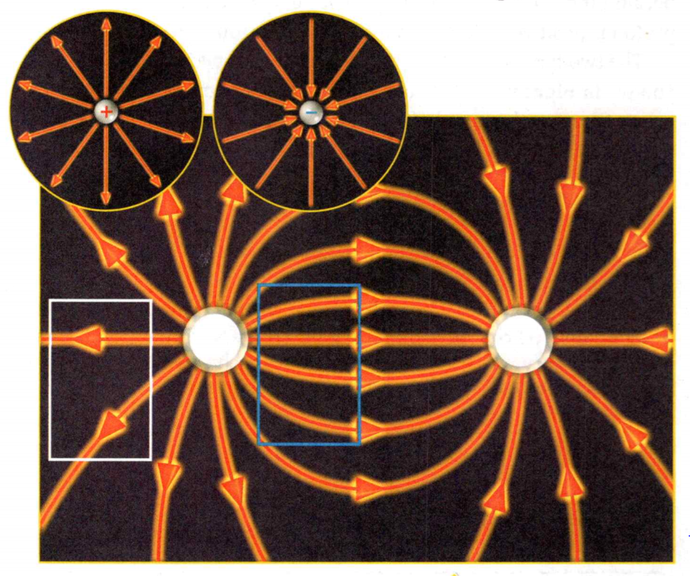
    <figcaption>Figure 1. Electric Fields.</figcaption>
  </figure>

An electric field is invisible. You can use field lines to represent it, as
shown in Figure 1. A field line shows the force that would be exerted on a
positive charge at any point along that line. Positive charges are repelled by
positive charges and attracted to negative charges, so field lines point away
from positive charges and toward negative charges. Single charges have straight
field lines, since a positive charge will be repelled away from or attracted to
it in a straight line. When multiple charges are present, each charge exerts a
force. These forces combine to make more complicated field lines.

**Complete the tasks below.** 

  <figure>
    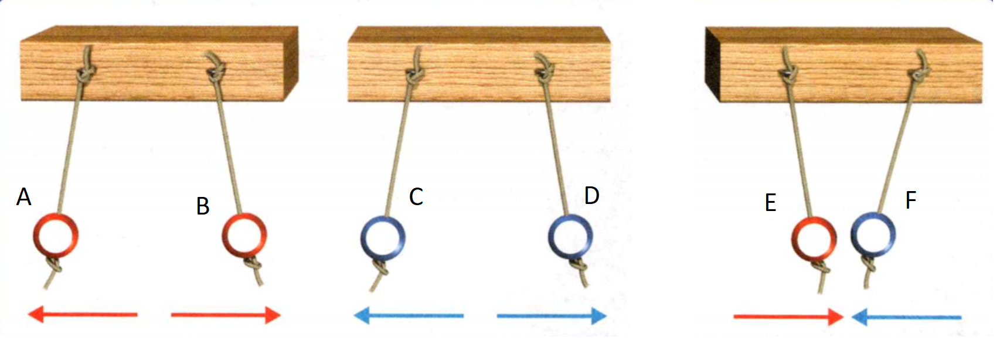
    <figcaption>Figure 2. Repel or Attract.</figcaption>
  </figure>

1. Consider each sphere in Figure 2
a) For each sphere write if it has a positive (+) or a negative (—) charge. 
b) Can you tell for sure which spheres are positively charged and which are
negatively charged? 
b) What conclusions can you draw?

2. Electric Fields Field lines show the direction of the force acting on a
positive charge. Consider Figure 1.
a) Identify which charge is positive and which charge is negative.
b) The boxes on the electric field are the same size. How many field lines are
inside the white box?
c) The blue box is closer to the charges. How many field lines are in this box?
d) What is the relationship between the number of field lines in an area and the
strength of the electric force?

### How Does Charge Build Up?
Most objects have no overall charge. An atom usually has as many electrons as it
has protons, so each positive charge is balanced by a negative charge. This
leaves the atom uncharged, or neutral.

An uncharged object can become charged by gaining or losing electrons. If an
object loses electrons, it is left with more protons than electrons. It has an
overall positive charge. If an object gains electrons, it will have an overall
negative charge. The buildup of charges on an object is called **static
electricity**. In static electricity, charges build up on an object, but they do
not flow continuously.


  <figure>
    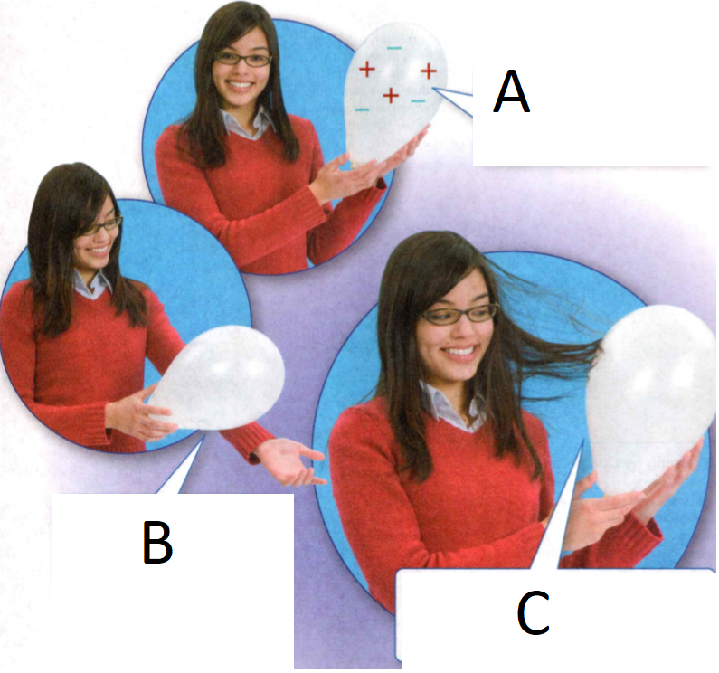
    <figcaption>Figure 3. Charge Buildup.</figcaption>
  </figure>

**Complete the tasks below.** 

1. Consider Figure 3 for this question. Rubbing two objects together can produce
static electricity. Identify the phrases that best complete the statements.
Follow the directions to draw how the charges are arranged in each photo.
a) In A, the balloon is (positively/ negatively/not) charged. The balloon
(attracts/repels/neither attracts nor repels) the girl's hair.
b) In B, rubbing the balloon allows more electrons to move onto the balloon. The
balloon is now (positively/negatively) charged. Draw what the charges on the
balloon look like now.
c) In C, the (positive/negative) charges in the girl's hair are now attracted to the
negative charges on the balloon. Draw how the charges on the balloon are
arranged now.

### Charging Objects   

Charges are neither created nor destroyed. This is a rule known as the law of
**conservation of charge**. An object can't become charged by destroying or creating
its own electrons. If one object loses electrons, another object must pick them
up. **There are four methods by which charges can redistribute themselves to build
up static electricity: by friction, by conduction, by induction, and by
polarization.**

### Charging by Friction 

When two uncharged objects are rubbed together, I some electrons from one object
can move onto the other object. The object that gains electrons becomes
negatively charged. The object that loses electrons becomes positively charged.
Charging by **friction** is the transfer of electrons from one uncharged object to
another by rubbing the objects together.

### Charging by Conduction

When a charged object touches another object, electrons can be transferred.
Charging by **conduction** is the transfer of electrons from one object to another
by direct contact. Electrons transfer from the object that has more negative
charge to the object that has more positive charge. A positively charged object,
like the metal ball, gains electrons when an uncharged person touches it. The
girl starts out neutral, but electrons move from her hair, through her arm, to
the ball. This leaves her hair positively charged, and the strands repel each
other.

### Charging by Induction and by Polarization

Electrons can react to the electric field of a charged object without touching
the object itself. In some materials, like metals, electrons can easily leave
their atoms. When a metal object is close to a negatively charged object,
electrons are repelled by the field and move away from it. The close end of the
metal object becomes positively charged, and the far end becomes negatively
charged. The opposite happens if the other object is positively charged. This
process is called **induction**.

In other materials, like the bits of paper in this photo, electrons move only
within their own atoms. The electrons react to electric fields, resulting in
individual atoms having charged ends that are attracted to charged objects. This
is called **polarization**. Charges don't transfer between objects in polarization
or induction, so neither method changes the overall charge of objects. Parts of
objects end up charged in opposite ways.

**Complete the tasks below.** 

  <figure>
    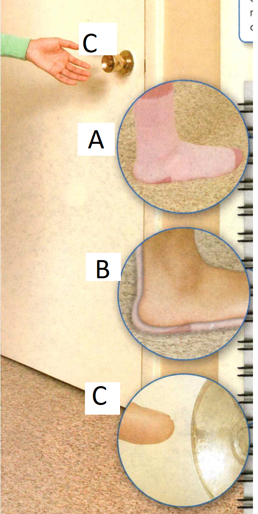
    <figcaption>Figure 4. Moving Electrons.</figcaption>
  </figure>


1. In each image in Figure 4.
a) draw how the charges are arranged in each step. Use arrows to show movement.
b) In A, when the girl's sock rubs the carpet, electrons move from the carpet
onto her sock. This causes an overall negative charge on the sock. What method
of charge redistribution is this? Explain.
c) In B, charges move from the girl's foot to the rest of her body. What method
of charge redistribution is this? Explain.
d) in C, the electrons in the girl's fingertip produce an electric field that
repels the electrons on the doorknob. The electrons on the doorknob move away
from the finger. One end of the doorknob becomes positively charged. What method
of charge redistribution is this? Explain.  


### Static Discharge 

Machines called Van de Graaff generators can create lightning bolts indoors!

If your hair becomes charged and sticks up after you remove a sweater, it
doesn't stay that way forever. Positively charged objects gradually gain
electrons from the air. Negatively charged objects gradually lose electrons to
the air. The objects eventually become neutral again. The loss of static
electricity as electric charges transfer from one object to another is called
**static discharge**.

Static discharge often produces a spark. Moving electrons can heat the air
around their path until it glows. The glowing air is the spark you see. The tiny
spark you may have felt or seen when near a doorknob is an example of static
discharge. Sparks from discharge happen more frequently during winter. This is
because objects hold on to charge better in dry air. In humid weather, water
collects on the surfaces of objects. The water picks up charge from the objects,
so they don't stay charged as long as they would in dry weather.

Lightning bolts are an example of static discharge. During thunderstorms, air
swirls violently. Water droplets within the clouds become charged. Electrons
move from areas of negative charge to areas of positive charge, producing an
intense spark. That spark is lightning.  

Some lightning reaches Earth. Negative charges at the bottoms of storm clouds
create an electric field. This causes Earth's surface to become positively
charged through induction. Electrons jump between the clouds and Earth's
surface, producing a giant spark of lightning as they travel through the air.

**Complete the tasks below.** 

1. Anyone who works with computers has to be aware of static discharge. Even
small discharges can damage electrical equipment.
a) What activities should you avoid to prevent static discharge while working on
a computer?
b) What should the conditions of the room you are in be like?

2. What happens to an object's atoms when the object becomes positively charged?

3. Explain how you could use a piece of silk and a glass rod to attract a stream
of tap water.


### Electric Current  

- How Is Electric Current Made?
- How Do Conductors Differ From Insulators? 
- What Affects Current Flow?

**Complete the tasks below.** 

1. Be a Superconductor—of Science! John Vander Sande wants your city to run more
efficiently. A company he cofounded is working to replace old power lines with
materials that let electric current flow more efficiently. These materials are
called superconductors. Superconductors are often found in lab equipment but
companies like Vander Sande's are finding other uses for them. Vander Sande
didn't start his career working with power lines. He began his work in materials
science as a professor at the Massachusetts Institute of Technology (MIT). He
got into superconducting by chance after hearing about discoveries at a lecture
by one of his colleagues. He encourages everyone to stay open to opportunities
in science, because they can pop up anywhere at any time. Describe an instance
in your life when hearing something by chance led to a new opportunity.


### How Is Electric Current Made?  

Dozens of sushi dishes ride along a conveyor belt in Figure 5. The conveyer belt
carries full dishes past customers and carries empty plates back to the kitchen.
You might be wondering what a conveyer belt of rice, vegetables, and fish could
possibly have to do with electricity. Like the sushi plates, electric charges
can be made to move in a confined path.

  <figure>
    
    <figcaption>Figure 5. Electric Current.</figcaption>
  </figure>

### Flow of Electric Charges 

Lightning releases a large amount of electrical energy. However, the electric
charge from lightning doesn't last long enough to power your radio or your TV.
These devices need electric charges that flow continuously. They require
electric current.  

Recall that static electric charges do not flow continuously. **When electric
charges are made to flow through a material, they produce an electric current.**
**Electric current** is the continuous flow of electric charges through a material.
The amount of charge that passes through a wire in a given period of time is the
rate of electric current. The unit for the rate of current is the ampere, named
for Andre Marie Ampere, an early investigator of electricity. The name of the
unit is often shortened to amp or A. The number of amps describes the amount of
charge flowing past a given point each second.

**Complete the tasks below.** 

1. The conveyor belt in Figure 5 represents a current. If it represented a greater current,
more plates would pass by you in the same amount of time. One way for this to
occur would be for the belt to go faster. Suppose the belt couldn't go faster.
Draw a different way a greater current could be represented.

### Current in a Circuit

The electric currents that power your computer and music player need very
specific paths to work. In order to maintain an electric current, charges must
be able to flow continuously in a loop. A complete, unbroken path that charges
can flow through is called an **electric circuit**.

Someone jogging along the roads is moving like a charge in an
electric circuit. If the road forms a complete loop, the jogger can move in a
continuous path. However, the jogger cannot continue if any section of the road
is closed. Similarly, if an electric circuit is complete, charges can flow
continuously. If an electric circuit is broken, charges will not flow.

Electric circuits are all around you. All electrical devices, from toasters to
televisions, contain electric circuits.

**Complete the tasks below.** 

1. What is the unit of current?  
2. What could break the circuit between your home and an electric power plant?

### How Do Conductors Differ From Insulators?

Charges can flow more easily through some materials than others. A conductor is
a material through which charge can flow easily. Electrons can move freely,
allowing conductors to be charged by induction. Metals, such as copper, are good
conductors.

Wires are surrounded by insulators. Insulators are materials, such as rubber,
that do not allow charges to flow. However, electrons can move around within
their own atoms, allowing for polarization. They can also be stripped off when
charging by friction.

Semiconductors are materials that behave sometimes as conductors and sometimes
as insulators. Pure silicon acts like an insulator, but when other elements are
added, it behaves like a conductor. Silicon is a semiconductor found in most
electronic devices.


The difference between conductors and insulators comes from how strongly
electrons are attached to atoms. **The atoms in conductors have loosely bound
electrons that can move freely. Electrons in insulators cannot move freely among
atoms.**

**Complete the tasks below.** 

1. All objects are made up of conductors or insulators, not just the ones you
usually see in electronic devices. The gloves that electricians wear when
working on power lines should be made out of (insulating/conducting) materials.

  <figure>
    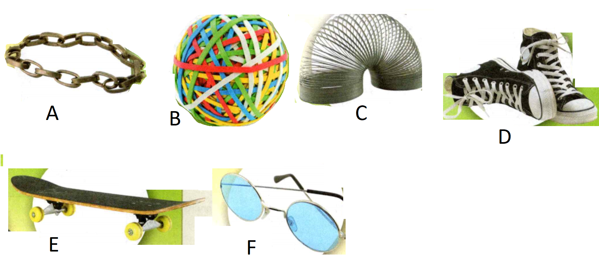
    <figcaption>Figure 6. Conductor or insulator.</figcaption>
  </figure>

2. Identify the conductors in Figure 6. Be careful - only parts of some items are
conductors!


### What Affects Current Flow?
Suppose you are on a water slide at an amusement park. You climb the steps, sit
down, and whoosh! The water current carries you down the slide. Electric charges
flow in much the same way water moves down the slide. **Current flow is
affected by the energy of the charges and the properties of the objects that the
charges flow through.**

### Water Currents
A completely horizontal water slide wouldn't be much fun. A water slide that was
only a few centimeters tall wouldn't be much better. Water slides are exciting
because of gravitational potential energy. (Remember that gravitational
potential energy is the energy an object has because of its height above the
ground.) As the water falls down the slide, its poten- tial energy is converted
into kinetic energy. The water speeds up, since speed increases as kinetic
energy increases. The higher the slide, the more potential energy the water
starts with and the faster it will end up moving. At the bottom of the slide,
the water has no potential energy. It has all been converted to kinetic energy.
The water gains potential energy as it is pumped back to the top, starting the
ride again. **How could the current through a water slide be interrupted?**

### Electric Currents

Electric currents flow through wires like water through pipes. Charges flow
because of differences in electric potential energy. Potential energy from an
energy source (like a battery) gets converted into different forms of energy. If
a circuit contains a light bulb, its potential energy is converted into light
and heat. The charges flow back to the energy source and the process restarts.
**Slides convert gravitational potential energy into kinetic energy. What do
circuits convert electric potential energy into?**

**Complete the tasks below.** 

  <figure>
    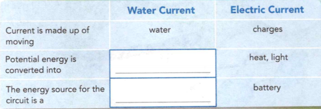
    <figcaption>Figure 7. Currents.</figcaption>
  </figure>

1. Water currents have many things in common with electric currents. The table
in Figure 7 summarizes these similarities. Complete the table.

### Voltage

The V on a battery stands for volts, which is the unit of voltage. Voltage is
the difference in electric potential energy per charge between two points in a
circuit. (Electric potential energy per charge is also called electric
potential.) This energy difference causes charges to flow. Because the voltage
of a battery is related to energy per charge, it doesn't tell you how much total
energy the battery supplies. A car battery and eight watch batteries both supply
12 volts, but eight watch batteries can't run a car. Each charge has the same
amount of energy, but the car battery can provide that energy to many more
charges. This results in a higher total energy. 

### Resistance 

The amount of current in a circuit depends on more than voltage. Current also
depends on the resistance of the circuit. Resistance is the measure of how
difficult it is for charges to flow through an object. The greater the
resistance, the less current there is for a given voltage. The unit of measure
of resistance is the ohm (Ω). 

The four factors that determine the resistance of
an object are diameter, length, material, and temperature. Objects with
different characteristics have different resistances. If more than one path is
available, more current will flow through the path that has the lower
resistance.


### Dimensions and Resistance
The length and diameter of a straw determine how difficult it is to drink
through it. Similarly, the length and diameter of a wire determine how difficult
it is for charge to flow through it.

**Complete the tasks below.** 

1. Milk flows more easily through a wide straw than it does through a
narrow straw. Current flows more easily through a wide wire than through a
narrow wire.  How does a wire's diameter affect its electrical resistance? Explain.

2. You may have noticed that it is easier to drink milk through a short straw
than through a long straw. Similarly, short wires have less resistance than long
wires. How does an object's length affect its electrical resistance?

	
### Materials and Resistance

Some materials have electrons that are tightly held to their atoms. They have a high
resistance because it is difficult for charges to move. Other materials have electrons that are loosely held to their atoms. They have a low resistance because charges can move through them easily.

The electrical resistance of most materials increases as temperature increases.
As the temperature of most materials decreases, resistance decreases as well.

**Complete the tasks below.** 

1. Do conductors or insulators have a lower resistance? Explain.
2. Why would it be useful to keep power lines cool in the summer?
3. List the four factors that determine the resistance of an object.
4. Battery A supplies 500 charges. Each charge has 2 J of energy. Battery B
supplies 50 charges, each of which has 4 J of energy. Which battery supplies
more total energy? Which has a higher voltage?

### Electric Circuits
- What Did Ohm Discover? 
- What Is a Circuit Made Of?

One winter night, a string of bright lights adorning a store window catches your
eye. As you look, one bulb suddenly goes out, yet the others stay on! How can
that be?
Normally, when a light bulb burns out, it breaks the flow of current through a
circuit. But many holiday lights are on circuits that provide more than one
possible path for the electric current to follow. This type of circuit provides
a path for the current to flow even if one component goes bad. So if one light
bulb burns out, the rest of the lights remain lit.

**Complete the tasks below.** 

1. What other devices have you used that can keep working even if one part stops
working?
2. When could it be useful to have a device turn off completely if one part
breaks?

### What Did Ohm Discover?  

In the 1800s, Georg Ohm performed many experiments on electrical resistance.
Ohm found that the current, voltage, and resistance in a circuit are always
related in the same way.

Ohm set up a circuit with a voltage between two points on a conductor. He
measured the resistance of the conductor and the current between those points.
Then he changed the voltage and took new measurements.

Ohm found that if the factors that affect resistance are held constant, the
resistance of most conductors does not depend on the voltage across them.
Changing the voltage in a circuit changes the current but does not change the
resistance. Ohm concluded that conductors and most other devices have a constant
resistance regardless of the applied voltage.

**Complete the tasks below.** 

1. Suppose you use various cell phone parts to perform experiments similar to
Ohm's. You come up with the following data table. Use the data to predict the
relationship that Ohm found.

  <figure>
    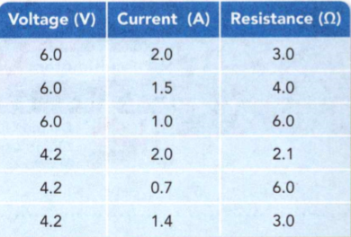
    <figcaption>Figure 8. Circuit Relationships.</figcaption>
  </figure>


### Ohm's Law 

Ohm created a law that describes how voltage, current, and resistance are
related. Ohm's law says that resistance in a circuit is equal to voltage divided
by current. This relationship can be represented by an equation.

```
Resistance = Voltage / Current
```

The units are ohms (Ω) = volts (V) / amps (A). One ohm is equal to one volt per
amp. You can rearrange Ohm's law to solve for voltage when you know current and
resistance.

```
Voltage = Current x Resistance
```

You can use the formula to see how changes in resistance, voltage, and current
are related. For example, what happens to current if voltage is doubled without
changing the resistance? For a constant resistance, if voltage is doubled,
current doubles as well.


**Complete the tasks below.** 

  <figure>
    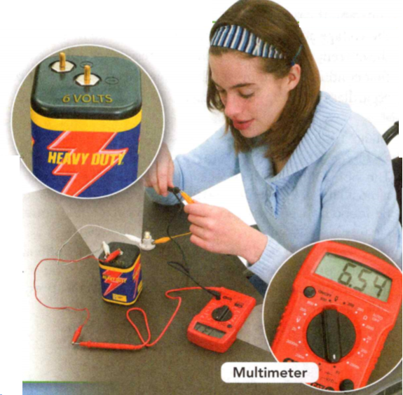
    <figcaption>Figure 9. Multimeter.</figcaption>
  </figure>

1. A multimeter is a device that can measure the current in a circuit. 
a) Use the reading on the multimeter and the battery in Figure 9 to find the
voltage and current in this circuit. 
b) Calculate the resistance of the bulb.

2. Batteries gradually lose voltage. A circuit contains 2 ohms of resistance and
an old 9-volt battery. Four amps of current run through the circuit. What is the
actual voltage?

3. Suppose you tripled the voltage in a circuit but kept the resistance
constant. The current in the circuit would be (triple/the same as/a third of)
the original current.

### What Is a Circuit Made Of?   

Objects that use electricity contain circuits. **All electric circuits have
these basic features: devices that run on electrical energy, sources of
electrical energy, and conducting wires.**

- Energy is always conserved in a circuit. Electrical energy doesn't get used
up. It gets transformed into other forms of energy, such as heat, light,
mechanical, and sound energy. Appliances such as toasters transform electrical
energy. These devices resist current, so they are represented in a circuit as
resistors.

- Electric circuits are connected by conducting wires. The conducting wires
complete the path of the current. They allow charges to flow from the energy
source to the device that runs on electric current and back to the energy
source.

- A switch is often included to control the current. Opening a switch breaks the
circuit, which shuts off the device.

All the parts of a circuit are shown in Figure 10. Each part in the photograph
is represented in the diagram by a simple symbol.

  <figure>
    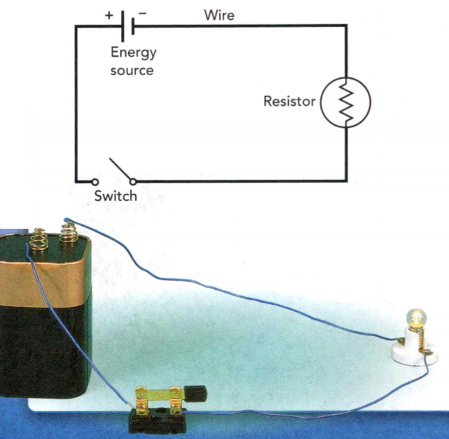
    <figcaption>Figure 10. Circuit Diagrams.</figcaption>
  </figure>

**Complete the tasks below.** 

1. A symbol in a circuit diagram represents a part of the circuit. Draw a
circuit diagram for a circuit with two resistors, two batteries, and a switch.

### Series Circuits 

If all the parts of an electric circuit are connected one after another along
one path, the circuit is called a **series circuit**. A series circuit has only one
path for the current to take. 

A series circuit is very simple to design and
build, but it has some disadvantages. What happens if a light bulb in a series
circuit burns out? A burned-out bulb is a break in the circuit, and there is no
other path for the current to take. So if one light goes out, the other lights
go out as well. 

Another disadvantage of a series circuit is that the light bulbs
in the circuit become dimmer as more bulbs are added. Think about what happens
to the overall resistance of a series circuit as you add more bulbs. The
resistance increases. Remember that for a constant voltage, if resistance
increases, current decreases. If you add light bulbs to a series circuit without
changing the voltage, the current decreases. The bulbs burn less brightly.

**Complete the tasks below.** 

  <figure>
    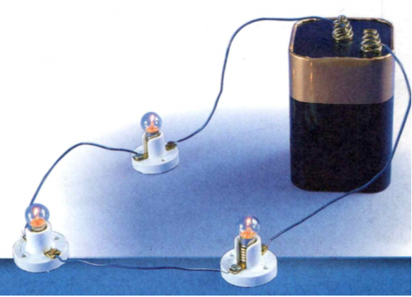
    <figcaption>Figure 11. Series Circuits.</figcaption>
  </figure>

1. The number of bulbs in a series circuit affects each bulb's brightness. Remember that 
`voltage = current x resistance.`
a) Draw the circuit diagram for the circuit in Figure 11.
b) If the voltage of the battery were doubled, what would happen to the current
through each of the bulbs? 
c) How would this affect the brightness of the bulbs?
d) If the voltage of the battery were doubled and three more bulbs were added, what would happen to the current and the brightness of the bulbs?

### Parallel Circuits 

In a parallel circuit, different parts of the circuit are on separate branches.
There are several paths for current to take. Each bulb is connected by a
separate path from the battery and back to the battery.

What happens if a light burns out in a parallel circuit? If there is a break in
one branch, charges can still move through the other branches. So if one bulb
goes out, the others remain lit. Switches can be added to each branch to turn
lights on and off without affecting the other branches.

What happens to the resistance of a parallel circuit when you add a branch? The
overall resistance actually decreases. As new branches are added to a parallel
circuit, the electric current has more paths to follow, so the overall
resistance decreases. Remember that for a given voltage, if resistance
decreases, current increases. The additional current travels along each new
branch without affecting the original branches. So as you add branches to a
parallel circuit, the brightness of the light bulbs does not change.

 <figure>
    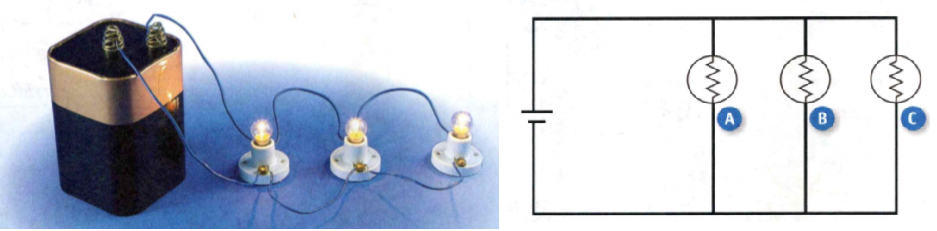
    <figcaption>Figure 12. Parallel Circuits.</figcaption>
  </figure>

**Complete the tasks below.** 

1. Your home is full of electrical devices. When you turn one device on or off,
it does not affect other appliances. This means that your home contains a
(series/parallel) circuit.

2. The kitchen lights are wired in series. How could you know this without
seeing the wiring?
 
3. A (series/parallel) circuit has only one path for current to flow through.

### Electric Power and Safety

- How Do You Calculate Electric Power and Energy? 
- How Can Electric Shocks Be Prevented?

**Complete the tasks below.** 

1. Forget about being in the spotlight - with LED clothing you can be the
spotlight! LEDs, or light-emitting diodes, are small light bulbs. What's special
about LEDs is that they can be just as bright as the regular bulbs in your home
while using much less energy. Regular bulbs waste a lot of electrical energy by
converting it into heat. A dress like this one made out of regular bulbs would
be much too hot to wear! As scientists work to make LEDs cheaper, they could go
from dresses in fashion shows to lamps in your house. This would lower your
electric bill and help the environment. What other electrical devices could be made more efficient with LEDs?

### How Do You Calculate Electric Power and Energy?  

All electrical appliances transform electrical energy into other forms. Hair
dryers transform electrical energy into thermal energy to dry your hair. An
amplifier that a guitar player uses transforms electrical energy into sound. A
washing machine transforms electrical energy into mechanical energy. The rate at
which energy is transformed from one form to another is known as **power**. The unit
of power is the watt (W).

### Power Ratings 

You are already familiar with different amounts of electric power. The power
rating of a bright light bulb, for example, might be 100 W. The power rating of
a dimmer bulb might be 60 W. The brighter bulb transforms (or uses) electrical
energy at a faster rate than the dimmer bulb.

### Calculating Power 

The power of a light bulb or appliance depends on two factors: voltage and
current. **Power is calculated by multiplying voltage by current.**
```
Power = Voltage x Current
```
The units are watts (W) = volts (V) X amperes (A). The equation can also be
rearranged to let you solve for current if you know power and voltage.
```
Current = Power / Voltage
```

**Example:**
Toaster 850W on 120V:
```
Current = Power / Voltage = 850W/120V = 7.08 A
```


**Complete the tasks below.** 

1. Many appliances around your home are labeled with their power ratings. In the
United States, standard wall outlets supply 120 volts. Determine the current
running through each of these appliances.
a) Washing machine 4000W.
b) Laptop 85W.
c) TV 300W.

### Paying for Electrical Energy 

The electric bill that comes to your home charges for the month's energy use,
not power. Power tells you how much energy an appliance uses in a certain amount
of time. CZ The total amount of energy used is equal to the power of the
appliance multiplied by the amount of time the appliance is used.

```
Energy = Power x Time
```

Electric power is usually measured in thousands of watts, or kilowatts (kW). To
go from watts to kilowatts, you divide by 1,000. Time is measured in hours. A
common unit of electrical energy is the kilowatt-hour (kWh).

```
Kilowatt-hours = Kilowatts x Hours
```

A refrigerator averages a power of 0.075 kW (75 W). Knowing that, you can
calculate how much energy it will use in one month (about 720 hours).

Energy = 0.075 kW x 720 hours = 54 kWh

**Complete the tasks below.**

1. The power of an appliance can be found by multiplying ____	by ____ .

2. How much energy does an 850 W toaster consume if it is used for 1.5 hours
over the course of a month?

### How Can Electric Shocks Be Prevented?

A **short circuit** is a connection that allows current to take the path of least
resistance. Touching a frayed wire causes a short circuit, since current can
flow through the person rather than through the wire. Since the new path has
less resistance, the current can be very high. Many bodily functions, such as
heartbeat, breathing, and muscle movement, are controlled by electrical signals.
Because of this, electric shocks can be fatal.

**Shocks can be prevented with devices that redirect current or break circuits.**
Ground wires connect the circuits in a building directly to Earth, giving
charges an alternate path in the event of a short circuit. The **third prong** you
may have seen on electrical plugs connects the metal parts of appliances to the
building's ground wire. Any circuit connected to Earth in this way is **grounded**.

The circuits in your home also contain devices that prevent circuits from
overheating, since overheated circuits can result in fires. **Fuses** are devices
that melt if they get too hot. This breaks the circuit. **Circuit breakers** are
switches that will bend away from circuits as they heat up. Unlike fuses, which
break when they are triggered, circuit breakers can be reset.

Fuses are often found in appliances such as coffee makers. A fuse will melt and
break, cutting off the circuit, before the appliance can get so hot that it
catches fire.
 
**Complete the tasks below.** 

1. What electronic devices may contain fuses? Explain your reasoning.

### Study Guide

- Charges that are the same repel each other. Charges that are different attract
each other.
- There are four methods by which charges can redistribute themselves to build
up static electricity: by friction, by conduction, by induction, and by
polarization.
- When electric charges are made to flow through a material, they produce an
electric current.
- The atoms in conductors have loosely bound electrons that can move freely.
Electrons in insulators cannot move freely among atoms.
- Current flow is affected by the energy of the charges and the properties of
the objects that the charges flow through.
- Ohm found that the current, voltage, and resistance in a circuit are always
related in the same way.
- All electric circuits have the same basic features: devices that are run by
electrical energy, sources of electrical energy, and conducting wires.
- Power is calculated by multiplying voltage by current.
- The total amount of energy used is equal to the power of the appliance
multiplied by the amount of time the appliance is used.
- Shocks can be prevented with devices that redirect current or break circuits.

**Complete the tasks below.** 


1. What type of charge transfer occurs when two objects are rubbed together?
A) friction	
B) induction
C) conduction	
D) polarization

2. The transfer of electrons from a cloud to the ground during a lightning
strike is an example of _______ .

3. Draw the electric field for a single positive charge. Be sure
to show which way the field lines point.

4. Explain what happens to the electrons in a metal object when it is held near
a negatively charged object. What happens to the overall charge of the metal
object?

5. A park needs a sign to tell visitors what to do during a thunderstorm. Write
a paragraph that explains why standing under a tall tree during a thunderstorm
is dangerous.


6. Which of these objects is an insulator?
A) gold ring	
B) copper coin
C) glass rod	
D) steel fork

7. An electric current is _____ .

8. The appliances in your home can be made of several different materials. What
kinds of materials are the wires made of? What kinds of materials surround the
wire for safety?

9. Copper wires carry electric current from power plants to users. How is the
resistance of these power lines likely to vary during the year in an area that
has very hot summers? Explain.

10. Make Models Water will not flow down a flat slide because there is no
potential energy difference between the two ends. How could this situation be
represented in an electric circuit? Explain your reasoning.

11. Lisa built an electric circuit. When she added a second light bulb, the
first bulb became dimmer. What type of circuit did Lisa build?
A) series	
B) parallel
C) open	
D) short

12. According to Ohm's law, the resistance in a circuit can be determined by
______ .

13. Use the diagram in Figure 13 below to answer Questions.
  <figure>
    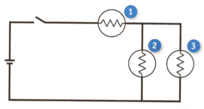
    <figcaption>Figure 13. Circuit of bulbs.</figcaption>
  </figure>

a) Will any of the bulbs light if you open the switch? Explain.
b) Which bulbs would continue to shine if Bulb 1 broke? 
c) Which would shine if Bulb 2 broke instead? Explain.


14. Most homes contain 120-V outlets. Suppose you have lamps with resistances of
120 Ω, 144 Ω, and 240 Ω. Predict which one will draw the most current. Check
your prediction by calculating the current that runs through each lamp.

15. What unit is used to measure electric power?
A) ampere (A)	
B) volt (V)
C) watt (W)	
D) ohm (Ω)

16. An appliance's total electrical energy consumption is calculated by ____ .

17. If you touch an electric wire and get a shock, what can you infer about the
resistance of your body compared to the resistance of the circuit?

18. A device draws 40 A of current and has a 12-V battery. What is its power?

19. Identify the parts that make up the circuit in a laptop computer. Describe
what happens inside the circuit when the computer is on.


  <figure>
    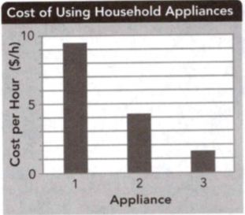
    <figcaption>Figure 14. Cost of Using Household Appliances.</figcaption>
  </figure>

20. Which of the following is a valid interpretation of the graph in Figure 14?
A) The voltage is highest in Appliance 1.
B) Appliance 1 uses the most power.
C) During one month, a family pays more to run Appliance 1 than Appliance 2.
D) Appliance 1 draws the least current.


21. Your alarm clock has a voltage of 120 V and a resistance of 1200 Ω. What
current does the alarm clock draw?
A) 0.10 A
B) 10.0 A
C) 12.0 A
D) 100 A

22. You want to build a device that can conduct current but will be safe if
touched by a person. Which of the following pairs of materials could you use?
A) glass to conduct and rubber to insulate
B) copper to conduct and silver to insulate
C) sand to conduct and plastic to insulate
D) silver to conduct and plastic to insulate 

23. How does a fuse prevent electrical fires?
A) by providing a path for excess charges to get to the ground
B) by melting if the current gets too high
C) by reducing the voltage supplied to electrical devices
D) by storing potential energy for later use

24. What happens when an object is rubbed against another object to charge by
friction?
A) Electrons are transferred from one object to another.
B) Electrons in one of the objects disappear.
C) Electrons in one object suddenly become negatively charged.
D) Electrons are created by the friction between the objects.

25. A lightning bolt can have a voltage of over 100 million volts. Explain why
lightning cannot power your cell phone but a 6-volt battery can. Then explain
what would happen if a 100-million-volt battery was plugged into a cell phone.
Use Ohm's law in your answer.

26. Every time you turn on a light, you are using energy. We know this, but we don't
always think about where the energy comes from. In most cases, that energy has
come from fossil fuels, extracted from the ground, refined, and burned for their
energy, in a process that causes a lot of pollution. Some scientists and
government policymakers are exploring green (environmentally friendly) sources
of energy.

According to the U.S. Environmental Protection Agency (EPA), green energy comes
from technologies that don't produce waste products that will harm the
environment. This includes resources like solar power and wind power, as well as
geothermal energy from hot springs under the Earth's crust.

Reduced air pollution is just one of many benefits of green energy. Green energy
also lowers greenhouse gas emissions and can cost less for consumers—like your
family! Going green also creates jobs. Having many different sources makes the
energy grid more stable. If one source stops working, we will still be able to
get energy from other sources. What's not to love? Unfortunately, green energy
technologies are expensive to develop.

Research the benefits and costs of developing green energy technologies.
Organize a classroom debate about the costs and benefits of green energy. Be
prepared to argue both sides of the issue.

27. How are electricity and magnetism related? This type of train is called a
maglev, or magnetic levitation train, and operates at speeds of 430 km/h (about
twice as fast as a conventional train). It does not have a traditional engine,
which means it does not give off any pollutants. Instead, the maglev train uses
electricity in the track to power magnets that propel the train forward and
levitation magnets to keep the train floating about 10 mm above the track. How
can this train move without touching the track?


