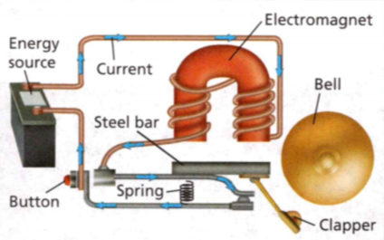

### Physical Science

## Physics

## 17 Magnetism and Electromagnetism

- **Electricity** is a form of energy sometimes created by the movement of charged particles.

- A material through which charges can easily flow is a **conductor**.

- **Electric current** is the continuous flow of electric charges through a material.

**Complete the tasks below.** 

1. While Chung works, his computer shuts down. Both the street and his house are
dark, so he knows there is no electricity. A fallen tree has snapped an electric
wire. The wire was the conductor that brought him power. Chung reaches for the
light switch, but then remembers that no electric current will flow when he
turns it on. How can electricity be restored to Chung's house?

### Chapter Preview

- magnet
- magnetism
- magnetic pole
- magnetic force
- magnetic field
- magnetic field lines
- compass
- magnetic declination
- electromagnetism
- solenoid
- electromagnet
- galvanometer
- electric motor
- electromagnetic induction
- direct current
- alternating current
- generator
- transformer

### What Is Magnetism?
- What Are the Properties of Magnets? 
- How Do Magnetic Poles Interact?

**Complete the tasks below.** 

1. Crocodiles are threatened animals. So, if they are not protected, they may
become endangered and then disappear altogether. However, in Florida, many
crocodiles live where people do, so they threaten people's safety. 

To keep both people and crocodiles safe, biologists tried to move crocodiles
away from people. But there was a problem. Crocodiles use Earth's magnetic field
to help them navigate. Whenever they relocated a crocodile, , it eventually
returned, if it was not killed on the way back. But then the biologists heard
that scientists in Mexico had taped a magnet to each side of a crocodile's head
before relocating it. They thought that the magnets would interfere with the
crocodile's ability to use Earth's magnetic field to find its way back.
Biologists here did the same thing. So far, it has been successful. 

Why do you think it is important to relocate crocodiles?

### What Are the Properties of Magnets?

Imagine that you're in Shanghai, China, zooming along in a maglev train
propelled by magnets. Your 30-kilometer trip from the airport to the city
station takes less than eight minutes. The same trip in a taxi would take about
an hour.

When you think of magnets, you might think about the objects that hold notes to
your refrigerator. But magnets can be large. They can
be small like those on your refrigerator, in your wallet, on your kitchen
cabinets, or on security tags at a store. A magnet is any material that attracts
iron and materials that contain iron.

Magnets have many modern uses, but they are not new The ancient Greeks
discovered that a rock called magnetite attracted materials containing iron. The
rocks also attracted or repelled other magnetic rocks. The attraction or
repulsion of magnetic materials is called **magnetism**. 

Magnets have the same properties as magnetite rocks. Magnets attract iron and
materials that contain iron. Magnets attract or repel other magne In addition,
one end of a magnet will always point north when allowed to swing freely.

  
### How Do Magnetic Poles Interact?  

Any magnet, no matter what its size or shape, has two ends. Each one is called a
**magnetic pole.** The magnetic effect of a magnet is strongest at the poles. The
pole of a magnet that points north is labeled the north pole. The other pole is
labeled the south pole. A magnet always has both a north pole and a south pole.

### Magnetic Interactions 

What happens if you bring two magnets together? The answer depends on how you
hold the poles of the magnets. If you bring the north pole of one magnet near
the south pole of another, the two unlike poles attract one another. However, if
you bring two north poles together, the like poles move away from each other.
Magnetic poles that are unlike attract each other, and magnetic poles that are
alike repel each other. You can see how bar magnets interact in Figure 1.

  <figure>
    
    <figcaption>Figure 1. Attraction and Repulsion.</figcaption>
  </figure>

**Complete the tasks below.** 

1. These pairs of magnets in Figure 1 show how magnetic poles interact. Draw and
label what happens when two south poles are near each other.

### Magnetic Force 

The attraction or repulsion between magnetic poles is magnetic force. A force is
a push or a pull that can cause an object to move. A magnetic force is produced
when magnetic poles come near each other and interact. Any material that exerts
a magnetic force is a magnet.

**Complete the tasks below.** 

  <figure>
    
    <figcaption>Figure 2. Maglev train.</figcaption>
  </figure>

1. The maglev train in Figure 2 depends on magnetic force to float above the
guideway, or track. The magnetic force is produced by magnets in the bottom of
the train and in the guideway. 
a) For the train to float, which pole of the
guideway's magnet should face the north pole of the train car's magnet?
b) List some advantages of the fact that the train does not touch the guideway.

2. What areas of a magnet have the strongest magnetic effect?

3. How can two magnets demonstrate magnetic force?

	
### Magnetic Fields
- What Is a Magnetic Field's Shape?
- What Is Earth's Magnetic Field Like?

**Complete the tasks below.** 

1. Cow Magnets. You probably know that cows eat grass. Did you know that they also
eat metal? When cows graze, they may ingest metal objects that contain iron such
as nails, wires, and old cans. If the metal is sharp, it could pierce the cow's
stomach, causing infection, illness, or even death. To ensure that their cows
are safe, farmers have their cows swallow a magnet. Once inside the cow's
stomach, the magnet attracts the iron in the metal that the cow eats. This keeps
the metal from moving around and possibly puncturing other organs. One magnet
can protect a cow for life.
a) Why is it dangerous for a cow to eat metal?
b) As a farmer, what else could you do to keep metal objects from harming the cows?

### What Is a Magnetic Field's Shape?

You know that a magnetic force is strongest at the poles of a magnet. But
magnetic force is not limited to the poles. It is exerted all around a magnet.
The area of magnetic force around a magnet is known as its magnetic field.
Because of magnetic fields, magnets can interact without even touching.

### Representing Magnetic Field Lines 

Figure 3 shows the magnetic field of a bar magnet. The magnetic field lines are
shown in purple. Magnetic field lines are lines that map out the invisible
magnetic field around a magnet. **Magnetic field lines spread out from one
pole, curve around the magnet, and return to the other pole.** The lines form
complete loops from pole to pole and never cross. Arrowheads indicate the
direction of the magnetic field lines. They always leave the north pole and
enter the south pole. The closer together the lines are, the stronger the field.
Magnetic field lines are closest together at the poles.

  <figure>
    
    <figcaption>Figure 3. Magnetic Field Lines.</figcaption>
  </figure>

### A Single Magnetic Field 

Although you cannot see a magnetic field, you can see its effects. Figure 4A
shows iron filings sprinkled on a sheet of clear plastic that covers one magnet.
The magnetic forces of the magnet act on the iron filings and align them along
the invisible magnetic field lines. The result is that the iron filings form a
pattern similar to magnetic field lines.

### Combined Magnetic Fields 

When the magnetic fields of two or more magnets overlap, the result is a
combined field. Figures 4B and 4C show the effects of magnetic force on iron
filings when the poles of two bar magnets are brought near each other. Compare
the pattern of a north-north pole arrangement and a north-south pole
arrangement. The fields from two like poles repel each other. But the fields
from unlike poles attract each other, forming a strong field between the
magnets.

**Complete the tasks below.** 

1. See Figure 3. Magnetic fields are invisible, but you can represent a field
using magnetic field lines. Identify where the magnetic field is strong and
where it is weak.

2. Forces that affect objects without touching them are called field forces. Is
gravity a field force? Explain.

  <figure>
    
    <figcaption>Figure 4. Magnetic Fields.</figcaption>
  </figure>

3. Different magnetic pole arrangements will produce different magnetic fields.
In the box below each diagram in Figure 4, draw the corresponding magnetic field
lines with arrowheads to show direction.

**Complete the tasks below.** 

1. When magnets come together, you can feel magnetic forces. You hold two
refrigerator magnets and push them toward each other. What will you observe that
lets you know that the fields of the magnets are interacting?

2. Why might a magnet that sticks to your refrigerator be unable to pick up a
faraway paper clip?

3. What is a magnetic field?

4. Describe the magnetic field of a south-south pole arrangement.

### What Is Earth's Magnetic Field Like?

People have used compasses as tools for navigation for centuries. A **compass** is a
device that has a magnet on a needle that spins freely. It is used for
navigation because its needle usually points north. But why does that happen? In
the late 1500s an Englishman, Sir William Gilbert, proved that a compass behaves
as it does because Earth acts as a giant magnet. **Just like a bar magnet, Earth
has a magnetic field around it and two magnetic poles.** So, the poles of a
magnetized compass needle align themselves with Earth's magnetic field. See
Earth's magnetic field in Figure 3.

### Earth's Core 

Earth's core is a large sphere of metal that occupies Earth's center. The core
is divided into two parts—the outer core and the inner core. The outer core is
made of hot swirling liquid iron. The motion of this iron creates a magnetic
field similar to the magnetic field of a bar magnet.

  <figure>
    
    <figcaption>Figure 5. Earth's Magnetic Field.</figcaption>
  </figure>

The magnetic pole in the Northern Hemisphere is actually a magnetic south pole!
Compasses point north because the magnetic north pole of a compass needle is
attracted to the magnetic south pole in the Northern Hemisphere.

**Complete the tasks below.** 

1. Magnetized compass needles usually align with Earth's magnetic field and point
north. This allows hikers and travelers to orient their maps correctly. Explain
Why might a compass not work correctly when it is near a strong magnet?

### Earth's Magnetic Poles 

You know that Earth has geographic poles. But Earth also has magnetic poles that
are located on Earth's surface where the magnetic force is strongest. As you
just saw in Figure 5, the magnetic poles are not in the same place as the
geographic poles. Suppose you could draw a line between you and the geographic
North Pole. Then imagine a second line drawn between you and the magnetic pole
in the Northern Hemisphere. The angle between these two lines is the angle
between geographic north and the north to which a compass needle points. This
angle is known as **magnetic declination**.

The magnetic declination of a location changes. Earth's magnetic poles do not
stay in one place as the geographic poles do.

**Complete the tasks below.** 

1. The last expedition to directly observe the pole's location was in May 2001.
The map shows estimated positions after 2001. See Figure 6 for this question.

  <figure>
    
    <figcaption>Figure 6. Magnetic North Pole Movement.</figcaption>
  </figure>

a) What is the total distance the pole traveled from 1948 to 2001?
b) What was the mean speed of the pole's movement from 1948 to 2001? 
c) What was the mode?

### Electromagnetic Force
- How Are Electric Currents and Magnetic Fields Related?
- What Is a Magnetic Field Produced by a Current Like?
- What Are the Characteristics of Solenoids and Electromagnets?

**Complete the tasks below.** 

1. More Than Just Plastic.
How do plastic cards with stripes, such as your library card, work? The black
stripe on the back of the card is made up of tiny magnetic particles.
Information can be recorded on the stripe. When a card is swiped through a
card-reading machine, the cardholder's information is relayed from the card to a
computer or sent to a place for verification.
If the card is placed near magnetic material, the arrangement of the magnetic
particles on the stripe can get rearranged. Once this happens, the card becomes
useless because it no longer holds the cardholder's information. If you are ever
given a credit card to use, make sure you keep it away from magnets or else you
may leave the store empty-handed!
List types of cards that have a magnetic stripe.

### How Are Electric Currents and Magnetic Fields Related?

You know that a magnet has a magnetic field. But did you know that an electric
current produces a magnetic field? In 1820, the Danish scientist Hans Christian
Oersted accidentally discovered this fact. He was teaching a class at the
University of Copenhagen. During his lecture he produced a current in a wire
just like the current in a battery-powered flashlight. When he brought a compass
near the wire, he observed that the compass needle changed direction.

### Oersted's Experiment 

Oersted could have assumed that something was wrong with his equipment, but
instead he decided to investigate further. So he set up several compasses around
a wire. With no current in the wire, all of the compass needles pointed north.
When he produced a current in the wire, he observed that the compass needles
pointed in different directions to form a circle. Oersted concluded that the
current had produced a magnetic field around the wire. Oersted's results showed
that magnetism and electricity are related.

 <figure>
    
    <figcaption>Figure 7. Moving Compass Needles.</figcaption>
  </figure>

### Electric Current and Magnetism 

Oersted's experiment showed that wherever there is electricity, there is
magnetism. **An electric current produces a magnetic field.** This relationship
between electricity and magnetism is called electromagnetism. Although you
cannot see electromagnetism directly, you can see its effect. That is, a compass
needle moves when it is in a magnetic field produced by an electric current, as
you can see in Figure 7.

**Complete the tasks below.** 

1. In Figure 7 the photographs show you how an electric current produces a magnetic field.
a) Explain what is happening to the compass needles when the current in the wire is
turned on or off.
b) What did Oersted conclude?
c) How does a current affect a compass?

### What Is a Magnetic Field Produced by a Current Like?

**The magnetic field produced by a current has a strength and a direction. The
field can be turned on or off, have its direction reversed, or have its strength
changed.** To turn a magnetic field produced by a current on or off, you turn the
current on or off. To change the direction of the magnetic field, you reverse
the direction of the current.

There are two ways to change the strength of a magnetic field. First, you can
increase the amount of current in the wire. Second, you can make a loop or coil
in the wire. The magnetic field around the wire forms a circle. When you make a
loop in a wire, the magnetic field lines bunch close together inside the loop.
This strengthens the magnetic field. Every additional loop strengthens the
magnetic field even more. Figure 8 shows three different ways to change the
characteristics of a magnetic field.

  <figure>
    
    <figcaption>Figure 8. Change Magnetic Field Characteristics.</figcaption>
  </figure>

### What Are the Characteristics of Solenoids and Electromagnets?

You know that you can strengthen the magnetic field around a wire with a current
by coiling the wire. **Both solenoids and electromagnets use electric current and
coiled wires to produce strong magnetic fields.**

### Solenoids 

By running current through a wire which is wound into many loops, you strengthen
the magnetic field in the center of the coil as shown in Figure 9. A coil of
wire with a current is called a **solenoid**. The two ends of a solenoid act like
the poles of a magnet. However, the north and south poles change when the
direction of the current changes.

  <figure>
    
    <figcaption>Figure 9. A Solenoid and an Electromagnet.</figcaption>
  </figure>

### Electromagnets 

If you place a material with strong magnetic properties inside a
solenoid, the strength of the magnetic field increases. This is because the
material, called a ferromagnetic material, becomes a magnet. A solenoid with a
ferromagnetic core is called an **electromagnet**. Both the current in the wire and
the magnetized core produce the magnetic field of an electromagnet. Therefore,
the overall magnetic field of an electromagnet is much stronger than that of a
solenoid. An electromagnet is turned on and off by turning the current on and
off.

### Regulating Strength 

You can increase the strength of an electromagnet in four ways. First, you can
increase the current in the solenoid. Second, you can add more loops of wire to
the solenoid. Third, you can wind the coils of the solenoid closer together.
Finally, you can use a material that is more magnetic than iron for the core.
Alnico is such a material.

### Using Electromagnets 

Electromagnets are very common. They are used in electric motors, earphones, and
many other everyday objects. Electromagnets are even used in junkyards to lift
old cars and other heavy steel objects.

**Complete the tasks below.** 

1. An electromagnet is a solenoid with a ferromagnetic core.
Explain how the diagram in Figure 9 shows you that the magnetic field of the
electromagnet is stronger than that of the solenoid on its own.

  <figure>
    
    <figcaption>Figure 10. Doorbell.</figcaption>
  </figure>

2. An electromagnet makes a doorbell ring. A pushed button closes the circuit
and turns on the electromagnet. Current flows through the electromagnet,
producing a strong magnetic field.
a) What effect will the magnetic field have on the steel bar? The clapper?
b) What turns off the electromagnet?

3. What is a solenoid?

4. What are four ways to make an electromagnet stronger?

### Electricity, Magnetism, and Motion

- How Is Electrical Energy Transformed Into Mechanical Energy?
- How Does a Galvanometer Work? 
- What Does an Electric Motor Do?
- 
**Complete the tasks below.** 

1. Miniature Motor. In 1960, scientist and California Institute of Technology
(Caltech) professor Richard Feynman publicly offered a prize of $1,000 to the
first person to build an electric motor no larger than 0.3969 cubic millimeters.
A Caltech graduate named William McLellan accepted the challenge. He used a
toothpick, microscope slides, fine hairs from a paintbrush, and wires only
1/80th of a millimeter wide to build the world's smallest motor. McLellan showed
his tiny motor to Feynman and collected the $1,000 prize. Scientists today have
found many uses for tiny motors in products such as high-definition tele-
visions, cars, and ink-jet printers. What might be some other uses of tiny
motors?

### How Is Electrical Energy Transformed Into Mechanical Energy?

What do trains, fans, microwave ovens, and clocks have in common? The answer is
that these objects, along with many other everyday objects, use electricity. In
addition, all these objects move or have moving parts. How does electricity
produce motion?

### Energy and Motion 

As you know, magnetic force can produce motion. For example, magnets move
together or apart when they are close. You also know that an electric current in
a wire produces a magnetic field. So, a magnet can move a wire with a current,
just as it would move another magnet. The direction of movement depends on the
direction of the current. See Figure 11.

The ability to move an object over a distance is called energy. The energy
associated with electric currents is called electrical energy. The energy an
object has due to its movement or position is called mechanical energy.

### Energy Transformation 

Energy can be transformed from one form into another. When
a wire with a current is placed in a magnetic field, electrical energy is
transformed into mechanical energy. This transformation happens when the
magnetic field produced by the current causes the wire to move.

  <figure>
    
    <figcaption>Figure 11. Producing Motion.</figcaption>
  </figure>

**Complete the tasks below.** 

1. Use Figure 11 to answer question. A wire with a current can be moved by a magnet.
a) What affects the direction of the wire's movement?
b) What type of energy is the chemical energy inside the batteries transformed
into?

2. When a wire with a current is placed in a magnetic field, electrical energy
is converted into ____ ?

### How Does a Galvanometer Work?

You have learned that a straight wire with a current moves when it is placed in
a magnetic field. But what happens if you place a loop of wire with a current in
a magnetic field? Look at Figure 12. The current in one side of the loop flows in
the opposite direction than the current in the other side of the loop. The
direction of the current determines the direction in which the wire moves.
Therefore, the sides of the loop move in opposite directions. Once each side has
moved as far up or down as it can go, it will stop moving. As a result, the loop
can rotate only a half turn.

### Inside a Galvanometer 

The rotation of a wire loop in a magnetic field is the basis of a galvanometer.
A **galvanometer** is a device that measures small currents. **An electric current
turns the pointer of a galvanometer.** In a galvanometer, an electromagnet is
suspended between opposite poles of two permanent magnets. The electromagnet's
coil is attached to a pointer, as you can see in Figure 12. When a current is in
the electromagnet's coil, it produces a magnetic field. This field interacts
with the permanent magnet's field, causing the coil and the pointer to rotate.
The distance the loops and the pointer rotate depends on the amount of current
in the wire.

  <figure>
    
    <figcaption>Figure 12. How a Galvanometer Works.</figcaption>
  </figure>

An electromagnet turns the pointer to indicate the amount of current present.
Because the current on each side of the wire loop flows in different directions,
one side of the loop moves down as the other side moves up. This causes the loop
to rotate.

### Uses of Galvanometers  

A galvanometer has a scale that is marked to show how much the pointer turns
for a known current. You can use the galvanometer to measure an unknown current.
Galvanometers are useful in everyday life. For example, electricians use them in
their work. Some cars use them as fuel gauges. Galvanometers are also used in
lie detectors to measure how much current a person's skin conducts. People who
are stressed sweat more. Water conducts electricity. Therefore, their moist skin
conducts more electric current.

**Complete the tasks below.** 

1. Use Figure 12 to answer question.
a) What would happen if the current flowed in the opposite direction?
b) Where does the needle point when there is no current?

  <figure>
    
    <figcaption>Figure 13. Data from a galvanometer.</figcaption>
  </figure>

2. Use Figure 13 to answer question. This data from a galvanometer show the
current conducted by a person's skin. The current is measured in microsiemens, a
unit used to measure small amounts of electricity.
a) Use the data in the table to plot points on the graph.
b) What would a point at (24, 12) tell you about the person?

3. What does a galvanometer measure?

4. What causes the pointer to move in a galvanometer?

### What Does an Electric Motor Do?  

Have you ever wondered how a remote-controlled car moves? A remote-controlled
car's wheels are turned by a rod, or axle, which is connected to an electric
motor. An **electric motor** is a device that uses an electric current to turn an
axle. **An electric motor transforms electrical energy into mechanical energy.**
Look at Figure 3 to read about the parts of a motor.

If current only flowed in one direction through the armature, the armature could
only rotate a half a turn. However, the brushes and commutator enable the
current in the armature to change direction. Current always flows from the
positive to the negative terminal of a battery. The current in the armature is
reversed each time the commutator moves to a different brush. This causes the
side of the armature that just moved up to move down. The side that just moved
down will move up. The armature rotates continuously. See Figure 4.

### Parts of a motor

- **Permanent magnets** produce a magnetic field. This causes the armature to turn.
- The **commutator** consists of two semicircular pieces of metal. It conducts
current from the brushes to the armature.
- **Brushes** conduct current to the rest of the commutator. They do not move.
- The **armature** is a loop of wire that current flows through.

  <figure>
    
    <figcaption>Figure 14. Parts of a Motor.</figcaption>
  </figure>

### How a Motor Works
The magnetic field around the armature interacts with the field of the permanent
magnet, allowing the armature to turn continuously. The direction of the current
determines which way the armature turns.

The current is in opposite directions on each side of the armature causing one
side to move up while the other side moves down. The commutator rotates with the
armature. The direction of current reverses with each half turn so the armature
spins continuously.

  <figure>
    
    <figcaption>Figure 15. How a Motor Works.</figcaption>
  </figure>

**Complete the tasks below.** 

1. Use Figure 14 to answer question. Which part of an electric motor must be
attached directly to the energy source?

2. Use Figure 15 to answer question. Based on the direction the armature is
turning in each diagram, draw arrows showing the direction of the current.

3. What is an electric motor?

4. An electric motor transforms	___ .

5. What makes the armature turn continuously?

### Electricity From Magnetism

- How Can an Electric Current Be Produced in a Conductor?
- How Does a Generator Work?
- What Does a Transformer Do?

**Complete the tasks below.** 

1. MRI Technologist. Does working in the medical field interest you? Are you good at
operating devices? Do you have a knack for soothing anxious people? If you
answered yes, you should think about becoming an Magnetic Resonance Imaging
(MRI) technologist. When a patient is put into an MRI machine, radio waves and
magnetic fields are used to create images of the patient's internal structures.
The doctors use these detailed pictures to determine what is wrong with the
patient. The MRI technologist's responsibilities include operating the MRI
machine, comforting nervous patients, and maintaining patient confidentiality.
You can become an MRI technologist by completing a bachelor's degree program, an
associate's degree program, or a certificate program. What do you think might
happen to the MRI image if you wore metal jewelry while in the MRI machine? Why?

### How Can an Electric Current Be Produced in a Conductor?

An electric motor uses electrical energy to produce motion. Can motion produce
electrical energy? In 1831, scientists discovered that moving a wire in a
magnetic field can cause an electric current. This current allows electrical
energy to be supplied to homes, schools, and businesses all over the world.

To understand how electrical energy is supplied by your electric company, you
need to know how current is produced. A magnet can make, or induce, current in a
conductor, such as a wire, as long as there is motion. INE An electric current
is induced in a conductor when the -onductor moves through a magnetic field.
Generating electric current from the motion of a conductor through a magnetic
field is called **electromagnetic induction**. Current that is generated in this way
is called induced current.

### Induction of Electric Current 

Michael Faraday and Joseph Henry each found that motion in a magnetic field will
induce a current. Either the conductor can move through the magnetic field, or
the magnet can move. In Figures 16 & 17, a conductor, the coil of wire, is connected to
a galvanometer, forming a closed circuit. If the coil and the magnet do not
move, the galvanometer's pointer does not move. However, when either the wire
coil or the magnet moves, the galvanometer registers a current. Moving the coil
or the magnet induces the current without any voltage source. The direction of
an induced current depends on the direction that the coil or magnet moves. When
the motion is reversed, the direction of the current also reverses.

  <figure>
    
    <figcaption>Figure 16. Motion Produces a Current. Moving Coil.</figcaption>
  </figure>

  <figure>
    
    <figcaption>Figure 17. Motion Produces a Current. Moving Magnet.</figcaption>
  </figure>

**Complete the tasks below.** 

1. Use Figures 16 & 17 to answer question. Electric current is induced in a wire whenever the magnetic field around it is changing. The field changes when either the magnet or the wire moves.
a) For each diagram, identify the direction of the current using clockwise or
counterclockwise.
b) Make a general statement that relates the motion of the circuit (up or down)
to the direction of the current (clockwise or counterclockwise).

### Alternating and Direct Current 
A current with charges that flow in one direction is called **direct current**, or
DC. A battery produces direct current when a battery is placed in a circuit and
charges flow in one direction. They move from one end of the battery, around the
circuit, and into the other end of the battery.

If a wire in a magnetic field changes direction repeatedly, the induced current
also keeps changing direction. A constantly reversing current is called
**alternating current**, or AC. You could induce alternating current by moving
either the coil or the magnet up and down repeatedly in the Figures 16 & 17 circuits.

Alternating current has a major advantage over direct current. An AC voltage can
be easily raised or lowered. This means that a high voltage can be used to send
electrical energy over great distances. Then the voltage can be reduced to a
safer level for everyday use. The electric current in the circuits in homes,
schools, and other buildings is alternating current. Look at Figure 18 to learn
about how electricity has changed over time.

  <figure>
    
    <figcaption>Figure 18. The History of Electricity.</figcaption>
  </figure>

**Complete the tasks below.** 

1. Use Figure 18 to answer question. The work of several scientists brought
electricity from the laboratory into everyday use. Why do you think we use alternating current today?

2. How can you use a magnet to induce a current?

3. Give an example of an electronic appliance that runs on AC and one that runs on DC.

### How Does a Generator Work?

An electric generator is a device that transforms mechanical energy into
electrical energy. **A generator uses motion in a magnetic field to produce
current.**

In Figure 19, you can see how an AC generator works. Turn the crank, and the
armature rotates in the magnetic field. As the armature rotates, one side of it
moves up as the other moves down. This motion induces a current in the armature.
Slip rings turn with the armature. The turning slip rings allow current to flow
into the brushes. When the brushes are connected to a circuit, the generator can
be used as an energy source.

The electric company uses giant generators to produce most of the electrical
energy you use each day. Huge turbines turn the armatures of the generators.
Turbines are circular devices with many blades. They spin when water, steam, or
hot gas flows through them. This turns the armatures, which generates electric
current.

  <figure>
    
    <figcaption>Figure 19. How aGenerator Works.</figcaption>
  </figure>

**Complete the tasks below.** 

1. Use Figure 19 to answer question. In a generator, an armature rotates in a
magnetic field to induce a current. Write what each part of the generator does
in the boxes.

2. How are electricity and magnetism related? Wind-up cell phone chargers are small generators that let you charge your cell phone anywhere.
When I turn the crank of the wind-up cell phone charger, or generator, I turn an
armature in a(n) _____ . This generates a(n) _____ in the wire, which powers the
phone. If you connect the output wires of the charger to a battery, _____ will
flow through the armature, producing a _____ . The permanent magnet in the
charger will then cause the armature to _____ .

3. What is one way to induce an electric current?

4. How are electricity and magnetism I related?

5. A generator produces current by ___ .

### What Does a Transformer Do?

The electrical energy generated by electric companies is transmitted over long
distances at very high voltages. However, in your home, electrical energy is
used at much lower voltages. Transformers change the voltage so you can use
electricity.

**A transformer is a device that increases or decreases voltage.** A **transformer**
consists of two separate coils of insulated wire wrapped around an iron core.
The primary coil is connected to a circuit with a voltage source and alternating
current. The secondary coil is connected to a separate circuit that does not
contain a voltage source. The changing current in the primary coil produces a
changing magnetic field. This changing magnetic field induces a current in the
secondary coil.

  <figure>
    
    <figcaption>Figure 20. Transformers.</figcaption>
  </figure>

The change in voltage from the primary coil to the secondary coil depends on the
number of loops in each coil. In step-up transformers, as shown in Figure 20, the
primary coil has fewer loops than the secondary coil. Step-up transformers
increase voltage. In step-down transformers, the primary coil has more loops.
Voltage is reduced. The greater the difference between the number of loops in
the primary and secondary coils in a transformer, the more the voltage will
change. The relationship is a ratio.

  <figure>
    
    <figcaption>Figure 21. Transformer relationship.</figcaption>
  </figure>

In this transformer, the voltage in the primary coil is twenty times higher than
the voltage in the secondary coil. This means there are twenty times as many
loops in the primary coil as there are in the secondary coil. If the primary
coil has forty loops, then the secondary coil has two.

**Complete the tasks below.** 

1. A step-up transformer, like the one shown in Figure 20, is used to help
transmit electricity from generating plants. Step-down transformers are used in
power cords for some small electronics. Draw wire loops to show both the primary and secondary coils of this step-down transformer.

  <figure>
    
    <figcaption>Figure 22. Transforming Electricity.</figcaption>
  </figure>

2. The illustration shows in Figure 22 how transformers change voltage between
the generating plant and your home. 
a) For each transformer in the illustration below, state whether it is a step-up
or step-down transformer.
b) Calculate the ratio of loops in the primary coil to loops in the secondary coil.

3. Which coil has more loops in a step-down transformer?

4. Why do some appliances have step-down transformers built in?

### Study Guide

- Magnets attract iron and materials that contain iron. Magnets attract or repel
other magnets. In addition, one end of a magnet will always point north when
allowed to swing freely.
- Magnetic poles that are unlike attract each other, and magnetic poles that are
alike repel each other.
- Magnetic field lines spread out from one pole, curve around the magnet, and
return to the other pole.
- Like a bar magnet, Earth has a magnetic field around it and two magnetic poles.
- An electric current produces a magnetic field.
- The magnetic field produced by a current can be turned on or off, reverse
direction, or change its strength.
- Both solenoids and electromagnets use electric current and coiled wires to
produce strong magnetic fields.
- By placing a wire with a current in a magnetic field, electrical energy can be
transformed into mechanical energy.
- An electric current turns the pointer of a galvanometer.
-  electric motor transforms electrical energy into mechanical energy.
- An electric current is induced in a conductor when the conductor moves through
a magnetic field.
- A generator uses motion in a magnetic field to produce current.
- A transformer is a device that increases or decreases voltage.

**Complete the tasks below.** 

1. A magnet is attracted to a soup can because the can has
A) a south pole.	
B) a north pole.
C) a magnetic field.	
D) iron in it.

2. Any magnet, no matter its shape, has two ends, and each one is called a  ____ .

3. What will happen to a bar magnet suspended from a string when it swings freely?

4. In the diagram in Figure 23, what do the arrows represent? Explain your answer.

  <figure>
    
    <figcaption>Figure 23. Train.</figcaption>
  </figure>

5. If two magnets' poles are not labeled, how can you tell which poles are the
same and which are different?

6. A compass works because its magnetic needle
A) points east.	
B) spins freely.
C) points west.	
D) repels magnets.

7.	____ map out the magnetic field around a magnet.

8. How is Earth like a magnet?

9. Look at the diagram in Figure 24. Is the left magnetic pole a north or south pole? Explain your answer.

 <figure>
    
    <figcaption>Figure 24. Magnetic poles.</figcaption>
  </figure>

10. It Imagine that you are the early inventor of the compass. Write an
advertisement for your product that tells explorers how a compass works.

11. The relationship between electricity and magnetism is called
A) electrical energy.	
B) induced current.
C) electromagnetism. 
D) ferromagnetism.

12. A coil of wire with a current is called a  _____ .

13. You have a magnetic field produced by a current. What would you do to change
the direction and increase the strength of the field?

14. Electrical energy is transformed into mechanical energy in a
A) motor.	
B) solenoid.
C) transformer.	
D) electromagnet.

15. A galvanometer is a device that measures _____ .

16. How is a motor similar to a galvanometer? How is it different?

17. A device that changes the voltage of alternating current is a
A) transformer.	
B) motor.
C) generator.	
D) galvanometer.

18. Generating a current by moving a conductor in a magnetic field is _______ .

19. You are a television news reporter covering the opening of a new dam that
will help to generate electrical energy. Write a short news story describing how
the dam transforms mechanical energy from the motion of the water into
electrical energy.

20. A crane in a junkyard may have an electromagnet to lift heavy metal objects.
Explain how electricity and magnetism work in an electromagnet so that a crane
can lift heavy metal objects.

  <figure>
    
    <figcaption>Figure 25. Strength of a solenoid.</figcaption>
  </figure>

21. The graph in Figure 25 shows how a solenoid's loops affect its magnetic
field strength. Use the graph to answer Question. Predict the strength of a
12-loop solenoid.
A) 300 gauss	
B) 600 gauss
C) 700 gauss	
D) 1200 gauss

22. You can increase a step-up transformer's voltage with
A) a power source connected to the primary coil.
B) a source connected to the secondary coi
C) increasing the number of loops in the primary coil.
D) increasing the number of loops in the secondary coil.

23. To measure the current induced by moving a wire through a magnetic field,
which piece of equipment would a scientist need?
A) a galvanometer
B) a transformer
C) an insulated wire
D) an LED 

24. What happens when a magnet moves through a coil of wire?
A) The magnet loses magnetism.
B) A current is induced in the wire.
C) A current is induced in the magnet.
D) Electrical energy is transformed into mechanical energy.

25. How does Earth's magnetic field compare with that of a bar magnet?
A) Their magnetic fields increase with size.
B) The attractive force of their magnetic fields is greatest at the poles.
C) The attractive force of their magnetic fields is greatest at the center.
D) Electric current causes them to lose magnetism.

  <figure>
    
    <figcaption>Figure 26. xxx.</figcaption>
  </figure>

26. Use the diagram in Figure 26 and your knowledge of science to help you
answer Question. Three electromagnets are illustrated in the diagram above. Will
the electromagnet labeled A or B produce a stronger magnetic field? Will the
electromagnet B or C produce a stronger field? Explain your answers.

27. Doctors can look inside your body to detect infection, bleeding, or tumors in
the brain—without surgery or high-energy radiation that can damage tissues. They
can get very detailed views of ligaments, tendons, and muscles that reveal
injuries. They can find breast cancers that mammograms miss, and they can map
areas of low blood flow after a heart attack. How do they do this? They use
Magnetic Resonance Imaging (MRI).

MRI machines use powerful electromagnets, radio waves, and computers to take
pictures of the inside of bodies. This process works because human bodies
contain so much water. First, the large magnet in the MRI machine aligns the
hydrogen atoms in the water molecules within the field. Then, the machine emits
a radio frequency pulse that spins all of the hydrogen atoms the same way. The
hydrogen atoms release energy in the form of a radio signal as they return to
their normal positions, and computers can turn that signal into pictures.
Healthy tissues respond differently to the magnet than unhealthy or damaged
tissues.
MRI scanning rooms have strict rules about what is allowed inside
because metal objects can become deadly. Research the safety concerns for MRI
use on humans. Then write a safety brochure to share your findings. This MRI of
a healthy brain shows both hemispheres in bright pink and the cerebellum in
green.
